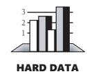
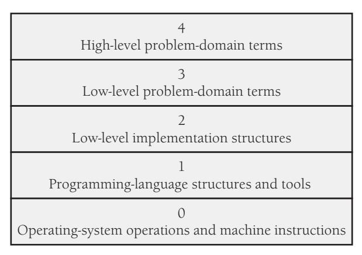
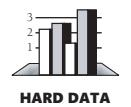

# Chapter 34: Themes in Software Craftsmanship

### cc2e.com/3444 Contents

- 34.1 Conquer Complexity: page 837
- 34.2 Pick Your Process: page 839
- 34.3 Write Programs for People First, Computers Second: page 841
- 34.4 Program into Your Language, Not in It: page 843
- 34.5 Focus Your Attention with the Help of Conventions: page 844
- 34.6 Program in Terms of the Problem Domain: page 845
- 34.7 Watch for Falling Rocks: page 848
- 34.8 Iterate, Repeatedly, Again and Again: page 850
- 34.9 Thou Shalt Rend Software and Religion Asunder: page 851

#### Related Topics

■ The whole book

This book is mostly about the details of software construction: high-quality classes, variable names, loops, source-code layout, system integration, and so on. This book has deemphasized abstract topics to emphasize subjects that are more concrete.

Once the earlier parts of the book have put the concrete topics on the table, all you have to do to appreciate the abstract concepts is to pick up the topics from the various chapters and see how they're related. This chapter makes the abstract themes explicit: complexity, abstraction, process, readability, iteration, and so on. These themes account in large part for the difference between hacking and software craftsmanship.

### 34.1 Conquer Complexity

**Cross-Reference** For details on the importance of attitude in conquering complexity, see Section 33.2, "Intelligence and Humility."

The drive to reduce complexity is at the heart of software development, to such a degree that Chapter 5, "Design in Construction," described managing complexity as Software's Primary Technical Imperative. Although it's tempting to try to be a hero and deal with computer-science problems at all levels, no one's brain is really capable of spanning nine orders of magnitude of detail. Computer science and software engineering have developed many intellectual tools for handling such complexity, and discussions of other topics in this book have brushed up against several of them:

- Dividing a system into subsystems at the architecture level so that your brain can focus on a smaller amount of the system at one time.
- Carefully defining class interfaces so that you can ignore the internal workings of the class.
- Preserving the abstraction represented by the class interface so that your brain doesn't have to remember arbitrary details.
- Avoiding global data, because global data vastly increases the percentage of the code you need to juggle in your brain at any one time.
- Avoiding deep inheritance hierarchies because they are intellectually demanding.
- Avoiding deep nesting of loops and conditionals because they can be replaced by simpler control structures that burn up fewer gray cells.
- Avoiding *goto*s because they introduce nonlinearity that has been found to be difficult for most people to follow.
- Carefully defining your approach to error handling rather than using an arbitrary proliferation of different error-handling techniques.
- Being systematic about the use of the built-in exception mechanism, which can become a nonlinear control structure that's about as hard to understand as *goto*s if not used with discipline.
- Not allowing classes to grow into monster classes that amount to whole programs in themselves.
- Keeping routines short.
- Using clear, self-explanatory variable names so that your brain doesn't have to waste cycles remembering details like "*i* stands for the account index, and *j* stands for the customer index, or was it the other way around?"
- Minimizing the number of parameters passed to a routine, or, more important, passing only the parameters needed to preserve the routine interface's abstraction.
- Using conventions to spare your brain the challenge of remembering arbitrary, accidental differences between different sections of code.
- In general, attacking what Chapter 5 describes as "accidental difficulties" wherever possible.

When you put a complicated test into a boolean function and abstract the purpose of the test, you make the code less complex. When you substitute a table lookup for a complicated chain of logic, you do the same thing. When you create a well-defined,

consistent class interface, you eliminate the need to worry about implementation details of the class and you simplify your job overall.

The point of having coding conventions is also mainly to reduce complexity. When you can standardize decisions about formatting, loops, variable names, modeling notations, and so on, you release mental resources that you need to focus on more challenging aspects of the programming problem. One reason coding conventions are so controversial is that choices among the options have some limited aesthetic base but are essentially arbitrary. People have the most heated arguments over their smallest differences. Conventions are the most useful when they spare you the trouble of making and defending arbitrary decisions. They're less valuable when they impose restrictions in more meaningful areas.

Abstraction in its various forms is a particularly powerful tool for managing complexity. Programming has advanced largely through increasing the abstractness of program components. Fred Brooks argues that the biggest single gain ever made in computer science was in the jump from machine language to higher-level languages it freed programmers from worrying about the detailed quirks of individual pieces of hardware and allowed them to focus on programming (Brooks 1995). The idea of routines was another big step, followed by classes and packages.

Naming variables functionally, for the "what" of the problem rather than the "how" of the implementation-level solution, increases the level of abstraction. If you say, "OK, I'm popping the stack and that means that I'm getting the most recent employee," abstraction can save you the mental step "I'm popping the stack." You simply say, "I'm getting the most recent employee." This is a small gain, but when you're trying to reduce a range in complexity of 1 to 109, every step counts. Using named constants rather than literals also increases the level of abstraction. Object-oriented programming provides a level of abstraction that applies to algorithms and data at the same time, a kind of abstraction that functional decomposition alone didn't provide.

In summary, a primary goal of software design and construction is conquering complexity. The motivation behind many programming practices is to reduce a program's complexity, and reducing complexity is arguably the most important key to being an effective programmer.

#### 34.2 Pick Your Process

A second major thread in this book is the idea that the process you use to develop software matters a surprising amount. On a small project, the talents of the individual programmer are the biggest influence on the quality of the software. Part of what makes an individual programmer successful is his or her choice of processes.

On projects with more than one programmer, organizational characteristics make a bigger difference than the skills of the individuals involved do. Even if you have a great team, its collective ability isn't simply the sum of the team members' individual abilities. The way in which people work together determines whether their abilities are added to each other or subtracted from each other. The process the team uses determines whether one person's work supports the work of the rest of the team or undercuts it.

**Cross-Reference** For details on making requirements stable, see Section 3.4, "Requirements Prerequisite." For details on variations in development approaches, see Section 3.2, "Determine the Kind of Software You're Working On."

One example of the way in which process matters is the consequence of not making requirements stable before you begin designing and coding. If you don't know what you're building, you can't very well create a superior design for it. If the requirements and subsequently the design change while the software is under development, the code must change too, which risks degrading the quality of the system.

"Sure," you say, "but in the real world, you never really have stable requirements, so that's a red herring." Again, the process you use determines both how stable your requirements are and how stable they need to be. If you want to build more flexibility into the requirements, you can set up an incremental development approach in which you plan to deliver the software in several increments rather than all at once. This is an attention to process, and it's the process you use that ultimately determines whether your project succeeds or fails. Table 3-1 in Section 3.1 makes it clear that requirements errors are far more costly than construction errors, so focusing on that part of the process also affects cost and schedule.

My message to the serious programmer is: spend a part of your working day examining and refining your own methods. Even though programmers are always struggling to meet some future or past deadline, methodological abstraction is a wise long-term investment. —*Robert W. Floyd*

The same principle of consciously attending to process applies to design. You have to lay a solid foundation before you can begin building on it. If you rush to coding before the foundation is complete, it will be harder to make fundamental changes in the system's architecture. People will have an emotional investment in the design because they will have already written code for it. It's hard to throw away a bad foundation once you've started building a house on it.

The main reason the process matters is that in software, quality must be built in from the first step onward. This flies in the face of the folk wisdom that you can code like hell and then test all the mistakes out of the software. That idea is dead wrong. Testing merely tells you the specific ways in which your software is defective. Testing won't make your program more usable, faster, smaller, more readable, or more extensible.

Premature optimization is another kind of process error. In an effective process, you make coarse adjustments at the beginning and fine adjustments at the end. If you were a sculptor, you'd rough out the general shape before you started polishing individual features. Premature optimization wastes time because you spend time polishing sections of code that don't need to be polished. You might polish sections that are small enough and fast enough as they are, you might polish code that you later throw away, and you might fail to throw away bad code because you've already spent time polishing it. Always be thinking, "Am I doing this in the right order? Would changing the order make a difference?" Consciously follow a good process.

**Cross-Reference** For details on iteration, see Section 34.8, "Iterate, Repeatedly, Again and Again," later in this chapter.

Low-level processes matter, too. If you follow the process of writing pseudocode and then filling in the code around the pseudocode, you reap the benefits of designing from the top down. You're also guaranteed to have comments in the code without having to put them in later.

Observing large processes and small processes means pausing to pay attention to how you create software. It's time well spent. Saying that "code is what matters; you have to focus on how good the code is, not some abstract process" is shortsighted and ignores mountains of experimental and practical evidence to the contrary. Software development is a creative exercise. If you don't understand the creative process, you're not getting the most out of the primary tool you use to create software—your brain. A bad process wastes your brain cycles. A good process leverages them to maximum advantage.

#### 34.3 Write Programs for People First, Computers Second

*your program n. A maze of non sequiturs littered with clever-clever tricks and irrelevant comments. Compare MY PROGRAM.*

*my program n. A gem of algoristic precision, offering the most sublime balance between compact, efficient coding on the one hand and fully commented legibility for posterity on the other. Compare YOUR PROGRAM.*

*—Stan Kelly-Bootle*

Another theme that runs throughout this book is an emphasis on code readability. Communication with other people is the motivation behind the quest for the Holy Grail of self-documenting code.

The computer doesn't care whether your code is readable. It's better at reading binary machine instructions than it is at reading high-level-language statements. You write readable code because it helps other people to read your code. Readability has a positive effect on all these aspects of a program:

- Comprehensibility
- Reviewability
- Error rate
- Debugging
- Modifiability
- Development time—a consequence of all of the above
- External quality—a consequence of all of the above

In the early years of programming, a program was regarded as the private property of the programmer. One would no more think of reading a colleague's program unbidden than of picking up a love letter and reading it. This is essentially what a program was, a love letter from the programmer to the hardware, full of the intimate details known only to partners in an affair. Consequently, programs became larded with the pet names and verbal shorthand so popular with lovers who live in the blissful abstraction that assumes that theirs is the only existence in the universe. Such programs are unintelligible to those outside the partnership. —*Michael Marcotty*

Readable code doesn't take any longer to write than confusing code does, at least not in the long run. It's easier to be sure your code works if you can easily read what you wrote. That should be a sufficient reason to write readable code. But code is also read during reviews. It's read when you or someone else fixes an error. It's read when the code is modified. It's read when someone tries to use part of your code in a similar program.

Making code readable is not an optional part of the development process, and favoring write-time convenience over read-time convenience is a false economy. You should go to the effort of writing good code, which you can do once, rather than the effort of reading bad code, which you'd have to do again and again.

"What if I'm just writing code for myself? Why should I make it readable?" Because a week or two from now you're going to be working on another program and think, "Hey! I already wrote this class last week. I'll just drop in my old tested, debugged code and save some time." If the code isn't readable, good luck!

The idea of writing unreadable code because you're the only person working on a project sets a dangerous precedent. Your mother used to say, "What if your face froze in that expression?" And your dad used to say, "You play how you practice." Habits affect all your work; you can't turn them on and off at will, so be sure that what you're doing is something you want to become a habit. A professional programmer writes readable code, period.

It's also good to recognize that whether a piece of code ever belongs exclusively to you is debatable. Douglas Comer came up with a useful distinction between private and public programs (Comer 1981): "Private programs" are programs for a programmer's own use. They aren't used by others. They aren't modified by others. Others don't even know the programs exist. They are usually trivial, and they are the rare exception. "Public programs" are programs used or modified by someone other than the author.

Standards for public and for private programs can be different. Private programs can be sloppily written and full of limitations without affecting anyone but the author. Public programs must be written more carefully: their limitations should be documented, they should be reliable, and they should be modifiable. Beware of a private program's becoming public, as private programs often do. You need to convert the program to a public program before it goes into general circulation. Part of making a private program public is making it readable.

Even if you think you're the only one who will read your code, in the real world chances are good that someone else will need to modify your code. One study found that 10 generations of maintenance programmers work on an average program before it gets rewritten (Thomas 1984). Maintenance programmers spend 50 to 60 percent of their time trying to understand the code they have to maintain, and they appreciate the time you put into documenting it (Parikh and Zvegintzov 1983).

Earlier chapters in this book examined the techniques that help you achieve readability: good class, routine, and variable names, careful formatting, small routines, hiding complex boolean tests in boolean functions, assigning intermediate results to variables for clarity in complicated calculations, and so on. No individual application of a technique can make the difference between a readable program and an illegible one, but the accumulation of many small readability improvements will be significant.

If you think you don't need to make your code readable because no one else ever looks at it, make sure you're not confusing cause and effect.

#### 34.4 Program into Your Language, Not in It

Don't limit your programming thinking only to the concepts that are supported automatically by your language. The best programmers think of what they want to do, and then they assess how to accomplish their objectives with the programming tools at their disposal.

Should you use a class member routine that's inconsistent with the class's abstraction just because it's more convenient than using one that provides more consistency? You should write code in a way that preserves the abstraction represented by the class's interface as much as possible. You don't need to use global data or *goto*s just because your language supports them. You can choose not to use those hazardous programming capabilities and instead use programming conventions to make up for weaknesses of the language. Programming using the most obvious path amounts to programming *in* a language rather than programming *into* a language; it's the programmer's equivalent of "If Freddie jumped off a bridge, would you jump off a bridge, too?" Think about your technical goals, and then decide how best to accomplish those goals by programming *into* your language.

Your language doesn't support assertions? Write your own *assert()* routine. It might not function exactly the same as a built-in *assert()*, but you can still realize most of *assert()*'s benefits by writing your own routine. Your language doesn't support enumerated types or named constants? That's fine; you can define your own enumerations and named constants with a disciplined use of global variables supported by clear naming conventions.

In extreme cases, especially in new-technology environments, your tools might be so primitive that you're forced to change your desired programming approach significantly. In such cases, you might have to balance your desire to program into the language with the accidental difficulties that are created when the language makes your desired approach too cumbersome. But in such cases, you'll benefit even more from programming conventions that help you steer clear of those environments' most hazardous features. In more typical cases, the gap between what you want to do and what your tools will readily support will require you to make only relatively minor concessions to your environment.

### 34.5 Focus Your Attention with the Help of Conventions

**Cross-Reference** For an analysis of the value of conventions as they apply to program layout, see "How Much Is Good Layout Worth?" and "Objectives of Good Layout" in Section 31.1.

A set of conventions is one of the intellectual tools used to manage complexity. Earlier chapters talk about specific conventions. This section lays out the benefits of conventions with many examples.

Many of the details of programming are somewhat arbitrary. How many spaces do you indent a loop? How do you format a comment? How should you order class routines? Most of the questions like these have several correct answers. The specific way in which such a question is answered is less important than that it be answered consistently each time. Conventions save programmers the trouble of answering the same questions—making the same arbitrary decisions—again and again. On projects with many programmers, using conventions prevents the confusion that results when different programmers make the arbitrary decisions differently.

A convention conveys important information concisely. In naming conventions, a single character can differentiate among local, class, and global variables; capitalization can concisely differentiate among types, named constants, and variables. Indentation conventions can concisely show the logical structure of a program. Alignment conventions can indicate concisely that statements are related.

Conventions protect against known hazards. You can establish conventions to eliminate the use of dangerous practices, to restrict such practices to cases in which they're needed, or to compensate for their known hazards. You could eliminate a dangerous practice, for example, by prohibiting global variables or prohibiting multiple statements on a line. You could compensate for a hazardous practice by requiring parentheses around complicated expressions or requiring pointers to be set to NULL immediately after they're deleted to help prevent dangling pointers.

Conventions add predictability to low-level tasks. Having conventional ways of handling memory requests, error processing, input/output, and class interfaces adds a meaningful structure to your code and makes it easier for another programmer to figure out—as long as the programmer knows your conventions. As mentioned in an earlier chapter, one of the biggest benefits of eliminating global data is that you eliminate potential interactions among different classes and subsystems. A reader knows roughly what to expect from local and class data. But it's hard to tell when changing global data will break some bit of code four subsystems away. Global data increases the reader's uncertainty. With good conventions, you and your readers can take more for granted. The amount of detail that has to be assimilated will be reduced, and that in turn will improve program comprehension.

Conventions can compensate for language weaknesses. In languages that don't support named constants (such as Python, Perl, UNIX shell script, and so on), a convention can differentiate between variables intended to be both read and written and

those that are intended to emulate read-only constants. Conventions for the disciplined use of global data and pointers are other examples of compensating for language weaknesses with conventions.

Programmers on large projects sometimes go overboard with conventions. They establish so many standards and guidelines that remembering them becomes a fulltime job. But programmers on small projects tend to go "underboard," not realizing the full benefits of intelligently conceived conventions. You should understand their real value and take advantage of them; you should use them to provide structure in areas in which structure is needed.

#### 34.6 Program in Terms of the Problem Domain

*Another* specific method of dealing with complexity is to work at the highest possible level of abstraction. One way of working at a high level of abstraction is to work in terms of the programming problem rather than the computer-science solution.

Top-level code shouldn't be filled with details about files and stacks and queues and arrays and characters whose parents couldn't think of better names for them than *i*, *j*, and *k*. Top-level code should describe the problem that's being solved. It should be packed with descriptive class names and routine calls that indicate exactly what the program is doing, not cluttered with details about opening a file as "read only." Toplevel code shouldn't contain clumps of comments that say "*i* is a variable that represents the index of the record from the employee file here, and then a little later it's used to index the client account file there."

That's clumsy programming practice. At the top level of the program, you don't need to know that the employee data comes as records or that it's stored as a file. Information at that level of detail should be hidden. At the highest level, you shouldn't have any idea how the data is stored. Nor do you need to read a comment that explains what *i* means and that it's used for two purposes. You should see different variable names for the two purposes instead, and they should also have distinctive names such as *employeeIndex* and *clientIndex*.

#### Separating a Program into Levels of Abstraction

Obviously, you have to work in implementation-level terms at some level, but you can isolate the part of the program that works in implementation-level terms from the part that works in problem-domain terms. If you're designing a program, consider the levels of abstraction shown in Figure 34-1.

**Figure 34-1** Programs can be divided into levels of abstraction. A good design will allow you to spend much of your time focusing on only the upper layers and ignoring the lower layers.

#### Level 0: Operating-System Operations and Machine Instructions

If you're working in a high-level language, you don't have to worry about the lowest level—your language takes care of it automatically. If you're working in a low-level language, you should try to create higher layers for yourself to work in, even though many programmers don't do that.

#### Level 1: Programming-Language Structures and Tools

Programming-language structures are the language's primitive data types, control structures, and so on. Most common languages also provide additional libraries, access to operating system calls, and so on. Using these structures and tools comes naturally since you can't program without them. Many programmers never work above this level of abstraction, which makes their lives much harder than they need to be.

#### Level 2: Low-Level Implementation Structures

Low-level implementation structures are slightly higher-level structures than those provided by the language itself. They tend to be the operations and data types you learn about in college courses in algorithms and data types: stacks, queues, linked lists, trees, indexed files, sequential files, sort algorithms, search algorithms, and so on. If your program consists entirely of code written at this level, you'll be awash in too much detail to win the battle against complexity.

#### Level 3: Low-Level Problem-Domain Terms

At this level, you have the primitives you need to work in terms of the problem domain. It's a glue layer between the computer-science structures below and the highlevel problem-domain code above. To write code at this level, you need to figure out

the vocabulary of the problem area and create building blocks you can use to work with the problem the program solves. In many applications, this will be the business objects layer or a services layer. Classes at this level provide the vocabulary and the building blocks. The classes might be too primitive to be used to solve the problem directly at this level, but they provide a framework that higher-level classes can use to build a solution to the problem.

#### Level 4: High-Level Problem-Domain Terms

This level provides the abstractive power to work with a problem on its own terms. Your code at this level should be somewhat readable by someone who's not a computer-science whiz, perhaps even by your nontechnical customer. Code at this level won't depend much on the specific features of your programming language because you'll have built your own set of tools to work with the problem. Consequently, at this level your code depends more on the tools you've built for yourself at Level 3 than on the capabilities of the language you're using.

Implementation details should be hidden two layers below this one, in a layer of computer-science structures, so that changes in hardware or the operating system don't affect this layer at all. Embody the user's view of the world in the program at this level because when the program changes, it will change in terms of the user's view. Changes in the problem domain should affect this layer a lot, but they should be easy to accommodate by programming in the problem-domain building blocks from the layer below.

In addition to these conceptual layers, many programmers find it useful to break a program up into other "layers" that cut across the layers described here. For example, the typical three-tier architecture cuts across the levels described here and provides further tools for making the design and code intellectually manageable.

#### Low-Level Techniques for Working in the Problem Domain

Even without a complete, architectural approach to working in the problem area's vocabulary, you can use many of the techniques in this book to work in terms of the real-world problem rather than the computer-science solution:

- Use classes to implement structures that are meaningful in problem-domain terms.
- Hide information about the low-level data types and their implementation details.
- Use named constants to document the meanings of strings and of numeric literals.
- Assign intermediate variables to document the results of intermediate calculations.
- Use boolean functions to clarify complex boolean tests.

#### 34.7 Watch for Falling Rocks

Programming is neither fully an art nor fully a science. As it's typically practiced, it's a "craft" that's somewhere between art and science. At its best, it's an engineering discipline that arises from the synergistic fusion of art and science (McConnell 2004). Whether art, science, craft, or engineering, it still takes plenty of individual judgment to create a working software product. And part of having good judgment in computer programming is being sensitive to a wide array of warning signs, subtle indications of problems in your program. Warning signs in programming alert you to the possibility of problems, but they're usually not as blatant as a road sign that says "Watch for falling rocks."

When you or someone else says "This is really tricky code," that's a warning sign, usually of poor code. "Tricky code" is a code phrase for "bad code." If you think code is tricky, think about rewriting it so that it's not.

A class's having more errors than average is a warning sign. A few error-prone classes tend to be the most expensive part of a program. If you have a class that has had more errors than average, it will probably continue to have more errors than average. Think about rewriting it.

If programming were a science, each warning sign would imply a specific, welldefined corrective action. Because programming is still a craft, however, a warning sign merely points to an issue that you should consider. You can't necessarily rewrite tricky code or improve an error-prone class.

Just as an abnormal number of defects in a class warns you that the class has low quality, an abnormal number of defects in a program implies that your process is defective. A good process wouldn't allow error-prone code to be developed. It would include the checks and balances of architecture followed by architecture reviews, design followed by design reviews, and code followed by code reviews. By the time the code was ready for testing, most errors would have been eliminated. Exceptional performance requires working smart in addition to working hard. Lots of debugging on a project is a warning sign that implies people aren't working smart. Writing a lot of code in a day and then spending two weeks debugging it is not working smart.

You can use design metrics as another kind of warning sign. Most design metrics are heuristics that give an indication of the quality of a design. The fact that a class contains more than seven members doesn't necessarily mean that it's poorly designed, but it's a warning that the class is complicated. Similarly, more than about 10 decision points in a routine, more than three levels of logical nesting, an unusual number of variables, high coupling to other classes, or low class or routine cohesion should raise a warning flag. None of these signs necessarily means that a class is poorly designed, but the presence of any of them should cause you to look at the class skeptically.

Any warning sign should cause you to doubt the quality of your program. As Charles Saunders Peirce says, "Doubt is an uneasy and dissatisfied state from which we struggle to free ourselves and pass into the state of belief." Treat a warning sign as an "irritation of doubt" that prompts you to look for the more satisfied state of belief.

If you find yourself working on repetitious code or making similar modifications in several areas, you should feel "uneasy and dissatisfied," doubting that control has been adequately centralized in classes or routines. If you find it hard to create scaffolding for test cases because you can't use an individual class easily, you should feel the "irritation of doubt" and ask whether the class is coupled too tightly to other classes. If you can't reuse code in other programs because some classes are too interdependent, that's another warning sign that the classes are coupled too tightly.

When you're deep into a program, pay attention to warning signs that indicate that part of the program design isn't defined well enough to code. Difficulties in writing comments, naming variables, and decomposing the problem into cohesive classes with clear interfaces all indicate that you need to think harder about the design before coding. Wishy-washy names and difficulty in describing sections of code in concise comments are other signs of trouble. When the design is clear in your mind, the lowlevel details come easily.

Be sensitive to indications that your program is hard to understand. Any discomfort is a clue. If it's hard for you, it will be even harder for the next programmers. They'll appreciate the extra effort you make to improve it. If you're figuring out code instead of reading it, it's too complicated. If it's hard, it's wrong. Make it simpler.

If you want to take full advantage of warning signs, program in such a way that you create your own warnings. This is useful because even after you know what the signs are, it's surprisingly easy to overlook them. Glenford Myers conducted a study of defect correction in which he found that the single most common cause of not finding errors was simply overlooking them. The errors were visible on test output but not noticed (Myers 1978b).

Make it hard to overlook problems in your program. One example is setting pointers to null after you free them so that they'll cause ugly problems if you mistakenly use one. A freed pointer might point to a valid memory location even after it's been freed. Setting it to null guarantees that it points to an invalid location, making the error harder to overlook.

Compiler warnings are literal warning signs that are often overlooked. If your program generates warnings or errors, fix it so that it doesn't. You don't have much chance of noticing subtle warning signs when you're ignoring those that have "WARNING" printed directly on them.

Why is paying attention to intellectual warning signs especially important in software development? The quality of the thinking that goes into a program largely determines the quality of the program, so paying attention to warnings about the quality of thinking directly affects the final product.

#### 34.8 Iterate, Repeatedly, Again and Again

Iteration is appropriate for many software-development activities. During your initial specification of a system, you work with the user through several versions of requirements until you're sure you agree on them. That's an iterative process. When you build flexibility into your process by building and delivering a system in several increments, that's an iterative process. If you use prototyping to develop several alternative solutions quickly and cheaply before crafting the final product, that's another form of iteration. Iterating on requirements is perhaps as important as any other aspect of the software-development process. Projects fail because they commit themselves to a solution before exploring alternatives. Iteration provides a way to learn about a product before you build it.

As Chapter 28, "Managing Construction," points out, schedule estimates during initial project planning can vary greatly depending on the estimation technique you use. Using an iterative approach for estimation produces a more accurate estimate than relying on a single technique.

Software design is a heuristic process and, like all heuristic processes, is subject to iterative revision and improvement. Software tends to be validated rather than proven, which means that it's tested and developed iteratively until it answers questions correctly. Both high-level and low-level design attempts should be repeated. A first attempt might produce a solution that works, but it's unlikely to produce the best solution. Taking several repeated and different approaches produces insight into the problem that's unlikely with a single approach.

The idea of iteration appears again in code tuning. Once the software is operational, you can rewrite small parts of it to greatly improve overall system performance. Many of the attempts at optimization, however, hurt the code more than they help it. It's not an intuitive process, and some techniques that seem likely to make a system smaller and faster actually make it larger and slower. The uncertainty about the effect of any optimization technique creates a need for tuning, measuring, and tuning again. If a bottleneck is critical to system performance, you can tune the code several times, and several of your later attempts may be more successful than your first.

Reviews cut across the grain of the development process, inserting iterations at any stage in which they're conducted. The purpose of a review is to check the quality of the work at a particular point. If the product fails the review, it's sent back for rework. If it succeeds, it doesn't need further iteration.

One definition of engineering is to do for a dime what anyone can do for a dollar. Iterating in the late stages is doing for two dollars what anyone can do for one dollar. Fred Brooks suggested that you "build one to throw away; you will, anyhow" (Brooks 1995). The trick of software engineering is to build the disposable parts as quickly and inexpensively as possible, which is the point of iterating in the early stages.

#### 34.9 Thou Shalt Rend Software and Religion Asunder

Religion appears in software development in numerous incarnations—as dogmatic adherence to a single design method, as unswerving belief in a specific formatting or commenting style, or as a zealous avoidance of global data. Whatever the case, it's always inappropriate.

#### Software Oracles

**Cross-Reference** For details on handling programming religion as a manager, see "Religious Issues" in Section 28.5.

Unfortunately, the zealous attitude is decreed from on high by some of the more prominent people in the profession. It's important to publicize innovations so that practitioners can try out promising new methods. Methods have to be tried before they can be fully proven or disproved. The dissemination of research results to practitioners is called "technology transfer" and is important for advancing the state of the practice of software development. There's a difference, however, between disseminating a new methodology and selling software snake oil. The idea of technology transfer is poorly served by dogmatic methodology peddlers who try to convince you that their new one-size-fits-all, high-tech cow pies will solve all your problems. Forget everything you've already learned because this new method is so great it will improve your productivity 100 percent in everything!

Rather than latching on to the latest miracle fad, use a mixture of methods. Experiment with the exciting, recent methods, but bank on the old and dependable ones.

#### Eclecticism

**Cross-Reference** For more on the difference between algorithmic and heuristic approaches, see Section 2.2, "How to Use Software Metaphors." For information on eclecticism in design, see "Iterate" in Section 5.4.

Blind faith in one method precludes the selectivity you need if you're to find the most effective solutions to programming problems. If software development were a deterministic, algorithmic process, you could follow a rigid methodology to your solution. But software development isn't a deterministic process; it's heuristic, which means that rigid processes are inappropriate and have little hope of success. In design, for example, sometimes top-down decomposition works well. Sometimes an object-oriented approach, a bottom-up composition, or a data-structure approach works better. You have to be willing to try several approaches, knowing that some will fail and some will succeed but not knowing which ones will work until after you try them. You have to be eclectic.

Adherence to a single method is also harmful in that it makes you force-fit the problem to the solution. If you decide on the solution method before you fully understand the problem, you act prematurely. Over-constrain the set of possible solutions, and you might rule out the most effective solution.

You'll be uncomfortable with any new methodology initially, and the advice that you avoid religion in programming isn't meant to suggest that you should stop using a new method as soon as you have a little trouble solving a problem with it. Give the new method a fair shake, but give the old methods their fair shakes, too.

**Cross-Reference** For a more detailed description of the toolbox metaphor, see "Applying Software Techniques: The Intellectual Toolbox" in Section 2.3.

Eclecticism is a useful attitude to bring to the techniques presented in this book as much as to techniques described in other sources. Discussions of several topics presented here have advanced alternative approaches that you can't use at the same time. You have to choose one or the other for each specific problem. You have to treat the techniques as tools in a toolbox and use your own judgment to select the best tool for the job. Most of the time, the tool choice doesn't matter very much. You can use a box wrench, vise-grip pliers, or a crescent wrench. In some cases, however, the tool selection matters a lot, so you should always make your selection carefully. Engineering is in part a discipline of making tradeoffs among competing techniques. You can't make a tradeoff if you've prematurely limited your choices to a single tool.

The toolbox metaphor is useful because it makes the abstract idea of eclecticism concrete. Suppose you were a general contractor and your buddy Simple Simon always used vise-grip pliers. Suppose he refused to use a box wrench or a crescent wrench. You'd probably think he was odd because he wouldn't use all the tools at his disposal. The same is true in software development. At a high level, you have alternative design methods. At a more detailed level, you can choose one of several data types to represent any given design. At an even more detailed level, you can choose several different schemes for formatting and commenting code, naming variables, defining class interfaces, and passing routine parameters.

A dogmatic stance conflicts with the eclectic toolbox approach to software construction. It's incompatible with the attitude needed to build high-quality software.

#### Experimentation

Eclecticism has a close relative in experimentation. You need to experiment throughout the development process, but zealous inflexibility hobbles the impulse. To experiment effectively, you must be willing to change your beliefs based on the results of the experiment. If you're not willing, experimentation is a gratuitous waste of time.

Many of the inflexible approaches to software development are based on a fear of making mistakes. A blanket attempt to avoid mistakes is the biggest mistake of all. Design is a process of carefully planning small mistakes in order to avoid making big ones. Experimentation in software development is a process of setting up tests so that you learn whether an approach fails or succeeds—the experiment itself is a success as long as it resolves the issue.

Experimentation is appropriate at as many levels as eclecticism is. At each level at which you are ready to make an eclectic choice, you can probably come up with a corresponding experiment to determine which approach works best. At the architecturaldesign level, an experiment might consist of sketching software architectures using three different design approaches. At the detailed-design level, an experiment might consist of following the implications of a higher-level architecture using three different low-level design approaches. At the programming-language level, an experiment might consist of writing a short experimental program to exercise the operation of a part of the language you're not completely familiar with. The experiment might consist of tuning a piece of code and benchmarking it to verify that it's really smaller or faster. At the overall software-development-process level, an experiment might consist of collecting quality and productivity data so that you can see whether inspections really find more errors than walk-throughs.

The point is that you have to keep an open mind about all aspects of software development. You have to get technical about your process as well as your product. Openminded experimentation and religious adherence to a predefined approach don't mix.

### Key Points

- One primary goal of programming is managing complexity.
- The programming process significantly affects the final product.
- Team programming is more an exercise in communicating with people than in communicating with a computer. Individual programming is more an exercise in communicating with yourself than with a computer.
- When abused, a programming convention can be a cure that's worse than the disease. Used thoughtfully, a convention adds valuable structure to the development environment and helps with managing complexity and communication.
- Programming in terms of the problem rather than the solution helps to manage complexity.
- Paying attention to intellectual warning signs like the "irritation of doubt" is especially important in programming because programming is almost purely a mental activity.
- The more you iterate in each development activity, the better the product of that activity will be.
- Dogmatic methodologies and high-quality software development don't mix. Fill your intellectual toolbox with programming alternatives, and improve your skill at choosing the right tool for the job.
