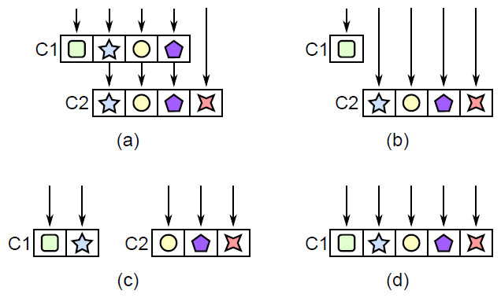
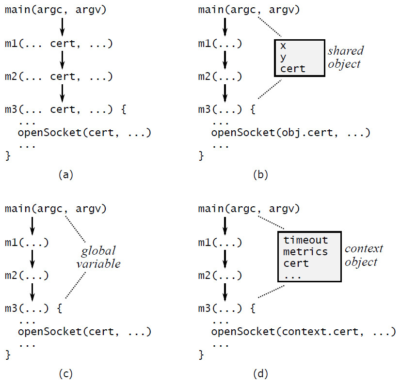

# 7: Different Layer, Different Abstraction

Chapter 7

Different Layer, Different Abstraction

Software systems are composed in layers, where higher layers use the facilities provided by lower layers. In a well-designed system, each layer provides a different abstraction from the layers above and below it; if you follow a single operation as it moves up and down through layers by invoking methods, the abstractions change with each method call. For example:

- In a file system, the uppermost layer implements a file abstraction. A file consists of a variable-length array of bytes, which can be updated by reading and writing variable-length byte ranges. The next lower layer in the file system implements a cache in memory of fixed-size disk blocks; callers can assume that frequently used blocks will stay in memory where they can be accessed quickly. The lowest layer consists of device drivers, which move blocks between secondary storage devices and memory.

- In a network transport protocol such as TCP, the abstraction provided by the topmost layer is a stream of bytes delivered reliably from one machine to another. This level is built on a lower level that transmits packets of bounded size between machines on a best-effort basis: most packets will be delivered successfully, but some packets may be lost or delivered out of order.

If a system contains adjacent layers with similar abstractions, this is a red flag that suggests a problem with the class decomposition. This chapter discusses situations where this happens, the problems that result, and how to refactor to eliminate the problems.

7.1  Pass-through methods

When adjacent layers have similar abstractions, the problem often manifests itself in the form of pass-through methods. A pass-through method is one that does little except invoke another method, whose signature is similar or identical to that of the calling method. For example, a student project implementing a GUI text editor contained a class consisting almost entirely of pass-through methods. Here is an extract from that class:

public class TextDocument ... {

private TextArea textArea;

private TextDocumentListener listener;

...

public Character getLastTypedCharacter() {

return textArea.getLastTypedCharacter();

}

public int getCursorOffset() {

return textArea.getCursorOffset();

}

public void insertString(String textToInsert,

int offset) {

textArea.insertString(textToInsert, offset);

}

public void willInsertString(String stringToInsert,

int offset) {

if (listener != null) {

listener.willInsertString(this, stringToInsert, offset);

}

}

...

}

  Red Flag: Pass-Through Method  

A pass-through method is one that does nothing except pass its arguments to another method, usually with the same API as the pass-through method. This typically indicates that there is not a clean division of responsibility between the classes.

13 of the 15 public methods in that class were pass-through methods.

Pass-through methods make classes shallower: they increase the interface complexity of the class, which adds complexity, but they don’t increase the total functionality of the system. Of the four methods above, only the last one has any functionality, and even there it is trivial: the method checks the validity of one variable. Pass-through methods also create dependencies between classes: if the signature changes for the insertString method in TextArea, then the insertString method in TextDocument will have to change to match.

Pass-through methods indicate that there is confusion over the division of responsibility between classes. In the example above, the TextDocument class offers an insertString method, but the functionality for inserting text is implemented entirely in TextArea. This is usually a bad idea: the interface to a piece of functionality should be in the same class that implements the functionality. When you see pass-through methods from one class to another, consider the two classes and ask yourself “Exactly which features and abstractions is each of these classes responsible for?” You will probably notice that there is an overlap in responsibility between the classes.

The solution is to refactor the classes so that each class has a distinct and coherent set of responsibilities. [Figure 7.1](#part0011.xhtml) illustrates several ways to do this. One approach, shown in [Figure 7.1(b)](#part0011.xhtml), is to expose the lower level class directly to the callers of the higher level class, removing all responsibility for the feature from the higher level class. Another approach is to redistribute the functionality between the classes, as in [Figure 7.1(c)](#part0011.xhtml). Finally, if the classes can’t be disentangled, the best solution may be to merge them as in [Figure 7.1(d)](#part0011.xhtml).

In the example above, there were three classes with intertwined responsibilities: TextDocument, TextArea, and TextDocumentListener. The student eliminated the pass-through methods by moving methods between classes and collapsing the three classes into just two, whose responsibilities were more clearly differentiated.

7.2  When is interface duplication OK?

Having methods with the same signature is not always bad. The important thing is that each new method should contribute significant functionality. Pass-through methods are bad because they contribute no new functionality.

One example where it’s useful for a method to call another method with the same signature is a dispatcher. A dispatcher is a method that uses its arguments to select one of several other methods to invoke; then it passes most or all of its arguments to the chosen method. The signature for the dispatcher is often the same as the signature for the methods that it calls. Even so, the dispatcher provides useful functionality: it chooses which of several other methods should carry out each task.

Figure 7.1: Pass-through methods. In (a), class C1 contains three pass-through methods, which do nothing but invoke methods with the same signature in C2 (each symbol represents a particular method signature). The pass-through methods can be eliminated by having C1’s callers invoke C2 directly as in (b), by redistributing functionality between C1 and C2 to avoid calls between the classes as in (c), or by combining the classes as in (d).

For example, when a Web server receives an incoming HTTP request from a Web browser, it invokes a dispatcher that examines the URL in the incoming request and selects a specific method to handle the request. Some URLs might be handled by returning the contents of a file on disk; others might be handled by invoking a procedure in a language such as PHP or JavaScript. The dispatch process can be quite intricate, and is usually driven by a set of rules that are matched against the incoming URL.

It is fine for several methods to have the same signature as long as each of them provides useful and distinct functionality. The methods invoked by a dispatcher have this property. Another example is interfaces with multiple implementations, such as disk drivers in an operating system. Each driver provides support for a different kind of disk, but they all have the same interface. When several methods provide different implementations of the same interface, it reduces cognitive load. Once you have worked with one of these methods, it’s easier to work with the others, since you don’t need to learn a new interface. Methods like this are usually in the same layer and they don’t invoke each other.

7.3  Decorators

The decorator design pattern (also known as a “wrapper”) is one that encourages API duplication across layers. A decorator object takes an existing object and extends its functionality; it provides an API similar or identical to the underlying object, and its methods invoke the methods of the underlying object. In the Java I/O example from [Chapter 4](009-4-modules-should-be-deep.md#part0008.xhtml), the BufferedInputStream class is a decorator: given an InputStream object, it provides the same API but introduces buffering. For example, when its read method is invoked to read a single character, it invokes read on the underlying InputStream to read a much larger block, and saves the extra characters to satisfy future read calls. Another example occurs in windowing systems: a Window class implements a simple form of window that is not scrollable, and a ScrollableWindow class decorates the Window class by adding horizontal and vertical scrollbars.

The motivation for decorators is to separate special-purpose extensions of a class from a more generic core. However, decorator classes tend to be shallow: they introduce a large amount of boilerplate for a small amount of new functionality. Decorator classes often contain many pass-through methods. It’s easy to overuse the decorator pattern, creating a new class for every small new feature. This results in an explosion of shallow classes, such as the Java I/O example.

Before creating a decorator class, consider alternatives such as the following:

- Could you add the new functionality directly to the underlying class, rather than creating a decorator class? This makes sense if the new functionality is relatively general-purpose, or if it is logically related to the underlying class, or if most uses of the underlying class will also use the new functionality. For example, virtually everyone who creates a Java InputStream will also create a BufferedInputStream, and buffering is a natural part of I/O, so these classes should have been combined.

- If the new functionality is specialized for a particular use case, would it make sense to merge it with the use case, rather than creating a separate class?

- Could you merge the new functionality with an existing decorator, rather than creating a new decorator? This would result in a single deeper decorator class rather than multiple shallow ones.

- Finally, ask yourself whether the new functionality really needs to wrap the existing functionality: could you implement it as a stand-alone class that is independent of the base class? In the windowing example, the scrollbars could probably be implemented separately from the main window, without wrapping all of its existing functionality.

There are occasionally situations where wrappers make sense. One example is when a system uses an external class whose interface cannot be modified, but the class must conform to a different interface in the application where it is being used. In this case, a wrapper class can be used to translate between the interfaces. However, situations like this are rare; there is usually a better alternative than using a wrapper class.

7.4  Interface versus implementation

Another application of the “different layer, different abstraction” rule is that the interface of a class should normally be different from its implementation: the representations used internally should be different from the abstractions that appear in the interface. If the two have similar abstractions, then the class probably isn’t very deep. For example, in the text editor project discussed in [Chapter 6](011-6-general-purpose-modules-are-deeper.md#part0010.xhtml), most of the teams implemented the text module in terms of lines of text, with each line stored separately. Some of the teams also designed the APIs for the text class around lines, with methods such as getLine and putLine. However, this made the text class shallow and awkward to use. In the higher-level user interface code, it’s common to insert text in the middle of a line (e.g., when the user is typing) or to delete a range of text that spans lines. With a line-oriented API for the text class, callers were forced to split and join lines to implement the user-interface operations. This code was nontrivial and it was duplicated and scattered across the implementation of the user interface.

The text classes were much easier to use when they provided a character-oriented interface, such as an insert method that inserts an arbitrary string of text (which may include newlines) at an arbitrary position in the text and a delete method that deletes the text between two arbitrary positions in the text. Internally, the text was still represented in terms of lines. A character-oriented interface encapsulates the complexity of line splitting and joining inside the text class, which makes the text class deeper and simplifies higher level code that uses the class. With this approach, the text API is quite different from the line-oriented storage mechanism; the difference represents valuable functionality provided by the class.

7.5  Pass-through variables

Another form of API duplication across layers is a pass-through variable, which is a variable that is passed down through a long chain of methods. [Figure 7.2(a)](#part0011.xhtml) shows an example from a datacenter service. A command-line argument describes certificates to use for secure communication. This information is only needed by a low-level method m3, which calls a library method to open a socket, but it is passed down through all the methods on the path between main and m3. The cert variable appears in the signature of each of the intermediate methods.

Pass-through variables add complexity because they force all of the intermediate methods to be aware of their existence, even though the methods have no use for the variables. Furthermore, if a new variable comes into existence (for example, a system is initially built without support for certificates, but you later decide to add that support), you may have to modify a large number of interfaces and methods to pass the variable through all of the relevant paths.

Eliminating pass-through variables can be challenging. One approach is to see if there is already an object shared between the topmost and bottommost methods. In the datacenter service example of [Figure 7.2](#part0011.xhtml), perhaps there is an object containing other information about network communication, which is available to both main and m3. If so, main can store the certificate information in that object, so it needn’t be passed through all of the intervening methods on the path to m3 (see [Figure 7.2(b)](#part0011.xhtml)). However, if there is such an object, then it may itself be a pass-through variable (how else does m3 get access to it?).

Another approach is to store the information in a global variable, as in [Figure 7.2(c)](#part0011.xhtml). This avoids the need to pass the information from method to method, but global variables almost always create other problems. For example, global variables make it impossible to create two independent instances of the same system in the same process, since accesses to the global variables will conflict. It may seem unlikely that you would need multiple instances in production, but they are often useful in testing.

The solution I use most often is to introduce a context object as in [Figure 7.2(d)](#part0011.xhtml). A context stores all of the application’s global state (anything that would otherwise be a pass-through variable or global variable). Most applications have multiple variables in their global state, representing things such as configuration options, shared subsystems, and performance counters. There is one context object per instance of the system. The context allows multiple instances of the system to coexist in a single process, each with its own context.

Figure 7.2: Possible techniques for dealing with a pass-through variable. In (a), cert is passed through methods m1 and m2 even though they don’t use it. In (b), main and m3 have shared access to an object, so the variable can be stored there instead of passing it through m1 and m2. In (c), cert is stored as a global variable. In (d), cert is stored in a context object along with other system-wide information, such as a timeout value and performance counters; a reference to the context is stored in all objects whose methods need access to it.

Unfortunately, the context will probably be needed in many places, so it can potentially become a pass-through variable. To reduce the number of methods that must be aware of it, a reference to the context can be saved in most of the system’s major objects. In the example of [Figure 7.2(d)](#part0011.xhtml), the class containing m3 stores a reference to the context as an instance variable in its objects. When a new object is created, the creating method retrieves the context reference from its object and passes it to the constructor for the new object. With this approach, the context is available everywhere, but it only appears as an explicit argument in constructors.

The context object unifies the handling of all system-global information and eliminates the need for pass-through variables. If a new variable needs to be added, it can be added to the context object; no existing code is affected except for the constructor and destructor for the context. The context makes it easy to identify and manage the global state of the system, since it is all stored in one place. The context is also convenient for testing: test code can change the global configuration of the application by modifying fields in the context. It would be much more difficult to implement such changes if the system used pass-through variables.

Contexts are far from an ideal solution. The variables stored in a context have most of the disadvantages of global variables; for example, it may not be obvious why a particular variable is present, or where it is used. Without discipline, a context can turn into a huge grab-bag of data that creates nonobvious dependencies throughout the system. Contexts may also create thread-safety issues; the best way to avoid problems is for variables in a context to be immutable. Unfortunately, I haven’t found a better solution than contexts.

7.6  Conclusion

Each piece of design infrastructure added to a system, such as an interface, argument, function, class, or definition, adds complexity, since developers must learn about this element. In order for an element to provide a net gain against complexity, it must eliminate some complexity that would be present in the absence of the design element. Otherwise, you are better off implementing the system without that particular element. For example, a class can reduce complexity by encapsulating functionality so that users of the class needn’t be aware of it.

The “different layer, different abstraction” rule is just an application of this idea: if different layers have the same abstraction, such as pass-through methods or decorators, then there’s a good chance that they haven’t provided enough benefit to compensate for the additional infrastructure they represent. Similarly, pass-through arguments require each of several methods to be aware of their existence (which adds to complexity) without contributing additional functionality.
