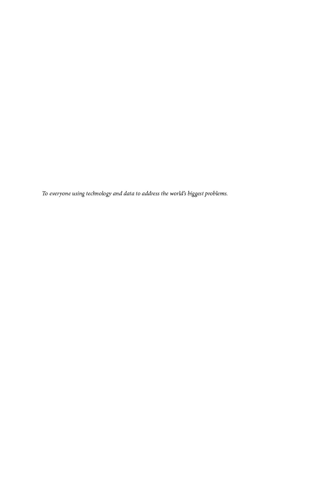

O'REILLY'

# 2nd Edition

## Designing Data-Intensive Applications

The Big Ideas Behind Reliable, Scalable, and Maintainable Systems

"For the last decade, this has been the best book for understanding distributed systems, and the second edition makes it even better. It bridges the huge gap between distributed systems theory and practical engineering. I wish it had existed earlier so I could have saved myself a lot of mistakes."

 $\textbf{\textit{Jay Kreps},} \ creator of \ \textbf{\textit{A}pache Kafka} \ and \ cofounder \ of \ \textbf{\textit{Confluent}}$ 

"This book should be required reading for software engineers. *Designing Data-Intensive Applications* is a rare resource that connects theory and practice to help developers make smart decisions as they design and implement data infrastructure and systems."

Kevin Scott, Chief Technology Officer at Microsoft

## Designing Data-Intensive Applications

Data is at the center of many challenges in system design today. Difficult issues such as scalability, consistency, reliability, efficiency, and maintainability need to be resolved. In addition, there's an overwhelming variety of systems, including relational databases, NoSQL datastores, data warehouses, and data lakes. There are cloud services, on-premises services, and embedded databases. What are the right choices for your application? How do you make sense of all these buzzwords?

In this second edition, authors Martin Kleppmann and Chris Riccomini build on the foundation laid in the acclaimed first edition, integrating new technologies and emerging trends. You'll be guided through the maze of decisions and trade-offs involved in building a modern data system, learn how to choose the right tools for your needs, and understand the fundamentals of distributed systems.

- Peer under the hood of the systems you already use, and learn to use them more effectively
- Make informed decisions by identifying the strengths and weaknesses of different tools
- Learn how major cloud services are designed for scalability, fault tolerance, and consistency
- Understand the core principles upon which modern databases are built

Martin Kleppmann is an associate professor of distributed systems at the University of Cambridge. Previously he was a startup founder and a software engineer at LinkedIn, working on large-scale data systems.

**Chris Riccomini** is a software engineer, startup investor, and author. He cocreated Apache Samza and SlateDB, coauthored *The Missing README*, and runs Materialized View Capital.

DATA

US \$69.99 CAN \$87.99 ISBN: 978-1-098-11906-5

## Praise for Designing Data-Intensive Applications

Designing Data-Intensive Applications has become the Bible of distributed systems—
almost every serious practitioner I know owns a copy.

—Will Wilson, CEO at Antithesis

Mastering trade-offs is essential to solving real-world problems with distributed data systems. *Designing Data-Intensive Applications* explores them like none other, providing an unbiased view of how different systems have made these choices over time.

— Veena Basavaraj, head of application platform engineering at Benchling

An essential guide for distributed systems engineers—thorough and insightful for both beginners and experts.

-Zhengliang "Zane" Zhu, distributed systems engineer, Netflix

This book is a gateway to distributed systems. It's the best-in-class book for getting up to speed on concepts every systems engineer should know.

—Alex Petrov, author of Database Internals, Apache Cassandra committer, and PMC member For the last decade, this has been the best book for understanding distributed systems, and the second edition makes it even better. It bridges the huge gap between distributed systems theory and practical engineering. I wish it had existed when I started working on distributed systems so I could have read it then and saved myself a lot of mistakes.

—Jay Kreps, creator of Apache Kafka and cofounder of Confluent

This book should be required reading for software engineers. *Designing Data-Intensive Applications* is a rare resource that connects theory and practice to help developers make smart decisions as they design and implement data infrastructure and systems.

-Kevin Scott, Chief Technology Officer at Microsoft

SECOND EDITION

## Designing Data-Intensive Applications

The Big Ideas Behind Reliable, Scalable, and Maintainable Systems

Martin Kleppmann and Chris Riccomini

## Designing Data-Intensive Applications

by Martin Kleppmann and Chris Riccomini

Copyright © 2026 Martin Kleppmann and Chris Riccomini. All rights reserved.

Published by O'Reilly Media, Inc., 141 Stony Circle, Suite 195, Santa Rosa, CA 95401.

O'Reilly books may be purchased for educational, business, or sales promotional use. Online editions are also available for most titles (<a href="https://oreilly.com">https://oreilly.com</a>). For more information, contact our corporate/institutional sales department: 800-998-9938 or corporate@oreilly.com.

Acquisitions Editor: Aaron Black
Development Editor: Melissa Potter
Production Editor: Katherine Tozer
Copyeditor: Rachel Wheeler
Proofreader: Sharon Wilkey

Indexer: Potomac Indexing, LLC Cover Designer: Susan Brown Cover Illustrator: Monica Kamsvaag Interior Designer: David Futato Interior Illustrator: Kate Dullea

March 2017: First Edition February 2026: Second Edition

## Revision History for the Second Edition

2026-02-18: First Release

See https://oreilly.com/catalog/errata.csp?isbn=9781098119065 for release details.

The O'Reilly logo is a registered trademark of O'Reilly Media, Inc. *Designing Data-Intensive Applications*, the cover image, and related trade dress are trademarks of O'Reilly Media, Inc.

The views expressed in this work are those of the authors and do not represent the publisher's views. While the publisher and the authors have used good faith efforts to ensure that the information and instructions contained in this work are accurate, the publisher and the authors disclaim all responsibility for errors or omissions, including without limitation responsibility for damages resulting from the use of or reliance on this work. Use of the information and instructions contained in this work is at your own risk. If any code samples or other technology this work contains or describes is subject to open source licenses or the intellectual property rights of others, it is your responsibility to ensure that your use thereof complies with such licenses and/or rights.

Computing is pop culture. [...] Pop culture holds a disdain for history. Pop culture is all about identity and feeling like you're participating. It has nothing to do with cooperation, the past or the future—it's living in the present. I think the same is true of most people who write code for money. They have no idea where [their culture came from].

—Alan Kay, in interview with Dr. Dobb's Journal (2012)
