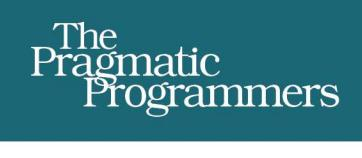
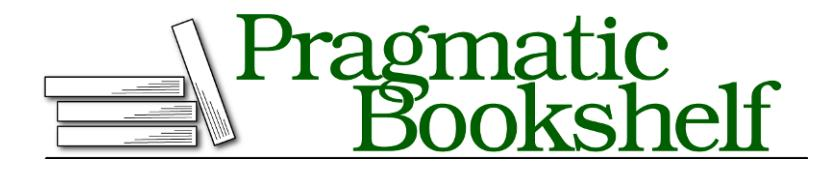

# Software Design X-Rays

Fix Technical Debt with Behavioral Code Analysis

## Early praise for Software Design X-Rays

Adam has made one of the most significant contributions to software engineering over the past years. Listen and ye shall learn.

### ➤ John Lewis

Consultant and Troubleshooter

Adam successfully teaches me *why* things are the way I have learned that they are during my 30 years in the software-development world. As if that wasn't enough, he also teaches me a whole slew of things I didn't know about! This is a must-read!

#### ➤ Jimmy Nilsson

Author of *Applying Domain-Driven Design and Patterns*

I felt my brain was exploding with ideas and *aha*s all the way through my reading.

#### ➤ Giovanni Asproni

Principal Consultant

Adam encapsulates the challenges of a technical lead for a product in a large shared codebase. His social code-analysis techniques turn a dry static codebase into a living, breathing ecosystem and chart its interactions over its lifetime, helping you to identify those areas worth refactoring.

#### ➤ Ivan Houston

Principal Software Engineer

Adam takes you behind the scenes of pragmatic software analysis. He's bridging the gap between algorithms for mining software repositories and performing refactorings based on the gained insights. Definitely the right way to go in our industry!

#### ➤ Markus Harrer

Software Development Analyst

Software systems age and erode like any other human-made structure. *Software Design X-Rays* provides immediately useable tools and approaches to spot the parts in most dire need of improvement and helps you manage your technical debt. Adam does a great job at explaining that this seemingly complex analysis is actually not that hard and that you can do it right now.

#### ➤ Michael Hunger

Head of Developer Relations Engineering, Neo4j

This book offers plenty of valuable psychological insights that are likely to surprise developers and managers alike. Tornhill's ability to apply heuristics like the "concept of surprise" to complex code systems reinforces the human element of software development and connects code to emotion.

#### ➤ Lauri Apple

Open Source Evangelist and Agile Coach, Zalando

An invaluable set of techniques to get a better understanding of your code, your team and your company.

#### ➤ Vicenç García Altés

IT Consultant, Craft Foster Ltd.

## Software Design X-Rays

Fix Technical Debt with Behavioral Code Analysis

Adam Tornhill

Many of the designations used by manufacturers and sellers to distinguish their products are claimed as trademarks. Where those designations appear in this book, and The Pragmatic Programmers, LLC was aware of a trademark claim, the designations have been printed in initial capital letters or in all capitals. The Pragmatic Starter Kit, The Pragmatic Programmer, Pragmatic Programming, Pragmatic Bookshelf, PragProg and the linking *g* device are trademarks of The Pragmatic Programmers, LLC.

Every precaution was taken in the preparation of this book. However, the publisher assumes no responsibility for errors or omissions, or for damages that may result from the use of information (including program listings) contained herein.

Our Pragmatic books, screencasts, and audio books can help you and your team create better software and have more fun. Visit us at <https://pragprog.com>.

The team that produced this book includes:

Publisher: Andy Hunt

VP of Operations: Janet Furlow Managing Editor: Brian MacDonald Supervising Editor: Jacquelyn Carter Development Editor: Adaobi Obi Tulton Copy Editor: Candace Cunningham Indexing: Potomac Indexing, LLC

Layout: Gilson Graphics

For sales, volume licensing, and support, please contact <support@pragprog.com>.

For international rights, please contact <rights@pragprog.com>.

Copyright © 2018 The Pragmatic Programmers, LLC. All rights reserved.

No part of this publication may be reproduced, stored in a retrieval system, or transmitted, in any form, or by any means, electronic, mechanical, photocopying, recording, or otherwise, without the prior consent of the publisher.

Printed in the United States of America. ISBN-13: 978-1-68050-272-5 Encoded using the finest acid-free high-entropy binary digits. Book version: P1.0—March 2018
