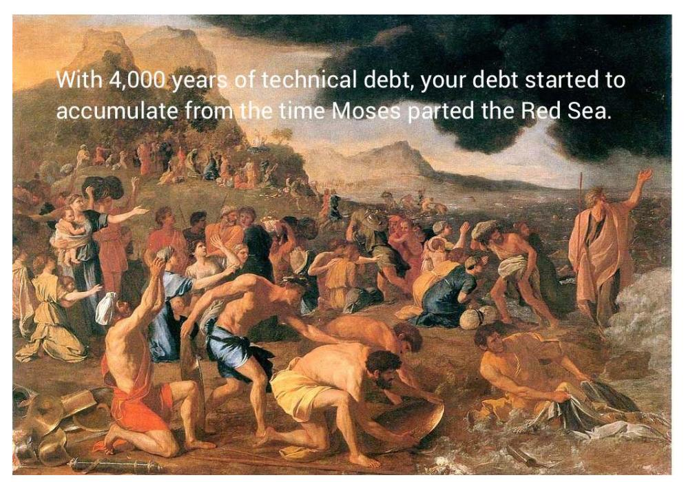
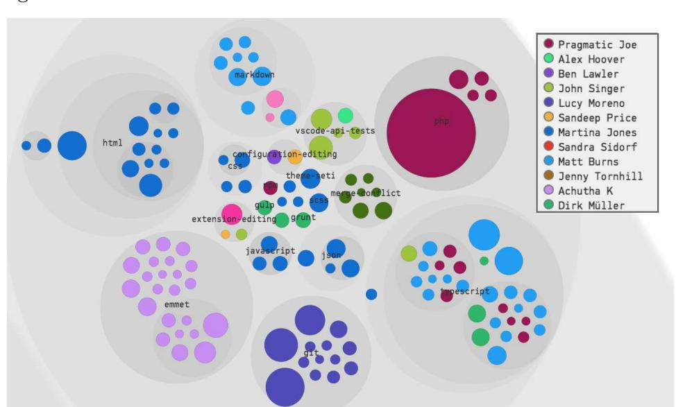
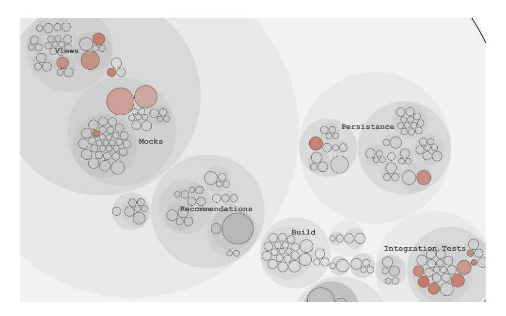

# Chapter 1: Why Technical Debt Isn't Technical

<span id="page-17-4"></span>Most organizations find it hard to prioritize and repay their technical debt because of the scale of their systems, with millions of lines of code and multiple development teams. In that context, no one has a holistic overview. So what if we could mine the collective intelligence of all contributing programmers and make decisions based on data from how the organization actually works with the code?

<span id="page-17-1"></span>In this chapter you'll learn one such approach with the potential to change how we view software systems. This chapter gives you the foundation for the rest of the book as you see how behavioral code analysis fills an important gap in our ability to reason about systems. Let's jump right in and see what it's all about.

<span id="page-17-3"></span>
## Questioning Technical Debt

<span id="page-17-2"></span>*Technical debt* is a metaphor that lets developers explain the need for refactorings and communicate technical trade-offs to business people.<sup>1</sup> When we take on technical debt we choose to release our software faster but at the expense of future costs, as technical debt affects our ability to evolve a software system. Just like its financial counterpart, technical debt incurs interest payments.

Technical-debt decisions apply both at the micro level, where we may choose to hack in a new feature with the use of complex conditional logic, and at the macro level when we make architectural trade-offs to get the system through yet another release. In this sense technical debt is a strategic business decision rather than a technical one.

<sup>1.</sup> <http://wiki.c2.com/?WardExplainsDebtMetaphor>

<span id="page-18-4"></span>Recently the technical debt metaphor has been extended to include *reckless debt*. Reckless debt arises when our code violates basic design principles without even a short-term payoff. The amount of reckless debt in our codebase limits our ability to take on intentional debt and thus restricts our future options.<sup>3</sup>

In retrospect it's hard to distinguish between deliberate technical debt and reckless debt. Priorities change, projects rotate staff, and as time passes an organization may no longer possess the knowledge of why a particular decision was made. Yet it's important to uncover the root cause of problematic code since it gives you—as an organization—important feedback. For example, lots of reckless debt indicates the need for training and improved practices.

<span id="page-18-2"></span>That said, this book uses both kinds of debt interchangeably. Sure, technical debt in its original sense is a deliberate trade-off whereas reckless debt doesn't offer any short-term gains. However, the resulting context is the same: we face code that isn't up to par and we need to do something about it. So our definition of technical debt is *code that's more expensive to maintain than it should be*. That is, we pay an interest rate on it.

### Keep a Decision Log

<span id="page-18-3"></span>

<span id="page-18-0"></span>Human memory is fragile and cognitive biases are real, so a project decision log will be a tremendous help in keeping track of your rationale for accepting technical debt. Jotting down decisions on a wiki or shared document helps you maintain knowledge over time.

*Technical debt* is also frequently misused to describe *legacy code*. In fact, the two terms are often used interchangeably to describe code that

- 1. lacks quality, and
- 2. we didn't write ourselves.

<span id="page-18-1"></span>Michael Feathers, in his groundbreaking book *[Working Effectively with Legacy](021-bibliography.md#page-242-0) [Code \[Fea04\]](#page-242-0)*, describes legacy code as code without tests. Technical debt, on the other hand, often occurs in the very test code intended to raise the quality of the overall system! You get plenty of opportunities to see that for yourself in the case studies throughout this book.

In addition, legacy code is an undesirable after-the-fact state, whereas technical debt may be a strategic choice. "Let's design a legacy system," said absolutely no one ever. Fortunately, the practical techniques you'll learn in

<sup>2.</sup> <https://martinfowler.com/bliki/TechnicalDebtQuadrant.html>

<sup>3.</sup> [http://www.construx.com/10x\\_Software\\_Development/Technical\\_Debt/](http://www.construx.com/10x_Software_Development/Technical_Debt/)

this book work equally well to address both legacy code and technical debt. With that distinction covered, let's look into interest rate on code.

<span id="page-19-0"></span>
#### Interest Rate Is a Function of Time

Let's do a small thought experiment. Have a look at the following code snippet. What do you think of the quality of that code? Is it a solution you'd accept in a code review?

```
void displayProgressTask() {
        for (int i = 1; i < 6 ; i++) {
                 switch (i) {
                         case 1:
                                  setMark("<step 1");
                                  updateDisplay();
                                  break;
                         case 2:
                                  setMark("<step 2");
                                  updateDisplay();
                                  break;
                         case 3:
                                  setMark("<step 3");
                                  updateDisplay();
                                  break;
                         case 4:
                                  setMark("<step 4");
                                  updateDisplay();
                                  break;
                         case 5:
                                  setMark("<step 5");
                                  updateDisplay();
                                  break;
                 }
        }
}
```

Of course not! We'd never write code like this ourselves. Never ever. Not only is the code the epitome of repetitive copy-paste; its accidental complexity obscures the method's responsibility. It's simply bad code. But is it a problem? Is it technical debt? Without more context we can't tell. Just because some code is bad doesn't mean it's technical debt. It's not technical debt unless we have to pay interest on it, and *interest rate is a function of time*.

This means we would need a time dimension on top of our code to reason about interest rate. We'd need to know how often we actually have to modify (and read) each piece of code to separate the debt that matters for our ability to maintain the system from code that may be subpar but doesn't impact us much.

You'll soon learn how you get that time dimension of code. Before we go there, let's consider large-scale systems to see why the distinction between actual technical debt and code that's just substandard matters.

<span id="page-20-1"></span>
<span id="page-20-0"></span>
## The Perils of Quantifying Technical Debt

Last year I visited an organization to help prioritize its technical debt. Prior to my arrival the team had evaluated a tool capable of quantifying technical debt. The tool measured a number of attributes such as the ratio of code comments and unit test coverage, and estimated how much effort would be needed to bring the codebase to a perfect score on all these implied quality dimensions. The organization threw this tool at its 15-year-old codebase, and the tool reported that they had accumulated 4,000 years of technical debt!

Of course, those estimated years of technical debt aren't linear (see the following figure), as much debt had been created in parallel by the multitude of programmers working on the code. Those 4,000 years of technical debt may have been an accurate estimate, but that doesn't mean it's particularly useful. Given 4,000 years of technical debt, where do you start if you want to pay it back? Is all debt equally important? And does it really matter if a particular piece of code lacks unit-test coverage or exhibits few code comments?



In fact, if we uncritically start to fix such reported quality issues to achieve a "better" score, we may find that we make the code worse. Even with a more balanced approach there's no way of knowing if the reported issues actually affect our ability to maintain the code. In addition, it's a mistake to quantify technical debt from code alone because much technical debt isn't even technical. Let's explore a common fallacy to see why.

<span id="page-21-2"></span>
### Why We Mistake Organizational Problems for Technical Issues

Have you ever joined a new organization and been told, "Oh, that part of the codebase is really hard to understand"? Or perhaps you notice that some code attracts more bugs than a sugar cube covered with syrup on a sunny road. If that doesn't sound familiar, maybe you've heard, "We have a hard time merging our different branches—we need to buy a better merge tool." While these claims are likely to be correct in principle, the root cause is often social and organizational problems. Let's see why.

Several years ago I joined a project that was late before it even started. Management had tried to compress the original schedule from the estimated one year down to a mere three months. How do you do that? Easy, they thought: just throw four times as many developers on it.

As those three months passed there was, to great dismay, no completion in sight. As I joined I spent my first days talking to the developers and managers, trying to get the big picture. It turned out to be a gloomy one. Defects were detected at a higher rate than they could be fixed. Critical features were still missing. And morale was low since the code was so hard to understand.

<span id="page-21-0"></span>As I dove into the code I was pleasantly surprised. Sure, the code wasn't exactly a work of art. It wasn't beautiful in the sense a painting by Monet is, but the application was by no means particularly hard to understand. I've seen worse. Much worse. So why did the project members struggle with it? To answer that question we need to take a brief detour into the land of cognitive psychology to learn how we build our understanding of code and how organizational factors may hinder it.

<span id="page-21-1"></span>
## Your Mental Models of Code

One of the most challenging aspects of programming is that we need to serve two audiences. The first, the machine that executes our programs, doesn't care much about style but is annoyingly pedantic about content and pretty bad at filling in the gaps. Our second audience, the programmers maintaining our code, has much more elaborate mental processes and needs our guidance to use those processes efficiently. That's why we focus on writing expressive

and well-organized code. After all, that poor maintenance programmer may well be our future self.

<span id="page-22-1"></span>We use the same mental processes to understand code as those we use in everyday life beyond our keyboards (evolution wasn't kind enough to equip our brains with a coding center). As we learn a topic we build mental representations of that domain. Psychologists refer to such mental models as *schemas*. A schema is a theoretical construct used to describe the way we organize knowledge in our memory and how we use that knowledge for a particular event. You can think of a schema as a mental script implemented in neurons rather than code.

<span id="page-22-0"></span>Understanding code also builds on schemas. You have general schemas for syntactic and semantic knowledge, like knowing the construction order of a class hierarchy in C++ or how to interpret Haskell. These schemas are fairly stable and translate across different applications you work on. You also have specific schemas to represent the mental model of a particular system or module. These schemas represent your domain expertise. Building expertise means evolving better and more efficient mental models. (See *[Software Design:](021-bibliography.md#page-242-1) [Cognitive Aspects \[DB02\]](#page-242-1)* for a summary of the research on schemas in program comprehension and *[Cognitive Psychology \[BG05\]](#page-241-2)* for a pure psychological view of expertise.)

<span id="page-22-2"></span>Building efficient schemas takes time and it's hard cognitive work for everything but the simplest programs. That task gets significantly harder when applied to a moving target like code under heavy development. In the project that tried to compress its time line from one year to three months by adding more people, the developers found the code hard to understand because code they wrote one day looked different three days later after being worked on by five other developers. Excess parallel work leads to *development congestion*, which is intrinsically at odds with mastery of the code.

### Readable Code Is Economical Code


<span id="page-22-3"></span>There's an economic argument to be made for readable code, too. We developers spend the majority of our time making modifications to existing code and most of that time is spent trying to understand what the code we intend to change does in the first place. Unless we plan for short-lived code, like prototypes or quick experiments, optimizing code for understanding is one of the most important choices we can make as an organization.

This project is an extreme case, but the general pattern is visible in many software projects of all scales. Development congestion doesn't have to apply to the whole codebase. Sometimes it's limited to a part of the code, perhaps a shared library or a particular subsystem, that attracts many different teams. The consequence is that the schemas we developers need to build up get invalidated on a regular basis. In such situations true expertise in a system cannot be maintained. Not only is it expensive and frustrating—there are significant quality costs, too. Let's explore them.

<span id="page-23-4"></span>
#### Quality Suffers with Parallel Development

Practices like peer reviews and coding standards help you mitigate the problems with parallel development by catching misunderstandings and enforcing a degree of consistency. However, even when done right there are still codequality issues. We'll investigate the organizational side of technical debt in more detail in Part II of this book, but I want to provide an overall understanding of the main issues now and keep them in the back of our minds as we move on.

<span id="page-23-3"></span>Organizational factors are some of the best predictors of defects:

- <span id="page-23-1"></span>• The structure of the development organization is a stronger predictor of defects than any code metrics. (See *[The Influence of Organizational](021-bibliography.md#page-244-1) [Structure on Software Quality \[NMB08\]](#page-244-1)* for the empirical data.)
- <span id="page-23-0"></span>• The risk that a specific commit introduces a defect increases with the number of developers who have previously worked on the modified code. (See *[An Empirical Study on Developer Related Factors Characterizing](021-bibliography.md#page-244-2) [Fix-Inducing Commits \[TBPD15\]](#page-244-2)*.)
- <span id="page-23-2"></span>• These factors affect us even within a strong quality culture of peer reviews. For example, a research study on Linux found that the modules with the most parallel work showed an increase in security-related bugs (*[Secure](021-bibliography.md#page-244-3) [open source collaboration: an empirical study of Linus](021-bibliography.md#page-244-3)' law [MW09]*). This indicates that the open source collaboration model isn't immune to social factors such as parallel development.

Software by its very nature is complex, and with parallel development we add yet another layer of challenges. The more parallel development, the more process, coordination, and communication we need. And when we humans have to communicate around deep technical details like code, things often go wrong. No wonder bugs thrive in congested areas.

#### Make Knowledge Distribution a Strategic Investment

<span id="page-24-2"></span>There's a fine balance between minimizing parallel development and attaining knowledge distribution in an organization. Most organizations want several developers to be familiar with the code in order to avoid depending on specific individuals. Encouraging collaboration, having early design discussions, and investing in an efficient code-review process takes you far. To a certain degree it also works to rotate responsibilities or even let responsibilities overlap. The key is to make code collaboration a deliberate strategic decision rather than something that happens ad hoc due to an organization that's misaligned with the system it builds.

<span id="page-24-1"></span>
<span id="page-24-0"></span>
## Mine Your Organization's Collective Intelligence

Now that we've seen how multifaceted technical debt is, it's time to discuss what we can do about it. Given this interaction of technical and organizational forces, how do we uncover the areas in need of improvement? Ideally, we'd need the following information:

- *Where's the code with the highest interest rate?* In case we have some subpar code—and which large system doesn't?—we need to know to what degree that code affects our ability to evolve the system so that we can prioritize improvements.
- *Does our architecture support the way our system evolves?* We need to know if our architecture helps us with the modifications we make to the system or if we have to work against our own architecture.
- <span id="page-24-3"></span>• *Are there any productivity bottlenecks for interteam coordination?* For example, are there any parts of the code where five different teams constantly have to coordinate their work?

The interesting thing is that none of this information is available in the code itself. That means we can't prioritize technical debt based on the code alone since we lack some critical information, most prominently a time dimension and social information. How can we get that information? Where's our crystal ball? It turns out we already have one—it's our version-control system.

Our *version-control data* is an informational gold mine. But it's a gold mine that we rarely dig into, except occasionally as a complicated backup system. Let's change that by having a look at the wealth of information that's stored in our version-control system.

## There's More to Code than Code

Each time we make a change to our codebase, our version-control system records that change, as the following figure illustrates.

The figure represents a small chunk from a Git log. Not only does Git know *when* a particular change took place; it also knows *who* made that change. This means we get both our time dimension and social data.

Remember our earlier discussion on large projects? We said that given the complexity, in terms of people and size, no single individual has a holistic overview. Rather, that knowledge is distributed and each contributor has a piece of the system puzzle. This is about to change because your versioncontrol data has the potential to deliver that overview. If we switch perspective, we see that each commit in our version-control system contains important information on how we—as developers—have interacted with the code. Therefore, version-control data is more of a behavioral log than a pure technical solution to manage code. By mining and aggregating that data we're able to piece together the collective intelligence of all contributing authors. The resulting information guides future decisions about our system.

<span id="page-25-0"></span>We'll get to the organizational aspects of software development in Part II, but let me give you a brief example of how version-control data helps us with the social aspects of technical debt. Git knows exactly which programmer changed which lines of code. This makes it possible to calculate the main contributor to each file simply by summing up the contributions of each developer. Based



on that information you're able to generate a *knowledge map*, as the following figure illustrates.

<span id="page-26-3"></span>The preceding figure displays a knowledge map for Visual Studio Code, but with pseudonyms replacing the real author names for inclusion in this book.<sup>4</sup> Each source-code file is represented as a colored circle. The larger the circle, the more lines of code in the file it represents, and the color of the circle shows you the main developer behind that module. This is information that you use to simplify communication and to support on- and offboarding.

<span id="page-26-1"></span><span id="page-26-0"></span>To evaluate an organization, you aggregate the individual contributions into their respective teams. This lets you detect parts of the code that become team-productivity bottlenecks by identifying modules that are constantly changed by members of different teams, as shown in the parallel development [map on page 13.](#page-27-1)

<span id="page-26-2"></span>Just as with the knowledge map, each colored circle in this figure represents a file. However, the color signals a different aspect here. The more red a circle is, the more coordination there is between different teams. In [Chapter 7,](012-chapter-6-spot-your-system-s-tipping-point-is-software-too-hard-divide-and-conquer-with-architectural-hotspots-analyze-subsystems-fight-the-normalization-of-deviance-toward-team-oriented-measures-exercises.md#page-127-0) *[Beyond Conway](012-chapter-6-spot-your-system-s-tipping-point-is-software-too-hard-divide-and-conquer-with-architectural-hotspots-analyze-subsystems-fight-the-normalization-of-deviance-toward-team-oriented-measures-exercises.md#page-127-0)'s Law*, on page 117, you'll learn the algorithms behind these social maps, as well as how to act on the information they present. For now you just get a hint of what's possible when we embrace social data.

The time dimension fills a similar role by giving us insights into how our code evolves. More specifically, when you view version-control data as the collective

<sup>4.</sup> <https://github.com/Microsoft/vscode>

<span id="page-27-1"></span>

intelligence of the organization, you consider each change to a file as a vote for the relative importance of that code. The resulting data provides the basis for determining the interest rates on technical debt, a topic we'll explore in the next chapter.

### Complex Questions Require Context

<span id="page-27-0"></span>

We often form questions and hypotheses around how well our architecture supports the way our system grows. This information isn't directly available because tools like Git don't know anything about our architectural style; they just store content. To step up to this challenge we need to augment the raw version-control data with an architectural context. Part II of this book shows you how it's done.

## Prioritize Improvements Guided by Data

In a large system improvements rarely happen at the required rate, mainly because improvements to complex code are high risk and the payoff is uncertain at best. To improve we need to prioritize based on how we actually work with the code, and we just saw that prioritizing technical debt requires a time dimension in our codebase.

Organizational factors also have a considerable impact on our ability to maintain a codebase. Not only will we fail to identify the disease if we mistake

organizational problems for technical issues; we also won't be able to apply the proper remedies. Our coding freedom is severely restricted if we attempt to refactor a module that's under constant development by a crowd of programmers compared to a piece of code that we work on in isolation. Unless we take the social side of our codebase into account we'll fail to identify significant maintenance costs.

This chapter promised to fill those informational holes by introducing a behavioral data source, our version-control systems. We saw some brief examples and now it's time to put that information to use on real-world codebases. Let's start by learning to prioritize technical debt based on our past behavior as developers.
