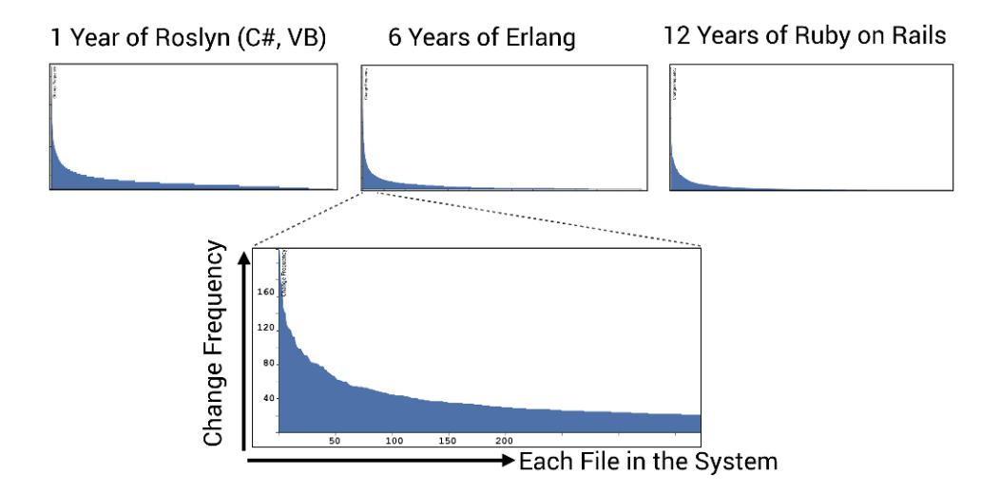
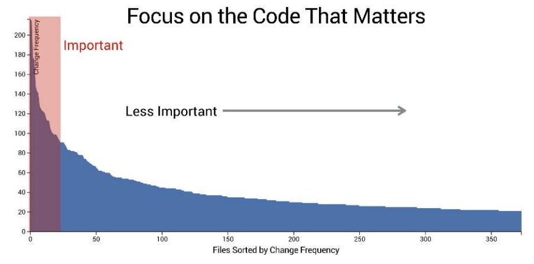
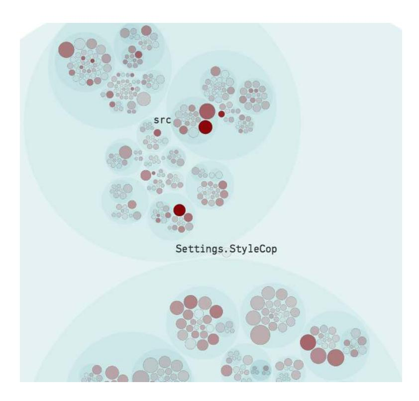
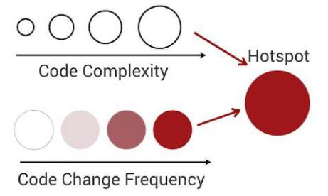
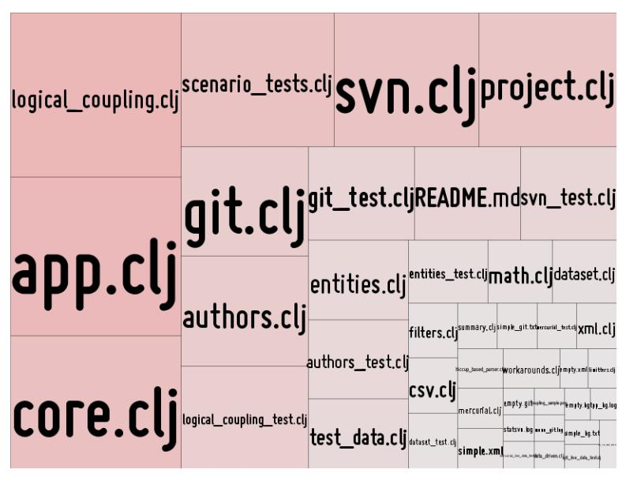
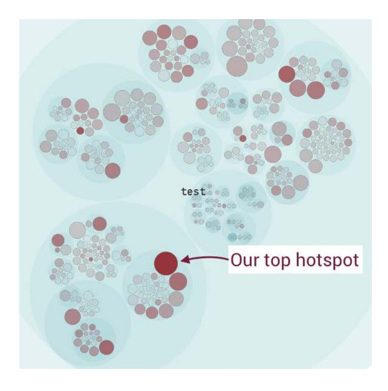
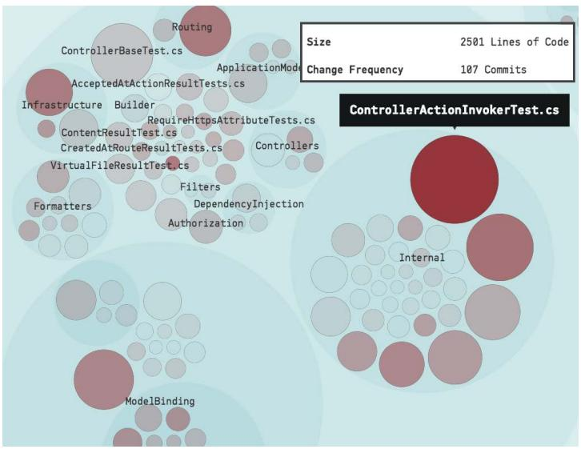
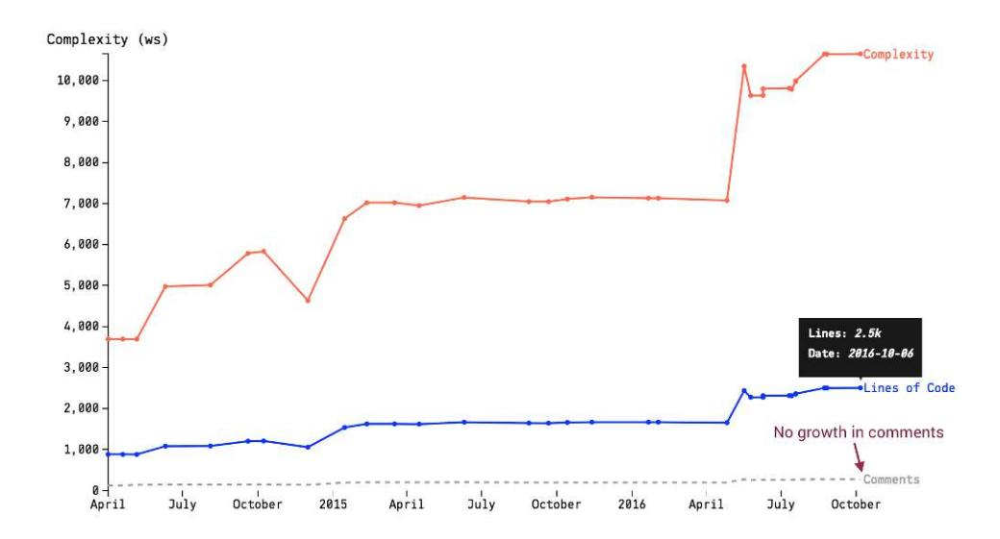
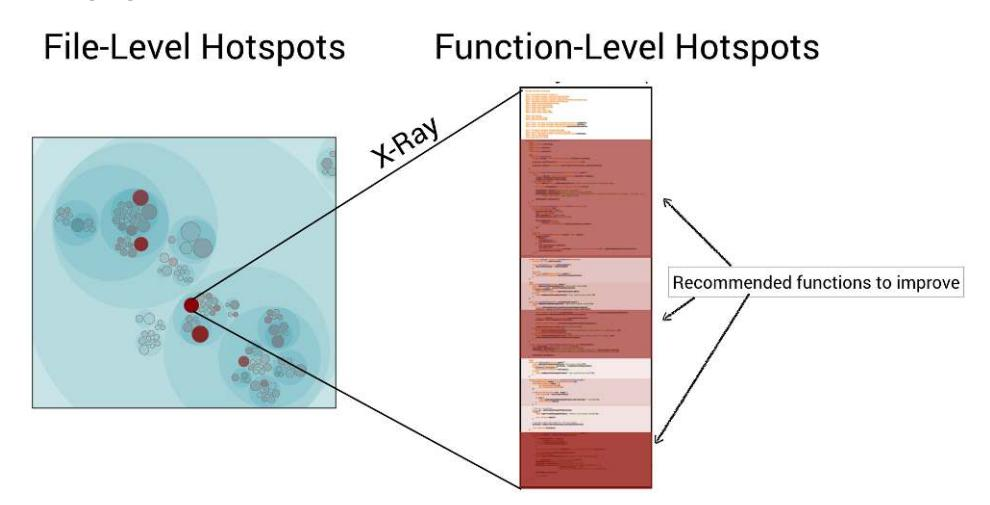
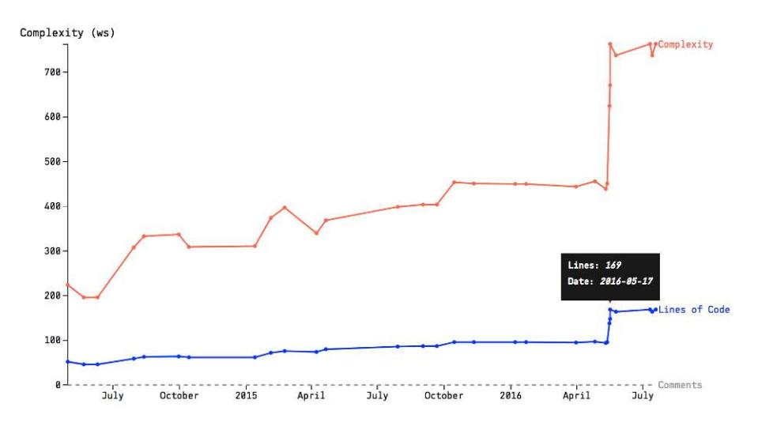

<span id="page-29-0"></span>
# Chapter 2: Identify Code with High Interest Rates

<span id="page-29-2"></span>We've seen that prioritizing technical debt requires a time dimension in our code. Now you'll learn how hotspots provide that dimension by letting you identify code with high interest rates on both the file and function levels.

We'll put hotspots to work on a well-known codebase where we identify a small section of code, just 197 lines, as a specific initial target for improvements. You'll learn how we can be confident that an improvement to those 197 lines will yield real productivity and quality gains. So follow along as we dive into how code evolves and explore a technique that will change how we tackle legacy code.

<span id="page-29-3"></span>
<span id="page-29-1"></span>
## Measure Interest Rates

Refactoring complex code is a high-risk and expensive activity, so you want to ensure your time is well invested. This is a problem because legacy codebases often contain tons of code of suboptimal quality. You know, that kind of module where we take a deep breath before we dive in to look at it and hope we don't have to touch the code. Ever. Given such vast amounts of code in need of improvement, where do we start? A behavioral code analysis provides an interesting answer to that puzzle. Have a look at the [figure on page](#page-30-0) [16](#page-30-0) to see what I mean.

These graphs present an evolutionary view of three distinct codebases. We've sorted the files in each codebase according to their change frequencies—that is, the number of commits done to each file as recorded in the version-control data, with the y-axis showing the number of commits.

This figure shows data from three radically different systems. Systems from different domains, of different size, developed by different organizations, and of different age. Everything about these systems is different. Yet all three

<span id="page-30-0"></span>

<span id="page-30-2"></span>graphs show exactly the same pattern. They show a *power law distribution*. And this is a pattern that I've found in every codebase I've ever analyzed.

The distribution means that the majority of our code is in the long tail. It's code that's rarely, if ever, touched. Oversimplified, this characteristic suggests that most of our code isn't important from a cost or quality perspective. In contrast, you see that most development activity is focused on a relatively small part of the codebase. This gives us a tool to prioritize improvements, as the following figure illustrates.



<span id="page-30-1"></span>The red area in the preceding figure highlights where we spend most of our development work. These are the files where it's most important that the code be clean and easy to evolve. In practice, more often that not, files with high change frequencies suffer quality problems (we'll have plenty of opportunities to see that for ourselves later on in this book). This means that any

improvements we make to the files in the red area have a high likelihood of providing productivity gains. Let's see how you identify such refactoring candidates in your own code.

<span id="page-31-2"></span>
<span id="page-31-1"></span>
## A Proxy for Interest Rate

Change frequency is a simple algorithm to implement. You just count the number of times each file is referenced in your Git log and sort the results. The book *[Git Version Control Cookbook \[OV14\]](#page-244-4)* includes a recipe that lets you try the algorithm on your own repository by combining Bash and commands with Git's log option. Just open a Bash shell—or Git Bash if you're on Windows—and go to one of your repositories. Enter the following command:

```
adam$ git log --format=format: --name-only | egrep -v '^$' | sort \
       | uniq -c | sort -r | head -5
1562 actionpack/CHANGELOG
1413 activerecord/CHANGELOG.md
1348 activerecord/CHANGELOG
1183 activerecord/lib/active_record/base.rb
 800 activerecord/lib/active_record/associations.rb
```

<span id="page-31-3"></span>The --format=format: option to git log gives us a plain list of all files we've ever changed. The cryptic egrep -v '^\$' part cleans our data by removing blank lines from the preceding Git command, and the rest of the shell commands count the change frequencies and deliver the results in sorted order. Finally we limit the number of results with head -5. Just remove this final command from the pipe and redirect the output to a file if you want to inspect the change frequencies of all your code:

```
adam$ git log --format=format: --name-only | egrep -v '^$' | sort \
        | uniq -c | sort -r > all_frequencies.txt
```

The prior code example is from the Ruby on Rails codebase.<sup>1</sup> The first three entries reference the change logs, which are noncode artifacts. But then it gets interesting. The next two files are central classes in the active\_record module. We'll talk more about the implications soon, but it's quite typical that the files that attract the most changes are the ones that are central to your system. So have a look at your own list of frequently changed files. Is there a nod of recognition as you inspect the files with the most commits?

## The Effectiveness of Change Frequencies

Calculating change frequencies is straightforward, but a practical implementation of the algorithm is trickier since we want to track renamed content.

<sup>1.</sup> <https://github.com/rails/rails>

You may also find that your Git log output references files that no longer exist or have been moved to other repositories. In addition, Git only deals with content, so it will happily deliver all kinds of files to you, including those compiled .jar files your former coworker insisted on autocommitting on each build. That's why we need tooling on top of the raw data. We'll meet our tools soon. But let's first look at how well this simple metric performs.

<span id="page-32-1"></span>Since code is so complicated to develop and understand, we often like to think that any model of the process has to be elaborate as well. However, like so much else in the world of programming, simplicity tends to win. Change to a module is so important that more elaborate metrics rarely provide any further value when it comes to fault prediction and quality issues. (See, for example, *[Does Measuring Code Change Improve Fault Prediction? \[BOW11\]](#page-241-3)* and *[A Comparative Analysis of the Efficiency of Change Metrics and Static](021-bibliography.md#page-243-0) [Code Attributes for Defect Prediction \[MPS08\]](#page-243-0)* for empiric research on the subject.) So not only do our change frequencies let us identify the code where we do most of the work; they also point us to potential quality problems.

Despite these findings our model still suffers a weakness. Why? Because all code isn't equal. There is a huge difference between increasing a version number in a single-line text file and correcting a bug in a module with 5,000 lines of C++ littered with tricky, nested conditional logic. The first kind of change is low risk and can for all practical purposes be ignored. The second type of change needs extra attention in terms of test and code inspections. That's why we need to add a second dimension to our model in order to improve its predictive power. We need to add a complexity dimension.

<span id="page-32-2"></span>
<span id="page-32-0"></span>
## Add a Language-Neutral Complexity Dimension

Software researchers have made several attempts at measuring software complexity. The most well-known approaches use the McCabe cyclomatic complexity and Halstead complexity measures.2 3 The major drawback of these metrics is that they are language specific. That is, we need one implementation for each of the programming languages that we use to build our system. This is in conflict with most modern systems, which tend to combine multiple languages. Ideally we'd like to take a language-neutral approach, but without losing precision or information.

<span id="page-32-3"></span>Fortunately, there's a much simpler complexity metric that performs well enough: the number of lines of code. Yes, the number of lines of code is a

<sup>2.</sup> [https://en.wikipedia.org/wiki/Cyclomatic\\_complexity](https://en.wikipedia.org/wiki/Cyclomatic_complexity)

<sup>3.</sup> [https://en.wikipedia.org/wiki/Halstead\\_complexity\\_measures](https://en.wikipedia.org/wiki/Halstead_complexity_measures)

rough metric, but that metric has just as much predictive power as more elaborate constructs like cyclomatic complexity. (See the research by Herraiz and Hassan in *[Making Software \[OW10\]](#page-244-5)*, where they compare lines of code to other complexity metrics.) The advantage of using lines of code is its simplicity. Lines of code is both language neutral and easy to interpret. So let's combine our complexity dimension with a measure of change frequency to identify hotspots that represent code with high interest rates.

### Calculate Lines of Code With cloc


<span id="page-33-3"></span>The open source command-line tool cloc lets you count the lines of code in virtually any programming language. The tool is fast and simple to use, so give it a try on your codebase. You can get cloc from its GitHub page.<sup>4</sup>

<span id="page-33-2"></span>
<span id="page-33-0"></span>
## Prioritize Technical Debt with Hotspots

A hotspot is complicated code that you have to work with often. Hotspots are calculated by combining the two metrics we've explored:

- 1. Calculating the change frequency of each file as a proxy for interest rate
- 2. Using the lines of code as a simple measure of code complexity

<span id="page-33-1"></span>The simplest way is to write a script that iterates through our table of change frequencies and adds the lines-of-code measure to each entry. We can also visualize our data to gain a better overview of where our hotspots are.

<span id="page-33-4"></span>Let's look at an example from the online gallery,<sup>5</sup> where you see a visualization like the [figure on page 20](#page-34-0) of a hotspot analysis on *ASP.NET Core MVC*. This codebase, from Microsoft, implements a model-view-controller (MVC) framework for building dynamic websites.<sup>6</sup>

This type of visualization is called an *enclosure diagram*. (See *[Visualizations](018-appendix-a2-code-maat-an-open-source-analysis-engine.md#page-225-0)*, [on page 217,](018-appendix-a2-code-maat-an-open-source-analysis-engine.md#page-225-0) for details on how to make your own.) We'll use enclosure diagrams a lot in our visualizations since they scale well with the size of the codebase. Here's how to interpret the visualization:

• Hierarchical: The visualization follows the folder structure of your codebase. Look at the large blue circles in the [figure on page 20](#page-34-0). Each one of them represents a folder in your codebase. The nested blue circles inside represent subfolders.

<sup>4.</sup> <https://github.com/AlDanial/cloc>

<sup>5.</sup> <https://codescene.io/projects/1690/jobs/4245/results/code/hotspots/system-map>

<sup>6.</sup> <https://github.com/aspnet/Mvc>

<span id="page-34-0"></span>

<span id="page-34-1"></span>• Interactive: To work with large codebases the visualizations have to be interactive. This means you can zoom in on the code of interest. Click on one of the circles representing folders in the codebase to zoom in on its content.

When you zoom in on a package you'll see that each file is represented as a circle. You'll also note that the circles have different sizes and opacities. That's because those dimensions are used to represent our hotspot criteria, as illustrated in the next figure.



The deeper the red color, the more commits have been spent on that code. And the larger the circle, the more code in the file it represents.

<span id="page-35-2"></span>The main benefit of enclosure diagrams is that they let us view the whole codebase at a glance. Even so, there are other options to visualize code. A popular alternative is *tree maps*. Tree maps are a hierarchical visualization that present a more compact view of large codebases. The next figure shows an example from *[Your Code as a Crime Scene \[Tor15\]](#page-244-0)* where the hotspots are visualized as a tree map.



<span id="page-35-0"></span>The JavaScript library *D3* provides an easy way to experiment with tree maps.<sup>7</sup> Together with the cloc tool and the git log trick we saw earlier, you have all the data you need to visualize your hotspots.

<span id="page-35-1"></span>No matter what visualization style you choose, you're now ready to uncover hotspots with high interest rates.

## Locate Your Top Hotspots

A hotspot analysis takes you beyond the current structure of the code by adding a time dimension that is fundamental to understanding large-scale systems. As we saw earlier, development activity is unevenly distributed in your codebase, which implies that not all code is equally important from a maintenance perspective. Consequently, just because some code is badly written or contains excess accidental complexity, that doesn't mean it's a problem. Low-quality code matters only when we need to work with it, perhaps to fix a bug or extend an existing feature—but then, of course, it becomes a true nightmare.

<sup>7.</sup> <https://d3js.org/>

### Joe asks:

## Are You Telling Me Code Quality Isn't Important?

<span id="page-36-1"></span>No, this is not intended to encourage bad code. The quality of your code *is* important —code is the medium for expressing your thoughts—but context is king. We talk about legacy code. Code is hard to get right; requirements change and situational forces have to be considered. That means every large codebase has its fair share of troubled modules. It's futile to try to address all those quality problems at once because there's only so much time we can spend on improvements, so we want to ensure we improve a part that actually matters.

The reason many well-known speakers and authors in the software industry obsess about keeping all code nice and clean is because we can't know up front which category code will fall into. Will this particular code end up in the long tail that we rarely touch, or will we have to work with this piece of code on a regular basis? Hotspots help us make this distinction.

So let's get specific by analyzing Microsoft's ASP.NET Core MVC. It's a .NET codebase, but the steps you learn apply to code written in any language. You can also follow along online with the interactive analysis results on the URL that we opened earlier.<sup>8</sup>

<span id="page-36-0"></span>
## Prioritize Hotspots in ASP.NET Core MVC

ASP.NET Core MVC is a framework for building dynamic websites. It's a midsize codebase with around 200,000 lines of code, most of it C#. In larger codebases we need a more structured approach, which we'll discuss in [Chapter 6,](012-chapter-6-spot-your-system-s-tipping-point-is-software-too-hard-divide-and-conquer-with-architectural-hotspots-analyze-subsystems-fight-the-normalization-of-deviance-toward-team-oriented-measures-exercises.md#page-104-0) *Spot Your System'[s Tipping Point](012-chapter-6-spot-your-system-s-tipping-point-is-software-too-hard-divide-and-conquer-with-architectural-hotspots-analyze-subsystems-fight-the-normalization-of-deviance-toward-team-oriented-measures-exercises.md#page-104-0)*, on page 93, but ASP.NET Core MVC is small enough that we can use a powerful heuristic—our visual system. Let's have another look at our hotspot map, shown in the top [figure on page 23.](#page-37-0)

<span id="page-36-2"></span>See the large red circle in the lower part of the figure? That's our top hotspot. It's code that's likely to be complex, since there's a lot if it, and the code changes at a high rate. Zoom in on that hotspot by clicking on it to inspect its details, as shown in the next [figure on page 23](#page-37-1).

Our main suspect, the unit test ControllerActionInvokerTest.cs, contains around 2,500 lines of code. That's quite a lot for any module, in particular for a unit test. Unit testing is often sold as a way to document behavior. That potential advantage is lost once a unit test climbs to thousands of lines of code. You also see that the developers of ASP.NET Core MVC have made more than 100 commits to that code.

<sup>8.</sup> <https://codescene.io/projects/1690/jobs/4245/results/code/hotspots/system-map>

<span id="page-37-0"></span>

<span id="page-37-1"></span>

This means that our hotspot, ControllerActionInvokerTest.cs, is a crucial module in terms of maintenance efforts. Based on this information let's peek into that file and determine whether the code is a problem.

### Use Hotspots to Improve, Not Judge

<span id="page-38-2"></span>The *fundamental attribution error* is a principle from social psychology that describes our tendency to overestimate the influence of personality—such as competence and carefulness—as we explain the behavior of other people. The consequence is that we underestimate the power of the situation.


<span id="page-38-3"></span>It's easy to critique code in retrospect. That's fine as long as we remember that we don't know the original context in which the code was developed. Code is often written under strong pressures of time constraints and changing requirements. And often that pressure exerted its force while the original developers tried to build an understanding of both the problem and the solution domain. As we inspect the code, perhaps months or years later, we should be careful to not judge the original programmers, but rather use the information we gather as a way forward.

<span id="page-38-1"></span>
<span id="page-38-0"></span>
## Evaluate Hotspots with Complexity Trends

We can find out how severe a potential problem is via a *complexity trend* analysis, which looks at the accumulated complexity of the file over time. The trend is calculated by fetching each historic version of a hotspot and calculating the code complexity of each historic revision.

You will soon learn more about how complexity is calculated, but let's start with a specific example from our top hotspot. As you see in the [figure on page](#page-39-0) [25](#page-39-0), ControllerActionInvokerTest.cs has become much more complicated recently.<sup>9</sup>

The trend tells the story of our hotspot. We see that it grew dramatically back in May 2016. Since then the size of the file hasn't changed much, but the complexity continues to grow. This means the code in the hotspot gets harder and harder to understand. We also see that the growth in complexity isn't followed by any increase in descriptive comments. So if you ever struggled to justify a refactoring … well, it doesn't get more evident than in cases like this. All signs point to a file with maintenance problems.

We'll soon learn to follow up on this finding and get more detailed information. Before we go there, let's see how the complexity trend is calculated and why it works.

<sup>9.</sup> [https://codescene.io/projects/1690/jobs/4245/results/code/hotspots/complexity-trend?name=Mvc/test/](https://codescene.io/projects/1690/jobs/4245/results/code/hotspots/complexity-trend?name=Mvc/test/Microsoft.AspNetCore.Mvc.Core.Test/Internal/ControllerActionInvokerTest.cs) [Microsoft.AspNetCore.Mvc.Core.Test/Internal/ControllerActionInvokerTest.cs](https://codescene.io/projects/1690/jobs/4245/results/code/hotspots/complexity-trend?name=Mvc/test/Microsoft.AspNetCore.Mvc.Core.Test/Internal/ControllerActionInvokerTest.cs)

<span id="page-39-0"></span>

<span id="page-39-2"></span>
### What Is Complexity, Anyway?

While we used lines of code as a proxy for complexity in our hotspot analysis, the same metric won't do the trick here. We'll get more insights if the trend is capable of differentiating between growth in pure size versus growth in complexity. This latter case is typical of code that is patched with nested conditionals; the lines of code probably grow over time, but the complexity of each line grows more rapidly. To make this distinction we need to measure a property of the code, not just count lines.

<span id="page-39-3"></span><span id="page-39-1"></span>The *indentation-based complexity* metric provides one such approach. It's a simple metric that has the advantage of being language neutral. The figure on page 26 illustrates the general principle.

With indentation-based complexity we count the leading tabs and whitespaces to convert them into logical indentations. This is in stark contrast to traditional metrics that focus on properties of the code itself, such as conditionals and loops. This works because indentations in code carry meaning. Indentations are used to increase readability by separating code blocks from each other. We never indent code at random (and if we do, we have more fundamental problems than identifying hotspots). Therefore, the indentations of the code we write correlate well with traditional complexity metrics. (See *[Reading Beside](021-bibliography.md#page-243-1) [the Lines: Indentation as a Proxy for Complexity Metrics. Program Comprehension,](021-bibliography.md#page-243-1) [2008. ICPC 2008. The 16th IEEE International Conference on \[HGH08\]](#page-243-1)* for an evaluation of indentation-based complexity on 278 projects compared to traditional complexity metrics.) I did say it was simple, didn't I?

<span id="page-40-1"></span>
## Know the Biases in Complexity Trends

In all fairness, the simplicity of our metric comes with some trade-offs. First, the actual complexity number represents the number of logical indentations, so it makes little sense to discuss thresholds or compare complexity values across languages. It's the trend that's important, not the absolute values.

The use of leading whitespace makes the algorithm sensitive to mid-project changes in indentation style. If that happens you'll see a sudden spike or drop in complexity without the code actually being changed. In that case the trend will still be meaningful, but you have to mentally ignore the sudden spike. Just remember that—like all models of complex processes—complexity trends are heuristics, not absolute truths.

<span id="page-40-2"></span>Now that we know how complexity trends are calculated, let's move on and discover detailed refactoring candidates.

### Calculate Complexity Trends with Python


The complexity trend algorithm is straightforward to implement. CodeScene adds a bit of filtering on top of it, but if you just want the raw data you can script it in no time. I've also open-sourced an implementation in Python as an example and inspiration for your own scripts.<sup>10</sup>

<sup>10.</sup> [https://github.com/adamtornhill/maat-scripts/blob/master/miner/git\\_complexity\\_trend.py](https://github.com/adamtornhill/maat-scripts/blob/master/miner/git_complexity_trend.py)

<span id="page-41-0"></span>
## Use X-Rays to Get Deep Insights into Code

<span id="page-41-1"></span>Our analysis let us significantly reduce the amount of code we need to consider. We started with an entire codebase and narrowed it down to a single file where improvements matter. For smaller files that's enough information to start improving the code, but we need to do even better if we come across large hotspots.

Our main suspect in this case is a file with 2,500 lines of code. It's a lot, for sure, but as we'll see later in this book, hotspots with more than 10,000 lines of code are fairly common out in the wild. How useful would it be to know that a file with thousands of lines of code is a hotspot? Where do we look? How do we act on that information? The most common answer is that we don't. We need much more detailed information.

<span id="page-41-2"></span>Remember when we saw that not all code is equal? That's true at the function/method level too. A large file is like a system in itself. During maintenance you'll spend more time on some methods than on others. You can capitalize on this aspect by running a hotspot analysis on the method level to identify the segments of code that contribute the most to the file being a hotspot. We'll refer to this analysis as an *X-Ray* to distinguish it from file-level analyses. It's exactly the same algorithm we used earlier, only the scope differs, as the following figure illustrates.



An X-Ray gives you a prioritized list of the methods to inspect and, possibly, refactor. Let's try it on our main suspect. Click on the ControllerActionInvokerTest.cs hotspot in the visualization to bring up the context menu, and select the X-Ray option.

An X-Ray analysis involves the following steps:

- 1. Fetch the source code for each historic revision of our hotspot from Git.
- <span id="page-42-1"></span>2. Run a git diff on every subsequent revision of the code. The diff output shows us where—in the historic file—the developers made modifications.
- 3. Match the diff results to the functions/methods that existed in that particular revision. This means we need to parse the source code to know which functions were affected in a particular commit.
- 4. Perform a hotspot calculation on the resulting set of changed functions over all revisions of the hotspot. The algorithm is identical to what we used to detect file-level hotspots, but the scope differs. The change frequency represents the number of times we modified a function, and the length of the function gives us the complexity dimension.

With the basic algorithm covered, let's see what the X-Ray analysis reveals inside ControllerActionInvokerTest.cs. <sup>11</sup> As you see in the following figure, the top hotspot on a method level is CreateInvoker.

|                                                                                       | Change Frequency | \$ Lines of Code |
|---------------------------------------------------------------------------------------|------------------|------------------|
| CreateInvoker                                                                         | 68               | 197              |
| Invoke_UsesDefaultValuesIfNotBound                                                    | 52               | 59               |
| $InvokeAction\_Invokes Async Exception Filter\_When Action Throws$                    | 10               | 45               |
| $Invoke Action\_Invokes A sync Authorization Filter\_Short Circuit$                   | 10               | 43               |
| $Invoke Action\_Invokes Exception Filter\_Result Is Executed\_Without Result Filters$ | 10               | 27               |

<span id="page-42-0"></span>Like the hotspot analysis, a complexity trend analysis is also orthogonal to the level it operates on. That means you can calculate the complexity trend of the CreateInvoker method. Just click the trend button in your X-Ray results and inspect the trend.<sup>12</sup>

As you see in the trend [picture on page 29](#page-43-0), the exploding complexity of the CreateInvoker method is responsible for the degenerating trend of the ControllerActionInvokerTest.cs class. The X-Ray table shows that CreateInvoker consists of 197

<sup>11.</sup> [https://codescene.io/projects/1690/jobs/4245/results/files/hotspots?file-name=Mvc%2Ftest%2FMicrosoft.AspNet-](https://codescene.io/projects/1690/jobs/4245/results/files/hotspots?file-name=Mvc%2Ftest%2FMicrosoft.AspNetCore.Mvc.Core.Test%2FInternal%2FControllerActionInvokerTest.cs)[Core.Mvc.Core.Test%2FInternal%2FControllerActionInvokerTest.cs](https://codescene.io/projects/1690/jobs/4245/results/files/hotspots?file-name=Mvc%2Ftest%2FMicrosoft.AspNetCore.Mvc.Core.Test%2FInternal%2FControllerActionInvokerTest.cs)

<sup>12.</sup> [https://codescene.io/projects/1690/jobs/4245/results/files/functions/complexity-trend?file](https://codescene.io/projects/1690/jobs/4245/results/files/functions/complexity-trend?file-name=Mvc%2Ftest%2FMicrosoft.AspNetCore.Mvc.Core.Test%2FInternal%2FControllerActionInvokerTest.cs&function-name=CreateInvoker)[name=Mvc%2Ftest%2FMicrosoft.AspNetCore.Mvc.Core.Test%2FInternal%2FControllerActionInvokerTest.cs&func](https://codescene.io/projects/1690/jobs/4245/results/files/functions/complexity-trend?file-name=Mvc%2Ftest%2FMicrosoft.AspNetCore.Mvc.Core.Test%2FInternal%2FControllerActionInvokerTest.cs&function-name=CreateInvoker)[tion-name=CreateInvoker](https://codescene.io/projects/1690/jobs/4245/results/files/functions/complexity-trend?file-name=Mvc%2Ftest%2FMicrosoft.AspNetCore.Mvc.Core.Test%2FInternal%2FControllerActionInvokerTest.cs&function-name=CreateInvoker)

lines of code, which is way too much for a single method. But it's much less than 2,500 lines, which is the size of the total file, and it's definitely less than 200,000 lines, which is the size of the total codebase. This means we're now at a level where we can act on the information.

<span id="page-43-0"></span>

### Inspect the Code

The big win with a hotspot analysis is that it lets us minimize our manual efforts while ensuring a high probability that we focus on the right parts of the code. This is important, because at some point in our hunt for technical debt we want to look at the code.

When we view the file ControllerActionInvokerTest.cs, we see that CreateInvoker is actually three overloaded methods, as shown in the next figure.

Our X-Ray analysis combines all the methods into a single hotspot. This is an implementation detail for sure, and you may choose to keep overloaded methods separate. However, grouping them together lets you consider all overloaded methods as one logical unit when you refactor.

But let's not get lost in the details—investigating a hotspot takes time and requires domain expertise. Besides, you may not be that interested in C#. So let's keep our investigation high level and see if we can spot some common code smells. Have a look at the first few lines of code shown in the following figure.

<span id="page-44-0"></span>As you see in the previous annotated code, there's a classic case of control coupling through the Boolean actionThrows parameter. Such flags are a problem since they introduce conditional logic and lower cohesion by enforcing additional state. Such control coupling also leads to subtle duplication of code. These design choices don't play well with maintenance.

#### Refactor Control Coupling

<span id="page-44-2"></span>

<span id="page-44-1"></span>Control coupling is common in legacy code. Fortunately, it's simple to refactor locally. You do that by encapsulating the concept that varies between different callers of the method and parameterizing with the behavior, expressed as an object or lambda function, instead of using a flag. As a bonus, your calling code will communicate its intent better, too.

Now let's look at one more maintenance aspect to emphasize that hotspots often point to real problems. If you scroll through the implementation of CreateInvoker you see that the complicated setup of mock objects in the code is worrisome, as the figure on page 31 illustrates.<sup>13</sup>

<sup>13.</sup> [https://en.wikipedia.org/wiki/Mock\\_object](https://en.wikipedia.org/wiki/Mock_object)

<span id="page-45-2"></span>Mocks have their place, but excess mocking breaks encapsulation and tests a mechanism rather than a behavior. (See *[To Mock or Not To Mock? An](021-bibliography.md#page-244-6) [Empirical Study on Mocking Practices \[SABB17\]](#page-244-6)* for research on the uses and misuses of mocks, and see *[Growing Object-Oriented Software, Guided by Tests](021-bibliography.md#page-242-2) [\[FP09\]](#page-242-2)* for the cure.) Each time the implementation in the code under test changes, CreateInvoker has to be updated, too. Not only is this error prone and expensive, but you also lose the advantage of unit tests as a true regression suite. In addition, a complicated unit test may well be the messenger telling us to rethink the code under test.

<span id="page-45-4"></span>We could go on like this and dissect the rest of code, but that would distract us from the more general use of hotspots. So let's look at some additional use cases for hotspots before we move on to other analyses.

#### Use the Setup Heuristic

<span id="page-45-3"></span><span id="page-45-0"></span>

The length of a test's setup method is often inversely related to the readability of the code under test. So start from the unit tests when reviewing code; they indicate the design issues you need to look out for in the application code.

## Escape the Technical-Debt Trap

A hotspot analysis is an efficient strategy to prioritize technical debt. Hotspots gives you a prioritized list of the parts of your codebase where you're likely

to spend most of your time. This means you can take an iterative approach as you drive improvements based on data from how you have worked with the code so far.

Back in Chapter 1, *[Why Technical Debt Isn](005-part-i-prioritize-and-react-to-technical-debt.md#page-17-0)'t Technical*, on page 3, we talked about a system that had accumulated 4,000 years of technical debt. It's a high number, but all too common in legacy codebases. Now we've seen that not all technical debt is important. Using hotspots, you can ignore most of those 4,000 years of technical debt and focus on the parts that really matter to your ability to maintain the system. With behavioral code analysis we have that code narrowed down in just a few minutes.

<span id="page-46-1"></span>A hotspot analysis also serves multiple audiences. While developers use hotspots to identify maintenance problems and focus code reviews, testers use the same information to select a starting point for exploratory tests. A hotspot analysis is an excellent way for a skilled tester to identify parts of the codebase that seem unstable due to lots of development activity.

<span id="page-46-0"></span>
### Work with Untouchable Code

Sometimes I come across organizations that have decided to avoid touching their worst code. Thus, a hotspot analysis on the recent development activity would fail to highlight the most serious source of technical debt.

This situation is no different from a codebase built around any third-party framework or library—the only distinction is that the third-party code originated from within the same organization. If you're in a similar situation, you use the hotspot analysis to supervise all the code that does get worked on to ensure it won't end up sharing a similar fate and become the untouchable code to your next generation of developers.

As we'll see in Part II, behavioral code analysis is also useful for exploring unknown code. Version-control data lets us travel in time and uncover the patterns of the original developers, which helps us understand the structure of seemingly impenetrable code. It may be hard, but if people managed to decipher the hieroglyphs and sequence the human genome, it should be possible to cast light on a legacy codebase, too. With hotspots as a guide, that work becomes more pleasant.

<span id="page-46-2"></span>
## There's More to Hotspots

There are several reasons why code grows into hotspots. The most common reason is *low cohesion*, which means that the hotspot contains several

unrelated parts and lacks modularity.<sup>14</sup> Such hotspots attract many commits because they have too many responsibilities and those responsibilities tend to be central to your domain, which is why they change. This is a problem that gets worse with the scale of the organization. In Chapter 7, *[Beyond Conway](012-chapter-6-spot-your-system-s-tipping-point-is-software-too-hard-divide-and-conquer-with-architectural-hotspots-analyze-subsystems-fight-the-normalization-of-deviance-toward-team-oriented-measures-exercises.md#page-127-0)'s Law*[, on page 117](012-chapter-6-spot-your-system-s-tipping-point-is-software-too-hard-divide-and-conquer-with-architectural-hotspots-analyze-subsystems-fight-the-normalization-of-deviance-toward-team-oriented-measures-exercises.md#page-127-0), you'll see that there's a social cost to hotspots, too.

<span id="page-47-1"></span>Another fascinating aspect of hotspots is that they tend to stay where they are and remain problematic for years. As an example, I've used ControllerAction-InvokerTest.cs as a case study in my workshops on hotspot detection for a year now. In that time the code has accumulated even more complexity. Often, that's because refactoring hotspots is hard and high risk, and we discuss patterns that help us refactor such hotspots in Chapter 4, *[Pay Off Your](008-chapter-3-coupling-in-time-a-heuristic-for-the-concept-of-surprise.md#page-65-0) [Technical Debt](008-chapter-3-coupling-in-time-a-heuristic-for-the-concept-of-surprise.md#page-65-0)*, on page 51. But before that our next chapter explores how we can detect maintenance issues across whole clusters of files.

<span id="page-47-3"></span>
<span id="page-47-0"></span>
## Exercises

The following exercises let you uncover technical debt in popular open source projects. You also learn how the combination of hotspots and complexity trends lets you follow up on the improvements you make in the code. That is, instead of focusing on problems, you get to use the analysis techniques to identify code that has been refactored.

Remember the document linked in *[How Should You Read This Book?](004-the-world-of-behavioral-code-analysis.md#page-12-0)*, on page [xiii,](004-the-world-of-behavioral-code-analysis.md#page-12-0) which specifies a single page with all the exercise URLs. It'll save you from having to type out all URLs in case you're reading the print version.

## Find Refactoring Candidates in Docker

- Repository: <https://github.com/moby/moby>
- Language: Go
- <span id="page-47-2"></span>• Domain: Docker automates the deployment of applications inside containers that hold everything needed to run the system.
- Analysis snapshot: [https://codescene.io/projects/169/jobs/3964/results/code/hotspots/](https://codescene.io/projects/169/jobs/3964/results/code/hotspots/system-map) [system-map](https://codescene.io/projects/169/jobs/3964/results/code/hotspots/system-map)

The top hotspot in our case study of ASP.NET Core MVC was a unit test. This is a common finding; we developers tend to make a mental divide between application code (which we know is important to keep clean and easy to maintain) and test code (which often receives considerably less love at code

<sup>14.</sup> [https://en.wikipedia.org/wiki/Cohesion\\_\(computer\\_science\)](https://en.wikipedia.org/wiki/Cohesion_(computer_science))

reviews). This is a dangerous fallacy since from a maintenance perspective the test code is *at least* as important as the application code.

Inspect the hotspots in Docker from the perspective of test automation. Are there any maintenance problems? In what direction does the code evolve? Where would you suggest that we focus improvements?

### Follow Up on Improvements to Rails

• Repository: <https://github.com/rails/rails>

• Language: Ruby

- Domain: Rails is a server-side web application framework built on the model-view-controller pattern.
- <span id="page-48-0"></span>• Analysis snapshot: [https://codescene.io/projects/1699/jobs/4265/results/code/hotspots/](https://codescene.io/projects/1699/jobs/4265/results/code/hotspots/system-map) [system-map](https://codescene.io/projects/1699/jobs/4265/results/code/hotspots/system-map)

We've seen how complexity trends gives us more information on how a hotspot evolves. The trends are also great as a follow-up to subsequent improvements. After a large refactoring, perhaps to simplify conditional logic or to extract cohesive modules from the hotspot, we want to ensure that our complexity trend goes down and stays there.

Explore the two frequently changed files, activerecord/lib/active\_record/base.rb and activerecord/lib/active\_record/associations.rb, that we identified in code on page 17. Investigate their trends for signs of successful refactorings. Do either of the files give us a false positive with respect to the hotspot criteria? You get bonus points if you can think of a way to filter out refactored code that is no longer a problem from the hotspot results. (In Chapter 5, *[The Principles of Code Age](009-chapter-4-pay-off-your-technical-debt.md#page-86-0)*, [on page 73,](009-chapter-4-pay-off-your-technical-debt.md#page-86-0) we discuss information that helps us with the task.)
