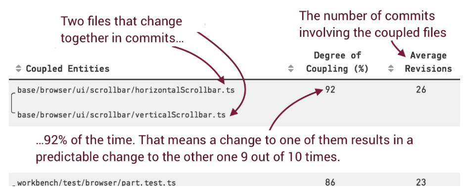
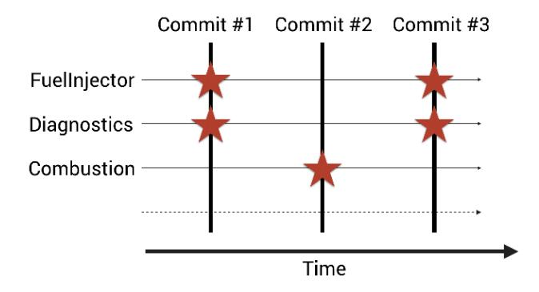
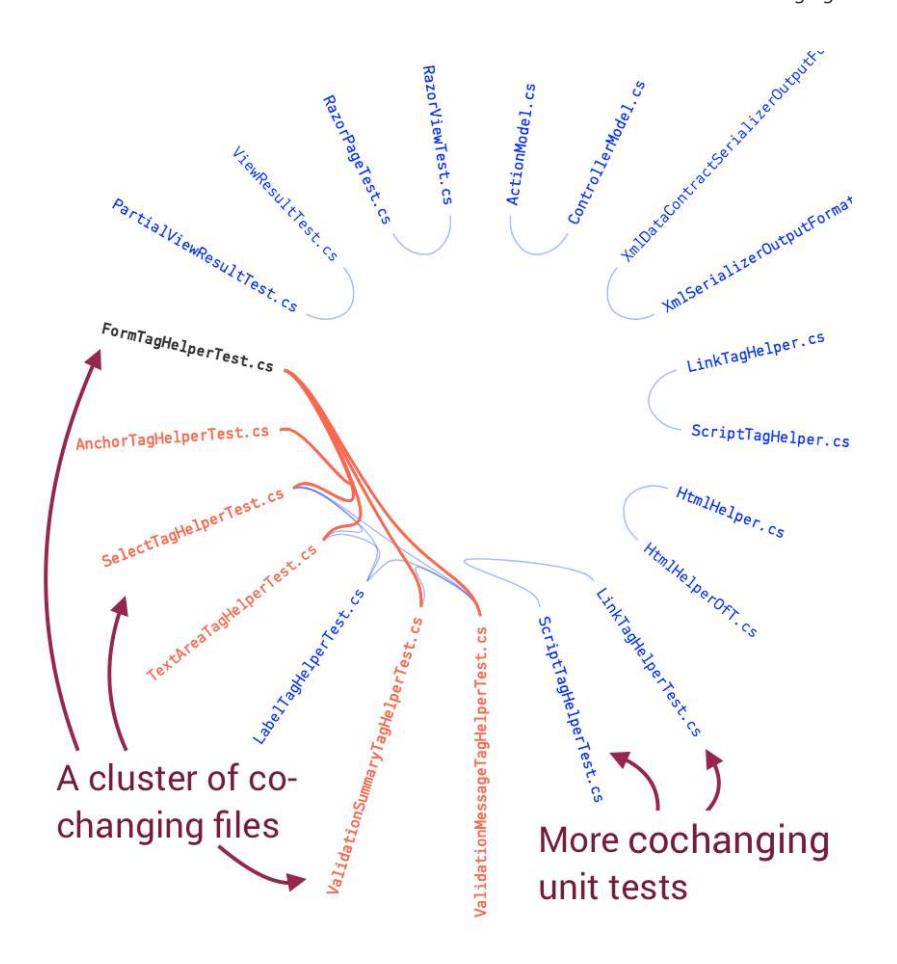
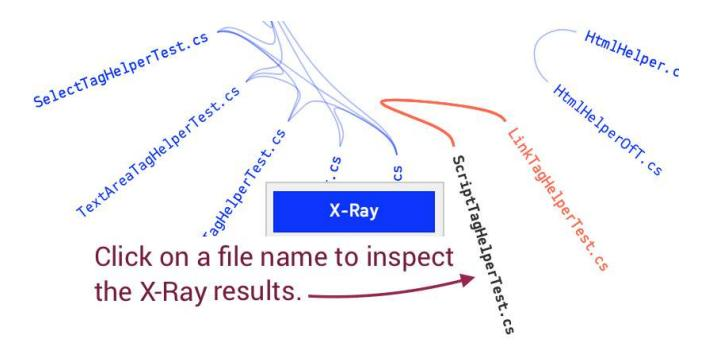
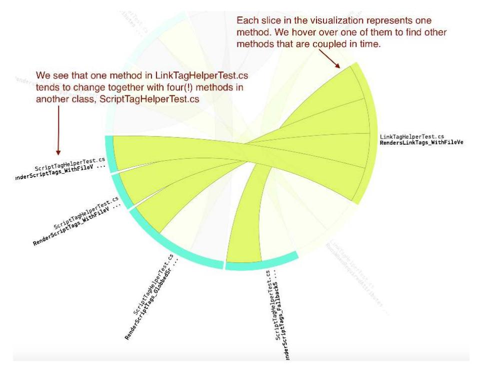
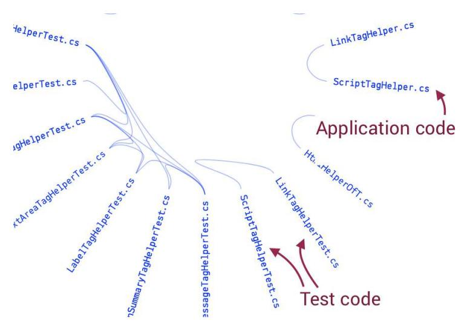
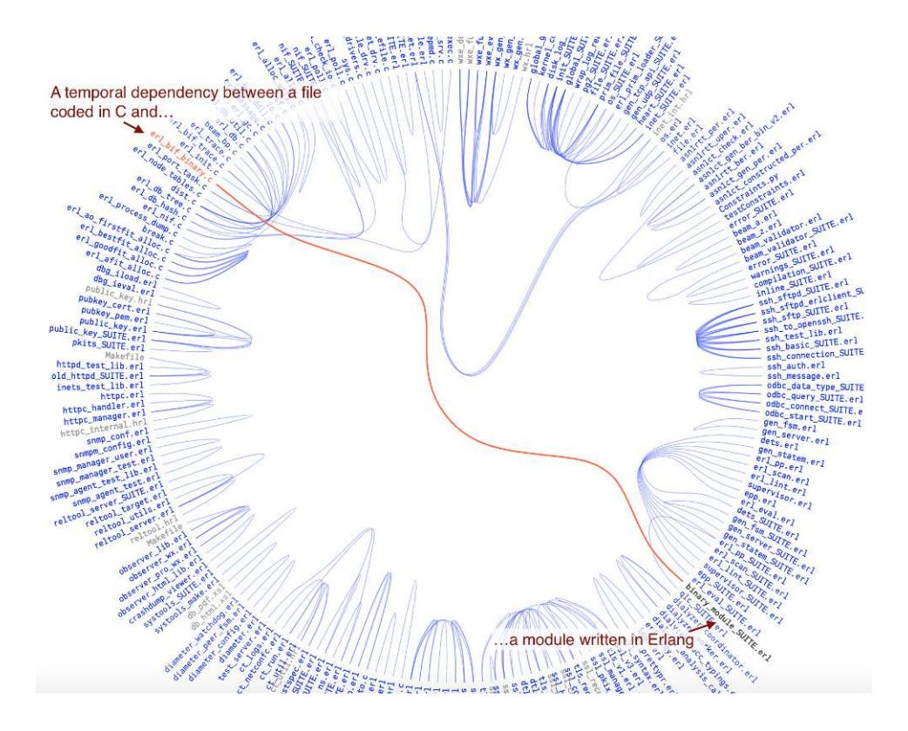

# Chapter 3: Coupling in Time: A Heuristic for the Concept of Surprise


<span id="page-49-2"></span><span id="page-49-0"></span>In this chapter we explore a concept called *change coupling*. You'll see how change coupling helps us design better software as we uncover expensive change patterns in our code. You'll also learn to uncover subtle relationships across clusters of files by analyzing change patterns between functions located in different files. This gives us a powerful strategy for iteratively improving our design based on feedback from how we work with the code.

<span id="page-49-1"></span>As always, we'll study the techniques on a real-world codebase to identify real problems. We'll continue to explore ASP.NET Core MVC. We'll also see that change coupling is a language-neutral concept by peeking at systems written in C, Erlang, and Python. Come along and learn how software evolution helps us improve code based on our past behavior as developers.

<span id="page-49-4"></span>
## Uncover Expensive Change Patterns

<span id="page-49-3"></span>Quick—how do we know if a software design is any good? Most answers concern facets of programming such as the importance of naming, testability, and cohesion. We'll go beyond that and assert that none of those qualities matter unless our software design supports the kind of changes we need to make to the code.

This insight isn't revolutionary in itself. What's surprising is that we, as an industry, haven't attempted to measure this aspect of code quality before. The main reason for our negligence is that time is invisible in code. As a consequence, we don't have any detailed mental models of how our codebase evolves. Sure, we may remember the implementation of some large feature that transformed parts of the system architecture. But in a large project the

details of how our codebase grows are distributed in the minds of hundreds of different programmers. Additionally, code under active development is a moving target, and details get lost over time due to the frailties of human memory and changes in staff.

<span id="page-50-1"></span>Fortunately, our version-control system remembers our past. Once we embrace that data source, we're able to factor in aspects of software development that we haven't been able to measure before. One such aspect is *change coupling*.

<span id="page-50-0"></span>
### What Is Change Coupling?

Change coupling is different from how we programmers typically talk about coupling. First, change coupling is invisible in the code itself—we mine it from our code's history and evolution. Second, change coupling means that two (or more) files change together over time, as shown in the next figure.



There are several criteria for change coupling. The first coupling criterion is when files are changed within the same commit. This is the simplest case and we'll stick to it in this chapter. In Chapter 9, *[Systems of Systems: Analyz](015-chapter-9-systems-of-systems-analyzing-multiple-repositories-and-microservices.md#page-173-0)[ing Multiple Repositories and Microservices](015-chapter-9-systems-of-systems-analyzing-multiple-repositories-and-microservices.md#page-173-0)*, on page 165, you'll learn more advanced strategies to identify change patterns that ripple across Git repository boundaries. Now let's look at an example of cochanging files.

The [figure on page 37](#page-51-1) shows a simple system with just three modules. We note that the FuelInjector and Diagnostics modules change together in both the first and the third commit. If this trend continues, there has to be some kind of relationship between the two modules that explains their intertwined evolution.

Of course, a cochange between two modules could be accidental, so we need some kind of threshold that helps us avoid false positives. The algorithm we use in this chapter considers two or more files to be coupled in time if 1) they change together in at least 20 commits and 2) the files are changed together in at least 50 percent of the total commits done to either file. That is, if I do

<span id="page-51-1"></span>

30 commits to file A and file B also gets changed in at least 20 of those commits, then we have change coupling.

#### Change Coupling Both Is and Isn't Temporal Coupling

<span id="page-51-3"></span>In my previous writings—and occasionally in the tooling—you may come across the term *temporal coupling* instead of *change coupling*. This is unfortunate since it overloads the term. The fault is all mine; I chose the temporal coupling name—unaware that it had a previous use—to emphasize the notation of cochange in time.

<span id="page-51-4"></span>

In its original use, *temporal coupling* refers to dependencies in call order between different functions. For example, *always invoke function* Init *before calling the* AccelerateToHyperspeed *method or bad things will happen*. This kind of temporal coupling is a code smell and is discussed in *[The Pragmatic Programmer: From Journeyman](021-bibliography.md#page-243-2) [to Master \[HT00\]](#page-243-2)*.

<span id="page-51-2"></span><span id="page-51-0"></span>With that covered, let's put change coupling to work by uncovering hidden dependencies in Microsoft's ASP.NET Core MVC codebase.<sup>1</sup> Since we used the same codebase back in Chapter 2, *[Identify Code with High Interest Rates](007-chapter-2-identify-code-with-high-interest-rates.md#page-29-0)*, [on page 15](007-chapter-2-identify-code-with-high-interest-rates.md#page-29-0), you've already explored parts of it. Just note that the code in the official repository is likely to have changed since this book was written, so point your browser to our forked snapshot to inspect the source code exactly as it looked at the time of this case study.<sup>2</sup>

## Detect Cochanging Files

The thresholds serve to limit the amount of change coupling we need to inspect. Even with those thresholds we may find a lot of change coupling in

<sup>1.</sup> <https://github.com/aspnet/Mvc>

<sup>2.</sup> <https://github.com/SoftwareDesignXRays/Mvc>

a system. That means we need a way to filter the results and focus on the parts that are most likely to illustrate flawed designs and true technical debt.

<span id="page-52-2"></span>My favorite heuristic is the concept of surprise. That is, you want to look for surprising patterns when investigating change coupling. There are two reasons for using surprise as a starting point:

- 1. *Surprise is one of the most expensive things you can put into a software architecture.* In particular, the poor maintenance programmer coming after us is likely to suffer the consequences of any surprising change pattern we've left in the design. Software bugs thrive on surprises.
- 2. *Change coupling itself is neither good nor bad; it all depends on context.* A unit test that changes together with the code under test is expected. In fact, we should be worried if that dependency weren't there since it would indicate that our tests aren't kept up to date. On the other hand, if two seemingly independent classes change together over time we might have discovered an erroneous abstraction, copy-pasted code, or—as is often the case—both.

<span id="page-52-1"></span>Let's look at the change-coupling results from ASP.NET Core MVC. As usual you can follow along online and interact with the visualizations.<sup>3</sup> As you see in the [figure on page 39,](#page-53-0) the analysis identifies a cluster of unit tests that tend to change together.

This visualization style is a *hierarchical edge bundle*, which is straightforward to implement using the JavaScript library D3.js.<sup>4</sup> In a hierarchical edge bundle visualization, each file is represented as a node and the change dependencies are shown as links between them. The files have also been sorted based on their containing folder, so files within the same folder are next to each other.

<span id="page-52-0"></span>If you follow along interactively, you can hover over a file to highlight its change couplings. You see an example in the [figure on page 39](#page-53-0), where a unit test, FormTagHelperTest.cs, has temporal dependencies on five other files.

When evaluating a change coupling analysis you also want to consider the degree of coupling, as we covered earlier in this chapter. In this case, that cluster of files has a high degree of coupling, ranging from 53 to 90 percent. That means that in more than half the changes you make to any of those files, there's a predictable change to the other files in the cluster. Not only is

<sup>3.</sup> <https://codescene.io/projects/1690/jobs/4245/results/code/temporal-coupling/by-commits>

<sup>4.</sup> <https://d3js.org/>

<span id="page-53-0"></span>

it expensive to maintain code like this, but it also puts us at risk of forgetting to update one of the files, with potentially severe consequences.

<span id="page-53-1"></span>So why would seemingly unrelated unit tests change together? ASP.NET Core MVC is a framework for building dynamic web applications. If we look at our change coupling visualization in the preceding figure, it's not entirely clear why a FormTagHelperTest.cs should be modified together with an AnchorTagHelperTest.cs. These files model different aspects of the problem domain and we'd expect them to evolve independently.

If we inspect the code, we see that there's no direct dependency between any of the files in the change-coupling cluster. That is, there's nothing on the code level that suggests why these unit tests evolve together. This is in contrast to the case where, say, an interface and the classes implementing that interface change together. We've found our first surprise! Let's see why seemingly unrelated code changes together.

<span id="page-54-0"></span>
### Minimize Your Investigative Efforts

<span id="page-54-3"></span>A change coupling analysis gives us information on how our code grows, which lets us detect implicit dependencies that point to code that's hard to maintain. Information is useful only if we act upon it, and a surprising change coupling relationship may be extremely time-consuming to investigate in more depth. Change coupling is something that happens over time, so we have to inspect the changes between different revisions of the involved files. That is, we need to inspect multiple historic revisions and try to spot some pattern. This is impractical and tedious, which means it's unlikely to ever happen.

Our case study of ASP.NET Core MVC shows why that's the case. The unit tests we need to inspect are fairly large files with about 1,000 lines of code each. In addition we have around 50 revisions to inspect. That boils down to a large amount of code distributed over time. So while a change coupling analysis is a great starting point to detect expensive change patterns in a codebase, it may be hard to act on that information.

<span id="page-54-2"></span>However, the harder the problem the greater the reward. We covered X-Ray analysis back in Chapter 2, *[Identify Code with High Interest Rates](007-chapter-2-identify-code-with-high-interest-rates.md#page-29-0)*, on page [15](007-chapter-2-identify-code-with-high-interest-rates.md#page-29-0), as we identified refactoring targets inside a hotspot. Now we'll use the same algorithm to identify the methods inside our cluster that are responsible for the change coupling. Just as we ran a hotspot analysis on a function/method level, we'll now run a change coupling analysis on the methods in the different files in our cluster. This step will bring us to a level where we can act on the analysis information.

#### Calculate Change Coupling from the Command Line


<span id="page-54-1"></span>The open source tool code-maat lets you calculate change coupling from the command line. While code-maat doesn't support the X-Ray level of analysis, it does give you enough information to launch your own investigation into unexpected change patterns. Check out Appendix 2, *[Code Maat: An Open Source Analysis Engine](018-appendix-a2-code-maat-an-open-source-analysis-engine.md#page-223-0)*, on [page 215](018-appendix-a2-code-maat-an-open-source-analysis-engine.md#page-223-0) for more details.

<span id="page-54-4"></span>If you follow along interactively, you can launch an X-Ray analysis by clicking on one of the files in the change coupling cluster, as shown in the [figure on](#page-55-0) [page 41](#page-55-0).

An X-Ray analysis has to parse the methods in each file, map them to the hunks that differ in each commit, and finally run a change coupling calculation on the resulting dataset. Note that the change coupling algorithm is identical to the one we used between files—only the level of detail is different. Let's

<span id="page-55-0"></span>

start with the dependency between LinkTagHelperTest.cs and ScriptTagHelperTest.cs since these two files have the strongest change coupling, with 90 percent. The following figure visualizes the cochanging methods in those files as a dependency wheel.



Each slice in the dependency wheel represents a method in a specific file. Since it's an interactive visualization you can hover over any of the methods to highlight its dependents. In this case we see that the method RendersLink-Tags\_WithFileVersion in LinkTagHelperTest.cs changes together with four (!) methods

in another unit test, ScriptTagHelperTest.cs. This looks expensive to maintain, so we should investigate this finding.

Every time we have a cluster of unit tests that evolve together we also need to inspect the code being tested. Our coupled unit tests may just be the messenger—not the problem itself—trying to tell us about a design issue in the application code. So have one more look at your change coupling between files, replicated in the following figure. Can you spot any change dependency from our cluster of unit tests to the application code?



<span id="page-56-0"></span>Interestingly enough, in this case the two unit tests change together more frequently (90 percent of all commits) than what the unit tests and their corresponding application code do (just 49 percent of all commits). At the same time we see that two classes related to our test suite, LinkTagHelper.cs and ScriptTagHelper.cs, also keep changing together. This is another surprise, and we'll return to it in the exercises at the end of this chapter. For now, we just note that individual commits don't tell the whole story. Sometimes you come across the pattern where a developer updates the unit tests in one commit and the related application code in another commit. Since we just look for change coupling inside the same commit, our algorithm misses such cases. In Part II of this book you'll learn about a powerful extension to the change coupling analysis that lets us uncover change coupling that's invisible in the code as well as in Git's commit log.

But for now we want to inspect any potential quality problems with the unittest code. Our starting point is to look for the usual suspects: missing abstractions or duplications in the test data. For example, the coupled methods may share the same input data or, more commonly, contain repeated and duplicated assertion statements. Let's look at an example from ScriptTagHelperTest.cs:

```
Assert.Equal("script", output.TagName);
Assert.False(output.IsContentModified);
Assert.Empty(output.Attributes);
Assert.True(output.PostElement.GetContent().Length == 0);
```

If you scroll through the file you see that this group of assertions is a pattern that's repeated, with small variations, in different methods across the files in our cluster. It's a duplication of knowledge since it repeats the postconditions of each test, with the consequence that we introduce undesirable change coupling. This, in turn, leads to expensive change patterns as minor modifications to the application code set off waves of changes that ripple across the methods in the unit tests.

If we look closer at the specific assertions in the code above we note two missing abstractions:

- *Test Data*: We need to model the domain of our tests and express the concept of test data. In the example code above we could introduce an ExpectedScriptTagOutput class to capture the repeated pattern, and each test could then instantiate an object of that class and parameterize it with the few context-specific values.
- <span id="page-57-0"></span>• *Assertions*: We need a specialized assertion statement that encapsulates our test criteria. We won't bother with the implementation details, but after a refactoring according to these recommendations, the previous group of assertions is replaced by a single statement: AssertContent(expected, output).

<span id="page-57-1"></span>By encapsulating both the test data and the assertion statements you introduce a model that's much more likely to stand the test of time, which means you no longer have to do shotgun surgery as you update a unit-test criterion.

## There Is No Such Thing as Just Test Code

<span id="page-57-2"></span>The design problem we just discussed is way too common. As a consequence, some of the worst hotspots and design issues tend to be in automated tests. My hypothesis is that we developers make a mental divide. On one hand we have the application code, and we know that it's vital to keep it clean and easy to evolve. On the other hand we have the test code, which we know isn't part of our production environment. The consequence is that the test code often receives considerably less love.

This is a dangerous fallacy because from a maintenance perspective there's really no difference between the two. If our tests lack quality, they will hold

us back. That's why you should focus your analysis efforts on test code, too. Another important point is to make sure your test code passes through the same quality gates (for example, code reviews and static analysis) as your application code. With this in mind, let's discuss our findings in more detail so we're prepared to deal with the issue when it occurs in our own code.

Behavioral code analysis helped us narrow down the problem in the case study to just five methods that we had to inspect. This, in turn, let us focus our refactoring efforts on the code that needs it the most. Now we'll take it a step further as we dive into the dirty secret of copy-paste and how it relates to unit tests.

<span id="page-58-1"></span>
<span id="page-58-0"></span>
## The Dirty Secret of Copy-Paste

While visualizations are important to get the overall picture, the numbers from an X-Ray analysis often provide more details that help uncover design issues. The next figure shows the detailed results from the X-Rays of Link-TagHelperTest.cs and ScriptTagHelperTest.cs.

| Copy-paste detections                                                                                                            | tion Coupling | <pre>\$ Commits</pre> | Similarity (%) |
|----------------------------------------------------------------------------------------------------------------------------------|---------------|-----------------------|----------------|
| LinkTagHelperTest.cs/RunsWhenRequiredAttributesArePresent ScriptTagHelperTest.cs/RunsWhenRequiredAttributesArePresent            | 44            | 41                    | 98             |
| LinkTagHelperTest.cs/MakeTagHelperOutput ScriptTagHelperTest.cs/MakeTagHelperOutput                                              | 32            | 41                    | 87             |
| LinkTagHelperTest.cs/DoesNotRunWhenARequiredAttributeIsMissing  ScriptTagHelperTest.cs/DoesNotRunWhenARequiredAttributeIsMissing | 32            | 41                    | 87             |

The table in the preceding figure presents an interesting finding. We see that several methods have a high degree of *code similarity*. That is, the implementation of several methods is very similar, which is an indication of copiedand-pasted code. For example, the highlighted row shows that there's a code similarity of 98 percent between two methods in different files. The [figure on](#page-59-0) [page 45](#page-59-0) shows part of the code, and you see that there's a shared test abstraction wanting to get out.

Since these methods are changed together in almost half the commits that touch those files, this is copy-paste that actually matters for your productivity. Let me clarify by revealing a dirty secret about copy-paste.

<span id="page-59-0"></span>LinkTagHelperTest.cs ScriptTagHelperTest.cs public void RunsWhenRequiredAttributesArePresent( public void RunsWhenRequiredAttributesArePresent( TagHelperAttributeList attributes. TagHelperAttributeList attributes Action<LinkTagHelper> setProperties) Action<ScriptTagHelper> setProperties) // Arrange // Arrange var context = MakeTagHelperContext(attributes); var context = MakeTagHelperContext(attributes); var output = MakeTagHelperOutput("link");
var hostingEnvironment = MakeHostingEnvironment(); var output = MakeTagHelperOutput("script");
var hostingEnvironment = MakeHostingEnvironment(); var viewContext = MakeViewContext(); var viewContext = MakeViewContext(); var globbingUrlBuilder = new Mock<GlobbingUrlBuilder>( var globbingUrlBuilder = new Mock<GlobbingUrlBuilder>( new TestFileProvider() new TestFileProvider() Mock.Of<IMemoryCache>(), Mock.Of<IMemoryCache>(). PathString.Empty); PathString.Empty); globbingUrlBuilder.Setup(g => g.BuildUrlList( globbingUrlBuilder.Setup(g => g.BuildUrlList( It.IsAny<string>(),
It.IsAny<string>(), It.IsAny<string>()))
.Returns(new[] { "/common.js" }); It.IsAny<string>(),
It.IsAny<string>(), It.IsAny<string>())) .Returns(new[] { "/common.css" }); /ar helper = new ScriptTagHelper(
 hostingEnvironment, var helper = new LinkTagHelper( hostingEnvironment, Only minor variations MakeCache(), MakeCache(), in setup new HtmlTestEncoder(), new HtmlTestEncoder(), new JavaScriptTestEncoder(), new JavaScriptTestEncoder(), MakeUrlHelperFactory()) MakeUrlHelperFactory()) ViewContext = viewContext, ViewContext = viewContext, GlobbingUrlBuilder = globbingUrlBuilder.Object GlobbingUrlBuilder = globbingUrlBuilder.Object setProperties(helper); setProperties(helper);

### Clone Detection 101

<span id="page-59-1"></span>Copy-paste detectors are underused in our industry despite the obvious risks and costs associated with software clones. The pioneering work in this field was done by Brenda Baker in her seminal paper *On Finding Duplication and Near-Duplication in Large Software Systems [Bak95]*. There are several clone-detection algorithms to chose from, all with different trade-offs. The simplest algorithms look for common text patterns in the code. More elaborate clone detectors compare the *abstract syntax trees* to detect structural similarities and yield better precision.<sup>5</sup>

<span id="page-59-2"></span>

These algorithms are implemented by several open and commercial clone detectors. For example, I use *Clone Digger* for Java and Python, and *Simian* for .NET code. It's also an interesting learning experience to implement a simple clone detector yourself. The *Rabin–Karp algorithm* is a good starting point (see *Efficient randomized pattern-matching algorithms* [KR87]).

In the previous chapter we saw that low-quality code isn't necessarily a problem. Now we'll challenge another wide-spread belief by asserting that copy-paste code isn't always bad.

<sup>5.</sup> https://en.wikipedia.org/wiki/Abstract syntax tree

<sup>6.</sup> http://clonedigger.sourceforge.net/

<sup>7.</sup> http://www.harukizaemon.com/simian/

<span id="page-60-4"></span>Like everything else, the relative merits of a coding strategy depend on context. Copy-paste isn't a problem in itself; copying and pasting may well be the right thing to do if the two chunks of code evolve in different directions. If they don't—that is, if we keep making the same changes to different parts of the program—that's when we get a problem.

<span id="page-60-2"></span>This is important since research on the topic estimates that in your typical codebase, 5–20 percent of all code is duplicated to some degree. (See *[On](021-bibliography.md#page-241-4) [Finding Duplication and Near-Duplication in Large Software Systems \[Bak95\]](#page-241-4)* and *[Experiment on the Automatic Detection of Function Clones in a Software](021-bibliography.md#page-243-4) [System Using Metrics \[MLM96\]](#page-243-4)* for studies of commercial software systems.) That's a lot of code. We can't inspect and improve all of it, nor should we. Just as with hotspots, we need to prioritize the software clones we want to get rid of. The change coupling analysis combined with a code-similarity metric is a simple and reliable way to identify the software clones that really matter for your productivity and code quality. Again, note that this is information you cannot get from the code alone; we need a temporal perspective to prioritize the severity of software clones.

<span id="page-60-3"></span>Once we've identified the software clones that matter, we want to refactor them. We typically approach that refactoring by extracting the repeated pattern into a new method and parameterizing it with the concept that varies. This makes the code a little bit cheaper to maintain as our temporal dependency disappears. We also get less code, and that's good because all code carries a cost. It's a *liability*. 8 The more code we can remove while still getting the job done, the better. Killing software clones is a good starting point here.

<span id="page-60-1"></span>
<span id="page-60-0"></span>
## The Power of Language-Neutral Analyses

<span id="page-60-5"></span>So far we've been torturing ASP.NET Core MVC—a .NET codebase. However, these techniques aren't limited to a particular technology. The analyses are language neutral, which means we can analyze any kind of code and use the same measures to reason about it.

The power of language-neutral analyses is that we can spot relationships between files implemented in different languages. This is important because today's systems are often polyglot codebases. We have an example in the implementation of the programming language Erlang, as shown in the [figure](#page-61-0) [on page 47.](#page-61-0) 9

<sup>8.</sup> <https://blogs.msdn.microsoft.com/elee/2009/03/11/source-code-is-a-liability-not-an-asset/>

<sup>9.</sup> <https://codescene.io/projects/1707/jobs/4287/results/code/temporal-coupling/by-commits>

<span id="page-61-0"></span>

<span id="page-61-1"></span>That figure shows a change coupling between erl\_bit\_binary.c, written in C, and binary\_module\_SUITE.erl, written in Erlang. We could X-Ray those two files to find out why, but for now we've gotten a hint of the power of language-neutral software analyses.

<span id="page-61-2"></span>Being language neutral means we're able to uncover change patterns that ripple across our technology stack—for example, front-end code that changes together with server-side logic and database scripts. This is information that we use to understand a codebase by uncovering how different pieces of code fit together. (The pioneering research in this area is documented in *[Mining](021-bibliography.md#page-244-7) [Version Histories to Guide Software Changes \[ZWDZ04\]](#page-244-7)* and shows the value of this much underused technique.)

We return to this topic in the exercises and we'll explore it in much more depth in the second part of this book. I promise.

## Learn More About Change Coupling

Change coupling helps us determine if our design fits the way we work with the code. We saw how a change coupling analysis helped us identify missing abstractions in unit tests and possible design issues in the corresponding application code. We still had to analyze the problematic code and come up with remedies ourselves. The big win is that we can now focus our expertise to where it's likely to pay off, and ensure our refactorings have a real impact on our ability to maintain the system.

There's much more to say about change coupling. Just as we can drill deeper from files to change coupling between methods, we can also travel in the opposite direction and analyze change coupling between components and subsystems, which we'll study in depth in the second part of this book.

By combining hotspots with change coupling we're able to detect maintenance issues in individual files and across clusters of related files. Now we need to react to that information. The next chapter addresses the challenges of improving code that's under active development by multiple programmers and teams.

<span id="page-62-2"></span>
<span id="page-62-0"></span>
## Exercises

<span id="page-62-1"></span>Once you start to apply change coupling analyses to your own code, you'll discover that the information is useful beyond uncovering technical debt. The following exercises let you explore different use cases for the analysis information. You also get to fill in the missing piece in our ASP.NET Core MVC case study as you uncover software clones in application code.

## Learn from the Change Patterns in a Codebase

• Repository: Roslyn<sup>10</sup>

• Language: Visual Basic and C#

- Domain: Roslyn implements the C# and Visual Basic compilers, including an API for code analysis.
- Analysis snapshot: [https://codescene.io/projects/1715/jobs/4299/results/code/temporal](https://codescene.io/projects/1715/jobs/4299/results/code/temporal-coupling/by-commits)[coupling/by-commits](https://codescene.io/projects/1715/jobs/4299/results/code/temporal-coupling/by-commits)

Surprisingly, most of our work as developers doesn't involve writing code. Rather, most of our time is spent understanding existing code. Change coupling provides a learning vehicle that lets us uncover how different pieces of code fit together. Therefore, a change coupling analysis is a good way to explore a new codebase and identify change patterns that would otherwise surprise us. This is particularly useful in polyglot codebases.

<sup>10.</sup> <https://github.com/dotnet/roslyn>

Go to the change coupling analysis for Roslyn and look for files with a strong degree of change coupling, like 90 percent. Investigate the change patterns and determine if they are expected or surprising.

### Detect Omissions with Internal Change Coupling

• Repository: TensorFlow<sup>11</sup>

• Language: Python

• Domain: TensorFlow is a machine-learning library originating at Google.

<span id="page-63-2"></span>• Analysis snapshot: [https://codescene.io/projects/1714/jobs/4295/results/files/internal](https://codescene.io/projects/1714/jobs/4295/results/files/internal-temporal-coupling?file-name=tensorflow/tensorflow/contrib/layers/python/layers/layers.py)[temporal-coupling?file-name=tensorflow/tensorflow/contrib/layers/python/layers/layers.py](https://codescene.io/projects/1714/jobs/4295/results/files/internal-temporal-coupling?file-name=tensorflow/tensorflow/contrib/layers/python/layers/layers.py)

Change coupling is capable of providing design insights on a single file, too. We'll explore that in more detail in the next chapter, but the basic principle is that you look for functions in a single file that tend to change together. In particular, you want to look for functions with a high degree of similarity since those often point to a missing abstraction and an opportunity to refactor the code.

<span id="page-63-1"></span>In this exercise we'll look at two such functions. Run an X-Ray of tensorflow/contrib/layers/python/layers/layers.py. Inspect the *internal change coupling* results and compare the two functions convolution2d\_transpose and fully\_connected. Look at the chunks of code that differ between the two files. Are there any possible omissions that show the presence of potential bugs? Any style issues to be aware of?

*Hint*: Investigate and compare the conditional logic between the two functions.

### Kill the Clones

• Repository: ASP.NET Core MVC<sup>12</sup>

• Language: C#

- <span id="page-63-0"></span>• Domain: This codebase implements a model-view-controller framework for building dynamic websites.
- Analysis snapshot: [https://codescene.io/projects/1690/jobs/4245/results/code/temporal](https://codescene.io/projects/1690/jobs/4245/results/code/temporal-coupling/by-commits)[coupling/by-commits](https://codescene.io/projects/1690/jobs/4245/results/code/temporal-coupling/by-commits)

In this chapter we saw that unit tests coupled in time often hint at a deeper design problem with the code under test. That means we should explore the

<sup>11.</sup> <https://github.com/tensorflow/tensorflow>

<sup>12.</sup> <https://github.com/aspnet/Mvc>

code under test, too, once we find a surprising change pattern between seemingly unrelated unit tests.

Go to the change coupling analysis of ASP.NET Core MVC and explore the change coupling between LinkTagHelper.cs and ScriptTagHelper.cs. Run an X-Ray analysis on these two classes and see if you can detect any quality issues. In particular, look at the code-similarity metrics and see if you can suggest a refactoring that breaks the change coupling.

<span id="page-65-0"></span>➤ Edsger Dijkstra

CHAPTER 4
