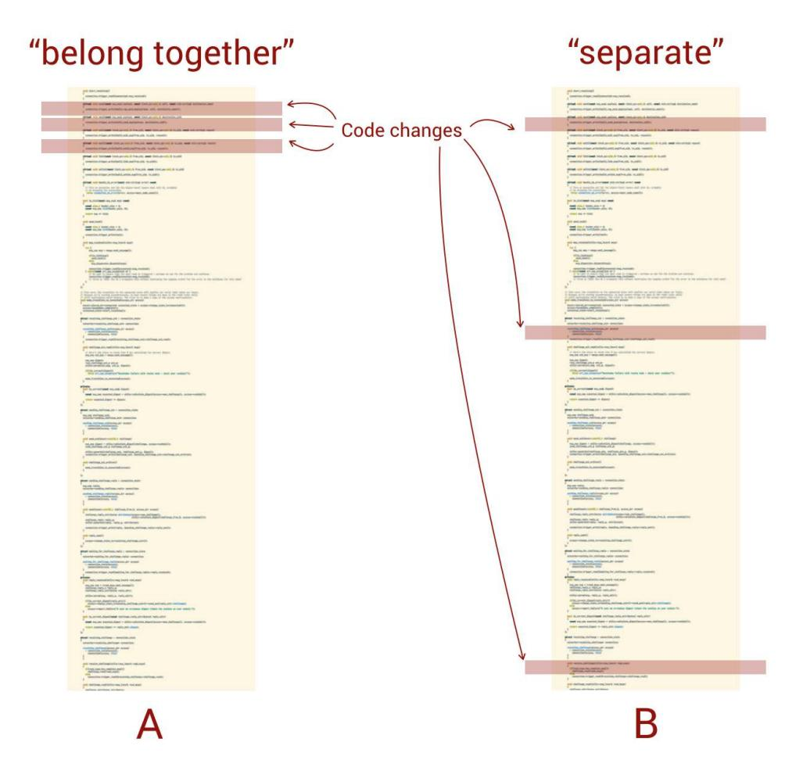
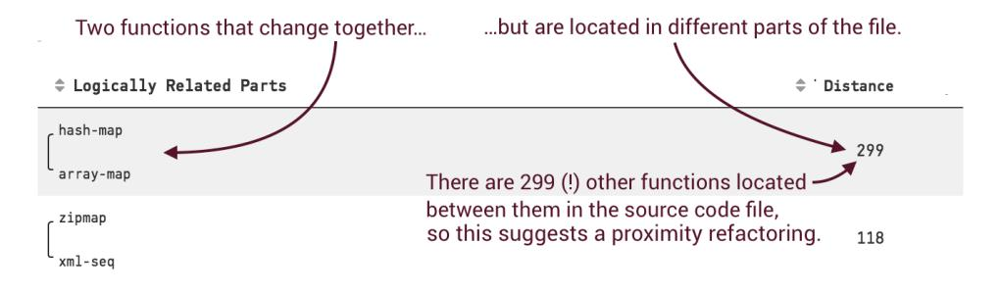
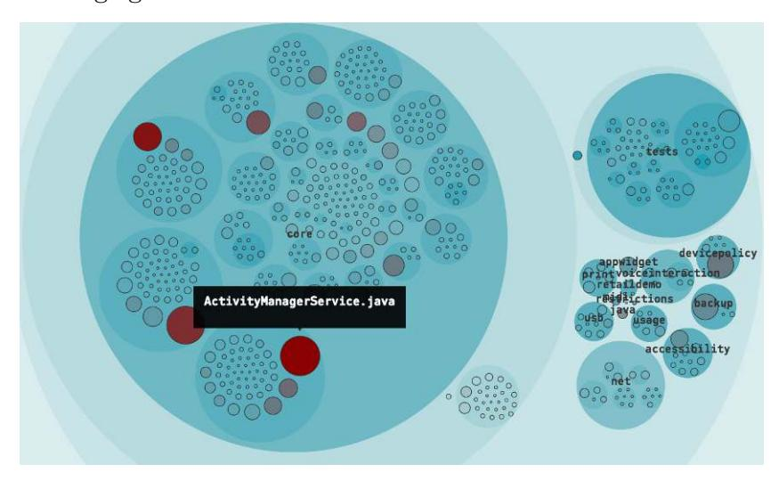
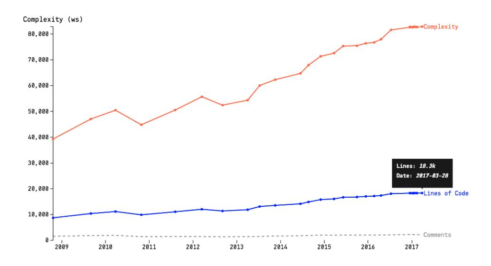
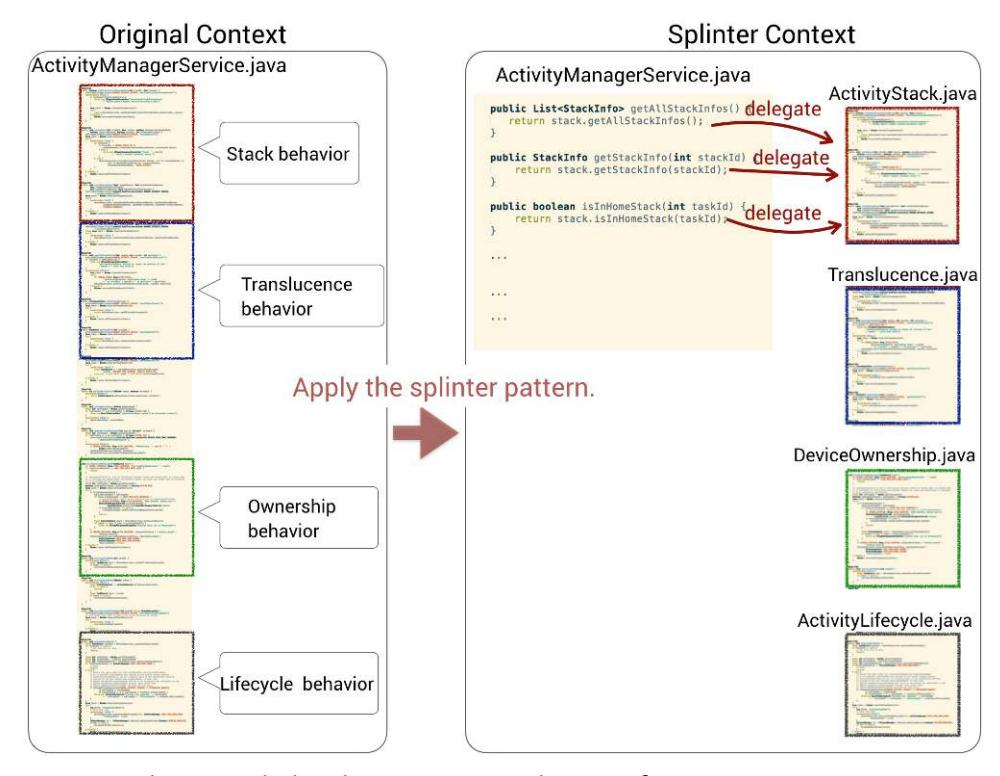
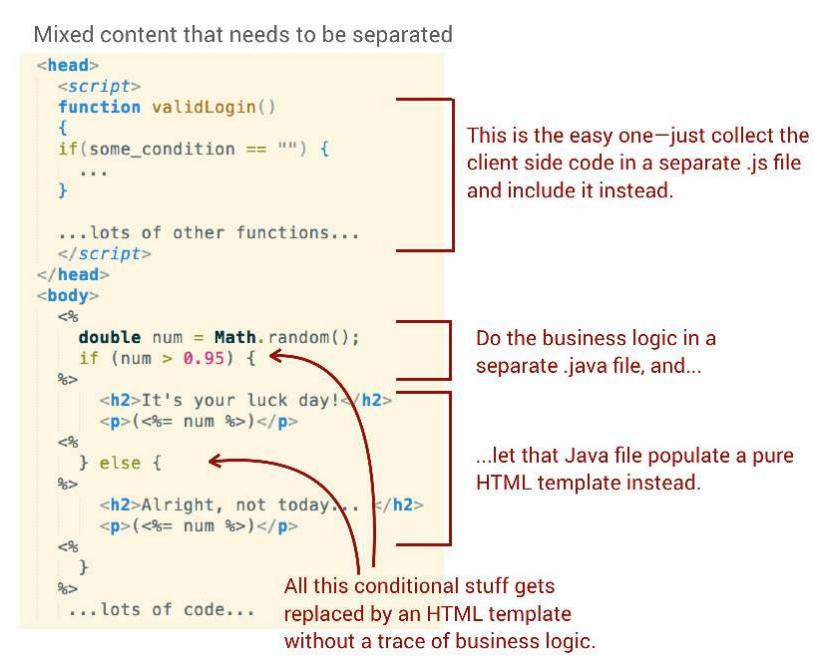
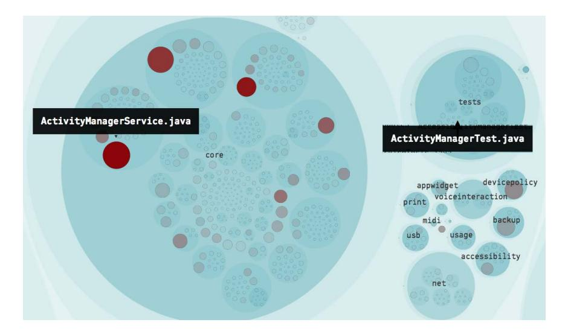
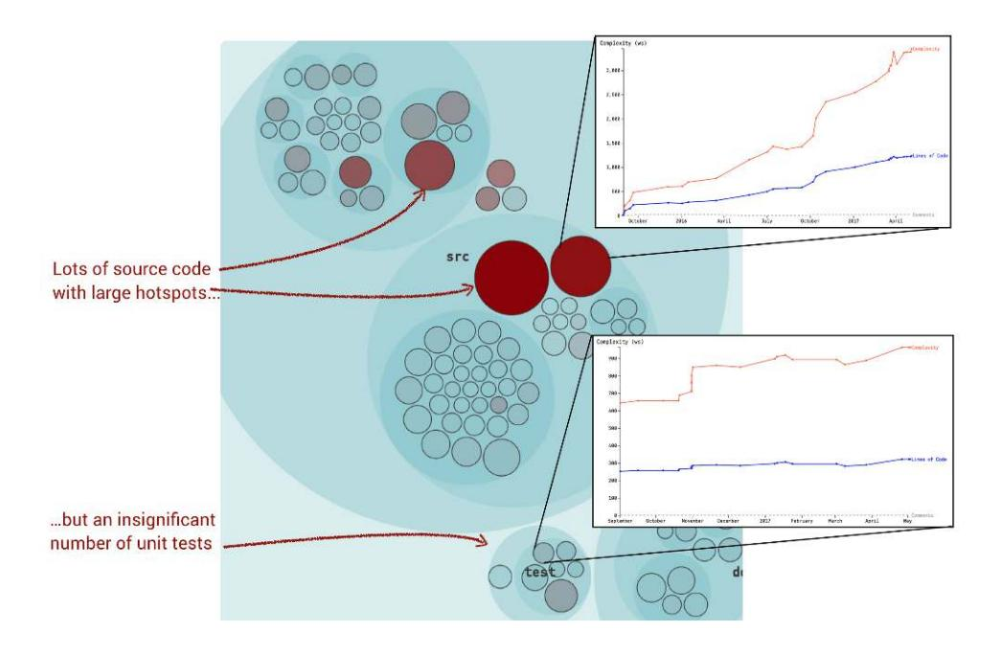

# Chapter 4: Pay Off Your Technical Debt

<span id="page-65-4"></span>Now that we've uncovered hotspots and surprising temporal coupling in our codebase, we need to put that information to use. This is often easier said than done. Even armed with the existing catalogs of refactoring techniques, we need to consider the people side of code, too. Refactoring code that's under heavy development, perhaps even shared between multiple teams, adds another dimension to the problem.

This chapter introduces refactoring strategies that let you improve code iteratively to limit the disturbance to the rest of the business. The strategies build on the evolutionary analyses you mastered in the earlier chapters, which lets you drive refactoring by using data about how your team works with the code.

<span id="page-65-1"></span>This chapter is also the most technical one in the book, so feel free to skip ahead to the next chapter if you're more interested in the strategic importance of the analysis information. If you're still here, let's get ready for proximity—a much underused design principle.

<span id="page-65-3"></span>
## Follow the Principle of Proximity

The principle of proximity focuses on how well organized your code is with respect to readability and change. Proximity implies that functions that are changed together are moved closer together. Proximity is both a design principle and a heuristic for refactoring hotspots toward code that's easier to understand.

<span id="page-65-2"></span>Let's pretend you run an X-Ray analysis on a large hotspot and as you look at its internal change coupling, you identify several cases of obvious code duplication.

You see an example of such code duplication in the [figure on page 52](#page-66-0), and the gut reaction is to extract the commonalities into a shared abstraction. In

<span id="page-66-0"></span>

| <pre>\$ Coupled Functions</pre>                         | Degree of<br>Coupling<br>• (%) | Average<br>\$ Revisions | Similarity |
|---------------------------------------------------------|--------------------------------|-------------------------|------------|
| OfType_Select OfType_Select_OfType_Select               | 100                            | 41                      | 93         |
| String_EndsWith_MethodCall String_StartsWith_MethodCall | 100                            | 33                      | 85         |
| String_Contains_MethodCall String_EndsWith_MethodCall   | 100                            | 33                      | 56         |
| String Contains MethodCall                              | 100                            | 33                      | 51         |

<span id="page-66-1"></span>many cases that's the correct approach, but sometimes a shared abstraction actually makes the code *less* maintainable. Follow along as we explore an example and come up with a better alternative.

The preceding change coupling results are from an X-Ray of the hotspot test/EFCore.SqlServer.FunctionalTests/QuerySqlServerTest.cs in the codebase for Entity Framework Core, which is an object-relational mapper for .NET. You can view the whole file on GitHub, in the state it was at the time of writing, or follow along in the online analysis results.

These analysis results show that the methods String\_EndsWith\_MethodCall and String\_StartsWith\_MethodCall change together in 100 percent of commits and have done that in 33 shared commits. This is a strong temporal dependency and the similarities in method names indicate that the responsibilities are closely related. Let's look at the code, shown in the figure on page 53, to see how we can refactor it.

As you see in the figure on page 53, there's a fair chunk of duplication between these two implementations. Take a minute and think about how you'd refactor away from that duplication before you read on. I'll do some thinking on my side, too, and wait for you here.

<sup>1.</sup> https://github.com/aspnet/EntityFrameworkCore

https://github.com/SoftwareDesignXRays/EntityFrameworkCore/blob/dev/test/EFCore.SqlServer.FunctionalTests/ OuervSqlServerTest.cs

https://codescene.io/projects/1716/jobs/4314/results/files/internal-temporal-coupling?file-name=EntityFrameworkCore/test/EFCore.SqlServer.FunctionalTests/QuervSqlServerTest.cs

A fundamental principle of software design is to encapsulate the concept that varies. Applied to our case we could

- 1. introduce a common test method that encapsulates the bulk of our SQL query;
- 2. parameterize our new, shared method with the differences in the respective WHERE clauses; and
- 3. make the test data-driven, which removes all traces of any duplication.

While those steps would get rid of the duplication, the new abstractions would leave the code in a *worse* state. To abstract means to take away. As we raise the abstraction level through a shared method, the two test cases lose their communicative value. Unit tests serve as an excellent starting point for newcomers in a codebase. When we take abstractions too far we lose that advantage by obscuring the behavior we want to communicate through the tests.

As programmers we are conditioned to despise copy-paste code, but there's always a trade-off as we refactor two methods into a shared abstraction. Even when the original code is nearly identical, the two methods may well model different aspects of the problem domain. When we refactor such code into a shared representation we give that new method different reasons to change,

and when that happens our shared abstraction breaks down in a heavy rain of control flags and Boolean parameters, which is a worse problem than the original duplication.

The amount of duplicated knowledge is simply too small in this case to motivate a shared abstraction. This is a hard balance because we do want to simplify future maintenance and at least warn future developers of the deliberate code duplication. Let's see how the principle of proximity helps us achieve these goals.

<span id="page-68-0"></span>
### Use Your Perception

A century ago the movement of *Gestalt psychology* formed theories on how we make sense of all chaotic input from our sensory systems.<sup>4</sup> The *proximity principle* is a Gestalt theory that specifies that objects or shapes that are close to each other appear to form groups. This is why our brains sometimes perceive multiple, distinct parts as a whole, as the following figure illustrates.

| One group? | Thr     | ee grou | ps?     |
|------------|---------|---------|---------|
| 00000      | $\circ$ | $\circ$ | $\circ$ |
| 00000      | $\circ$ | $\circ$ | $\circ$ |
| 00000      | $\circ$ | $\circ$ | $\circ$ |
| 00000      | $\circ$ | $\circ$ | $\circ$ |
| 00000      | $\circ$ | $\circ$ | $\circ$ |
| 00000      | $\circ$ | $\circ$ | $\circ$ |

If we translate the proximity principle to software, it means we should favor a structure that guides our code-reading brain toward interpreting related parts of the source file as a group. Let's look at a specific example by considering the information carried by the changes we make to our code, shown in the [figure on page 55](#page-69-0).

In the this figure, both case A and B show three hypothetical changes that form a single commit. However, there's a different effort behind them although the same amount of code gets changed. Remember that as developers we spend most of our time trying to understand existing code. With the proximity principle in mind, case A exhibits a change pattern that suggests a group of related functionality. This is in contrast to case B, where the parts that make up a concept are distributed, which means we initially—and falsely—perceive these as unrelated functions.

<sup>4.</sup> [https://en.wikipedia.org/wiki/Gestalt\\_psychology](https://en.wikipedia.org/wiki/Gestalt_psychology)

<span id="page-69-0"></span>

Now, let's return to the code duplication we identified in Entity Framework Core, where we found the methods String\_EndsWith\_MethodCall and String\_StartsWith\_ MethodCall change together. If you look at the whole file you see that there are 50 lines of code between these two methods. More important, there are three other methods modeling different behavior interspersed between them. We improve this code, as the figure on page 56 illustrates, by moving methods that belong together close to each other.

The proximity principle is a much-underused refactoring technique that uses feedback from how our code evolves. By ordering our functions and methods according to our change patterns we communicate information that isn't expressible in programming-language syntax. That information serves as a powerful guide to both the programmer and, more important, the code reader on which parts belong together and how we expect the code to grow.

<span id="page-70-1"></span>
## Automate Proximity Recommendations

Software evolution lets you take the concept a step further and get automated recommendations on proximity refactorings. Let's look at the following figure, which shows an example from the implementation of the programming language *Clojure*. 5



<sup>5.</sup> <https://github.com/clojure/clojure>

<span id="page-71-2"></span>The recommendations in the figure are built on change coupling, where you identify pairs of functions that evolve together. Once you've found your pairs of cochanging functions, it's straightforward to calculate the distance between them. This example uses the number of intervening functions as a distance metric (the Distance column in the preceding table). An alternative would be to count the number of lines of code separating the functions, which captures declarations too.

<span id="page-71-6"></span>The main advantage of a proximity refactoring is that it carries low risk. If you detect copy-paste code the day before a critical deadline, it may just not be the right time to abstract away the duplication. A proximity refactoring presents a viable alternative that serves as a mental note that the two functions belong together, which reduces the risk that the next programmer will forget to update one of the clones. It's that simple.

<span id="page-71-3"></span>You also use the principle of proximity as you write new code. Each module has methods on different levels of abstraction. The major distinction is between the *external protocol* of your module (the public API) and the private methods used to implement it (the *internal protocol*). In well-designed code you want to express the concepts of your internal protocol on a granular level, which means you tend to get several small functions that together represent a specific concept. To maintain a brain-friendly structure you need to keep those related functions close to each other in your source code.

## Joe asks:


<span id="page-71-1"></span><span id="page-71-0"></span>That happens, and it's usually an indication that there's a missing abstraction looking to get out. In that case, check if it makes sense to extract those methods into their own module. Often, you can also introduce a method representing the higher-level concept and let that method compose calls to the lower-level methods. Organize the affected methods in reading order.

<span id="page-71-5"></span>
## Refactor Congested Code with the Splinter Pattern

<span id="page-71-4"></span>The *splinter pattern* provides a structured way to break up hotspots into manageable pieces that can be divided among several developers to work on, rather than having a group of developers work on one large piece of code. You use the splinter pattern to improve code that's gone too far over the edge of complexity.

The main reason a piece of code grows into a hotspot is because it has accumulated several central responsibilities. As a consequence, the hotspot has

many reasons to change. This leads to a downward spiral where every interesting new feature has to touch the hotspot code, which reinforces its change rate by adding yet another responsibility. Unless we catch that downward spiral early—for example, by supervising our complexity trends—we end up with code that's both hard and risky to refactor. Let's look at an example in the following figure.



<span id="page-72-0"></span>This figure shows the main hotspots in a part of the *Android* system.<sup>6</sup> The top hotspot, ActivityManagerService.java, is a file with almost 20,000 lines of code. Its complexity trend, shown in the [figure on page 59,](#page-73-0) reveals that the file has grown by 7,000 lines over the past four years. That's a lot of new behavior.

<span id="page-72-1"></span>A hotspot like ActivityManagerService.java is likely to continue to grow and each additional line of code will come at a high cost in terms of future maintenance. If we find similar hotspots in our own code we have to react and start to invest in improvements. That is, we need to refactor.

There a several good books that help you refactor existing code. *[Refactoring:](021-bibliography.md#page-242-3) [Improving the Design of Existing Code \[FBBO99\]](#page-242-3)* and *[Working Effectively with](021-bibliography.md#page-242-0) [Legacy Code \[Fea04\]](#page-242-0)* are both classics that offer practical and proven techniques. *[Refactoring for Software Design Smells: Managing Technical Debt](021-bibliography.md#page-244-8) [\[SSS14\]](#page-244-8)* is a new addition that is particularly valuable if you work with objectoriented techniques. However, in a case like the preceding Android hotspot we need preparatory steps before we can apply those refactoring techniques. Let's investigate why that's the case.

<sup>6.</sup> [https://github.com/android/platform\\_frameworks\\_base](https://github.com/android/platform_frameworks_base)

<span id="page-73-0"></span>

<span id="page-73-1"></span>
### Parallel Development Is at Conflict with Refactoring

Refactoring a hotspot like ActivityManagerService.java takes months, and during that time you want to minimize any feature development and bug fixes in your refactoring target. However, there will likely be lots of parallel work in the hotspots as they represent critical parts of the codebase. This leads to high-risk merges as multiple development teams constantly modify the same code you're trying to refactor. As a result, our refactoring goal conflicts with the short-term evolution of the overall system, and most organizations just cannot afford to pause ongoing work so that we can refactor in a safe, development-free vacuum.

The splinter pattern resolves this dilemma by recognizing that refactoring a hotspot is an iterative process that stretches over multiple incarnations of the code. In a splinter refactoring you won't even improve the code quality as such, but rather transform the code to a structure where multiple people can work together in parallel toward the overall refactoring goal.

## Split a Hotspot File Along Its Responsibilities

The intent of the *splinter* pattern is to break a hotspot into smaller parts along its responsibilities while maintaining the original API for a transient period. Just like real-world splinters are small, sharp objects, you probably find that the resulting set of modules aren't optimal. They have their edges and rough corners, but


<span id="page-74-1"></span>remember—we're not after perfection here. We just want to take the first, albeit hardest, step toward a more maintenance-friendly design.

<span id="page-74-0"></span>The following figure shows a hypothetical refactoring of ActivityManagerService.java from the Android codebase. As you see, we've identified four behaviors that we extract into new and more cohesive classes. You also see that we keep the original method signatures and replace the method bodies with a simple delegation to the extracted modules. This is to protect the rest of the system from changes related to our refactoring. Remember, you use splinter refactoring in code that's under heavy parallel development. If we broaden our scope too early we expose the rest of the organization to conflicting changes, which is why we take this extra step and limit the ripple effects across other modules.



<span id="page-74-2"></span>Here are the steps behind an iterative splinter refactoring:

- 1. *Ensure your tests cover the splinter candidate*. If you don't have an adequate test suite—few hotspots do—you need to create one, as discussed in *[Build Temporary Tests as a Safety Net](#page-78-0)*, on page 64.
- 2. *Identify the behaviors inside your hotspot*. This step is a code-reading exercise where you look at the names of the methods inside the hotspot and identify code that forms groups of behaviors.

- 3. *Refactor for proximity*. You now form groups of functions with related behavior inside the larger file, based on the behaviors you identified earlier. This proximity refactoring makes your next step much easier.
- 4. *Extract a new module for the behavior with the most development activity*. Use an X-Ray analysis to decide where to start, then copy-paste your group of methods into a new class while leaving the original untouched. Remember to put a descriptive name on your new module to capture its intent.
- 5. *Delegate to the new module*. Replace the body of the original methods with delegations to your new module. This allows you to move forward at a fast pace, which limits the risk for conflicting changes by other developers.
- 6. *Perform the necessary regression tests to ensure you haven't altered the behavior of the system*. Commit your changes once those tests pass.
- 7. *Select the next behavior to refactor and start over at step 4*. Repeat the splinter steps until you've extracted all the critical hotspot methods you identified with your X-Ray analysis.

The key to a successful splinter refactoring is to prioritize your next move with evolutionary data, because there's no way we can refactor a major hotspot in one sweep. The X-Ray analysis you learned in *[Use X-Rays to Get Deep](007-chapter-2-identify-code-with-high-interest-rates.md#page-41-0) [Insights into Code](007-chapter-2-identify-code-with-high-interest-rates.md#page-41-0)*, on page 27, lets you identify the code with the highest interest rate inside your hotspot. Therefore, an X-Ray analysis serves well to prioritize splinters.

### Use Static Analysis to Guide Code Explorations

<span id="page-75-1"></span>

Static analysis tools such as PMD, NDepend, and SonarQube complement evolutionary analyses and provide additional insights —for example, by detecting dependency cycles between methods.<sup>7</sup>

<span id="page-75-0"></span>
## Separate Code with Mixed Content

Files that contain more than one language add another challenge to the splinter pattern. This is often the case in legacy technologies that encourage a mixture of application logic and presentation elements in the same file. PHP is the most notorious example, but you find the same pattern in other languages too. For example, a Java Server Pages (JSP) file could well mix Java-Script, HTML, SQL, and CSS into its Java code.

<sup>7.</sup> <https://pmd.github.io/>, <http://www.ndepend.com/>, <https://www.sonarqube.org/>

Before you apply a splinter refactoring you need to extract the different implementation languages into separate files. That is, you start from a technical perspective and split your hotspot based on technical content. The following figure shows an example.



<span id="page-76-2"></span><span id="page-76-0"></span>Once you've done that separation it will be much easier to identify the behaviors hiding in the original technology soup. An added advantage is that you can now start to use tools like *Lint* that help you catch common mistakes in the client-side code.

<span id="page-76-1"></span>
## Signal Incompleteness with Names

During a splinter refactoring you may find that a particular cluster of behavior shares code with other seemingly unrelated methods in the original hotspots. Such dependencies hinder the refactoring, so let's discuss the viable strategies.

The figure on page 63 shows a common case where a piece of code is shared between two potential splinter candidates.

In such cases you have two choices:

- 1. Duplicate the shared method in your splinters, or
- 2. maintain a shared abstraction in a new module that both splinters depend upon.

As you refactor to a splinter you may find that duplicating previously shared code isn't that bad since you're often able to simplify it by removing branches and arguments. That's possible because shared code inside a hotspot tends to become "reused" to support additional scenarios. (You see an example with the Boolean argument in the preceding figure.) In your new splinter, special cases lose relevance since the context is narrower, which means you're free to remove the corresponding conditional logic.

If you chose the second alternative you have the opportunity to signal a potentially low cohesion of the code by introducing a name that communicates incompleteness. That is, avoid generic names like misc, util, or common and choose a provocative name like Dumpster.java. That name makes it clear the shared module needs future work and discourages subsequent growth of the module. After all, who wants to put their carefully crafted code in a dumpster?

<span id="page-77-2"></span>
## Know the Consequences of Splinters

<span id="page-77-1"></span>A splinter refactoring creates a new context where you address a larger problem by breaking it into smaller parts. The hotspot now acts as a facade that maintains the original API, which in turn shields the clients of the hotspot from impact. Without this first step your changes ripple across modular boundaries, which increases the risk of the refactoring because you're no longer dealing with a local change.

Once you've extracted all splinters you're ready to apply traditional refactorings. For example, the next step after creating a splinter is to remove the middle man (a refactoring described in *[Refactoring: Improving the Design of](021-bibliography.md#page-242-3) [Existing Code \[FBBO99\]](#page-242-3)*) and let the clients of the original hotspot access the splinters directly without any delegation.

<span id="page-78-4"></span>You may also find that several splinter modules won't need refactorings. The power law curve of development activity that we discussed back in [Chapter](007-chapter-2-identify-code-with-high-interest-rates.md#page-29-0) 2, *[Identify Code with High Interest Rates](007-chapter-2-identify-code-with-high-interest-rates.md#page-29-0)*, on page 15, holds true for splinter modules too. The implication is that some new modules are likely to be stable in terms of future work and you identify those modules with a hotspot analysis at a later date. However, in that analysis you only include the development activity that took place *after* your splinter refactoring:

- <span id="page-78-1"></span>• To only get commits that are more recent than your refactoring, you provide a --after=<date> flag to git. This makes it easy to calculate interest rates like we did in the code on page 17.
- <span id="page-78-3"></span>• If you use CodeScene you just go to your analysis project and specify the desired start date.

<span id="page-78-5"></span>Used this way a hotspot analysis takes on the role of a guide that lets you prioritize future refactorings based on recent development patterns.

Even with splinters, refactoring a hotspot is high risk and it may be tempting to do it on a separate branch. Don't go there, as the key driver behind a splinter refactoring is short lead times. You need to deliver new splinters fast—like in one or two hours tops—to minimize the disturbance to the rest of your team, and branches are at odds with that goal.

I experienced this myself as, years ago, I and a coworker launched an ambitious effort to modularize a hotspot with more than 10,000 lines of C++ that plagued the codebase. We made the mistake of branching out, and a branch gives a false sense of safety, which led us to take too-large steps. Even though we rebased our branch multiple times a day, we lost lots of time as we had to understand and merge work from the master branch to code that we had extracted and moved. Short splinter lead times let you avoid that catch-up game.

<span id="page-78-2"></span>
<span id="page-78-0"></span>
## Build Temporary Tests as a Safety Net

Before you apply a splinter refactoring you have to ensure that you won't break the behavior of the code. Unfortunately, most hotspots lack adequate test coverage and writing unit tests for a hotspot is often impossible until we've refactored the code. Let's look at an example from the Android codebase that we discussed earlier.

As you see in the [figure on page 65,](#page-79-0) there's a big difference in the amount of application code in Android's core package versus the amount of test code in the test package.

<span id="page-79-0"></span>

<span id="page-79-1"></span>That figure should put fear into any programmer planning a refactoring, because the unit test for the main hotspot, ActivityManagerService.java, with 20,000 lines of code, is a meager 33 (!) lines of test code. It's clear that this test won't help us refactor the code.

In situations like this you need to build a safety net based on *end-to-end tests*. End-to-end tests focus on capturing user scenarios and are performed on the system level. That is, you run with a real database, network connections, UI, and all other components of your system. End-to-end tests give you a fairly high test coverage that serves as a regression suite, and that test suite is the enabler that lets you perform the initial refactoring without breaking any fundamental behavior.

The type of end-to-end tests you need depends upon the API of your hotspot. If your hotspot exposes a REST API—or any other network-based interface—it's straightforward to cover it with tests because such APIs decouple your test code from the application. A UI, like a web page or a native desktop GUI, presents more challenges as it makes end-to-end tests much harder to automate. Our cure in that situation comes with inconvenient side effects but, just like any medicine, if you need it you really need it. So let's look at a way to get inherently untestable code under test.

<span id="page-79-2"></span>
### Introduce Provisional End-to-End Tests

The trick is to treat the code as a black box and just focus on its visible behavior. For web applications, tools like Selenium let you record existing

interactions and play them back to ensure the end-user behavior is unaffected.<sup>8</sup> This gives you a way to record the main scenarios that involve your hotspot from a user's point of view. Tools like Sikuli let you use the same strategy to cover desktop UI applications with tests.<sup>9</sup>

The test strategy is based on tools that capture screen shots and use image recognition to interact with UI components. The resulting tests are brittle—a minor change to the style or layout of the UI breaks the regression suite—and expensive to maintain. That's why it's important to remember the context: your goal is to build a safety net that lets you refactor a central part of the system. Refactoring, by its very nature, preserves existing behavior since it makes for a safer and more controlled process.

<span id="page-80-3"></span>Thus, we need to consider our UI-based safety net as a temporary creation that we dispose of once we've reached our intermediate goal. You emphasize that by giving the temporary test suite a provocative name, as we discussed in *[Signal Incompleteness with Names](#page-76-0)*, on page 62.

<span id="page-80-0"></span>Finally, measure the *code coverage* of your test suite and look for uncovered execution paths with high complexity.<sup>10</sup> You use that coverage information as feedback on the completeness of your tests and record additional tests to cover missing execution paths. You could also make a mental note to extract that behavior into its own splinter module.

#### Maintainable Tests Don't Depend on Details


<span id="page-80-2"></span>Maintainable end-to-end tests don't depend on the details of the rendered UI. Instead they query the DOM based on known element identities or, in the case of desktop applications, the identity of a specific component.

<span id="page-80-1"></span>
## Reduce Debt by Deleting Cost Sinks

It's a depressingly common case to find hotspots with inadequate test coverage. That doesn't mean there aren't any tests at all, just that there aren't any tests where we would need them to be. Surprisingly often, organizations have unittest suites that don't grow together with the application code, yet add to the maintenance costs. Let's look at the warning signs in the [figure on page 67](#page-81-1).

As you see in the figure, the ratio between the amount of source code versus test code is unbalanced. The second warning sign is that the complexity trends

<sup>8.</sup> <http://www.seleniumhq.org/>

<sup>9.</sup> <http://www.sikuli.org/>

<sup>10.</sup> [https://en.wikipedia.org/wiki/Code\\_coverage](https://en.wikipedia.org/wiki/Code_coverage)

<span id="page-81-1"></span>

show different patterns for the hotspot and its corresponding unit test. This is a sign that the test code isn't doing its job by growing together with the application code, and a quick code inspection is likely to confirm those suspicions.

<span id="page-81-4"></span>This situation happens when a dedicated developer attempts to introduce unit tests but fails to get the rest of the organization to embrace the technique. Soon you have a test suite that isn't updated beyond the initial tests, yet needs to be tweaked in order to compile so that the automated build passes.

<span id="page-81-2"></span><span id="page-81-0"></span>You won't get any value out of such unit tests, but you still have to spend time just to make them build. A simple cost-saving measure is to delete such unit tests, as they do more harm than good.

## Turn Hotspot Methods into Brain-Friendly Chunks

<span id="page-81-3"></span>The advantage of a refactoring like the splinter pattern is that it puts a name on a specific concept. Naming our programming constructs is a powerful yet simple technique that ties in to the most limiting factor we have in programming—our *working memory*.

Working memory is a cognitive construct that serves as the mental workbench of your brain. It lets you integrate and manipulate information in your head. Working memory is also a strictly limited resource and programming tasks stretch it to the maximum.

<span id="page-82-1"></span>We saw back in *[Your Mental Models of Code](006-chapter-1-why-technical-debt-isn-t-technical.md#page-21-0)*, on page 7, that optimizing code for programmer understanding is one of the most important choices we can make. This implies that when we're writing code our working memory is a dimensioning factor that's just as important as any technical requirements. Since we, at the time of this writing, unfortunately can neither patch nor upgrade human working memory, we need to work around that mental bottleneck rather than tackle it with brute force. Let's get some inspiration from chess masters to see how it's done.

Chess masters are capable of playing chess simultaneously with tens of different people and, without even looking at the board, know the precise positions in every single game. This sure seems like an amazing feat of memory. However, if you were to rearrange the chess pieces into an order that cannot occur naturally during a game, like putting both bishops on the same color, suddenly the chess master wouldn't be able to remember the positions of the pieces any better than a non–chess player. This is because a chess master's memory isn't necessarily better than anyone else's; it just works differently in that domain of expertise.

<span id="page-82-2"></span>Chess masters don't really recall individual pieces. Instead they remember patterns, which represent whole groups of pieces, as illustrated in this figure. Cognitive psychologists call these groups *chunks*, and chunks hold the key to readable code, too. Let's translate the principle of chunks to programming through an example from Craft.Net, a .NET library used to interact with Minecraft.<sup>11</sup>

<span id="page-82-3"></span>If an analysis is run on the Craft.Net repository, the file Craft.Net/source/ Craft.Net.Server/MinecraftServer.cs turns

<span id="page-82-0"></span>up as the main hotspot. A subsequent X-Ray analysis reveals that the method NetworkWorker represents code with high interest rates inside that file. Let's look at the code, shown in the figure on page 69.

This code reveals accidental complexity that makes the code tricky to understand; we have thread-synchronization primitives, nested conditionals, and

<sup>11.</sup> <https://github.com/SirCmpwn/Craft.Net>

loops. That means we should introduce chunks to uncover the different behaviors of the NetworkWorker and to improve our understanding of the algorithm. As you see in the preceding figure, we have already taken the first steps by identifying the individual steps of the algorithm. When we put a name on each of those steps we transform the original code by raising its abstraction level to a point where the big picture emerges, as the following code listing shows.

```
private void NetworkWorker()
{
    while (true)
    {
        UpdateScheduledEvents();
        PeriodicIoFor(Clients);
        TrackPlaytimeOnCurrentLevel();
        TrackTimeToRefresh();
        FlawedThreadDeactivation();
    }
}
```

<span id="page-83-1"></span>When you introduce chunks, you want to express the different steps in the method on roughly the same level of abstraction as recommended in *[Implementation Patterns \[Bec07\]](#page-241-5)*. In the preceding example we used whitespace to separate groups of related steps. Such whitespace separation leaves additional clues to readers of our code, and suggests future refactoring directions by identifying potential abstractions on an even higher level. There's power in negative space.

Unfortunately, most hotspot methods are more complicated than the preceding example—and the NetworkWorker is no exception. In fact, the annotated code

you saw earlier has already been simplified; only a small chunk of it would fit into this book. The PeriodicIoFor() method encapsulates a chunk with 50 lines of code that were originally part of the NetworkWorker method.<sup>12</sup> (You can view the full code sample on its GitHub page.)

When you split a hotspot method into a group of chunks, consider leaving the code as is and follow up with an X-Ray analysis on your refactored code a month later. Chances are that most of your chunks have remained stable, which means you can ignore them and instead focus your refactoring efforts on the few parts that continue to evolve.

<span id="page-84-2"></span>Introducing brain-friendly chunks is a simple refactoring that does wonders for our ability to evolve code. It's also a quick procedure since most refactoring plugins automate the mechanics (see the refactoring *Extract Method*<sup>13</sup>), which means short lead times that minimize the exposure to conflicting changes from other developers on your team.

<span id="page-84-1"></span>On a related note, data types are chunks too. In a statically typed language you want to replace primitive types such as integers, floats, and strings with types whose names carry a meaning in your domain. String arguments in particular are so common that they deserve special mention. If there were such a thing as a legacy code scale, we could bet that it would include the number of string arguments as its main metric. Instead of a string, introduce a descriptive domain type that communicates information to a human reader and lets the compiler ensure correct semantics in the process.

<span id="page-84-0"></span>
## The Curse of a Successful System

Ironically, much code decay isn't due to incompetence but rather is owed to the success of an evolving product. As we discussed earlier, code grows into hotspots because we change it a lot, and those changes are driven by user needs—both real and perceived. Writing code always involves exploring and understanding both the problem and the solution domain. Thus it's inevitable that we turn down the wrong road every now and then, and the pressure of completing a feature makes it hard to stop and backtrack. The codebase of a successful system is an ugly place to visit.

It doesn't have to be that way if we actively attend to the health of our codebase and take countermeasures when needed. In this chapter you learned how refactoring support is another area where behavioral code analysis techniques

<sup>12.</sup> [https://github.com/SirCmpwn/Craft.Net/blob/bc20a3d3f6c60957ecd04cc7388e225387158eb1/source/](https://github.com/SirCmpwn/Craft.Net/blob/bc20a3d3f6c60957ecd04cc7388e225387158eb1/source/Craft.Net.Server/MinecraftServer.cs#L341) [Craft.Net.Server/MinecraftServer.cs#L341](https://github.com/SirCmpwn/Craft.Net/blob/bc20a3d3f6c60957ecd04cc7388e225387158eb1/source/Craft.Net.Server/MinecraftServer.cs#L341)

<sup>13.</sup> <https://refactoring.com/catalog/extractMethod.html>

shine. Guided by data, you're more likely to identify the true maintenance bottlenecks in your codebase and get information that advises you on a specific refactoring. You also learned the importance of considering the social side of refactoring code that's under development by your peers, and we discussed a number of refactoring patterns that help you limit risks and code conflicts.

The next step is to consider higher-level building blocks. You'll see how behavioral code analysis helps us refactor package structures, too. Follow along as we discuss the age of code and the insights it gives us.

<span id="page-86-0"></span>➤ Charles Spurgeon

CHAPTER 5
