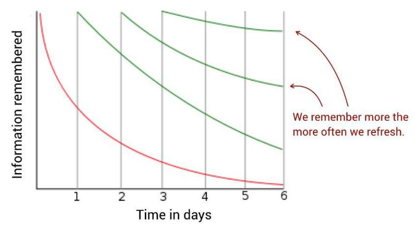
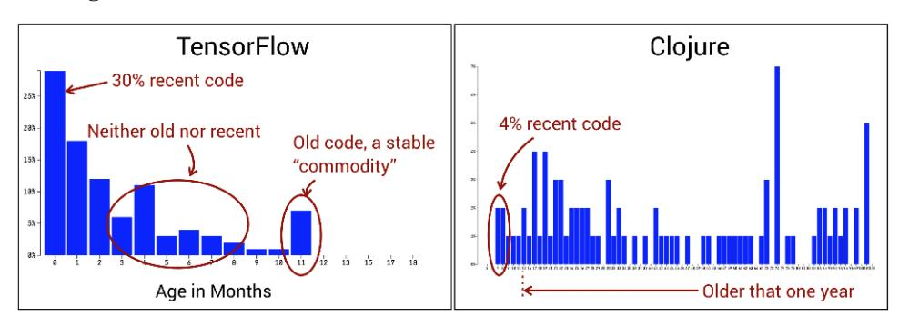
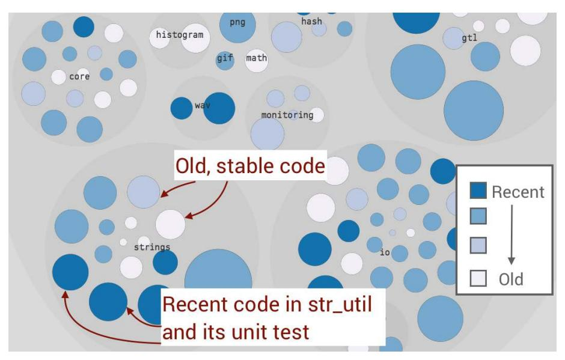
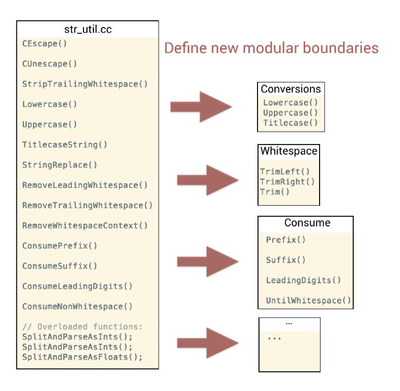
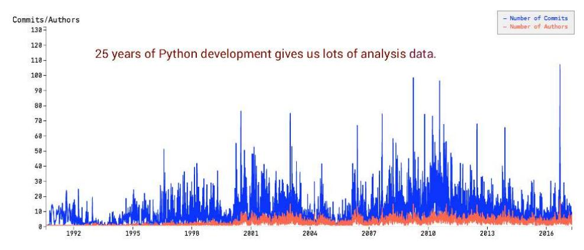
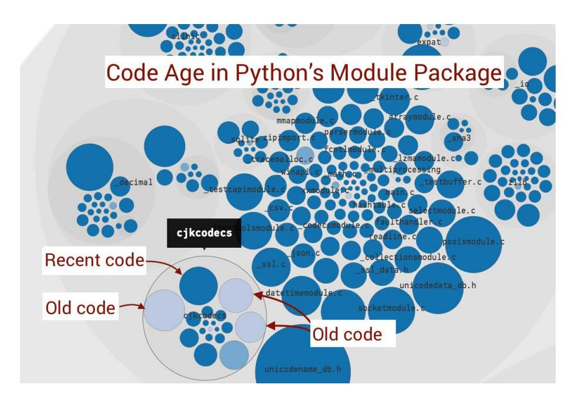
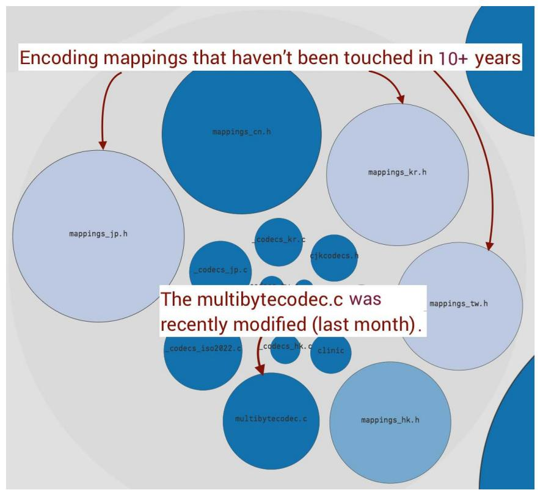
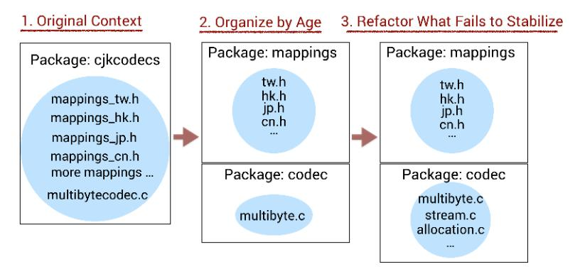
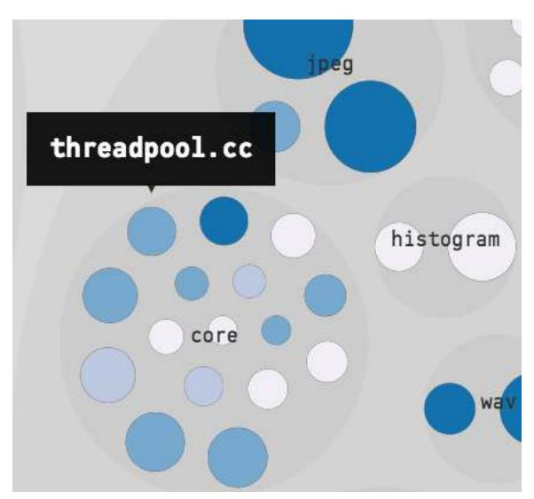

# Chapter 5: The Principles of Code Age

<span id="page-86-3"></span>In this chapter we explore package-level refactorings as we see how to organize code by its age. We measure the age of code as the time since the last modification, so that we can separate code we recently worked on from old and stable parts. Code age is a much-underused driver of software design that strengthens our understanding of the systems we build. Code age also helps us identify better modular boundaries, suggests new libraries to extract, and highlights stable aspects of the solution domain.

<span id="page-86-1"></span>You use code age analysis to evolve systems toward increased development stability, where the resulting structure offers lower cognitive overhead. As a bonus, you also learn about the link between code age and defects, so let's dive in and see why it's important to stabilize code from both a quality and a cost perspective.

<span id="page-86-2"></span>
## Stabilize Code by Age

Back in Chapter 2, *[Identify Code with High Interest Rates](007-chapter-2-identify-code-with-high-interest-rates.md#page-29-0)*, on page 15, we saw that some parts of our code change more frequently than others. Architectures–the real, physical kind—face the same challenges since buildings aren't permanent either. Buildings change over time to adapt to new uses, and different parts of a building change at different rates, much like software. This led the writer Stewart Brand to remark that a building tears itself apart "because of the different rates of change of its components." (See *[How](021-bibliography.md#page-241-6) [Buildings Learn: What Happens After They](021-bibliography.md#page-241-6)'re Built [Bra95]*.)

Similarly, different rates of change to software components may tear a system apart, resulting in code that's hard to understand and consequently hard to change. The forces that tear codebases apart are the frailties of human memory and the need to communicate knowledge across time and over

corporate boundaries. To counter those forces we need to take a time perspective on our code.

The age of code is a factor that should—but rarely does—drive the evolution of a software architecture. Designing with code age as a guide means that we

- 1. organize our code by its age;
- 2. turn stable packages into libraries; and
- 3. move and refactor code we fail to stabilize.

Following these principles gives us a set of advantages:

- *Promotes long-term memory models of code*: Stable packages serve as chunks that remain valid over time, which means our expectations of a piece of code won't be broken. (See *[Turn Hotspot Methods into Brain-](009-chapter-4-pay-off-your-technical-debt.md#page-81-0)[Friendly Chunks](009-chapter-4-pay-off-your-technical-debt.md#page-81-0)*, on page 67, for a discussion on how chunks help us understand code.)
- <span id="page-87-0"></span>• *Lessens cognitive load since there's less active code*: The more code you manage to stabilize, the less knowledge you need to keep in your head. This property translates to a positive onboarding effect. New team members can focus on the smaller amount of code under active development without being misled into exploring code that won't change.
- <span id="page-87-1"></span>• *Prioritizes test suites to shorten lead times*: Automated tests are wonderful until they kill your build times. Getting back on track takes time, and in the meantime you're at risk for dysfunctional practices that long build times encourage. Code age buys you time for proper remedies since it serves as a decision point (potentially automated) on which parts of the software you can safely skip test runs.

Each of the previous advantages plays a part in our larger quest to optimize code for ease of understanding. We'll soon see how these aspects of code age are important from a quality perspective too, but before we go there we have to learn to calculate code age.

### The Business Domain Is Above Age


In Part II of this book we'll look at the importance of structuring software architectures around features, use cases, and domain concepts. The code age heuristic in this chapter applies in that context and within such boundaries. That is, code should be structured by age *within* its containing business context.

### Calculate the Age of Code

<span id="page-88-1"></span>Measuring age requires us to agree on a reference, a point in time, that specifies the most recent date for our code. The most straightforward implementation is to use the current date as a point of reference, which works fine for a codebase under active development.

<span id="page-88-2"></span>However, consider the case where an organization decides to pause its work on a particular system. If you run a code age analysis a few months later the code will look stable, which is misleading since that stability only reflects lack of development work rather than properties of the system evolution itself. In such a case the date of the most recent commit is a better point of reference.

Choose the strategy that fits your situation. In this chapter we use an absolute measure—that is, the current analysis date—as a reference, but it's easy to switch to the other metric. Before we go there, let's see how you get the raw age data of your source code.

<span id="page-88-3"></span>Git's log command is a Swiss army knife for repository mining. We used log back in Chapter 2, *[Identify Code with High Interest Rates](007-chapter-2-identify-code-with-high-interest-rates.md#page-29-0)*, on page 15, to calculate change frequencies. Now we use a variation on the command to fetch the last modification date of the files in a repository. Here's an example from the Ruby on Rails codebase:<sup>1</sup>

```
adam$ git log -1 --format="%ad" --date=short \
                  -- activerecord/lib/active_record/base.rb
2016-06-09
adam$ git log -1 --format="%ad" --date=short \
                  -- activerecord/lib/active_record/gem_version.rb
2017-03-22
```

The key to smooth data mining with git log is to specify a --format that limits the result to the information of interest. In this case we specify "%ad" as a shortcut for *author date*, which gives us the last modification time of the file. Since we don't need the timestamp we simplify the output further by telling Git to just give us the date using the option --date=short.

A simple output means simpler scripting, and now that we have a way of getting the modification date of individual files, we need to scale our data mining to operate on whole systems. Again, Git provides the basic tools you need, so let's look at the code age algorithm, shown in the [figure on page 76.](#page-89-1)

<sup>1.</sup> <https://github.com/rails/rails>

<span id="page-89-1"></span>

|   |                                               | List of all                                                                        | files      |
|---|-----------------------------------------------|------------------------------------------------------------------------------------|------------|
| 1 | Retrieve a list of your repository content    | actioncable/actioncable.gemspec<br>actioncable/javascripts/action_cable.coffee.erb |            |
| ' | using the command git ls-files                | actioncable/javascripts/action_cable/connection.coffee                             |            |
|   |                                               | Last modifica                                                                      | ation date |
| _ | Iterate over your list of files and apply the | actioncable/actioncable.gemspec                                                    | 2017-05-10 |
| 2 | git log command we used earlier to fetch      | actioncable/javascripts/action_cable.coffee.erb 2                                  | 2016-01-02 |
|   | the modification date                         | actioncable/javascripts/action_cable/connection.coffee 2                           | 2016-03-15 |
|   |                                               | Age in months re                                                                   | elative    |
|   | Calculate an age metric for each file based   | to 2017-06-10                                                                      | <b>)</b> . |
| _ | 2                                             | actioncable/actioncable.gemspec                                                    | 1          |
| 3 | on the current date as reference.             | actioncable/javascripts/action_cable.coffee.erb                                    | 17         |
|   | Here we use 2017-06-10 as reference date.     | actioncablejavascripts/action_cable/connection.coffee                              | 14         |

<span id="page-89-4"></span>As that figure shows, we retrieve a list of all files in the repository, fetch their last modification date, and finally calculate the age of each file. The analysis results in this chapter build on that algorithm, and since it is straightforward to automate the steps in a command line–friendly language like Python or in shell scripts, you may want to give it a try and gain experience with repository mining. You also have another tooling option in Code Maat, which provides a code age analysis. (See Appendix 2, *[Code Maat: An Open Source](018-appendix-a2-code-maat-an-open-source-analysis-engine.md#page-223-0) [Analysis Engine](018-appendix-a2-code-maat-an-open-source-analysis-engine.md#page-223-0)*, on page 215, to get started.)

<span id="page-89-2"></span>With the algorithm covered, let's learn how to interpret the resulting code age data.

#### Exclude Autogenerated Content

<span id="page-89-0"></span>

Many Git repositories contain generated content such as project files used by your IDE, package manager configurations, and so on. Generated content shows up as noise in the analyses and you want to exclude it. The Git commands we use support commandline flags like --exclude for that purpose, and in CodeScene your analysis configuration provides the same exclusion support.

<span id="page-89-3"></span>
## The Three Generations of Code

The code age analysis was inspired by the work of Dan North, who introduced the idea of short *software half-life* as a way to simplify code. North claims that we want our code to be either very recent or old, and the kind of code that's hard to understand lies in between these two extremes.<sup>2</sup> North's observation ties in with how human memory works, so let's take a brief detour into the science of forgetting before we return to code age and see how it impacts our ability to understand systems.

<sup>2.</sup> <https://leanpub.com/software-faster>

<span id="page-90-2"></span>In *[Your Mental Models of Code](006-chapter-1-why-technical-debt-isn-t-technical.md#page-21-0)*, on page 7, we saw how our brain makes sense of code by building cognitive schemas. Unfortunately, those mental models aren't fixed. That's why we may find ourselves cursing a particular design choice only to realize it's code written by our younger selves in a more ignorant time. We humans forget, and at a rapid pace.

<span id="page-90-1"></span>Back in 1885 the psychologist Hermann Ebbinghaus published his pioneering work on how human memory functions. (See *[Über das Gedächtnis.](021-bibliography.md#page-242-4) [Untersuchungen zur experimentellen Psychologie. \[Ebb85\]](#page-242-4)*.) In this research, Ebbinghaus studied his own memory performance by trying to remember as many made-up nonsense syllables as possible (kind of like learning to code in Perl). Ebbinghaus then retested his memorization after various periods of time, and discovered that we tend to forget at an exponential rate. This is bad news for a software maintainer.

<span id="page-90-0"></span>The next figure shows the *Ebbinghaus forgetting curve*, where we quickly forget information learned at day one. To retain the information we need to repeat it, and with each repetition we're able to improve our performance by remembering more.



Now, think back to North's claim that code should be either recent or old. This works as a design principle because it aligns with the nature of the Ebbinghaus forgetting curve. Recent code is what we extend and modify right now, which means we have a fresh mental model of the code and we know how it achieves its magic. In contrast, old code is by definition stable, which means we don't have to modify it, nor do we have to maintain any detailed information about its inner workings. It's a black box.

The Ebbinghaus forgetting curve also explains why code that's neither old nor recent is troublesome; such code is where we've forgotten much detail, yet we need to revisit the code at times. Each time we revisit mid-aged code we need to relearn its inner workings, which comes at a cost of both time and effort.

<span id="page-91-1"></span>There's also a social side to the age of code in the sense that the older the code, the more likely the original programmer has left the organization. This is particularly troublesome for the code in between—the code we fail to stabilize—because it means that we, as an organization, have to modify code we no longer know. David Parnas labeled such modifications "ignorant surgery" as a reference to changing code whose original design concept we fail to understand. (See *[Software Aging \[Par94\]](#page-244-9)*.)

The first ignorant surgery is an invitation for others to follow. Over time the code gets harder and harder to understand, which leaves us with a technical debt that's largely due to the organizational factor of failing to maintain mastery of the system. Such code also becomes brittle, which means it's important to stabilize code from a quality perspective too.

<span id="page-91-0"></span>
## Your Best Bug Fix Is Time

Back in my days as a consultant I was hired to do a code review of a database framework. The code, which had been around for years, was a monument to accidental complexity and the basis of many war stories among the senior staff. The code review soon confirmed that the design was seriously flawed. However, as we followed up with a code age analysis, we noted that the code had barely been touched over the past year. So what was all the fuss about? Why spend time reviewing that code?

Well, this organization faced lots of technical debt—both reckless and strategic—and now was the time to pay it off. The database framework was the starting point since that's what everyone complained the most about and had the urge to rewrite. However, those complaints were rooted in folklore rather than data. Sure, the code was messy to work with, so the few people brave enough to dive into it did raise valid complaints, but it had cooled down significantly and was no longer a hotspot. And to our surprise the code wasn't defect-dense either.

<span id="page-91-2"></span>Software bugs always occur in a context, which means that a coding error doesn't necessarily lead to a failure. Historically, that database framework had its fair share of critical defects, but it had since been patched into correctness by layers of workarounds delivered by generations of programmers. Now it just did its job and it did it fairly well.

The risk of a new bug decreases with every day that passes. That's due to the interesting fact that the risk of software faults declines with the age of the code. A team of researchers noted that a module that is a year older than a similar module has roughly one-third fewer faults. (See *[Predicting fault](021-bibliography.md#page-243-5) [incidence using software change history \[GKMS00\]](#page-243-5)*.) The passage of time is like a quality verdict, as it exposes modules to an increasing number of use cases and variations. Defective modules have to be corrected. And since bug fixes themselves, ironically, pose a major risk of introducing new defects, the code has to be patched again and again. Thus, bugs breed bugs and it all gets reflected as code that refuses to stabilize and age.

### Test Cases Don't Age Well


<span id="page-92-2"></span>While old code is likely to be good code in the sense that it has low maintenance costs and low defect risk, the same reasoning doesn't apply to test cases. Test cases tend to grow old in the sense that they become less likely to identify failures. (See *[Do System Test Cases](021-bibliography.md#page-242-5) [Grow Old? \[Fel14\]](#page-242-5)*.) Tests are designed in a context and, as the system changes, the tests have to evolve together with it to stay relevant.

<span id="page-92-1"></span>Even when a module is old and stable, bad code may be a time bomb and we might defuse it by isolating that code in its own library. The higher-level interface of a library serves as a barrier to fend off ignorant surgeries. Let's see how we get there by embarking on our first code age analysis.

## Refactor Toward Code of Similar Age

We've already learned to calculate code age, so let's import the raw numbers into a spreadsheet application and generate a histogram like the one in the next figure.



<span id="page-92-0"></span>The preceding figure shows the code age distribution of two codebases in radically different states of development: Google's machine-learning service TensorFlow and the programming language Clojure.3 4

<sup>3.</sup> <https://github.com/tensorflow/tensorflow>

<sup>4.</sup> <https://github.com/clojure/clojure>

At this time of writing, TensorFlow is under heavy development and that's reflected in its age profile; much of the code shows up as recent. This is in contrast to the age profile of the Clojure code, where most of it hasn't been touched in years. The age distribution of Clojure shows a stable codebase that has found its form.

<span id="page-93-0"></span>Code age, like many of the techniques in this book, is a heuristic. That means the analysis results won't make any decisions for us, but rather will guide us by helping us ask the right questions. One such question is if we can identify any high-level refactoring opportunities that allow us to turn a collection of files into a stable package—that is, a mental chunk.

The preceding age distribution of TensorFlow showed that most code was recent, but we also identified a fair share of old, stable code. If we can get that stable code to serve as a chunk, we'll reap the benefits of an age-oriented code organization that we discussed earlier. So let's project TensorFlow's age information onto the static structure of our code.

<span id="page-93-1"></span>The next figure shows CodeScene's *age map* zoomed in on TensorFlow's core/lib package. As usual, you can follow along interactively in the pregenerated analysis results.<sup>5</sup>



<span id="page-93-2"></span>You may recognize the visualization style as an enclosure diagram, just like the one we used in *[Prioritize Technical Debt with Hotspots](007-chapter-2-identify-code-with-high-interest-rates.md#page-33-0)*, on page 19. The

<sup>5.</sup> <https://codescene.io/projects/1714/jobs/4295/results/code/hotspots/system-map>

difference here is that the color signals the age of the files rather than change frequencies—everything else is the same. The dark blue circles represent recent code and the lighter blue shades indicate code of increasing age.

We start our investigation at the strings package in the lower-right corner. The reason we start there is because the visualization indicates that the package contains code of mixed age. There are no precise rules, so we rely on this visual heuristic instead. If you inspect the actual age of each file, you find that most code is between eight and eleven months old. That's close to ancient, given the rapid development of TensorFlow. However, we also note that the module str\_util.cc and its corresponding unit test are recent and thus prevent us from stabilizing the whole package.

### Domain Knowledge Drives Refactorings


<span id="page-94-2"></span>The strings package refactoring in this TensorFlow example is chosen as a simple example because we don't want to get sidetracked by domain details; strings are a universal programming construct. A code age analysis on your own code may point you toward more complex refactorings. Should the refactoring turn out to be too hard, take a step back—which is easy with version control—and restart it using the splinter pattern. (See *[Refactor Congested Code](009-chapter-4-pay-off-your-technical-debt.md#page-71-0) [with the Splinter Pattern](009-chapter-4-pay-off-your-technical-debt.md#page-71-0)*, on page 57.)

<span id="page-94-1"></span>Back in *[Signal Incompleteness with Names](009-chapter-4-pay-off-your-technical-debt.md#page-76-0)*, on page 62, we saw that generic module names like str\_util.cc signal low cohesion. Given the power of names—they guide usage and influence our thought processes—such modules are quite likely to become a dumping ground for a mixture of unrelated functions. This is a problem even when most of the existing functions in such utility-style files are stable, as the module acts like a magnet that attracts more code. This means we won't be able to stabilize the strings package unless we introduce new modular boundaries.

<span id="page-94-0"></span>A quick code inspection of str\_util.cc confirms our suspicions as we notice functions with several unrelated responsibilities:<sup>6</sup> some escape control characters, others strip whitespace or convert to uppercase, and much more. To stabilize the code we extract those functions into separate modules based on the different responsibilities. We also take the opportunity to clarify the intent of some functions by renaming them, as the [figure on page 82](#page-95-1) illustrates.

<sup>6.</sup> [https://github.com/tensorflow/tensorflow/blob/2ca7c2bdc269b73803d6fa7c199667b987ebeb66/tensorflow/core/](https://github.com/tensorflow/tensorflow/blob/2ca7c2bdc269b73803d6fa7c199667b987ebeb66/tensorflow/core/lib/strings/str_util.cc) [lib/strings/str\\_util.cc](https://github.com/tensorflow/tensorflow/blob/2ca7c2bdc269b73803d6fa7c199667b987ebeb66/tensorflow/core/lib/strings/str_util.cc)

<span id="page-95-1"></span>

If this were our own code we would continue to split the corresponding unit test str\_util\_test.cc too. But let's leave that for now and reflect on where our refactoring would take us:

- Each new module is more cohesive, with a clear responsibility.
- The name of each module suggests a usage related to the solution domain.
- As string objects represent a largely fixed problem space, it's likely that several of our new modules won't be touched again. Stable code!

<span id="page-95-0"></span>This single refactoring won't be enough to turn the whole strings package into a stable chunk that we can extract into a library. However, we've taken the first step. From here we identify the next young file inside strings, explore why it fails to stabilize, and refactor when needed. Such refactorings have to be an iterative process that stretches over time, and as we move along we can expect to stabilize larger and larger chunks of our code.

<span id="page-95-2"></span>
## Refactor Your Package Structure

Our previous example was a file-level refactoring, but a code age analysis lets us use the same principle to align package structures with how the code evolves. To illustrate the idea we turn to a codebase with a rich history: the

Python programming language.<sup>7</sup> We use the same basic age data as we saw earlier in this chapter, so either clone the Python repository and generate the code age data or follow along in the prepared analysis results.<sup>8</sup>

The Python repository has a history that goes 25 years back, which makes this wonderful language about as old as some of humanity's other great achievements, namely the Hubble space telescope and MTV's *Unplugged* broadcasts. You won't need that much data to detect trends in your own codebase—a few months is usually enough—but the history of Python makes a good case study as it amplifies long-term trends in code age.



We start our analysis by following the same visual heuristic we used for TensorFlow, where we look for packages with code of different age. There are several candidates, so let's pick one and start with the Modules package, illustrated in the top [figure on page 84.](#page-97-0)

<span id="page-96-0"></span>The Modules package is the part of Python's standard library that's implemented in the C programming language.<sup>9</sup> As such, the package is more a collection of building blocks than the realization of a specific domain concept. As the previous figure reveals, one of those building blocks—the cjkcodecs package—matches our heuristic. Let's zoom in and inspect the details of cjkcodecs, as shown in the next [figure on page 84](#page-97-1).

The analysis reveals a large discrepancy in age between the different files, as some haven't been touched in a decade while multibytecodec.c has been modified recently. Code that changes at different rates within the same package is a warning sign that means either of the following:

<sup>7.</sup> <https://github.com/python/cpython>

<sup>8.</sup> <https://codescene.io/projects/1693/jobs/4253/results/scope/system-trends/by-date>

<sup>9.</sup> <https://docs.python.org/devguide/>

<span id="page-97-0"></span>

<span id="page-97-1"></span>

- Some of the code may have quality issues and we need to patch it frequently (hence its younger age).
- Individual files stabilize at different ages because they model different aspects of the problem domain.

<span id="page-98-1"></span>Often these two facets come together to explain the differentiation in age. That's why we follow up with an X-Ray analysis (see *[Use X-Rays to Get Deep](007-chapter-2-identify-code-with-high-interest-rates.md#page-41-0) [Insights into Code](007-chapter-2-identify-code-with-high-interest-rates.md#page-41-0)*, on page 27) to get a quick assessment of potential quality issues in the part of the package we fail to stabilize—the file multibytecodec.c, as shown in the following figure.<sup>10</sup>

| Some functions would benefit from refactoring.       |                     |       |    |                          |  |
|------------------------------------------------------|---------------------|-------|----|--------------------------|--|
|                                                      | Change<br>Frequency | Lines | \$ | Cyclomatic<br>Complexity |  |
| multibytecodec_encerror                              | 38                  | 154   |    | 48                       |  |
| mbstreamreader_iread                                 | 38                  | 104   |    | 33                       |  |
| _multibytecodec_MultibyteStreamWriter<br>_reset_impl | 32                  | 34    |    | 6                        |  |
| multibytecodec_decerror                              | 30                  | 103   |    | 41                       |  |
| multibytecodec_encode                                | 30                  | 86    |    | 28                       |  |

<span id="page-98-0"></span>This figure shows that the hotspots on the function level are way too large, with 100–150 lines of code. The X-Ray results also include a cyclomatic complexity measure that we haven't discussed before. Cyclomatic complexity is a measure of the number of branches (for example, conditional logic and loops) and is used to complement our hotspot criteria as a rough estimate of how tricky the code is. We won't put a lot of weight on the complexity number—the lines of code tell much the same story—but suffice to say that 48 branches in a single function puts a massive tax on our working memory.

While the multibytecodec.c would benefit from targeted refactorings, code complexity doesn't tell the whole story. If you look at the previous age map, you see that the stable parts are encoding pages that specify how text is represented for different natural languages. Encodings tend to be a stable domain since the writing systems of natural languages rarely change.

This is in contrast to the multibytecodec.c file that provides the actual mechanism of encoding and, as such, solves a more general problem. That is, the multibytecodec.c isn't specific to the language mappings and could be reused in other

<sup>10.</sup> [https://codescene.io/projects/1693/jobs/4253/results/files/hotspots?file-name=cpython/Modules/cjkcodecs/](https://codescene.io/projects/1693/jobs/4253/results/files/hotspots?file-name=cpython/Modules/cjkcodecs/multibytecodec.c) [multibytecodec.c](https://codescene.io/projects/1693/jobs/4253/results/files/hotspots?file-name=cpython/Modules/cjkcodecs/multibytecodec.c)

applications. We can express that in our design by separating the content of cjkcodecs into separate packages, as shown in the following figure.



The next step, if this were our codebase, would be to refactor multibytecodec.c using the patterns from Chapter 4, *[Pay Off Your Technical Debt](008-chapter-3-coupling-in-time-a-heuristic-for-the-concept-of-surprise.md#page-65-0)*, on page 51, as illustrated in the previous figure. Over time we'd be able to stabilize more and more of the codec implementation, and eventually we could extract the whole package into its own Git repository and make it available to other applications.

<span id="page-99-0"></span>This package-level refactoring increases the cohesion of the system by being better aligned with the domain; when different modules in the same package change at different rates, there's a good chance that they represent separate concepts that we've mistaken as the same previously. Our case study illustrates that. The age-driven separation of the codec mechanism from the language mappings also follows the *common closure principle*, which states that classes/files that change together should be packaged together. (See *[Clean](021-bibliography.md#page-243-6) Architecture: A Craftsman'[s Guide to Software Structure and Design \[Mar17\]](#page-243-6)*.)

We arrived at our suggested improvements by learning from how our code evolves; software design is much more opportunistic and less formal than we'd like to think, which is why we won't be able to get everything right with the initial design. The strength of software evolutionary analyses is that they give us feedback that help us address the gap between the current state of the code and where we'd like it to be.

### Dead Code Is Stable Code


<span id="page-99-1"></span>In large codebases with a rich history you're likely to find whole packages that are old. Make sure that code is still in use before you extract it into a library. I've seen several commercial codebases where the only reason a package stabilizes is that the code is dead. In this case it's a quick win since you can just delete the code. Remember, deleted code is the best code.

<span id="page-100-0"></span>
## Scale from Files to Systems

A code age analysis complements hotspots by helping you evolve your codebase in a direction where the system gets easier to maintain as you stabilize increasingly large parts of it. A failure to stabilize means that you need to maintain a working knowledge of those parts for the lifetime of the system.

Code age also guides code reorganizations toward the common closure principle, which is basically a specialization of the more general concept of cohesion applied on the package level. As a nice side effect, new programmers who join your organization experience less cognitive load, as they can now focus their learning efforts to specific parts of the solution domain with a minimum of distracting code.

The code age measure we used is shallow—that is, making a tiny change to a file is enough for it to be considered modified and recent. Used this way, our measure errs on the side of the extreme, which means we may miss some refactoring opportunities. However, the advantage is that we can rest assured that if we identify old code we know it's been untouched. This is important from a quality perspective because, as we saw, the risk of bugs decreases with code age.

Finally, we saw that code age is a heuristic, and that no tool will ever be able to do the thinking for us. Instead we use the analysis results to complement our domain expertise and focus our attention to where it's likely to be needed the most.

<span id="page-100-1"></span>As we've now reached the end of Part I in this book, we have the fundamental tools to uncover the technical debt with the highest interest rate and react to our findings. However, large systems with millions of lines of code present their own set of challenges. That's why Part II scales the analyses to an architectural level that gives you insights on the system as a whole.

<span id="page-100-2"></span>
## Exercises

As we saw in this chapter, a common reason that we fail to stabilize a piece of code is that it's low on cohesion and, hence, has several reasons to change. In these exercises you get the opportunity to investigate a package, uncover parts with low cohesion, and suggest new modular boundaries. You also get to pick up a loose end and come up with a deeper measure of code age that addresses the shortcomings we noted.

### Cores All the Way Down

• Repository: TensorFlow<sup>11</sup>

• Language: C++ and Python

- Domain: TensorFlow is a machine-learning library from Google used to build neural networks.
- Analysis snapshot: [https://codescene.io/projects/1714/jobs/4295/results/code/hotspots/](https://codescene.io/projects/1714/jobs/4295/results/code/hotspots/system-map) [system-map](https://codescene.io/projects/1714/jobs/4295/results/code/hotspots/system-map)

<span id="page-101-0"></span>Earlier in this chapter we suggested a hypothetical refactoring of TensorFlow's strings package. That package is located under TensorFlow's core/lib structure. In the TensorFlow analysis you will see that there is another core package nested inside the core structure. We note that a generic name like core hints at low package cohesion and, since we have two levels of generic names—a core package inside a core package—we suspect there are refactoring opportunities here.

The following figure shows an age map of TensorFlow's core/lib/core package. Your task is to suggest a new modular structure of that package to suggest usage of the groups of files and stabilize larger chunks of the code. To get you started, the following figure highlights a threadpool module that you can use as a starting point for code to extract.



<sup>11.</sup> <https://github.com/tensorflow/tensorflow>

#### Deep Mining: The Median Age of Code

<span id="page-102-0"></span>So far in the book we've used variations on the git log command for our data mining. That strategy works surprisingly well in providing us with the bulk of information we need. But for more specific analyses we need to dig deeper.

One such analysis is a possible extension to the age analysis in this chapter, where we used a shallow measure for code age. Ideally, we'd like to complement our age metric with a second one that goes deeper. One promising possibility is to calculate the median age of the lines of code inside a file. A median code age value would be much less sensitive to small changes and likely to provide a more accurate picture. How would you calculate the median age of code?

*Hint*: The key to successful data mining is to have someone else do the job for us. Thus, look to outsource the bulk of the job to some of Git's commandline tools that operate on individual files. There are multiple solutions.
