# Chapter 6: Spot Your System's Tipping Point Is Software Too Hard? Divide and Conquer with Architectural Hotspots Analyze Subsystems Fight the Normalization of Deviance Toward Team-Oriented Measures Exercises

## Spot Your System's Tipping Point

<span id="page-104-4"></span><span id="page-104-0"></span>Changes and new features often become increasingly difficult to implement over time, and many systems eventually reach a tipping point beyond which the codebase gets expensive to maintain. Since code decay is a gradual process, that tipping point is often hard to spot when you're in the middle of the work on a large and growing codebase.

In this chapter we use social code analysis to make sense of large-scale systems by breaking them down into subsystems. The strategies you learn let you distill millions of lines of code, authored by hundreds of developers, into a set of specific and focused refactoring tasks. To pull this off we generalize the concepts of hotspots and complexity trend analyses to an architectural level.

<span id="page-104-1"></span>We use the Linux kernel as a practical case study and you get the chance to detect maintenance issues in one of the most prominent open source projects of our time. The techniques you learn apply to any larger software system, so let's get going.

<span id="page-104-3"></span>
## Is Software Too Hard?

<span id="page-104-2"></span>I spent six years of my career studying psychology at the university. During those years I also worked as a software consultant, and the single most common question I got from the people I worked with was why it's so hard to write good code. This is arguably the wrong question because the more I learned about cognitive psychology, the more surprised I got that we're able to code at all. Given all the cognitive bottlenecks and biases of the brain—such as our imperfect memory, restricted attention span, and limited multitasking abilities —coding should be too hard for us. The human brain didn't evolve to program.

Of course, even if programming should be too hard for us, we do it anyway. We pull this off because we humans are great at workarounds, and a lot of the practices we use to structure code are tailor-made for this purpose. Abstraction, cohesion, and good naming help us stretch the amount of information we can hold in our working memory and serve as mental cues to help us counter the Ebbinghaus forgetting curve. We use similar mechanisms to structure our code at a system level. Functions are grouped in modules, and modules are aggregated into subsystems that in turn are composed into a system. When we succeed with our architecture, each high-level building block serves as a mental chunk that we can reason about and yet ignore its inner details. That's powerful.

Even when we manage to follow all these principles and practices, large codebases still present their own set of challenges. The first challenge has to do with the amount of information we can keep up with, as few people in the world can fit some million lines of code in their head and reason efficiently about it. A system under active development is also a moving target, which means that even if you knew how something worked last week, that code might have been changed twice since then by developers on three separate teams located in different parts of the world. Detailed knowledge in the solution domain gets outdated fast.

<span id="page-105-0"></span>Large systems become even more complex once we add the social dimension of software development. As a project grows beyond 12 or 15 developers, coordination, motivation and communication issues tend to cause a significant cost overhead. We've known that since Fred Brooks stressed the costs of communication efforts on tasks with complex interrelationships—the majority of software tasks—in *[The Mythical Man-Month: Essays on Software Engineering](021-bibliography.md#page-242-6) [\[Bro95\]](#page-242-6)* back in the 1970s. Yet we, as an industry, are still not up to the challenge. For example, we have tons of tools that let us measure *technical aspects* like coupling, cohesion, and code complexity. While these are all important facets of a codebase, it's often even more important to know if a specific part of the code is a coordination bottleneck. And in this area, supporting tools have been sadly absent.

<span id="page-105-2"></span>
## Societies within a Software System

<span id="page-105-1"></span>The social dimension of software impacts any system that grows beyond a handful of contributors. We'll investigate codebases of different scales later in the book, but let's start with an extreme example—Linux. Take a look at the [figure on page 95](#page-106-0).

The high-profile Linux kernel attracts lots of contributors, and the figure shows a slight exaggeration of the number of Linux contributors. In reality, the number of contributors isn't infinite—which would be a management

<span id="page-106-0"></span>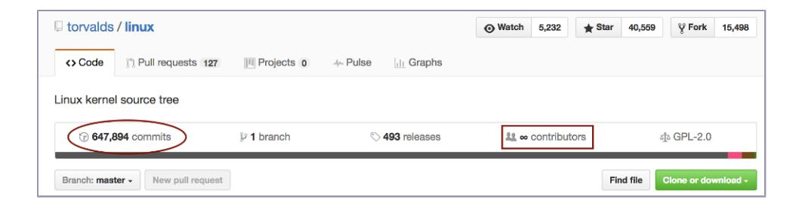

dream—but a number so large that GitHub doesn't display it.<sup>1</sup> If we calculate it ourselves, which is straightforward through the shell command git shortlog -s | wc -l, we note that there are 16,241 contributors to Linux.

Given we just learned how communication is a major issue in software development, this number of contributors prompts the question of what the coordination costs are on projects of that scale. To answer it we need to dig deeper; without more context the number of contributors is really just that—a number.

<span id="page-106-2"></span>
### Raise the Abstraction Level

The scale of a codebase has to be reflected in both the organization of people and the architecture of the system. (In a small codebase you have to work hard to fail no matter how you organize.) Linux, for example, has taken the route of a modular system so that people can work independently on isolated parts with a minimum of disturbance.<sup>2</sup> High modularity doesn't mean coordination comes for free—just that it's possible in practice.

<span id="page-106-1"></span>This means our true measure of effective collaboration is how well our modular boundaries hold up. That is, instead of focusing on individual files we need to move our analyses to the level of modules and subsystems. Analyses on a subsystem level are also a better fit for large organizations because improvements to different areas can—and should—proceed in parallel. With higherlevel analyses, each team gets its own prioritized hotspots to work on—the technical debt that matters the most in their context.

When we raise the abstraction level of the social code analyses, we also provide better means of communication with nontechnical stakeholders. Communicating technical debt via file names is of limited value since people who don't code are unlikely to be familiar with specific files. File names also change as a product evolves, so we want our shared vocabulary to focus on the more enduring names of subsystems and components.

<sup>1.</sup> <https://github.com/torvalds/linux>

<sup>2.</sup> <http://users.ece.utexas.edu/~perry/education/382v-s08/papers/moon.pdf>

Our exploration of large systems starts from a technical perspective. These results are useful in themselves, but they also lay the foundation for the social measurements of interteam coordination that we meet in the next chapter. It all starts with a divide-and-conquer approach, so let's explore what that means.

<span id="page-107-3"></span>
<span id="page-107-0"></span>
## Divide and Conquer with Architectural Hotspots

A divide-and-conquer strategy helps you split the code investigation into smaller tasks that are easier to reason about than the system as a whole. Let's look at the general strategy before we dive into the practicalities of each step.

- <span id="page-107-2"></span>1. *Identify your architectural boundaries*. Sometimes those boundaries are documented and, if you're lucky, the documentation may even be correct. If not, you need to reverse-engineer those boundaries, and a good starting point is to base them on the folder structure of the codebase.
- 2. *Run a hotspot analysis on an architectural level*. This lets you identify the subsystems with the most development effort and, as we'll see later, visualize the complexity trend of a whole architectural component.
- <span id="page-107-1"></span>3. *Analyze the files in each architectural hotspot*. In this step we're back to individual files, but our analysis scope is smaller since we focus on one subsystem at a time.

The main reason we go through these steps and split the codebase into multiple analysis projects is because each subsystem has a different audience. Our goal is to partition the analysis information on a level where each analysis result is tailored to the people working on that part. We discuss that analysis in detail later in this section, but the general idea is to aggregate the statistics of individual files into logical components, as illustrated in the [figure on page 97](#page-108-0).

<span id="page-107-5"></span><span id="page-107-4"></span>Finally, note that when we speak of the complexity of large systems, the main driver comes from organizational size rather than lines of code. Surprisingly, there's no strong correlation between the two; a system of two million lines of code may be maintained by anywhere from 30 to 300 developers. In the former case, an analysis of the whole system is likely to be good enough to prioritize improvements, whereas the latter requires individual analyses that mirror the areas of responsibility for the different teams.

With the overall analysis process covered, let's apply it to divide and conquer the Linux kernel.

<span id="page-108-0"></span>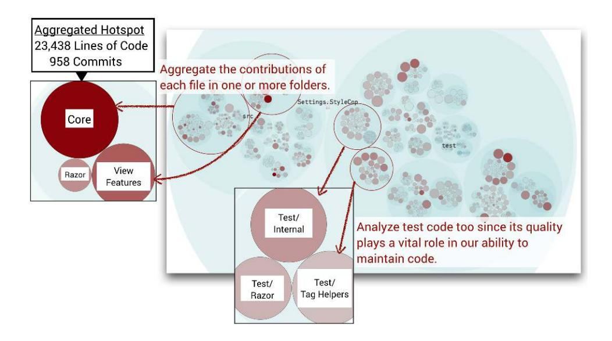

<span id="page-108-2"></span>
<span id="page-108-1"></span>
## A Language for Specifying Architectural Boundaries

Architectural analyses are based on the same basic data as we used back in Chapter 2, *[Identify Code with High Interest Rates](007-chapter-2-identify-code-with-high-interest-rates.md#page-29-0)*, on page 15. That is, we start from the change frequencies of each file in the codebase, as illustrated by the following command run in the Linux Git repository:<sup>3</sup>

```
adam$ git log --format=format: --name-only --after=2016-01-01 \
     | sort | uniq -c | sort -r | head -10
 621 MAINTAINERS
 542 drivers/gpu/drm/i915/intel_display.c
 503 drivers/gpu/drm/i915/i915_drv.h
 343 drivers/gpu/drm/i915/i915_gem.c
 245 drivers/staging/wilc1000/host_interface.c
 240 drivers/gpu/drm/i915/intel_drv.h
 235 drivers/gpu/drm/i915/intel_pm.c
 228 drivers/gpu/drm/amd/amdgpu/amdgpu.h
 221 drivers/gpu/drm/i915/intel_ringbuffer.c
 207 drivers/net/wireless/realtek/rtl8xxxu/rtl8xxxu.c
```

To script your own hotspot analysis you pipe this data to a file, as shown in the following command:

```
adam$ git log --format=format: --name-only --after=2016-01-01 \
     | sort | uniq -c | sort -r > all_frequencies.txt
```

<sup>3.</sup> <https://github.com/torvalds/linux>

<span id="page-109-0"></span>Note that this time we limit the analysis period to the evolution over the past year by specifying the --after=2016-01-01 option to the Git log. We do this to avoid having historic data that obscures more recent trends.

<span id="page-109-2"></span>In your own codebase you also want to focus on the areas within your responsibility. After all, that's where you're most likely to be able to act on the analysis results. Unless you're one of the 16,000 Linux contributors, you probably won't have an area of responsibility, so let's analyze the complete codebase. This gives us the opportunity to see how we can pick up 15 million lines of unfamiliar code and, within a few minutes, suggest a specific refactoring based on how the developers have worked with the code so far. If we pull that off, the scariness factor of most legacy systems goes down because we have techniques that make us more comfortable working with those systems.

Our first step is to identify our architectural boundaries. In a modular architecture like Linux, the folder names in the codebase reflect domain concepts, which simplifies our task because we map each folder to an architectural boundary as the following figure illustrates.

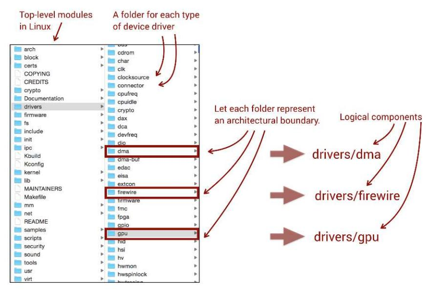

<span id="page-109-3"></span><span id="page-109-1"></span>These architectural boundaries represent our *logical components*. A logical component is a construct that aggregates multiple files into an analysis unit that carries meaning on an architectural level. We can go to any level of detail we want here, but it's best to start with a rough model and, if needed, provide more detailed boundaries based on feedback from the analysis results.

In this case we provided a one-to-one mapping of the top-level source code folders to logical components. However, as the preceding figure shows, Linux's

drivers package is huge, so let's split it into several components, as well. For drivers, we map each of its subfolders to a unique component name. As you see in the following figure, the transformation to logical components is a straightforward text transformation.

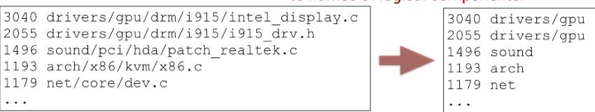

There are two obvious mechanisms to perform this transformation:

- <span id="page-110-0"></span>• *Glob patterns* let you specify paths and file names by use of wildcards.<sup>4</sup> For example, the glob pattern drivers/gpu/\*\* would match all files and subfolders under the drivers/gpu folder.
- *Regular expressions* are supported by all major scripting languages, including the shell. That makes them an attractive candidate. The disadvantage is that all file names from Git are given in the UNIX-style path format, with forward slashes as separators between directories, and the forward slash is a reserved character in regular expressions. This means we need to escape it, which makes our patterns more cluttered because the equivalent to the simple glob pattern drivers/gpu/\*\* would be ^drivers\/gpu\/.+

<span id="page-110-2"></span>Since both approaches work, choose the one you're most comfortable with for your own scripting. If you rely on existing tooling, check out Code Maat (see *[Run Architectural Analyses](018-appendix-a2-code-maat-an-open-source-analysis-engine.md#page-224-0)*, on page 216); it uses regular expressions for this purpose, whereas CodeScene lets you specify glob patterns.

<span id="page-110-1"></span>
## Summarize Change Frequencies by Component

Once our Git log is transformed to represent the change frequencies of logical components, we could combine the data with complexity metrics to get more insights. In that case we'd use the lines of code as we saw in *[Add a Language-](007-chapter-2-identify-code-with-high-interest-rates.md#page-32-0)[Neutral Complexity Dimension](007-chapter-2-identify-code-with-high-interest-rates.md#page-32-0)*, on page 18. Since line-counting tools like cloc deliver textual output (see *A Brief Introduction to cloc*, on page 223, for specific commands), you just transform the results using the same patterns as for the Git log.<sup>5</sup>

<sup>4.</sup> [https://en.wikipedia.org/wiki/Glob\\_\(programming\)](https://en.wikipedia.org/wiki/Glob_(programming))

<sup>5.</sup> <https://github.com/AlDanial/cloc>

<span id="page-111-1"></span>From here we summarize the data for each logical component, and the following figure shows the results from the Linux kernel visualized in an enclosure diagram that you can inspect in the online gallery, too.<sup>6</sup>

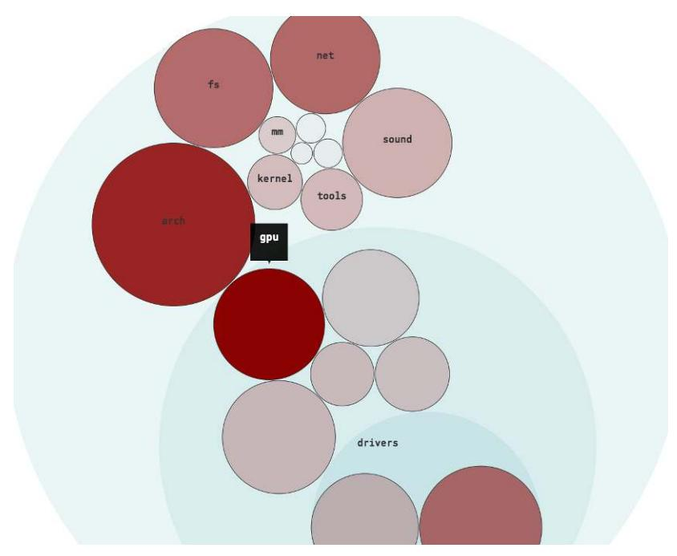

The visualization shows that the top architectural hotspot in Linux is the drivers/gpu module. That means the Linux authors have spent most development effort during 2016 on code inside that package. If we look at the aggregated data from the Git log, we see that a total of 6,481 commits have been done to that code and that it now consists of 685,260 lines of application code.

<span id="page-111-0"></span>That's a respectable amount of code, and we could use this information to specify more narrow logical components and divide drivers/gpu even more. However, based on experience we should be on a level of scale where we can act, so let's focus a file-level analysis on the content of the drivers/gpu module.

<span id="page-111-2"></span>
## Analyze Subsystems

To dive into a subsystem we exclude all code contributions except the ones that touch the drivers/gpu module. This is straightforward, as git log already implements the functionality we need. We just need to specify an optional path, as shown in the following shell command:

<sup>6.</sup> <https://codescene.io/projects/1737/jobs/4353/results/architecture/hotspots>

```
adam$ git log --format=format: --name-only --after=2016-01-01 \
     -- drivers/gpu/ | sort | uniq -c | sort -r | head -5
 542 drivers/gpu/drm/i915/intel_display.c
 503 drivers/gpu/drm/i915/i915_drv.h
 343 drivers/gpu/drm/i915/i915_gem.c
 240 drivers/gpu/drm/i915/intel_drv.h
 235 drivers/gpu/drm/i915/intel_pm.c
```

The argument -- drivers/gpu/ instructs git log to show only commits relating to the content in our folder of interest. Based on this data we perform a filelevel hotspot analysis on the content of this subsystem, which reveals that the Intel graphics driver, intel\_display.c, is our top hotspot during 2016,<sup>7</sup> as shown in the following figure.

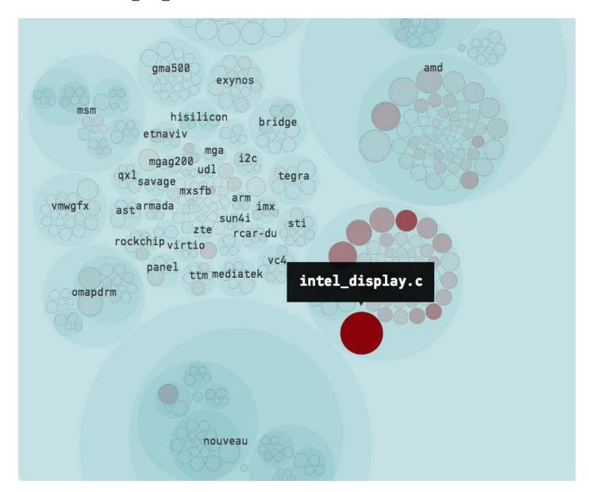

<span id="page-112-0"></span>However, remember that just because some code is a hotspot, that doesn't necessarily mean it's a problem. Rather, a hotspot means we've identified a part of the code that requires our attention since it attracts many changes. And the more often something is changed, the more important it is that the corresponding code is of high quality so all those changes are simple and low risk. Thus, our next step is to gather more data to find out how intel\_display.c evolves.

In *[Evaluate Hotspots with Complexity Trends](007-chapter-2-identify-code-with-high-interest-rates.md#page-38-0)*, on page 24, we saw how to calculate complexity trends, so let's apply it to intel\_display.c. This time we run the analysis on the complete history of the file to detect long-term trends, as shown in the [figure on page 102.](#page-113-0)

<sup>7.</sup> <https://codescene.io/projects/1738/jobs/4354/results/code/hotspots/system-map>

<span id="page-113-0"></span>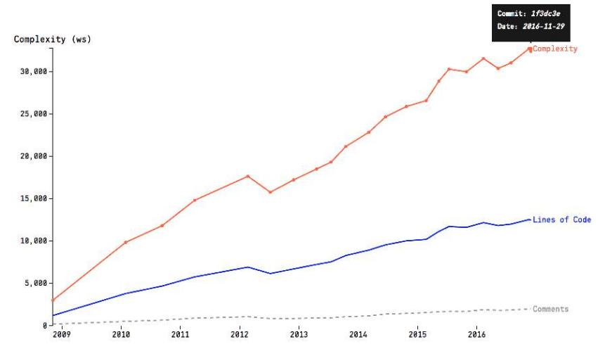

The complexity trend shows two interesting properties of intel\_display.c. First, the file has doubled its lines of code over the past four years and it now contains approximately 12,000 lines of code. Size alone may be problematic, as large files are likely to contain many different responsibilities and be hard to navigate. We also note that the complexity of the code has grown steadily, with only two signs of refactorings (the dips in complexity in 2012 and 2015), and it's now at an all-time high.

At this point we have all the information we need to suggest a refactoring of our main suspect. It's a large unit, we need to change the code often, and as we do we keep adding even more complexity to the code, which makes it harder and harder to understand. The longer we wait with that refactoring, the worse it's going to be, as evidenced by the increasing complexity trend. Let's see where we should focus our improvements.

<span id="page-113-1"></span>
## Prioritize Function Hotspots and Code Clones

A file like intel\_display.c with 12,000 lines of C code becomes like a system in itself, where parts of the code are likely to remain stable for years while others keep changing. We want to focus on the latter. The X-Ray analysis we covered in *[Use X-Rays to Get Deep Insights into Code](007-chapter-2-identify-code-with-high-interest-rates.md#page-41-0)*, on page 27, helps us with the task by calculating change frequencies on the function level, as shown in the [figure on page 103](#page-114-0).

The figure shows the X-Ray results of intel\_display.c. 8 In most cases, this information serves as a prioritized list of refactoring candidates. Sure, there may

<sup>8.</sup> [https://codescene.io/projects/1738/jobs/4354/results/files/hotspots?file-name=linux/drivers/gpu/drm/i915/](https://codescene.io/projects/1738/jobs/4354/results/files/hotspots?file-name=linux/drivers/gpu/drm/i915/intel_display.c) [intel\\_display.c](https://codescene.io/projects/1738/jobs/4354/results/files/hotspots?file-name=linux/drivers/gpu/drm/i915/intel_display.c)

<span id="page-114-0"></span>

| <b>‡</b> Function                   | Change<br>\$ Frequency | Lines<br>of<br>\$ Code | Cyclomatic   Complexity |
|-------------------------------------|------------------------|------------------------|-------------------------|
| intel_crtc_page_flip                | 82                     | 238                    | 52                      |
| intel_dump_pipe_config              | 64                     | 98                     | 10                      |
| <pre>intel_atomic_commit_tail</pre> | 58                     | 167                    | 19                      |
| i9xx_update_primary_plane           | 56                     | 66                     | 7                       |
| intel_framebuffer_init              | 53                     | 173                    | 63                      |

be severe structural problems within a hotspot, but in a large file with thousands of lines of code you need to start somewhere. In this case our top refactoring candidate is the function intel\_crtc\_page\_flip, whose code you can view on GitHub.<sup>9</sup> The analysis results reveal that this function consists of 238 lines of code and has been changed 82 times over the past year.

You can get more insights through the complexity trend of the code in the intel\_crtc\_page\_flip function, as the following figure illustrates.

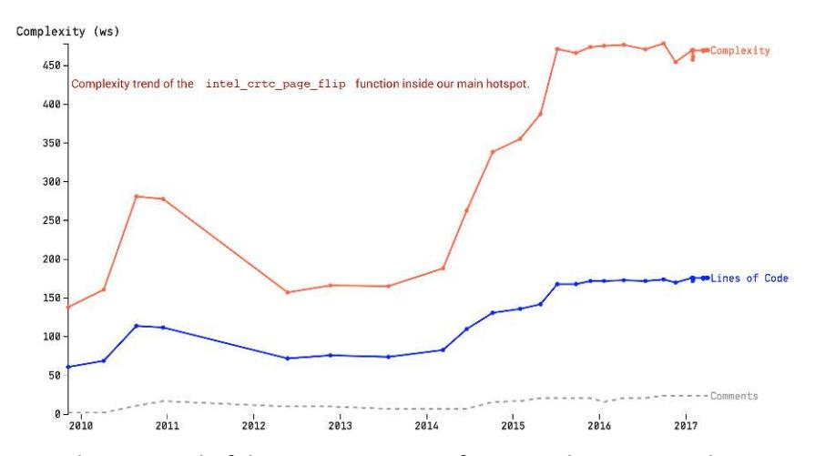

The complexity trend of the intel\_crtc\_page\_flip function doesn't reveal any recent dramatic changes to the code. Instead we see that there was a steep increase in complexity back in 2014 and the code has since continued to evolve at a high but stable complexity level. This indicates that most recent commits are relatively small fixes. However, given the size of the function, it's likely that

<sup>9.</sup> [https://github.com/torvalds/linux/blob/e93b1cc8a8965da137ffea0b88e5f62fa1d2a9e6/drivers/gpu/drm/i915/](https://github.com/torvalds/linux/blob/e93b1cc8a8965da137ffea0b88e5f62fa1d2a9e6/drivers/gpu/drm/i915/intel_display.c#L12120) [intel\\_display.c#L12120](https://github.com/torvalds/linux/blob/e93b1cc8a8965da137ffea0b88e5f62fa1d2a9e6/drivers/gpu/drm/i915/intel_display.c#L12120)

those more recent commits are expensive in terms of understanding the existing code. If we could simplify future changes we would lower both effort and risks, as the code is likely to continue to evolve.

<span id="page-115-1"></span>We also note that intel\_crtc\_page\_flip has a high cyclomatic complexity of 52 branches, which indicates that the code contains lots of conditional logic. Based on this data we should focus our initial refactorings on reducing the overall complexity and size, as we saw in *[Turn Hotspot Methods into Brain-](009-chapter-4-pay-off-your-technical-debt.md#page-81-0)[Friendly Chunks](009-chapter-4-pay-off-your-technical-debt.md#page-81-0)*, on page 67.

<span id="page-115-2"></span>
### X-Ray Hotspots with the Git Log

A bulletproof X-Ray has to be language aware in the sense your tooling needs to parse the code and understand its syntax. However, there's a simple shortcut based on Git's log option that serves as a useful heuristic to count change frequencies and complexity trends of individual functions: Use the -L option to instruct Git to fetch each historic revision based on the range of lines of code that make up a function. You can even specify the name of the function and have Git resolve the line numbers for you. Here's an example on our Linux hotspot: git log -L:intel\_crtc\_page\_flip:drivers/gpu/drm/i915/intel\_display.c.

<span id="page-115-0"></span>
### Look for Quick Wins

Refactoring a complex, evolving piece of code like intel\_crtc\_page\_flip is hard and must be an iterative process. It has to be done, but if we need a quick win first to boost morale we look to identify code clones like we did in *[The Dirty](008-chapter-3-coupling-in-time-a-heuristic-for-the-concept-of-surprise.md#page-58-0) [Secret of Copy-Paste](008-chapter-3-coupling-in-time-a-heuristic-for-the-concept-of-surprise.md#page-58-0)*, on page 44.

Our tool in this case is a change coupling analysis to detect modification patterns between functions inside intel\_display.c, as shown in the next figure.<sup>10</sup>

|                                                        | Degree of Coupling (%) | Average<br>Revisions | Similarity (%) |
|--------------------------------------------------------|------------------------|----------------------|----------------|
| intel_finish_page_flip_cs\nintel_finish_page_flip_mmio | 100                    | 11                   | 99             |
| i9xx_find_best_dpll pnv_find_best_dpl1                 | 100                    | 21                   | 95             |
| intel_gen4_queue_flip\nintel_gen6_queue_flip           | 100                    | 20                   | 83             |

<sup>10.</sup> [https://codescene.io/projects/1738/jobs/4354/results/files/internal-temporal-coupling?file-name=linux/drivers/](https://codescene.io/projects/1738/jobs/4354/results/files/internal-temporal-coupling?file-name=linux/drivers/gpu/drm/i915/intel_display.c) [gpu/drm/i915/intel\\_display.c](https://codescene.io/projects/1738/jobs/4354/results/files/internal-temporal-coupling?file-name=linux/drivers/gpu/drm/i915/intel_display.c)

The change coupling results reveal that the functions intel\_finish\_page\_flip\_cs and intel\_finish\_page\_flip\_mmio are modified together in every commit that touches any of them. The clone-detection algorithm presented in the Similarity column in the preceding table presents a code similarity of 99 percent between the functions. Let's compare the code, as shown in the following figure.

You need to look carefully at the preceding code since there's only a single character difference between the two functions: a negation (!) character. That leaves us with a clear case of code duplication, and we also know that the duplication matters since the change coupling tells us that these two clones evolve together. Software clones like these are good in the sense that they represent low-hanging fruit where we can factor out the commonalities to get an immediate drop in the amount of hotspot code.

## Ask the Right Questions

In an internal change coupling analysis we look for functions with high degrees of similarity since those often point to missing abstractions. However, once you start to investigate the code, you may detect possible omissions instead that you need to follow up on.

<span id="page-116-0"></span>If you look back at the preceding coupling analysis of intel\_display.c, you note that the second row shows two functions, i9xx\_find\_best\_dpll and pnv\_find\_best\_dpll, with 95 percent code similarity. Let's explore the differences this time in the figure on page 106.

Our first pair of software clones revealed classic code duplication, but the functions in the figure paint a more worrisome picture. You don't have to be a C coder to notice that the function to the left, i9xx\_find\_best\_dpll, contains a conditional statement that isn't present in the clone to the right. Without

<span id="page-117-1"></span>more context we can't tell if this is a conditional that's only needed in a particular calling context, or if the comparison reveals a latent bug where a developer forgot to update one of the clones.

This is a common case often found in real-world codebases, so it pays off to investigate the root cause of the differences when you find the same pattern in your own code. If it's a bug, your analysis may have saved the organization from a future failure. You investigate it deeper by running the git blame command on the file, which reveals the author of the lines, and then talk to the developer who made the particular change.<sup>11</sup> Should you find that the code is correct, make sure to explain the differing behavior in the code, either by encapsulating the difference in a well-named function or by making a comment.

## Rinse and Repeat

Our case study started from architectural-level hotspots, and used the data to initiate an analysis of the gpu subsystem in more depth. Based on the behavioral patterns of the contributors, we identified a main hotspot where we came up with specific refactoring recommendations.

The main advantage of running separate analyses for different subsystems is that inspecting a hotspot is so much easier if you're familiar with the domain and the code. Through the divide-and-conquer strategy we align the scope of the analysis with the expertise of the team that acts upon the results.

If this were your codebase, you'd repeat the process with the other main suspects in the hotspot analysis. There are no hard rules, but with a heuristic you want to inspect the top 10 hotspots in your subsystem. The reason is

<sup>11.</sup> <https://git-scm.com/docs/git-blame>

that in a large system you can—and should—let different developers work on improving different parts of the code in parallel. By involving more developers in refactorings, you make people aware of the shortcomings of existing code and let them see the effect of improvements. We humans build expertise in complex domains by doing, and refactoring code is an excellent opportunity to sharpen the skills of your team.

<span id="page-118-1"></span>
<span id="page-118-0"></span>
## Fight the Normalization of Deviance

If you've worked long enough in the software industry, you've probably heard the claim that coding should be more like real engineering. Behind such statements lies a wish for a more rational approach with clear rules and certainty in the outcome. The software field can definitely do better, but as long as we have people in the loop, failures will happen because we people are far from rational and predictable.

A dramatic example took place in 1986 when the space shuttle *Challenger* disintegrated shortly after launch. If you look at the [figure on page 108](#page-119-0) you see a puff of gray smoke on one of *Challenger*'s solid rocket boosters. That gray smoke shows that hot rocket gases have escaped and are now burning and compromising the structure of the space shuttle.

<span id="page-118-2"></span>The sociologist Diane Vaughan used the *Challenger* disaster as a case study on the theory of *normalization of deviance*. (See *[The Challenger Launch](021-bibliography.md#page-244-10) [Decision: Risky Technology, Culture, and Deviance at NASA \[Vau97\]](#page-244-10)*.) The technical reason for the *Challenger* disaster was a failure of its solid rocket booster joints, yet the root cause wasn't technical—it was a social issue.

The early testing of the solid rocket boosters a decade previous revealed that the actual performance of their joints deviated from the predicted performance. To make a long story short, a committee was formed, the problem was discussed, and it was passed off as an acceptable risk. Years later the first inflight tests again showed that the actual performance of the joints deviated from the predicted performance. Again the problem was discussed and passed off as an acceptable risk. Finally, on the eve of the *Challenger* launch a group of engineers raised concerns about the joints due to the cold temperatures in Florida at that time. The problem was discussed and passed off as an acceptable risk, resulting in a tragic—and possibly avoidable—disaster.

<span id="page-118-3"></span>Diane Vaughan explains the decision process as an example of the normalization of deviance: each time you accept a risk, the deviations become the new normal. This is of interest to us because normalization of deviance isn't about

<span id="page-119-0"></span>

spaceships—it's about people, and we've plenty of normalization of deviance in software development.

Let's say you inherit a file with 15,000 lines of code. At first you're probably shocked by the amount of code and the lack of higher-level organization. But if you work with that code long enough, those 15,000 lines become the new normal. Besides, what difference does a few more lines of code make? Soon you have 16,000, then 17,000 lines of code, and so on.

<span id="page-119-1"></span>
### Get a Whistleblower

The normalization of deviance is one reason why whistleblowers in an organization are important. In software, complexity trends serve as excellent

whistleblowers by giving us an unbiased frame of reference that helps us detect when we accept a quality ditch too much. Just as we calculate hotspots on the level of logical components, we can do the same for complexity trends. Here are the general steps:

- 1. Decide upon a sample interval—for example, once per month.
- 2. Calculate a complexity trend for each file in the logical component with sample points on the dates given by the interval decided in the previous step.
- 3. Aggregate the individual trends into a single trend.

In our Linux case study, the gpu module is an architectural hotspot. If you look at the next figure, you see that inside the gpu module there's a cluster of hotspots—including our main suspect intel\_display.c—within the i915 submodule.

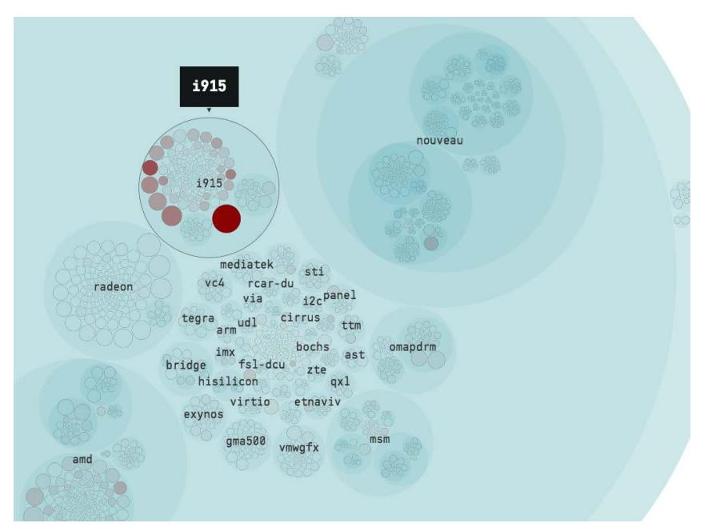

All these files serve to implement the drivers for Intel's graphic card, so let's aggregate their complexity trends as shown in the top [figure on page 110.](#page-121-0)

The aggregated trend of all content in the i915 package doesn't show any dramatic complexity growth. Instead, we see an almost linear trend, which indicates that the module grows in terms of pure size. A much more problematic example is shown in the next [figure on page 110](#page-121-1), taken from a commercial system.

<span id="page-121-0"></span>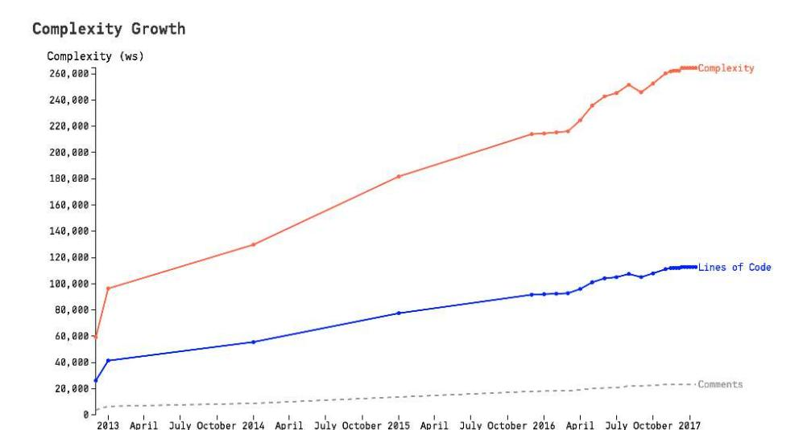

<span id="page-121-1"></span>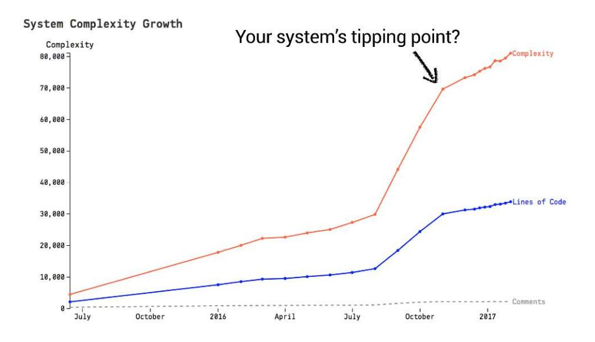

<span id="page-121-2"></span>The preceding figure shows a subsystem whose complexity escalates at a rapid rate. This is a sign that the development organization has to take a step back and start investing in improvements. Trends like these may also serve as a warning sign; adding more people to a system whose complexity grows rapidly would be disastrous, so use the trends as a basis for organizational decisions too.

Used this way, complexity trends helps us detect, and possibly predict, when our system reaches its tipping point—beyond which it becomes a maintenance nightmare. Another use of aggregated trends is that they let us track the effects of refactorings that split a single file into multiple files (for example, the splinter pattern, discussed in *[Refactor Congested Code with the Splinter](009-chapter-4-pay-off-your-technical-debt.md#page-71-0) Pattern*[, on page 57\)](009-chapter-4-pay-off-your-technical-debt.md#page-71-0). Over time we would expect a successful refactoring to reduce the overall complexity of the whole package, and aggregated trends let us measure it.

<span id="page-122-3"></span>
#### React to Hotspots Today

Linux may be a unique snowflake in terms of scale and development activity, but it still evolves like most other codebases: hotspots tend to stay where they are and they also keep accumulating complexity over several years. As developers, we're often aware of problematic modules, but without visual trends we're destined to miss how serious those hotspots are and how much time we waste maintaining code that's more complex than it should be.

<span id="page-122-2"></span>Once we run a complexity trend analysis it becomes obvious that we—as an organization—should have invested in code improvements years ago. We can save our future selves from the same painful insights by reacting today.

<span id="page-122-1"></span>
#### Communicate with Nontechnical Managers

<span id="page-122-0"></span>Depending on your company culture, you may need management buy-in for large redesigns. I've used the techniques in this chapter to communicate the costs and risks of hotspots.

If you're in that situation, start by calculating the percentage of commits that involve your top hotspots—10 to 15 percent is common—to show your managers how important that code is for your ability to support new features and innovations. Follow up with the corresponding complexity trends to explain that the code gets worse over time, which will slow you down. Add the people side to your presentation to highlight that the hotspots are coordination bottlenecks too.

<span id="page-122-4"></span>Later you can visualize the effects of a refactoring with a steep downward trend of your prioritized hotspot. This is most effective when applied on the level of logical components, which tend to carry meaning to nontechnical managers too. As an example, the [figure on page 112](#page-123-1) shows the effect of a splinter refactoring. Trends like these provide an important part of the feedback loop.

Managers do listen; it's just that we need to give them a chance to understand the pain points of something as technical as code so that they can balance that information with other trade-offs. Data buys trust.

<span id="page-123-1"></span>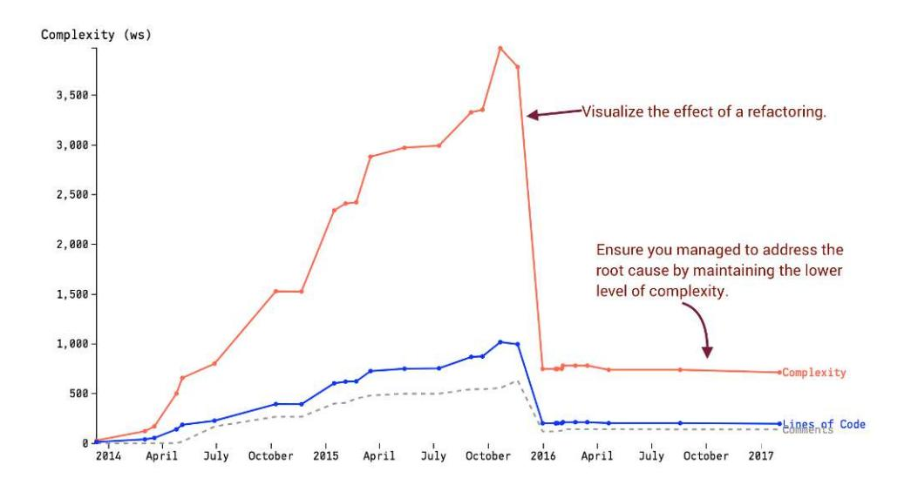

<span id="page-123-0"></span>
## Toward Team-Oriented Measures

In this chapter we climbed the abstraction ladder and analyzed the evolution of complete subsystems. Since the principles for hotspots and complexity trends are orthogonal to the data they operate on, we get to use the same concepts on all levels of detail, be it architectural components, files, or functions. This means you now have the techniques to make sense of a codebase, no matter the scale and size of it.

<span id="page-123-2"></span>The way you slice and dice your architectural boundaries varies depending on your architectural style. For example, in a technically oriented architecture like MVC you want to represent each layer as a boundary, whereas you'd specify each microservice as its own logical component. (We'll discuss both cases—with examples—in Chapter 9, *[Systems of Systems: Analyzing Multiple](015-chapter-9-systems-of-systems-analyzing-multiple-repositories-and-microservices.md#page-173-0) [Repositories and Microservices](015-chapter-9-systems-of-systems-analyzing-multiple-repositories-and-microservices.md#page-173-0)*, on page 165.)

It's also important to note that your mapping doesn't have to be one-to-one between folders and logical components, and in practice you often find that a logical component is represented by multiple folders. One typical example is a physical separation of application code and test code into different parallel folder structures, as illustrated in the [figure on page 113.](#page-124-1)

High-level analyses on logical components fill an important role from a communication point of view, too, as nontechnical stakeholders won't gain much information from learning that the code in gtt.c is hard to maintain. By raising the information to the level of components and instead showing a complexity

<span id="page-124-1"></span>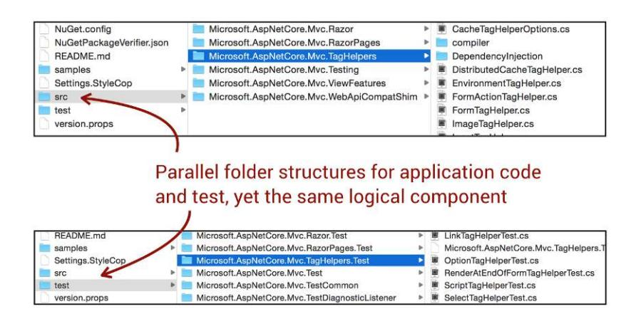

trend of the containing component—for example, Intel graphics driver—you tap into the vocabulary shared between developers and nontechnical people.

We react to architectural hotspots by drilling deeper and uncovering the most critical file- and function-level hotspots, which serve as prioritized refactoring targets. Refactoring large hotspots is an iterative process that takes time. Thus, it's crucial that improvements to different areas can proceed in parallel.

<span id="page-124-0"></span>To work in practice, the collaborative model of your organization has to align with the system's architectural boundaries. Since that's a dimension of software that isn't visible in the code itself, we dedicate the whole next chapter to it. Come along as we explore how to optimize organizations based on feedback from the coding.

<span id="page-124-2"></span>
## Exercises

The following exercises are designed to let you explore architectural hotspots on your own. By working through the exercises you also get the opportunity to explore an additional usage of complexity trends to supervise unit test practices.

### Prioritize Hotspots in CPU Architectures

• Repository: Linux<sup>12</sup>

• Language: C

• Domain: The Linux kernel is an operating system kernel.

• Analysis snapshot: [https://codescene.io/projects/1740/jobs/4358/results/code/hotspots/](https://codescene.io/projects/1740/jobs/4358/results/code/hotspots/system-map) [system-map](https://codescene.io/projects/1740/jobs/4358/results/code/hotspots/system-map)

<sup>12.</sup> <https://github.com/torvalds/linux>

<span id="page-125-2"></span>In this chapter we focused our case study on the gpu package since it was the top hotspot. Once we're done with that analysis it's time to move on to the next candidate: the arch package. Located in the top folder of Linux, the arch directory contains a module for each supported computer architecture, like *PowerPC*, *ARM*, and *Sparc*.

Run a subsystem analysis of the arch package and identify its top hotspot. Dig deeper with an X-Ray, look at the code, and come up with a prioritized refactoring target.

#### Get a Quick Win

• Repository: Erlang<sup>13</sup>

• Language: C

- Domain: Erlang is a functional programming language designed for concurrency, distribution, and fault tolerance.
- <span id="page-125-1"></span>• Analysis snapshot: [https://codescene.io/projects/1707/jobs/4289/results/files/internal](https://codescene.io/projects/1707/jobs/4289/results/files/internal-temporal-coupling?file-name=otp/erts/emulator/beam/erl_process.c)[temporal-coupling?file-name=otp/erts/emulator/beam/erl\\_process.c](https://codescene.io/projects/1707/jobs/4289/results/files/internal-temporal-coupling?file-name=otp/erts/emulator/beam/erl_process.c)

<span id="page-125-0"></span>Erlang is a wonderful platform for building soft real-time systems. The language provides an interesting model of state and interactions, with the main abstraction being *Erlang processes*. Erlang's processes are lightweight and cheap to create, which is quite different from the processes we know in operating systems.

The code for the process abstraction is located in the file /erts/emulator/beam/erl\_process.c. It's a central piece of code with a rich history, which probably explains why the code now exceeds 10,000 lines. Perform an X-Ray on the file and look for internal change coupling that we could eliminate by introducing shared abstractions for similar code. If you succeed, you get a quick win since you manage to reduce the overall complexity of the file.

## Supervise Your Unit Test Practices

• Repository: PhpSpreadsheet<sup>14</sup>

• Language: PHP

• Domain: PhpSpreadsheet is a PHP library used to read and write spreadsheet files such as Excel.

<sup>13.</sup> <https://github.com/erlang/otp>

<sup>14.</sup> <https://github.com/PHPOffice/PhpSpreadsheet>

• Analysis snapshot: [https://codescene.io/projects/1579/jobs/4888/results/scope/system](https://codescene.io/projects/1579/jobs/4888/results/scope/system-trends/by-component)[trends/by-component](https://codescene.io/projects/1579/jobs/4888/results/scope/system-trends/by-component)

Complexity trends on logical components let us fight the normalization of deviance. Such aggregated trends solve a second problem, too—namely, catching components that abandon unit tests. Instead of considering application code and test code part of the same logical component, calculate separate complexity trends for them and see if they evolve together. All too often, organizations embark on a unit-test strategy only to ignore the tests as soon as the first deadline hits the fan. Aggregated complexity trends help you detect build-ups of technical debt early.

<span id="page-126-0"></span>Explore the complexity trends of the logical components in PhpSpreadsheet. Look at the coevolution of application code and test code. Do the trends indicate that unit tests are actively maintained, or are there signs of worry? Think about what the warning signs would look like in terms of trends. (You can always peek at the solutions in *[Solutions: Spot Your System's Tipping](020-appendix-a4-hints-and-solutions-to-the-exercises.md#page-235-1) Point*[, on page 229](020-appendix-a4-hints-and-solutions-to-the-exercises.md#page-235-1).)

All men's miseries derive from not being able to sit in a quiet room alone.

<span id="page-127-0"></span>➤ Blaise Pascal

CHAPTER 7
