# Chapter 7: Beyond Conway's Law

In Part I we saw that a software project often mistakes organizational problems for technical issues, and treats the symptoms instead of the root cause. This misdirection happens because the organization that builds the system is invisible in our code. We can't tell from the code alone if a piece of code is a productivity bottleneck for five different teams. In this chapter we close this knowledge gap as we use version-control data to measure team efficiency and detect parts of the code with excess coordination needs.

<span id="page-127-3"></span>This means we'll be able to measure aspects of software development that we haven't been able to measure before. We'll use this information to see how well our current system aligns with *Conway's law*, which states that "a design effort should be organized according to the need for communication." (See *[How do](021-bibliography.md#page-242-7) [committees invent? \[Con68\]](#page-242-7)*.) We'll look at this principle in more detail and make sure to point out the missing pieces in Conway's law by tapping into research from social psychology, which teaches us that there are many other important organizational issues that affect the quality of our work. We'll also draw a distinction between your team's operational boundaries and knowledge boundaries to explain why it's necessary to keep the former more narrow.

<span id="page-127-2"></span><span id="page-127-1"></span>The way developers collaborate is crucial to the maintainability of any system, so let's dive in and see how we can guide our organization toward better code.

## Software Architecture Is About Making Choices

Software architecture is as much about boxes and arrows as archeology is about shovels. While sketching boxes may be useful as part of a discussion, the real software architecture manifests itself as a set of principles and guidelines rather than a static structure captured in PowerPoint. Such architectural principles work as constraints that limit our design choices to ensure consistency and ease of reasoning in the resulting solution.

<span id="page-128-0"></span>A software architecture also goes beyond purely technical concerns, as it needs to address the collaborative model of the people building the system. The general idea is to minimize the coordination and synchronization needs between different teams to achieve short lead times so that an idea can be realized in code with minimal overhead. When we succeed, each architectural boundary serves as a high-level mental chunk that we can reason about even though the modules are developed by our peers on different teams. The extent to which you can implement new features without calling a grand staff meeting is the ultimate test of an architecture's success.

<span id="page-128-6"></span>
## Conway's Law and Its Impact on Modularity

Modularity alone doesn't guarantee a successful architecture that facilitates parallel work. Rather, your modular boundaries need to align with the responsibilities of the teams in your organization. That principle is the core of Conway's law.

<span id="page-128-1"></span>To pull this off, your modular boundaries should be based on concepts from the problem domain rather than the solution domain. This is because an architecture oriented around the problem domain provides natural team boundaries, as each team can take on an end-to-end responsibility for a feature, which gives every team a clear purpose that is reflected in its responsibilities and areas of work.

<span id="page-128-4"></span><span id="page-128-2"></span>This is in contrast to a technically oriented architecture based on ideas from the solution domain, where concepts like data access, controllers, views, and clients are your main building blocks. This may work fine for a small team, but the architectural style doesn't scale well. Technical building blocks become interconnected and every interesting change to the codebase requires modifications that cut across modular boundaries.

<span id="page-128-3"></span>A technically oriented architecture implies that you either get all of your teams working in the same parts of the code all the time—a coordination nightmare—or that each team "owns" a component and consequently becomes a coordination bottleneck to all teams requiring changes to that component. Either way, it's expensive.

<span id="page-128-5"></span>In the next chapter we'll analyze these patterns in more detail, but for now we just note that such architectures come with inherent coordination costs for both component- and feature-based organizations. The [figure on page 119](#page-129-1) illustrates the bottlenecks.

Interteam communication is an inevitable aspect of building large systems, and thus ease of communication should be a key nonfunctional requirement

<span id="page-129-1"></span>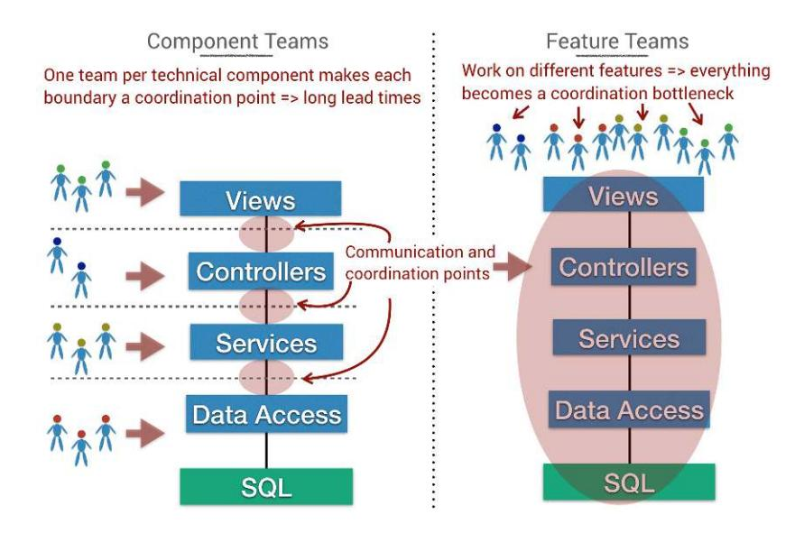

of any architecture. These claims are supported by empirical research, which reports gaps in the required coordination between developers and the actual coordination results in an increase in software defects. The same research also shows development productivity increases with better socio-technical *congruence*. (See *[Coordination Breakdowns and Their Impact on Development](021-bibliography.md#page-242-8) [Productivity and Software Failures \[CH13\]](#page-242-8)* for the research findings.)

<span id="page-129-0"></span>Congruence means that the actual coordination needs are matched with appropriate coordinating actions, which is a strong case for aligning your architecture and organization since coordination costs increase with organizational distance. Such coordination costs also increase with the number of developers, so let's look into that topic.

<span id="page-129-2"></span>
## Measure Coordination Needs

<span id="page-129-3"></span>There's a difference between code developed by a single individual versus code that's more of a shared effort by multiple programmers and, thus, in need of coordination. Excess coordination needs correlate directly to increased lead times. What's more surprising is that there may be a long-term cost, too, as our organizational patterns impact code quality in terms of defects.

In a groundbreaking study, researchers at Microsoft used organizational metrics such as the number of authors, the number of ex-authors, and organizational ownership to measure how well these factors predict the failure proneness of the resulting code. The research shows that organizational factors are better predictors of defects than any property of the code itself, be it code complexity or code coverage. (See *[The Influence of Organizational Structure on](021-bibliography.md#page-244-1) [Software Quality \[NMB08\]](#page-244-1)* for the research.) Let's use these insights to uncover the contribution patterns of individual authors with an example from the Linux kernel.

<span id="page-130-4"></span>
<span id="page-130-0"></span>
### Parallel Development in Linux

In the previous chapter we identified the Intel graphics driver as an architectural hotspot, and now we want to investigate if it also represents a coordination bottleneck in terms of how many authors need to work on it. Social aspects are a bit more complex to measure, so hold tight as we build up our data step by step.

#### Out-of-the-Box Social Analyses


<span id="page-130-1"></span>All the algorithms in this chapter have open source implementations in Code Maat, as introduced in Appendix 2, *[Code Maat: An](018-appendix-a2-code-maat-an-open-source-analysis-engine.md#page-223-0) [Open Source Analysis Engine](018-appendix-a2-code-maat-an-open-source-analysis-engine.md#page-223-0)*, on page 215.

<span id="page-130-3"></span>Our starting point is to count the number of developers that contribute code to each logical component. As we saw in the previous chapter, the folder structure of the Linux kernel reflects concepts from the problem domain. This simplifies our analysis, as we can count the number of authors of each component by specifying the path to its folder as an argument to Git's shortlog command, which serves to summarize data from git log. Here's what it looks like:

```
adam$ git shortlog -s
8 D. Cooper
7 Bob
2 N. Cross
37 B. Horn
...
```

By providing the -s option to git shortlog we get a list with each author's total commit count. Since each author is represented by one line in the output, we can just count the lines. In a UNIX/Linux shell we pipe the output to the wc -l utility, and on Windows we'd use the find /c /v "" combination or PowerShell. Let's see it in action on Linux:

```
adam$ git shortlog -s --after=2016-09-19 -- drivers/gpu/drm/i915/ | wc -l
      55
adam$ git shortlog -s --after=2016-09-19 -- drivers/gpu/drm/amd/ | wc -l
      44
adam$ git shortlog -s --after=2016-09-19 -- drivers/gpu/drm/i810/ | wc -l
       1
adam$ git shortlog -s --after=2016-09-19 -- drivers/gpu/drm/nouveau/ | wc -l
      22
```

The preceding output shows example results from some of the driver components in Linux. For instance, we note that the Intel graphics driver in drivers/gpu/drm/i915/ has contributions from 55 authors in a timespan of three months, which is quite a lot considering that a total of 169 authors have committed code to any module under drivers/gpu within that time period. This means one-third of all contributors in that area may have to coordinate work in the Intel graphics driver. We haven't yet discussed why we focused on just three months of development activity; we'll cover that as we discuss how to decide on an analysis interval later in this chapter. (Spoiler: it's a heuristic.) First, let's see how to use the data.

<span id="page-131-1"></span>The number of authors behind each component provides a shallow indication of coordination needs, and is just a starting point. The quality risks we've discussed are not so much about how many developers have to work with a particular piece of code. Rather, it's more important to uncover how diffused their contributions are, and once more we turn to research for guidance.

<span id="page-131-0"></span>In a fascinating study on the controversial topic of code ownership, a research team noted that the number of minor contributors to a module has a strong positive correlation to defects. That is, the more authors that make small contributions, the higher the risk for bugs. Interestingly, when there's a clear main developer who has written most of the code, the risk for defects is lower, as illustrated by the following figure. (See *Don'[t Touch My Code! Examining](021-bibliography.md#page-241-7) [the Effects of Ownership on Software Quality \[BNMG11\]](#page-241-7)*.)

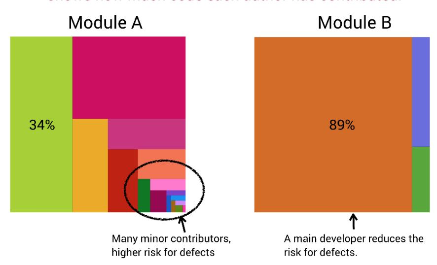

Based on that research alone we can't tell *why* having more minor developers of a module leads to more defects. However, given what we've learned so far, some of the effect is likely due to increased coordination needs combined with an incomplete understanding of the existing design and problem domain. Further, a main developer is likely to mean that the code has a consistent style and idea behind it. As we'll soon see, other psychological factors should influence our code-ownership strategy, but let's not get ahead of ourselves. Let's start by taking the research findings at face value and exploring how we can detect these potential problems.

<span id="page-132-1"></span>
<span id="page-132-0"></span>
#### Rank Code by Diffusion

Our goal is to provide an analysis that ranks all the modules in our codebase based on how diffused the development effort is, and then to use that as a proxy for coordination needs. This is a quantitative metric that we get through a *fractal value* analysis. A fractal value is an algorithm that delivers a normalized value between 0.0 and 1.0 based on how many different authors have contributed and how the work is distributed among them. (See *[Fractal Figures:](021-bibliography.md#page-242-9) [Visualizing Development Effort for CVS Entities \[DLG05\]](#page-242-9)* for the research and complete definition.) The next figure shows the fractal value formula, and if you prefer code to math, there's an implementation in Code Maat too.<sup>1</sup>

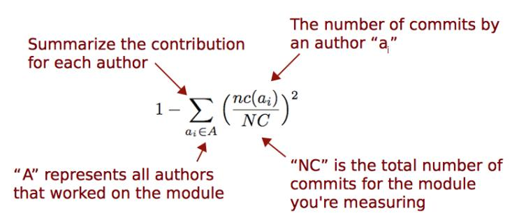

<span id="page-132-2"></span>A fractal value of 0.0 means a single author has written all the code, whereas the closer to 1.0 we get, the more contributors there are, as shown in the top [figure on page 123](#page-133-0).

The git shortlog command we used earlier provides us with all the input data we need for the fractal value computation. Remember that with an -s option, git shortlog includes a summary with the commit count per author. We can then visualize it using enclosure diagrams—just as we did for hotspots—but have the color signal the range of the fractal value instead. The next [figure on page 123](#page-133-1)

<sup>1.</sup> [https://github.com/adamtornhill/code-maat/blob/1c867df1e8228c321ddd83bf6679ddb781049116/src/code\\_maat/](https://github.com/adamtornhill/code-maat/blob/1c867df1e8228c321ddd83bf6679ddb781049116/src/code_maat/analysis/effort.clj#L96) [analysis/effort.clj#L96](https://github.com/adamtornhill/code-maat/blob/1c867df1e8228c321ddd83bf6679ddb781049116/src/code_maat/analysis/effort.clj#L96)


<span id="page-133-0"></span>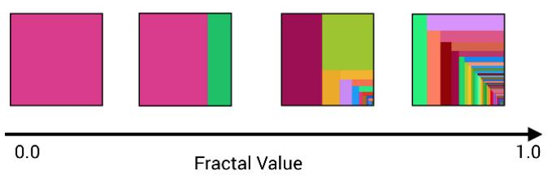

<span id="page-133-1"></span>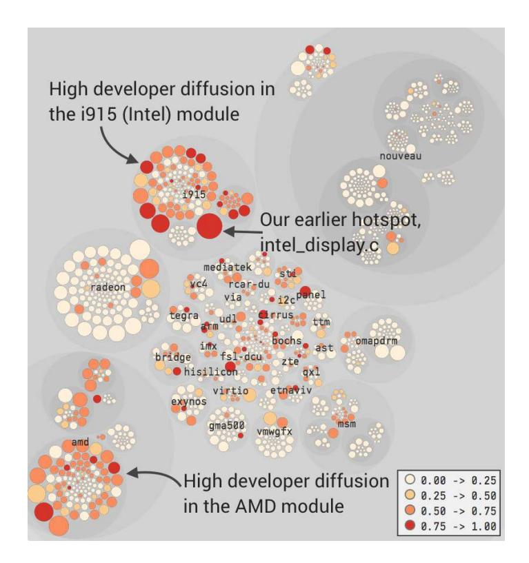

shows the fractal values of the files in the Linux GPU drivers, where the more intense red color indicates higher fragmentation.<sup>2</sup>

The analysis of the Linux GPU package reveals that the driver modules for Intel and AMD have the greatest need for coordination. The main hotspot, intel\_display.c, which we identified in the previous chapter, attracted 17 developers over the past three months. Now let's see what this means and how we would react to similar findings in our own code.

<sup>2.</sup> <https://codescene.io/projects/1738/jobs/4886/results/social/knowledge/individuals>

#### React to Developer Fragmentation

<span id="page-134-1"></span>Open source development may be different from many closed source settings, as it encourages contributions to all parts of the code. However, there's evidence to suggest that this collaboration comes with a quality cost. One study on Linux found that code written by many developers is more likely to have security flaws. (See *[Secure open source collaboration: an empirical study of](021-bibliography.md#page-244-3) Linus' [law \[MW09\]](#page-244-3)*.) The paper introducing our fractal value metric evaluated it on the Mozilla project, and found a strong correlation between the fractal value of a module and the number of reported bugs. (See *[Fractal Figures:](021-bibliography.md#page-242-9) [Visualizing Development Effort for CVS Entities \[DLG05\]](#page-242-9)*.)

Every situation is different. You might have good reasons for multiple developers to work on the same code. However, you can still use the fractal values to reason about risk. Whenever you find code with a high fractal value, use the data to do the following:

- <span id="page-134-0"></span>• *Prioritize code reviews*. Code reviews done right are a proven defect-removal technique, but they come at a cost. As your organization grows, codereviewer fatigue becomes a real thing. Given what we know about defects, we should prioritize code reviews of changes done by minor contributors.
- <span id="page-134-5"></span>• *Focus tests*. Calculate fractal values to identify the areas of the code where you need to focus extra tests.
- <span id="page-134-2"></span>• *Replan suggested features*. Before you start on a new feature, measure the development fragmentation over the past weeks. If your planned work involves an area of the code with high developer congestion, it could pay off to replan and delay the start on any new feature implementation.
- <span id="page-134-4"></span>• *Redesign for increased parallelism*. In a large system you need to optimize development for parallel work, so use the fractal values to identify candidates for splinter refactorings allowing people to work more independently.
- <span id="page-134-3"></span>• *Introduce areas of responsibility*. When you visualize developer patterns you give nontechnical managers insights into development work, providing them a chance to reassess the current ways of working, perhaps by introducing teams that are aligned with the structure of the codebase, an idea we'll explore shortly.

Many fundamental problems in large-scale software development stem from a mindset where programmers are treated as interchangeable cogs—generic resource ready to be moved around and thrown at new problems in different areas. The research we just covered suggests that such a view is seriously flawed. Not all code changes are equal, and the programmer making the

change is just as important from a quality perspective as the code itself. With that covered, let's raise these ideas to the level of an organization and start to analyze team work.

#### Watch Out for Authors with Multiple Aliases

<span id="page-135-1"></span>Social metrics such as fractal values identify each developer who contributes code, but unfortunately it's common that developers have multiple Git aliases, which biases the analysis results. You prevent that by providing a .mailmap that resolves the aliases. The Git feature .mailmap is a simple text file that you add to the root of your repository and use to specify a mapping from multiple aliases to a single developer, as shown here.


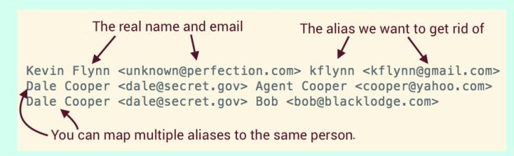

<span id="page-135-2"></span>
<span id="page-135-0"></span>
## Code Ownership and Diffusion of Responsibility

<span id="page-135-4"></span>So far we've discussed coordination needs mainly in terms of quality: the more developers who touch a piece of code, the higher the risk for defects. But coordination also has a very real direct cost, which is what social psychologists call *process loss*.

<span id="page-135-3"></span>Process loss is a concept that social psychologists borrowed from the field of mechanics. The idea is that just as a machine cannot operate at 100 percent efficiency all the time (due to physical factors like friction and heat loss), neither can a team. Part of a team's potential productivity is simply lost. (See *[Group Process and Productivity \[Ste72\]](#page-244-11)* for the original research.)

The kind of process loss that occurs depends on the task, but in a brainintensive collaboration like software, most process loss is due to communication and coordination overhead. Process loss may also be driven by motivation losses and other social group factors. These are related to a psychological phenomenon called *diffusion of responsibility*. You notice the most extreme manifestation of diffusion of responsibility if you're unfortunate enough to witness an accident or an emergency; the larger any group of bystanders, the less likely any individual will provide help. Scary.

One of the most important reasons behind diffusion of responsibility is that in larger groups we don't feel a personal sense of responsibility, and we assume someone else should react and help.<sup>3</sup> The consequence is that the group setting makes us act in a way we wouldn't if we were alone.

Diffusion of responsibility usually takes on less dramatic forms in software, but it's still there and the same situational forces have serious implications for code quality and productivity. To counter these effects we must feel that our individual contributions make a difference. Good code has a sense of personal responsibility from everyone involved.

<span id="page-136-2"></span>To counter the diffusion of responsibility we need to look for structural solutions. One way of producing personal responsibility is *privatizing*, which is an effective technique for managing shared resources in the real world. (See *[The](021-bibliography.md#page-242-10) [commons dilemma: A simulation testing the effects of resource visibility and](021-bibliography.md#page-242-10) [territorial division \[CE78\]](#page-242-10)* for research on how groups benefit from privatization.) Since code is about knowledge rather than a physical resource, we need to explore the idea of privatizing and its consequences in terms of code ownership.

<span id="page-136-3"></span>
## Immutable Design

Providing a clear ownership model also helps address hotspots. I analyze codebases as part of my day job, and quite often I come across major hotspots with low code quality that still attract 10 to 15 percent of all development efforts.

It's quite clear that this code is a problem, and when we investigate its complexity trends we frequently see that those problems have been around for years, significantly adding to the cost and displeasure of the project. New code gets shoehorned into a seemingly immutable design, which has failed to evolve with the system.

At the same time, such code is often not very hard to refactor, so why hasn't that happened? Why do projects allow their core components to deteriorate in quality, year after year? A look at the diffusion of responsibility provides part of the answer as the developer fragmentation of those hotspots tends to look like the [figure on page 127](#page-137-0).

<span id="page-136-1"></span><span id="page-136-0"></span>This is the software version of a crowd of people looking passively at an accident. Again, the main problem here isn't technical but social, and it's intimately tied to the organization building the code.

## Code Ownership Means Responsibility

Code ownership can be a controversial topic as some organizations move to models where every developer is expected to work on all parts of the codebase.

<sup>3.</sup> [https://en.wikipedia.org/wiki/Diffusion\\_of\\_responsibility](https://en.wikipedia.org/wiki/Diffusion_of_responsibility)

<span id="page-137-0"></span>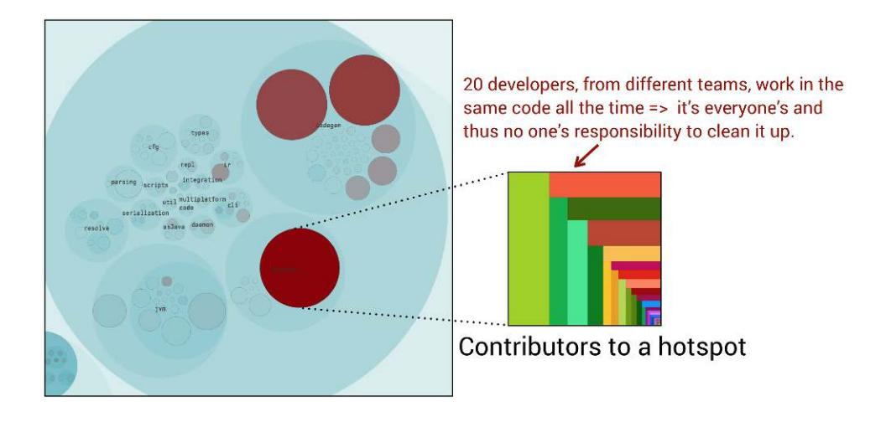

The idea of code ownership evokes the idea of *development silos* where knowledge is isolated in the head of a single individual. So let's be clear about this: when we talk ownership, we don't mean ownership in the sense of "This is my code—stay away." Rather, ownership is a mechanism to counter the diffusion of responsibility, and it suggests that someone takes personal responsibility for the quality and future of a piece of code.

<span id="page-137-2"></span>That "someone" can be an individual, a pair, or a small team in a larger organization. I've also seen organizations that successfully adopt an open source–inspired ownership model where a single team owns a piece of code, yet anyone can—and is encouraged to—contribute to that code. The owning team, however, still has the final say on whether to accept the contributions. The advantage of this model is that it allows teams to bridge gaps in the alignment between architecture and organization by implementing the functionality they need even when it happens to cross organizational boundaries.

<span id="page-137-1"></span>
## Provide Broad Knowledge Boundaries

The effects we discuss are all supported by data, and whether we like it or not, software development doesn't work well with lots of minor contributors to the same parts of the code. We've seen some prominent studies that support this claim, and there is further research in *[Code ownership and software](021-bibliography.md#page-243-7) [quality: a replication study \[GHC15\]](#page-243-7)*, which shows that code ownership correlates with code quality. This research is particularly interesting since it replicates an earlier study, *Don'[t Touch My Code! Examining the Effects of](021-bibliography.md#page-241-7) [Ownership on Software Quality \[BNMG11\]](#page-241-7)*, which claims that the risk for defects increases with the number of minor developers in a component.

<span id="page-138-2"></span>Of course, these findings don't mean you should stop sharing knowledge between people and teams—quite the contrary. It means that we need to distinguish between our *operational boundaries* (the parts where we're responsible and write most of the code) from the *knowledge boundaries* of each team (the parts of the code we understand and are relatively familiar with). We want to keep the latter more broad, as illustrated in the following figure.

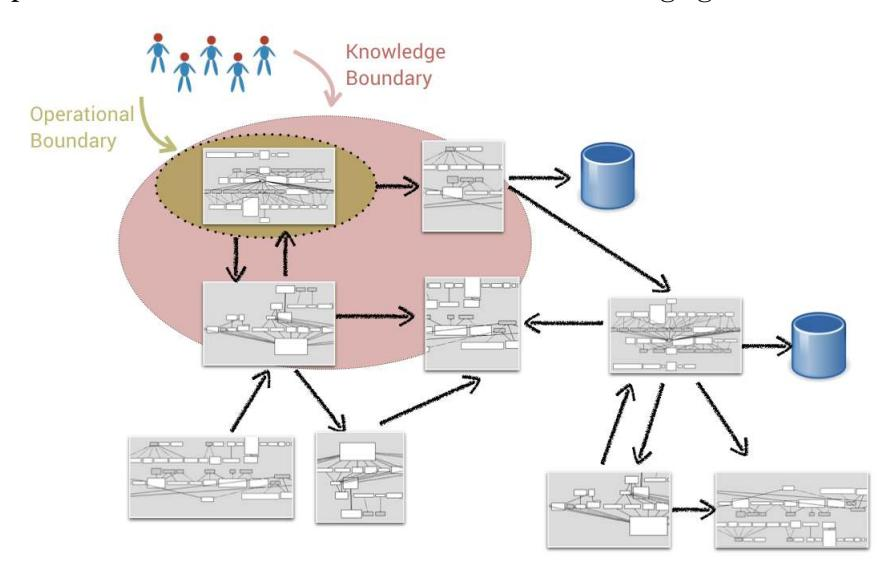

<span id="page-138-1"></span>Whereas Conway's law implies that our communication works best with welldefined operational boundaries, broader knowledge boundaries make interteam communication easier since we share parts of each other's context. There's also evidence that broader knowledge boundaries provide our organization with a competitive advantage, enabling us to see opportunities and benefit from innovations outside our area of the code. (See *[The Mirroring Hypothesis:](021-bibliography.md#page-242-11) [Theory, Evidence, and Exceptions \[CB16\]](#page-242-11)* for a summary of 142 empirical studies on the topic.)

<span id="page-138-0"></span>There are several techniques for broadening your knowledge boundaries, such as inviting people from other teams to code reviews and scheduling recurring sessions where you present walkthroughs of a solution or design. You may also choose to encourage people to rotate teams. When combined, these techniques give your teams a fresh perspective on their work and help foster a culture of shared goals. In addition, few things provide a greater learning opportunity than explaining your code and design to someone else.

The key to finding the right boundaries is to make it a deliberate rather than an accidental designation. We can't measure the precise knowledge boundaries, but we can get an accurate picture of the operational boundaries based on where each developer has contributed code, and use that information to streamline our architecture and organization. We'll cover how to do that in a minute, but as a first step we need to agree on a cutoff date for our analysis.

<span id="page-139-2"></span>
### Specify a Start Date with Organizational Significance

Development organizations aren't static. People move between teams, new teams are formed, and old teams are abandoned. Each organizational change introduces a possible bias into the team-level metrics.

<span id="page-139-1"></span>You can avoid these biases by selecting an analysis start date that represents the date of your last organizational change. For example, let's say you changed the team structure in March 2017. In that case you want to limit your versioncontrol data to changes since that date, which you do with the --after option to Git that we discussed earlier. Behavioral data in the shape of versioncontrol commits accumulates quickly, and a few weeks of activity is usually enough to detect the patterns we discuss in this chapter.

Note that the technical analyses, like hotspots and change coupling, are different from social analyses because you want to detect long-term trends. In that case, use a start date that represents a significant event in your product's life cycle, such as a major release or a fairly large redesign. With the analysis time span covered, we're ready to start analyzing team work.

<span id="page-139-4"></span>
<span id="page-139-0"></span>
## Analyze Operational Team Boundaries

In many situations the coordination unit of interest isn't that of individual developers but rather of teams. This is the case in larger organizations or when using collaborative development techniques like pair programming. Since version-control data doesn't know anything about teams, we need to augment the raw behavioral data with organizational information. This is a matter of scripting a replacement of author names with the names of their teams, as the following figure illustrates.

<span id="page-139-3"></span>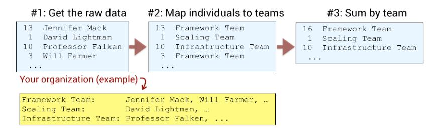

The Git log output in the preceding figure is fetched with the same options, git shortlog -s, that we used in *[Parallel Development in Linux](#page-130-0)*, on page 120. The raw data gives us the number of commits per author and folder, and from here we just replace the author with the name of the team through a simple lookup.

<span id="page-140-1"></span>Now we need to iterate through the Git data and summarize the contributions at the team level so that we can calculate a fractal value and detect excess parallel work. This is a mechanical scripting exercise that you could implement yourself, use the open source tooling in Code Maat (see *Measure Conway's Law*, on page 217), or have CodeScene do for you.<sup>4</sup>

### Let Git Do the Team Mapping


<span id="page-140-0"></span>Git's .mailmap functionality provides a quick way of getting raw data on the team level. Just provide a .mailmap that translates individual authors to the names of their teams, and configure the path to that .mailmap through Git's mailmap.file option. The next time you run a git log command you get team names instead of authors without the need for any extra scripting.

Whatever approach we choose, we want to end up with data that lets us identify components with excess parallel development, as the following figure illustrates.

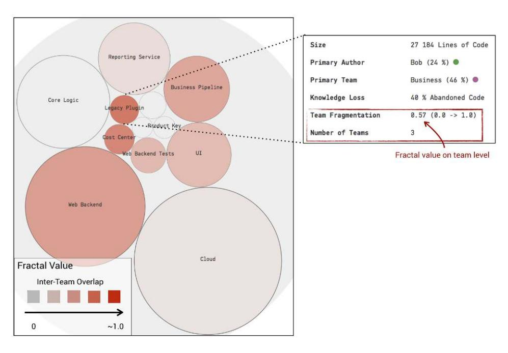

<sup>4.</sup> <https://codescene.io/docs/guides/architectural/architectural-analyses.html#evaluate-conway-s-law>

The preceding figure is from a commercial closed source system that I made anonymous for inclusion as a case study. The most fragmented logical component is the Legacy Plugin, where three teams have made contributions over the past month. In the real application, Legacy Plugin has a more business-oriented name, but legacy it is. It's a subsystem that's been around for years and no one claims to know anything about it except for Bob, its original author, who left in frustration two years ago.

Interestingly, the figure shows that Bob has written only 24 percent of the historic code as measured from version-control data. That means the majority of the code was written by someone else, so how come nobody claims to know anything about the component?

Back in Part I we saw that building and maintaining mental representations of code gets significantly harder in the presence of excess parallel development. In this case there are three teams with between 10 and 15 authors working on the code. However, parallel work is probably only part of the real issue, as the organization faces motivational issues too. The code in the Legacy Plugin was in fairly bad shape, and thus no one took a particular interest in working with it. Instead, most developers made the minimal tweaks their feature required and moved on to greener pastures as fast as possible without retaining much new knowledge about the Legacy Plugin. As a result, the code degrades with each new feature and a complexity trend analysis would reveal that it has reached its tipping point. Let's see how to break out of this downward spiral.

<span id="page-141-0"></span>
## Introduce New Teams to Take on Shared Responsibilities

<span id="page-141-2"></span>Code like the Legacy Plugin is both a cost sink and a quality risk, so it's important to get it back on track. The first step is to grant someone ownership over the code and ensure that person gets the necessary time to address the most critical parts. Social code analysis helps us with this task too.

<span id="page-141-1"></span>Since we know who has worked where, we can investigate team patterns in more depth. The [figure on page 132](#page-142-0) shows the distribution of contributions among the teams that work on the Legacy Plugin.

Since all three teams make significant contributions, the organization used this information to assemble a new team with a member from each. A component that attracts teams that are supposed to have distinct responsibilities indicates a lack of symmetry between the organization and the design. By ensuring that people with domain knowledge of the surrounding subsystems are represented, the organization can build on the members' existing communication network and see to it that any design changes fit all clients. In this

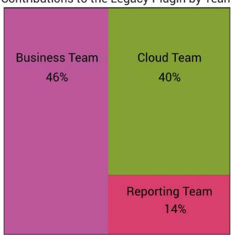

<span id="page-142-0"></span>

<span id="page-142-1"></span>case, the new team decided to do a partial rewrite of the Legacy Plugin to separate its responsibilities and better align with the rest of the architecture.

Architectural building blocks tend to get defined early in a product's life cycle, and as the code evolves it's likely that new boundaries are needed, for both components and teams. Unfortunately, this is an aspect that organizations often fail to react to, and the consequences are developer congestion and coordination bottlenecks in the codebase. Such problems sneak up on us, which is why we need to measure and visualize. Let's see how we can get more detailed insights.

<span id="page-142-3"></span><span id="page-142-2"></span>So far our team-level analyses have focused on logical components, which is a good starting point since a component represents a semantically interesting unit of work. However, the same analyses can be performed on the file level, too, as the [figure on page 133](#page-143-0) illustrates.

The advantage of measuring coordination needs at the file level is that it lets you see how diffused the parallel work is. Is it limited to just a few files or is it a general pattern for every entity within the component? The preceding figure shows an example from another commercial system, where most coordination needs are inside the system's integration tests. This is a common pattern since integration tests tend to be collaborative efforts, with each team covering the scenarios for their features.

In this example, you see that the files with integration tests tend to be relatively large compared to the surrounding application code. The actual file sizes for each test ranged between 1,500 and 3,000 lines of code, and a hotspot

<span id="page-143-0"></span>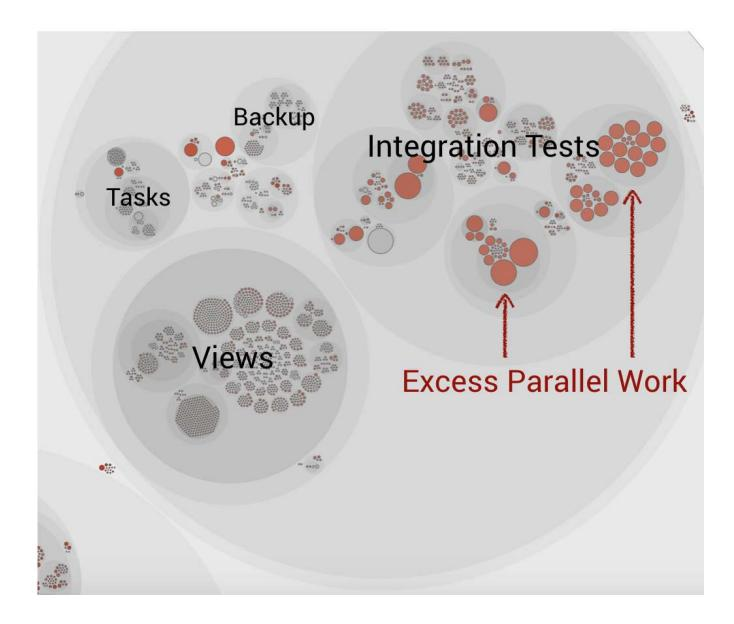

<span id="page-143-1"></span>analysis with a subsequent code inspection revealed that the highest technical debt interest rate was in those tests.

These tests were developed by an organization that puts lots of effort into writing maintainable code. The automated integration suite is a key component in that regard, yet it exhibited a noticeably lower quality standard. The test suites contained structural problems, an X-Ray analysis revealed large chunks of copy-pasted code, and the change patterns told a story of strong and surprising coupling between tests that were expected to be independent. Again, the main reasons were social rather than technical, as no one had a holistic overview of the test code, nor did they feel a sense of personal responsibility for it.

The organization reacted to these findings in two ways. First, it took a technical view of the integration-test design. This is important since code attracts many contributors for a reason, which often boils down to low cohesion. By extracting the plumbing—such as initialization code, result reporting, and infrastructure—into a separate library, the test suites could be split more easily to focus on distinct scenarios and thus provide a natural fit for the different feature teams operating on them. Second, the organization introduced a new team to take on the shared responsibility of maintaining the core test functionality. This new team also had the final say on the code that got accepted, which proved useful in establishing and communicating effective integration-test patterns to all teams.

<span id="page-144-0"></span>
## Social Groups: The Flip Side to Conway's Law

<span id="page-144-2"></span>So far you've probably gotten the impression that if we just manage to align our operational boundaries with a system's architecture, we're fine. Conway's law is a great observation from the dawn of software development that has received renewed interest over the past few years, mostly as a way to sell the idea of microservices. But from a psychological perspective Conway's law is an oversimplification. Team work is much more multifaceted. The law also involves a trade-off: we minimize communication needs between teams, but that win comes with costs and risks that are rarely discussed in a software setting. Let's look at an example using the knowledge map in the following figure.

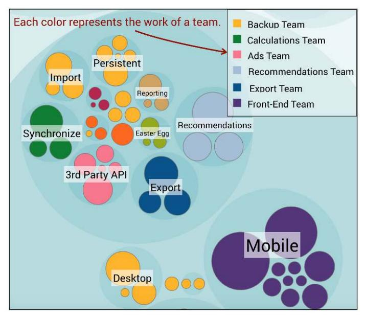

<span id="page-144-3"></span><span id="page-144-1"></span>From the perspective of Conway's law the data in the preceding figure sure looks ideal. The team map, calculated from version-control data and discussed in detail in our next chapter, shows the operational boundaries of each team, and as you see there's a perfect separation between the responsibilities of each team, without any overlap. Thus, the coordination needs are limited to the contracts between the different components, which minimizes parallel work and interteam communication issues.

The flip side is the direct social costs of isolating teams with distinct areas of responsibility, and if we're unaware of these social costs they will translate into real costs in terms of both money and a dysfunctional culture. The most common social costs are *motivation losses* and *group conflicts*. Let's discuss them and see how we can minimize their impact.

### Motivation Losses in Teams

<span id="page-145-2"></span>A few years ago I worked with a team that was presented with a challenging task. During the past year the team had focused on making its work more predictable. It had learned to narrow down and prioritize tasks and to limit excess parallel development, and it had invested in a strong integration-test suite. It had been a bumpy ride, but life started to look bright until one day the team's sprint was halted and a rapid change of plans was ordered.

Suddenly the team had to start work on a feature completely unrelated to all other recent work, and a tight deadline was enforced. Since no one had the required domain expertise and the software lacked the proper building blocks, the team had to sacrifice both short- and long-term quality goals to meet the deadline, only to be surprised that the completed feature wasn't delivered to any customers. The reason that the feature suddenly gained importance and intense management focus was that someone had a bonus depending on it. The bonus goals were set two years earlier, before a single line of code had been written. The manager got his bonus, but the project suffered and was eventually canceled. It wasn't so much the accumulated technical debt, which could have been countered, but rather the motivational losses among the team members.

<span id="page-145-1"></span>This story presents the dangers of making people feel like their contributions are dispensable, a factor that's known to encourage *social loafing*. Social loafing is a type of motivation loss that may occur when we feel that the success of our team depends little on our actual effort. We pretend to do our part of the work, when in reality we just try to look busy and hope our peers keep up the effort. It's a phenomenon that occurs for both simple motor tasks, like rope-pulling, as well as for cognitive tasks like template metaprogramming in C++.<sup>5</sup>

<span id="page-145-3"></span><span id="page-145-0"></span>It doesn't take extreme situations like the previous story to get social loafing going in a team. If the goals of a particular project aren't clearly communicated or if arbitrary deadlines are enforced, people lose motivation in the task. Thus, as a leader you need to communicate *why* some specific task has to be done or why a particular deadline is important, which serves to increase the motivation for the person doing the job.

Social loafing is also related to the diffusion of responsibility that we discussed earlier in the sense that social loafing becomes a viable alternative only when you feel anonymous and your contributions aren't easily identifiable. Therefore, social loafing and the resulting process loss increases with group size, which

<sup>5.</sup> <http://www.adamtornhill.com/articles/fizzbuzz.htm>

is a phenomenon known as the *Ringelmann effect*. Thus, part of the increased communication costs on a software project with excess staffing is likely to be Ringelmann-driven social loafing rather than true coordination needs.

Several factors can minimize the risk of social loafing:

- <span id="page-146-1"></span>• Small groups: In general, you want to strive for small teams of three or four people. Coordination losses increase with group size, and they increase in an accelerating manner. On a small team each contribution is also more recognized, which boosts motivation.
- <span id="page-146-0"></span>• Evaluation: Code reviews done right have positive motivational effects, as the reviews show that someone else cares about your contribution. Code reviews are, even if we rarely view them that way, a form of evaluation and social pressure, which are factors known to decrease social loafing.
- Leadership by example: If you're in a leadership position—which all senior developers are no matter what your business card says—you need to model the behaviors you want to see in others.
- <span id="page-146-2"></span>• *Visibility*: Recognize each person's contributions by presenting knowledge maps that show the main contributors behind each module, as the following figure illustrates. This information can be kept within each team.

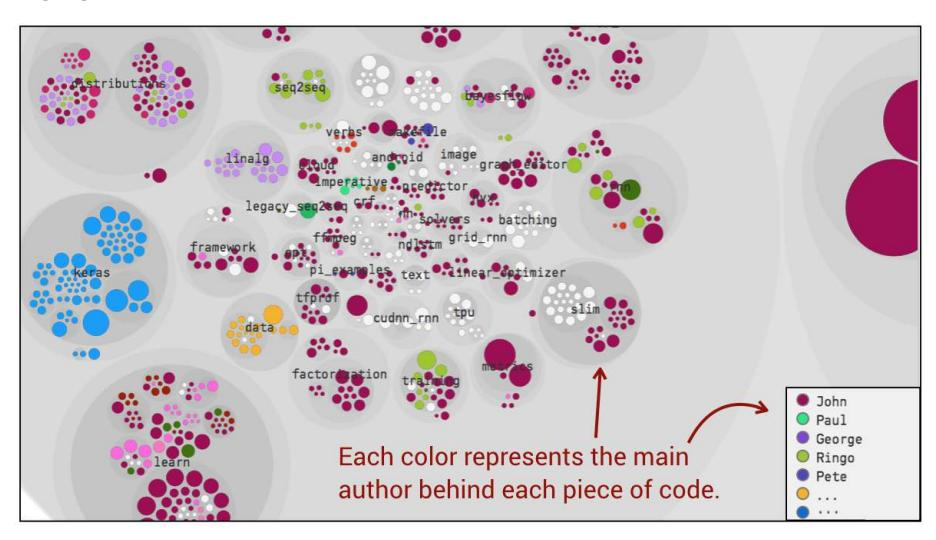

Note that visibility isn't about finding out if someone writes, or copy-pastes, enough lines of code each week. Instead the purpose is to instill a sense of pride, like, "Hey, look—this is the code I've written" along the lines of code

<sup>6.</sup> https://en.wikipedia.org/wiki/Ringelmann effect

ownership and personal responsibility we discussed earlier. There's much to be gained by tapping into developers' intrinsic motivation.

## Don't Turn Knowledge Maps into Performance Evaluations

<span id="page-147-2"></span>The knowledge maps we talk about in this book aren't intended for performance evaluations, and the reason I advise against this is part ethical and part practical. In particular, once someone starts to evaluate contributors people adapt by optimizing for what's measured.

For example, if I'm evaluated by how many commits I push, I just increase my number of commits. Sure, those commits will no longer carry any meaning, but my statistics "improve." Worse, using this data for performance evaluation destroys the team dynamics. We become less likely to invest time in supporting our peers since we're busy optimizing for an arbitrary goal instead.

<span id="page-147-1"></span>
### Us and Them: The Perils of Interteam Conflicts

When we fail to instill a culture of shared goals and broad knowledge boundaries, our organization is at risk of interteam conflicts. These conflicts don't have to be as dramatic as the term sounds, but are still a source of frustration and missed opportunities. Let's look at an example.

Today your team happened to break the nightly build as its comprehensive suite of long-running regression tests failed. You know that it was due to the stress of the looming deadline combined with some pure bad luck and an unstable build environment (someone should really fix that). Besides, maintaining all the legacy code you inherited isn't an easy task. However, when *they*—the members on the other team—break the build, you know equally well that it's because they are a bunch of careless cowboy coders whose code contributions have more in common with Italian food than the razor-sharp engineering marvels crafted by your team.

<span id="page-147-0"></span>The distinction in this story between your group and an external group is known as the *fundamental attribution error* and has wrecked more software projects than even VB6. 7 The fundamental attribution error is a social bias that makes us attribute the same observable behavior to different factors depending on whether it concerns our group or another one.<sup>8</sup> In particular, we tend to overestimate personality factors as we explain the actions of others while we like to see situational forces as an explanation for our own wrongdoings.

<sup>7.</sup> [https://en.wikipedia.org/wiki/Visual\\_Basic](https://en.wikipedia.org/wiki/Visual_Basic)

<sup>8.</sup> [https://en.wikipedia.org/wiki/Fundamental\\_attribution\\_error](https://en.wikipedia.org/wiki/Fundamental_attribution_error)

<span id="page-148-2"></span>Breaking the distinction between "us" and "them" is vital to reducing interteam conflicts, and that's why it's important to let all your teams share common and compelling goals. A goal also serves as motivator by communicating why a particular task is important and how it fits into the larger whole.

<span id="page-148-3"></span>You also have to make sure that the people who work on different but related teams know each other on a personal level. Social psychology teaches us that one factor behind the fundamental attribution error is that we come to view members of other groups as having one personality. (See *[Group Process, Group](021-bibliography.md#page-241-8) [Decision, Group Action \[BK03\]](#page-241-8)*.) This is true in real life as well as in software development any time we write off our peers as unprofessional and careless. As we start to know the individuals, we realize that they have distinct personalities and we may also start to understand the challenges and complexities of the code they work on. Perhaps we can even start to learn from them.

<span id="page-148-4"></span>The ideas we discussed earlier on expanding knowledge borders such as sharing insights and encouraging developers to rotate teams all help with establishing relationships that reduce interteam conflicts. Several companies also form interteam communities dedicated to sharing technology knowledge, such as C#, Java, Python, or graph database modeling.

<span id="page-148-1"></span>
## Coffee as an Organizational Tool

Years ago I worked for a development organization that had two separate teams. The different team members met each day at the coffee break. (Swedes like me are crazy about their coffee.) This break proved to be a great venue for informal conversations, a channel for sharing knowledge, and a way of getting to know each other. One day management banned that break, based on the idea that if we don't type on our laptops we don't work. Humans (yes, developers included) aren't machines, and this decision proved disastrous since it effectively killed interteam collaborations and knowledge sharing. No amount of meetings could make up for the loss of the informal coffee venue.

<span id="page-148-0"></span>A common 15-minute coffee break is the cheapest team-building exercise you'll ever get, and we shouldn't underestimate the value of informal communication channels that help us notice new opportunities and work well together. As a nice bonus, getting to know your peers on other teams reduces the risk of social biases like the fundamental attribution error.

## Combine Social and Technical Information

There's a fine line between having enough people to complete a large task and the point where critical parts of the code turn into coordination bottlenecks. Conway's law provides us with guidance, and in this chapter you learned how to measure coordination needs between both individuals and teams. While we won't ever be able to put numbers on anything as complex as human interactions, we can still gather data that helps us ask the right questions.

Conway's law in isolation isn't enough, as team work is much more complex, and the main challenge is to combine code ownership where teams work relatively independently with shared and compelling goals rather than fostering artificial competition among the contributors. The social sciences have decades of experience for us to tap into, and we've discussed some of the most important factors, such as process loss and motivational issues, in this chapter.

<span id="page-149-0"></span>It's also important to note that the social information we get from our versioncontrol system may be biased. For example, you may be pair programming, yet only the person who does the commit gets recorded. This is a limitation in how traditional version control functions. A simple workaround is to include the names of both peers in your commit message and parse that information instead of Git's author field.

Another bias occurs when the same person is a member of several teams, which may be typical for a coach or mentor. If you don't account for that situation, your analysis may indicate more excess parallel work than you actually have. There are two solutions here. One is to exclude such persons from the analysis since they're expected to work on all parts anyway. Another approach is to introduce a separate team for them and analyze the work of that team in isolation.

In the next chapter we'll look more deeply at software architectures with respect to organizational factors. You'll also learn to connect social information to technical insights by combining knowledge analyses with technical data, which lets you identify dependencies between code that's owned by different teams. <span id="page-150-0"></span>➤ Horace

CHAPTER 8
