# Chapter 8: Toward Modular Monoliths through the Social View of Code

Many of today's codebases are trapped in hard-to-maintain monolithic systems where the lure of a complete rewrite becomes more attractive with every development task that we painfully slide over to the Done column. However, a large-scale rewrite is always a strategic risk, and it will reset much of the existing team's understanding of the codebase. A worse but learned and understood design may trump its cleaner replacement.

In this chapter we discuss the pros and cons of rewrites, and we cover techniques that help us get situational awareness of existing architectures by evaluating both technical and social aspects. We use the resulting information to suggest new modules by identifying bounded contexts in existing code. Along the way you'll get to know architectural paradigms that represent use case–centric alternatives to traditional layered architectures, and you'll learn to evaluate when—and if—you need to migrate toward one of them. Let's start by dodging a bullet.

## Dodge the Silver Bullet

Whatever architectural decisions we make, they're likely to be invalidated over time, simply because an organization isn't static. For example, I once worked with a company that had built a successful product based on a classic model-view-controller (MVC) architecture.1 This was a sound decision as the company's framework of choice let it get new features out the door at a rapid pace and launch a successful business. Success frequently leads to a

1. <https://en.wikipedia.org/wiki/Model%E2%80%93view%E2%80%93controller>

combination of more money and new opportunities, which in this case meant that more people could be hired with the idea that additional product areas could be covered.

As the organization grew from the initial five to fifteen developers in the span of a year, the overall efficiency went down. MVC is a technical architecture, and when taken to the extreme, independent features get entangled in the same modules. This meant that the developers had to allocate an increasing amount of time to planning and coordinating changes, and soon the core people found themselves spending more time in meetings than in code.

A lot of effort also went into developing a comprehensive integration-test suite. While that test suite helped to prevent defects from slipping into production, it didn't really do anything to facilitate coordination. Quite the contrary, as it became yet another coordination bottleneck where the tests frequently broke due to conflicting changes. Taken together, the lead times from a feature request to the actual delivery increased dramatically, and the root cause of the problem was that the architecture failed to adapt to a changed situation.

## The Trade-Off Between Architectural Refinements and Replacement Systems

Many organizations respond to similar situations by launching a project to develop a new system with an architecture that's better adapted to today's needs. This puts the organization in a difficult position, as it will face a set of potential problems:

- • *Immediate legacy code*: Since the current system is the one in use, it has to continue to evolve and be maintained. However, the very act of declaring that a new system will be built effectively puts a legacy stamp on the existing codebase, even if the new system is little more than a twinkle in an architect's eye. The signal it sends is that refactoring efforts are wasted since the codebase will be replaced anyway.
- • *Playing the catch-up game*: The new system will have to catch up to the continuous features and tweaks implemented as a response to user feedback on the old system, which turns the project into a moving target and implies stronger interproject coordination needs.
- • *Division of efforts*: There will be fewer people working on the existing system, which admittedly isn't a bad thing in case the original codebase was overstaffed, but often it's the most experienced developers who get to move to the new code.

• *Motivation loss*: Let's face it: almost everyone wants to work on greenfield projects, and being stuck maintaining a legacy application while your colleagues get to work on your future product isn't particularly motivating.

However, the main risk with designing a replacement system is that we underestimate the true complexity of the system we're trying to replace. Unless we're intimately familiar with the existing codebase, we'll miss all implicit requirements, as code with a rich history hides lots of domain knowledge. All those odd-looking conditionals that are a pain to follow are often there for a reason, such as a bug fix or a specific customer request that got shoehorned into the existing code structure, as the following figure illustrates.

Code like this is far from a desirable solution, but it still represents requirements that are easy to miss when building the replacement system. The consequence is that the replacement system may build on flawed premises and fail to dimension itself for critical but hidden requirements.

### Joe asks:

## Should We Really Port Every Single Feature?

One advantage of building a replacement system is that it gives you an opportunity to revisit the existing feature set and strip out the features that have grown obsolete. As an example, I once worked on a real-time system with high availability demands, which meant the system had a failover solution where two instances run in parallel on separate hardware. In the previous version, much time had been spent on a feature that let a user trigger a failover by pushing a button.

That feature had been in all previous versions, but this time someone investigated the purpose of that functionality. It turned out to be an anachronism from the 1970s —two system generations back—when the hardware still contained relays that needed regular exercise. This meant that an obsolete feature had been ported between generations. By asking the right question, we were able to kill the feature and save lots of money in the new generation of the system.

In some situations the rewrite choice has already been made for you by the passage of time; for example, when you're stuck with obsolete technologies like 4GL languages that only compile to 32-bit native applications. A rewrite is also the right decision when the existing technology puts hard limitations on your system's performance, if it's no longer supported, or if it's hard to recruit and retain staff due to an unattractive programming language. (VB6, we're looking at you—again.)

Building a replacement system may be the right thing to do, but the consequences are way too easy to underestimate, and even when our response is an enthusiastic "Yes!" we should still invest efforts in improving our existing code. It's going to live for longer than we expect. The first step toward such improvements is to get situational awareness: how well does the current architecture support the way the system grows? On your own system you don't start from scratch, as your experience lets you form a set of hypotheses around what works and what doesn't, and from here you gather data to guide future change. Let's look at a common example.

## Layered Architectures and the Cost of Consistency

If someone approaches you in a dark alley and asks, "Hey, wanna see a legacy codebase?", chances are they pull out a layered architecture. That's why we go to extra lengths to explore the pattern, which has been a popular strategy for structuring web and GUI applications over the past decade.

Layered architectures come with a set of trade-offs that impact maintainability in the sense that layers lead to increased coordination needs. To show how, we return to the concept of change coupling that we used in [Chapter 3,](008-chapter-3-coupling-in-time-a-heuristic-for-the-concept-of-surprise.md#page-49-0) *[Coupling in Time: A Heuristic for the Concept of Surprise](008-chapter-3-coupling-in-time-a-heuristic-for-the-concept-of-surprise.md#page-49-0)*, on page 35, as we identified surprising change patterns at the file level. Now we'll scale the analysis up to the architectural level.

When applied on the architectural level, change coupling lets us uncover change patterns between logical components, and these patterns reflect the programmer workflow that our architecture encourages. Let's start simple.

## Change Patterns in Layered Architectures

The *MusicStore* codebase is a sample application used to test the general ASP.NET Core MVC framework.2 MusicStore is a much simpler application than anything we come across in the wild, and thus a good starting point that lets us focus on the central principles common to all layered architectures without

2. <https://github.com/aspnet/MusicStore>

spending much time on the domain. The following figure presents a hotspot view of the system, which gives us an overview of its main building blocks, and you can follow along interactively in the online results.3

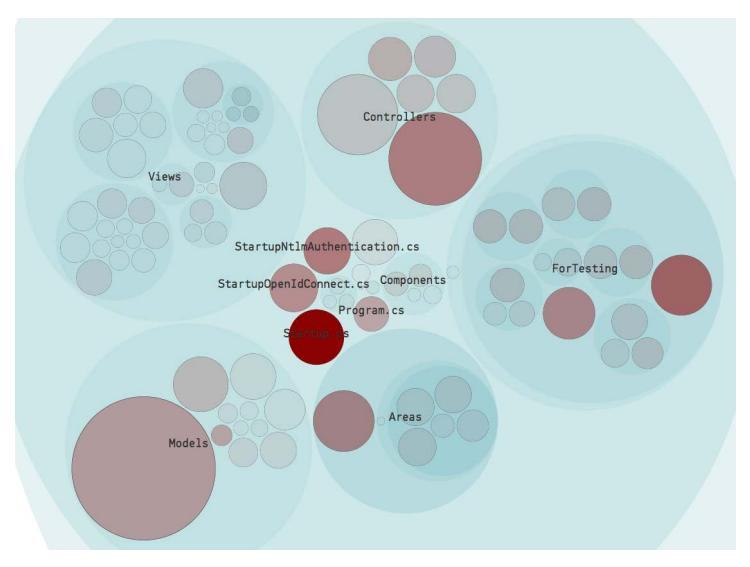

To analyze architectural change patterns we have to map the file names from our raw Git log to logical components, just like we did in the previous two chapters. The following figure recaps that text translation.

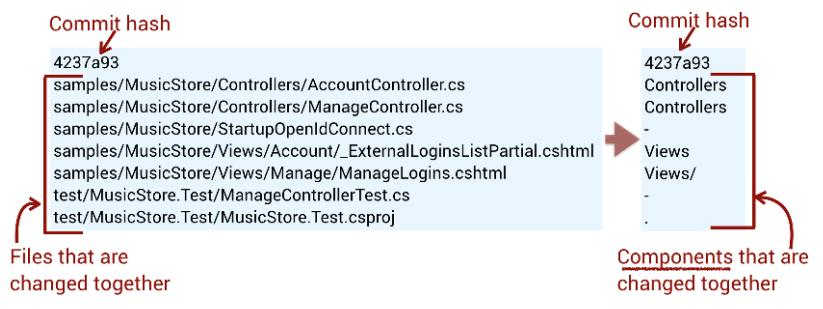

We could map every file in the codebase to a component, but let's keep the example simple and ignore all content except the models, views, and controllers. Here's what the change coupling between these layers in the Music-Store application looks like:

| Layer 1     | Layer 2 | Degree of Coupling | Revisions |
|-------------|---------|--------------------|-----------|
| Controllers | Views   | 29%                | 100       |
| Controllers | Models  | 27%                | 115       |

3. <https://codescene.io/projects/1561/jobs/4894/results/architecture/temporal-coupling>

The change coupling results show that approximately every third commit has to touch multiple layers. This is an expected finding, given the purpose of layers, so let's discuss it in detail and see what it means to us.

### A Separation of Concerns That Concern

The basic premise of any layered architecture is a separation of concerns—for example, that the views don't know anything about the database and the application logic is decoupled from the presentation details. At least, that's the theory. In reality, a layered world tends to be less rosy.

To start with, real implementations tend to use many more layers than the canonical three suggested by an MVC or MVP pattern.4 These additional layers are driven by the complexity—both essential and accidental—of today's applications that require further separation between the different responsibilities of each component. As a consequence, today's layered architectures tend to introduce layers for services, abstract database access in repositories, and, of course, hide all native SQL in object-relational mappers. These additional layers cause our change patterns to extend across more logical components, as illustrated by the following figure.

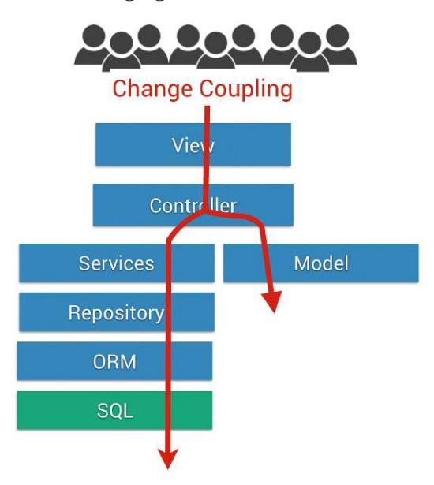

Layers divide our code along a technical axis, while the work we do is feature oriented. Our analysis of MusicStore shows the ramifications with a change coupling of approximately 30 percent between the layers. It's important to

4. <https://en.wikipedia.org/wiki/Model%E2%80%93view%E2%80%93presenter>

note that this number is on the *lower* end compared to many proprietary codebases. In my day job I've analyzed dozens of layered architectures, and in general the degree of coupling goes from 30 percent in stable applications where most changes are bug fixes, to 70 percent in codebases that grow new features. Let's consider the impact.

If the majority of our commits cut through multiple layers, the promised benefit of separation works against us rather than supporting the changes we want to make to the system. We still have a separation of concerns for sure, but perhaps it's the wrong concerns we separate, as few changes are local. This puts us at risk of unexpected feature interactions and conflicting changes, which is a problem that gets worse with the scale of the development organization. With hierarchical layers, it's hard to define clear areas of responsibility for different teams.

#### Optimize for the Ordinary

The abstraction acrobatics of multilayered architectures are often motivated by a possible future need to swap out one specific implementation for another, which may sound attractive at first. As we've seen in this chapter, that flexibility comes at a high cost, and it isn't a balanced trade-off. We optimize for a rare case at the expense of the everyday changes we make to the code. A supportive design is the other way around.

A layered architecture enforces the same change pattern on all end-user features in the codebase. It's a consistent design for sure, but that consistency doesn't serve us well with regard to maintenance. When adding a new feature, no matter how insignificant from a user's perspective, you need to visit every single layer for a predictable tweak to the code, often just passing on data from one level in the hierarchy to the next. It's mundane and time consuming.

All features aren't equal, and most layered codebases would benefit from acknowledging that and get the majority of the code expressed in a simpler and—yes, heresy—*less* structured form. Let's explore some alternatives.

## Monolithic Alternatives: Use Case and Feature-Centric

Before we move on we need to clarify when consistency matters and when it's more of a hindrance. The distinction runs between the macro level of the system where we want consistency through high-level building blocks that carry meaning, and the micro level of individual features where we should be free to vary the design.

A well-known example of this principle is *microservices*, which we'll discuss in our next chapter. However, there's a vast amount of design space between monolithic applications and microservices, and we don't need to go full microservice to rescue a legacy codebase. The popularity of MVC—and its family of related, layered paradigms—means that many of us never get exposed to the alternatives, so let's take the opportunity to explore some other architectural patterns here.

## Package by Components and Features

*Package by component* is a pattern captured by Simon Brown, an author and international speaker, that helps us slice intertwined layers into coarse-grained components.5 The core idea is to make components an architectural building block that combines application logic and data-access logic, if needed. Presentation layers and APIs are then built on top of the components, as shown in the following figure.

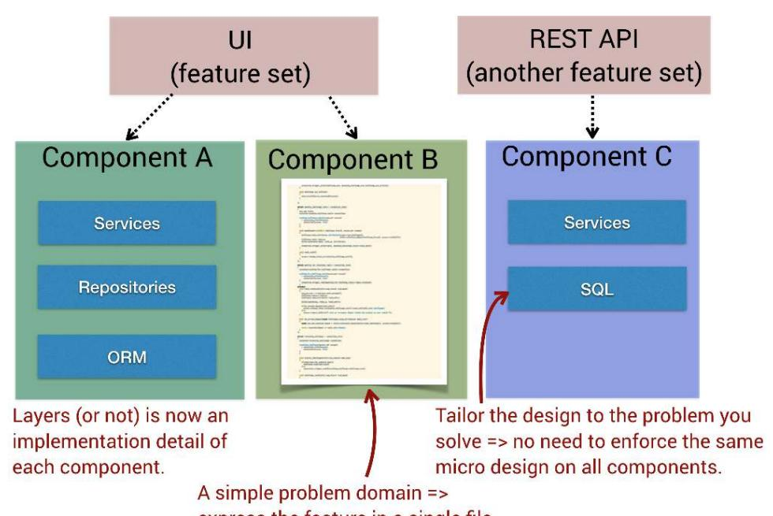

Simon Brown shows how each component can contain its own layers, but the strength of a component-oriented architecture is that you're free to choose. You may find that some features lend themselves to layers. Some may be

5. [http://www.codingthearchitecture.com/2015/03/08/package\\_by\\_component\\_and\\_architecturally\\_aligned\\_test](http://www.codingthearchitecture.com/2015/03/08/package_by_component_and_architecturally_aligned_testing.html)[ing.html](http://www.codingthearchitecture.com/2015/03/08/package_by_component_and_architecturally_aligned_testing.html)

natural to implement using *pipes and filters*, while other features are so simple that they can be coded inside a single file—no need for design excess when it isn't called for. From a social point of view, components also provide natural operational boundaries for our development teams, which sets the stage for an efficient alignment of organization and architecture. Beautiful.

The *package by feature* pattern presents another architectural alternative that enables a high-level consistency without enforcing a specific technical design like traditional layers do.7 Package by feature takes a domain-oriented approach where each user-facing feature becomes a high-level building block, as illustrated in the next figure.

Just like its component-based cousin, the *package by feature* pattern also makes it straightforward to align your architecture and organization. The main difference between the patterns is that the UI becomes part of each feature in package by feature, whereas it's a separate concern in package by component. The trade-off and main distinction from package by component is that it becomes harder to share code between different features. This could be solved by shared libraries, but there's no architecturally evident way of expressing that, and to let one feature access functionality that's built into another feature soon turns the design into a web of complex dependencies.

6. <http://www.enterpriseintegrationpatterns.com/patterns/messaging/PipesAndFilters.html>

7. <http://www.javapractices.com/topic/TopicAction.do?Id=205>

### Use the Deletion Test

A good way to ensure that you can decouple different feature implementations is by trying to delete one. Just create a new branch in Git and remove a critical feature by deleting its code. If the application still builds and runs with a minimum of code tweaks, you can continue to sleep well at night. Chances are your team is going to be able to work independently in at least that part of the application.

These two patterns have different trade-offs, yet they are similar in structure and how they represent feature logic, so let's get some contrasting architectural inspiration by glimpsing at a radically different pattern. The architectural paradigm *data, context, and interaction* (DCI) provides a clear separation between the data/domain model (what the system is) and its features (what the system does). In short, DCI separates your data objects from the feature-specific behaviors, which are expressed in *object roles*, and different use cases express their context by combining specific object roles, as illustrated in the next figure.

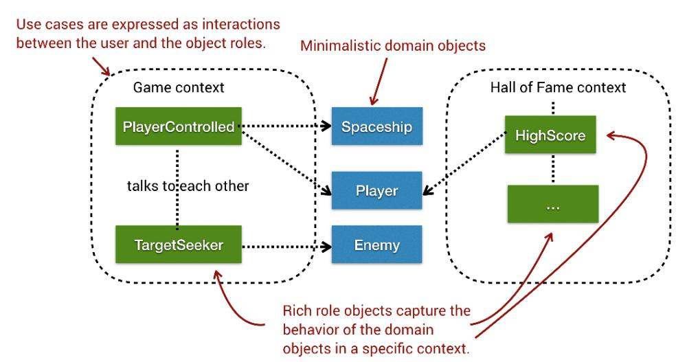

The novelty of the DCI pattern is its context-specific role objects, which give you a place for all those use case–specific details and tricky special cases that otherwise wreak havoc on your data model. Since DCI is a use case–centric pattern it enables independent developable parts with clear operational boundaries. The DCI pattern isn't as well known as the other architectures we've discussed, but it's a paradigm worth studying in more depth as a promising refactoring goal when modularizing legacy monoliths. (*[Lean](021-bibliography.md#page-242-12) [Architecture for Agile Software Development \[CB10\]](#page-242-12)* contains a detailed description of DCI and is a highly recommended read.)

As always, there's no simple choice between these patterns, and they all enable a more modular architecture oriented around the problem domain and suited to multiple teams. This means you need to study and prototype the different alternatives to find the paradigm that fits your situation and constraints.

Package by component is the easiest one to get you started, in particular if you migrate away from a layered architecture. A good starting point is to create a branch of your codebase and try to extract a component from the existing monolith. We rarely prototype refactorings, but since your new architectural style will impact the whole organization, the importance of spending time on rapid prototypes—based on the real code—can hardly be overstated. Let's get some behavioral data to guide us.

## Discover Bounded Contexts Through Change Patterns

So far we've used change coupling to uncover potential problems, but the analysis has a broader use as well. Since a change coupling analysis highlights the change patterns of the developers working on the code, we can use the resulting information to suggest *bounded contexts*.

Bounded context is a pattern from *domain-driven design* (DDD) where multiple context-specific models are preferred over a global, shared data model. (See *[Domain-Driven Design: Tackling Complexity in the Heart of Software \[Eva03\]](#page-242-13)* for an in-depth introduction.) Each such context-specific model—a bounded context—is tailored to express a particular domain concept based on where it is used. The pattern is best appreciated when you've experienced the opposite with a shared model for the whole application. Let's look at an example.

Some years ago I worked on a codebase for the medical domain, and one of the core domain models—Patient—was expressed as a class with tons of getters and setters. Some of these properties were related to the problem domain (for example, name), but many were specific to particular use cases in the application and thus bloated the class for other users. It wasn't obvious why the programmer behind a UI widget for editing patient data should be exposed to the Patient object's network transfer status. (Patient data was regularly transferred to a third-party system through a completely different subsystem.)

Use case–specific details are better expressed as separate bounded contexts, which makes for more cohesive models with lower cognitive overhead because all model properties become relevant to the context you work in, as the [figure](#page-161-0) [on page 152](#page-161-0) illustrates.

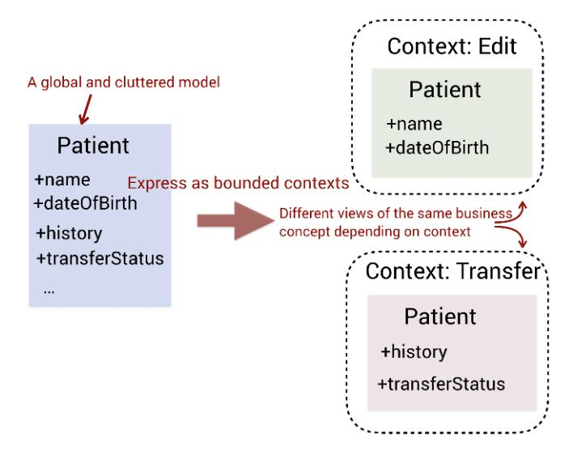

Designing context-specific models requires domain expertise, but you can use general techniques from social code analysis to discover code that's suitable to express as bounded contexts and drive your refactorings based on that information. Let's put change coupling to work to see how.

## Look for Clusters of Cochanging Files

To discover candidates for bounded contexts we run a file-level analysis where we look for clusters of cochanging and hence logically related files. To illustrate the principle we analyze *nopCommerce*, which is a competent e-commerce shopping cart.8

nopCommerce is designed as a layered architecture based on the MVC pattern, with additional layers for services and persistence.9 In our analysis we're interested in more recent change patterns since these are the ones that should drive a hypothetical new modularization. Thus, we start by exploring the change coupling between files changed over the past year, as shown in the [figure on page 153](#page-162-0). (You can view the analysis results online too.10)

The figure shows that the evolution of News and Blog seem to be tied to each other on several levels. When the controllers and services for one of them change, the other follows in more than 80 percent of cases, and it isn't a fluke. It happened 15 to 20 times over a year. That's change coupling.

8. <https://github.com/nopSolutions/nopCommerce>

9. <http://docs.nopcommerce.com/pages/viewpage.action?pageId=1442491>

10. <https://codescene.io/projects/1593/jobs/3920/results/code/temporal-coupling/by-commits>

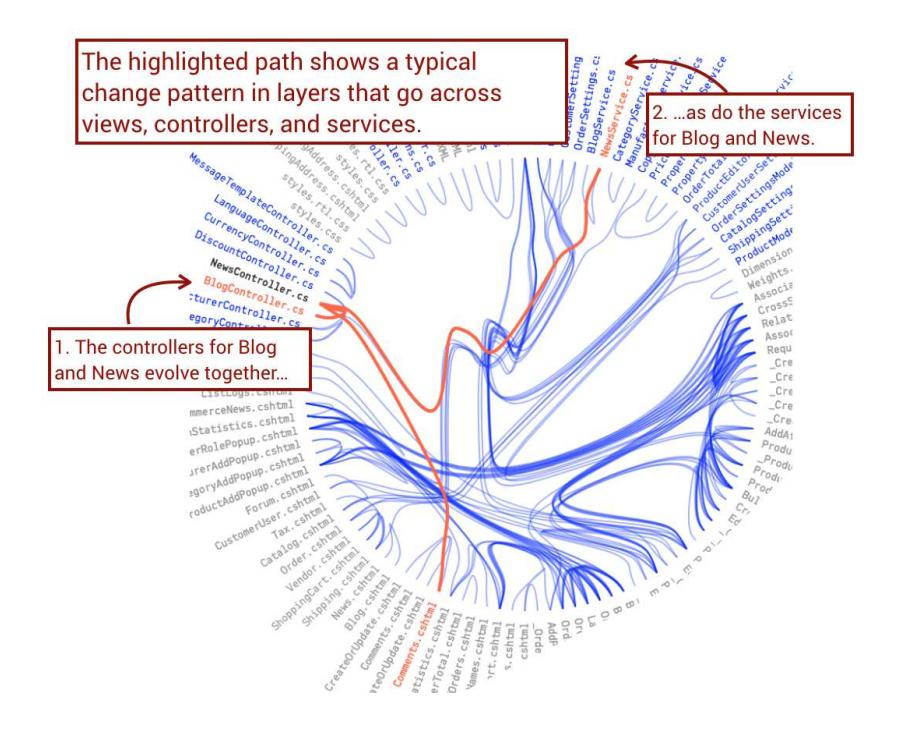

To get more details we look for patterns on the method level, just like we did in *[Minimize Your Investigative Efforts](008-chapter-3-coupling-in-time-a-heuristic-for-the-concept-of-surprise.md#page-54-0)*, on page 40, when we X-rayed a change coupling cluster. Let's look at an example from the change coupling between NewsController.cs and BlogController.cs. As you see in the next figure, there's high code similarity between the methods responsible for Comments, the Edit functionality, and List methods responsible for fetching all stored news and blog entries.11

| <b>⇔</b> Coupled Functions                        | Coupling (%) | Average \$ Revisions | Similarity |
|---------------------------------------------------|--------------|-------------------------|------------|
| BlogController.cs/Comments                        | 31           | 43                      | 92         |
| NewsController.cs/Comments BlogController.cs/Edit |              |                         |            |
| NewsController.cs/Edit                            | 24           | 43                      | 80         |
| BlogController.cs/List                            | 21           | 43                      | 92         |
| NewsController.cs/List                            |              |                         |            |

11. [https://codescene.io/projects/1593/jobs/3920/results/code/temporal-coupling/by-commits/xray-result/details?file](https://codescene.io/projects/1593/jobs/3920/results/code/temporal-coupling/by-commits/xray-result/details?file-name=nopCommerce/src/Presentation/Nop.Web/Administration/Controllers/NewsController.cs)[name=nopCommerce/src/Presentation/Nop.Web/Administration/Controllers/NewsController.cs](https://codescene.io/projects/1593/jobs/3920/results/code/temporal-coupling/by-commits/xray-result/details?file-name=nopCommerce/src/Presentation/Nop.Web/Administration/Controllers/NewsController.cs)

This high degree of change coupling between similar methods—together with the change coupling between the corresponding service implementations—indicates that there may be a concept underlaying News and Blog that the design fails to capture. When you extract layered functionality into features or components, you use this data to drive the design. The following figure shows two possible variations.

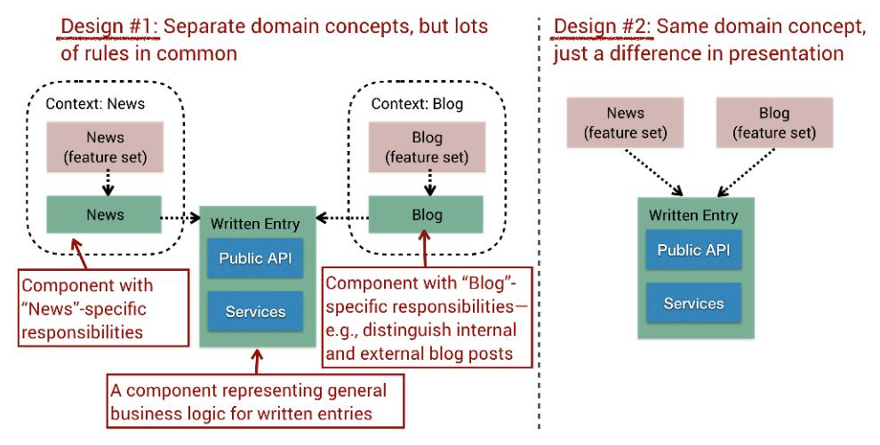

In your own codebase you're likely to be quite familiar with the domain concepts and thus have an easier way of modeling new components to iteratively replace the global layers. For example, it may also be the case that Comments is an orthogonal concept to Blog and News, and should be modeled as a distinct component.

Social code analysis—like any other tool set—won't make the decisions for you, but the techniques help you get on the right track by pointing out opportunities that are otherwise easily missed among large chunks of code spread out across different modules. The techniques are here to complement your expertise, not to replace it. The key is to know your own domain and make sure your architecture reflects it.

Finally, there are social views to consider in our architecture. If we look back at the preceding figure, design alternative #1 may look attractive, as it lets us share code between two features that were previously duplicated. However, as Eric Evans points out in *[Domain-Driven Design: Tackling Complexity in the](021-bibliography.md#page-242-13) [Heart of Software \[Eva03\]](#page-242-13)*, sharing code across bounded contexts is a hazard because different teams may be responsible for the Blog and News features, which may lead to blurred and conflicting changes to the shared context. To counter this we need to take a social perspective on our code and expand on the ideas we touched on in the previous chapters. Let's see how.

### Breaking Up Monoliths: The Sequel

When breaking up a monolith, the database often remains a large monolithic piece —with a gravity that would make the black hole A0620-00 jealous—and all development tasks eventually end up there.a The consequence is that no matter how modular your application code is, your system is still at risk for independent feature interactions due to the database.

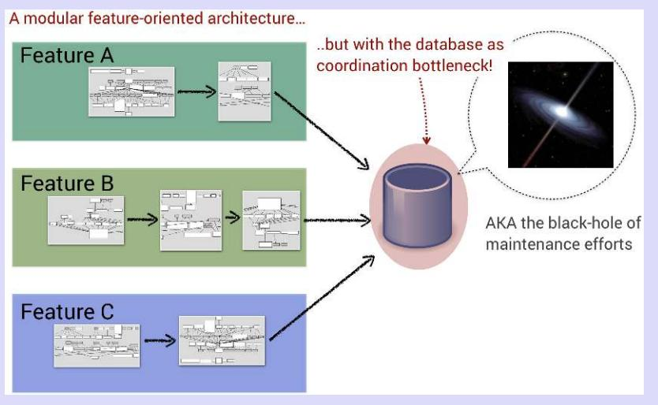

Your database schema has to evolve to a more modular design as well, which means taking transactional contexts into consideration. Database refactorings is a topic worthy of its own book, so check out *[Refactoring Databases: Evolutionary Database](021-bibliography.md#page-241-9) [Design \[AS06\]](#page-241-9)* in case you're in this situation. Note that you can still apply the ideas from this chapter since change coupling is a language-neutral analysis capable of highlighting dependencies between application code and SQL scripts, too.

a. <https://en.wikipedia.org/wiki/A0620-00>

## The Perils of Feature Teams

Last year I visited an organization that was in a situation all too familiar, as their features took much longer to implement than expected. But this wasn't just a case where estimates were used as proxies for management wishes, but a fundamental problem at conflict with the project's goals. This codebase was developed to replace a hard-to-maintain legacy application and the historic data from the development of the previous application served as a baseline for the project plan. The whole raison d'être of this project was to deliver a codebase that was cheaper to maintain, yet after two years of development, all numbers pointed in the opposite direction.

The slow pace of feature growth wasn't due to bad code quality, and the architecture couldn't be blamed either, as it revealed a modular component-based system with sane boundaries and dependencies. Odd. However, once we took a social view of the system a more worrisome architectural view arose. By applying the concept of knowledge maps on the team level—an idea that we touched on in the previous chapter—it became obvious that there weren't any clear operational boundaries between the teams. In the next figure, which shows the team contributions over the past three months, you see that it's hard to spot any patterns in the distribution of each team's work. Sure, some team may be a major contributor to some parts, but in general this does look chaotic.

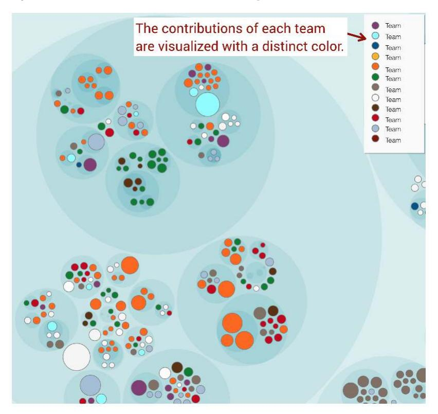

It turned out that the component-based architecture was created by a small team, and the pattern worked well during the initial development and proof of concept. As the project scaled up, management decided to introduce feature teams. Soon the development organization grew to include 12 teams, and in each iteration teams were assigned separate stories.

The consequence was that the organization had 12 different teams that needed to work across all components, and the code kept changing in parallel at a high rate as each team extended the existing components to build different features. Lots of time was spent in meetings and merging different feature branches, which often led to conflicts between both code and teams.

These organizational costs were direct in the sense of excessive coordination needs, but also indirect because they prevented synergies between different features, which in turn meant missed opportunities to simplify the solution domain.

### The Big Win Is in the Problem Domain

A deep understanding of the problem domain gives you a tool to simplify both architecture and code. Make sure you get to spend a day or two with your product's users. Such real-world education provides a different perspective, leads to deeper domain expertise, and builds informal networks between the technology and consumer side. It's invaluable.

The big advantage of team knowledge maps is that they visualize the otherwiseunseen social view of code, and make the problems rather than their symptoms visible to management. Even if you're aware of the problem, it's far from certain that nontechnical stakeholders will share your level of insight, which is why holistic visualizations play a key role in making change happen. A knowledge map in itself won't solve any problems, but it helps you ask the right questions.

We soon explore related situations and discuss the possible remedies, but let's first dive deeper into the analysis to make sure we understand what the data actually shows.

## Build Team Knowledge Maps

Team knowledge maps are based on the amount of code contributed by each team within the analysis period. The reason we choose the number of contributed lines of code rather than a simple count of the number of commits or invoking git blame on each file is because knowledge goes deep. If I write a piece of code today and you choose to rewrite it tomorrow, that doesn't mean I have to start from scratch when working with that code again. Having solved a design problem and fleshed out the code builds knowledge of the problem domain that transcends the current structure of the code. By using the historic lines of contributed code, our metric reflects such knowledge retention.

Git lets us mine the number of added and deleted lines of code for each modified file through its --numstat option. We use the same algorithm as in *[Analyze Operational Team Boundaries](013-chapter-7-beyond-conway-s-law.md#page-139-0)*, on page 129, to map individuals to teams. The only difference is that our input data is more detailed this time around, as shown in the [figure on page 158](#page-167-0).

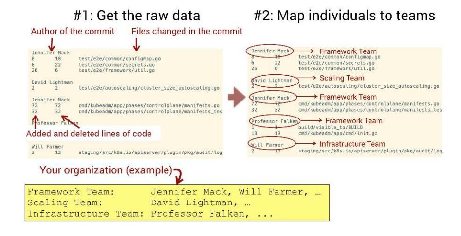

We use this data to operationalize our measure of knowledge by calculating a percentage of code added by each team to every file, as shown in the following table.

| File                | Team           | Code Contributed |
|---------------------|----------------|------------------|
| common/configmap.go | Framework Team | 87%              |
| common/configmap.go | Scaling Team   | 13%              |
| log/backend.go      | Scaling Team   | 100%             |
|                     |                |                  |

This data makes it easy to identify the team that has written most of the code for each file, and thus the team that has the main knowledge owners in that area. The algorithm is straightforward, although the Git data is harder to parse than in our previous analyses, and working implementations are provided in both *Measure Conway's Law*, on page 217, and CodeScene.12

### Joe asks:

## Why Can't I Get the Amount of Modified Code?

At first it looks limiting that Git only provides a count of added and deleted lines. However, if we attempt to calculate modified lines of code we soon find ourselves in a philosophical hole, faced with existential questions like "When is a line of code modified enough to be considered new?" and "What's the difference from a line that's merely modified?" Future research may provide definitive answers, but at the time of writing we need to work with the data we have.

12. <https://codescene.io/docs/guides/social/knowledge-distribution.html#explore-your-team-knowledge-maps>

Finally, you may have noted that we ignored the amount of deleted code in our calculation. The number of lines deleted does not effectively reflect a team's measure of knowledge, but the data could be used to show refactoring progress. For example, I recently worked with an organization that invested in cleaning up a legacy codebase that started to get out of hand, and we used a variation on the previous technique to highlight areas of code removal. Visualizing code deletion as progress could do much good for our industry.

## Not All Teams Are Equal

Let's return to the perils of misaligned team boundaries now that we know how knowledge maps are built. The previous case study with an ill-advised feature-team adaptation is similar to the problems faced in the MVC-based project scaled from five to fifteen developers that we discussed in *[Dodge the](#page-150-1) Silver Bullet*[, on page 141](#page-150-1). The architectural context is different, though, because a component- or feature-oriented architecture has natural team boundaries. But even in a feature-oriented context there's a cut-off point where the codebase can't afford more people working on it, as there will always be dependencies between different features, and more fine-grained components only accentuate that. As feature implementations start to ripple across team boundaries, your lead times increase one synchronization meeting after the other.

There's also a related organizational fallacy that I've come across in several companies, which is to have a separate maintenance team. The dangers with this approach are as follows:

- • *Motivation loss*: As we saw in *[Social Groups: The Flip Side to Conway](013-chapter-7-beyond-conway-s-law.md#page-144-0)'s Law*[, on page 134,](013-chapter-7-beyond-conway-s-law.md#page-144-0) low motivation is a common cause of process loss, and being stuck fixing bugs in a previous release is less fun than driving the future of the codebase.
- • *Low in-group cohesion*: In an effective team, the members share a goal and work on related tasks, which are aspects that aren't achievable with a separate maintenance team, as their work is reactive and thus spread across unrelated bug fixes.
- • *Broken feedback loops*: Each bug represents a learning opportunity for the implementing team, and if we never look back on our trail of defects but instead rush ahead feature by feature and leave the bugs to our peers on another team, we put ourselves outside this valuable feedback loop.
- *Blurred lines*: Code doesn't really care *why* it's changed, and in Part I we saw that there isn't a strong distinction between new features and what we traditionally call maintenance. Both are about making improvements

to existing code, which means we run the risk of expensive coordination needs as the teams are likely to intersect in the codebase. In addition, this way of working is an invitation to diffusion of responsibility, as discussed in the previous chapter.

Most organizations notice the symptoms of those problems, and a common response is to implement a *gatekeeper mechanism* where all code has to be reviewed by a designated person, often called an architect. This approach adds an extra level of protection against destructive code changes and may even catch a bug or two, yet the traditional gatekeeper pattern comes with a number of drawbacks.

First of all, this pattern is reminiscent of the speedup in parallel computing captured in *Amdahl's law*, where the theoretical speedup is limited by the serial part of the program, as shown in the following figure.13 In our case the gatekeeper acts as the serial part, which means your gatekeeping architect becomes a global lock that limits the throughput of the organization.

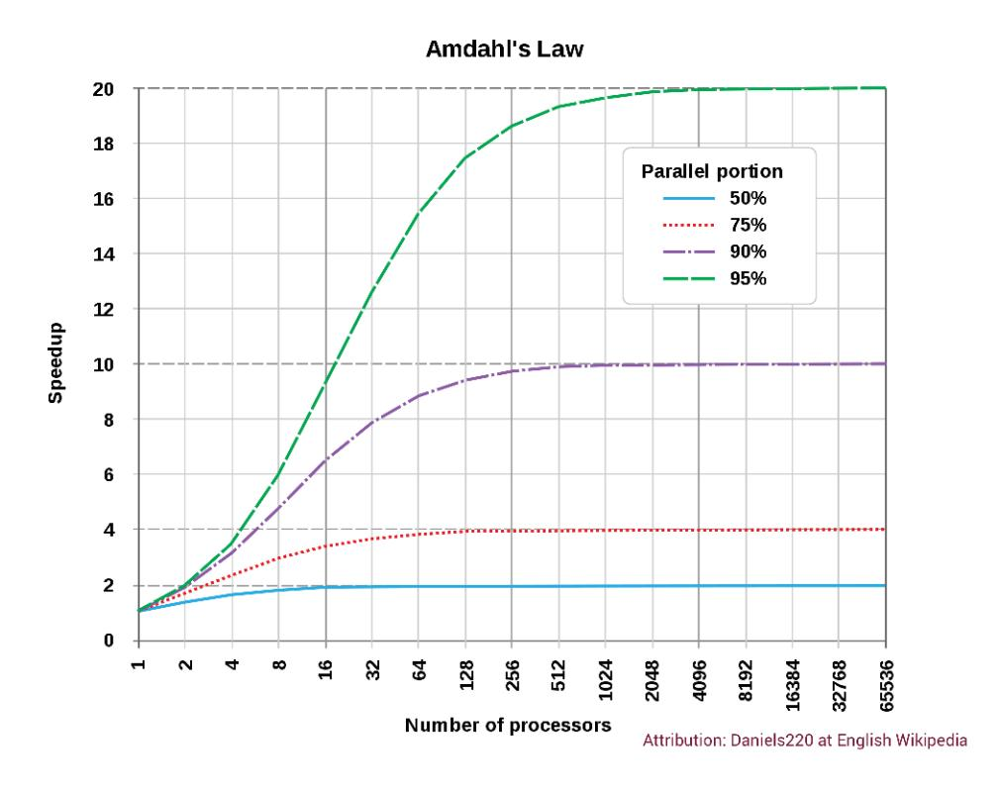

13. [https://en.wikipedia.org/wiki/Amdahl%27s\\_law](https://en.wikipedia.org/wiki/Amdahl%27s_law)

An even more serious problem is that as your organization grows, codereviewer fatigue becomes real, as there are just so many lines of code you can review each day. Beyond that point you're likely to slip, which results in increased lead times, bugs that pass undetected to production, and—in extreme cases—the risk of burnout.

A much better approach is to let each team act as gatekeeper of its own code, which is an idea we discussed in *[Code Ownership Means Responsibility](013-chapter-7-beyond-conway-s-law.md#page-136-0)*, on [page 126](013-chapter-7-beyond-conway-s-law.md#page-136-0). Your teams will never become cross-functional if they depend on someone else to approve their code. This approach has the advantage that it doesn't rely on an individual, and if you combine it with a rotating scheme where your peers on other teams join in for a review, you limit the risk of sliding quality goals across teams.

## Clean and Dirty Architectures

A specific architectural style isn't bad per se. Layers, DCI, and package by component all have their pros and cons. An architecture is good when it supports the changes we want to make to the system and, as we've seen, both the type of changes and the organization responsible for implementing them are likely to shift over time. This means that your architecture has to evolve and respond to changing circumstances, which inevitably means reworking the existing building blocks.

In this chapter we discussed the perils of a system rewrite and its consequences. From there we picked up the loose ends from [Chapter 7,](012-chapter-6-spot-your-system-s-tipping-point-is-software-too-hard-divide-and-conquer-with-architectural-hotspots-analyze-subsystems-fight-the-normalization-of-deviance-toward-team-oriented-measures-exercises.md#page-127-0) *Beyond Conway's Law*[, on page 117](012-chapter-6-spot-your-system-s-tipping-point-is-software-too-hard-divide-and-conquer-with-architectural-hotspots-analyze-subsystems-fight-the-normalization-of-deviance-toward-team-oriented-measures-exercises.md#page-127-0), as we dissected layered architectures. As we saw, a layered architecture will always exhibit a conflict between the technical way the code is structured and the feature-oriented, end user–centric way the system evolves. As a consequence, neither feature nor component teams align well with layers. We also learned about alternative architectural patterns, how they contrast with layers, and how they fill an important role as largescale refactoring goals to counter the siren song of a system rewrite.

Our primary analysis technique for architectures is change coupling. That's because when we work with a particular system for an extended period of time, we learn what works and what doesn't. With change coupling we tap into that learned behavior to highlight patterns that ripple across architectural boundaries. In this chapter we used that information as a guide to select candidates for high-level refactorings and tie the analysis results to the concept of bounded contexts. Although we demonstrated the idea on a layered architecture, the technique is more general and you can use it anytime you detect the need for better modular boundaries.

We have also ventured deeper into the social aspects of code, and learned that code ownership and team boundaries need visibility to drive our designs. The knowledge maps we introduced are built on rolling contributions to the actual code and are always up to date, which is in stark contrast to that Excel sheet on the Intranet that was last updated just before the ISO revision two years ago.

So far we've limited ourselves to code that's located within a single repository. Over the past decade many organizations have started to separate their subsystems into multiple Git repositories. This trend is partly driven by better version-control tools that make it practical, but also by the extended hype and drive toward microservices. In our next chapter we take such multirepository microservice codebases head-on. Follow along as we continue to combine technical and social analyses to uncover information we can't get from code alone.

## Exercises

Doing high-level refactorings will never become easy, and like any other skill, we need to practice it. The following exercises give you an opportunity to experiment with the techniques on your own. You also get a chance to investigate a component-oriented architecture, which makes an interesting contrast to the change patterns we saw in layered codebases.

## Detect Components Across Layers

• Repository: nopCommerce14

• Language: C#

• Domain: nopCommerce is an e-commerce shopping cart.

• Analysis snapshot: [https://codescene.io/projects/1593/jobs/3920/results/code/temporal](https://codescene.io/projects/1593/jobs/3920/results/code/temporal-coupling/by-commits)[coupling/by-commits](https://codescene.io/projects/1593/jobs/3920/results/code/temporal-coupling/by-commits)

In this chapter we detected that News and Blog evolved together and thus may have a shared concept in common. Investigate the change coupling in nop-Commerce and see if you can detect other examples on coevolving files that could serve as the basis for extracting them into a component.

Remember that you can get more information by comparing the implementations or taking the shortcut of running an X-Ray analysis. The answers in *[Solutions: Modular Monoliths](020-appendix-a4-hints-and-solutions-to-the-exercises.md#page-236-0)*, on page 230, provide one example, but there are other refactoring candidates too.

14. <https://github.com/nopSolutions/nopCommerce>

### Investigate Change Patterns in Component-Based Codebases

• Repository: PhpSpreadsheet15

• Language: PHP

- Domain: PhpSpreadsheet is a PHP library used to read and write spreadsheet files such as Excel.
- Analysis snapshot: [https://codescene.io/projects/1579/jobs/3839/results/code/temporal](https://codescene.io/projects/1579/jobs/3839/results/code/temporal-coupling/by-commits)[coupling/by-commits](https://codescene.io/projects/1579/jobs/3839/results/code/temporal-coupling/by-commits)

A component-based architecture needs to avoid tight coupling between different components because such dependencies would counter the potential benefits of the pattern. From this perspective PhpSpreadsheet serves as an interesting example, with most of its change coupling between files in the same package. Now look at the change coupling analysis linked above and try to detect a relationship that violates the dependency principle of independent components.

15. <https://github.com/PHPOffice/PhpSpreadsheet>

➤ Mark Twain

CHAPTER 9
