<span id="page-173-0"></span>
# Chapter 9: Systems of Systems: Analyzing Multiple Repositories and Microservices

<span id="page-173-3"></span>The scale of today's systems has led many organizations to adapt microservicelike architectures. This implies that tomorrow's legacy codebases are going to be microservices and we should be prepared to address technical debt in a development context more complex than systems of the past.

From a 10,000-foot view there's nothing special to microservices with respect to the analysis techniques we have covered so far. In practice, however, microservices present their own set of challenges that exaggerate potential quality issues that we could have lived with in a monolithic system. Some of these issues are technical while others are social and cultural. In this chapter we start by adapting hotspots to a microservice context. From there we explore implicit dependencies between microservices by detecting change patterns across repository boundaries, and we wrap it all up by learning to measure technical sprawl in a polyglot codebase.

<span id="page-173-2"></span><span id="page-173-1"></span>The techniques you learn in this chapter aren't limited to microservices, and they serve you well on any codebase split across multiple Git repositories.

## Analyze Code in Multiple Repositories

The core idea behind microservices is to structure your system as a set of loosely coupled services, which—ideally—are independently deployable and execute in their own environment. Different services exchange information via a set of well-defined protocols, and the communication mechanism can be both synchronous, as in a blocking request-response, or asynchronous.

So far, this all sounds like a fairly technical view, but microservices also promise an architectural style that supports autonomous teams that can work independently on different services. Of course, such team independence isn't really a property of microservices themselves, but rather a result of any well-designed system oriented around use cases rather than technology.

<span id="page-174-3"></span>This means that microservices—just like the monolithic patterns we discussed in the previous chapter—have to center around features and business capabilities. Any time you note systems where the services represent technical responsibilities like "persistence" or "validation," consider it a warning sign; Such systems won't deliver on the promised benefits of microservices but rather represent a distributed equivalent to hierarchical layers.

<span id="page-174-2"></span>

### Joe asks:

## How Big Should a Microservice Be?

This is a heated question where flame wars have been fought and friendships have been ended, but it's also slightly misguided to reason about service size in terms of lines of code. Instead you want to focus on business capabilities. Each service should represent a single business capability—cohesion is key.

<span id="page-174-1"></span>
## Detect Services with Low Cohesion

Microservices is a high-discipline architecture because as developers, there's a direct cost to introducing new design elements, and that cost grows as we climb the abstraction ladder. Creating a new function is quick, and we do that all the time. But extracting behavior into a new class or module is more rare, and introducing a new service as a response to a particular requirement is an even larger mental hurdle; it's so much easier and faster *in the short term* to just squeeze new behavior into an existing service and avoid the pains of tweaking the deployment pipeline, creating new test suites, and writing those API documents. This is the highway to legacy code.

<span id="page-174-0"></span>A hotspot analysis serves as a useful heuristic to identify such low-cohesion services. Our architecturally significant building blocks are the services themselves, so we consider each service implementation a logical component and run the first hotspot analysis on that level as illustrated in the [figure on](#page-175-0) [page 167](#page-175-0).

There are two strategies for defining the logical components in the analysis, and your choice depends on how the services are organized:

<span id="page-175-0"></span>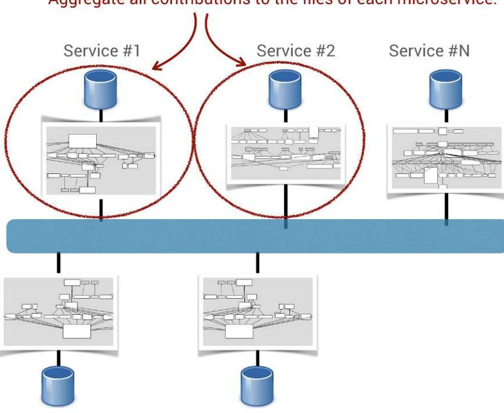

- 1. *All services are in a single Git repository*: If your organization keeps its services in a single repository, you use the aggregation patterns from *[A](012-chapter-6-spot-your-system-s-tipping-point-is-software-too-hard-divide-and-conquer-with-architectural-hotspots-analyze-subsystems-fight-the-normalization-of-deviance-toward-team-oriented-measures-exercises.md#page-108-1) [Language for Specifying Architectural Boundaries](012-chapter-6-spot-your-system-s-tipping-point-is-software-too-hard-divide-and-conquer-with-architectural-hotspots-analyze-subsystems-fight-the-normalization-of-deviance-toward-team-oriented-measures-exercises.md#page-108-1)*, on page 97.
- <span id="page-175-3"></span><span id="page-175-1"></span>2. *The services are in separate Git repositories*: This strategy is the most common case, and the analysis is straightforward. We just need to aggregate the contributions per repository without the need to specify any aggregation patterns.

<span id="page-175-2"></span>In the latter case, you can use the git rev-list command as shorthand to aggregate all contributions:

**adam\$ git rev-list --count HEAD** 1922

The rev-list option lists all reachable commits and we instruct it to simply --count the total number, which amounts to 1922 commits in this example. We can also complement the data with a size dimension—for example, by using cloc as described in *A Brief Introduction to cloc*, on page 223—and iterate through each repository in the codebase to accumulate the results. Armed with that data, we're ready to reason about hotspots on the microservice level, as shown in the [table on page 168](#page-176-0).

<span id="page-176-0"></span>

| Microservice    | Change Frequency | Lines of Code |
|-----------------|------------------|---------------|
| Recommendations | 271              | 5,114         |
| Diagnostics     | 269              | 3,440         |
| Export          | 168              | 4,355         |
|                 |                  |               |

<span id="page-176-1"></span>This hotspot analysis shows data from the evolution of a closed-source system, and we see that the top hotspot is the Recommendations service, with 5,000 lines of code. That's quite a lot for something advertised as "micro," so let's get some more information by generating an aggregated complexity trend for the service, just as we did in *[Fight the Normalization of Deviance](012-chapter-6-spot-your-system-s-tipping-point-is-software-too-hard-divide-and-conquer-with-architectural-hotspots-analyze-subsystems-fight-the-normalization-of-deviance-toward-team-oriented-measures-exercises.md#page-118-0)*, on page 107. The following figure shows the evolution of complexity in the Recommendations service.

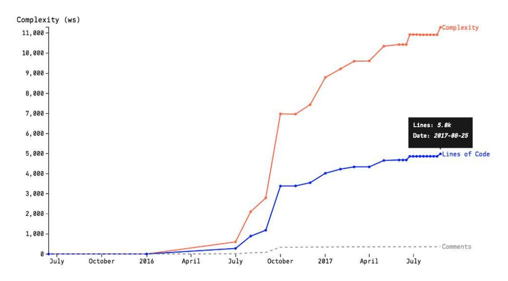

<span id="page-176-2"></span>The complexity trend shows that the Recommendations service grew rapidly during the initial development in the second half of 2016, and it continues to grow in both complexity and lines of code.

This information helps us ask the right questions: does this service consisting of 5,000 lines of code with frequent changes really implement a single business capability or would it be better off when split into two or more distinct services? Remember, code changes for a reason, and a likely explanation for a high change rate is that the service attracts many commits because it has many reasons to do so—it has too many responsibilities.

### Watch Out for Behavioral Magnets

<span id="page-177-0"></span>A microservice system faces the question of how clients access the myriad services, and one answer is to introduce an *API gateway* that serves as a single entry point and routes calls to different services.<sup>a</sup>

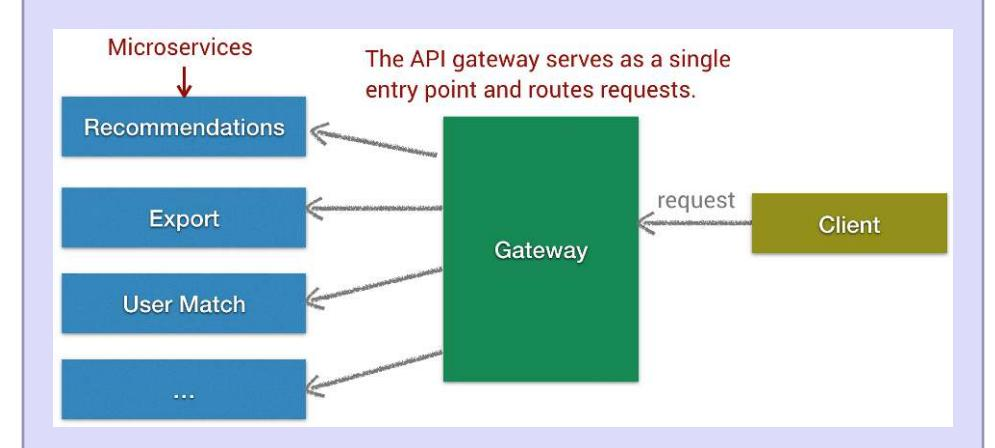

This works well as long as we avoid the temptation to stuff common behavior into the API gateway, which would soon turn it into a coordination bottleneck and single point of failure. So don't—it transforms your microservice architecture into a set of satellites gravitating around a new monolith.

a. <http://microservices.io/patterns/apigateway.html>

<span id="page-177-1"></span>
## React to Your Findings

There are several ways to react when you find an architectural hotspot. First, run a hotspot analysis on the file level because services with low cohesion often reveal complex implementations due to the intricate interplay between the different responsibilities. Use the file-level hotspots for exploring opportunities to refactor the service implementation just as we did in [Chapter 2,](007-chapter-2-identify-code-with-high-interest-rates.md#page-29-0) *[Identify Code with High Interest Rates](007-chapter-2-identify-code-with-high-interest-rates.md#page-29-0)*, on page 15. Not only will your service become easier to understand, but the refactoring steps themselves will help you build knowledge and detect concepts that should be separated into different services. (See *[Reflective Practitioner: How Professionals Think in Action](021-bibliography.md#page-244-12) [\[Sch83\]](#page-244-12)* for a deep discussion of how insights gained through experience help us make better decisions.)

<span id="page-178-2"></span>Splitting a microservice into multiple services is similar to the monolithic case studies we discussed in the previous chapter. However, refactoring a service means we operate on a smaller slice of the codebase and it's typically easier to extract a new microservice from an existing one than it is to separate a monolith. Use the same change coupling techniques to identify bounded contexts, only this time the analyses drive the extraction of services rather than components.

Hotspots and change coupling analyses are all about gaining insights and collecting additional information to complement your existing knowledge about the system. Refactoring microservices—like software design in general—is, to a large extent, an intuitive and nondeterministic process. The analysis techniques let you remove a degree of uncertainty from that process by ensuring that your expertise is focused on where it's needed the most.

<span id="page-178-1"></span>
<span id="page-178-0"></span>
## Compare Hotspots Across Repositories

Microservices take the idea of team autonomy to an extreme, which indeed limits coordination bottlenecks in the code itself. However, as Susan Fowler points out in *[Production-Ready Microservices: Building Standardized Systems](021-bibliography.md#page-242-14) [Across an Engineering Organization \[Fow16\]](#page-242-14)*, a microservice never exists in isolation and it interacts with services developed by other teams. Those are conflicting forces.

<span id="page-178-4"></span>These forces put us at risk for incompatible changes and misunderstandings in the protocols between services, yet those are technical challenges that we can address by letting each team specify a regression suite for the microservices they consume. A much more challenging task is in the social field, where a microservice-oriented organization gets sensitive to interteam conflicts, which means you need to work actively with the techniques discussed in *[Social Groups: The Flip Side to Conway](013-chapter-7-beyond-conway-s-law.md#page-144-0)'s Law*, on page 134.

<span id="page-178-5"></span><span id="page-178-3"></span>One such idea is to let people join in on code reviews of the teams whose microservices they consume. In practice it's quite challenging to switch context to another microservice, particularly with the added pressure of expecting to understand someone else's design well enough to deliver feedback. One technique that works well as a quick onboarding is a file-level hotspot analysis, so let's see how to pull that off over multiple repositories.

To analyze files in different repositories we have to provide some additional context, both as a mechanism for ordering the results and to differentiate between files with identical names (think README.md or Makefile). You introduce this context by prefixing each file with a *virtual root* based on the name of the file's Git repository, as shown in the [figure on page 171.](#page-179-0)

<span id="page-179-0"></span>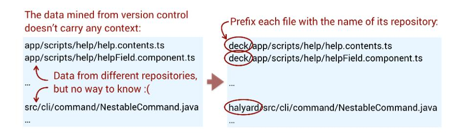

<span id="page-179-2"></span>I'll demonstrate the technique on *Spinnaker*, which is a cloud-based continuous-delivery platform built as a set of microservices organized in 10 separate Git repositories.<sup>1</sup>

<span id="page-179-1"></span>You generate your hotspots just like you did in *[A Proxy for Interest Rate](007-chapter-2-identify-code-with-high-interest-rates.md#page-31-1)*, on [page 17](007-chapter-2-identify-code-with-high-interest-rates.md#page-31-1), and postprocess the results in a scripting language of your choice to prefix each file with its repository name. As an alternative, you embrace your inner command-line fu and glue it together with the sed command in a Git Bash shell.<sup>2</sup> Here's an example from the deck repository, which contains Spinnaker's UI code:<sup>3</sup>

```
adam$ git log --format=format: --name-only \
     | egrep -v '^$' \
     | sed -e 's/^/deck\//' \
     | sort | uniq -c | sort -r
1182 deck/gradle.properties
 238 deck/app/scripts/app.js
 209 deck/package.json
 148 deck/app/styles/main.less
 143 deck/app/scripts/modules/core/help/helpContents.js
 100 deck/app/index.html
...
```

After that you just keep generating one dataset for each repository in your codebase and concatenate the results. Let's have a look at the hotspots in Spinnaker that you see in the top [figure on page 172](#page-180-0), and you can also interact with the visualization through the online gallery.<sup>4</sup>

The top hotspot map does look cluttered, so a simple improvement is to filter away small files and those with low change frequencies from the results before visualizing them. The next [figure on page 172](#page-180-1) shows the same example on Spinnaker, but this time with filtered data.

<sup>1.</sup> <https://www.spinnaker.io/reference/architecture/>

<sup>2.</sup> <https://www.gnu.org/software/sed/manual/sed.html>

<sup>3.</sup> <https://github.com/spinnaker/deck>

<sup>4.</sup> <https://codescene.io/projects/1650/jobs/4074/results/code/hotspots/system-map>

<span id="page-180-0"></span>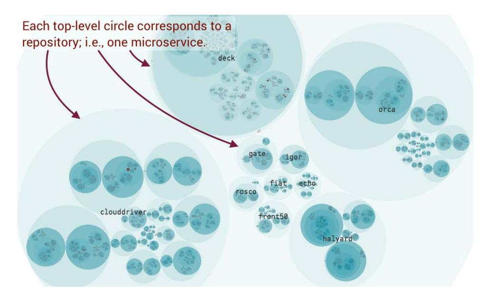

<span id="page-180-1"></span>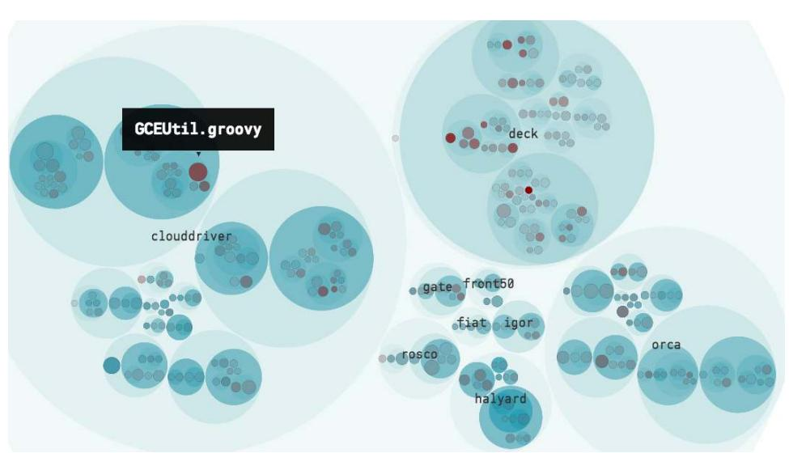

<span id="page-180-2"></span>You use these file-level hotspots to guide code explorations of unfamiliar services, as the map helps you put code snippets into context, as shown in the [figure on page 173.](#page-181-1)

Hotspots cast light on development silos and help make code reviews a collaborative activity by lowering the barrier to entry for members of other teams. Make it a strategic advantage.

<span id="page-181-1"></span>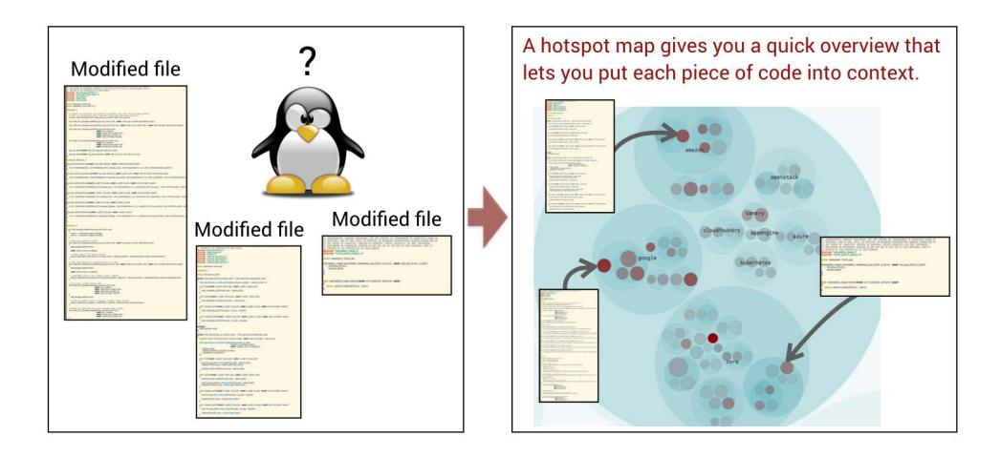

<span id="page-181-3"></span>
### Communicate Across the Organization

The whole-system hotspot view also serves as an entry point to reason about the relative quality of different services. Hotspot data cannot give you a simple quality score—and it's doubtful if any automated metric could—but they let you detect modules that stand out. For example, in the preceding Spinnaker visualization, the hotspot GCEUtil.groovy is twice the size of the second-largest hotspot, and the generic name is a warning for low cohesion. as we discussed in *[Signal Incompleteness with Names](009-chapter-4-pay-off-your-technical-debt.md#page-76-0)*, on page 62.

<span id="page-181-4"></span>The technique is also useful to bridge the gap between the technical side of the organization and the business side; nontechnical managers struggle with traditional tech vocabulary, and hotspots turn our abstract world of code into a graspable concept.

<span id="page-181-0"></span>As an example, let's say you've identified a number of services with low cohesion. The impact is hard to explain in nontechnical terms, but showing a visualization where one microservice is 10 times the size of the others is an intuitive and powerful demonstration. So the next time you find yourself in a discussion with a manager, bring up a hotspot map and benefit from the increased understanding that happens when you let them share a part of your world.

<span id="page-181-2"></span>
## Track Change Patterns in Distributed Systems

If low cohesion is problematic, strong coupling is the cardinal sin that grinds microservice development to a halt. I experienced this the first time back in my days as a consultant working on a trading application. On my first day I got assigned what looked like a simple task, so I eagerly jumped into Emacs

and started to write some code. Pretty soon I noticed that I lacked some data that were available in an adjacent subsystem, so I walked over to its team lead and asked for an extension to the API. "Sure," she said, "that's a simple tweak that we could do right away." So I went back to my desk and waited. And waited. It turned out that the "simple tweak" took a week, and over the next months I learned that this was the norm: no API change was ever quick.

<span id="page-182-1"></span>However, the long lead times weren't due to slow development or a complex process, but rather were a consequence of the way the system and organization were structured. When one team did its "simple tweak" it had to request a change to another API owned by a different team. And that other team had to go to yet another team, that in turn had to convince the database administrators, which ostensibly is the place where change requests go to die. This meant that a simple code change rippled across organizational boundaries, as shown in the next figure.

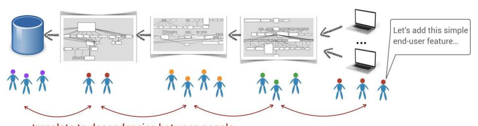

This wasn't a microservice architecture, but the same problem occurs any time we couple code that's under active development by different teams. The cost of future coordination is incurred. So let's look at the algorithm to uncover such change coupling across repositories.

<span id="page-182-0"></span>
### Turn the Process on Distributed Monoliths

Ideally we would respond with a better-suited architecture or adapt the organization, but sometimes drastic measures aren't feasible. One workaround that patches the glitch is to turn the process on its head. Instead of having a user-facing subsystem initiate change requests from the next subsystem, put together a cross-organizational group with one representative from each team, including database expertise. Let the group meet as needed to discuss each new requirement, and once the group has a shared understanding, the database people initiate change. As soon as the database is prepared, the database people inform the group, who could then put their teams to work on the application changes in parallel. It's still expensive, but gives visibility to the problem and cuts the lead times in the process.

#### Use Logical Change Sets to Group Commits

<span id="page-183-1"></span>So far we've limited change coupling to code referenced by the same commits. This won't work when code changes are made by different people contributing to the same feature, as their work will be done in distinct commits and Git won't be able to relate them to each other.

This means we need a higher-order concept, which we get by introducing *logical change sets*. A logical change set is a way to group different commits together. There are two ways of identifying logical change sets, and which one you choose depends on the data you have available:

- <span id="page-183-3"></span>• *Proximity in time and organization*: If the same modules are changed over and over again within a specific time window of, let's say, a day by the same developer or team, chances are that there's a logical dependency between those parts.
- <span id="page-183-5"></span>• *Task or ticket identifiers*: Many organizations add a task or ticket reference to their commit messages, as shown in the next figure, and those references let us group multiple commits into a logical change set.

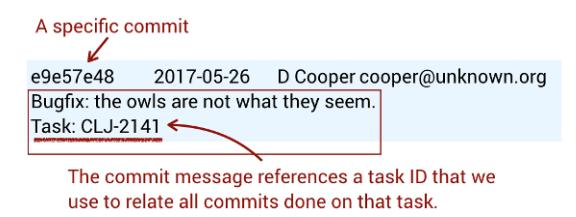

<span id="page-183-0"></span>The ideal approach is to use ticket IDs since that minimizes the risk of false positives, and referencing a ticket in your commit messages has the additional benefit of providing traceability that lets you know *why* a specific change was made.<sup>5</sup> We'll look at a case study later in this chapter, but let's first cover the heuristic of time and organizational proximity with an example from Spinnaker.

<span id="page-183-2"></span>
## Detect Implicit Dependencies Between Microservices

<span id="page-183-4"></span>Just as we did for hotspots, we prefix each file in our version-control data with a virtual root and combine the raw data from all repositories in a single data set. In the simplest case we consider different commits part of the same logical change set if they are authored by the same person on the same day, and that algorithm is typically implemented using a sliding window.

In a large system this gives us lots of change coupling, so we need to prioritize the results. The concept of surprise works well here too, so let's focus on the

<sup>5.</sup> <http://www.yegor256.com/2015/06/08/deadly-sins-software-project.html#untraceable-changes>

coupling that crosses service boundaries as such dependencies are contrary to the philosophy of autonomous microservices.

<span id="page-184-1"></span>Here's the neat thing: by introducing a virtual root that specifies the name of each file's repository, it becomes straightforward to iterate through the data and keep the pairs of coupled files with different virtual roots. The next figure shows an example on such an analysis on Spinnaker, and you can follow along online too. <sup>6</sup>

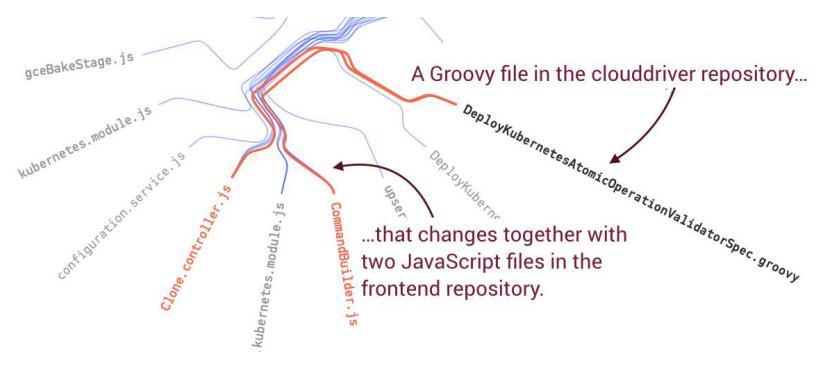

The preceding graph highlights a logical dependency between code for the user interface and the back-end service implementing the logic. Note that the information we uncover isn't visible in the code itself, as the coupled files are implemented in different languages and separated by HTTP, so there's no easy way to statically deduce the coupling, but behavioral code analysis does the trick. Magic!

<span id="page-184-0"></span>
### Balance Monolithic Uls

The specific pattern of an implicit dependency between front-end and backend code is common in microservice architectures. While we take great care to separate different responsibilities into distinct services, there's still—in most cases—a single UI visible to the end user where all our distributed wonders need to present themselves as a cohesive whole. A single UI is basically a technical partitioning that cuts across all business capabilities, which is at odds with team autonomy; the UI becomes the new monolith.

There are two primary ways to reduce the conflict:

• *Composite UI*: A modern user experience often requires interactions with several back-end services, and a *composite UI* acknowledges that by letting the microservices themselves compose the UI. <sup>7</sup> There are several variations

<sup>6.</sup> https://codescene.io/projects/1650/jobs/4074/results/code/temporal-coupling/between-repos

<sup>7.</sup> https://jimmybogard.com/composite-uis-for-microservices-a-primer/

- <span id="page-185-3"></span>on the pattern, but a common approach is to let the client code specify templates that are then populated by view models from the services.<sup>8</sup>
- <span id="page-185-0"></span>• *Back end for front end*: The *back end for front end* (BFF) pattern maintains a set of smaller monolithic UIs, but introduces a back-end service dedicated to each separate user experience, like one for mobile and one for web.<sup>9</sup> The BFF pattern has the nice side effect of providing a natural API layer for black-box tests of each microservice from a user perspective.

<span id="page-185-2"></span>That said, there is a third alternative that's useful in contexts other than microservices, too. The CodeScene tool is always tested on its own code—it's only fair—and a while ago we noted a new change coupling between modules located in different repositories, as shown in the next figure.

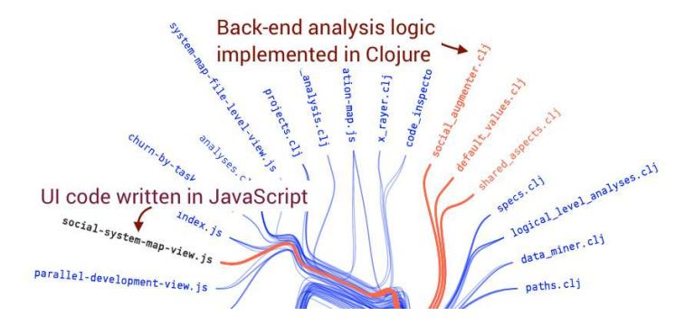

At first this was surprising since there's architectural distance between the two sides of the coupling, as shown in the following figure.

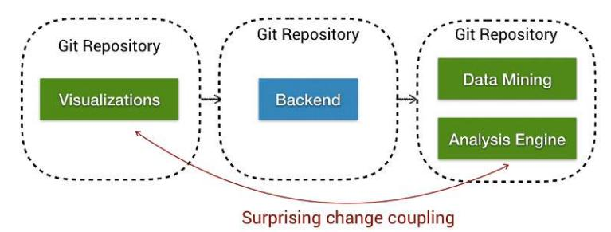

<span id="page-185-1"></span>To get some more information the team ran an X-Ray analysis on the cluster of cochanging files. Since the files of interest are in different repositories we need to group the files into logical change sets by their ticket references and

<sup>8.</sup> [https://docs.microsoft.com/en-us/dotnet/standard/microservices-architecture/architect-microservice-container](https://docs.microsoft.com/en-us/dotnet/standard/microservices-architecture/architect-microservice-container-applications/microservice-based-composite-ui-shape-layout)[applications/microservice-based-composite-ui-shape-layout](https://docs.microsoft.com/en-us/dotnet/standard/microservices-architecture/architect-microservice-container-applications/microservice-based-composite-ui-shape-layout)

<sup>9.</sup> [http://philcalcado.com/2015/09/18/the\\_back\\_end\\_for\\_front\\_end\\_pattern\\_bff.html](http://philcalcado.com/2015/09/18/the_back_end_for_front_end_pattern_bff.html)

then look for cochanging functions within those change sets, resulting in a coupling graph like the one in the next figure.

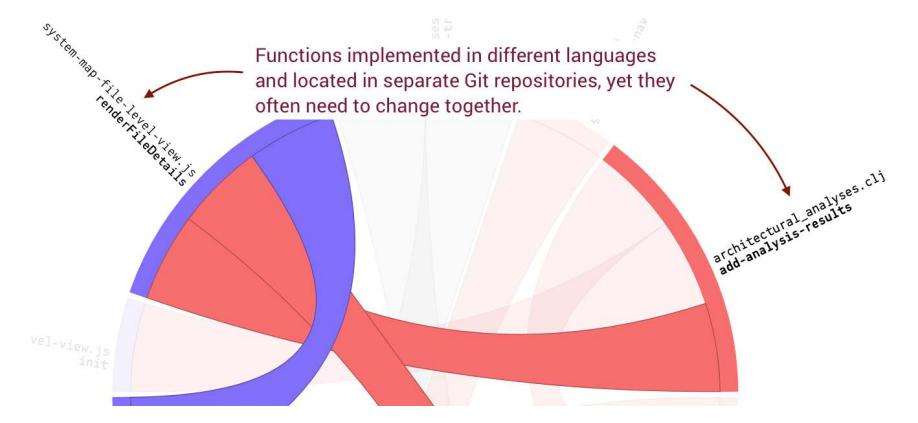

Since the X-Ray technique helped narrow down the functions of interest it was quick to inspect the code and detect that the back end generated a set of metrics that the front end presented. Each time a new metric was introduced in the analysis part, a predictable tweak had to be made in the UI—a classic producer-consumer relationship.

<span id="page-186-1"></span>We could reduce the impact of the logical dependency by letting the back end provide some metadata that could drive the presentation. While that would solve this specific case, it would fail to address a more fundamental structural issue: the two parts are logically related, and therefore should be contained close to each other. Packaging the JavaScript files responsible for rendering the metrics together with the services that produce them solves the issue by reducing a systemwide implicit dependency to a local relationship within the same component. Sweet.

<span id="page-186-0"></span>
## Detect Microservices Shotgun Surgery

<span id="page-186-2"></span>In the last chapter we calculated change coupling between layers and components, and using the idea of logical change sets lets us do the same at the microservice level across Git repositories. In microservices, you want to watch out for change coupling across multiple services, as shown in the [figure on](#page-187-0) [page 179](#page-187-0).

Such coupling is basically *shotgun surgery* on an architectural scale. (Shotgun surgery was introduced in *[Refactoring: Improving the Design of Existing Code](021-bibliography.md#page-242-3) [\[FBBO99\]](#page-242-3)* to describe changes that involve many small tweaks to different classes.) You want to change a single business capability and you end up having to modify five different services. That's expensive.

<span id="page-187-0"></span>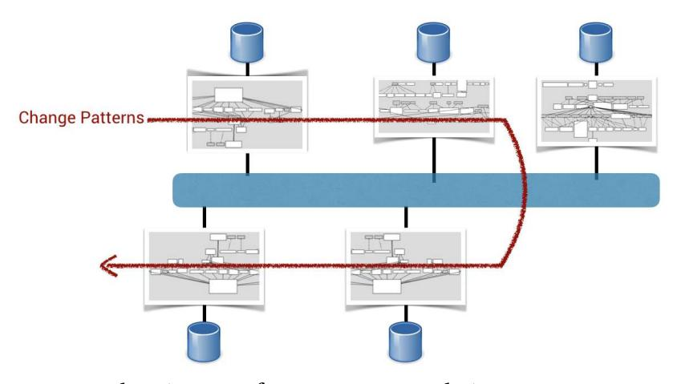

There are several root causes for microservices shotgun surgery:

- The services share code that itself isn't stable from an evolutionary point of view.
- <span id="page-187-3"></span>• Protocol design is hard to get right. Thus some services turn into leaky abstractions and others start to depend on exposed implementation details.
- The same team is responsible for multiple services. Often in this case it becomes easier to send directed information between services that, logically, represent different concepts.

<span id="page-187-2"></span>By making change coupling analysis a habit, you get an early warning that you can react to early and disarm the shotgun.

### Express Higher-Level Concepts than Services


Some services aren't independent but form a natural hierarchy, and that's something I often see reflected in the change coupling analyses. Today's microservices lack an architectural concept that lets us express such groups of microservices as one logical unit. When you identify such services, organize them into the same Git repository to express the relatedness and benefit from easier code navigation within that business capability. Process boundaries alone don't make good components.

<span id="page-187-1"></span>
## Optimize for Sociotechnical Congruence Across Boundaries

In larger organizations you want to take the analysis a step further and correlate the technical change coupling results to the social team analyses that we used in the previous chapters. Remember the system we discussed where a simple tweak took a week because the work rippled across organizational boundaries? Combining technical and social analyses lets you identify such patterns, and the next figure shows an example.

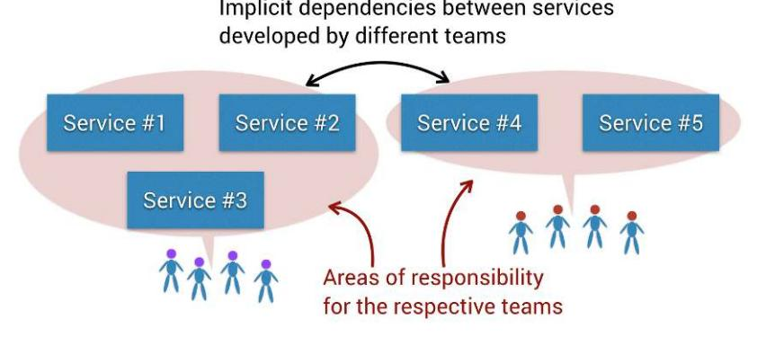

When you detect dependencies between code owned by different teams you have a number of options:

- *Live with it*: There's nothing wrong with accepting an interteam dependency as long as you ensure that the teams are close from an organizational perspective, as coordination costs increase rapidly otherwise.
- <span id="page-188-1"></span>• *Transfer ownership*: When possible, transfer the ownership of one of the affected services so that the parts that change together are owned by the same team.
- <span id="page-188-3"></span>• *Redefine the protocols*: As we discussed earlier, such coupling may be accidental if a service exposes implementation details, which is a technical problem that can be corrected.
- *Collapse the services*: Finally, inspect if the two services are logically the same and should be collapsed into a single service.

<span id="page-188-2"></span><span id="page-188-0"></span>Whatever approach you choose, follow up with the same measures a few weeks later to ensure you get the desired effect. The shorter the communication paths, the better.

## Measure Technical Sprawl

Four decades ago, Manny Lehman started documenting a series of observations on how software evolves, and his writings became known as *Lehman's laws*. (See *[On Understanding Laws, Evolution, and Conservation in the Large-Program](021-bibliography.md#page-243-8) [Life Cycle \[Leh80\]](#page-243-8)*.) One of the laws states the need for *conservation of familiarity*, which means that everyone involved in the life cycle of a system must maintain a working knowledge of the system's behavior and content.

<span id="page-189-0"></span>The main reasons for diminishing knowledge of a system are high turnover of personnel and, as Lehman points out, excessive growth of the codebase. However, microservices present another challenge that may hinder both collaboration and knowledge sharing, so let's explore that.

## Freedom Isn't Free

The trends and hype within the software industry follow a pattern: promising silver bullets are offered based on local success, only to be countered with warnings once an idea becomes popular enough for the discrepancy between expectations and actual outcome to be noted at scale. This happened to objectoriented programming, which once promised reusable Lego blocks of code, service-oriented architectures that guaranteed scalable enterprise systems, and NoSQL that apparently made it easy to deal with high volumes of unstructured data.

<span id="page-189-3"></span>Just a couple of years ago microservices launched on the same trajectory, and one early selling point was that each team was free to choose its own technology and programming language. The consequences of unrestricted technology adoption became known as *technical sprawl*.

Technical sprawl comes in different forms, and the most obvious form is when our services use different libraries, frameworks, and infrastructures. This sprawl will slow down the development of the system and diminish our mastery of it. We avoid these dangers by standardizing our microservice ecosystem; *[Production-Ready Microservices: Building Standardized Systems Across an](021-bibliography.md#page-242-14) [Engineering Organization \[Fow16\]](#page-242-14)* comes with a good set of practical advice in this area.

<span id="page-189-2"></span><span id="page-189-1"></span>Standardization has to go beyond tools and frameworks, and your teams also have to agree on a common structure and location for third-party dependencies. I've seen several microservice systems where each team chose its own structure, which led to slower onboarding without any obvious benefits. Consistency saves time.

Another aspect of technical sprawl arises when each team chooses its own programming language. It's all fun and games until your two productive Idris programmers leave to launch their startup, and they take your only kdb+ database expert with them.10 11

<sup>10.</sup> <https://www.idris-lang.org/>

<sup>11.</sup> <https://en.wikipedia.org/wiki/Kdb%2B>

Sure, a good developer can learn the basics of any programming language in a week, but the mastery required to tweak and debug production code needs time and experience. While rewriting a service in another language is doable—at least as long as the service is truly micro—it has no value from a business perspective. It's a hard sell.

<span id="page-190-1"></span>Technical sprawl also puts an accidental limit on knowledge boundaries since it becomes harder for an individual developer to keep up with the code in neighboring services.

<span id="page-190-2"></span>
### Turn Prototyping into Play

We humans learn by doing, and prototyping different solutions gives you feedback to base decisions on. Unless you prototype a problem connected to a specific technology—for example, performance optimizations or scalability—use your prototypes as a learning vehicle. (Years ago I learned Common Lisp this way.) The strategy has the advantage of fueling the intrinsic motivation of developers and gives your organization a learning opportunity that you can't afford on production code. Besides, no manager will mistake that Common Lisp–based prototype as being production ready.

<span id="page-190-0"></span>
## Measure Programming-Language Sprawl

Programming-language sprawl can be measured from a static snapshot of the code. The cloc tool that we used to count lines of code has built-in rules that recognize most programming languages. Let's try it on Orca, Spinnaker's orchestration engine:

**adam\$ cloc .** 1057 text files. 1056 unique files. 13 files ignored.

| <br>Language | files | blank | comment | code  |
|--------------|-------|-------|---------|-------|
| <br>Groovy   | 663   | 9136  | 10863   | 43993 |
| Java         | 201   | 2382  | 3336    | 9726  |
| Kotlin       | 108   | 1849  | 1892    | 9528  |
|              |       |       |         |       |
| Dockerfile   | 1     | 5     | 0       | 9     |
| Slim         | 1     | 4     | 0       | 5     |
|              |       |       |         |       |
| SUM:         | 1045  | 13506 | 16257   | 67004 |
|              |       |       |         |       |

Most of Orca is implemented in Groovy, but there are also significant portions in Java and Kotlin. We'll put this data to use later in this chapter, but for now we just pick the top language: Groovy.

<span id="page-191-1"></span>Our next step is to repeat this process in each repository and then visualize it by associating each language with a distinct color, just as we did for teams earlier. The next figure shows the main programming languages for the services in Spinnaker, and the size of the circles represents the total amount of code.<sup>12</sup>

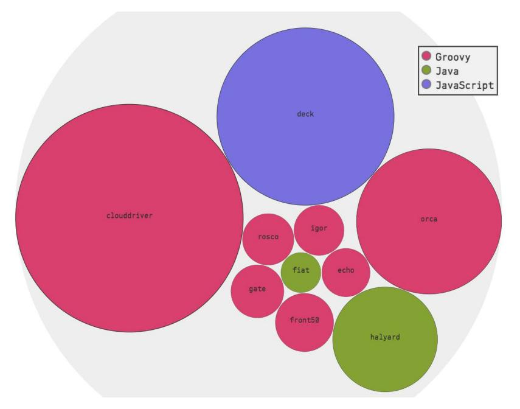

<span id="page-191-0"></span>This kind of data becomes increasingly useful as your system grows in terms of services, and it's also a useful input to offboarding, as we discuss in the next chapter.

## Calculate a Technical Sprawl Index

In a large system it's useful to detect services such as Orca that are implemented in multiple languages. Sometimes the choice to go polyglot is deliberate—for example, when front-end and back-end code are organized together—and sometimes such sprawl marks the transition to a new technology, like rewriting Java code in Kotlin or Scala. We could visualize the programming language of each file, as shown in the [figure on page 184,](#page-192-0) but that makes it hard to identify trends and improvements.

<sup>12.</sup> <https://codescene.io/projects/1650/jobs/4074/results/architecture/organization>

<span id="page-192-0"></span>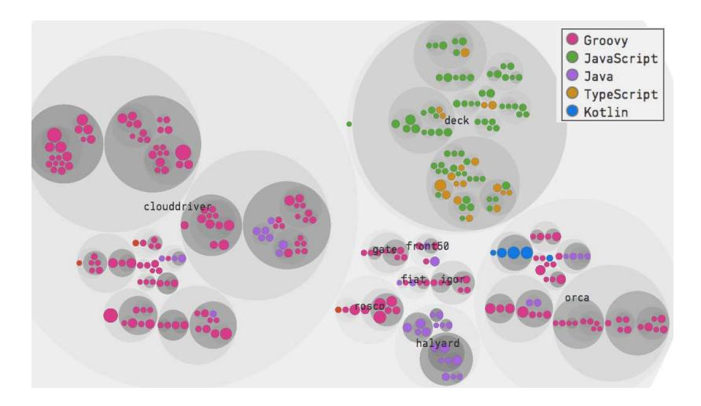

<span id="page-192-3"></span>In *[Rank Code by Diffusion](013-chapter-7-beyond-conway-s-law.md#page-132-0)*, on page 122, we introduced the fractal value metric that lets us detect how diffused the development efforts are between different programmers. The same formula lets us calculate a *technical sprawl index* that shows how diffused the implementation techniques are within a microservice or any other subsystem. A value of 0.0 means a single programming language, while the closer to 1.0 we get, the greater the sprawl. The next figure describes how you adapt the fractal value formula to calculate a normalized technical sprawl value.

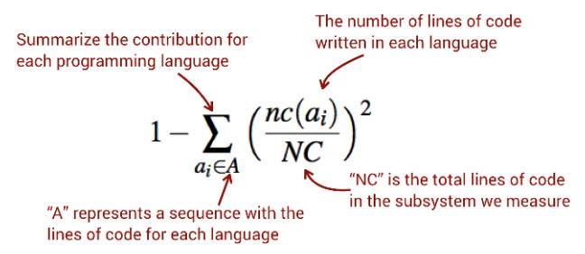

<span id="page-192-1"></span>To generate the raw data we instruct cloc to deliver its output as CSV and save it as a machine-readable file:

**adam\$ cloc . --csv --quiet --report-file=orca\_loc.csv**

<span id="page-192-2"></span>The resulting CSV file contains a code column—just as our previous cloc example did—that we feed into the preceding formula. The process is straightforward to piece together with a few lines of Python, but you could also open the CSV file in a spreadsheet application and do the calculation there.

Whatever strategy you choose, be sure to clean the data of common content, autogenerated XML files, or test data in JSON. For example, all Spinnaker

repositories contain a Docker file and Markdown documentation, and we don't want such content to contribute to a higher sprawl index. Thus, we remove all those entries from our cloc output before the technical sprawl calculation.

The following figure shows an example based on the 2017 Spinnaker implementation, and we then speculate—wildly, without any insider insights—about 2018 just to illustrate how this technique lets you measure technical sprawl over time.

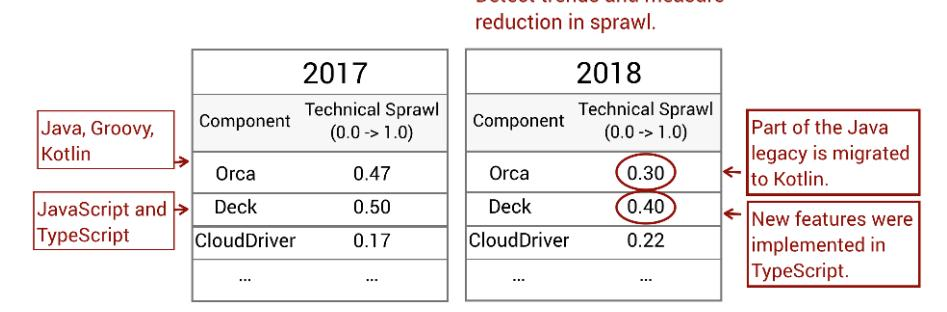

Use this information to strategically reduce technical sprawl, and measure frequently to ensure your strategic decisions are reflected in the code that gets produced.

<span id="page-193-1"></span>
### When You Choose a Technology You Also Choose a Community

<span id="page-193-0"></span>

Choosing a programming language is about more than solving business problems, which all Turing-complete languages are capable of. So study the community and culture around each language you consider. It'll influence what people you're able to hire and retain—as well as define the core values of your architecture.

## Distribution Won't Cure the Dependency Blues

<span id="page-193-2"></span>In this chapter we discussed how behavioral code analysis helps us get tactical information on complex systems such as microservice architectures at scale. The same techniques are also useful as input to planning and as a way to reason about change, which is significantly harder in a microservice architecture. I first experienced that in the early 2000s as I worked on my first microservice system, so let me share a painful lesson.

Of course, back in the 2000s we didn't know we were doing microservices as the term hadn't yet been coined. Instead the architecture was the logical conclusion of applying the UNIX design philosophy on the scale of a distributed system. (See *[Linux and the Unix Philosophy, 2nd Edition \[Gan03\]](#page-243-9)* for a great read and advice that's useful no matter what platform you target.)

<span id="page-194-1"></span>The services in that system ranged from small implementations with about 100 lines of code to somewhat more complex services with about 3,000 lines, but none of them were hard to understand in isolation. This was a huge improvement over the previous legacy system, and the architecture was considered a success as it let other parts of the organization add smaller extensions in the shape of separate services.

<span id="page-194-2"></span>However, even though the services were easy to understand, the system complexity was still there—only now it was distributed, too. As the system grew toward its second release, we noted that reasoning about the system behavior was difficult at best and much harder than it had been on the monolith we replaced. The communication between services was asynchronous through publish-subscribe middleware,<sup>13</sup> so each service was decoupled in code but the logical dependencies were still there. A change coupling analysis would have saved the team from lots of painful message tracing.

In complex systems a coupling analysis between logical change sets offers information that serves as a guide to code reading. Making it easier to reason about systems is where the big win is, so it pays off to ensure you have the information you need to uncover developer behavior. As we saw in this chapter, a ticket reference to each commit helps you spot dependencies that you can't detect in the code alone. The next time you plan to introduce a new feature, look at the change coupling of related services to foresee the impact of the suggested additions.

<span id="page-194-0"></span>Now that we've analyzed a broad range of codebases such as layers, components, and microservices, we're prepared to generalize our knowledge to whatever architectural style our next project throws at us. For example, at the time of writing, *serverless architectures* and *function as a service* (FAAS) are gaining in popularity as a way to reduce server costs and, ideally, development costs.<sup>14</sup> That drive toward ever-smaller architectural building blocks makes it harder to maintain a holistic overview, and behavioral code analyses such as change coupling will fill an important gap there, too.

The techniques discussed so far are after-the-fact analyses, so what if we could catch potential problems early before they become an issue? That's up next as we look to detect early warnings on both the technical and organizational levels.

<sup>13.</sup> [https://en.wikipedia.org/wiki/Publish%E2%80%93subscribe\\_pattern](https://en.wikipedia.org/wiki/Publish%E2%80%93subscribe_pattern)

<sup>14.</sup> <https://martinfowler.com/articles/serverless.html>

<span id="page-195-0"></span>
## Exercises

<span id="page-195-1"></span>We covered a lot of ground in this chapter as we focused both on gaining situational awareness of existing problems and on getting guidance that makes it easier to understand existing code. In the following exercises you get the opportunity to try a technique from each of those categories.

## Support Code Reading and Change Planning

- Repositories: Spinnaker<sup>15</sup>
- Language: JavaScript and Groovy
- Domain: Spinnaker is a continuous-delivery platform.
- <span id="page-195-3"></span>• Analysis snapshot: [https://codescene.io/projects/1650/jobs/4074/results/code/temporal](https://codescene.io/projects/1650/jobs/4074/results/code/temporal-coupling/between-repos)[coupling/between-repos](https://codescene.io/projects/1650/jobs/4074/results/code/temporal-coupling/between-repos)

A change coupling analysis lets you reason about suggested changes in the sense that you may detect implicit dependencies. By uncovering those dependencies you're able to plan ahead and avoid breaking existing behavior.

Let's pretend in this exercise that you want to do a change to the gceBakeStage.js module in the front end (the deck repository). What regression tests are likely to fail unless you update them?

## Combine Technical and Social Views to Identify Communities

- Repositories: Spinnaker<sup>16</sup>
- Language: JavaScript and Groovy
- <span id="page-195-2"></span>• Domain: Spinnaker is a continuous-delivery platform.
- Analysis snapshot: [https://codescene.io/projects/1650/jobs/4074/results/code/hotspots/](https://codescene.io/projects/1650/jobs/4074/results/code/hotspots/system-map) [system-map](https://codescene.io/projects/1650/jobs/4074/results/code/hotspots/system-map)

When we discussed the need for sociotechnical congruence, we noted that code that changes together should be close from an organizational perspective. Normally we'd like to investigate it on the team level, but we could also start from individual authors and find social cliques whose work depends upon each other's code.

Start from the change coupling relationship you identified in the previous exercise and find the main authors behind each side of the change coupling. Are there any interpersonal dependencies you'd like to be aware of if you plan an organizational change?

<sup>15.</sup> <https://github.com/spinnaker>

<sup>16.</sup> <https://github.com/spinnaker>

### Analyze Your Infrastructure

- Repositories: Git<sup>17</sup>
- Language: C and shell scripts
- Domain: Git is a distributed version-control system we know all too well.
- Analysis snapshot: [https://codescene.io/projects/1664/jobs/4156/results/code/refactoring](https://codescene.io/projects/1664/jobs/4156/results/code/refactoring-targets)[targets](https://codescene.io/projects/1664/jobs/4156/results/code/refactoring-targets)

<span id="page-196-0"></span>Many organizations invest in elaborate pipelines for continuous integration and deployment, which is a great thing that helps detect problems early and lets us manage increasingly larger systems. The necessary automation doesn't come for free, and I've seen several systems where infrastructure-related code—just like test code—isn't treated with the same care as the application code. (When was the last time you code-reviewed a build script?) The result is that the automation scripts become bottlenecks that make it harder to adapt to changed circumstances.

Git has an interesting architecture in the sense that its main domain concepts are visible in the top-level file names, as visible in a hotspot visualization.<sup>18</sup> The implementations in Git favor relatively large modules implemented in C, but none of that code is the top hotspot.

Look at the main hotspots and identify some potential technical debt that isn't in the application code. Investigate the complexity trend of that hotspot and think about possible refactorings.

<sup>17.</sup> <https://github.com/git/git>

<sup>18.</sup> <https://codescene.io/projects/1664/jobs/4156/results/code/hotspots/system-map>
