<span id="page-197-0"></span>
# Chapter 10: An Extra Team Member: Predictive and Proactive Analyses

<span id="page-197-3"></span>There's a common belief in our industry that technical debt sneaks into a codebase over time. However, recent research disagrees and suggests that many problematic code smells are introduced upon creation, and future evolution of the code merely continues to dig that hole deeper. This means we need a way to catch potential problems early, ideally before they enter our master branch. In this chapter we explore preventive and predictive uses of behavioral code analysis. Such analysis information becomes like an extra team member that helps us by pointing out areas of the code in need of our attention.

We start by detecting early warnings on code that evolves toward a future maintenance problem such as a growing hotspot, and look to predict code decay. This is information that's immediately actionable when combined with existing practices such as code reviews, and forms a natural part of any continuous integration pipeline.

<span id="page-197-1"></span>From there we look deeper at the social data discussed in the previous chapters and see how it benefits onboarding tasks. We also combine the data with technical measures to simulate the impact and staffing needs during offboarding or job rotations. Let's get started by identifying a spectacular hotspot.

<span id="page-197-2"></span>
## Detect Deviating Evolutionary Patterns

The largest hotspot I've ever come across is still around, and it's located in the prominent *.NET Core runtime*. That codebase forms the basis for all .NET

<sup>1.</sup> <https://github.com/dotnet/coreclr>

applications by providing the byte code interpretation, memory management, addressing security, and much more. Let's take a quick look at it.

The following figure shows the hotspots that developed in the .NET Core codebase over time. As you see, most development activity has been in the just-in-time (JIT) compiler, where we find a whole cluster of hotspots.<sup>2</sup> We also see that there's a lone hotspot named gc.cpp, which represents the garbage collector in the .NET Core.

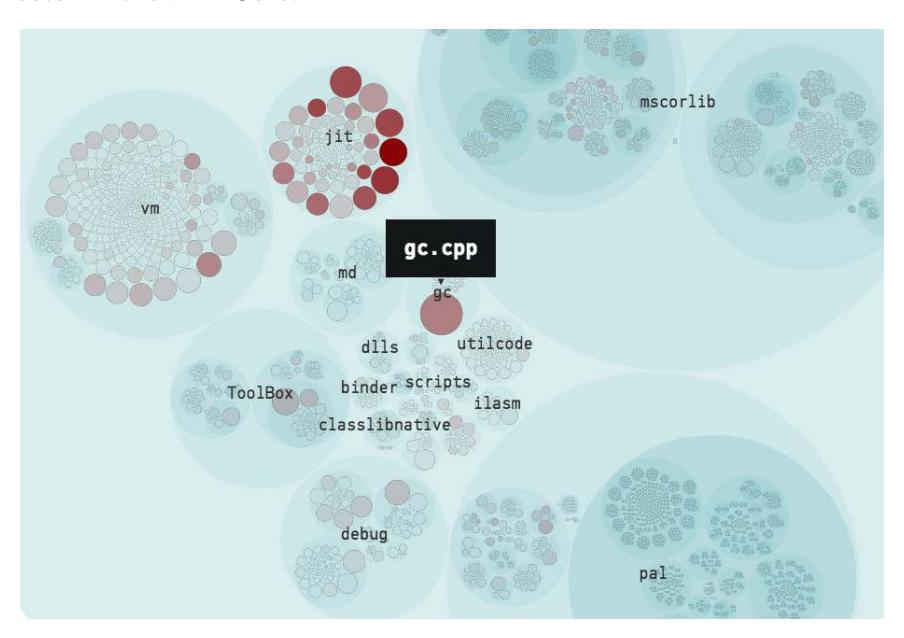

The hotspot gc.cpp may look rather innocent in the visualization, but that's only due to the scale of .NET Core. The runtime is a large codebase with close to four million lines of code, and gc.cpp is a big, big file, as shown in the next figure.

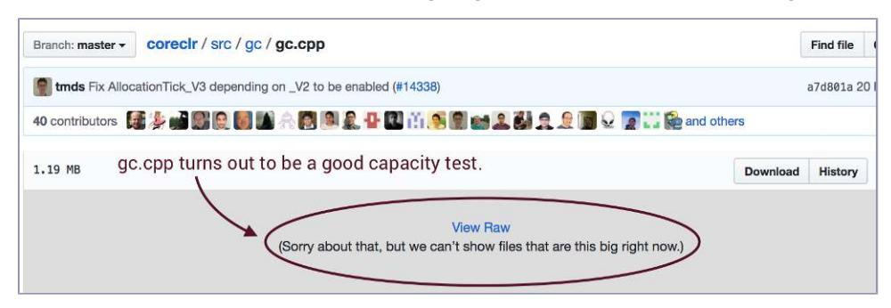

<sup>2.</sup> <https://codescene.io/projects/1765/jobs/4433/results/code/hotspots/system-map>

So what's inside the file? Is it a bird? Is it a plane? No, it's 37,000 lines of fear-inducing C++. An X-Ray of gc.cpp, as shown in the next figure, reveals that its functions are both large and complex.<sup>3</sup>

|                                |                |                       | Remember, 15 is | considered the ery high complexity |
|--------------------------------|----------------|-----------------------|-----------------|------------------------------------|
|                                |                | Change<br>▼ Frequency | Lines of  Code  | Cyclomatic  Complexity             |
| gc_heap::grow_brick_card_table | es .           | 28                    | 354             | 33                                 |
| GCHeap::Initialize             |                | 27                    | 124             | 20                                 |
| gc_heap::gc1                   |                | 26                    | 512             | 60                                 |
| gc_heap::garbage_collect       | Most functions | are really large.     | 415             | 56                                 |
| gc_heap::plan_phase            |                | 21                    | 1507            | 203                                |
| gc_heap::initialize_gc         |                | 19                    | 204             | 37                                 |

Working with the code has to be a challenge, in part because it models a complex domain, but also because all .NET users around the world rely on its correctness for their applications. A bug could be disastrous. There have been suggestions to refactor the code, but it's considered too risky and expensive to do so.<sup>4</sup>

While the size of gc.cpp is on the extreme edge of the scale, far too many organizations find themselves in similar situations where parts of the code cannot be refactored without significant risk. Thus it pays off to investigate ways of detecting code decay and future maintenance problems early. Let's see how.

<span id="page-199-0"></span>
### When Code Turns Bad

How do we get to a single file with 37,000 lines of code whose functions have a cyclomatic complexity far beyond the pain point? In this case we can't tell for sure since only the last years of version control are available on GitHub, but a qualified guess is that the code has been tricky from the beginning. Let's see why that's the case and how you can avoid the same trap.

In a fascinating study, a team of researchers investigated 200 open source projects to find out *[When and Why Your Code Starts to Smell Bad \[TPBO15\]](#page-244-13)*. The study identified cases of problematic code such as *Blob classes* that

<sup>3.</sup> <https://codescene.io/projects/1765/jobs/4433/results/files/hotspots?file-name=coreclr/src/gc/gc.cpp>

<sup>4.</sup> <https://github.com/dotnet/coreclr/issues/408>

represent units with too many responsibilities, classes with high cyclomatic complexity, tricky *spaghetti code*, and so on, and in all fairness gc.cpp ticks most of those boxes.

The researchers then backtracked each of those code problems to identify the commit that introduced the root cause. The surprising conclusion is that such problems are introduced already upon the creation of those classes! Really.

This finding should impact how we view code; it's easy to think that code starts out fine and then degrades over time. As we just saw, that's not what happens. The moment we get to a pull request, it may already be too late, as the pressure of a looming deadline makes it harder to reject an implementation. And even when we do reject a new piece of code, it has already become a cost sink.

<span id="page-200-2"></span>That's why I recommend that you do your initial code walkthrough much earlier. Instead of waiting for the completion of a feature, make it a practice to present and discuss each implementation at one-third completion. Focus less on details and more on the overall structure, dependencies, and how well the design aligns with the problem domain. Of course, one-third completion is subjective, but it should be a point where the basic structure is in place, the problem is well understood, and the initial test suite exists. At this early stage, a rework of the design is still a viable alternative and catching potential problems here has a large payoff.

<span id="page-200-1"></span>If you do one-third code walkthroughs—and you really should give it a try start from the perspective of the test code. As we saw earlier in this book, there is often a difference in quality between test code and application code. Complicated test code is also an indication that something is not quite right in the design of the application code; if something is hard to test, it will be hard to use from a programmer's point of view, and thus a future maintenance issue.

<span id="page-200-0"></span>
## Identify Steep Increases in Complexity

While we want to direct an eye toward new code, existing code may, of course, also turn bad as it evolves. When that happens, the affected code exhibits specific trends that differ from how clean code evolves. More specifically, the *weighted method complexity*—the sum of the complexity of every method in the class—increases much faster, and it's the first warning sign that the code will turn into a future Blob class. (See the research we discussed earlier, *[When and Why Your Code Starts to Smell Bad \[TPBO15\]](#page-244-13)*, which also includes this finding.) Fortunately, behavioral code analysis can help us detect such code before it's even merged to the master branch. Let's look at an example.

The next figure shows the complexity trend of the file gdbjit.cpp, which is part of the debug functionality in .NET. As you see, there's been a steep increase in complexity over several weeks.<sup>5</sup>

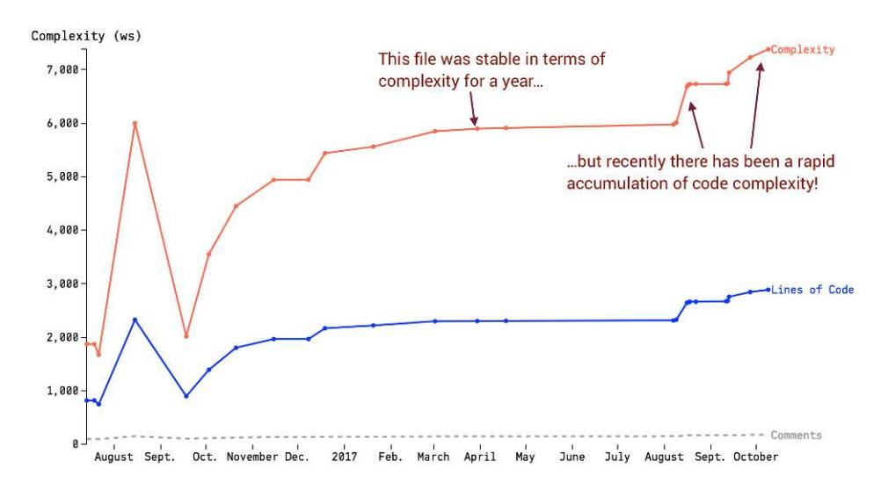

<span id="page-201-2"></span><span id="page-201-0"></span>Given what we know about future maintenance problems, together with the fact that gdbjit.cpp already consists of more than 2,000 lines of code, this is a sign of trouble. If we could detect increasing trends like this automatically, we could run an analysis on each feature branch and react immediately to commits that introduce excess complexity.

To pull this off, we calculate the growth in complexity relative to a previous state and raise a warning each time an addition exceeds a given threshold. This threshold should be relative to the existing code because different organizations have different quality goals. In some codebases, large, monolithic files are the norm, while other teams prefer a more modular design with small and cohesive units. A complexity trend warning should be relative to the previous evolution of the file, which limits the number of false positives. As a rule of thumb, consider a 10 percent increase in code complexity a warning sign.

<span id="page-201-1"></span>A simple start is to look at the delta of the last commit. However, in practice you need to take more revisions into account; otherwise you miss complexity

<sup>5.</sup> [https://codescene.io/projects/1765/jobs/4433/results/code/hotspots/complexity-trend?name=coreclr/src/vm/](https://codescene.io/projects/1765/jobs/4433/results/code/hotspots/complexity-trend?name=coreclr/src/vm/gdbjit.cpp) [gdbjit.cpp](https://codescene.io/projects/1765/jobs/4433/results/code/hotspots/complexity-trend?name=coreclr/src/vm/gdbjit.cpp)

### Joe asks:

## Wouldn't an Absolute and Universal Threshold Be Better?

We could, of course, say that any class that has a weighted method complexity beyond 10, 100, or whatever, is too complex. The problem with an absolute threshold is that in many legacy codebases you would get a warning each time you touch a piece of code. Soon every developer is desensitized and the warnings lose their meaning. With a relative threshold you react to negative changes by using the current state of your code as a baseline. This gives you fewer—but more relevant—warnings. Remember, information should be actionable.

that's added gradually over several commits close in time. Two strategies let you achieve that:

- 1. *Use the commit at the branch point as a reference*: If you work on shortlived feature branches, use the state of the code as it looked when your branch diverged from the main line of development.
- 2. *Use a time window*: As an alternative that doesn't depend on branches, use the state of the code as it looked a month ago.

From here you scan the selected range of commits, calculate the complexity of the file in each state, and select the lowest complexity value as your point of reference. The reason for this extra step is to avoid another corner case where a file gets refactored but then grows again, as illustrated in the next figure.

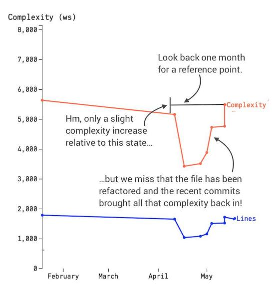

<span id="page-203-1"></span>Finally, to avoid false positives you want to limit your complexity trend warnings to code that has grown beyond a particular size. For example, a new file that adds 20 lines of code to its previous 100 lines isn't likely to be of interest.

When you investigate your complexity trend warnings, you're likely to come across the following scenarios:

- <span id="page-203-4"></span>• *Misplaced behavior*: Rapid growth in complexity is a sign that the code keeps accumulating responsibilities. Often, those responsibilities would be better off when expressed as separate units, so use refactorings like *Extract Class*. (See *[Refactoring: Improving the Design of Existing Code](021-bibliography.md#page-242-3) [\[FBBO99\]](#page-242-3)*.)
- <span id="page-203-0"></span>• *Excess conditional logic*: Quite often new features or bug fixes are squeezed into an existing design with the use of if/else chains. Most nested conditionals indicate a missing abstraction, and refactoring the code to use polymorphism or list comprehensions, or even modeling the data as a sequence, erases special cases from the code.
- <span id="page-203-2"></span>• *The code is fine*: Yes, it happens, and in this case we're safe ignoring the warning.

### Integrate Complexity Warnings into Your Workflow


The earlier we can act on a potential problem, the better. I recommend that you let your continuous integration pipeline scan each branch for complexity trend warnings. An alternative is to provide the functionality as a script that's run by a Git *pre-commit hook*. 6 All developers still have the option to bypass the check, but it has to be an active choice and as such provides an opportunity for reflection on whether that nested if statement really was the way to go.

<span id="page-203-3"></span>
## Detect Future Hotspots

As we saw with gc.cpp, critical hotspots are likely to stick around, so we need to get them before the initial code-quality problems accelerate. When bad code is introduced, it is likely that it will soon require several modifications to smoke out defects, or it will keep attracting more commits because the code has too many responsibilities. This shows up as a shift in development focus.

<sup>6.</sup> <https://git-scm.com/book/en/v2/Customizing-Git-Git-Hooks>

We can detect such code by looking at files that climb rapidly in the hotspot ranking—that is, *rising hotspots*. To detect rising hotspots we perform two calculations:

- A hotspot analysis based on how the code looks right now
- Another hotspot analysis based on how the code looked in the past

<span id="page-204-0"></span>The time spans differ based on size and amount of development activity in the codebase, but a rule of thumb is to look a few months into the past. We perform the analysis of past hotspots by instructing Git to only include commits that were --before="twomonths ago". The rest of the command pipeline is identical to what we used in earlier chapters. Here's what the complete command looks like:

```
adam$ git log --before="two months ago" --format=format: --name-only \
             | egrep -v '^$' | sort | uniq -c \
             | sort -r > two_months_ago.txt
```

We then generate one more file with the current hotspot ranking, simply by omitting the --before option, and redirect that output to another file. From here we compare the rankings of the individual hotspots to detect the ones that have climbed over the past two months, as shown in the next figure.

<span id="page-204-2"></span>In a system under active development, you want to automate this analysis in the form of a script. While the steps of such a script are straightforward, the challenge is to prioritize and limit the results. So start with a threshold where a hotspot needs to climb at least 10 steps on the ranking before considering it a rising hotspot. You can always tweak that value if the resulting data is too verbose.

Let's look at a real example by inspecting the rising hotspots in .NET Core, as shown in the [figure on page 197](#page-205-1) and in the online gallery.<sup>7</sup> These rising hotspots show a clear pattern where recent development efforts seem to focus on the just-in-time compilation support for the ARM CPU architecture, and most likely this reflects Microsoft's investment in porting .NET to Linux.

<sup>7.</sup> <https://codescene.io/projects/1765/jobs/4433/results/warnings/rising-hotspots>

<span id="page-205-1"></span>

| All files that climbed at least 20 positions |
|----------------------------------------------|
| on the hotspot ranking over the past two mor |

| ⇒ File Name                     | Frequency  \$ Increase | Hotspot<br>Rank | Hotspot<br>Rank |
|---------------------------------|------------------------|-----------------|-----------------|
| coreclr/src/jit/lsraarm.cpp     | 30                     | 28              | 58              |
| coreclr/src/jit/lsraarmarch.cpp | 29                     | 70              | 99              |
| coreclr/src/jit/lsraxarch.cpp   | 55                     | 93              | 148             |
| coreclr/src/jit/lsraarm64.cpp   | 118                    | 96              | 214             |

This finding raises an important point: just because some files start to attract many commits doesn't mean the code is a problem. Rather, this means significant development efforts are invested in a new part of the codebase. This is information we use to direct our attention in the form of a review, a code walkthrough, or a friendly dialog with the developers behind it. Our task is to confirm what we expect: that the code is up to par. Should that not be the case, then we need to invest in immediate refactorings to avoid future maintenance problems.

### Clean Your Input Data

<span id="page-205-0"></span>

<span id="page-205-4"></span>As we discussed earlier in Part II, the analysis results are easier to interpret if we clean out uninteresting content. The online results in this section reflect that, as noncode artifacts such as JSON and autogenerated Visual Studio project files have been removed. Thus, the rankings differ compared to the raw git commands used earlier, but the general principle behind rising hotspots is the same.

<span id="page-205-2"></span>
## Catch the Absence of Change

<span id="page-205-3"></span>The early-warning mechanisms that we've discussed so far help us detect deviating patterns in the evolution of a codebase. But problems may also be introduced by the *absence* of a change. For example, one microservice may produce a new event but the expected receiver doesn't implement code to handle it, or maybe we forget to add proper error handling in a higher layer as we let a lower layer raise a new type of exception.

Most examples of bugs by omission can be caught by proper tests, a decent type system, or a static analysis tool. However, those safety nets aren't able to cope with surprises of the kind we dealt with in [Chapter 3,](008-chapter-3-coupling-in-time-a-heuristic-for-the-concept-of-surprise.md#page-49-0) *Coupling in [Time: A Heuristic for the Concept of Surprise](008-chapter-3-coupling-in-time-a-heuristic-for-the-concept-of-surprise.md#page-49-0)*, on page 35. Copy-paste code where we forgot to update one of the clones? Too bad; the compiler won't help, and chances are slim that we remember to test for our omission.

To prevent these situations we use change coupling to our advantage. The technique won't deliver a complete guarantee of correctness, but it does help catch omissions. Let's demonstrate how.

If you did the exercises in Chapter 3, *[Coupling in Time: A Heuristic for the Concept](008-chapter-3-coupling-in-time-a-heuristic-for-the-concept-of-surprise.md#page-49-0) of Surprise*[, on page 35,](008-chapter-3-coupling-in-time-a-heuristic-for-the-concept-of-surprise.md#page-49-0) you've already come across the Roslyn codebase.<sup>8</sup> Roslyn is a compiler platform that also implements the C# and Visual Basic compilers. Since both compilers are bootstrapped, Roslyn contains an equal amount of Visual Basic and C# code, as shown in the next figure.<sup>9</sup>

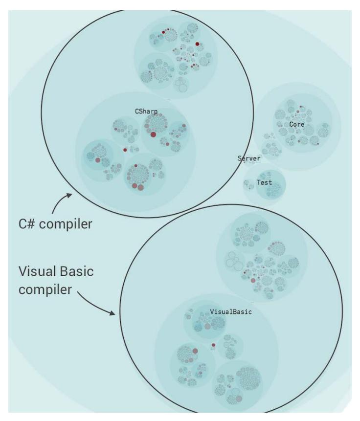

A corresponding change coupling analysis shows that there are strong logical dependencies across the language boundaries.<sup>10</sup> For example, the Visual Basic code in the file VisualBasicEESymbolProvider.vb changes together with the C# code in the CSharpEESymbolProvider.cs file in 100 percent of commits. This change coupling in Roslyn looks deliberate, and it's likely to be a design goal to

<sup>8.</sup> <https://github.com/dotnet/roslyn>

<sup>9.</sup> <https://codescene.io/projects/1715/jobs/4299/results/code/hotspots/system-map>

<sup>10.</sup> <https://codescene.io/projects/1715/jobs/4299/results/code/temporal-coupling/by-commits>

maintain a similar structure in the two compilers. This means we can use our knowledge of such expected change patterns to verify the principle.

<span id="page-207-0"></span>We do that by performing a change coupling analysis as part of a continuous integration pipeline, and then verify each commit against that baseline. Ideally, that check is implemented as a Git precommit hook, which means Git fires off a script that you provide.<sup>11</sup> Here's what's needed in that script:

- <span id="page-207-1"></span>1. Fetch the results of the last change coupling analysis and ignore everything below a (configurable) threshold, like 80 percent change coupling. The purpose of the threshold is again to avoid false positives.
- 2. Check each modified file in the pending commit against the last change coupling results, and look for omissions where an expected change coupling is absent from the pending commits set.
- 3. Inform the user and give her or him the option to cancel the commit. In a precommit hook, aborting a commit is as simple as returning a nonzero status from your script.
- 4. If all expected change couplings are present, the script runs to completion and reports success, and the developer doing the commit won't notice.

So if we have this mechanism in place and we make a mistake, we get a dialog like in the following session:

```
adam$ git status
On branch develop
Changes to be committed:
  (use "git reset HEAD <file>..." to unstage)
        modified: CSharpEESymbolProvider.cs
adam$ git commit -m "PR #123: Correct error handling for missing symbols"
Pre-Commit Warning
==================
Previous modifications of CSharpEESymbolProvider.cs also
required a change to VisualBasicEESymbolProvider.vb
Are you sure you want to continue? (yes/no)
```

<span id="page-207-2"></span>The final lines of output are examples from a precommit script. It's important to give the developer the choice to ignore the warning; otherwise we won't be able to refactor and break unwanted change coupling. That choice also has the nice side effect of being a self-learning algorithm; if we keep ignoring the warning, it will result in a lower change coupling over time, and eventually the coupling will go below the threshold and the warning will disappear.

<sup>11.</sup> <https://git-scm.com/book/en/v2/Customizing-Git-Git-Hooks>

This usage of change coupling concludes the technical analyses in this book. Used wisely, this technique fills the role of a *Minority Report* pre-cog, but for software (albeit with fewer car chases than the movie). Also note that you could apply the same early-warning technique on any level, such as between logical components, separate microservices, or on the level of functions. With that covered, we move on to take a quick glance at some proactive usages of social analyses.

<span id="page-208-1"></span>
<span id="page-208-0"></span>
## Guide On- and Offboarding with Social Data

Earlier in the book we discussed that ease of communication has to be a key nonfunctional requirement for any software architecture. We also saw how principles like code ownership and broad knowledge boundaries help you minimize the risk of social biases and form part of an organizational design. These principles get even more important in organizations that are distributed across different departments or geographical sites (or both). Let's see why.

<span id="page-208-4"></span>
### Identify the Experts

If you've ever worked in an organization that is located across multiple sites, you probably noted that distribution comes at a cost. What may be surprising is how significant that cost is. Research on the subject reports that distributed work items take an average of two and a half times longer to complete than tasks developed by a colocated team. (See the research in *[An Empirical Study](021-bibliography.md#page-243-10) [of Speed and Communication in Globally Distributed Software Development](021-bibliography.md#page-243-10) [\[HM03\]](#page-243-10)*.)

<span id="page-208-3"></span><span id="page-208-2"></span>One of the challenges of communication is to find out who to communicate with, and this general problem gets harder with geographical distance. (See, for example, *[Considering an Organization](021-bibliography.md#page-241-10)'s Memory [AH99]* for a cognitive study on the challenges involved.) The previously mentioned research explains that in a distributed setting, the absence of informal discussions in the hallway makes it harder for distant colleagues to know who has expertise in different areas. In such organizations, knowledge maps gain importance.

In *[Build Team Knowledge Maps](014-chapter-8-toward-modular-monoliths-through-the-social-view-of-code.md#page-166-0)*, on page 157, we saw how knowledge maps help us measure aspects like Conway's law by mapping individual contributions to organizational units. If we skip that step and retain the information about individual authors, we get a powerful communication tool that lets us locate the experts. It won't be perfect, as we still have to know which part of the application to look at, but if we get there, knowledge maps direct our communication efforts.

<span id="page-209-1"></span>The next figure shows the current knowledge map of the authors behind the Kotlin programming language.<sup>12</sup> The knowledge map is focused on the frontend part of the Kotlin compiler, and you can interact with the visualization online.<sup>13</sup>

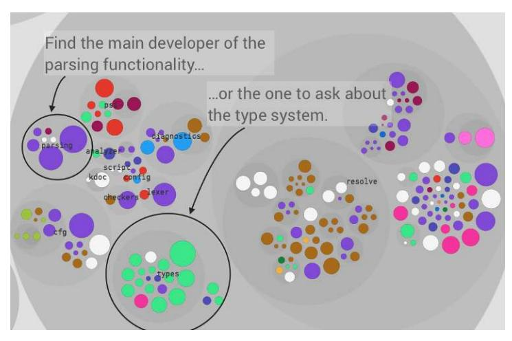

The knowledge map represents the main developer behind each file with a unique color. The main developer is measured as the person who has written most of the code, and thus is likely to be knowledgeable about that application area. For example, in the preceding figure we see that the lime green developer has implemented most of the types package, so if we want to learn more about that code, we look up the developer behind the color and initiate a conversation.

Of course, if you just look at a single file or function you don't need knowledge maps. A quick git blame points you to the person behind the code. The advantage of a knowledge map is it lets you detect clusters of code written by the same author, making it easier to identify the true domain expertise in a particular application area.

<span id="page-209-0"></span>
## Collaborative Tools Are a Workaround, Not a Solution

Today's collaborative tools help a distributed team, but even the most elaborate tool cannot do much about time zone differences (at least not at the time of this writing). One effect of distributed, computer-linked groups is that *less* information gets exchanged; there's more to communication than words, and nonverbal communication tends to get lost. (Several studies have confirmed this; see, for example, the classic *[The eyes have it: Minority influence](021-bibliography.md#page-243-11) [in face-to-face and computer-mediated group discussion \[MBMY97\]](#page-243-11)*.) Additionally, chat groups are a noisy way to find experts, so with knowledge maps we can at least narrow down the number of people we need to ping.

<sup>12.</sup> <https://github.com/JetBrains/kotlin>

<sup>13.</sup> <https://codescene.io/projects/1619/jobs/4004/results/social/knowledge/individuals>

### Power Laws Are Everywhere

<span id="page-210-0"></span>We've already seen that hotspots work so well because the development activity in a codebase isn't uniform, but forms a power law distribution. We see a similar distribution when it comes to individual author contributions, as shown in the following figure with an example from Kotlin.

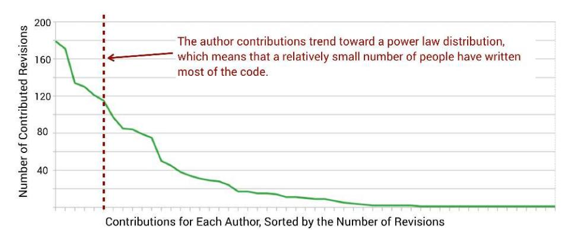

<span id="page-210-1"></span>Kotlin is a popular open source project, which means that many contributors just provide one or two pull requests. However, the same power law curve seems to form in closed source codebases, where people are paid to work fulltime. This means that in your own codebase, you're likely to see that a surprisingly small number of people have written most of the code. (You can have a look at your author distribution by typing the command git shortlog -s | sort -r.)

<span id="page-210-3"></span>Typically, these main contributors are the ones who have been around for a long time and are intimately familiar with the codebase. What if one of them were to leave? We know it would hit the overall productivity of the organization as we'd get some *knowledge loss* in terms of code we may no longer understand. We may even have a good idea of what parts get abandoned, but it's often a guess. Let's see how we can put numbers on it.

<span id="page-210-2"></span>
## Measure Upcoming Knowledge Loss

Since version-control data (our behavioral log) knows which developer has written each piece of code, we can use that information to estimate the impact if a developer leaves or gets transferred to another project. This analysis uses the same data as the knowledge maps; the only difference is that we form two virtual teams: one for people who actively work on the codebase, and one for people who are about to leave, as shown in the [figure on page 203](#page-211-0).

We introduce virtual teams because it's a more general solution that works even when we have groups of developers, such as a whole team that has worked closely together—perhaps mob programming—who move on to

<span id="page-211-0"></span>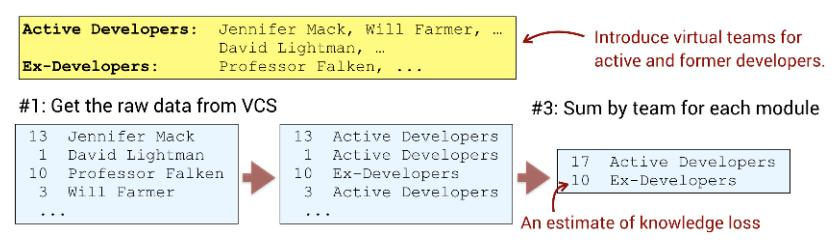

<span id="page-211-1"></span>another project.<sup>14</sup> The same algorithm works when you have a single developer that leaves, too. Let's look at a real-world example.

Over the past years the Scala contributors Paul Phillips and Simon Ochsenreither have made public announcements of their decisions to walk away as contributors.15 16 Both contributed to Scala for years, so this gives us an opportunity to see the impact when experienced developers leave. Let's look at the resulting knowledge loss in the Scala codebase, as shown in the next figure and in the online gallery.<sup>17</sup>

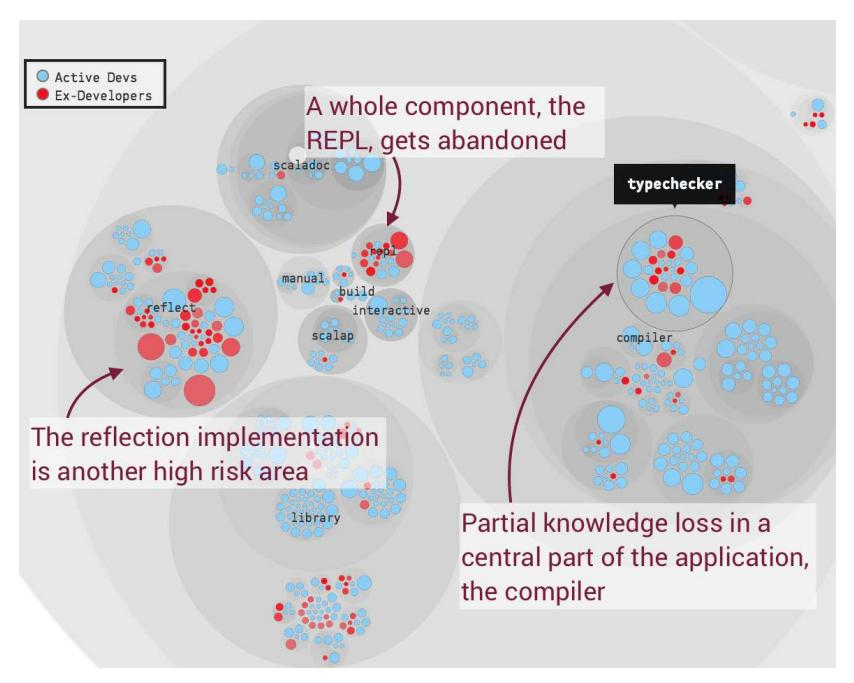

<sup>14.</sup> [https://en.wikipedia.org/wiki/Mob\\_programming](https://en.wikipedia.org/wiki/Mob_programming)

<sup>15.</sup> <https://www.youtube.com/watch?v=uiJycy6dFSQ>

<sup>16.</sup> <https://soc.github.io/six-years-of-scala-development/departure.html>

<sup>17.</sup> <https://codescene.io/projects/1822/jobs/4594/results/social/knowledge/individuals?aspect=loss>

This knowledge-loss analysis highlights the areas of the system where most lines of code have been written by former contributors. In case of Scala, we see that as these two people leave, some areas of the codebase lose their main developer.

In an after-the-fact analysis like this, you use this information to reason about risk and to use as input to your planning process. In particular, look for components that are entirely in the heads of former contributors—like Scala's interactive prompt, the REPL package. If you know you plan extensions to it, make sure to schedule some additional time for learning because it is an increased risk to modify code we no longer understand.

### React to Knowledge Loss

Last year I investigated a codebase under heavy development. That organization worked with several contractors, and two of the contractors had left just the day before I arrived. We used that information to measure and visualize the knowledge loss, and it turned out that an elaborate simulator used during the testing was written entirely by one of them. This was bad news, as the organization was depending on extensions to that simulator in the immediate future.

<span id="page-212-0"></span>This story highlights the dangers of narrow knowledge boundaries and silo development. But it also shows that the analysis of knowledge loss is much more useful as a simulation than as an after-the-fact finding; onboarding is much more effective when the original developers are still present to communicate all the trade-offs and situational forces you can't see in the code or even in the version-control history. So when a developer resigns and has a notice period to work out, run this analysis to identify the parts of the system where your organization needs to focus to maintain knowledge.

You also need to classify your findings according to criticality. If we return to our Scala case study, we noted that the interactive prompt, the REPL, was abandoned. That will cost us, but on the positive side, many programming languages include an interactive prompt for evaluating expressions. Thus, the REPL knowledge loss may be low risk, as other developers are familiar with the domain even though they haven't written any code there. More troublesome are the Scala-specific aspects of the type system—a core strength and feature of the language—such as the typechecker and reflect internals. In your own system you want to look for such domain-specific, nontrivial areas of abandoned code.

Of course, you may find that someone else understands that code well enough to maintain it even though they haven't written it. That's good. If not, you

need to use the knowledge-loss data for damage control, and other behavioral code analyses can help:

- <span id="page-213-3"></span>• *Hotspots*: A hotspot analysis on the recent development activity helps you identify critical parts of the code where potential knowledge loss is more severe.
- <span id="page-213-2"></span>• *Code age*: If an abandoned piece of code hasn't been touched for a long time, that area of the codebase is less critical than others. Chances are the original developer won't remember all the details anyway.
- *Technical sprawl*: While the largest risks are in the loss of domain knowledge, there's a technical dimension too, in case the only people who master a particular technology leave. Thus, you need to consider knowledge loss in the context of a technical-sprawl analysis, as well. In this case you want to take a higher-level view and perform the analysis on logical components, as shown in the next figure. The outcome of this analysis influences training, hiring, and rewrite decisions.

<span id="page-213-4"></span>

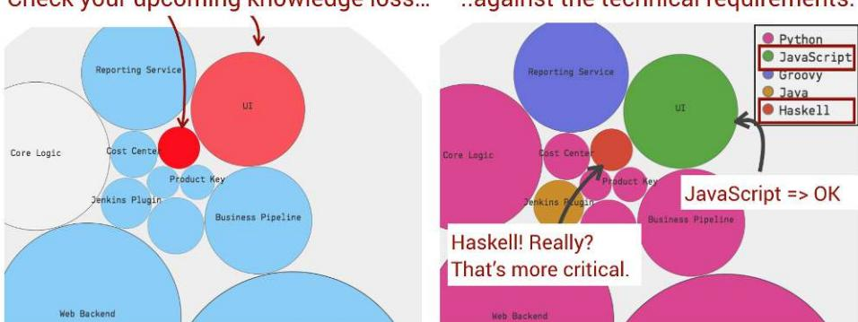

<span id="page-213-0"></span>Broad knowledge boundaries, as we discussed earlier in the book, help mitigate offboarding issues. That said, no matter how much effort we put into knowledge sharing, some developers will still maintain a unique expertise and, as long as they're part of your organization, you benefit from their productivity. By simulating upcoming knowledge loss you get data to act upon, which helps you maintain a conservation of familiarity, as we discussed in *[Measure](015-chapter-9-systems-of-systems-analyzing-multiple-repositories-and-microservices.md#page-188-0) [Technical Sprawl](015-chapter-9-systems-of-systems-analyzing-multiple-repositories-and-microservices.md#page-188-0)*, on page 180.

<span id="page-213-1"></span>
## Know the Biases and Workarounds for Behavioral Code Analysis

Most of the time our version-control history is an informational gold mine, but we might stumble across pyrite, too. No analysis is better than the data

it operates on, and behavioral code analysis is no exception. So let's have a look at the pitfalls and biases so we know if—and how—they impact us.

<span id="page-214-2"></span>First of all, you need a minimum amount of data before you can start to see clear patterns in a behavioral code analysis. I've (successfully) analyzed codebases with just a few weeks of development activity, and in general around 150 to 200 commits are enough for an initial analysis.

When you have an existing system, false positives often bias the data since hotspots are a relative measure. False positives also make the information harder to interpret; README.md and version.txt probably aren't maintenance bottlenecks. This means you need to clean your data by removing autogenerated code and noncode artifacts that aren't of interest to your analysis.

With the exception of false positives we can filter away, technical analyses like hotspots and complexity trends are much less sensitive to biases than the social analyses. Over the years I've run into a number of issues, and if you're aware of them, you can inspect your raw data and avoid the associated traps:

- <span id="page-214-3"></span>• *Incorrect author info*: A commit in Git will always be associated with an author, but it may not be the real author. This may happen in data that's migrated from an older version-control system where developers worked on long-lived branches that were then merged into the main branch, and the one doing the merge got the full credit in the version-control history. You see this if your noncoding build master turns up as a main contributor.
- <span id="page-214-1"></span>• *Copy-paste repositories*: A related bias happens when an organization decides to extract a component into a separate Git repository but fails to migrate its history. (Yes, you can—and should—preserve history when moving content between repositories.)<sup>18</sup> In that case the developer who commits the extracted code gets all the credit.
- <span id="page-214-0"></span>• *Misused squash commits*: Git lets you *squash commits*, effectively merging separate commits into one. This is useful on a smaller scale for a single developer, but disastrous when applied to work committed by several individuals. The resulting history erases both social information as well as change coupling data.

In any of the previous scenarios the resulting version-control data has to be treated with both care and skepticism when it comes to social information. When in doubt, ignore the social analyses and limit your investigative scope to technical concepts like hotspots.

<sup>18.</sup> <http://gbayer.com/development/moving-files-from-one-git-repository-to-another-preserving-history/>

<span id="page-215-3"></span>The parallel development and knowledge analyses are also biased by practices such as pair programming and mob programming. In both of these cases, the individual author who committed a chunk of code wasn't alone behind the keyboard, and since Git—at least in its current version—lacks clairvoyant capabilities, the resulting data will be biased.

<span id="page-215-1"></span>There are potential workarounds, like using the commit notes to tag all contributors and then mining author info from that field instead. However, in most cases it's not worth the additional complexity, as the individual-level metrics aren't actionable. Instead, focus on team-level metrics for parallel development and operational boundaries; pair programming or not, you want to make sure your organizational units carry meaning from an architectural perspective.

<span id="page-215-2"></span>
<span id="page-215-0"></span>
## Your Code Is Still a Crime Scene

My previous book, *[Your Code as a Crime Scene \[Tor15\]](#page-244-0)*, introduced concepts from forensic psychology as a means to understand the evolution of largescale codebases. Forensics was a metaphor drawn from where it all started. Years ago I did a *geographical offender profile* on a series of burglaries in my hometown, Malmö, Sweden.<sup>19</sup> Such offender profiles look for patterns in the distribution of connected crime scenes, which are then used to focus investigations on the areas of interest. These forensic hotspots, as shown in the [figure on page 208,](#page-216-0) are all about probabilities, just like the hotspots we detect in code.

At the same time I worked full-time as a software consultant on a project plagued by technical debt, and noted the parallels to forensics. Of course, I don't mean to imply that developers are burglars—save some clock cycles every now and then—but geographical offender profiling is about prioritizing based on human behavior and how humans interact with their environment. The environment of developers is code, and all their past behavior is preserved in version control, so what if we could uncover patterns in that behavior? The book you're reading right now descends directly from that thought.

However, a metaphor can only be stretched so far, and I didn't want the metaphor to distract from the real-world use cases of behavioral code analysis. Hence, the current book is void of forensics.

But I had a second reason for using the crime scene metaphor, and that reason remains important. Modern forensic psychology has evolved to use

<sup>19.</sup> [https://en.wikipedia.org/wiki/Geographic\\_profiling](https://en.wikipedia.org/wiki/Geographic_profiling)

<span id="page-216-0"></span>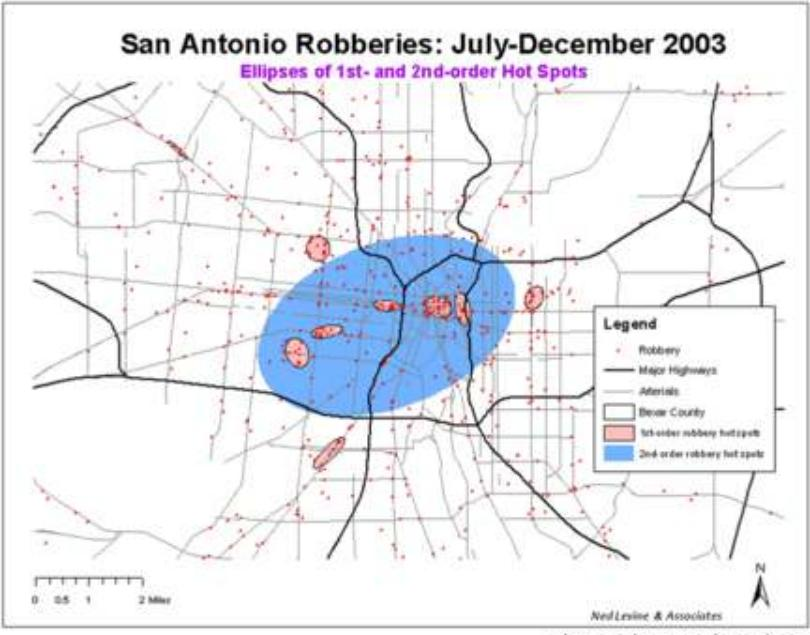

mathematical statistics as a tool to support actions and decisions. And here the software industry has a lot to learn, as far too many fateful technical and organizational decisions are based on little more than gut feelings, opinions, and the occasional biased group discussion.

The software industry has improved dramatically during the two decades I've been part of it, and there's no sign it will stop. But it's also an industry that keeps repeating avoidable mistakes by isolating its influences to technical fields. Large-scale software development has as much in common with the social sciences as with any engineering discipline. This means we could benefit from tapping into the vast body of research that social psychologists have produced over the past decades.

One of the implied goals of this book is to take mainstream software development one step closer to a point where decisions—both technical and organizational—are influenced by data and research from other fields. There are a lot of things we actually *know* about software development, and we've seen some of the studies behind that body of knowledge throughout this book. Some of the resulting findings and recommendations may well be controversial, and there's still a lot to discover and learn.

<span id="page-217-2"></span>Behavioral code analysis doesn't offer any silver bullets, nor does it intend to replace anything. Instead the analyses are here to complement your existing expertise by focusing your attention on the parts of the system that need it the most. The ultimate goal is all about writing better software that's able to evolve with the pressure of new features, novel usages, and changed organizational circumstances. Writing code of that quality will never be easy, as software development is one of the hardest things we humans can put our brains to. We need all the support we can get, and I hope that *Software Design X-Rays* has inspired you to dive deeper into this fascinating field.

<span id="page-217-4"></span>
<span id="page-217-0"></span>
## Exercises

In these final exercises you get an opportunity to look for early warnings of potential future quality problems. You also get to experiment with a proactive usage of the social analysis techniques as a way to facilitate communication, as well as to reason about offboarding risks.

### Early Warnings in Legacy Code

• Repository: Tomcat<sup>20</sup>

• Language: Java

- <span id="page-217-1"></span>• Domain: Apache Tomcat is a servlet container that implements several Java EE specifications.
- Analysis snapshot: <https://codescene.io/projects/1713/jobs/4294/results>

<span id="page-217-3"></span>Apache Tomcat has a rich history and the code continues to evolve, which makes it a great case study for detecting early warnings due to new features. One of Tomcat's classes, java/org/apache/tomcat/util/net/AbstractEndpoint.java, had been around for eight years before it suddenly started to accumulate complexity. The class is still small, around 700 lines, so if this turns out to be a real problem, now is a great time to counter it.

Start by investigating the complexity trend of java/org/apache/tomcat/util/net/ AbstractEndpoint.java. Continue with an X-Ray and see if you can find any areas that could benefit from focused refactorings. Bonus points are awarded if you, using the Git history,<sup>21</sup> track down the new code and focus your investigative efforts there. (In reality, you'd deliver the possible feedback as part of the pull request.)

<sup>20.</sup> <https://github.com/apache/tomcat>

<sup>21.</sup> <https://github.com/SoftwareDesignXRays/tomcat>

#### Find the Experts

• Repository: Kubernetes<sup>22</sup>

• Language: Go

- Domain: Kubernetes is a tool to manage containerized applications—for example, Docker.
- Analysis snapshot: [https://codescene.io/projects/1823/jobs/4598/results/social/knowledge/](https://codescene.io/projects/1823/jobs/4598/results/social/knowledge/individuals) [individuals](https://codescene.io/projects/1823/jobs/4598/results/social/knowledge/individuals)

<span id="page-218-1"></span>As we discussed distributed teams we saw that tasks often take longer to complete as we struggle to find the experts. It takes time to learn who does what, and that learning curve gets longer when we're located at multiple sites.

Pretend for a moment your team works on Kubernetes and looks to complete a particular feature. After an initial investigation you realize you need to modify the staging/src/k8s.io/apiextensions-apiserver package and probably the staging/src/k8s.io/client-go code too. Who should you discuss your changes with? Have a look at the knowledge map and see if you can identify the main developers.

#### Offboarding: What If?

• Repositories: Clojure<sup>23</sup>, Git<sup>24</sup>

• Language: Clojure, Java, C, and shell scripts

- Domain: Clojure is a Lisp dialect for the JVM, and Git is git.
- Analysis snapshot, Clojure: [https://codescene.io/projects/1824/jobs/4597/results/social/](https://codescene.io/projects/1824/jobs/4597/results/social/knowledge/individuals?aspect=loss) [knowledge/individuals?aspect=loss](https://codescene.io/projects/1824/jobs/4597/results/social/knowledge/individuals?aspect=loss)
- Analysis snapshot, Git: [https://codescene.io/projects/1664/jobs/4156/results/social/](https://codescene.io/projects/1664/jobs/4156/results/social/knowledge/individuals?aspect=loss) [knowledge/individuals?aspect=loss](https://codescene.io/projects/1664/jobs/4156/results/social/knowledge/individuals?aspect=loss)

<span id="page-218-0"></span>We've seen how we can measure the impact when a developer leaves, and now we get a chance to simulate the same effect with proactive use of a knowledge-loss analysis.

In this exercise you get to investigate two popular open source projects and see what happens if their creators leave. Simulate what happens if Git's inventor, Linus Torvalds, leaves and compare it to the effect on Clojure if Rich Hickey abandons the codebase.

<sup>22.</sup> <https://github.com/kubernetes/kubernetes>

<sup>23.</sup> <https://github.com/clojure/clojure>

<sup>24.</sup> <https://github.com/git/git>

<span id="page-219-0"></span>➤ Sigmund Freud

APPENDIX 1
