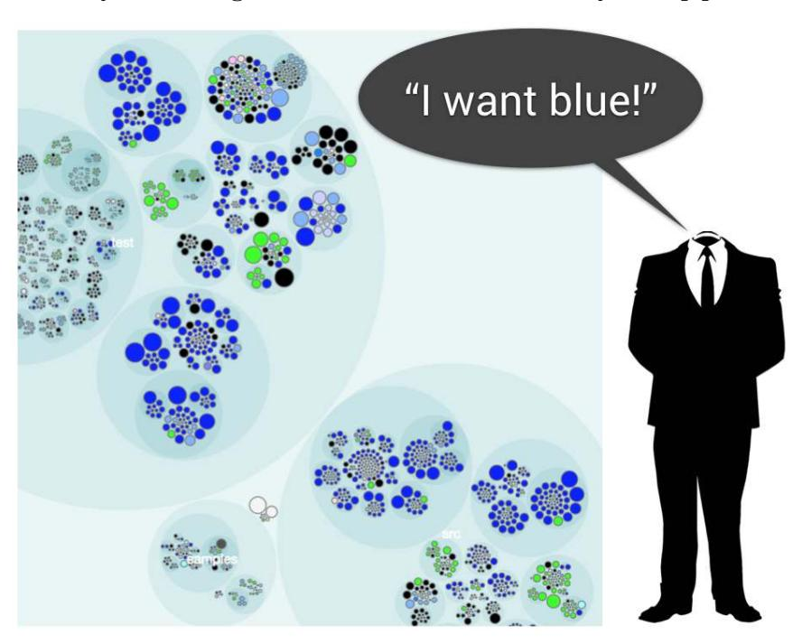
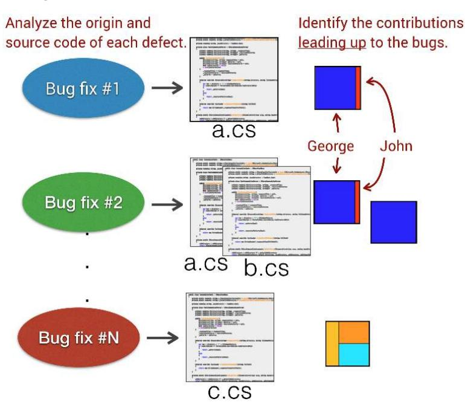
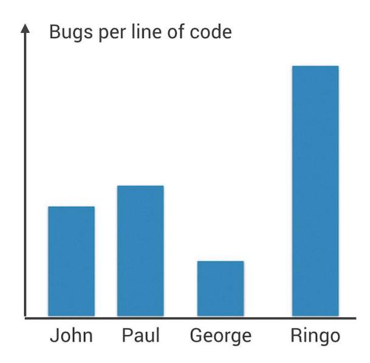

# Appendix A1: The Hazards of Productivity and Performance Metrics

Knowledge maps facilitate communication across an organization because they help you find the people that carry the history of your codebase and product in their heads. Often their stories complement the analysis results and help you put your findings into context. However, using the same data for performance evaluations is dangerous, so let's look into that topic as a cautionary tale.

## Adaptive Behavior and the Destruction of a Data Source

Over the past years I've been asked if the social analyses presented in this book could be used to evaluate the performance of individual programmers. My short answer is no, and—when I get the chance to elaborate—my longer answer is "No, because it will hurt more than it will help."

The reason I advise against this is part ethical, part juridical, and to a large degree practical. Some of the statistics you're able to collect with the techniques in this book may be considered sensitive from a legal perspective, a topic that varies among different jurisdictions and company policies.

From a practical point of view, once someone starts to evaluate contributors, people adapt by optimizing for what's being measured. For example, if I'm evaluated on how many commits I do, I'll increase my number of commits. My commits will no longer carry any meaning, but my statistics "improve." As Heraclitus said, we cannot step into the same river twice, and his ancient wisdom would hit us with full force the next time we try to apply the analyses; the nature of the thing we try to measure would have changed for the worse. This means we destroy a valuable collaboration tool and bias our hotspots and change coupling measures in the process. Painful.

An even worse aspect of such performance evaluations is that they're likely to ruin the team dynamics. Again, if we're measured by how many commits or lines of code we produce, we're less likely to invest time in supporting our peers and we end up with local optimizations that hurt the overall productivity. And even when we do manage to get a sensible performance metric, we still can't use it for job-performance evaluation. Let's see why.

## The Situation Is Invisible in Code

A quick look at a knowledge map reveals the main developer in a codebase, as illustrated by the next figure. Could we use that to identify the top performers?

This strategy will be just as destructive as measuring the number of commits, as all incentives for true improvements are gone. Replace a large chunk of code with a library? No—negative performance. Delete dead code? No—negative performance. Check in those large code-generated blobs? Yes—positive performance.

Some of the best developers I've worked with are able to produce more value with less code. A while ago I was part of a project where a small team of developers replaced 30,000 lines of code with a brilliant implementation based on domain-specific languages. The size of that new solution? 1,500 lines of code. That won't happen if you measure productivity as lines produced.

Alright, so we can't use lines of code as a productivity metric. But perhaps we can get a decent performance evaluation by looking at deeper quality attributes? Let's see what happens.

We can create a simple quality metric by identifying the modules with the most defects. However, an after-the-fact analysis may contain contributions from both the programmer introducing the bug as well as the one who fixed it, so we need to be smart here; instead of looking at corrected code, we rewind history and look at the contributions leading up to the defect. That is, we identify the programmers who have introduced the most defects, as illustrated in the next figure.

That figure shows the fractal figures of the developers who have contributed the most defect-dense code, and so far it's not looking good for George. From here it's a small step to calculate individual statistics on bugs per line of code, as shown in the [figure on page 214.](#page-222-0)

A quick look at this data lets us know that Ringo isn't performing at the level of the others. Easy. Well, without more context the preceding analysis is seriously flawed. What if

• Ringo's code is the only part of the system that has been tested?

- George works on the simplest parts of the system while Ringo does the heavy lifting?
- Ringo was ordered to write a "throwaway" prototype that got included in production anyway?

As you see, trying to measure the quality and performance of developers without taking situational forces into account is flawed at best. The only way to make a fair assessment is to share the context of the developers, and that requires involving yourself in the development process. There's no way around it.

To summarize, misusing behavioral code analyses for performance evaluations will lead to changed developer behavior. Sure, the quality metrics we discussed are harder to game than the simpler quantitative measures of lines of code or number of commits. That doesn't mean those metrics are safe; instead the team dynamics turn into negotiations and blame games, like the classic "No, this is not a defect." People may also become less inclined to pursue tricky problems as they put themselves at risk for failures and thus negative evaluations. At the end of the line, productivity suffers.
