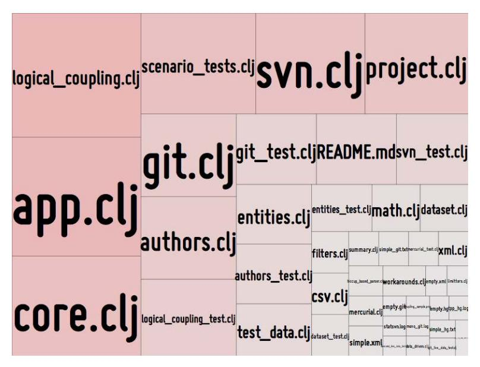

# Appendix A2: Code Maat: An Open Source Analysis Engine

<span id="page-223-3"></span><span id="page-223-0"></span>Code Maat is an open source command-line tool used to mine and analyze data from version-control systems. Code Maat is implemented in Clojure, and you get the code at GitHub.<sup>1</sup> The GitHub page contains up-to-date documentation, so please refer to it for a complete manual. In this appendix we just focus on how you get the tool and how it works.

<span id="page-223-4"></span>
<span id="page-223-1"></span>
## Run Code Maat

At the time of writing, you need to install a Java runtime, at least version 1.8. You can test which Java version you have by typing java -version.

You can build Code Maat directly from source. Code Maat's GitHub page, linked in the footnotes on this page, contains instructions on how to build an executable JAR file using the build tools from the Clojure ecosystem.

<span id="page-223-2"></span>You can also get a prebuilt executable JAR file of the latest version of Code Maat. Just download Code Maat from my homepage.<sup>2</sup>

## Data Mining with Code Maat

Code Maat operates on the level of log files generated from any of several version-control systems (including Subversion, TFS, Git, and others), and the GitHub page contains detailed instructions on how to generate the input data to the tool.

<sup>1.</sup> <https://github.com/adamtornhill/code-maat>

<sup>2.</sup> <http://adamtornhill.com/code/maatdistro.htm>

<span id="page-224-2"></span>Once you have a log file you feed it to Code Maat, which parses the log file and then performs any of the file- or architectural-level analyses discussed in this book. You specify the type of analysis via a command-line argument. Here's an example of a change coupling analysis, specified through the -a coupling argument, and using one of the supported Git formats where the version-control log is stored in the file vcs\_log.txt:

```
adam$ java -jar code-maat-standalone.jar -c git2 -l maat.log -a coupling
entity,coupled,degree,average-revs
analysis/effort.clj,analysis/effort_test.clj,100,5
analysis/churn.clj,analysis/churn_test.clj,89,15
parsers/git.clj,parsers/git_test.clj,80,24
...
```

<span id="page-224-4"></span>As you see in the preceding output, the analysis results are delivered as CSV, which you can redirect to a file. Since pure text is the universal interface it allows you to postprocess that data or visualize it as discussed later in this appendix.

<span id="page-224-1"></span>I recommend that you run Code Maat in a Git Bash shell if you're on Windows, as illustrated in the next figure. If you use alternative shells, you may have to specify an encoding option to Code Maat, as the tool expects its input to be *UTF-8*. Refer to the documentation on the GitHub page for examples.

<span id="page-224-3"></span>
<span id="page-224-0"></span>
## Run Architectural Analyses

Code Maat is input agnostic, so the analysis algorithms are identical no matter if they operate on files or logical components. To analyze logical components, you need to specify a transformation file that maps file names to a logical component. You specify those transformation rules as regular expressions in a text file. The syntax uses an ASCII arrow to map the regular

expression to a component name—for example, ^some/path/to/a/folder => My Component.

You can specify multiple rules in the same text file and use the full power of regular expressions. Here's an example:

```
^src\/((?!.*Test.*).).*$ => Code
^src\/.*Test.*$ => Unit Tests
```

The first rule specifies a transformation that maps any file, located under the src folder, that does *not* contain the token Test to the logical component Code. The second rule matches all files that contain the token Test in their name to a Unit Tests component.

<span id="page-225-3"></span>You instruct Code Maat to use your transformations by saving them to a file and pointing to it via the --group option. For example, let's say you saved your transformations in a file named code\_vs\_test.txt. To run a hotspot analysis on those logical components you'd type the following command:

```
adam$ java -jar code-maat-standalone.jar -c git2 \
           -l git.log -a revisions --group code_vs_test.txt
```

<span id="page-225-2"></span>
## Measure Conway's Law

<span id="page-225-5"></span>By default, all social analyses in Code Maat are performed on the level of individual authors. After all, that's the information that's available in the Git log. To run the analyses on a team level, you need to provide a file that defines which team each individual author belongs to.

That team-definition file has to be in CSV format, with two columns: author and team. Here's an example of an organization with two teams, Analysis and Hardware:

```
author,team
Ada Lovelace,Analysis
Charles Babbage,Hardware
Luigi Federico Menabrea,Analysis
```

<span id="page-225-4"></span><span id="page-225-0"></span>Once you've defined your teams, you run Code Maat with the --team-map-file that specifies the path to your team-definition file. Note that any author who isn't included in the team mapping is kept as is. This has the advantage that any omissions in the mapping are detected quickly.

## Visualizations

Code Maat itself doesn't contain any visualizations. Visualization is an orthogonal concept to the analyses, and keeping the visualizations as separate concerns gives you the power to experiment with different representations. There are several options, so let's look at some popular alternatives.

The simplest approach is to just import the generated CSV file in a spreadsheet program such as OpenOffice or Excel to generate charts. Alternatively, if you have access to business intelligence analysis software like Tableau or Qlik, you can use that to explore and visualize your data.

<span id="page-226-1"></span>A more hands-on option is to use the D3 library, which comes with support for a rich set of visualizations. The examples you've seen throughout this book are to a large extent built upon the D3 libraries. The D3 examples contain plenty of code to get you started.<sup>3</sup>

<span id="page-226-2"></span>Several of the D3 examples operate directly on CSV data, in which case the Code Maat output can be used directly. Other visualizations, most prominently the enclosure diagrams we used for hotspots, require their input data in JSON since it allows for a hierarchical representation.

<span id="page-226-6"></span><span id="page-226-3"></span>A set of Python scripts in one of my GitHub repositories illustrates such transformations.<sup>4</sup> For example, to generate a hierarchical JSON representation of hotspots, we'd do the following:

- <span id="page-226-0"></span>1. Calculate the change frequencies using Code Maat via its revisions analysis.
- 2. Count the lines of code for each file (for example, by using cloc as discussed in *A Brief Introduction to cloc*, on page 223) and save the data as CSV.
- <span id="page-226-5"></span>3. Use the script maat-scripts/transform/csv\_as\_enclosure\_json.py to generate the required JSON. Run the script like python csv\_as\_enclosure\_json.py -h to get a usage description.

<span id="page-226-4"></span>Please note that the scripts are for the Python 2.X version of the language, although they should be simple to port to Python 3.

Finally, writing and experimenting with your own visualizations is a fun area that provides a good learning experience. I tend to prefer the *Processing* language and environment.<sup>5</sup> Processing is an environment for creative coding and sketches, and while I never quite manage to write maintainable programs in it, it's a lot of fun, and fun is a much-underestimated driver of software design.

<sup>3.</sup> <https://github.com/d3/d3/wiki/Gallery>

<sup>4.</sup> <https://github.com/adamtornhill/maat-scripts>

<sup>5.</sup> <https://processing.org/>

<span id="page-227-0"></span>Have a look at the referenced tree-map implementation to see an example of Processing code used to visualize hotspots, as shown in the next figure.<sup>6</sup> You could, of course, also use that Processing code directly to visualize your own hotspots.



<sup>6.</sup> <https://github.com/adamtornhill/MetricsTreeMap>
