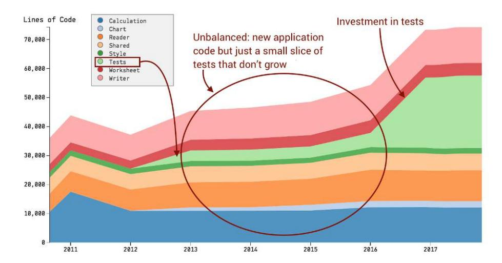
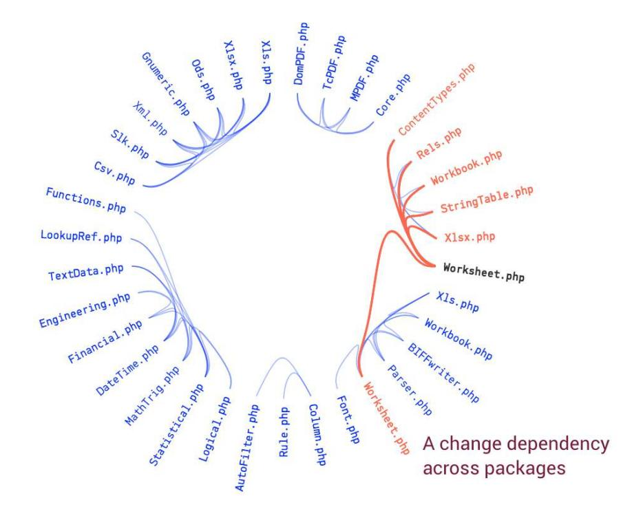
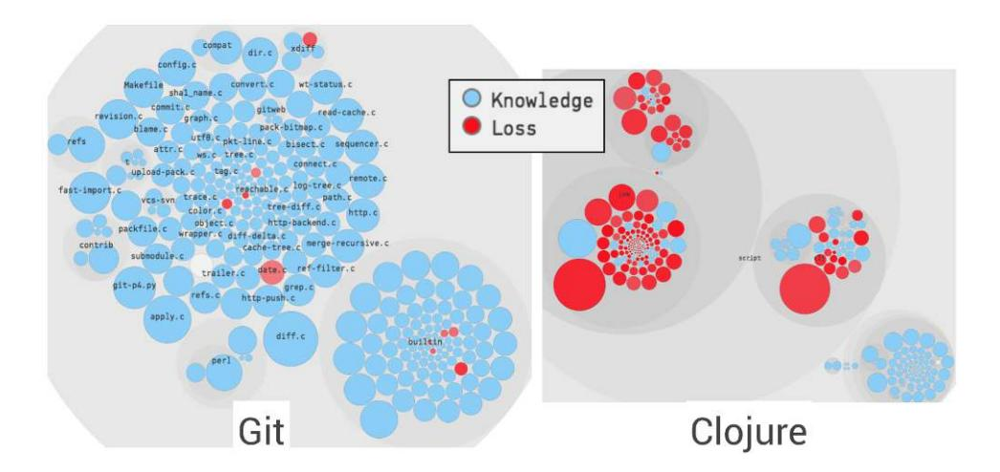

<span id="page-233-0"></span>
# Appendix A4: Hints and Solutions to the Exercises

The exercises in the book let you try the techniques on real-world codebases. In this appendix we walk through each of those exercises and look at their solutions. Since this is about software design, there may be several answers to some of the design problems, and in that case the solutions point out that there are alternatives.

<span id="page-233-4"></span>
<span id="page-233-1"></span>
## Solutions: Identify Code with High Interest Rates

<span id="page-233-3"></span>Here are the solutions to the exercises in Chapter 2, *[Identify Code with High](007-chapter-2-identify-code-with-high-interest-rates.md#page-29-0) [Interest Rates](007-chapter-2-identify-code-with-high-interest-rates.md#page-29-0)*, on page 15.

## Find Refactoring Candidates in Docker

From the perspective of test automation, the code that drives the test execution from the command line has evolved into two hotspots: integration-cli/docker\_ cli\_build\_test.go and integration-cli/docker\_cli\_run\_test.go. Their complexity trends show a steep upward drift and, combined with the pure size of the files, these hotspots make great refactoring candidates.

<span id="page-233-2"></span>
## Follow Up on Improvements to Rails

The historic hotspots activerecord/lib/active\_record/base.rb and activerecord/lib/active\_ record/associations.rb both show a dramatic reduction in size and code complexity in the years 2011 and 2012. Today they are small units that only specify some common declarations. As such, it's misleading when they show up as hotspots. This finding has a number of implications:

- <span id="page-233-5"></span>• It illustrates why the hotspot criteria need a complexity dimension in addition to change frequencies.
- It shows complexity trends are useful to show the effect of refactorings too.

As for the bonus points promised in the exercise, a code-age dimension works well to down-prioritize historic hotspots in the ranking. In case some hotspot hasn't been worked on recently–as indicated by its code age–we could downprioritize its importance. Well done!

<span id="page-234-4"></span>
<span id="page-234-0"></span>
## Solutions: Coupling in Time

Here are the solutions to the exercises in Chapter 3, *[Coupling in Time: A](008-chapter-3-coupling-in-time-a-heuristic-for-the-concept-of-surprise.md#page-49-0) [Heuristic for the Concept of Surprise](008-chapter-3-coupling-in-time-a-heuristic-for-the-concept-of-surprise.md#page-49-0)*, on page 35.

<span id="page-234-2"></span>
### Learn from the Change Patterns in a Codebase

There's a strong degree of change coupling between the test cases for the Visual Basic and C# compilers, where files with the same name but located in different folders and implemented in different programming languages are changed together. If you join the project, you use this information so that you can plan changes to both parts of the code; the compiler won't be able to detect the omission of a test.

We also note that the change coupling between the test suites is deliberate. Last year I had the opportunity to ask some of the lead developers on Roslyn about that change coupling, and they explained that earlier in the project they found a number of command line parsing issues. Thus they decided to add the same tests for both compilers even when a bug was identified in only one of them.

<span id="page-234-3"></span>
## Detect Omissions with Internal Change Coupling

Functions with duplicated code make it hard to distinguish between contextspecific conditions and true omissions that lead to bugs. In the function fully\_ connected there's a type check on the input argument num\_outputs that's missing in convolution2d\_transpose. In addition, the conditional check if not normalizer\_params: in fully\_connected is written in a different form in convolution2d\_transpose. It's a minor style variation, but small inconsistencies add up.

<span id="page-234-1"></span>
### Kill the Clones

Both LinkTagHelper.cs and ScriptTagHelper.cs contain a Process, and the code similarity between the two implementations is 92 percent. If you look at the code you see that the only differences are that the variable names and—this is rare —the comments have been updated. (So, this is more like copy-paste with a gold plating.) Since the methods model the same process and the same business concept, you could extract that common knowledge into a module of its own and break the change coupling.

<span id="page-235-0"></span>
## Solutions: The Principles of Code Age

<span id="page-235-3"></span>Here are the solutions to the exercises in Chapter 5, *[The Principles of Code](009-chapter-4-pay-off-your-technical-debt.md#page-86-0) Age*[, on page 73.](009-chapter-4-pay-off-your-technical-debt.md#page-86-0)

<span id="page-235-7"></span>
### Cores All the Way Down

TensorFlow's core/lib/core has low package cohesion and could be separated into smaller and more cohesive packages. The threadpool module would go into a concurrency package, while the arena and refcount modules are related to managing heap memory and could be contained together in a new allocation package.

<span id="page-235-4"></span>
#### Deep Mining: The Median Age of Code

<span id="page-235-1"></span>To calculate a median value, we need to get the age of each individual line of code. This sounds like a job for git blame. We could even add the --porcelain option to make it easier to consume the output.

<span id="page-235-2"></span>
## Solutions: Spot Your System's Tipping Point

Here are the solutions to the exercises in Chapter 6, *[Spot Your System](012-chapter-6-spot-your-system-s-tipping-point-is-software-too-hard-divide-and-conquer-with-architectural-hotspots-analyze-subsystems-fight-the-normalization-of-deviance-toward-team-oriented-measures-exercises.md#page-104-0)'s Tipping Point*[, on page 93](012-chapter-6-spot-your-system-s-tipping-point-is-software-too-hard-divide-and-conquer-with-architectural-hotspots-analyze-subsystems-fight-the-normalization-of-deviance-toward-team-oriented-measures-exercises.md#page-104-0).

<span id="page-235-6"></span>
## Prioritize Hotspots in CPU Architectures

The main suspect in the arch subsystem is arch/x86/kvm/vmx.c. The file contains 8,500 lines of code, and several of its functions are quite excessive in terms of complexity. Another refactoring candidate with slightly lower change frequency but equal complexity is arch/x86/kvm/x86.c.

<span id="page-235-5"></span>
## Get a Quick Win

There's plenty of structural duplication within the file erts/emulator/beam/erl\_process.c. Fortunately, the functions with the most duplication are relatively small. That means you can either look to live with the duplication by organizing the clones according to proximity, or start to address the top couples.

As a starting point, two central functions, sched\_dirty\_cpu\_thread\_func and sched\_ dirty\_io\_thread\_func, are closely related and differ only in details. That suggests an abstraction waiting to get out—perhaps sched\_dirty\_thread—that can encapsulate the commonalities and leave the two original functions to parameterize with the few parameters that vary.

### Supervise Your Unit-Test Practices

<span id="page-236-1"></span>The task was to detect if the unit tests are actively maintained, or if there are signs of worry. Interestingly, the trends of the logical components reveal that we have both cases here; until mid 2016 there was a clear disparity, as application code was being added without any corresponding growth in tests. In addition, we see that there's an imbalance between the amount of application code and test code. This changed in 2016; the maintainers seem to have invested in adding a more comprehensive test suite. In such cases you want to continue to supervise the trends and ensure that the tests are being kept up to date to support the evolution of the code.



<span id="page-236-2"></span>
<span id="page-236-0"></span>
## Solutions: Modular Monoliths

<span id="page-236-3"></span>Here are the solutions to the exercises in Chapter 8, *[Toward Modular Monoliths](013-chapter-7-beyond-conway-s-law.md#page-150-0) [through the Social View of Code](013-chapter-7-beyond-conway-s-law.md#page-150-0)*, on page 141.

## Detect Components Across Layers

There are several answers to this exercise, which indicates that there should be opportunities to reconsider the current class boundaries by extracting and representing a new set of abstractions. Just to give one specific example, have a look at the CategoryController.cs and the ManufacturerController.cs, which change together in 88 percent of commits. As you see in the top [figure on page 231,](#page-237-0) an X-Ray reveals that they have a similar concept for pop-up adds, and that concept could be expressed in its own component and context.<sup>1</sup>

<sup>1.</sup> [https://codescene.io/projects/1593/jobs/3920/results/code/temporal-coupling/by-commits/xray-result/details?file](https://codescene.io/projects/1593/jobs/3920/results/code/temporal-coupling/by-commits/xray-result/details?file-name=nopCommerce/src/Presentation/Nop.Web/Administration/Controllers/ManufacturerController.cs)[name=nopCommerce/src/Presentation/Nop.Web/Administration/Controllers/ManufacturerController.cs](https://codescene.io/projects/1593/jobs/3920/results/code/temporal-coupling/by-commits/xray-result/details?file-name=nopCommerce/src/Presentation/Nop.Web/Administration/Controllers/ManufacturerController.cs)

<span id="page-237-0"></span>

| Coupled Functions                                                                                 | Coupling (%) |        | \$ Similarity (%) |
|---------------------------------------------------------------------------------------------------|--------------|--------|-------------------|
| src/Presentation/Nop.Web/Administration/Controllers/CategoryController.cs/ProductAddPopup         | 26           | 91     | 92                |
| src/Presentation/Nop.Web/Administration/Controllers/ManufacturerController.cs/ProductAddPopup     |              |        |                   |
| src/Presentation/Nop.Web/Administration/Controllers/CategoryController.cs/Edit                    | 16           | 91     | 79                |
| src/Presentation/Nop.Web/Administration/Controllers/ManufacturerController.cs/Edit                | ssing abstr  | action |                   |
| src/Presentation/Nop.Web/Administration/Controllers/CategoryController.cs/ProductAddPopupList     | 14           | 91     | 98                |
| src/Presentation/Nop.Web/Administration/Controllers/ManufacturerController.cs/ProductAddPopupList |              |        |                   |
| src/Presentation/Nop.Web/Administration/Controllers/CategoryController.cs/Create                  | 13           | 91     | 80                |
| src/Presentation/Nop.Web/Administration/Controllers/ManufacturerController.cs/Create              |              |        |                   |
|                                                                                                   | 15           | 71     | 06                |

<span id="page-237-1"></span>
## Investigate Change Patterns in Component-Based Codebases

The different packages have high cohesion in the sense that most change coupling relationships are limited to files within the same package. This implies that the modular boundaries hold up well during the evolution of the codebase. The one exception is the change coupling between the two Worksheet.php files, where one implements the Xls format and the other implements the Xlsx format.



<span id="page-238-0"></span>
## Solutions: Systems of Systems

<span id="page-238-3"></span>Here are the solutions to the exercises in Chapter 9, *[Systems of Systems:](015-chapter-9-systems-of-systems-analyzing-multiple-repositories-and-microservices.md#page-173-0) [Analyzing Multiple Repositories and Microservices](015-chapter-9-systems-of-systems-analyzing-multiple-repositories-and-microservices.md#page-173-0)*, on page 165.

<span id="page-238-7"></span>
## Support Code Reading and Change Planning

The file gceBakeStage.js in the front end has a change coupling to the automated test BakeHandlerSpec.groovy in another repository (rosco). Use such change coupling information to explore the related module from the perspective of the planned changes.

<span id="page-238-4"></span>
### Combine Technical and Social Views to Identify Communities

The code in gceBakeStage.js is mainly developed by the author *chrisb* while the change-coupled file BakeHandlerSpec.groovy is developed by *duftler*. This kind of information serves as a communication aid for developers in different parts of the organization.

<span id="page-238-5"></span>
#### Analyze Your Infrastructure

The top hotspot in Git is the Makefile, which consists of 2,500 lines of code. If you look at its complexity trend, you see that there was a reduction in size back in 2013. However, the recent trend shows that the Makefile keeps accumulating responsibilities. In part that's because the file isn't limited to build dependencies, but rather contains several parts of the process too. As an example, have a look at the lines of code linked in the footnote on this page; they specify rules that apply only in a specific context.<sup>2</sup>

<span id="page-238-6"></span><span id="page-238-1"></span>A Makefile could be the target of splinter refactoring too, which would help us clarify roles and responsibilities in the same way as what the Git architecture does for the application code.

## Solutions: An Extra Team Member

<span id="page-238-2"></span>Here are the solutions to the exercises in Chapter 10, *[An Extra Team Member:](016-chapter-10-an-extra-team-member-predictive-and-proactive-analyses.md#page-197-0) [Predictive and Proactive Analyses](016-chapter-10-an-extra-team-member-predictive-and-proactive-analyses.md#page-197-0)*, on page 189.

## Early Warnings in Legacy Code

The top hotspots at the function level, unlockAccept and addSslHostConfig, are both rather complex. One way to counter the complexity accumulation would be

<sup>2.</sup> <https://github.com/SoftwareDesignXRays/git/blob/59c0ea183ad1c5c2b3790caa5046e4ecfa839247/Makefile#L2241>

to introduce chunks as discussed in *[Turn Hotspot Methods into Brain-](009-chapter-4-pay-off-your-technical-debt.md#page-81-0)[Friendly Chunks](009-chapter-4-pay-off-your-technical-debt.md#page-81-0)*, on page 67.

The recent changes in AbstractEndpoint.java seems to have been an extension of addSslHostConfig that gives the method the additional responsibility of replacing an existing host configuration. This also introduces some control coupling, as shown in the next code snippet:

```
public void addSslHostConfig(
            SSLHostConfig sslHostConfig,
            boolean replace)
          throws IllegalArgumentException {
    // ...snip...
    if (replace) { // <--- control coupling
        SSLHostConfig previous = sslHostConfigs.put(key, sslHostConfig);
        //...snip...
```

One alternative is to separate the responsibility of the replace behavior into its own method if the distinction is important.

<span id="page-239-1"></span>
### Find the Experts

There are multiple contributors to both of those packages, but there's also a clear main developer for each of them. In client-go, Chao Xu has contributed most of the code, and the alias deads2k has written most of the apiextensionsapiserver. If this were a corporate project, those two people would be the first to discuss the suggested extensions with.

<span id="page-239-0"></span>
## Offboarding: What If?

Yes, the last exercise in the book was close to a trick question because Linus Torvalds turned over the maintenance of Git to Junio Hamano in 2005.<sup>3</sup> As a consequence, there are few remaining parts where Linus is the main developer. One such module is date.c, which models a stable problem domain. More Git-specific parts include merge-tree.c and diff-tree.c, and none of them are hotspots.

In contrast, Rich Hickey still maintains the Clojure project, and if he'd leave it would be … hmm, *challenging*. The [figure on page 234](#page-240-0) compares the knowledge loss for Git with the simulated knowledge loss for Clojure.

<sup>3.</sup> [https://en.wikipedia.org/wiki/Junio\\_Hamano](https://en.wikipedia.org/wiki/Junio_Hamano)

<span id="page-240-0"></span>

Of course, knowledge loss is about more than abandoned code—for example, loss of vision, experience, and project history. Since we cannot measure those aspects, the analysis remains an approximation.
