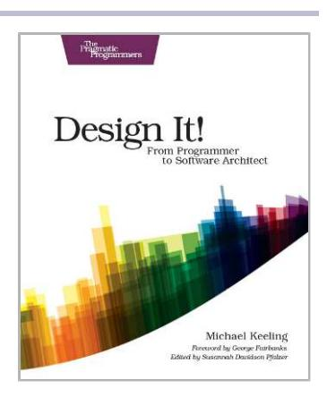
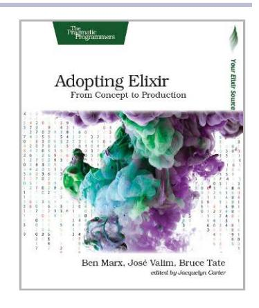
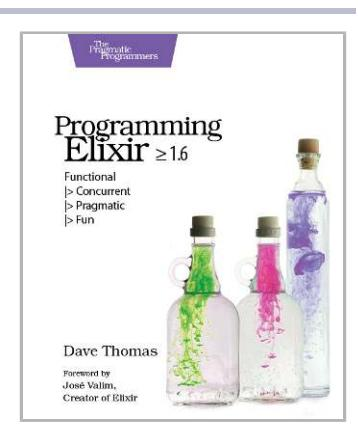
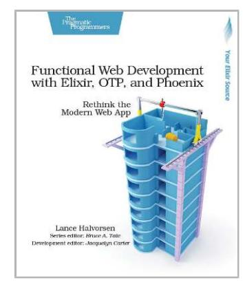
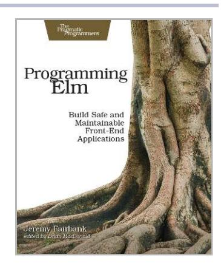
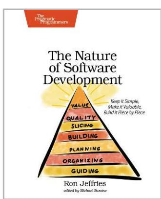

# Index

| SYMBOLS                                                                                                               | ing effects, 110                                                                                                                                                 | 96–104, 113–115, 229                                                                                           |
|-----------------------------------------------------------------------------------------------------------------------|------------------------------------------------------------------------------------------------------------------------------------------------------------------|----------------------------------------------------------------------------------------------------------------|
| / (forward slash), escaping, 99                                                                                       | for whistleblower, 108–                                                                                                                                          | model-view controller                                                                                          |
| Λ                                                                                                                     | 111                                                                                                                                                              | (MVC), 141, 145–147                                                                                            |
| A absence of change, catching, 197–200                                                                                | aliases, fractal value analysis and, 125, 130                                                                                                                    | package by component, 148–151                                                                               |
|                                                                                                                       | Amdahl's law, 160                                                                                                                                                | package by feature, 148- 151                                                                                |
| abstract syntax trees, 45                                                                                             | Android                                                                                                                                                          | problem domain vs. solu-                                                                                       |
| abstractions missing abstractions and\nincreases in complexi- ty, 195 missing abstractions and\ninvisible change cou- | refactoring with splinter pattern example, 58–61 temporary tests as safety net example, 64–67 Apache Tomcat complexity warning exercise, 209, 232 | tion domain, 118 serverless, 186 technically oriented, 118 understanding before rewriting, 144–147 |
| pling, 42                                                                                                             | API gateways, 169                                                                                                                                                | ASP.NET Core MVC                                                                                               |
| missing abstractions and                                                                                              | 0 •                                                                                                                                                              | about, xiv, 22                                                                                                 |
| proximity principle, 57                                                                                               | architectural boundaries architectural style and,                                                                                                                | change coupling analysis, 37–46, 49, 228                                                                       |
| problems with extracting duplication into                                                                             | 112                                                                                                                                                              | complexity trend analy-                                                                                        |
| shared, 51–54                                                                                                         | change and, 132                                                                                                                                                  | sis, 24–26, 28                                                                                                 |
| process abstractions, 114                                                                                             | as chunks, 118                                                                                                                                                   | duration of hotspots, 33                                                                                       |
| raising abstraction level                                                                                             | identifying, 96–100                                                                                                                                              | hotspot prioritizing exam-                                                                                     |
| to communicate better,                                                                                                | as logical components, 98                                                                                                                                        | ple, 22–23                                                                                                     |
| 95                                                                                                                    | microservices, 166                                                                                                                                               | hotspot visualization ex-                                                                                      |
| refactoring with chunk-                                                                                               | visualizations, 100                                                                                                                                              | ample, 19                                                                                                      |
| ing, 68                                                                                                               | architecture, see also architec-                                                                                                                                 | X-Ray analysis of                                                                                              |
| %ad flag, 75                                                                                                          | tural boundaries; microser-                                                                                                                                      | hotspots, 27–31                                                                                                |
| after flag, 64, 98, 129, 221-                                                                                         | vices; rewrites                                                                                                                                                  | assertions, encapsulating, 43                                                                                  |
| 222                                                                                                                   | as about choices, 117-                                                                                                                                           | attribution error, fundamen-                                                                                   |
| age, code, see code age                                                                                               | 119                                                                                                                                                              | tal, 24, 137                                                                                                   |
| aggregating                                                                                                           | analyzing subsystems,                                                                                                                                            | author date shortcut, 75                                                                                       |
| complexity trend analysis                                                                                             | 100–107                                                                                                                                                          | autogenerated content, exclud-                                                                                 |
| of microservices, 168                                                                                                 | bounded contexts, identi- fying, 152–154                                                                                                                      | ing, 76, 224                                                                                                   |
| contributions per reposi-                                                                                             | component-oriented,                                                                                                                                              | autonomy and microservices,                                                                                    |
| tory, 167–170                                                                                                         | 148–151, 162, 230                                                                                                                                                | 170                                                                                                            |
| exercise, 115, 230                                                                                                    | Conway's law, 117                                                                                                                                                |                                                                                                                |
| hotspots, 96, 108-111,                                                                                                | DCI paradigm, 150                                                                                                                                                |                                                                                                                |
| 222                                                                                                                   | function as a service 186                                                                                                                                        |                                                                                                                |

| B back end for front end (BFF) UI, 177 Baker, Brenda, 45 Bash calculating change fre quency, 17, 222 comparing hotspots across multiple reposi tories, 171 running Code Maat, 216 behavioral code analysis, see also change coupling analy sis; change frequency; complexity trend analysis; hotspots; X-Ray analysis | C C, change coupling analysis example, 47 C#, change coupling analysis exercise, 48, 228 case studies, about, xv The Challenger Launch Deci sion, 107 Challenger space shuttle, 107–108 change coupling, see al so change coupling analysis architecture-level, 144 criteria, 36 defined, 36 degree of coupling, 38 | layered architecture exam ple, 144–147 logical components, 99 power law distribution, 16 change patterns, see change coupling analysis chess, 68 chunks architectural boundaries as, 118 code age as, 80–82 data types as chunks, 70 refactoring with, 67–70 working memory and, 67, 93 Clean Architecture, 86 |
|--------------------------------------------------------------------------------------------------------------------------------------------------------------------------------------------------------------------------------------------------------------------------------------------------------------------------------------------------------------------|------------------------------------------------------------------------------------------------------------------------------------------------------------------------------------------------------------------------------------------------------------------------------------------------------------------------------------------------------------------|----------------------------------------------------------------------------------------------------------------------------------------------------------------------------------------------------------------------------------------------------------------------------------------------------------------------------------------------------------------|
| biases, 205 tools, xv uses, xi, 209 BFF (back end for front end)                                                                                                                                                                                                                                                                                          | encapsulation for, 43 invisible, 42 problems with extracting duplication into shared                                                                                                                                                                                                                                                                    | cloc about, 19 analyzing hotspots across                                                                                                                                                                                                                                                                                                                 |
| UI, 177 bias behavioral code analysis, 205 complexity trends, 26 fundamental attribution error, 24, 137 normalization of de viance, 107–108 organizational change and, 129                                                                                                                                                           | abstractions, 51–54 reasons for, 39 refactoring with proximity principle, 51–57 vs. temporal coupling, 37 change coupling analysis, 35– 50 automating proximity recommendations, 57 bounded contexts, 151– 154, 170                                                                                                                | multiple repositories, 167 commands, 223 measuring programming language sprawl, 182, 184 resources on, 223 summarizing change fre quencies of logical components, 99 tree maps, 21                                                                                                                                               |
| Blob classes, 191–192 bottlenecks component-based teams vs. feature-based teams, 118 coordination, 94, 111, 118, 132 identifying, xii, 12 boundaries, see architectural                                                                                                                                                                    | catching omissions, 49, 197–200, 228 with Code Maat, 40, 216 copy-paste code, 44–46 databases and rewrites, 155 degree of coupling, 38 exercises, 48–50, 162, 187, 228, 230, 232                                                                                                                                                         | visualizations with Code Maat example, 218 Clojure automating proximity recommendations exam ple, 56 code age example, 79 offboarding exercise, 210, 233                                                                                                                                                                               |
| boundaries; knowledge boundaries; operational boundaries bounded contexts identifying, 151–154 microservices, 170 sharing code across, 154 Brand, Stewart, 73 Brooks, Fred, xii, 94 Brown, Simon, 148 by-file option, 224                                                                                                            | language-neutral, 46 layered architecture exam ple, 144–147 method level (X-Ray analysis), 40–46, 49, 177, 228 microservices, 170, 173– 180 system-level, 104–106 time, 35, 40 using, 36–46 visualizations, 38, 40 change frequency calculating, 17, 222 identifying hotspots, 19 as interest rate proxy, 17        | Clone Digger, 45 clones change coupling analysis, 44–46, 49, 104–106, 228 copy-paste detectors, 45 exercise, 49, 228 prioritizing, 46 cochanging files, see change coupling; change coupling analysis code, see also code age; code ownership; duplication dead code as stable code, 86 deleted, 86, 159          |

| external and internal                 | code ownership                             | generic names and low                                      |
|---------------------------------------|--------------------------------------------|------------------------------------------------------------|
| protocols, 57                         | diffusion of responsibility                | cohesion, 62, 173                                          |
| identifying modified, 158             | and, 125–129                               | low cohesion as cause of                                   |
| as liability, 46                      | knowledge boundaries                       | hotspots, 32                                               |
| mental models, 7                      | and, 127                                   | microservices, 166                                         |
| ranking by diffusion, 122–123         | microservices, 180 new teams and shared | from package-level refac-                                  |
|                                       |                                            | toring, 86                                                 |
| untouchable, 32                       | responsibilities, 131– 133              | collaboration, technical                                   |
| code age, 73–89                       | onboarding and offboard-                   | sprawl and, 181–185                                        |
| calculating, 75, 223                  | ing, 200                                   | collaborative tools, limits of,                            |
| different rates in the                | rate of defects and, 121                   | 201                                                        |
| same package, 83                      | silos and, 126                             | commit messages                                            |
| Ebbinghaus forgetting                 | ,                                          | tagging all authors, 207                                   |
| curve, 77                             | Code ownership and software                | ticket identifiers in, 175                                 |
| exercises, 87–89, 229                 | quality, 127                               | commits, see also Git; ver-                                |
| generations, 76–78                    | code reviews                               | sion-control system                                        |
| human memory and, 74, 76–78        | broadening knowledge boundaries, 128       | calculating commit count                                   |
| isolating code into li-               | comparing hotspots                         | per developer, 120,                                        |
| braries and packages,                 | across multiple reposi-                    | 122, 129                                                   |
| 79–82                                 | tories, 172                                | grouping with logical                                      |
| knowledge loss, 205                   | fatigue, 161                               | change sets, 175                                           |
| median code age exercise,             | fractal value analysis,                    | squash, 206                                                |
| 89, 229 refactoring package        | 124                                        | using commit messages, 175, 207                            |
| structure, 82–86                      | gatekeeper, 161                            | common closure principle, 86                               |
| risk and, 78                          | hotspots use, 32                           | The commons dilemma, 126                                   |
| stabilizing code by, 73–76            | microservices, 170                         |                                                            |
| test cases, 79                        | social loafing and, 136                    | communication, see also bot-                               |
| uses, 73                              | code similarity, see al-                   | tlenecks                                                   |
| visualizations, 80                    | so clones; duplication                     | coffee breaks, 138                                         |
| warning signs, 83                     | copy-paste code, 44–46                     | Conway's law, 117                                          |
| code coverage, 66                     | identifying bounded con-                   | distance and, 200                                          |
| 9                                     | texts, 153                                 | ease of, 118, 200                                          |
| Code Maat                             | CodeScene                                  | of goals, 135, 138 knowledge boundaries,                |
| about, xv, 215                        | about, xv                                  | 128                                                        |
| analyzing on team level,              | change coupling in UI ex-                  | microservices, 173                                         |
| 217                                   | ample, 177–178                             | motivation loss and, 135                                   |
| change coupling analysis,             | code age map, 80                           | with nontechnical man-                                     |
| 40, 216                               | complexity trend analy-                    | agers, 95, 111                                             |
| code age analysis, 76                 | sis, 26                                    | onboarding and offboard-                                   |
| fractal value analysis, 122        | excluding autogenerated content, 76        | ing, 200                                                   |
| knowledge maps, 217                   | future features, 224                       | process loss and, 125                                      |
| mapping folders to logical            | mapping folders to logical                 | system size and increase                                   |
| components with regu-                 | components with glob                       | in challenges, 94                                          |
| lar expressions, 99,                  | patterns, 99                               | communities                                                |
| 216 operational boundaries,           | restricting data by date,                  | identifying exercise, 187, 232                             |
| analyzing, 130                        | team knowledge maps,                       | programming language                                       |
| running architectural                 | 158                                        | as, 185                                                    |
| analyses, 216 saving transformations, | coffee breaks, 138                         | A Comparative Analysis of the                              |
| 217                                   | Cognitive Psychology, 8                    | Efficiency of Change Metrics and Static Code Attributes |
| social analysis algo-                 | cohesion bounded contexts, 151          | for Defect Prediction, 18                                  |
| rithms, 120                           | control coupling, 30                       | complexity, see also complex-                              |
| using, 215–219                        | feature-based teams and                    | ity trend analysis                                         |
| visualizations, 217                   | low in-group, 159                          | cyclomatic, 18, 85, 104, 191                               |
|                                       |                                            |                                                            |

| decision to rewrite archi-                   | consistency, 147, 149                                   | CSV                                               |
|----------------------------------------------|---------------------------------------------------------|---------------------------------------------------|
| tecture, 143                                 | contexts, bounded,                                      | Code Maat results, 216                            |
| indentation-based com-                       | see bounded contexts                                    | generating in cloc, $224$                         |
| plexity, 25                                  | continuous integration                                  | csv option, 224                                   |
| of large systems, 96, 195                    | change coupling to catch                                | cyclomatic complexity                             |
| layered architecture, 146                    | omissions, 199                                          | about, 18                                         |
| metrics, 18                                  | complexity warnings, 195                                | code age, 85                                      |
| understanding, 25 warnings, 193–195, 209, | contributors, see developers                            | conditionals, 104                                 |
| 232                                          | control coupling, 30                                    | creation of code and, 191                         |
| weighted method complex-                     | Conway's law, 117, 134                                  | defined, 85                                       |
| ity, 192–195                                 | coordination                                            | D                                                 |
| complexity trend analysis                    | bottlenecks, 94, 111,                                   | D3 library                                        |
| architectural hotspots,                      | 118, 132                                                | Code Maat visualizations,                         |
| 101–104                                      | Conway's law and knowl-                                 | 218                                               |
| biases, 26                                   | edge maps, 134                                          | hierarchical edge bundle,                         |
| code age and, 85                             | gaps and defect rate, 118                               | 38                                                |
| with CodeScene, 26                           | layered architecture, 144                               | tree maps, 21                                     |
| communicating with                           | mapping, 12                                             | data                                              |
| nontechnical man-                            | measuring coordination                                  | cleaning for rising                               |
| agers, 111 exercises, 34, 209, 227,       | needs, 119–125                                          | hotspots, 197                                     |
| 232                                          | minimizing, 118 modularity and, 95                   | cleaning for technical                            |
| hotspots, 24–26, 28, 57,                     | number of contributors                                  | sprawl index, 184                                 |
| 85, 101–104                                  | and, 121                                                | cleaning to avoid bias,                           |
| identifying steep increas-                   | operational boundaries,                                 | 206                                               |
| es in complexity, 192–                       | 129–133                                                 | cleaning with cloc, 224                           |
| 195                                          | process loss and, 125                                   | data types as chunks, 70 encapsulating test data, |
| importance of, 111                           | ranking by diffusion,                                   | 43                                                |
| method level (X-Ray                          | 122–123                                                 | minimum needed for                                |
| analysis), 28                                | rewrites and, 142                                       | analysis, 206                                     |
| microservices, 168                           | team size and, 136                                      | removing blank lines, 17,                         |
| output, 222 as whistleblower, 108–        | technically oriented archi- tecture and, 118         | 221                                               |
| 111                                          | ,                                                       | restricting by date, 64,                          |
| component, package by, 148–                  | Coordination Breakdowns and                             | 98, 129, 196, 221                                 |
| 151                                          | Their Impact on Develop- ment Productivity and Soft- | version-control system as                         |
| component-based teams vs.                    | ware Failures, 118                                      | source, xiv, 10–13                                |
| feature-based teams, 118                     | copy-paste code                                         | data, context, and interaction                    |
| component-oriented architec-                 | bias in, 206                                            | (DCI) paradigm, 150                               |
| ture, 148–151, 162, 230                      | bugs by omission, 197                                   | databases, rewrites and, 155                      |
| components, logical, see logi-               | change coupling analysis,                               | date                                              |
| cal components                               | 44-46                                                   | author date shortcut, 75                          |
| composite UI, 177                            | detectors, 45                                           | calculating code age, 75 modification date, 75    |
| conditionals                                 | prioritizing, 46                                        | short output option, 75                           |
| code clones and, 105                         | count HEAD flag, 222                                    | specifying in version-con-                        |
| complexity warnings, 195                     | coupling, <i>see also</i> change                        | trol system, 64, 98,                              |
| control coupling, 30                         | coupling                                                | 129, 196, 221                                     |
| cyclomatic complexity,                       | control, 30                                             | starting analyses with                            |
| 104                                          | temporal, 37                                            | significant dates, 129                            |
| conflicts, group, 134, 137,                  | coupling argument, 216                                  | date=short option, 75                             |
| 170                                          | Craft.Net, refactoring with                             | DCI (data, context, and inter-                    |
| congruence, 118                              | chunking example, 68–70                                 | action) paradigm, 150                             |
| conservation of familiarity,                 | cross-organizational groups,                            | DDD (domain-driven design)                        |
| 180                                          | 174                                                     | and bounded contexts, 151                         |
| Considering an Organization's                |                                                         | dead code, 86                                     |
| Memoru, 200                                  |                                                         | debt. see technical debt                          |

| decision log, 4                                 | Do System Test Cases Grow                               | enclosure diagrams                            |
|-------------------------------------------------|---------------------------------------------------------|-----------------------------------------------|
| decoupling, testing by delet                    | Old?, 79                                                | about, 19                                     |
| ing features, 150                               | Docker exercise, 33, 227                                | code age map, 80                              |
| deletion test, 150                              | documentation, architectural                            | with Code Maat, 218                           |
| dependencies                                    | boundaries, 96                                          | fractal value analysis of                     |
| dependency wheels, 40                           | Does Measuring Code Change                              | author contributions,                         |
| detecting implicit in mi                        | Improve Fault Prediction?,                              | 122                                           |
| croservices, xii, 175,                          | 18                                                      | end-to-end tests, 65–67                       |
| 179                                             | domain                                                  | Entity Framework Core,                        |
| interteam and microser                          | problem domain vs. solu                                 | refactoring example, 52–55                    |
| vices, 179                                      | tion domain, 118                                        | Erlang                                        |
| refactoring with splinter                       | users and understanding                                 | architectural hotspot ex                      |
| pattern, 62                                     | problem domain, 157                                     | ercise, 114, 229                              |
| standardizing for mi                            | Domain-Driven Design, 151,                              | change coupling analysis                      |
| croservices, 181                                | 154                                                     | example, 46                                   |
| dependency wheels, 40                           | domain-driven design (DDD)                              | processes, 114                                |
| developers, see also knowl                      | and bounded contexts, 151                               | escaping, forward slash (/), 99               |
| edge maps; operational                          | Don't Touch My Code, 121,                               | Evans, Eric, 154                              |
| boundaries; team organiza                       | 127                                                     | evolutionary patterns, detect                 |
| tion                                            | duplication                                             | ing deviating, 189–197                        |
| accuracy of data, 206                           | clones, 44–46, 49, 104–                                 | exclude option, 76                            |
| aliases and fractal value                       | 106, 228                                                | exclude-dir option, 224                       |
| analysis, 125, 130                              | control coupling, 30                                    | excluding                                     |
| calculating commit count per, 120, 122, 129  | copy-paste code, 44–46,                                 | autogenerated content,                        |
| calculating number of,                          | 197, 206                                                | 76, 224                                       |
| 94, 120, 223                                    | invisible change coupling,                              | by path, 100                                  |
| as data factor, 11                              | 42                                                      | data with cloc, 224                           |
| defects and number of,                          | problems with extracting                                | deleted code in knowl                         |
| 124, 127                                        | into shared abstrac                                     | edge maps, 159                                |
| fractal value analysis,                         | tions, 51–54                                            | exercises                                     |
| 122–123                                         | refactoring with proximity                              | architecture-level, 113–                      |
| fragmentation, handling,                        | principle, 51–57                                        | 115, 229                                      |
| 124–125                                         | refactoring with splinter pattern, 62                | change coupling analysis,                     |
| fragmentation, identify                         |                                                         | 48–50, 162, 187, 228,                         |
| ing, 122                                        | E                                                       | 230, 232                                      |
| identifying experts, 200,                       | Ebbinghaus forgetting curve,                            | code age, 87–89, 229                          |
| 210, 233                                        | 77, 93                                                  | complexity trend analy                        |
| mental models, 7 power law distribution,     | Ebbinghaus, Hermann, 77                                 | sis, 34, 209, 227, 232                        |
| 202                                             |                                                         | component-oriented archi tecture, 162, 230 |
| recognizing efforts, 136                        | Efficient randomized pattern matching algorithms, 45 | hotspots, 33–34, 113–                         |
| development silos, 126, 172,                    |                                                         | 115, 188, 227, 229,                           |
| 204                                             | egrep, 17, 221                                          | 232                                           |
|                                                 | Empear, xv                                              | links for, xiii                               |
| deviance, normalization of, 107–108          | An Empirical Study of Speed                             | microservices, 187–188,                       |
|                                                 | and Communication in                                    | 232                                           |
| diff, X-Ray analysis, 28                        | Globally Distributed Soft                               | predictive and proactive                      |
| diffusion, ranking code by,                     | ware Development, 200                                   | analyses, 209, 232                            |
| 122–123                                         | An Empirical Study on Devel                             | rewrites, 162, 230                            |
| diffusion of responsibility                     | oper Related Factors Charac                             | X-Ray analysis, 49, 162,                      |
| code ownership and,                             | terizing Fix-Inducing Com                               | 228, 230                                      |
| 125–129                                         | mits, 9                                                 | Experiment on the Automatic                   |
| feature-based teams, 160 social loafing, 135 | encapsulation                                           | Detection of Function Clones                  |
|                                                 | for change coupling, 43                                 | in a Software System Using                    |
| divide and conquer strategy, 96–100          | code clones, 106 control coupling, 30                | Metrics, 46                                   |
|                                                 | mocks, 31                                               |                                               |
|                                                 |                                                         |                                               |

| experts, identifying, 200, 210, 233                 | forensic hotspots, 207, see also hotspots                   | code age, calculating, 75, 223                             |
|--------------------------------------------------------|----------------------------------------------------------------|---------------------------------------------------------------|
| external protocols, 57 Extract Method, 70           | forgetting curve, Ebbinghaus, 77, 93                        | Code Maat, running, 216 commands, 221–223                  |
| The eyes have it, 201                                  | format option, 17, 75                                          | commit count per contrib utor, calculating, 120,           |
| F                                                      | forward slash (/), escaping, 99 Fractal Figures, 122, 124   | 122, 129                                                      |
| familiarity, conservation of, 180                   | fractal value analysis aliases and, 125, 130                | complexity warnings, 193–195 contributors, calculating  |
| Feathers, Michael, 4                                   | ranking code by diffu                                          | number of, 94, 120,                                           |
| feature-based teams                                    | sion, 122–123                                                  | 223                                                           |
| cautions, 155–161 vs. component-based teams, 118 | study on number of de fects, 124 technical sprawl index, | coordination, measuring, 120 detecting future hotspots, |
| features                                               | 184                                                            | 195–197                                                       |
| DCI paradigm, 150 fractal value analysis and        | fractal value formula, 122, 184                             | excluding autogenerated content, 76                        |
| new, 124 package by feature, 148–                   | fragmentation, developer handling, 124–125                  | excluding by path, 100 fractal value analysis,             |
| 151 removing obsolete fea                           | identifying, 122 function as a service architec             | 122, 125, 129–130 hotspot exercise, 188, 232            |
| tures during rewrites, 143                          | ture, 186 functions and methods, see                        | hotspots across multiple repositories, compar              |
| testing decoupling by deleting features, 150        | also proximity principle; X                                    | ing, 170–173                                                  |
| feedback loops, feature-based teams, 159            | Ray analysis refactoring with code age, 81               | hotspots in multiple repositories, analyzing, 165–170   |
| files                                                  | refactoring with splinter                                      | hotspots, aggregating,                                        |
| enclosure diagrams, 20                                 | pattern, 60–62                                                 | 96, 222                                                       |
| file-level analysis of team contributions and coor  | specifying by lines of code, 104, 222                       | hotspots, identifying, 19– 23, 221                         |
| dination, 132                                          | weighted method complex                                        | knowledge loss, measur                                        |
| generating lines of code by file, 224               | ity, 192–195                                                   | ing, 202, 223                                                 |
| names and analyzing                                    | fundamental attribution er ror, 24, 137                     | knowledge maps, creat ing, 157                             |
| change on architectural                                |                                                                | logical change sets, 175                                      |
| level, 145 using name prefixes                      | G                                                              | offboarding exercise, 210, 233                             |
| when analyzing across                                  | gatekeepers, 160 geographical offender profile,             | operational boundaries,                                       |
| multiple repositories, 170, 175                     | 207                                                            | analyzing, 129                                                |
| virtual root, 170, 175                                 | Gestalt psychology, 54                                         | pre-commit hooks, 195, 199                                 |
| filters, component-oriented                            | Git                                                            | programming-language                                          |
| architecture, 148                                      | aliases, removing, 125, 130                                 | sprawl, measuring, 182, 184                                |
| find command, 120                                      | architectural boundaries,                                      | removing empty lines,                                         |
| folders calculating number of                       | identifying, 97–100                                            | 17, 221                                                       |
| contributors to, 223                                   | author distribution, 202 change coupling across             | resources on, 222 restricting data by date,                |
| enclosure diagrams, 19 mapping architectural        | multiple repositories,                                         | 64, 98, 129, 196, 221                                         |
| boundaries, 98                                         | 173–180 change coupling analysis,                           | specifying revisions by                                       |
| mapping logical compo                                  | 36–46, 173–180, 199                                            | lines of code, 104, 222 subsystems, running                |
| nents, 98, 216, 222 measuring coordination,         | change coupling to catch                                       | analyses on, 221                                              |
| 120                                                    | omissions, 199 change frequency, calcu                      | temporary migrations to, xii                               |
|                                                        | lating, 17, 222                                                |                                                               |

| tree maps, 21 X-Ray analysis tips, 104, 222 Git Version Control Cookbook, 17 GitHub, case studies hosting,                                                                                                                                                                                                                                     | file-level analysis vs. method-level, 27 forensic, 207 identifying, 19–23, 221 knowledge loss, 205 largest, 189–197 layered architecture exam-                                                                                                                                                                                  | isolation countering, 134–138\nisolating code by age, 79– 82 microservices, 186  J                                                                                                                                                                                                                                                                                                         |
|------------------------------------------------------------------------------------------------------------------------------------------------------------------------------------------------------------------------------------------------------------------------------------------------------------------------------------------------|---------------------------------------------------------------------------------------------------------------------------------------------------------------------------------------------------------------------------------------------------------------------------------------------------------------------------------------------------|--------------------------------------------------------------------------------------------------------------------------------------------------------------------------------------------------------------------------------------------------------------------------------------------------------------------------------------------------------------------------------------------|
| glob patterns, 99 goals avoiding team conflicts, 138 motivation loss and, 135 Google, see TensorFlow examples grep, 222 -group option, 217 group conflicts, 134, 137, 170 Group Process and Productivity, 125 Group Process                                                                                                                    | ple, 144–147 microservices, analyzing, 165–170 microservices, comparing in, 170–173 ranking rising, 196 refactoring package structure with code age, 82–86 refactoring with chunking, 67–70 refactoring with splinter pattern, 57–64 splitting along responsibilities, 60                                                                         | Java clone detectors, 45 running Code Maat, 215 JSON, generating for visualizations with Code Maat, 218  K knowledge boundaries, see also knowledge maps; knowledge sharing avoiding team conflicts, 138 broadening, 128 code ownership and, 127                                                                                                                                           |
| Group Process, Group Decision, Group Action, 138 Growing Object-Oriented Software, Guided by Tests, 31  H Halstead complexity measures, 18, see also complexity Hamano, Junio, 233 Hickey, Rich, 210, 233 hierarchical edge bundle, 38 hooks, pre-commit, 195, 199 hotspots about, 15 aggregating, 96, 108– 111, 222 aggregating with complex- | subsystems, analyzing, 100–107 temporary tests as safety net, 64–67\nuses, 31 visualizations, 19–21, 111, 219 working with untouchable code, 32 X-Ray analysis, 27–31, 114, 229 How Buildings Learn, 73 human memory, see memory, human  I\nignorant surgery, 78\nimmutable design and code                                                       | knowledge loss, 204 onboarding and offboarding, 200 vs. operational boundaries, 128 vs. parallel development, 10 technical sprawl and, 182 knowledge loss, 202–205, 223 knowledge maps, see also knowledge boundaries; knowledge sharing analyzing on team level with Code Maat, 217 building, 157–159, 217\nidentifying experts, 200 limits of Conway's law, 134 performance reviews and, |
| ity trend analysis for whistleblower, 108–111 architectural, 96–104, 113–115, 144–147, 229 audiences, 32 causes, 32, 57 code ownership and, 126 complexity trend analysis, 24–26, 28, 57, 85, 101–104 defined, 19 detecting future, 195–197 duration of, 33 evolution, 111 exercises, 33–34, 113–115, 188, 227, 229, 232                       | ownership and, 126 Implementation Patterns, 69\nindentation-based complexity, 25\nindex, technical sprawl, 183–185 The Influence of Organizational Structure on Software Quality, 9, 119\nintegration tests, team contributions and coordination, 132\ninterest rate, technical debt measuring, 15–19\nunderstanding, 4–5\ninternal protocols, 57 | 137, 211\nunderstanding, 11\nuses, 156–157 knowledge sharing, see also knowledge boundaries; knowledge maps avoiding team conflicts, 138 code ownership and, 128 rotating teams, 10 technical sprawl and, 181–185                                                                                                                                                                          |

| Kotlin knowledge map example, 201                                                                                                                                                                                                                                         | measuring programming language sprawl, 182, 184                                                                                                                                                                                                                | complexity trend analysis as whistleblower, 108– 111                                                                                                                                                                                                                                 |
|---------------------------------------------------------------------------------------------------------------------------------------------------------------------------------------------------------------------------------------------------------------------------------|----------------------------------------------------------------------------------------------------------------------------------------------------------------------------------------------------------------------------------------------------------------------|--------------------------------------------------------------------------------------------------------------------------------------------------------------------------------------------------------------------------------------------------------------------------------------------|
| power law distribution, 202                                                                                                                                                                                                                                                  | specifying revisions by, 104, 222                                                                                                                                                                                                                                 | defining in microservices, 166                                                                                                                                                                                                                                                          |
| Kubernetes locating experts exercise, 210, 233 L                                                                                                                                                                                                                          | summarizing change fre quencies of logical components, 99 visualizations with Code                                                                                                                                                                          | mapping subfolders to, 98, 216, 222 technical sprawl and knowledge loss, 205                                                                                                                                                                                                      |
| -L option, 104, 222                                                                                                                                                                                                                                                             | Maat example, 218 Lint, 62                                                                                                                                                                                                                                        | visualizations, 111                                                                                                                                                                                                                                                                        |
| languages, programming change coupling analysis, 46                                                                                                                                                                                                                       | Linux and the Unix Philoso phy, 185                                                                                                                                                                                                                               | M .mailmap, 125, 130                                                                                                                                                                                                                                                                    |
| community and, 185 power of language-neu tral analyses, 46 separating mixed for splinter refactoring, 61 technical sprawl and, 181–185 using polyglot as deliber ate choice, 183 layered architecture flexibility, 147 identifying bounded con | Linux kernel about, xiv aggregating hotspots and complexity trend analy sis for whistleblower, 108–111 analyzing subsystem ex amples, 100–107, 221 architectural hotspots example, 96–100 architectural hotspots exercise, 114, 229 | maintainability code coverage warning signs, 66 end-to-end tests, 66 feature-based teams, 160 layered architecture, 144 predicting problems with increases in complexi ty, 193 Making Software, 18 McCabe cyclomatic complexi ty, 18, see also cyclomatic |
| texts, 152–154 separation of concerns, 146 understanding before rewriting, 144–147                                                                                                                                                                                  | coordination example, 120–125 fractal value analysis ex ample, 122–123 number of contributors, 94, 124                                                                                                                                                | complexity median code age, 89, 229 memory, human chunks and working memory, 67, 93                                                                                                                                                                                            |
| Lean Architecture for Agile Software Development, 150 legacy code defined, 4 quality of code and priori tizing hotspots, 22 from rewrites, 142                                                                                                                | system-level refactoring example, 94–107 visualizing architectural boundaries, 100 loafing, social, 135 log                                                                                                                                           | code age and, 74, 76–78 decision log, 4 difficulty of programming and, 93 Ebbinghaus forgetting curve, 77, 93 schemas, 8, 77                                                                                                                                             |
| vs. technical debt, 4                                                                                                                                                                                                                                                           | calculating change fre                                                                                                                                                                                                                                               | mental models of code, 7                                                                                                                                                                                                                                                                   |
| Lehman, Manny, 180 Lehman's laws, 180                                                                                                                                                                                                                                        | quency, 17 calculating code age, 75,                                                                                                                                                                                                                              | messages, commit, see com mit messages                                                                                                                                                                                                                                                  |
| libraries hotspot analysis on, 32 isolating code by age, 79– 82                                                                                                                                                                                                        | 223 identifying architectural boundaries, 97–100 summarizing data with shortlog, 120                                                                                                                                                                     | methods, see functions and methods; proximity princi ple; X-Ray analysis microservices                                                                                                                                                                                            |
| lines, removing blank lines                                                                                                                                                                                                                                                     | tree maps, 21                                                                                                                                                                                                                                                        | about, 165                                                                                                                                                                                                                                                                                 |
| from data, 17, 221 lines of code analyzing hotspots across multiple repositories, 167 cloc commands, 19, 223 as complexity metric, 18 complexity of large sys tems, 96 identifying hotspots, 19 knowledge maps, 157                               | log, decision, 4 logical change sets, 175 logical components architectural boundaries as, 98 change frequencies, summarizing, 99 change patterns on archi tectural level, identify ing, 144–147, 216                                      | avoiding conflicts with UI, 176–178 change coupling, 170, 173–180 cohesion, 166 collapsing, 180 complexity trend analy sis, 168 consistency, 148 dependencies, detecting implicit, xii, 175, 179 exercises, 187–188, 232                                  |

| refactoring with splinter knowledge maps, 157 size and increase in chal pattern, 60–61 raising abstraction level lenges, 94 motivation loss to communicate with, vs. technical issues, 7 countering, 135–137, 182 95 P feature-based teams, 159 visualizations and, xii, package by component, 148– process loss and, 125 111 from rewrites, 143 151 nopCommerce package by feature, 148–151 Mozilla, 124 change coupling exercise, 162, 230 MusicStore example of lay packages identifying bounded con ered architecture, 144–147 isolating code by age, 79– texts example, 152–154 82 normalization of deviance, 107–108 | hotspots, analyzing, 165– MVC (model-view controller) North, Dan, 76 170 architecture numstat option, 157 hotspots, comparing, change patterns of lay 170–173 O ered architecture exam ple, 145–147 organizing by higher-level object roles, 150 concepts, 179 difficulties changing, 141 Ochsenreither, Simon, 203– ownership, 180 The Mythical Man-Month, 94 204 shotgun surgery, 178 offboarding, 200–205, 210, N size, 166 233 splitting, 170 names omissions, catching, 49, 197– standardizing ecosystem, aliases and fractal value 200, 228 181 analysis, 125, 130 team organization, 170, On Finding Duplication and chunking by code age, 174, 179 Near-Duplication in Large 81, 88, 229 technical sprawl, 180– Software Systems, 45–46 file names and analyzing 185 change on architectural On Understanding Laws, Evo warning signs, 166 level, 145 lution, and Conservation in Microsoft, coordination re generic names and low the Large-Program Life Cy search, 119, see al cohesion, 62, 173 cle, 180 so ASP.NET Core MVC glob patterns, 99 onboarding, 200–205 logical components, 98, middleware, publish-sub open source collaboration 216 scribe, 186 code ownership and, 127 operational boundaries, Mining Version Histories to organization issues and analyzing, 129 Guide Software Changes, defects, 9 provisional tests, 66 47 operational boundaries refactoring with chunk analyzing, 129–133 The Mirroring Hypothesis, 128 ing, 68 change coupling in mi mob programming, bias in refactoring with splinter croservices, 174 analyses, 207 pattern, 62 component-oriented archi mock objects, problems with, using prefixes when ana tecture, 148 30 lyzing across multiple Conway's law and knowl repositories, 170, 175 model-view controller (MVC) edge maps, 134 architecture NDepend, 61 DCI paradigm, 150 change patterns of lay .NET focusing on team-level ered architecture exam clone detectors, 45 metrics, 207 ple, 145–147 examples, 189–197 vs. knowledge bound difficulties changing, 141 No Silver Bullet, xii aries, 128 modularity knowledge maps, 156– nontechnical managers aligning boundaries with 161 communication with, 95, responsibilities, 118 111 organizational issues, see al coordination and, 95 fractal value analysis, so team organization modules 124 knowledge distribution, chunking by code age, hotspot analysis of mi 10 81, 86 croservices, 173 predictors of defects, 9 |
|----------------------------------------------------------------------------------------------------------------------------------------------------------------------------------------------------------------------------------------------------------------------------------------------------------------------------------------------------------------------------------------------------------------------------------------------------------------------------------------------------------------------------------------------------------------------------------------------------------------------------------------------------------------------------------------------------------------------------|---------------------------------------------------------------------------------------------------------------------------------------------------------------------------------------------------------------------------------------------------------------------------------------------------------------------------------------------------------------------------------------------------------------------------------------------------------------------------------------------------------------------------------------------------------------------------------------------------------------------------------------------------------------------------------------------------------------------------------------------------------------------------------------------------------------------------------------------------------------------------------------------------------------------------------------------------------------------------------------------------------------------------------------------------------------------------------------------------------------------------------------------------------------------------------------------------------------------------------------------------------------------------------------------------------------------------------------------------------------------------------------------------------------------------------------------------------------------------------------------------------------------------------------------------------------------------------------------------------------------------------------------------------------------------------------------------------------------------------------------------------------------------------------------------------------------------------------------------------------------------------------------------------------------------------------------------------------------------------------------------------------------------------------------------------------------------------------------------------------------------------------------------------------------------------------------------------------------------------------------------------------------------------------------------------------------------------------------------------------------------------------------------------------------------------------------------------------------------------------------------------------------------------------------------------------------------------------------------------------------------------------------------------------------------------------------------------------------------------------------------------------------------------------------------------------------------------------------|
|----------------------------------------------------------------------------------------------------------------------------------------------------------------------------------------------------------------------------------------------------------------------------------------------------------------------------------------------------------------------------------------------------------------------------------------------------------------------------------------------------------------------------------------------------------------------------------------------------------------------------------------------------------------------------------------------------------------------------|---------------------------------------------------------------------------------------------------------------------------------------------------------------------------------------------------------------------------------------------------------------------------------------------------------------------------------------------------------------------------------------------------------------------------------------------------------------------------------------------------------------------------------------------------------------------------------------------------------------------------------------------------------------------------------------------------------------------------------------------------------------------------------------------------------------------------------------------------------------------------------------------------------------------------------------------------------------------------------------------------------------------------------------------------------------------------------------------------------------------------------------------------------------------------------------------------------------------------------------------------------------------------------------------------------------------------------------------------------------------------------------------------------------------------------------------------------------------------------------------------------------------------------------------------------------------------------------------------------------------------------------------------------------------------------------------------------------------------------------------------------------------------------------------------------------------------------------------------------------------------------------------------------------------------------------------------------------------------------------------------------------------------------------------------------------------------------------------------------------------------------------------------------------------------------------------------------------------------------------------------------------------------------------------------------------------------------------------------------------------------------------------------------------------------------------------------------------------------------------------------------------------------------------------------------------------------------------------------------------------------------------------------------------------------------------------------------------------------------------------------------------------------------------------------------------------------------------------|

| packaging to reduce dependencies in microservices, 178 refactoring by code age, 73–89 pair programming, bias in analyses, 139, 207\nparallel development bias in analyses, 207 conflict with refactoring, 59 coordination example, 120–125 development congestion, 8\neffect on quality, 9 file-level analysis of team                                                                                                                                                                                                           | predictive analyses catching absence of change, 197–200 detecting evolutionary patterns, 189–197 detecting future hotspots, 195–197\nexercises, 209, 232\nincreases in complexity, 192–195 privatization, diffusion of responsibility and, 126 proactive analyses\nexercises, 209, 232 onboarding and offboarding, 200–205, 210, 233                                                                                                                                                                                                                                      | quality of code cautions about judging in retrospect, 24 code ownership and, 121, 127 legacy code and prioritiz-\ning hotspots, 22 normalization of de- viance, 107-108 organizational factors, 9\nparallel development, 9 support for change, 35 test code, 43quiet option, 223                                                                                                                                                                                                                                        |
|----------------------------------------------------------------------------------------------------------------------------------------------------------------------------------------------------------------------------------------------------------------------------------------------------------------------------------------------------------------------------------------------------------------------------------------------------------------------------------------------------------------------------------|---------------------------------------------------------------------------------------------------------------------------------------------------------------------------------------------------------------------------------------------------------------------------------------------------------------------------------------------------------------------------------------------------------------------------------------------------------------------------------------------------------------------------------------------------------------------------|-------------------------------------------------------------------------------------------------------------------------------------------------------------------------------------------------------------------------------------------------------------------------------------------------------------------------------------------------------------------------------------------------------------------------------------------------------------------------------------------------------------------------|
| contributions and coordination, 132 fractal value analysis, 124, 130 vs. knowledge distribution, 10 limiting analysis by date, 223 mapping, 12 Parnas, David, 78 peer reviews, 9 performance evaluation cautions about judging code in retrospect, 24 cautions about knowledge maps, 137, 211 general cautions, 211–214 peer reviews, 9 Phillips, Paul, 203–204 PhpSpreadsheet architectural hotspot exercise, 115, 230 change coupling exercise, 162, 231 pipes, component-oriented architecture, 148 play, prototyping as, 182 | problem domain vs. solution domain, 118\nusers and understanding, 157 process loss, 125, 159 processes, Erlang, 114 Processing, visualizations with, 218 Production-Ready Microservices, 170, 181 productivity\ncongruence and, 118 process loss and, 125 programming, difficulty of, 93–96 protocols and coupling, 179– 180 prototyping as play, 182 provisional tests, 64–67 proximity principle automating recommendations, 56 Gestalt psychology, 54 logical change sets, 175 refactoring with, 51–57 refactoring with splinter pattern, 60 publish-subscribe middle- | Rabin–Karp algorithm, 45 Rails calculating change frequency example, 17 calculating code age example, 75 complexity analysis exercise, 34, 227 readability as economical, 8\nindentation, 25 for maintenance, 7 Reading Beside the Lines, 25 reckless debt, 4 recognition, social loafing and, 136 refactoring, 51–71, see also rewrites about, xii architectural hotspots, 96–104 by code age, 73–89 with chunking, 67–70 conflict with parallel development, 59 control coupling, 30 databases, 155 DCI paradigm, 150 |
| PMD, 61 power law distribution developers, 202 prioritizing with, 16 splinter modules, 64 The Pragmatic Programmer, 37 pre-commit hooks, 195, 199 Predicting fault incidence using software change history,                                                                                                                                                                                                                                                                                                                      | ware, 186  Python clone detectors, 45 complexity trend analysis script, 26 refactoring package structure with code age\nexample, 82–86 version, 218 visualizations with Code                                                                                                                                                                                                                                                                                                                                                                                              | package structure with code age, 82–86 proximity principle, 51–57 resources on, 58 with splinter pattern, 57–64, 81, 124 system-level example, 94–107 temporary tests as safety net, 64–67                                                                                                                                                                                                                                                                                                                              |

| tracking effects with ag-                                                                                                           | rotating, 10                                                                                                              | S                                                                                                                                                         |
|-------------------------------------------------------------------------------------------------------------------------------------|---------------------------------------------------------------------------------------------------------------------------|-----------------------------------------------------------------------------------------------------------------------------------------------------------|
| gregated trends, 110 tracking effects with complexity trend analy- sis, 227                                                | social loafing, 135 splitting hotspots along, 60 symmetry between organi-                                        | -s option, 120, 122, 129 Scala example of knowledge loss, 203–204                                                                                   |
| Refactoring Databases, 155                                                                                                          | zation and design, 131                                                                                                    | schemas, 8, 77                                                                                                                                            |
| Refactoring for Software De-                                                                                                        | rev-list, 167, 222                                                                                                        | Secure open source collabora- tion, 9, 124                                                                                                             |
| sign Smells, 58                                                                                                                     | reviews, code, <i>see</i> code re- views                                                                               | security, number of develop-                                                                                                                              |
| Refactoring: Improving the Design of Existing Code,                                                                              | revisions, 218                                                                                                            | ers and, 124                                                                                                                                              |
| 58, 63, 178                                                                                                                         | rewrites, see also refactoring                                                                                            | sed, 171                                                                                                                                                  |
| Reflective Practitioner, 169                                                                                                        | databases and, 155                                                                                                        | Selenium, 65                                                                                                                                              |
| regular expressions, mapping folders to logical compo-                                                                              | DCI paradigm, 150 exercises, 162, 230                                                                                     | separation of concerns, lay- ered architecture, 146                                                                                                    |
| nents, 99, 216                                                                                                                      | identifying bounded con- texts, 151–154                                                                                | serverless architecture, 186                                                                                                                              |
| replacement systems, see rewrites                                                                                                | need for, 141–144 package by compo-                                                                                    | shells, running Code Maat, 216                                                                                                                         |
| report-file option, 224                                                                                                             | nent/feature, 148–151                                                                                                     | shortlog                                                                                                                                                  |
| repositories, multiple aggregating contributions per repository, 167–170 analyzing hotspots in, 165–170 bias of copy-past reposito- | removing obsolete fea- tures, 143 trade-offs, 142–144 understanding layers of architecture before, 144–147 | analyzing operational boundaries, 129 author distribution, 202 calculating number of contributors, 94, 223 coordination, measuring, 120 |
| ries, 206                                                                                                                           | Ringelmann effect, 135                                                                                                    | fractal value analysis,                                                                                                                                   |
| change coupling, 173– 180                                                                                                        | rising hotspots, detecting,                                                                                               | 122, 129                                                                                                                                                  |
| requirements, capturing for rewrites, 143                                                                                           | 195–197 risk                                                                                                           | shotgun surgery, microservices, 178                                                                                                                       |
| resources                                                                                                                           | code age and, 78 communicating risks to                                                                                   | Sikuli, 65                                                                                                                                                |
| for this book, xvi cloc, 223                                                                                                        | nontechnical man- agers, 111                                                                                           | silos, development, 126, 172, 204                                                                                                                      |
| Git, 222 refactoring, 58                                                                                                         | normalization of de-                                                                                                      | silver bullets, xii                                                                                                                                       |
| responsibilities                                                                                                                    | viance, 107                                                                                                               | Simian, 45                                                                                                                                                |
| aligning boundaries with, 118 bounded contexts, 154                                                                           | proximity refactoring, 57 rewriting architecture, 142–144                                                                 | analyzing hotspots across multiple repositories,                                                                                                       |
| Conway's law and knowl-                                                                                                             | Roslyn catching omissions exam-                                                                                           | 167 complexity of large sys-                                                                                                                           |
| edge maps, 134                                                                                                                      | ple, 197-200                                                                                                              | tems, 94, 96                                                                                                                                              |
| diffusion of responsibility, 125–129, 135, 160 feature-based teams, 160                                                       | change coupling analysis exercise, 48, 228                                                                                | complexity warnings, 195 microservices, 166                                                                                                               |
| fractal value analysis,                                                                                                             | rotating teams avoiding gatekeepers, 161                                                                                  | rising hotspots, 196 system size and increase in challenges, 94                                                                                     |
| identifying architectural boundaries, 98                                                                                            | avoiding team conflicts,                                                                                                  | team size and minimizing social loafing, 136                                                                                                              |
| increases in complexity, 195                                                                                                     | broadening knowledge boundaries, 128                                                                                   | slashes, escaping, 99                                                                                                                                     |
| isolation and, 134                                                                                                                  | knowledge distribution,                                                                                                   | social loafing, 135                                                                                                                                       |
| layered architecture, 147                                                                                                           | 10 Ruby on Rails                                                                                                       | Software Aging, 78                                                                                                                                        |
| microservices, 166, 168–169                                                                                                         | calculating change frequency example, 17                                                                                  | Software Design: Cognitive Aspects, 8                                                                                                                  |
| new teams and shared, 131–133                                                                                                       | calculating code age ex-                                                                                                  | software half-life, 76 solution domain vs. problem                                                                                                     |
| refactoring with code age, 81                                                                                                    | ample, 75                                                                                                                 | domain, 118                                                                                                                                               |

| SonarQube, 61 space shuttle Challenger, 107–108 spaghetti code, 191 Spinnaker change coupling exercis es, 187, 232 comparing hotspots across multiple reposi tories example, 171– 173 detecting implicit depen dencies example, 176 technical sprawl example, 182–185 splinter pattern accessing directly, 63 cautions, 64 context and conse quences, 63 identifying refactoring needs with fractal value analysis, 124 names, 62 refactoring with, 57–64, 81, 124 separating code with mixed content, 61 sprawl, technical, xii, 180– 185, 205 squash commits, 206 standards, parallel develop ment, 9 static analysis tools, 61 strings, refactoring with chunking, 70 subsystems analyzing hotspots, 100– 107 audiences, 96 divide and conquer strat egy, 96–100 running analyses on with Git, 221 surprise change coupling analysis, 38 logical change sets, 175 system-level refactoring architectural hotspots, | T tabs, indentation-based com plexity, 25 task identifiers, logical change sets, 175 team organization, see al so bottlenecks; code owner ship; communication; knowledge boundaries; knowledge maps; opera tional boundaries aligning boundaries with responsibilities, 118 analyzing contributions by team, 131 coffee breaks, 138 component-based teams vs. feature-based teams, 118 conflicts, 134, 137, 170 Conway's law, 117 countering isolation, 134–138 cross-organizational groups, 174 diffusion of responsibility, 125–129, 135, 160 feature-based teams, 118, 155–161 focusing on team-level metrics, 207 gatekeepers, 160 identifying experts, 200, 210, 233 knowledge loss, 202– 205, 223 measuring coordination needs, 119–125 microservices, 170, 174, 179 motivation loss, 125, 135–137, 143, 159, 182 onboarding and offboard ing, 200–205, 210, 233 performance evaluation cautions, 24, 137, 211– 214 predictors of rate of de fects and, 119 process loss and, 125, 159 | shared responsibilities, 131–133 team size, 136 team-definition file, Code Maat, 217 team-map-file flag, 217 technical debt about, xi vs. bad code, 5 as choice, 3–4 decision log, 4 defined, 3 interest rate, 4–5, 15–19 vs. legacy code, 4 on creation, 189, 191 prioritizing with hotspots, 19–23, 31 prioritizing with power law distribution, 16 prioritizing, need for, xi, 10 problems with quantify ing, 6–9 reckless debt, 4 understanding, 3–14 technical sprawl, xii, 180– 185, 205 temporal coupling vs. change coupling, 37 TensorFlow about, xiv change coupling analysis exercise, 49, 228 code age example, 79–82 code age exercise, 88, 229 tests architectural hotspot ex ercise, 115, 230 change coupling analysis, 43 code coverage warning signs, 66 deleting unit tests, 67 Docker exercise, 33, 227 documenting behavior with unit, 22 end-to-end tests, 65–67 file-level analysis of team contributions and coor dination, 132 |
|--------------------------------------------------------------------------------------------------------------------------------------------------------------------------------------------------------------------------------------------------------------------------------------------------------------------------------------------------------------------------------------------------------------------------------------------------------------------------------------------------------------------------------------------------------------------------------------------------------------------------------------------------------------------------------------------------------------------------------------------------------------------------------------------------------------------------------------------------------------------------------------------------------------------------------------------------------------------------------------------------------------------------------------------------------------------------|-------------------------------------------------------------------------------------------------------------------------------------------------------------------------------------------------------------------------------------------------------------------------------------------------------------------------------------------------------------------------------------------------------------------------------------------------------------------------------------------------------------------------------------------------------------------------------------------------------------------------------------------------------------------------------------------------------------------------------------------------------------------------------------------------------------------------------------------------------------------------------------------------------------------------------------------------------------------------------------------------------------------------------------------------------------------------------------------------------------------------------------------------------|--------------------------------------------------------------------------------------------------------------------------------------------------------------------------------------------------------------------------------------------------------------------------------------------------------------------------------------------------------------------------------------------------------------------------------------------------------------------------------------------------------------------------------------------------------------------------------------------------------------------------------------------------------------------------------------------------------------------------------------------------------------------------------------------------------------------------------------------------------------------------------------------------------------------------------------------------------------------------------------------------------------------------------------------------------------------------------------------------------------|
| 96–104 Linux kernel example, 94–107                                                                                                                                                                                                                                                                                                                                                                                                                                                                                                                                                                                                                                                                                                                                                                                                                                                                                                                                                                                                                                | ranking code by diffu sion, 122–123 rewrites and, 142 rotating teams, 10, 128,                                                                                                                                                                                                                                                                                                                                                                                                                                                                                                                                                                                                                                                                                                                                                                                                                                                                                                                                                                                                                                                               | fractal value analysis, 124 prioritizing with code age, 74                                                                                                                                                                                                                                                                                                                                                                                                                                                                                                                                                                                                                                                                                                                                                                                                                                                                                                                                                                                                                                          |
|                                                                                                                                                                                                                                                                                                                                                                                                                                                                                                                                                                                                                                                                                                                                                                                                                                                                                                                                                                                                                                                                          | 138, 161                                                                                                                                                                                                                                                                                                                                                                                                                                                                                                                                                                                                                                                                                                                                                                                                                                                                                                                                                                                                                                                                                                                                              | problems with mocks and unit, 31                                                                                                                                                                                                                                                                                                                                                                                                                                                                                                                                                                                                                                                                                                                                                                                                                                                                                                                                                                                                                                                                          |

| quality of test code, 43 refactoring with splinter pattern, 60 splitting by responsibility, 133 starting with unit, 31                                                                                                                                                                                                                                             | documenting behavior with, 22 problems with mocks, 31 starting with, 31 unix flag, 224 use cases                                                                                                                                                                                                                                                                                       | nontechnical managers and, xii, 111 with Processing, 218 technical sprawl, 183 tree maps, 21, 219 W                                                                                                                                                                                                                                                                                                                            |
|-----------------------------------------------------------------------------------------------------------------------------------------------------------------------------------------------------------------------------------------------------------------------------------------------------------------------------------------------------------------------------------|-------------------------------------------------------------------------------------------------------------------------------------------------------------------------------------------------------------------------------------------------------------------------------------------------------------------------------------------------------------------------------------------------------|-----------------------------------------------------------------------------------------------------------------------------------------------------------------------------------------------------------------------------------------------------------------------------------------------------------------------------------------------------------------------------------------------------------------------------------------------|
| temporary tests as safety net, 64–67 test cases and aging, 79 testing decoupling by deleting features, 150 walkthroughs to catch code early, 192 third-party code, hotspot analysis on, 32 thresholds change coupling to catch omissions, 199 complexity warnings, 193–194 rising hotspots, 196                                         | bounded contexts, 151 DCI paradigm, 150 user interface (UI) avoiding conflicts with microservices, 176–178 back end for front end (BFF) pattern, 177 composite, 177 package by compo nent/feature pattern, 149 users, understanding problem domain, 157 UTF-8, 216                                                                                             | walkthroughs broadening knowledge boundaries, 128 when to perform, 192 warnings catching absence of change, 197–200 complexity whistleblower, 108–111 ignore option for, 199 of increases in complexi ty, 193–195, 209, 232 wc -l utility, 120, 222 weighted method complexity,                                                                                                                        |
| tickets, logical change sets, 175                                                                                                                                                                                                                                                                                                                                              | V                                                                                                                                                                                                                                                                                                                                                                                                     | 192–195                                                                                                                                                                                                                                                                                                                                                                                                                                       |
| time, see also code age change coupling analysis, 35, 40 complexity trend analy sis, 24–26, 193–195 complexity warnings, 193–195 as data factor, 12, 21 dimension of hotspots, 21 interest rate of technical debt, 4–5 logical change sets, 175 prioritizing clones, 46 rising hotspots, 196 tipping point complexity trend analysis | Vaughan, Diane, 107 version-control system, see also Code Maat; Git; visual izations alternatives to Git, xii biases within, 205 as data source, xiv, 10– 13 knowledge loss, measur ing, 202 virtual root, 170, 175 Visual Basic, change coupling analysis exercise, 48, 228 Visual Studio Code knowledge map example, 12 visualizations, see also knowl | When and Why Your Code Starts to Smell Bad, 191 whistleblower, complexity trend analysis as, 108–111 whitespace indentation-based com plexity, 25 refactoring with chunk ing, 69 wildcards, 99 Windows, using cloc and UNIX path style, 224 Working Effectively with Legacy Code, 4, 58 X                                                                                                           |
| as whistleblower, 108– 111 identifying, 93 To Mock or Not to Mock?, 31 Tomcat complexity warning exercise, 209, 232 Torvalds, Linus, 210, 233 tree maps, 21, 219 trees, abstract syntax, 45 U Über das Gedächtnis, 77 unit tests architectural hotspot ex ercise, 115, 230 deleting, 67 Docker exercise, 33, 227                     | edge maps architectural boundaries, 100 change coupling analysis, 38, 40 code age, 80 Code Maat and, 217 dependency wheels, 40 enclosure diagrams, 19, 80, 122, 218 fractal value analysis of author contributions, 122 hierarchical edge bundle, 38 hotspots, 19–21, 111, 219 importance of, 111                                                  | X-Ray analysis architectural hotspot ex ercise, 114, 229 bounded contexts, identi fying, 153, 162, 230 change coupling across multiple repositories, 177 change coupling analysis, 40–46, 49, 177, 228 clones, identifying sys tem-level, 104–106 code age refactoring of package structure, 85 complexity trends, 28 dependency wheel visual izations, 40 exercises, 49, 162, 228, 230 |

with Git, [104](012-chapter-6-spot-your-system-s-tipping-point-is-software-too-hard-divide-and-conquer-with-architectural-hotspots-analyze-subsystems-fight-the-normalization-of-deviance-toward-team-oriented-measures-exercises.md#page-115-2), 222 hotspots, [27](007-chapter-2-identify-code-with-high-interest-rates.md#page-41-1)–31, [114,](012-chapter-6-spot-your-system-s-tipping-point-is-software-too-hard-divide-and-conquer-with-architectural-hotspots-analyze-subsystems-fight-the-normalization-of-deviance-toward-team-oriented-measures-exercises.md#page-125-0) [229](020-appendix-a4-hints-and-solutions-to-the-exercises.md#page-235-5) prioritizing functions in system-level analysis, [102](012-chapter-6-spot-your-system-s-tipping-point-is-software-too-hard-divide-and-conquer-with-architectural-hotspots-analyze-subsystems-fight-the-normalization-of-deviance-toward-team-oriented-measures-exercises.md#page-113-1)

refactoring with chunking, [68](009-chapter-4-pay-off-your-technical-debt.md#page-82-3) refactoring with splinter pattern, [60](009-chapter-4-pay-off-your-technical-debt.md#page-74-2)

Y *Your Code as a Crime Scene*, [xiv,](004-the-world-of-behavioral-code-analysis.md#page-13-2) [207](016-chapter-10-an-extra-team-member-predictive-and-proactive-analyses.md#page-215-2)

## Thank you!

How did you enjoy this book? Please let us know. Take a moment and email us at support@pragprog.com with your feedback. Tell us your story and you could win free ebooks. Please use the subject line "Book Feedback."

Ready for your next great Pragmatic Bookshelf book? Come on over to <https://pragprog.com> and use the coupon code BUYANOTHER2018 to save 30% on your next ebook.

Void where prohibited, restricted, or otherwise unwelcome. Do not use ebooks near water. If rash persists, see a doctor. Doesn't apply to *The Pragmatic Programmer* ebook because it's older than the Pragmatic Bookshelf itself. Side effects may include increased knowledge and skill, increased marketability, and deep satisfaction. Increase dosage regularly.

And thank you for your continued support,

Andy Hunt, Publisher

## Better by Design

From architecture and design to deployment in the harsh realities of the real world, make your software better by design.

## Design It!

Don't engineer by coincidence—design it like you mean it! Grounded by fundamentals and filled with practical design methods, this is the perfect introduction to software architecture for programmers who are ready to grow their design skills. Ask the right stakeholders the right questions, explore design options, share your design decisions, and facilitate collaborative workshops that are fast, effective, and fun. Become a better programmer, leader, and designer. Use your new skills to lead your team in implementing software with the right capabilities—and develop awesome software!

Michael Keeling

(358 pages) ISBN: 9781680502091. \$41.95

<https://pragprog.com/book/mkdsa>

## Release It! Second Edition

A single dramatic software failure can cost a company millions of dollars—but can be avoided with simple changes to design and architecture. This new edition of the best-selling industry standard shows you how to create systems that run longer, with fewer failures, and recover better when bad things happen. New coverage includes DevOps, microservices, and cloud-native architecture. Stability antipatterns have grown to include systemic problems in large-scale systems. This is a must-have pragmatic guide to engineering for production systems.

Michael Nygard

(376 pages) ISBN: 9781680502398. \$47.95

<https://pragprog.com/book/mnee2>

## Learn Why, Then Learn How

Get started on your Elixir journey today.

## Adopting Elixir

Adoption is more than programming. Elixir is an exciting new language, but to successfully get your application from start to finish, you're going to need to know more than just the language. You need the case studies and strategies in this book. Learn the best practices for the whole life of your application, from design and team-building, to managing stakeholders, to deployment and monitoring. Go beyond the syntax and the tools to learn the techniques you need to develop your Elixir application from concept to production.

Ben Marx, José Valim, Bruce Tate (225 pages) ISBN: 9781680502527. \$42.95

<https://pragprog.com/book/tvmelixir>

## Programming Elixir ≥ 1.6

This book is *the* introduction to Elixir for experienced programmers, completely updated for Elixir 1.6 and beyond. Explore functional programming without the academic overtones (tell me about monads just one more time). Create concurrent applications, but get them right without all the locking and consistency headaches. Meet Elixir, a modern, functional, concurrent language built on the rock-solid Erlang VM. Elixir's pragmatic syntax and built-in support for metaprogramming will make you productive and keep you interested for the long haul. Maybe the time is right for the Next Big Thing. Maybe it's Elixir.

Dave Thomas

(398 pages) ISBN: 9781680502992. \$47.95

<https://pragprog.com/book/elixir16>

## A Better Web with Phoenix and Elm

Elixir and Phoenix on the server side with Elm on the front end gets you the best of both worlds in both worlds!

## Functional Web Development with Elixir, OTP, and Phoenix

Elixir and Phoenix are generating tremendous excitement as an unbeatable platform for building modern web applications. For decades OTP has helped developers create incredibly robust, scalable applications with unparalleled uptime. Make the most of them as you build a stateful web app with Elixir, OTP, and Phoenix. Model domain entities without an ORM or a database. Manage server state and keep your code clean with OTP Behaviours. Layer on a Phoenix web interface without coupling it to the business logic. Open doors to powerful new techniques that will get you thinking about web development in fundamentally new ways.

Lance Halvorsen

(218 pages) ISBN: 9781680502435. \$45.95

<https://pragprog.com/book/lhelph>

## Programming Elm

Elm brings the safety and stability of functional programing to front-end development, making it one of the most popular new languages. Elm's functional nature and static typing means that run-time errors are nearly impossible, and it compiles to JavaScript for easy web deployment. This book helps you take advantage of this new language in your web site development. Learn how the Elm Architecture will help you create fast applications. Discover how to integrate Elm with JavaScript so you can update legacy applications. See how Elm tooling makes deployment quicker and easier.

Jeremy Fairbank

(250 pages) ISBN: 9781680502855. \$40.95

<https://pragprog.com/book/jfelm>

## Pragmatic Programming

We'll show you how to be more pragmatic and effective, for new code and old.

## Your Code as a Crime Scene

Jack the Ripper and legacy codebases have more in common than you'd think. Inspired by forensic psychology methods, this book teaches you strategies to predict the future of your codebase, assess refactoring direction, and understand how your team influences the design. With its unique blend of forensic psychology and code analysis, this book arms you with the strategies you need, no matter what programming language you use.

Adam Tornhill

(218 pages) ISBN: 9781680500387. \$36

<https://pragprog.com/book/atcrime>

## The Nature of Software Development

You need to get value from your software project. You need it "free, now, and perfect." We can't get you there, but we can help you get to "cheaper, sooner, and better." This book leads you from the desire for value down to the specific activities that help good Agile projects deliver better software sooner, and at a lower cost. Using simple sketches and a few words, the author invites you to follow his path of learning and understanding from a half century of software development and from his engagement with Agile methods from their very beginning.

Ron Jeffries

(176 pages) ISBN: 9781941222379. \$24

<https://pragprog.com/book/rjnsd>

## The Pragmatic Bookshelf

The Pragmatic Bookshelf features books written by developers for developers. The titles continue the well-known Pragmatic Programmer style and continue to garner awards and rave reviews. As development gets more and more difficult, the Pragmatic Programmers will be there with more titles and products to help you stay on top of your game.

## Visit Us Online

### This Book's Home Page

<https://pragprog.com/book/atevol>

Source code from this book, errata, and other resources. Come give us feedback, too!

#### Register for Updates

<https://pragprog.com/updates>

Be notified when updates and new books become available.

#### Join the Community

<https://pragprog.com/community>

Read our weblogs, join our online discussions, participate in our mailing list, interact with our wiki, and benefit from the experience of other Pragmatic Programmers.

#### New and Noteworthy

<https://pragprog.com/news>

Check out the latest pragmatic developments, new titles and other offerings.

## Buy the Book

If you liked this eBook, perhaps you'd like to have a paper copy of the book. It's available for purchase at our store: <https://pragprog.com/book/atevol>

## Contact Us

Online Orders: <https://pragprog.com/catalog>

International Rights: <translations@pragprog.com> Academic Use: <academic@pragprog.com>

Customer Service: <support@pragprog.com>

Write for Us: <http://write-for-us.pragprog.com>

Or Call: +1 800-699-7764
