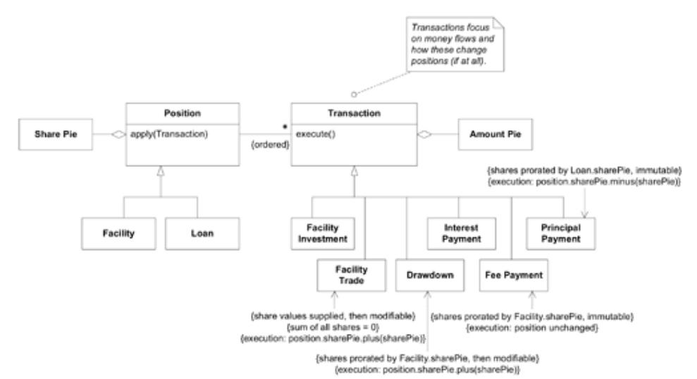

# Epilogue: A Cascade of New Insights

That breakthrough got us out of the woods, but it was not the end of the story. The deeper model opened unexpected opportunities to make the application richer and the design clearer.

Just weeks after the release of the Share Pie version of the software, we noticed another awkward aspect of the model that was complicating the design. An important ENTITY was missing, its absence leaving extra responsibilities to be taken up by other objects. Specifically, there were significant rules governing loan drawdowns, fee payments, and so on, and all this logic was crammed into various methods on the Facility and Loan. These design problems, which had been barely noticeable before the Share Pie breakthrough, became obvious with our clearer field of vision. Now we noticed terms popping up in our discussions that were nowhere to be found in the model—terms such as "transaction" (meaning a financial transaction)—that we started to realize were being implied by all those complicated methods.

Following a process similar to the one described earlier (although, thankfully, under much less time pressure) led to yet another round of insights and a still deeper model. This new model made those implicit concepts explicit, as kinds of Transactions, and at the same time simplified the Positions (an abstraction including the Facility and Loan). It became easy to define the diverse transactions we had, along with their rules, negotiating procedures, and approval processes, and all in relatively self-explanatory code.

Figure 8.9. Another model break-through that followed several weeks later. Constraints on Transactions could be expressed with easy precision.

As is often the case after a real breakthrough to a deep model, the clarity and simplicity of the new design, combined with the enhanced communication based on the new UBIQUITOUS LAN-GUAGE, had led to yet another modeling breakthrough.

Our pace of development was accelerating at a stage where most projects are beginning to bog down in the mass and complexity of what has already been built.
