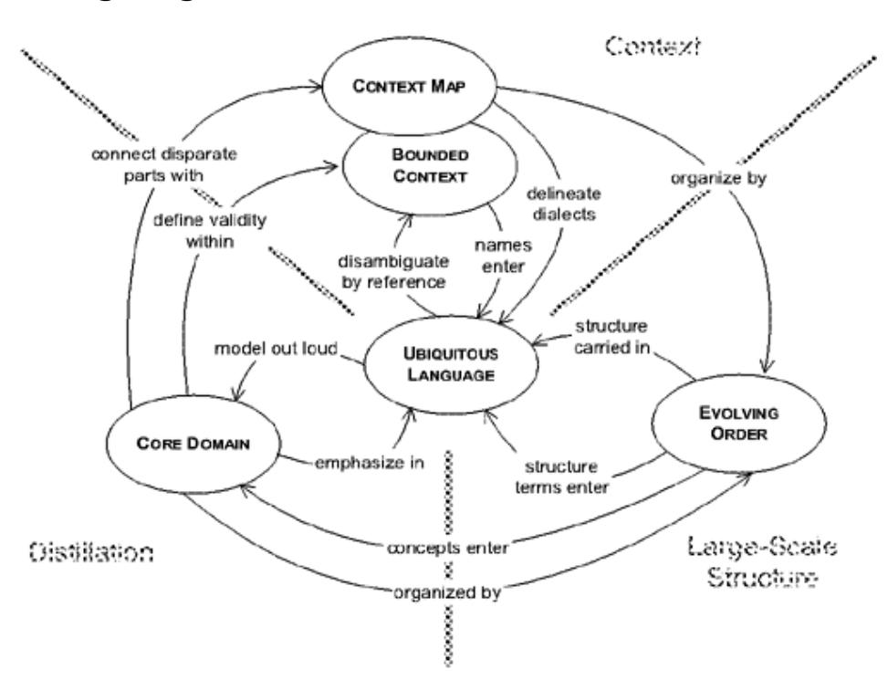
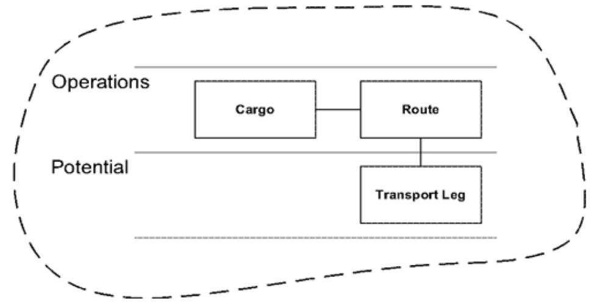
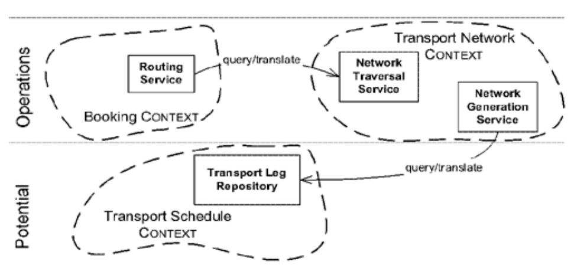
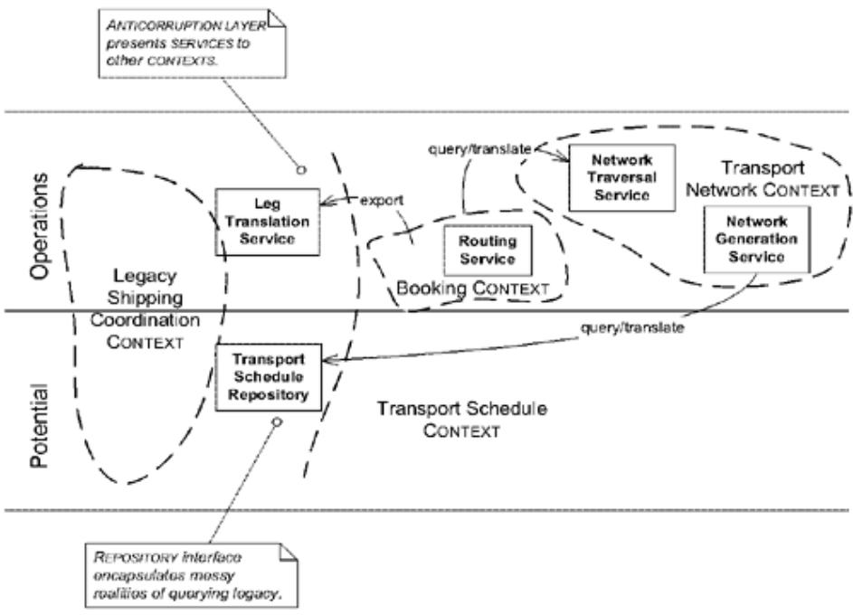
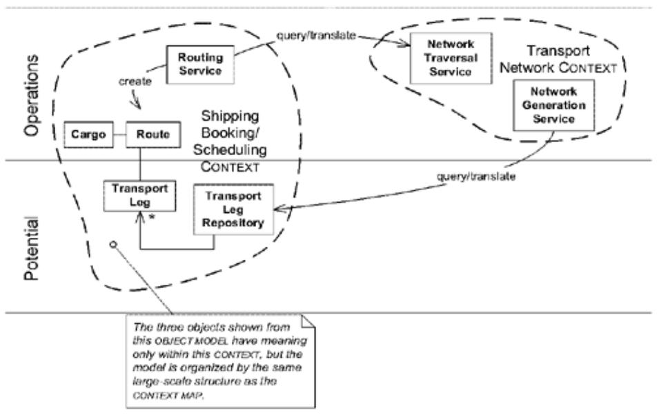
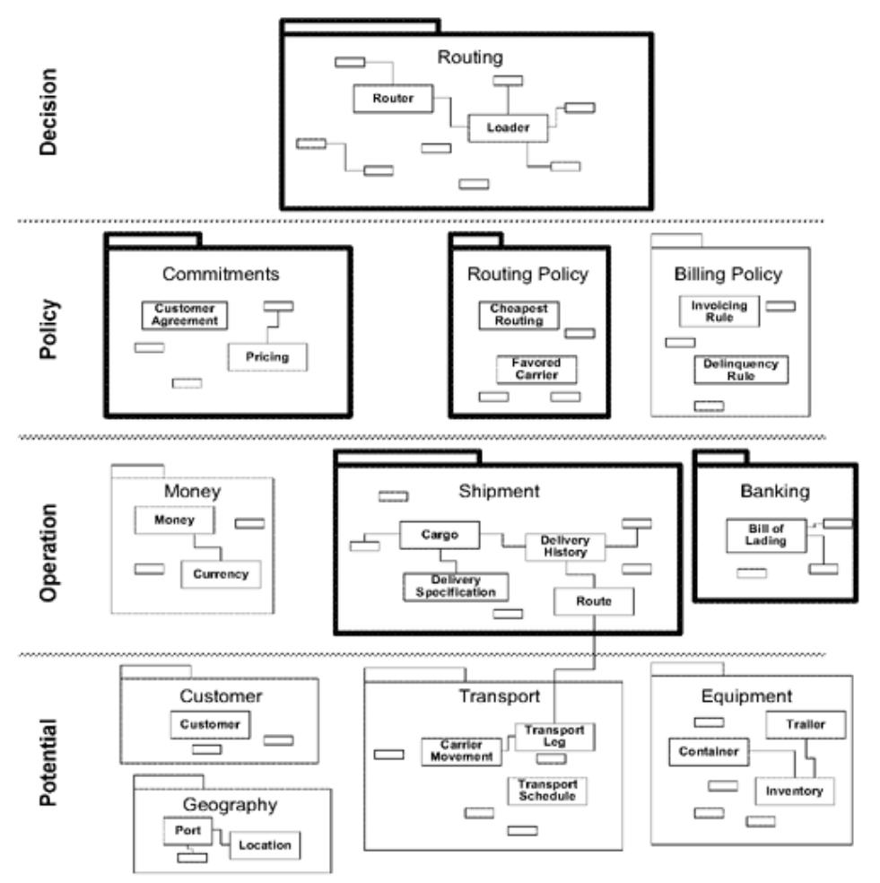

# Chapter 17: Bringing the Strategy Together

The preceding three chapters presented many principles and techniques for domain-driven strategic design. In a large, complex system, you may need to bring several of them to bear on the same design. How does a large-scale structure coexist with a CONTEXT MAP? Where do the building blocks fit in? What do you do first? Second? Third? How do you go about devising your strategy?

## Combining Large-Scale Structures and B***OUNDED* **C***ONTEXTS

The three basic principles of strategic design (context, distillation, and large-scale structure) are not substitutes for each other; they are complementary and interact in many ways. For example, a largescale structure can exist within one BOUNDED CONTEXT, or it can cut across many of them and organize the CONTEXT MAP.

The previous examples of RESPONSIBILITY LAYERS were confined to one BOUNDED CON-TEXT. This is the easiest way to explain the idea, and it's a common use of the pattern. In such a simple scenario, the meanings of layer names are restricted to that CONTEXT, as are the names of model elements or subsystem interfaces that exist within that CONTEXT.

Figure 17.2. Structuring a model within a single BOUNDED CONTEXT

Such a local structure can be useful in a very complicated but unified model, raising the complexity ceiling on how much can be maintained in a single BOUNDED CONTEXT.

But on many projects, the greater challenge is to understand how disparate parts fit together. They may be partitioned into separate CONTEXTS, but what part does each play in the whole integrated system and how do the parts relate to each other? Then the large-scale structure can be used to organize the CONTEXT MAP. In this case, the terminology of the structure applies to the whole project (or at least some clearly bounded part of it).

Figure 17.3. Structure imposed on the relationships of components of distinct BOUNDED CONTEXTS

Suppose you want to adopt RESPONSIBILITY LAYERS, but you have a legacy system whose organization is inconsistent with your desired large-scale structure. Do you have to give up your LAYERS? No, but you have to acknowledge the actual place the legacy has within the structure. In fact, it may help to characterize the legacy. The SERVICES the legacy provides may in fact be confined to only a few LAYERS. To be able to say that the legacy system fits within particular RESPONSIBILITY LAYERS concisely describes a key aspect of its scope and role.

Figure 17.4. A structure that allows some components to span layers

If the legacy subsystem's capabilities are being accessed through a FACADE, you may be able to design each SERVICE offered by the FACADE to fit within one layer.

The interior of the Shipping Coordination application, being a legacy in this example, is presented as an undifferentiated mass. But a team on a project with a well-established large-scale structure spanning the CONTEXT MAP could choose, within their CONTEXT, to order their model by the same familiar LAYERS.

Figure 17.5. The same structure applied within a CONTEXT and across the CONTEXT MAP as a whole

Of course, because each BOUNDED CONTEXT is its own name space, one structure could be used to organize the model within one CONTEXT, while another was used in a neighboring CON-TEXT, and still another organized the CONTEXT MAP. However, going too far down that path can erode the value of the large-scale structure as a unifying set of concepts for the project.

## Combining Large-Scale Structures and Distillation

The concepts of large-scale structure and distillation also complement each other. The large-scale structure can help explain the relationships within the CORE DOMAIN and between GENERIC SUBDOMAINS.

Figure 17.6. MODULES of the CORE DOMAIN (in bold) and GENERIC SUBDOMAINS are clarified by the layers.

At the same time, the large-scale structure itself may be an important part of the CORE DOMAIN. For example, distinguishing the layering of potential, operations, policy, and decision support distills an insight that is fundamental to the business problem addressed by the software. This insight is especially useful if a project is carved up into many BOUNDED CONTEXTS, so that the model objects of the CORE DOMAIN don't have meaning over much of the project.

## Assessment First

When you are tackling strategic design on a project, you need to start from a clear assessment of the current situation.

- 1. Draw a CONTEXT MAP. Can you draw a consistent one, or are there ambiguous situations?
- 2. Attend to the use of language on the project. Is there a UBIQUITOUS LANGUAGE? Is it rich enough to help development?
- 3. Understand what is important. Is the CORE DOMAIN identified? Is there a DOMAIN VISION STATEMENT? Can you write one?
- 4. Does the technology of the project work for or against a MODEL-DRIVEN DESIGN?
- 5. Do the developers on the team have the necessary technical skills?
- 6. Are the developers knowledgeable about the domain? Are they interested in the domain?

You won't find perfect answers, of course. You know less about this project right now than you ever will in the future. But these questions give you a solid starting point. By the time you have specific initial answers to these questions, you'll have started getting insight into what most urgently needs to be done. As time goes along, you can refine the answers—especially the CONTEXT MAP, DO-MAIN VISION STATEMENT, and any other artifacts you've created—to reflect changed situations and new insights.

## Who Sets the Strategy?

Traditionally, architecture is handed down, created before application development begins, by a team that has more power in the organization than the application development team. But it doesn't have to be that way. That way doesn't usually work very well.

Strategic design, by definition, must apply across the project. There are many ways to organize a project, and I don't want to be too prescriptive. However, for any decision-making process to be effective, some fundamentals are required.

First, let's take a quick look at two styles that I've seen provide some value in practice (thus ignoring the old "wisdom-from-on-high" style).

## Emergent Structure from Application Development

A self-disciplined team made up of very good communicators can operate without central authority and follow EVOLVING ORDER to arrive at a shared set of principles, so that order grows organically, not by fiat.

This is the typical model for an Extreme Programming team. In theory, the structure may emerge completely spontaneously from the insight of any programming pair. More often, having an individual or a subset of the team with some oversight responsibility for large-scale structure helps keep the structure unified. This approach works well particularly if such an informal leader is a hands-on developer—an arbiter and communicator, and not the sole source of ideas. On the Extreme Programming teams I have seen, such strategic design leadership seems to have emerged spontaneously, often in the person of the coach. Whoever this natural leader is, he or she is still a member of the development team. It follows that the development team must have at least a few people of the caliber to make design decisions that are going to affect the whole project.

When a large-scale structure spans multiple teams, closely affiliated teams may begin to collaborate informally. In such a situation, each application team still makes the discoveries that lead to the idea for a large-scale structure, but then particular options are discussed by the informal committee, made up of representatives of the various teams. After assessing the impact of the design, participants may decide to adopt it, modify it, or leave it on the table. The teams attempt to move together in this loose affiliation. This arrangement can work when there are relatively few teams, when they are all committed to coordinating with each other, when their design capabilities are comparable, and when their structural needs are similar enough to be met by a single large-scale structure.

## A Customer Focused Architecture Team

When a strategy will be shared among several teams, some centralization of decision making does seem attractive. The failed model of the ivory tower architect is not the only possibility. An architecture team can act as a peer with various application teams, helping to coordinate and harmonize their large-scale structures as well as BOUNDED CONTEXT boundaries and other cross-team technical issues. To be useful in this, they must have a mind set that emphasizes application development.

On an organization chart, this team may look just like the traditional architecture team, but it is actually different in every activity. Team members are true collaborators with development, discovering patterns along with the developers, experimenting with various teams to reach distillations, and getting their hands dirty.

I have seen this scenario a couple of times, when a project ends up with a lead architect who does most of the things on the following list.

## Six Essentials for Strategic Design Decision Making

## Decisions must reach the entire team

Obviously, if everyone doesn't know the strategy and follow it, it is irrelevant. This requirement leads people to organize around centralized architecture teams with official "authority"—so that the same rules will be applied everywhere. Ironically, ivory tower architects are often ignored or bypassed. Developers have no choice when the architects' lack of feedback from hands-on attempts to apply their own rules to real applications results in impractical schemes.

On a project with very good communication, a strategic design that emerges from the application team may actually reach everyone more effectively. The strategy will be relevant, and it will have the authority that attaches to intelligent community decisions.

Whatever the system, be less concerned with the authority bestowed by management than with the actual relationship the developers have with the strategy.

## The decision process must absorb feedback

Creating an organizing principle, large-scale structure, or distillation of such subtlety requires a really deep understanding of the needs of the project and the concepts of the domain. The only people who have that depth of knowledge are the members of the application development team. This explains why application architectures created by architecture teams are so seldom helpful, despite the undeniable talent of many of the architects.

Unlike technical infrastructure and architectures, strategic design does not itself involve writing a lot of code, although it influences all development. What it does require is involvement with the application development teams. An experienced architect may be able to listen to ideas coming from various teams and facilitate the development of a generalized solution.

One technical architecture team I worked with actually circulated its own members through the various application development teams that were attempting to use its framework. This rotation pulled into the architecture team the hands-on experience of the challenges facing the developers, while it simultaneously transferred the knowledge of how to apply the subtleties of the framework. Strategic design has this same need of a tight feedback loop.

## The plan must allow for evolution

Effective software development is a highly dynamic process. When the highest level of decisions is set in stone, the team has fewer options when it must respond to change. EVOLVING ORDER avoids this trap by emphasizing ongoing change to the large-scale structure in response to deepening insight.

When too many design decisions are preordained, the development team can be hobbled, without the flexibility to solve the problems they are charged with. So, while a harmonizing principle can be valuable, it must grow and change with the ongoing life of the development project, and it must not take too much power away from the application developers, whose job is hard enough as it is.

With strong feedback, innovations emerge as obstacles are encountered in building applications and as unexpected opportunities are discovered.

## Architecture teams must not siphon off all the best and brightest

Design at this level calls for sophistication that is probably in short supply. Managers tend to move the most technically talented developers into architecture teams and infrastructure teams, because they want to leverage the skills of these advanced designers. For their part, the developers are attracted to the opportunity to have a broader impact or to work on "more interesting" problems. And there is prestige attached to being a member of an elite team.

These forces often leave behind only the least technically sophisticated developers to actually build applications. But building good applications takes design skill; this is a setup for failure. Even if a strategy team creates a great strategic design, the application team won't have the design sophistication to follow it.

Conversely, such teams almost never include the developer who perhaps has weaker design skills but who has the most extensive experience in the domain. Strategic design is not a purely technical task; cutting themselves off from developers with deep domain knowledge hobbles the architects' efforts further. And domain experts are needed too.

It is essential to have strong designers on all application teams. It is essential to have domain knowledge on any team attempting strategic design. It may simply be necessary to hire more advanced designers. It may help to keep architecture teams part-time. I'm sure there are many ways that work, but any effective strategy team has to have as a partner an effective application team.

## Strategic design requires minimalism and humility

Distillation and minimalism are essential to any good design work, but minimalism is even more critical for strategic design. Even the slightest ill fit has a terrible potential for getting in the way. Separate architecture teams have to be especially careful because they have less feel for the obstacles they might be placing in front of application teams. At the same time, the architects' enthusiasm for their primary responsibility makes them more likely to get carried away. I've seen this phenomenon many times, and I've even done it. One good idea leads to another, and we end up with an overbuilt architecture that is counterproductive.

Instead, we have to discipline ourselves to produce organizing principles and core models that are pared down to contain nothing that does not significantly improve the clarity of the design. The truth is, almost everything gets in the way of something, so each element had better be worth it. Realizing that your best idea is likely to get in somebody's way takes humility.

## Objects are specialists; developers are generalists

The essence of good object design is to give each object a clear and narrow responsibility and to reduce interdependence to an absolute minimum. Sometimes we try to make interactions on teams as tidy as they should be in our software. A good project has lots of people sticking their nose in other people's business. Developers play with frameworks. Architects write application code. Everyone talks to everyone. It is efficiently chaotic. Make the objects into specialists; let the developers be generalists.

Because I've made the distinction between strategic design and other kinds of design to help clarify the tasks involved, I must point out that having two kinds of design activity does not mean having two kinds of people. Creating a supple design based on a deep model is an advanced design activity, but the details are so important that it has to be done by someone working with the code. Strategic design emerges out of application design, yet it requires a big-picture view of activity, possibly spanning multiple teams. People love to find ways to chop up tasks so that design experts don't have to know the business and domain experts don't have to understand technology. There is a limit to how much an individual can learn, but overspecialization takes the steam out of domaindriven design.

## The Same Goes for the Technical Frameworks

Technical frameworks can greatly accelerate application development, including the domain layer, by providing an infrastructure layer that frees the application from implementing basic services, and by helping to isolate the domain from other concerns. But there is a risk that an architecture can interfere with expressive implementations of the domain model and easy change. This can happen even when the framework designers had no intention of venturing into the domain or application layers.

The same biases that limit the downside of strategic design can help with technical architecture. Evolution, minimalism, and involvement with the application development team can lead to a continuously refined set of services and rules that genuinely help application development without getting in the way. Architectures that don't follow this path will either stifle the creativity of application development or will find their architecture circumvented, leaving application development, for practical purposes, with no architecture at all.

There is one particular attitude that will surely ruin a framework.

### Don't write frameworks for dummies

Team divisions that assume some developers are not smart enough to design are likely to fail because they underestimate the difficulty of application development. If those people are not smart enough to design, they shouldn't be assigned to develop software. If they are smart enough, then the attempts to coddle them will only put up barriers between them and the tools they need.

This attitude also poisons the relationship between teams. I've ended up on arrogant teams like this and found myself apologizing to developers in every conversation, embarrassed by my association. (I've never managed to change such a team, I'm afraid.)

Now, encapsulating irrelevant technical detail is completely different from the kind of prepackaging I'm disparaging. A framework can place powerful abstractions and tools in developers' hands and free them from drudgery. It is hard to describe the difference in a generalized way, but you can tell the difference by asking the framework designers what they expect of the person who will be using the tool/framework/components. If the designers seem to have a high level of respect for the user of the framework, then they are probably on the right track.

## Beware the Master Plan

A group of architects (the kind who design physical buildings), led by Christopher Alexander, were advocates of piecemeal growth in the realm of architecture and city planning. They explained very nicely why master plans fail.

Without a planning process of some kind, there is not a chance in the world that the University of Oregon will ever come to possess an order anywhere near as deep and harmonious as the order that underlies the University of Cambridge.

The master plan has been the conventional way of approaching this difficulty. The master plan attempts to set down enough guidelines to provide for coherence in the environment as a whole—and still leave freedom for individual buildings and open spaces to adapt to local needs.

- . . . and all the various parts of this future university will form a coherent whole, because they were simply plugged into the slots of the design.
- . . . in practice master plans fail—because they create totalitarian order, not organic order. They are too rigid; they cannot easily adapt to the natural and unpredictable changes that inevitably arise in the life of a community. As these changes occur . . . the master plan becomes obsolete, and is no longer followed. And even to the extent that master plans are followed . . . they do not specify enough about connections between buildings, human scale, balanced function, etc. to help each local act of building and design become well-related to the environment as a whole.
- . . . The attempt to steer such a course is rather like filling in the colors in a child's coloring book . . . . At best, the order which results from such a process is banal.
- . . . Thus, as a source of organic order, a master plan is both too precise, and not precise enough. The totality is too precise: the details are not precise enough.
- . . . the existence of a master plan alienates the users [because, by definition] the members of the community can have little impact on the future shape of their community because most of the important decisions have already been made.

—From The Oregon Experiment, pp. 16–28 (Alexander et al. 1975)

Alexander and his colleagues advocated instead a set of principles for all community members to apply to every act of piecemeal growth, so that "organic order" emerges, well adapted to circumstances.

## Chapter . Conclusion

## Epilogues

Although it is very satisfying working on a cutting-edge project and experimenting with interesting ideas and tools, for me it is a hollow experience if the software does not find productive use. In fact, the true test of success is how the software serves over a period of time. I have been able to follow the stories of some of my former projects over the years.

I'll discuss here five of those, each of which made a serious attempt at domain-driven design, though not systematically and not by that name, of course. All of these projects did deliver software: some managed to carry through and produce a model-driven design, while one slipped off that track. Some of the applications continued to grow and change for many years, while one stagnated and one died young.

The PCB design software described in Chapter 1 was a smash hit among beta users in the field. Unfortunately, the start-up company that had initiated the project utterly failed in its marketing function and was eventually euthanized. The software is now used by a handful of PCB engineers who have old copies they kept from the beta program. Like any orphan software, it will continue to work until there is some fatal change to one of the programs with which it is integrated.

The loan software whose story was told in Chapter 9 thrived and evolved along much the same track for three years after the breakthrough I wrote about. At that point, the project was spun off as an independent company. In the turmoil of this reorganization, the project manager who had led the project from the beginning was ejected, and some of the core developers left with him. The new team had a somewhat different design philosophy, not as fully committed to object modeling. But they retained a distinct domain layer with complex behavior and continued to value domain knowledge on the development team. Seven years after the spin-off, the software continues to be enhanced with new features. It is the leading application in its field and serves an increasing number of client institutions, as well as being the largest revenue stream for the company.

A Newly Planted Olive Grove

Until the domain-driven approach is more widespread, the interesting software on many projects will be built in a short, highly productive interval. Eventually the project will transform into something more conventional that may not be able to fully exploit, much less enhance, the power of the deep models that were distilled earlier. I could wish for more, but truly those are successes that deliver sustained value to users over many years.

On one project I paired with another developer to write a utility the customer needed to produce its core product. The features were fairly complicated and combined in intricate ways. I enjoyed the project work and we produced a supple design with an ABSTRACT CORE. When this software was handed off, that was the end of involvement for everyone who had initially developed it. Because it was such an abrupt transition, I expected that the design features which supported the combinable elements might be confusing and might get replaced by more typical case logic. This did not initially happen. When we handed off, the package included a thorough test suite and a distillation document. The new team members used that document to guide their explorations, and as they looked into things, they became excited by the possibilities the design presented. When I heard their comments a year later, I realized that the UBIQUITOUS LANGUAGE had sparked across to the other team and stayed alive, continuing to evolve.

### Seven Years Later

Then, another year later, I heard a different story. The team had encountered new requirements that the developers didn't see any way to accomplish within the inherited design. They had been forced to change the design almost beyond recognition. As I probed for more details, I could see that aspects of our model would have made solving those problems awkward. It is precisely during such moments when a breakthrough to a deeper model is often possible, especially when, as in this case, the developers had accumulated deep knowledge and experience in the domain. In fact, they had had a rush of new insights and ended up transforming the model and design based on those insights.

They told me this story carefully, diplomatically, expecting, I suppose, that I would be disappointed by their discarding of so much of my work. I am not that sentimental about my designs. The success of a design is not necessarily marked by its stasis. Take a system people depend on, make it opaque, and it will live forever as untouchable legacy. A deep model allows clear vision that can yield new insight, while a supple design facilitates ongoing change. The model they came up with was deeper, better aligned with the real concerns of the users. Their design solved real problems. It is the nature of software to change, and this program has continued to evolve in the hands of the team that owns it.

The shipping examples scattered through the book are loosely based on a project for a major international container-shipping company. Early on, the leadership of the project was committed to a domain-driven approach, but they never produced a development culture that could fully support it. Several teams with widely different levels of design skill and object experience set out to create modules, loosely coordinated by informal cooperation between team leaders and by a customerfocused architecture team. We did develop a reasonably deep model of the CORE DOMAIN, and there was a viable UBIQUITOUS LANGUAGE.

But the company culture fiercely resisted iterative development, and we waited far too long to push out a working internal release. Therefore, problems were exposed at a late stage, when they were more risky and expensive to fix. At some point, we discovered specific aspects of the model were causing performance problems in the database. A natural part of MODEL-DRIVEN DESIGN is the feedback from implementation problems to changes in the model, but by that time there was a perception that we were too far down the road to change the fundamental model. Instead, changes were made to the code to make it more efficient, and its connection to the model was weakened. The initial release also exposed scaling limitations in the technical infrastructure that threw a scare into management. Expertise was brought in to fix the infrastructure problems, and the project bounced back. But the loop was never closed between implementation and domain modeling.

A few teams delivered fine software with complex capabilities and expressive models. Others delivered stiff software that reduced the model to data structures, though even they retained traces of the UBIQUITOUS LANGUAGE. Perhaps a CONTEXT MAP would have helped us as much as anything, as the relationship between the output of the various teams was haphazard. Yet that CORE model carried in the UBIQUITOUS LANGUAGE did help the teams ultimately to glue together a system.

Although reduced in scope, the project replaced several legacy systems. The whole was held together by a shared set of concepts, though most of the design was not very supple. It has itself largely fossilized into legacy now, years later, but it still serves the global business 24 hours a day. Although the more successful teams' influence gradually spread, time runs out eventually, even in the richest company. The culture of the project never really absorbed MODEL-DRIVEN DESIGN. New development today is on different platforms and is only indirectly influenced by the work we did—as the new developers CONFORM to their legacy.

In some circles, ambitious goals like those the shipping company initially set have been discredited. Better, it seems, to make little applications we know how to deliver. Better to stick to the lowest common denominator of design to do simple things. This conservative approach has its place, and allows for neatly scoped, quick-response projects. But integrated, model-driven systems promise value that those patchworks can't. There is a third way. Domain-driven design allows piecemeal growth of big systems with rich functionality, by building on a deep model and supple design.

I'll close this list with Evant, a company that develops inventory management software, where I played a secondary supporting role and contributed to an already strong design culture. Others have written about this project as a poster child of Extreme Programming, but what is not usually remarked upon is that the project was intensely domain-driven. Ever deeper models were distilled and expressed in ever more supple designs. This project thrived until the "dot com" crash of 2001. Then, starved for investment funds, the company contracted, software development went mostly dormant, and it seemed that the end was near. But in the summer of 2002, Evant was approached by one of the top ten retailers in the world. This potential client liked the product, but it needed design changes to allow the application to scale up for an enormous inventory planning operation. It was Evant's last chance.

Although reduced to four developers, the team had assets. They were skilled, with knowledge of the domain, and one member had expertise in scaling issues. They had a very effective development culture. And they had a code base with a supple design that facilitated change. That summer, those four developers made a heroic development effort resulting in the ability to handle billions of planning elements and hundreds of users. On the strength of those capabilities, Evant won the behemoth client and, soon after, was bought by another company that wanted to leverage their software and their proven ability to accommodate new demands.

The domain-driven design culture (as well as the Extreme Programming culture) survived the transition and was revitalized. Today, the model and design continue to evolve, far richer and suppler two years later than when I made my contribution. And rather than being assimilated into the purchasing company, the members of the Evant team seem to be inspiring the company's existing project teams to follow their lead. This story isn't over yet.

No project will ever employ every technique in this book. Even so, any project committed to domaindriven design will be recognizable in a few ways. The defining characteristic is a priority on understanding the target domain and incorporating that understanding into the software. Everything else flows from that premise. Team members are conscious of the use of language on the project and cultivate its refinement. They are hard to satisfy with the quality of the domain model, because they keep learning more about the domain. They see continuous refinement as an opportunity and an ill-fitting model as a risk. They take design skill seriously because it isn't easy to develop productionquality software that clearly reflects the domain model. They stumble over obstacles, but they hold on to their principles as they pick themselves up and continue forward.

## Looking Forward

Weather, ecosystems, and biology used to be considered messy, "soft" fields in contrast to physics or chemistry. Recently, however, people have recognized that the appearance of "messiness" in fact presents a profound technical challenge to discover and understand the order in these very complex phenomena. The field called "complexity" is the vanguard of many sciences. Although purely technological tasks have generally seemed most interesting and challenging to talented software engineers, domain-driven design opens up a new area of challenge that is at least equal. Business software does not have to be a bolted-together mess. Wrestling a complex domain into a comprehensible software design is an exciting challenge for strong technical people.

We are nowhere near the era of laypeople creating complex software that works. Armies of programmers with rudimentary skills can produce certain kinds of software, but not the kind that saves a company in its eleventh hour. What is needed is for tool builders to put their minds to the task of extending the power and productivity of talented software developers. What is needed are sharper ways of exploring domain models and expressing them in working software. I look forward to experimenting with new tools and technologies devised for this purpose.

But though improved tools will be valuable, we mustn't get distracted by them and lose sight of the core fact that creating good software is a learning and thinking activity. Modeling requires imagination and self-discipline. Tools that help us think or avoid distraction are good. Efforts to automate what must be the product of thought are naive and counterproductive.

With the tools and technology we already have, we can build systems much more valuable than most projects do today. We can write software that is a pleasure to use and a pleasure to work on, software that doesn't box us in as it grows but creates new opportunities and continues to add value for its owners.

## The Use of Patterns in This Book

My first "nice car," which I was given shortly after college, was an eight-year-old Peugeot. Sometimes called the "French Mercedes," this car was well crafted, was a pleasure to drive, and had been very reliable. But by the time I got it, it was reaching the age when things start to go wrong and more maintenance is required.

Peugeot is an old company, and it has followed its own evolutionary path over many decades. It has its own mechanical terminology, and its designs are idiosyncratic; even the breakdown of functions into parts is sometimes nonstandard. The result is a car that only Peugeot specialists can work on, a potential problem for someone on a grad student income.

On one typical occasion, I took the car to a local mechanic to investigate a fluid leak. He examined the undercarriage and told me that oil was "leaking from a little box about two-thirds of the way back that seems to have something to do with distributing braking power between front and rear." He then refused to touch the car and advised me to go to the dealership, fifty miles away. Anyone can work on a Ford or a Honda; that's why those cars are more convenient and less expensive to own, even though they are equally mechanically complex.

I did love that car, but I will never own a quirky car again. A day came when a particularly expensive problem was diagnosed, and I had had enough of Peugeots. I took it to a local charity that accepted cars as donations. Then I bought a beat-up old Honda Civic for about what the repair would have cost.

Standard design elements are lacking for domain development, and so every domain model and corresponding implementation is quirky and hard to understand. Moreover, every team has to reinvent the wheel (or the gear, or the windshield wiper). In the world of object-oriented design, everything is an object, a reference, or a message—which, of course, is a useful abstraction. But that does not sufficiently constrain the range of domain design choices and does not support an economical discussion of a domain model.

To stop with "Everything is an object" would be like a carpenter or an architect summing up houses by saying "Everything is a room." There would be the big room with high-voltage outlets and a sink, where you might cook. There would be the small room upstairs, where you might sleep. It would take pages to describe an ordinary house. People who build or use houses realize that rooms follow patterns, patterns with special names, such as "kitchen." This language enables economical discussion of house design.

Moreover, not all combinations of functions turn out to be practical. Why not a room where you bathe and sleep? Wouldn't that be convenient. But long experience has precipitated into custom, and we separate our "bedrooms" from our "bathrooms." After all, bathing facilities tend to be shared among more people than bedrooms are, and they require maximum privacy, even from the others who share the same bedroom. And bathrooms have specialized and expensive infrastructure requirements. Bathtubs and toilets typically end up in the same room because both require the same infrastructure (water and drainage) and both are used in private.

Another room that has special infrastructure requirements is that room where you might prepare meals, also known as the "kitchen." In contrast to the bathroom, a kitchen has no special privacy requirements. Because of its expense, there is typically only one, even in relatively large houses. This singularity also facilitates our communal food preparation and eating customs.

When I say that I want a three-bedroom, two-bath house with an open-plan kitchen, I have packed a huge amount of information into a short sentence, and I've avoided a lot of silly mistakes—such as putting a toilet next to the refrigerator.

In every area of design—houses, cars, rowboats, or software—we build on patterns that have been found to work in the past, improvising within established themes. Sometimes we have to invent something completely new. But by basing standard elements on patterns, we avoid wasting our energy on problems with known solutions so that we can focus on our unusual needs. Also, building from conventional patterns helps us avoid a design so idiosyncratic that it is difficult to communicate.

Although software domain design is not as mature as other design fields—and in any case may be too diverse to accommodate patterns as specific as those used for car parts or rooms—there is nonetheless a need to move beyond "Everything is an object" to at least the equivalent of distinguishing bolts from springs.

A form for sharing and standardizing design insight was introduced in the 1970s by a group of architects led by Christopher Alexander (Alexander et al. 1977). Their "pattern language" wove together tried-and-true design solutions to common problems (much more subtly than my "kitchen" example, which has probably caused some readers of Alexander to cringe). The intent was that builders and users would communicate in this language, and they would be guided by the patterns to produce beautiful buildings that worked well and felt good to the people who used them.

Whatever architects might think of the idea, this pattern language has had a big impact on software design. In the 1990s software patterns were applied in many ways with some success, notably in detailed design (Gamma et al. 1995) and technical architectures (Buschmann et al. 1996). More recently, patterns have been used to document basic object-oriented design techniques (Larman 1998) and enterprise architectures (Fowler 2002, Alur et al. 2001). The language of patterns is now a mainstream technique for organizing software design ideas.

The pattern names are meant to become terms in the language of the team, and I've used them that way in this book. When a pattern name appears in a discussion, it is FORMATTED IN SMALL CAPS to call it out.

Here is how I've formatted patterns in this book. There is some variation around this basic plan, as I have favored case-by-case clarity and readability over rigid structure. . . .

## Pattern Name

[Illustration of concept. Sometimes a visual metaphor or evocative text.]

[Context. A brief explanation of how the concept relates to other patterns. In some cases, a brief overview of the pattern.

However, much of the context discussion in this book is in the chapter introductions and other narrative segments, rather than within the patterns.

[Problem discussion.]

## Problem summary.

Discussion of the resolution of problem forces into a solution.

Therefore:

Solution summary.

Consequences. Implementation considerations. Examples.

Resulting context: A brief explanation of how the pattern leads to later patterns.

[Discussion of implementation challenges. In Alexander's original format, this discussion would have been folded into the section describing the resolution of the problem, and I have often followed Alexander's organization in this book. But some patterns demand lengthier discussions of implementation. To keep the core pattern discussion tight, I have moved such long implementation discussions out, after the pattern.

Also, lengthy examples, particularly those that combine multiple patterns, are often outside the patterns.]

Here are brief definitions of selected terms, pattern names, and other concepts used in the book.

## AGGREGATE

A cluster of associated objects that are treated as a unit for the purpose of data changes. External references are restricted to one member of the AGGREGATE, designated as the root. A set of consistency rules applies within the AGGREGATE'S boundaries.

### analysis pattern

A group of concepts that represents a common construction in business modeling. It may be relevant to only one domain or may span many domains (Fowler 1997, p. 8).

#### ASSERTION

A statement of the correct state of a program at some point, independent of how it does it. Typically, an ASSERTION specifies the result of an operation or an invariant of a design element.

## BOUNDED CONTEXT

The delimited applicability of a particular model. BOUNDING CONTEXTS gives team members a clear and shared understanding of what has to be consistent and what can develop independently.

### client

A program element that is calling the element under design, using its capabilities.

#### cohesion

Logical agreement and dependence.

## command (a.k.a. modifier)

An operation that effects some change to the system (for example, setting a variable). An operation that intentionally creates a side effect.

## CONCEPTUAL CONTOUR

An underlying consistency of the domain itself, which, if reflected in a model, can help the design accommodate change more naturally.

### context

The setting in which a word or statement appears that determines its meaning. See Also BOUNDED CONTEXT.

#### CONTEXT MAP

A representation of the BOUNDED CONTEXTS involved in a project and the actual relationships between them and their models.

#### CORE DOMAIN

The distinctive part of the model, central to the user's goals, that differentiates the application and makes it valuable.

#### declarative design

A form of programming in which a precise description of properties actually controls the software. An executable specification.

#### deep model

An incisive expression of the primary concerns of the domain experts and their most relevant knowledge. A deep model sloughs off superficial aspects of the domain and naive interpretations.

#### design pattern

A description of communicating objects and classes that are customized to solve a general design problem in a particular context. (Gamma et al. 1995, p. 3)

#### distillation

A process of separating the components of a mixture to extract the essence in a form that makes it more valuable and useful. In software design, the abstraction of key aspects in a model, or the partitioning of a larger system to bring the CORE DOMAIN to the fore.

## domain

A sphere of knowledge, influence, or activity.

## domain expert

A member of a software project whose field is the domain of the application, rather than software development. Not just any user of the software, the domain expert has deep knowledge of the subject.

## domain layer

That portion of the design and implementation responsible for domain logic within a LAYERED ARCHITECTURE. The domain layer is where the software expression of the domain model lives.

### ENTITY

An object fundamentally defined not by its attributes, but by a thread of continuity and identity.

## FACTORY

A mechanism for encapsulating complex creation logic and abstracting the type of a created object for the sake of a client.

### function

An operation that computes and returns a result without observable side effects.

## immutable

The property of never changing observable state after creation.

### implicit concept

A concept that is necessary to understand the meaning of a model or design but is never mentioned.

## INTENTION-REVEALING INTERFACE

A design in which the names of classes, methods, and other elements convey both the original developer's purpose in creating them and their value to a client developer.

## invariant

An ASSERTION about some design element that must be true at all times, except during specifically transient situations such as the middle of the execution of a method, or the middle of an uncommitted database transaction.

## iteration

A process in which a program is repeatedly improved in small steps. Also, one of those steps.

### large-scale structure

A set of high-level concepts, rules, or both that establishes a pattern of design for an entire system. A language that allows the system to be discussed and understood in broad strokes.

#### LAYERED ARCHITECTURE

A technique for separating the concerns of a software system, isolating a domain layer, among other things.

#### life cycle

A sequence of states an object can take on between creation and deletion, typically with constraints to ensure integrity when changing from one state to another. May include migration of an ENTITY between systems and different BOUNDED CONTEXTS.

#### model

A system of abstractions that describes selected aspects of a domain and can be used to solve problems related to that domain.

#### MODEL-DRIVEN DESIGN

A design in which some subset of software elements corresponds closely to elements of a model. Also, a process of codeveloping a model and an implementation that stay aligned with each other.

## modeling paradigm

A particular style of carving out concepts in a domain, combined with tools to create software analogs of those concepts (for example, object-oriented programming and logic programming).

### REPOSITORY

A mechanism for encapsulating storage, retrieval, and search behavior which emulates a collection of objects.

#### responsibility

An obligation to perform a task or know information (Wirfs-Brock et al. 2003, p. 3).

#### SERVICE

An operation offered as an interface that stands alone in the model, with no encapsulated state.

### side effect

Any observable change of state resulting from an operation, whether intentional or not, even a deliberate update.

#### SIDE-EFFECT-FREE FUNCTION

See function.

## STANDALONE CLASS

A class that can be understood and tested without reference to any others, except system primitives and basic libraries.

### stateless

The property of a design element that allows a client to use any of its operations without regard to the element's history. A stateless element may use information that is accessible globally and may even change that global information (that is, it may have side effects) but holds no private state that affects its behavior.

#### strategic design

Modeling and design decisions that apply to large parts of the system. Such decisions affect the entire project and have to be decided at team level.

#### supple design

A design that puts the power inherent in a deep model into the hands of a client developer to make clear, flexible expressions that give expected results robustly. Equally important, it leverages that same deep model to make the design itself easy for the implementer to mold and reshape to accommodate new insight.

#### UBIQUITOUS LANGUAGE

A language structured around the domain model and used by all team members to connect all the activities of the team with the software.

#### unification

The internal consistency of a model such that each term is unam-biguous and no rules contradict.

#### VALUE OBJECT

An object that describes some characteristic or attribute but carries no concept of identity.

| WHOLE VALUE |
|-------------|
|-------------|

An object that models a single, complete concept.
