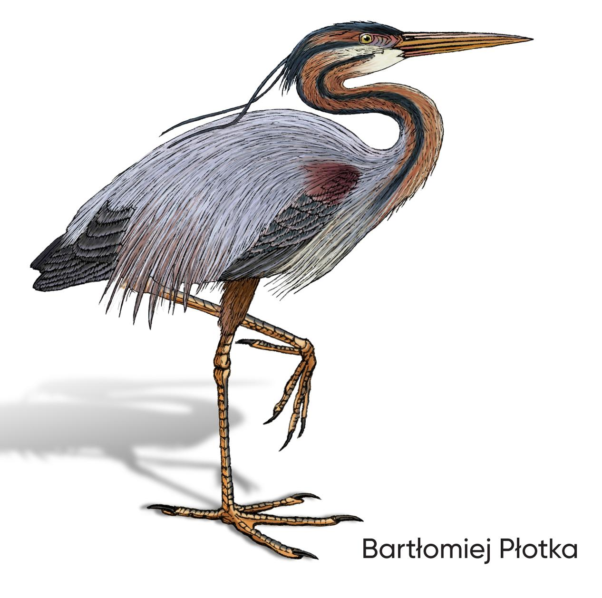

Data-Driven Performance Optimization

With technological advancements, fast markets, and higher complexity of systems, software engineers tend to skip the uncomfortable topic of software efficiency. However, tactical, observability-driven performance optimizations are vital for every product to save money and ensure business success.

With this book, any engineer can learn how to approach software efficiency effectively, professionally, and without stress. Author Bartłomiej Płotka provides the tools and knowledge required to make your systems faster and less resource-hungry. *Efficient Go* guides you in achieving better day-to-day efficiency using Go. In addition, most content is language-agnostic, allowing you to bring small but effective habits to your programming or product management cycles.

This book shows you how to:

- **•** Clarify and negotiate efficiency goals
- **•** Optimize efficiency on various levels
- **•** Use common resources like CPU and memory effectively
- **•** Assess efficiency using observability signals like metrics, logging, tracing, and (continuous) profiling via open source projects like Prometheus, Jaeger, and Parca
- **•** Apply tools like go test, pprof, benchstat, and k6 to create reliable micro and macro benchmarks
- **•** Efficiently use Go and its features like slices, generics, goroutines, allocation semantics, garbage collection, and more!

"*Efficient Go* is a marvelous and insightful book that changes your outlook on software efficiency with Go. You learn how to make data-driven assessments while optimizing your code base and identifying optimizable patterns. It simply makes it easy for you and makes you want to care about the efficiency of your code as soon as you type it!"

> —Saswata Mukherjee Engineer at Red Hat

Bartłomiej Płotka is a principal software engineer at Red Hat with a background in observability and SRE. He's a CNCF Ambassador, TAG Observability tech lead, and cofounder of the Thanos project. He's also a core maintainer of other open-source projects written in Go, including Prometheus and bingo.

GO

US \$59.99 CAN \$74.99 ISBN: 978-1-098-10571-6

Twitter: @oreillymedia linkedin.com/company/oreilly-media youtube.com/oreillymedia

# Data-Driven Performance Optimizations

*Bartłomiej Płotka*

by Bartłomiej Płotka

Copyright © 2023 Alloc Limited. All rights reserved.

Printed in the United States of America.

Published by O'Reilly Media, Inc., 1005 Gravenstein Highway North, Sebastopol, CA 95472.

O'Reilly books may be purchased for educational, business, or sales promotional use. Online editions are also available for most titles (*<http://oreilly.com>*). For more information, contact our corporate/institu‐ tional sales department: 800-998-9938 or *corporate@oreilly.com*.

**Acquisitions Editors:** Brian Guerin and Zan McQuade **Indexer:** WordCo Indexing Services, Inc.

**Development Editor:** Melissa Potter **Interior Designer:** David Futato **Copyeditor:** Sonia Saruba **Illustrator:** Kate Dullea

**Proofreader:** Piper Editorial Consulting, LLC

November 2022: First Edition

**Revision History for the First Edition** 2022-11-08: First Release

**Production Editor:** Clare Laylock **Cover Designer:** Karen Montgomery

See *<http://oreilly.com/catalog/errata.csp?isbn=9781098105716>* for release details.

The O'Reilly logo is a registered trademark of O'Reilly Media, Inc. *Efficient Go*, the cover image, and related trade dress are trademarks of O'Reilly Media, Inc.

The views expressed in this work are those of the author, and do not represent the publisher's views. While the publisher and the author have used good faith efforts to ensure that the information and instructions contained in this work are accurate, the publisher and the author disclaim all responsibility for errors or omissions, including without limitation responsibility for damages resulting from the use of or reliance on this work. Use of the information and instructions contained in this work is at your own risk. If any code samples or other technology this work contains or describes is subject to open source licenses or the intellectual property rights of others, it is your responsibility to ensure that your use thereof complies with such licenses and/or rights.
