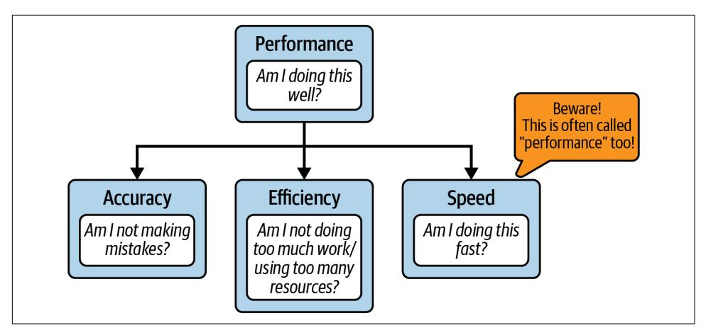
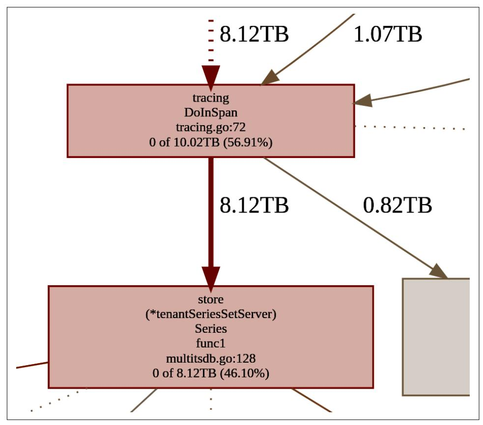
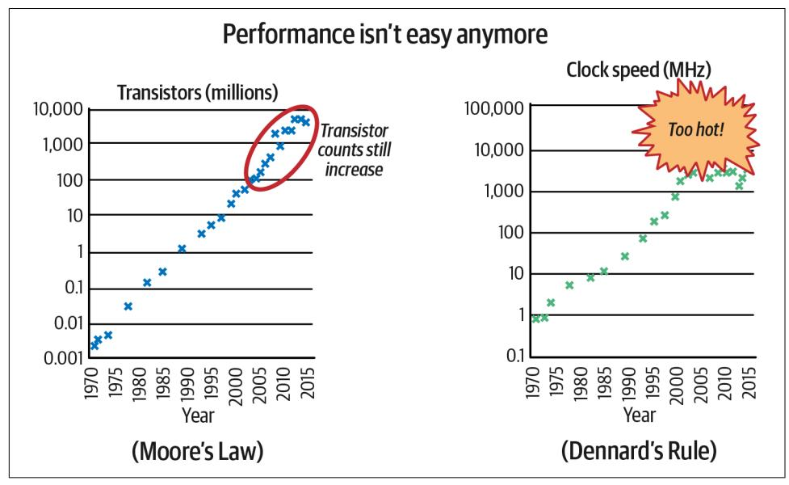
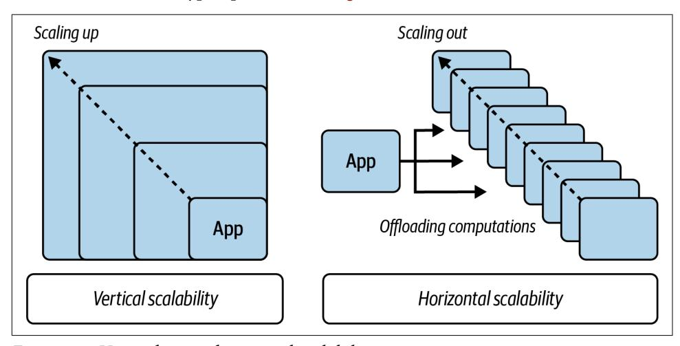

<span id="page-20-0"></span>
# Chapter 1: Software Efficiency Matters

The primary task of software engineers is the cost-effective development of maintainable and useful software.

—Jon Louis Bentley, *Writing Efficient Programs* (Prentice Hall, 1982)

Even after 40 years, Jon's definition of development is fairly accurate. The ultimate goal for any engineer is to create a useful product that can sustain user needs for the product lifetime. Unfortunately, nowadays not every developer realizes the signifi‐ cance of the software cost. The truth can be brutal; stating that the development pro‐ cess can be expensive might be an underestimation. For instance, it took 5 years and 250 engineers for Rockstar to develop the popular Grand Theft Auto 5 video game, which [was estimated to cost \\$137.5 million.](https://oreil.ly/0CRW2) On the other hand, to create a usable, commercialized operating system, Apple had to spend way over [\\$500 million before](https://oreil.ly/hQhiv) [the first release of macOS](https://oreil.ly/hQhiv) in 2001.

Because of the high cost of producing software, it's crucial to focus our efforts on things that matter the most. Ideally, we don't want to waste engineering time and energy on unnecessary actions, for example, spending weeks on code refactoring that doesn't objectively reduce code complexity, or deep micro-optimizations of a func‐ tion that rarely runs. Therefore, the industry continually invents new patterns to pur‐ sue an efficient development process. Agile Kanban methods that allow us to adapt to ever-changing requirements, specialized programming languages for mobile plat‐ forms like Kotlin, or frameworks for building websites like React are only some examples. Engineers innovate in these fields because every inefficiency increases the cost.

What makes it even more difficult is that when developing software now, we should also be aware of the future costs. Some sources even estimate that running and main‐ tenance costs [can be higher than the initial development costs.](https://oreil.ly/59Zqe) Code changes to stay competitive, bug fixing, incidents, installations, and finally, compute cost (including

**1**

<span id="page-21-0"></span>electricity consumed) are only a few examples of the [total software cost of ownership](https://oreil.ly/ZzUCx) [\(TCO\)](https://oreil.ly/ZzUCx) we have to take into account. Agile methodologies help reveal this cost early by releasing software often and getting feedback sooner.

However, is that TCO higher if we descope efficiency and speed optimizations from our software development process? In many cases, waiting a few more seconds for our application execution should not be a problem. On top of that, the hardware is getting cheaper and faster every month. In 2022, buying a smartphone with a dozen GBs of RAM was not difficult. Finger-sized, [2 TB SSD disks capable of 7 GBps](https://oreil.ly/eVcPQ) read and write throughput are available. Even home PC workstations are hitting neverbefore-seen performance scores. With [8 CPUs or more that can perform billions of](https://oreil.ly/eUzNh) [cycles per second each, and with 2 TB of RAM,](https://oreil.ly/eUzNh) we can compute things fast. Plus, we can always add optimizations later, right?

Machines have become increasingly cheap compared to people; any discussion of com‐ puter efficiency that fails to take this into account is short-sighted. "Efficiency" involves the reduction of overall cost—not just machine time over the life of the pro‐ gram, but also time spent by the programmer and by the users of the program.

—Brian W. Kernighan and P. J. Plauger, *The Elements of Programming Style* (McGraw-Hill, 1978)

After all, improving the runtime or space complexity of the software is a complicated topic. Especially when you are new, it's common to lose time optimizing without sig‐ nificant program speedups. And even if we start caring about the latency introduced by our code, things like Java Virtual Machine or Go compiler will apply their opti‐ mizations anyway. Spending more time on something tricky, like efficiency on modern hardware that can also sacrifice our code's reliability and maintainability, may sound like a bad idea. These are only a few reasons why engineers typically put performance optimizations at the lowest position of the development priority list.

Unfortunately, as with every extreme simplification, there is some risk in such perfor‐ mance de-prioritization. Don't be worried, though! In this book, I will not try to con‐ vince you that you should now measure the number of nanoseconds each code line introduces or every bit it allocates in memory before adding it to your software. You should not. I am far from trying to motivate you to put performance at the top of your development priority list.

However, there is a difference between consciously postponing optimizations and making silly mistakes, causing inefficiencies and slowdowns. As the common saying goes, ["Perfect is the enemy of good"](https://oreil.ly/OogZF), but we have to find that balanced good first. So I want to propose a subtle but essential change to how we, as software engineers, should think about application performance. It will allow you to bring small but effective habits to your programming and development management cycle. Based on data and as early as possible in the development cycle, you will learn how to tell when you can safely ignore or postpone program inefficiencies. Finally, when you can't

<span id="page-22-0"></span>afford to skip performance optimizations, where and how to apply them effectively, and when to stop.

In "Behind Performance" on page 3, we will unpack the word *performance* and learn how it is related to *efficiency* in this book's title. Then in ["Common Efficiency Mis‐](#page-26-0) [conceptions" on page 7,](#page-26-0) we will challenge five serious misconceptions around effi‐ ciency and performance, often descoping such work from developer minds. You will learn that thinking about efficiency is not reserved only for "high-performance" software.


Some of the chapters, like this one, [Chapter 3,](007-chapter-3-conquering-efficiency.md#page-90-0) and parts of other chapters, are fully language agnostic, so they should be practical for non-Go developers too!

Finally, in ["The Key to Pragmatic Code Performance" on page 32](#page-51-0), I will teach you why focusing on efficiency will allow us to think about performance optimizations effectively without sacrificing time and other software qualities. This chapter might feel theoretical, but trust me, the insights will train your essential programming judg‐ ment on how and if to adopt particular efficiency optimizations, algorithms, and code improvements presented in other parts of this book. Perhaps it will also help you motivate your product manager or stakeholder to see that more efficient aware‐ ness of your project can be beneficial.

Let's start by unpacking the definition of efficiency.

## Behind Performance

Before discussing why software efficiency or optimizations matter, we must first demystify the overused word *performance*. In engineering, this word is used in many contexts and can mean different things, so let's unpack it to avoid confusion.

When people say, "This application is performing poorly," they usually mean that this particular program is executing slowly.<sup>1</sup> However, if the same people say, "Bartek is not performing well at work," they probably don't mean that Bartek is walking too slowly from the computer to the meeting room. In my experience, a significant num‐ ber of people in software development consider the word *performance* a synonym of *speed*. For others, it means the overall quality of execution, which is the original

<sup>1</sup> I even did a small [experiment on Twitter](https://oreil.ly/997J5), proving this point.

<span id="page-23-0"></span>definition of this word.<sup>2</sup> This phenomenon is sometimes called a ["semantic diffu‐](https://oreil.ly/Qx9Ft) [sion",](https://oreil.ly/Qx9Ft) which occurs when a word starts to be used by larger groups with a different meaning than it originally had.

The word performance in computer performance means the same thing that perfor‐ mance means in other contexts, that is, it means "How well is the computer doing the work it is supposed to do?"

— Arnold O. Allen, *Introduction to Computer Performance Analysis with Mathematica* (Morgan Kaufmann, 1994)

I think Arnold's definition describes the word *performance* as accurately as possible, so it might be the first actionable item you can take from this book. Be specific.


### Clarify When Someone Uses the Word "Performance"

When reading the documentation, code, bug trackers, or attending conference talks, be careful when you hear that word, *performance*. Ask follow-up questions and ensure what the author means.

In practice, performance, as the quality of overall execution, might contain much more than we typically think. It might feel picky, but if we want to improve software development's cost-effectiveness, we must communicate clearly, efficiently, and effectively!

I suggest avoiding the *performance* word unless we can specify its meaning. Imagine you are reporting a bug in a bug tracker like GitHub Issues. Especially there, don't just mention "bad performance," but specify exactly the unexpected behavior of the application you described. Similarly, when describing improvements for a software release in the changelog,<sup>3</sup> don't just mention that a change "improved performance." Describe what, exactly, was enhanced. Maybe part of the system is now less prone to user input errors, uses less RAM (if yes, how much less, in what circumstances?), or executes something faster (how many seconds faster, for what kinds of workloads?). Being explicit will save time for you and your users.

I will be explicit in my book about this word. So whenever you see the word *perfor‐ mance* describing the software, remind yourself about this visualization in [Figure 1-1.](#page-24-0)

<sup>2</sup> The UK Cambridge Dictionary [defines](https://oreil.ly/AXq4Q) the noun *performance* as "How well a person, machine, etc. does a piece of work or an activity."

<sup>3</sup> I would even recommend, with your changelog, sticking to common standard formats like [you can see here](https://oreil.ly/rADTI). This material also contains valuable tips on clean release notes.

<span id="page-24-0"></span>

*Figure 1-1. Performance definition*

In principle, software performance means "how well software runs" and consists of three core execution elements you can improve (or sacrifice):

#### Accuracy

The number of errors you make while doing the work to accomplish the task. This can be measured for software by the number of wrong results your applica‐ tion produces. For example, how many requests finished with non-200 HTTP status codes in a web system.

#### Speed

How fast you do the work needed to accomplish the task—the timeliness of exe‐ cution. This can be observed by operation latency or throughput. For example, we can estimate that typical compression of 1 GB of data in memory typically takes around 10 s (latency), allowing approximately [100 MBps throughput](https://oreil.ly/eOJdK).

#### Efficiency

The ratio of the useful energy delivered by a dynamic system to the energy sup‐ plied to it. More simply, this is the indicator of how many extra resources, energy, or work were used to accomplish the task. In other words, how much effort we wasted. For instance, if our operation of fetching 64 bytes of valuable data from disk allocates 420 bytes on RAM, our memory efficiency would equal 15.23%.

This does not mean our operation is 15.23% efficient in absolute measure. We did not calculate energy, CPU time, heat, and other efficiencies. For practical purposes, we tend to specify what efficiency we have in mind. In our example, that was memory space.

<span id="page-25-0"></span>To sum up, performance is a combination of at least those three elements:

performance = (accuracy \* efficiency \* speed)

Improving any of those enhances the performance of the running application or sys‐ tem. It can help with reliability, availability, resiliency, overall latency, and more. Similarly, ignoring any of those can make our software less useful.<sup>4</sup> The question is, at what point should we say "stop" and claim it is good enough? Those three elements might also feel disjointed, but in fact, they are connected. For instance, notice that we can still achieve better reliability and availability without changing accuracy (not reducing the number of bugs). For example, with efficiency, reducing memory con‐ sumption decreases the chances of running out of memory and crashing the applica‐ tion or host operating system. This book focuses on knowledge, techniques, and methods, allowing you to increase the efficiency and speed of your running code without degrading accuracy.


#### It's No Mistake That the Title of My Book Is "Efficient Go"

My goal is to teach you pragmatic skills, allowing you to produce high-quality, accurate, efficient, and fast code with minimum effort. For this purpose, when I mention the overall efficiency of the code (without saying a particular resource), I mean both speed and efficiency, as shown in [Figure 1-1.](#page-24-0) Trust me, this will help us to get through the subject effectively. You will learn more about why in ["The Key to Pragmatic Code Performance" on page 32.](#page-51-0)

Misleading use of the *performance* word might be the tip of the misconceptions ice‐ berg in the efficiency subject. We will now walk through many more serious stereo‐ types and tendencies that are causing the development of our software to worsen. Best case, it results in more expensive to run or less valuable programs. Worse case, it causes severe social and financial organizational problems.

<sup>4</sup> Can we say "less performant" in this sentence? We can't, because the word *performant* does not exist in English vocabulary. Perhaps it indicates that our software can't be "performant"—there is always room to improve things. In a practical sense, there are limits to how fast our software can be. [H. J. Bremermann in](https://oreil.ly/1sl3f) [1962 suggested](https://oreil.ly/1sl3f) there is a computational physical limit that depends on the mass of the system. We can esti‐ mate that 1 kg of the ultimate laptop can process ~1050 bits per second, while the computer with the mass of the planet Earth can process at a maximum of 1075 bits per second. While those numbers feel enormous, even such a large computer would take ages to force all chess movements [estimated to 10](https://oreil.ly/6qS1T)120 complexity. Those numbers have practical use in cryptography to assess the difficulty of cracking certain encryption algorithms.

<span id="page-26-0"></span>
### Common Efficiency Misconceptions

The number of times when I was asked, in code reviews or sprint plannings, to ignore the efficiency of the software "for now" is staggering. And you have probably heard that too! I also rejected someone else's change set for the same reasons numerous times. Perhaps our changes were dismissed at that time for good reasons, especially if they were micro-optimizations that added unnecessary complexity.

On the other hand, there were also cases where the reasons for rejection were based on common, factual misconceptions. Let's try to unpack some of the most damaging misunderstandings. Be cautious when you hear some of these generalized statements. Demystifying them might help you save enormous development costs long-term.

### Optimized Code Is Not Readable

Undoubtedly, one of the most critical qualities of software code is its readability.

It is more important to make the purpose of the code unmistakable than to display vir‐ tuosity.... The problem with obscure code is that debugging and modification become much more difficult, and these are already the hardest aspects of computer program‐ ming. Besides, there is the added danger that a too clever program may not say what you thought it said.

—Brian W. Kernighan and P. J. Plauger, *The Elements of Programming Style* (McGraw-Hill, 1978)

When we think about ultrafast code, the first thing that sometimes comes to mind is those clever, low-level implementations with a bunch of byte shifts, magic byte pad‐ dings, and unrolled loops. Or worse, pure assembly code linked to your application.

Yes, low-level optimizations like that can make our code significantly less readable, but as you will learn in this book, such extreme changes are rare in practice. Code optimizations might produce extra complexity, increase cognitive load, and make our code harder to maintain. The problem is that engineers tend to associate optimiza‐ tion with complexity to the extreme and avoid efficiency optimization like fire. In their minds, it translates to an immediate negative readability impact. The point of this section is to show you that there are ways to make efficiency-optimized code clear. Efficiency and readability can coexist.

Similarly, the same risk exists if we add any other functionality or change the code for different reasons. For example, refusing to write more efficient code because of a fear of decreasing readability is like refusing to add vital functionality to avoid com‐ plexity. So, again, this is a fair question, and we can consider descoping the feature, but we should evaluate the consequences first. The same should be applied to effi‐ ciency changes.

<span id="page-27-0"></span>For example, when you want to add extra validation to the input, you can naively paste a complex 50-line code waterfall of if statements directly into the handling function. This might make the next reader of your code cry (or yourself when you revisit this code months later). Alternatively, you can encapsulate everything to a single func validate(input string) error function, adding only slight complex‐ ity. Furthermore, to avoid modifying the handling block of code, you can design the code to validate it on the caller side or in the middleware. We can also rethink our system design and move validation complexity to another system or component, thus not implementing this feature. There are many ways to compose a particular feature without sacrificing our goals.

How are performance improvements in our code different from extra features? I would argue they are not. You can design efficiency optimizations with readability in mind as you do with features. Both can be entirely transparent to the readers if hid‐ den under abstractions.<sup>5</sup>

Yet we tend to mark optimizations as the primary source of readability problems. The foremost damaging consequence of this and other misconceptions in this chap‐ ter is that it's often used as an excuse to ignore performance improvements com‐ pletely. This often leads to something called *premature pessimization*, the act of making the program less efficient, the opposite of optimization.

Easy on yourself, easy on the code: All other things being equal, notably code complex‐ ity and readability, certain efficient design patterns and coding idioms should just flow naturally from your fingertips and are no harder to write than the pessimized alterna‐ tives. This is not premature optimization; it is avoiding gratuitous [unnecessary] pessimization.

—H. Sutter and A. Alexandrescu, *C++ Coding Standards: 101 Rules, Guidelines, and Best Practices* (Addison-Wesley, 2004)

Readability is essential. I would even argue that unreadable code is rarely efficient over the long haul. When software evolves, it's easy to break previously made, tooclever optimization because we misinterpret or misunderstand it. Similar to bugs and mistakes, it's easier to cause performance issues in tricky code. In [Chapter 10](014-chapter-10-optimization-examples.md#page-400-0), you will see examples of deliberate efficiency changes, with a focus on maintainability and readability.

<sup>5</sup> It's worth mentioning that hiding features or optimization can sometimes lead to lower readability. Some‐ times explicitness is much better and avoids surprises.

<span id="page-28-0"></span>

#### Readability Is Important!

It's easier to optimize readable code than make heavily optimized code readable. This is true for both humans and compilers that might attempt to optimize your code!

Optimization often results in less readable code because we don't design good effi‐ ciency into our software from the beginning. If you refuse to think about efficiency now, it might be too late to optimize the code later without impacting readability. It's much easier to find a way to introduce a simpler and more efficient way of doing things in the fresh modules where we just started to design APIs and abstractions. As you will learn in [Chapter 3](007-chapter-3-conquering-efficiency.md#page-90-0), we can do performance optimizations on many different levels, not only via nitpicking and code tuning. Perhaps we can choose a more effi‐ cient algorithm, faster data structure, or a different system trade-off. These will likely result in much cleaner, maintainable code and better performance than improving efficiency after releasing the software. Under many constraints, like backward com‐ patibility, integrations, or strict interfaces, our only way to improve performance would be to introduce additional, often significant, complexity to the code or system.

#### Code after optimization can be more readable

Surprisingly, code after optimization can be more readable! Let's look at a few Go code examples. Example 1-1 is a naive use of a getter pattern that I have personally seen hundreds of times when reviewing student or junior developer Go code.

*Example 1-1. Simple calculation for the ratio of reported errors*

```
type ReportGetter interface {
 Get() []Report
}
func FailureRatio(reports ReportGetter) float64 {
 if len(reports.Get()) == 0 {
 return 0
 }
 var sum float64
 for _, report := range reports.Get() {
 if report.Error() != nil {
 sum++
 }
 }
 return sum / float64(len(reports.Get()))
}
```

This is a simplified example, but there is quite a popular pattern of passing a function or interface to get the elements needed for operation instead of passing

<span id="page-29-0"></span>them directly. It is useful when elements are dynamically added, cached, or fetched from remote databases.

Notice we execute Get to retrieve reports three times.

I think you would agree that code from [Example 1-1](#page-28-0) would work for most cases. It is simple and quite readable. Yet, I would most likely not accept such code because of potential efficiency and accuracy issues. I would suggest simple modification as in Example 1-2 instead.

*Example 1-2. Simple, more efficient calculation for the ratio of reported errors*

```
func FailureRatio(reports ReportGetter) float64 {
 got := reports.Get()
 if len(got) == 0 {
 return 0
 }
 var sum float64
 for _, report := range got {
 if report.Error() != nil {
 sum++
 }
 }
 return sum / float64(len(got))
}
```

In comparison with [Example 1-1](#page-28-0), instead of calling Get in three places, I do it once and reuse the result via the got variable.

Some developers could argue that the FailureRatio function is potentially used very rarely; it's not on a critical path, and the current ReportGetter implementation is very cheap and fast. They could argue that without measuring or benchmarking we can't decide what's more efficient (which is mostly true!). They could call my sugges‐ tion a "premature optimization."

However, I deem it a very popular case of premature pessimization. It is a silly case of rejecting more efficient code that doesn't speed up things a lot right now but doesn't harm either. On the contrary, I would argue that Example 1-2 is superior in many aspects:

*Without measurements, the Example 1-2 code is more efficient.*

Interfaces allow us to replace the implementation. They represent a certain con‐ tract between users and implementations. From the point of view of the FailureRatio function, we cannot assume anything beyond that contract. Most likely, we cannot assume that the ReportGetter.Get code will always be fast and

cheap.<sup>6</sup> Tomorrow, someone might swap the Get code with the expensive I/O operation against a filesystem, implementation with mutexes, or call to the remote database.<sup>7</sup>

We, of course, can iterate and optimize it later with a proper efficiency flow that we will discuss in ["Efficiency-Aware Development Flow" on page 102,](007-chapter-3-conquering-efficiency.md#page-121-0) but if it's a reasonable change that actually improves other things too, there is no harm in doing it now.

#### Example 1-2 code is safer.

It is potentially not visible in plain sight, but the code from [Example 1-1](#page-28-0) has a considerable risk of introducing race conditions. We may hit a problem if the ReportGetter implementation is synchronized with other threads that dynami‐ cally change the Get() result over time. It's better to avoid races and ensure con‐ sistency within a function body. Race errors are the hardest to debug and detect, so it's better to be safe than sorry.

#### Example 1-2 code is more readable.

We might be adding one more line and an extra variable, but at the end, the code in [Example 1-2](#page-29-0) is explicitly telling us that we want to use the same result across three usages. By replacing three instances of the Get() call with a simple variable, we also minimize the potential side effects, making our FailureRatio purely functional (except the first line). By all means, [Example 1-2](#page-29-0) is thus more readable than [Example 1-1](#page-28-0).


Such a statement might be accurate, but evil is in the "premature" part. Not every performance optimization is premature. Further‐ more, such a rule is not a license for rejecting or forgetting about more efficient solutions with comparable complexity.

Another example of optimized code yielding clarity is visualized by the code in Examples [1-3](#page-31-0) and [1-4](#page-31-0).

<sup>6</sup> As the part of the interface "contract," there might be a comment stating that implementations should cache the result. Hence, the caller should be safe to call it many times. Still, I would argue that it's better to avoid relying on something not assured by a type system to prevent surprises.

<sup>7</sup> All three examples of Get implementations could be considered costly to invoke. Input-output (I/O) opera‐ tions against the filesystem are significantly slower than reading or writing something from memory. Some‐ thing that involves mutexes means you potentially have to wait on other threads before accessing it. Call to database usually involves all of them, plus potentially communication over the network.

<span id="page-31-0"></span>
#### Example 1-3. Simple loop without optimization

```
func createSlice(n int) (slice []string) {
 for i := 0; i < n; i++ {
 slice = append(slice, "I", "am", "going", "to", "take", "some", "space")
 }
 return slice
}
```

- Returning named parameter called slice will create a variable holding an empty string slice at the start of the function call.
- We append seven string items to the slice and repeat that n times.

Example 1-3 shows how we usually fill slices in Go, and you might say nothing is wrong here. It just works. However, I would argue that this is not how we should append in the loop if we know exactly how many elements we will append to the slice up front. Instead, in my opinion, we should always write it as in Example 1-4.

*Example 1-4. Simple loop with pre-allocation optimization. Is this less readable?*

```
func createSlice(n int) []string {
 slice := make([]string, 0, n*7)
 for i := 0; i < n; i++ {
 slice = append(slice, "I", "am", "going", "to", "take", "some", "space")
 }
 return slice
}
```

- We are creating a variable holding the string slice. We are also allocating space (capacity) for n \* 7 strings for this slice.
- We append seven string items to the slice and repeat that n times.

We will talk about efficiency optimizations like those in Examples [1-2](#page-29-0) and 1-4 in ["Pre-Allocate If You Can" on page 440](015-chapter-11-optimization-patterns.md#page-459-0), with the more profound Go runtime knowledge from [Chapter 4.](008-chapter-4-how-go-uses-the-cpu-resource-or-two.md#page-130-0) In principle, both allow our program to do less work. In Example 1-4, thanks to initial pre-allocation, the internal append implementation does not need to extend slice size in memory progressively. We do it once at the start. Now, I would like you to focus on the following question: is this code more or less readable?

Readability can often be subjective, but I would argue the more efficient code from Example 1-4 is more understandable. It adds one more line, so we could say the code is a bit more complex, but at the same time, it is explicit and clear in the message. Not <span id="page-32-0"></span>only does it help Go runtime perform less work, but it also hints to the reader about the purpose of this loop and how many iterations we expect exactly.

If you have never seen raw usage of the built-in make function in Go, you probably would say that this code is less readable. That is fair. However, once you realize the benefit and start using this pattern consistently across the code, it becomes a good habit. Even more, thanks to that, any slice creation without such pre-allocation tells you something too. For instance, it could say that the number of iterations is unpre‐ dictable, so you know to be more careful. You know one thing before you even looked at the loop's content! To make such a habit consistent across the Prometheus and Thanos codebase, we even added a related [entry to the Thanos Go coding style](https://oreil.ly/Nq6tY) [guide](https://oreil.ly/Nq6tY).


#### Readability Is Not Written in Stone; It Is Dynamic

The ability to understand certain software code can change over time, even if the code never changes. Conventions come and go as the language community tries new things. With strict consistency, you can help the reader understand even more complex pieces of your program by introducing a new, clear convention.

#### Readability now versus past

Generally, developers often apply Knuth's "premature optimization is the root of all evil" quote<sup>8</sup> to reduce readability problems with optimizations. However, this quote was made a long time ago. While we can learn a lot about general programming from the past, there are many things we have improved enormously from 1974. For exam‐ ple, back then it was popular to add information about the type of the variable to its name, as showcased in Example 1-5. 9

*Example 1-5. Example of Systems Hungarian notation applied to Go code*

```
type structSystem struct {
 sliceU32Numbers []uint32
 bCharacter byte
 f64Ratio float64
}
```

<sup>8</sup> This famous quote is used to stop someone from spending time on optimization effort. Generally overused, it comes from Donald Knuth's ["Structured Programming with](https://oreil.ly/m3P50) goto statements" (1974).

<sup>9</sup> This type of style is usually referred to as Hungarian notation, which is used extensively in Microsoft. There are two types of this notation too: App and Systems. Literature indicates that [Apps Hungarian can still give](https://oreil.ly/rYLX4) [many benefits](https://oreil.ly/rYLX4).

<span id="page-33-0"></span>Hungarian notation was useful because compilers and Integrated Development Envi‐ ronments (IDEs) were not very mature at that point. But nowadays, on our IDEs or even repository websites like GitHub, we can hover over the variable to immediately know its type. We can go to the variable definition in milliseconds, read the commen‐ tary, and find all invocations and mutations. With smart code suggestions, advanced highlighting, and dominance of object-oriented programming developed in the mid-1990s, we have tools in our hands that allow us to add features and efficiency optimizations (complexity) without significantly impacting the practical readability.<sup>10</sup> Furthermore, the accessibility and capabilities of the observability and debugging tools have grown enormously, which we will explore in [Chapter 6.](010-chapter-6-efficiency-observability.md#page-212-0) It still does not permit clever code but allows us to more quickly understand bigger codebases.

To sum up, performance optimization is like another feature in our software, and we should treat it accordingly. It can add complexity, but there are ways to minimize the cognitive load required to understand our code.<sup>11</sup>


#### How to Make Efficient Code More Readable

- Remove or avoid unnecessary optimization.
- Encapsulate complex code behind clear abstraction (e.g., interface).
- Keep the "hot" code (the critical part that requires better effi‐ ciency) separate from the "cold" code (rarely executed).

As we learned in this chapter, there are even cases when a more efficient program is often a side effect of the simple, explicit, and understandable code.

### You Aren't Going to Need It

You Aren't Going to Need It (YAGNI) is a powerful and popular rule that I use often while writing or reviewing any software.

One of the most widely publicized principles of XP [Extreme Programming] is the You Aren't Going to Need It (YAGNI) principle. The YAGNI principle highlights the value of delaying an investment decision in the face of uncertainty about the return on the

<sup>10</sup> It is worth highlighting that these days, it is recommended to write code in a way that is easily compatible with IDE functionalities; e.g., your code structure should be a ["connected" graph.](https://oreil.ly/mFzH9) This means that you con‐ nect functions in a way that IDE can assist. Any dynamic dispatching, code injection, and lazy loading disa‐ bles those functionalities and should be avoided unless strictly necessary.

<sup>11</sup> Cognitive load is the amount of "brain processing and memory" a [person must use to understand a piece of](https://oreil.ly/5CJ9X) [code or function](https://oreil.ly/5CJ9X).

investment. In the context of XP, this implies delaying the implementation of fuzzy features until uncertainty about their value is resolved.

—Hakan Erdogmu and John Favaro, "Keep Your Options Open: Extreme Pro‐ gramming and the Economics of Flexibility"

In principle, it means avoiding doing the extra work that is not strictly needed for the current requirements. It relies on the fact that requirements constantly change, and we have to embrace iterating rapidly on our software.

Let's imagine a potential situation where Katie, a senior software engineer, is assigned the task of creating a simple web server. Nothing fancy, just an HTTP server that exposes some REST endpoint. Katie is an experienced developer who has created probably a hundred similar endpoints in the past. She goes ahead, programs func‐ tionality, and tests the server in no time. With some time left, she decides to add extra functionality: a [simple bearer token authorization layer](https://oreil.ly/EuKD0). Katie knows that such change is outside the current requirements, but she has written hundreds of REST endpoints, and each had a similar authorization. Experience tells her it's highly likely such requirements will come soon, too, so she will be prepared. Do you think such a change would make sense and should be accepted?

While Katie has shown good intention and solid experience, we should refrain from merging such change to preserve the quality of the web server code and overall devel‐ opment cost-effectiveness. In other words, we should apply the YAGNI rule. Why? In most cases, we cannot predict a feature. Sticking to requirements allows us to save time and complexity. There is a risk that the project will never need an authorization layer, for example, if the server is running behind a dedicated authorization proxy. In such a case, the extra code Katie wrote can bring a high cost even if not used. It is additional code to read, which adds to the cognitive load. Furthermore, it will be harder to change or refactor such code when needed.

Now, let's step into a grayer area. We explained to Katie why we needed to reject the authorization code. She agreed, and instead, she decided to add some critical moni‐ toring to the server by instrumenting it with a few vital metrics. Does this change vio‐ late the YAGNI rule too?

If monitoring is part of the requirements, it does not violate the YAGNI rule and should be accepted. If it's not, without knowing the full context, it's hard to say. Criti‐ cal monitoring should be explicitly mentioned in the requirements. Still, even if it is not, web server observability is the first thing that will be needed when we run such code anywhere. Otherwise, how will we know that it is even running? In this case, Katie is technically doing something important that is immediately useful. In the end, we should apply common sense and judgment, and add or explicitly remove moni‐ toring from the software requirements before merging this change.

Later, in her free time, Katie decided to add a simple cache to the necessary computa‐ tion that enhances the performance of the separate endpoint reads. She even wrote and performed a quick benchmark to verify the endpoint's latency and resource con‐ sumption improvements. Does that violate the YAGNI rule?

The sad truth about software development is that performance efficiency and response time are often missing from stakeholders' requirements. The target perfor‐ mance goal for an application is to "just work" and be "fast enough," without details on what that means. We will discuss how to define practical software efficiency requirements in ["Resource-Aware Efficiency Requirements" on page 86.](007-chapter-3-conquering-efficiency.md#page-105-0) For this example, let's assume the worst. There was nothing in the requirements list about performance. Should we then apply the YAGNI rule and reject Katie's change?

Again, it is hard to tell without full context. Implementing a robust and usable cache is not trivial, so how complex is the new code? Is the data we are working on easily "cachable"?<sup>12</sup> Do we know how often such an endpoint will be used (is it a critical path)? How far should it scale? On the other hand, computing the same result for a heavily used endpoint is highly inefficient, so cache is a good pattern.

I would suggest Katie take a similar approach as she did with monitoring change: consider discussing it with the team to clarify the performance guarantees that the web service should offer. That will tell us if the cache is required now or is violating the YAGNI rule.

As a last change, Katie went ahead and applied a reasonable efficiency optimization, like the slice pre-allocation improvement you learned in [Example 1-4.](#page-31-0) Should we accept such a change?

I would be strict here and say yes. My suggestion is to always pre-allocate, as in [Example 1-4](#page-31-0) when you know the number of elements up front. Isn't that violating the core statement behind the YAGNI rule? Even if something is generally applicable, you shouldn't do it before you are sure you *are* going to need it?

I would argue that small efficiency habits that do not reduce code readability (some even improve it) should generally be an essential part of the developer's job, even if not explicitly mentioned in the requirements. We will cover them as ["Reasonable](007-chapter-3-conquering-efficiency.md#page-93-0) [Optimizations" on page 74.](007-chapter-3-conquering-efficiency.md#page-93-0) Similarly, no project requirements state basic best practi‐ ces like code versioning, having small interfaces, or avoiding big dependencies.

<sup>12</sup> *Cachability* is often [defined](https://oreil.ly/WNaRz) as the ability to be cached. It is possible to cache (save) any information to retrieve it later, faster. However, the data might be valid only for a short time or only for a tiny amount of requests. If the data depends on external factors (e.g., user or input) and changes frequently, it's not well cachable.

<span id="page-36-0"></span>The main takeaway here is that using the YAGNI rule helps, but it is not permission for developers to completely ignore performance efficiency. Thousands of small things usually make up excessive resource usage and latency of an application, not just a single thing we can fix later. Ideally, well-defined requirements help clarify your software's efficiency needs, but they will never cover all the details and best practices we should try to apply.

### Hardware Is Getting Faster and Cheaper

When I started programming we not only had slow processors, we also had very limi‐ ted memory—sometimes measured in kilobytes. So we had to think about memory and optimize memory consumption wisely.

—Valentin Simonov, ["Optimize for Readability First"](https://oreil.ly/I2NPk)

Undoubtedly, hardware is more powerful and less expensive than ever before. We see technological advancement on almost every front every year or month. From singlecore Pentium CPUs with a 200-MHz clock rate in 1995, to smaller, energy-efficient CPUs capable of 3- to 4-GHz speeds. RAM sizes increased from dozens of MB in 2000 to 64 GB in personal computers 20 years later, with faster access patterns. In the past, small capacity hard disks moved to SSD, then 7 GBps fast NVME SSD disks with a few TB of space. Network interfaces have achieved 100 gigabits throughput. In terms of remote storage, I remember floppy disks with 1.44 MB of space, then readonly CD-ROMs with a capacity of up to 553 MB; next we had Blu-Ray, read-write capability DVDs, and now it's easy to get SD cards with TB sizes.

Now let's add to the preceding facts the popular opinion that the amortized hourly value of typical hardware is cheaper than the developer hour. With all of this, one would say that it does not matter if a single function in code takes 1 MB more or does excessive disk reads. Why should we delay features, and educate or invest in performance-aware engineers if we can buy bigger servers and pay less overall?

As you can probably imagine, it's not that simple. Let's unpack this quite harmful argument descoping efficiency from the software development to-do list.

First of all, stating that spending more money on hardware is cheaper than investing expensive developer time into efficiency topics is very shortsighted. It is like claiming that we should buy a new car and sell an old one every time something breaks, because repairing is nontrivial and costs a lot. Sometimes that might work, but in most cases it's not very efficient or sustainable.

Let's assume a software developer's annual salary oscillates around \$100,000. With [other employment costs,](https://oreil.ly/AxI0Y) let's say the company has to pay \$120,000 yearly, so \$10,000 monthly. For \$10,000 in 2021, you could buy a server with 1 TB of DDR4 memory, two high-end CPUs, 1-gigabit network card, and 10 TB of hard disk space. Let's ignore for now the energy consumption cost. Such a deal means that our software can

overallocate terabytes of memory every month, and we would still be better off than hiring an engineer to optimize this, right? Unfortunately, it doesn't work like this.

It turns out that terabytes of allocation are more common than you think, and you don't need to wait a whole month! Figure 1-2 shows a screenshot of the heap memory profile of a single replica (of six total) of a single [Thanos](https://thanos.io) service (of dozens) running in a single cluster for five days. We will discuss how to read and use profiles in [Chap‐](013-chapter-9-data-driven-bottleneck-analysis.md#page-348-0) [ter 9](013-chapter-9-data-driven-bottleneck-analysis.md#page-348-0), but Figure 1-2 shows the total memory allocated by some Series function since the last restart of the process five days before.



*Figure 1-2. Snippet of memory profile showing all memory allocations within five days made by high-traffic service*

<span id="page-38-0"></span>Most of that memory was already released, but notice that this software from the Thanos project used 17.61 TB in total for only five days of running.<sup>13</sup> If you write desktop applications or tools instead, you will hit a similar scale issue sooner or later. Taking the previous example, if one function is overallocating 1 MB, that is enough to run it 100 times for critical operation in our application with only 100 desktop users to get to 10 TB wasted in total. Not in a month, but on a single run done by 100 users. As a result, slight inefficiency can quickly create overabundant hardware resources.

There is more. To afford an overallocation of 10 TB, it is not enough to buy a server with that much memory and pay for energy consumption. The amortized cost, among other things, has to include writing, buying, or at least maintaining firmware, drivers, operating systems, and software to monitor, update, and operate the server. Since for extra hardware we need additional software, by definition, this requires spending money on engineers, so we are back where we were. We might have saved engineering costs by avoiding focusing on performance optimizations. In return, we would spend more on other engineers required to maintain overused resources, or pay a cloud provider that already calculated such extra cost, plus a profit, into the cloud usage bill.

On the other hand, today 10 TB of memory costs a lot, but tomorrow it might be a marginal cost due to technological advancements. What if we ignore performance problems and wait until server costs decrease or more users replace their laptops or phones with faster ones? Waiting is easier than debugging tricky performance issues!

Unfortunately, we cannot skip software development efficiency and expect hardware advancements to mitigate needs and performance mistakes. Hardware is getting faster and more powerful, yes. But, unfortunately, not fast enough. Let's go through three main reasons behind this nonintuitive effect.

### Software expands to fill the available memory

This effect is known as Parkinson's Law.<sup>14</sup> It states that no matter how many resources we have, the demands tend to match the supply. For example, Parkinson's Law is heavily visible in universities. No matter how much time the professor gives

<sup>13</sup> That is a simplification, of course. The process might have used more memory. Profiles do not show memory used by memory maps, stacks, and many other caches required for modern applications to work. We will learn more about this in [Chapter 4.](008-chapter-4-how-go-uses-the-cpu-resource-or-two.md#page-130-0)

<sup>14</sup> Cyril Northcote Parkinson was a British historian who articulated the management phenomenon that is now known as Parkinson's Law. Stated as "Work expands to fill the time available for its completion," it was ini‐ tially referred to as the government office efficiency that highly correlates to the official's number in the decision-making body.

<span id="page-39-0"></span>for assignments or exam preparations, students will always use all of it and probably do most of it last-minute.<sup>15</sup> We can see similar behavior in software development too.

#### Software gets slower more rapidly than hardware becomes faster

Niklaus Wirth mentions a "fat software" term that explains why there will always be more demand for more hardware.

Increased hardware power has undoubtedly been the primary incentive for vendors to tackle more complex problems.... But it is not the inherent complexity that should con‐ cern us; it is the self-inflicted complexity. There are many problems that were solved long ago, but for the same problems, we are now offered solutions wrapped in much bulkier software.

—Niklaus Wirth, ["A Plea for Lean Software"](https://oreil.ly/bctyb)

Software is getting slower faster than hardware is getting more powerful because products have to invest in a better user experience to get profitable. These include prettier operating systems, glowing icons, complex animations, high-definition vid‐ eos on websites, or fancy emojis that mimic your facial expression, thanks to facial recognition techniques. It's a never-ending battle for clients, which brings more com‐ plexity, and thus increased computational demands.

On top of that, rapid democratization of software occurs thanks to better access to computers, servers, mobile phones, IoT devices, and any other kind of electronics. As Marc Andreessen said, ["Software is eating the world".](https://oreil.ly/QUND4) The COVID-19 pandemic that started in late 2019 accelerated digitalization even more as remote, internet-based services became the critical backbone of modern society. We might have more com‐ putation power available every day, but more functionalities and user interactions consume all of it and demand even more. In the end, I would argue that our overused 1 MB in the aforementioned single function might become a critical bottleneck on such a scale pretty quickly.

If that still feels very hypothetical, just look at the software around you. We use social media, where Facebook alone [generates 4 PB](https://oreil.ly/oowCN)<sup>16</sup> of data per day. We search online, causing Google to process 20 PB of data per day. However, one would say those are rare, planet-scale systems with billions of users. Typical developers don't have such problems, right? When I looked at most of the software co-created or used, they hit some performance issues related to significant data usage sooner or later. For example:

<sup>15</sup> At least that's what my studying looked like. This phenomenon is also known as the ["student syndrome"](https://oreil.ly/4Vpqb).

<sup>16</sup> *PB* means petabyte. One petabyte is 1,000 TB. If we assume an average two-hour-long 4K movie takes 100 GB, this means with 1 PB, we could store 10,000 movies, translating to roughly two to three years of constant watching.

- <span id="page-40-0"></span>• A Prometheus UI page, written in React, was performing a search on millions of metric names or tried to fetch hundreds of megabytes of compressed samples, causing browser latencies and explosive memory usage.
- With low usage, a single Kubernetes cluster at our infrastructure generated 0.5 TB of logs daily (most of them never used).
- The excellent grammar checking tool I used to write this book was making too many network calls when the text had more than 20,000 words, slowing my browser considerably.
- Our simple script for formatting our documentation in Markdown and link checking took minutes to process all elements.
- Our Go static analysis job and linting exceeded 4 GB of memory and crashed our CI jobs.
- My IDE used to take 20 minutes to index all code from our mono-repo, despite doing it on a top-shelf laptop.
- I still haven't edited my 4K ultrawide videos from GoPro because the software is too laggy.

I could go on forever with examples, but the point is that we live in a really "big data" world. As a result, we have to optimize memory and other resources wisely.

It will be much worse in the future. Our software and hardware have to handle the data growing at extreme rates, faster than any hardware development. We are just on the edge of introducing [5G networks capable of transfers up to 20 gigabits per sec‐](https://oreil.ly/CWvFG) [ond.](https://oreil.ly/CWvFG) We introduce mini-computers in almost every item we buy, like TVs, bikes, washing machines, freezers, desk lamps, or even [deodorants!](https://oreil.ly/DvZil) We call this movement the "Internet of Things" (IoT). Data from these devices is [estimated to grow from](https://oreil.ly/J1o6D) [18.3 ZB in 2019 to 73.1 ZB by 2025.](https://oreil.ly/J1o6D) <sup>17</sup> The industry can produce 8K TVs, rendering resolutions of 7,680 × 4,320, so approximately 33 million pixels. If you have written computer games, you probably understand this problem well—it will take a lot of efficient effort to render so many pixels in highly realistic games with immersive, highly destructive environments at 60+ frames per second. Modern cryptocurrencies and blockchain algorithms also pose challenges in computational energy efficiencies; e.g., Bitcoin energy consumption during the value peak was using [roughly 130](https://oreil.ly/NfnJ9) [Terawatt-hours of energy \(0.6% of global electricity consumption\)](https://oreil.ly/NfnJ9).

<sup>17</sup> 1 zettabyte is 1 million PB, one billion of TB. I won't even try to visualize this amount of data. :)

<span id="page-41-0"></span>
### Technological limits

The last reason, but not least, behind not fast enough hardware progression is that hardware advancement has stalled on some fronts like CPU speed (clock rate) or memory access speeds. We will cover some challenges of that situation in [Chapter 4,](008-chapter-4-how-go-uses-the-cpu-resource-or-two.md#page-130-0) but I believe every developer should be aware of the fundamental technological limits we are hitting right now.

It would be odd to read a modern book about efficiency that doesn't mention Moore's Law, right? You've probably heard of it somewhere before. It was first stated in 1965 by former CEO and cofounder of Intel, Gordon Moore.

The complexity for minimum component costs [the number of transistors, with mini‐ mal manufacturing cost per chip] has increased at a rate of roughly a factor of two per year. ... Over the longer term, the rate of increase is a bit more uncertain, although there is no reason to believe it will not remain nearly constant for at least 10 years. That means by 1975, the number of components per integrated circuit for minimum cost will be 65,000.

—Gordon E. Moore, ["Cramming More Components onto Integrated Circuits",](https://oreil.ly/WhuWd) *Electronics* 38 (1965)

Moore's observation had a big impact on the semiconductor industry. But decreasing the transistors' size would not have been that beneficial if not for Robert H. Dennard and his team. In 1974, their experiment revealed that power use stays proportional to the transistor dimension (constant power density).<sup>18</sup> This means that smaller transis‐ tors were more power efficient. In the end, both laws promised exponential perfor‐ mance per watt growth of transistors. It motivated investors to continuously research and develop ways to decrease the size of MOSFET<sup>19</sup> transistors. We can also fit more of them on even smaller, more dense microchips, which reduced manufacturing costs. The industry continuously decreased the amount of space needed to fit the same amount of computing power, enhancing any chip, from CPU through RAM and flash memory, to GPS receivers and high-definition camera sensors.

In practice, Moore's prediction lasted not 10 years as he thought, but nearly 60 so far, and it still holds. We continue to invent tinier, microscopic transistors, currently oscillating around ~70 nm. Probably we can make them even smaller. Unfortunately,

<sup>18</sup> Robert H. Dennard et al., ["Design of Ion-Implanted MOSFET's with Very Small Physical Dimension",](https://oreil.ly/OAGPC) *IEEE Journal of Solid-State Circuits* 9, no. 5 (October 1974): 256–268.

<sup>19</sup> [MOSFET](https://oreil.ly/mhc5k) stands for "metal–oxide–semiconductor field-effect transistor," which is, simply speaking, an insu‐ lated gate allowing to switch electronic signals. This particular technology is behind most memory chips and microprocessors produced between 1960 and now. It has proven to be highly scalable and capable of minia‐ turization. It is the most frequently manufactured device in history, with 13 sextillion pieces produced between 1960 and 2018.

<span id="page-42-0"></span>as we can see on Figure 1-3, we reached the physical limit of Dennard's scaling around 2006.<sup>20</sup>



*Figure 1-3. Image inspired by ["Performance Matters" by Emery Berger:](https://oreil.ly/Tyfog) Moore's Law versus Dennard's Rule*

While technically, power usage of the higher density of tiny transistors remains con‐ stant, such dense chips heat up quickly. Beyond 3–4 GHz of clock speed, it takes sig‐ nificantly more power and other costs to cool the transistors to keep them running. As a result, unless you plan to run software on the bottom of the ocean,<sup>21</sup> you are not getting CPUs with faster instruction execution anytime soon. We only can have more cores.

### Faster execution is more energy efficient

So, what we have learned so far? Hardware speed is getting capped, the software is getting bulkier, and we have to handle continuous growth in data and users. Unfortu‐ nately, that's not the end. There is a vital resource we tend to forget about while developing the software: power. Every computation of our process takes electricity,

<sup>20</sup> Funnily enough, marketing reasons led companies to hide the inability to reduce the size of transistors effec‐ tively by switching the CPU generation naming convention from transistor gate length to the size of the pro‐ cess. 14 nm generation CPUs still have 70 nm transistors, similar to 10, 7, and 5 nm processes.

<sup>21</sup> I am not joking. [Microsoft has proven](https://oreil.ly/nJzkN) that running servers 40 meters underwater is a great idea that improves energy efficiency.

<span id="page-43-0"></span>which is heavily constrained on many platforms like mobile phones, smartwatches, IoT devices, or laptops. Nonintuitively there is a strong correlation between energy efficiency and software speed and efficiency. I love the Chandler Carruth presenta‐ tion, which explained this surprising relation well:

If you ever read about "power-efficient instructions" or "optimizing for power usage," you should become very suspicious. ... This is mostly total junk science. Here is the number one leading theory about how to save battery life: Finish running the program. Seriously, race to sleep. The faster your software runs, the less power it consumes. ... Every single general-usage microprocessor you can get today, the way it conserves power is by turning itself off. As rapidly and as frequently as possible.

—Chandler Carruth, ["Efficiency with Algorithms, Performance with Data](https://oreil.ly/9OftP) [Structures",](https://oreil.ly/9OftP) CppCon 2014

To sum up, avoid the common trap of thinking about hardware as a continuously faster and cheaper resource that will save us from optimizing our code. It's a trap. Such a broken loop makes engineers gradually lower their coding standards in per‐ formance, and demand more and faster hardware. Cheaper and more accessible hardware then creates even more mental room to skip efficiency and so on. There are amazing innovations like Apple's M1 silicons,<sup>22</sup> RISC-V standard,<sup>23</sup> and more practi‐ cal Quantum computing appliances, which promise a lot. Unfortunately, as of 2022, hardware is growing slower than software efficiency needs.


#### Efficiency Improves Accessibility and Inclusiveness

Software developers are often "spoiled" and detached from typical human reality in terms of the machines we use. It's often the case that engineers create and test software on premium, high-end lap‐ top or mobile devices. We need to realize that many people and organizations are utilizing older hardware or worse internet con‐ nections.<sup>24</sup> People might have to run your applications on slower computers. It might be worth considering efficiency in our devel‐ opment process to improve overall software accessibility and inclusiveness.

<sup>22</sup> [The M1 chip](https://oreil.ly/emBke) is a great example of an interesting trade-off: choosing speed and both energy and performance efficiency over the flexibility of hardware scaling.

<sup>23</sup> RISC-V is an open standard for the instruction set architecture, allowing easier manufacturing of compatible "reduced instruction set computer" chips. Such a set is much simpler and allows more optimized and special‐ ized hardware than general-usage CPUs.

<sup>24</sup> To ensure developers understand and empathize with users who have a slower connection, Facebook intro‐ duced ["2G Tuesdays"](https://oreil.ly/fZSoQ) that turn on the simulated 2G network mode on the Facebook application.

<span id="page-44-0"></span>
### We Can Scale Horizontally Instead

As we learned in the previous sections, we expect our software to handle more data sooner or later. But it's unlikely your project will have billions of users from day one. We can avoid enormous software complexity and development cost by pragmatically choosing a much lower target number of users, operations, or data sizes to aim for at the beginning of our development cycle. For example, we usually simplify the initial programming cycle by assuming a low number of notes in the mobile note-taking app, fewer requests per second in the proxy being built, or smaller files in the data converter tool the team is working on. It's OK to simplify things. It's also important to roughly predict performance requirements in the early design phase.

Similarly, finding the expected load and usage in the mid to long term of software deployment is essential. The software design that guarantees similar performance lev‐ els, even with increased traffic, is *scalable*. Generally, scalability is very difficult and expensive to achieve in practice.

Even if a system is working reliably today, that doesn't mean it will necessarily work reliably in the future. One common reason for degradation is increased load: perhaps the system has grown from 10,000 concurrent users to 100,000 concurrent users, or from 1 million to 10 million. Perhaps it is processing much larger volumes of data than it did before. Scalability is the term we use to describe a system's ability to cope with increased load.

—Martin Kleppmann, *Designing Data-Intensive Applications* (O'Reilly, 2017)

Inevitably, while talking about efficiency, we might touch on some scalability topics in this book. However, for this chapter's purpose, we can distinguish the scalability of our software into two types, presented in Figure 1-4.



*Figure 1-4. Vertical versus horizontal scalability*

<span id="page-45-0"></span>
#### Vertical scalability

The first and sometimes simplest way of scaling our application is by running the software on hardware with more resources—"vertical" scalability. For example, we could introduce parallelism for software to use not one but three CPU cores. If the load increases, we provide more CPU cores. Similarly, if our process is memory intensive, we might bump up running requirements and ask for bigger RAM space. The same with any other resource, like disk, network, or power. Obviously, that does not come without consequences. In the best case, you have that room in the target machine. Potentially, you can make that room by rescheduling other processes to different machines (e.g., when running in the cloud) or closing them temporarily (useful when running on a laptop or smart‐ phone). Worst case, you may need to buy a bigger computer, or a more capable smartphone or laptop. The latter option is usually very limited, especially if you provide software for customers to run on their noncloud premises. In the end, the usability of resource-hungry applications or websites that scale only vertically is much lower.

The situation is slightly better if you or your customers run your software in the cloud. You can "just" buy a bigger server. As of 2022, you can scale up your soft‐ ware on the AWS platform to 128 CPU cores, almost 4 TB of RAM, and 14 GBps of bandwidth.<sup>25</sup> In extreme cases, you can also buy an [IBM mainframe with 190](https://oreil.ly/P0auH) [cores and 40 TB of memory,](https://oreil.ly/P0auH) which requires different programming paradigms.

Unfortunately, vertical scalability has its limits on many fronts. Even in the cloud or datacenters, we simply cannot infinitely scale up the hardware. First of all, giant machines are rare and expensive. Secondly, as we will learn in [Chapter 4,](008-chapter-4-how-go-uses-the-cpu-resource-or-two.md#page-130-0) bigger machines run into complex issues caused by many hidden single points of failures. Pieces like memory bus, network interfaces, NUMA nodes, and the operating system itself can be overloaded and too slow.<sup>26</sup>

#### Horizontal scalability

Instead of a bigger machine, we might try to offload and share the computation across multiple remote, smaller, less complex, and much cheaper devices. For example:

• To search for messages with the word "home" in a mobile messaging app, we could fetch millions of past messages (or store them locally in the first place) and run regex matching on each. Instead, we can design an API and

<sup>25</sup> That option is not as expensive as we might think. Instance type x1e.32xlarge [costs \\$26.60 per hour,](https://oreil.ly/9fw5G) so "only" \$19,418 per month.

<sup>26</sup> Even hardware management has to be different for machines with extremely large hardware. That's why Linux kernels have the special [hugemem](https://oreil.ly/tlWh3) type of kernels that can manage up to four times more memory and ~eight times more logical cores for x86 systems.

<span id="page-46-0"></span>remotely call a backend system that splits the search into 100 jobs matching 1/100 of the dataset.

- Instead of building "monolith" software, we could distribute different func‐ tionalities to separate components and move to a "microservice" design.
- Instead of running a game that requires expensive CPUs and GPUs on a per‐ sonal computer or gaming console, we could run it in a cloud and [stream the](https://oreil.ly/FKmTE) [input and output in high resolution](https://oreil.ly/FKmTE).

Horizontal scalability is easier to use as it has fewer limitations, and usually allows great dynamics. For instance, if the software is used only in a certain company, you might have almost no users at night, and large traffic during the day. With horizontal scalability it's easy to implement autoscaling that scales out and back in seconds based on demand.

On the other hand, horizontal scalability is much harder to implement on the soft‐ ware side. Distributed systems, network impacts, and hard problems that cannot be sharded are some of the many complications in the development of such systems. That's why it's often better to stick to vertical scalability in some cases.

With horizontal and vertical scalability in mind, let's look at a specific scenario from the past. Many modern databases rely on compaction to efficiently store and look up data. We can reuse many indices during this process, deduplicate the same data, and gather fragmented pieces into the sequential data stream for faster reads. At the beginning of the Thanos project, we decided to reuse a very naive compaction algo‐ rithm for simplicity. We calculated that, in theory, we don't need to make the com‐ paction process parallel within a single block of data. Given a steady stream of 100 GB (or more) of eventually compacted data from a single source, we could rely on a single CPU, a minimal amount of memory, and some disk space. The implementa‐ tion was initially very naive and unoptimized, following the YAGNI rule and avoid‐ ing premature optimization patterns. We wanted to avoid the complexity and effort of optimizing the project's reliability and functionality features. As a result, users who deployed our project quickly hit compaction problems: too slow to cope with incom‐ ing data or to consume hundreds of GB of memory per operation. The cost was the first problem, but not the most urgent. The bigger issue was that many Thanos users did not have bigger machines in their datacenters to scale the memory vertically.

At first glance, the compaction problem looked like a scalability problem. The com‐ paction process depended on resources that we could not just add up infinitely. As users wanted a solution fast, together with the community, we started brainstorming potential horizontal scalability techniques. We talked about introducing a compactor scheduler service that would assign compaction jobs to different machines, or intelli‐ gent peer networks using a gossip protocol. Without going into details, both solutions would add enormous complexity, probably doubling or tripling the complication of developing and running the whole system. Luckily, it took a few days

of brave and experienced developer time to redesign the code for efficiency and per‐ formance. It allowed the newer version of Thanos to make compactions twice as fast, and stream data directly from the disk, allowing minimal peak memory consump‐ tion. A few years later, the Thanos project still doesn't have any complex horizontal scalability for compaction, besides simple sharding, even with thousands of success‐ ful users running it with billions of metrics.

It might feel funny now, but in some ways, this story is quite scary. We were so close to bringing enormous, distributed system-level complexity, based on social and cus‐ tomer pressure. It would be fun to develop, but it could also risk collapsing the project's adoption. We might add it someday, but first we will make sure there is no other efficiency optimization to compaction. A similar situation has been repeated in my career in both open and closed sources for smaller and bigger projects.


#### Premature Scalability Is Worse than Premature Efficiency Optimizations!

Make sure you consider improving the efficiency on the algorithm and code level before introducing complex scalable patterns.

As presented by the "lucky" Thanos compaction situation, if we don't focus on the efficiency of our software, we can quickly be forced to introduce premature horizon‐ tal scalability. It is a massive trap because, with some optimization effort, we might completely avoid jumping into scalability method complications. In other words, avoiding complexity can bring even bigger complexity. This appears to me as an unnoticed but critical problem in the industry. It is also one of the main reasons why I wrote this book.

The complications come from the fact that [complexity has to live somewhere](https://oreil.ly/0PcmN). We don't want to complicate code, so we have to complicate the system, which, if built from inefficient components, wastes resources and an enormous amount of devel‐ oper or operator time. Horizontal scalability is especially complex. By design, it involves network operations. As we might know from the CAP Theorem,<sup>27</sup> we inevi‐ tably hit either availability or consistency issues as soon as we start distributing our process. Trust me, mitigating these elemental constraints, dealing with race condi‐ tions, and understanding the world of network latencies and unpredictability is a hundred times more difficult than adding small efficiency optimization, e.g., hidden behind the io.Reader interface.

<sup>27</sup> [CAP](https://oreil.ly/EYqPI) is a core system design principle. Its acronym comes from Consistency, Availability, and Partition toler‐ ance. It defines a simple rule that only two of the three can be achieved.

<span id="page-48-0"></span>It might seem to you that this section touches only on infrastructure systems. That's not true. It applies to all software. For example, if you write a frontend software or dynamic website, you might be tempted to move small client computations to the backend. We should probably only do that if the computation depends on the load and grows out of user space hardware capabilities. Moving it to the server prema‐ turely might cost you the complexity caused by extra network calls, more error cases to handle, and server saturations causing Denial of Service (DoS).<sup>28</sup>

Another example comes from my experience. My master's thesis was about a "Parti‐ cle Engine Using Computing Cluster." In principle, the goal was to add a particle engine to a 3D game in a [Unity engine.](https://unity.com) The trick was that the particle engine was not supposed to operate on client machines, instead offloading "expensive" computation to a nearby supercomputer in my university called "Tryton."<sup>29</sup> Guess what? Despite the ultrafast InfiniBand network,<sup>30</sup> all particles I tried to simulate (realistic rain and crowd) were much slower and less reliable when offloaded to our supercomputer. It was not only less complex but also much faster to compute all on client machines.

Summing up, when someone says, "Don't optimize, we can just scale horizontally," be very suspicious. Generally, it is simpler and cheaper to start from efficiency improvements before we escalate to a scalability level. On the other hand, a judgment should tell you when optimizations are becoming too complex and scalability might be a better option. You will learn more about that in [Chapter 3](007-chapter-3-conquering-efficiency.md#page-90-0).

### Time to Market Is More Important

Time is expensive. One aspect of this is that software developer time and expertise cost a lot. The more features you want your application or system to have, the more time is needed to design, implement, test, secure, and optimize the solution's perfor‐ mance. The second aspect is that the more time a company or individual spends to deliver the product or service, the longer their "time to market" is, which can hurt the financial results.

<sup>28</sup> Denial of Service is a state of the system that makes the system unresponsive, usually due to malicious attack. It can also be trigged "accidentally" by an unexpectedly large load.

<sup>29</sup> Around 2015, it was the fastest supercomputer in Poland, offering 1.41 PFlop/s and over 1,600 nodes, most of them with dedicated GPUs.

<sup>30</sup> InfiniBand is a high-performance network communication standard, especially popular before fiber optic was invented.

<span id="page-49-0"></span>Once time was money. Now it is more valuable than money. A McKinsey study reports that, on average, companies lose 33% of after-tax profit when they ship products six months late, as compared with losses of 3.5% when they overspend 50% on product development.

—Charles H. House and Raymond L. Price, ["The Return Map: Tracking Product](https://oreil.ly/SmLFQ) [Teams"](https://oreil.ly/SmLFQ)

It's hard to measure such impact, but your product might no longer be pioneering when you are "late" to market. You might miss valuable opportunities or respond too late to a competitor's new product. That's why companies mitigate this risk by adopt‐ ing Agile methodologies or proof of concept (POC) and minimal viable product (MVP) patterns.

Agile and smaller iterations help, but in the end, to achieve faster development cycles, companies try other things too: scale their teams (hire more people, redesign teams), simplify the product, do more automation, or do partnerships. Sometimes they try to reduce the product quality. As Facebook's proud initial motto was "Move fast and break things,"<sup>31</sup> it's very common for companies to descope software quality in areas like code maintainability, reliability, and efficiency to "beat" the market.

This is what our last misconception is all about. Descoping your software's efficiency to get to the market faster is not always the best idea. It's good to know the conse‐ quences of such a decision. Know the risk first.

Optimization is a difficult and expensive process. Many engineers argue that this pro‐ cess delays entry into the marketplace and reduces profit. This may be true, but it ignores the cost associated with poor-performing products (particularly when there is competition in the marketplace).

—Randall Hyde, ["The Fallacy of Premature Optimization"](https://oreil.ly/mMjHb)

Bugs, security issues, and poor performance happen, but they might damage the company. Without looking too far, let's look at a game released in late 2020 by the biggest Polish game publisher, CD Projekt. *[Cyberpunk 2077](https://oreil.ly/ohJft)* was known to be a very ambitious, open world, massive, and high-quality production. Well marketed, from a publisher with a good reputation, despite the delays, excited players around the world bought eight million preorders. Unfortunately, when released in December 2020, the otherwise excellent game had massive performance issues. It had bugs, crashes, and a low frame rate on all consoles and most PC setups. On some older consoles like PS4 or Xbox One, the game was claimed to be unplayable. There were, of course, updates with plenty of fixes and drastic improvements over the following months and years.

<sup>31</sup> Funny enough, Mark Zuckerberg at an F8 conference in 2014 [announced a change of the famous motto to](https://oreil.ly/Yt2VI) ["Move fast with stable infra"](https://oreil.ly/Yt2VI).

<span id="page-50-0"></span>Unfortunately, it was too late. The damage was done. The issues, which for me felt somewhat minor, were enough to shake CD Projekt's financial perspectives. Five days after launch, the company lost one-third of its stock value, [costing the founders](https://oreil.ly/x5Qd8) [more than \\$1 billion.](https://oreil.ly/x5Qd8) Millions of players asked for game refunds. [Investors sued](https://oreil.ly/CRKg4) CD Projekt over game issues, and famous [lead developers left the company](https://oreil.ly/XwcX9). Perhaps the publisher will survive and recover. Still, one can only imagine the implications of a broken reputation impacting future productions.

More experienced and mature organizations know well the critical value of software performance, especially the client-facing ones. Amazon found that if its website loaded one second slower, [it would lose \\$1.6 billion annually.](https://oreil.ly/cHT2j) Amazon also reported that [100 ms of latency costs 1% of profit.](https://oreil.ly/Bod7k) Google realized that slowing down their web search from [400 ms to 900 ms caused a 20% drop in traffic.](https://oreil.ly/hHmYJ) For some businesses, it's even worse. It was estimated that if a broker's electronic trading platform is 5 milli‐ seconds slower than the competition, it could lose 1% of its cash flow, if not more. If 10 milliseconds slower, [this number grows to a 10% drop in revenue.](https://oreil.ly/fK7mE)

Realistically speaking, it's true that millisecond-level slowness might not matter in most software cases. For example, let's say we want to implement a file converter from PDF to DOCX. Does it matter if the whole experience lasts 4 seconds or 100 milliseconds? In many cases, it does not. However, when someone puts that as a mar‐ ket value and a competitor's product has a latency of 200 milliseconds, code effi‐ ciency and speed suddenly become a matter of winning or losing customers. And if it's physically possible to have such fast file conversion, competitors will try to ach‐ ieve it sooner or later. This is also why so many projects, even open source, are very loud about their performance results. While sometimes it feels like a cheap marketing trick, this works because if you have two similar solutions with similar feature sets and other characteristics, you will pick the fastest one. It's not all about the speed, though—resource consumption matters as well.


#### Efficiency Is Often More Important in Market than Features!

During my experience as a consultant for infrastructure systems, I saw many cases where customers migrated away from solutions requiring a larger amount of RAM or disk storage, even if that meant some loss in functionalities.<sup>32</sup>

To me, the verdict is simple. If you want to win the market, skipping efficiency in your software might not be the best idea. Don't wait with optimization until the last

<sup>32</sup> One example I see often in the cloud-native world is moving logging stack from Elasticsearch to simpler solu‐ tions like Loki. Despite the lack of configurable indexing, the Loki project can offer better logging read perfor‐ mance with a smaller amount of resources.

<span id="page-51-0"></span>moment. On the other hand, time to market is critical, so balancing a good enough amount of efficiency work into your software development process is crucial. One way of doing this is to set the nonfunctional goals early (discussed in ["Resource-](007-chapter-3-conquering-efficiency.md#page-105-0)[Aware Efficiency Requirements" on page 86\)](007-chapter-3-conquering-efficiency.md#page-105-0). In this book, we will focus a lot on find‐ ing that healthy balance and reducing the effort (thus the time) required to improve the efficiency of your software. Let's now look at what is the pragmatic way to think about the performance of our software.

### The Key to Pragmatic Code Performance

In ["Behind Performance" on page 3](#page-22-0), we learned that performance splits into accu‐ racy, speed, and efficiency. I mentioned that in this book when I use the word *effi‐ ciency*, it naturally means efficient resource consumption, but also our code's speed (latency). A practical suggestion is hidden in that decision regarding how we should think about our code performing in production.

The secret here is to stop focusing strictly on the speed and latency of our code. Gen‐ erally, for nonspecialized software, speed matters only marginally; the waste and unnecessary consumption of resources are what introduce slowdowns. And achieving high speed with bad efficiency will always introduce more problems than benefits. As a result, we should generally focus on efficiency. Sadly, it is often overlooked.

Let's say you want to travel from city A to city B across the river. You can grab a fast car and drive over a nearby bridge to get to city B quickly. But if you jump into the water and slowly swim across the river, you will get to city B much faster. Slower actions can still be faster when done efficiently, for example, by picking a shorter route. One could say that to improve travel performance and beat the swimmer, we could get a faster car, improve the road surface to reduce drag, or even add a rocket engine. We could potentially beat the swimmer, yes, but those drastic changes might be more expensive than simply doing less work and renting a boat instead.

Similar patterns exist in software. Let's say our algorithm does search functionality on certain words stored on disk and performs slowly. Given that we operate on persis‐ tent data, the slowest operation is usually the data access, especially if our algorithm does this extensively. It's very tempting to not think about efficiency and instead find a way to convince users to use SSD instead of HDD storage. This way, we could potentially reduce latency up to 10 times. That would improve performance by increasing the speed element of the equation. On the contrary, if we could find a way to enhance the current algorithm to read data only a few times instead of a million, we could achieve even lower latencies. That would mean we can have the same or even better effect by keeping the cost low.

I want to propose focusing our efforts on efficiency instead of mere execution speed. That is also why this book's title is *Efficient Go*, not something more general and cat‐ chy<sup>33</sup> like *Ultra Performance Go* or *Fastest Go Implementations*.

It's not that speed is less relevant. It is important, and as you will learn in [Chapter](007-chapter-3-conquering-efficiency.md#page-90-0) 3, you can have more efficient code that is much slower and vice versa. Sometimes it's a trade-off you will need to make. Both speed and efficiency are essential. Both can impact each other. In practice, when the program is doing less work on the critical path, it will most likely have lower latency. In the HDD versus SDD example, changing to a faster disk might allow you to remove some caching logic, which results in better efficiency: less memory and CPU time used. The other way around works sometimes too—as we learned in ["Hardware](#page-36-0) Is Getting Faster and Cheaper" on page 17, the faster your process is, the less energy it consumes, improving battery efficiency.

I would argue that we generally should focus on improving efficiency before speed as the first step when improving performance. As you will see in ["Optimizing Latency"](014-chapter-10-optimization-examples.md#page-402-0) [on page 383](014-chapter-10-optimization-examples.md#page-402-0), only by changing efficiency was I able to reduce latency seven times, with just one CPU core. You might be surprised that sometimes after improving effi‐ ciency, you have achieved desired latency! Let's go through some further reasons why efficiency might be superior:

*It is much harder to make efficient software slow.*

This is similar to the fact that readable code is easier to optimize. However, as I mentioned before, efficient code usually performs better simply because less work has to be done. In practice, this also translates to the fact that slow software is often inefficient.

#### Speed is more fragile.

As you will learn in ["Reliability of Experiments" on page 256](012-chapter-8-benchmarking-versus-stress-and-load-tests.md#page-275-0), the latency of the software process depends on a huge amount of external factors. One can opti‐ mize the code for fast execution in a dedicated and isolated environment, but it can be much slower when left running for a longer time. At some point, CPUs might be throttled due to thermal issues with the server. Other processes (e.g., periodic backup) might surprisingly slow your main software. The network might be throttled. There are tons of hidden unknowns to consider when we pro‐ gram for mere execution speed. This is why efficiency is usually what we, as pro‐ grammers, can control the most.

<sup>33</sup> There is also another reason. The "Efficient Go" name is very close to one of the best documentation pieces you might find about the Go programming language: ["Effective Go"](https://oreil.ly/OHbMt)! It might also be one of the first pieces of information I have read about Go. It's specific, actionable, and I recommend reading it if you haven't.

<span id="page-53-0"></span>*Speed is less portable.*

If we optimize only for speed, we cannot assume it will work the same when moving our application from the developer machine to a server or between vari‐ ous client devices. Different hardware, environments, and operating systems can diametrically change the latency of our application. That's why it's critical to design software for efficiency. First of all, there are fewer things that can be affec‐ ted. Secondly, if you make two calls to the database on your developer machine, chances are that you will do the same number of calls, no matter if you deploy it to an IoT device in the space station or an ARM-based mainframe.

Generally, efficiency is something we should do right after or together with readabil‐ ity. We should start thinking about it from the very beginning of the software design. A healthy efficiency awareness, when not taken to the extreme, results in robust development hygiene. It allows us to avoid silly performance mistakes that are hard to improve on in later development stages. Doing less work also often reduces the overall complexity of the code, and improves code maintainability and extensibility.

### Summary

I think it's very common for developers to start their development process with com‐ promises in mind. We often sit down with the attitude that we must compromise cer‐ tain software qualities from the beginning. We are often taught to sacrifice qualities of our software, like efficiency, readability, testability, etc., to accomplish our goals.

In this chapter, I wanted to encourage you to be a bit more ambitious and greedy for software quality. Hold out and try not to sacrifice any quality until you have to—until it is demonstrated that there is no reasonable way you can achieve all of your goals. Don't start your negotiations with default compromises in mind. Some problems are hard without simplifications and compromises, but many have solutions with some effort and appropriate tools.

Hopefully, at this point, you are aware that we have to think about efficiency, ideally from the early development stages. We learned what performance consists of. In addition, we learned that many misconceptions are worth challenging when appro‐ priate. We need to be aware of the risk of premature pessimization and premature scalability as much as we need to consider avoiding premature optimizations.

Finally, we learned that efficiency in the performance equation might give us an advantage. It is easier to improve performance by improving efficiency first. It helped my students and me many times to effectively approach the subject of performance optimizations.

In the next chapter, we will walk through a quick introduction to Go. Knowledge is key to better efficiency, but it's extra hard if we are not proficient with the basics of the programming language we use.
