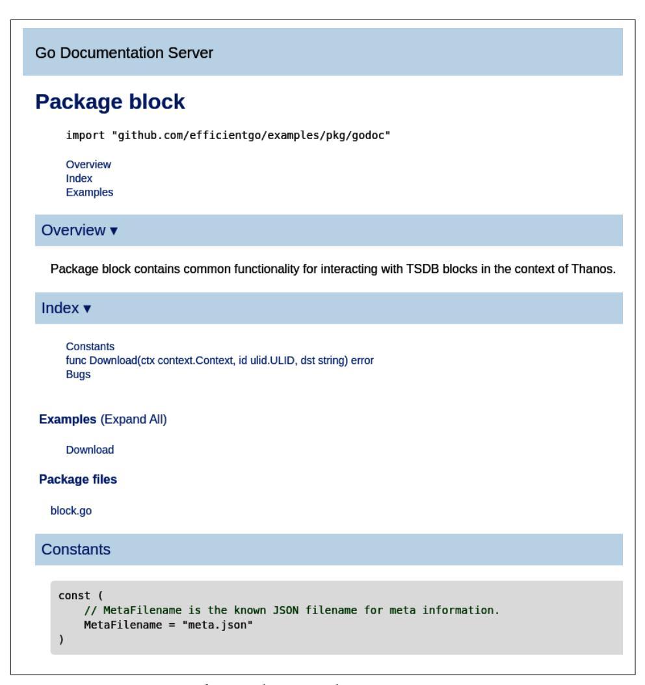
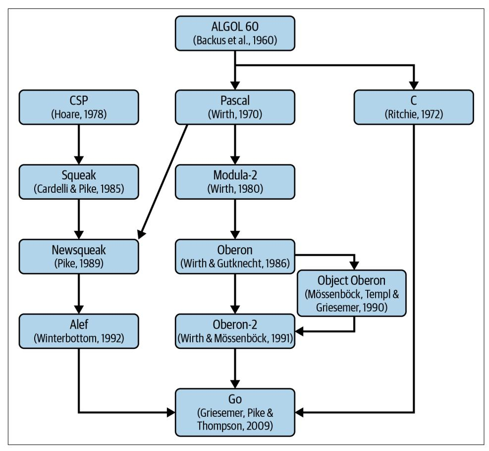

<span id="page-54-0"></span>
# Chapter 2: Efficient Introduction to Go

Go is efficient, scalable, and productive. Some programmers find it fun to work in; others find it unimaginative, even boring. ... Those are not contradictory positions. Go was designed to address the problems faced in software development at Google, which led to a language that is not a breakthrough research language but is nonetheless an excellent tool for engineering large software projects.

—Rob Pike, ["Go at Google: Language Design in the Service of Software](https://oreil.ly/3EItq) [Engineering"](https://oreil.ly/3EItq)

I am a huge fan of the Go programming language. The number of things developers around the world have been able to achieve with Go is impressive. For a few years in a row, Go has been on the list of [top five languages people love or want to learn.](https://oreil.ly/la9bx) It is used in many businesses, including bigger tech companies like Apple, American Express, Cloudflare, Dell, Google, Netflix, Red Hat, Twitch, and [others.](https://oreil.ly/DSM73) Of course, as with everything, nothing is perfect. I would probably change, remove, or add a few things to Go, but if you would wake me in the middle of the night and ask me to quickly write reliable backend code, I would write it in Go. CLI? In Go. Quick, relia‐ ble script? In Go as well. The first language to learn as a junior programmer? Go. Code for IoT, robots, and microprocessors? The answer is also Go.<sup>1</sup> Infrastructure configuration? As of 2022, I don't think there is a better tool for robust templating than Go.<sup>2</sup>

<sup>1</sup> New frameworks on tools for writing Go on small devices are emerging, e.g., [GoBot](https://gobot.io) and [TinyGo](https://tinygo.org).

<sup>2</sup> It's a controversial topic. There is quite a battle in the infrastructure industry for the superior language for configuration as code. For example, among HCL, Terraform, Go templates (Helm), Jsonnet, Starlark, and Cue. In 2018, we even open sourced a tool for writing configuration in Go, called ["mimic".](https://oreil.ly/FNjYD) Arguably, the loudest arguments against writing configuration in Go are that it feels too much like "programming" and requires programming skills from system administrators.

<span id="page-55-0"></span>Don't get me wrong, there are languages with specialized capabilities or ecosystems that are superior to Go. For example, think about graphical user interfaces (GUIs), advanced rendering parts of the game industry, or code running in browsers.<sup>3</sup> How‐ ever, once you realize the many advantages of the Go language, it is pretty painful to jump back to others.

In [Chapter 1](005-chapter-1-software-efficiency-matters.md#page-20-0), we spent some time establishing an efficiency awareness for our soft‐ ware. As a result, we learned that our goal is to write efficient code with the least development effort and cost. This chapter will explain why the Go programming lan‐ guage can be a solid option to achieve this balance between performance and other software qualities.

We will start with "Basics You Should Know About Go" on page 36, then continue with ["Advanced Language Elements" on page 55.](#page-74-0) Both sections list the short but essential facts everyone should know about Go, something I wish I had known when I started my journey with Go in 2014. These sections will cover much more than just basic information about efficiency and can be used as an introduction to Go. How‐ ever, if you are entirely new to the language, I would still recommend reading those sections, then checking other resources mentioned in the summary, perhaps writing your first program in Go, and then getting back to this book. On the other hand, if you consider yourself a more advanced user or expert, I suggest not skipping this chapter. I explain a few lesser-known facts about Go that you might find interesting or controversial (it's OK, everyone can have their own opinions!).

Last but not least, we will finish by answering the tricky question about the overall Go efficiency capabilities in ["Is Go 'Fast'?" on page 67](#page-86-0), as compared to other languages.

## Basics You Should Know About Go

Go is an open source project maintained by Google within a distributed team called the "Go team." The project consists of the programming language specification, com‐ pilator, tooling, documentation, and standard libraries.

Let's go through some facts and best practices to understand Go basics and its char‐ acteristics in fast-forward mode. While some advice here might feel opinionated, this is based on my experience working with Go since 2014—a background full of inci‐ dents, past mistakes, and lessons learned the hard way. I'm sharing them here so you don't need to make those errors.

<sup>3</sup> WebAssembly is meant to change this, though, but [not soon.](https://oreil.ly/rZqtp)

<span id="page-56-0"></span>
### Imperative, Compiled, and Statically Typed Language

The central part of the Go project is the general-purpose language with the same name, primarily designed for systems programming. As you will notice in Example 2-1, Go is an imperative language, so we have (some) control over how things are executed. In addition, it's statically typed and compiled, which means that the compiler can perform many optimizations and checks before the program runs. These characteristics alone are an excellent start to make Go suitable for reliable and efficient programs.

*Example 2-1. Simple program printing "Hello World" and exiting*

```
package main
import "fmt"
func main() {
 fmt.Println("Hello World!")
}
```

Both project and language are called "Go," yet sometimes you can refer to them as "Golang."


#### Go Versus Golang

As a rule of thumb, we should always use the "Go" name every‐ where, unless it's clashing with the English word *go* or an ancient game called "Go." "Golang" came from the domain choice (*[https://](https://golang.org) [golang.org](https://golang.org)*) since "go" was unavailable to its authors. So use "Golang" when searching for resources about this programming language on the web.

Go also has its mascot, called the ["Go gopher".](https://oreil.ly/SbxVX) We see this cute gopher in various forms, situations, and combinations, such as conference talks, blog posts, or project logos. Sometimes Go developers are called "gophers" too!

### Designed to Improve Serious Codebases

It all started when three experienced programmers from Google sketched the idea of the Go language around 2007:

*Rob Pike*

Cocreator of UTF-8 and the Plan 9 operating system. Coauthor of many pro‐ gramming languages before Go, such as Limbo for writing distributed systems

<span id="page-57-0"></span>and Newsqueak for writing concurrent applications in graphical user interfaces. Both were inspired by Hoare's Communicating Sequential Processes (CSP).<sup>4</sup>

#### Robert Griesemer

Among other work, Griesemer developed the [Sawzall language](https://oreil.ly/gYKMj) and did a doctor‐ ate with Niklaus Wirth. The same Niklaus wrote "A Plea for Lean Software" quoted in ["Software gets slower more rapidly than hardware becomes faster"](005-chapter-1-software-efficiency-matters.md#page-39-0) on [page 20.](005-chapter-1-software-efficiency-matters.md#page-39-0)

#### Ken Thompson

One of the original authors of the first Unix system. Sole creator of the grep command-line utility. Ken cocreated UTF-8 and Plan 9 with Rob Pike. He wrote a couple of languages, too, e.g., the Bon and B programming languages.

These three aimed to create a new programming language that was meant to improve mainstream programming, led by C++, Java, and Python at that point. After a year, it became a full-time project, with Ian Taylor and Russ Cox joining in 2008 what was [later referenced as the Go team.](https://oreil.ly/Nnj6N) The Go team announced the public Go project in 2009, with version 1.0 released in March 2012.

The main frustrations<sup>5</sup> related to C++ mentioned in the design of Go were:

- Complexity, many ways of doing the same thing, too many features
- Ultralong compilation times, especially for bigger codebases
- Cost of updates and refactors in large projects
- Not easy to use and memory model prone to errors

These elements are why Go was born, from the frustration of existing solutions and the ambition to allow more by doing less. The guiding principles were to make a lan‐ guage that does not trade safety for less repetition, yet allows simpler code. It does not sacrifice execution efficiency for faster compilation or interpreting, yet ensures that build times are quick enough. [Go tries to compile as fast as possible, e.g., thanks](https://oreil.ly/qxuUS) [to explicit imports.](https://oreil.ly/qxuUS) Especially with caching enabled by default, only changed code is compiled, so build times are rarely longer than a minute.

<sup>4</sup> CSP is a formal language that allows describing interactions in concurrent systems. Introduced by C.A.R. Hoare in *Communications of the ACM* (1978), it was an inspiration for the Go language concurrency system.

<sup>5</sup> Similar frustrations triggered another part of Google to create yet another language[—Carbon](https://oreil.ly/ijFPA) in 2022. Carbon looks very promising, but it has different goals than Go. It is, by design, more efficiency aware and focused on familiarity with C++ concepts and interoperability. So let's see how adoption will catch up for Carbon!

<span id="page-58-0"></span>

#### You Can Treat Go Code as Script!

While technically Go is a compiled language, you can run it like you would run JavaScript, Shell, or Python. It's as simple as invok‐ ing go run <executable package> <flags>. It works great because the compilation is ultrafast. You can treat it like a scripting language while maintaining the advantages of compilation.

In terms of syntax, Go was meant to be simple, light on keywords, and familiar. Syn‐ tax is based on C with type derivation (automatic type detection, like auto in C++), and no forward declarations, no header files. Concepts are kept orthogonal, which allows easier combination and reasoning about them. Orthogonality for elements means that, for example, we can add methods to any type or data definition (adding methods is separate from creating types). Interfaces are orthogonal to types too.

### Governed by Google, Yet Open Source

Since announcing Go, all development has been done in [open source,](https://oreil.ly/ZeKm6) with public mailing lists and bug trackers. Changes go to the public, authoritative source code, held under the [BSD style license.](https://oreil.ly/XBDEK) The Go team reviews all contributions. The process is the same if the change or idea is coming from Google or not. The project road maps and proposals are developed in public too.

Unfortunately, the sad truth is that there are many open source projects, but some projects are less open than others. Google is still the only company stewarding Go and has the last decisive control over it. Even if anyone can modify, use, and contrib‐ ute, projects coordinated by a single vendor risk selfish and damaging decisions like relicensing or blocking certain features. While there were some controversial cases where the Go team decision surprised the community,<sup>6</sup> overall the project is very rea‐ sonably well governed. Countless changes came from outside of Google, and the Go 2.0 draft proposal process has been well respected and community driven. In the end, I believe consistent decision-making and stewarding from the Go team bring many benefits too. Conflicts and different views are inevitable, and having one consistent overview, even if not perfect, might be better than no decision or many ways of doing the same thing.

<sup>6</sup> One notable example is [the controversy behind dependency management work.](https://oreil.ly/3gB9m)

<span id="page-59-0"></span>So far, this project setup has proven to work well for adoption and language stability. For our software efficiency goals, such alignment couldn't be better too. We have a big company invested in ensuring each release doesn't bring any performance regres‐ sions. Some internal Google software depends on Go, e.g., [Google Cloud Platform.](https://oreil.ly/vjyOc) And many people rely on the Google Cloud Platform to be reliable. On the other hand, we have a vast Go community that gives feedback, finds bugs, and contributes ideas and optimizations. And if that's not enough, we have open source code, allow‐ ing us, mere mortal developers, to dive into the actual Go libraries, runtime (see ["Go](#page-77-0) [Runtime" on page 58\)](#page-77-0), etc., to understand the performance characteristics of the par‐ ticular code.

### Simplicity, Safety, and Readability Are Paramount

Robert Griesemer [mentioned in GopherCon 2015](https://oreil.ly/s3ZZ5) that first of all, they knew when they first started building Go what things NOT to do. The main guiding principle was simplicity, safety, and readability. In other words, Go follows the pattern of "less is more." This is a potent idiom that spans many areas. In Go, there is only one *idiomatic* coding style,<sup>7</sup> and a tool called gofmt ensures most of it. In particular, code formatting (next to naming) is an element that is rarely settled among programmers. We spend time arguing about it and tuning it to our specific needs and beliefs. Thanks to a single style enforced by tooling, we save enormous time. As one of the [Go proverbs](https://oreil.ly/ua2G8) goes, "Gofmt's style is no one's favorite, yet gofmt is everyone's favor‐ ite." Overall, the Go authors planned the language to be minimal so that there is essentially one way to write a particular construct. This takes away a lot of decisionmaking when you are writing a program. There is one way of handling errors, one way of writing objects, one way of running things concurrently, etc.

A huge number of features might be "missing" from Go, yet [one could say it is more](https://oreil.ly/CPkvV) [expressive than C or C++](https://oreil.ly/CPkvV). Such minimalism allows for maintaining the simplicity and readability of the Go code, which improves software reliability, safety, and over‐ all higher velocity toward application goals.

<sup>7</sup> Of course, there are some inconsistencies here and there; that's why the community created more [strict for‐](https://oreil.ly/RKUme) [matters](https://oreil.ly/RKUme), [linters](https://oreil.ly/VnQSC), or [style guides.](https://oreil.ly/ETWSq) Yet the standard tools are good enough to feel comfortable in every Go codebase.

#### Is My Code Idiomatic?

<span id="page-60-0"></span>

The word *idiomatic* is heavily overused in the Go community. Usually, it means Go patterns that are "often" used. Since Go adop‐ tion has grown a lot, people have improved the initial "idiomatic" style in many creative ways. Nowadays, it's not always clear what's idiomatic and what's not.

It's like the "This is the way" saying from the *Mandalorian* series. It makes us feel more confident when we say, "This code is idiomatic." So the conclusion is to use this word with care and [avoid it unless you can elaborate the reasoning why some pattern is](https://oreil.ly/dAAKz) [better](https://oreil.ly/dAAKz).

Interestingly, the "less is more" idiom can help our efficiency efforts for this book's purpose. As we learned in [Chapter 1](005-chapter-1-software-efficiency-matters.md#page-20-0), if you do less work at runtime, it usually means faster, lean execution and less complex code. In this book, we will try to maintain this aspect while improving our code performance.

### Packaging and Modules

The Go source code is organized into directories representing either packages or modules. A package is a collection of source files (with the *.go* suffix) in the same directory. The package name is specified with the package statement at the top of each source file, as seen in [Example 2-1.](#page-56-0) All files in the same directory must the same package name<sup>8</sup> (the package name can be different from the directory name). Multi‐ ple packages can be part of a single Go module. A module is a directory with a *go.mod* file that states all dependent modules with their versions required to build the Go application. This file is then used by the dependency management tool [Go Mod‐](https://oreil.ly/z5GqG) [ules.](https://oreil.ly/z5GqG) Each source file in a module can import packages from the same or external modules. Some packages can also be "executable." For example, if a package is called main and has func main() in some file, we can execute it. Sometimes such a package is placed in the cmd directory for easier discovery. Note that you cannot import the executable package. You can only build or run it.

Within the package, you can decide what functions, types, interfaces, and methods are exported to package users and which are accessible only in the package scope. This is important because exporting the minimal amount of API possible for read‐ ability, reusability, and reliability is better. Go does not have any private or public keywords for this. Instead, it takes a slightly new approach. As [Example 2-2](#page-61-0) shows, if the construct name starts with an uppercase letter, any code outside the package can

<sup>8</sup> There is one exception: unit test files that have to end with *\_test.go*. These files can have either the same pack‐ age name or the <package\_name>\_test name allowing to mimic external users of the package.

<span id="page-61-0"></span>use it. If the element name begins with a lowercase letter, it's private. It's worth not‐ ing that this pattern works for all constructs equally, e.g., functions, types, interfaces, variables, etc. (orthogonality).

*Example 2-2. Construct accessibility control using naming case*

```
package main
const privateConst = 1
const PublicConst = 2
var privateVar int
var PublicVar int
func privateFunc() {}
func PublicFunc() {}
type privateStruct struct {
 privateField int
 PublicField int
}
func (privateStruct) privateMethod() {}
func (privateStruct) PublicMethod() {}
type PublicStruct struct {
 privateField int
 PublicField int
}
func (PublicStruct) privateMethod() {}
func (PublicStruct) PublicMethod() {}
type privateInterface interface {
 privateMethod()
 PublicMethod()
}
type PublicInterface interface {
 privateMethod()
 PublicMethod()
}
```

Careful readers might notice tricky cases of exported fields or methods on private type or interface. Can someone outside the package use them if the struct or interface is private? This is quite rarely used, but the answer is yes, you can return a private interface or type in a public function, e.g., func New() privateStruct { return privateStruct{}}. Despite the privateStruct being private, all its public fields and methods are accessible to package users.

<span id="page-62-0"></span>
#### Internal Packages

You can name and structure your code directories as you want to form packages, but one directory name is reserved for special meaning. If you want to ensure that only the given package can import other packages, you can create a package subdirectory named internal. Any package under the internal directory can't be imported by any package other than the ancestor (and other pack‐ ages in internal).

### Dependencies Transparency by Default

In my experience, it is common to import precompiled libraries, such as in C++, C#, or Java, and use exported functions and classes defined in some header files. How‐ ever, importing compiled code has some benefits:

- It relieves engineers from making an effort to compile particular code, i.e., find and download correct versions of dependencies, special compilation tooling, or extra resources.
- It might be easier to sell such a prebuilt library without exposing the source code and worrying about the client copying the business value-providing code.<sup>9</sup>

In principle, this is meant to work well. Developers of the library maintain specific programmatic contracts (APIs), and users of such libraries do not need to worry about implementation complexities.

Unfortunately, in practice, this is rarely that perfect. Implementation can be broken or inefficient, the interfaces can mislead, and documentation can be missing. In such cases, access to the source code is invaluable, allowing us to more deeply understand implementation. We can find issues based on specific source code, not by guessing. We can even propose a fix to the library or fork the package and use it immediately. We can extract the required pieces and use them to build something else.

Go assumes this imperfection by requiring each library's parts (in Go: module's pack‐ ages) to be explicitly imported using a package URI called "import path." Such import is also strictly controlled, i.e., unused imports or cyclic dependencies cause a compilation error. Let's see different ways to declare these imports in [Example 2-3](#page-63-0).

<sup>9</sup> In practice, you can quickly obtain the C++ or Go code (even when obfuscated) from the compiled binary anyway, especially if you don't strip the binary from the debugging symbols.

<span id="page-63-0"></span>*Example 2-3. Portion of import statements from github.com/prometheus/ prometheus module,* main.go *file*

```
import (
 "context"
 "net/http"
 _ "net/http/pprof"
 "github.com/oklog/run"
 "github.com/prometheus/common/version"
 "go.uber.org/atomic"
 "github.com/prometheus/prometheus/config"
 promruntime "github.com/prometheus/prometheus/pkg/runtime"
 "github.com/prometheus/prometheus/scrape"
 "github.com/prometheus/prometheus/storage"
 "github.com/prometheus/prometheus/storage/remote"
 "github.com/prometheus/prometheus/tsdb"
 "github.com/prometheus/prometheus/util/strutil"
 "github.com/prometheus/prometheus/web"
)
```

- If the import declaration does not have a domain with a path structure, it means the package from the "standard"<sup>10</sup> library is imported. This particular import allows us to use code from the \$(go env GOROOT)/src/context/ directory with context reference, e.g., context.Background().
- The package can be imported explicitly without any identifier. We don't want to reference any construct from this package, but we want to have some global vari‐ ables initialized. In this case, the pprof package will add debugging endpoints to the global HTTP server router. While allowed, in practice we should avoid reus‐ ing global, modifiable variables.
- Nonstandard packages can be imported using an import path in the form of an internet domain name and an optional path to the package in a certain module. For example, the Go tooling integrates well with https://github.com, so if you host your Go code in a Git repository, it will find a specified package. In this case, it's the https://github.com/oklog/run Git repository with the run package in the github.com/oklog/run module.

<sup>10</sup> Standard library means packages that are shipped together with the Go language tooling and runtime code. Usually, only mature and core functionalities are provided, as Go has strong compatibility guarantees. Go also maintains an experimental [golang.org/x/exp](https://oreil.ly/KBTwn) module that contains useful code that must be proven to graduate to the standard library.

<span id="page-64-0"></span>If the package is taken from the current module (in this case, our module is github.com/prometheus/prometheus), packages will be resolved from your local directory. In our example, <module root>/config.

This model focuses on open and clearly defined dependencies. It works exceptionally well with the open source distribution model, where the community can collaborate on robust packages in the public Git repositories. Of course, a module or package can also be hidden using standard version control authentication protocols. Furthermore, the official tooling [does not support distributing packages in binary form](https://oreil.ly/EnkBT), so the dependency source is highly encouraged to be present for compilation purposes.

The challenges of software dependency are not easy to solve. Go learned from the mistakes of C++ and others, and takes a careful approach to avoid long compilation times, and an effect commonly called "dependency hell."

Through the design of the standard library, great effort was spent on controlling dependencies. It can be better to copy a little code than to pull in a big library for one function. (A test in the system build complains if new core dependencies arise.) Dependency hygiene trumps code reuse. One example of this in practice is that the (low-level) net package has its own integer-to-decimal conversion routine to avoid depending on the bigger and dependency-heavy formatted I/O package. Another is that the string conversion package strconv has a private implementation of the defini‐ tion of "printable" characters rather than pull in the large Unicode character class tables; that strconv honors the Unicode standard is verified by the package's tests.

—Rob Pike, ["Go at Google: Language Design in the Service of Software](https://oreil.ly/wqKGT) [Engineering"](https://oreil.ly/wqKGT)

Again, with efficiency in mind, potential minimalism in dependencies and transpar‐ ency brings enormous value. Fewer unknowns means we can quickly detect main bottlenecks and focus on the most significant value optimizations first. We don't need to work around it if we notice potential room for optimization in our depend‐ ency. Instead, we are usually welcome to contribute the fix directly to the upstream, which helps both sides!

### Consistent Tooling

From the beginning, Go had a powerful and consistent set of tools as part of its command-line interface tool, called go. Let's enumerate a few utilities:

- go bug opens a new browser tab with the correct place where you can file an offi‐ cial bug report (Go repository on GitHub).
- go build -o <output path> <packages> builds given Go packages.
- go env shows all Go-related environment variables currently set in your terminal session.

- go fmt <file, packages or directories> formats given artifacts to the desired style, cleans whitespaces, fixes wrong indentations, etc. Note that the source code does not need to be even valid and compilable Go code. You can also install an extended official formatter.
- [goimports](https://oreil.ly/6fDcy) also cleans and formats your import statements.


For the best experience, set your programming IDE to run goimports -w \$FILE on every file to not worry about the manual indentation anymore!

- go get <package@version> allows you to install the desired dependency with the expected version. Use the @latest suffix to get the latest version of @none to uninstall the dependency.
- go help <command/topic> prints documentation about the command or given topic. For example, go help environment tells you all about the possible envi‐ ronment variables Go uses.
- go install <package> is similar to go get and installs the binary if the given package is "executable."
- go list lists Go packages and modules. It allows flexible output formatting using Go templates (explained later), e.g., go list -mod=readonly -m -f '{{ if and (not .Indirect) (not .Main)}}{{.Path}}{{end}}' all lists all direct nonexecutable dependent modules.
- go mod allows managing dependent modules.
- go test allows running unit tests, fuzz tests, and benchmarks. We will discuss the latter in detail in [Chapter 8](012-chapter-8-benchmarking-versus-stress-and-load-tests.md#page-294-0).
- go tool hosts a dozen more advanced CLI tools. We will especially take a close look at go tool pprof in ["pprof Format" on page 332](013-chapter-9-data-driven-bottleneck-analysis.md#page-351-0) for performance optimizations.
- go vet runs basic static analysis checks.

In most cases, the Go CLI is all you need for effective Go programming.<sup>11</sup>

<sup>11</sup> While Go is improving every day, sometimes you can add more advanced tools like [goimports](https://oreil.ly/pS9MI) or [bingo](https://oreil.ly/mkjO2) to improve the development experience further. In some areas, Go can't be opinionated and is limited by stabil‐ ity guarantees.

<span id="page-66-0"></span>
### Single Way of Handling Errors

Errors are an inevitable part of every running software. Especially in distributed sys‐ tems, they are expected by design, with advanced research and algorithms for han‐ dling different types of failures.<sup>12</sup> Despite the need for errors, most programming languages do not recommend or enforce a particular way of failure handling. For example, in C++ you see programmers using all means possible to return an error from a function:

- Exceptions
- Integer return codes (if the returned value is nonzero, it means error)
- Implicit status codes<sup>13</sup>
- Other sentinel values (if the returned value is null, then it's an error)
- Returning potential error by argument
- Custom error classes
- Monads<sup>14</sup>

Each option has its pros and cons, but just the fact that there are so many ways of handling errors can cause severe issues. It causes surprises by potentially hiding that some statements can return an error, introduces complexity and, as a result, makes our software unreliable.

Undoubtedly, the intention for so many options was good. It gives a developer choices. Maybe the software you create is noncritical, or is the first iteration, so you want to make a "happy path" crystal clear. In such cases, masking some "bad paths" sounds like a good short-term idea, right? Unfortunately, as with many shortcuts, it poses numerous dangers. Software complexity and demand for functionalities cause the code to never go out of the "first iteration," and noncritical code quickly becomes

<sup>12</sup> [The CAP Theorem](https://oreil.ly/HyBdB) mentions an excellent example of treating failures seriously. It states that you can only choose two from three system characteristics: consistency, availability, and partition. As soon as you distrib‐ ute your system, you must deal with network partition (communication failure). As an error-handling mech‐ anism, you can either design your system to wait (lose availability) or operate on partial data (lose consistency).

<sup>13</sup> bash [has many methods for error handling](https://oreil.ly/Tij9n), but the default one is implicit. The programmer can optionally print or check \${?} that holds the exit code of the last command executed before any given line. An exit code of 0 means the command is executed without any issues.

<sup>14</sup> In principle, a monad is an object that holds some value optionally, for example, some object Option<Type> with methods Get() and IsEmpty(). Furthermore, an "error monad" is an Option object that holds an error if the value is not set (sometimes referred to as Result<Type>).

<span id="page-67-0"></span>a dependency for something critical. This is one of the most important causes of unreliability or hard-to-debug software.

Go takes a unique path by treating the error as a first-citizen language feature. It assumes we want to write reliable software, making error handling explicit, easy, and uniform across libraries and interfaces. Let's see some examples in Example 2-4.

*Example 2-4. Multiple function signatures with different return arguments*

```
func noErrCanHappen() int {
 // ...
 return 204
}
func doOrErr() error {
 // ...
 if shouldFail() {
 return errors.New("ups, XYZ failed")
 }
 return nil
}
func intOrErr() (int, error) {
 // ...
 if shouldFail() {
 return 0, errors.New("ups, XYZ2 failed")
 }
 return noErrCanHappen(), nil
}
```

- The critical aspect here is that functions and methods define the error flow as part of their signature. In this case, the noErrCanHappen function states that there is no way any error can happen during its invocation.
- By looking at the doOrErr function signature, we know some errors can happen. We don't know what type of error yet; we only know it is implementing a built-in error interface. We also know that there was no error if the error is nil.
- The fact that Go functions can return multiple arguments is leveraged when cal‐ culating some result in a "happy path." If the error can happen, it should be the last return argument (always). From the caller side, we should only touch the result if the error is nil.

It's worth noting that Go has an exception mechanism called panics, which are recoverable using the recover() built-in function. While useful or necessary for cer‐ tain cases (e.g., initialization), you should never use panics for conventional error handling in your production code in practice. They are less efficient, hide failures,

and overall surprise the programmers. Having errors as part of invocation allows the compilator and programmer to be prepared for error cases in the normal execution path. Example 2-5 shows how we can handle errors if they occur in our function exe‐ cution path.

*Example 2-5. Checking and handling errors*

```
import "github.com/efficientgo/core/errors"
func main() {
 ret := noErrCanHappen()
 if err := nestedDoOrErr(); err != nil {
 // handle error
 }
 ret2, err := intOrErr()
 if err != nil {
 // handle error
 }
 // ...
}
func nestedDoOrErr() error {
 // ...
 if err := doOrErr(); err != nil {
 return errors.Wrap(err, "do")
 }
 return nil
}
```

- Notice that we did not import the built-in errors package, but instead used the open source drop-in replacement github.com/efficientgo/core/errors. core module. This is my recommended replacement for the errors package and the popular, but archived, github.com/pkg/errors. It allows a bit more advanced logic, like wrapping errors you will see in step three.
- To tell if an error happened, we need to check if the err variable is nil or not. Then, if an error occurs, we can follow with error handling. Usually, it means logging it, exiting the program, incrementing metrics, or even explicitly ignoring it.
- Sometimes, it's appropriate to delegate error handling to the caller. For example, if the function can fail from many errors, consider wrapping it with a errors.Wrap function to add a short context of what is wrong. For example, with github.com/efficientgo/core/errors, we will have context and stack trace, which will be rendered if %+v is used later.

<span id="page-69-0"></span>

#### How to Wrap Errors?

Notice that I recommended errors.Wrap (or errors.Wrapf) instead of the built-in way of wrapping errors. Go defines the %w identifier for the fmt.Errors type of function that allows passing an error. Currently, I would not recommend %w because it's not type safe and as explicit as Wrap, causing nontrivial bugs in the past.

The one way of defining errors and handling them is one of Go's best features. Inter‐ estingly, it is one of the language disadvantages due to verbosity and certain boiler‐ plate involved. It sometimes might feel repetitive, but tools allow you to mitigate the boilerplate.


Some Go IDEs define code templates. For example, in JetBrain's GoLand product, typing **err** and pressing the Tab key will generate a valid if err != nil statement. You can also collapse or expand error handling blocks for readability.

Another common complaint is that writing Go can feel very "pessimistic," because the errors that may never occur are visible in plain sight. The programmer has to decide what to do with them at every step, which takes mental energy and time. Yet, in my experience it's worth the work and makes programs much more predictable and easier to debug.


#### Never Ignore Errors!

Due to the verbosity of error handling, it's tempting to skip err != nil checks. Consider not doing it unless you know a func‐ tion will never return an error (and in future versions!). If you don't know what to do with the error, consider passing it to the caller by default. If you must ignore the error, consider doing it explicitly with the \_ = syntax. Also, always use linters, which will warn you about some portion of unchecked errors.

Are there any implications of the error handling for general Go code runtime effi‐ ciency? Yes! Unfortunately, it's much more significant than developers usually antici‐ pate. In my experience, error paths are frequently an order of magnitude slower and more expensive to execute than happy paths. One of the reasons is we tend not to ignore error flows during our monitoring or benchmarking steps (mentioned in ["Efficiency-Aware Development Flow" on page 102\)](007-chapter-3-conquering-efficiency.md#page-121-0).

Another common reason is that the construction of errors often involves heavy string manipulation for creating human-readable messages. As a result, it can be costly, especially with lengthy debugging tags, which are touched on later in this book.

<span id="page-70-0"></span>Understanding these implications and ensuring consistent and efficient error han‐ dling are essential in any software, and we will take a detailed look at that in the fol‐ lowing chapters.

### Strong Ecosystem

A commonly stated strong point of Go is that its ecosystem is exceptionally mature for such a "young" language. While items listed in this section are not mandatory for solid programming dialects, they improve the whole development experience. This is also why the Go community is so large and still growing.

First, Go allows the programmer to focus on business logic without necessarily reim‐ plementing or importing third-party libraries for basic functionalities like YAML decoding or cryptographic hashing algorithms. Go standard libraries are high quality, robust, ultra-backward compatible, and rich in features. They are well benchmarked, have solid APIs, and have good documentation. As a result, you can achieve most things without importing external packages. For example, running an HTTP server is dead simple, as visualized in Example 2-6.

*Example 2-6. Minimal code for serving HTTP requests<sup>15</sup>*

```
package main
import "net/http"
func handle(w http.ResponseWriter, _ *http.Request) {
 w.Write([]byte("It kind of works!"))
}
func main() {
 http.ListenAndServe(":8080", http.HandlerFunc(handle))
}
```

In most cases, the efficiency of standard libraries is good enough or even better than third-party alternatives. For example, especially lower-level elements of packages, net/http for HTTP client and server code, or crypto, math, and sort parts (and more!), have a good amount of optimizations to serve most of the use cases. This allows developers to build more complex code on top while not worrying about the basics like sorting performance. Yet that's not always the case. Some libraries are meant for specific usage, and misusing them may result in significant resource waste. We will look at all the things you need to be aware of in [Chapter 11.](015-chapter-11-optimization-patterns.md#page-434-0)

<sup>15</sup> Such code is not recommended for production, but the only things that would need to change are avoiding using global variables and checking all errors.

<span id="page-71-0"></span>Another highlight of the mature ecosystem is a basic, official in-browser Go editor called [Go Playground](https://oreil.ly/9Os3y). It's a fantastic tool if you want to test something out quickly or share an interactive code example. It's also straightforward to extend, so the commu‐ nity often publishes variations of the Go Playground to try and share previously experimental language features like [generics](https://oreil.ly/f0qpm) (which are now part of the primary lan‐ guage and explained in ["Generics" on page 63\)](#page-82-0).

Last but not least, the Go project defines its templating language, called [Go templates.](https://oreil.ly/FdEZ8) In some way, it's similar to Python's [Jinja2 language.](https://oreil.ly/U6Em1) While it sounds like a side fea‐ ture of Go, it's beneficial in any dynamic text or HTML generation. It is also often used in popular tools like [Helm](https://helm.sh) or [Hugo](https://gohugo.io).

### Unused Import or Variable Causes Build Error

The compilation will fail if you define a variable in Go but never read any value from it or don't pass it to another function. Similarly, it will fail if you added a package to the import statement but don't use that package in your file.

I see that Go developers have gotten used to this feature and love it, but it is surpris‐ ing for newcomers. Failing on unused constructs can be frustrating if you want to play with the language quickly, e.g., create some variable without using it for debug‐ ging purposes.

There are, however, ways to handle these cases explicitly! You can see a few examples of dealing with these usage checks in Example 2-7.

*Example 2-7. Various examples of unused and used variables*

```
package main
func use(_ int) {}
func main() {
 var a int // error: a declared but not used 
 b := 1 // error: b declared but not used 
 var c int
 d := c // error: d declared but not used 
 e := 1
 use(e)
 f := 1
 _ = f
}
```

Variables a, b, and c are not used, so they cause a compilation error.

- <span id="page-72-0"></span>Variable e is used.
- Variable f is technically used for an explicit no identifier (\_). Such an approach is useful if you explicitly want to tell the reader (and compiler) that you want to ignore the value.

Similarly, unused imports will fail the compilation process, so tools like goimports (mentioned in ["Consistent Tooling" on page 45](#page-64-0)) automatically remove unused ones. Failing on unused variables and imports effectively ensures that code stays clear and relevant. Note that only internal function variables are checked. Elements like unused struct fields, methods, or types are not checked.

### Unit Testing and Table Tests

Tests are a mandatory part of every application, small or big. In Go, tests are a natural part of the development process—easy to write, and focused on simplicity and read‐ ability. If we want to talk about efficient code, we need to have solid testing in place, allowing us to iterate over the program without worrying about regressions. Add a file with the *\_test.go* suffix to introduce a unit test to your code within a package. You can write any Go code within that file, which won't be reachable from the production code. There are, however, four types of functions you can add that will be invoked for different testing parts. A certain signature distinguishes these types, notably function name prefixes: Test, Fuzz, Example, or Benchmark, and specific arguments.

Let's walk through the unit test type in Example 2-8. To make it more interesting, it's a table test. Examples and benchmarks are explained in ["Code Documentation as a](#page-74-0) [First Citizen" on page 55](#page-74-0) and ["Microbenchmarks" on page 275.](012-chapter-8-benchmarking-versus-stress-and-load-tests.md#page-294-0)

*Example 2-8. Example unit table test*

```
package max
import (
 "math"
 "testing"
 "github.com/efficientgo/core/testutil"
)
func TestMax(t *testing.T) {
 for _, tcase := range []struct {
 a, b int
 expected int
 }{
 {a: 0, b: 0, expected: 0},
 {a: -1, b: 0, expected: 0},
```

```
 {a: 1, b: 0, expected: 1},
 {a: 0, b: -1, expected: 0},
 {a: 0, b: 1, expected: 1},
 {a: math.MinInt64, b: math.MaxInt64, expected: math.MaxInt64},
 } {
 t.Run("", func(t *testing.T) {
 testutil.Equals(t, tcase.expected, max(tcase.a, tcase.b))
 })
 }
}
```

- If the function inside the *\_test.go* file is named with the Test word and takes exactly t \*testing.T, it is considered a "unit test." You can run them through the go test command.
- Usually, we want to test a specific function using multiple test cases (often edge cases) that define different input and expected output. This is where I would sug‐ gest using table tests. First, define your input and output, then run the same function in an easy-to-read loop.
- Optionally, you can invoke t.Run, which allows you to specify a subtest. Defining those on dynamic test cases like table tests is a good practice. It will enable you to navigate to the failing case quickly.
- The Go testing.T type gives useful methods like Fail or Fatal to abort and fail the unit test, or Error to continue running and check other potential errors. In our example, I propose using a simple helper called testutil.Equals from our [open source core library,](https://oreil.ly/yAit9) giving you a nice diff.<sup>16</sup>

Write tests often. It might surprise you, but writing unit tests for critical parts up front will help you implement desired features much faster. This is why I recommend following some reasonable form of test-driven development, covered in ["Efficiency-](007-chapter-3-conquering-efficiency.md#page-121-0)[Aware Development Flow" on page 102](007-chapter-3-conquering-efficiency.md#page-121-0).

This information should give you a good overview of the language goals, strengths, and features before moving to more advanced features.

<sup>16</sup> This assertion pattern is also typical in other third-party libraries like the popular testify [package.](https://oreil.ly/I47fD) However, I am not a fan of the testify package, because there are too many ways of doing the same thing.

<span id="page-74-0"></span>
### Advanced Language Elements

Let's now discuss the more advanced features of Go. Similar to the basics mentioned in the previous section, it's crucial to overview core language capabilities before dis‐ cussing efficiency improvements.

### Code Documentation as a First Citizen

Every project, at some point, needs solid API documentation. For library-type projects, the programmatic APIs are the main entry point. Robust interfaces with good descriptions allow developers to hide complexity, bring value, and avoid sur‐ prises. A code interface overview is essential for applications, too, allowing anyone to understand the codebase quickly. Reusing an application's Go packages in other projects is also not uncommon.

Instead of relying on the community to create many potentially fragmented and incompatible solutions, the Go project developed a tool called [godoc](https://oreil.ly/TQXxv) from the start. It behaves similarly to Python's [Docstring](https://oreil.ly/UdkzS) and Java's [Javadoc](https://oreil.ly/wlWGT). godoc generates a consis‐ tent documentation HTML website directly from the code and its comments.

The amazing part is that you don't have many special conventions that would directly make the code comments less readable from the source code. To use this tool effec‐ tively, you need to remember five things. Let's go through them using Examples 2-9 and [2-10.](#page-75-0) The resulting HTML page, when godoc [is invoked,](https://oreil.ly/EYJlx) can be seen in [Figure 2-1](#page-76-0).

*Example 2-9. Example snippet of block.go file with godoc compatible documentation*

```
// Package block contains common functionality for interacting with TSDB blocks
// in the context of Thanos.
package block
import ...
const (
 // MetaFilename is the known JSON filename for meta information. 
 MetaFilename = "meta.json"
)
// Download the downloads directory... 
// BUG(bwplotka): No known bugs, but if there was one, it would be outlined here. 
func Download(ctx context.Context, id ulid.ULID, dst string) error {
// ...
// cleanUp cleans the partially uploaded files. 
func cleanUp(ctx context.Context, id ulid.ULID) error {
// ...
```

- <span id="page-75-0"></span>Rule 1: The optional package-level description must be placed on top of the pack age entry with no intervening blank line and start with the Package <name> pre‐ fix. If any source files have these entries, godoc will collect them all. If you have many files, the convention is to have the *doc.go* file with just the package-level documentation, package statement, and no other code.
- Rule 2: Any public construct should have a full sentence commentary, starting with the name of the construct (it's important!), right before its definition.
- Rule 3: Known bugs can be mentioned with // BUG(who) statements.
- Private constructs can have comments, but they will never be exposed in the doc‐ umentation since they are private. Be consistent and start them with a construct name, too, for readability.

*Example 2-10. Example snippet of block\_test.go file with godoc compatible documentation*

```
package block_test
import ...
func ExampleDownload() {
 // ...
 // Output: ... 
}
```

- Rule 4: If you write a function named Example<ConstructName> in the test file, e.g., block\_test.go, the godoc will generate an interactive code block with the desired examples. Note that the package name must have a *\_test* suffix, too, rep‐ resenting a local testing package that tests the package without access to private fields. Since examples are part of the unit test, they will be actively run and compiled.
- Rule 5: If the example has the last comment starting with // Output:, the string after it will be asserted with the standard output after the example, allowing the example to stay reliable.

<span id="page-76-0"></span>

*Figure 2-1. godoc output of Examples [2-9](#page-74-0) and [2-10](#page-75-0)*

I highly recommend sticking to those five simple rules. Not only because you can manually run godoc and generate your documentation web page, but the additional benefit is that these rules make your Go code comments structured and consistent. Everyone knows how to read them and where to find them.


I recommend using complete English sentences in all comments, even if the will not appear in godoc. It will help you keep your code commentary self-explanatory and explicit. After all, comments are for humans to read.

<span id="page-77-0"></span>Furthermore, the Go team maintains a [public documentation website](https://pkg.go.dev) that scrapes all requested public repositories for free. Thus, if your public code repository is compati‐ ble with godoc, it will be rendered correctly, and users can read the autogenerated documentation for every module or package version.

### Backward Compatibility and Portability

Go has a strong take on backward compatibility guarantees. This means that core APIs, libraries, and language specifications should never break old code created for [Go 1.0.](https://oreil.ly/YOKfu) This was proven to be well executed. There is a lot of trust in upgrading Go to the latest minor or patch versions. Upgrades are, in most cases, smooth and without significant bugs and surprises.

Regarding efficiency compatibility, it's hard to discuss any guarantees. There is (usu‐ ally) no guarantee that the function that does two memory allocations now will not use hundreds in the next version of the Go project and any library. There have been surprises between versions in efficiency and speed characteristics. The community is working hard on improving the compilation and language runtime (more in "Go Runtime" on page 58 and [Chapter 4](008-chapter-4-how-go-uses-the-cpu-resource-or-two.md#page-130-0)). Since the hardware and operating systems are also developed, the Go team is experimenting with different optimizations and fea‐ tures to allow everyone to execute more efficiently. Of course, we don't speak about major performance regression here, as that is usually noticed and fixed in the release candidate period. Yet if we want our software to be deliberately fast and efficient, we need to be more vigilant and aware of the changes Go introduces.

Source code is compiled into binary code that is targeted to each platform. Yet Go tooling allows cross-platform compilation, so you can build binaries to almost all architectures and operating systems.


When you execute the Go binary, which was compiled for a differ‐ ent operating system (OS) or architecture, it can return cryptic error messages. For example, a common error is an Exec format error when you try running binary for Darwin (macOS) on Linux. You must recompile the code source for the correct architecture and OS if you see this.

Regarding portability, we can't skip mentioning the Go runtime and its characteristics.

### Go Runtime

Many languages decided to solve portability across different hardware and operating systems by using virtual machines. Typical examples are [Java Virtual Machine \(JVM\)](https://oreil.ly/fhOmL) for Java bytecode compatible languages (e.g., Java or Scala), and [Common Language](https://oreil.ly/StGbU) <span id="page-78-0"></span>[Runtime \(CLR\)](https://oreil.ly/StGbU) for .NET code, e.g., C#. Such a virtual machine allows for building languages without worrying about complex memory management logic (allocation and releasing), differences between hardware and operating systems, etc. JVM or CLR interprets the intermediate bytecode and transfers program instructions to the host. Unfortunately, while making it easier to create a programming language, they also introduce some overhead and many unknowns.<sup>17</sup> To mitigate the overhead, vir‐ tual machines often use complex optimizations like [just-in-time \(JIT\) compilation](https://oreil.ly/XXARz) to process chunks of specific virtual machine bytecode to machine code on the fly.

Go does not need any "virtual machine." Our code and used libraries compile fully to machine code during compilation time. Thanks to standard library support of large operating systems and hardware, our code, if compiled against particular architec‐ ture, will run there with no issues.

Yet something is running in the background (concurrently) when our program starts. It's the [Go runtime](https://oreil.ly/mywcZ) logic that, among other minor features of Go, is responsible for memory and concurrency management.

### Object-Oriented Programming

Undoubtedly, object-oriented programming (OOP) got enormous traction over the last decades. It was invented around 1967 by Alan Kay, and it's still the most popular paradigm in programming.<sup>18</sup> OOP allows us to leverage advanced concepts like [encapsulation, abstraction, polymorphisms, and inheritance](https://oreil.ly/8hA0u). In principle, it allows us to think about code as some objects with attributes (in Go fields) and behaviors (methods) telling each other what to do. Most OOP examples talk about high-level abstractions like an animal that exposes the Walk() method or a car that allows to Ride(), but in practice, objects are usually less abstract yet still helpful, encapsulated, and described by a class. There are no classes in Go, but there are struct types equiv‐ alents. Example 2-11 shows how we can write OOP code in Go to compact multiple block objects into one.

*Example 2-11. Example of the OOP in Go with Group that can behave like Block*

```
type Block struct {
 id uuid.UUID
```

<sup>17</sup> Since programs, e.g., in Java, compile to Java bytecode, many things happen before the code is translated to actual machine-understandable code. The complexity of this process is too great to be understood by a mere mortal, so [machine learning "AI" tools were created](https://oreil.ly/baNvh) to auto-tune JVM.

<sup>18</sup> [A survey in 2020](https://oreil.ly/WrtCH) shows that among the top 10 used programming languages, 2 mandates object-oriented pro‐ gramming (Java, C#), 6 encourage it, and 2 do not implement OOP. I personally almost always favor objectoriented programming for algorithms that have to hold some context larger than three variables between data structures or functions.

```
 start, end time.Time
 // ...
}
func (b Block) Duration() time.Duration {
 return b.end.Sub(b.start)
}
type Group struct {
 Block
 children []uuid.UUID
}
func (g *Group) Merge(b Block) {
 if g.end.IsZero() || g.end.Before(b.end) {
 g.end = b.end
 }
 if g.start.IsZero() || g.start.After(b.start) {
 g.start = b.start
 }
 g.children = append(g.children, b.id)
}
func Compact(blocks ...Block) Block {
 sort.Sort(sortable(blocks))
 g := &Group{}
 g.id = uuid.New()
 for _, b := range blocks {
 g.Merge(b)
 }
 return g.Block
}
```

- In Go, there is no separation between structures and classes, like in C++. In Go, on top of basic types like integer, string, etc., there is a struct type that can have methods (behaviors) and fields (attributes). We can use structures as a class equivalent to *encapsulate* more complex logic under a more straightfor‐ ward interface. For example, the Duration() method on Block tells us the dura‐ tion of the time range covered by the block.
- If we add some struct, e.g., Block, into another struct, e.g., Group, without any name, such a Block struct is considered embedded instead of being a field. Embedding allows Go developers to get the most valuable part of *inheritance*, borrowing the embedded structure fields and methods. In this case, Group will have Block's fields and Duration method. This way, we can reuse a significant amount of code in our production codebases.

- <span id="page-80-0"></span>There are two types of methods you can define in Go: using the "value receiver" (e.g., as in the Duration() method) or using the "pointer receiver" (with \*). The so-called receiver is the variable after func, which represents the type we are adding a method to, in our case Group. We will mention this in ["Values, Pointers,](009-chapter-5-how-go-uses-memory-resource.md#page-195-0) [and Memory Blocks" on page 176](009-chapter-5-how-go-uses-memory-resource.md#page-195-0), but the rule regarding which one to use is straightforward:
  - Use the value receiver (no func (g Group) SomeMethod()) if your method does not modify the Group state. For the value receiver, every time we invoke it, the g will create a local copy of the Group object. It is equivalent to func SomeMethod(g Group).
  - Use the pointer receiver (e.g., func (g \*Group) SomeMethod()) if your method is meant to modify the local receiver state or if any other method does that. It is equivalent to func SomeMethod(g \*Group). In our example, if the Group.Merge() method would be a value receiver, we will not persist g.childen changes or potentially inject g.start and g.end values. Addition‐ ally, for consistency, it's always recommended to have a type with all pointer receiver methods if at least one requires a pointer.
- To compact multiple blocks together, our algorithm requires a sorted list of blocks. We can use the standard library [sort.Sort](https://oreil.ly/N6ZWS), which expects the sort.Interface interface. The []Block slice does not implement this interface, so we convert it to our temporary sortable type, explained in [Example 2-13](#page-81-0).
- This is the only missing element for true inheritance. Go does not allow casting specific types into another type unless it's an alias or strict single-struct embed‐ ding (shown in [Example 2-13](#page-81-0)). After that, you can only cast the interface into some type. That's why we need to specify embedded struct and Block explicitly. As a result, Go is often considered a language that does not support full inheritance.

What does [Example 2-11](#page-78-0) give us? First, the Group type can reuse Block functionality, and if done correctly, we can use Group as any other Block.


### Embedding Multiple Types

You can embed as many unique structures as you want within one struct.

There is no priority for these—the compilation will fail if the com‐ pilator can't tell which method to use because two embedded types have the same SomeMethod() method. In such cases, use the type name to explicitly tell the compilator what should be used.

<span id="page-81-0"></span>As mentioned in [Example 2-11](#page-78-0), Go also allows defining interfaces that tell what methods struct has to implement to match it. Note that there is no need to mark a specific struct explicitly that implements a particular interface, as in other languages like Java. It's enough just to implement the required methods. Let's see an example of sorting interface exposed by the standard library in Example 2-12.

*Example 2-12. Sorting interface from the standard sort Go library*

```
// A type, typically a collection, that satisfies sort.Interface can be
// sorted by the routines in this package. The methods require that the
// elements of the collection be enumerated by an integer index.
type Interface interface {
 // Len is the number of elements in the collection.
 Len() int
 // Less reports whether the element with
 // index i should sort before the element with index j.
 Less(i, j int) bool
 // Swap swaps the elements with indexes i and j.
 Swap(i, j int)
}
```

To use our type in the sort.Sort function, it has to implement all sort.Interface methods. Example 2-13 shows how sortable type does it.

*Example 2-13. Example of the type that can be sorted using sort.Slice*

```
type sortable []Block
func (s sortable) Len() int { return len(s) }
func (s sortable) Less(i, j int) bool { return s[i].start.Before(s[j].start) }
func (s sortable) Swap(i, j int) { s[i], s[j] = s[j], s[i] }
var _ sort.Interface = sortable{}
```

- We can embed another type (e.g., a slice of Block elements) as the only thing in our sortable struct. This allows easy (but explicit) casting between []Block and sortable, as we used in the Compact method in [Example 2-11](#page-78-0).
- We can sort by increasing the start time using the [time.Time.Before\(...\)](https://oreil.ly/GQ2Ru) method.
- We can assert our sortable type implements sort.Interface using this singleline statement, which fails compilation otherwise. I recommend using such state‐ ments whenever you want to ensure your type stays compatible with a particular interface in the future!

<span id="page-82-0"></span>To sum up, struct methods, fields, and interfaces are an excellent yet simple way of writing both procedural composable and object-oriented code. In my experience, eventually it satisfies both low-level and high-level programming needs during our software development. While Go does not support all inheritance aspects (type to type casting), it provides enough to satisfy almost all OOP cases.

### Generics

Since version 1.18, Go supports [generics](https://oreil.ly/qYyuQ), one of the community's most desired fea‐ tures. Generics, also called [parametric polymorphism,](https://oreil.ly/UIUAg) allow type-safe implementa‐ tions of the functionalities we want to reuse across different types.

The demand for generics in Go started quite big discussions in the Go team and com‐ munity because of two main problems:

*Two ways of doing the same thing*

From the beginning, Go already supported type-safe reusable code via interfaces. You could see that in the preceding OOP example—the [sort.Sort](https://oreil.ly/X2NxR) can be reusa‐ ble by all types that implement a sort.Interface presented in [Example 2-12.](#page-81-0) We can sort our custom Block type by implementing those methods in [Example 2-13.](#page-81-0) Adding generics means we have [two ways of doing a thing](https://oreil.ly/dL8uE) in many cases.

However, interfaces can be more troublesome for users of our code and slow at times due to [some runtime overhead](https://oreil.ly/8tSVf).

#### Overhead

Implementing generics can have many negative consequences for the language. Depending on the implementation, it can impact different things. For example:

- We can just skip implementing them like in C, which slows programmers.
- We can use [monomorphization,](https://oreil.ly/B062N) which essentially copies the code for each type that will be used. This impacts compile time and binary size.
- We can use boxing like in Java, which is quite similar to the Go interface implementation. In this case, we impact execution time or memory usage.

The generic dilemma is this: do you want slow programmers, slow compilers and bloa‐ ted binaries, or slow execution times?

```
—Russ Cox, "The Generic Dilemma"
```

After many proposals and debates, the final (extremely detailed!) [design](https://oreil.ly/k9cCR) was accepted. Initially, I was very skeptical, but the accepted generic use turned out to be clear and reasonable. So far, the community also didn't jump ahead and abuse these mechanics as was feared. We tend to see generics used very rarely—only when needed, as it makes the code more complex to maintain.

For example, we could write a generic sort for all basic types like int, float64, or even strings, as presented in Example 2-14.

*Example 2-14. Example implementation of the generic sort for basic types*

```
// import "golang.org/x/exp/constraints" 
type genericSortableBasic[T constraints.Ordered] []T
func (s genericSortableBasic[T]) Len() int { return len(s) }
func (s genericSortableBasic[T]) Less(i, j int) bool { return s[i] < s[j] }
func (s genericSortableBasic[T]) Swap(i, j int) { s[i], s[j] = s[j], s[i] }
func genericSortBasic[T constraints.Ordered](slice []T) {
 sort.Sort(genericSortableBasic[T](slice))
}
func Example() {
 toSort := []int{-20, 1, 10, 20}
 sort.Ints(toSort)
 toSort2 := []int{-20, 1, 10, 20}
 genericSortBasic[int](toSort2)
 // ...
}
```

- Thanks to generics (also called type parameters), we can implement a single type that will implement sort.Interface (see [Example 2-13\)](#page-81-0) for all basic types. We can provide custom constraints that look mostly like interfaces to limit the types that can be used as a type parameter. Here we use a type that represents Integer | Float | ~string constraints, so any type that supports comparison operators. We can put any other interface, like any to match all types. We can also use a special comparable keyword that will allow us to use the object of T comparable as a map key.
- Any element of s slice is now expected to be of type T with Ordered constraints, so the compiler will allow us to compare them for Less functionality.
- We can now implement a sort function for any basic type that will leverage sort.Sort implementation.
- We don't need to implement type-specific functions like sort.Ints. We can do genericSortBasic[<type>]([]<type>) as long as the slice is of the types that can be ordered!

This is great, but it only works for basic types. Unfortunately, we cannot override operators like < in Go (yet), so to implement generic sort for more complex types, we have to do a bit more work. For example, we could design our sort to expect each type to implement the func <typeA> Compare(<typeA>) int method.<sup>19</sup> If we add this method to the Block in [Example 2-11,](#page-78-0) we can sort it easily, as presented in Example 2-15.

*Example 2-15. Example implementation of the generic sort for certain types of objects*

```
type Comparable[T any] interface {
 Compare(T) int
}
type genericSortable[T Comparable[T]] []T
func (s genericSortable[T]) Len() int { return len(s) }
func (s genericSortable[T]) Less(i, j int) bool { return s[i].Compare(s[j]) > 0 }
func (s genericSortable[T]) Swap(i, j int) { s[i], s[j] = s[j], s[i] }
func genericSort[T Comparable[T]](slice []T) {
 sort.Sort(genericSortable[T](slice))
}
func (b Block) Compare(other Block) int {
 // ...
}
func Example() {
 toSort := []Block{ /* ... */ }
 sort.Sort(sortable(toSort))
 toSort2 := []Block{ /* ... */ }
 genericSort[Block](toSort2)
}
```

- Let's design our constraint. We expect every type to have a Compare method that accepts the same type. Because constraints and interfaces can also have type parameters, we can implement such requirements.
- We can now provide a type that implements a sort.Interface interface for such kinds of objects. Notice the nested T in Comparable[T], as our interface also is generic!
- Now we can implement Compare for our Block type.

<sup>19</sup> I prefer [functions to methods](https://oreil.ly/Et9CE), as they're easier to use in most cases.

<span id="page-85-0"></span>Thanks to this, we don't need to implement a sortable type for every custom type we want to sort. As long as the type has the Compare method, we can use genericSort!

The accepted design shows advantages in cases where the user interface alone would be cumbersome. But what about the generics dilemma problem? The design allows any [implementation,](https://oreil.ly/rZBtz) so what trade-off was chosen at the end? We won't go into the details in this book, but Go uses the [dictionaries and stenciling](https://oreil.ly/poLls) algorithm, which is between monomorphization and boxing.<sup>20</sup>


#### Generic Code Will Be Faster?

The specific implementation of generics in Go (which can change over time) means that the generic implementation, in theory, should be faster than interfaces but slower than implementing cer‐ tain functionality for a specific type by hand. In practice, however, the potential difference is, in most cases, negligible, so use the most readable and easy-to-maintain option first.

In my experience, the difference might matter in the efficiencycritical code, but the results do not always follow the theory. For example, sometimes [generic implementation is faster](https://oreil.ly/9cEIb), and some‐ times [using interfaces might be more efficient](https://oreil.ly/tiOhS). Conclusion? Always perform benchmarks ([Chapter 8\)](012-chapter-8-benchmarking-versus-stress-and-load-tests.md#page-294-0) to be sure!

To sum up, these facts are what I found crucial when teaching others programming in Go, based on my own experience with the language. Moreover, it will be helpful when diving deeper into the runtime performance of Go later in this book.

However, if you have never programmed in Go before, it's worth going through other materials like the [tour of Go](https://oreil.ly/J3HE3) before jumping to the subsequent sections and chapters of this book. Make sure you try writing your own basic Go program, write a unit test, and use loops, switches, and concurrency mechanisms like channels and routines. Learn common types and standard library abstraction. As a person coming to a new language, you need to produce a program returning valid results before ensuring that it executes quickly and efficiently.

We learned about some basic and advanced characteristics of Go, so it's time to unwrap the efficiency aspects of the language. How easy is it to write good enough or high-performance code in Go?

<sup>20</sup> The summary was well explained on the *[PlanetScale](https://oreil.ly/ksqO0)* blog post.

<span id="page-86-0"></span>
### Is Go "Fast"?

Recently, many companies have rewritten their products (e.g., from Ruby, Python, and Java) to Go.<sup>21</sup> Two repeatedly stated reasons for moving to Go or starting a new project in Go were readability and excellent performance. Readability comes from simplicity and consistency (e.g., single way of error handling as you remember from ["Single](#page-66-0) Way of [Handling](#page-66-0) Errors" on page 47), and it's where Go excels, but what about perfor‐ mance? Is Go fast compared to other languages like Python, Java, or C++?

In my opinion, this question is badly formed. Given time and room for complexities, any language can be as fast as your machine and operating system allow. That's because, in the end, the code we write is compiled into machine code that uses the exact CPU instructions. Also, most languages allow delegating execution to other processes, e.g., written in optimized Assembly. Unfortunately, sometimes all we use to decide if a lan‐ guage is "fast" are raw, semi-optimized short program benchmarks that compare execu‐ tion time and memory usage across languages. While it tells us something, it effectively does not show practical aspects, e.g., how complex the programming for efficiency was.<sup>22</sup>

Instead, we should look at a programming language in terms of how hard and practi‐ cal it is to write efficient code (not just fast), and how much readability and reliability such a process sacrifices. I believe the Go language has a superior balance between those elements while keeping it fast and trivial to write basic, functional code.

One of the reasons for being able to write efficient code more easily is the hermetic compilation stage, the relatively small amount of unknowns in the Go runtime (see ["Go Runtime" on page 58\)](#page-77-0), the easy-to-use concurrency framework, and the maturity of the debugging, benchmarking, and profiling tools (discussed in Chapters [8](012-chapter-8-benchmarking-versus-stress-and-load-tests.md#page-294-0) and [9\)](013-chapter-9-data-driven-bottleneck-analysis.md#page-348-0). Those Go characteristics did not appear from thin air. Not many know, but Go was designed on the shoulders of giants: C, Pascal, and CSP.

In 1960, language experts from America and Europe teamed up to create Algol 60. In 1970, the Algol tree split into the C and the Pascal branch. ~40 years later, the two branches join again in Go.

—Robert Griesemer, ["The Evolution of Go"](https://oreil.ly/a4V1e)

As we can see in [Figure 2-2,](#page-87-0) many of the names mentioned in [Chapter 1](005-chapter-1-software-efficiency-matters.md#page-20-0) are grandfa‐ thers of Go. The great concurrency language CSP created by Sir Hoare, Pascal decla‐

<sup>21</sup> To name a few public changes, we've seen the [Salesforce case](https://oreil.ly/H3WsC), [AppsFlyer,](https://oreil.ly/iazde) and [Stream](https://oreil.ly/NSJLD).

<sup>22</sup> For example, when we look at some [benchmarks,](https://oreil.ly/s7qTj) we see Go as sometimes faster, sometimes slower than Java. Yet if we look at CPU loads, every time Go or Java is faster, it's simply faster because, for example, the implementation allowed fewer CPU cycles to be wasted on memory access. You can achieve that in any programming language. The question is, how hard was it to achieve this? We don't usually measure how much time we spend to optimize code in each particular language, how easy it is to read or extend such code after optimizations, etc. Only those metrics might tell us which programming language is "faster."

<span id="page-87-0"></span>rations and packages created by Wirth, and C basic syntax all contributed to how Go looks today.



*Figure 2-2. Go genealogy*

But not everything can be perfect. In terms of efficiency, Go has its own Achilles' heel. As you will learn in ["Go Memory Management" on page 172](009-chapter-5-how-go-uses-memory-resource.md#page-191-0), memory usage can sometimes be hard to control. Allocations in our program can be surprising (espe‐ cially for new users), and the garbage collections automatic memory release process has some overhead and eventual behavior. Especially for data-intensive applications, it takes effort to ensure memory or CPU efficiency, similar to machines with strictly limited RAM capacities (e.g., IoT).

Yet the decision to automate this process is highly beneficial, allowing the program‐ mer to not worry about memory cleanup, which has proven to be even worse and sometimes catastrophic (e.g., deallocating memory twice). An excellent example of alternative mechanisms that other languages use is Rust. It implements a unique <span id="page-88-0"></span>memory ownership model that replaces automatic global garbage collection. Unfortunately, while more efficient, it turns out that writing code in Rust is much more complicated than in Go. That's why we see higher adoption of Go. This reflects the Go team's ease-of-use trade-off in this element.

Fortunately, there are ways to mitigate the negative performance consequences of the garbage collection mechanism in Go and keep our software lean and efficient. We will go through those in the following chapters.

### Summary

In my opinion, Go is an incredibly elegant and consistent language. Moreover, it offers many modern and innovative features that make programming more effective and reliable. Plus, the code is readable and maintainable by design.

This is a critical foundation for the efficiency improvements we will discuss later in this book. Like any other feature, optimizations always add complexity, so it's easier to modify simple code than to complicate already complex code. Simplicity, safety, and readability are paramount, even for efficient code. Make sure you know how to achieve that without thinking about efficiency first!

Many resources go into more details for elements I could spend only a subchapter on. If you are interested to learn more, there is nothing better than practice. If you need more experience with Go before we jump into optimizations, here is a short list of excellent resources:

- ["Effective Go"](https://oreil.ly/9auky)
- ["How to Write Go Code"](https://oreil.ly/uS51g)
- ["A Tour of Go"](https://oreil.ly/LpGBN)
- ["Practical Go Lessons"](https://oreil.ly/VnFms) by Maximilien Andile, available for free in the digital version
- Contributing to any open source project in Go, for example, through the [CNCF](https://oreil.ly/Y3D2Q) [mentoring initiatives](https://oreil.ly/Y3D2Q) we offer four or more times a year

The true power of the Go optimizations, benchmarking, and efficiency practices comes when used in practice, in everyday programming. Therefore, I want to empower you to marry efficiency with other good techniques around reliability or abstractions for prac‐ tical use. While fully tailored logic sometimes has to be built for a critical path (as you will see in [Chapter](014-chapter-10-optimization-examples.md#page-400-0) 10), the basic, often good enough, efficiency comes from under‐ standing simple rules and language capabilities. That's why I focused on giving you a better overview of Go and its features in this chapter. With this knowledge, we can now move to [Chapter](007-chapter-3-conquering-efficiency.md#page-90-0) 3, where we will learn how to start the journey to improve the effi‐ ciency and overall performance of our program's execution when we need to.
