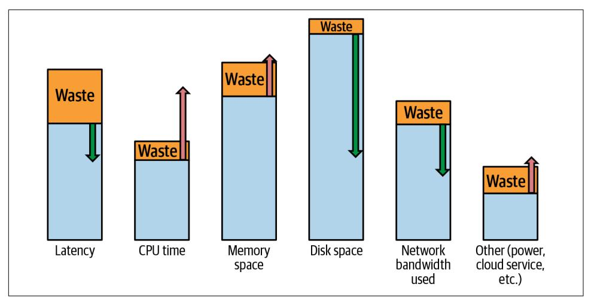
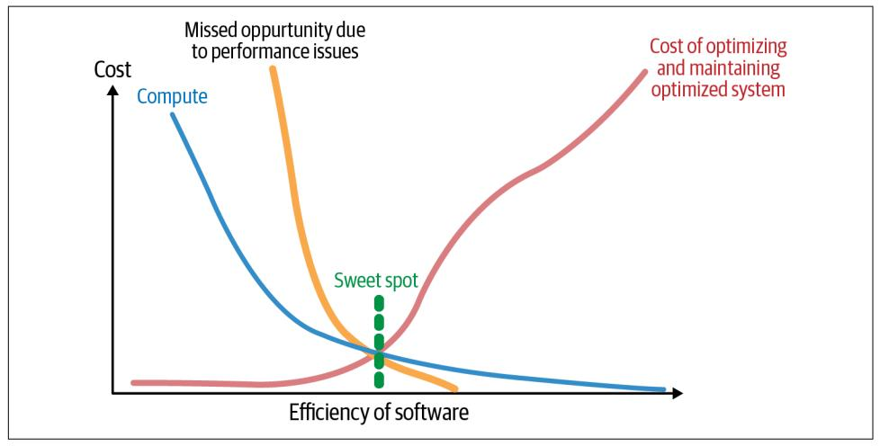
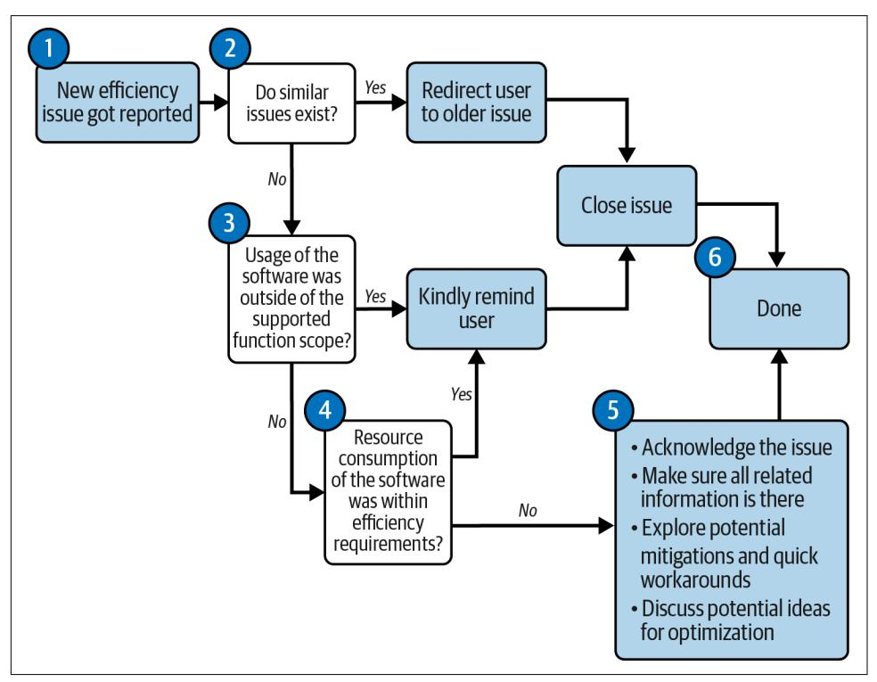
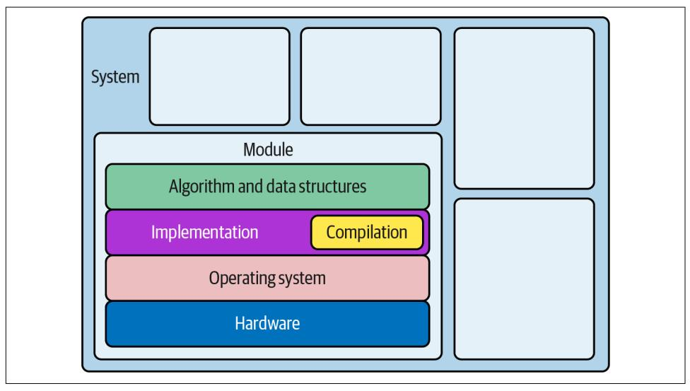
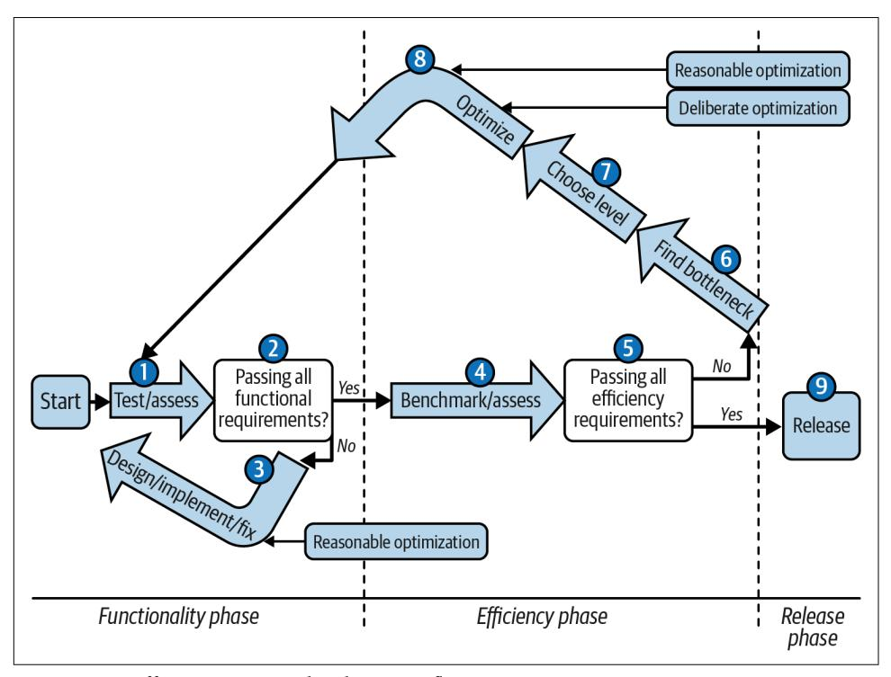

# Chapter 3: Conquering Efficiency

<span id="page-90-0"></span>It's action time! In [Chapter 1](005-chapter-1-software-efficiency-matters.md#page-20-0), we learned that software efficiency matters. In [Chap‐](006-chapter-2-efficient-introduction-to-go.md#page-54-0) [ter 2](006-chapter-2-efficient-introduction-to-go.md#page-54-0), we studied the Go programming language—its basics and advanced features. Next, we discussed Go's capabilities of being easy to read and write. Finally, we men‐ tioned that it could also be an effective language for writing efficient code.

Undoubtedly, achieving better efficiency in your program does not come without work. In some cases, the functionality you try to improve is already well optimized, so further optimization without system redesign might take a lot of time and only make a marginal difference. However, there might be other cases where the current implementation is heavily inefficient. Removing instances of wasted work can improve the program's efficiency in only a few hours of developer time. The true skill here as an engineer is to know, ideally after a short amount of research, which situa‐ tion you are currently in:

- Do you need to improve anything on the performance side?
- If yes, is there a potential for the removal of wasted cycles?
- How much work is needed to reduce the latency of function X?
- Are there any suspicious overallocations?
- Should you stop overusing network bandwidth and sacrifice memory space instead?

This chapter will teach you the tools and methodologies to help you answer these questions effectively.

If you are struggling with these skills, don't worry! It's normal. The efficiency topic is not trivial. Despite the demand, this space is still not mastered by many, and even major software players sometimes make poor decisions. It's surprising how often

what looks like high-quality software is shipped with fairly apparent inefficiencies. For instance, at the beginning of 2021, one user [optimized the loading time of the](https://oreil.ly/ast0m) popular game *Grand Theft Auto Online* [from six minutes to two minutes](https://oreil.ly/ast0m) without access to the source code! As mentioned in [Chapter 1](005-chapter-1-software-efficiency-matters.md#page-20-0), this game cost a staggering ~ \$140 million and a few years to make. Yet, it had an obvious efficiency bottleneck with a naive JSON parsing algorithm and deduplication logic that took most of the game loading time and worsened the game experience. This person's work is out‐ standing, but they used the same techniques you are about to learn. The only differ‐ ence is that our job might be a bit easier—hopefully, you don't need to reverse engineer the binary written in C++ code on the way!

In the preceding example, the company behind the game missed the apparent waste of computation impacting the game's loading performance. It's unlikely that the company didn't have the resources to get an expert to optimize this part. Instead, it's a decision based on specific trade-offs, where the optimization wasn't worth the investment since there might have been higher-priority development tasks. In the end, one would say that an inefficiency like this didn't stop the success of the game. It did the job, yes, but for example, my friends and I were never fans of the game because of the loading time. I would argue that without this silly "waste," success might have been even bigger.


## Laziness or Deliberate Efficiency Descoping?

There are other amusing examples of situations where a certain aspect of software efficiency could be descoped given certain cir‐ cumstances. For instance, there is [the amusing story about missile](https://oreil.ly/mJ8Mi) [software developers](https://oreil.ly/mJ8Mi) who decided to accept certain memory leaks since the missile would be destroyed at the end of the application run. Similarly, we hear [the story about "deliberate" memory leaks](https://oreil.ly/PgzHQ) [in low-latency trading software](https://oreil.ly/PgzHQ) that is expected to run only for very short durations.

You could say that the examples where the efficiency work was avoided and nothing tragically bad happened were pragmatic approaches. In the end, extra knowledge and work needed to fix leaks or slowdowns were avoided. Potentially yes, but what if these decisions were not data driven? We don't know, but these decisions might have been made out of laziness and ignorance without any valid data points that the fix would indeed take too much effort. What if developers in each example didn't fully understand the small effort needed? What if they didn't know how to optimize the problematic parts of the software? Would they make better decisions otherwise? Take less risk? I would argue yes.

In this chapter, I will introduce the topic of optimizations, starting with explaining the definition and initial approach in ["Beyond Waste, Optimization Is a Zero-Sum](#page-92-0) <span id="page-92-0"></span>Game". In the next section, ["Optimization Challenges" on page 79](#page-98-0), we will summarize the challenges we have to overcome while attempting to improve the efficiency of our software.

In ["Understand Your Goals" on page 80](#page-99-0), we will try to tame our software's tendency and temptation to maximize optimization effort by setting clear efficiency goals. We need only to be fast or efficient "enough." This is why setting the correct performance requirements from the start is so important. Next, in ["Resource-Aware Efficiency](#page-105-0) [Requirements" on page 86,](#page-105-0) I will propose a template and pragmatic process anyone can follow. Finally, those efficiency requirements will be useful in ["Got an Efficiency](#page-113-0) [Problem? Keep Calm!" on page 94](#page-113-0), where I will teach you a professional flow for han‐ dling performance issues you or someone else has reported. You will learn that the optimization process could be your last resort.

In ["Optimization Design Levels" on page 98,](#page-117-0) I will explain how to divide and isolate your optimization effort for easier conquering. Finally, in ["Efficiency-Aware Devel‐](#page-121-0) [opment Flow" on page 102,](#page-121-0) we will combine all the pieces into a unified optimization process I always use and want to recommend to you: reliable flow, which applies to any software or design level.

There is a lot of learning ahead of us, so let's start understanding what optimization means.

### Beyond Waste, Optimization Is a Zero-Sum Game

It is not a secret that one of many weapons in our arsenal to overcome efficiency issues is an effort called "optimization." But what does optimization mean, exactly? What's the best way to think about it and master it?

Optimization is not exclusively reserved for software efficiency topics. We also tend to optimize many things in our life, sometimes unconsciously. For example, if we cook a lot, we probably have salt in a well-accessible place. If our goal is to gain weight, we eat more calories. If we travel in the early morning, we pack and prepare the day before. If we commute, we tend to use that time by listening to audiobooks. If our commute to the office is painful, we consider moving closer to a better transpor‐ tation system. All of these are optimization techniques that are meant to improve our life toward a specific goal. Sometimes we need a significant change. On the other hand, minor incremental improvements are often enough as they are magnified through repetition for a more substantial impact.

In engineering, the word "optimization" has its roots in [mathematics,](https://oreil.ly/a11ou) which means finding the best solution from all possible solutions for a problem constrained by a set of rules. Typically in computer science, however, we use the word "optimization" to describe an act of improving the system or program execution for a specific aspect.

<span id="page-93-0"></span>For instance, we can optimize our program to load a file faster or decrease peak memory utilization while serving a request on a web server.


#### We Can Optimize for Anything

Generally, optimization does not necessarily need to improve our program's efficiency characteristics if that is not our goal. For example, if we aim to improve security, maintainability, or code size, we can optimize for that too. Yet, in this book, when we talk about optimizations, they will be on an efficiency background (improving resource consumption or speed).

The goal of efficiency optimization should be to modify code (generally without changing its functionality<sup>1</sup> ) so that its execution is either overall more efficient or at least more efficient in the categories we care about (and worse in others).

The important part is that, from a high-level view, we can perform the optimization by doing either of two things (or both):

- We can eliminate "wasted" resource consumption.
- We can trade one resource consumption for another or deliberately sacrifice other software qualities (so-called trade-off).

Let me explain the difference between these two by describing the first type of change—reducing so-called waste.

### Reasonable Optimizations

Our program consists of a code—a set of instructions that operates on some data and uses various resources on our machines (CPU, memory, disk, power, etc.). We write this code so our program can perform the requested functionality. But everything involved in the process is rarely perfect (or integrated perfectly): our programmed code, compiler, operating systems, and even hardware. As a result, we sometimes introduce "waste." Wasted resource consumption represents a relatively unnecessary operation in our programs that takes precious time, memory, or CPU time, etc. Such waste might have been introduced as a deliberate simplification, by accident, tech debt, oversight, or just unawareness of better approaches. For example:

<sup>1</sup> There might be exceptions. There might be domains where it's acceptable to approximate results. Sometimes we can (and should) also drop nice-to-have features if they block the critical efficiency characteristics we want.

- We might have accidentally left some debugging code that introduces massive latency in the heavily used function (e.g., fmt.Println statements).
- We performed an unnecessary, expensive check because the caller has already verified the input.
- We forgot to stop certain goroutines (a concurrency paradigm we will explain in detail in ["Go Runtime Scheduler" on page 138](008-chapter-4-how-go-uses-the-cpu-resource-or-two.md#page-157-0)), which are no longer required, yet still running, which wastes our memory and CPU time.<sup>2</sup>
- We used a nonoptimized function from a third-party library, when an optimized one exists in a different, well-maintained library that does the same thing faster.
- We saved the same piece of data a couple of times on disk, while it could be just reused and stored once.
- Our algorithm might have performed checks too many times when it could have done less for free (e.g., naive search versus binary search on sorted data).

The operation performed by our program or consumption of specific resources is a "waste" if, by eliminating it, we don't sacrifice anything else. And "anything" here means anything we particularly care for, such as extra CPU time, other resource con‐ sumption, or nonefficiency-related qualities like readability, flexibility, or portability. Such elimination makes our software, overall, more efficient. Looking closer, you might be surprised at how much waste every program has. It just waits for us to notice it and take it back!

Our program's optimization by reducing "waste" is a simple yet effective technique. In this book, we will call it a reasonable optimization, and I suggest doing it every time you notice such waste, even if you don't have time to benchmark it afterward. Yes. You heard me right. It should be part of coding hygiene. Note that to treat it as "reasonable" optimization, it has to be obvious. As the developer, you need to be sure that:

- Such optimization eliminates some additional work of the program.
- It does not sacrifice any other meaningful software quality or functionality, espe‐ cially readability.

Look for the things that might be "obviously" unnecessary. Eliminating such unnec‐ essary work is easily obtainable and does no harm (otherwise, it's not waste).

<sup>2</sup> Situations where resources are not cleaned after each periodic functionality due to leftover concurrent routine are often referred to as memory leaks.

#### Be Mindful of Readability

<span id="page-95-0"></span>

The first thing that usually gets impacted by any code modification is readability. If reducing some obvious waste meaningfully reduces readability, or you need to spend a few hours experiment‐ ing on readable abstractions for it, it is not a reasonable optimization.

That's fine. We can deal with that later, and we will talk about it in ["Deliberate Optimizations" on page 77](#page-96-0). If it impacts readability, we need data to prove it's worth it.

Cutting "waste" is also an effective mental model. Like humans who are rewarded for being [intelligently lazy,](https://oreil.ly/u8IDm) we also want to maximize the value our program brings with minimum runtime work.

One would say that reasonable optimization is an example of the anti-pattern often called "premature optimization" that [many have been warned against](https://oreil.ly/drziD). And I cannot agree more that reducing obvious waste like this is a premature optimization since we don't assess and measure its impact. But I would argue that if we are sure that such premature optimization deals no harm, other than a little extra work, let's acknowl‐ edge that it is premature optimization but is reasonable, still do it, and move on.

If we go back to our commute to work example, if we notice we have a few stones in our shoes, of course we pick them out so we can walk without pain. We don't need to assess, measure, or compare if removing the stones improved our commute time or not. Getting rid of stones will help us somehow, and it's not harmful to do so (we don't need to take stones with us every time we go)! :)

If you are dealing with something which is the noise, you don't deal with that right away because the payoff of investing time and energy is very small. But if you are walk‐ ing through your codebase and you notice an opportunity for notable improvement (say 10% or 12%), of course, you reach down and pick it up.

—Scott Meyers, ["Things That Matter"](https://oreil.ly/T9VFz)

Initially, when you are new to programming or a particular language, you might not know which operations are unnecessary waste or if eliminating the potential waste will harm your program. That's fine. The "obviousness" comes from practice, so don't guess here. If you are guessing, it means the optimization is not obvious. You will learn what's reasonable with experience, and we will practice this together in Chapters [10](014-chapter-10-optimization-examples.md#page-400-0) and [11](015-chapter-11-optimization-patterns.md#page-434-0).

Reasonable optimizations yield consistent performance improvements and often simplify or make our code more readable. However, we might want to take a more deliberate approach for bigger efficiency impacts, where the result might be less obvi‐ ous, as explained in the next section.

<span id="page-96-0"></span>
### Deliberate Optimizations

Beyond waste, we have operations that are critically important for our functionality. In this case, we can say we have a zero-sum game.<sup>3</sup> This means we have a situation where we cannot eliminate a certain operation that uses resource A (e.g., memory) without using more resource B (e.g., CPU time) or other quality (e.g., readability, portability, or correctness).

The optimizations that are not obvious or require us to make a certain trade-off can be called *deliberate*<sup>4</sup> since we have to spend a little bit more time on them. We can understand the trade-off, measure or assess it, and decide to keep it or throw it away.

Deliberate optimizations are not worse in any way. On the contrary, they often signif‐ icantly impact the latency or resource consumption you want to cut. For example, if our request is too slow on a web server, we can consider optimizing latency by intro‐ ducing a cache. Caching will allow us to save the result from expensive computation for requests asking for the same data. In addition, it saves CPU time and the need to introduce complex parallelization logic. Yet we will sacrifice memory or disk usage during the server's lifetime and potentially introduce some code complexity. As a result, deliberate optimization might not improve the program's overall efficiency, but it can improve the efficiency of a particular resource usage that we care about at the moment. Depending on the situation, the sacrifice might be worth it.

However, the implication of having certain sacrifices means we have to perform such optimization in a separate development phase isolated from the functionality one, as explained in ["Efficiency-Aware Development Flow" on page 102.](#page-121-0) The reason for this is simple. First, we have to be sure that we understand what we sacrifice and whether the impact is not too big. Unfortunately, humans are quite bad at estimating such impacts.

For example, a common way to reduce network bandwidth and disk usage is to com‐ press the data before sending it or storing it. However, simultaneously it requires us to decompress (decode) when receiving or reading the data. The potential balance of the resources used by our software before and after introducing compression can be seen in [Figure 3-1](#page-97-0).

<sup>3</sup> Zero-sum game comes from game and economic theory. It describes a situation where one player can only win X if other players in total lost exactly X.

<sup>4</sup> I got inspired for dividing optimizations on reasonable and deliberate by the community-driven [go-perfbook](https://oreil.ly/RuxfU) led by Damian Gryski. In his book, he also mentioned the "dangerous" optimization category. I don't see a value in splitting classes further since there is a fuzzy borderline between deliberate and dangerous that depends on the situation and personal taste.

<span id="page-97-0"></span>

*Figure 3-1. Potential impact on latency and resource usage if we compress the data before sending it over the network and saving it on disk*

The exact numbers will vary, but the CPU resource will potentially be used more after compression addition. Instead of a simple data write operation, we must go through all bytes and compress them. It takes some time, even for the best lossless compression algorithms (e.g., snappy or gzip). Still, a smaller amount of messages to send over the network and disk writes might improve the total latency of such an operation. All of the compression algorithms require some extra buffers, so addi‐ tional memory usage is also expected.

To sum up, there are strong implications for categorizing optimization reasonably and deliberately. If we see a potential efficiency improvement, we must be aware of its unintended consequences. There might be cases where it's reasonable and easy to obtain optimization. For example, we might have peeled some unnecessary opera‐ tions from our program for free. But more often than not, making our software effi‐ cient in every aspect is impossible, or we impact other software qualities. This is when we get into a zero-sum game, and we must take a deliberate look at these problems. In this book and practice, you will learn what situations you are in and how to predict these consequences.

Before we bring the two types of optimizations into our development flow, let's dis‐ cuss the efficiency optimization challenges we must be aware of. We will go through the most important ones in the next section.

<span id="page-98-0"></span>
### Optimization Challenges

I wouldn't need to write this book if optimizing our software was easy. It's not. The process can be time-consuming and prone to mistakes. This is why many developers tend to ignore this topic or learn it later in their careers. But don't feel demotivated! Everyone can be an effective and pragmatic efficiency-aware developer after some practice. Knowing about the optimization obstacles should give us a good indication of what we should focus on to improve. Let's go through some fundamental problems:

*Programmers are bad at estimating what part is responsible for the performance problem.*

We are really bad at guessing which part of the program consumes the most resources and how much. However, it's essential to find these problems because, generally, [the Pareto Principle](https://oreil.ly/eZIl5) applies. It states that 80% of the time or resources consumed by our program come only from 20% of the operations it performs. Since any optimization is time-consuming, we want to focus on that critical 20% of operations, not some noise. Fortunately, there are tools and methods for esti‐ mating this, which we will touch on in [Chapter 9.](013-chapter-9-data-driven-bottleneck-analysis.md#page-348-0)

*Programmers are notoriously bad at estimating exact resource consumption.*

Similarly, we often make wrong assumptions on whether certain optimizations should help. Our guesses get better with experience (and hopefully after reading this book). Yet, it's best to *never trust your judgment*, and always measure and verify all numbers after deliberate optimizations (discussed in depth in [Chap‐](011-chapter-7-data-driven-efficiency-assessment.md#page-258-0) [ter 7\)](011-chapter-7-data-driven-efficiency-assessment.md#page-258-0). There are just too many layers in software executions with many unknowns and variables.

#### Maintaining efficiency over time is hard.

The complex software execution layers mentioned previously are constantly changing (new versions of operating systems, hardware, firmware, etc.), not to mention the program's evolution and future developers who might touch your code. We might have spent weeks optimizing one part, but it could be irrelevant if we don't guard against regressions. There are ways to automate or at least structure the benchmarking and verification process for the efficiency of our pro‐ gram, because things change every day, as discussed in [Chapter 6](010-chapter-6-efficiency-observability.md#page-212-0).

### Reliable verification of current performance is very difficult.

As we will learn in ["Efficiency-Aware Development Flow"](#page-121-0) on page 102, the solution to the aforementioned challenges is to benchmark, measure, and vali‐ date the efficiency. Unfortunately, these are difficult to perform and prone to errors. There are many reasons: inability to simulate the production environ‐ ment closely enough, external factors like noisy neighbors, lack of warm-up phase, wrong data sets, or microbenchmark accidental compiler optimizations.

<span id="page-99-0"></span>This is why we will spend some time on this topic in ["Reliability of Experiments"](012-chapter-8-benchmarking-versus-stress-and-load-tests.md#page-275-0) [on page 256](012-chapter-8-benchmarking-versus-stress-and-load-tests.md#page-275-0).

*Optimizing can easily impact other software qualities.*

Solid software is great at many qualities: functionality, compatibility, usability, reliability, security, maintainability, portability, and efficiency. Each of these characteristics is nontrivial to get right, so they cause some cost to the develop‐ ment process. The importance of each can differ depending on your use cases. However, there are safe minimums of each software quality to be maintained for your program to be useful. This might be challenging when you add more fea‐ tures and optimization.

*Specifically, in Go we don't have strict control over memory management.*

As we learned in ["Go Runtime" on page 58,](006-chapter-2-efficient-introduction-to-go.md#page-77-0) Go is garbage-collected language. While it's lifesaving for the simplicity of our code, memory safety, and developer velocity, it has downsides that can be seen when we want to be memory efficient. There are ways to improve our Go code to use less memory, but things can get tricky since the memory release model is eventual. Usually, the solution is simply to allocate less. We will go through memory management in ["Do We Have a](009-chapter-5-how-go-uses-memory-resource.md#page-171-0) [Memory Problem?" on page 152](009-chapter-5-how-go-uses-memory-resource.md#page-171-0).

*When is our program efficient "enough"?*

In the end, all optimizations are never fully free. They require a bigger or smaller effort from the developer. Both reasonable and deliberate optimizations require prior knowledge and time spent on implementation, experimentations, testing, and benchmarking. Given that, we need to find justification for this effort. Otherwise, we can spend this time somewhere else. Should we optimize away this waste? Should we trade the consumption of resource X for resource Y? Is such conversion useful for us? The answer might be "no." And if "yes," how much efficiency improvement is enough?

Regarding the last point, this is why it's extremely important to know your goals. What things, resources, and qualities do you (or your boss) care about during the development? It can vary depending on what you build. In the next section, I will propose a pragmatic way of stating performance requirements for a piece of software.

### Understand Your Goals

Before you proceed toward such lofty goals [program efficiency optimization], you should examine your reasons for doing so. Optimization is one of many desirable goals in software engineering and is often antagonistic to other important goals such as sta‐ bility, maintainability, and portability. At its most cursory level (efficient implementa‐ tion, clean non-redundant interfaces), optimization is beneficial and should always be applied. But at its most intrusive (inline assembly, pre-compiled/self-modified code, <span id="page-100-0"></span>loop unrolling, bit-fielding, superscalar and vectorizing) it can be an unending source of time-consuming implementation and bug hunting. Be cautious and wary of the cost of optimizing your code.

—Paul Hsieh, ["Programming Optimization"](https://oreil.ly/PQ4pk)

By our definition, efficiency optimization improves our program resource consump‐ tion or latency. It's highly addictive to challenge ourselves and explore how fast our program can be.<sup>5</sup> First, however, we need to understand that optimization aims to not make our program perfectly efficient or "optimal" (as that might be simply impossi‐ ble or feasible) but rather suboptimal enough. But what does "enough" mean for us? When do you stop? What if there isn't a need to even start optimizing?

One answer is to optimize when stakeholders (or users) ask for better efficiency in the software we develop until they are happy. But unfortunately, this is usually very difficult for a few reasons:

#### XY problem.

Stakeholders often ask for better efficiency, whereas a better solution is else‐ where. For example, many people complain about the heavy memory usage of the metric system if they try to monitor unique events. Instead, the potential sol‐ ution might be to use logging or tracing systems for such data instead of making the metric system faster.<sup>6</sup> As a result, we can't always trust the initial user requests, especially around efficiency.

#### Efficiency is not a zero-sum game.

Ideally, we need to see the big picture of all efficiency goals. As we learned in ["Deliberate Optimizations" on page 77,](#page-96-0) one optimization for latency might cause more memory usage or impact other resources, so we can't react to every user complaint about efficiency without thinking. Of course, it helps when software is generally lean and efficient, but most likely we can't produce a single software that satisfies both the user who needs a latency-sensitive real-time eventcapturing solution and the user who needs ultra-low memory used during such an operation.

<sup>5</sup> No one said challenging ourselves is bad in certain situations. If you have time, playing with initiatives like [Advent of Code](https://oreil.ly/zT0Bl) is a great way to learn or even compete! This is, however, different than the situation where we are paid to develop functional software effectively.

<sup>6</sup> I experienced this a lot while maintaining the [Prometheus project,](https://prometheus.io) where we were constantly facing situations where users tried to ingest unique events into Prometheus. The problem is that we designed Prometheus as an efficient metric monitoring solution with a bespoke time-series database that assumed storing aggregated samples over time. If the ingested series were labeled with unique values, Prometheus slowly but surely began to use many resources (we call it a high-cardinality situation).

<span id="page-101-0"></span>*Stakeholders might not understand the optimization cost.*

Everything costs, especially optimization effort and maintaining highly opti‐ mized code. Technically speaking, only physics laws limit us on how optimized software can be.<sup>7</sup> At some point, however, the benefit we gain from optimization versus the cost of finding and developing such optimization is impractical. Let's expand on the last point.

Figure 3-2 shows a typical correlation between the efficiency of the software and dif‐ ferent costs.



*Figure 3-2. Beyond the "sweet spot," the cost of gaining higher efficiency might be extremely high*

Figure 3-2 explains why at some "sweet spot" point, it might not be feasible to invest more time and resources in our software efficiency. Beyond some point, the cost of optimizing and developing optimized code can quickly surpass the benefits we get from leaner software, like computational cost and opportunities. We might need to spend exponentially more of the expensive developer time, and need to introduce clever, nonportable tricks, dedicated machine code, dedicated operating systems, or even specialized hardware.

In many cases, optimizations beyond the sweet spot aren't worth it, and it might be better to design a different system or use other flows to avoid such work. Unfortu‐ nately, there is also no single answer to where the sweet spot is. Typically, the longer

<sup>7</sup> Just imagine, with all the resources in the world, we could try optimizing the software execution to the limits of physics. And once we are there, we could spend decades on research that pushes boundaries with things beyond the current physics we know. But, practically speaking, we might never find the "true" limit in our lifetime.

<span id="page-102-0"></span>the lifetime planned for the software, the larger its deployment is, and the more investment is worth putting into it. On the other hand, if you plan to use your pro‐ gram only a few short times, your sweet spot might be at the beginning of this dia‐ gram, with very poor efficiency.

The problem is that users and stakeholders will not be aware of this. While ideally, product owners help us find that out, it's often the developer's role to advise the level of those different costs, using tools we will learn in Chapters [6](010-chapter-6-efficiency-observability.md#page-212-0) and [7.](011-chapter-7-data-driven-efficiency-assessment.md#page-258-0)

However, whatever numbers we agree on, the best idea to solve the "when is enough" problem and have clear efficiency requirements is to write them down. In the next section, I will explain why. In ["Resource-Aware Efficiency Requirements" on page 86,](#page-105-0) I will introduce the lightweight formula for them. Then in ["Acquiring and Assessing](#page-108-0) [Efficiency Goals" on page 89,](#page-108-0) we will discuss how to acquire and assess those efficiency requirements.

### Efficiency Requirements Should Be Formalized

As you probably already know, every software development starts with the functional requirements gathering stage (FR stage). An architect, product manager, or yourself has to go through potential stakeholders, interview them, gather use cases and, ide‐ ally, write them down in some functional requirements document. The development team and stakeholders then review and negotiate functionality details in this docu‐ ment. The FR document describes what input your program should accept, and what behavior and output a user expects. It also mentions prerequisites, like what operat‐ ing systems the application is meant to be running on. Ideally, you get formal appro‐ val on the FR document, and it becomes your "contract" between both parties. Having this is extremely important, especially when you are compensated for build‐ ing the software:

- FR tells developers what they should focus on. It tells you what inputs should be valid and what things a user can configure. It dictates what you should focus on. Are you spending your time on something stakeholders paid for?
- It's easier to integrate with software with a clear FR. For example, stakeholders might want to design or order further system pieces that will be compatible with your software. They can start doing this before your software is even finished!
- FR enforces clear communication. Ideally, the FR is written and formal. This is helpful, as people tend to forget things, and it's easy to miscommunicate. That's why you write it all down and ask stakeholders for review. Maybe you misheard something?

You do formal functional requirements for bigger systems and features. For a smaller piece of software, you tend to write them up for some issue in your backlog, e.g.,

<span id="page-103-0"></span>GitHub or GitLab issues, and then document them. Even for tiny scripts or little pro‐ grams, set some goals and prerequisites—maybe a specific environment (e.g., Python version) and some dependencies (GPU on the machine). When you want others to use it effectively, you have to mention your software's functional requirements and goals.

Defining and agreeing on functional requirements is well adopted in the software industry. Even if a bit bureaucratic, developers tend to like those specifications because it makes their life easier—requirements are then more stable and specific.

Probably you know where I am going with this. Surprisingly, we often neglect to define similar requirements focused on the more nonfunctional aspects of the soft‐ ware we are expected to build, for example, describing a required efficiency and speed of the desired functionality.<sup>8</sup>

Such efficiency requirements are typically part of the [nonfunctional requirement](https://oreil.ly/AQWLm) [\(NFR\)](https://oreil.ly/AQWLm) documentation or specification. Its gathering process ideally should be similar to the FR process, but for all other qualities requested, software should have: portabil‐ ity, maintainability, extensibility, accessibility, operability, fault tolerance and reliabil‐ ity, compliance, documentation, execution efficiency, and so on. The list is long.


The NFR name can be in some way misleading since many quali‐ ties, including efficiency, massively impact our software functional‐ ity. As we learned in [Chapter 1,](005-chapter-1-software-efficiency-matters.md#page-20-0) efficiency and speed are critical for user experience.

In reality, NFRs are not very popular to use during software development, based on my experience and research. I found multiple reasons:

- Conventional NFR specification is considered bureaucratic and full of boiler‐ plate. Especially if the mentioned qualities are not quantifiable and not specific, NFR for every software will look obvious and more or less similar. Of course, all software should be readable, maintainable, as fast as possible using minimum resources, and usable. This is not helpful.
- There are no easy-to-use, open, and accessible standards for this process. The most popular [ISO/IEC 25010:2011 standard](https://oreil.ly/IzqJo) costs around \$200 to read. It has a staggering 34 pages, and hasn't been changed since the last revision in 2017.
- NFRs are usually too complex to be applicable in practice. For example, the ISO/IEC 25010 standard previously mentioned specifies [13 product characteris‐](https://oreil.ly/0MMcb)

<sup>8</sup> I was never explicitly asked to create a nonfunctional specification, and the same with [people around me.](https://oreil.ly/Ui2tu)

<span id="page-104-0"></span>[tics with 42 subcharacteristics in total](https://oreil.ly/0MMcb). It is hard to understand and takes too much time to gather and walk through.

• As we will learn in ["Optimization Design Levels" on page 98](#page-117-0), our software's speed and execution efficiency depend on more factors than our code. The typical developer usually can impact the efficiency by optimizing algorithms, code, and compiler. It's then up to the operator or admin to install that software, fit it into a bigger system, configure it, and provide the operating system and hardware for that workload. When developers are not in the domain of running their software on "production," it's hard for them to talk about runtime efficiency.


#### The SRE Domain

[Site Reliability Engineering \(SRE\)](https://sre.google) introduced by Google is a role focused on marrying these two domains: software devel‐ opment and operators/administrators. Such engineers have experience running and building their software on a large scale. With more hands-on experience, it's easier to talk about efficiency requirements.

• Last but not least, we are humans and full of emotions. Because it's hard to esti‐ mate the efficiency of our software, especially in advance, it's not uncommon to feel humiliated when setting efficiency or speed goals. This is why we sometimes unconsciously refrain from agreeing to quantifiable performance goals. It can be uncomfortable, and that's normal.

OK, scratch that, we aren't going there. We need something more pragmatic and eas‐ ier to work with. Something that will state our rough goals for efficiency and speed of the requested software and will be a starting point for some contracts between con‐ sumers and the development team. Having such efficiency requirements on top of functional ones up front is enormously helpful because:

*We know exactly how fast or resource efficient our software has to be.*

For instance, let's say we agree that a certain operation should use 1 GB of mem‐ ory, 2 CPU seconds, and take 2 minutes at maximum. If our tests show that it takes 2 GB of memory and 1 CPU second for 1 minute, then there is no point in optimizing latency.

*We know if we have room for a trade-off or not.*

In the preceding example, we can precalculate or compress things to improve memory efficiency. We still have 1 CPU second to spare, and we can be slower for 1 minute.

<span id="page-105-0"></span>*Without official requirements, users will implicitly assume some efficiency expectations.* For example, maybe our program was accidentally very fast for a certain input. Users can assume this is by design, and they will depend on the fact in the future, or for other parts of the systems. This can lead to poor user experience and surprises.<sup>9</sup>

*It's easier to use your software in a bigger system.*

More often than not, your software will be a dependency on another piece of software and form a bigger system. Even a basic efficiency requirements docu‐ ment can tell system architects what to expect from the component. It can help enormously with further system performance assessments and capacity planning tasks.

*It's easier to provide operational support.*

When users do not know what performance to expect from your software, you will have difficulty supporting it over time. There will be many back-and-forths with the user on what is acceptable efficiency and what's not. Instead, with clear efficiency requirements, it is easier to tell if your software was underutilized or not, and as a result, the issue might be on the user side.

Let's summarize our situation. We know efficiency requirements can be enormously useful. On the other hand, we also know they can be tedious and full of boilerplate. So let's explore some options and see if we can find some balance between the requirement gathering effort and the value it brings.

### Resource-Aware Efficiency Requirements

No one has defined a good standard process for creating efficiency requirements, so let's try to [define one](https://oreil.ly/DCzpu)! Of course, we want it to be as lightweight a process as possible, but let's start with the ideal situation. What is the perfect set of information someone could put into some Resource-Aware Efficiency Requirements (RAER) document? Something that will be more specific and actionable than "I want this program to run adequately snappy."

In [Example 3-1](#page-106-0), you can see an example of a data-driven, minimal RAER for a single operation in some software.

<sup>9</sup> Funnily enough, with enough program users, even with a formal performance and reliability contract, all your system's observable behaviors will depend on somebody. This is known as [Hyrum's Law.](https://oreil.ly/UcrQo)

<span id="page-106-0"></span>
#### Example 3-1. The example RAER entry

```
Program: "The Ruler"
Operation: "Fetching alerting rules for one tenant from the storage using HTTP."
Dataset: "100 tenants having 1000 alerting rules each."
Maximum Latency: "2s for 90th percentile"
CPU Cores Limit: "2"
Memory Limit: "500 MB"
Disk Space Limit: "1 GB"
...
```

Ideally, this RAER is a set of records with efficiency requirements for certain opera‐ tions. In principle, a single record should have information like:

- The operation, API, method, or function it relates to.
- The size and shape dataset we operate on, e.g., input or data stored (if any).
- Maximum latency of the operation.
- The resource consumption budget for this operation on that dataset, e.g., mem‐ ory, disk, network bandwidth, etc.

Now, there is bad news and good news. The bad news is that, strictly speaking, such records are unrealistic to gather for all small operations. This is because:

- There are potentially hundreds of different operations that run during the soft‐ ware execution.
- There is an almost infinite number of dataset shapes and sizes (e.g., imagine an SQL query being an input, and stored SQL data being a dataset: we have a nearinfinite amount of option permutations).
- Modern hardware with an operating system has thousands of elements that can be "consumed" when we execute our software. Overall, CPU seconds and mem‐ ory are common, but what about the space and bandwidth of individual CPU caches, memory bus bandwidth, number of TCP sockets taken, file descriptors used, and thousands of other elements? Do we have to specify all that can be used?

The good news is that we don't need to provide all the small details. This is similar to how we deal with functional requirements. Do we focus on all possible user stories and details? No, just the most important ones. Do we define all possible permutations of valid inputs and expected outputs? No, we only define a couple of basic character‐ istics around boundaries (e.g., information has to be a positive integer). Let's look at how we can simplify the level of details of the RAER entry:

- <span id="page-107-0"></span>• Focus on the most utilized and expensive operations our software does first. These will impact the software resource usage the most. We will discuss bench‐ marking and profiling that will help you with this later in this book.
- We don't need to outline requirements for all tiny resources that might be con‐ sumed. Start with those that have the highest impact and matter the most. Usu‐ ally, it means specific requirements toward CPU time, memory space, and storage (e.g., disk space). From there, we can iterate and add other resources that will matter in the future. Maybe our software needs some unique, expensive, and hard-to-find resources that are worth mentioning (e.g., GPU). Maybe a certain consumption poses a limit to overall scalability, e.g., we could fit more processes on a single machine if our operation would use fewer TCP sockets or disk IOPS. Add them only if they matter.
- Similar to what we do in unit tests when validating functionality, we can focus only on important categories of inputs and datasets. If we pick edge cases, we have a high chance of providing resource requirements for the worst- and bestcase datasets. That is an enormous win already.
- Alternatively, there is a way to define the relation of input (or dataset) to the allowed resource consumption. We can then describe this relation in the form of mathematical functions, which we usually call *complexity* (discussed in ["Asymp‐](011-chapter-7-data-driven-efficiency-assessment.md#page-262-0) [totic Complexity with Big O Notation" on page 243\)](011-chapter-7-data-driven-efficiency-assessment.md#page-262-0). Even with some approxima‐ tion, it's quite an effective method. Our RAER for the operation /rules in [Example 3-1](#page-106-0) could then be described, as seen in Example 3-2.

*Example 3-2. The example RAER entry with complexities or throughput instead of absolute numbers*

```
Program: "The Ruler"
Operation: "Fetching alerting rules for one tenant from the storage using HTTP."
Dataset: "X tenants having Y alerting rules each."
Maximum Latency: "2*Y ms for 90th percentile"
CPU Cores Limit: "2"
Memory Limit: "X + 0.4 * Y MB"
Disk Space Limit: "0.1 * X GB"
...
```

Overall, I would even propose to include the RAER in the functional requirement (FR) document mentioned previously. Put it in another section called "Efficiency Requirements." After all, without rational speed and efficiency, our software can't be called fully functional, can it?

<span id="page-108-0"></span>To sum up, in this section we defined the Resource-Aware Efficiency Requirements specification that gives us approximations of the needs and expected performance toward our software efficiency. It will be extremely helpful for the further develop‐ ment and optimization techniques we learn in this book. Therefore, I want to encour‐ age you to understand the performance you aim for, ideally before you start developing your software and optimizing or adding more features to it.

Let's explain how we can possess or create such RAERs ourselves for the system, application, or function we aim to provide.

### Acquiring and Assessing Efficiency Goals

Ideally, when you come to work on any software project, you have something like a RAER already specified. In bigger organizations, you might have dedicated people like project or product managers who will gather such efficiency requirements on top of functional requirements. They should also make sure the requirements are possi‐ ble to fulfill. If they don't gather the RAER, don't hesitate to ask them to provide such information. It's often their job to give it.

Unfortunately, in most cases, there are no specific efficiency requirements, especially in smaller companies, community-driven projects, or, obviously, your personal projects. In those cases, we need to acquire the efficiency goals ourselves. How do we start?

This task is, again, similar to functional goals. We need to bring value to users, so ideally, we need to ask them what they need in terms of speed and running costs. So we go to the stakeholders or customers and ask what they need in terms of efficiency and speed, what they are willing to pay for, and what the constraints are on their side (e.g., the cluster has only four servers or the GPU has only 512 MB of internal mem‐ ory). Similarly, with features, good product managers and developers will try to translate user performance needs into efficiency goals, which is not trivial if the stakeholders are not from the engineering space. For example, the "I want this appli‐ cation to run fast" statement has to be translated into specifics.


If the stakeholder can't give the latency numbers they might expect from your software, just pick a number. It can be high for a start, which is great for you, but it will make your life easier later. Per‐ haps this will trigger discussions on the stakeholder side on the implications of that number.

<span id="page-109-0"></span>Very often, there are multiple personas of the system users too. For example, let's imagine our company will run our software as a service for the customer, and the ser‐ vice has already defined a price. In this case, the user cares about the speed and cor‐ rectness, and our company will care about the efficiency of the software, as this translates to how much net profit the running service will have (or loss if the computation cost of running our software is too large). In this typical software as a service (SaaS) example, we have not one but two sources of input for our RAER.


#### Dogfooding

Very often, for smaller coding libraries, tools, and our infrastruc‐ ture software, we are both developers and users. In this case, setting RAERs from the user's perspective is much easier. That is only one of the reasons why using the software you create is a [good practice.](https://oreil.ly/xBgef) This approach is often called "eating your own dog food" (dog‐ fooding).

Unfortunately, even if a user is willing to define the RAER, the reality is not so per‐ fect. Here comes the difficult part. Are we sure that what was proposed from the user perspective is doable within the expected amount of time? We know the demand, but we must validate it with the supply we can provide regarding our team skill set, tech‐ nological possibilities, and time needed. Usually, even if some RAER is given, we need to perform our own diligence and define or assess the RAER from an achieva‐ bility perspective. This book will teach you all that is required to accomplish this task.

In the meantime, let's go through one example of the RAER definition process.

### Example of Defining RAER

Defining and assessing complex RAERs can get complicated. However, starting with potentially trivial yet clear requirements is reasonable if you have to do it from scratch.

Setting these requirements boils down to the user perspective. We need to find the minimum requirements that make your software valuable in its context. For example, let's say we need to create software that applies image enhancements on top of a set of images in JPEG format. In RAER, we can now treat such image transforming as an *operation*, and the set of image files and chosen enhancement as our *input*.

The second item in our RAER is the latency of our operation. It is better to have it as fast as possible from a user perspective. Yet our experience should tell us that there are limits on how quickly we can apply the enhancement to images (especially if large and many). But how can we find a reasonable latency number requirement that would work for potential users and make it possible for our software?

It's not easy to agree on a single number, especially when we are new to the efficient world. For example, we could potentially guess that 2 hours for a single image process might be too long, and 20 nanoseconds is not achievable, but it's hard to find the middle ground here. Yet as mentioned in ["Efficiency Requirements Should Be For‐](#page-102-0) [malized" on page 83](#page-102-0), I would encourage you to try defining one number, as it would make your software much easier to assess!


### Defining Efficiency Requirements Is Like Negotiating Salary

Agreeing to someone's compensation for their work is similar to finding the requirement sweet spot for our program's latency or resource usage. The candidate wants the salary to be the highest possible. As an employer, you don't want to overpay. It's also hard to assess the value the person will be providing and how to set meaningful goals for such work. What works in salary negotiating works when defining RAER: don't set too high expectations, look at other competitors, negotiate, and have trial periods!

One way to define RAER details like latency or resource consumption is to check the competition. Competitors are already stuck in some kind of limits and framework for stating their efficiency guarantees. You don't need to set those as your numbers, but they can give you some clue of what's possible or what customers want.

While useful, checking competition is often not enough. Eventually, we have to esti‐ mate what's roughly possible with the system and algorithm we have in mind and the modern hardware. We can start by defining the initial naive algorithm. We can assume our first algorithm won't be the most efficient, but it will give us a good start on what's achievable with little effort. For example, let's assume for our problem that we want to read an image in JPEG format from disk (SSD), decode it to memory, apply enhancement, encode it back, and write it to disk.

With the algorithm, we can start discussing its potential efficiency. However, as you will learn in ["Optimization Design Levels"](#page-117-0) on page 98 and ["Reliability of Experi‐](012-chapter-8-benchmarking-versus-stress-and-load-tests.md#page-275-0) [ments" on page 256,](012-chapter-8-benchmarking-versus-stress-and-load-tests.md#page-275-0) efficiency depends on many factors! It's tough to measure it on an existing system, not to mention forecasting it just from the unimplemented algorithm.

This is where the complexity analysis with napkin math comes into play!

<span id="page-111-0"></span>

#### Napkin Math

Sometimes referred to as back-of-the-envelope calculation, *napkin math* is a technique of making rough calculations and estimations based on simple, theoretical assumptions. For example, we could assume latency for certain operations in computers, e.g., a sequen‐ tial read of 8 KB from SSD is taking approximately 10 μs while writing 1 ms.<sup>10</sup> With that, we could calculate how long it takes to read and write 4 MB of sequential data. Then we can go from there and calculate overall latency if we make a few reads in our system, etc.

Napkin math is only an estimate, so we need to treat it with a grain of salt. Sometimes it can be intimidating to do since it all feels abstract. Yet such quick calculation is always a fantastic test on whether our guesses and initial system ideas are correct. It gives early feedback worth our time, especially around common effi‐ ciency requirements like latency, memory, or CPU usage.

We will discuss both complexity analysis and napkin math in detail in ["Complexity](011-chapter-7-data-driven-efficiency-assessment.md#page-259-0) [Analysis" on page 240](011-chapter-7-data-driven-efficiency-assessment.md#page-259-0), but let's quickly define the initial RAER for our example JPEG enhancement problem space.

Complexity allows us to represent efficiency as the function of the latency (or resource usage) to the input. What's our input for the RAER discussion? Assume the worst case first. Find the slowest part of your system and what input can trigger that. In our example, we can imagine that the largest image we allow in our input (e.g., 8K resolution) is the slowest to process. The requirement of processing a set of images makes things a bit tricky. For now, we can assume the worst case and start negotiat‐ ing with that. The worst case is that images are different, and we don't use concur‐ rency. This means our latency will potentially be a function of *x* \* *N*, where *x* is the latency of the biggest image, and *N* is the number of images in the set.

Given the worst-case input of an 8K image in JPEG format, we can try to estimate the complexities. The size of the input depends on the number of unique colors, but most of the images I found were around 4 MB, so let's have this number represent our average input size. Using data from [Appendix A,](015-chapter-11-optimization-patterns.md#page-484-0) we can calculate that such input will take at least 5 ms to read and 0.5 s to save on a disk. Similarly, encoding and decoding from JPEG format likely means at least looping through and allocating up to 7680 × 4320 pixels (around 33 million) in memory. Looking at the image/jpeg [standard Go](https://oreil.ly/3Fnbz) [library](https://oreil.ly/3Fnbz), each pixel is represented by three uint8 [numbers](https://oreil.ly/JmgZf) to represent color in [YCbCr](https://oreil.ly/lWiTf)

<sup>10</sup> We use napkin math more often in this book and during optimizations, so I prepared a small cheat sheet for latency assumptions in [Appendix A](015-chapter-11-optimization-patterns.md#page-484-0).

[format.](https://oreil.ly/lWiTf) That means approx 100 million unsigned 8-byte integers. We can then find out both the potential runtime and space complexities:

#### Runtime

We need to fetch each element from memory (~5 ns for a sequential read from RAM) twice (one for decode, one for encode), which means 2 \* 100 million \* 5 ns, so 1 second. As a result of this quick math, we now know that without apply‐ ing any enhancements or more tricky algorithms, such an operation for the sin‐ gle image will be no faster than 1s + 0.5s, so 1.5 seconds.

Since napkin math is only an estimate, plus we did not account for the actual enhancing operation, it would be safe to assume we are wrong up to three times. This means we could use 5 seconds as the initial latency requirement for a single image to be safe, so 5 \* *N* seconds for *N* images.

#### Space

For the naive algorithm that reads the whole image to memory, storing that image will probably be the operation that allocates the most memory. With the mentioned three uint8 numbers per pixel, we have 33 million \* 3 \* 8 bytes, so a maximum of 755 MB of memory usage.

We assumed typical cases and unoptimized algorithms, so we expect to be able to improve those initial numbers. But it might as well be fine for the user to wait 50 sec‐ onds for 10 images and use 1 GB of memory on each image. Knowing those numbers allows descoping efficiency work when possible!

To be more confident of the calculations we did, or if you are stuck in napkin math calculations, we could perform a quick benchmark<sup>11</sup> for the critical, slowest operation in our system. So I wrote a single benchmark for reading, decoding, encoding, and saving 8K images using the standard Go jpeg library. Example 3-3 shows the sum‐ marization of the benchmark results.

*Example 3-3. Go microbenchmark results of reading, decoding, encoding, and saving an 8K JPEG file*

name time/op DecEnc-12 1.56s ±2% name alloc/op DecEnc-12 226MB ± 0% name allocs/op DecEnc-12 18.8 ±3%

<sup>11</sup> We will discuss benchmarks in detail in [Chapter 7](011-chapter-7-data-driven-efficiency-assessment.md#page-258-0).

<span id="page-113-0"></span>It turns out that our runtime calculations were quite accurate. It takes 1.56 seconds on average to perform a basic operation on an 8K image! However, the allocated memory is over three times better than we thought. Closer inspection of the [YCbCr](https://oreil.ly/lm3T4) [struct's comment](https://oreil.ly/lm3T4) reveals that this type stores on Y sample per pixel, but each Cb and Cr sample can span over one or more pixels, which might explain the difference.

Acquiring and assessing RAERs seems complex, but I recommend doing the exercise and getting those numbers before any serious development. Then, with benchmark‐ ing and napkin math, we can quickly understand if the RAERs are achievable with the rough algorithm we have in mind. The same process can also be used to tell if there is room for more easy-to-achieve optimization, as described in ["Optimization](#page-117-0) [Design Levels" on page 98.](#page-117-0)

With the ability to obtain, define, and assess your RAER, we can finally attempt to conquer some efficiency issues! In the next section, we will discuss steps I would rec‐ ommend to handle such sometimes stressful situations professionally.

### Got an Efficiency Problem? Keep Calm!

First of all, don't panic! We all have been there. We wrote a piece of code and tested it on our machine, which worked great. Then, proud of it, we released it to others, and immediately someone reported performance issues. Maybe it can't run fast enough on other people's machines. Perhaps it uses an unexpected amount of RAM with other users' datasets.

When facing efficiency issues in the program we build, manage, or are responsible for, we have several choices. But before you make any decisions, there is one critical thing you have to do. When issues happen, clear your mind from negative emotions about yourself or the team you worked with. It's very common to blame yourself or others for mistakes. It is only natural to feel an uncomfortable sense of guilt when someone complains about your work. However, everyone (including us) must under‐ stand that the topic of efficiency is challenging. On top of that, inefficient or buggy code happens every day, even for the most experienced developers. Therefore, there should be no shame in making mistakes.

Why do I write about emotions in a programming book? Because psychological safety is an important reason why developers take the wrong approach toward code efficiency. Procrastinating, feeling stuck, and being afraid to try new things or scratch bad ideas are only some of the negative consequences. From my own experience, if we start blaming ourselves or others, we won't solve any problems. Instead, we kill innovation and productivity, and introduce anxiety, toxicity, and stress. Those feel‐ ings can further prevent you from making a professional, reasonable decision on how to proceed with the reported efficiency issues or any other problems.

<span id="page-114-0"></span>

#### Blameless Culture Matters

Highlighting a blameless attitude is especially important during the "postmortem" process, which the Site Reliability Engineers per‐ form after incidents. For example, sometimes costly mistakes are triggered by a single person. While we don't want to discourage this person or punish them, it is crucial to understand the cause of the incident to prevent it. Furthermore, the blameless approach enables us to be honest about facts while respecting others, so everyone feels safe to escalate issues without fear.

We should stop worrying too much, and with a clear mind, we should follow a sys‐ tematic, almost robotic process (yes, ideally all of this is automated someday!). Let's face it, practically speaking, not every performance issue has to be followed by opti‐ mization. The potential flow for the developer I propose is presented in Figure 3-3. Note that the optimization step is not on the list yet!



*Figure 3-3. Recommended flow for efficiency issue triaging*

Here, we outline six steps to do when an efficiency issue is reported:

#### Step 1: An efficiency issue was reported on our bug tracker.

The whole process starts when someone reports an efficiency issue for the soft‐ ware we are responsible for. If more than one issue was reported, always begin the process shown in [Figure 3-3](#page-114-0) for every single issue (divide and conquer).

Note that going through this process and putting things through a bug tracker should be your habit, even for small personal projects. How else would you remember in detail all the things you want to improve?

#### Step 2: Check for duplicates.

This might be trivial, but try to be organized. Combine multiple issues for a sin‐ gle, focused conversation. Save time. Unfortunately, we are not yet at the stage where automation (e.g., artificial intelligence) can reliably find duplicates for us.

#### Step 3: Validate the circumstances against functional requirements.

In this step, we have to ensure that the efficiency issue reporter used supported functionality. We design software for specific use cases defined in functional requirements. Due to the high demand for solving various unique yet sometimes similar use cases, users often try to "abuse" our software to do something it was never meant to do. Sometimes they are lucky, and things work. Sometimes it ends with crashes, unexpected resource usage, or slowdowns.<sup>12</sup>

Similarly, we should do the same if the agreed prerequisites are not matched. For example, the unsupported, malformed request was sent, or the software was deployed on a machine without the required GPU resource.

#### Step 4: Validate the situation against RAERs.

Some expectations toward speed and efficiency cannot or do not need to be satis‐ fied. This is where the formal efficiency requirements specification discussed in ["Resource-Aware Efficiency Requirements" on page 86](#page-105-0) is invaluable. If the reported observation (e.g., response latency for the valid request) is still within the agreed-on software performance numbers, we should communicate that fact and move on.<sup>13</sup>

Similarly, when the issue author deployed our software with an HDD disk where SSD was required, or the program was running on a machine with lower CPU cores than stated in the formal agreement, we should politely close such a bug report.

<sup>12</sup> For example, see the instance of the XY problem mentioned in ["Understand Your Goals" on page 80](#page-99-0).

<sup>13</sup> The reporter of the issue can obviously negotiate a change in the specification with the product owner if they think it's important enough or they want to pay additionally, etc.


#### Functional or Efficiency Requirements Can Change!

There might also be cases where the functional or efficiency specification did not predict certain corner cases. As a result, the specification might need to be revised to match reality. Requirements and demands evolve, and so should perfor‐ mance specifications and expectations.

#### Step 5: Acknowledge the issue, note it for prioritization, and move on.

Yes, you read it right. After you check the impact and all the previous steps, it's often acceptable (and even recommended!) to do almost nothing about the reported problem at the current moment. There might be more important things that need our attention—maybe an important, overdue feature or another effi‐ ciency issue in a different part of the code.

The world is not perfect. We can't solve everything. Exercise your assertiveness. Notice that this is not the same as ignoring the problem. We still have to acknowledge that there is an issue and ask follow-up questions that will help find the bottleneck and optimize it at a later date. Make sure to ask for the exact soft‐ ware version they are running. Try to provide a workaround or hints on what's happening so the user can help you find the root cause. Discuss ideas of what could be wrong. Write it all down in the issue. This will help you or another developer have a great starting point later. Communicate clearly that you will prioritize this issue with the team in the next prioritization session for the poten‐ tial optimization effort.

#### Step 6: Done, issue was triaged.

Congratulations, the issue is handled. It's either closed or open. If it's open after all those steps, we can now consider its urgency and discuss the next steps with the team. Once we plan to tackle a specific issue, the efficiency flow in ["Efficiency-Aware Development Flow" on page 102](#page-121-0) will tell you how to do it effec‐ tively. Fear not. It might be easier than you think!


#### This Flow Is Applicable for Both SaaS and Externally Installed Software

The same flow is applicable for the software that is installed and executed by the user on their laptop, smartphone, or servers (sometimes called "on-premise" installation), as well as when it's managed by our company "as a service" (software as a service— SaaS). We developers should still try to triage all issues systematically.

We divided optimizations into reasonable and deliberate. Let's not hesitate and make the next division. To simplify and isolate the problem of software efficiency <span id="page-117-0"></span>optimizations, we can divide it into levels, which we can then design and optimize in isolation. We will discuss those in the next section.

### Optimization Design Levels

Let's take our previous real-life example of the long commute to work every day (we will use this example a couple of times in this chapter!). If such a commute makes you unhappy because it takes a considerable effort and is too long, it might make sense to optimize it. There are, however, so many levels we can do this on:

- We can start small, by buying more comfortable shoes for walking distances.
- We could buy an electric scooter or a car if that helps.
- We could plan the journey so it takes less time or distance to travel.
- We could buy an ebook reader and invest in a book-reading hobby to not waste time.
- Finally, we could move closer to the workplace or even change jobs.

We could do one such optimization in those separate "levels" or all, but each optimi‐ zation takes some investment, trade-off (buying a car costs money), and effort. Ide‐ ally, we want to minimize the effort while maximizing value and making a difference.

There is another crucial aspect of those levels: optimizations from one level can be impacted or devalued if we do optimization on a higher level. For instance, let's say we did many optimizations to our commute on one level. We bought a better car, organized car sharing to save money on fuel, changed our work time to avoid traffic, etc. Imagine we would now decide to optimize on a higher level: move to an apart‐ ment within walking distance of our workplace. In such a case, any effort and invest‐ ment in previous optimizations are now less valuable (if not fully wasted). This is the same in the engineering field. We should be aware of where we spend our optimiza‐ tion effort and when.

When studying computer science, one of the students' first encounters with optimi‐ zation is learning theory about algorithms and data structures. They explore how to optimize programs using different algorithms with better time or space complexities (explained in ["Asymptotic Complexity with Big O Notation" on page 243](011-chapter-7-data-driven-efficiency-assessment.md#page-262-0)). While changing the algorithm we use in our code is an important optimization technique, we have many more areas and variables we can optimize to improve our software efficiency. To appropriately talk about the performance, there are more levels that software depends on.

<span id="page-118-0"></span>Figure 3-4 presents the levels that take a significant part in software execution. This list of levels is inspired by Jon Louis Bentley's list made in 1982,<sup>14</sup> and it's still very accurate.



*Figure 3-4. Levels that take part in software execution. We can provide optimization in each of these in isolation.*

This book outlines five optimization design levels, each with its optimization approaches and verification strategies. So let's dig into them, from the highest to the lowest:

#### System level

In most cases, our software is part of some bigger system. Maybe it's one of many distributed processes or a thread in the bigger monolith application. In all cases, the system is structured around multiple modules. A module is a small software component that encapsulates certain functionality behind the method, interface, or other APIs (e.g., network API or file format) to be interchanged and modified more easily.

Each Go application, even the smallest, is an executable module that imports the code from other modules. As a result, your software depends on other compo‐ nents. Optimizing at the system level means changing what modules are used, how they are linked together, who calls which component, and how often. We could say we are designing algorithms that work across modules and APIs, which are our data structures.

<sup>14</sup> Jon Louis Bentley, *Writing Efficient Programs* (Prentice Hall, 1982).

<span id="page-119-0"></span>It is nontrivial work that requires multiple-team efforts and good architecture design up front. But, on the other hand, it often brings enormous efficiency improvements.

#### Intramodule algorithm and data structure level

Given a problem to solve, its input data, and expected output, the module devel‐ oper usually starts by designing two main elements of the procedure. First is the *algorithm*, a finite number of computer instructions that operate on data and can solve our problem (e.g., produce correct output). You have probably heard about many popular ones: binary search, quicksort, merge sort, map-reduce, and oth‐ ers, but any custom set of steps your program does can be called an algorithm.

The second element is *data structures*, often implied by a chosen algorithm. They allow us to store data on our computer, e.g., input, output, or intermittent data. There are unlimited options here, too: arrays, hash maps, linked lists, stacks, queues, others, mixes, or custom ones. A solid choice of the algorithms within your module is extremely important. They have to be revised for your specific goals (e.g., request latency) and the input characteristics.

#### Implementation (code) level

Algorithms in the module do not exist until they are written in code, compilable to machine code. Developers have huge control here. We can have an inefficient algorithm implemented efficiently, which fulfils our RAERs. On the other hand, we can have an amazing, efficient algorithm implemented poorly that causes unintended system slowdowns. Optimizing at the code level means taking a pro‐ gram written in a higher-level language (e.g., Go) that implements a specific algorithm, and producing a more efficient program in any aspect we want (e.g., latency) that uses the same algorithm and yields the same, correct output.

Typically, we optimize on both algorithm and code levels together. In other cases, settling on one algorithm and focusing only on code optimizations is eas‐ ier. You will see both approaches in Chapters [10](014-chapter-10-optimization-examples.md#page-400-0) and [11](015-chapter-11-optimization-patterns.md#page-434-0).


Some previous materials consider the compilation step as an individual level. I would argue that code-level optimization techniques have to embody compiler-level ones. There is a deep synergy between your implementation and how the com‐ piler will translate it to machine code. As developers, we have to understand this relationship. We will explore Go com‐ piler implications more in ["Understanding Go Compiler" on](008-chapter-4-how-go-uses-the-cpu-resource-or-two.md#page-137-0) [page 118.](008-chapter-4-how-go-uses-the-cpu-resource-or-two.md#page-137-0)

#### Operating system level

These days, our software is never executed directly on the machine hardware and never runs alone. Instead, we run operating systems that split each software

<span id="page-120-0"></span>execution into processes (then threads), schedule them on CPU cores, and pro‐ vide other essential services, like memory and IO management, device access, and more. On top of that, we have additional virtualization layers (virtual machines, containers) that we can put in the operating system bucket, especially in cloud-native environments.

All those layers pose some overhead that can be optimized by those who control the operating system development and configuration. In this book, I assume that Go developers can rarely impact this level. Yet, we can gain a lot by understand‐ ing the challenges and usage patterns that will help us achieve efficiency on other, higher levels. We will go through them in [Chapter 4,](008-chapter-4-how-go-uses-the-cpu-resource-or-two.md#page-130-0) mainly focusing on Unix operating systems and popular virtualization techniques. I assume in this book that device drivers and firmware also fit into this category.

#### Hardware level

Finally, at some point, a set of instructions translated from our code is executed by the computer CPU units, with internal caches that are connected to other essential parts in the motherboard: RAM, local disks, network interfaces, input and output devices, and more. Usually, as developers or operators, we can abstract away from this complexity (which also varies across hardware products) thanks to the operating system level mentioned before. Yet the performance of our applications is limited by hardware constraints. Some of them might be sur‐ prising. For example, were you aware of [the existence of NUMA nodes for multi‐](https://oreil.ly/r1slU) [core machines and how they can affect our performance?](https://oreil.ly/r1slU) Did you know that memory buses between CPU and memory nodes have limited bandwidth? It's an extensive topic that may impact our software efficiency optimization processes. We will explore this topic briefly in Chapters [4](008-chapter-4-how-go-uses-the-cpu-resource-or-two.md#page-130-0) and [5,](009-chapter-5-how-go-uses-memory-resource.md#page-168-0) together with the mecha‐ nisms Go employs to tackle these issues.

What are the practical benefits of dividing our problem space into levels? First of all, studies<sup>15</sup> show that when it comes to application speed, it is often possible to achieve speedups with factors of 10 to 20 at any of the mentioned levels, if not more. This is also similar to my experience.

The good news is that this implies the possibility of focusing our optimizations on just one level to gain the desired system efficiency.<sup>16</sup> However, suppose you optimized your implementation 10 to 20 times on one level. In that case, it might be hard to

<sup>15</sup> Raj Reddy and Allen Newell's "Multiplicative Speedup of Systems" (in *Perspectives on Computer Science*, A.K. Jones, ed., Academic Press) elaborates on potential speedups of a factor of about 10 for each software design level. What's even more exciting is the fact that for hierarchical systems, the speedups from different levels multiplies, which offers massive potential for performance boost when optimizing.

<sup>16</sup> This is a quite powerful thought. For example, imagine you have your application returning a result in 10 m. Reducing it to 1 m by optimizing on one level (e.g., an algorithm) is a game changer.

<span id="page-121-0"></span>optimize this level further without significant sacrifices in development time, read‐ ability, and maintainability (our sweet spot from [Figure 3-2\)](#page-101-0). So you might have to look at another level to gain more.

The bad news is that you might be unable to change certain levels. For example, as programmers, we generally don't have the power to easily change the compiler, oper‐ ating system, or hardware. Similarly, system administrators won't be able to change the algorithm the software is using. Instead, they can replace systems and configure or tune them.


#### Beware of the Optimization Biases!

It is sometimes funny (and scary!) how different engineering groups within a single company come up with highly distinct solu‐ tions to the same efficiency problems.

If the group has more system administrators or DevOps engineers, the solution is often to switch to another system, software, or oper‐ ating system or try to "tune" them. In contrast, the software engi‐ neering group will mostly iterate on the same codebase, optimizing system, algorithm, or code levels.

This bias comes from the experience of changing each level, but it can have negative impacts. For example, switching the whole sys‐ tem, e.g., from [RabbitMQ](https://oreil.ly/ZVYo1) to [Kafka,](https://oreil.ly/wPpUD) is a considerable effort. If you are doing this only because RabbitMQ "feels slow" without trying to contribute, perhaps a simple code-level optimization might be excessive. Or another way around, trying to optimize the efficiency of the system designed for different purposes on the code level might not be sufficient.

We discussed what optimization is, and we mentioned how to set performance goals, handle efficiency issues, and the design levels we operate in. Now it's time to hook everything together and combine this knowledge into the complete development cycle.

### Efficiency-Aware Development Flow

The primary concerns of the programmer during the early part of a program's life should be the overall organization of the programming project and producing correct and maintainable code. Furthermore, in many contexts, the cleanly designed program is often efficient enough for the application at hand.

—Jon Louis Bentley, *Writing Efficient Programs*

Hopefully, at this point, you are aware that we have to think about performance, ide‐ ally from the early development stages. But there are risks—we don't develop code <span id="page-122-0"></span>for it to be just efficient. We write programs for specific functionality that match the functional requirements we set or get from stakeholders. Our job is to get this work done effectively, so a pragmatic approach is necessary. How might developing a working but efficient code look from a high-level point of view?

We can simplify the development process into nine steps, as presented in Figure 3-5. For lack of a better term, let's call it the *TFBO* flow—test, fix, benchmark, and optimize.



*Figure 3-5. Efficiency-aware development flow*

The process is systematic and highly iterative. Requirements, dependencies, and envi‐ ronments are changing, so we have to work in smaller chunks too. The TFBO process can feel a little strict, but trust me, mindful and effective software development requires some discipline. It applies to cases when you create new software from scratch, add a feature, or change the code. TFBO should work for software written in any language, not only Go. It is also applicable for all levels mentioned in ["Optimiza‐](#page-117-0) [tion Design Levels" on page 98](#page-117-0). Let's go through the nine TFBO steps.

<span id="page-123-0"></span>
### Functionality Phase

It is far, far easier to make a correct program fast than it is to make a fast program correct.

```
—H. Sutter and A. Alexandrescu, C++ Coding Standards: 101 Rules, Guidelines,
and Best Practices (Addison-Wesley, 2004)
```

Always start with functionality first. Whether we aim to start a new program, add new functionality, or just optimize an existing program, we should always begin with the design or implementation of the functionality. Make it work, make it simple, readable, maintainable, secure, etc., according to goals we have set, ideally in written form. Especially when you are starting your journey as a software engineer, focus on one thing at a time. With practice, we can add more reasonable optimizations early on.

#### 1. Test functionality first

It might feel counterintuitive for some, but you should almost always start with a ver‐ ification framework for the expected functionality. The more automated it is, the bet‐ ter. This also applies when you have a blank page and start developing a new program. This development paradigm is called test-driven development (TDD). It is mainly focused on code reliability and feature delivery velocity efficiency. In a strict form, on the code level, it mandates a specific flow:

- 1. Write a test (or extend an existing one) that expects the feature to be implemented.
- 2. Make sure to run all tests and see the new tests failing for expected reasons. If you don't see the failure or other failures, fix those tests first.
- 3. Iterate with the smallest possible changes until all tests pass and the code is clean.

TDD eliminates many unknowns. Imagine if we would not follow TDD. For exam‐ ple, we add a feature, and we write a test. It's easy to make a mistake that always passes the test even without our feature. Similarly, let's say we add the test after implementation, which passes, but other previously added tests fail. Most likely, we did not run a test before the implementation, so we don't know if everything worked before. TDD ensures you don't run into those questions at the end of your work, enormously improving reliability. It also reduces implementation time, allowing safe code modifications and giving you feedback early.

Furthermore, what if the functionality we wanted to implement is already done and we didn't notice? Writing a test first would reveal that quickly, saving us time. Spoiler alert: we will use the same principles for benchmark-driven optimization in step 4 later!

The TDD can be easily understood as a code-level practice, but what if you design or optimize algorithms and systems? The answer is that the flow remains the same, but our testing strategy must be applied on a different level, e.g., validating system design.

Let's say we implemented a test or performed an assessment on what is currently designed or implemented. What's next?

#### 2. Do we pass the functional tests?

With the results from step 1, our work is much easier—we can perform data-driven decisions on what to do next! First, we should compare tests or assessment results with our agreed functional requirements. Is the current implementation or design fulfilling the specification? Great, we can jump to step 4. However, if tests fail or the functionality assessment shows some functionality gap, it's time to go to step 3 and fix this situation.

The problem is when you don't have those functional requirements stated anywhere. As discussed in ["Efficiency Requirements Should Be Formalized" on page 83](#page-102-0), this is why asking for functional requirements or defining them on your own is so impor‐ tant. Even the simplest bullet-point list of goals, written in the project README, is better than nothing.

Now, let's explore what to do if the current state of our software doesn't pass func‐ tional verification.

#### 3. If the tests fail, we have to fix, implement, or design the missing parts

Depending on the design level we are at, in this step, we should design, implement, or fix the functional parts to close the gap between the current state and the functional expectation. As we discussed in ["Reasonable Optimizations" on page 74,](#page-93-0) no opti‐ mizations other than the obvious, reasonable optimizations are allowed here. Focus on readability, design of modules, and simplicity. For example, don't bother thinking if it's more optimal to pass an argument by pointer or value or if parsing integers here will be too slow unless it's obvious. Just do whatever makes sense from a functional and readability standpoint. We don't validate efficiency yet, so let's forget about deliberate optimizations for now.

As you might have noticed in [Figure 3-5,](#page-122-0) steps 1, 2, and 3 compose a small loop. This gives us an early feedback loop whenever we change things in our code or design. Step 3 is like us steering the direction of our boat called "software" when sailing over the ocean. We know where we want to go and understand how to look at the sun or stars in the right direction. Yet without precise feedback tools like GPS, we can end up sailing to the wrong place and only realizing it after weeks have gone by. This is why it's beneficial to validate our sailing position in short intervals for early feedback!

<span id="page-125-0"></span>This is the same for our code. We don't want to work for months only to learn that we didn't get closer to what we expected from the software. Leverage the functionality phase loop by making a small iteration of code or design change, going to step 1 (run tests), step 2, and going back to step 3 to do another little correction.<sup>17</sup> This is the most effective development cycle engineers have found over the years. All modern methodologies like [extreme programming,](https://oreil.ly/rhx8W) Scrum, Kanban, and other [Agile](https://oreil.ly/sKZUA) techni‐ ques are built on a small iterations premise.

After potentially hundreds of iterations, we might have software or design that ful‐ fills, in step 2, the functional requirements we have set for ourselves for this develop‐ ment session. Finally, it's time to ensure our software is fast and efficient enough! Let's look at that in the next section.

### Efficiency Phase

Once we are happy with the functional aspects of our software, it's time to ensure it matches the expected resource consumption and speed.

Splitting phases and isolating them from each other seems like a burden at first glance, but it will organize your developer workflow better. It gives us deep focus, rul‐ ing our early unknowns and mistakes, and helps us avoid expensive focus context switches.

Let's start our efficiency phase by performing the initial (baseline) efficiency valida‐ tion in step 4. Then, who knows, maybe our software is efficient enough without any changes!

#### 4. Efficiency assessment

Here we employ a similar strategy to step 1 of the functionality phase, but toward efficiency space. We can define an equivalent of the TDD method explained in step 1. Let's call it benchmark-driven optimization (BDO). In practice, step 4 looks like this process at the code level:

- 1. Write benchmarks (or extend existing ones) for all the operations from the effi‐ ciency requirements we want to compare against. Do it even if you know that the current implementation is not efficient yet. We will need that work later. It is not trivial, and we will discuss this aspect in detail in [Chapter 8.](012-chapter-8-benchmarking-versus-stress-and-load-tests.md#page-294-0)
- 2. Ideally, run all the benchmarks to ensure your changes did not impact unrelated operations. In practice, this takes too much time, so focus on one part of the

<sup>17</sup> Ideally, we would have functionality checks for every code stroke or event of the saved code file. The earlier the feedback loop, the better. The main blocker for this is the time required to perform all tests and their reliability.

<span id="page-126-0"></span>program (e.g., one operation) you want to check and run benchmarks only for that. Save the results for later. This will be our baseline.

Similar to step 1, the higher-level assessment might require different tools. Equipped with results from benchmarks or assessments, let's go to step 5.

#### 5. Are we within RAERs?

In this step, we must compare the results from step 4 with the RAERs we gathered. For example, is our latency within the acceptable norm for the current implementa‐ tion? Is the amount of resources our operation consumes within what we agreed? If yes, then no optimization is needed!

Again, similar to step 2, we have to establish requirements or rough goals for effi‐ ciency. Otherwise, we have zero ideas if the numbers we see are acceptable or not. Again, refer to ["Acquiring and Assessing Efficiency Goals" on page 89](#page-108-0) on how to define RAERs.

With this comparison, we should have a clear answer. Are we within acceptable thresholds? If yes, we can jump straight to the release process in step 9. If not, there is exciting optimization logic ahead of us in steps 6, 7, and 8. Let's walk through those now.

#### 6. Find the main bottleneck

Here we must address the first challenge mentioned in ["Optimization Challenges" on](#page-98-0) [page 79](#page-98-0). We are typically bad at guessing which part of the operation causes the big‐ gest bottleneck; unfortunately, that's where our optimization should focus first.

The word *bottleneck* describes a place where most consumption of specific resources or software comes from. It might be a significant number of disk reads, deadlock, memory leak, or a function executed millions of times during a single operation. A single program usually has only a few of these bottlenecks. To perform effective opti‐ mization, we must first understand the bottleneck's consequences.

As part of this process, we need first to understand the underlying root cause of the problem we found in step 5. We will discuss the best tools for this job in [Chapter 9.](013-chapter-9-data-driven-bottleneck-analysis.md#page-348-0)

Let's say we found the set of functions executed the most or another part of a pro‐ gram that consumes the most resources. What's next?

### 7. Choice of level

In step 7, we must choose how we want to tackle the optimization. Should we make the code more efficient? Perhaps we could improve the algorithm? Or maybe opti‐ mize on the system level? In extreme cases, we might also want to optimize the oper‐ ating system or hardware!

The choice depends on what's more pragmatic at the moment and where we are in our efficiency spectrum in [Figure 3-1.](#page-97-0) The important part is to stick to single-level optimization at one optimization iteration. Similar to the functionality phase, make short iterations and small corrections.

Once we know the level we want to make more efficient or faster, we are ready to perform optimization!

#### 8. Optimize!

This is what everyone was waiting for. Finally, after all that effort, we know:

- What place in the code or design to optimize for the most impact.
- What to optimize for—what resource consumption is too large.
- How much sacrifice we can make on other resources because we have RAER. There will be trade-offs.
- On what level we are optimizing.

These elements make the optimization process much easier and often even make it possible to begin with. Now we focus on the mental model we introduced in ["Beyond](#page-92-0) [Waste, Optimization Is a Zero-Sum Game" on page 73.](#page-92-0) We are looking for *waste*. We are looking for places where we can do *less work*. There are always things that can be eliminated, either for free or by doing other work using another resource. I will intro‐ duce some patterns in [Chapter 11](015-chapter-11-optimization-patterns.md#page-434-0) and show examples in [Chapter 10.](014-chapter-10-optimization-examples.md#page-400-0)

Let's say we found some ideas for improvement. This is when you should implement it or design it (depending on the level). But what's next? We cannot just release our optimization like this simply because:

- We don't know that we did not introduce functional issues (bugs).
- We don't know if we improved any performance.

This is why we have to perform the full cycle now (no exceptions!). It's critical to go to step 1 and test the optimized code or design. If there are problems, we must fix them or revert optimization (steps 2 and 3).

<span id="page-128-0"></span>

It is tempting to ignore the functional testing phase when iterating on optimizations. For example, what can go wrong if you only reduce one allocation by reusing some memory?

I often caught myself doing this, and it was a painful mistake. Unfortunately, when you find that your code cannot pass tests after a few iterations of optimizations, it is hard to find what caused it. Usually, you have to revert all and start from scratch. Therefore, I encourage you to run a scoped unit test every time after the opti‐ mization attempt.

Once we gain confidence that our optimization did not break any basic functionality, it's crucial to check if our optimization improved the situation we want to improve. It's important to run *the same* benchmark, ensuring that nothing changes except the optimization you did (step 4). This allows us to reduce unknowns and iterate on our optimization in small parts.

With the results from this recent step 4, compare it with the baseline made in the ini‐ tial visit to step 4. This crucial step will tell us if we optimized anything or introduced performance regression. Again, don't assume anything. Let the data speak for itself! Go has amazing tools for that, which we will discuss in [Chapter 8](012-chapter-8-benchmarking-versus-stress-and-load-tests.md#page-294-0).

If the new optimization doesn't have a better efficiency result, we simply try different ideas again until it works out. If the optimization has better results, we save our work and go to step 5 to check if it's enough. If not, we have to make another iteration. It's often useful to build another optimization on what we already did. Maybe there is something more to improve!

We repeat this cycle, and after a few (or hundreds), we hopefully have acceptable results in step 5. In this case, we can move to step 9 and enjoy our work!

### 9. Release and enjoy!

Great job! You went through the full iteration of the efficiency-aware development flow. Your software is now fairly safe to be released and deployed in the wild. The process might feel bureaucratic, but it's easy to build an instinct for it and follow it naturally. Of course, you might already be using this flow without noticing!

### Summary

As we learned in this chapter, conquering efficiency is not trivial. However, certain patterns exist that help to navigate this process systematically and effectively. For example, the TFBO flow was immensely helpful for me to keep my efficiency-aware development pragmatic and effective.

<span id="page-129-0"></span>Some of the frameworks incorporated in the TFBO, like test-driven development and benchmark-driven optimizations, might seem tedious initially. However, similar to the saying, ["Give me six hours to chop a tree, I will spend four hours sharpening an](https://oreil.ly/qNPId) [axe"](https://oreil.ly/qNPId), you will notice that spending time on a proper test and benchmark will save you tons of effort in the long term!

The main takeaways are that we can divide optimizations into reasonable and delib‐ erate ones. Then, to be mindful of the trade-offs and our effort, we discussed defining RAER so we can assess our software toward a formal goal everyone understands. Next, we mentioned what to do when an efficiency problem occurs and what opti‐ mizations levels there are. Finally, we discussed TFBO flow, which guides us through the practical development process.

To sum up, finding optimization can be considered a problem-solving skill. Noticing waste is not easy, and it comes with a lot of practice. This is somewhat similar to being good at programming interviews. In the end, what helps is the experience of seeing past patterns that were not efficient enough and how they were improved. Through this book, we will exercise those skills and uncover many tools that can help us in this journey.

Yet before that, there are important things to learn about modern computer architec‐ ture. We can learn typical optimization patterns by examples, but [the optimizations](https://oreil.ly/eNkOY) [do not generalize very well.](https://oreil.ly/eNkOY) We won't be able to find them effectively and apply them in unique contexts without understanding the mechanisms that make those opti‐ mizations effective. In the next chapter, we will discuss how Go interacts with the key resources in typical computer architecture.
