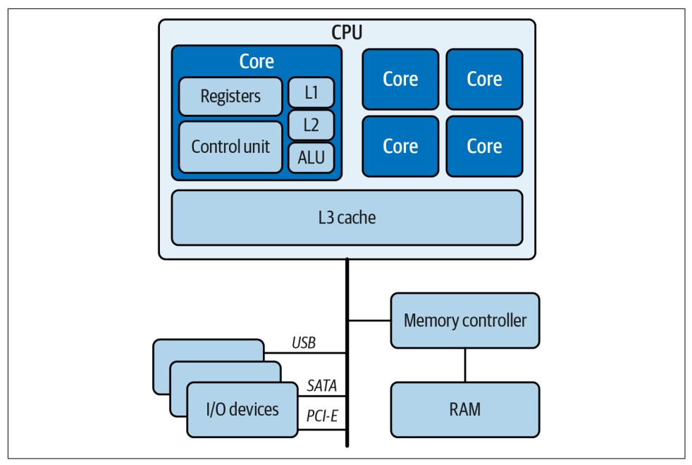
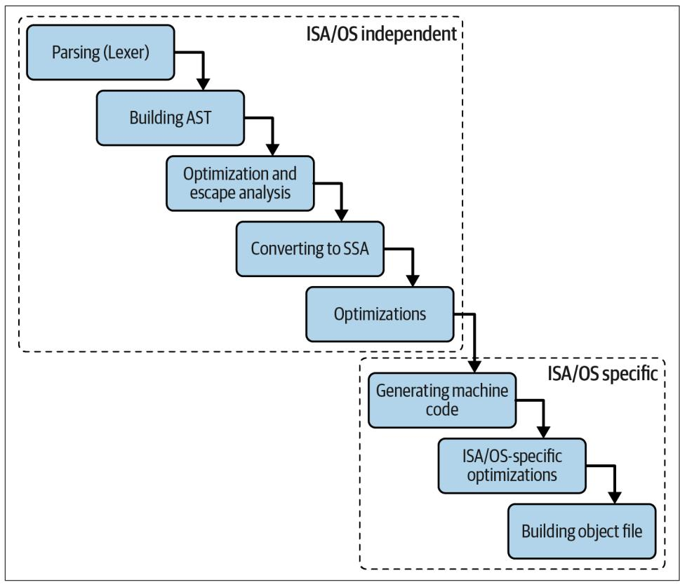
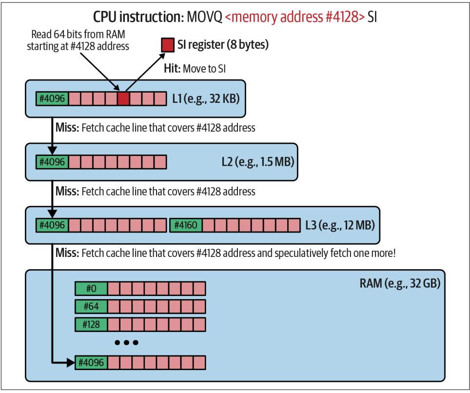
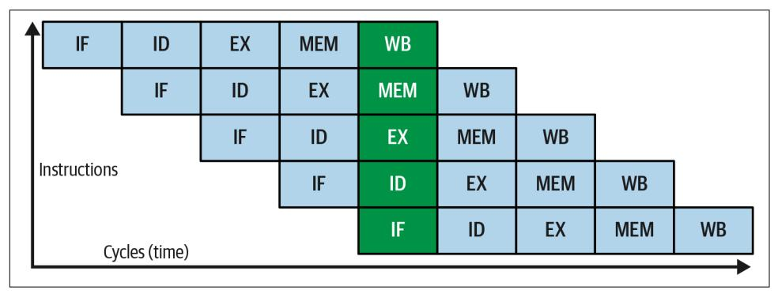
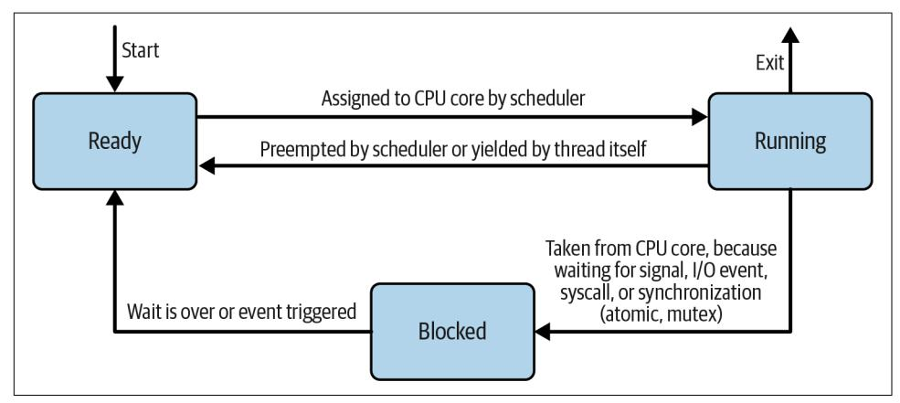

<span id="page-130-0"></span>
# Chapter 4: How Go Uses the CPU Resource (or Two)

One of the most useful abstractions we can make is to treat properties of our hardware and infrastructure systems as resources. CPU, memory, data storage, and the network are similar to resources in the natural world: they are finite, they are physical objects in the real world, and they must be distributed and shared between various key players in the ecosystem.

—Susan J. Fowler, *[Production-Ready Microservices](https://oreil.ly/8xO1v)* (O'Reilly, 2016)

As you learned in ["Behind Performance" on page 3](005-chapter-1-software-efficiency-matters.md#page-22-0), software efficiency depends on how our program uses the hardware resources. If the same functionality uses fewer resources, our efficiency increases and the requirements and net cost of running such a program decrease. For example, if we use less CPU time (CPU "resource") or fewer resources with slower access time (e.g., disk), we usually reduce the latency of our software.

This might sound simple, but in modern computers, these resources interact with each other in a complex, nontrivial way. Furthermore, more than one process is using these resources, so our program does not use them directly. Instead, these resources are managed for us by an operating system. If that wasn't complex enough, especially in cloud environments, we often "virtualize" the hardware further so it can be shared across many individual systems in an isolated way. That means there are methods for "hosts" to give access to part of a single CPU or disk to a "guest" operating system that thinks it's all the hardware that exists. In the end, operating systems and virtuali‐ zation mechanisms create layers between our program and the actual physical devices that store or compute our data.

To understand how to write efficient code or improve our program's efficiency effec‐ tively, we have to learn the characteristics, purpose, and limits of the typical com‐ puter resources like CPU, different types of storage, and network. There is no

<span id="page-131-0"></span>shortcut here. Furthermore, we can't ignore understanding how these physical com‐ ponents are managed by the operating system and typical virtualization layers.

In this chapter, we will examine our program execution from the point of view of the CPU. We will discuss how Go uses CPUs for single and multiple core tasking.


We won't discuss all types of computer architectures with all mechanisms of all existing operating systems, as this would be impossible to fit in one book, never mind one chapter. So instead, this chapter will focus on a typical x86-64 CPU architecture with Intel or AMD, ARM CPUs, and the modern Linux operating sys‐ tem. This should get you started and give you a jumping-off point if you ever run your program on other, unique types of hardware or operating systems.

We will start with exploring CPU in a modern computer architecture to understand how modern computers are designed, mainly focusing on the CPU, or processor. Then I will introduce the Assembly language, which will help us understand how the CPU core executes instructions. After that, we will dig into the Go compiler to build awareness of what happens when we do a go build. Furthermore, we will jump into the CPU and memory wall problem, showing you why modern CPU hardware is complex. This problem directly impacts writing efficient code on these ultracritical paths. Finally, we will enter the realm of multitasking by explaining how the operat‐ ing system scheduler tries to distribute thousands of executing programs on outnum‐ bered CPU cores and how the Go runtime scheduler leverages that to implement an efficient concurrency framework for us to use. We will finish with the summary on when to use concurrency.


## Mechanical Sympathy

Initially, this chapter might get overwhelming, especially if you are new to low-level programming. Yet, awareness of what is happen‐ ing will help us understand the optimizations, so focus on under‐ standing high-level patterns and characteristics of each resource (e.g., how the Go scheduler works). We don't need to know how to write machine code manually or how to, blindfolded, manufacture the computer.

Instead, let's treat this with curiosity about how things work under the computer case in general. In other words, we need to have [mechanical sympathy](https://oreil.ly/Co2IM).

To understand how the CPU architecture works, we need to explain how modern computers operate. So let's dive into that in the next section.

<span id="page-132-0"></span>
### CPU in a Modern Computer Architecture

All we do while programming in Go is construct a set of statements that tells the computer what to do, step-by-step. Given predefined language constructs like vari‐ ables, loops, control mechanisms, arithmetic, and I/O operations, we can implement any algorithms that interact with data stored in different mediums. This is why Go, like many other popular programming languages, can be called imperative—as devel‐ opers, we have to describe how the program will operate. This is also how hardware is designed nowadays—it is imperative too. It waits for program instructions, optional input data, and the desired place for output.

Programming wasn't always so simple. Before general-purpose machines, engineers had to design fixed program hardware to achieve requested functionality, e.g., a desk calculator. Adding a feature, fixing a bug, or optimizing required changing the circuits and manufacturing new devices. Probably not the easiest time to be a "programmer"!

Fortunately, around the 1950s, a few inventors worldwide figured out the opportu‐ nity for the universal machine that could be programmed using a set of predefined instructions stored in memory. One of the first people to document this idea was a great mathematician, John von Neumann, and his team.

It is evident that the machine must be capable of storing in some manner not only the digital information needed in a given computation ..., the intermediate results of the computation (which may be wanted for varying lengths of time), but also the instruc‐ tions which govern the actual routine to be performed on the numerical data. ... For an all-purpose machine, it must be possible to instruct the device to carry out whatsoever computation that can be formulated in numerical terms.

—Arthur W. Burks, Herman H. Goldstine, and John von Neumann, *Preliminary Discussion of the Logical Design of an Electronic Computing Instrument* (Institute for Advanced Study, 1946)

What's noteworthy is that most modern general-purpose computers (e.g., PCs, lap‐ tops, and servers) are based on John von Neumann's design. This assumes that pro‐ gram instructions can be stored and fetched similar to storing and reading program data (instruction input and output). We fetch both the instruction to be performed (e.g., add) and data (e.g., addition operands) by reading bytes from a certain memory address in the main memory (or caches). While it doesn't sound like a novel idea now, it established how general-purpose machines work. We call this Von Neumann computer architecture, and you can see its modern, evolved variation in [Figure 4-1](#page-133-0). 1

<sup>1</sup> To be technically strict, modern computers nowadays have distinct caches for program instructions and data, while both are stored the same on the main memory. This is the so-called modified Harvard architecture. At the optimization levels we aim for in this book, we can safely skip this level of detail.

<span id="page-133-0"></span>

*Figure 4-1. High-level computer architecture with a single multicore CPU and uniform memory access (UMA)*

At the heart of modern architecture, we see a CPU consisting of multiple cores (four to six physical cores are the norm in the 2020s PCs). Each core can execute desired instructions with certain data saved in random-access memory (RAM) or any other memory layers like registers or L-caches (discussed later).

The RAM explained in [Chapter 5](009-chapter-5-how-go-uses-memory-resource.md#page-168-0) performs the duty of the main, fast, volatile mem‐ ory that can store our data and program code as long as the computer is powered. In addition, the memory controller makes sure RAM is supplied with a constant power flow to keep the information on RAM chips. Last, the CPU can interact with various external or internal input/output (I/O) devices. From a high-level view, an I/O device means anything that accepts sending or receiving a stream of bytes, for example, mouse, keyboard, speaker, monitor, HDD or SSD disk, network interface, GPU, and thousands more.

Roughly speaking, CPU, RAM, and popular I/O devices like disks and network inter‐ faces are the essential parts of computer architecture. This is what we use as "resources" in our RAERs mentioned in ["Efficiency Requirements Should Be Formal‐](007-chapter-3-conquering-efficiency.md#page-102-0) [ized" on page 83](007-chapter-3-conquering-efficiency.md#page-102-0) and what we are usually optimizing for in our software development.

In this chapter, we will focus on the brain of our general-purpose machines—the CPU. When should we care about CPU resources? Typically, from an efficiency

<span id="page-134-0"></span>standpoint, we should start looking at our Go process CPU resource usage when either of the following occurs:

- Our machine can't do other tasks because our process uses all the available CPU resource computing capacity.
- Our process runs unexpectedly slow, while we see higher CPU consumption.

There are many techniques to troubleshoot these symptoms, but we must first under‐ stand the CPU's internal working and program execution basics. This is the key to efficient Go programming. Furthermore, it explains the numerous optimization tech‐ niques that might surprise us initially. For example, do you know why in Go (and other languages), we should avoid using linked lists like structures if we plan to iter‐ ate over them a lot, despite their theoretical advantages like quick insertion and deletion?

Before we learn why, we must understand how the CPU core executes our programs. Surprisingly, I found that the best way to explain this is by learning how the Assem‐ bly language works. Trust me on this; it might be easier than you think!

### Assembly

The CPU core, indirectly, can execute programs we write. For example, consider the simple Go code in Example 4-1.

*Example 4-1. Simple function that reads numbers from a file and returns the total sum*

```
func Sum(fileName string) (ret int64, _ error) {
 b, err := os.ReadFile(fileName)
 if err != nil {
 return 0, err
 }
 for _, line := range bytes.Split(b, []byte("\n")) {
 num, err := strconv.ParseInt(string(line), 10, 64)
 if err != nil {
 return 0, err
 }
 ret += num
 }
 return ret, nil
}
```

The main arithmetic operation in this function adds a parsed number from the file into a ret integer variable representing the total sum.

<span id="page-135-0"></span>While such language is far from, let's say, spoken English, unfortunately, it is still too complex and incomprehensible for the CPU. It is not "machine-readable" code. Thankfully every programming language has a dedicated tool called a compiler<sup>2</sup> that (among other things discussed in ["Understanding Go Compiler" on page 118\)](#page-137-0) trans‐ lates our higher-level code to machine code. You might be familiar with a go build command that invokes a default Go compiler.

The machine code is a sequence of instructions written in binary format (famous zeros and ones). In principle, each instruction is represented by a number (opcode) followed by optional operands in the form of a constant value or address in the main memory. We can also refer to a few CPU core registers, which are tiny "slots" directly on the CPU chip that can be used to store intermediate results. For example, on AMD64 CPU, we have sixteen 64-bit general-purpose registers referred to as RAX, RBX, RDX, RBP, RSI, RDI, RSP, and R8-R15.

While translating to machine code, the compiler often adds additional code like extra memory safety bound checks. It automatically changes our code for known efficiency patterns for a given architecture. Sometimes this might not be what we expect. This is why inspecting the resulting machine code when troubleshooting some efficiency problems is sometimes useful. Another advanced example of humans needing to read machine code is when we need to reverse engineer programs without source code.

Unfortunately, machine code is impossible to read for humans unless you are a gen‐ ius. However, there is a great tool we can use in such situations. We can compile [Example 4-1](#page-134-0) code to [Assembly language](https://oreil.ly/3xZAs) instead of machine code. We can also disas‐ semble the compiled machine code to Assembly. The Assembly language represents the lowest code level that can be practically read and (in theory) written by human developers. It also represents well what will be interpreted by the CPU when con‐ verted to machine code.

It is worth mentioning that we can disassemble compiled code into various Assembly dialects. For example:

- To [Intel syntax](https://oreil.ly/alpt4) using the standard Linux tool [objdump -d -M intel <binary>](https://oreil.ly/kZO3j)
- To [AT&T syntax](https://oreil.ly/k6bKs) using the similar command [objdump -d -M att <binary>](https://oreil.ly/cmAW9)
- To [Go "pseudo" assembly language](https://oreil.ly/lT07J) using Go tooling [go tool objdump -s](https://oreil.ly/5I9t2) [<binary>](https://oreil.ly/5I9t2)

<sup>2</sup> For scripted (interpreted) languages, there is no complete code compilation. Instead, there is an interpreter that compiles the code statement by statement. Another unique type of language is represented by a family of languages that use Java Virtual Machine (JVM). Such a machine can dynamically switch from interpreting to just-in-time (JIT) compilation for runtime optimizations.

<span id="page-136-0"></span>All three of these dialects are used in the various tools, and their syntax varies. To have an easier time, always ensure what syntax your disassembly tool uses. The Go Assembly is a dialect that tries to be as portable as possible, so it might not exactly represent the machine code. Yet it is usually consistent and close enough for our purposes. It can show all compilation optimization discussed in ["Understanding Go Compiler" on page](#page-137-0) [118](#page-137-0). This is why Go Assembly is what we will use throughout this book.


### Do I Need to Understand Assembly?

You don't need to know how to program in Assembly to write effi‐ cient Go code. Yet a rough understanding of Assembly and the decompilation process are essential tools that can often reveal hid‐ den, lower-level computation waste. Practically speaking, it's useful primarily for advanced optimizations when we have already applied all of the more straightforward optimizations. Assembly is also beneficial for understanding the changes the compiler applies to our code when translating to machine code. Sometimes these might surprise us! Finally, it also tells us how the CPU works.

In Example 4-2 we can see a tiny, disassembled part of the compiled [Example 4-1](#page-134-0) (using go tool objsdump -s) that represents ret += num statement.<sup>3</sup>

*Example 4-2. Addition part of code in Go Assembly language decompiled from the compiled [Example 4-1](#page-134-0)*

```
// go tool objdump -s sum.test
ret += num
0x4f9b6d 488b742450 MOVQ 0x50(SP), SI 
0x4f9b72 4801c6 ADDQ AX, SI
```

- The first line represents a [quadword \(64 bit\) MOV instruction](https://oreil.ly/SDE5R) that tells the CPU to copy the 64-bit value from memory under the address stored in register SP plus 80 bytes and put that into the SI register.<sup>4</sup> The compiler decided that SI will store the initial value of the return argument in our function, so the ret integer variable for the ret+=num operation.
- As a second instruction, we tell the CPU to add a quadword value from the AX register to the SI register. The compiler used the AX register to store the num inte‐

<sup>3</sup> Similar output to Example 4-2 can be obtained by compiling the source code to Assembly using go build -gcflags *-S* <source>.

<sup>4</sup> Note that in the Go Assembly register, names are abstracted for portability. Since we will compile to 64-bit architecture, SP and SI will mean RSP and RSI registers.

<span id="page-137-0"></span>ger variable, which we parsed from the string in previous instructions (outside of this snippet).

The preceding example shows MOVQ and ADDQ instructions. To make things more complex, each distinct CPU implementation allows a different set of instructions, with different memory addressing, etc. The industry created the [Instruction Set](https://oreil.ly/eTzST) [Architecture \(ISA\)](https://oreil.ly/eTzST) to specify a strict, portable interface between software and hard‐ ware. Thanks to the ISA, we can compile our program, for example, to machine code compatible with the ISA for x86 architecture and run it on any x86 CPU.<sup>5</sup> The ISA defines data types, registers, main memory management, fixed set of instructions, unique identification, input/output model, etc. There are various [ISAs](https://oreil.ly/TLxJn) for different types of CPUs. For example, both 32-bit and 64-bit Intel and AMD processors use x86 ISA, and ARM uses its ARM ISA (for example, new [Apple M chips use](https://oreil.ly/NZqT1) [ARMv8.6-A](https://oreil.ly/NZqT1)).

As far as Go developers are concerned, the ISA defines a set of instructions and regis‐ ters our compiled machine code can use. To produce a portable program, a compiler can transform our Go code into machine code compatible with a specific ISA (archi‐ tecture) and the type of the desired operating system. In the next section, let's look at how the default Go compiler works. On the way, we will uncover mechanisms to help the Go compiler produce efficient and fast machine code.

### Understanding Go Compiler

The topic of building effective compilers can fill a few books. In this book, however, we will try to understand the Go compiler basics that we, as Go developers interested in efficient code, have to be aware of. Generally, many things are involved in execut‐ ing the Go code we write on the typical operating system, not only compilation. First, we need to compile it using a compiler, and then we have to use a linker to link dif‐ ferent object files together, including potentially shared libraries. These compile and link procedures, often called *building*, produce the executable ("binary") that the operating system can execute. During the initial start, called *loading*, other shared libraries can be dynamically loaded too (e.g., Go plug-ins).

There are many code-building methods for Go code, designed for different target environments. For example, [Tiny Go](https://oreil.ly/c2C5E) is optimized to produce binaries for microcon‐ trollers, [gopherjs](https://oreil.ly/D83Jq) produces JavaScript for in-browser execution, and [android](https://oreil.ly/83Wm1) pro‐ duces programs executable on Android operating systems. However, this book will focus on the default and most popular Go compiler and linking mechanism available

<sup>5</sup> There can be incompatibilities, but mostly with special-purpose instructions like cryptographic or SIMD instructions, which can be checked at runtime if they are available before execution.

<span id="page-138-0"></span>in the go build command. The compiler itself is written in Go (initially in C). The rough documentation and source code can be found [here.](https://oreil.ly/qcrLt)

The go build can build our code into many different outputs. We can build executa‐ bles that require system libraries to be dynamically linked on startup. We can build shared libraries or even C-compatible shared libraries. Yet the most common and recommended way of using Go is to build executables with all dependencies statically linked in. It offers a much better experience where invocation of our binary does not need any system dependency of a specific version in a certain directory. It is a default build mode for code with a starting main function that can also be explicitly invoked using go build -buildmode=exe.

The go build command invokes both compilation and linking. While the linking phase also performs certain optimizations and checks, the compiler probably per‐ forms the most complex duty. The Go compiler focuses on a single package at once. It compiles package source code into the native code that the target architecture and operating systems support. On top of that, it validates, optimizes that code, and pre‐ pares important metadata for debugging purposes. We need to "collaborate" with the compiler (and operating system and hardware) to write efficient Go and not work against it.

I tell everyone, if you're not sure how to do something, ask the question around what is the most idiomatic way to do this in Go. Because many of those answers are already tuned to being sympathetic with the operating system of the hardware.

—Bill Kennedy, ["Bill Kennedy on Mechanical Sympathy"](https://oreil.ly/X3XzI)

To make things more interesting, go build also offers a special cross-compilation mode if you want to compile a mix of Go code that uses functions implemented in C, C++, or even Fortran! This is possible if you enable a mode called [cgo](https://oreil.ly/Xjh9U), which uses a mix of C (or C++) compiler and Go compiler. Unfortunately, cgo [is not recom‐](https://oreil.ly/QojX3) [mended](https://oreil.ly/QojX3), and it should be avoided if possible. It makes the build process slow, the performance of passing data between C and Go is questionable, and non-cgo compi‐ lation is already powerful enough to cross-compile binaries for different architectures and operating systems. Luckily, most of the libraries are either pure Go or are using pieces of Assembly that can be included in the Go binary without cgo.

To understand the impact of the compiler on our code, see the stages the Go com‐ piler performs in [Figure 4-2.](#page-139-0) While go build includes such compilation, we can trig‐ ger just the compilation (without linking) alone using go tool compile.

<span id="page-139-0"></span>

*Figure 4-2. Stages performed by the Go compiler on each Go package*

As mentioned previously, the whole process resides around the packages you use in your Go program. Each package is compiled in separation, allowing parallel compila‐ tion and separation of concerns. The compilation flow presented in Figure 4-2 works as follows:

- 1. The Go source code is first tokenized and parsed. The syntax is checked. The syntax tree references files and file positions to produce meaningful error and debugging information.
- 2. An abstract syntax tree (AST) is built. Such a tree notion is a common abstrac‐ tion that allows developers to create algorithms that easily transform or check parsed statements. While in AST form, code is initially type-checked. Declared but not used items are detected.
- 3. The first pass of optimization is performed. For example, the initial dead code is eliminated, so the binary size can be smaller and less code needs to be compiled. Then, escape analysis (mentioned in ["Go Memory Management"](009-chapter-5-how-go-uses-memory-resource.md#page-191-0) on page 172) is

<span id="page-140-0"></span>performed to decide which variables can be placed on the stack and which have to be allocated on the heap. On top of that, in this stage, function inlining occurs for simple and small functions.


#### Function Inlining

Functions<sup>6</sup> in programming language allow us to create abstractions, hide complexities, and reduce repeated code. Yet the cost of calling execution is nonzero. For example, [a func‐](https://oreil.ly/4OPbI) [tion with a single argument call needs ~10 extra CPU instruc‐](https://oreil.ly/4OPbI) [tions.](https://oreil.ly/4OPbI) 7 So, while the cost is fixed and typically at the level of nanoseconds, it can matter if we have thousands of these calls in the hot path and the function body is small enough that this execution call matters.

There are also other benefits of inlining. For example, the compiler can apply other optimizations more effectively in code with fewer functions and does not need to use heap or large stack memory (with copy) to pass arguments between function scopes. Heap and stack are explained in ["Go Memory](009-chapter-5-how-go-uses-memory-resource.md#page-191-0) [Management" on page 172.](009-chapter-5-how-go-uses-memory-resource.md#page-191-0)

The compiler automatically substitutes some function calls with the exact copy of its body. This is called *inlining* or *[inline expansion](https://oreil.ly/JGde3)*. The logic is quite smart. For instance, from Go 1.9, the compiler can [inline both leaf and mid-stack functions.](https://oreil.ly/CX2v0)


#### Manual Inlining Is Rarely Needed

It is tempting for beginner engineers to micro-optimize by manually inlining some of their functions. However, while developers had to do it in the early days of programming, this functionality is a fundamental duty of the compiler, which usually knows better when and how to inline a function. Use that fact by focusing on your code readability and maintaina‐ bility first regarding the choice of functions. Inline manually only as a last resort, and always measure.

<sup>6</sup> Note that the structure methods, from a compiler perspective, are just functions, with the first argument being that structure, so the same inlining technique applies here.

<sup>7</sup> A function call needs more CPU instructions since the program has to pass argument variables and return parameters through the stack, keep the current function's state, rewind the stack after the function call, add the new frame stack, etc.

- <span id="page-141-0"></span>4. After early optimizations on the AST, the tree is converted to the Static Single Assignment (SSA) form. This low-level, more explicit representation makes it easier to perform further optimization passes using a set of rules. For example, with the help of the SSA, the compiler can easily find places of unnecessary vari‐ able assignments.<sup>8</sup>
- 5. The compiler applies further machine-independent optimization rules. So, for example, statements like y := 0\*x will be simplified to y :=0. The complete list of rules is [enormous](https://oreil.ly/QTljA) and only confirms how complex this space is. Further‐ more, some code pieces can be replaced by an [intrinsic function](https://oreil.ly/FMjT0)—heavily opti‐ mized equivalent code (e.g., in raw Assembly).
- 6. Based on GOARCH and GOOS environment variables, the compiler invokes the genssa function that converts SSA to the machine code for the desired architec‐ ture (ISA) and operating system.
- 7. Further ISA- and operating system–specific optimizations are applied.
- 8. Package machine code that is not dead is built into a single object file (with the *.o* suffix) and debug information.

The final "object file" is compressed into a tar file called a Go *archive*, usually with *.a* file suffix.<sup>9</sup> Such archive files for each package can be used by Go linker (or other linkers) to combine all into a single executable, commonly called a *binary file*. Depending on the operating system, such a file follows a certain format, telling the system how to execute and use it. Typically for Linux, it will be an [Executable and](https://oreil.ly/jnicX) [Linkable Format](https://oreil.ly/jnicX) (ELF). On Windows, it might be [Portable Executable](https://oreil.ly/SdohW) (PE).

The machine code is not the only part of such a binary file. It also carries the pro‐ gram's static data, like global variables and constants. The executable file also con‐ tains a lot of debugging information that can take a considerable amount of binary size, like a simple symbols table, basic type information (for reflection), and [PC-to](https://oreil.ly/akAR2)[line mapping](https://oreil.ly/akAR2) (address of the instruction to the line in the source code where the command was). That extra information enables valuable debugging tools to link machine code to the source code. Many debugging tools use it, for example, ["Profil‐](013-chapter-9-data-driven-bottleneck-analysis.md#page-350-0) ing in Go" [on page 331](013-chapter-9-data-driven-bottleneck-analysis.md#page-350-0) and the aforementioned objdump tool. For compatibility with

<sup>8</sup> Go tooling allows us to check the state of our program through each optimization in the SSA form thanks to the GOSSAFUNC environment variable. It's as easy as building our program with GOSSAFUNC=<function to see> go build and opening the resulting *ssa.html* file. You can read more about it [here](https://oreil.ly/32Zbd).

<sup>9</sup> You can unpack it with the tar <archive> or go tool pack e <archive> command. Go archive typically contains the object file and package metadata in the *\_\_.PKGDEF* file.

debugging software like Delve or GDB, the DWARF table is also attached to the binary file.<sup>10</sup>

On top of the already long list of responsibilities, the Go compiler must perform extra steps to ensure Go [memory safety.](https://oreil.ly/kkCRb) For instance, the compiler can often tell during compile time that some commands will use a memory space that is safe to use (con‐ tains an expected data structure and is reserved for our program). However, there are cases when this cannot be determined during compilation, so additional checks have to be done at runtime, e.g., extra bound checks or nil checks.

We will discuss this in more detail in ["Go Memory Management" on page 172](009-chapter-5-how-go-uses-memory-resource.md#page-191-0), but for our conversation about CPU, we need to acknowledge that such checks can take our valuable CPU time. While the Go compiler tries to eliminate these checks when unnecessary (e.g., in the bound check elimination stage during SSA optimizations), there might be cases where we need to write code in a way that helps the compiler eliminate some checks.<sup>11</sup>

There are many different configuration options for the Go build process. The first large batch of options can be passed through go build -ldflags="<flags>", which represents [linker command options](https://oreil.ly/g8dvv) (the ld prefix traditionally stands for [Linux](https://oreil.ly/uJEda) [linker\)](https://oreil.ly/uJEda). For example:

- We can omit the DWARF table, thus reducing the binary size using -ldflags="-w" (recommended for production build if you don't use debuggers there).
- We can further reduce the size with -ldflags= "-s -w", removing the DWARF and symbols tables with other debug information. I would not recommend the latter option, as non-DWARF elements allow important runtime routines, like gathering profiles.

Similarly, go build -gcflags="<flags>" represents [Go compiler options](https://oreil.ly/rRtRs) (gc stands for Go Compiler; don't confuse it with GC, which means garbage collection, as explained in ["Garbage Collection" on page 185\)](009-chapter-5-how-go-uses-memory-resource.md#page-204-0). For example:

- -gcflags="-S" prints Go Assembly from the source code.
- -gcflags="-N" disables all compiler optimizations.

<sup>10</sup> However, there are [discussions to remove](https://oreil.ly/xoijc) it from the default building process.

<sup>11</sup> [Bound check elimination](https://oreil.ly/E7FJI) is not explained in this book, as it's a rare optimization idea.

<span id="page-143-0"></span>• -gcflags="-m=<number> builds the code while printing the main optimization decisions, where the number represents the level of detail. See Example 4-3 for the automatic compiler optimizations made on our Sum function in [Example 4-1](#page-134-0).

*Example 4-3. Output of go build -gcflags="-m=1" sum.go on [Example 4-1](#page-134-0) code*

```
# command-line-arguments
./sum.go:10:27: inlining call to os.ReadFile 
./sum.go:15:34: inlining call to bytes.Split 
./sum.go:9:10: leaking param: fileName 
./sum.go:15:44: ([]byte)("\n") does not escape 
./sum.go:16:38: string(line) escapes to heap
```

- os.ReadFile and bytes.Split are short enough, so the compiler can copy the whole body of the Sum function.
- The fileName argument is "leaking," meaning this function keeps its parameter alive after it returns (it can still be on stack, though).
- Memory for []byte("\n") will be allocated on the stack. Messages like this help debug escape analysis. Learn more about it [here](https://oreil.ly/zBCyO).
- Memory for string(line) will be allocated in a more expensive heap.

The compiler will print more details with an increased -m number. For example, -m=3 will explain why certain decisions were made. This option is handy when we expect certain optimization (inlining or keeping variables on the stack) to occur, but we still see an overhead while benchmarking in our TFBO cycle (["Efficiency-Aware Develop‐](007-chapter-3-conquering-efficiency.md#page-121-0) [ment Flow" on page 102](007-chapter-3-conquering-efficiency.md#page-121-0)).

The Go compiler implementation is highly tested and mature, but there are limitless ways of writing the same functionality. There might be edge cases when our imple‐ mentation confuses the compiler, so it does not apply certain naive implementations. Benchmarking if there is a problem, profiling the code, and confirming with the -m option help. More detailed optimizations can also be printed using further options. For example, -gcflags="-d=ssa/check\_bce/debug=1" prints all bound check elimi‐ nation optimizations.

<span id="page-144-0"></span>

#### The Simpler the Code, the More Effective Compiler Optimizations Will Be

Too-clever code is hard to read and makes it difficult to maintain programmed functionality. But it also can confuse the compiler that tries to match patterns with their optimized equivalents. Using idiomatic code, keeping your functions and loops straightforward, increases the chances that the compiler applies the optimizations so you don't need to!

Knowing compiler internals helps, especially when it comes to more advanced opti‐ mizations tricks, which among other things, help compilers optimize our code. Unfortunately, it also means our optimizations might be a bit fragile regarding porta‐ bility between different compiler versions. The Go team reserves rights to change compiler implementation and flags since they are not part of any specification. This might mean that the way you wrote a function that allows automatic inline by the compiler might not trigger inline in the next version of the Go compiler. This is why it's even more important to benchmark and closely observe the efficiency of your program when you switch to a different Go version.

To sum up, the compilation process has a crucial role in offloading programmers from pretty tedious work. Without compiler optimizations, we would need to write more code to get to the same efficiency level while sacrificing readability and porta‐ bility. Instead, if you focus on making your code simple, you can trust that the Go compiler will do a good enough job. If you need to increase efficiency for a particular hot path, it might be beneficial to double-check if the compiler did what you expected. For example, it might be that the compiler did not match our code with common optimization; there is some extra memory safety check that the compiler could further eliminate or function that could be inlined but was not. In very extreme cases, there might be even a value to write a dedicated assembly code and import it from the Go code.<sup>12</sup>

The Go building process constructs fully executable machine code from our Go source code. The operating system loads machine code to memory and writes the first instruction address to the program counter (PC) register when it needs to be executed. From there, the CPU core can compute each instruction one by one. At first glance, it might mean that the CPU has a relatively simple job to do. But unfortunately, a memory wall problem causes CPU makers to continuously work on additional hardware optimizations that change how these instructions are executed. Understanding these mechanisms will allow us to control the efficiency and speed of our Go programs even better. Let's uncover this problem in the next section.

<sup>12</sup> This is very often used in standard libraries for critical code.

<span id="page-145-0"></span>
### CPU and Memory Wall Problem

To understand the memory wall and its consequences, let's dive briefly into CPU core internals. The details and implementation of the CPU core change over time for better efficiency (usually getting more complex), but the fundamentals stay the same. In principle, a Control Unit, shown in [Figure 4-1](#page-133-0), manages reads from memory through various L-caches (from smallest and fastest), decodes program instructions, coordinates their execution in the Arithmetic Logic Unit (ALU), and handles interruptions.

An important fact is that the CPU works in cycles. Most CPUs in one cycle can per‐ form one instruction on one set of tiny data. This pattern is called the Single Instruc‐ tion Single Data (SISD) in characteristics mentioned in [Flynn's taxonomy,](https://oreil.ly/oQu0M) and it's the key aspect of the von Neumann architecture. Some CPUs also allow Single Instruction Multiple Data (SIMD)<sup>13</sup> processing with special instructions like SSE, which allows the same arithmetic operation on four floating numbers in one cycle. Unfortunately, these instructions are not straightforward to use in Go and are there‐ fore quite rarely seen.

Meanwhile, registers are the fastest local storage available to the CPU core. Because they are small circuits wired directly into the ALU, it takes only one CPU cycle to read their data. Unfortunately, there are also only a few of them (depending on the CPU, typically 16 for general use), and their size is usually not larger than 64 bits. This means they are used as short-time variables in our program lifetime. Some of the registers can be used for our machine code. Others are reserved for CPU use. For example, the [PC register](https://oreil.ly/TvHVd) holds the address of the next instruction that the CPU should fetch, decode, and execute.

Computation is all about the data. As we learned in [Chapter 1,](005-chapter-1-software-efficiency-matters.md#page-20-0) there is lots of data nowadays, scattered around different storage mediums—uncomparably more than what's available to store in a single CPU register. Moreover, a single CPU cycle is faster than accessing data from the main memory (RAM)—on average, one hundred times faster, as we read from our rough napkin math of latencies in [Appendix A](015-chapter-11-optimization-patterns.md#page-484-0) that we will use throughout this book. As discussed in the misconception ["Hardware Is](005-chapter-1-software-efficiency-matters.md#page-36-0) [Getting Faster and Cheaper" on page 17,](005-chapter-1-software-efficiency-matters.md#page-36-0) technology allows us to create CPU cores with dynamic clock speed, yet the maximum is always around 4 GHz. Funny enough, the fact we can't make faster CPU cores is not the most important problem since our

<sup>13</sup> On top of SISD and SIMD, Flynn's taxonomy also specifies MISD, which describes performing multiple instructions on the same data, and MIMD, which describes full parallelism. MISD is rare and only happens when reliability is important. For example, four flight control computers perform exactly the same computa‐ tions for quadruple error checks in every NASA space shuttle. MIMD, on the other hand, is more common thanks to multicore or even multi-CPU designs.

<span id="page-146-0"></span>CPU cores are already… too fast! It's a fact we cannot make faster memory, which causes the main efficiency issues in CPUs nowadays.

We can execute something in the ballpark of 36 billion instructions every second. Unfortunately, most of that time is spent waiting for data. About 50% of the time in almost every application. In some applications upwards of 75% of the time is spent waiting for data rather than executing instructions. If this horrifies you, good. It should.

— Chandler Carruth, ["Efficiency with Algorithms, Performance with Data](https://oreil.ly/I55mm) [Structures"](https://oreil.ly/I55mm)

The aforementioned problem is often referred to as a ["memory wall" problem.](https://oreil.ly/l5zgk) As a result of this problem, we risk wasting dozens, if not hundreds, of CPU cycles per sin‐ gle instruction, since fetching that instruction and data (and then saving the results) takes ages.

This problem is so prominent that it has triggered recent discussions about [revisiting](https://oreil.ly/xqbNU) [von Neumann's architecture](https://oreil.ly/xqbNU) as machine learning (ML) workloads (e.g., neural net‐ works) for artificial intelligence (AI) use become more popular. These workloads are especially affected by the memory wall problem because most of the time is spent performing complex matrix math calculations, which require traversing large amounts of memory.<sup>14</sup>

The memory wall problem effectively limits how fast our programs do their job. It also impacts the overall energy efficiency that matters for mobile applications. Never‐ theless, it is the best common general-purpose hardware nowadays. Industry mitiga‐ ted many of these problems by developing a few main CPU optimizations we will discuss below: the hierarchical cache system, pipelining, out-of-order execution, and hyperthreading. These directly impact our low-level Go code efficiency, especially in terms of how fast our program will be executed.

### Hierachical Cache System

All modern CPUs include local, fast, small caches for often-used data. L1, L2, L3 (and sometimes L4) caches are on-chip static random-access memory (SRAM) circuits. SRAM uses different technology for storing data faster than our main memory RAM but is much more expensive to use and produce in large capacities (main memory is explained in ["Physical Memory" on page 153](009-chapter-5-how-go-uses-memory-resource.md#page-172-0)). Therefore, L-caches are touched first when the CPU needs to fetch instruction or data for an instruction from the main

<sup>14</sup> This is why we see specialized chips (called Neural Processing Units, or NPUs) appearing in the commodity devices—for example, Tensor Processing Unit (TPU) in Google phones, A14 Bionic chip in iPhones, and dedicated NPU in the M1 chip in Apple laptops.

memory (RAM). The way the CPU is using L-caches is presented in Figure 4-3. <sup>15</sup> In the example, we will use a simple CPU instruction MOVQ, explained in [Example 4-2.](#page-136-0)



*Figure 4-3. The "look up" cache method performed by the CPU to read bytes from the main memory through L-caches*

To copy 64 bits (MOVQ command) from a specific memory address to register SI, we must access the data that normally resides in the main memory. Since reading from RAM is slow, it uses L-caches to check for data first. The CPU will ask the L1 cache for these bytes on the first try. If the data is not there (cache miss), it visits a larger L2 cache, then the largest cache L3, then eventually main memory (RAM). In any of these misses, the CPU will try to fetch the complete "cache line" (typically 64 bytes, so eight times the size of the register), save it in all caches, and only use these specific bytes.

<sup>15</sup> Sizes of caches can vary. Example sizes are taken from my laptop. You can check the sizes of your CPU caches in Linux by using the sudo dmidecode -t cache command.

<span id="page-148-0"></span>Reading more bytes at once (cache line) is useful as it takes the same latency as read‐ ing a single byte (explained in ["Physical Memory" on page 153](009-chapter-5-how-go-uses-memory-resource.md#page-172-0)). Statistically, it is also likely that the next operation needs bytes next to the previously accessed area. L-caches partially mitigate the memory latency problem and reduce the overall amount of data to be transferred, preserving memory bandwidth.

The first direct consequence of having L-caches in our CPUs is that the smaller and more aligned the data structure we define, the better the efficiency. Such a structure will have more chances to fit fully in lower-level caches and avoid expensive cache misses. The second result is that instructions on sequential data will be faster since cache lines typically contain multiple items stored next to each other.

### Pipelining and Out-of-Order Execution

If the data were magically accessible in zero time, we would have a perfect situation where every CPU core cycle performs a meaningful instruction, executing instruc‐ tions as fast as CPU core speed allows. Since this is not the case, modern CPUs try to keep every part of the CPU core busy using cascading pipelining. In principle, the CPU core can perform many stages required for instruction execution at once in one cycle. This means we can exploit Instruction-Level Parallelism (ILP) to execute, for example, five independent instructions in five CPU cycles, giving us that sweet aver‐ age of one instruction per cycle (IPC).<sup>16</sup> For example, in an [initial 5-stage pipeline](https://oreil.ly/ccBg2) [system](https://oreil.ly/ccBg2) (modern CPUs have 14–24 stages!), a single CPU core computes 5 instruc‐ tions at the same time within a cycle, as presented in Figure 4-4.



*Figure 4-4. Example five-stage pipeline*

<sup>16</sup> If a CPU can in total perform up to one instruction per cycle (IPC ⇐ 1), we call it a scalar CPU. Most modern CPU cores have IPC ⇐ 1, but one CPU has more than one core, which makes IPC > 1. This makes these CPUs superscalar. IPC has quickly become a performance metric for CPUs.

<span id="page-149-0"></span>The classic five-stage pipeline consists of five operations:

IF

Fetch the instruction to execute.

ID

Decode the instruction.

EX

Start the execution of the instruction.

MEM

Fetch the operands for the execution.

WB

Write back the result of the operation (if any).

To make it even more complex, as we discussed in the L-caches section, it is rarely the case that even the fetch of the data (e.g., the MEM stage) takes only one cycle. To mitigate this, the CPU core also employs [a technique called out-of-order execution.](https://oreil.ly/ccBg2) In this method, the CPU attempts to schedule instructions in an order governed by the availability of the input data and execution unit (if possible) rather than by their original order in the program. For our purposes, it is enough to think about it as a complex, more dynamic pipeline that utilizes internal queues for more efficient CPU execution.

The resulting pipelined and out-of-order CPU execution is complex, but the preced‐ ing simplified explanation should be all we need to understand two critical conse‐ quences for us as developers. The first, trivial one is that every switch of the instruction stream has a huge cost (e.g., in latency),<sup>17</sup> because the pipeline has to reset and start from scratch, on top of the obvious cache trashing. We haven't yet men‐ tioned the operating system overhead that must be added on top. We often call this a *context switch*, which is inevitable in modern computers since the typical operating systems use preemptive task scheduling. In these systems, the execution flow of the single CPU core can be preempted many times a second, which might matter in extreme cases. We will discuss how to influence such behavior in ["Operating System](#page-153-0) [Scheduler" on page 134.](#page-153-0)

<sup>17</sup> Huge cost is not an overstatement. Latency of context switch depends on many factors, but it was measured that in the best case, direct latency (including operating system switch latency) is around 1,350 nanoseconds—2,200 nanoseconds if it has to migrate to a different core. This is only a direct latency, from the end of one thread to the start of another. The total latency that would include the indirect cost in the form of cache and pipeline warm-up could be as high as 10,000 nanoseconds (and this is what we see in [Table A-1](015-chapter-11-optimization-patterns.md#page-484-0)). During this time, we could compute something like 40,000 instructions.

<span id="page-150-0"></span>The second consequence is that the more predictive our code is, the better. This is because pipelining requires the CPU cores to perform complex *branch predictions* to find instructions that will be executed after the current one. If our code is full of branches like if statements, switch cases, or jump statements like continue, finding even two instructions to execute simultaneously might be impossible, simply because one instruction might decide on what instruction will be done next. This is called data dependency. Modern CPU core implementation goes even further by perform‐ ing speculative execution. Since it does not know which instruction is next, it picks the most likely one and assumes that such a branch will be chosen. Unnecessary exe‐ cutions on the wrong branches are better than wasted CPU cycles doing nothing. Therefore, many branchless coding techniques have emerged, which help the CPU predict branches and might result in faster code. Some methods are applied automat‐ ically by the [Go compiler,](https://oreil.ly/VqKzx) but sometimes, manual improvements have to be added.

Generally speaking, the simpler the code, with fewer nested conditionals and loops, the better for the branch predictor. This is why we often hear that the code that "leans to the left" is faster.

In my experience [I saw] repeatedly that code that wants to be fast, go to the left of the page. So if you [write] like a loop and the if, and the for and a switch, it's not going to be fast. By the way, the Linux kernel, do you know what the coding standard is? Eight characters tab, 80 characters line width. You can't write bad code in the Linux kernel. You can't write slow code there. ... The moment you have too many ifs and decision points ... in your code, the efficiency is out of the window.

—Andrei Alexandrescu, ["Speed Is Found in the Minds of People"](https://oreil.ly/6mERC)

The existence of branch predictors and speculative approaches in the CPU has another consequence. It causes contiguous memory data structures to perform much better in pipelined CPU architecture with L-caches.


#### Contiguous Memory Structure Matters

Practically speaking, on modern CPUs, developers in most cases should prefer contiguous memory data structures like arrays instead of linked lists in their programs. This is because a typical linked-like list implementation (e.g., a tree) uses memory pointers to the next, past, child, or parent elements. This means that when iterating over such a structure, the CPU core can't tell what data and what instruction we will do next until we visit the node and check that pointer. This effectively limits the speculation capabili‐ ties, causing inefficient CPU usage.

<span id="page-151-0"></span>
### Hyper-Threading

Hyper-Threading is Intel's proprietary name for the CPU optimization technique called *[simultaneous multithreading](https://oreil.ly/L5va6)* (SMT). <sup>18</sup> Other CPU makers implement SMT too. This method allows a single CPU core to operate in a mode visible to programs and operating systems as two logical CPU cores.<sup>19</sup> SMT prompts the operating system to schedule two threads onto the same physical CPU core. While a single physical core will never execute more than one instruction at a time, more instructions in the queue help make the CPU core busy during idle times. Given the memory access wait times, this can utilize a single CPU core more without impacting the latency of the process execution. In addition, extra registers in SMT enable CPUs to allow for faster context switches between multiple threads running on a single physical core.

SMT has to be supported and integrated with the operating system. You should see twice as many cores as physical ones in your machine when enabled. To understand if your CPU supports Hyper-Threading, check the "thread(s) per core" information in the specifications. For example, using the lscpu Linux command in Example 4-4, my CPU has two threads, meaning Hyper-Threading is available.

*Example 4-4. Output of the lscpu command on my Linux laptop*

```
Architecture: x86_64
CPU op-mode(s): 32-bit, 64-bit
Byte Order: Little Endian
Address sizes: 39 bits physical, 48 bits virtual
CPU(s): 12
On-line CPU(s) list: 0-11
Thread(s) per core: 2 
Core(s) per socket: 6
Socket(s): 1
NUMA node(s): 1
Vendor ID: GenuineIntel
CPU family: 6
Model: 158
Model name: Intel(R) Core(TM) i7-9850H CPU @ 2.60GHz
CPU MHz: 2600.000
CPU max MHz: 4600.0000
CPU min MHz: 800.0000
```

My CPU supports SMT, and it's enabled on my Linux installation.

<sup>18</sup> In some sources, this technique is also called CPU threading (aka hardware threads). I will avoid this termi‐ nology in this book due to possible confusion with operating system threads.

<sup>19</sup> Do not confuse Hyper-Threading logical cores with virtual CPUs (vCPUs) referenced when we use virtualiza‐ tions like virtual machines. Guest operating systems use the machine's physical or logical CPUs depending on host choice, but in both cases, they are called vCPUs.

<span id="page-152-0"></span>The SMT is usually enabled by default but can be turned to on demand on newer ker‐ nels. This poses one consequence when running our Go programs. We can usually choose if we should enable or disable this mechanism for our processes. But should we? In most cases, it is better to keep it enabled for our Go programs as it allows us to fully utilize physical cores when running multiple different tasks on a single com‐ puter. Yet, in some extreme cases, it might be worth dedicating full physical core to a single process to ensure the highest quality of service. Generally, a benchmark on each specific hardware should tell us.

To sum up, all the aforementioned CPU optimizations and the corresponding pro‐ gramming techniques utilizing that knowledge tend to be used only at the very end of the optimization cycle and only when we want to squeeze out the last dozen nanosec‐ onds on the critical path.


#### Three Principles of Writing CPU-Efficient Code on Critical Path

The three basic rules that will yield CPU-friendly code are as follows:

- Use algorithms that do less work.
- Focus on writing low-complexity code that will be easier to optimize for the compiler and CPU branch predictors. Ideally, separate "hot" from "cold" code.
- Favor contiguous memory data structures when you plan to iterate or traverse over them a lot.

With this brief understanding of CPU hardware dynamics, let's dive deeper into the essential software types that allow us to run thousands of programs simultaneously on shared hardware—schedulers.

### Schedulers

Scheduling generally means allocating necessary, usually limited, resources for a cer‐ tain process to finish. For example, assembling car parts must be tightly scheduled in a certain place at a certain time in a car factory to avoid downtime. We might also need to schedule a meeting among certain attendees with only certain time slots of the day free.

In modern computers or clusters of servers, we have thousands of programs that have to be running on shared resources like CPU, memory, network, disks, etc. That's why the industry developed many types of scheduling software (commonly called *schedu‐ lers*) focused on allocating these programs to free resources on many levels.

<span id="page-153-0"></span>In this section, we will discuss CPU scheduling. Starting from the bottom level, we have an operating system that schedules arbitrary programs on a limited number of physical CPUs. Operating system mechanisms should tell us how multiple programs running simultaneously can impact our CPU resources and, in effect, our own Go program execution latency. It will also help us understand how a developer can uti‐ lize multiple CPU cores simultaneously, in parallel or concurrently, to achieve faster execution.

### Operating System Scheduler

As with compilers, there are many different operating systems (OSes), each with dif‐ ferent task scheduling and resource management logic. While most of the systems operate on similar abstractions (e.g., threads, processes with priorities), we will focus on the Linux operating system in this book. Its core, called the kernel, has many important functionalities, like managing memory, devices, network access, security, and more. It also ensures program execution using a configurable component called a scheduler.

As a central part of resource management, the OS thread scheduler must maintain the following, simple, invariant: make sure that ready threads are scheduled on available cores.

—J.P. Lozi et al., ["The Linux Scheduler: A Decade of Wasted Cores"](https://oreil.ly/bfiEW)

The smallest scheduling unit for the Linux scheduler is called an [OS thread.](https://oreil.ly/Lp2Sk) The thread (sometimes also referred to as a *task* or *lightweight process*) contains an inde‐ pendent set of machine code in the form of CPU instructions designed to run sequentially. While threads can maintain their execution state, stack, and register set, they cannot run out of context.

Each thread runs as a part of the process. The process represents a program in execu‐ tion and can be identified by its Process Identification Number (PID). When we tell Linux OS to execute our compiled program, a new process is created (for example, when a [fork](https://oreil.ly/IPKYU) system call is used).

The process creation includes the assignment of a new PID, the creation of the initial thread with its machine code (our func main() in the Go code) and stack, files for standard outputs and input, and tons of other data (e.g., list of open file descriptors, statistics, limits, attributes, mounted items, groups, etc.). On top of that, a new mem‐ ory address space is created, which has to be protected from other processes. All of that information is maintained under the dedicated directory */proc/<PID>* for the duration of the program execution.

Threads can create new threads (e.g., using the [clone](https://oreil.ly/6qSg3) syscall) that will have inde‐ pendent machine code sequences but will share the same memory address space. Threads can also create new processes (e.g., using [fork](https://oreil.ly/idB06)) that will run in isolation and execute the desired program. Threads maintain their execution state: Running, Ready, and Blocked. Possible transformations of these states are presented in Figure 4-5.

Thread state tells the scheduler what the thread is doing at the moment:

#### Running

Thread is assigned to the CPU core and is doing its job.

#### Blocked

Thread is waiting on some event that potentially takes longer than a context switch. For example, a thread reads from a network connection and is waiting for a packet or its turn on the mutex lock. This is an opportunity for the scheduler to step in and allow other threads to run.

#### Ready

Thread is ready for execution but is waiting for its turn.



*Figure 4-5. Thread states as seen by the Linux OS scheduler*

As you might already notice, the Linux scheduler does a preemptive type of thread scheduling. Preemptive means the scheduler can freeze a thread execution at any time. In modern OS, we always have more threads to be executed than available CPU cores, so the scheduler must run multiple "ready" threads on a single CPU core. The thread is preempted every time it waits for an I/O request or other events. The thread can also tell the operating system to yield itself (e.g., using the [sched\\_yield](https://oreil.ly/QfnCs) syscall). When preempted, it enters a "blocked" state, and another thread can take its place in the meantime.

The naive scheduling algorithm could wait for the thread to preempt itself. This would work great for I/O bound threads, which are often in the "Blocked" state—for example, interactive systems with graphical interfaces or lightweight web servers <span id="page-155-0"></span>working with network calls. But what if the thread is CPU bound, which means it spends most of its time using only CPU and memory—for example, doing some computation-heavy jobs like linear search, multiplying matrixes, or brute-forcing a hashed password? In such cases, the CPU core could be busy on one task for minutes, which will starve all other threads in the system. For example, imagine not being able to type in your browser or resize a window for a minute—it would look like a long system freeze!

This primary Linux scheduler implementation addresses that problem. It is called a Completely Fair Scheduler (CFS), and it assigns threads in short turns. Each thread is given a certain slice of the CPU time, typically something between 1 ms and 20 ms, which creates the illusion that threads are running simultaneously. It especially helps desktop systems, which must be responsive to human interactions. There are a few other important consequences of that design:

- The more threads that want to be executed, the less time they will have in each turn. However, this can result in lower productive utilization of the CPU core, which starts to spend more time on expensive context switches.
- On the overloaded machine, each thread has shorter turns on the CPU core and can also end up having fewer turns per second. While none of the threads is completely starved (blocked), their execution can significantly slow down.


#### CPU Overloading

Writing CPU-efficient code means our program wastes signif‐ icantly fewer CPU cycles. Of course, this is always great, but the efficient implementation might be still doing its job very slowly if the CPU is overloaded.

An overloaded CPU or system means too many threads are competing for the available CPU cores. As a result, the machine might be overscheduled, or a process or two spawns too many threads to perform some heavy task (we call this sit‐ uation a *noisy neighbor*). If an overloaded CPU situation occurs, checking the machine CPU utilization metric should show us CPU cores running at 100% capacity. Every thread will be executed slower in such a case, resulting in a frozen system, timeouts, and lack of responsiveness.

• It is hard to rely on pure program execution latency (sometimes referred to as *wall time* or *wall-clock time*) to estimate our program CPU efficiency. This is because modern OS schedulers are preemptive, and the program often waits for other I/O or synchronizations. As a result, it's pretty hard to reliably check if, after a fix, our program utilizes the CPU better than the previous implementa‐ <span id="page-156-0"></span>tion. This is why the industry defined an important metric to gather how long our program's process (all its threads) spent in the "Running" state on all CPU cores. We usually call it CPU time and we will discuss it in ["CPU Usage" on](010-chapter-6-efficiency-observability.md#page-248-0) [page 229.](010-chapter-6-efficiency-observability.md#page-248-0)


#### CPU Time on an Overloaded Machine

Measuring CPU time is a great way to check our program's CPU efficiency. However, be careful when looking at the CPU time from some narrow window of process execution time. For example, lower CPU time might mean our process was not using much CPU during that moment, but it might also represent an overloaded CPU.

Overall, sharing processes on the same system has its problems. That's why in virtualized environments, we tend to reserve these resources. For example, we can limit CPU use of one process to 200 milliseconds of CPU time per second, so 20% of one CPU core.

• The final consequence of the CFS design is that it is too fair to ensure dedicated CPU time for a single thread. The Linux scheduler has priorities, a userconfigurable "niceness" flag, and different scheduling policies. Modern Linux OS even has a scheduling policy that uses a special real-time scheduler in place of CFS for threads that need to be executed in the first order.<sup>20</sup>

Unfortunately, even with a real-time scheduler, a Linux system cannot ensure that higher-priority threads will have all the CPU time they need, as it will still try to ensure that low-priority threads are not starved. Furthermore, because both CFS and real-time counterparts are preemptive, they are not deterministic and predictive. As a result, any task with hard real-time requirements (e.g., milli‐ second trading or airplane software) can't be guaranteed enough execution time before its deadline. This is why some companies develop their own schedulers or systems for [strict real-time programs](https://oreil.ly/oVsCz) like [Zephyr OS.](https://oreil.ly/hV7ym)

Despite the somewhat complex characteristics of the CFS scheduler, it remains the most popular thread orchestration system available in modern Linux systems. In 2016 the CFS was also overhauled for multicore machines and NUMA architectures, based on findings from [a famous research paper.](https://oreil.ly/kUEiQ) As a result, threads are now smartly

<sup>20</sup> There are [lots of good materials](https://oreil.ly/8OPW3) about tuning up the operating system. Many virtualization mechanisms, like containers with orchestrating systems like Kubernetes, also have their notion of priorities and affinities (pin‐ ning processes to specific cores or machines). In this book, we focus on writing efficient code, but we must be aware that execution environment tuning has an important role in ensuring quick and reliable program executions.

<span id="page-157-0"></span>distributed across idle cores while ensuring migrations are not done too often and not among threads sharing the same resources.

With a basic understanding of the OS scheduler, let's dive into why the Go scheduler exists and how it enables developers to program multiple tasks to run concurrently on single or multiple CPU cores.

### Go Runtime Scheduler

The Go concurrency framework is built on the premise that it's hard for a single flow of CPU instructions (e.g., function) to utilize all CPU cycles due to the I/O-bound nature of the typical workflow. While OS thread abstraction mitigates this by multi‐ plexing threads into a set of CPU cores, the Go language brings another layer—a *goroutine*—that multiplexes functions on top of a set of threads. The [idea for gorou‐](https://oreil.ly/TClXu) [tines](https://oreil.ly/TClXu) is similar to [coroutines](https://oreil.ly/t7oXZ), but since it is not the same (goroutines can be preemp‐ ted) and since it's in Go language, it has the *go* prefix. Similar to the OS thread, when the goroutine is blocked on a system call or I/O, the Go scheduler (not OS!) can quickly switch to a different goroutine, which will resume on the same thread (or a different one if needed).

Essentially, Go has turned I/O-bound work [on the application level] into CPU-bound work at the OS level. Since all the context switching is happening at the application level, we don't lose the same 12K instructions (on average) per context switch that we were losing when using threads. In Go, those same context switches are costing you 200 nanoseconds or 2.4K instructions. The scheduler is also helping with gains on cache-line efficiencies and NUMA. This is why we don't need more threads than we have virtual cores.

—William Kennedy, ["Scheduling in Go: Part II—Go Scheduler"](https://oreil.ly/Z4sRA)

As a result, we have in Go very cheap execution "threads" in the user space (a new goroutine only allocates a few kilobytes for the initial, local stack), which reduce the number of competing threads in our machine and allow hundreds of goroutines in our program without extensive overhead. Just one OS thread per CPU core should be enough to get all the work in our goroutines done.<sup>21</sup> This enables many readability patterns—like event loops, map-reduce, pipes, iterators, and more—without involv‐ ing more expensive kernel multithreading.

<sup>21</sup> Details around Go runtime implementing Go scheduling [are pretty impressive](https://oreil.ly/G9bFb). Essentially, Go does every‐ thing to keep the OS thread busy (spinning the OS thread) so it's not moving to a blocking state as long as possible. If needed, it can steal goroutines from other threads, poll networks, etc., to ensure we keep the CPU busy so the OS does not preempt the Go process.


Using Go concurrency in the form of goroutines is an excellent way to:

- Represent complex asynchronous abstractions (e.g., events)
- Utilize our CPU to the fullest for I/O-bound tasks
- Create a multithreaded application that can utilize multiple CPUs to execute faster

Starting another goroutine is very easy in Go. It is built in the language via a go <func>() syntax. Example 4-5 shows a function that starts two goroutines and fin‐ ishes its work.

*Example 4-5. A function that starts two goroutines*

```
func anotherFunction(arg1 string) { /*...*/ }
func function() {
 // ... 
 go func() {
 // ... 
 }()
 go anotherFunction("argument1")
 return
}
```

- The scope of the current goroutine.
- The scope of a new goroutine that will run concurrently any moment now.
- anotherFunction will start running concurrently any moment now.
- When function terminates, the two goroutines we started can still run.

It's important to remember that all goroutines have a flat hierarchy between each other. Technically, there is no difference when goroutine A started B or B started A. In both cases, both A and B goroutines are equal, and they don't know about each other.<sup>22</sup> They also cannot stop each other unless we implement explicit communica‐ tion or synchronization and "ask" the goroutine to shut down. The only exception is

<sup>22</sup> In practice, there are ways to get this information using debug tracing. However, we should not rely on the program knowing which goroutine is a parent goroutine for normal execution flow.

the main goroutine that starts with the main() function. If the main goroutine fin‐ ishes, the whole program terminates, killing all other goroutines forcefully.

Regarding communication, goroutines, similarly to OS threads, have access to the same memory space within the process. This means that we can pass data between goroutines using shared memory. However, this is not so trivial because almost no operation in Go is atomic. Concurrent writing (or writing and reading) from the same memory can cause data races, leading to nondeterministic behavior or even data corruption. To solve this, we need to use synchronization techniques like explicit atomic function (as presented in Example 4-6) or mutex (as shown in Example 4-7), so in other words, a lock.

*Example 4-6. Safe multigoroutine communication through dedicated atomic addition*

```
func sharingWithAtomic() (sum int64) {
 var wg sync.WaitGroup
 concurrentFn := func() {
 atomic.AddInt64(&sum, randInt64())
 wg.Done()
 }
 wg.Add(3)
 go concurrentFn()
 go concurrentFn()
 go concurrentFn()
 wg.Wait()
 return sum
}
```

Notice that while we use atomic to synchronize additions between concurrentFn goroutines, we use additional sync.WaitGroup (another form of locking) to wait for all these goroutines to finish. We do the same in Example 4-7.

*Example 4-7. Safe multigoroutine communication through mutex (lock)*

```
func sharingWithMutex() (sum int64) {
 var wg sync.WaitGroup
 var mu sync.Mutex
 concurrentFn := func() {
 mu.Lock()
 sum += randInt64()
 mu.Unlock()
 wg.Done()
 }
 wg.Add(3)
 go concurrentFn()
```

```
 go concurrentFn()
 go concurrentFn()
 wg.Wait()
 return sum
}
```

The choice between atomic and lock depends on readability, efficiency requirements, and what operation you want to synchronize. For example, if you want to concur‐ rently perform a simple operation on a number like value write or read, addition, substitution, or compare and swap, you can consider the [atomic package.](https://oreil.ly/NZnXr) Atomic is often more efficient than mutexes (lock) since the compiler will translate them into special [atomic CPU operations](https://oreil.ly/8g0yM) that can change data under a single memory address in a thread-safe way.<sup>23</sup>

If, however, using atomic impacts the readability of our code, the code is not on a criti‐ cal path, or we have a more complex operation to synchronize, we can use a lock. Go offers sync.Mutex, which allows simple locking, and sync.RWMutex, which allows lock‐ ing for reads (RLock()) and writes (Lock()). If you have many goroutines that do not modify shared memory, lock them with RLock() so there is no lock contention between them, since concurrent read of shared memory is safe. Only when a goroutine wants to modify that memory can it acquire a full lock using Lock() that will block all readers.

On the other hand, lock and atomic are not the only choices. The Go language has another ace in its hand on this subject. On top of the coroutine concept, Go also uti‐ lizes [C. A. R. Hoare's Communicating Sequential Processes \(CSP\)](https://oreil.ly/5KXA9) paradigm, which can also be seen as a type-safe generalization of Unix pipes.

Do not communicate by sharing memory; instead, share memory by communicating.

```
—"Effective Go"
```

This model encourages sharing data by implementing a communication pipeline between goroutines using a channel concept. Sharing the same memory address to pass some data requires extra synchronization. However, suppose one goroutine sends that data to some channel, and another receives it. In that case, the whole flow naturally synchronizes itself, and shared data is never accessed by two goroutines simultaneously, ensuring thread safety.<sup>24</sup> Example channel communication is presen‐ ted in [Example 4-8](#page-161-0).

<sup>23</sup> Funny enough, even atomic operations on CPU require some kind of locking. The difference is that instead of specialized locking mechanisms like [spinlock](https://oreil.ly/ZKXuN), atomic instruction can use faster [memory bus lock.](https://oreil.ly/9jchk)

<sup>24</sup> Assuming the programmer keeps to that rule. There is a way to send a pointer variable (e.g., \*string) that points to shared memory, which violates the rule of sharing information through communicating.

<span id="page-161-0"></span>*Example 4-8. An example of memory-safe multigoroutine communication through the channel*

```
func sharingWithChannel() (sum int64) {
 result := make(chan int64)
 concurrentFn := func() {
 // ...
 result <- randInt64()
 }
 go concurrentFn()
 go concurrentFn()
 go concurrentFn()
 for i := 0; i < 3; i++ {
 sum += <-result
 }
 close(result)
 return sum
}
```

- Channel can be created in Go with the ch := make(chan <type>, <buffer size>) syntax.
- We can send values of a given type to our channel.
- Notice that in this example, we don't need sync.WaitGroup since we abuse the knowledge of how many exact messages we expect to receive. If we did not have that information, we would need a waiting group or another mechanism.
- We can read values of a given type from our channel.
- Channels should also be closed if we don't plan to send anything through them anymore. This releases resources and unblocks certain receiving and sending flows (more on that later).

The important aspect of channels is that they can be buffered. In such a case, it behaves like a queue. If we create a channel with, e.g., a buffer of three elements, a sending goroutine can send exactly three elements before it gets blocked until someone reads from this channel. If we send three elements and close the channel, the receiving goroutine can still read three elements before noticing the channel was closed. A chan‐ nel can be in three states. It's important to remember how the goroutine sending or receiving from this channel behaves when switching between these states:

#### Allocated, open channel

If we create a channel using make(chan <type>), it's allocated and open from the start. Assuming no buffer, such a channel will block an attempt to send a value

<span id="page-162-0"></span>until another goroutine receives it or when we use the select statement with multiple cases. Similarly, the channel receive will block until someone sends to that channel unless we receive in a select statement with multiple cases or the channel was closed.

#### Closed channel

If we close(ch) the allocated channel, a send to that channel will cause panic and receives will return zero values immediately. This is why it is recommended to keep responsibility for the closing channel in the goroutine that sends the data (sender).

#### Nil channel

If you define channel type (var ch chan <type>) without allocating it using make(chan <type>), our channel is nil. We can also "nil" an allocated channel by assigning nil (ch = nil). In this state, sending and receiving will block forever. Practically speaking, it's rarely useful to nil channels.

Go channels is an amazing and elegant paradigm that allows for building very reada‐ ble, event-based concurrency patterns. However, in terms of CPU efficiency, they might be the least efficient compared to the atomic package and mutexes. Don't let that discourage you! For most practical applications (if not overused!), channels can structure our application into robust and efficient concurrent implementation. We will explore some practical patterns of using channels in ["Optimizing Latency Using](014-chapter-10-optimization-examples.md#page-421-0) [Concurrency" on page 402](014-chapter-10-optimization-examples.md#page-421-0).

Before we finish this section, it's important to understand how we can tune concur‐ rency efficiency in the Go program. Concurrency logic is implemented by the Go scheduler in the [Go runtime package](https://oreil.ly/q3iCp), which is also responsible for other things like garbage collection (see ["Garbage Collection" on page 185](009-chapter-5-how-go-uses-memory-resource.md#page-204-0)), profiles, or stack framing. The Go scheduler is pretty automatic. There aren't many configuration flags. As it stands at the current moment, there are two practical ways developers can control concurrency in their code:<sup>25</sup>

#### A number of goroutines

As developers, we usually control how many goroutines we create in our pro‐ gram. Spawning them for every small workpiece is usually not the best idea, so don't overuse them. It's also worth noting that many abstractions from standard or third-party libraries can spawn goroutines, especially those that require Close

<sup>25</sup> I omitted two additional mechanisms on purpose. First of all, runtime.Gosched() exists, which allows yield‐ ing the current goroutine so others can do some work in the meantime. This command is less useful nowa‐ days since the current Go scheduler is preemptive, and manual yielding has become impractical. The second interesting operation, runtime.LockOSThread(), sounds useful, but it's not designed for efficiency; rather, it pins the goroutine to the OS thread so we can read certain OS thread states from it.

<span id="page-163-0"></span>or cancellation. Notably, common operations like http.Do, context.WithCan cel, and time.After create goroutines. If used incorrectly, the goroutines can be easily leaked (leaving orphan goroutines), which typically wastes memory and CPU effort. We will explore ways to debug numbers and snapshots of goroutines in ["Goroutine" on page 365](013-chapter-9-data-driven-bottleneck-analysis.md#page-384-0).


#### First Rule of Efficient Code

Always close or release the resources you use. Sometimes simple structures can cause colossal and unbounded waste of memory and goroutines if we forget to close them. We will explore common examples in ["Don't Leak Resources" on page 426](015-chapter-11-optimization-patterns.md#page-445-0).

#### GOMAXPROCS

This important environmental variable can be set to control the number of vir‐ tual CPUs you want to leverage in your Go program. The same configuration value can be applied via the runtime.GOMAXPROCS(n) function. The underlying logic on how the Go scheduler uses this variable is fairly complex,<sup>26</sup> but it gener‐ ally controls how many parallel OS thread executions Go can expect (internally called a "proc" number). The Go scheduler will then maintain GOMAXPROCS/proc number of queues and try to distribute goroutines among them. The default value of GOMAXPROCS is always the number of virtual CPU cores your OS exposes, and that is typically what will give you the best performance. Trim the GOMAX PROCS value down if you want your Go program to use fewer CPU cores (less parallelism) in exchange for potentially higher latency.


#### Recommended GOMAXPROCS Configuration

Set GOMAXPROCS to the number of virtual cores you want your Go program to utilize at once. Typically, we want to use the whole machine; thus, the default value should work.

For virtualized environments, especially using lightweight virtuali‐ zation mechanisms like containers, use Uber's [automaxprocs](https://oreil.ly/ysr40) [library](https://oreil.ly/ysr40), which will adjust GOMAXPROCS based on the Linux CPU lim‐ its the container is allowed to use, which is often what we want.

Multitasking is always a tricky concept to introduce into a language. I believe the goroutines with channels in Go are quite an elegant solution to this problem, which allows many readable programming patterns without sacrificing efficiency. We will

<sup>26</sup> I recommend watching [Chris Hines's talk from GopherCon 2019](https://oreil.ly/LoFiH) to learn the low-level details around the Go scheduler.

<span id="page-164-0"></span>explore practical concurrency patterns in ["Optimizing Latency Using Concurrency"](014-chapter-10-optimization-examples.md#page-421-0) [on page 402](014-chapter-10-optimization-examples.md#page-421-0), by improving the latency of [Example 4-1](#page-134-0) presented in this chapter.

Let's now look into when concurrency might be useful in our Go programs.

### When to Use Concurrency

As with any efficiency optimization, the same classic rules apply when transforming a single goroutine code to a concurrent one. No exceptions here. We have to focus on the goal, apply the TFBO loop, benchmark early, and look for the biggest bottleneck. As with everything, adding concurrency has trade-offs, and there are cases where we should avoid it. Let's summarize the practical benefits and disadvantages of concur‐ rent code versus sequential:

#### Advantages

- Concurrency allows us to speed up the work by splitting it into pieces and exe‐ cuting each part concurrently. As long as the synchronization and shared resources are not a significant bottleneck, we should expect an improved latency.
- Because the Go scheduler implements an efficient preemptive mechanism, con‐ currency improves CPU core utilization for I/O-bound tasks, which should translate into lower latency, even with a GOMAXPROCS=1 (a single CPU core).
- Especially in virtual environments, we often reserve a certain CPU time for our programs. Concurrency allows us to distribute work across available CPU time in a more even way.
- For some cases, like asynchronous programming and event handling, concur‐ rency represents a problem domain well, resulting in improved readability despite some complexities. Another example is the HTTP server. Treating each HTTP incoming request as a separate goroutine not only allows efficient CPU core utilization but also naturally fits into how code should be read and understood.

#### Disadvantages

- Concurrency adds significant complexity to the code, especially when we trans‐ form existing code into concurrency (instead of building API around channels from day one). This hits readability since it almost always obfuscates execution flow, but even worse, it limits the developer's ability to predict all edge cases and potential bugs. This is one of the main reasons why I recommend postponing adding concurrency as long as possible. And once you have to introduce concur‐ rency, use as few channels as possible for the given problem.
- With concurrency, there is a risk of saturating resources due to unbounded con‐ currency (uncontrolled amount of goroutines in a single moment) or leaking

<span id="page-165-0"></span>goroutines (orphan goroutines). This is something we also need to care about and test against (more on this in ["Don't Leak Resources" on page 426\)](015-chapter-11-optimization-patterns.md#page-445-0).

- Despite Go's very efficient concurrency framework, goroutines and channels are not free of overhead. If used wrongly, it can impact our code efficiency. Focus on providing enough work to each goroutine that will justify its cost. Benchmarks are a must-have.
- When using concurrency, we suddenly add three more nontrivial tuning param‐ eters into our program. We have a GOMAXPROCS setting, and depending on how we implement things, we can control the number of goroutines we spawn and how large a buffer of the channel we should have. Finding correct numbers requires hours of benchmarking and is still prone to errors.
- Concurrent code is hard to benchmark because it depends even more on the environment, possible noisy neighbors, multicore settings, OS version, and so on. On the other hand, sequential, single-core code has much more deterministic and portable performance, which is easier to prove and compare against.

As we can see, using concurrency is not the cure for all performance problems. It's just another tool in our hands that we can use to fulfill our efficiency goals.


#### Adding Concurrency Should Be One of Our Last Deliberate Optimizations to Try

As per our TFBO cycle, if you are still not meeting your RAERs, e.g., in terms of speed, make sure you try more straightforward optimization techniques before adding concurrency. The rule of thumb is to think about concurrency when our CPU profiler (explained in [Chapter 9\)](013-chapter-9-data-driven-bottleneck-analysis.md#page-348-0) shows that our program spends CPU time only on things that are crucial to our functionality. Ideally, before we hit our readability limit, is the most efficient way we know.

The mentioned list of disadvantages is one reason, but the second is that our program's characteristics might differ after basic (without concurrency) optimizations. For example, we thought our task was CPU bound, but after improvements, we may find most of the time is now spent waiting on I/O. Or we might realize we did not need the heavy concurrency changes after all.

### Summary

The modern CPU hardware is a nontrivial component that allows us to run our soft‐ ware efficiently. With ongoing operating systems, Go language development, and advancements in hardware, only more optimization techniques and complexities will arise to decrease running costs and increase processing power.

<span id="page-166-0"></span>In this chapter, I hopefully gave you basics that will help you optimize your usage of CPU resources and, generally, your software execution speed. First, we discussed the Assembly language and how it can be useful during Go development. Then, we explored Go compiler functionalities, optimizations, and ways to debug its execution.

Later, we jumped into the main challenge for CPU execution: memory access latency in modern systems. Finally, we discussed the various low-level optimizations like Lcaches, pipelining, CPU branch prediction, and Hyper-Threading.

Last, we explored the practical problems of executing our programs in production systems. Unfortunately, our machine's program is rarely the only process, so efficient execution matters. Finally, we summarized Go's concurrency framework's benefits and disadvantages.

In practice, CPU resource is essential to optimize in modern infrastructure to achieve faster execution and the ability to pay less for our workloads. Unfortunately, CPU resource is only one aspect. For example, our choice optimization might prefer using more memory to reduce CPU usage or vice versa.

As a result, our programs typically use a lot of memory resources (plus I/O traffic through disk or network). While execution is tied to CPU resources like memory and I/O, it might be the first on our list of optimizations depending on what we want (e.g., cheaper execution, faster execution, or both). Let's discuss the memory resource in the next chapter.
