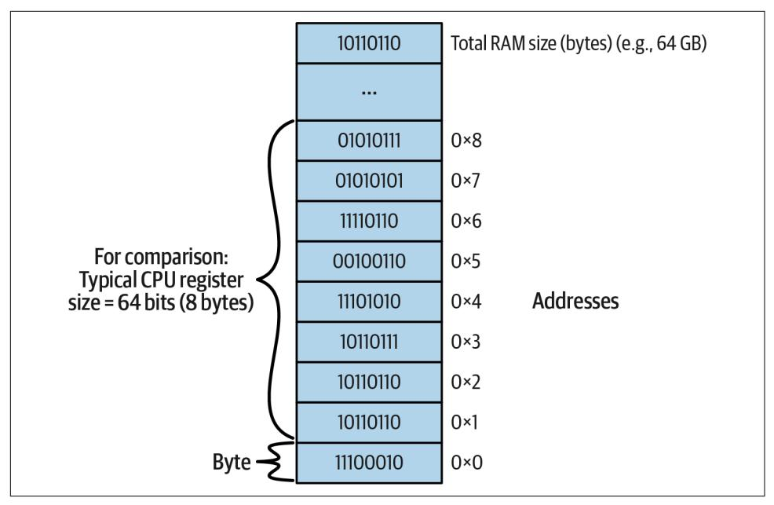
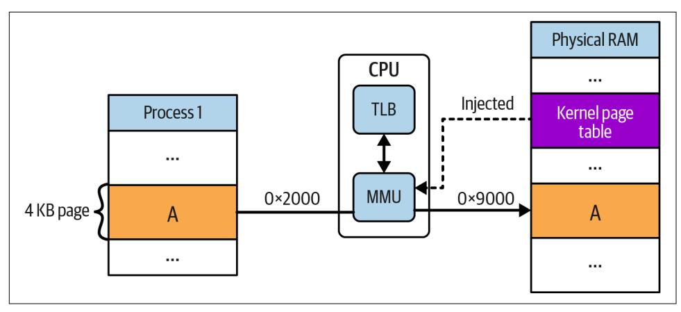
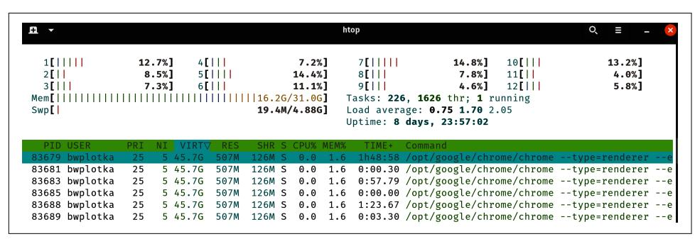
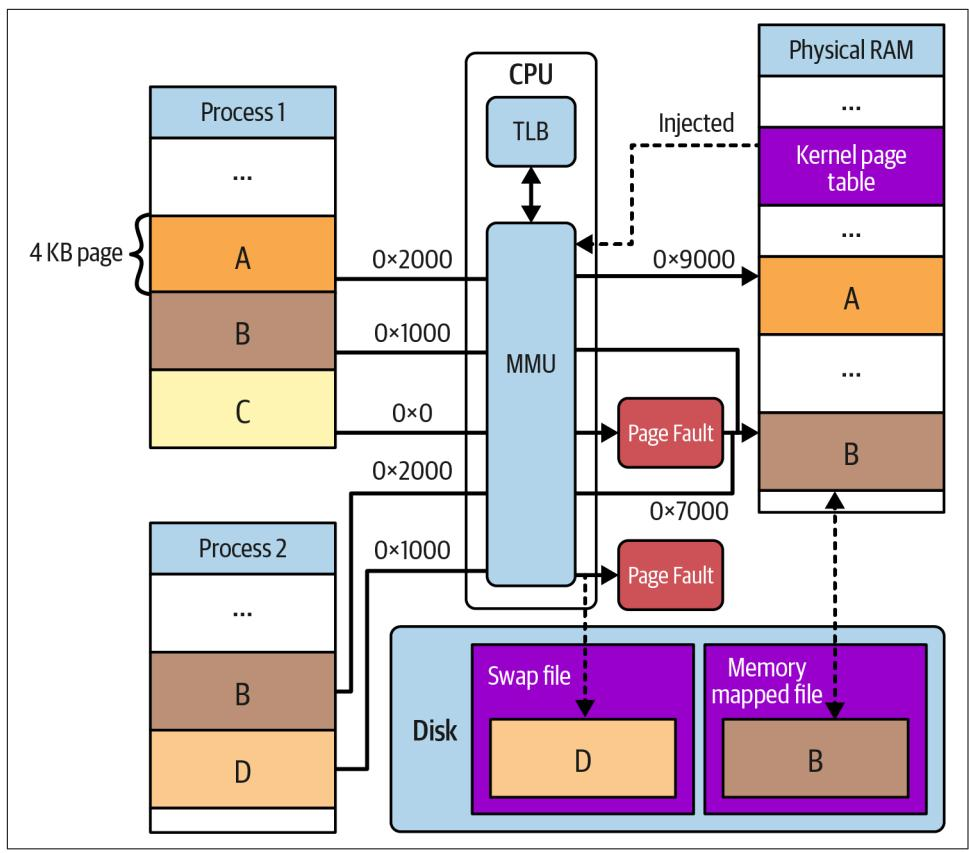
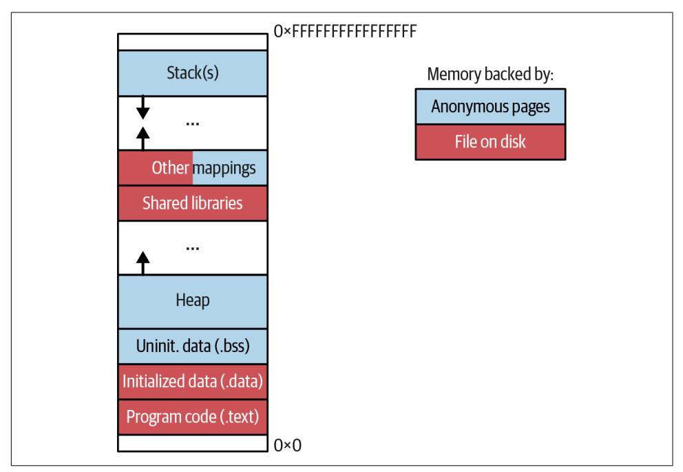
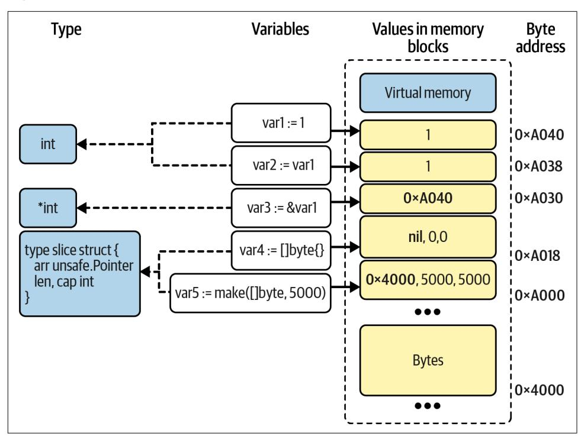

<span id="page-168-0"></span>
# Chapter 5: How Go Uses Memory Resource

In [Chapter 4](008-chapter-4-how-go-uses-the-cpu-resource-or-two.md#page-130-0), we started looking under the hood of the modern computer. We dis‐ cussed the efficiency aspects of using the CPU resource. Efficient execution of instructions in the CPU is important, but the sole purpose of performing those instructions is to modify the data. Unfortunately, the path of changing data is not always trivial. For example, in [Chapter 4](008-chapter-4-how-go-uses-the-cpu-resource-or-two.md#page-130-0) we learned that in the von Neumann archi‐ tecture (presented in [Figure 4-1](008-chapter-4-how-go-uses-the-cpu-resource-or-two.md#page-133-0)), we experience the CPU and memory wall problem when accessing data from the main memory (RAM).

The industry invented numerous technologies and optimization layers to overcome challenges like that, including memory safety and ensuring large memory capacities. As a result of those inventions, accessing eight bytes from RAM to the CPU register might be represented as a simple MOVQ <destination register> <address XYZ> instruction. However, the actual process done by the CPU to get that information from the physical chip storing those bytes is very complex. We discussed mechanisms like the hierarchical cache system, but there is much more.

In some ways, those mechanisms are abstracted from programmers as much as possi‐ ble. So, for example, when we define a variable in Go code, we don't need to think about how much memory has to be reserved, where, and in how many L-caches it has to fit. This is great for development speed, but sometimes it might surprise us when we need to process a lot of data. In those cases, we need to revive our [mechanical](https://oreil.ly/Co2IM) [sympathy](https://oreil.ly/Co2IM) toward memory resource, optimizing TFBO flow (["Efficiency-Aware](007-chapter-3-conquering-efficiency.md#page-121-0) [Development Flow" on page 102](007-chapter-3-conquering-efficiency.md#page-121-0)), and good tooling.

This chapter will focus on understanding the RAM resource. We will start by explor‐ ing overall memory relevance. Then we will set the context in ["Do We Have a Mem‐](#page-171-0) [ory Problem?" on page 152](#page-171-0). Next, we will explain the patterns and consequences of each element involved in the memory access from bottom to top. The data journey for memory starts in ["Physical Memory" on page 153,](#page-172-0) the hardware memory chips.

<span id="page-169-0"></span>Then we will move to operating system (OS) memory management techniques that allow managing limited physical memory space in multiprocess systems: ["Virtual](#page-177-0) [Memory" on page 158](#page-177-0) and ["OS Memory Mapping" on page 168,](#page-187-0) with a more detailed explanation of the ["mmap Syscall" on page 162](#page-181-0).

With the lower layers of memory access explained, we can move to the key knowl‐ edge for Go programmers looking to optimize memory efficiency—the explanation of ["Go Memory Management" on page 172.](#page-191-0) This includes the necessary elements like memory layout, what ["Values, Pointers, and Memory Blocks" on page 176](#page-195-0) mean, and the basics of the ["Go Allocator" on page 181](#page-200-0) with its measurable consequences. Finally, we will explore ["Garbage Collection" on page 185.](#page-204-0)

We will go into many details about memory in this chapter, but the key aim is to build an instinct toward the patterns and behavior of Go programs when it comes to memory usage. For example, what problems can occur while accessing memory? How do we measure memory usage? What does it mean to allocate memory? How can we release it? We will explore answers to those questions in this chapter. But let's start this chapter by clarifying why RAM is relevant to our program execution. What makes it so important?

## Memory Relevance

All Linux programs require more resources than just the CPU to perform their pro‐ grammed functionalities. For example, let's take a web server like [NGINX](https://oreil.ly/7F0cZ) (written in C) or [Caddy](https://oreil.ly/MpHMZ) (written in Go). Those programs allow serving static content from disk or proxy HTTP requests, among other functionalities. They use the CPU to execute written code. However, a web server like this also interacts with other resources, for example:

- With RAM to cache basic HTTP responses
- With a disk to load configuration, static content, or write log lines for observabil‐ ity needs
- With a network to serve HTTP requests from remote clients

As a result, the CPU resource is only one part of the equation. This is the same for most programs—they are created to save, read, manage, operate, and transform data from different mediums.

One would argue that the "memory" resource, often called RAM,<sup>1</sup> sits at the core of those interactions. The RAM is the backbone of the computer because every external

<sup>1</sup> In this book when I say "memory," I mean RAM and vice versa. Other mediums offer "memorizing" data in computer architecture (e.g., L-caches), but we tend to treat RAM as the "main" memory resource.

piece of data (bytes from disk, network, or another device) has to be buffered in memory to be accessible to the CPU. So, for example, the first thing the OS does to start a new process is load part of the program's machine code and initial data to memory for the CPU to execute it.

Unfortunately, we must be aware of three main caveats when using memory in our programs:

- RAM access is significantly slower than CPU operational speed.
- There is always a finite amount of RAM in our machines (typically from a few GB to hundreds of GB per machine), which forces us to care about space efficiency.<sup>2</sup>
- Unless [the persistent type of memory](https://oreil.ly/uaPiN) will be commoditized with RAM-like speeds, pricing, and robustness, our main memory is strictly volatile. When the computer power goes down, all information is completely lost.<sup>3</sup>

The ephemeral characteristics of memory and its finite size are why we are forced to add an auxiliary, persistent I/O resource to our computer, i.e., a disk. These days we have relatively fast solid state drive (SSD) disks (yet still around 10x slower than RAM) with a limited lifetime (~five years). On the other hand, we have a slower and cheaper hard disk drive (HDD). While cheaper than RAM, the disk resource is also a scarce resource.

Last but not least, for scalability and reliability reasons, our computers rely on data from remote locations. Industry invented different networks and protocols that allow us to communicate with remote software (e.g., databases) or even remote hardware (via iSCSI or NFS protocols). We typically abstract this type of I/O as a network resource usage. Unfortunately, the network is one of the most challenging resources to work with because of its unpredictable nature, limited bandwidth, and bigger latencies.

While using any of those resources, we use it through the memory resource. As a result, it is essential to understand its mechanics. There are many things a program‐ mer can do to impact the application's memory usage. But unfortunately, without proper education, our implementations tend to be prone to inefficiencies and unnec‐

<sup>2</sup> Not only because of physical limitations like not enough chip pins, space, and energy for transistors, but also because managing large memory poses huge overhead as we will learn in ["OS Memory Management" on page](#page-175-0) [156.](#page-175-0)

<sup>3</sup> In some way, RAM volatility can sometimes be treated as a feature, not a bug! Have you ever wondered why restarting a computer or process often fixes your problem? The memory volatility forces programmers to implement robust initialization techniques that rebuild the state from backup mediums, enhancing reliability and mitigating potential program bugs. In extreme cases, [crash-only software](https://oreil.ly/DAbDs) with the restart is the primary way of failure handling.

<span id="page-171-0"></span>essary waste of computer resources or execution time. This problem is amplified by the vast amount of data our programs have to process these days. This is why we often say that efficient programming is all about the data.


### Memory Inefficiency Is Usually the Most Common Problem in Go Programs

Go is a garbage collected language, which allows Go to be an extremely productive language. However, the garbage collector (GC) sacrifices some visibility and control over memory manage‐ ment (more on that in ["Garbage Collection" on page 185](#page-204-0)).

But even when we forget about GC overhead, for cases where we need to process a significant amount of data or are under some resource constraints, we have to take more care with how our pro‐ gram uses memory. Therefore, I recommend reading this chapter with extra care since most first-level optimizations are usually around memory resources.

When should we start the memory optimization process? A few common symptoms might reveal that we might have a memory efficiency issue.

### Do We Have a Memory Problem?

It's useful to understand how Go uses the computer's main memory and its efficiency consequences, but we must also follow the pragmatic approach. As with any opti‐ mizations, we should refrain from optimizing memory until we know there is a prob‐ lem. We can define a set of situations that should trigger our interest in Go memory usage and potential optimizations in this area:

- Our physical computer, virtual machine, container, or process crashed because of an out-of-memory (OOM) signal, or our process is about to hit that memory limit.<sup>4</sup>
- Our Go program is executing slower than usual, while the memory usage is higher than average. Spoiler: our system might be under memory pressure caus‐ ing trashing or swapping, as explained in ["OS Memory Mapping" on page 168](#page-187-0).

<sup>4</sup> We can resolve that problem by simply adding more memory to the system or switching to the server (or virtual machine) with more memory resource. That might be a solid solution if we are willing to pay addi‐ tionally if it's not a memory leak and if such a resource can be increased (e.g., the cloud has virtual machines with more memory). Yet I suggest investigating your program memory usage, especially if you continuously have to expand the system memory. Then there might be easy wins, thanks to trivially wasted space we could optimize.

<span id="page-172-0"></span>• Our Go program is executing slower than usual, with high spikes of CPU utiliza‐ tion. Spoiler: allocation or releasing memory slows our programs if an excessive number of short-lived objects is created.

If you encounter any of those situations, it might be time to debug and optimize the memory usage of your Go program. As I will teach you in ["Complexity Analysis" on](011-chapter-7-data-driven-efficiency-assessment.md#page-259-0) [page 240,](011-chapter-7-data-driven-efficiency-assessment.md#page-259-0) if you know what you are looking for, a set of early warning signals can indi‐ cate huge memory problems that could be avoided easily. Moreover, building such a proactive instinct can make you a valuable team asset!

But we can't build anything without good foundations. As with the CPU resource, you won't be able to apply optimizations without actually understanding them! We have to understand the reasons behind those optimizations. For example, [Example 4-1](008-chapter-4-how-go-uses-the-cpu-resource-or-two.md#page-134-0) allocates 30.5 MB of memory for 1 million integers in the input. But what does it mean? Where was that space reserved? Does it mean we used exactly 30.5 MB of physical memory, or more? Was this memory released at some point? This chapter aims to give you awareness, allowing you to answer all of these ques‐ tions. We will learn why memory is often the issue and what we can do about it.

Let's start with the basics of memory management from the point of view of hard‐ ware (HW), operating system (OS), and the Go runtime. Let's start with essential details about physical memory directly impacting our program execution. On top of that, this knowledge might help you better understand the specifications and docu‐ mentation of modern physical memory!

### Physical Memory

We store information digitally in the form of bits, the basic computer storage unit. A bit can have one of two values, 0 or 1. With enough bits, we can represent any infor‐ mation: integer, floating value, letters, messages, sounds, images, videos, programs, [metaverses](https://oreil.ly/il8Tz), etc.

The main physical memory that we use when we execute our programs (RAM) is based on dynamic random-access memory [\(DRAM\)](https://oreil.ly/hbo59). These chips are soldered into modules, often referred to as RAM "sticks." When connected to the motherboard, these chips allow us to store and read data bits as long as the DRAM is continuously powered.

DRAM contains billions of memory cells (as many cells as the number of bits DRAM can store). Each memory cell comprises one access transistor acting as a switch and one storage capacitor. The transistor guards the access to the capacitor, which is charged to the store 1 or drained to keep the 0 value. This allows each memory cell to store a single bit of information. This architecture is much simpler and cheaper to produce and use than Static RAM (SRAM), which is generally faster and used for smaller types of memory like registers and hierarchical caches in the CPU.

<span id="page-173-0"></span>At the time of this writing, the most popular memory used for RAM is the simpler, synchronous (clock) version in the DRAM family[—SDRAM](https://oreil.ly/07efG). Particularly, the fifth generation of SDRAM called DDR4.

Eight bits form a "byte." That number came from the fact that in the past, the small‐ est number of bits that could hold a text character was eight.<sup>5</sup> The industry standard‐ ized a "byte" as the smallest meaningful unit of information.

As a result, most hardware is byte addressable. This means that, from a software pro‐ grammer's point of view, there are instructions to access data through individual bytes. If you want to access a single bit, you need to access the whole byte and use [bitmasks](https://oreil.ly/pFoxI) to get or write the bit you want.

The byte addressability makes developer life easier when working with data from dif‐ ferent mediums like memory, disk, network, etc. Unfortunately, that creates a certain illusion that the data is always accessible with byte granularity. Don't let that mislead you. More often than not, the underlying hardware has to transfer a much larger chunk of data to give you the desired byte.

For example, in ["Hierachical Cache System"](008-chapter-4-how-go-uses-the-cpu-resource-or-two.md#page-146-0) on page 127, we learned that CPU regis‐ ters are typically 64 bits (8 bytes), and the cache line is even bigger (64 bytes). Yet we have CPU instructions that can copy a single byte from memory to the CPU register. However, an experienced developer will notice that to copy that single byte, in many cases, the CPU will fetch not 1 byte but at least a complete cache line (64 bytes) from physical memory.

From a high-level point of view, physical memory (RAM) can also be seen as byte addressable, as presented in [Figure 5-1](#page-174-0).

Memory space can be seen as a contiguous set of one-byte slots with a unique address. Each address is a number from zero to the total memory capacity in the sys‐ tem in bytes. For this reason, 32-bit systems that use only 32-bit integers for memory addresses typically could not handle RAM with more capacity than 4 GB—the largest number we can represent with 32 bits is 2 <sup>32</sup>. This limitation was removed with the introduction of the 64-bit operating systems that use 64-bit (8-byte)<sup>6</sup> integers for memory addressing.

<sup>5</sup> Nowadays, popular encodings like UTF-8 can dynamically use from one up to four bytes of memory per sin‐ gle character.

<sup>6</sup> By just doubling the "pointer" size, we moved the limit to how many elements we can address to extreme sizes. We could even estimate that 64-bit is enough to [address all grains of sand from all beaches on Earth](https://oreil.ly/By1J3)!

<span id="page-174-0"></span>

*Figure 5-1. Physical memory addresses space*

We discussed in ["CPU and Memory Wall Problem"](008-chapter-4-how-go-uses-the-cpu-resource-or-two.md#page-145-0) on page 126 that memory access is not that fast compared to, for example, CPU speed. But there is more. Addressabil‐ ity, in theory, should allow fast, random access to bytes from the main memory. After all, this is why that main memory is called "random-access memory." Unfortunately, if we look at our napkin math in [Appendix A](015-chapter-11-optimization-patterns.md#page-484-0), sequential memory access can be 10 times (or more) faster than random access!

But there is more—we don't expect any improvements in this area in the future. Within the last few decades, we only improved the speed (bandwidth) of the sequen‐ tial read. We did not improve random access latency at all! The lack of improvement on the latency side is not a mistake. It is a strategic choice—the internal designs of the modern RAM modules have to work against various requirements and limitations, for example:

#### Capacity

There is a strong demand for bigger capacities of RAM, e.g., to compute more data or run more realistic games.

#### Bandwidth and latency

We want to wait less time to access memory while writing or reading large chunks of data since memory access is the major slowdown for CPU operations.

<span id="page-175-0"></span>
#### Voltage

There is a demand for a lower voltage requirement for each memory chip, which would allow for running more of them while maintaining low power consump‐ tion and manageable thermal characteristics (more time on battery for our lap‐ tops and smartphones!).

#### Cost

RAM is a fundamental piece of the computer required in large quantities; thus, production and usage costs must be kept low.

Slower random access has many implications for the layers of many managers we will learn about in this chapter. For example, this is why the CPU with L-caches fetches and caches bigger chunks of memory up front, even if only one byte is needed for computation.

Let's summarize a few things worth remembering about modern generations of hard‐ ware for RAM like DDR4 SDRAM:

- Random access of the memory is relatively slow, and generally, there aren't many good ideas to improve that soon. If anything, lower power consumption, larger capacity, and bandwidth only increase that delay.
- Industry is improving overall memory bandwidth by allowing us to transfer big‐ ger chunks of adjacent (sequential) memory. This means that efforts to align Go data structures and knowing how they are stored in memory matter—ensuring we can access them faster.

Whether sequentially or randomly, our programs never directly access physical memory—the OS manages the RAM space. This is great for developers, as we don't need to understand low-level memory access details. But there are more important reasons why there has to be an OS between our programs and hardware. So let's dis‐ cuss why and what it means for our Go programs.

### OS Memory Management

What are the operating system's goals for memory management? Hiding complexi‐ ties of physical memory access is only one thing. The other, more important, goal is to allow using the same physical memory simultaneously and securely across thou‐ sands of processes and their OS threads.<sup>7</sup> The problem of multiprocess execution on common memory space is nontrivial for multiple reasons:

<sup>7</sup> I introduced the *process* and *thread* terms in ["Operating System Scheduler" on page 134](008-chapter-4-how-go-uses-the-cpu-resource-or-two.md#page-153-0).

#### Dedicated memory space for each process

Programs are compiled assuming nearly full and continuous access to the RAM. As a result, the OS must track which slots from the physical memory from our address space (shown in [Figure 5-1](#page-174-0)) belong to which process. Then we need to find a way to coordinate those "reservations" to the processes so only allocated addresses are accessed.

#### Avoiding external fragmentation

Having thousands of processes with dynamic memory usage poses a great risk of waste in memory due to inefficient packing. We call this problem [the external](https://oreil.ly/lBfRq) [fragmentation of memory](https://oreil.ly/lBfRq).

#### Memory isolation

We have to ensure that no process touches the physical memory address reserved for other processes running on the same machine (e.g., operating system pro‐ cesses!). This is because any accidental write or read from outside of process memory (out-of-bounds memory access) can crash other processes, malform data on persistent mediums (e.g., disk), or crash the whole machine (e.g., if you corrupt the memory used by the OS).

#### Memory safety

Operating systems are usually multiuser systems, which means processes can have different permissions to different resources (e.g., files on disk or other pro‐ cess memory space). This is why the mentioned out-of-bounds memory accesses have serious security risks.<sup>8</sup> Imagine a malicious process with no permissions reading credentials from other process memory, or causing a Denial-of-Service (DoS) attack.<sup>9</sup> This is especially important for virtualized environments, where a single memory unit can be shared across different operating systems and even more users.

#### Efficient memory usage

Programs never use all the memory they asked for at the same time. For example, instruction code and statically allocated data (e.g., constant variables) can be as large as dozens of megabytes. But for single-threaded applications, a maximum of a few kilobytes of data is used in a given second. Instructions for error han‐ dling are rarely used. Arrays are often oversized for worst-case scenarios.

<sup>8</sup> Many Common Vulnerabilities and Exposures (CVE) issues exist due to various bugs that allow [out-of](https://oreil.ly/iSbqk)[bounds memory access](https://oreil.ly/iSbqk).

<sup>9</sup> It might be less intuitive, but the malicious process can perform a DoS if access to another process memory is not restricted. For example, by setting counters to incorrect values or breaking loop invariants, the victim program might error out or exhaust machine resources.

<span id="page-177-0"></span>To solve all those challenges, modern OS manages memory using three fundamental mechanisms we will learn about in this section: paged virtual memory, memory map‐ ping, and hardware address translation. Let's start by explaining virtual memory.

### Virtual Memory

The key idea behind [virtual memory](https://oreil.ly/RBiCV) is that every process is given its own logical, simplified view of the RAM. As a result, programming language designers and devel‐ opers can effectively manage process memory space as if they had an entire memory space for themselves. Even more, with virtual memory, the process can use a full range of addresses from 0 to 2 <sup>64</sup> - 1 for its data, even if the physical memory has, for example, the capacity to accommodate only 2 <sup>35</sup> addresses (32 GB of memory). This frees the process from coordinating the memory among other processes, bin packing challenges, and other important tasks (e.g., physical memory defragmentation, secu‐ rity, limits, and swap). Instead, all of these complex and error-prone memory man‐ agement tasks can be delegated to the kernel (a core part of the Linux operating system).

There are a few ways of implementing virtual memory, but the most popular techni‐ que is called *paging*. <sup>10</sup> The OS divides physical and virtual memory into fixed-size chunks of memory. The virtual memory chunks are called *[pages](https://oreil.ly/JTWoU)*, whereas physical memory chunks are called *frames*. Both pages and frames can be then individually managed. The default page size is usually 4 KB,<sup>11</sup> but it can be changed to larger page sizes with respect to specific CPU capabilities.<sup>12</sup> It is also possible to use 4 KB pages for normal workloads and dedicated (sometimes transparent to processes!) [huge](https://oreil.ly/7KuGx) [pages](https://oreil.ly/7KuGx) from 2 MB to 1 GB.

<sup>10</sup> In the past, [segmentation](https://oreil.ly/8BFmb) was used to implement virtual memory. This has proven to have less versatility, especially the inability to move this space around for defragmentation (better packing of memory). Still, even with paging, segmentation is applied to virtual memory by the process itself (with underlying paging). Plus, the kernel sometimes still uses nonpaged segmentation for its part of critical kernel memory.

<sup>11</sup> You can check the current page size on the Linux system using the getconf PAGESIZE command.

<sup>12</sup> For example, typically, Intel CPUs are capable of hardware-supported [4 KB, 2 MB, or 1 GB pages](https://oreil.ly/mxlry).

<span id="page-178-0"></span>
#### The Importance of Page Size

The 4 KB number was chosen in the 1980s, and many say that it's time to bump this number up, given modern hardware and cheaper RAM (in terms of dollars per byte).

Yet the choice of page size is a game of trade-offs. Larger pages inevitably waste more memory space,<sup>13</sup> which is often referred to as [the internal memory fragmentation](https://oreil.ly/PnOuT). On the other hand, keeping a 4 KB page size or making it smaller makes memory access slower and memory management more expensive, eventually blocking the ability to use larger RAM modules in our computers.

The OS can dynamically map pages in virtual memory to specific physical memory frames (or other mediums like chunks of disk space), mostly transparently to the pro‐ cesses. The mapping, state, permissions, and additional metadata of the page are stored in the page entry in the many hierarchical page tables maintained by the OS.<sup>14</sup>

To achieve an easy-to-use and dynamic virtual memory, we need to have a versatile address translation mechanism. The problem is that only the OS knows about the current memory space mapping between virtual and physical space (or lack of it). Our running program's process only knows about virtual memory addresses, so all CPU instructions in machine code use virtual addresses. Our programs will be even slower if we try to consult the OS for every memory access to translate each address, so the industry figured out dedicated hardware support for translating memory pages.

From the 1980s, almost every CPU architecture started to include the Memory Man‐ agement Unit (MMU) used for every memory access. MMU translates each memory address referenced by CPU instructions to a physical address based on the OS page table entries. To avoid accessing RAM to search for the relevant page tables, engi‐ neers added the Translation Lookaside Buffer (TLB). TLB is a small cache that can cache a few thousand page table entries (typically 4 KB of entries). The overall flow looks like [Figure 5-2.](#page-179-0)

<sup>13</sup> Even naive and conservative calculations indicate around [24% of total memory is wasted for 2 MB pages](https://oreil.ly/iklRd).

<sup>14</sup> We won't discuss the implementation of page tables since it's pretty complex and not something Go develop‐ ers have to worry about. Yet this topic is quite interesting as the trivial implementation of paging would have a massive overhead in memory usage (what's the point of memory management that would take the majority of memory space it manages?). You can learn more [here.](https://oreil.ly/jU9Is)

<span id="page-179-0"></span>

*Figure 5-2. Address translation mechanism done by MMU and TLB in CPU. OS has to inject the relevant page tables so MMU knows what virtual addresses correspond to physical addresses.*

TLB is very fast, but it has limited capacity. If MMU cannot find the accessed virtual address in the TLB, we have a TLB miss. This means that either the CPU (hardware TLB management) or OS (software-managed TLB) has to walk through page tables in RAM, which causes significant latency (around one hundred CPU clock cycles)!

It is essential to mention that not every "allocated" virtual memory page will have a reserved physical memory page behind it. In fact, most of the virtual memory is not backed up by RAM at all. As a result, we can almost always see large amounts of vir‐ tual memory used by the process (called VSS or VSZ in various Linux tools like ps). Still, the actual physical memory (often called RSS or RES from "resident memory") reserved for this process might be tiny. There are often cases where a single process allocates more virtual memory than is available to the whole machine! See an exam‐ ple situation like this on my machine in Figure 5-3.



*Figure 5-3. First few lines of htop output, showing the current usage of a few Chrome browser processes, sorted by virtual memory size*

<span id="page-180-0"></span>As we can see in [Figure 5-3,](#page-179-0) my machine has 32 GB of physical memory, with 16.2 GB currently used. Yet we see Chrome processes using 45.7 GB of virtual memory each! However, if you look at the RES column, it has only 507 MB resident, with 126 MB of it shared with other processes. So how this is possible? How can the process think that it has 45.7 GB of RAM available, given the machine has only 32 GB and the system actually allocated just a few hundred MBs in RAM?

We can call such a situation a [memory overcommitment](https://oreil.ly/wbZGf), and it exists because of the very same reasons [airlines often overbook seats for their flights](https://oreil.ly/El9iy). On average, many travelers cancel their trips at the last minute or do not show up for their flight. As a result, to maximize the plane's used capacity, it is more profitable for airlines to sell more tickets than seats in the airplane and handle the rare "out of seats" situations "gracefully" (e.g., by moving the unlucky customer to another flight). This means that the true "allocation" of seats happens when travelers actually "access" them during the flight onboarding process.

The OS performs the same overcommitment strategy by default<sup>15</sup> for processes trying to allocate physical memory. The physical memory is only allocated when our pro‐ gram accesses it, not when it "creates" a big object, for example, make([]byte, 1024) (you will see a practical example of this in ["Go Allocator" on page 181](#page-200-0)).

Overcommitment is implemented with the pages and memory mapping techniques. Typically, memory mapping refers to a low-level memory management capability offered with the [mmap](https://oreil.ly/m5n7A) system call on Linux (and the similar MapViewOfFile function in Windows).


#### Developers Can Utilize mmap Explicitly in Programs for Specific Use Cases

The mmap call is used extensively in almost every database software, e.g., in [MySQL](https://oreil.ly/o8a5o) and [PostgreSQL](https://oreil.ly/scByc) as well as those written in Go, like [Prometheus](https://oreil.ly/2Sa3P), [Thanos,](https://oreil.ly/tFBUf) and [M3db](https://oreil.ly/Jg3wb) projects. The mmap (among other memory allocation techniques) is also what Go runtime and other programming languages use under the hood to allocate memory from OS, e.g., for the heap (discussed in ["Go Memory Manage‐](#page-191-0) [ment" on page 172](#page-191-0)).

<sup>15</sup> There is also an option to [disable an overcommitment mechanism](https://oreil.ly/h82uS) on Linux. When disabled, the virtual memory size (VSS) is not allowed to be bigger than the physical memory used by the process (RSS). You might want to do this so the process will have generally faster memory accesses, but the waste of memory is enormous. As a result, I have never seen such an option used in practice.

<span id="page-181-0"></span>Using explicit mmap for most Go applications is not recommended. Instead, we should stick to the Go runtime's standard allocation mechanisms, which we will learn in ["Go](#page-191-0) [Memory Management" on page 172.](#page-191-0) As our ["Efficiency-Aware Development Flow" on](007-chapter-3-conquering-efficiency.md#page-121-0) [page 102](007-chapter-3-conquering-efficiency.md#page-121-0) said, only if we see indications through benchmarking that this is not enough, might we consider moving to more advanced methods like mmap. This is why mmap is not even on my [Chapter 11](015-chapter-11-optimization-patterns.md#page-434-0) list!

However, there is a reason why I explain mmap at the start of our journey with the memory resource. Even if we don't use it explicitly, the OS uses the same memory mapping mechanism to manage all allocated pages in our system. The data structures we use in our Go programs are indirectly saved to certain virtual memory pages, which are then mmap-like managed by the OS or Go runtime. As a result, understand‐ ing the explicit mmap syscall will conveniently explain the on-demand paging and mapping techniques Linux OS uses to manage virtual memory.

Let's focus on the Linux mmap syscall next.

### mmap Syscall

To learn about OS memory mapping patterns, let's discuss the [mmap](https://oreil.ly/m5n7A) syscall. Example 5-1 shows a simplified abstraction, using mmap OS syscall, that allows allo‐ cating a byte slice in our process virtual memory without Go memory management coordination.

*Example 5-1. The adapted snippet of Linux-specific [Prometheus](https://oreil.ly/KJ4dD) mmap abstraction that allows creating and maintaining read-only memory-mapped byte arrays*

```
import (
 "os"
 "github.com/efficientgo/core/errors"
 "github.com/efficientgo/core/merrors"
 "golang.org/x/sys/unix"
)
type MemoryMap struct {
 f *os.File // nil if anonymous.
 b []byte
}
func OpenFileBacked(path string, size int) (mf *MemoryMap, _ error) {
 f, err := os.Open(path)
 if err != nil {
 return nil, err
 }
 b, err := unix.Mmap(int(f.Fd()), 0, size, unix.PROT_READ, unix.MAP_SHARED)
```

```
 if err != nil {
 return nil, merrors.New(f.Close(), err).Err()
 }
 return &MemoryMap{f: f, b: b}, nil
}
func (f *MemoryMap) Close() error {
 errs := merrors.New()
 errs.Add(unix.Munmap(f.b))
 errs.Add(f.f.Close())
 return errs.Err()
}
func (f *MemoryMappedFile) Bytes() []byte { return f.b }
```

- OpenFileBacked creates explicit memory mapped backed up by the file from the provided path.
- unix.Mmap is a Unix-specific Go helper that uses the mmap syscall to create a direct mapping between bytes from the file on disk (between 0 and the size address) and virtual memory allocated by the returned []byte array in the b vari‐ able. We also pass the read-only flag (PROT\_READ) and shared flag (MAP\_SHARED).<sup>16</sup> We can also skip the passing file descriptor, and pass 0 as the first argument and MAP\_ANON as the last argument to create anonymous mapping (more on that later).<sup>17</sup>
- We use the [merrors](https://oreil.ly/lnrJM) package to ensure the we capture both errors if Close also returns an error.
- unix.Munmap is one of the few ways to remove mapping and de-allocate mmap-ed bytes from virtual memory.

The returned byte slice from the open-ed MemoryMap.Bytes structure can be read as a regular byte slice acquired in typical ways, e.g., make([]byte, size). However, since we marked this memory-mapped location as read-only (unix.PROT\_READ), writing to such a slice will cause the OS to terminate the Go process with the SIGSEGV reason.<sup>18</sup>

<sup>16</sup> MAP\_SHARED means that any other process can reuse the same physical memory page if it accesses the same file. This is harmless if the mapped file does not change over time, but it has more complex nuances for map‐ ping modifiable content.

<sup>17</sup> A full list of options can be found in the mmap [documentation.](https://oreil.ly/m5n7A)

<sup>18</sup> SIGSEV means a segmentation fault. This tells us that the process wants to access an invalid memory address.

<span id="page-183-0"></span>Furthermore, a segmentation fault will also happen if we read from this slice after doing Close (Unmap) on it.

At first glance, the mmap-ed byte array looks like a regular byte slice with extra steps and constraints. So what's unique about it? It's best to explain that using an example! Imagine that we want to buffer a 600 MB file in the []byte slice so we can quickly access a couple of bytes on demand from random offsets of that file. The 600 MB might sound excessive, but such a requirement is commonly seen in databases or caches where reading from a disk on demand might be too slow.

The naive solution without an explicit mmap could look like Example 5-2. Every few instructions, we will look at what the OS memory statistics told us about the allocated pages on physical RAM.

*Example 5-2. Buffering 600 MB from a file to access three bytes from three different locations*

```
f, err := os.Open("test686mbfile.out")
if err != nil {
 return err
}
b := make([]byte, 600*1024*1024)
if _, err := f.Read(b); err != nil {
 return err
}
fmt.Println("Reading the 5000th byte", b[5000])
fmt.Println("Reading the 100 000th byte", b[100000])
fmt.Println("Reading the 104 000th byte", b[104000])
if err := f.Close(); err != nil {
 return err
}
```

We open the 600+ MB file. At this point, if you ran the ls -l /proc/\$PID/fd (where \$PID is the process ID of this executed program) command on a Linux machine, you would see file descriptors telling you that this process has used these files. One of the descriptors is a symbolic link to our test686mbfile.out file we just opened. The process will hold that file descriptor until the file is closed.

- <span id="page-184-0"></span>We read 600 MB into a pre-allocated []byte slice. After the f.Read method exe‐ cution, the RSS of the process shows 621 MB.<sup>19</sup> This means that we need over 600 MB of free physical RAM to run this program. The virtual memory size (VSZ) increased too, hitting 1.3 GB.
- No matter what bytes we access from our buffer, our program will not allocate any more bytes on RSS for our buffer (however, it might need extra bytes for the Println logic).

Generally, [Example 5-2](#page-183-0) proves that without an explicit mmap, we would need to reserve at least 600 MB of memory (~150,000 pages) on physical RAM from the very beginning. We also keep all of them reserved for our process until it is collected by the garbage collection process.

What would the same functionality look like with the explicit mmap? Let's do some‐ thing similar in Example 5-3 using the [Example 5-1](#page-181-0) abstraction.

*Example 5-3. Memory mapping 600 MB from file to access three bytes from three different locations, using [Example 5-1](#page-181-0)*

```
f, err := mmap.OpenFileBacked("test686mbfile.out," 600*1024*1024)
if err != nil {
 return err
}
b := f.Bytes()
fmt.Println("Reading the 5000th byte", b[5000])
fmt.Println("Reading the 100 000th byte", b[100000])
fmt.Println("Reading the 104 000th byte", b[104000])
if err := f.Close(); err != nil {
 return err
}
```

We open our test file and memory map 600 MB of its content into the []byte slice. At this point, similar to [Example 5-2,](#page-183-0) we see a related file descriptor for our test686mbfile.out file in the *fd* directory. More importantly, however, if you executed the ls -l /proc/\$PID>/map\_files (again, \$PID is the process ID) command, you would also have another symbolic link to the test686mbfile.out file we just referenced. This represents a file-backed memory map.

<sup>19</sup> On Linux, you can find this information by doing ps -ax --format=pid,rss,vsz | grep \$PID, where \$PID is process ID.

- After this statement, we have the byte buffer b with the file content. However, if we check the memory statistics for this process, the OS did not allocate any page in physical memory for our slice elements.<sup>20</sup> So the total RSS is as small as 1.6 MB, despite having 600 MB of content accessible in b! The VSZ, on the other hand, is around 1.3 GB, which indicates the OS is telling the Go program that it can access this space.
- After accessing a single byte from our slice, we see an increase in RSS, around 48–70 KB worth of RAM pages for this mapping. This means that the OS only allocated a few (10 or so) pages on RAM when our code wanted to access a sin‐ gle, concrete byte from b.
- Accessing a different byte far away from already allocated pages triggers the allo‐ cation of extra pages. RSS reading would show 100–128 KB.
- If we access a single byte 4,000 bytes away from the previous read, OS does not allocate any additional pages. This might be for a few reasons.<sup>21</sup> For instance, when our program read the file's contents at offset 100,000, the OS already allo‐ cated a 4 KB page with the byte we accessed here. Thus RSS reading would still show 100–128 KB.
- If we remove the memory mapping, all our related pages will eventually be unmapped from RAM. This means our process total RSS number should be smaller.<sup>22</sup>

<sup>20</sup> How do I know? We can have exact statistics for each memory mapping process we use on Linux thanks to the /proc/*<PID>*/smaps file.

<sup>21</sup> There are many reasons why accessing nearby bytes might not need allocating more pages on RAM in the memory-mapped situation. For example, the cache hierarchy (discussed in ["Hierachical Cache System" on](008-chapter-4-how-go-uses-the-cpu-resource-or-two.md#page-146-0) [page 127](008-chapter-4-how-go-uses-the-cpu-resource-or-two.md#page-146-0)), the OS, and compiler deciding to pull more at once, or such a page being already a shared or pri‐ vate page because of previous accesses.

<sup>22</sup> Note that physical frames for this file can still be allocated on physical memory by the OS (just not accounted for our process). This is called page cache and can be useful if any process tries to memorize the same file. Page cache is stored as best effort in the memory that would otherwise not be used. It can be released when the system is under high memory pressure or manually by the administrator, e.g., with sysctl -w vm.drop\_caches=1.

<span id="page-186-0"></span>

#### An Underrated Way to Learn More About Your Process and OS Resource Behavior

Linux provides amazing statistics and debugging information for the current process or thread state. Everything is accessible as spe‐ cial files inside */proc/<PID>*. The ability to debug each detailed sta‐ tistic (e.g., every little memory mapping status) and configuration was eye-opening for me. Learn more about what you can do by reading the [proc](https://oreil.ly/jxBig) (process pseudofilesystem) documentation.

I recommend getting familiar with the Linux pseudofilesystem or the tools using it if you plan to work more on low-level Linux software.

One of the main behaviors highlighted when we used explicit mmap in [Example 5-3](#page-184-0) is called on-demand paging. When the process asks the OS for any virtual memory using mmap, the OS will not allocate any page on RAM, no matter how large. Instead, the OS will only give the process the virtual address range. Further along, when the CPU performs the first instruction that accesses memory from that virtual address range (e.g., our fmt.Println("Reading the 5000th byte," b[5000]) in [Example 5-3](#page-184-0)), the MMU will generate a page fault. Page fault is a hardware interrupt that is handled by the OS kernel. The OS can then respond in various ways:

#### Allocate more RAM frames

If we have free frames (physical memory pages) in RAM, the OS can mark some of them as used and map them to the process that triggered the page fault. This is the only moment when the OS actually "allocates" RAM (and increases the RSS metric).

#### De-allocate unused RAM frames and reuse them

If no free frame exists (high memory usage on the machine), the OS can remove a couple of frames that belong to file-backed mappings for any process as long as the frames are not currently accessed. As a result, many pages can be unmapped from physical frames before OS has to resort to more brutal methods. Still, this will potentially cause other processes to generate another page fault. If this situa‐ tion happens very often, our whole OS with all processes will be seriously slowed down (memory trashing situation).

#### Triggering out-of-memory (OOM) situation

If the situation worsens and all unused file-backed memory-mapped pages are freed, and we still have no free pages, the OS is essentially out of memory. Han‐ dling that situation can be configured in the OS, but generally, there are three options:

• The OS can start unmapping pages from physical memory for memory map‐ pings backed by anonymous files. To avoid data loss, a swap disk partition

<span id="page-187-0"></span>can be configured (the swapon --show command will show you the existence and usage of swap partitions in your Linux system). This disk space is then used to back up virtual memory pages from the anonymous file memory map. As you can imagine, this can cause a similar (if not worse) memory trashing situation and overall system slowdown.<sup>23</sup>

- A second option for the OS is to simply reboot the system, generally known as [the system-level OOM crash](https://oreil.ly/BboW0).
- The last option is to recover from the OOM situation by immediately termi‐ nating a few lower-priority processes (e.g., from the user space). This is typi‐ cally done by the OS sending the [SIGKILL](https://oreil.ly/SLWOv) signal. The detection of what processes to kill varies,<sup>24</sup> but if we want more determinisms, the system administrator can configure specific memory limits per process or group of processes using, for example, [cgroups](https://oreil.ly/E72wh)<sup>25</sup> or [ulimit](https://oreil.ly/fF12F).

On top of the on-demand paging strategy, it's worth mentioning that the OS never releases any frame pages from RAM at the moment of process termination or when it explicitly releases some virtual memory. Only virtual mapping is updated at that point. Instead, physical memory is mainly reclaimed lazily (on demand) with the help of [a page frame reclaiming algorithm \(PFRA\)](https://oreil.ly/ruKUM) that we won't discuss in this book.

Generally, the mmap syscall might seem complex to use and understand. Yet, it explains what it means when our program allocates some RAM by asking the OS. Let's now compose what we learned into the big picture of how the OS manages the RAM and talk about the consequences we developers might observe when dealing with a memory resource.

### OS Memory Mapping

The explicit memory mapping presented in [Example 5-3](#page-184-0) is just one example of the pos‐ sible OS memory mapping techniques. Besides, rare file-backed mapping and advanced off-heap solutions, there is almost no need to explicitly use such mmap syscalls in our Go programs. However, to manage virtual memory efficiently, the OS is transparently using the same technique of page memory mapping for nearly all the RAM! The exam‐ ple memory mappings situation is presented in [Figure 5-4](#page-188-0), which pulls into one graphic a few common page mapping situations we could have in our machine.

<sup>23</sup> Swapping is usually turned off by default on most machines.

<sup>24</sup> ["Teaching the OOM killer"](https://oreil.ly/AFDh0) explains some problems in choosing what process to kill first. The lesson here is that the global OOM killer is often hard to [predict](https://oreil.ly/4rPzk).

<sup>25</sup> Exact implementation of memory controller can be found [here](https://oreil.ly/Ken3G).

<span id="page-188-0"></span>

*Figure 5-4. Example MMU translation of a few memory pages from the virtual memory of two processes*

The situation in Figure 5-4 might look complicated, but we have already discussed some of those cases. Let's enumerate them from the perspective of Process 1 or 2:

#### *Page* A

Represents the simplest case of *anonymous file mapping* that has already mapped the frame on RAM. So, for example, if Process 1 writes or reads a byte from an address between 0x2000 and 0x2FFF in its virtual space, the MMU will translate the address to RAM physical address 0x9000, plus the required offset. As a result, the CPU will be able to fetch or write it as a cache line to its L-caches and desired register.

#### *Page* B

Represents a *file-based memory page* mapped to a physical frame like we created in [Example 5-3](#page-184-0). This frame is also shared with another process since there is no need to keep two copies of the same data as both mappings map to the same file on a disk. This is only allowed if the mapping is not set as MAP\_PRIVATE.

#### *Page* C

This is an anonymous file mapping that wasn't yet accessed. For example, if Pro‐ cess 1 writes a byte to an address between 0x0 and 0xFFF, a page fault hardware interrupt is generated by the CPU, and the OS will need to find a free frame.

#### *Page* D

This is an anonymous page like C, but some data was already written on it. Yet the OS seems to have swap enabled and unmaps it from RAM because this page was not used for a long time by Process 2, or the system is under memory pres‐ sure. The OS backed the data to swap files in the swap partition to avoid data loss. Process 2 accessing any byte from a virtual address between 0x1000 and 0x1FFF would result in a page fault, which will tell the OS to find a free frame on RAM and read page D content from the swap file. Only then can data be available to Process 2. Note that such swap logic for anonymous pages is disabled by default on most operating systems.

You should now have a clearer view of OS memory management basics and virtual memory patterns. So let's now go through a list of important consequences those pose on Go (and any other programming language):

*Practically speaking, observing the size of virtual memory is never useful.*

On-demand paging is why we always see larger virtual memory usage (repre‐ sented by virtual set size, or VSS) than resident memory usage (RSS) for a pro‐ cess (e.g., the browser memory usage in [Figure 5-3\)](#page-179-0). While the process thinks that all pages it sees on the virtual address space are in RAM, most of them might be currently unmapped and stored on disk (mapped file or swap partition). In most cases, you [can ignore](https://oreil.ly/u9l5k) the VSS metric when assessing the amount of mem‐ ory your Go program uses.

*It is impossible to tell precisely how much memory a process (or system) has used in a given time.*

What metric can we use if the VSS metric does not help assess process memory usage? For Go developers interested in the memory efficiency of their programs, knowing the current and past memory usage is essential information. It tells how efficient our code is and if our optimizations work as expected.

Unfortunately, because of the on-demand paging and memory mapping behav‐ ior we learned in this section, this is currently very hard—we can only roughly estimate. We will discuss the best available metrics in ["Memory Usage" on page](010-chapter-6-efficiency-observability.md#page-253-0) [234](010-chapter-6-efficiency-observability.md#page-253-0), but don't be surprised if the RSS metric shows a few kilobytes or even mega‐ bytes more or less than you expected.

<span id="page-190-0"></span>*OS memory usage expands to all available RAM.*

Due to lazy release and page caches, even if our Go process released all memory, sometimes the RSS will still look very high if there's generally low memory pressure on the system. This means that there's enough physical RAM to satisfy the rest of the processes, so the OS doesn't bother to release our pages. This is often why the RSS metric is not very reliable, as discussed in ["Memory Usage" on page 234.](010-chapter-6-efficiency-observability.md#page-253-0)

*Tail latency of our Go program memory access is much slower than just physical DRAM access latency.*

There is a high price to pay for using OS with virtual memory. In the worst cases, already slow memory access caused by DRAM design (mentioned in ["Physical](#page-172-0) [Memory"](#page-172-0) on page 153) is even slower. If we stack up things that can happen, like TLB miss, page fault, looking for a free page, or on-demand memory loading from disk, we have extreme latency, which can waste thousands of CPU cycles. The OS does as much as possible to ensure those bad cases rarely happen, so the amortized (average) access latency is as low as possible.

As Go developers, we have some control to reduce the risk of those extra latencies happening more often. For example, we can use less memory in our programs or prefer sequential memory access (more on that later).

*High usage of RAM might cause slow program execution.*

When our system executes many processes that want to access large quantities of pages close to RAM capacity, memory access latencies and OS cleanup routines can take most of the CPU cycles. Furthermore, as we discussed, things like memory trashing, constant memory swaps, and page reclaim mechanisms will slow the whole system. As a result, if your program latency is high, it is not necessarily doing too much work on the CPU or executing slow operations (e.g., I/O), it might just use a lot of the memory!

Hopefully, you understand the impact of OS memory management on how we should think about the memory resource. As in ["Physical Memory" on page 153](#page-172-0), I only explained the basics of memory management. This is because the kernel algo‐ rithms evolve, and different OSes manage memory differently. The information I provided should give you a rough understanding of the standard techniques and their consequences. Such a foundation should also give you a kick-start toward learning more from materials like *[Understanding the Linux Kernel](https://oreil.ly/Wr1nY)* by Daniel P. Bovet and Marco Cesati (O'Reilly) or [LWN.net](https://lwn.net).

With that knowledge, let's discuss how Go has chosen to leverage the memory func‐ tionalities the OS and hardware offer. It should help us find the right optimizations to try in our TFBO flow if we have to focus on the memory efficiency of our Go program.

<span id="page-191-0"></span>
### Go Memory Management

The programming language task here is to ensure that developers who write pro‐ grams can create variables, abstractions, and operations that use memory safely, effi‐ ciently, and (ideally) without fuss! So let's dig into how the Go language enables that.

Go uses a relatively standard internal process memory management pattern that other languages (e.g., C/C++) share, with some unique elements. As we learned in ["Operating System Scheduler" on page 134,](008-chapter-4-how-go-uses-the-cpu-resource-or-two.md#page-153-0) when a new process starts, the operating system creates various metadata about the process, including a new dedicated virtual address space. The OS also creates initial memory mappings for a few starting seg‐ ments based on information stored in the program binary. Once the process starts, it uses mmap or [brk/sbrk](https://oreil.ly/31emh)<sup>26</sup> to dynamically allocate more pages on virtual memory when needed. An example organization of the virtual memory in Go is presented in Figure 5-5.



*Figure 5-5. Memory layout of an executed Go program in virtual address space*

<sup>26</sup> Remember, whatever type or amount of virtual memory the OS is giving to the process, it uses the memory mapping technique. sbrk allows simpler resizing of the virtual memory section typically covered by the heap. However, it behaves like any other mmap using anonymous pages.

<span id="page-192-0"></span>We can enumerate a couple of common sections:

#### .text*,* .data*, and shared libraries*

Program code and all global data like global variables are automatically memory mapped by the OS when the process starts (whether it takes 1 MB or 100 GB of virtual memory). This data is read-only, backed up by the binary file. Addition‐ ally, only a small contiguous part of the program is executed at a time by the CPU so that the OS can keep a minimal amount of pages with code and data in the physical memory. Those pages are also heavily shared (more processes are started using the same binary, plus some dynamically linked shared libraries).

#### Block starting symbol (*.bss*)

When OS starts a process, it also allocates anonymous pages for uninitialized data (.bss). The amount of space used by .bss is known in advance—for exam‐ ple, the http package defines the [DefaultTransport](https://oreil.ly/7m0Wv) global variable. While we don't know the value of this variable, we know it will be a pointer, so we need to prepare eight bytes of memory for it. This type of memory allocation is called static allocation. This space is allocated once, backed by anonymous pages, and is never freed (from virtual memory at least; if swapping is enabled, it can be unmapped from RAM).

#### Heap

The first (and probably the most important) dynamic segment in [Figure 5-5](#page-191-0) is the memory reserved for dynamic allocations, typically called the *heap* (do not confuse it with the [data structure](https://oreil.ly/740nv) with the same name). Dynamic allocations are required for program data (e.g., variables) that have to be available outside a sin‐ gle function scope. As a result, such allocations are unknown in advance and must be stored in memory for an unpredictable time. When the process starts, the OS prepares the initial number of anonymous pages for the heap. After that, the OS gives the process some control over that space. It can then increase or decrease its size using the sbrk syscall or by preparing or removing extra virtual memory using the mmap and unmmap syscalls. It's up to the process to organize and manage the heap in the best possible way, and different languages do that differently:

- C forces the programmer to manually allocate and free memory for variables (using malloc and free functions).
- C++ adds smart pointers like [std::unique\\_ptr](https://oreil.ly/QS9zj) and [std::shared\\_ptr](https://oreil.ly/QbQqQ), which offer simple counting mechanisms to track the object lifecycle (refer‐ ence counting).<sup>27</sup>

<sup>27</sup> Of course no one blocks anyone from implementing external garbage collection on top of those mechanisms in C and C++.

- <span id="page-193-0"></span>• Rust has a powerful [memory ownership mechanism](https://oreil.ly/MajFo), but it makes program‐ ming much more difficult for nonmemory critical code areas.<sup>28</sup>
- Finally, languages like Python, C#, Java, and others implement advanced heap allocators and garbage collector mechanisms. Garbage collectors peri‐ odically check if any memory is unused and can be released.

In this sense, Go is closer to Java with memory management than C. Go implicitly (transparently to the programmer) allocates memory that requires dynamic allocation on the heap. For that purpose, Go has its unique compo‐ nents (implemented in Go and Assembly); see ["Go Allocator" on page 181](#page-200-0) and ["Garbage Collection" on page 185.](#page-204-0)


#### Most of the Time, It's Enough to Optimize the Heap Usage

Heap is the memory that usually stores the largest amounts of data in physical memory pages. It is so significant that it's enough to look at the heap size to assess the Go process memory usage in most cases. On top of that, the overhead of heap management with runtime garbage collection is significant too. Both make the heap our first choice to analyze when optimizing memory use.

#### Manual process mappings

Both Go runtime and the developer writing Go code can manually allocate addi‐ tional memory-mapped regions (e.g., using our [Example 5-1](#page-181-0) abstraction). Of course, it's up to the process what kind of memory mapping to use (private or shared, read or write, anonymous or file backed), but all of them have a dedica‐ ted space in the process's virtual memory, presented in [Figure 5-5.](#page-191-0)

#### Stack

The last section of the Go memory layout is reserved for function stacks. The stack is a simple yet fast structure allowing accessing values in last in, first out (LIFO) order. Programming languages use them to store all the elements (e.g., variables) that can use automatic allocation. As opposed to dynamic allocations fulfilled by the heap, automatic allocations work well for local data like local vari‐ ables, function input, or return arguments. Allocations of those elements can be "automatic" because the compiler can deduce their lifespan before the program starts.

<sup>28</sup> It's hard that the ownership model in Rust requires the programmer to be hyperaware of every memory allo‐ cation and what part owns it. Despite that, I am a huge fan of the Rust ownership model if we could scope this memory management only to a certain part of our code. I believe it would be beneficial to bring some owner‐ ship pattern to Go, where a small amount of code could use that, whereas the rest would use GC. Wish list for someday? :)

Some programming languages might have a single stack or a stack per thread. Go is a bit unique here. As we learned in ["Go Runtime Scheduler" on page 138](008-chapter-4-how-go-uses-the-cpu-resource-or-two.md#page-157-0), the Go execution flow is designed around goroutines. Thus Go maintains a single dynamically sized stack per Go routine. This might even mean [hundreds of thou‐](https://oreil.ly/zrqhj) [sands of stacks](https://oreil.ly/zrqhj). Whenever the goroutine invokes another function, we can push its local variables and arguments to stack in a stack frame. We can pop those ele‐ ments (de-allocate the stack frame) from the stack when we leave the function. If stack structures require more space than what's reserved in virtual memory, Go will ask the OS for more memory attributed to the stack segment, e.g., via the mmap syscall.

Stacks are incredibly fast as there is no extra overhead to figure out when mem‐ ory used by certain elements must be removed (no usage tracking). Thus ideally, we write our algorithms so that they allocate primarily on the stack instead of the heap. Unfortunately, this is impossible in many cases due to stack limitations (we can't allocate too-large objects) or when the variable has to live longer than the function's scope. Therefore, the compiler decides which data can be allocated automatically (on the stack) and which must be allocated dynamically (on the heap). This process is called escape analysis, which you saw in [Example 4-3.](008-chapter-4-how-go-uses-the-cpu-resource-or-two.md#page-143-0)

All the mechanisms discussed (except manual mappings) are helping Go developers. We don't need to care where and how we should allocate memory for our variables. That is a huge win—for example, when we want to make some HTTP calls, we simply create an HTTP client using a standard library, e.g., with the client := http.Client{} code statement. As a result of Go's memory design, we can immedi‐ ately start using client, focusing on our code's functionality, readability, and relia‐ bility. In particular:

- We don't need to ensure that the OS has a free virtual memory page to hold the client variable. Likewise, we don't need to find a valid segment and virtual address for it. Both will be done automatically by the compiler (if the variable can be stored on the stack) or runtime allocator (dynamic allocation on the heap).
- We don't need to remember to release memory kept by the client variable when we stop using it. Instead, suppose the client would go beyond code reach (noth‐ ing references it). In that case, the data in Go will be released—immediately when stored on the stack or in the next garbage collection execution cycle if stored on the heap (more on that in ["Garbage Collection" on page 185\)](#page-204-0).
  - Such automation is much less error-prone to potential memory leaks ("I forgot to release memory for client") or dangling pointers ("I released memory for client, but actually some code still uses it").

Generally, we don't need to care what segment is used for our objects for everyday use of the Go language.

<span id="page-195-0"></span>How do I know whether a variable is allocated on the heap or the stack? From a cor‐ rectness standpoint, you don't need to know. Each variable in Go exists as long as there are references to it. The storage location chosen by the implementation is irrele‐ vant to the semantics of the language.

The storage location does have an effect on writing efficient programs.

—The Go Team, ["Go: Frequently Asked Questions \(FAQ\)"](https://oreil.ly/UUGgI)

However, since allocations are so effortless, there is a risk of not noticing the memory waste.


#### Transparent Allocations Mean There Is a Risk of Overdoing Them

Allocations are implicit in Go, making coding much easier, but there are trade-offs. One is around memory efficiency: if we don't see explicit memory allocations and releases, it's easier to miss apparent high memory usage in our code.

It's similar to going shopping with cash versus a credit card. You will likely overspend with a credit card than with cash since you don't see that money flowing. With a credit card, money spent is almost transparent to us—it is the same with allocations in Go.

To sum up, Go is a very productive language because, when programming, we don't need to worry about where and how the data held by our variables and abstractions is stored. Yet sometimes when our measurements indicate efficiency problems, it's use‐ ful to have a basic awareness of the parts of our program that might allocate some memory, how this occurs, and how the memory is released. So let's uncover that.

### Values, Pointers, and Memory Blocks

Let's get this straight before we start—you don't need to know what type of state‐ ments trigger memory allocation, where (on a stack or heap), and how much mem‐ ory was allocated. But, as you will learn in Chapters [7](011-chapter-7-data-driven-efficiency-assessment.md#page-258-0) and [9,](013-chapter-9-data-driven-bottleneck-analysis.md#page-348-0) many robust tools can tell us all that accurately and quickly. In most cases, we can find what code line and roughly how much was allocated within seconds. Thus, there is generally a common theme: we should not guess that information (since humans tend to guess wrong) because there are tools for that.

This is generally true, but there is no harm in building some basic allocation aware‐ ness. On the contrary, it might make us more effective while using those tools to ana‐ lyze memory usage. The aim is to build a healthy instinct for what pieces of code can potentially allocate the suspicious amount of memory and where we need to be careful.

<span id="page-196-0"></span>Many books try to teach this by listing examples of common statements that allocate. This is great, but it's a bit like giving someone [a fish instead of a fishing rod](https://oreil.ly/utQIG). So again, it's helpful, but only for "common" statements. Ideally, I want you to understand the underlying rules for why something allocates.

Let's dive into how we reference objects in Go to start noticing that allocation more quickly. Our code can perform certain operations on objects stored in some memory. Therefore, we must link those objects to operations, and we typically do that via vari‐ ables. We describe those variables using Go's type system to make it even easier for the compiler and developers.

However, Go is [value oriented](https://oreil.ly/lgy2S) rather than reference oriented (like many [managed](https://oreil.ly/ben85) [runtime](https://oreil.ly/ben85) languages). This means that Go variables never reference objects. Instead, the variables always store the whole *value* of the object. There is no exception to this rule!

To understand this better, the memory representation of three variables is shown in Figure 5-6.



*Figure 5-6. Representation of three variables allocated on the process's virtual memory*

<span id="page-197-0"></span>

#### Think About Variables as Boxes Holding Values

Whenever the compiler sees a definition of the var variable or function arguments (including parameters) in the invocation scope, it allocates a contiguous "memory block" for a box. The box is big enough to contain the whole value of the given type. For example, var var1 int and var var2 int will need a box for eight bytes.<sup>29</sup>

Thanks to our available space in "boxes," we can copy some values. In [Figure 5-6](#page-196-0), we can copy an integer 1 to var1. Now, Go does not have reference variables, so even if we assign the var1 value to another box named var2, this is yet another box with unique space. We can confirm that by printing &var1 and &var2. It should print 0xA040 and 0xA038, respectively. As a result, a simple assignment is always a copy, which adds latency proportional to the value's size.

Unlike C++, each variable defined in a Go program occupies a unique memory loca‐ tion. It is not possible to create a Go program where two variables share the same stor‐ age location in memory. It is possible to create two variables whose contents point to the same storage location, but that is not the same thing.

—Dave Cheney, ["There Is No Pass-By-Reference in Go"](https://oreil.ly/iPu5w)

The var3 box is a pointer to the integer type. A "pointer" variable is a box that stores the value representing the memory address. The type of memory address is just uintptr or unsafe.Pointer, so simply a 64-bit unsigned integer that allows pointing to another value in memory. As a result, any pointer variable needs a box for eight bytes.

The pointer can also be nil (Go's NULL value), a special value indicating that the pointer does not point to anything. In [Figure 5-6,](#page-196-0) we can see that the var3 box con‐ tains a value too—a memory address of the var1 box.

This is also consistent with more complex types. For example, both var var4 and var var5 require boxes for only 24 bytes. This is because the slice struct value has three integers.


#### Memory Structure for Go Slice

Slice allows easy dynamic behavior of the underlying array of a given type. A slice data structure requires a memory block that can hold length, capacity, and pointer to the desired array.<sup>30</sup>

<sup>29</sup> You can reveal the box size with the [unsafe.Sizeof](https://oreil.ly/QtpSf) function.

<sup>30</sup> See the handy [reflect.SliceHeader](https://oreil.ly/9unR4) struct that represents a slice.

<span id="page-198-0"></span>Generally, the slice is just a more complex struct. You can think about a struct as a cabinet—it is full of drawers (struct fields) that are simply boxes that share a memory block with other drawers in the same cabinet. So, for example, the slice type has three drawers. One of them is of pointer type.

There are two special behaviors of slice and a few other special types:

- You can use the [make](https://oreil.ly/Mlx6Q) built-in function that only works for map, chan, and slice types. It returns the type's value<sup>31</sup> and allocates underlying structures, like an array for slices, a buffer for channels, and a hashmap for maps.
- We can put nil into boxes of types, like func, map, chan, or slice, although they are not strictly pointers, e.g., []byte(nil).

One drawer of the var4 and var5 cabinets is a type of pointer that holds the memory address. Thanks to make([]byte, 5000) in var5, it points to another memory block containing a 5,000-element byte array.


#### Structure Padding

The slice structure with three 64-bit fields requires a 24-byte long memory block. But the memory block size for a structure type is not always the sum of the size of its fields!

Smart compilers like in Go might attempt to align type sizes to the typical cache lines or the OS or internal Go allocator page sizes. For this reason, Go compilers sometimes add padding between fields.<sup>32</sup>

To reinforce that knowledge, let's ask a common question when designing a new function or method: should my arguments be pointers of values? Of course, the first thing we should answer is obviously, if we want the caller to see the modifications of that value. But there is an efficiency aspect as well. Let's discuss the difference in [Example 5-4,](#page-199-0) assuming we don't need to see modifications of those arguments from outside.

<sup>31</sup> Technically speaking, the type map variable is a pointer to the hashmap. However, to avoid always typing \*map, the Go team decided to [hide that detail](https://oreil.ly/mfwDa).

<sup>32</sup> We won't cover [struct padding](https://oreil.ly/1gx5O) in this edition. There is also an amazing utility that helps you to notice the waste [introduced by struct misalignment.](https://oreil.ly/WtYFZ)

<span id="page-199-0"></span>*Example 5-4. Different arguments highlight the differences using values, pointers, and special types like slice*

```
func myFunction(
 arg1 int, arg2 *int,
 arg3 biggie, arg4 *biggie,
 arg5 []byte, arg6 *[]byte,
 arg7 chan byte, arg8 map[string]int, arg9 func(),
) {
 // ...
}
type biggie struct {
 huge [1e8]byte
 other *biggie
}
```

Function arguments are like any newly declared variable: boxes. So for arg1, it will create an eight-byte box (most likely allocate it on the stack) and copy the passed integer during the myFunction invocation. For arg2, it will create a simi‐ lar eight-byte box that will copy the pointer instead.

For such simple types, avoiding the pointer makes more sense if you don't need to modify the value. You use the same amount of memory and the same copying overhead. The only difference is that the value pointed to by arg2 has to live on the heap, which is more expensive and, in many cases, can be avoided.

The rule is the same for custom struct arguments, but the size and copying overhead might matter more. For example, arg3 is of biggie struct, which is of extraordinary size. Because of the static array with 100 million elements, the type requires a ~100 MB memory block.

For bigger types like this, we should consider using a pointer when passing through functions. This is because every myFunction invocation will allocate 100 MB on the heap for the arg3 box (it's too large to be on the stack)! On top of that, it will spend CPU time copying large objects between boxes. So, arg4 will allocate eight bytes on the stack (and copy only that) and point to memory on the heap with the biggie object, which can be reused across function calls.

Note that despite biggie being copied in arg3, the copy is *shallow*, i.e., arg3.other will share a memory with the previous box!

The slice type behaves like the biggie type. We must remember the [underlying](https://oreil.ly/Tla4w) struct [type of the slice](https://oreil.ly/Tla4w).

As a result, arg5 will allocate a 24-byte box and copy three integers. In contrast, arg6 will allocate an eight-byte box and copy only one integer (pointer). From <span id="page-200-0"></span>the efficiency point of view, it does not matter. It only matters if we want to expose modifications of the underlying array (both arg5 and arg6 allow that) or if we want to also expose changes to the pointer, len, and cap fields as arg6 allows.

Special types like chan, map, and func() can be treated similarly to pointers. They share memory through the heap, and the only cost is to allocate and copy the pointer value into arg7, arg8, or arg9 boxes.

The same decision flow can be applied to decide about pointer versus value types for:

- Return arguments
- The struct fields
- Elements of map, slice, or channels
- The method receiver (e.g., func (receiver) Method())

Hopefully, the preceding information will give you an understanding of which Go code statements allocate memory and roughly how much. Generally:

- Every variable declaration (including function arguments, return arguments, and method receiver) allocates the whole type or just a pointer to it.
- make allocates special types and their underlying (pointed) structures.
- new(<type>) is the same as &<type>, so it allocates a pointer box and the type on the heap in the separate memory block.

Most program memory allocations are only known in runtime; thus, dynamic alloca‐ tion (in a heap) is needed. Therefore, when we optimize memory in Go programs, 99% of the time we just focus on the heap. Go comes with two important runtime components: Allocator and GC, responsible for heap management. Those compo‐ nents are nontrivial pieces of software that often introduce certain waste in terms of extra CPU cycles by the program runtime and some memory waste. Given its nonde‐ terministic and nonimmediate memory release nature, it's worth discussing this in detail. Let's do that in the next two sections.

### Go Allocator

It's far from easy to manage the heap, as it poses similar challenges as the OS has toward physical memory. For example, the Go program runs multiple goroutines, and each wants a few (dynamically sized!) segments of the heap memory for a differ‐ ent amount of time.

The Go Allocator is a piece of internal runtime Go code maintained by the Go team. As the name suggests, it can dynamically (in runtime) allocate the memory blocks required to operate on objects. In addition, it is optimized to avoid locking and frag‐ mentation, and to mitigate slow syscalls to the OS.

During compilation, the Go compiler performs a complex stack escape analysis to detect if the memory for objects can be automatically allocated (mentioned in [Example 4-3](008-chapter-4-how-go-uses-the-cpu-resource-or-two.md#page-143-0)). If yes, it adds appropriate CPU instructions that store related memory blocks in the stack segment of the memory layout. However, in most cases the com‐ piler can't avoid putting most of our memory on the heap. In these cases, it generates different CPU instructions invoking the Go Allocator code.

The Go Allocator is responsible for [bin packing](https://oreil.ly/l27Jv) the memory blocks in the virtual memory space. It also asks for more space from the OS if needed using mmap with pri‐ vate, anonymous pages, which are initialized by zero.<sup>33</sup> As we learned in ["OS Memory](#page-187-0) [Mapping" on page 168](#page-187-0), those pages are also allocated on the physical RAM only when accessed.

Generally, the Go developer can live without learning details about Go Allocator internals. However, it's enough to remember that:

- It is based on a custom Google C++ malloc implementation called [TCMalloc](https://oreil.ly/AZ5S7).
- It is OS virtual memory page aware, but it operates with 8 KB pages.
- It mitigates fragmentation by allocating memory blocks to certain spans that hold one or multiple 8 KB pages. Each span is created for class memory block sizes. For example, in Go 1.18, there are 67 different [size classes](https://oreil.ly/tMlnv) (size buckets), the largest being 32 KB.
- Memory blocks for objects that do not contain a pointer are marked with the noscan type, making it easier to track nested objects in the garbage collection phase.
- Objects with over 32 KB memory block (e.g., 600 MB byte array) are treated spe‐ cially (allocated directly without span).
- If runtime needs more virtual space from OS for the heap, it allocates a bigger chunk of memory at once (at least 1 MB), which amortizes the latency of the syscall.

All of the preceding points are constantly changing, with the open source community and Go team adding various small optimizations and features.

<sup>33</sup> This is one of the reasons why in Go, every new structure has defined zero value or nil at the start, instead of random value.

<span id="page-202-0"></span>They say one code snippet is worth a thousand words, so let's visualize and explain some of these allocation characteristics caused by a mix of Go, OS, and hardware using an example. Example 5-5 shows the same functionality as [Example 5-3](#page-184-0), but instead of explicit mmap, we will rely on Go memory management and no underlying file.

*Example 5-5. Allocation of a large []byte slice followed by different access patterns*

```
b := make([]byte, 600*1024*1024)
b[5000] = 1
b[100000] = 1
b[104000] = 1
for i := range b {
 b[i] = 1
}
```

The b variable is declared as a []byte slice. The following make statement is tasked to create a byte array with 600 MB of data (~600 million elements in the array). This memory block is allocated on the heap.<sup>34</sup>

If we would analyze this situation closely, the Go Allocator seemed to create three contiguous anonymous mappings for that slice with different (virtual) memory sizes: 2 MB, 598 MB, and 4 MB. (The total size is usually bigger than the requested 600 MB because of the Go Allocator internal bucketed algorithm.) Let's summarize the interesting statistics:

- The RSS for three memory mappings used by our slice: 548 KB, 0 KB, and 120 KB (much lower than VSS numbers).
- Total RSS of the whole process shows 21 MB. Profiling shows that most of this comes from outside the heap.
- Go reports 600.15 MB of the heap size (despite RSS being significantly lower).
- Only after we start accessing the slice elements (either by writing or reading) will the OS start reserving actual physical memory surrounding those elements. Our statistics:
  - The RSS for three memory mappings: 556 KB, (still) 0 KB, and 180 KB (only a few KB more than before accessing).
  - Total RSS still shows 21 MB.

<sup>34</sup> We know that because go build -gcflags="-m=1" slice.go outputs the ./slice.go:11:11: make([]byte, size) escapes to heap line.

- <span id="page-203-0"></span>• Go reports 600.16 MB of the heap size (actually a few KB more, probably due to background goroutines).
- After we loop over all elements to access it, we will see that the OS mapped on demand all pages for our b slice in physical memory. Our statistics prove this:
  - The RSS for three memory mappings: 1.5 MB, (fully mapped) 598 MB, and 1.2 MB.
  - Total RSS of the whole process shows 621.7 MB (finally, same as heap size).
  - Go reports the same 600.16 MB of the heap size.

This example might feel similar to Examples [5-2](#page-183-0) and [5-3,](#page-184-0) but it's a bit different. Notice that in [Example 5-5](#page-202-0), there is no (explicit) file involved that could store some data if the page is not mapped. We also utilize the Go Allocator to organize and manage different anonymous page mappings most efficiently, whereas in [Example 5-3,](#page-184-0) the Go Allocator is unaware of that memory usage.


#### Internal Go Runtime Knowledge Versus OS Knowledge

The Go Allocator tracks certain information we can collect through different observability mechanisms discussed in [Chapter 6.](010-chapter-6-efficiency-observability.md#page-212-0)

Be mindful when using those. In the preceding example, we saw that the heap size tracked by the Go Allocator was significantly larger than the actual amount of memory used on physical RAM (RSS)!<sup>35</sup> Similarly, the memory used by explicit mmap, as in [Example 5-3,](#page-184-0) is not reflected in any Go runtime metrics. This is why it's good to rely on more than one metric on our TFBO jour‐ ney, as discussed in ["Memory Usage" on page 234](010-chapter-6-efficiency-observability.md#page-253-0).

The behavior of Go heap management backed up by on-demand paging tends to be indeterministic and fuzzy. We cannot control it directly either. For instance, if you tried to reproduce [Example 5-5](#page-202-0) on your machine, you would most likely observe slightly different mappings, more or less different RSS numbers (with a tolerance of few MBs), and different heap sizes. It all depends on the Go version you build a pro‐ gram with, the kernel version, the RAM capacity and model, and the load on your system. This poses important challenges to the assessment step of our TFBO process, which we will discuss in ["Reliability of Experiments" on page 256.](012-chapter-8-benchmarking-versus-stress-and-load-tests.md#page-275-0)

<sup>35</sup> This behavior was often leveraged by more advanced memory ballasting, which generally is less needed after Go 1.19 introduced the memory soft limit discussed in ["Garbage Collection" on page 185](#page-204-0).

#### Don't Be Bothered by a Small Memory Increase

<span id="page-204-0"></span>

Don't try to understand where every hundred bytes or kilobytes of your process RSS memory came from. In most cases, it is impossi‐ ble to tell or control at that low level. Heap management overhead, speculative page allocations by both the OS and the Go Allocator, dynamic OS mapping behavior, and eventual memory collection (we will learn about that in the next section) make things indeter‐ ministic on such a "micro" kilobyte level.

Even if you spot some pattern in one environment, it will be differ‐ ent in others unless we talk about bigger numbers like hundreds of megabytes or more!

The lesson here is that we have to adjust our mindsets. There will always be a few unknowns. What matters is to understand bigger unknowns that contribute the most to the potentially too-high memory usage situation. Together with this allocator awareness, you will learn how to do that in Chapters [6](010-chapter-6-efficiency-observability.md#page-212-0) and [9.](013-chapter-9-data-driven-bottleneck-analysis.md#page-348-0)

So far, we have discussed how to efficiently reserve memory for our memory blocks through the Go Allocator and how to access it. However, we can't just reserve more memory indefinitely if there is no logic for removing the memory blocks our code doesn't need anymore. That's why it's critical to understand the second part of heap management responsible for releasing unused objects from the heap—garbage collec‐ tion. Let's explore that in the next section.

### Garbage Collection

You pay for memory allocation more than once. The first is obviously when you allo‐ cate it. But you also pay every time the garbage collection runs.

—Damian Gryski, ["go-perfbook"](https://oreil.ly/yg1LK)

The second part of heap management is similar to vacuuming your house. It is related to a process that removes the proverbial garbage—unused objects from the program's heap. Generally speaking, the garbage collector (GC) is an additional back‐ ground routine that executes "collection" at certain moments. The cadence of collec‐ tions is critical:

- If the GC runs less often, we risk allocating a significant amount of new RAM space without the ability to reuse the memory pages currently allocated by garbage (unused objects).
- If the GC runs too often, we risk spending most of the program time and CPU on GC work instead of moving our functionality forward. As we will learn later, the GC is relatively fast but can directly or indirectly impact the execution of

<span id="page-205-0"></span>other goroutines in the system, especially if we have many objects in a heap (if we allocate a lot).

The interval of the GC runs is not based on time. Instead, two configuration variables (working independently) define the pace: GOGC and, from Go 1.19, GOMEMLIMIT. To learn more about them, read [an official detailed guide about GC tuning.](https://oreil.ly/f2F6H) For this book, let's explain both very briefly:

*The* GOGC *option represents the "GC percentage."*

GOGC is enabled by default with a 100 value. It means that the next GC collection will be done when the heap size expands to 100% of the size it has at the end of the last GC cycle. GC's pacing algorithm estimates when that goal will be reached based on current heap growth. It can also be set programmatically with the [debug.SetGCPercent](https://oreil.ly/7khRe) function.

*The* GOMEMLIMIT *option controls the soft memory limit.*

The GOMEMLIMIT option was introduced in Go 1.19. It is disabled by default (set to math.MaxInt64), and offers running GC more often when we are close (or above) the set memory limit. It can be used with GOGC=off (disabled) or together with GOGC. This option can also be set programmatically with the [debug.Set](https://oreil.ly/etDUv) [MemoryLimit](https://oreil.ly/etDUv) function.


#### GOMEMLIMIT Does Not Prevent Your Program from Allocating More than the Set Value!

The GC's soft memory limit configuration is called "soft" for a reason. It tells the GC how much memory overhead space there is for the GC "laziness" to save the CPU.

However, when your program allocates and uses more mem‐ ory than the desired limit, with the GOMEMLIMIT option set, it will only make things worse. This is because the GC will run nearly continuously, taking up 25% of the precious CPU time from other functionalities.

We still have to optimize the memory efficiency of our programs!

#### Manual trigger.

Programmers can also trigger another GC collection on demand by invoking [run](https://oreil.ly/znoCL) [time.GC\(\)](https://oreil.ly/znoCL). It is mostly used in testing or benchmarking code, as it can block the entire program. Other pacing configurations like GOGC and GOMEMLIMIT might run in between.

The Go GC implementation can be described as [the concurrent, nongenerational, tri‐](https://oreil.ly/vvOgl) [color mark and sweep collector](https://oreil.ly/vvOgl) implementation. Whether invoked by the program‐ mer or by the runtime-based GOGC or GOMEMLIMIT option, the runtime.GC() implementation comprises a few phases. The first one is a mark phase that has to:

- 1. Perform a "stop the world" (STW) event to inject an essential [write barrier](https://oreil.ly/Sl9PI) (a lock on writing data) into all goroutines. Even though STW is relatively fast (10– 30 microseconds on average), it is pretty impactful—it suspends the execution of all goroutines in our process for that time.
- 2. Try to use 25% of the CPU capacity given to the process to concurrently mark all objects in the heap that are still in use.
- 3. Terminate marking by removing the write barrier from the goroutines. This requires another STW event.

After the mark phase, the GC function is generally complete. As interesting as it sounds, the GC doesn't release any memory! Instead, the sweeping phase releases objects that were not marked as in use. It is done lazily: every time a goroutine wants to allocate memory through the Go Allocator, it must perform a sweeping work first, then allocate. This is counted as an allocation latency, even though it is technically a garbage collection functionality—worth noting!

Generally speaking, the Go Allocator and GC compose a sophisticated implementa‐ tion of bucketed [object pooling,](https://oreil.ly/r1K18) where each pool of slots of different sizes are pre‐ pared for incoming allocations. When an allocation is not needed anymore, it is eventually released. The memory space for this allocation is not immediately released to the OS since it can be assigned to another incoming allocation soon (this is similar to the pooling pattern using sync.Pool we will discuss in ["Memory Reuse and Pool‐](015-chapter-11-optimization-patterns.md#page-468-0) [ing" on page 449\)](015-chapter-11-optimization-patterns.md#page-468-0). When the number of free buckets is big enough, Go releases memory to the OS. But even then, it does not necessarily mean that runtime deletes mapped regions straight away. For example, on Linux, Go runtime typically "releases" mem‐ ory through the [madvise](https://oreil.ly/pxXum) syscall with the MADV\_DONTNEED argument by default.<sup>36</sup> This is because our mapped region might be needed again pretty soon, so it's faster to keep them just in case and ask the OS to take them back only if other processes require this physical memory.

<sup>36</sup> It's also possible to change Go memory release strategy by changing the GODEBUG [environment variable.](https://oreil.ly/ynNXr) For example, we can set GODEBUG=madvdontneed=0, so MADV\_FREE will be used instead to notify the OS about unneeded memory space. The difference between MADV\_DONTNEED and MADV\_FREE is precisely around the point mentioned in the Linux Community quote. For MADV\_FREE, memory release is even faster for Go pro‐ grams, but the resident set size (RSS) metric of the calling process might not be immediately reduced until the OS reclaims that space. This has proven to cause a massive problem on some systems (e.g., lightly virtualized systems like Kubernetes) that rely on RSS to manage the processes. This happened in 2019 when Go defaulted to MADV\_FREE for a couple of versions. More on that is explained in my [blog post](https://oreil.ly/UYXJy).

Note that, when applied to shared mappings, MADV\_DONTNEED might not lead to imme‐ diate freeing of the pages in the range. The kernel is free to delay freeing the pages until an appropriate moment. The resident set size (RSS) of the calling process will be immediately reduced, however.

```
— Linux Community, "madvise(2), Linux Manual Page"
```

With the theory behind the GC algorithm, it will be easier for us to understand in Example 5-6 what happens if we try to clean the memory used for the large, 600 MB byte slice we created in [Example 5-5.](#page-202-0)

*Example 5-6. Memory release (de-allocation) of large slice created in [Example 5-5](#page-202-0)*

```
b := make([]byte, 600*1024*1024)
for i := range b {
 b[i] = 1
}
b[5000] = 1
b = nil
runtime.GC()
// Let's allocate another one, this time 300 MB!
b = make([]byte, 300*1024*1024)
for i := range b {
 b[i] = 2
}
```

- As we discussed in [Example 5-5,](#page-202-0) the statistics after allocating a large slice and accessing all elements might look as follows:
  - Slice is allocated in three memory mappings with the corresponding virtual memory size (VSS) numbers: 2 MB, 598 MB, and 4 MB.
  - The RSS for three memory mappings: 1.5 MB, 598 MB, and 1.2 MB.
  - Total RSS of the whole process shows 621.7 MB.
  - Go reports 600.16 MB of the heap size.
- After the last statement where data from b is accessed, even before b = nil, the Mark phase of GC would consider b as a "garbage" to clean. Yet, the GC has its own pace; thus, immediately after this statement, no memory will be released memory statistics will be the same.
- In typical cases when you no longer use the b value and the function scope ends, or you will replace b content with a pointer to a different object, there is no need for an explicit b = nil statement. The GC will know that the array pointed to by b is garbage. Yet sometimes, especially on long-living functions (e.g., a goroutine

<span id="page-208-0"></span>that performs background job items delivered by the Go channel), it is useful to set the variable to nil to make sure the next GC run will mark it for cleaning earlier.

- In our tests, let's invoke the GC manually to see what happens. After this state‐ ment, the statistics will look as follows:
  - All three memory mappings still exist, with the same VSS values. This proves what we mentioned about the Go Allocator only advising on memory map‐ pings, not removing those straightaway!
  - The RSS for three memory mappings: 1.5 MB, 0 (RSS released), and 60 KB.
  - Total RSS of the whole process shows 21 MB (back to the initial number).
  - Go reports 159 KB of the heap size.
- Let's allocate another twice smaller slice. The following memory statistics prove the theory that Go will try to reuse previous memory mappings!
  - Same three memory mappings still exist, with the same VSS values.
  - The RSS for three memory mappings: 1.5 MB, 300 MB, and 60 KB.
  - Total RSS of the whole process shows 321 MB.
  - Go reports 300.1 KB of the heap size.

As we mentioned earlier, the beauty of GC is that it simplifies programmer life thanks to carefree allocations, memory safety, and solid efficiency for most applica‐ tions. Unfortunately, it also makes our life a bit harder when our program violates our efficiency expectations, and the reason is not what you might think. The main problem with the Go Allocator and GC pair is that they hide the root cause of our memory efficiency problems—in almost all cases, our code allocates too much memory!

Think of a garbage collector like a Roomba: Just because you have one does not mean you tell your children not to drop arbitrary pieces of garbage onto the floor.

—Halvar Flake, [Twitter](https://oreil.ly/ukXDV)

Let's explore the potential symptoms we might notice in Go when we are not careful with the number and type of the allocations:

#### CPU overhead

First and foremost, the GC must go through all the objects stored on the heap to tell which ones are in use. This can use a significant portion of the CPU resource, especially if there are many objects in heap.<sup>37</sup>

This is especially visible if the objects stored on the heap are rich in pointer types, which forces the GC to traverse them to check if they don't point to an object that was not yet marked as "in use." Given the limited CPU resources in our computers, the more work we have to do for the GC, the less work we can per‐ form toward the core program functionality, which translates to higher program latency.

In platforms with garbage collection, memory pressure naturally translates into increased CPU consumption.

—Google Teams, *[Site Reliability Engineering](https://oreil.ly/PhZaD)*

#### Additional increase in program latency

CPU time spent on GC is one thing, but there is more. First, the STW event per‐ formed twice slows down all goroutines. This is because the GC must stop all goroutines and inject (and then remove) a write barrier. It also prevents some goroutines that have to store some data in memory from doing any further work for the moment of GC marking.

There is also a second, often missed effect. The GC collection runs are destruc‐ tive to the hierarchical cache system efficiency.

For your program to be fast, you want everything you're doing to be in the cache. ... There are technical and physical reasons in the silicon why allocating memory, throwing it away and GC cleaning that for you, is going to not only slow your program down, because GC is doing its work, but it slows the rest of your program down, because it kicked everything out of [the CPU] cache.

—Bryan Boreham, ["Make Your Go Go Faster!"](https://oreil.ly/cDw6c)

#### Memory overhead

Since Go 1.19, there has been a way to set a soft memory limit for the GC. This still means that we have to often implement on our side checks against unboun‐ ded allocations (e.g., rejecting reading too-large HTTP body requests), but at least the GC is more prompt if you need to avoid that overhead.

Still, the collection phase is eventual. This means we might be unable to release some memory blocks before new allocations come in. Changing the GOGC option

<sup>37</sup> To be strict, Go [ensures that a maximum of 25% of the total CPU assigned for the process is used for the GC](https://oreil.ly/9rtOs). This is, however, not a silver-bullet solution. By reducing the maximum CPU time used, we simply use the same amount, just over longer periods.

<span id="page-210-0"></span>to run GC less often only amplifies the problem but might be a good trade-off if you optimize for the CPU resource and have spare RAM on your machines.

Additionally, in extreme cases, our program might even leak memory if [the GC is](https://oreil.ly/4giW6) [not fast enough to deal with all new allocations](https://oreil.ly/4giW6)!

The GC can sometimes have surprising effects on our program efficiency. Hopefully, after this section, you will be able to notice when you are affected. You will also be able to notice the GC bottlenecks with the observability tools explained in [Chapter 9](013-chapter-9-data-driven-bottleneck-analysis.md#page-348-0).


#### The Solution to Most Memory Efficiency Issues

Produce less garbage!

It's easy to overallocate memory in Go. This is why the best way to solve GC bottleneck or other memory efficiency issues is to allocate less. I will introduce ["The Three Rs Optimization Method" on page](015-chapter-11-optimization-patterns.md#page-440-0) [421,](015-chapter-11-optimization-patterns.md#page-440-0) which goes through different optimizations that help with those efficiency problems.

### Summary

It was a long chapter, but you made it! Unfortunately, memory resource is one of the hardest to explain and master. Probably that's why there are so many opportunities to reduce the size or number of our Go program's allocations.

You learned the long, multilayer path between our code that needs to allocate bits on memory and bits landing on the DRAM chip. You learned about many memory trade-offs, behaviors, and consequences on the OS level. Finally, you now know how Go uses those mechanisms and why memory allocations in Go are so transparent.

Perhaps you can already figure out the root causes of why [Example 4-1](008-chapter-4-how-go-uses-the-cpu-resource-or-two.md#page-134-0) was using 30.5 MB of the heap for every single operation when the input file was 3 MB large. In ["Optimizing Memory Usage" on page 395](014-chapter-10-optimization-examples.md#page-414-0), I will propose the algorithm and code improvements to [Example 4-1](008-chapter-4-how-go-uses-the-cpu-resource-or-two.md#page-134-0) that allow it to use memory in numbers that are a frac‐ tion of the input file size, while also improving the latency.

It is important to note that this space is evolving. Go compiler, Go garbage collector, and Go Allocator are constantly being improved, changed, and scaled for the needs of Go users. Yet most of the incoming changes will likely be only iterations of what we have now in Go.

Ahead of us are Chapters [6](010-chapter-6-efficiency-observability.md#page-212-0) and [7](011-chapter-7-data-driven-efficiency-assessment.md#page-258-0), which I consider two of the most crucial chapters in the book. I have already mentioned many tools I used to explain the main concepts in past chapters: metrics, benchmarking, and profiling. It's time to learn them in detail!
