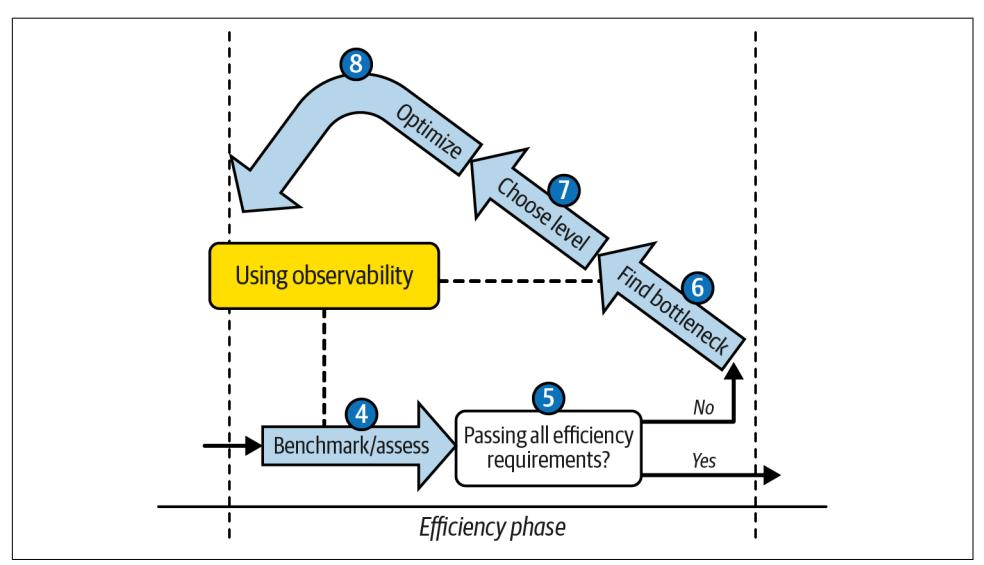
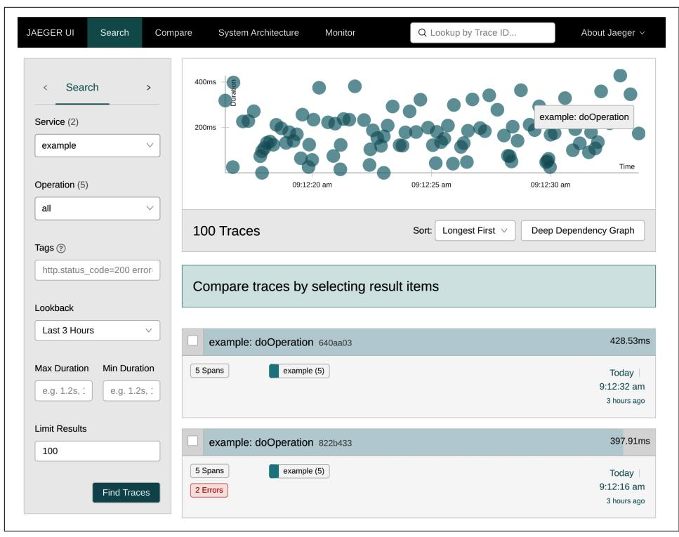
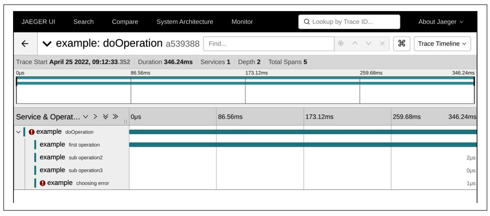
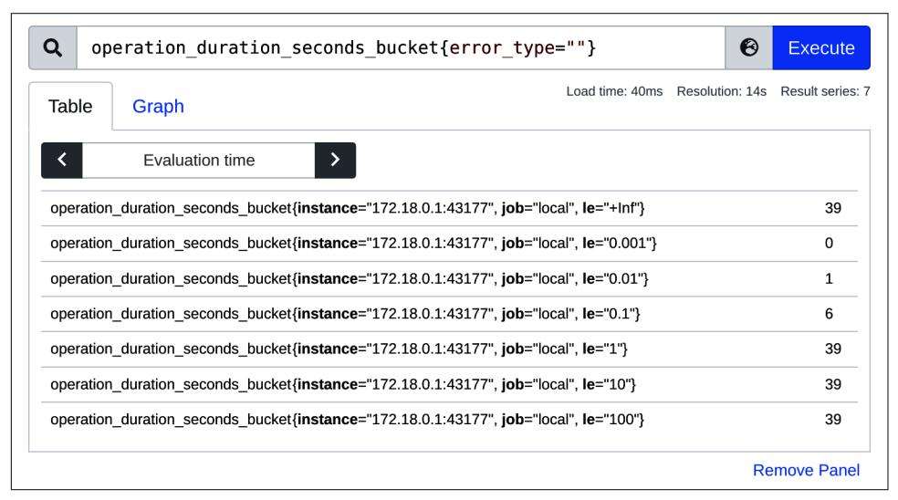
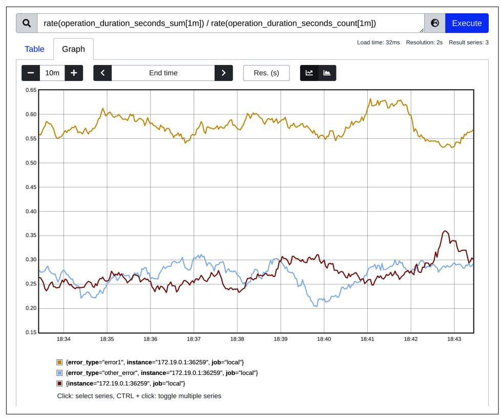
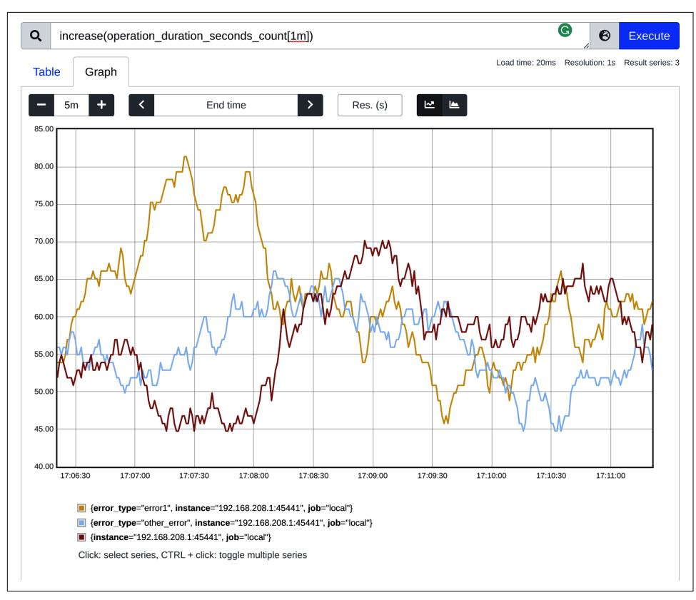
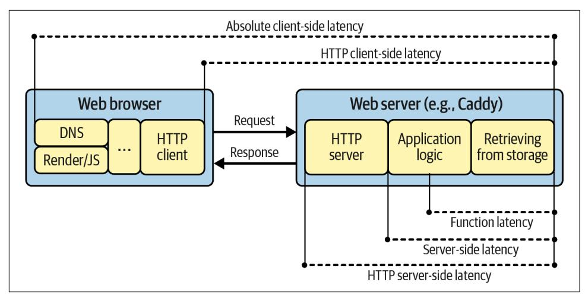
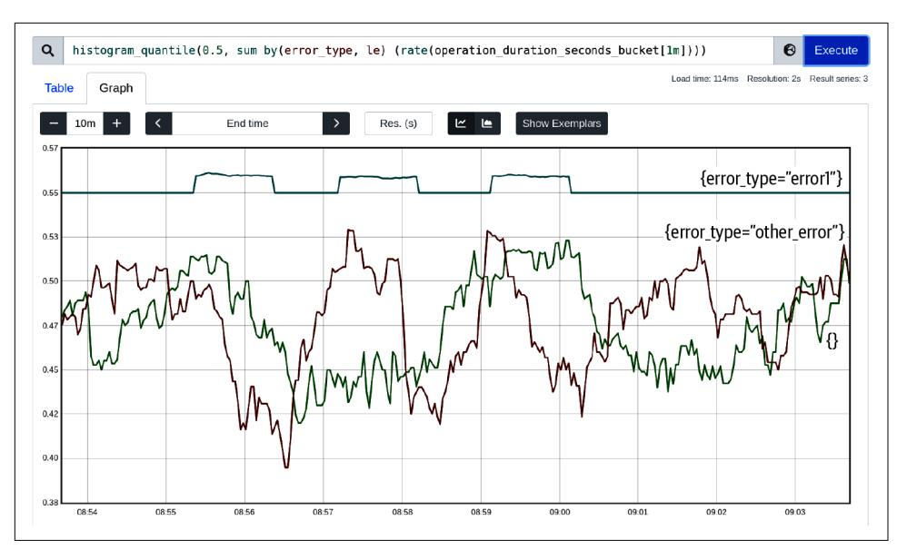
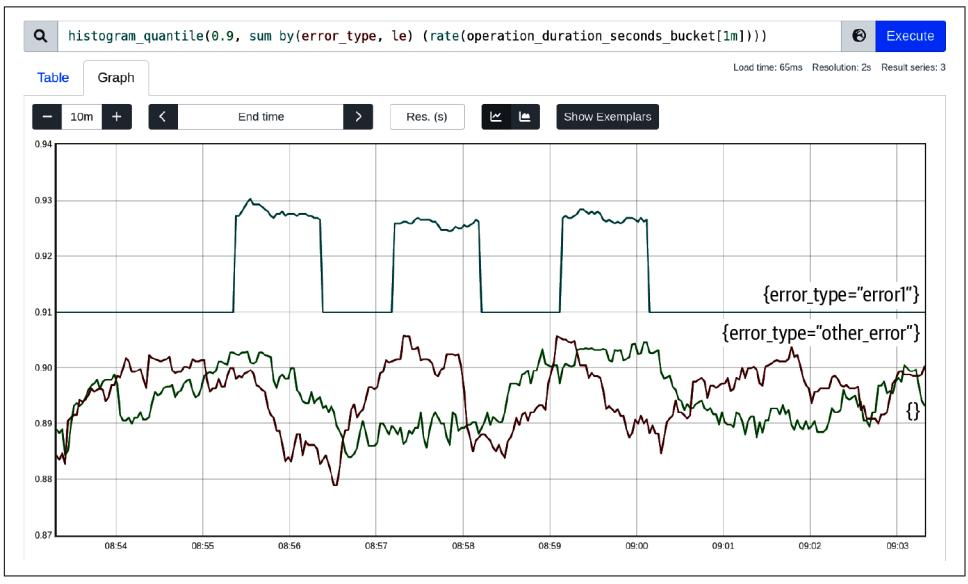
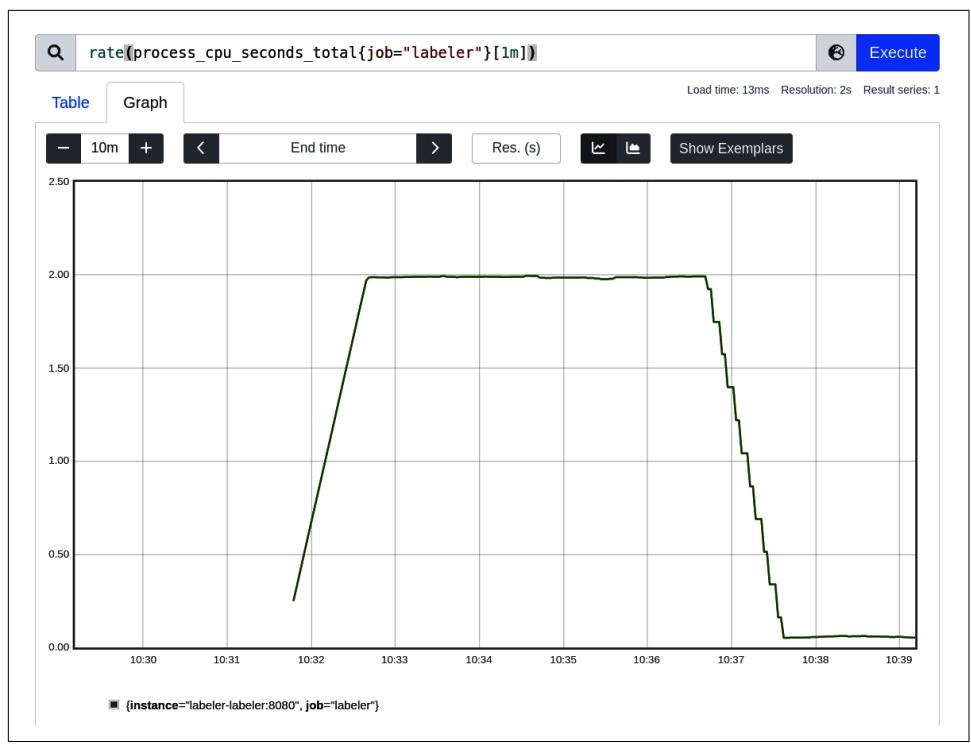

# Chapter 6: Efficiency Observability

<span id="page-212-0"></span>In ["Efficiency-Aware Development Flow" on page 102](007-chapter-3-conquering-efficiency.md#page-121-0), you learned to follow the TFBO (test, fix, benchmark, and optimize) flow to validate and achieve the required efficiency results with the least effort. Around the elements of the efficiency phase, observability takes one of the key roles, especially in Chapters [7](011-chapter-7-data-driven-efficiency-assessment.md#page-258-0) and [9](013-chapter-9-data-driven-bottleneck-analysis.md#page-348-0). We focus on that phase in Figure 6-1.



*Figure 6-1. An excerpt from [Figure 3-5](007-chapter-3-conquering-efficiency.md#page-122-0) focusing on the part that requires good observability*

<span id="page-213-0"></span>In this chapter, I will explain the required observability and monitoring tools for this part of the flow. First, we will learn what observability is and what problems it solves. Then, we will discuss different observability signals, typically divided into logs, trac‐ ing, metrics, and, recently, profiles. Next, we will explain the first three signals in ["Example: Instrumenting for Latency" on page 199](#page-218-0), which takes latency as an example of the efficiency information we might want to measure (profiling is explained in [Chapter 9](013-chapter-9-data-driven-bottleneck-analysis.md#page-348-0)). Last but not least, we will go through the specific semantics and sources of metrics related to our program efficiency in ["Efficiency Metrics Semantics"](#page-239-0) on [page 220.](#page-239-0)


## You Can't Improve What You Don't Measure!

This quote, often attributed to Peter Drucker, is a key to improving anything: business revenues, car efficiency, family budget, body fat, or [even happiness.](https://oreil.ly/eKiIR)

Especially when it comes to invisible waste that our inefficient soft‐ ware is producing, we can say that it's impossible to optimize soft‐ ware without assessing and measuring before and after the change. Every decision must be data driven, as our guesses in this virtual space are often wrong.

With no further ado, let's learn how to measure the efficiency of our software in the easiest possible way—with the concept the industry calls observability.

### Observability

To control software efficiency, we first need to find a structured and reliable way to measure the latency and resource usage of our Go applications. The key is to count these as accurately as possible and present them at the end as easy to understand numeric values. This is why for consumption measurements, we sometimes (not always!) use a "metric signal," which is a pillar of the essential software (or system) characteristics called observability.

<span id="page-214-0"></span>
#### Observability

In the cloud-native infrastructure world, we often talk about the observability of our applications. Unfortunately, observability is a very overloaded word.<sup>1</sup> It can be summarized as follows: an ability to deduce the state of a system inferred from external signals.

The external signals the industry uses nowadays can be generally categorized into four types: metrics, logs, traces, and profiling.<sup>2</sup>

Observability is a huge topic nowadays as it can help us in many situations while developing and operating our software. Observability patterns allow us to debug fail‐ ures or unexpected behaviors of our programs, find root causes of incidents, monitor healthiness, alert on unforeseen situations, perform billing, measure [SLIs \(service](https://oreil.ly/hsdXJ) [level indicators\),](https://oreil.ly/hsdXJ) run analytics, and much more. Naturally, we will focus only on the parts of observability that will help us ensure that our software efficiency matches our requirements (the RAERs mentioned in ["Efficiency Requirements Should Be Formal‐](007-chapter-3-conquering-efficiency.md#page-102-0) [ized" on page 83](007-chapter-3-conquering-efficiency.md#page-102-0)). So what is an observability signal?

- Metrics are a numeric representation of data measured over intervals of time. Metrics can harness the power of mathematical modeling and pre‐ diction to derive knowledge of the behavior of a system over intervals of time in the present and future.
- An event log is an immutable, timestamped record of discrete events that happened over time. Event logs in general come in three forms but are fundamentally the same: a timestamp and a payload of some context.
- A trace is a representation of a series of causally related distributed events that encode the end-to-end request flow through a distributed system. Traces are a representation of logs; the data structure of traces looks almost like that of an event log. A single trace can provide visibility into both the path traversed by a request as well as the structure of a request.

—Cindy Sridharan, *[Distributed Systems Observability](https://oreil.ly/YrSIE)* (O'Reilly, 2018)

<sup>1</sup> Some of you might ask why I am sticking to the word *observability* and don't mention monitoring. In my eyes, I have to agree with my friend [Björn Rabenstein](https://oreil.ly/9ado0) that the difference between monitoring and observabil‐ ity tends to be driven by marketing needs too much. One might say that observability has become meaning‐ less these days. In theory, monitoring means answering known unknown problems (known questions), whereas observability allows learning about unknown unknowns (any question you might have in the future). In my eyes, monitoring is a subset of observability. In this book, we will stay pragmatic. Let's focus on how we can leverage observability practically, not using theoretical concepts.

<sup>2</sup> The fourth signal, profiling, just started to be considered by some as an observability signal. This is because only recently did the industry see a value and need for gathering profiling continuously.

<span id="page-215-0"></span>Generally, all those signals can be used to observe our Go applications' latency and resource consumption for optimization purposes. For example, we can measure the latency of a specific operation and expose it as a metric. We can send that value enco‐ ded into a log line or trace annotations (e.g., ["baggage"](https://oreil.ly/V5sQ6) items). We can calculate latency by subtracting the timestamps of two log lines—when the operation started and when it finished. We can use trace spans, which track the latency of a span (indi‐ vidual unit of work done) by design.

However, whatever we use to deliver that information to us (via metric-specific tools, logs, traces, or profiles), in the end, it has to have metric semantics. We need to derive information to a numeric value so we can gather it over time; subtract; find max, min, or average; and aggregate over dimensions. We need the information to visualize and analyze. We need it to allow tools to reactively alert us when required, potentially build further automation that will consume it, and compare other metrics. This is why an efficiency discussion will mostly navigate through metric aggregations: the tail latency of our application, maximum memory usage over time, etc.

As we discussed, to optimize anything, you have to start measuring it, so the industry has developed many metrics and instruments to capture the usage of various resources. The process of observing or measuring always starts with the instrumentation.


#### Instrumentation

Instrumentation is a process of adding or enabling instruments for our code that will expose the observability signals we need.

#### Instrumentation can have many forms:

#### Manual instrumentation

We can add a few statements to our code that import a Go module that generates an observability signal (for example, [Prometheus client for metrics,](https://oreil.ly/AoWkJ) [go-kit logger,](https://oreil.ly/adTO3) or [a tracing](https://oreil.ly/o7uYH) library) and hook it to the operations we do. Of course, this requires modifying our Go code, but it usually leads to more personalized and rich signals with more context. Usually, it represents [open box](https://oreil.ly/qMjUP) information because we can collect information tailored to the program functionality.

#### Autoinstrumentation

Sometimes instrumentation means installing (and configuring) a tool that can derive useful information by looking at outside effects. For example, a service mesh gathers observability by looking at HTTP requests and responses, or a tool hooks to the operating system and gathers information through [cgroups](https://oreil.ly/aCe6S) <span id="page-216-0"></span> or [eBPF.](https://oreil.ly/QjxV9) 3 Autoinstrumentation does not require changing and rebuilding code and usually represents [closed box information](https://oreil.ly/UO0gK).

On top of that, it's helpful to categorize instrumentation based on the granularity of the information:

#### Capturing raw events

Instrumentation in this category will try to deliver a separate piece of informa‐ tion for each event in our process. For example, suppose we would like to know how many and what errors are happening in all HTTP requests served by our process. In that case, we could have instrumentation that delivers a separate piece of information about each request (e.g., as a log line). Furthermore, this informa‐ tion usually has some metadata about its context, like the status code, user IP, timestamp, and the process and code statement in which it happened (target metadata).

Once ingested to some observability backend, such raw data is very rich in con‐ text and, in theory, allows any ad hoc analysis. For example, we can scan through all events to find an average number of errors or the percentile distributions (more on that in ["Latency" on page 221\)](#page-240-0). We can navigate to every individual error representing a single event to inspect it in detail. Unfortunately, this kind of data is generally the most expensive to use, ingest, and store. We often risk an inac‐ curacy here since it's likely we'll miss an individual event or two. In extreme cases, it requires complex skills and automation for big data and data mining explorations to find the information you want.

#### Capturing aggregated information

We can capture pre-aggregated data instead of raw events. Every piece of infor‐ mation delivered by such instrumentation represents certain information about a group of events. In our HTTP server example, we could count successful and failed requests, and periodically deliver that information. Before forwarding this information, we could go even further and pre-calculate the error ratio inside our code. It's worth mentioning that this kind of information also requires metadata, so we can summarize, aggregate further, compare, and analyze those aggregated pieces of information.

Pre-aggregated instrumentation forces Go processes or autoinstrumentation tools to do more work, but the results are generally easier to use. On top of this, because of the smaller amount of data, the complexity of the instrumenta‐ tion, signal delivery, and backend is lower, thereby increasing reliability and decreasing cost significantly. There are trade-offs here as well. We lose some

<sup>3</sup> As a recent example, we can give [this repository](https://oreil.ly/sPlPe) that gathers information through eBPF probes and tries to search popular functions or libraries.

<span id="page-217-0"></span>information (commonly called the cardinality). The decision of what informa‐ tion to prebuild is made up front, and is coded into instrumentation. If you sud‐ denly have different questions to be answered (e.g., how many errors an individual user had across your processes) and your instrumentation was not set to pre-aggregate that information, you have to change it, which takes time and resources. Yet if you roughly know what you will be asking for ahead of time, aggregated type of information is an amazing win and a more pragmatic approach.<sup>4</sup>

Last but not least, generally speaking we can design our observability flows into pushand-pull collection models:

#### Push

A system where a centralized remote process collects observability signals from your applications (including your Go programs).

#### Pull

A system where application processes push the signal to a remote centralized observability system.


#### Push Versus Pull

Each of the conventions has its pros and cons. You can push your metrics, logs, and traces, but you can also pull all of them from your process. We can also use a mixed approach, different for each observability signal.

Push versus pull method is sometimes a controversial topic. The industry is polarized as to what is generally better, not only in observability but also for any other architectures. We will discuss the pros and cons in ["Metrics" on page 211](#page-230-0), but the difficult truth is that both ways can scale equally well, just with different solutions, tools, and best practices.

After learning about those three categories, we should be ready to dive further into observability signals. To measure and deliver observability information for efficiency optimizations, we can't avoid learning more about instrumenting the three common observability signals: logging, tracing, and metrics. In the next section, let's do that while keeping a practical goal in mind—measuring latency.

<sup>4</sup> In some way, I am trying in this book to establish helpful processes around optimizations and efficiency, which by design yield standard questions we know up front. This aggregated information is usually enough for us here.

<span id="page-218-0"></span>
### Example: Instrumenting for Latency

All three signals you will learn in this section can be used to build observability that will fit in any of the three categorizations we discussed. Each signal can:

- Be manually or autoinstrumented
- Give aggregated information or raw events
- Be pulled (collected, tailed, or scraped) from the process or pushed (uploaded)

Yet every signal—logging, tracing, or metric—might be better or worse fitted in any of those jobs. In this section, we will discuss these predispositions.

The best way to learn how to use observability signals and their trade-offs is to focus on the practical goal. Let's imagine we want to measure the latency of a specific oper‐ ation in our code. As mentioned in the introduction, we need to start measuring the latency to assess it and decide if our code needs more optimizations during every optimization iteration. As you will learn in this section, we can get latency results using any of those observability signals. The details around how information is pre‐ sented, how complex instrumentation is, and so on will help you understand what to choose in your journey. Let's dive in!

### Logging

Logging might be the clearest signal to understand an instrument. So let's explore the most basic instrumentation that we might categorize as logging to collect latency measurements. Taking basic latency measurements for a single operation in Go code is straightforward, thanks to the standard time [package](https://oreil.ly/t9FDr). Whether you do it by hand or use standard or third-party libraries to obtain latencies, if they are written in Go, they use the pattern presented in Example 6-1 using the time package.

*Example 6-1. Manual and simplest latency measurement of a single operation in Go*

```
import (
 "fmt"
 "time"
)
func ExampleLatencySimplest() {
 for i := 0; i < xTimes; i++ {
 start := time.Now()
 err := doOperation()
 elapsed := time.Since(start)
 fmt.Printf("%v ns\n", elapsed.Nanoseconds())
 // ...
```

```
 }
}
```

- time.Now() captures the current wall time (clock time) from our operating sys‐ tem clock in the form time.Time. Note the xTime, example variable that specifies the desired number of runs.
- After our cooperation functions finish, we can capture the time between start and current time using time.Since(start), which returns the handy time.Duration.
- We can leverage such an instrument to deliver our metric sample. For example, we can print the duration in nanoseconds to the standard output using the .Nano seconds() method.

Arguably, [Example 6-1](#page-218-0) represents the simplest form of instrumentation and observa‐ bility. We take a latency measurement and deliver it by printing the result into stan‐ dard output. Given that every operation will output a new line, [Example 6-1](#page-218-0) represents manual instrumentation of raw event information.

Unfortunately, this is a little naive. First of all, as we will learn in ["Reliability of](012-chapter-8-benchmarking-versus-stress-and-load-tests.md#page-275-0) [Experiments" on page 256,](012-chapter-8-benchmarking-versus-stress-and-load-tests.md#page-275-0) a single measurement of anything can be misleading. We have to capture more of those—ideally hundreds or thousands for statistical pur‐ poses. When we have one process, and only one functionality we want to test or benchmark, [Example 6-1](#page-218-0) will print hundreds of results that we can later analyze. However, to simplify the analysis, we could try to pre-aggregate some results. Instead of logging raw events, we could pre-aggregate using a mathematical average function and output that. Example 6-2 presents a modification of [Example 6-1](#page-218-0) that aggregates events into an easier-to-consume result.

*Example 6-2. Instrumenting Go to log the average latency of an operation in Go*

```
func ExampleLatencyAggregated() {
 var count, sum int64
 for i := 0; i < xTimes; i++ {
 start := time.Now()
 err := doOperation()
 elapsed := time.Since(start)
 sum += elapsed.Nanoseconds()
 count++
 // ...
 }
```

```
 fmt.Printf("%v ns/op\n", sum/count)
}
```

- Instead of printing raw latency, we can gather a sum and number of operations in the sum.
- Those two pieces of information can be used to calculate the accurate average and present that for a group of events instead of the unique latency. For example, one run printed the 188324467 ns/op string on my machine.

Given that we stop presenting latency for raw events, Example 6-2 represents a man‐ ual, aggregated information observability. This method allows us to quickly get the information we need without complex (and time-consuming) tools analyzing our logging outputs.

This example is how the Go benchmarking tool will do the average latency calcula‐ tions. We can achieve exactly the same logic as in Example 6-2 using the snippet in Example 6-3 in a file with the *\_test.go* suffix.

*Example 6-3. Simplest Go benchmark that will measure average latency per operation*

```
func BenchmarkExampleLatency(b *testing.B) {
 for i := 0; i < b.N; i++ {
 _ = doOperation()
 }
}
```

The for loop with the N variable is essential in the benchmarking framework. It allows the Go framework to try different N values to perform enough test runs to fulfill the configured number of runs or test duration. For example, by default, the Go benchmark runs to fit one second, which is often too short for meaning‐ ful output reliability.

Once we run Example 6-3 using go test (explained in detail in ["Go Benchmarks" on](012-chapter-8-benchmarking-versus-stress-and-load-tests.md#page-296-0) [page 277](012-chapter-8-benchmarking-versus-stress-and-load-tests.md#page-296-0)), it will print certain output. One part of the information is a result line with a number of runs and average nanoseconds per operation. One of the runs on my machine gave an output latency of 197999371 ns/op, which generally matches the result from Example 6-2. We can say that the Go benchmark is an autoinstrumenta‐ tion with aggregated information using logging signals for things like latency.

On top of collecting latency about the whole operation, we can gain a lot of insight from having different granularity of those measurements. For example, we might wish to capture the latency of a few suboperations inside our single operation. Finally, for more complex deployments, when our Go program is part of a distributed system, as discussed in ["Macrobenchmarks" on page 306](012-chapter-8-benchmarking-versus-stress-and-load-tests.md#page-325-0), we have poten‐

<span id="page-221-0"></span>tially many processes we have to measure across. For those cases, we have to use more sophisticated logging that will give us more metadata and ways to deliver a log‐ ging signal, not only by simply printing to a file, but by other means too.

The amount of information we have to attach to our logging signal results in the pat‐ tern called a logger in Go (and other programming languages). A logger is a structure that allows us to manually instrument our Go application with logs in the easiest and most readable way. A logger hides complexities like:

- Formatting of the log lines.
- Deciding if we should log or not based on the logging level (e.g., debug, warning, error, or more).
- Delivering the log line to a configured place, such as the output file. Optionally, more complex, push-based logging delivery is possible to remote backends, which must support back-off retries, authorization, service discovery, etc.
- Adding context-based metadata and timestamps.

The Go standard library is very rich with many useful utilities, including logging. For example, the log [package](https://oreil.ly/JEUjT) contains a simple logger. It can work well for many appli‐ cations, but it is prone to some usage pitfalls.<sup>5</sup>


#### Be Mindful While Using the Go Standard Library Logger

There are a few things to remember if you want to use the standard Go logger from the log package:

- Don't use the global log.Default() logger, so log.Print functions, and so on. Sooner or later, it will bite you.
- Never store or consume \*log.Logger directly in your func‐ tions and structures, especially when you write a library.<sup>6</sup> If you do, users will be forced to use a very limited log logger instead of their own logging libraries. Use a custom interface instead (e.g., [go-kit logger\)](https://oreil.ly/tCs2g), so users can adapt their loggers to what you use in your code.
- Never use the Fatal method outside the main function. It panics, which should not be your default error handling.

<sup>5</sup> Given Go compatibility guarantees, even if the community agrees to improve it, we cannot change it until Go 2.0.

<sup>6</sup> A nonexecutable module or package intended to be imported by others.

<span id="page-222-0"></span>To not accidentally get hit by these pitfalls, in the projects I worked on, we decided to use the third-party popular [go-kit](https://oreil.ly/ziBdb)<sup>7</sup> logger. An additional advantage of the go-kit log‐ ger is that it is easy to maintain some structure. Structure logic is essential to have reliable parsers for automatic log analysis with logging backends like [OpenSearch](https://oreil.ly/RohpZ) or [Loki](https://oreil.ly/Fw9I3). To measure latency, let's go through an example of logger usage in Example 6-4. Its output is shown in [Example 6-5](#page-223-0). We use the go-kit [module,](https://oreil.ly/vOafG) but other libraries follow similar patterns.

*Example 6-4. Capturing latency though logging using the [go-kit](https://oreil.ly/9uCWi) logger*

```
import (
 "fmt"
 "time"
 "github.com/go-kit/log"
 "github.com/go-kit/log/level"
)
func ExampleLatencyLog() {
 logger := log.With(
 log.NewLogfmtLogger(os.Stderr), "ts", log.DefaultTimestampUTC,
 )
 for i := 0; i < xTimes; i++ {
 now := time.Now()
 err := doOperation()
 elapsed := time.Since(now)
 level.Info(logger).Log(
 "msg", "finished operation",
 "result", err,
 "elapsed", elapsed.String(),
 )
 // ...
 }
}
```

We initialize the logger. Libraries usually allow you to output the log lines to a file (e.g., standard output or error) or directly push it to some collections tool,

<sup>7</sup> There are many Go libraries for logging. go-kit has a good enough API that allows us to do all kinds of log‐ ging we need in all the Go projects I have helped with so far. This does not mean go-kit is without flaws (e.g., it's easy to forget you have to put an even number of arguments for the key-value–like logic). There is also a pending proposal from the Go community on [structure logging in standard libraries \(](https://oreil.ly/qnJ6y)slog package). Feel free to use any other libraries, but make sure their API is simple, readable, and useful. Also make sure that the library of your choice is not introducing efficiency problems.

<span id="page-223-0"></span>e.g., to [fluentbit](https://oreil.ly/pUcmX) or [vector](https://oreil.ly/S0aqR). Here we choose to output all logs to standard error<sup>8</sup> with a timestamp attached to each log line. We also choose to format logs in the human-accessible way with NewLogfmtLogger (still structured so that it can be parsed by software, with space as the delimiter).

In [Example 6-1,](#page-218-0) we simply printed the latency number. Here we add certain metadata to it to use that information more easily across processes and different operations happening in the system. Notice that we maintain a certain structure. We pass an even number of arguments representing key values. This allows our log line to be structured for easier use by automation. Additionally, we choose level.Info, meaning this log line will be not printed if we choose levels like errors only.

*Example 6-5. Example output logs generated by [Example 6-4](#page-222-0) (wrapped for readability)*

```
level=info ts=2022-05-02T11:30:46.531839841Z msg="finished operation" \
result="error other" elapsed=83.62459ms 
level=info ts=2022-05-02T11:30:46.868633635Z msg="finished operation" \
result="error other" elapsed=336.769413ms
level=info ts=2022-05-02T11:30:47.194901418Z msg="finished operation" \
result="error first" elapsed=326.242636ms
level=info ts=2022-05-02T11:30:47.51101522Z msg="finished operation" \
result=null elapsed=316.088166ms
level=info ts=2022-05-02T11:30:47.803680146Z msg="finished operation" \
result="error first" elapsed=292.639849ms
```

Thanks to the log structure, it's both readable to us and automation can clearly distinguish among different fields like msg, elapsed, info, etc. without expensive and error-prone fuzzy parsing.

Logging with a logger might still be the simplest way to deliver our latency informa‐ tion manually to us. We can tail the file (or use docker log if our Go process was running in Docker, or kubectl logs if we deployed it on Kubernetes) to read those log lines for further analysis. It is also possible to set up an automation that tails those from files or pushes them directly to the collector, adding further information. Col‐ lectors can be then configured to push those log lines into free and open source log‐ ging backends like [OpenSearch,](https://oreil.ly/RohpZ) [Loki](https://oreil.ly/Fw9I3), [Elasticsearch,](https://oreil.ly/EUlts) or many of the paid vendors. As a result, you can keep log lines from many processes in a single place, search, visual‐ ize, analyze them, or build further automation to handle them as you want.

<sup>8</sup> It's a typical pattern allowing processes to print something useful to standard output and keep logs separate in the stderr Linux file.

<span id="page-224-0"></span>Is logging a good fit for our efficiency observability? Yes and no. For microbe‐ nchmarks explained in ["Microbenchmarks" on page 275,](012-chapter-8-benchmarking-versus-stress-and-load-tests.md#page-294-0) logging is our primary tool of measurements because of its simplicity. On the other hand, on a macro level, like ["Macrobenchmarks" on page 306,](012-chapter-8-benchmarking-versus-stress-and-load-tests.md#page-325-0) we tend to use logging for a raw event type of observ‐ ability, which on such a scale gets very complex and expensive to analyze and keep reliable. Still, because logging is so common, we can find efficiency bottlenecks in a bigger system with logging.

Logging tools are also constantly evolving. For example, many tools allow us to derive metrics from log lines, like Grafana Loki's [Metric queries inside LogQL](https://oreil.ly/fdoNm). In practice, however, simplicity has its cost. One of the problems stems from the fact that some‐ times logs are used directly by humans, and sometimes by automation (e.g., deriving metrics or reacting to situations found in logs). As a result, logs are often unstruc‐ tured. Even with amazing loggers like go-kit in [Example 6-4](#page-222-0), logs are inconsistently structured, making it very hard and expensive to parse for automation. For example, things like inconsistent units (as in [Example 6-5](#page-223-0) for latency measurements), which are great for humans, become almost impossible to derive the value as a metric. Solu‐ tions like [Google mtail](https://oreil.ly/Q4wAC) try to approach this with custom parsing language. Still, the complexity and ever-changing logging structure make it hard to use this signal to measure our code's efficiency.

Let's look at the next observability signal—tracing—to learn in which areas it can help us with our efficiency goals.

### Tracing

Given the lack of consistent structure in logging, tracing signals emerged to tackle some of the logging problems. In contrast to logging, tracing is a piece of structured information about your system. The structure is built around the transaction, for example, requests-response architecture. This means that things like status codes, the result of the operation, and the latency of operations are natively encoded, thus easier to use by automation and tools. As a trade-off, you need an additional mechanism (e.g., a user interface) to expose this information to humans in a readable way.

On top of that, operations, suboperations, and even cross-process calls (e.g., RPCs) can be linked together, thanks to context propagation mechanisms working well with standard network protocols like HTTP. This feels like a perfect choice for measuring latency for our efficiency needs, right? Let's find out.

As with logging, there are many different manual instrumentation libraries you can choose from. Popular, open source choices for Go are the [OpenTracing](https://oreil.ly/gJeAV) library (cur‐ rently deprecated but still viable), [OpenTelemetry,](https://oreil.ly/uxKoW) or clients from the dedicated trac‐ ing vendor. Unfortunately, at the moment of writing, the OpenTelemetry library has a too-complex API to explain in this book, plus it's still changing, so I started a [small](https://oreil.ly/rs6fQ) [project called tracing-go](https://oreil.ly/rs6fQ) that encapsulates the OpenTelemetry client SDK into mini‐

<span id="page-225-0"></span>mal tracing instrumentation. While tracing-go is my interpretation of the minimal set of tracing functionalities to use, it should teach you the basics of context propaga‐ tion and span logic. Let's explore an example manual instrumentation using tracinggo to measure dummy doOperation function latency (and more!) using tracing in Example 6-6.

*Example 6-6. Capturing latencies of the operation and potential suboperations using [tracing-go](https://oreil.ly/1027d)*

```
import (
 "fmt"
 "time"
 "github.com/bwplotka/tracing-go/tracing"
 "github.com/bwplotka/tracing-go/tracing/exporters/otlp"
)
func ExampleLatencyTrace() {
 tracer, cleanFn, err := tracing.NewTracer(otlp.Exporter("<endpoint>"))
 if err != nil { /* Handle error... */ }
 defer cleanFn()
 for i := 0; i < xTimes; i++ {
 ctx, span := tracer.StartSpan("doOperation")
 err := doOperationWithCtx(ctx)
 span.End(err)
 // ...
 }
}
func doOperationWithCtx(ctx context.Context) error {
 _, span := tracing.StartSpan(ctx, "first operation")
 // ...
 span.End(nil)
 // ...
}
```

- As with everything, we have to initialize our library. In our example, usually, it means creating an instance of Tracer that is capable of sending the spans that will form traces. We push spans to some collector and eventually to the tracing backend. This is why we have to specify some address to send to. In this example, you could specify a gRPC host:port address of the collector (e.g., [OpenTeleme‐](https://oreil.ly/z0Pjt) [try Collector](https://oreil.ly/z0Pjt)) endpoint that supports the [gRPC OTLP trace protocol.](https://oreil.ly/4IaBd)
- With the tracer, we can create an initial root span. The root means the span that spans the whole transaction. A traceID is created during creation, identifying all

spans in the trace. Span represents individual work done. For example, we can add a different name or even baggage items like logs or events. We also get a context.Context instance as part of creation. This Go native context interface can be used to create subspans if our doOperation function will do any subwork pieces worth instrumenting.

- In the manual instrumentation, we have to tell the tracing provider when the work was done and with what result. In the tracing-go library, we can use end.Stop(<error or nil>) for that. Once you stop the span, it will record the span's latency from its start, the potential error, and mark itself as ready to be sent asynchronously by Tracer. Tracer exporter implementations usually won't send spans straightaway but buffer them for batch pushes. Tracer will also check if a trace containing some spans can be sent to the endpoint based on the chosen sampling strategy (more on that later).
- Once you have context with the injected span creator, we can add subspans to it. It's useful when you want to debug different parts and sequences involved in doing one piece of work.

One of the most valuable parts of tracing is context propagation. This is what sepa‐ rates distributed tracing from nondistributed signals. I did not reflect this in our examples, but imagine if our operation makes a network call to other microservices. Distributed tracing allows passing various tracing information like traceID, or sam‐ pling via a propagation API (e.g., certain encoding using HTTP headers). See a [related blog post](https://oreil.ly/Qz6lF) about context propagation. For that to work in Go, you have to add a special middleware or HTTP client with propagation support, e.g., [OpenTelemetry](https://oreil.ly/Rvq6i) [HTTP transport.](https://oreil.ly/Rvq6i)

Because of the complex structure, raw traces and spans are not readable by humans. This is why many projects and vendors help users by providing solutions to use trac‐ ing effectively. Open source solutions like [Grafana Tempo with Grafana UI](https://oreil.ly/CQ1Aq) and [Jaeger](https://oreil.ly/enkG9) exist, which offer nice user interfaces and trace collection so you can observe your traces. Let's look at how our spans from [Example 6-6](#page-225-0) look in the latter project. [Figure 6-2](#page-227-0) shows a multitrace search view, and [Figure 6-3](#page-227-0) shows what our individual doOperation trace looks like.

<span id="page-227-0"></span>

*Figure 6-2. View of one hundred operations presented as one hundred traces with their latency results*



*Figure 6-3. Click one trace to inspect all of its spans and associated data*

<span id="page-228-0"></span>Tools and user interfaces can vary, but generally they follow the same semantics I explain in this section. The view in [Figure 6-2](#page-227-0) allows us to search through traces based on their timestamp, durations, service involved, etc. The current search matches our one hundred operations, which are then listed on the screen. A conve‐ nient, interactive graph of its latencies is placed, so we can navigate to the operation we want. Once clicked, the view in [Figure 6-3](#page-227-0) is presented. In this view, we can see a distribution of spans for this operation. If the operation spans multiple processes and we used network context propagation, all linked spans will be listed here. For example, from [Figure 6-3](#page-227-0) we can immediately tell that the first operation was respon‐ sible for most of the latency, and the last operation introduced the error.

All the benefits of tracing make it an excellent tool for learning the system interac‐ tions, debugging, or finding fundamental efficiency bottlenecks. It can also be used for ad hoc verification of system latency measurements (e.g., in our TFBO flow to assess latency). But unfortunately, there are a few downsides of tracing that you have to be aware of when planning to use it in practice for efficiency or other needs:

#### Readability and maintainability

The advantage of tracing is that you can put a huge amount of useful context into your code. In extreme cases, you could potentially be able to rewrite the whole program or even system just by looking at all traces and their emitted spans. But there is a catch. All this manual instrumentation requires code lines. More code lines connected to our existing code increases the complexity of our code, which in turn decreases readability. We also need to ensure that our instrumentation stays updated with ever-changing code.

In practice, the tracing industry tends to prefer autoinstrumentation, which in theory can add, maintain, and hide such instrumentation automatically. Proxies like Envoy (especially with service mesh technologies) are great examples of suc‐ cessful (yet simpler) autoinstrumentation tools for tracing that record the interprocess HTTP calls. But unfortunately, more involved auto-instrumentation is not so easy. The main problem is that the automation has to hook on to some generic path like common database or library operations, HTTP requests, or sys‐ calls (e.g., through eBPF probes in Linux). Moreover, it is often hard for those tools to understand what more you would like to capture in your application (e.g., the ID of the client in a specific code variable). On top of that, tools like eBPF are pretty unstable and dependent on the kernel version.

<span id="page-229-0"></span>

#### Hiding Instrumentation Under Abstractions

There is a middle ground between manual and fully autono‐ mous instrumentation. We can manually instrument only a few common Go functions and libraries, so all code that uses them will be traced consistently implicitly (automatically!).

For example, we could add a trace for every HTTP or gRPC request to our process. There are already [HTTP middlewares](https://oreil.ly/wZ559) and [gRPC interceptors](https://oreil.ly/7gXVF) for that purpose.

#### Cost and reliability

Traces by design fall into the raw event category of observability. This means that tracing is typically more expensive than pre-aggregated equivalents. The reason is the sheer amount of data we send using tracing. Even if we are very moderate with this instrumentation for a single operation, we ideally have dozens of trac‐ ing spans. These days, systems have to sustain many QPS (queries per second). In our example, even for 100 QPS, we would generate over 1,000 spans. Each span must be delivered to some backend to be used effectively, with replication on both the ingestion and storage sides. Then you need a lot of computation power to analyze this data to find, for example, average latency across traces or spans. This can easily surpass your price for running the systems without observability!

The industry is aware of this, and this is why we have tracing sampling, so some decision-making configuration or code decides what data to pass forward and what to ignore. For example, you might want to only collect traces for failed operations or operations that took more than 120 seconds.

Unfortunately, sampling comes with its downsides. For example, it's challenging to perform tail sampling.<sup>9</sup> Last but not least, sampling makes us miss some data (similar to profiling). In our latency example, this might mean that the latency we measure represents only part of all operations that happened. Sometimes it might be enough, but it's easy to [get wrong conclusions with sampling](https://oreil.ly/R4gtX), which might lead to wrong optimization decisions.

#### Short duration

We will discuss this in detail in ["Latency" on page 221](#page-240-0), but tracing won't tell us much when we try to improve very fast functions that last only a few milli‐ seconds or less. Similar to the time package, the span itself introduces some

<sup>9</sup> Tail sampling is a logic that defers the decision if the trace should be excluded or sampled at the end of the transaction, for example, only after we know its status code. The problem with tail sampling is that your instrumentation might have already assumed that all spans will be sampled.

<span id="page-230-0"></span>latency. On top of that, adding span for many small operations can add a huge cost to the overall ingestion, storage, and querying of traces.

This is especially visible in streamed algorithms like chunked encodings, com‐ pressions, or iterators. If we perform partial operations, we are still often interes‐ ted in the latency of the sum of all iterations for certain logic. We can't use tracing for that, as we would need to create tiny spans for every iteration. For those algorithms, ["Profiling in Go" on page 331](013-chapter-9-data-driven-bottleneck-analysis.md#page-350-0) yields the best observability.

Despite some downsides, tracing becomes very powerful and even replaces the log‐ ging signal in many cases. Vendors and projects add more features, for example, [Tempo project's metric generator](https://oreil.ly/SSLye) that allows recording metrics from traces (e.g., average or tail latency for our efficiency needs). Undoubtedly, tracing would not grow so quickly without the push from the [OpenTelemetry](https://oreil.ly/sPiw9) community. Amazing things will come from this community if you are into tracing.

The downsides of one framework are often strengths of other frameworks that choose different trade-offs. For example, many tracing problems come from the fact that it naturally represents raw events happening in the system (that might trigger other events). Let's now discuss a signal on the opposite spectrum—designed to cap‐ ture aggregations changing over time.

### Metrics

Metrics is the observability signal that was designed to observe aggregated informa‐ tion. Such aggregation-oriented metric instrumentations might be the most prag‐ matic way of solving our efficiency goals. Metrics are also what I used the most in my day-to-day job as a developer and SRE to observe and debug production workloads. In addition, metrics are [the main signal used for monitoring at Google.](https://oreil.ly/x6rNZ)

Example 6-7 shows pre-aggregated instrumentation that can be used to measure latency. This example uses Prometheus [client\\_golang](https://oreil.ly/1r2zw). 10

*Example 6-7. Measuring doOperation latency using the histogram metric with Prometheus client\_golang*

```
import (
 "fmt"
 "time"
 "github.com/prometheus/client_golang/prometheus"
```

<sup>10</sup> I maintain this library together with the Prometheus team. The client\_golang is also the most used metric client SDK for Go when writing this book, [with over 53,000 open source projects](https://oreil.ly/UW0fG) using it. It is free and open source.

```
 "github.com/prometheus/client_golang/prometheus/promauto"
 "github.com/prometheus/client_golang/prometheus/promhttp"
)
func ExampleLatencyMetric() {
 reg := prometheus.NewRegistry()
 latencySeconds := promauto.With(reg).
NewHistogramVec(prometheus.HistogramOpts{
 Name: "operation_duration_seconds",
 Help: "Tracks the latency of operations in seconds.",
 Buckets: []float64{0.001, 0.01, 0.1, 1, 10, 100},
 }, []string{"error_type"})
 go func() {
 for i := 0; i < xTimes; i++ {
 now := time.Now()
 err := doOperation()
 elapsed := time.Since(now)
 latencySeconds.WithLabelValues(errorType(err)).
 Observe(elapsed.Seconds())
 // ...
 }
 }()
 err := http.ListenAndServe(
 ":8080",
 promhttp.HandlerFor(reg, promhttp.HandlerOpts{})
 )
 // ...
}
```

- Using the Prometheus library always starts with creating a new metric registry.<sup>11</sup>
- The next step is to populate the registry with the metric definitions you want. Prometheus allows a few types of metrics, yet the typical latency measurements for efficiency are best done as histograms. So on top of type, help and histogram buckets are required. We will talk more about buckets and the choice of histo‐ grams later.
- As the last parameter, we define the dynamic dimension of this metric. Here I propose to measure latency for different types of errors (or no error). This is use‐ ful as, very often, failures have other timing characteristics.

<sup>11</sup> It's tempting to use global prometheus.DefaultRegistry. Don't do this. We try to get away from this pattern that can cause many problems and side effects.

- <span id="page-232-0"></span>We observe the exact latency with a floating number of seconds. We run all oper‐ ations in a simplified goroutine, so we can expose metrics while the functionality is performing. The Observe method will add such latency into the histogram of buckets. Notice that we observe this latency for certain errors. We also don't take an arbitrary error string—we sanitize it to a type using some custom errorType function. This is important because the controlled number of values in the dimension keeps our metric valuable and cheap.
- The default way to consume those metrics is by allowing other processes (e.g., [Prometheus server\)](https://oreil.ly/2Sa3P) to pull the current state of the metrics. For example, in this simplified<sup>12</sup> code we serve those metrics from our registry through an HTTP end‐ point on the 8080 port.

The Prometheus data model supports four metric types, which are well described in the [Prometheus documentation:](https://oreil.ly/mamdO) counters, gauges, histograms, and summaries. There is a reason why I chose a more complex histogram for observing latency instead of a counter or a gauge metric. I explain why in ["Latency" on page 221.](#page-240-0) For now, it's enough to say that histograms allow us to capture distributions of the latencies, which is typi‐ cally what we need when observing production systems for efficiency and reliability. Such metrics, defined and instrumented in [Example 6-7](#page-230-0), will be represented on an HTTP endpoint, as shown in Example 6-8.

*Example 6-8. Sample of the metric output from [Example 6-7](#page-230-0) when consumed from the [OpenMetrics compatible HTTP endpoint](https://oreil.ly/aZ6GT)*

```
# HELP operation_duration_seconds Tracks the latency of operations in seconds.
# TYPE operation_duration_seconds histogram
operation_duration_seconds_bucket{error_type="",le="0.001"} 0 
operation_duration_seconds_bucket{error_type="",le="0.01"} 0
operation_duration_seconds_bucket{error_type="",le="0.1"} 1
operation_duration_seconds_bucket{error_type="",le="1"} 2
operation_duration_seconds_bucket{error_type="",le="10"} 2
operation_duration_seconds_bucket{error_type="",le="100"} 2
operation_duration_seconds_bucket{error_type="",le="+Inf"} 2
operation_duration_seconds_sum{error_type=""} 0.278675917 
operation_duration_seconds_count{error_type=""} 2
```

Each bucket represents a number (counters) of operations that had latency less than or equal to the value specified in le. For example, we can immediately see that we saw two successful operations from the process start. The first was faster

<sup>12</sup> Always check errors and perform graceful termination on process teardown. See production-grade usage in the [Thanos project](https://oreil.ly/yvvTM) that leverages the [run goroutine helper](https://oreil.ly/sDIwW).

<span id="page-233-0"></span>than 0.1 seconds; and the second was faster than 1 second, but slower than 0.1 seconds.

Every histogram also captures a number of observed operations and summarized value (sum of observed latencies, in this case).

As mentioned in ["Observability" on page 194](#page-213-0), every signal can be pulled or pushed. However, the Prometheus ecosystem defaults to the pull method for metrics. Not the naive pull, though. In the Prometheus ecosystem, we don't pull a backlog of events or samples like we would when pulling (tailing) traces of logs from, for example, a file. Instead, applications serve HTTP payload in the OpenMetrics format (like in [Example 6-8](#page-232-0)), which is then periodically collected (scraped) by Prometheus servers or Prometheus compatible systems (e.g., Grafana Agent or OpenTelemetry collector). With the Prometheus data model, we scrape the latest information about the process.

To use Prometheus with our Go program instrumented in [Example 6-7](#page-230-0), we have to start the Prometheus server and configure the scrape job that targets the Go process server. For example, assuming we have the code in [Example 6-7](#page-230-0) running, we could use the set of commands shown in Example 6-9 to start metric collection.

*Example 6-9. The simplest set of commands to run Prometheus from the terminal to start collecting metrics from [Example 6-7](#page-230-0)*

```
cat << EOF > ./prom.yaml
scrape_configs:
- job_name: "local"
 scrape_interval: "15s" 
 static_configs:
 - targets: [ "localhost:8080" ] 
EOF
prometheus --config.file=./prom.yaml
```

- For my demo purposes, I can limit the [Prometheus configuration](https://oreil.ly/4cPSa) to a single scrape job. One of the first decisions is to specify the scrape interval. Typically, it's around 15–30 seconds for continuous, efficient metric collection.
- I also provide a target that points to our tiny instrumented Go program in [Example 6-7.](#page-230-0)
- Prometheus is just a single binary written in Go. We install it in [many ways](https://oreil.ly/9CxxD). In the simplest configuration, we can point it to a created configuration. When started, the UI will be available on the localhost:9090.

With the preceding setup, we can start analyzing the data using Prometheus APIs. The simplest way is to use the Prometheus query language (PromQL) documented [here](https://oreil.ly/nY6Yi) and [here.](https://oreil.ly/jH3nd) With Prometheus server started as in [Example 6-9](#page-233-0), we can use the Prometheus UI and query the data we collected.

For example, Figure 6-4 shows the result of the simple query fetching the latest latency histogram numbers over time (from the moment of the process start) for our operation\_duration\_seconds metric name that represents successful operations. This generally matches the format we see in [Example 6-8.](#page-232-0)



*Figure 6-4. PromQL query results for simple query for all operation\_duration\_ seconds\_bucket metrics graphed in the Prometheus UI*

To obtain the average latency of a single operation, we can use certain mathematical operations to divide the rates of operation\_duration\_seconds\_sum by operation\_duration\_seconds\_count. We use the rate function to ensure accurate results across many processes and their restart. rate transforms Prometheus counters into a rate per second.<sup>13</sup> Then we can use / to divide the rates of those metrics. The result of such an average query is presented in Figure 6-5.



*Figure 6-5. PromQL query results representing average latency captured by the [Example 6-7](#page-230-0) instrumentation graphed in the Prometheus UI*

With another query, we can check total operations or, even better, check the rate per minute of those using the increase function on our operation\_duration\_ seconds\_count counter, as presented in [Figure 6-6](#page-236-0).

<sup>13</sup> Note that doing rate on the gauges type of metric will yield incorrect results.

<span id="page-236-0"></span>

*Figure 6-6. PromQL query results representing a rate of operations per minute in our system graphed in the Prometheus UI*

There are many other functions, aggregations, and ways of using metric data in the Prometheus ecosystem. We will unpack some of it in later sections.

The amazing part about Prometheus with such a specific scrape technique is that pulling metrics allows our Go client to be ultrathin and efficient. As a result, the Go process does not need to:

- Buffer data samples, spans, or logs in memory or on disk
- Maintain information (and automatically update it!) on where to send potential data
- Implement complex buffering and persisting logic if the metric backend is down temporarily
- Ensure a consistent sample push interval
- Know about any authentication, authorization, or TLS for metric payload

<span id="page-237-0"></span>On top of that, the observability experience is better when you pull the data in such a way that:

- Metric users can easily control the scrape interval, targets, metadata, and record‐ ings from a central place. This makes the metric usage simpler, more pragmatic, and generally cheaper.
- It is easier to predict the load of such a system, which makes it easier to scale it and react to the situations that require scaling the collection pipeline.
- Last but not least, pulling metrics allows you to reliably tell your application's health (if we can't scrape metrics from it, it is most likely unhealthy or down). We also typically know what sample is the last one for a metric (staleness).<sup>14</sup>

As with everything, there are some trade-offs. Each pulled, tailed, or scraped signal has its downsides. Typical problems of an observability pull-based system include:

- It is generally harder to pull data from short-lived processes (e.g., CLI and batch jobs).<sup>15</sup>
- Not every system architecture allows ingress traffic.
- It is generally harder to ensure that all the pieces of information will land safely in a remote place (e.g., this pulling is not suitable for auditing).

The Prometheus metrics are designed to mitigate downsides and leverage the strength of the pull model. Most of the metrics we use are counters, which means they only increase. This allows Prometheus to skip a few scrapes from the process but still, in the end, have a perfectly accurate number for each metric within larger time windows, like minutes.

As mentioned before, in the end, metrics (as numeric values) are what we need when it comes to assessing efficiency. It's all about comparing and analyzing numbers. This is why a metric observability signal is a great way to gather required information pragmatically. We will use this signal extensively for ["Macrobenchmarks" on page 306](012-chapter-8-benchmarking-versus-stress-and-load-tests.md#page-325-0) and ["Root Cause Analysis, but for Efficiency"](013-chapter-9-data-driven-bottleneck-analysis.md#page-349-0) on page 330. It's simple, pragmatic, the ecosystem is huge (you can find metric exporters for almost all kinds of software and hardware), it's generally cheap, and it works great with both human users and auto‐ mation (e.g., alerting).

<sup>14</sup> On the contrary, for the push-based system, if you don't see expected data, it's hard to tell if it's because the sender is down or the pipeline to send is down.

<sup>15</sup> See our talk from [KubeCon EU 2022](https://oreil.ly/TtKwH) about such cases.

<span id="page-238-0"></span>Metric observability signals, especially with the Prometheus data model, fit into aggregated information instrumentation. We discussed the benefits, but some limits and downsides are important to understand. All downsides come from the fact that we generally cannot narrow pre-aggregated data down to a state before aggregation, for example, a single event. We might know with metrics how many requests failed, but we don't know the exact stack trace, error message, and so on for a singular error that happened. The most granular information we typically have is a type of error (e.g., status code). This makes the surface of possible questions we can ask a metric system smaller than if we would capture all raw events. Another essential characteris‐ tic that might be considered a downside is the cardinality of the metrics and the fact that it has to be kept low.


#### High Metric Cardinality

Cardinality means the uniqueness of our metric. For example, imagine in [Example 6-7](#page-230-0) we would inject a unique error string instead of the error\_type label. Every new label value creates a new, possibly short-lived unique metric. A metric with just a single or a few samples represents more of a raw event, not aggregation over time. Unfortunately, if users try to push event-like informa‐ tion to a system designed for metrics (like Prometheus), it tends to be expensive and slow.

It is very tempting to push more cardinal data to a system designed for metrics. This is because it's only natural to want to learn more from such cheap and reliable signal-like metrics. Avoid that and keep your cardinality low with metric budgets, recording rules, and allow-list relabeling. Switch to event-based systems like logging and tracing if you wish to capture unique information like exact error messages or the latency for a single, specific operation in the system!

Whether gathered from logs, traces, profiles, or metric signals, we already touched on some metrics in previous chapters—for example, CPU core used per second, memory bytes allocated on the heap, or residential memory bytes used per operation. So let's go through some of those in detail and talk about their semantics, how we should interpret them, potential granularity, and example code that illustrates them using signals you have just learned.

<span id="page-239-0"></span>

#### There Is No Observability Silver Bullet!

Metrics are powerful. Yet as you learned in this chapter, logging and traces also give enormous opportunities to improve the effi‐ ciency observability experience with dedicated tools that allow us to derive metrics from them. In this book, you will see me using all of those tools (together with profiling, which we haven't covered yet) to improve the efficiency of Go programs.

The pragmatic system captures enough of each of those observabil‐ ity signals that fit your use cases. It's unlikely to build metric-only, trace-only, or profiling-only systems!

### Efficiency Metrics Semantics

Observability feels like a vast and deep topic that takes years to grasp and set up. The industry constantly evolves, and creating new solutions does not help. However, it will be easier to understand once we start using observability for a specific goal like the efficiency effort. Let's talk about exactly which observability bits are essential to start measuring latency and consumption of the resources we care about, e.g., CPU and memory.


#### Metrics As Numeric Value Versus Metric Observability Signal

In ["Metrics" on page 211,](#page-230-0) we discussed the metric observability sig‐ nal. Here we discuss specific metric semantics that are useful to capture for efficiency efforts. To clarify, we can capture those spe‐ cific metrics in various ways. We can use metric observability sig‐ nals, but we can also derive them from other signals, like logs, traces, and profiling!

Two things can define every metric:

#### Semantics

What's the meaning of that number? What do we measure? With what unit? How do we call it?

#### Granularity

How detailed is this information? For example, is it per a unique operation? Is it per a result type of this operation (success versus error)? Per goroutine? Per process?

Metric semantics and granularity both heavily depend on the instrumentation. This section will focus on defining the semantics, granularity, and example instrumenta‐ tion for the typical metrics we can use to track resource consumption and latency of our software. It is essential to understand the specific measurements we will operate

<span id="page-240-0"></span>with to work effectively with the benchmark and profiling tools we will learn in ["Benchmarking Levels" on page 266](012-chapter-8-benchmarking-versus-stress-and-load-tests.md#page-285-0) and ["Profiling in Go" on page 331.](013-chapter-9-data-driven-bottleneck-analysis.md#page-350-0) While iterating over those semantics, we will uncover common best practices and pitfalls we have to be aware of. Let's go!

### Latency

If we want to improve how fast our program performs certain operations, we need to measure the latency. Latency means the duration of the operation from the start to either success or failure. Thus, the semantics we need feel pretty simple at first glance—we generally want the "amount of time" required to complete our software operation. Our metric will usually have a name containing the words *latency*, *dura‐ tion*, or *elapsed* with the desired unit. But the devil is in the details, and as you will learn in this section, measuring latency is prone to mistakes.

The preferable unit of the typical latency measurement depends on what kind of operations we measure. If we measure very short operations like compression latency or OS context switch latencies, we must focus on granular nanoseconds. Nanosec‐ onds are also the most granular timing we can count on in typical modern comput‐ ers. This is why the Go standard library [time.Time](https://oreil.ly/QGCme) and [time.Duration](https://oreil.ly/9agLb) structures measure time in nanoseconds.

Generally speaking, the typical measurements of software operations are almost always in milliseconds, seconds, minutes, or hours. This is why it's often enough to measure latency in seconds, as a floating value, for up to nanoseconds granularity. Using seconds has another advantage: it is a base unit. Using the base unit is often what's natural and consistent across many solutions.<sup>16</sup> Consistency is critical here. You don't want to measure one part of the system in nanoseconds, another in sec‐ onds, and another in hours if you can avoid it. It's easy enough to get confused by our data and have a wrong conclusion without trying to guess a correct unit or writing transformations between those.

In the code examples in ["Example: Instrumenting for Latency" on page 199](#page-218-0), we already mentioned many ways we can instrument latency using various observability signals. Let's extend [Example 6-1](#page-218-0) in [Example 6-10](#page-241-0) to show important details that ensure latency is measured as reliably as possible.

<sup>16</sup> This is why the [Prometheus ecosystem suggests base units](https://oreil.ly/oJozb).

<span id="page-241-0"></span>*Example 6-10. Manual and simplest latency measurement of a single operation that can error out and has to prepare and tear down phases*

```
prepare()
for i := 0; i < xTimes; i++ {
 start := time.Now()
 err := doOperation()
 elapsed := time.Since(start)
 // Capture 'elapsed' value using log, trace or metric...
 if err != nil { /* Handle error... */ }
}
tearDown()
```

- We capture the start time as close as possible to the start of our doOperation invocation. This ensures nothing unexpected will get between start and opera‐ tion start that might introduce unrelated latency, which can mislead the conclu‐ sion we might take from this metric further on. This, by design, should exclude any potential preparation or setup we have to do for an operation we measure. Let's measure those explicitly as another operation. This is also why you should avoid putting any newline (empty line) between start and the invocation of the operation. As a result, the next programmer (or yourself, after some time) won't add anything in between, forgetting about the instrumentation you added.
- Similarly, it's important to capture the finish time using the time.Since helper as soon as we finish, so no unrelated duration is captured. For example, similar to excluding prepare() time, we want to exclude any potential close or tear Down() duration. Moreover, if you are an advanced Go programmer, your intu‐ ition is always to check errors when some functions finish. This is critical, but we should do that for instrumentation purposes after we capture the latency. Other‐ wise, we might increase the risk that someone will not notice our instrumenta‐ tion and will add unrelated statements between what we measure and time.Since. On top of that, in most cases, you want to make sure you measure the latency of both successful and failed operations to understand the complete picture of what your program is doing.

<span id="page-242-0"></span>

#### Shorter Latencies Are Harder to Measure Reliably

The method for measuring operation latency shown in [Example 6-10](#page-241-0) won't work well for operations that finish under, let's say, 0.1 microseconds (100 nanoseconds). This is because the effort of taking the system clock number, allocating variables, and further computing time.Now() and time.Since functions can take its time too, which is significant for such short measurements.<sup>17</sup> Furthermore, as we will learn in ["Reliability of Experiments" on](012-chapter-8-benchmarking-versus-stress-and-load-tests.md#page-275-0) [page 256,](012-chapter-8-benchmarking-versus-stress-and-load-tests.md#page-275-0) every measurement has some variance. The shorter latency, the more impactful this noise can be.<sup>18</sup> This also applies to tracing spans measuring latency.

One solution for measuring very fast functions is used by the Go benchmark as pre‐ sented by Example 6-3, where we estimate average latency per operation by doing many of them. More on that in ["Microbenchmarks" on page 275](012-chapter-8-benchmarking-versus-stress-and-load-tests.md#page-294-0).


#### Time Is Infinite; the Software Structures Measuring that Time Are Not!

When measuring latency, we have to be aware of the limitations of time or duration measurements in software. Different types can contain different ranges of numeric values, and not all of them can contain negative numbers. For example:

- time.Time can only measure time from January 1, 1885<sup>19</sup> up until 2157.
- The time.Duration type can measure time (in nanoseconds) approximately between -290 years before your "starting" point and up to 290 years after your "starting" point.

If you want to measure things outside of those typical values, you need to extend those types or use your own. Last but not least, Go is prone [to the leap second prob‐](https://oreil.ly/MeZ4b) [lem](https://oreil.ly/MeZ4b) and time skews of the operating systems. On some systems, the time.Duration (monotonic clock) will also stop if the computer goes to sleep (e.g., laptop or virtual machine suspend), which will lead to wrong measurements, so keep that in mind.

<sup>17</sup> For example, on my machine time.Now and time.Since take around 50–55 nanoseconds.

<sup>18</sup> This is why it's better to make thousands or even more of the same operation, measure the total latency, and get the average by dividing it by a number of operations. As a result, this is what Go benchmark is doing, as we will learn in ["Go Benchmarks" on page 277.](012-chapter-8-benchmarking-versus-stress-and-load-tests.md#page-296-0)

<sup>19</sup> Did you know this date was picked simply because of *[Back to the Future Part II](https://oreil.ly/Oct6X)*?

<span id="page-243-0"></span>We discussed some typical latency metric semantics. Now let's move to the granular‐ ity question. We can decide to measure the latency of operation A or B in our pro‐ cess. We can measure a group of operations (e.g., transaction) or a single suboperation of it. We can gather this data across many processes or look only at one, depending on what we want to achieve.

To make it even more complex, even if we choose a single operation as our granular‐ ity to measure latency, that single operation has many stages. In a single process this can be represented by stack trace, but for multiprocess systems with some network communication, we might need to establish additional boundaries.

Let's take some programs as an example, as the Caddy HTTP web server explained in the previous chapter, with a simple [REST](https://oreil.ly/SHEor) HTTP call to retrieve an HTML as our example operation. What latencies should we measure if we install such a Go pro‐ gram in a cloud on production to serve our REST HTTP call to the client (e.g., some‐ one's browser)? The example granularities we could measure latency for are presented in Figure 6-7.



*Figure 6-7. Example latency stages we can measure for in our Go web server program communicating with the user's web browser*

We can outline five example stages:

*Absolute (total) client-side latency*

The latency measured exactly from the moment the user hits Enter in the URL input in the browser, up until the whole response is retrieved, content is loaded, and the browser renders all.

#### HTTP client-side latency (response time)

The latency captured from the moment the first bytes of the HTTP request on the client side are being written to a new or reused TCP connection, up until the client receives all bytes of the response. This excludes everything that happens before (e.g., DNS lookup) or after (rendering HTML and JavaScript in the browser) on the client side.

#### HTTP server-side latency

The latency is measured from the moment the server receives the first bytes of the HTTP request from the client, up until the server finishes writing all bytes of the HTTP response. This is typically what we are measuring if we use [the HTTP](https://oreil.ly/Js0NO) [middlewares pattern](https://oreil.ly/Js0NO) in Go.

#### Server-side latency (service time)

The latency of server-side computation required to answer the HTTP request, measured without HTTP request parsing and response encoding. Latency is from the moment of having the HTTP request parsed to the moment when we start encoding and sending the HTTP response.

#### Server-side function latency

The latency of a single server-side function computation from the moment of invocation, up until the function work is finished and return arguments are in the context of the caller function.

These are just some of the many permutations we can use to measure latency in our Go programs or systems. Which one should we pick for our optimizations? Which matters the most? It turns out that all of them have their use case. The priority of what latency metric granularity we should use and when depends solely on our goals, the accuracy of measurements as explained in ["Reliability of Experiments" on](012-chapter-8-benchmarking-versus-stress-and-load-tests.md#page-275-0) [page 256,](012-chapter-8-benchmarking-versus-stress-and-load-tests.md#page-275-0) and the element we want to focus on as discussed in ["Benchmarking Levels"](012-chapter-8-benchmarking-versus-stress-and-load-tests.md#page-285-0) [on page 266.](012-chapter-8-benchmarking-versus-stress-and-load-tests.md#page-285-0) To understand the big picture and find the bottleneck, we have to measure a few of those different granularities at once. As discussed in ["Root Cause](013-chapter-9-data-driven-bottleneck-analysis.md#page-349-0) [Analysis, but for Efficiency" on page 330](013-chapter-9-data-driven-bottleneck-analysis.md#page-349-0), tools like tracing and profiling can help with that.

<span id="page-245-0"></span>

#### Whatever Metric Granularity You Choose, Understand and Document What You Measure!

We waste a lot of time if we take the wrong conclusions from measurements. It is easy to forget or misunderstand what parts of granularity we are measuring. For example, you thought you were measuring server-side latency, but slow client software is introduc‐ ing latency you felt you didn't include in your metric. As a result, you might be trying to find a bottleneck on the server side, whereas a potential problem might be in a different process.<sup>20</sup> Understand, document, and be explicit with your instrumentation to avoid those mistakes

In ["Example: Instrumenting for Latency" on page 199,](#page-218-0) we discussed how we could gather latencies. We mentioned that generally, we use two main measuring methods for efficiency needs in the Go ecosystem. Those two ways are typically the most relia‐ ble and cheapest (useful when performing load tests and benchmarks):

- Basic logging using ["Microbenchmarks" on page 275](012-chapter-8-benchmarking-versus-stress-and-load-tests.md#page-294-0) for isolated functionality, single process measurements
- Metrics such as [Example 6-7](#page-230-0) for macro measurements that involve larger systems with multiple processes

Especially in the second case, as mentioned previously, we have to measure latency many times for a single operation to get reliable efficiency conclusions. We don't have access to raw latency numbers for each operation with metrics—we have to choose some aggregation. In Example 6-2, we proposed a simple average aggregation mechanism inside instrumentation. With metric instrumentation, this would be triv‐ ial to achieve. It's as easy as creating two counters: one for the sum of latencies and one for the count of operations. We can evaluate collected data with those two met‐ rics into a mean (arithmetic average).

Unfortunately, the average is too naive an aggregation. We can miss lots of important information about the characteristics of our latency. In ["Microbenchmarks"](012-chapter-8-benchmarking-versus-stress-and-load-tests.md#page-294-0) on page [275](012-chapter-8-benchmarking-versus-stress-and-load-tests.md#page-294-0), we can do a lot with the mean for basic statistics (this is what the Go benchmarking tool is using), but in measuring the efficiency of our software in the bigger system with more unknowns, we have to be mindful. For example, imagine we want to improve the latency of one operation that used to take around 10 seconds. We made a potential optimization using our TFBO flow. We want to assess the

<sup>20</sup> The noteworthy example from my experience is measuring server-side latency of REST with a large response or HTTP/gRPC with a streamed response. The server-side latency does not depend only on the server but also on how fast the network and client side can consume those bytes (and write back acknowledge packets within [TCP control flow](https://oreil.ly/jcrSF)).

<span id="page-246-0"></span>efficiency on the macro level. During our tests, the system performed 500 operations within 5 seconds (faster!), but 50 operations were extremely slow, with a 40-second latency. Suppose we would stick to the average (8.1 seconds). In that case, we could make the wrong conclusion that our optimization was successful, missing the poten‐ tial big problem that our optimization caused, leading to 9% of operations being extremely slow.

This is why it's helpful to measure specific metrics (like latency) in percentiles. This is what [Example 6-7](#page-230-0) instrumentation is for with the metric histogram type for our latency measurements.

Most metrics are better thought of as distributions rather than averages. For example, for a latency SLI [service level indicator], some requests will be serviced quickly, while others will invariably take longer—sometimes much longer. A simple average can obscure these tail latencies, as well as changes in them. (...) Using percentiles for indi‐ cators allows you to consider the shape of the distribution and its differing attributes: a high-order percentile, such as the 99th or 99.9th, shows you a plausible worst-case value, while using the 50th percentile (also known as the median) emphasizes the typi‐ cal case.

—C. Jones et al., *Site Reliability Engineering*[, "Service Level Objectives"](https://oreil.ly/rMBW3) (O'Reilly, 2016)

The histogram metric I mentioned in [Example 6-8](#page-232-0) is great for latency measurements, as it counts how many operations fit into a certain latency range. In [Example 6-7,](#page-230-0) I have chosen<sup>21</sup> exponential buckets 0.001, 0.01, 0.1, 1, 10, 100. The largest bucket should represent the longest operation duration you expect in your system (e.g., a timeout).<sup>22</sup>

In ["Metrics" on page 211](#page-230-0), we discussed how we can use metrics using PromQL. For the histogram type of metrics and our latency semantics, the best way to understand this is to use the histogram\_quantile function. See the example output in [Figure 6-8](#page-247-0) for the median, and [Figure 6-9](#page-247-0) for the 90th percentile.

<sup>21</sup> Right now, the choice of buckets in a histogram if you want to use Prometheus is manual. However, the Prometheus community is working on [sparse histograms](https://oreil.ly/qFdC1) with a dynamic number of buckets that adjust auto‐ matically.

<sup>22</sup> More on using histograms can be read [here.](https://oreil.ly/VrWGe)

<span id="page-247-0"></span>

*Figure 6-8. Fiftieth percentile (median) of latency across an operation per error type from our [Example 6-7](#page-230-0) instrumentation*



*Figure 6-9. Ninetieth percentile of latency across the operation per error type from our [Example 6-7](#page-230-0) instrumentation*

<span id="page-248-0"></span>Both results can lead to interesting conclusions for the program I measured. We can observe a few things:

- Half of the operations were generally faster than 590 milliseconds, while 90% were faster than 1 second. So if our RAER [\("Resource-Aware Efficiency Require‐](007-chapter-3-conquering-efficiency.md#page-105-0) [ments" on page 86\)](007-chapter-3-conquering-efficiency.md#page-105-0) states that 90% of operations should be less than 1 second, it could mean we don't need to optimize further.
- Operations that failed with error\_type=error1 were considerably slower (most likely some bottleneck exists in that code path).
- Around 17:50 UTC, we can see a slight increase in latencies for all operations. This might mean some side effect or change in the environment that caused my laptop's operating system to give less CPU to my test.<sup>23</sup>

Such measured and defined latency can help us determine if our latency is good enough for our requirements and if any optimization we do helps or not. It can also help us to find parts that cause slowness using different benchmarking and bottleneck-finding strategies. We will explore those in [Chapter 7.](011-chapter-7-data-driven-efficiency-assessment.md#page-258-0)

With the typical latency metric definition and example instrumentation, let's move to the next resource we might want to measure in our efficiency journey: CPU usage.

### CPU Usage

In [Chapter 4,](008-chapter-4-how-go-uses-the-cpu-resource-or-two.md#page-130-0) you learned how CPU is used when we execute our Go programs. I also explained that we look at CPU usage to reduce CPU-driven latency<sup>24</sup> and cost, and to enable running more processes on the same machine.

A variety of metrics allow us to measure different parts of our program's CPU usage. For example, with Linux tools like the proc [filesystem](https://oreil.ly/MJVHl) and [perf](https://oreil.ly/QPMD9), we can measure our [Go program's miss and hit rates, CPU branch prediction hit rates,](https://oreil.ly/VdENl) and other lowlevel statistics. However, for basic CPU efficiency, we usually focus on the CPU cycles, instructions, or time used:

#### CPU cycles

The total number of CPU clock cycles used to execute the program thread instructions on each CPU core.

<sup>23</sup> It makes sense. I was utilizing my web browser heavily during the test, which confirms the knowledge we will discuss in ["Reliability of Experiments" on page 256.](012-chapter-8-benchmarking-versus-stress-and-load-tests.md#page-275-0)

<sup>24</sup> As a reminder, we can improve the latency of our program's functionality in many ways other than just by optimizing its CPU usage. We can improve that latency using concurrent execution that often increases total CPU time.

#### CPU instructions

The total number of CPU instructions of our program's threads executed in each CPU core. On some CPUs from the [RISC architecture](https://oreil.ly/ofvB7) (e.g., ARM processors), this might be equal to the number of cycles, as one instruction always takes one cycle (amortized cost). However, on the CISC architecture (e.g., AMD and Intel x64 processors), different instructions might use additional cycles. Thus, count‐ ing how many instructions our CPU had to do to complete some program's functionality might be more stable.

Both cycles and instructions are great for comparing different algorithms with each other. It is because they are less noisy as:

- They don't depend on the frequency the CPU core had during the program run
- Latency of memory fetches, including different caches, misses, and RAM latency

#### CPU time

The time (in seconds or nanoseconds) our program thread spends executing on each CPU core. As you will learn in ["Off-CPU Time" on page 369,](013-chapter-9-data-driven-bottleneck-analysis.md#page-388-0) this time is dif‐ ferent (longer or shorter) from the latency of our program, as CPU time does not include I/O waiting time and OS scheduling time. Furthermore, our program's OS threads might execute simultaneously on multiple CPU cores. Sometimes we also use CPU time divided by the CPU capacity, often referred to as CPU usage. For example, 1.5 CPU usage in seconds means our program requires (on aver‐ age) one CPU core for 1 second and a second core for 0.5 seconds.

On Linux, the CPU time is often split into User and System time:

- User time represents the time the program spends executing on the CPU in the user space.
- System time is the CPU time spent executing certain functions in the kernel space on behalf of the user, e.g., syscalls like [read](https://oreil.ly/xEQuM).

Usually, on higher levels such as containers, we don't have the luxury of having all three metrics. We mostly have to rely on CPU time. Fortunately, the CPU time is typ‐ ically a good enough metric to track down the work needed from our CPUs to exe‐ cute our workload. On Linux, the simplest way to retrieve the current CPU time counted from the start of the process is to go to */proc/<PID>/stat* (where PID means the process ID). We also have similar statistics on the thread level in */proc/<PID>/*

<span id="page-250-0"></span>*tasks/<TID>/stat* (where TID means the thread ID). This is exactly what utilities like ps or htop use.<sup>25</sup>

The ps and htop tools might be indeed the simplest tools to measure the CPU time in the current moment. However, we usually need to assess the CPU time required for the full functionality we are optimizing. Unfortunately, ["Go Benchmarks" on page 277](012-chapter-8-benchmarking-versus-stress-and-load-tests.md#page-296-0) is not providing CPU time (only latency and allocations) per operation. You could perhaps obtain that number from the stat file, e.g., programmatically using the procfs [Go library,](https://oreil.ly/ZcCDn) but there are two main ways I would suggest instead:

- CPU profiling, explained in ["CPU" on page 367.](013-chapter-9-data-driven-bottleneck-analysis.md#page-386-0)
- Prometheus metric instrumentation. Let's quickly look at that method next.

In [Example 6-7,](#page-230-0) I showed a Prometheus instrumentation that registers custom latency metrics. It's also very easy to add the CPU time metric, but the Prometheus [client library](https://oreil.ly/1r2zw) has already built helpers for that. The recommended way is presented in Example 6-11.

*Example 6-11. Registering proc stat instrumentation about your process for Prometheus use*

```
import (
 "net/http"
 "github.com/prometheus/client_golang/prometheus"
 "github.com/prometheus/client_golang/prometheus/collectors"
 "github.com/prometheus/client_golang/prometheus/promhttp"
)
func ExampleCPUTimeMetric() {
 reg := prometheus.NewRegistry()
 reg.MustRegister(
 collectors.NewProcessCollector(collectors.ProcessCollectorOpts{}),
 )
 go func() {
 for i := 0; i < xTimes; i++ {
 err := doOperation()
 // ...
 }
 }()
 err := http.ListenAndServe(
 ":8080",
```

<sup>25</sup> Also a useful procfs [Go library](https://oreil.ly/ZcCDn) that allows retrieving stats file data number programmatically.

```
 promhttp.HandlerFor(reg, promhttp.HandlerOpts{}),
 )
 // ...
}
```

The only thing you have to do to have the CPU time metric with Prometheus is to register the collectors.NewProcessCollector that uses the /proc stat file mentioned previously.

The collectors.ProcessCollector provides multiple metrics, like process\_ open\_fds, process\_max\_fds, process\_start\_time\_seconds, and so on. But the one we are interested in is process\_cpu\_seconds\_total, which is a counter of CPU time used from the beginning of our program. What's special about using Prometheus for this task is that it collects the values of this metric periodically from our Go program. This means we can query Prometheus for the process CPU time for a certain time window and map that to real time. We can do that with the [rate](https://oreil.ly/8BaUw) function duration that gives us the per second rate of that CPU time in a given time window. For exam‐ ple, rate(process\_cpu\_seconds\_total{}[5m]) will give us the average CPU per sec‐ ond time that our program had during the last five minutes.

You will find an example CPU time analysis based on this kind of metric in ["Under‐](012-chapter-8-benchmarking-versus-stress-and-load-tests.md#page-335-0) [standing Results and Observations" on page 316.](012-chapter-8-benchmarking-versus-stress-and-load-tests.md#page-335-0) However, for now, I would love to show you one interesting and common case, where process\_cpu\_seconds\_total helps narrow down a major efficiency problem. Imagine your machine has only two CPU cores (or we limit our program to use two CPU cores), you run the functionality you want to assess, and you see the CPU time rate of your Go program looking like [Figure 6-10](#page-252-0).

Thanks to this view, we can tell that the labeler process is experiencing a state of CPU saturation. This means that our Go process requires more CPU time than was available. Two signals tell us about the CPU saturation:

- The typical "healthy" CPU usage is spikier (e.g., as presented in [Figure 8-4](012-chapter-8-benchmarking-versus-stress-and-load-tests.md#page-340-0) later in the book). This is because it's unlikely that typical applications use the same amount of CPU all the time. However, in [Figure 6-10](#page-252-0), we see the same CPU usage for five minutes.
- Because of this, we never want our CPU time to be so close to the CPU limit (two in our case). In [Figure 6-10,](#page-252-0) we can clearly see a small choppiness around the CPU limit, which indicates full CPU saturation.

<span id="page-252-0"></span>

*Figure 6-10. The Prometheus graph view of the CPU time for the labeler Go program (we will use it in an example in ["Macrobenchmarks" on page 306\)](012-chapter-8-benchmarking-versus-stress-and-load-tests.md#page-325-0) after a test*

Knowing when we are at saturation of our CPU is critical. First of all, it might give the wrong impression that the current CPU time is the maximum that the process needs. Moreover, this situation also significantly slows down our program's execu‐ tion time (increases latency) or even stalls it completely. This is why the Prometheusbased CPU time metric, as you learned here, has proven to be critical for me in learning about such saturation cases. It is also one of the first things you must find out when analyzing your program's efficiency. When saturation happens, we have to give more CPU cores to the process, optimize the CPU usage, or decrease the concur‐ rency (e.g., limit the number of HTTP requests it can do concurrently).

On the other hand, CPU time allows us to find out about opposite cases where the process might be blocked. For example, if you expect CPU-bound functionality to run with 5 goroutines, and you see the CPU time of 0.5 (50% of one CPU core), it might mean the goroutines are blocked (more on that in ["Off-CPU Time" on page](013-chapter-9-data-driven-bottleneck-analysis.md#page-388-0) [369](013-chapter-9-data-driven-bottleneck-analysis.md#page-388-0)) or whole machine and OS are busy.

Let's now look at memory usage metrics.

<span id="page-253-0"></span>
### Memory Usage

As we learned in [Chapter 5](009-chapter-5-how-go-uses-memory-resource.md#page-168-0), there are complex layers of different mechanics on how our Go program uses memory. This is why the actual physical memory (RAM) usage is one of the most tricky to measure and attribute to our program. On most systems with an OS memory management mechanism like virtual memory, paging, and shared pages, every memory usage metric will be only an estimation. While imper‐ fect, this is what we have to work with, so let's take a short look at what works best for the Go program.

There are two main sources of memory usage information for our Go process: the Go runtime heap memory statistics and the information that OS holds about memory pages. Let's start with the in-process runtime stats.

#### runtime heap statistics

As we learned in ["Go Memory Management" on page 172,](009-chapter-5-how-go-uses-memory-resource.md#page-191-0) the heap segment of the Go program virtual memory can be an adequate proxy for memory usage. This is because most bytes are allocated on the heap for typical Go applications. Moreover, such memory is also never evicted from the RAM (unless the swap is enabled). As a result, we can effectively assess our functionality's memory usage by looking at the heap size.

We are often most interested in assessing the memory space or the number of mem‐ ory blocks needed to perform a certain operation. To try to estimate this, we usually use two semantics:

- The total allocations of bytes or objects on the heap allow us to look at memory allocations without often nondeterministic GC impact.
- The number of currently in-use bytes or objects on the heap.

The preceding statistics are very accurate and quick to access because Go runtime is responsible for heap management, so it tracks all the information we need. Before Go 1.16, the recommended way to access those statistics programmatically was using the [runtime.ReadMemStats](https://oreil.ly/AwX75) function. It still works for compatibility reasons, but unfortunately, it requires STW (stop the world) events to gather all memory statistics. As a result of Go 1.16, we should all use the [runtime/metrics](https://oreil.ly/WYiOd) package that provides many cheap-to-collect insights about GC, memory allocations, and so on. The exam‐ ple usage of this package to get memory usage metrics is presented in [Example 6-12.](#page-254-0)

<span id="page-254-0"></span>*Example 6-12. The simplest code prints total heap allocated bytes and currently used ones*

```
import(
 "fmt"
 "runtime"
 "runtime/metrics"
)
var memMetrics = []metrics.Sample{
 {Name: "/gc/heap/allocs:bytes"},
 {Name: "/memory/classes/heap/objects:bytes"},
}
func printMemRuntimeMetric() {
 runtime.GC()
 metrics.Read(memMetrics)
 fmt.Println("Total bytes allocated:", memMetrics[0].Value.Uint64())
 fmt.Println("In-use bytes:", memMetrics[1].Value.Uint64())
}
```

- To read samples from runtime/metrics, we must first define them by referenc‐ ing the desired metric name. The full list of metrics might be different (mostly added ones) across different Go versions, and you can see the list with descrip‐ tions at *[pkg.go.dev](https://oreil.ly/HWGUJ)*. For example, we can obtain the number of objects in a heap.
- Memory statistics are recorded right after a GC run, so we can trigger GC to have the latest information about the heap.
- metrics.Read populates the value of our samples. You can reuse the same sam‐ ple slice if you only care about the latest values.
- Both metrics are of uint64 type, so we use the Uint64() method to retrieve the value.

Programmatically accessing this information is useful for local debugging purposes, but it's not sustainable on every optimization attempt. That's why in the community, we typically see other ways to access that data:

- Go benchmarking, explained in ["Go Benchmarks" on page 277](012-chapter-8-benchmarking-versus-stress-and-load-tests.md#page-296-0)
- Heap profiling, explained in ["Heap" on page 360](013-chapter-9-data-driven-bottleneck-analysis.md#page-379-0)
- Prometheus metric instrumentation

<span id="page-255-0"></span>To register runtime/metric as Prometheus metrics, we can add a single line to [Example 6-11](#page-250-0): reg.MustRegister(collectors.NewGoCollector()). The Go collec‐ tor is a structure that, by default, exposes [various memory statistics.](https://oreil.ly/Ib8D2) For historical reasons, those map to the MemStats Go structure, so the equivalents to the metrics defined in [Example 6-12](#page-254-0) would be go\_memstats\_ heap\_alloc\_bytes\_total for a counter, and go\_memstats\_heap\_alloc\_bytes for a current usage gauge. We will show an analysis of Go heap metrics in ["Go e2e Framework" on page 310](012-chapter-8-benchmarking-versus-stress-and-load-tests.md#page-329-0).

Unfortunately, heap statistics are only an estimation. It is likely that the smaller the heap on our Go program, the better the memory efficiency. However, suppose you add some deliberate mechanisms like large off-heap memory allocations using explicit mmap syscall or thousands of goroutines with large stacks. In that case, that can cause an OOM on your machine, yet it's not reflected in the heap statistics. Simi‐ larly, in ["Go Allocator" on page 181](009-chapter-5-how-go-uses-memory-resource.md#page-200-0), I explained rare cases where only part of the heap space is allocated on physical memory.

Still, despite the downsides, heap allocations remain the most effective way to meas‐ ure memory usage in modern Go programs.

#### OS memory pages statistics

We can check the numbers the Linux OS tracks per thread to learn more realistic yet more complex memory usage statistics. Similar to ["CPU Usage" on page 229,](#page-248-0) /proc/ *<PID>*/statm provides the memory usage statistics, measured in pages. Even more accurate numbers can be retrieved from per memory mapping statistics that we can see in /proc/*<PID>*/smaps (["OS Memory Mapping" on page 168\)](009-chapter-5-how-go-uses-memory-resource.md#page-187-0).

Each page in this mapping can have a different state. A page might or might not be allocated on physical memory. Some pages might be shared across processes. Some pages might be allocated in physical memory and accounted for as memory used, yet marked by the program as "free" (see the MADV\_FREE release method mentioned in ["Garbage Collection" on page 185\)](009-chapter-5-how-go-uses-memory-resource.md#page-204-0). Some pages might not even be accounted for in the smaps file, because for example, [it's part of filesystem Linux cache buffers](https://oreil.ly/uchws). For these reasons, we should be very skeptical about the absolute values observed in the following metrics. In many cases, OS is lazy in releasing memory; e.g., part of the memory used by the program is cached in the best way that will be released immedi‐ ately as long as somebody else is needing that.

There are a few typical memory usage metrics we can obtain from the OS about our process:

*VSS*

Virtual set size represents the number of pages (or bytes, depending on instru‐ mentation) allocated for the program. Not very useful metrics, as most virtual pages are never allocated on RAM.

<span id="page-256-0"></span>*RSS*

Residential set size represents the number of pages (or bytes) resident in RAM. Note that different metrics might account for that differently; e.g., the [cgroups](https://oreil.ly/NL5Ab) [RSS metric](https://oreil.ly/NL5Ab) does not include file-mapped memory, which is tracked separately.

*PSS*

Proportional set size represents memory with shared memory pages divided equally among all users.

#### WSS

Working set size estimates the number of pages (or bytes) currently used to per‐ form work by our program. It was initially [introduced by Brendan Gregg](https://oreil.ly/rWy8D) as the hot, frequently used memory—the minimum memory requirement by the program.

The idea is that a program might have allocated 500 GB of memory, but within a couple of minutes, it might use only 50 MB for some localized computation. The rest of the memory could be, in theory, safely offloaded to disk.

There are many implementations of WSS, but the most common I see is the [cad‐](https://oreil.ly/mXjA3) [visor interpretation](https://oreil.ly/mXjA3) using the [cgroup memory controller.](https://oreil.ly/ovSlH) It calculates the WSS as the RSS (including file mapping), plus some part of the cache pages (cache used for disk reads or writes), minus the inactive\_file entry—so file mapping that were not touched for some time. It does not include inactive anonymous pages because the typical OS configuration can't offload anonymous pages to disk (swap is disabled).

In practice, RSS or WSS is used to determine the memory usage of our Go program. Which one highly depends on the other workloads on the same machine and follows the flow of the RAM usage expanding to all available space, as mentioned in ["Do We](009-chapter-5-how-go-uses-memory-resource.md#page-171-0) [Have a Memory Problem?" on page 152](009-chapter-5-how-go-uses-memory-resource.md#page-171-0). The usefulness of each depends on the cur‐ rent Go version and instrumentation that gives you those metrics. In my experience, with the latest Go version and cgroup metrics, the RSS metric tends to give more reli‐ able results.<sup>26</sup> Unfortunately, accurate or not, WSS is used in systems like [Kubernetes](https://oreil.ly/lnDkI) [to trigger evictions \(e.g., OOM\),](https://oreil.ly/lnDkI) thus we should use it to assess memory efficiency that might lead to OOMs.

Given my focus on infrastructure Go programs, I heavily lean on a metric exporter called [cadvisor](https://oreil.ly/RJzKd) that converts cgroup metrics to Prometheus metrics. I will explain using it in detail in ["Go e2e Framework" on page 310.](012-chapter-8-benchmarking-versus-stress-and-load-tests.md#page-329-0) It allows analyzing metrics like container\_memory\_rss + container\_memory\_mapped\_file and container\_mem ory\_working\_set\_bytes, which are commonly used in the community.

<sup>26</sup> One reason is the [issue](https://oreil.ly/LKmSA) in cadvisor that includes some still-reclaimable memory in the WSS.

<span id="page-257-0"></span>
### Summary

Modern observability offers a set of techniques essential for our efficiency assess‐ ments and improvements. However, some argue that this kind of observability designed primarily for DevOps, SREs, and cloud-native solutions can't work for developer use cases (in the past known as Application Performance Monitoring [APM]).

I would argue that the same tools can be used for both developers (for those effi‐ ciency and debugging journeys) and system admins, operators, DevOps, and SREs to ensure the programs delivered by others are running effectively.

In this chapter, we discussed the three first observability signals: metrics, logs, and tracing. Then, we went through example instrumentations for those in Go. Finally, I explained common semantics for the latency, CPU time, and memory usage meas‐ urements we will use in later chapters.

Now it's time to learn how to use that efficiency observability to make data-driven decisions in practice. First, we will focus on how to simulate our program to assess the efficiency on different levels.
