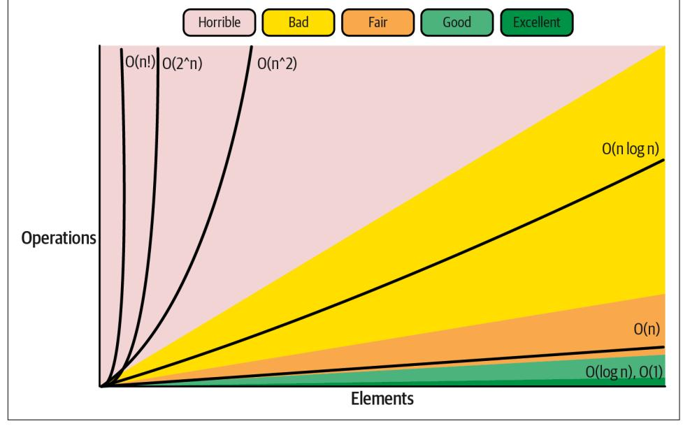

<span id="page-258-0"></span>
# Chapter 7: Data-Driven Efficiency Assessment

You learned how to observe our Go program using different observability signals in the previous chapter. We discussed how to transform those signals to numeric values, or metrics, to effectively observe and assess the latency and resource consumption of the program.

Unfortunately, knowing how to measure the current or maximum consumption or latency for running a program does not guarantee the correct assessment of the over‐ all program efficiency for our application. What we are missing here is the experi‐ ment part, which might be the most challenging part of optimization generally: how to trigger situations that are worth measuring with the observability tools mentioned in [Chapter 6!](010-chapter-6-efficiency-observability.md#page-212-0)


## The Definition of Measuring

I find the verb "to measure" very imprecise. I have seen this word overused to describe two things: the process of performing an experiment and gathering numeric data from it.

In this book, every time you read about the "measuring" process, I follow the definition used in [metrology \(the science of measure‐](https://oreil.ly/5PRMp) [ment\)](https://oreil.ly/5PRMp). I precisely mean the process of using the instruments to quantify what is happening now (e.g., the latency of the event, or how much memory it required) or what happened in a given time window. Everything that leads to this event that we measure (simu‐ lated by us in a benchmark or occurring naturally) is a separate topic, discussed in this chapter.

In this chapter, I will introduce you to the art of experimentation and measurement for efficiency purposes. I will mainly focus on data-driven assessment, more com‐ monly known as benchmarking. This chapter will help you understand the best <span id="page-259-0"></span>practices before we jump to writing benchmarking code in [Chapter 8.](012-chapter-8-benchmarking-versus-stress-and-load-tests.md#page-294-0) These practices will also be invaluable in [Chapter 9](013-chapter-9-data-driven-bottleneck-analysis.md#page-348-0), which focuses on profiling.

I start with complexity analysis as a less empirical way of assessing the efficiency of our solutions. Then, I will explain benchmarking in ["The Art of Benchmarking" on](#page-269-0) [page 250](#page-269-0). We will compare it to functional testing and clarify the common stereotype that claims "benchmarks always lie."

Later in ["Reliability of Experiments" on page 256,](012-chapter-8-benchmarking-versus-stress-and-load-tests.md#page-275-0) we will move to the reliability aspect of our experiments for both benchmarking and profiling purposes. I will provide the ground rules to avoid wasting time (or money) by gathering bad data and making wrong conclusions.

Finally, in ["Benchmarking Levels" on page 266,](012-chapter-8-benchmarking-versus-stress-and-load-tests.md#page-285-0) I will introduce you to the full land‐ scape of benchmark strategies. In the previous chapters, I already used benchmarks to provide data that explained the behavior of CPU or memory resources. For exam‐ ple, in ["Consistent Tooling" on page 45,](006-chapter-2-efficient-introduction-to-go.md#page-64-0) I mentioned that the Go tooling provides a standard benchmarking framework. But the benchmarking skill I want to teach you in this chapter goes beyond that, and it is just one tool of many discussed in ["Microbenchmarks" on page 275](012-chapter-8-benchmarking-versus-stress-and-load-tests.md#page-294-0). There are many different ways of assessing the effi‐ ciency of our Go code. Knowing when to use what is key.

Let's start by introducing the benchmarking tests and what the critical aspects of those are.

### Complexity Analysis

We don't always have the luxury of having empirical data that guides us through the efficiency of a certain solution. Your idea of a better system or algorithm might not be implemented yet and would require a lot of effort to do so before we could bench‐ mark it. Additionally, I mentioned the need for complexity estimation in ["Example of](007-chapter-3-conquering-efficiency.md#page-109-0) [Defining RAER" on page 90.](007-chapter-3-conquering-efficiency.md#page-109-0)

This might feel contradictory to what we learned in ["Optimization Challenges"](007-chapter-3-conquering-efficiency.md#page-98-0) on [page 79](007-chapter-3-conquering-efficiency.md#page-98-0) ("programmers are notoriously bad at estimating exact resource consump‐ tion"), but sometimes engineers rely on theoretical analysis to assess the program. One example is when we assess optimizations on the algorithm level (from ["Optimi‐](007-chapter-3-conquering-efficiency.md#page-117-0) [zation Design Levels" on page 98](007-chapter-3-conquering-efficiency.md#page-117-0)). Developers and scientists often use complexity analysis to compare and decide what algorithm might fit better to solve certain prob‐ lems with certain constraints. More specifically, they use asymptotic notations (com‐ monly known as "Big O" complexities). Most likely, you have heard about them, as they are commonly asked about during any software engineering interview.

However, to fully understand asymptotic notations, you must know what "estimated" efficiency complexity means and what it looks like!

<span id="page-260-0"></span>
### "Estimated" Efficiency Complexity

I mentioned in ["Resource-Aware Efficiency Requirements" on page 86](007-chapter-3-conquering-efficiency.md#page-105-0) that we can represent the CPU time or consumption of any resources as a mathematical function related to specific input parameters. Typically, we talk about *runtime* complexity, which tells us about the CPU time required to perform a certain operation using a particular piece of code and environment. However, we also have *space* complexity, which can describe the required memory, disk space, or other space requirements for that operation.

For example, let's take our Sum function from [Example 4-1](008-chapter-4-how-go-uses-the-cpu-resource-or-two.md#page-134-0). I can prove that such code has estimated space complexity (representing heap allocations) of the following function, where *N* is a number of integers in the input file:

$$space(N) = (848 + 3.6 * N) + (24 + 24 * N) + (2.8 * N)$$
 by  $tes = 872 + 30.4 * N$  by  $tes$ 

Knowing detailed complexity is great, but typically it's impossible or hard to find the true complexity function because there are too many variables. We can, however, try to estimate those, especially for more deterministic resources like memory allocation, by simplifying the variables. For example, the preceding equation is only an estima‐ tion with a simplified function that takes only one parameter—the number of inte‐ gers. Of course, this code also depends on the size of integers, but I assumed the integer is ~3.6 bytes long (statistic from my test input).


#### "Estimated" Complexity

As I try to teach you in this book—be precise with the wording.

I was so wrong for all those years, thinking that complexity always means Big O asymptotic complexity. Turns out [the complexity](https://oreil.ly/LG5qb) [exists too](https://oreil.ly/LG5qb) and can be very useful in some cases. At least we should be aware it exists!

Unfortunately, it's easy to confuse it with asymptotic complexity, so I would propose calling the one that cares about constants—the "estimated" complexity.

How did I find this complexity equation? It wasn't trivial. I had to analyze the source code, do some stack escape analysis, run multiple benchmarks, and use profiling (so all the things you will learn in this and the next two chapters) to discover those complexities.

<span id="page-261-0"></span>
#### This Is Just an Example!

Don't worry. To assess or optimize your code, you don't need to perform such detailed complexity analysis, especially in such detail. I did this to show it's possible and what it gives, but there are more pragmatic ways to assess efficiency quickly and find out the next optimizations. You will see example flows in [Chapter 10](014-chapter-10-optimization-examples.md#page-400-0).

Funny enough, at the end of the TFBO flow, when you optimized one part of your program a lot, you might have a detailed aware‐ ness of the problem space so that you could find such complexity quickly. However, doing this for every version of your code would be wasteful.

It might be useful to explain the process of gathering the complexity and mapping it to the source code, as shown in Example 7-1.

*Example 7-1. Complexity analysis of [Example 4-1](008-chapter-4-how-go-uses-the-cpu-resource-or-two.md#page-134-0)*

```
func Sum(fileName string) (ret int64, _ error) {
 b, err := os.ReadFile(fileName)
 if err != nil {
 return 0, err
 }
 for _, line := range bytes.Split(b, []byte("\n")) {
 num, err := strconv.ParseInt(string(line), 10, 64)
 if err != nil {
 return 0, err
 }
 ret += num
 }
 return ret, nil
}
```

We can attach the 848 + 3.6 \* *N* part of the complexity equation to the operation of reading the file content into memory. The test input I used is very stable—the integers have a different number of digits, but on average they have 2.6 digits. Adding a new line (\n) character means every line has approximately 3.6 bytes. Since ReadFile returns a byte array with the content of the input file, we can say that our program requires exactly 3.6 \* *N* bytes for the byte array pointed to by the b slice. The constant amount of 848 bytes comes from various objects alloca‐ ted on the heap in the os.ReadFile function—for example, the slice value for b (24 bytes), which escaped the stack. To discover that constant, it was enough to benchmark with an empty file and profile it.

- <span id="page-262-0"></span>As you will learn in [Chapter 10,](014-chapter-10-optimization-examples.md#page-400-0) the bytes.Split is quite expensive when it comes to both allocations and runtime latency. However, we can attribute most of the allocations to this part, so to the 24 + 24 \* *N* complexity part. It's the "majority" because it's the largest constant (24) multiplied by the input size. The reason is the allocation needed to return the [\[\]\[\]byte](https://oreil.ly/Be0OF) data structure. While we don't copy the underlying byte arrays (we share it with the buffer from os.Read File), the *N* allocated empty []byte slices require 24 \* *N* of the heap in total, plus the 24 for the [][]byte slice header. This is a huge allocation if *N* is on the order of billions (22 GB for a billion integers).
- Finally, as we learned in ["Values, Pointers, and Memory Blocks" on page 176](009-chapter-5-how-go-uses-memory-resource.md#page-195-0) and as we will uncover in ["Optimizing runtime.slicebytetostring" on page 389](014-chapter-10-optimization-examples.md#page-408-0), we allo‐ cate on this line a lot too. It's not visible at first, but the memory required for string(line) (which is always a copy) is escaping to heap.<sup>1</sup> This attributes to the 2.8 \* *N* part of the complexity because we do this conversion N times for 2.6 dig‐ its on average. The source of the remaining 0.2 \* *N* is unknown.<sup>2</sup>

I hope that with this analysis, you see what complexity means. Perhaps you already see how useful it is to know. Maybe you already see many optimization opportunities, which we will try in [Chapter 10!](014-chapter-10-optimization-examples.md#page-400-0)

### Asymptotic Complexity with Big O Notation

The asymptotic complexity ignores the overheads of the implementation, particularly hardware or environment. Instead, it focuses on [asymptotic mathematical analysis:](https://oreil.ly/MR0Jz) how fast runtime or space demands grow in relation to the input size. This allows algorithm classifications based on their scalability, which usually matters for the researchers who search for algorithms solving complex problems (which usually require enormous inputs). For example, in [Figure 7-1](#page-263-0), we see a small overview of typ‐ ical functions and an opinionated assessment of what's typically bad and what's good complexity for the algorithm. Note that "bad" complexity here doesn't mean there are algorithms that do better—there are some problems that can't be done in a faster way.

<sup>1</sup> This is fixed for this particular ParseInt function in Go 1.20 thanks to an amazing [improvement,](https://oreil.ly/KLIVM) but you might be surprised by it in any other function!

<sup>2</sup> It only shows up when we do lots of string copies in our programs. Perhaps it comes from some internal byte pools?

<span id="page-263-0"></span>

*Figure 7-1. Big O complexity chart from<https://www.bigocheatsheet.com>. Shading indicates the opinionated rates of efficiency for usual problems.*

We usually use Big O notation to represent asymptotic complexity. To my knowl‐ edge, it was Donald Knuth who attempted to clearly define three notations (O, Ω, Θ)<sup>3</sup> in [his article from 1976.](https://oreil.ly/yeFpW)

Verbally, O(f(n)) can be read as "order at most f(n)"; Ω(f(n)) as "order at least f(n)"; Θ(f(n)) as "order exactly f(n)".

—Donald Knuth, ["Big Omicron and Big Omega and Big Theta"](https://oreil.ly/yeFpW)

The phrase "in order of f(*N*)" means that we are not interested in the exact complex‐ ity numbers but rather the approximation:

*The upper bound (O)*

Big Oh means the function can't be asymptotically worse than f(n). It is also sometimes used to reflect the worst-case scenario if other input characteristics matter (e.g., in a sorting problem, we usually talk about a number of elements, but sometimes it matters if the input is already sorted).

<sup>3</sup> Those "O-notations" are respectively called Big O or Oh, Omega, and Theta. He also defines "o-notations" (o, ω), which [means strict upper or lower bound](https://oreil.ly/S44PO), so "this function grows slower than f(N), but not exactly f(N)." In practice, we don't use o-notations very often.

<span id="page-264-0"></span>*The tight bound (Θ)*

Big Theta represents the exact asymptotic function or, sometimes, the average, typical case.

*The lower bound (Ω)*

Big Omega means the function can't be asymptotically better than f(n). It also sometimes represents the best case.

For example, the [quicksort](https://oreil.ly/a2jhF) sorting algorithm has the best and average runtime com‐ plexity (depending on how input is sorted and where we choose the pivot point) of the *N* \* log*N*, so *Ω*(*N* \* log*N*) and *Θ*(*N* \* log*N*), even though the worst case is *O*(*N*<sup>2</sup> ).


#### The Industry Is Not Always Using Big O Notation Properly

Generally, during interviews, discussions, and tutorials, you would see people using Big Oh (*O*) where Big Theta (*Θ*) should be used to describe a typical case. For example, we often say quicksort is *O*(*N* \* log*N*), which is not true, but in many instances we would accept that answer. Perhaps people try to make this space more accessible by simplifying this topic. I will try to be more precise here, but you can always swap *Θ* with *O* (but not in the opposite direction).

For our algorithm in [Example 4-1](008-chapter-4-how-go-uses-the-cpu-resource-or-two.md#page-134-0), the asymptotic space complexity is linear:

$$space(N) = 872 + 30.4 * N \ bytes = \Theta(1) + \Theta(N) \ bytes = \Theta(N) \ bytes$$

In asymptotic analysis, constants like 1, 872, and 30.2 do not matter, even though in practice, it might matter if our code allocates 1 MB (*Θ*(*N*)) or 30.4 MB.

Note that we don't need precise complexity to figure out the asymptotic one. That's the point: precise complexity depends on too many variables, especially when it comes to runtime complexity. Generally, we can learn to find the theoretical asymp‐ totic complexity based on algorithm pseudocode or description. It takes some prac‐ tice, but imagine we don't have [Example 7-1](#page-261-0) implemented; instead, we design an algorithm. For example, the naive algorithm for the sum of all integers in the file can be described as follows:

- 1. We read the file's content into memory, which has *Θ*(*N*) of asymptotic space complexity, where *N* is the number of integers or lines. As we read N lines, this also has *Θ*(*N*) runtime complexity.
- 2. We split the content into subslices. If we do it in place, this means *Θ*(*N*). Other‐ wise, in theory, it is *Θ*(1). This is an interesting one, as we saw in precise complexity that despite doing this in place, the overhead is 24 \* *N*, which sug‐

<span id="page-265-0"></span>gests *Θ*(*N*). In both cases, the runtime complexity is *Θ*(*N*), as we have to go through all lines.

- 3. For every subslice (space complexity *Θ*(1) and runtime *Θ*(*N*)):
  - a. We parse the integer. Technically this needs no extra space on the heap, assuming the integers can be kept on the stack. The runtime of this should also be *Θ*(1) if we relate to the number of lines and the number of digits is limited.
  - b. We add the parsed value into a temporary variable containing a partial sum: *Θ*(1) runtime and *Θ*(1) space.

With such analysis, we can tell that the space complexity is *Θ*(*N*) + *Θ*(1) + *Θ*(*N*) \* *Θ*(1), so *Θ*(*N*). I also mentioned runtime complexity in step 2, which combines into *Θ*(*N*) + *Θ*(*N*) + *Θ*(*N*) \* *Θ*(1), so also linear *Θ*(*N*).

Generally, such a Sum algorithm is fairly easy to assess asymptotically, but this is not trivial in many cases. It takes some practice and experience. I would love it if some automatic tools detected such complexity. There were interesting [attempts](https://oreil.ly/0h9ff) in the past, but in practice, they are too expensive.<sup>4</sup> Perhaps there is a way to implement some algorithm that assesses pseudocode for its complexity, but it's our job now!

### Practical Applications

Frankly speaking, I was always skeptical about the "complexity" topic. Perhaps I missed the lectures about it at my university,<sup>5</sup> but I was always disappointed when somebody asked me to determine the complexity of some algorithm. I was convinced that it is only used to trick candidates during technical interviews and has almost no use in practical software development.

The first problem was imprecision—when people asked me to determine complexity, they meant asymptotic complexity in Big O notation. Furthermore, what's the point of Big O if, during paid work, I could usually search an element in the array with the linear algorithm instead of a hashmap, and still the code would be fast enough in most cases? Moreover, more experienced developers were rejecting my merge requests because my fancy linked list with better insertion complexity could be just a simpler array with appends. Finally, I was learning about all those fast algorithms

<sup>4</sup> I would categorize them as "brute force"—they do many benchmarks with different inputs and try to approxi‐ mate the growth function.

<sup>5</sup> I wouldn't be surprised—I had a full-time job in IT from the second year of my computer science studies.

<span id="page-266-0"></span>with incredible asymptotic complexity that are not used in practice because of hidden constant costs or other caveats.<sup>6</sup>

I think most of my frustration came from misunderstandings and misuses stemming from the industry's stereotypes and simplifications. I am especially surprised that [not](https://oreil.ly/1yxqH) [a few engineers](https://oreil.ly/1yxqH) are willing to perform such "estimated" complexity. Perhaps we often feel demotivated or overwhelmed by how hard it is to estimate beyond asymptotic complexity. For me, reading old programming books was eye-opening—some of them use both complexities in most of their optimization examples!

The main for loop of the program is executed N-1 times, and contains an inner loop that is itself executed N times; the total time required by the program will therefore be dominated by a term proportional to N^2. The Pascal running time of Fragment A1 was observed to by approximately 47.0N^2 microseconds.

—Jon Louis Bentley, *Writing Efficient Programs*

When you try to assess or optimize algorithm and code that requires better efficiency, being aware of its estimated complexity and asymptotic complexity has a real value. Let's go through some use cases.

#### If you know precise complexity, you don't need to measure to know expected resource requirements

In practice, we rarely have precise complexity from the start, but imagine someone giving us such complexity. This gives an enormous win for tasks like capacity plan‐ ning, where you need to find out the cost of running your system under various loads (e.g., different inputs).

For example, how much memory does the naive implementation of Sum use in [Example 7-1?](#page-261-0) It turns out that without any benchmark, I could use the space com‐ plexity of 872 + 30.4 \* *N* bytes to tell that for various input sizes, for example:

- For 1 million integers, my code would need 30,400,872 bytes, so 30.4 MB if we use the [1,000 multiplier, not the 1,024.](https://oreil.ly/SYcm8) 7
- For 2 million integers, it would need 60.8 MB.

<sup>6</sup> For example, quicksort has worse complexity than other algorithms, yet on average it is the fastest. Or the matrix multiplication algorithm like [Coppersmith-Winograd](https://oreil.ly/q9jhn) has a big constant coefficient hidden by the Big O notation, which makes it only worth doing for matrices that are too big for our modern computers.

<sup>7</sup> Be careful: different tools use different conversions; e.g., pprof uses the 1,024 multiplier, and the benchstat uses the 1,000 multiplier.

<span id="page-267-0"></span>This can be confirmed if we would perform a quick microbenchmark (don't worry, I will explain how to perform benchmarks here and in [Chapter 8\)](012-chapter-8-benchmarking-versus-stress-and-load-tests.md#page-294-0). Results are presen‐ ted in Example 7-2.

*Example 7-2. Benchmark allocation result for [Example 4-1](008-chapter-4-how-go-uses-the-cpu-resource-or-two.md#page-134-0) with one million elements and two million elements input, respectively*

name (alloc/op) Sum1M Sum2M Sum 30.4MB ± 0% 60.8MB ± 0% name (alloc/op) Sum1M Sum2M Sum 800k ± 0% 1600k ± 0%

Based on just those two results, our space complexity is fairly accurate.<sup>8</sup>


It's unlikely you can always find the full, accurate, real complexity. However, usually it's enough to have a very high-level estimation of this complexity, e.g., 30 \* *N* bytes would be detailed enough space complexity for our Sum function in [Example 7-1](#page-261-0).

#### It tells us if there is any easy optimization to our code

Sometimes we don't need detailed empirical data to know we have efficiency prob‐ lems.<sup>9</sup> This is great because such techniques can tell us how easy it is to optimize our program further. Such a quick efficiency assessment is something I would love you to know before we move into heavy benchmarking.

For example, when I wrote the naive implementation of the Sum in [Example 4-1](008-chapter-4-how-go-uses-the-cpu-resource-or-two.md#page-134-0), I expected to write an algorithm with *Θ*(*N*) space (asymptotic) complexity. However, I expected it to have around 3.5 \* *N* of the real complexity because I read the whole file content to memory. Only when I ran benchmarks that gave me output like Example 7-2 did I realize how poor my naive implementation was, with almost 10 times more memory usage than expected (30.5 MB). This expected estimation of the real complexity versus the resulting one is typically a good indication that there might be some trivial optimization if we have to improve the efficiency.

Secondly, if my algorithm space Big O complexity is linear, it is already a bad sign for such simple functionality. My algorithm will use an extreme amount of memory for

<sup>8</sup> I was very surprised that we can construct such accurate space complexity and have such accurate memory benchmarking and profiling up to every byte on the heap. Kudos to the Go community and pprof commu‐ nity for that hard work!

<sup>9</sup> This does not mean we should immediately fix those! Instead, always optimize if you know the problem will affect your goals, e.g., user satisfaction or RAER requirements.

<span id="page-268-0"></span>huge inputs. Depending on requirements, that might be fine or it might mean real issues if we want to scale this application.<sup>10</sup> If not a problem right now, the maximum expected input size should be acknowledged and documented as it might be a sur‐ prise to somebody who will be using this function in the future!

Finally, suppose the measurements are totally off the expected complexity of the algo‐ rithm. In that case, it might signal a [memory leak,](https://oreil.ly/ZNB5s) which is often easy to fix if you have the right tools (as we will discuss in ["Don't Leak Resources" on page 426](015-chapter-11-optimization-patterns.md#page-445-0)).


#### Three Clear Indications We Are Wasting Memory Space

- The difference between the theoretical space complexity (asymptotic and estimated) and the reality measured with a benchmark can immediately tell you if something is not as expected.
- Significant space complexity depending on the user (or caller) input is a bad sign that might mean future scalability problems.
- If, with time, the total memory used by the program con‐ stantly grows and never goes down, it most likely indicates a memory leak.

#### It helps us assess ideas for a better algorithm as an optimization

Another amazing use case for complexities is quickly assessing algorithmic optimiza‐ tions without implementing them. For our Sum example, we don't need extreme algo‐ rithmic skills to know that we don't need to buffer the whole file in memory. If we want to save memory, we should be able to have a small buffer for parsing purposes. Let's describe an improved algorithm:

- 1. We open the input file without reading anything.
- 2. We create a 4 KB buffer, so we need at least 4 KB of memory, which is still a con‐ stant amount (*Θ*(1)).
- 3. We read the file in 4 KB chunks. For every chunk:
  - a. We parse the number.
  - b. We add it to a temporary partial sum.

Such an improved algorithm, in theory, should give us the space complexity of ~4 KB, so *O*(1). As a result, our [Example 4-1](008-chapter-4-how-go-uses-the-cpu-resource-or-two.md#page-134-0) could use 7,800 times less space for 1

<sup>10</sup> Sometimes, there are relatively easy ways to change our code to stream and use [external memory](https://oreil.ly/p6YDD) algorithms that ensure stable memory usage.

<span id="page-269-0"></span>million integers! So we can tell without implementation that such optimization on an algorithmic level would be very beneficial, and you will see it in action in ["Optimiz‐](014-chapter-10-optimization-examples.md#page-414-0) [ing Memory Usage" on page 395](014-chapter-10-optimization-examples.md#page-414-0).

Doing such complexity analysis can quickly assess your ideas for improvement without needing the full TFBO loop!


#### Worse Is Sometimes Better!

If we decide to implement the algorithm with better asymptotic or theoretical complexity, don't forget to assess it at the code level using benchmarks! When designing an algorithm, we often opti‐ mize for asymptotic complexity, but when we write code, we opti‐ mize the constants of that asymptotic complexity.

Without good measurements, you might implement a good algo‐ rithm in terms of Big O complexity, but with the inefficient code, make efficiency optimizations instead of improvement!

#### It tells us where the bottleneck is and what part of the algorithm is critical

Finally, a quick look at the detailed space complexity, especially when mapped to the source code as in [Example 7-1,](#page-261-0) is a great way to determine the efficiency bottleneck. We can see that the constant 24 is the biggest one, and it comes from the bytes.Split function that we will optimize first in [Chapter 10](014-chapter-10-optimization-examples.md#page-400-0). In practice, however, profiling can yield data-driven results much faster, so we will focus on this method in [Chapter 9.](013-chapter-9-data-driven-bottleneck-analysis.md#page-348-0)

To sum up, the wider knowledge about the complexity and ability to mix basic meas‐ urements with theoretical asymptotic taught me that complexities could be useful. It can be an excellent tool for more theoretical efficiency assessment if used correctly. However, as you can see, the real value is when we mix empirical measurements with theory. With this in mind, let's learn more about benchmarking!

### The Art of Benchmarking

Assessing efficiency is essential in the TFBO flow, represented by step 4 in [Figure 3-5.](007-chapter-3-conquering-efficiency.md#page-122-0) Such evaluation of our code, algorithm, or system is generally a complex problem, achievable in many ways. For example, we discussed assessing efficiency on the algo‐ rithm level through research, static analysis, and Big O notations for runtime complexity.

<span id="page-270-0"></span>We can assess a lot by performing a theoretical analysis and estimating code effi‐ ciency. Still, in many cases, the most reliable way is to get our hands dirty, run some code, and see things in action. As we learned in ["Optimization Challenges"](007-chapter-3-conquering-efficiency.md#page-98-0) on page [79](007-chapter-3-conquering-efficiency.md#page-98-0), we are bad at estimating the resource consumption of our code, so empirical assessments allow us to reduce the number of guesses in our evaluations.<sup>11</sup> Ideally, we assume nothing and verify the efficiency using special testing processes that test effi‐ ciency instead of correctness. We call those tests *benchmarks*.


