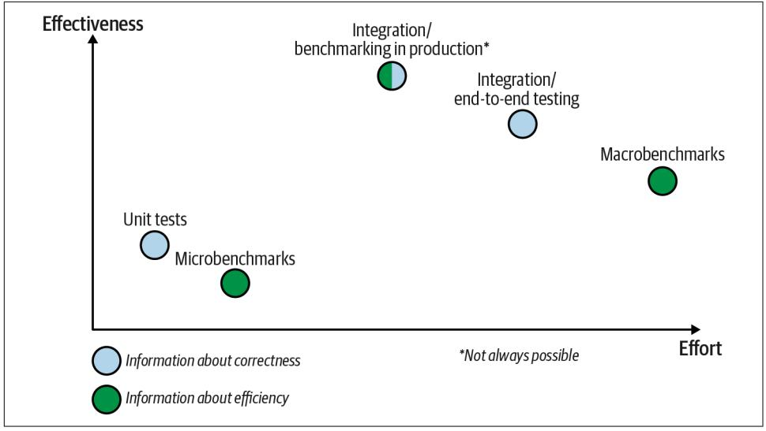
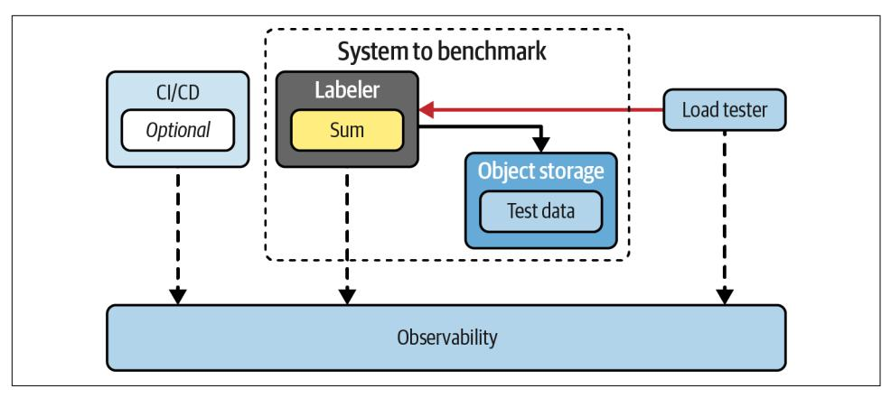
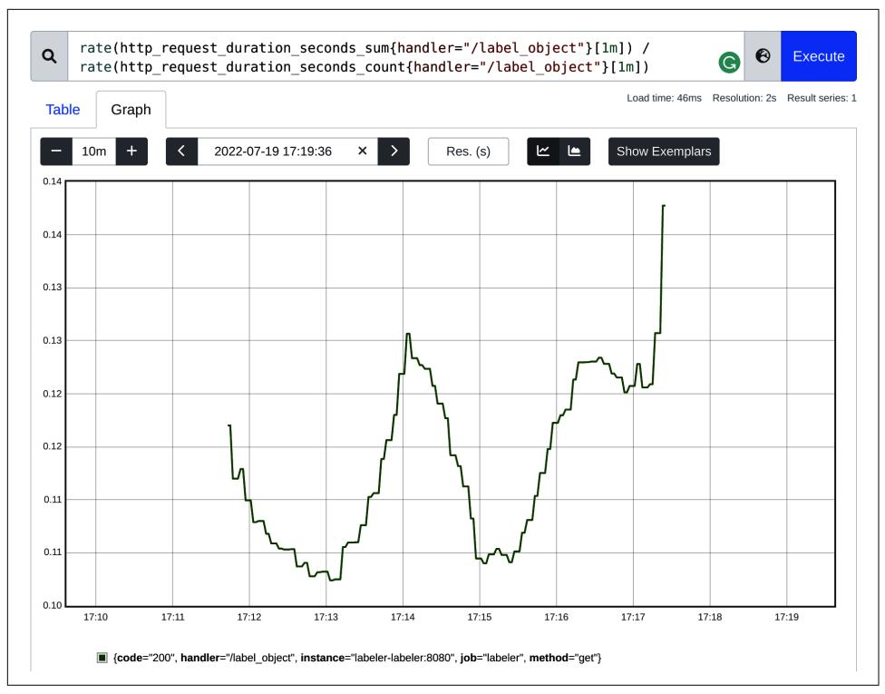
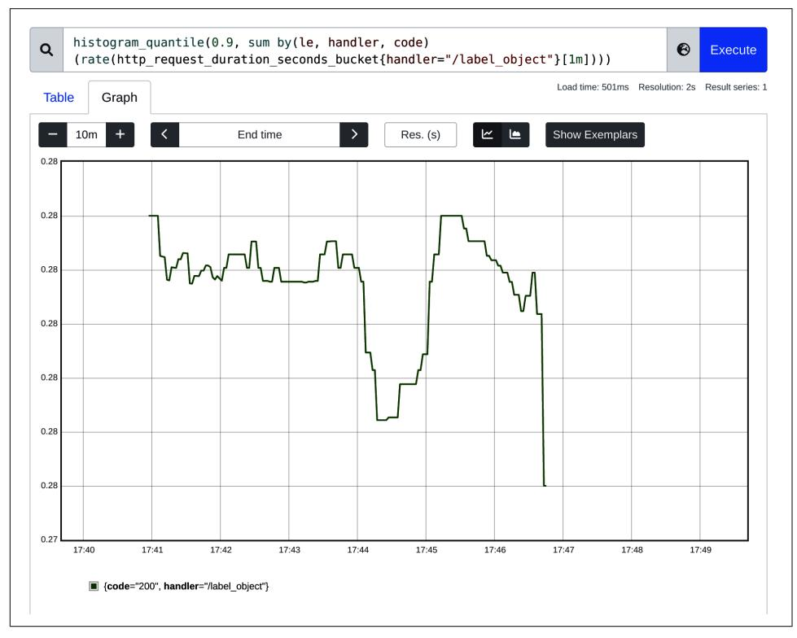
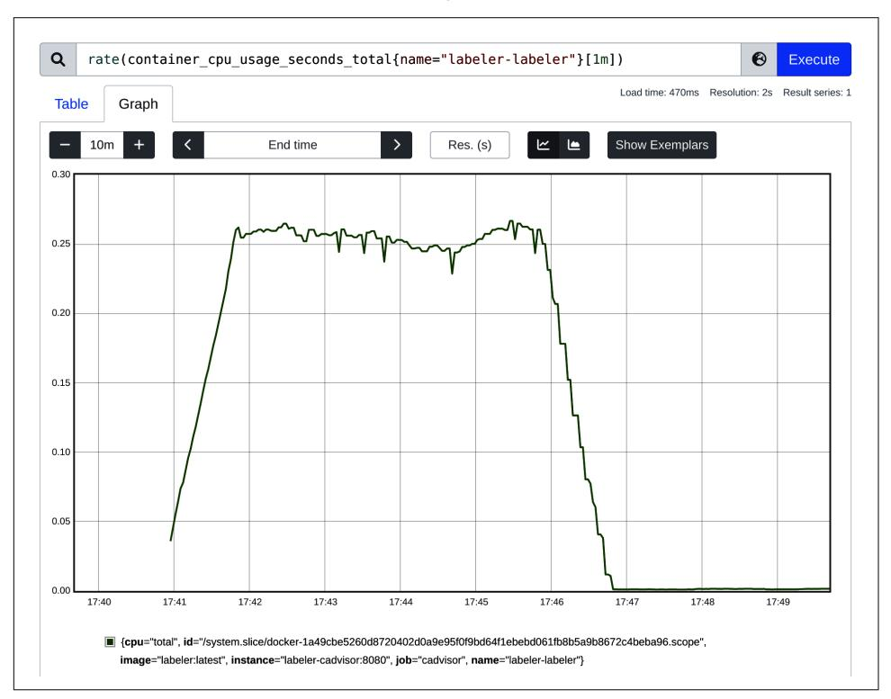
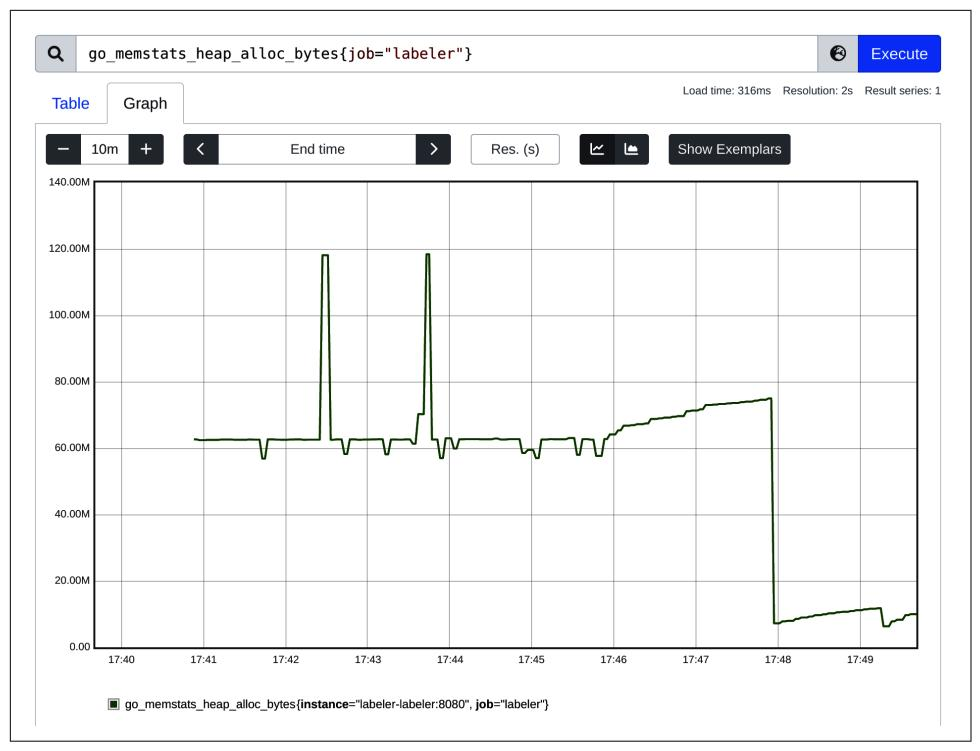
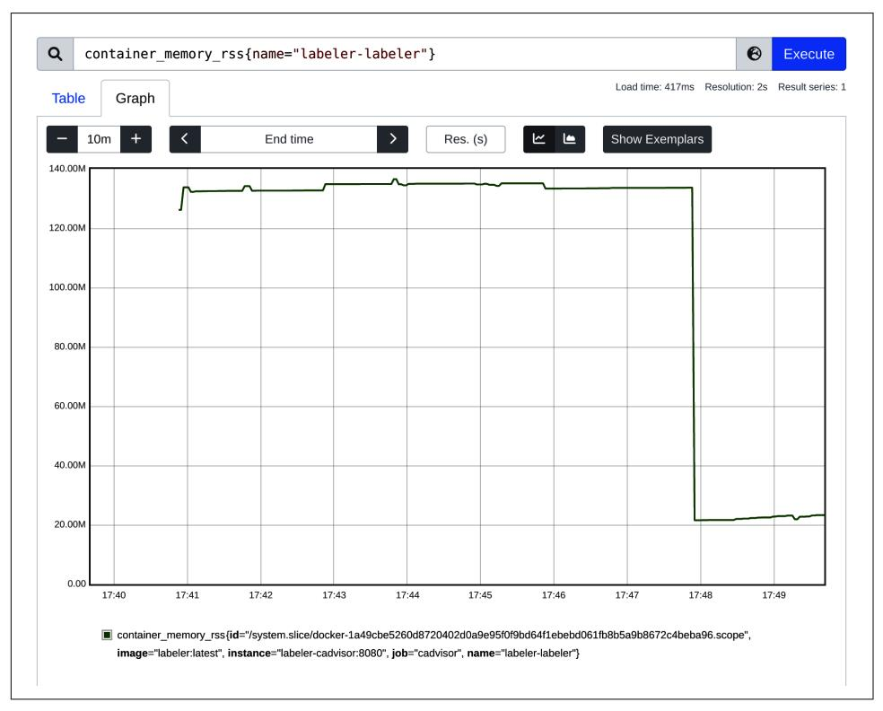

# Chapter 8: Benchmarking Versus Stress and Load Tests

There are many alternative names for benchmarking, such as stress tests, performance tests, and load tests. However, since they gener‐ ally mean the same, for consistency, I will use benchmarking in this book.

Generally, benchmarking is an effective efficiency assessment method for our soft‐ ware or systems. In abstract, the process of benchmarking is composed of four core parts, which we describe logically as a simple function:

*Benchmark* = *N* \* (*Experiment* + *Measurements*) + *Comparison*

At the core of any benchmarking, we have the experimentations and measurements cycle:

## Experiment

The act of simulating a specific functionality of our software to learn about its efficiency behavior. We can scope that experiment to a single Go function or Go structure or even complex, distributed systems. For example, if your team devel‐ ops the web server, it might mean starting a web server and performing a single HTTP request with realistic data that the user would use.

### Measurement

In [Chapter 6](010-chapter-6-efficiency-observability.md#page-212-0), we discussed getting accurate measurements for latency and the consumption of various resources. It's vital to reliably observe our software dur‐ ing the entire experiment to make meaningful conclusions when it ends. For our web server example, this might mean measuring the latency of the operations on various levels (e.g., client and server latencies), as well as the memory consump‐ tion of our web server.

<sup>11</sup> Unfortunately, we still have to guess a little bit—more on that in ["Reliability of Experiments" on page 256](#page-275-0). Nothing will get us 100% assurance. Yet benchmarking is probably the best we have as developers for ensur‐ ing the software we develop is efficient enough.

<span id="page-271-0"></span>Now the unique part of our benchmarking process is that the experiment and meas‐ urements cycle has to be performed *N* times with the comparison phase at the end:

#### The number of test iterations (N)

*N* is the number of test iterations we must perform to build enough confidence in the results. The exact number of runs depends on many factors, which we will discuss in ["Reliability of Experiments" on page 256.](#page-275-0) Generally, the more iterations we do, the better. In many cases, we have to balance between higher confidence and cost or wait time of a too large number of iterations.

#### Comparison

Finally, in the benchmarking definition, we have [the comparison aspect](https://oreil.ly/kzNR3), which allows us to learn what's improving the efficiency of our software, what's hinder‐ ing it, and how far we are from the expectations (RAER).

In many ways, you might notice that benchmarking is similar to the testing we do to verify correctness (referred to later as functional testing). As a result, many testing practices apply to benchmarking. Let's look at that next.

### Comparison to Functional Testing

Comparison to something we are familiar with is one of the best ways to learn. So, let's compare benchmarking to functional testing. Is there anything we can reuse in terms of methodology or practices? You will learn in this chapter that we can share many things between functional tests and benchmarking. For example, there are a few similar aspects:

- Best practices for forming test cases (e.g., [edge cases](https://oreil.ly/Sw9qB)), [table-driven testing](https://oreil.ly/Q3bXD), and regression testing
- Splitting tests into [unit, integration, e2e](https://oreil.ly/tvaMk), and testing in production (more on that in ["Benchmarking Levels" on page 266\)](#page-285-0)
- Automation for continuous testing

Unfortunately, we have to also be aware of significant differences. With benchmarks:

*We have to have different [test cases and test data](https://oreil.ly/me3cM).*

It might be tempting, but we cannot reuse the same test data (input parameters, potential fake, test data in a database, etc.) as we used for our unit or integrations tests meant for correctness tests. This is because the goals are different. In cor‐ rectness tests, we tend to focus on different [edge cases](https://oreil.ly/Sw9qB) from a functional perspec‐ tive (e.g., failure modes). Whereas in efficiency tests, the edge cases are usually focused on triggering different efficiency issues (e.g., big requests versus many small requests). We will discuss these in ["Reproducing Production" on page 258](#page-277-0).

<span id="page-272-0"></span>For most systems, though, the programmer should monitor the program on input data that is typical of the data the program will encounter in production. Note that usual test data often does not meet this requirement: while test data is chosen to exercise all parts of the code, profiling [and benchmarking] data should be chosen for its "typicality."

—Jon Louis Bentley, *Writing Efficient Programs*

#### Embrace the performance nondeterminism

Modern software and hardware consist of layers of complex optimizations. This can cause nondeterministic conditions to change while performing our bench‐ marks, which might mean that the results will also be nondeterministic. We will expand on this in ["Reliability of Experiments" on page 256](#page-275-0), but this is why we usually repeat test iteration cycles hundreds if not thousands of times (our *N* component) to increase confidence in our observations. The main goal here is to figure out how repeatable our benchmark is. If the variance is too high, we know we cannot trust the results and must mitigate the variance. This is why we rely on statistics in our benchmarks, which helps a lot, but also makes it easy to mislead others and ourselves.

Repeatability: Ensuring that the same operations are benchmarked on all configu‐ rations and that metrics are repeatable over many test runs. Rule of thumb is a variation of up to 5% is generally acceptable.

—Bob Cramblitt, ["Lies, Damned Lies, and Benchmarks: What Makes a Good](https://oreil.ly/ghvJ7) [Performance Metric"](https://oreil.ly/ghvJ7)

#### It is more expensive to write and run

As you can imagine, the number of iterations we have to perform increases the running cost and complexity of performing the benchmark, both the compute cost and developer time spent on creating those and waiting. But that is not the only additional cost compared to correctness tests. To trigger efficiency prob‐ lems, especially for large systems load tests, we have to exhaust different systems capacities, which means buying a lot of computing power just for the sake of tests.

This is why we have to focus on a pragmatic optimization process where we only care about efficiency where necessary. There are also ways to be smart and avoid full-scale macrobenchmarks by using tactical microbenchmarks of isolated func‐ tions, as discussed in ["Benchmarking Levels" on page 266.](#page-285-0)

#### Expectations are less specific

Correctness tests always end up with some assertions. For example, in Go tests, we check if the result of the functions has the expected value. If not, we use t.Error or t.Fail to indicate the test should fail (or one-liners like [testutil.Ok](https://oreil.ly/ncVhq) or [testutil.Equals](https://oreil.ly/uH1F5)).

<span id="page-273-0"></span>It would be amazing if we could do the same when benchmarking—asserting if the latency and resource consumption are not exceeding the RAER. Unfortu‐ nately, we cannot just do if maxMemoryConsumption < 200 \* 1024 \* 1024 at the end of a microbenchmark. The typical high variance of the results, challenges in isolating the latency and resource consumption to just one functionality we test, and other problems mentioned in ["Reliability of Experiments" on page 256](#page-275-0) make it hard to automate the assertion process. Typically, there has to be human or very complex anomaly detection or assertion software to understand whether the results are acceptable. Hopefully, we will see more tools that make it easier in the future.

To make things harder, we might have a RAER for bigger APIs and functionali‐ ties. But if the RAER says the latency of the whole HTTP request should be lower than the 20s, what does that mean for the single Go function involved in this request (out of thousands)? How much latency should we expect in microbenchmarks used by this function? There is no good answer.


#### We Focus More on Relative Results than Absolute Numbers!

In benchmarks, we usually don't assert absolute values. Instead, we focus on comparing results to some baseline (e.g., the previous benchmark before our code change). This way, we know if we improved or negatively affected the efficiency of a single component without looking at the big picture. This is usually enough on the unit microbenchmarks level.

With the basic concept of benchmarking explained, let's address the elephant in the room in the next section—the stereotype that associates benchmarks with lies. Unfortunately, there are [solid reasons for this relation.](https://oreil.ly/yotxL) Let's unpack this and see how we can tell if we can trust the benchmarks that we or others do.

### Benchmarks Lie

There is an extension to a [famous phrase](https://oreil.ly/xULP5) that states that we can order the following words from the best to worst: "lies, damn lies, and benchmarks."

This interest in performance has not gone unnoticed by the computer vendors. Just about every vendor promotes their product as being faster or having better "bang for the buck." All of this performance marketing begs the question: "How can these com‐ petitors all be the fastest?" The truth is that computer performance is a complex phe‐ nomenon, and who is fastest all depends upon the particular simplifications being employed to present a particular simplistic conclusion.

—Alexander Carlton, ["Lies, Damn Lies, and Benchmarks"](https://oreil.ly/WClsq)

<span id="page-274-0"></span>Cheating in benchmarks is indeed widespread. The efficiency results through bench‐ marks have significant importance in a competitive market. Users have too many choices to make, so simplifying the comparison to a simple question, "which is the fastest solution?" or "which one is the most scalable?" is common among decisionmakers. As a result, benchmarking became [a gamification system that is cheated on.](https://oreil.ly/4NAVh) The fact that efficiency assessment is very complex to get right and expensive to reproduce makes it easy to get away with a misleading conclusion. There are many examples of companies, vendors, and individuals lying in benchmarks.<sup>12</sup> However, it is essential to highlight that not all cases are done intentionally or with malicious intent. For better or worse, in most cases, the author did not purposely report mis‐ leading results. It's only natural to get tricked by [statistical fallacies](https://oreil.ly/jPxnA) and paradoxes that are counterintuitive to the human brain.


#### Benchmarks Don't Lie; We Just Misinterpret the Results!

There are many ways we can make wrong conclusions from bench‐ marks. If done accidentally, it can have severe consequences—usu‐ ally a big waste of time and money. If done intentionally…well, lies have short legs. :)

We can be misled by benchmarks due to human mistakes, bench‐ marks performed under conditions irrelevant to us and our prob‐ lem, or simply statistical error. The benchmark results themselves don't lie; we might have just measured the wrong thing!

The solution is to be a mindful consumer or developer of those benchmarks, plus learn the basics of data science. We will discuss common mistakes and solutions in ["Reliability of Experiments" on](#page-275-0) [page 256.](#page-275-0)

To overcome some biases that are naturally happening in the benchmarks, industries often come up with some standards and certifications. For example, to ensure fair fuel economy efficiency assessments, [all light-duty vehicles in the US are required to](https://oreil.ly/gKOc2) [have their economy results tested by the US Environmental Protection Agency](https://oreil.ly/gKOc2) [\(EPA\)](https://oreil.ly/gKOc2). Similarly, in Europe, in response to the 40% gap between the fuel economy carmakers' tests and reality, [the EU adopted the Worldwide Harmonized Light-Duty](https://oreil.ly/LPUXj) [Vehicle Test Cycle and Procedure](https://oreil.ly/LPUXj). For hardware and software, many independent organizations design consistent benchmarks for specific requirements. [SPEC](https://oreil.ly/tkV6O) and [Percona HammerDB](https://oreil.ly/ngRKu) are two examples out of many.

<sup>12</sup> For example, [car makers cheating on emission benchmarks](https://oreil.ly/WNF1z) and [phone vendors cheating on hardware bench‐](https://oreil.ly/sf80C) [marks](https://oreil.ly/sf80C) (which sometimes results with a ban from the popular [Geekbench](https://oreil.ly/8M4ey) listing). In the software world, we have a constant battle between various vendors through [unfair benchmarks](https://oreil.ly/RmytC). Whoever creates them is often one of the fastest on the results list.

<span id="page-275-0"></span>To overcome both lies and honest mistakes, we must focus on understanding what factors make benchmarks unreliable and what we can do to improve that quality. It's foundational knowledge explaining many benchmark practices we will discuss in [Chapter 8.](#page-294-0) Let's do that in the next section.

### Reliability of Experiments

The TFBO cycle takes time. No matter on what level we assess and optimize effi‐ ciency, in all cases, it is necessary to spend a nontrivial amount of time on imple‐ menting benchmarks, executing them, interpreting results, finding bottlenecks, and trying new optimizations. It is frustrating if all or part of our efforts are wasted due to unreliable assessments.

As mentioned when explaining benchmarking lies, there are many reasons why benchmarks are prone to misleading us. There are a set of common challenges it's useful to be aware of.


#### The Same Applies to Bottleneck Analysis!

In this chapter, we might be discussing benchmarks, so experi‐ ments mainly allow us to measure our efficiency (latency or resource consumption), but similar reliability concerns can be applied to other experiments or measurements around efficiency. For example, profiling our Go programs to find bottlenecks, dis‐ cussed in [Chapter 9](013-chapter-9-data-driven-bottleneck-analysis.md#page-348-0).

We can outline three common challenges to the reliability of benchmarks: human errors, the relevance of our experiments to the production environment, and the nondeterministic efficiency of modern computers. Let's go through these in the next sections.

### Human Errors

Optimizations and benchmarking routines, as it stands today, involve a lot of manual work from developers. We need to run experiments with different algorithms and code, while caring about reproducing production and performance nondeterminism. Due to the manual nature, this is prone to human error.

It's easy to get lost in what optimizations we already tried, what code you added for debugging purposes, and what is meant to be saved. It is also easy to get confused about what version of code the benchmarking results belong to and what assump‐ tions you already proved wrong.

Many problems with our benchmarks tend to be caused by our sloppiness and lack of organization. Unfortunately, I am guilty of many of those mistakes too! For example, when I thought I was benchmarking optimization X, I discarded it after seeing no sig‐ nificant difference in benchmarking results. Only some hours later did I notice I tested the wrong code, and optimization X was helpful!

Fortunately, there are some ways to reduce those risks:

#### Keep it simple.

Try to iterate with code changes related to efficiency in the smallest iterations possible. If you try to optimize multiple elements of your code simultaneously, it most likely will obfuscate your benchmark results. You might miss that one of those optimizations limits the efficiency of the aspect you are interested in.

Similarly, try to isolate complex parts into smaller separate parts you can opti‐ mize and assess separately (divide and conquer).

#### Know what version of software you are benchmarking.

It might be trivial, but it's worth repeating—use [software versioning!](https://oreil.ly/P0eoP) If you try different optimizations, commit them in separate commits and distribute them across separate branches so you can get back to previous versions if needed. Don't lose your optimization effort by forgetting to commit your work at the end of the day.<sup>13</sup>

This also means you have to be strict about what version of code you just bench‐ marked. Even a small reorder of seemingly unrelated statements might impact your code's efficiency, so always benchmark your programs in atomic iterations. This also includes all dependencies your code needs, for example, those outlined in your *go.mod* file.

#### Know what version of benchmark you are using.

Furthermore, remember to version the code of the benchmark test itself! Avoid comparing results between different benchmark implementations, even if the change was minor (adding an extra check).

Scripting scripts to execute those benchmarks with the same configuration and versioning those is also a great way not to get lost. In [Chapter 8,](#page-294-0) I mention some best practices around declarative ways to share benchmark options for your future self and others on your team.

<sup>13</sup> Some good IDEs also have additional [local history](https://oreil.ly/Ytdi0) if you forgot to commit your changes in your git repository.

<span id="page-277-0"></span>*Keep your work well organized and structured.*

Make notes, design your own consistent workflow, and be explicit in what ver‐ sion of code you experimented with. Track the dependency versions, and track all benchmarking results explicitly in a consistent way. Finally, be clear in com‐ municating your findings with others.

Your code should also be clean during different code attempts. Keep all best practices like [DRY,](https://oreil.ly/S887r) don't keep commented out code, isolate state between tests, etc.

*Be skeptical about "too good to be true" benchmarking results.*

If you can't explain why your code is suddenly quicker or uses fewer resources, you most certainly did something wrong while benchmarking. It is tempting to celebrate, accept it, and move on without double-checking.

Check common issues like if your benchmark test cases trigger errors instead of successful runs (mentioned in ["Test Your Benchmark for Correctness!" on page](#page-309-0) [290](#page-309-0)), or perhaps the compiler optimized your microbenchmark away (discussed in ["Compiler Optimizations Versus Benchmark" on page 301](#page-320-0)).

A little bit of laziness in our work is healthy.<sup>14</sup> However, laziness at the wrong moment might significantly increase the number of unknowns and risks to the already difficult subject of program efficiency optimizations.

Now let's look at the second key element of reliable benchmarks, relevance.

### Reproducing Production

It might be obvious, but we don't optimize software so it can run faster or consume fewer resources on our development machine.<sup>15</sup> We optimize to ensure the software has efficient enough execution for the target destinations that matter for our busi‐ ness, so-called *production*.

Production might mean a production server environment you deploy if you build a backend application, or a customer device like a PC, laptop, or smartphone if you build an end-user application. Therefore, we can significantly improve the quality of our efficiency assessment for all benchmarks by enhancing their relevance. We can do that by trying our best to simulate (reproduce) situations and environmental con‐ ditions of production. Particularly:

<sup>14</sup> [Laziness is actually good](https://oreil.ly/u8IDm) for engineers! But it has to be pragmatic, productive, and reasonable laziness toward the efficiency of our work, not purely based on our emotions in the given moment.

<sup>15</sup> Unless we write software for fellow developers that runs on similar hardware.

#### Production conditions

The characteristics of a production environment. For example, how much RAM and what kind of CPU the production machines will have dedicated for our pro‐ gram. What OS version does it have? What versions and kinds of dependencies will our program use?

#### Production workload

The data our program will work with and the behavior of the user traffic it has to handle.

Perhaps the first thing we should do is to gather requirements around the software target destination, ideally in written form in our RAER. Without it, we can't correctly assess the efficiency of our software. Similarly, if you see benchmarks done by a ven‐ dor or independent entity, you should check if the benchmark conditions match your production and requirements. Typically, they don't, and to fully trust it, we should try to reproduce such a benchmark on our side.

Assuming we roughly know what the target production for our software looks like, we might start designing our benchmark flow, test data, and cases. The bad news is that it's impossible to fully reproduce every aspect of production in our development or testing environment. There will always be differences and unknowns. There are many reasons why production will be different:

- Even if we run the same kind and version of the OS as production, it is impossi‐ ble to reproduce the dynamic state of the OS, which impacts efficiency. In fact, we cannot fully reproduce this state between two runs on the same local machine! This challenge is often called nondeterministic performance, and we will discuss it in ["Performance Nondeterminism" on page 260](#page-279-0).
- It's often too expensive to reproduce all kinds of production workloads that can happen (e.g., forking all production traffic and putting it through testing clusters).
- When developing an end-user application, there are too many permutations of different hardware, dependency software versions, and situations. For example, imagine you create an Android app—tons of smartphone models could poten‐ tially run your software, even if we would limit ourselves to smartphones made in the last two years.

The good news is that we don't need to reproduce all aspects of production. Instead, it's often enough to represent key characteristics of the products that might limit our workloads. We might know about it from the start of development—but with time, experiments, and macrobenchmarks (see ["Macrobenchmarks"](#page-325-0) on page 306), or even production—you will learn what matters.

<span id="page-279-0"></span>For example, imagine you develop Go code responsible for uploading local files to a remote server, and the users notice unacceptable latency when uploading a large file. Based on that, our benchmark to reproduce this should:

- Focus on test cases that involve big files. Don't try to optimize a large number of small files, all different error cases, and potential encryption layers if that doesn't represent what production users are using the most. Instead, be pragmatic and focus with benchmarks on what your goal is now.
- Be mindful that your local benchmarks are not reproducing potential network latencies and behavior you will see in production. A bug in your code might cause resource leaks only in case of a slow network, which might be hard to reproduce on your machine. For these optimizations, it's worth moving with benchmarks to different levels, as explained in ["Benchmarking Levels"](#page-285-0) on [page 266.](#page-285-0)

Simulating the "characteristics" of production does not necessarily mean the same dataset and workload that will exist on production! For our earlier example, you don't need to create 200 GB test files and benchmark your program with them. In many cases, you can start with relatively large files like 5 MB, then 10 MB, and together with complexity analysis, deduce what will happen at the 200 GB level. This will allow you to optimize those cases much faster and cheaper.

Typically it would be too difficult and inefficient to attempt to exactly reproduce a spe‐ cific workload. A benchmark is usually an abstraction of a workload. It is necessary, in this process of abstracting a workload into a benchmark, to capture the essential aspects of the workload and represent them in a way that maps accurately.

—Alexander Carlton, "Lies, Damn Lies, and Benchmarks"

To sum up, when trying to assess the efficiency or reproduce efficiency regressions, be mindful of the differences between your testing setup and production. Not all of them are worth reproducing, but the first step is to know about those differences and how they can impact the reliability of our benchmarks! Let's now look at what else we can do to improve the confidence of our benchmarking experiments.

### Performance Nondeterminism

Perhaps the biggest challenge with efficiency optimizations is the "nondeterministic performance" of modern computers. It means so-called noise, so the variance in our experiment results is because of the high complexity of all layers that impacts the effi‐ ciency we learned about in Chapters [4](008-chapter-4-how-go-uses-the-cpu-resource-or-two.md#page-130-0) and [5](009-chapter-5-how-go-uses-memory-resource.md#page-168-0). As a result, efficiency characteristics are often unpredictable and highly fragile to environmental side effects.

For example, let's consider a single statement in the Go code, an a += 4. No matter what conditions this code is executed in, assuming we are the only user of memory used by the a variable, the result of a += 4 is always deterministic—a value of a plus 4. This is because, in almost all cases, it is hard to impact correctness. You can put the computer in extreme heat or cold, you can shake it, you can schedule millions of simultaneous processes in the OS, and you can use any version of CPU that exists with any supported type of operating system that supports that hardware. Unless you do something extreme like influencing the electric signal in the memory, or you put the computer out of power, that a += 4 operation will always give us the same result.

Now let's imagine we are interested to learn how our a += 4 operation contributes to the latency in the bigger program. At first glance, the latency assessment should be simple—this requires a single CPU instruction (e.g., [ADDQ](https://oreil.ly/Vv83D)) and a single CPU register, so the amortized cost should be as fast as your CPU frequency, so, for example, an average of 0.3 ns for 3 GHz CPU.

In practice, however, overheads are never amortized and never static within a single run, making that statement latency highly nondeterministic. As we learned in [Chap‐](008-chapter-4-how-go-uses-the-cpu-resource-or-two.md#page-130-0) [ter 4](008-chapter-4-how-go-uses-the-cpu-resource-or-two.md#page-130-0), if we don't have the data in the registers, the CPU has to fetch it from L-caches, which might take one nanosecond. If L-caches contain data the CPU needs, our sin‐ gle statement might take 50 ns. Suppose the OS is busy running millions of other pro‐ cesses; our single statement might take milliseconds. Notice that we are talking about a single instruction! On a larger scale, if this noise builds, we can accumulate variance measurable in seconds.

Be mindful. Almost everything can impact the latency of our operations. Busy OS, different versions of hardware elements, and even differences in manufactured CPUs from the same company might mean different latency measurements. Ambient tem‐ perature near a laptop's CPU or battery modes can trigger thermal scaling of our CPU frequency up and down. In extreme cases, even screaming at your computer can impact the efficiency!<sup>16</sup> The more complexity and layers we have when running our programs, the more fragile our efficiency measurements. Similar problems apply to remote devices, personal computers, and public cloud providers (e.g., AWS or Google) that use shared infrastructure with virtualization like containers or virtual machines.<sup>17</sup>

<sup>16</sup> The engineer Brendan Gregg [demonstrated](https://oreil.ly/vI8Rl) how screaming at server hard drive disks severely impacts their I/O latency due to vibrations.

<sup>17</sup> The situation where one workload from a totally different virtual machine impacts our workload is com‐ monly called [a noisy neighbor situation](https://oreil.ly/cLRrD). It is a serious issue that cloud providers continuously fight, with bet‐ ter or worse results depending on the offering and provider.

### Compressible Versus Noncompressible Resources

<span id="page-281-0"></span>All efficiency aspects have some nondeterminism, but some resources are more pre‐ dictive than others. Typically, it is correlated to the categorization known as how compressible resources are. Compression refers to the consequences of the saturation of certain resources (what happens when you don't have enough of the resource).

- The latency and I/O throughput of CPU time, memory or disk access, and net‐ work bandwidth are compressible. So if we have too many processes demanding CPU time, we can slow down execution, but eventually, we will execute all the scheduled work. This means we won't see machines crashing due to CPU satura‐ tion, but it also results in highly dynamic latency results.
- The space and allocation aspect of the resource, like memory or disk space used, is noncompressible on its own. As we learned in [Chapter 5](009-chapter-5-how-go-uses-memory-resource.md#page-168-0), if the program needs more memory space than the OS has, it has to crash the process or the whole sys‐ tem in most cases. There are mitigations like using space of different mediums instead (OS swap) and compressing the data we want to save, but used space can't compress automatically. This might feel like a challenge, but it is beneficial for benchmarking and measurement purposes—behavior is more deterministic.

The fragility of efficiency assessment is so common that we have to expect it in every benchmarking attempt. Therefore, we have to embrace it and embed mitigations to those risks into our tools.

The first thing you might want to do before mitigating nondeterministic perfor‐ mance is to check if this problem impacts your benchmarks. Verify the repeatability of your test by calculating the variance of your results (e.g., using standard deviation). I will explain a good tool for that in ["Understanding the Results" on page 284](#page-303-0), but often you can see it in plain sight.

For example, if you run the experiment once and see it finish in 4.05 seconds, and other runs vary from 3.01 to 6.5 seconds, your efficiency assessment might not be accurate. On the other hand, if the variance is low, you can be more confident about the relevance of your benchmarks. Thus, check the repeatability of your benchmark first.

#### Don't Overuse the Statistics

<span id="page-282-0"></span>

It is tempting to accept high variance and either remove the extreme results (outliers) or take the mean (average) of all your results. You can apply very complex statistics to find some effi‐ ciency numbers with [some probability](https://oreil.ly/594nD). Increasing benchmark runs can also make your average numbers more stable, thus giving you a bit more confidence.

In practice, there are better ways to try first to mitigate stability. Statistics are great where we can't perform a stable measurement, or we can't verify all samples (e.g., we cannot poll all humans on Earth to find out how many smartphones are used). While bench‐ marking, we have more control over stability than we might ini‐ tially think.

There are many best practices we can follow to ensure our efficiency measurements will be more reliable by reducing the potential nondeterministic performance effects:

*Ensure the stable state of the machine you benchmark on.*

For most benchmarks that rely on comparisons, it matters less what conditions we benchmark in as long as they are stable (the state of the machine does not change during or between benchmarks). Unfortunately, three mechanics typi‐ cally get in the way of machine stability:

### Background threads

As you learned in [Chapter 4](008-chapter-4-how-go-uses-the-cpu-resource-or-two.md#page-130-0), it's hard to isolate processes on machines. Even a single, seemingly small process can make your OS and hardware busy enough to change your efficiency measurements. For example, you might be surprised how much memory and CPU time one browser tab or Slack appli‐ cation might use. On public clouds, it's even more hidden as we might see processes impacting us from different virtual OSes we don't own.

#### Thermal scaling

The temperature of high-end CPUs increases significantly under load. The CPUs are designed to sustain relatively hot temperatures like 80–110°C, but there are limits. If the fans cannot cool the hardware fast enough, the OS or the firmware will limit the CPU cycles to avoid component meltdown. Espe‐ cially with remote devices like laptops or smartphones, it's easy to trigger thermal scaling when the ambient temperature is high, your device is in the sunlight, or something is obstructing the cooling fans.

#### Power management

Similarly, devices can limit the hardware speed to reduce power consump‐ tion. This is typically seen on laptops and smartphones with battery-saving modes.

<span id="page-283-0"></span>
### For Most Cases, It's Enough to Maintain Simple Stability Best Practices

To reduce machine instability, you could go extreme and buy a dedicated bare-metal server that only runs OS and your benchmarks. In addition, you could turn off all software updates and all advanced thermal and power management components and keep your server specially cooled. However, for practical efficiency benchmarking, following a few reasonable practices is usually enough to avoid those problems, all while still using your developer device for testing for the quick feedback loop. For example, when benchmarking:

- Try to keep your machine relatively idle, don't actively browse the internet, and avoid running multiple benchmarks at the same time.<sup>18</sup> Close your messaging apps like Slack or Discord or any other programs that might become active dur‐ ing the benchmark. Literally just typing on characters in my IDE editor while performing tests usually impacts my benchmarking results 10%!
- If you use a laptop as your benchmarking machine, keep your laptop connected to power during benchmarks.
- Similarly, don't keep the laptop on your lap or your bed (e.g., on the pillow) when benchmarking. This blocks the fans from pulling the hot air out, which can trigger thermal scaling!

#### Be extra vigilant on shared infrastructure.

Buying a dedicated virtual machine on a stable cloud provider for benchmarking is not a bad idea. We mentioned noisy neighbor problems, but if done right, the cloud can be sometimes more durable than your desktop machine running vari‐ ous interactive software during benchmarks.

When using cloud resources, ensure you choose the best possible, strict Quality of Service (QoS) contract with the provider. For example, avoid cheaper [bursta‐](https://oreil.ly/Nu5C6) [ble](https://oreil.ly/Nu5C6) or preemptible virtual machines, which by design are prone to infrastructure instabilities and noisy neighbors.

Avoid Continuous Integration (CI) pipelines, especially those from free tiers like [GitHub Action](https://oreil.ly/RcKXR) or other providers. While they remain a convenient and cheap option, they are designed for correctness testing that has to eventually finish (not as fast as physically possible) and scale dynamically to the user demands to mini‐ mize costs. This doesn't provide strict and stable resource allocations required for benchmarks.

<sup>18</sup> This is why you won't see me explaining the microbenchmark options like [RunParallel](https://oreil.ly/S74VY). In general, running multiple benchmark functions in parallel can distort the results. Therefore, I recommend avoiding this option.

<span id="page-284-0"></span>
#### Be mindful of benchmark machine limits.

Be aware of your machine spec. For example, if your laptop has only 6 CPU cores (12 virtual cores with Hyper-Threading), don't implement benchmark cases that require the GOMAXPROCS to be larger than the CPUs you have available for test. Furthermore, it might make sense to benchmark with only four CPUs for six physical core CPUs on your general-purpose machine to ensure spare room for OS and background processes.<sup>19</sup>

Similarly, be mindful of the limits of other resources, like memory. For example, don't run benchmarks that use close to a maximum capacity of RAM, as memory pressure, faster garbage collection, and memory trashing might slow down all threads on the machine, including the OS!

#### Run the experiment longer.

One of the easiest ways to reduce variance between benchmark runs is to run the benchmark a bit longer. This allows us to minimize the benchmarking overhead that we might see at the beginning of our benchmarks (e.g., CPU cache warm-up phase). This also statistically gives us more confidence that the average latency or resource consumption metric shows the authentic pattern of the current effi‐ ciency level. This method takes time and depends on nontrivial statistics, prone to statistical fallacies, so use it with care and ideally try the suggestions men‐ tioned before.

### Avoid Comparing Efficiency with Older Experiment Results!

Put an expiration date on all benchmark results. It is tempting to save benchmarking results after testing one version of your code for later. Then we switch our work focus for a few days, perhaps go on holiday, and get back to optimization flow after a few days or weeks. Resist resuming your benchmarking flow by benchmarking a version with optimization and comparing it with days- or weeks-old benchmarking results stored somewhere in your filesystem.

Chances are that things have changed. For example, your system got upgraded, dif‐ ferent processes run on your machine, or there is a different load in your clusters. You also risk other human errors, as it's easy to forget all the past details and environ‐ mental conditions you ran in. Solution? Repeat your past benchmarks on demand or invest in continuous benchmarking practices that will do that for you.<sup>20</sup>

<sup>19</sup> You can also fully dedicate CPU cores to your benchmark; consider the [cpuset](https://oreil.ly/dCLzw) tool.

<sup>20</sup> I had this problem when writing [Chapter 10](014-chapter-10-optimization-examples.md#page-400-0). I ran some benchmarks in one go on a relatively cold day. Next week there was a heat wave in the UK. I could not continue my optimization effort while reusing the past benchmarking results on such a hot day, as all my code was running 10% slower! I had to redo all the experi‐ ments to compare the implementations fairly.

<span id="page-285-0"></span>To sum up, be mindful of potential human errors that can lead to confusion. Do care about the relevance of your experiments to the production end goal you and your development team have. Finally, measure the repeatability of your experiments to assess if you can rely on their results. Of course, there will always be some discrep‐ ancy between benchmark runs or between benchmark runs and production setup. Still, with these recommendations, you should be able to reduce them to a safe 2–5% variance level.

Perhaps you came to this chapter to learn how to perform Go benchmarks. I can't wait to explain to you step-by-step how to perform those in the next chapter! How‐ ever, the Go benchmarks are not all we have in our empirical assessment arsenal. Therefore, it's essential to learn when to choose the Go benchmarks and when to fall back on different benchmarking methods. I will outline that in the next section.

### Benchmarking Levels

In [Chapter 6](010-chapter-6-efficiency-observability.md#page-212-0), we discussed finding latency and resource usage metrics that will allow us reliable measurements. But in the previous section, we learned that this might be only half of the success. By definition, benchmarking requires an experimentation stage that will trigger a certain situation or state of the application, which is valuable to measure.

There is something simpler worth mentioning before we start with experiments. The naive and probably simplest solution to assess the efficiency of, e.g., a new release of our software, is to give it to our customers and collect our metrics during the "pro‐ duction" use. This is great because we don't need to simulate or reproduce anything. Essentially the customer is performing the "experiment" part on our software, and we just measure their experience. We could call it "monitoring" at the source or "pro‐ duction monitoring." Unfortunately, there are some challenges:

• Computer systems are complex. As we learned in ["Reproducing Production" on](#page-277-0) [page 258,](#page-277-0) the efficiency depends on many environmental factors. To truly assess whether our new software versions have better or worse efficiency, we must know about all those "measurement" conditions. However, it is not economical to gather all this information when it runs on client machines.<sup>21</sup> Without it, we cannot derive any meaningful conclusions. On top of that, many users would opt out of any reporting capabilities, meaning we are even more unaware of what happened.

<sup>21</sup> In some way, this is why selling your product as a SaaS is so appealing in software. Your "production" is on your premises, making it easier to control the experience of the users and validate some efficiency optimizations.

<span id="page-286-0"></span>• Even if we gather that observability information, it isn't guaranteed that a situa‐ tion causing problems will ever occur again. There is no guarantee that the cus‐ tomer will perform all the steps to reproduce the old problem. Statistically, all meaningful situations will happen at some point, but that eventual timing is too long in practice. For example, imagine that one HTTP request to a particu‐ lar /compute path was causing efficiency problems. We fixed it and deployed it to production. What if no one used this particular path for the next two weeks? The feedback loop can be very long here.


#### Feedback Loop

The feedback loop is a cycle that starts from the moment of making changes to our code and ends with observations around these changes.

The longer this loop is, the more expensive development is. The frustration of developers is also often underestimated. In extreme cases, it will inevitably result in developers taking shortcuts by ignoring important testing or benchmarking practices.

To overcome this, we must invest in practices that will give us as much reliable feedback as possible in the shortest time.

• Finally, it is often too late if we rely on our users to "benchmark" our software. If it's too slow, we might have already lost their trust. This can be mitigated by [can‐](https://oreil.ly/seUXz) [ary rollouts](https://oreil.ly/seUXz) and feature flags,<sup>22</sup> but still, ideally, we catch efficiency issues before releasing our software to production.

Production monitoring is critical, especially when your software runs 24 hours, 7 days a week. Even more, manual monitoring, like observing efficiency trends and user feedback in your bug tracker, is also useful for the last step of efficiency assess‐ ment. Things do slip through the testing strategies we are discussing here, so it makes sense to keep production monitoring as a last verification resort. But as a standalone efficiency assessment, production monitoring is quite limited.

<sup>22</sup> Feature flags are configuration options that can be changed dynamically without restarting the service—typi‐ cally through an HTTP call. This allows reverting new functionality quicker, which helps with testing or benchmarking in production. For feature flags I rely on the excellent [go-flagz](https://oreil.ly/rfuh2) library. I would also pay close attention to the new CNCF project [OpenFeature](https://oreil.ly/7Bsiw), which is meant to provide more standard interface in this space.

<span id="page-287-0"></span>Fortunately, we have more testing options that help to verify efficiency. Without fur‐ ther ado, let's go through the different levels of efficiency testing. If we would put all of them on a single graph that compares them based on the required effort to imple‐ ment and maintain and the effectiveness of the individual test, it could look like Figure 7-2.



*Figure 7-2. Types of efficiency and correctness test methods with respect to difficulty to set up and maintain them (horizontal axis) versus how effective a singular test of a given type is in practice (vertical axis)*

Which of the methods presented in Figure 7-2 are used by mature software projects and companies? The answer is all of them. Let me explain.

### Benchmarking in Production

Following [testing in production practice,](https://oreil.ly/5NUiw) we could use a live production system to assess efficiency. It might mean hiring "test drivers" (beta users) who will run our software on their devices and create real usage and report issues. Benchmarking in production is also very useful when your company sells the software you develop as a SaaS. For these cases, it is as easy as creating automation (e.g., a batch job or micro‐ service) that periodically or after every rollout benchmarks the cluster using a prede‐ fined set of test cases that mimic real user functionalities (e.g., HTTP requests that simulate user traffic). Especially since you control the production environment, you can mitigate the downsides of production monitoring. You can be aware of environ‐ mental conditions, revert quickly, use feature flags, perform canary deployments, and so on.

#### Benchmarking in Production Has Limited Use

<span id="page-288-0"></span>

Unfortunately, there are many challenges to this testing practice:

- It's easier when you run your software as a SaaS. Otherwise, it's much harder as the developers can't quickly revert or fix potential impacts.
- You have to ensure Quality of Service (QoS). This means you cannot do benchmarking with extreme payloads, as you need to ensure you don't impact—e.g., cause Denial of Service (DoS)—your production environment.
- The feedback loop is quite long for developers in such a model. For example, you need to release your software fully to benchmark it.

On the other hand, if you are fine with those limitations, as presented in [Figure 7-2,](#page-287-0) benchmarking in production might be the most effective and reliable testing strategy. It is ultimately the closest we can get to real production usage, which reduces the risk of inaccurate results. The effort of creating and maintaining such tests is relatively small, assuming we already have production monitoring. We don't need to simulate data, environment, dependencies, etc. We can reuse the existing monitoring tools you need to keep the cluster up.

### Macrobenchmarks

Testing or benchmarking in production is reliable, but spotting problems at that point is expensive. That's why the industry introduced testing in earlier stages of development. The benefit is that we can assess the efficiency with just prototypes, which can be produced much quicker. We call the tests on this level "macrobenchmarks."

Macrobenchmarks provide a great balance between good reliability of such tests and faster feedback loop compared to benchmarking in production. In practice, it means building your Go program and benchmarking it in a simulated environment with all required dependencies. For example, for client-side applications, it might mean buy‐ ing some example client devices (e.g., smartphones if we build the mobile applica‐ tion). Then for some application releases, reinstall your Go program on those devices and thoroughly benchmark it (ideally with some automated suite).

For SaaS-like use cases, it might mean creating copies of production clusters, com‐ monly called "testing" or "staging" environments. Then, to assess efficiency, build your Go program, deploy how you would in production, and benchmark it. We will also discuss more straightforward methods like using an e2e [framework](https://oreil.ly/f0IJo) that you can run on a single development machine without complex orchestration systems like

<span id="page-289-0"></span>Kubernetes. I will explain those two methods briefly in ["Macrobenchmarks"](#page-325-0) on page [306](#page-325-0).

There are many benefits of macrobenchmarking:

- They are highly reliable and effective (yet not as much as benchmarking in production).
- You can delegate such macrobenchmarking to independent QA engineers because you can treat your Go program as a "closed box" (previously known as a "black box"—no need to understand how it is implemented).
- You don't impact production with anything you do.

The downside of this approach, as shown in [Figure 7-2](#page-287-0), is the effort of building and maintaining such a benchmark suite. Typically, it means complex configuration or code to automate all of it. Additionally, in many cases, any functional changes to our Go program mean we must rebuild parts of the complex macrobenchmarking sys‐ tem. As a result, such macrobenchmarks are viable for more mature projects with sta‐ ble APIs. On top of that, the feedback loop is still quite long. We also must limit how many benchmarks we can do at once. Naturally, we have a limited number of those testing clusters that we share with other team members for cost efficiency. This means we have to coordinate those benchmarks.

### Microbenchmarks

Fortunately, there is a way to have more agile benchmarks! We can follow the pattern of [divide and conquer](https://oreil.ly/ZFxiG) for optimizations. Instead of looking at the efficiency of the whole system or the Go program, we treat our program in an open box (previously known as a "white box") manner and divide program functionality into smaller parts. We can then use the profiling we will learn in [Chapter 9](013-chapter-9-data-driven-bottleneck-analysis.md#page-348-0) to identify parts that con‐ tribute the most to the efficiency of the whole solution (e.g., use the most CPU or memory resource or add the most to the latency). We can then assess the efficiency of the program's most "expensive" part by writing small unit tests like microbe‐ nchmarks just for this small part in isolation. The Go language provides a native benchmarking framework that you can run with the same tool as unit tests: go test. We will discuss using this practice in ["Microbenchmarks" on page 275.](#page-294-0)

Microbenchmarks are probably the most fun to write because they are very agile and provide rapid feedback about the efficiency of our Go function, algorithm, or struc‐ ture. You can quickly run those benchmarks on your (even small!) developer machine, often without going out of your favorite IDE. You can implement such a benchmark test in 10 minutes, execute it in the next 20 minutes, and then tear it down or change it entirely. It is cheap to make, cheap to iterate, like a unit test. You can also treat it as a more reusable development tool—write more complex <span id="page-290-0"></span>microbenchmarks that will work as acceptance benchmarks for a small part of the code the whole team can use.

Unfortunately, with agility comes many trade-offs. For example, suppose you wrongly identify the efficiency bottleneck of your program. In that case, you might be celebrating that your local microbenchmarks for some parts of the program take only 200 ms. However, when your program is deployed, it might still cause efficiency problems (and violate the RAER). On top of that, some problems are only visible when you run all the code components together (similar to integration tests). The choice of test data is also nontrivial. In many cases, it is impossible to mimic depen‐ dencies in a way that makes sense to reproduce certain efficiency problems, so we have to make some assumptions.


#### When Microbenchmarking, Don't Forget About the Big Picture

It is not uncommon to perform easy, deliberate optimizations on the part of code that is a bottleneck and see a major improvement. For example, after optimization, our microbenchmarks might indi‐ cate that instead of 400 MB, our function now allocates only 2 MB per operation. After thinking about that part of the code, you might have plenty of other ideas about optimizations for that 2 MB of allocations! So you might be tempted to learn and optimize that.

This is a risk. It's easy to fixate on raw numbers from a single microbenchmark and go into the optimization rabbit hole, intro‐ ducing more complexity and spending valuable engineering time.

In this case, we should most likely be happy with the massive, 200x improvement, and do all it takes to get it deployed. If we want to further improve the performance of the path we were looking at, it's not unlikely that the bottleneck of the code path we were testing has now moved somewhere else!

### What Level Should You Use?

As you might have already noticed, there is no "best" benchmark type. Each stage has its purpose and is needed. Every solid software project should eventually have some microbenchmarks, have some macro ones, and potentially benchmark some portion of functionalities in production. This can be confirmed by just looking at some open source projects. There are many examples, but just to pick two:

• The [Prometheus project](https://oreil.ly/FwnBN) has dozens of microbenchmarks and a semiautomated, dedicated [macrobenchmark suite](https://oreil.ly/QqwrL) that deploys instances of the Prometheus pro‐ gram in Google Cloud and benchmarks them. Many Prometheus users also test and gather efficiency data directly from production clusters.

<span id="page-291-0"></span>• The [Vitess project](https://oreil.ly/tcGNV) uses [microbenchmarks written in Go](https://oreil.ly/cLr6f) as well. On top of that, the Vitess project maintains [macrobenchmarks.](https://oreil.ly/pxtPO) Amazingly, it builds automation that runs both types of benchmarks nightly, with results reported on [the dedica‐](https://oreil.ly/8RMw6) [ted website.](https://oreil.ly/8RMw6) This is an exceptional best-practice example.

What benchmarks to add to the software projects you work on, and when, depends on needs and maturity. Be pragmatic with adding benchmarks. No software needs numerous benchmarks in the early development cycle. When APIs are unstable and detailed requirements are changing, the benchmark will need to change as well. In fact, it can be harmful to the project if we spend time on writing (and later maintain‐ ing) benchmarks for a project that hasn't yet functionally proven its usefulness.

Follow this (intelligently) lazy approach instead:

- 1. If the stakeholder is unhappy with visible efficiency problems, perform the bottleneck analysis explained in [Chapter 9](013-chapter-9-data-driven-bottleneck-analysis.md#page-348-0) on production and add microbenchmarks (see ["Microbenchmarks" on page 275\)](#page-294-0) to the part that is a bot‐ tleneck. When optimized, another part will likely be a bottleneck, so new tests must be added. Do this until you are happy with the efficiency, or it's too difficult or expensive to optimize the program further. It will grow organically.
- 2. When a formal RAER is established, it might be useful to ensure that you test efficiency more end to end. Then you might want to invest in the manual, then automatic, macrobenchmarks (see ["Macrobenchmarks" on page 306\)](#page-325-0).
- 3. If you truly care about accurate and pragmatic tests, and you control your "pro‐ duction" environment (applicable for SaaS software), consider benchmarking in production.


#### Don't Worry About "Benchmark" Code Coverage!

For functional testing, it's popular to measure the quality of the project by ensuring the [test code coverage](https://oreil.ly/Sfde9) is high.<sup>23</sup>

Never try to measure how many parts of your program have benchmarks! Ideally, you should only implement benchmarks for the critical places you want to optimize because the data indicates they are (or were) the bottleneck.

<sup>23</sup> I am personally not a big fan of this approach. Not every part of the code is equally important to test, and not everything is worth testing. On top of that, [engineers tend to gamify this system](https://oreil.ly/NnjCD) by writing tests only to improve the coverage, instead on focusing on finding potential problems with the code in the fastest possible way (reducing cost of development).

<span id="page-292-0"></span>With this theory, you should know what benchmarking levels are available to you and why there is no silver bullet. Still, benchmarks are in the code of our software efficiency story, and the Go language is no different here. We can't optimize without experimenting and measuring. However, be mindful of the time spent in this phase. Writing, maintaining, and performing benchmarks takes time, so follow the lazy approach and add benchmarks on an appropriate level on demand and only if needed.

### Summary

The reliability issues of these tests are perhaps one of the biggest reasons developers, product managers, and stakeholders de-scope efficiency efforts. Where do you think I found all those little best practices to improve reliability? At the beginning of my engineering career, I spent numerous hours on careful load testing and benchmarks with my team, only to realize it meant nothing as we missed a critical element of the environment. For example, our synthetic workloads were not providing a realistic load.

Such cases can discourage even professional developers and product managers. Unfortunately, this is where we typically prefer to pay more for waste computing rather than invest in optimization efforts. That's why it's critically important to ensure the experiment, load tests, and scale tests we do are as reliable as possible to achieve our efficiency goals faster!

In this chapter, you learned the foundations behind reliable efficiency assessment through empirical experiments we call benchmarks.

We discussed the basic complexity analysis that can help optimize our journey. I mentioned the difference between benchmark testing and functional testing and why benchmarks lie if we misinterpret them. You learned common reliability problems that I found truly important during experimentation cycles and the levels of bench‐ marks commonly spotted in the industry.

We are finally ready to learn how to implement those benchmarks on all levels men‐ tioned above, so let's jump right into it!

## Benchmarking

<span id="page-294-0"></span>Hopefully, your Go IDE is ready and warmed up for some action! It's time to stress our Go code to find its efficiency characteristics on the micro and macro levels men‐ tioned in [Chapter 7](011-chapter-7-data-driven-efficiency-assessment.md#page-258-0).

In this chapter, we will start with "Microbenchmarks", where we will go through the basics of microbenchmarking and introduce Go native benchmarking. Next, I will explain how to interpret the output with tools like benchstat. Then I will go through the microbenchmark aspects and tricks that I learned that are incredibly useful for the practical use of microbenchmarks.

In the second half of this chapter, we'll go through ["Macrobenchmarks" on page 306,](#page-325-0) which is rarely in the scope of programming books due to its size and complexity. In my opinion, macrobenchmarking is as critical to Go development as microbe‐ nchmarking, so every developer caring about efficiency should be able to work with that level of testing. Next, in ["Go e2e Framework" on page 310](#page-329-0) we will go through a complete example of a macro test written fully in Go using containers. We will dis‐ cuss results and common observability in the process.

Without further ado, let's jump into the most agile way of assessing the efficiency of smaller parts of the code, namely microbenchmarking.

### Microbenchmarks

A benchmark can be called a microbenchmark if it's focused on a single, isolated functionality on a small piece of code running in a single process. You can think of microbenchmarks as a tool for efficiency assessment of optimizations made for a sin‐ gle component on the code or algorithm level (discussed in ["Optimization Design](007-chapter-3-conquering-efficiency.md#page-117-0) [Levels" on page 98](007-chapter-3-conquering-efficiency.md#page-117-0)). Anything more complex might be challenging to benchmark on the micro level. By more complex, I mean, for example, trying to benchmark:

- Multiple functionalities at once.
- Long-running functionalities (over 5–10 seconds long).
- Bigger multistructure components.
- Multiprocess functionalities. Multigoroutine functionalities are acceptable if they don't spin too many goroutines (e.g., over one hundred) during our tests.
- Functionalities that require more resources to run than a moderate development machine (e.g., allocating 40 GB of memory to compute an answer or prepare a test dataset).

If your code violates any of those elements, you might consider splitting it into smaller microbenchmarks or consider using macrobenchmarks on ones with differ‐ ent frameworks (see ["Macrobenchmarks" on page 306\)](#page-325-0).


#### Keep Microbenchmarks Micro

The more we are benchmarking at once on a micro level, the more time it takes to implement and perform such benchmarks. This results in cascading consequences—we try to make benchmarks more reusable and spend even more time building more abstrac‐ tions over them. Ultimately, we try to make them stable and harder to change.

This is a problem because microbenchmarks were designed for agility. We change code often, so we want benchmarks to be upda‐ ted quickly and not get in our way. So you write them quickly, keep them simple, and change them.

On top of that, Go benchmarks do not have (and should not have!) sophisticated observability, which is another reason to keep them small.

The benchmark definition means that it's very rare for the microbenchmark to vali‐ date if your program matches the high-level user RAER for certain functionality, e.g., "The p95 of this API should be under one minute." In other words, it is usually not well suited to answer questions requiring absolute data. Therefore, while writing microbenchmarks, we should instead focus on answers that relate to a certain base‐ line or pattern, for example:

#### Learning about runtime complexity

Microbenchmarks are a fantastic way to learn more about the Go function or method efficiency behavior over certain dimensions. For example, how is latency impacted by different shares and sizes of the input and test data? Do allocations grow in an unbounded way with the size of input? What are the constant factors and the overhead of the algorithm you chose?

<span id="page-296-0"></span>Thanks to the quick feedback loop, it's easy to manually play with test inputs and see what your function efficiency looks like for various test data and cases.

#### A/B testing

A/B tests are defined by performing the same test on version A of your program and then on version B, which is different (ideally) only by one thing (e.g., you reused one slice). They can tell us the relative impact of our changes.

Microbenchmarks are a great way to assess if a new change of the code, configu‐ ration, or hardware can potentially affect the efficiency. For example, suppose we know that the absolute latency of some requests is two minutes, and we know that 60% of that latency is caused by a certain Go function in a code we develop. In this case, we can try optimizing this function and perform a microbenchmark before and after. As long as our test data is reliable, if after optimization, our microbenchmark shows our optimization makes our code 20% faster, the full system will also be 18% faster.

Sometimes the absolute numbers on microbenchmarking for latency might mat‐ ter less. For example, it doesn't tell us much if our microbenchmark shows 900 ms per operation on our machine. On a different laptop, it might show 500 ms. What matters is that on the same machine, with as few changes to the environ‐ ment as possible and running one benchmark after another, the latency between version A and B is higher or lower. As we learned in ["Reproducing Production"](#page-277-0) [on page 258](#page-277-0), there are high chances that this relation is then reproducible in any other environment where you will benchmark those versions.

The best way to implement and run microbenchmarks in Go is through its native benchmarking framework built into the go test tool. It is battle tested, integrated into testing flows, has native support for profiling, and you can see many benchmark examples in the Go community. I already mentioned the basics around the Go benchmark framework with Example 6-3, and we saw some preprocessed results in [Example 7-2](011-chapter-7-data-driven-efficiency-assessment.md#page-267-0) outputs, but it's now time to dive into details!

### Go Benchmarks

Creating [microbenchmarks in Go](https://oreil.ly/0h0y0) starts by creating a particular function with a spe‐ cific signature. Go tooling is not very picky—a function has to satisfy three elements to be considered a benchmark:

- <span id="page-297-0"></span>• The file where the function is created must end with the *\_test.go* suffix.<sup>1</sup>
- The function name must start with the case-sensitive Benchmark prefix, e.g., BenchmarkSum.
- The function must have exactly one function argument of the type \*testing.B.

In ["Complexity Analysis" on page 240](011-chapter-7-data-driven-efficiency-assessment.md#page-259-0), we discussed the space complexity of the [Example 4-1](008-chapter-4-how-go-uses-the-cpu-resource-or-two.md#page-134-0) code. In [Chapter 10,](014-chapter-10-optimization-examples.md#page-400-0) I will show you how to optimize this code with a few different requirements. I wouldn't be able to optimize those successfully without Go benchmarks. I used them to obtain estimated numbers for the number of alloca‐ tions and latency. Let's now see how that benchmarking process looks.


#### The Go Benchmark Naming Convention

I try to follow the consistent naming pattern<sup>2</sup> for the <NAME> part on all types of functions in the Go testing framework, like bench‐ marks (Benchmark<NAME>), tests (Test<NAME>), fuzzing tests (Fuzz<NAME>), and examples (Example<NAME>). The idea is simple:

- Calling a test BenchmarkSum means it tests the Sum function efficiency. BenchmarkSum\_withDuplicates means the same, but the suffix (notice it starts with a lowercase letter) tells us a certain condition we test in.
- BenchmarkCalculator\_Sum means it tests a method Sum from the Calculator struct. As above, we can add a suffix if we have more tests for the same method to distinguish between cases, e.g., BenchmarkCalculator\_Sum\_withDuplicates.
- Additionally, you can put an input size as yet another suffix e.g., BenchmarkCalculator\_Sum\_10M.

Given that Sum in [Example 4-1](008-chapter-4-how-go-uses-the-cpu-resource-or-two.md#page-134-0) is a single-purpose short function, one good microbenchmark should suffice to tell its efficiency. So I created a new function in the *sum\_test.go* file with the name BenchmarkSum. However, before I did anything else, I added the raw template of the small boilerplate required for most benchmarks, as presented in [Example 8-1](#page-298-0).

<sup>1</sup> For bigger projects, I would suggest adding the *\_bench\_test.go* suffix for an easier way of discovering benchmarks.

<sup>2</sup> It is well explained in the [testing package's Example documentation](https://oreil.ly/PRrlW).

<span id="page-298-0"></span>
#### Example 8-1. Core Go benchmark elements

```
func BenchmarkSum(b *testing.B) {
 b.ReportAllocs()
 // TODO(bwplotka): Add any initialization that is needed.
 b.ResetTimer()
 for i := 0; i < b.N; i++ {
 // TODO(bwplotka): Add tested functionality.
 }
}
```

- Optional [method](https://oreil.ly/ootGE) that tells the Go benchmark to provide the number of alloca‐ tions and the total amount of allocated memory. It's equivalent to setting the benchmem flag when running the test. While it might, in theory, add a tiny overhead to measured latency, it is only visible in very fast functions. I rarely need to remove allocation tracing in practice, so I always have it on. Often, it's useful to see a number of allocations even if you expect the job to be only CPU sensitive. As mentioned in ["Memory Relevance" on page 150,](009-chapter-5-how-go-uses-memory-resource.md#page-169-0) some allocations can be surprising!
- In most cases, we don't want to benchmark the resources required to initialize the test data, structure, or mocked dependencies. To do this "outside" of the latency clock and allocation tracking, [reset the timer](https://oreil.ly/5et2N) right before the actual benchmark. If we don't have any initialization, we can remove it.
- This exact for loop sequence with b.N is a mandatory element of any Go bench‐ mark. Never change it or remove it! Similarly, never use i from the loop for your function. It can be confusing at the start, but to run your benchmark, go test might run BenchmarkSum multiple times to find the right b.N, depending on how we run it. By default, go test will aim to run this benchmark for at least 1 sec‐ ond. This means it will execute our benchmark once with b.N that equals 1 m only to assess a single iteration duration. Based on that, it will try to find the smallest b.N that will make the whole BenchmarkSum execute at least 1 second.<sup>3</sup>

The Sum function I wanted to benchmark takes one argument—the filename contain‐ ing a list of the integers to sum. As we discussed in ["Complexity Analysis"](011-chapter-7-data-driven-efficiency-assessment.md#page-259-0) on page [240](011-chapter-7-data-driven-efficiency-assessment.md#page-259-0), the algorithm used in [Example 4-1](008-chapter-4-how-go-uses-the-cpu-resource-or-two.md#page-134-0) depends on the number of integers in the file.

<sup>3</sup> If we would remove b.N completely, the Go benchmark will try to increase a number of N until the whole BenchmarkSum will take at least 1 second. Without the b.N loop, our benchmark will never exceed 1 second as it does not depend on b.N. Such a benchmark will stop at b.N being equal to 1 billion iterations, but with just a single iteration being executed, the benchmark results will be wrong.

<span id="page-299-0"></span>In this case, space and time complexity are O(N), where N is a number of integers. This means that Sum with a single integer will be faster and allocate less memory than Sum with thousands of integers. As a result, the choice of input will significantly change the efficiency results. But how do we find the correct test input for our bench‐ mark? Unfortunately, there is no single answer.


#### The Choice of Test Data and Conditions for Our Benchmarks

Generally, we want the smallest possible (thus quickest and cheap‐ est to use!) dataset, which will give us enough knowledge and con‐ fidence in our program efficiency characteristic patterns. On the other hand, it should be big enough to trigger potential limits and bottlenecks that users might experience. As we mentioned in ["Reproducing Production" on page 258](#page-277-0), the test data should simu‐ late the production workload as much as possible. We aim for "typicality."

However, if our functionality has a massive problem for specific input, we should also include that in our benchmarks!

To make things more difficult, we are additionally constrained with the data size for microbenchmarks. Typically, we want to ensure those benchmarks can run at maxi‐ mum within a matter of minutes and in our development environments for the best agility and shortest feedback loop possible. On the bright side, there are ways to find some efficiency pattern of your program, run benchmarks with a couple of times smaller dataset than the potential production dataset, and extrapolate the possible results.

For example, on my machine it takes [Example 4-1](008-chapter-4-how-go-uses-the-cpu-resource-or-two.md#page-134-0) about 78.4 ms to sum 2 million integers. If I benchmark with 1 million integers, it takes 30.5 ms. Given these two numbers, we could assume with some confidence<sup>4</sup> that our algorithm, on average, requires around 29 nanoseconds to sum a single integer.<sup>5</sup> If our RAER specifies, for example, that we have to sum 2 billion integers under 30 seconds, we can assume our implementation is too slow as 29 ns \* 2 billion is around 58 seconds.

For those reasons, I decided to stick with 2 million integers for the [Example 4-1](008-chapter-4-how-go-uses-the-cpu-resource-or-two.md#page-134-0) benchmark. It is a big enough number to show some bottlenecks and efficiency pat‐ terns but small enough to keep our program relatively quick (on my machine, it can

<sup>4</sup> As mentioned earlier, microbenchmarks are always based on some amount of assumptions; we cannot simu‐ late everything in such a small test.

<sup>5</sup> Note that it definitely will not take 29 nanoseconds for a benchmark with a single integer. This number is a latency we see for a larger number of integers.

<span id="page-300-0"></span>perform around 14 operations within 1 second.)<sup>6</sup> For now, I created a *testdata* direc‐ tory (excluded from the compilation) and manually created a file called *test.2M.txt* with 2 million integers. With the test data and [Example 8-1,](#page-298-0) I added the functionality I want to test, as presented in Example 8-2.

*Example 8-2. Simplest Go benchmark for assessing efficiency of the Sum function*

```
func BenchmarkSum(b *testing.B) {
 for i := 0; i < b.N; i++ {
 _, _ = Sum("testdata/test.2M.txt")
 }
}
```

To run this benchmark, we can use the go test command, which is available when we [install Go](https://oreil.ly/dQ57t) on our machine. go test allows us to run all specified tests, fuzzing tests, or benchmarks. For benchmarks, go test has many options that allow us to control how it will execute our benchmark and what artifacts it will produce after a run. Let's go through example options, presented in Example 8-3.

*Example 8-3. Example commands we can use to run Example 8-2*

```
$ go test -run '^$' -bench '^BenchmarkSum$'
$ go test -run '^$' -bench '^BenchmarkSum$' -benchtime 10s 
$ go test -run '^$' -bench '^BenchmarkSum$' -benchtime 100x 
$ go test -run '^$' -bench '^BenchmarkSum$' -benchtime 1s -count 5
```

- This command executes a single benchmark function with the explicit name BenchmarkSum. You can use the [RE2 regex language](https://oreil.ly/KDIL9) to filter the tests you want to run. Notice the -run flag that strictly matches no functional test. This is to make sure no unit test will be run, allowing us to focus on the benchmark. Empty -run flags mean that all unit tests will be executed.
- With -benchtime, we can control how long or how many iterations (functional operations) our benchmark should execute. In this example, we choose to have as many iterations as can fit in a 10-second interval.<sup>7</sup>

<sup>6</sup> Note that it is acceptable to change test data in future versions of our program and benchmark. Usually, our optimizations over time make our test dataset "too small," so we can increase it over time to spot different problems if we need to optimize further.

<sup>7</sup> As explained previously, note that the full benchmarking process can take longer than 10 seconds because the Go framework will try to find a correct number of iterations. The more variance in the test results—poten‐ tially the longer the test will last.

- <span id="page-301-0"></span>We can choose to set -benchtime to the exact amount of iterations. This is used less often because, as a microbenchmark user, you want to focus on a quick feed‐ back loop. When iterations are specified, we don't know when the test will end and if we need to wait 10 seconds or 2 hours. This is why it's often preferred to limit the benchmark time, and if we see too few iterations, increase the number in -benchtime a little, or change the benchmark implementation or test data.
- We can also repeat the benchmark cycle with the -count flag. Doing so is very useful, as it allows us to calculate the variance between runs (with tools explained in ["Understanding the Results" on page 284](#page-303-0)).

The full list of options is pretty long, and you can list them anytime using [go help](https://oreil.ly/F2wTM) [testflag](https://oreil.ly/F2wTM).


#### Running Go Benchmarks Through IDE

Almost all modern IDEs allow us to simply click on the Go bench‐ mark function and execute it from the IDE. So feel free to do it. Just set up the correct options, or at least be aware of what options are there by default!

I use the IDE to trigger initial, one-second benchmark runs, but I prefer good old CLI commands for more complex cases. They are easy to use and it's easy to share the test run configuration with others. In the end, use what you feel the most comfortable with!

For my Sum benchmark, I created a helpful one-liner with all the options I need, pre‐ sented in Example 8-4.

*Example 8-4. One-line shell command to benchmark [Example 4-1](008-chapter-4-how-go-uses-the-cpu-resource-or-two.md#page-134-0)*

```
$ export ver=v1 && \
 go test -run '^$' -bench '^BenchmarkSum$' -benchtime 10s -count 5 \
 -cpu 4 \
 -benchmem \
 -memprofile=${ver}.mem.pprof -cpuprofile=${ver}.cpu.pprof \
 | tee ${ver}.txt
```

It is very tempting to write complex scripts or frameworks to save the result in the correct place, create automation that compares results for your use, etc. In many cases, that is a trap because Go benchmarks are typically ephemeral and easy to run. Still, I decided to add a tiny amount of bash scripting to ensure the artifacts my benchmark will produce have the same name I can refer to later. When I benchmark a new code version with optimizations, I can manually adjust

- the ver variable to different values like v2, v3, or v2-with-streaming for later comparisons.
- Sometimes if we aim to optimize latency via concurrent code, as in ["Optimizing](014-chapter-10-optimization-examples.md#page-421-0) [Latency Using Concurrency" on page 402,](014-chapter-10-optimization-examples.md#page-421-0) it is important to control the number of CPU cores the benchmarks were allowed to use. This can be achieved with the -cpu flag. It sets the correct GOMAXPROCS setting. As we mentioned in ["Perfor‐](#page-279-0) [mance Nondeterminism" on page 260](#page-279-0), the choice of the exact value highly depends on what the production environment looks like and how many CPUs your development machine has.<sup>8</sup>
- There is no point in optimizing latency if our optimization allocates an extreme amount of memory which, as we learned in ["Memory Relevance" on page 150,](009-chapter-5-how-go-uses-memory-resource.md#page-169-0) might be our first enemy. In my experience, the memory allocations cause more problems than CPU usage, so I always try to pay attention to allocations with -benchmem.
- If you run your microbenchmark and see results you are not happy with, your first question is probably what caused that slowdown or high memory usage. This is why the Go benchmark has built-in support for profiling, explained in [Chapter 9](013-chapter-9-data-driven-bottleneck-analysis.md#page-348-0). I am lazy, so I usually keep those options on by default, similar to -benchtime. As a result, I can always dive into the profile to find the line of code that contributed to suspicious resource usage. Similar to -benchtime and ReportAllocs, those are turned off by default because they add a slight overhead to latency measurements. However, it's usually safe to leave them turned on unless you measure ultra-low latency operations (tens of nanoseconds). Espe‐ cially the -cpuprofile option adds some allocations and latency in the background.
- By default, go test prints results to standard output. However, to reliably com‐ pare and not get lost in what results correspond to what runs, I recommend sav‐ ing them in temporary files. I recommend using tee to write both to file and standard output, so you can follow the progress of the benchmark.

<sup>8</sup> You can also provide multiple numbers after a comma. For example, -cpu=1,2,3 will run a test with GOMAX PROCS set to 1, then to 2, and the third run with 3 CPUs.

<span id="page-303-0"></span>With the benchmark implementation, input file, and execution command, it's time to perform our benchmark. I executed [Example 8-4](#page-301-0) in the directory of the test file on my machine, and after 32 seconds, it finished. It created three files: *v1.cpu.pprof*, *v1.mem.pprof*, and *v1.txt*. In this chapter, we are most interested in the last file, so you can learn how to read and understand the Go benchmark output. Let's do that in the next section.

### Understanding the Results

After each run, the go test benchmark prints the result in a consistent format.<sup>9</sup> Example 8-5 presents the output runs executed with [Example 8-4](#page-301-0) on the code presen‐ ted in [Example 4-1](008-chapter-4-how-go-uses-the-cpu-resource-or-two.md#page-134-0).

*Example 8-5. The output of the v1.txt file produced by the [Example 8-4](#page-301-0) command*

```
goos: linux 
goarch: amd64
pkg: github.com/efficientgo/examples/pkg/sum
cpu: Intel(R) Core(TM) i7-9850H CPU @ 2.60GHz
BenchmarkSum-4 67 79043706 ns/op 60807308 B/op 1600006 allocs/op 
BenchmarkSum-4 74 79312463 ns/op 60806508 B/op 1600006 allocs/op
BenchmarkSum-4 66 80477766 ns/op 60806472 B/op 1600006 allocs/op
BenchmarkSum-4 66 80010618 ns/op 60806224 B/op 1600006 allocs/op
BenchmarkSum-4 74 80793880 ns/op 60806445 B/op 1600006 allocs/op
PASS
ok github.com/efficientgo/examples/pkg/sum 38.214s
```

- Every benchmark run captures some basic information about the environment like architecture, operating system type, the package we run the benchmark in, and the CPU on the machine. Unfortunately, as we discussed in ["Reliability of](#page-275-0) [Experiments" on page 256](#page-275-0), there are many more elements that could be worth capturing<sup>10</sup> that can impact the benchmark.
- Every row represents a single run (i.e., if you ran the benchmark with -count=1, you would have just a single line). The line consists of three or more columns. The number depends on the benchmark configuration, but the order is consis‐ tent. From the left, we have:

<sup>9</sup> The internal representation of that format can be explored by looking at [BenchmarkResult](https://oreil.ly/90wO2) type.

<sup>10</sup> Things like the Go version, Linux kernel version, other processes running at the same time, CPU mode, etc. Unfortunately, the full list is almost impossible to capture.

- Name of the benchmark with the suffix representing the number of CPUs available (in theory<sup>11</sup>) for this benchmark. This tells us what we can expect for concurrent implementations.
- Number of iterations in this benchmark run. Pay attention to this number; if it's too low, the numbers in the other columns might not reflect reality.
- Nanoseconds per operation resulting from -benchtime divided by a number of runs.
- Allocated bytes per operation on the heap. As you learned in [Chapter 5,](009-chapter-5-how-go-uses-memory-resource.md#page-168-0) remember that this does not tell us how much memory is allocated in any other segments, like manual mappings, caches, and stack! This column is present only if the -benchmem flag was set (or ReportAllocs).
- Number of allocations per operation on the heap (also only present with the -benchmem flag set).
- Optionally, you can report your own metrics per operation using the b.ReportMetric method. See this [example.](https://oreil.ly/IuwYl) This will appear as further col‐ umns and can be aggregated similarly with the tooling explained later.


If you run [Example 8-4](#page-301-0) and you see no output for a long time, it might mean that the first run of your microbenchmark is taking that long. If your -benchtime is time based, the go test quickly checks how long it takes to run a single iteration to find the estima‐ ted number of iterations.

If it takes too much time, unless you want to run 30+ minute tests, you might need to optimize the benchmark setup, reduce the data size, or split the microbenchmark into smaller functionality. Otherwise, you won't achieve hundreds or dozens of required iterations.

If you see the initial output (goos, goarch, pkg, and benchmark name), a single iteration run has completed, and a proper bench‐ mark has started.

The results presented in [Example 8-5](#page-303-0) can be read directly, but there are some chal‐ lenges. First of all, the numbers are in the base unit—it's not obvious at first glance to see if we allocate 600 MB, 60 MB, or 6 MB. It's the same if we translate our latency to seconds. Secondly, we have five measurements, so which one do we choose? Finally,

<sup>11</sup> The Go testing framework does not check how many CPUs are free to be used for this benchmark. As you learned in [Chapter 4,](008-chapter-4-how-go-uses-the-cpu-resource-or-two.md#page-130-0) CPUs are shared fairly across other processes, so with more processes in the system, the four CPUs, in my case, are not fully reserved for the benchmark. On top of that, programmatic changes to runtime.GOMAXPROCS are not reflected here.

<span id="page-305-0"></span>how do we compare a second microbenchmark result done for the code with the optimization?

Fortunately, the Go community created another CLI tool, [benchstat](https://oreil.ly/PWSN4), that performs further processing and statistical analysis of one or multiple benchmark results for easier assessment. As a result, it has become the most popular solution for presenting and interpreting Go microbenchmark results in recent years.

You can install benchstat using the standard go install tooling, for example, go install golang.org/x/perf/cmd/benchstat@latest. Once completed, it will be present in your \$GOBIN or *\$GOPATH/bin* directory. You can then use it to present the results we got in [Example 8-5](#page-303-0); see the example usage in Example 8-6.

*Example 8-6. Running benchstat on the results presented in [Example 8-5](#page-303-0)*

```
$ benchstat v1.txt 
name time/op
Sum-4 79.9ms ± 1% 
name alloc/op
Sum-4 60.8MB ± 0%
name allocs/op
Sum-4 1.60M ± 0%
```

- We can run benchstat with the *v1.txt* containing [Example 8-5](#page-303-0). The benchstat can parse the format of the go test tooling from one or multiple benchmarks performed once or multiple times on the same code version.
- For each benchmark, benchstat calculates the mean (average) of all runs and ± the variance across runs (1% in this case). This is why it's essential to run go test benchmarks multiple times (e.g., with the -count flag); otherwise, with just a single run, the variance will indicate a misleading 0%. Running more tests allows us to assess the repeatability of the result, as we discussed in ["Performance](#page-279-0) [Nondeterminism" on page 260.](#page-279-0) Run benchstat --help to see more options.

Once we have confidence in our test run, we can call it baseline results. We typically want to assess the efficiency of our code with the new optimization by comparing it with our baseline. For example, in [Chapter 10](014-chapter-10-optimization-examples.md#page-400-0) we will optimize the Sum, and one of the optimized versions will be twice as fast. I found this by changing the Sum function visible in [Example 4-1](008-chapter-4-how-go-uses-the-cpu-resource-or-two.md#page-134-0) to ConcurrentSum3 (the code is presented in [Example 10-12\)](014-chapter-10-optimization-examples.md#page-426-0). Then I ran the benchmark implemented in [Example 8-2](#page-300-0) using exactly the same com‐ mand shown in [Example 8-4,](#page-301-0) just changing ver=v1 to ver=v2 to produce *v2.txt* and *v2.cpu.pprof* and *v2.mem.pprof*.

<span id="page-306-0"></span>The benchstat helped us calculate variance and provided human-readable units. But there is another helpful feature: comparing results from different benchmark runs. For example, Example 8-7 shows how I checked the difference between the naive and improved concurrent implementation.

*Example 8-7. Running benchstat to compare results from* v1.txt *and* v2.txt

```
$ benchstat v1.txt v2.txt 
name old time/op new time/op delta
Sum-4 79.9ms ± 1% 39.5ms ± 2% -50.52% (p=0.008 n=5+5) 
name old alloc/op new alloc/op delta
Sum-4 60.8MB ± 0% 60.8MB ± 0% ~ (p=0.151 n=5+5)
name old allocs/op new allocs/op delta
Sum-4 1.60M ± 0% 1.60M ± 0% +0.00% (p=0.008 n=5+5)
```

- Running benchstat with two files enables comparison mode.
- In comparison mode, benchstat provides a delta column showing the delta between two means in a percentage or ~ if the significance test fails. The signifi‐ cance test is defaulted to the [Mann-Whitney U test](https://oreil.ly/ESCAz) and can be disabled with delta-test=none. The significance test is an extra statistical analysis that calculates the [p-value](https://oreil.ly/6K0zl), which by default should be smaller than 0.05 (configura‐ ble with -alpha). It gives us additional information on top of the variance (after ±) if the results can be safely compared. The n=5+5 represents the sample sizes in both results (both benchmark runs were done with -count=5).

Thanks to benchstat and Go benchmarks, we can tell with some confidence that our concurrent implementation is around 50% faster and does not impact allocations.


Careful readers might notice that the allocation size failed the sig‐ nificance test of benchstat (p is higher than 0.05). I could improve that by running benchmarks with a higher -count (e.g., 8 or 10).

I left this significance test failing on purpose to show you that there are cases when you can apply common reasoning. Both results indicate large 60.8 MB allocations with minimal variance. We can clearly say that both implementations use a similar amount of memory. Do we care whether one implementation uses a few KB more or less? Probably not, so we can skip the benchstat signifi‐ cance test that verifies if we can trust the delta. No need to spend more time here than needed!

<span id="page-307-0"></span>Analyzing microbenchmarks might be confusing initially, but hopefully, the presen‐ ted flow using benchstat taught you how to assess efficiencies of different implemen‐ tations without having a degree in data science! Generally, while using benchstat, remember to:

- Run more tests than one (-count) to be able to spot the noise.
- Check that the variance number after ± is not higher than 3–5%. Be especially vigilant in variance for smaller numbers.
- To rely on an accurate delta across results with higher variance, check the signifi‐ cance test (p-value).

With this in mind, let's go through a few common advanced tricks that you might find very useful in your day-to-day work with Go benchmarks!

### Tips and Tricks for Microbenchmarking

The best practices for microbenchmarking are often learned from your own mistakes and rarely shared with others. Let's break that up by mentioning some of the com‐ mon aspects of Go microbenchmarks that are worth being aware of.

### Too-High Variance

As we learned in ["Performance Nondeterminism" on page 260](#page-279-0), knowing the variance of our tests is critical. If the difference between microbenchmarks is more than, let's say, 5%, it indicates potential noise, and we might not be able to rely on those results entirely.

I had this case when preparing ["Optimizing Latency Using Concurrency" on page 402](014-chapter-10-optimization-examples.md#page-421-0). When benchmarking, my results had way too large a variance as the benchstat result suggested. The results from that run are presented in Example 8-8.

*Example 8-8. benchstat indicating large variance in latency results*

```
name time/op
Sum-4 45.7ms ±19% 
name alloc/op
Sum-4 60.8MB ± 0%
name allocs/op
Sum-4 1.60M ± 0%
```

Nineteen percent variance is quite scary. We should ignore such results and sta‐ bilize the benchmark before making any conclusions.

<span id="page-308-0"></span>What can we do in this case? We already mentioned a few things in ["Performance](#page-279-0) [Nondeterminism" on page 260.](#page-279-0) We should consider running the benchmark longer, redesigning our benchmark, or running it in different environmental conditions. In my case I had to close my browser and increase -benchtime from 5 s to 15 s to ach‐ ieve the 2% variance run in [Example 8-7](#page-306-0).

### Find Your Workflow

In ["Go Benchmarks" on page 277](#page-296-0), you followed me through my efficiency assessment cycle on a micro level. Of course, this can vary, but it is generally based on git branches, and can be summarized as follows:

- 1. I check for any existing microbenchmark implementation for what I want to test. If none exists, I will create one.
- 2. In my terminal, I execute a command similar to [Example 8-4](#page-301-0) to run the bench‐ mark several times (5–10). I save results to something like *v1.txt*, save profiles, and assume that as my baseline.
- 3. I assess the *v1.txt* results to check if the resource consumption is roughly what I expect from my understanding of the implementation and the input size. To confirm or reject, I perform the bottleneck analysis explained in [Chapter 9.](013-chapter-9-data-driven-bottleneck-analysis.md#page-348-0) I might perform more benchmarks for different inputs at this stage to learn more. This tells me roughly if there is room for some easy optimizations, should I invest in more dangerous and deliberate optimization, or should I move to opti‐ mizations on a different level.
- 4. Assuming room for some optimizations, I create a new git [branch](https://oreil.ly/AcM1D) and imple‐ ment it.
- 5. Following the TFBO flow, I test my implementation first.
- 6. I commit the changes, run the benchmarking function with the same command, and save it to, e.g., *v2.txt*.
- 7. I compare the results with benchstat and adjust the benchmark or optimizations to achieve the best results.
- 8. If I want to try a different optimization, I create yet another git branch or build new commits on the same branch and repeat the process (e.g., produce *v3.txt*, *v4.txt*, and so on). This allows me to get back to previous optimizations if an attempt makes me pessimistic.
- 9. I jot findings in my notes, commit message, or repository change set (e.g., pull requests), and discard my *.txt* results (expiration date!).

This flow works for me, but you might want to try a different one! As long as it's not confusing for you, is reliable, and follows the TFBO pattern we discussed in

<span id="page-309-0"></span>["Efficiency-Aware Development Flow" on page 102,](007-chapter-3-conquering-efficiency.md#page-121-0) use it. There are many other options, for example:

- You can use your terminal history to track benchmarking results.
- You can create different functions for the same functionality with different opti‐ mizations. Then you can swap what function you use in your benchmark func‐ tions if you don't want to use git here.
- Use git stash instead of commits.
- Finally, you can follow the [Dave Cheney flow](https://oreil.ly/1MJNT) that uses the go test -c com‐ mand to build the testing framework and your code into a separate binary. You can then save this binary and perform benchmarks without rebuilding source code or saving your test results.<sup>12</sup>

I would propose trying different flows and learning what helps you the most!


I would suggest avoiding writing too complex automation for our local microbenchmarking workflow (e.g., complex bash script to automate some steps). Microbenchmarks are meant to be more interactive, where you can manually dig information you care for. Writing complex automation might mean more overhead and a longer feedback loop than needed. Still, if this is working for you, do it!

### Test Your Benchmark for Correctness!

One of the most common mistakes we make in benchmarking is assessing the effi‐ ciency of the function that does not provide correct results. Due to the nature of deliberate optimizations, it is easy to introduce a bug that breaks the functionality of our code. Sometimes, optimizing failed executions is important,<sup>13</sup> but it should be an explicit decision.

The "Testing" part in TFBO, explained in ["Efficiency-Aware Development Flow" on](007-chapter-3-conquering-efficiency.md#page-121-0) [page 102,](007-chapter-3-conquering-efficiency.md#page-121-0) is not there by mistake. Our priority should be to write a unit test for the same functionality we will benchmark. An example unit test for our Sum function can look like [Example 8-9](#page-310-0).

<sup>12</sup> Make sure to strictly control the Go version you use to build those binaries. Testing binaries built using a different Go version might create misleading results. For example, you can build a binary and add a suffix to its name with the git hash of the version of your source code.

<sup>13</sup> This is especially important for distributed systems and user-facing applications that handle errors very often, and it's part of the normal program life cycle. For example, I often worked with code that was fast for data‐ base writes, but was allocating an extreme amount of memory on failed runs, causing cascading failures.

<span id="page-310-0"></span>
#### Example 8-9. Example unit test to assess the correctness of the Sum function

```
// import "github.com/efficientgo/core/testutil"
func TestSum(t *testing.T) {
 ret, err := Sum("testdata/input.txt")
 testutil.Ok(t, err)
 testutil.Equals(t, 3110800, ret)
}
```

Having the unit test ensures that with the right CI configured, when we propose our change to the main repository (perhaps via a [pull request](https://oreil.ly/r24MR) [PR]), we will notice if our code is correct or not. So this already improves the reliability of our optimization job.

However, there are still things we could do to improve this process. If you only test as the last development step, you might have already performed all the effort of bench‐ marking and optimizing without realizing that the code is broken. This can be miti‐ gated by manually running the unit test in [Example 8-10](#page-311-0) before each benchmarking run, e.g., the [Example 8-2](#page-300-0) code. This helps, but there are still some slight problems:

- It is tedious to run yet another thing after our changes. So it's too tempting to skip that manual process of running functional tests after the change to save time and achieve an even quicker feedback loop.
- The function might be well tested in the unit test, but there are differences between how you invoke your function in the unit test and the benchmark.
- Additionally, as you learned in ["Comparison to Functional Testing" on page 252,](#page-271-0) for benchmarks we need different inputs. A new thing means a new place for making an error! For example, when preparing the benchmark for this book in [Example 8-2](#page-300-0), I accidentally made a typo in the filename (*testdata/test2M.txt* instead of *testdata/test.2M.txt*). When I ran my benchmark, it passed with very low latency results. Turns out the Sum did not work other than failing with the file does not exist error. Because in [Example 8-2](#page-300-0) I ignored all errors for simplic‐ ity, I missed that information. Only intuition told me that my benchmark ran a bit too quickly to be true, so I double-checked what Sum actually returned.
- During benchmarking at higher load, new errors might appear. For example, perhaps we could not open another file due to the limit of file descriptors on the machine, or our code does not clean files on disk, so we can't write changes to the file due to a lack of disk space.

Fortunately, an easy solution to that problem is adding a quick error check to the benchmark iteration. It could look like [Example 8-10.](#page-311-0)

<span id="page-311-0"></span>*Example 8-10. Go benchmark for assessing the efficiency of the Sum function with error check*

```
func BenchmarkSum(b *testing.B) {
 for i := 0; i < b.N; i++ {
 _, err := Sum("testdata/test.2M.txt")
 testutil.Ok(b, err)
 }
}
```

Asserting Sum does not return an error on every iteration loop.

It's important to notice that the efficiency metrics we get after the benchmark will include the latency contributed by the testutil.Ok(b, err) invocation,<sup>14</sup> even if there is no error. This is because we invoke this function in our b.N loop, so it adds a certain overhead.

Should we accept this overhead? This is the same question we have about including -benchmem and profile generation for tests, which also can add small noise. Such overhead is unacceptable if we try to benchmark very fast operations (let's say under milliseconds fast). For the majority of benchmarks, however, such an assertion will not change your benchmarking results. One would even argue that such error asser‐ tion will exist in production, so it should be included in the efficiency assessment.<sup>15</sup> Similar to -benchmem and profiles, I add that assertion to almost all microbenchmarks I work with.

In some ways, we are still prone to mistakes. Perhaps with the large input, the Sum function does not provide a correct answer without returning an error. As with all testing, we will never stop all mistakes—there has to be a balance between the effort of writing, executing, and maintaining extra tests and confidence. It's up to you to decide how much you trust your workflow.

If you want to choose the preceding case for more confidence, you can add a check that compares the returned sum with the expected result. In our case, it will not be a big overhead to add testutil.Equals(t, <expected number>, ret), but usually it is more expensive and thus inappropriate to add for microbenchmarks. For those purposes, I created a small [testutil.TB](https://oreil.ly/wMX6O) object that allows you to run a single itera‐ tion of your microbenchmark for unit test purposes. This allows it to be always upto-date in terms of correctness, which is especially challenging in bigger shared code

<sup>14</sup> In my benchmarks, on my machine, this instruction alone takes 244 ns and allocates zero bytes.

<sup>15</sup> Profiling, explained in ["Profiling in Go" on page 331](013-chapter-9-data-driven-bottleneck-analysis.md#page-350-0), can also help determine how much your benchmark affects those overheads.

<span id="page-312-0"></span>repositories. For example, continuous testing of our Sum benchmark could look like Example 8-11. 16

*Example 8-11. Testable Go benchmark for assessing the efficiency of the Sum function*

```
func TestBenchSum(t *testing.T) {
 benchmarkSum(testutil.NewTB(t))
}
func BenchmarkSum(b *testing.B) {
 benchmarkSum(testutil.NewTB(b))
}
func benchmarkSum(tb testutil.TB) {
 for i := 0; i < tb.N(); i++ {
 ret, err := Sum("testdata/test.2M.txt")
 testutil.Ok(tb, err)
 if !tb.IsBenchmark() {
 // More expensive result checks can be here.
 testutil.Equals(tb, int64(6221600000), ret)
 }
 }
}
```

- testutil.TB is an interface that allows running a function as both benchmarks and a unit test. Furthermore, it allows us to design our code, so the same bench‐ mark is executed by other functions, e.g., with extra profiling, as shown in [Example 10-2.](014-chapter-10-optimization-examples.md#page-404-0)
- The tb.N() method returns b.N for the benchmark, allowing normal microbenchmark execution. It returns 1 to perform one test run for unit tests.
- We can now put the extra code that might be more expensive (e.g., more com‐ plex test assertions) in the space unreachable for benchmarks, thanks to the tb.IsBenchmark() method.

To sum up, please test your microbenchmark code. It will save you and your team time in the long run. On top of that, it can provide a natural countermeasure against unwanted compiler optimizations, explained in ["Compiler Optimizations Versus](#page-320-0) [Benchmark" on page 301.](#page-320-0)

<sup>16</sup> Note that TB is my own invention and it's not common or recommended by the Go community, so use with care!

<span id="page-313-0"></span>
### Sharing Benchmarks with the Team (and Your Future Self)

Once you finish your TFBO cycle and are happy with your next optimization itera‐ tion, it's time to commit to new code. Share what you found or achieved with your team for more than your small one-person project. When someone proposes an opti‐ mization change, it's not uncommon to see the optimization in the production code and only a small description: "I benchmarked it, and it was 30% faster." This is not ideal for multiple reasons:

- It's hard for the reviewer to validate the benchmark without seeing the actual microbenchmark code you use. It's not that reviewers should not trust that you tell the truth, but rather it's easy to make a mistake, forget a side effect, or bench‐ mark wrongly.<sup>17</sup> For example, the input has to be of a certain size to trigger the problem, or the input does not reflect the expected use cases. This can only be validated by another person looking at your benchmarking code. It's especially important when we work remotely with the team and in open source projects, where strong communication is essential.
- Once merged, it's likely any other change that touches this code might acciden‐ tally introduce efficiency regression.
- If you or anyone else wants to try to improve the same part of code, they have no other option than to re-create the benchmark and go through the same effort you did in your pull request because the previous benchmark implementation is gone (or stored on your machine).

The solution here is to provide as much context as possible on your experiment details, input, and implementation of the benchmark. Of course, we can provide that in some form of documentation (e.g., in the description of the pull report), but there is nothing better than committing the actual microbenchmark next to your produc‐ tion code! In practice, however, it isn't so simple. Some extra pieces are worth adding before sharing the microbenchmark with others.

I optimized our Sum function and explained my benchmarking process. However, you don't want to write an entire chapter to explain the optimization you made to your team (and your future self)! Instead, you could provide all that is needed in a single piece of code as presented in [Example 8-12](#page-314-0).

<sup>17</sup> In fact, we should not even trust ourselves there! A second careful reviewer is always a good idea.

<span id="page-314-0"></span>
#### Example 8-12. Well-documented, reusable Go benchmark for assessing concurrent implementations of the Sum function

```
// BenchmarkSum assesses `Sum` function. 
// NOTE(bwplotka): Test it with a maximum of 4 CPU cores, given we don't allocate
// more in our production containers.
//
// Recommended run options:
/*
export ver=v1 && go test \
 -run '^$' -bench '^BenchmarkSum$' \
 -benchtime 10s -count 5 -cpu 4 -benchmem \
 -memprofile=${ver}.mem.pprof -cpuprofile=${ver}.cpu.pprof \
 | tee ${ver}.txt 
*/
func BenchmarkSum(b *testing.B) {
 // Create 7.55 MB file with 2 million lines.
 fn := filepath.Join(b.TempDir(), "/test.2M.txt")
 testutil.Ok(b, createTestInput(fn, 2e6))
 b.ResetTimer()
 for i := 0; i < b.N; i++ {
 _, err := Sum(fn)
 testutil.Ok(b, err)
 }
}
```

- It might feel excessive for a simple benchmark, but good documentation signifi‐ cantly increases the reliability of your and your team's benchmarking. Mention any surprising facts around this benchmark, dataset choice, conditions, or pre‐ requisites in the commentary.
- I recommend commenting on the benchmark with the suggested way to invoke it. It's not to force anything but rather to describe how you envisioned running this benchmark (e.g., for how long). Future you or your team members will thank you!
- Provide the exact input you intend to run your benchmark with. You could cre‐ ate a static file for unit tests and commit it to your repository. Unfortunately, the benchmarking inputs are often too big to be committed to your source code (e.g., git). For this purpose, I created a small createTestInput function that can gen‐ erate a dynamic number of lines. Notice the use of [b.TempDir\(\)](https://oreil.ly/elBJa), which creates a temporary directory and cares about cleaning it manually afterward.<sup>18</sup>

<sup>18</sup> Note that the t.TempDir and b.TempDir methods create a new, unique directory every time they are invoked!

<span id="page-315-0"></span>Because you want to reuse this benchmark in the future, and it will also be used by other team members, it makes sense to ensure others do not measure the wrong thing, thus testing for basic error modes even in the benchmark.

Thanks to b.ResetTimer(), even if the input file creation is relatively slow, latency and resource usage won't be visible in the benchmarking results. However, it might not be very pleasant for you while repeatedly running that benchmark. Even more, you will experience that slowness more than once after. As we learned in ["Go Bench‐](#page-296-0) [marks" on page 277](#page-296-0), Go can run the benchmark multiple times to find the correct N value. If the initialization takes too much time and impacts your feedback loop, you can add the code that will cache test the input on the filesystem. See Example 8-13 for how you can add a simple os.Stat to achieve this.

*Example 8-13. Example of the benchmark with input creation executed only once and cached on disk*

```
func lazyCreateTestInput(tb testing.TB, numLines int) string {
 tb.Helper()
 fn := fmt.Sprintf("testdata/test.%v.txt", numLines)
 if _, err := os.Stat(fn); errors.Is(err, os.ErrNotExist) {
 testutil.Ok(tb, createTestInput(fn, numLines))
 } else {
 testutil.Ok(tb, err)
 }
 return fn
}
func BenchmarkSum(b *testing.B) {
 // Create a 7.55 MB file with 2 million lines if it does not exist.
 fn := lazyCreateTestInput(tb, 2e6)
 b.ResetTimer()
 for i := 0; i < b.N; i++ {
 _, err := Sum(fn)
 testutil.Ok(b, err)
 }
}
```

- t.Helper tells the testing framework to point out the line that invokes lazyCreateTestInput when a potential error happens.
- os.Stat stops executing createTestInput if the file exists. Be careful when changing the characteristics or size of the input file. If you don't change the file‐ name, the risk is that people who ran those tests will have a cached old version of

<span id="page-316-0"></span>the input. However, that small risk is worth it if the creation of the input is slower than a few seconds or so.

Such a benchmark provides elegant and concise information about the benchmark implementation, purpose, input, run command, and prerequisites. Moreover, it allows you and your team to replicate or reuse the same benchmark with little effort.

### Running Benchmarks for Different Inputs

It's often helpful to learn how the efficiency of our implementation changes for dif‐ ferent sizes and types of input. Sometimes it's fine to manually change the input in our code and rerun our benchmark, but sometimes we would like to program bench‐ marks for the same piece of code against different inputs in our source code (e.g., for our team to use later). Table tests are perfect for such use cases. Typically, we see this pattern in functional tests, but we can use it in microbenchmarks, as presented in Example 8-14.

*Example 8-14. Table benchmark using a common pattern with b.Run*

```
func BenchmarkSum(b *testing.B) {
 for _, tcase := range []struct {
 numLines int
 }{
 {numLines: 0},
 {numLines: 1e2},
 {numLines: 1e4},
 {numLines: 1e6},
 {numLines: 2e6},
 } {
 b.Run(fmt.Sprintf("lines-%d", tcase.numLines), func(b *testing.B) {
 b.ReportAllocs()
 fn := lazyCreateTestInput(tb, tcase.numLines)
 b.ResetTimer()
 for i := 0; i < b.N; i++ {
 _, err := Sum(fn)
 testutil.Ok(b, err)
 }
 })
 }
}
```

An inlined slice of anonymous structures works well here because you don't need to reference this type anywhere. Feel free to add any fields here to map test cases as you need.

- In the test case loop, we can run b.Run that tells go test about a subbenchmark. If you put the "" empty string as the name, go test will use numbers as your test case identification. I decided to present a number of lines as a unique description of each test case. The test case identification will be added as a suffix, so Bench markSum/<test-case>.
- For these tests, go test ignores any b.ReportAllocs and other benchmark methods outside the b.Run, so make sure to repeat them here.
- A common pitfall here is to accidentally use b from the main function, not from the closure created for the inner function. This is common if you try to avoid shadowing the b variable and use a different variable name for the inner \*testing.B, e.g., b.Run("", func(b2 \*testing.B). These problems are hard to debug, so I recommend always using the same name, e.g., b.

Amazingly, we can use the same recommended run command presented in [Example 8-4](#page-301-0) for a nontable test. The example run output processes by benchstat will then look like Example 8-15.

*Example 8-15. benchstat output on results from the [Example 8-14](#page-316-0) test*

```
name time/op
Sum/lines-0-4 2.79µs ± 1%
Sum/lines-100-4 8.10µs ± 5%
Sum/lines-10000-4 407µs ± 6%
Sum/lines-1000000-4 40.5ms ± 1%
Sum/lines-2000000-4 78.4ms ± 3%
name alloc/op
Sum/lines-0-4 872B ± 0%
Sum/lines-100-4 3.82kB ± 0%
Sum/lines-10000-4 315kB ± 0%
Sum/lines-1000000-4 30.4MB ± 0%
Sum/lines-2000000-4 60.8MB ± 0%
name allocs/op
Sum/lines-0-4 6.00 ± 0%
Sum/lines-100-4 86.0 ± 0%
Sum/lines-10000-4 8.01k ± 0%
Sum/lines-1000000-4 800k ± 0%
Sum/lines-2000000-4 1.60M ± 0%
```

I find the table tests great for quickly learning about the estimated complexity (dis‐ cussed in ["Complexity Analysis" on page 240](011-chapter-7-data-driven-efficiency-assessment.md#page-259-0)) of our application. Then, after I learn more, I can trim the number of cases to those that can truly trigger bottlenecks we saw in the past. In addition, committing such a benchmark to our team's source code <span id="page-318-0"></span>will increase the chances that other team members (and yourself!) will reuse it and run a microbenchmark with all cases that matter for the project.

### Microbenchmarks Versus Memory Management

The simplicity of microbenchmarks has many benefits but also downsides. One of the most surprising problems is that the memory statistics reported in the go test benchmarks don't tell a lot. Unfortunately, given how memory management is imple‐ mented in Go [\("Go Memory Management" on page 172](009-chapter-5-how-go-uses-memory-resource.md#page-191-0)), we can't reproduce all the aspects of memory efficiency of our Go programs with microbenchmarks.

As we saw in [Example 8-6](#page-305-0), the naive implementation of Sum in [Example 4-1](008-chapter-4-how-go-uses-the-cpu-resource-or-two.md#page-134-0) allocates around 60 MB of memory on the heap with the 1.6 million objects to calculate a sum for 2 million integers. This tells us less about memory efficiency than we might think. It only tells us three things:

- Some of the latency we experience in microbenchmark results inevitably come from the sole fact of making so many allocations (and we can confirm with pro‐ files how much it matters).
- We can compare that number and size of allocations with other implementations.
- We can compare the number and size of the allocation with expected space com‐ plexity [\("Complexity Analysis" on page 240](011-chapter-7-data-driven-efficiency-assessment.md#page-259-0)).

Unfortunately, any other conclusion based on those numbers is in the realm of estimations, which only can be verified when we run ["Macrobenchmarks"](#page-288-0) on page [269](#page-288-0) or ["Benchmarking in Production"](#page-287-0) on page 268. The reason is very simple—there is no special GC schedule for benchmarks because we want to ensure as close to pro‐ duction simulation as possible. They run on a normal schedule like in production code, which means that during our 100 iterations of our benchmark, the GC might run 1,000 times, 10 times, or for fast benchmarks it might not run at all! Therefore, any attempts to manually trigger runtime.GC() are also poor options, given that it's not how it will be running in production and might clash with normal GC schedules.

As a result, the microbenchmark will not give us a clear idea and the following mem‐ ory efficiency questions:

#### GC latency

As we learned in ["Go Memory Management" on page 172](009-chapter-5-how-go-uses-memory-resource.md#page-191-0), a bigger heap (more objects in a heap) will mean more work for the GC, which always translates to increased CPU usage or, more often, GC cycles (even with fair 25% CPU usage

<span id="page-319-0"></span>mechanisms). Because of nondeterministic GC and quick benchmarking opera‐ tions, we most likely won't see GC impact on a microbenchmark level.<sup>19</sup>

#### Maximum memory usage

If a single operation allocates 60 MB, does it mean that the program performing one such operation at the time will need no more and no less than ~60 MB of memory in our system? Unfortunately, for the same reason mentioned previ‐ ously, we can't tell with microbenchmarks.

It might be that our single operation doesn't need all objects for the full duration. This might mean that the maximum usage of memory will be, for example, only 10 MB, despite the 60 MB allocation number, as the GC can do clean-up runs multiple times in practice.

You might even have the opposite situation too! Especially for [Example 4-1](008-chapter-4-how-go-uses-the-cpu-resource-or-two.md#page-134-0), most of the memory is kept during the whole operation (it is kept in the file buffer we can tell that from profiling, explained in ["Profiling in Go" on page 331](013-chapter-9-data-driven-bottleneck-analysis.md#page-350-0)). On top of that, the GC might not clean the memory fast enough, resulting in the next operation allocating 60 MB on top of the original 60 MB, requiring 120 MB in total from the OS. This situation can be even worse if we do a larger concurrency of our operations.

This is unfortunate, as the preceding problems are often seen in our Go code. If we could verify those problems on microbenchmarks, it would be easier to tell if we can reuse memory better (e.g., through ["Memory Reuse and Pooling" on page 449](015-chapter-11-optimization-patterns.md#page-468-0)) or if we should straight reduce allocation and to what level. Unfortunately, to tell for sure, we need to move to ["Macrobenchmarks" on page 306.](#page-325-0)

Still, the microbenchmark allocation information is incredibly useful if we assume that, generally, more allocations can cause more problems. This is why simply focus‐ ing on reducing the number of allocations or allocated space in our microoptimization cycle is still very effective. What we need to acknowledge, however, is that those numbers from just microbenchmarking might not give us complete confi‐ dence about whether the end GC overhead or maximum memory usage will be acceptable or problematic. We can try to estimate this, but we won't know for sure until we move to the macro level to assess that.

<sup>19</sup> For longer microbenchmarks, you might see the GC latency. Some tutorials also recommend running [microbenchmarks without GC](https://oreil.ly/7v3oE) (using GOGC=off), but I found this not useful in practice. Ideally, move to the macro level to understand the full impact.

<span id="page-320-0"></span>
### Compiler Optimizations Versus Benchmark

There is a very interesting "meta" dynamic between microbenchmarking and com‐ piler optimizations, which is sometimes controversial. It is worth knowing about this problem, the potential consequences, and how to mitigate them.

Our goal when microbenchmarking is to assess the efficiency of the small part of our production code with as high confidence as possible (given the amount of time avail‐ able and problem constraints). For this reason, the Go compiler treats our ["Go](#page-296-0) [Benchmarks" on page 277](#page-296-0) benchmarking function like any other production code. The same AST conversions, type safety, memory safety, dead code elimination, and optimizations rules discussed in ["Understanding Go Compiler" on page 118](008-chapter-4-how-go-uses-the-cpu-resource-or-two.md#page-137-0) are per‐ formed by the compiler on all parts of the code—no special exceptions for bench‐ marks. Therefore, we are reproducing all production conditions, including the compilation stage.

This premise is great, but what gets in the way of this philosophy is that microbenchmarks are a little special. From the runtime process perspective, there are three main differences between how this code is executed on production and when we want to learn about production code efficiency:

- No other user code is running at the same time in the same process.<sup>20</sup>
- We are invoking the same code in a loop.
- We typically don't use the output or return arguments.

Those three elements might not seem like a big difference, but as we learned in ["CPU](008-chapter-4-how-go-uses-the-cpu-resource-or-two.md#page-145-0) [and Memory Wall Problem" on page 126,](008-chapter-4-how-go-uses-the-cpu-resource-or-two.md#page-145-0) modern CPUs can already run differently in those cases due to, e.g., different branch prediction and L-cache locality. On top of that, you can imagine a smart enough compiler that will adjust the machine code dif‐ ferently based on those cases too!

This problem is especially visible when programming in Java because some compila‐ tion phases are done in runtime, thanks to the mature just-in-time (JIT) compiler. As a result, Java engineers must be [very careful when benchmarking](https://oreil.ly/OJKNS) and use special [frameworks](https://oreil.ly/Cil2Z) for Java to ensure simulating production conditions with warm-up pha‐ ses and other tricks to increase the reliability of benchmarks.

<sup>20</sup> Unless you run with the parallel option I discouraged in ["Performance Nondeterminism" on page 260](#page-279-0).

<span id="page-321-0"></span>In Go, things are simpler. The compiler is less mature than Java's, and no JIT compi‐ lation exists. While JIT is not even planned, some form of [runtime profile-guided](https://oreil.ly/yFYut) [compiler optimization \(PGO\)](https://oreil.ly/yFYut) is being [considered for Go,](https://oreil.ly/jDYqF) which might make our microbenchmark more complex in future. Time will tell.

However, even if we focus on the current compiler, it sometimes can apply unwanted optimizations to our benchmarking code. One of the known problems is called [dead](https://oreil.ly/QG1y1) [code elimination](https://oreil.ly/QG1y1). Let's consider a low-level function representing [population count](https://oreil.ly/lnuMl) [instruction](https://oreil.ly/lnuMl) and the naive microbenchmark in Example 8-16. 21

*Example 8-16. popcnt function with the naive implementation of microbenchmark impacted by compiler optimizations*

```
const m1 = 0x5555555555555555
const m2 = 0x3333333333333333
const m4 = 0x0f0f0f0f0f0f0f0f
const h01 = 0x0101010101010101
func popcnt(x uint64) uint64 {
 x -= (x >> 1) & m1
 x = (x & m2) + ((x >> 2) & m2)
 x = (x + (x >> 4)) & m4
 return (x * h01) >> 56
}
func BenchmarkPopcnt(b *testing.B) {
 for i := 0; i < b.N; i++ {
 popcnt(math.MaxUint64)
 }
}
```

In the original issue #14813, the input for the function was taken from uint64(i), which is a huge anti-pattern. You should never use i' from the b.N loop! I want to focus on the surprising compiler optimization risk in this exam‐ ple, so let's imagine we want to assess the efficiency of popcnt working on the largest unsigned integer possible (using math.MaxInt64 to obtain it). This also will expose us to an unexpected behavior mentioned below.

If we execute this benchmark for a second, we will get slightly concerning output, as presented in [Example 8-17](#page-322-0).

<sup>21</sup> The idea behind this function comes from amazing Dave's [tutorial](https://oreil.ly/BKZfr) and [issue 14813,](https://oreil.ly/m3Yiy) with some modifications.

<span id="page-322-0"></span>*Example 8-17. The output of the BenchmarkPopcnt benchmark from [Example 8-16](#page-321-0)*

goos: linux goarch: amd64

pkg: github.com/efficientgo/examples/pkg/comp-opt-away

cpu: Intel(R) Core(TM) i7-9850H CPU @ 2.60GHz

BenchmarkPopcnt

BenchmarkPopcnt-12 1000000000 0.2344 ns/op

PASS

Every time you see your benchmark making a billion iterations (maximum num‐ ber of iterations go test will do), you know your benchmark is wrong. It means we will see a loop overhead rather than the latency we are measuring. This can be caused by the compiler optimizing away your code or by measuring something too fast to be measured with a Go benchmark (e.g., single instruction).

What is happening? The first problem is that the Go compiler inlines the popcnt code, and further optimization phases detected that no other code is using the result of the inlined calculation. The compiler detects that no change in observable behavior would occur if we remove this code, so it elides that inlined code part. If we would list assembly code using -gcflags=-S on go build or go test, you would notice there is no code responsible for performing statements behind popcnt (we run an empty loop!). This can also be confirmed by running GOSSAFUNC=BenchmarkPopcnt go build and opening *ssa.html* in your browser, which also lists the generated assembly more interactively. We can verify this problem by running a test with -gcflags=-N, which turns off all compiler optimizations. Executing or looking at the assembly will show you the large difference.

The second problem is that all the iterations of our benchmark run popcnt with the same constant number—the largest unsigned integer. Even if code elimination did not happen, with inlining, the Go compiler is smart enough to precompute some logic (sometimes referred to as [intrinsic](https://oreil.ly/NEOyQ)). The result of popcnt(math.MaxUint64) is always 64, no matter how many times and where we run it; thus, the machine code will simply use 64 instead of calculating popcnt in every iteration.

Generally, there are three practical countermeasures against compiler optimization in benchmarks:

*Move to the macro level.*

On a macro level, there is no special code within the same binary, so we can use the same machine code for both benchmarks and production code.

<span id="page-323-0"></span>*Microbenchmark more complex functionality.*

If compiler optimizations impact, you might be optimizing Go on a too low level.

I personally haven't been impacted by compiler optimization, because I tend to microbenchmark on higher-level functionalities. If you benchmark really small functions like [Example 8-16,](#page-321-0) typically inlined and a few nanoseconds fast, expect the CPU and compiler effect to impact you more. For more complex code, the compiler typically is not as clever to inline or adjust the machine code for bench‐ marking purposes. The number of instructions and data on bigger macrobench‐ marks will also more likely break the CPU branch predictor and cache locality like it would at production.<sup>22</sup>

#### Outsmart compiler in microbenchmark.

If you want to microbenchmark such a tiny function like [Example 8-16](#page-321-0), there is no other way to obfuscate the compiler code analysis. What typically works is using exported global variables. They are hard to predict given the current perpackage Go compilation logic<sup>23</sup> or using runtime.KeepAlive, which is a newer way to tell compile that "this variable is used" (which is a side effect of telling the GC to keep this variable on the heap). The //go:noinline directive that stops the compiler from inlining function might also work, but it's not recommended as on production, your code might be inlined and optimized, which we want to benchmark too.

If we would like to improve the Go benchmark shown in [Example 8-16](#page-321-0), we could add the Sink pattern<sup>24</sup> and global variable for input, as presented in Example 8-18. This works in Go 1.18 with the gc compiler, but it's not prone to future improvements in the Go compiler.

*Example 8-18. Sink pattern and variable input countermeasure unwanted compiler optimization on microbenchmarks*

```
var Input uint64 = math.MaxUint64
var Sink uint64
func BenchmarkPopcnt(b *testing.B) {
 var s uint64
```

<sup>22</sup> I am not discouraging microbenchmarks on super low-level functions. You can still compare things, but be mindful that production numbers might surprise you.

<sup>23</sup> This does not mean that the future Go compiler won't be able to be smarter and consider optimization with global variables.

<sup>24</sup> The sink pattern is also popular in C++ for [the same reasons](https://oreil.ly/UpGFo).

```
 b.ResetTimer()
 for i := 0; i < b.N; i++ {
 s = popcnt(Input)
 }
 Sink = s
}
```

- The global Input variable masks the fact that math.MaxUint64 is constant. This forces the compiler to not be lazy and do the work in our benchmark iteration. This works because the compiler can't tell if anyone else will change this variable in runtime before or during experiments.
- Sink is a similar global variable to Input, but it hides from the compiler that the value of our function is never used, so the compiler won't assume it's a dead code.
- Notice that we don't assign a value directly to the global variable as it's [more](https://oreil.ly/yvNAi) [expensive](https://oreil.ly/yvNAi), thus potentially adding even more overhead to our benchmark.

Thanks to the techniques presented in [Example 8-18](#page-323-0), I can assess that such an opera‐ tion on my machine takes around 1.6 nanoseconds. Unfortunately, although I got a stable result that (one would hope) is realistic, assessing efficiency for such low-level code is fragile and complicated. Outsmarting the compiler or disabling optimizations are quite controversial techniques—they go against the philosophy that benchmarked code should be as close to production code as possible.


#### Don't Put Sinks Everywhere!

This section might feel scary and complicated. Initially, when I learned about these complex compilation impacts, I was putting a sink to all my microbenchmarks or assert errors only to avoid potential elision problems.

That is unnecessary. Be pragmatic, be vigilant of benchmarking results you can't explain (as mentioned in ["Human Errors" on page](#page-275-0) [256\)](#page-275-0), and add those special countermeasures.

Personally, I'd rather not see sinks appear everywhere until they are needed. In many cases they won't be, and the code is clearer without them. My advice is to wait until the benchmark is clearly optimized away and only then put them in. The details of the sink can depend on the context. If you have a function returning an int, it's fine to sum them up and then assign the result to a global, for example.

—Russ Cox (rsc), "Benchmarks vs Dead Code Elimination," [email thread](https://oreil.ly/xGDYr)

In summary, be mindful of how the compiler can impact your microbenchmark. It does not happen too often, especially if you are benchmarking on a reasonable level, <span id="page-325-0"></span>but when it happens, you should now know how to mitigate those problems. My rec‐ ommendation is to avoid relying on a microbenchmark at such a low level. Instead, unless you are an experienced engineer interested in the ultra-high performance of your Go code for a specific use case, move to a higher level by testing more complex functionality. Fortunately, most of the code you will work with will likely be too com‐ plex to trigger such a "battle" with the Go compiler.

### Macrobenchmarks

Programming books that cover performance and optimization topics don't usually describe benchmarking on a larger level than micro. This is because testing on a macro level is a gray area for developers. Typically, it is the responsibility of dedicated tester teams or QA engineers. However, for backend applications and services, such macrobenchmarking involves experience, skills, and tools to work with many depen‐ dencies, orchestration systems, and generally bigger infrastructure. As a result, such activity used to be the domain of operation teams, system administrators, and DevOps engineers.

However, things are changing a bit, especially for the infrastructure software, which is my area of expertise. The cloud-native ecosystem makes infrastructure tools more accessible for developers, with standards and technologies like [Kubernetes,](https://kubernetes.io) contain‐ ers, and paradigms like [Site Reliability Engineering \(SRE\)](https://sre.google). On top of that, the popular microservice architecture allows breaking functional pieces into smaller programs with clear APIs. This allows developers to take more responsibility for their areas of expertise. Therefore, in the last decades, we are seeing the move toward making test‐ ing (and running) software on all levels easier for developers.


#### Participate in Macrobenchmarks That Touch Your Software!

As a developer, it is extremely insightful to participate in testing your software, even on a macro level. Seeing your software's bugs and slowdowns gives crystal clarity to the priority. Additionally, if you catch those problems on the setup you control or are familiar with, it is easier to debug the problem or find the bottleneck, ensuring a quick fix or optimization.

I would like to break the mentioned convention and introduce you to some basic concepts required for effective macrobenchmarking. Especially for backend applica‐ tions, developers these days have much more to say when it comes to accurate effi‐ ciency assessment and bottleneck analysis at higher levels. So let's use this fact and discuss some basic principles and provide a practical example of running a macro‐ benchmark via go test.

<span id="page-326-0"></span>
### Basics

As we learned in ["Benchmarking Levels" on page 266](#page-285-0), macrobenchmarks focus on testing your code at the product level (application, service, or system) close to your functional and efficiency requirements (as described in ["Efficiency Requirements](007-chapter-3-conquering-efficiency.md#page-102-0) [Should Be Formalized" on page 83](007-chapter-3-conquering-efficiency.md#page-102-0)). As a result, we could compare macrobench‐ marking to integration or end-to-end (e2e) functional testing.

In this section, I will mostly focus on benchmarking server-side, multicomponent Go backend applications. There are three reasons why:

- That's my speciality.
- It's the typical target environment of applications written in the Go language.
- This application typically involves working with nontrivial infrastructure and many complex dependencies.

Especially the last two items make it beneficial for me to focus on backend applica‐ tions, as other types of programs (CLI, frontend, mobile) might require less-complex architecture. Still, all types will reuse some patterns and learnings from this section.

For instance, in ["Microbenchmarks" on page 275](#page-294-0), we assessed the efficiency of the Sum function ([Example 4-1\)](008-chapter-4-how-go-uses-the-cpu-resource-or-two.md#page-134-0) in our Go code, but that function might have been a bot‐ tleneck for a much bigger product or service. Imagine that our team's task is to develop and maintain a bigger microservice called labeler that uses the Sum.

The labeler will run in a container and connect to an object storage<sup>25</sup> with various files. Each file has potentially millions of integers in each new line (the same input as in our Sum problem). The labeler job is to return a label—the metadata and some statistics of the specified object when the user calls the HTTP GET method /label\_object. The returned label contains attributes like the object name, object size, checksum, and more. One of the key label fields is the sum of all numbers in the object.<sup>26</sup>

You learned first how to assess the efficiency of the smaller Sum function on a micro level because it's simpler. On the product level the situation is much more complex. That's why to perform reliable benchmarking (or bottleneck analysis) on a macro level, there are a few differences to notice and extra components to have. Let's go through them, as presented in [Figure 8-1.](#page-327-0)

<sup>25</sup> Object storage is cheap cloud storage with simple APIs for uploading objects and reading them or their byte ranges. It treats all data in the form of objects with a certain ID that typically looks similar to the file path.

<sup>26</sup> You can find simplified microservice code in the labeler [package](https://oreil.ly/myFWw).

<span id="page-327-0"></span>

*Figure 8-1. Common elements required for the macrobenchmark, for example, to benchmark the labeler service*

The specific differences from our Sum microbenchmark can be outlined as follows:

#### Our Go program as a separate process

Thanks to ["Go Benchmarks" on page 277](#page-296-0), we understand the efficiency of the Sum function and can optimize it. But what if another part of the code is now a bigger bottleneck in our flow? This is why we typically want to benchmark our Go program with its full user flow on a macro level. This means running the pro‐ cess in a similar fashion and configuration as in production. But unfortunately, this also means we can't run the go test benchmarking framework anymore as we benchmark on the process level.

### Dependencies, e.g., object storage

One of the key elements of macrobenchmarks is that we typically want to analyze the efficiency of the full system, including all key dependencies. This is especially important when our code might rely on certain efficiency characteristics of the dependency. In our labeler example, we use object storage, which usually means transferring bytes over the network. There might be little point in opti‐ mizing Sum if the object storage communication is the main bottleneck in latency or resource consumption. There are generally three ways of handling dependen‐ cies on a macro level:

• We can try to use realistic dependency (e.g., in our example, the exact object storage provider that will be used on production, with a similar dataset size). This is typically the best idea if we want to test the end-to-end efficiency of the whole system.

- We can try to implement or use a [fake](https://oreil.ly/06UmC) or adapter that will simulate production problems. However, this often takes too much effort and it's hard to simulate the exact behavior of, for example, a slow TCP connection or server.
- We could implement the simplest fake for our dependency and assess the iso‐ lated efficiency of our program. In our example, this might mean running local, open source object storage like [Minio](https://min.io). It will not reflect all the problems we might have with production dependencies, but it will give us some estimates on the problems and overhead for our program. We will use this in ["Go e2e Frame‐](#page-329-0) [work" on page 310](#page-329-0) for simplicity.

#### Observability

We can't use ["Go Benchmarks" on page 277](#page-296-0) on a macro level, so we don't have built-in support for latency, allocations, and custom metrics. So we have to provide our observability and monitoring solution. Fortunately, we already discussed instrumentation and observability for Go programs in [Chapter 6,](010-chapter-6-efficiency-observability.md#page-212-0) which we can use on a macro level. In ["Go e2e Framework" on](#page-329-0) [page 310](#page-329-0), I will show you a framework that has built-in support for the open source [Prometheus](https://prometheus.io) project, which allows gathering latency, usage, and cus‐ tom benchmarking metrics. You can enrich this setup with other tools like tracing, logging, and continuous profiling to debug the functional and effi‐ ciency problems even easier.

#### Load tester

Another consequence of getting out of the Go benchmark framework is the missing logic of triggering the experiment cases. Go benchmark was execut‐ ing our code the desired amount of times with desired arguments. On the macro level, we might want to use this service as the user would use the HTTP REST API for web services like labeler. This is why we need some load-tester code that understands our APIs and will call them the desired amount of times and arguments.

You can implement your own to simulate the user traffic, which unfortu‐ nately is prone to errors.<sup>27</sup> There are ways to "fork" or replay production traffic to the testing product using more advanced solutions like Kafka. Per‐ haps the easiest solution is to pick an off-the-shelf framework like an open source [k6](https://k6.io) project, which is designed and battle-tested for load-testing pur‐ poses. I will present an example of using k6 in ["Go e2e Framework".](#page-329-0)

<sup>27</sup> One common pitfall is to implement inefficient load-testing code. There is a risk that your application does not allow the throughput you want only because the client is not sending the traffic fast enough!

<span id="page-329-0"></span>*Continuous Integration (CI) and Continuous Deployment (CD)*

Finally, we rarely run macrobenchmarks on local development machines for more complex systems. This means we might want to invest in automation that schedules the load test and deploys required components with the desired version.

With such architecture, we can perform the efficiency analysis on a macro level. Our goals are similar to what we have for ["Microbenchmarks" on page 275,](#page-294-0) just on a more complex system, such as A/B testing and learning the space and runtime complexity of your system functionality. However, given that we are closer to how users use our system, we can also treat it as an acceptance test that will validate efficiency with our RAER.

The theory is important, but how does it look in practice? Unfortunately, there is no consistent way of performing macrobenchmarks with Go, as it highly depends on your use case, environment, and goals. However, I would like to provide an example of a pragmatic and fast macrobenchmark of labeler that we can perform on our local development machine using Go code! So let's dive into the next section.

### Go e2e Framework

Backend macrobenchmarking does not necessarily always mean using the same deployment mechanism we have in production (e.g., Kubernetes). However, to reduce the feedback loop, we can try macrobenchmarking with all the required dependencies, dedicated load tester, and observability on our developer machine or small virtual machine (VM). In many cases, it might give you reliable enough results on a macro level.

For experiments, you can manually deploy all the elements mentioned in ["Basics" on](#page-326-0) [page 307](#page-326-0) on your machine. For example, you can write a bash script or [Ansible](https://oreil.ly/x9LTf) run‐ book. However, since we are Go developers looking to improve the efficiency of our code, what about implementing such a benchmark in Go code and saving it next to your benchmarked code?

For this purpose, I would like to introduce you to the [e2e](https://oreil.ly/f0IJo) Go framework that allows running interactive or automated experiments on a single machine using Go code and Docker containers. [The container](https://oreil.ly/aMXxz) is a concept that allows running processes in an isolated, secure sandbox environment while reusing the host's kernel. In this con‐ cept, we execute software inside predefined container images. This means we must build (or download) a required image of the software we want to run beforehand. Alternatively, we can build our container image and add required software like prebuild binary of our Go program, e.g., labeler.

<span id="page-330-0"></span>A container is not a first-class citizen on any OS. Instead, it can be constructed with existing Linux mechanisms like cgroups, namespaces, and Linux Security Mod‐ ules ([LSMs\)](https://oreil.ly/C4h3z). Docker provides one implementation of the container engine, among others.<sup>28</sup> Containers are also heavily used for large cloud-native infrastructure thanks to orchestration systems like Kubernetes.

### Benefits of Benchmarking in Containers

There are many reasons why on a macro level, I prefer using containers, even for single-node local tests:

- They allow isolating our processes, enabling more reliable observability and limi‐ tation facilities. This allows us to constraint certain resources to simulate differ‐ ent production aspects and account for resource usage to a given process (e.g., network usage or CPU usage).
- If you use containers on production, you can use the same container images in your macrobenchmarks. This ensures higher reliability—no unknowns are intro‐ duced by building, packaging, or installing phases.
- Similarly, for analyzing the benchmarking situation, we can use the same instru‐ mentation and observability as we use for production.<sup>29</sup>
- The isolation of containers has little overhead compared to heavier virtualization like [virtual machines \(VMs\)](https://oreil.ly/HEtBk) that have to fully virtualize hardware resources like memory and CPU.
- Easier installation and use of dependencies (portability!).


To leverage all benefits of containers, run only one process per container! Putting more processes (e.g., local database) into one container is tempting. But that defies the point of observing and isolating containers. Tools like Kubernetes or Docker are designed for singular processes per container, so put auxiliary processes in sidecar containers.

Let's go through a complete macrobenchmark implementation divided into two parts, Examples [8-19](#page-331-0) and 8-20, that assess latency and memory usage of our

<sup>28</sup> This space expanded quite quickly with two separate specifications (CRI and OCI) and various implementa‐ tions of various parts of the container ecosystem. Read more about it [here.](https://oreil.ly/yKSL8)

<sup>29</sup> This is often underestimated. Creating reusable dashboards, learning about your instrumentation, and what metrics mean takes a nontrivial amount of work. If our local testing and production environment share the same metrics and other signals, it saves us a lot of time and increases the chances our observability is high quality.

<span id="page-331-0"></span>labeler service introduced in ["Basics" on page 307](#page-326-0). For convenience, our implemen‐ tation can be scripted and executed as a normal go test guarded by t.Skip or [build](https://oreil.ly/tyue6) [tag](https://oreil.ly/tyue6) to execute it manually or in a different cadence than functional tests.<sup>30</sup>

*Example 8-19. Go test running the macrobenchmark in interactive mode (part 1)*

```
import (
 "testing"
 "github.com/efficientgo/e2e"
 e2edb "github.com/efficientgo/e2e/db"
 e2einteractive "github.com/efficientgo/e2e/interactive"
 e2emonitoring "github.com/efficientgo/e2e/monitoring"
 "github.com/efficientgo/core/testutil"
 "github.com/thanos-io/objstore/providers/s3"
)
func TestLabeler_LabelObject(t *testing.T) {
 e, err := e2e.NewDockerEnvironment("labeler")
 testutil.Ok(t, err)
 t.Cleanup(e.Close)
 mon, err := e2emonitoring.Start(e)
 testutil.Ok(t, err)
 testutil.Ok(t, mon.OpenUserInterfaceInBrowser())
 minio := e2edb.NewMinio(e, "object-storage", "test")
 testutil.Ok(t, e2e.StartAndWaitReady(minio))
 labeler := e2e.NewInstrumentedRunnable(e, "labeler").
 WithPorts(map[string]int{"http": 8080}, "http").
 Init(e2e.StartOptions{
 Image: "labeler:test",
 LimitCPUs: 4.0,
 Command: e2e.NewCommand(
 "/labeler",
 "-listen-address=:8080",
 "-objstore.config="+marshal(t, client.BucketConfig{
 Type: client.S3,
 Config: s3.Config{
 Bucket: "test",
 AccessKey: e2edb.MinioAccessKey,
 SecretKey: e2edb.MinioSecretKey,
 Endpoint: minio.InternalEndpoint(e2edb.AccessPortName),
 Insecure: true,
 },
 }),
```

<sup>30</sup> You can run this code yourself or explore the e2e framework to see how it configures all components [here.](https://oreil.ly/ftAY1)

```
 ),
 })
 testutil.Ok(t, e2e.StartAndWaitReady(labeler))
```

- The e2e project is a Go module that allows the creation of end-to-end testing environments. It currently supports running the components (in any language) in [Docker containers](https://oreil.ly/iXrgX), which allows clean isolation for both filesystems, network, and observability. Containers can talk to each other but can't connect with the host. Instead, the host can connect to the container via mapped localhost ports printed at the container start.
- The e2emonitoring.Start method starts Prometheus and [cadvisor.](https://oreil.ly/v9gEL) The latter translates cgroups related to our containers to Prometheus metric format so it can collect them. Prometheus will also automatically collect metrics from all con‐ tainers started using e2e.NewInstrumentedRunnable.
- For an interactive exploration of resource usage and application metrics, we can invoke mon.OpenUserInterfaceInBrowser() that will open the Prometheus UI in our browser (if running on a desktop).
- Labeler uses object storage dependency. As mentioned in ["Basics" on page 307,](#page-326-0) I simplified this benchmark by focusing on labeler Go program efficiency without the impact of remote object storage. For that purpose, local Minio con‐ tainer is suitable.
- Finally, it's time to start our labeler Go program in the container. It is worth noticing that I set the container CPU limit to 4 (enforced by Linux cgroups) to ensure our local benchmark is not saturating all the CPUs my machines have. Finally, we inject object storage configuration to connect with the local minio instance.
- I used the labeler:test image that is built locally. I often add a script in Make file to produce such an image, e.g., make docker. You risk forgetting to build the image with the desired Go program version you want to benchmark, so be mindful of what you are testing!

*Example 8-20. Go test running the macrobenchmark in interactive mode (part 2)*

```
 testutil.Ok(t, uploadTestInput(minio, "object1.txt", 2e6))
 k6 := e.Runnable("k6").Init(e2e.StartOptions{
 Command: e2e.NewCommandRunUntilStop(),
 Image: "grafana/k6:0.39.0",
 })
```

```
 testutil.Ok(t, e2e.StartAndWaitReady(k6))
 url := fmt.Sprintf(
 "http://%s/label_object?object_id=object1.txt",
 labeler.InternalEndpoint("http"),
 )
 testutil.Ok(t, k6.Exec(e2e.NewCommand(
 "/bin/sh", "-c", `cat << EOF | k6 run -u 1 -d 5m - 
import http from 'k6/http'; 
import { check, sleep } from 'k6';
export default function () {
 const res = http.get('`+url`');
 check(res, { 
 'is status 200': (r) => r.status === 200,
 'response': (r) =>
 r.body.includes(
 '{"object_id":"object1.txt","sum":6221600000,"checksum":"SUUr'
 ),
 });
 sleep(0.5)
}
EOF`)))
 testutil.Ok(t, `e2einteractive.RunUntilEndpointHit()`)
}
```

- We have to upload some test data. In our simple test, we upload a single file with two million lines, using a similar pattern we used in ["Go Benchmarks"](#page-296-0) on page [277](#page-296-0).
- I choose k6 as my load tester. k6 works as a batch job, so I first have to create a long-running empty container. I can then execute new processes in the k6 envi‐ ronment to put the desired load on my labeler service. As a shell command, I pass the load-testing script as an input to the k6 CLI. I also specify the number of virtual users (-u or --vus) I want. VUS represents the workers or threads run‐ ning load-test functions specified in the script. To keep our tests and results sim‐ ple, let's stick to one user for now to avoid simultaneous HTTP calls. The -d (short flag for --duration) is similar to the -benchtime flag in our ["Go Bench‐](#page-296-0) [marks" on page 277](#page-296-0). See more tips about using k6 [here](https://oreil.ly/AbLOD).
- k6 accepts load-testing logic programmed in simple JavaScript code. My load test is simple. Make an HTTP GET call to the labeler path I want to benchmark. I choose to sleep 500 ms after each HTTP call to give the labeler server time to clean resources after each call.

- <span id="page-334-0"></span>Similar to ["Test Your Benchmark for Correctness!" on page 290](#page-309-0), we have to test the output. If we trigger a bug in the labeler code or macrobenchmark imple‐ mentation, we might be measuring the wrong thing! Using the check JavaScript functions allows us to assert the expected HTTP code and output.
- We might want to add here the automatic assertion rules that pass these tests when latency or memory usage is within a certain threshold. However, as we learned in ["Comparison to Functional Testing" on page 252,](#page-271-0) finding reliable assertion for efficiency is difficult. Instead, I recommend learning about our labeler efficiency in a more interactive way. The e2einteractive.RunUntilEnd pointHit() stops the go test benchmark until you hit the printed HTTP URL. It allows us to explore all outputs and our observability signals, e.g., collected metrics about labeler and the test in Prometheus.

The code snippet might be long, but it's relatively small and readable compared to how many things it orchestrates. On the other hand, it has to describe quite a com‐ plex macrobenchmark to configure and schedule five processes in one reliable bench‐ mark with rich instrumentation for containers and internal Go metrics.


#### Keep Your Container Images Versioned!

It is important to ensure you benchmark against a deterministic version of dependencies. This is why you should avoid using :lat est tags, as it is very common to update them without noticing them transparently. Furthermore, it's quite upsetting to realize after the second benchmark that you cannot compare it to the result of the first one because the dependency version changed, which might (or might not!) potentially impact the results.

You can start the benchmark in [Example 8-19](#page-331-0) either via your IDE or a simple go test . -v -run TestLabeler\_LabelObject command. Once the e2e framework creates a new Docker network, start Prometheus, cadvisor, labeler, and k6 contain‐ ers, and stream their output to your terminal. Finally, the k6 load test will be exe‐ cuted. After the specified five minutes, we should have results printed with summarized statistics around correctness and latency for our tested functionality. The test will stop when we hit the printed URL. If we do that, the test will remove all containers and the Docker network.

### Duration of Macrobenchmarks

<span id="page-335-0"></span>

In ["Go Benchmarks" on page 277](#page-296-0), it was often enough to run a benchmark for 5–15 seconds. Why do I choose to run the macro load test for five minutes? Two main reasons:

- Generally, the more complex functionality we benchmark, the more time and iterations we want to repeat to stabilize all the system components. For example, as we learned in ["Microbe‐](#page-318-0) [nchmarks Versus Memory Management" on page 299,](#page-318-0) microbenchmarks do not give us an accurate impact that GC might have on our code. With macrobenchmarks, we run a full labeler process, so we want to see how the Go GC will cope with the labeler work. However, to see the frequency, the impact of GC, and maximum memory usage, we need to run our program longer under stress.
- For sustainable and cheaper observability and monitoring in production, we avoid measuring the state of our application too often. This is how the recommended Prometheus collec‐ tion (scrape) interval is around 15 to 30 s. As a result, we might want to run our test through a couple of collection peri‐ ods to obtain accurate measurements while also sharing the same observability as production.

In the next section, I will go through the outputs this experiment gives us and poten‐ tial observations we can make.

### Understanding Results and Observations

As we saw in ["Understanding the Results"](#page-303-0) on page 284, experimenting is only half of the success. The second half is to correctly interpret the results. After running [Example 8-19](#page-331-0) for around seven minutes, we should see k6 output<sup>31</sup> that might look like Example 8-21.

*Example 8-21. Last 24 lines of the macrobenchmark output from a 7-minute test with one virtual user (VUS) using k6*

```
running (5m00.0s), 1/1 VUs, 476 complete and 0 interrupted iterations
default [ 100% ] 1 VUs 5m00.0s/5m0s
running (5m00.4s), 0/1 VUs, 477 complete and 0 interrupted iterations
default ✓ [ 100% ] 1 VUs 5m0s
✓ is status 200
✓ response
```

<sup>31</sup> There is also a way to push those results directly to [Prometheus.](https://oreil.ly/1UdNR)

```
checks....................: 100.00% ✓ 954 ✗ 0 
data_received.............: 108 kB 359 B/s
data_sent.................: 57 kB 191 B/s
http_req_blocked..........: avg=9.05µs min=2.48µs med=8.5µs max=553.13µs
 p(90)=11.69µs p(95)=14.68µs
http_req_connecting.......: avg=393ns min=0s med=0s max=187.71µs
http_req_duration.........: avg=128.9ms min=92.53ms med=126.05ms max=229.35ms 
 p(90)=160.43ms p(95)=186.77ms 
{ expected_response:true }: avg=128.9ms min=92.53ms med=126.05ms max=229.35ms
 p(90)=160.43ms p(95)=186.77ms
http_req_failed...........: 0.00% ✓ 0 ✗ 477
http_req_receiving........: avg=60.17µs min=30.98µs med=46.48µs max=348.96µs
 p(90)=95.05µs p(95)=124.73µs
http_req_sending..........: avg=35.12µs min=11.34µs med=36.72µs max=139.1µs
 p(90)=59.99µs p(95)=67.34µs
http_req_waiting..........: avg=128.81ms min=92.45ms med=125.97ms max=229.22ms
 p(90)=160.24ms p(95)=186.7ms
http_reqs.................: 477 1.587802/s 
iteration_duration........: avg=629.75ms min=593.8ms med=626.51ms max=730.08ms
 p(90)=661.23ms p(95)=687.81ms
iterations................: 477 1.587802/s 
vus.......................: 1 min=1 max=1
vus_max...................: 1 min=1 max=1
```

- Check this line to ensure you measure successful calls!
- http\_req\_duration is the most important measurement if we want to track the latency of the total HTTP request latency.
- It's also important to note the total number of calls we made (the more iterations we have, the more reliable it will be).

From the client's perspective, the k6 results can tell us much about the achieved throughput and latencies of different HTTP stages. It seems that with just one "worker" calling our method and waiting 500 ms, we reached around 1.6 calls per second (http\_reqs) and the average client latency of 128.9 ms (http\_req\_duration). As we learned in ["Latency" on page 221](010-chapter-6-efficiency-observability.md#page-240-0), tail latency might be more relevant for latency measurements. For that, k6 calculates the percentiles as well, which indicates that 90% of requests (p90) were faster than 160 ms. In ["Go Benchmarks" on page 277,](#page-296-0) we learned that the Sum function involved in the process is taking 79 ms on average, which means it accounts for most of the average latency or even total p90 latency. If we care about optimizing latency in this case, we should try to optimize Sum. We will learn how to verify that percentage and identify other bottlenecks in [Chapter 9](013-chapter-9-data-driven-bottleneck-analysis.md#page-348-0) with tools like profiling.

<span id="page-337-0"></span>Another important result we should check is the variance of our runs. I wish k6 pro‐ vided out-of-the-box variance calculation because it's hard to tell how repeatable our iterations were without it. For example, we see that the fastest request took 92 ms, while the slowest took 229 ms. This looks concerning, but it's normal to have first requests take longer. To tell for sure, we would need to perform the same test twice and measure the average and percentile values variance. For example, on my machine, the next run of the same 5-minute test gave me an average of 129 ms and a p90 of 163 ms, which suggests the variance is small. Still, it's best to gather those numbers in some spreadsheet and calculate the standard deviation to find the var‐ iance percentage. There might be room for a quick CLI tool like benchstat that would give us a similar analysis. This is important, as the same ["Reliability of Experi‐](#page-275-0) [ments" on page 256](#page-275-0) aspects apply to macrobenchmarks. If our results are not repeat‐ able, we might want to improve our testing environment, reduce the number of unknowns, or test longer.

The k6 output is not everything we have! The beauty of macrobenchmarks with good usage monitoring and observability, like Prometheus, is that we can assess and debug many efficiency problems and questions. In the [Example 8-19](#page-331-0) setup, we have instru‐ mentation that gives us cgroup metrics about containers and processes thanks to cad visor, built-in process and heap metrics from the labeler Go runtime, and application-level HTTP metrics I manually instrumented in labeler code. As a result, we can check the usage metrics we care for based on our goals and the RAER (see ["Efficiency-Aware Development Flow" on page 102\)](007-chapter-3-conquering-efficiency.md#page-121-0), for example, the metrics we discussed in ["Efficiency Metrics Semantics" on page 220](010-chapter-6-efficiency-observability.md#page-239-0) and more.

Let's go through some metric visualizations I could see in Prometheus after my run.

#### Server-side latency

In our local tests, we use a local network, so there should be almost no difference between server and client latency (we talked about this difference in ["Latency"](010-chapter-6-efficiency-observability.md#page-240-0) on [page 221\)](010-chapter-6-efficiency-observability.md#page-240-0). However, more complex macro tests that may load test systems from dif‐ ferent servers or remote devices in another geolocation might introduce network overhead that we may want or don't want to account for in our results. If we don't, we can query Prometheus for the average request duration server handled for our /label\_object path, as presented in [Figure 8-2.](#page-338-0)

<span id="page-338-0"></span>

*Figure 8-2. Dividing http\_request\_duration\_seconds histogram sum by count rates to obtain server-side latency*

The results confirm what we saw in [Example 8-21.](#page-335-0) The observed average latency is around 0.12–0.15 seconds, depending on the moment. The metric comes from man‐ ually created HTTP middleware I added in Go using the [prometheus/client\\_golang](https://oreil.ly/j1k4E) [library](https://oreil.ly/j1k4E). 32


#### Prometheus Rate Duration

Notice I am using [1m] range vectors for Prometheus counters in queries for this macrobenchmark. This is because we only run our tests for 5 minutes. With a 15-second scrape, 1 minute should have enough samples for rate to make sense, but also I can see more details in my metric value with one-time minute window granularity.

<sup>32</sup> See the [example code](https://oreil.ly/22YQp) that labeler uses.

<span id="page-339-0"></span>When it comes to the server-side percentile, we rely on a bucketed histogram. This means that the accuracy of the result is up to the nearest bucket. In [Example 8-21](#page-335-0), we saw that results are 92 ms to 229 ms, with p90 equal to 136 ms. At the moment of benchmark, the buckets were defined in labeler as follows: 0.001, 0.01, 0.1, 0.3, 0.6, 1, 3, 6, 9, 20, 30, 60, 90, 120, 240, 360, 720. As a result, we can only tell that 90% of requests were faster than 300 ms, as presented in Figure 8-3.



*Figure 8-3. Using the http\_request\_duration\_seconds histogram to calculate the p90 quantile of the /label\_object request*

To find more accurate results, we might need to adjust buckets manually or use a new sparse histogram feature in the upcoming Prometheus 2.40 version. The default buckets work well in cases when we don't care if the request was handled in 100 ms or 300 ms, but we care if it was suddenly 1 second.

<span id="page-340-0"></span>
### CPU time

Latency is one thing, but CPU time can tell us how much time the CPU needs to ful‐ fill its job, how much concurrency can help, and if our process is CPU or I/O bound. We can also tell if we gave enough CPU for the current process load. As we learned in [Chapter 4](008-chapter-4-how-go-uses-the-cpu-resource-or-two.md#page-130-0), higher latency of our iterations might be a result of the CPU saturation our program using all available CPU cores (or close to the limit), in effect slowing the execution of all goroutines.

In our benchmark we can use either the Go runtime process\_cpu\_seconds\_total counter or the cadvisor container\_cpu\_usage\_seconds\_total counter to find that number. This is because labeler is the only process in its container. Both metrics look similar, with the latter presented in Figure 8-4.



*Figure 8-4. Using the container\_cpu\_usage\_seconds\_total counter to assess labeler CPU usage*

<span id="page-341-0"></span>The value oscillates between 0.25–0.27 CPU seconds, which represents the amount of CPU time the labeler needed for this load. I limited labeler to 4 CPU cores, but it used a maximum of 27% of a single CPU. This means that, most likely, the CPUs are not saturated (unless there are a lot of noisy neighbors running at the same moment, which we would see in the latency numbers). The 270 ms of CPU time per second seems like a sane value given that our requests take, on average, 128.9 ms, and after that, k6 was waiting for 500 ms. This gives us 20%<sup>33</sup> of load-testing time, so the k6 was actually demanding some work from labeler, which might not all be used on CPU, but also on I/O time. The labeler /label\_object execution in our current version is sequential, but there are some background tasks, like listening to signal, metric col‐ lection, GC, and HTTP background goroutines. Again, see ["Profiling in Go" on page](013-chapter-9-data-driven-bottleneck-analysis.md#page-350-0) [331](013-chapter-9-data-driven-bottleneck-analysis.md#page-350-0) as the best way to tell exactly what's taking the CPU here.

#### Memory

In ["Microbenchmarks" on page 275](#page-294-0), we learned how much memory Sum allocates, but Sum is not the only logic labeler has to perform. Therefore, if we want to assess the memory efficiency of labeler, we need to look at the process or container level memory metrics we gathered during our benchmark. On top of that, we mentioned in ["Microbenchmarks Versus Memory Management" on page 299](#page-318-0) that only on the macro level do we have a chance to learn more about GC impact and maximum memory usage of our labeler process.

Looking at the heap metric presented in [Figure 8-5,](#page-342-0) we can observe that a sin‐ gle /label\_object is using the nontrivial amount of memory. This is not unexpected after seeing the Sum function microbenchmarks results in [Example 8-7](#page-306-0) showing 60.8 MB per iteration.

This observation shows us the eventuality of GC that might cause problems. Given a single "worker" (VUS) in k6, the labeler should never need more than ~61 MB of live memory if the Sum is the main bottleneck. However, we can see that for durations of 2 scrapes (30 seconds) and then 1 scrape, the memory got bumped to 118 MB. Most likely, GC had not released memory from the previous HTTP /label\_object call before the second call started. If we account for spikes, the overall maximum heap size is stable at around 120 MB, which should tell us there are no immediate memory leaks.<sup>34</sup>

<sup>33</sup> 128.9 ms divided by 128.9+500 milliseconds to tell what portion of time the load tester was actively load-testing.

<sup>34</sup> Looking on go\_goroutines also helps. If we see a visible trend, we might forget to close some resources.

<span id="page-342-0"></span>

*Figure 8-5. Using the go\_memstats\_heap\_alloc\_bytes gauge to assess labeler heap usage*

### go\_memstats\_heap\_alloc\_bytes Gauge and Temporary Changes

Be careful with any Prometheus gauges that monitor changes that occur more often than the scrape interval. For example, our Go program might have more spikes like the two we see in Figure 8-5, but they were too short to be observed by Prometheus in the go\_memstats\_heap\_alloc\_bytes metric.<sup>35</sup>

Something similar can happen when querying a gauge metric over a long period, like a dozen hours or days. The UI resolution (so-called step) is adjusted for longer peri‐ ods and can potentially hide interesting moments. Ensure lower resolution or use max\_over\_time to know for sure what were the observed maximums (or min\_over\_time for minimums).

<sup>35</sup> The solution is to use counters. For memory, it would mean using the existing rate(go\_mem stats\_alloc\_bytes\_total[1m]) and dividing it by the rate of bytes released by the GC. Unfortunately, the Prometheus Go collector does not expose such metrics. Go [allows us to get this information,](https://oreil.ly/Noqnp) so it is possible to get it added in the future.

<span id="page-343-0"></span>This is rarely the problem in terms of memory as the GC and OS react very slowly with lazy memory release mechanisms, explained in ["OS Memory Management" on](009-chapter-5-how-go-uses-memory-resource.md#page-175-0) [page 156](009-chapter-5-how-go-uses-memory-resource.md#page-175-0).

Unfortunately, as we learned in ["OS Memory Management"](009-chapter-5-how-go-uses-memory-resource.md#page-175-0) on page 156 and ["Mem‐](010-chapter-6-efficiency-observability.md#page-253-0) [ory Usage" on page 234](010-chapter-6-efficiency-observability.md#page-253-0), the memory used by the heap is only a portion of the RAM space that is used by the Go program. The space allocated for goroutine stacks, man‐ ually created memory maps, and kernel cache (e.g., for file access) requires the OS to reserve more pages on the physical memory. We can see that when we look at our container-level RSS metric presented in Figure 8-6.



*Figure 8-6. Using the container\_memory\_rss gauge to assess labeler physical RAM usage*

Fortunately, nothing unexpected on the RSS side as well. The active memory pages were more or less the size of the heap and returned to a smaller level as soon as the test finished. So we can assess that labeler requires around 130 MB of memory for this load.

<span id="page-344-0"></span>To sum up, we assessed the efficiency of latency and resources like CPU and memory on a macro level. In practice, we can assess much more, depending on our efficiency goals like disk, network, I/O devices, DB usage, and more. The k6 configuration was straightforward in our test—single worker and sequential calls with a pause. Let's explore other variations and possibilities in the next section.

### Common Macrobenchmarking Workflows

The example test in ["Go e2e Framework" on page 310](#page-329-0) should give you some aware‐ ness of how to configure the example load-testing tool, hook in dependencies, and set up and use pragmatic observability for efficiency analysis. On top of that, you can expand such local e2e tests in the direction you and your project need based on the efficiency goals. For example:

- Load test your system with more than one worker to assess how many resources it takes to sustain a given request per second (RPS) rate while sustaining a desired p90 latency.<sup>36</sup>
- Run k6 or other load-testing tools to simulate realistic client traffic in a different location.
- Deploy the macrobenchmark on remote servers, perhaps with the same hard‐ ware as your production.
- Deploy dependencies in a remote location; e.g., in our labeler example, use the [AWS S3 service](https://oreil.ly/pzeua) instead of the local object storage instance.
- Scale out your macro test and services to multiple replicas to check if the traffic can be load balanced properly, so the system's efficiency stays predictable.

Similar to ["Find Your Workflow" on page 289,](#page-308-0) you should find the workflow for per‐ forming such experiments and analysis that suits you the most. For example, for myself and the teams I worked with, the process of designing and using the macro‐ benchmark like in ["Go e2e Framework" on page 310](#page-329-0) might look as follows:

- 1. As a team, we plan the macrobenchmark elements, dependencies, what aspects we want to benchmark, and what load we want to put on it.
- 2. I ensure a clean code state for labeler and macrobenchmark code. I commit all the changes to know what I am testing and with what benchmark. Let's say we end up with a benchmark as in ["Go e2e Framework" on page 310](#page-329-0).

<sup>36</sup> For bigger tests, consider making sure your load tester has enough resources. For k6, see [this guide](https://oreil.ly/v4DGs).

- 3. Before starting the benchmark, I create a shared Google Document<sup>37</sup> and note all the experiment details like environmental conditions and software version.
- 4. I perform the benchmark to assess the efficiency of a given program version:
  - I run my macrobenchmarks, e.g., by starting the go test with the Go e2e framework (see ["Go e2e Framework"](#page-329-0) on page 310) in Goland IDE and waiting until the load test finishes.
  - I confirm no functional errors are present.
  - I save the k6 results to Google Documents.
  - I gather interesting observations of the resources I want to focus on, for exam‐ ple, heap and RSS to assess memory efficiency. I capture screenshots and paste them to my Google document.<sup>38</sup> Finally, I note all conclusions I made.
  - Optionally, I gather profiles for the ["Profiling in Go" on page 331](013-chapter-9-data-driven-bottleneck-analysis.md#page-350-0) process.
- 5. If the findings allowed me to find the optimization in my code, I implement it and save it as a new git commit. Then I benchmark again (see step 5) and save the new results to the same Google Doc under a different version, so I can com‐ pare my A/B test later on.

The preceding workflow allows us to analyze the results and conclude an efficiency assessment given the assumptions that can be formulated thanks to the document I create. Linking the exact benchmark, which ideally is committed to the source code, allows others to reproduce the same test to verify results or perform further bench‐ marks and tests. Again, feel free to use any practice you need as long as you care for the elements mentioned in ["Reliability of Experiments"](#page-275-0) on page 256. There is no sin‐ gle consistent procedure and framework for macrobenchmarking, and it all highly depends on the type of software, production conditions, and price you want to invest in to ensure your product's efficiency.

It's also worth mentioning that macrobenchmarking is not so far from ["Benchmark‐](#page-287-0) [ing in Production"](#page-287-0) on page 268. You can reuse many elements for macrobenchmarks like load tester and observability tooling in benchmarking against production (and vice versa). Such interoperability allows us to save time on building and learning new tools. The main difference in performing benchmarks in a production environment

<sup>37</sup> Any other medium like Jira ticket comments or GitHub issue works too. Just ensure you can easily paste screenshots so it's less fuss and there are fewer occasions to make mistakes on what screenshot was for what experiment!

<sup>38</sup> Don't just make it all screenshots first and delay describing them until later. Try to iterate on each observation in Google Documents, as it's easy to forget later what situation you were capturing. Additionally, I saw many incidents of thinking screenshots were saved in my laptop's local directory, then losing all benchmarking results.

<span id="page-346-0"></span>is to assure the quality of the production users—either by ensuring basic qualities of a new software version on different testing and benchmarking levels, or by leveraging beta testers or canary deployments.

### Summary

Congratulations! With this chapter, you should now understand how to practically perform micro- and macrobenchmarks, which are core ways to understand if we have to optimize our software further, what to optimize if we have to, and how much. Moreover, both micro- and macrobenchmarks are also invaluable in other aspects of software development connected to efficiency like capacity planning and scalability.<sup>39</sup>

In my daily career in software development, I lean heavily on micro- and macro‐ benchmarks. Thanks to the micro-level fast feedback loop, I often do them for smaller functions in the critical path to decide how the implementation should go. They are easy to write and easy to delete.

Macrobenchmarks require more investment, so I especially recommend creating and doing such benchmarks:

- As an acceptance test against the RAER assessment of the entire system after a bigger feature or release.
- When debugging and optimizing regressions or incidents that trigger efficiency problems.

The experimentation involved in both micro- and macrobenchmarks is useful for efficiency assessment and in ["6. Find the main bottleneck" on page 107](007-chapter-3-conquering-efficiency.md#page-126-0). However, during that benchmark, we can also perform profiling of our Go program to deduce the main efficiency bottlenecks. Let's see how to do that in action in the next chapter!

<sup>39</sup> Explained well in Martin Kleppmann's book *[Designing Data-Intensive Applications: The Big Ideas Behind](https://oreil.ly/M9RYQ) [Reliable, Scalable, and Maintainable Systems](https://oreil.ly/M9RYQ)* (O'Reilly).
