<span id="page-348-0"></span>
# Chapter 9: Data-Driven Bottleneck Analysis

Programmers are usually notoriously bad at guessing which parts of the code are the primary consumers of the resources. It is all too common for a programmer to modify a piece of code expecting see a huge time savings and then to find that it makes no difference at all because the code was rarely executed.

— Jon Louis Bentley, *Writing Efficient Programs*

One of the key steps to improving the efficiency of our Go programs is to know where is the main source of the latency or resource usage you want to improve. Therefore, we should make a conscious effort to first focus on the code parts that contribute the most (the bottleneck or hot spot) to get the biggest value for our optimizations.

It is very tempting to use our experience in software development to estimate what part of the code is the most expensive or too slow to compute. We might have already seen similar code fragments causing efficiency problems in the past. For example, "Oh, I worked with linked lists in Go, it was so slow, this must be it!" or "We create a lot of new slices here, I think this is our bottleneck, let's reuse some." We might still remember the pain or stress it might have caused. Unfortunately, those feelingsbased conclusions are often wrong. Every program, use case, and environment is dif‐ ferent. The software might struggle in other places. It's essential to uncover that part quickly and reliably so we know where to spend our optimization efforts.

Fortunately, we don't need to guess. We can gather appropriate data! Go provides and integrates very rich tools we can use for bottleneck analysis. We will start our journey with the ["Root Cause Analysis, but for Efficiency" on page 330](#page-349-0) that introduces some of them. Then, I will introduce you to ["Profiling in Go" on page 331](#page-350-0), where you will learn about the pprof ecosystem. This profiling foundation is quite popular, yet it isn't easy to understand its results if you don't know the basics. The tooling, reports, and views are poorly documented, so I will spend a few sections describing

<span id="page-349-0"></span>the principles and common representations. In ["Capturing the Profiling Signal" on](#page-374-0) [page 355](#page-374-0), you will learn how to instrument and collect profiles. In ["Common Profile](#page-379-0) [Instrumentation" on page 360,](#page-379-0) I will explain a few important existing profiles we can use right now in Go. Finally, we go through some ["Tips and Tricks" on page 373,](#page-392-0) including the recently popular technique called ["Continuous Profiling" on page 373!](#page-392-0)

This is one of those chapters where I learned a lot while researching and preparing the content. This is why I am even more excited to share that knowledge with you! Let's start with root cause analysis and its connection to bottleneck analysis.

## Root Cause Analysis, but for Efficiency

The bottleneck analysis process is no different from the [causal analysis](https://oreil.ly/3MhUA) or [root cause](https://oreil.ly/KNqVV) [analysis](https://oreil.ly/KNqVV) engineers perform after system incidents or failed tests. In fact, efficiency problems cause many of those incidents, e.g., HTTP requests timing out as the CPUs were saturated. As a result, it's best if we equip ourselves with similar mindsets and tools during bottleneck analysis of our system or program.

For more complex systems with multiple processes, the investigation might be quite involved with many symptoms,<sup>1</sup> red herrings,<sup>2</sup> or even multiple bottlenecks.

The tools in [Chapter 6](010-chapter-6-efficiency-observability.md#page-212-0) are always invaluable for bottleneck analysis. With metrics around resource usage, we can narrow down when and which process allocated or used the most memory or CPU time, etc. With detailed logging, we could provide extra latency measurements for each stage. With tracing, we can analyze the request path and find which process and sometimes program function<sup>3</sup> contribute the most to the latency of the whole operation.

The other naive way is trial-and-error flow. We can always manually experiment by disabling certain code parts one by one to check if we can reproduce that efficiency error or not. However, for large systems, this is likely to be infeasible in practice.

<sup>1</sup> A symptom is an effect we see caused by some underlying situation, e.g., OOM is a symptom of the Go pro‐ gram requiring more memory than allowed. The problem with symptoms is that they often look like a root cause, but there might be an underlying bottleneck causing them. For example, the high memory usage of a process that caused the OOM might look like a root cause, but it can as well be just a symptom of a different issue if it was caused by a dependency not processing requests fast enough.

<sup>2</sup> A [red herring](https://oreil.ly/5AKbS) is an unexpected behavior that turns out to not be a problem to the general topic of our investi‐ gation. For example, while investigating the higher latency of our requests, it might be concerning to see the debug log "started handling request" in our application and not see a "finished request" for hours. It often turns out that the "finish" log message we might expect was not implemented, or we just dropped it in our logging system. Things often can mislead us; that's why we should be clean and explicit without observability and program flows to mislead us when we need to find the problem fast.

<sup>3</sup> Usually, tracing does not provide a full stack trace, just the most important functionalities. This is to limit overhead and cost of tracing.

<span id="page-350-0"></span>There might be a better way to determine the main contributor to the extensive resource usage or high latency. Something that, in seconds, can tell us the exact code line responsible for it.

That convenient signal is called *profiling*, and it's often described as the fourth pillar of observability. Let's explore profiling in detail in the next section.

### Profiling in Go

Profiling is a form of dynamic code analysis. You capture characteristics of the applica‐ tion as it runs, and then you use this information to identify how to make your appli‐ cation faster and more efficient.

—"Profiling Concepts," [Google Cloud Documentation](https://oreil.ly/okyge)

Profiling is a perfect concept for representing the exact usage of something (e.g., elapsed time, CPU time, memory, goroutines, or rows in the database) caused by a specific code line in a program. Depending on what we look for, we can compare the contribution of something for different code lines or grouped by functions<sup>4</sup> or files.

In my experience, profiling is one of the most mature debugging methods in the Go community. It's rich, efficient, and accessible to everyone, with the Go standard library providing six profile implementations out of the box, community-created ones, and easy-to-build custom ones. What's amazing is that all these profiles might have different meanings and are related to different resources, but their representa‐ tion follows the same convention and format. This means that no matter if you want to explore heap (see ["Heap" on page 360](#page-379-0)), goroutine (see ["Goroutine" on page 365\)](#page-384-0), or CPU (see ["CPU" on page 367](#page-386-0)), you can use the same visualization and analysis tools and patterns.

Without a doubt, many thanks should go to the pprof [project](https://oreil.ly/jBj18) ("pprof" stands for performance profiles). There are many profilers out there. We have [perf\\_events](https://oreil.ly/M08S8) (perf [tool\)](https://oreil.ly/M08S8) for Linux, [hwpmc](https://oreil.ly/JJ8Gp) for FreeBSD, [DTrace,](https://oreil.ly/hUm9r) and much more. What's special about pprof is that it establishes a common representation, file format, and visualiza‐ tion tooling for profiling data. This means you can use any of the preceding tools, or implement a profiler in Go from scratch and use the same tooling and semantics for analyzing those profiles.

<sup>4</sup> Or methods, but that is treated in Go in the same way. Especially in this chapter, I will use the term *function* very often, and I mean both Go functions and methods.

<span id="page-351-0"></span>

#### Profiler

A profiler is a piece of software that can collect the stack traces and usage of a certain resource (or time) and then save it into a profile. Configured, installed, or instrumented profiler can be called profil‐ ing instrumentation.

Let's dive into pprof in the next section.

### pprof Format

The original pprof tool was a Perl script developed internally at Google. Based on the copyright header, development might go back to 1998. It was first released in 2005 as part of gperftools, and added to the Go project in 2010. In 2014 the Go project replaced the Perl based version of the pprof tool with a Go implementation by Raul Silvera that was already used inside of Google at this point. This implementation was re-released as a standalone project in 2016. Since then the Go project has been vendor‐ ing a copy of the upstream project, updating it on a regular basis.

—Felix Geisendörfer, ["Go's pprof Tool and Format"](https://oreil.ly/FmOz8)

Many programming languages like Go and [C++,](https://oreil.ly/0maaM) and tools like Linux [perf](https://oreil.ly/PTJFN) can lever‐ age the pprof format, so it's worth learning about it more. To truly understand profiling, let's quickly create our custom profiling to track currently opened files in our Go program. There is a limit to how many file descriptors the program can hold simultaneously. If our program encounters such a problem, the file descriptor profil‐ ing might be beneficial to find what part of the program is responsible for opening the largest number of descriptors.<sup>5</sup>

For such basic profiling, we don't need to implement any pprof encoding or tracking code. Instead, we can use a simple [runtime/pprof.Profile](https://oreil.ly/f2OkA) struct that the standard library implements. It allows for creating profiles that record counts and sources of the currently used objects of the desired type. pprof.Profile is very simple and a bit limited,<sup>6</sup> but it's perfect to start our journey with profiling.

<sup>5</sup> Such a profiler was already proposed in the Go community to be included in the standard library. However, for now, [the idea was rejected](https://oreil.ly/YZoiR) by the Go team as you can, in theory, track opened files thanks to the memory profile focused on allocations from os.Open.

<sup>6</sup> With pprof.Profile, we can only track objects. We cannot profile advanced things like past object creation, I/O usage, etc. We also can't customize what is in the resulted pprof file, like extra labels, custom sampling, other value types, etc. Such custom profiling requires more code, but it is still relatively easy to implement thanks to Go packages like [github.com/google/pprof/profile](https://oreil.ly/DgeqN).

<span id="page-352-0"></span>The basic profiler example is presented in Example 9-1.

*Example 9-1. Implementing file descriptor profiling using pprof.Profile functionality*

```
package fd
import (
 "os"
 "runtime/pprof"
)
var fdProfile = pprof.NewProfile("fd.inuse")
// File is a wrapper on os.File that tracks file descriptor lifetime.
type File struct {
 *os.File
}
// Open opens a file and tracks it in the `fd` profile`.
func Open(name string) (*File, error) {
 f, err := os.Open(name)
 if err != nil {
 return nil, err
 }
 fdProfile.Add(f, 2)
 return &File{File: f}, nil
}
// Close closes files and updates profile.
func (f *File) Close() error {
 defer fdProfile.Remove(f.File)
 return f.File.Close()
}
// Write saves the profile of the currently open file
// descriptors into a file in pprof format.
func Write(profileOutPath string) error {
 out, err := os.Create(profileOutPath)
 if err != nil {
 return err
 }
 if err := fdProfile.WriteTo(out, 0); err != nil {
 _ = out.Close()
 return err
 }
 return out.Close()
}
```

- <span id="page-353-0"></span>pprof.NewProfile is designed to be used as a global variable. It registers profiles with the provided name, which has to be unique. In this example, I use the fd.inuse name to indicate the profile tracks in-use file descriptors.
  - Unfortunately, this global registry convention has a few downsides. If you import two packages that create profiles you don't want to use, or they register profiles with common names, our program will panic. On the other hand, the global pat‐ tern allows us to use pprof.Lookup("fd.inuse") to get the created profile from different packages. It also automatically works with the net/http/pprof handler, explained in ["Capturing the Profiling Signal" on page 355.](#page-374-0) For our example, it works fine, but I would usually not recommend using global conventions for any serious custom profiler.
- To record living file descriptors, we offer an Open function that mimics the os.Open function. It opens a file and records it. It also wraps the os.File, so we know when it's closed. The Add method records the object. The second argument tells how many calls to skip in the stack trace. The stack trace is used to record the location of the profile in the further pprof format.
  - I decided to use the Open function as the reference to sample creation, so I have to skip two stack frames.
- We can remove the object when the file is closed. Note I am using the same inner \*os.File, so the pprof package can track and find the object I opened.
- Standard Go profiles offer a WriteTo method that writes bytes of a full pprof file into a provided writer. However, we typically want to save it to the file, so I added the Write method.

Many standard profiles, like those mentioned later in ["Common Profile Instrumenta‐](#page-379-0) [tion" on page 360](#page-379-0), are transparently instrumented. For example, we don't have to allo‐ cate memory differently to see it in the heap profile (see ["Heap" on page 360\)](#page-379-0). For custom profiles like ours, a profiler has to be manually instrumented in our program. For example, I created TestApp that simulates an app that opens exactly 112 files. The code using [Example 9-1](#page-352-0) is presented in Example 9-2.

*Example 9-2. TestApp code instrumented with fd.inuse profiling saves the profile at the end to the fd.pprof file*

```
package main
// import "github.com/efficientgo/examples/pkg/profile/fd"
type TestApp struct {
```

```
 files []io.ReadCloser
}
func (a *TestApp) Close() {
 for _, cl := range a.files {
 _ = cl.Close() // TODO: Check error. 
 }
 a.files = a.files[:0]
}
func (a *TestApp) open(name string) {
 f, _ := fd.Open(name) // TODO: Check error. 
 a.files = append(a.files, f)
}
func (a *TestApp) OpenSingleFile(name string) {
 a.open(name)
}
func (a *TestApp) OpenTenFiles(name string) {
 for i := 0; i < 10; i++ {
 a.open(name)
 }
}
func (a *TestApp) Open100FilesConcurrently(name string) {
 wg := sync.WaitGroup{}
 wg.Add(10)
 for i := 0; i < 10; i++ {
 go func() {
 a.OpenTenFiles(name)
 wg.Done()
 }()
 }
 wg.Wait()
}
func main() {
 a := &TestApp{}
 defer a.Close()
 // No matter how many files we opened in the past...
 for i := 0; i < 10; i++ {
 a.OpenTenFiles("/dev/null")
 a.Close()
 }
 // ...after the last Close, only files below will be used in the profile.
 f, _ := fd.Open("/dev/null") // TODO: Check error.
 a.files = append(a.files, f)
 a.OpenSingleFile("/dev/null")
```

```
 a.OpenTenFiles("/dev/null")
 a.Open100FilesConcurrently("/dev/null")
 if err := fd.Write("fd.pprof"); err != nil {
 log.Fatal(err)
 }
}
```

- We open the file using our fd.Open function, which starts recording it in the profile as a side effect of opening the file.
- We always need to ensure the file will be closed when we don't need it anymore. This saves resources (like file descriptor) and more importantly, flushes any buf‐ fered writes and records that the file is no longer used.
- To demonstrate our profiling works, we first open 10 files and close them, repeated 10 times. We use */dev/null* as our dummy file for testing purposes.
- Finally, we create 110 files using methods that are chained in some way. Then we take a snapshot of this situation in the form of our fd.inuse profile. I use the *.pprof* file extension for this file (Go documentation uses *.prof*), but techni‐ cally it's a gzipped (compressed using gzip program) protobuf file, so the *.pb.gz* file extension is often used. Use whatever you find more readable.

What's happening in the code in [Example 9-2](#page-353-0) might seem straightforward. In prac‐ tice, however, the complexity of our Go program might cause us to wonder what piece of code creates so many files that are not closed. The data saved in the created *fd.pprof* should give us an answer to this question. We refer to the pprof format in the Go community as simply a gzipped [protobuf](https://oreil.ly/2Lgbl) (binary format) file. The format is typed with the schema defined in the .proto language and officially defined in *[google/pprof](https://oreil.ly/CiEKb)* project's *proto* file.

To learn the pprof schema and its primitives quickly, let's look at what the *fd.pprof* file produced in [Example 9-2](#page-353-0) could store. The high-level representation of the open (in use) and total file descriptors diagram is presented in [Figure 9-1](#page-356-0).

[Figure 9-1](#page-356-0) shows what objects are stored in pprof format and a few core fields those objects contain (there are more). As you might notice, this format is designed for effi‐ ciency, with many indirections (referencing other things via integer IDs). I skipped that detail on the diagram for simplicity, but all strings are also referenced as integers with the string table for [interning](https://oreil.ly/KT4UY).

<span id="page-356-0"></span>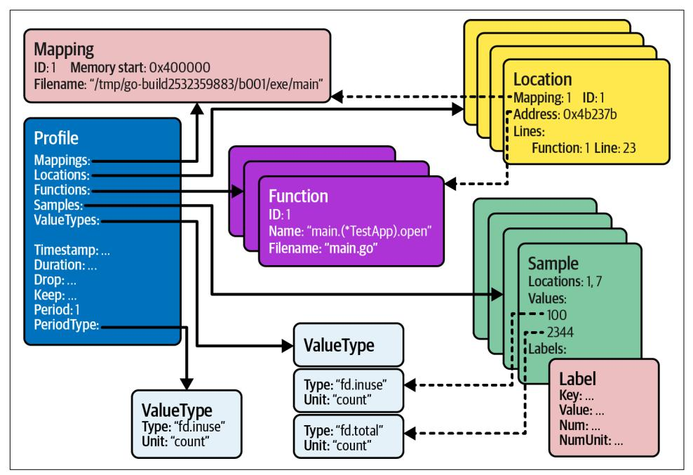

*Figure 9-1. The high-level representation of open (in use) and total file descriptors in pprof format*

pprof format starts with the single root object called Profile, which contains the fol‐ lowing child objects:

#### Mappings

Not every program has debugging symbols inside the binary. For example, in ["Understanding Go Compiler" on page 118,](008-chapter-4-how-go-uses-the-cpu-resource-or-two.md#page-137-0) we mentioned that Go has them by default to provide human-readable stack traces that refer to source code. How‐ ever, someone compiling binary might remove this information to make the binary size much smaller. If there are no symbols, the pprof file can be used with addresses of stack frames (locations). Those addresses will then be dynamically translated to the exact source code line by further tooling in a process called [sym‐](https://oreil.ly/zcZKa) [bolization](https://oreil.ly/zcZKa). Mapping allows specifying how addresses are mapped to the binary if it's dynamically provided in a later step.

Unfortunately, if you need a binary file, it has to be built from the same source code version and architecture from which we gathered profiles. This is usually very tricky. For example, when we obtain profiles from remote services (more on that in ["Capturing the Profiling Signal" on page 355](#page-374-0)), we most likely won't have the same binary on the machine where we analyze the profiles.

Fortunately, we can store all required metadata in the pprof profile, so no sym‐ bolization is needed. This is what's used for standard profiles in Go from [Go 1.9,](https://oreil.ly/qONe8) so I will skip explaining the symbolization techniques.

#### Locations

Locations are code lines (or their addresses). For convenience, a location can point to a function it was defined in and the source code filename. Location essentially represents a stack frame.

#### Functions

Functions structures hold metadata about functions in which locations are defined. They are only filled if debug symbols were present in the binary.

#### ValueTypes

This tells how many dimensions we have in our profiles. Each location can be responsible for using (contributing to usage of) some values. Value types define the unit and what that value means. Our [Example 9-1](#page-352-0) profile has only the fd.inuse type, because the current, simplistic pprof.Profile does not allow putting more dimensions; but for demonstration, [Figure 9-1](#page-356-0) has two types repre‐ senting total count and current count.


#### Contributions

The pprof format profile does not limit what the profile value means. It's up to the implementation to define the measured value semantics. For example, in [Example 9-1,](#page-352-0) I defined it as the number of open files present at the moment of the profile snapshot. For other ["Common Profile Instrumentation" on](#page-379-0) [page 360,](#page-379-0) the value means something else: the time spent on CPU, allocated bytes, or the number of goroutines executing in a specific location. Always clarify what your profile values mean!

Generally, most profile values tell us how much each part of our code uses a certain resource or time. That's why I stick to the *contribution* verb when explaining profile values on samples.

#### Samples

The measurement or measured contribution by a given stack trace of some value for a given value type. To represent a stack trace (call sequence), a sample lists all location IDs starting from the top of the stack trace. The important detail is that the sample has to have the exact number of values equal to the number (and order) of value types we have defined. We can also attach labels to samples. For <span id="page-358-0"></span>example, we could attach the example filename that was open in that stack trace. ["Heap" on page 360](#page-379-0) uses it to show average allocation size.

#### Further metadata

Information like when the profile was captured, data tracking duration (if appli‐ cable), and some filtering information can also be in the profile object. One of the most important fields is the period field, which tells us if the profile was sam‐ pled or not. We track all the instrumented Open calls in [Example 9-2,](#page-353-0) so we have period equal to one.

With all those components, the pprof data model is very well designed with the profiling data that describes any aspect of our software. It also works well with statis‐ tical profiles, which capture the data from a small portion of all the things that happened.

In [Example 9-2,](#page-353-0) tracking opened files does not pose too much overhead to the application. Perhaps in extreme production cases calling Add and Remove, and map‐ ping objects on every file open and closed, might slow down some critical paths. However, the situation is much worse with complex profiles like "CPU" [on page 367](#page-386-0) or ["Heap" on page 360](#page-379-0). For the CPU profile that profiles the use of the CPU by our program, it's impractical (and impossible) to track what exact instruction was exe‐ cuted in every single cycle. This is because, for every cycle, we would need to capture a stack trace and record it in memory, which, as we learned in [Chapter 4](008-chapter-4-how-go-uses-the-cpu-resource-or-two.md#page-130-0), can take hundreds of CPU cycles alone.

This is why the CPU profile has to be sampled. This is similar to other profiles, like memory. As you will learn in ["Heap" on page 360](#page-379-0), we sample it because tracking all individual allocations would add significant overhead and slow down all allocations in our program.

Fortunately, even with highly sampled profiles, profiling is extremely useful. By design, profiling is primarily used for bottleneck analysis. By definition, the bottle‐ neck is something that uses most of some resources or time. This means that no mat‐ ter if we capture 100%, 10%, or even 1% of events that use, e.g., the CPU time, statistically, the code that uses the most CPU should still be at the top with the largest usage number. This is why the more expensive profiles will always be sampled in some way, which allows Go developers to safely pre-enable profiles in almost all our programs. It also enables the continuous profiling practices discussed in ["Continuous](#page-392-0) [Profiling" on page 373](#page-392-0).

<span id="page-359-0"></span>
#### Statistical Profiles Are Not 100% Precise

In the sampled profile, you can miss some portion of the contributions.

Profilers like Go have a sophisticated [scaling mechanism that](https://oreil.ly/DrfIA) [attempts to find](https://oreil.ly/DrfIA) the probability of missing the allocations and adjust for it, which usually is precise enough.

Yet, those are only approximations. We can sometimes miss some code locations with smaller allocations on our profiles. Sometimes the real allocation is a little larger or smaller than estimated.

Make sure to check the period information in the pprof profiles (explained in "go tool pprof Reports"), and be aware of the sam‐ pling in your profiles to reach the right conclusions. Don't be sur‐ prised and worried that your benchmarked allocation numbers do not exactly match the numbers in the profile. We can be entirely certain about absolute numbers only when we obtain a profile with a period equal to one (100% samples).

With the fundamentals of the pprof standard explained, let's look at what we can do with such a *.pprof* file. Fortunately, we have plenty of tools that understand this for‐ mat and help us analyze the profiling data.

### go tool pprof Reports

There are many tools (and websites!) out there you can use to parse and analyze pprof profiles. Thanks to a clear schema, you can also easily write your own tool. However, the most popular one out there is the google/pprof project, which imple‐ ments the pprof [CLI tool](https://oreil.ly/lGZJG) for this purpose. The same tool is also [vendored in the Go](https://oreil.ly/pbDk3) [project,](https://oreil.ly/pbDk3) which allows us to use it through the Go CLI. For example, we can report all the pprof relevant fields in semi-human readable format using the go tool pprof raw fd.pprof command, as presented in Example 9-3.

*Example 9-3. Raw debug output of the .pprof file using the Go CLI*

```
go tool pprof -raw fd.pprof
PeriodType: fd.inuse count
Period: 1 
Time: 2022-07-29 15:18:58.76536008 +0200 CEST
Samples:
fd.inuse/count
 100: 1 2
 10: 1 3 4
 1: 5 4
 1: 6 4
Locations
```

```
1: 0x4b237b M=1 main.(*TestApp).open example/main.go:23 s=0
 main.(*TestApp).OpenTenFiles example/main.go:33 s=0
2: 0x4b25cd M=1 main.(*TestApp).Open100FilesConcurrently.func1 (...)
3: 0x4b283a M=1 main.main example/main.go:64 s=0
4: 0x435b51 M=1 runtime.main /go1.18.3/src/runtime/proc.go:250 s=0
5: 0x4b26f2 M=1 main.main example/main.go:60 s=0
6: 0x4b2799 M=1 main.(*TestApp).open example/main.go:23 s=0
 main.(*TestApp).OpenSingleFile example/main.go:28 s=0
 main.main example/main.go:63 s=0
Mappings
1: 0x400000/0x4b3000/0x0 /tmp/go-build3464577057/b001/exe/main [FN]
```

The -raw output is [currently the best way](https://oreil.ly/juE75) to discover what sampling (period) was used when capturing the profile. Using it with the head utility lets us see the first few rows containing that information, which is useful for large profiles, for example, go tool pprof -raw fd.pprof | head.

The raw output can reveal some basic information about the data contained by the profile, and it helped create the diagram in [Figure 9-1.](#page-356-0) However, there are much bet‐ ter ways to analyze bigger profiles. For example, if you run go tool pprof fd.pprof, it will enter an interactive mode that lets you inspect different locations and generate various reports. We won't cover this mode in this book because there is a much better way these days that does almost all the interactive mode can—the web viewer!

The most common way to run a web viewer is to run a local server on your machine via the Go CLI. Use the -http flag to specify the address with the port to listen on. For example, running the go tool pprof -http :8080 fd.pprof <sup>7</sup> command will open the web viewer website<sup>8</sup> in your browser showing the profile obtained in [Example 9-2](#page-353-0). The first page you would see is a directed graph rendered based on the given fd.pprof profile (see ["Graph" on page 347\)](#page-366-0). But before we get there, let's get familiar with the top navigation menu available<sup>9</sup> in the web interface, shown in [Figure 9-2](#page-361-0).

<sup>7</sup> The :8080 is shorthand for 0.0.0.0:8080, so listening on all network interfaces of your machine.

<sup>8</sup> To run this command or generate graphs, you need to install the [graphviz](http://www.graphviz.org) tool on your machine.

<sup>9</sup> This guide is for the web interface from Go 1.19. There are no hints that it will change, but the pprof tool may be enhanced or updated in subsequent versions of Go.

<span id="page-361-0"></span>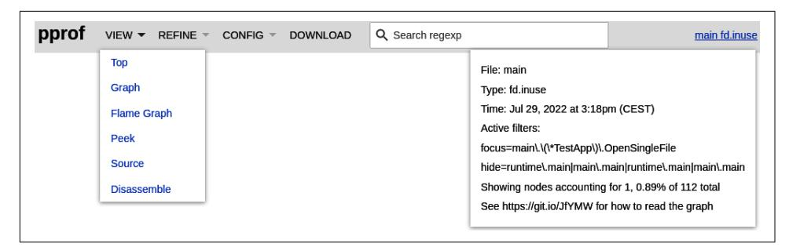

*Figure 9-2. The top navigation on the pprof web interface*

From the left, the top gray overlay menu has the following buttons and inputs:<sup>10</sup>

#### VIEW

Allows you to choose different views (reports) of the same profiling data. We will go through all six view types in the subsections below. They all show profiles from a slightly different angle and have a purpose; you might favor different ones. They are generated from the location hierarchy (stack trace) that can be reconstructed from the samples in [Figure 9-1.](#page-356-0)

#### SAMPLE

This menu option is not present in Figure 9-2 because we only have one sample value type (fd.inuse type with count unit), but for profiles with more types, the SAMPLE menu allows us to choose what sample type we want to use (we can use one at a time). This is commonly present on heap profiles.

#### REFINE

This menu works only in the Graph and Top views (see ["Graph" on page 347](#page-366-0) and ["Top" on page 345\)](#page-364-0). It allows filtering the Graph or Top views to certain locations of interest: nodes in the graph and rows in the top table. It is especially useful for very complex profiles with hundreds or more locations. To use it, click on one or more Graph nodes or rows in the Top table to select the locations. Then click REFINE and choose if you want to focus, ignore, hide, or show them.

Focus and Ignore control the visibility of samples that go through a selected node or row, allowing you to focus on or ignore full stack traces. Hide and Show con‐ trol only the node or row's visibility without impacting samples.

The same filtering can be applied using -focus and other flags in the [go tool](https://oreil.ly/OVQLC) [pprof](https://oreil.ly/OVQLC) CLI. Additionally, the REFINE > Reset option brings us back to a

<sup>10</sup> You can also hover over each menu item, and after three seconds a short help pop-up will appear.

nonfiltered view, and if you change to a view that does not support refined options, it only persists in the Focus value.


Focus and Ignore are incredibly useful when you want to find the exact contribution of a certain code path. On the other hand, you can use Hide and Show when you want to present the graph to somebody or as documentation for a clearer picture.

Don't use those options if you're trying to mentally correlate your code with the profile, as you can get easily confused, especially at the start of your profiling journey.

#### CONFIG

The refinement settings you used from the REFINE option are saved in the URL. However, you can save these settings to a special, named configuration (as well as a zoom option for the Graph view). Click CONFIG > Save As …, then choose the configuration you will be using. The Default configuration works like REFINE > Reset. The configuration is saved under *[<os.UserConfigDir>/pprof/settings.json](https://oreil.ly/nWfnq)*. On my Linux machine, it is in *~/.config/pprof/settings.json*. This option also works only on the Top and Graph views and automatically changes to Default if you change to any other view.

#### DOWNLOAD

This option downloads the same profile you used in go tool pprof. It is useful if someone exposes the web viewer on the remote server and you want to save the remote profile.

#### Search regexp

You can search for samples of interest using the [RE2 regular expression](https://oreil.ly/c0vAq) syntax by the location's function name, filename, or object name. This sets the Focus option in the REFINE menu. In some views, like Top, Graph, and os.ReadFile, the interface also highlights matched samples as you write the expression.

#### The binary name and sample type

In the right-hand corner is a link with the chosen binary name and sample value type. You can click this menu item to open a small pop-up with quick statistics about the profile, view, and options we are running with. For example, [Figure 9-2](#page-361-0) shows what you see when you click on that link with some REFINE options on.

Before diving into the different views available in the pprof tool, we have to under‐ stand important concepts of Flat and Cumulative (Cum for short) values for certain location granularity.

<span id="page-363-0"></span>

Every pprof view shows Flat and Cumulative values for one or more locations:

- Flat represents a certain node's *direct* responsibility for resource or time usage.
- Cumulative is a sum of *direct* in *indirect* contributions. Indi‐ rect means that the locations did not create any resource (or were not used anytime) directly, but may have invoked one or more functions that did.

Using code examples is best to explain those definitions in detail. Let's use part of the main() function from [Example 9-2](#page-353-0) presented in Example 9-4.

*Example 9-4. Snippet of [Example 9-2](#page-353-0) explaining Flat and Cumulative values*

```
func main() {
 // ...
 f, _ := fd.Open("/dev/null") // TODO: Check error. 
 a.files = append(a.files, f)
 a.OpenSingleFile("/dev/null")
 a.OpenTenFiles("/dev/null")
 // ...
}
```

- Profiling is tightly coupled with a stack trace representing a call sequence that led to a certain sample, so in our case, opening files. However, we could aggregate all samples going through the main() function to learn more. In this case, the main() function Flat number of open files is 1, Cum is 12. This is because, in the main function, we directly open only one file (via fd.Open);<sup>11</sup> the rest were opened via chained (descendant) functions.
- From our *fd.pprof* profile, we could find that this code line Flat value is 1 and Cum is 1. It directly opens one file and does not contribute indirectly to any more file descriptor usage.
- append does not contribute to any sample. Therefore, no sample should include this code line.

<sup>11</sup> From the perspective of the profiling, the direct (Flat) contribution is decided by instrumentation implemen‐ tation. Our custom code in [Example 9-1](#page-352-0) treats the fd.Open function as the moment the file descriptor was opened. Different profiling implementations might define the moment of "use" differently (moment of the allocation, use of CPU time, waiting for lock opening, etc.).

<span id="page-364-0"></span>The code line that invokes the a.OpenSingleFile method has a Flat value of 0 and a Cum of 1. Similarly, the a.OpenTenFiles method Flat value is 0 and Cum is 10. Both directly in the moment of the CPU touching this program line do not create (yet) any files.

I find the Flat and Cum names quite confusing, so I will use the direct and cumula‐ tive terms in further content. Both numbers are beneficial to compare what parts of the code contribute to the resource usage (or time used). The cumulative number helps us understand what flow is more expensive, whereas the direct value tells us the source of the potential bottleneck.

Let's walk through the different views and see how we can use them to analyze the *fd.pprof* file obtained in [Example 9-2.](#page-353-0)

#### Top

First on the VIEW list, the Top report shows a table of statistics per location grouped by functions. The view for the *fd.pprof* file is presented in Figure 9-3.

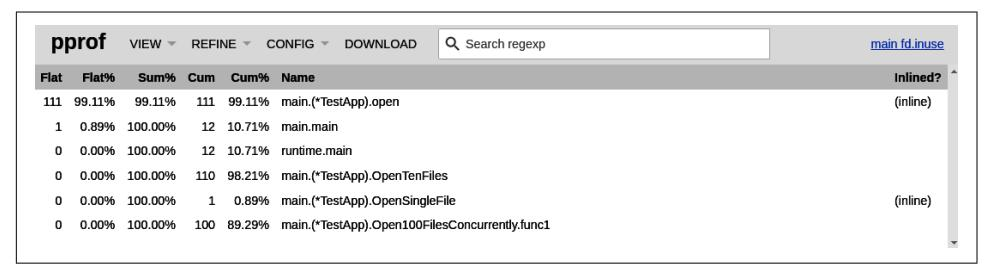

*Figure 9-3. The Top view is sorted by the direct value*

Each row represents direct and cumulative contributions of open files for the single function, which, as we learned from [Example 9-4](#page-363-0), aggregates the usage of one or mul‐ tiple lines within that function. This is called function granularity, which can be con‐ figured by URL or CLI flag.

### Choose Your Granularity

Certain views like Top, Graph, and Flame Graph allow us to group locations by file, function, or not group at all (grouping by line or address). This means that one entry, row, or graph node will group contributions from all lines within a single function or file.

You can choose the granularity by using one of the following flags in the go tool pprof command: -functions (default option), -files, -lines, or -address. Simi‐ larly, you can set this using the URL parameter ?g=<granularity>.

<span id="page-365-0"></span>Usually, function granularity is low enough, especially given low sampling rates (e.g., in the CPU profile). However, switching to line granularity effectively tells us exactly which code line contributes to the resource we profile for and where to find it. If the function has a nonzero direct contribution value, you might want to check what exact part of the function is a bottleneck!

We already defined the values represented by the Flat and Cum columns. Other col‐ umns in this view are:

#### Flat%

The percentage of the row's direct contributions to the program's total contribu‐ tions. In our case, 99.11% of the open file descriptors were created directly by the open method (111 out of 112).

#### Sum%

The third column is the percentage of all direct values from the top to the current flow to the total contributions. For instance, the 2 top rows are directly responsi‐ ble for all 112 file descriptors. This statistic allows us to narrow down to the func‐ tions that might matter the most for our bottleneck analysis.

#### Cum%

The percentage of the cumulative contribution of the row to the total contributions.


#### Be Careful When Goroutines Are Involved

The cumulative value can be misleading in some cases with goroutines. For example, [Figure 9-3](#page-364-0) indicated that run time.main cumulatively opened 12 files. However, from [Example 9-2](#page-353-0) you can find that it also executes the Open100FilesConcurrently method, which then executes Open100FilesConcurrently.func1 (anonymous function) as a new goroutine. I would expect a link from runtime.main to Open100FilesConcurrently.func1 in the Graph, and the cumulative value of runtime.main to be 112.

The problem is that stack traces of each goroutine in Go are always separate. Therefore, there is no relation between gorou‐ tines in which goroutine created which one, which will be clear when we look at the goroutine profiles in ["Goroutine" on](#page-384-0) [page 365.](#page-384-0) We must keep this in mind while analyzing our pro‐ gram's bottleneck.

<span id="page-366-0"></span>
#### Name and Inlined

The function name for the location and whether it was inlined during compila‐ tion. In [Example 9-2](#page-353-0), both open and OpenSingleFile were simple enough for compiler to inline them to the parent functions. You can represent the situation from the binary (after inline) by adding the -noinlines flag to the pprof com‐ mand or by adding the ?noinlines=t URL parameter. Seeing the situation before inlining is still recommended to map what happened to the source code more easily.

The sorting order of rows in our Top table is by direct contribution, but we can change it with the -cum flag to order by cumulative values. We can also click on each header in the table to trigger different sorting in this view.

The Top view might be the simplest and fastest way to find the functions (or files or lines, depending on the chosen granularity) directly or cumulatively responsible for using resources or time you are profiling for. The downside is that it does not tell us the exact link between those rows, which would tell us which code flow (full stack trace) might have triggered the usage. For such cases, it might be worth using the Graph view explained in the next section.

#### Graph

The Graph view is the first thing you see when opening the pprof tool web interface. This is not without reason—humans work better if things [are visualized](https://oreil.ly/VElUH) than if we have to parse and visualize all in our brain from the text report. This is my favorite view as well, especially for profiles obtained from less familiar code bases.

To render the Graph view, the pprof tool generates a graphical [directed acyclic graph](https://oreil.ly/hzglQ) [\(DAG\)](https://oreil.ly/hzglQ) from the provided profile in the [DOT](https://oreil.ly/HiRV9) format. We can then use the -dot flag with go tool pprof, and use other rendering tools or render it to the format we want with the -svg, -png, -jpg, -gif, or -pdf formats. On the other hand, we have the http option that generates a temporary graphic using the .svg format and starts the web browser from it. From the browser, we can see the .svg visualization in the Graph view and use the interactive REFINE options explained before: zoom in, zoom out, and move around through the graph. The example Graph view from our *fd.pprof* format is presented in [Figure 9-4](#page-367-0).

<span id="page-367-0"></span>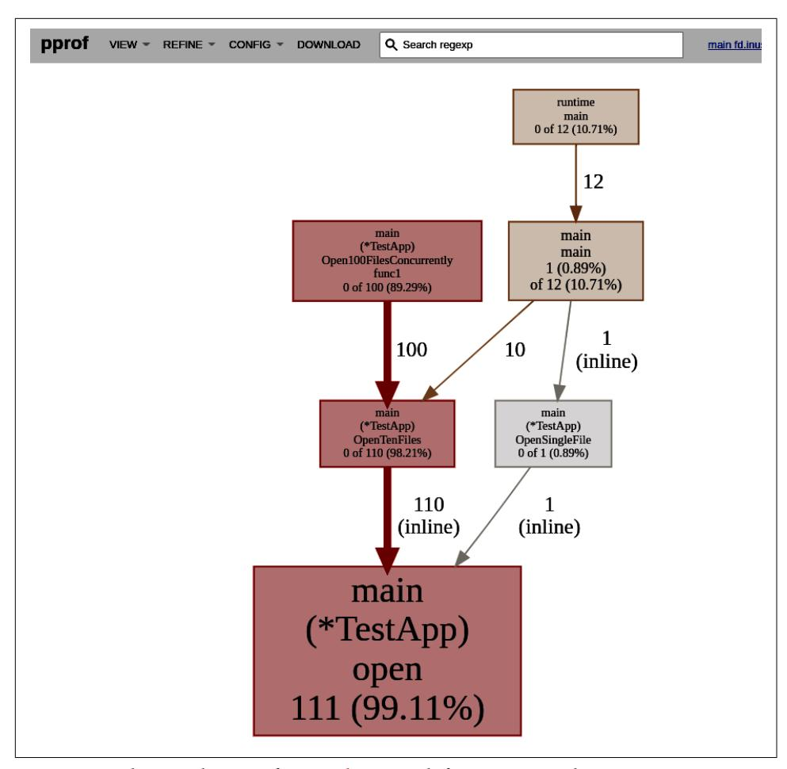

*Figure 9-4. The Graph view of [Example 9-2](#page-353-0) with function granularity*

What I love about this view is that it clearly represents the relation (hierarchy) of dif‐ ferent execution parts of your program regarding resource or time usage. While it might be tempting, you cannot move nodes around. You can only hide or show them using the REFINE options. Hovering over a node also shows the full package name or code line.

On top of that, every aspect of this graph [has its meaning,](https://oreil.ly/GQbNn) which helps to find the most expensive parts. Let's go through the graph attributes:

#### Node

Each node represents the contribution of a function for the currently opened files. This is why the first part of the text in the node shows the Go package and function (or method). We would see the code line or file if we chose a different granularity. The second part of the node shows the direct and cumulative values. If any of the values are nonzero, we see that the percentage of that value to the total contributions. For example, in [Figure 9-4](#page-367-0) we see the main.main() node (on the right) confirms the number we found in [Example 9-4](#page-363-0). Using pprof, we recor‐ ded 1 direct contribution and 12 cumulative ones in that function. The color and size tell us something too:

- The size of the node represents direct contributions. The bigger the node, the more resource or time it used directly.
- The border and fill color represent cumulative values. The normal color is gold. Large positive cumulative numbers make the node red. Cumulative values close to zero cause the node to be gray.

#### Edge

Each edge represents the call path between functions (files or lines). The call does not need to be direct. For example, if you use the REFINE option, you can hide multiple nodes that were called between two, causing the edge to show an indi‐ rect link. The value on the edge represents the cumulative contributions of that code path. The inline word next to the number tells us that the call pointed to by edge was inlined into the caller. Other characteristics matter as well:

- The weight of the edge indicates cumulative contributions by a path. The thicker the edge, the more resources were used.
- The color shows the same. Normally an edge is gold. Larger positive values color an edge red, close to zero to gray.
- A dashed edge indicates that some connected locations were removed, e.g., because of a node limit.<sup>12</sup>

<sup>12</sup> The REFINE hidden option keeps the line solid.


#### Some Nodes Might Be Hidden!

Don't be surprised if you don't see every contribution to the resource you profile in the Graph view. As I mentioned before, most of the profiles are sampled. This means that statistically, the locations that contribute a little might be missed in the resulting profile.

The second reason is the node limit in the pprof viewer. By default, it does not show more [than 80 nodes](https://oreil.ly/Wcwsu) for readability. You can change that limit using the -nodecount flag.

Finally, the -edgefraction and -nodefraction settings hide the edges and nodes with the fraction of direct contribution to the total contribution lower than the specified value. By [default](https://oreil.ly/oVfrt) it is 0.005 (0.5%) for node fraction and 0.001 (0.1%) for edge fraction.

With theory aside, what can we learn from the pprof Graph view? This view is per‐ fect for learning about efficiency bottlenecks and how to find their source. From [Figure 9-4](#page-367-0) we can immediately see that the biggest cumulative contributor is Open100FilesConcurrently, which seems to be a new goroutine since it is not con‐ nected to the runtime/main function. It might be a good idea to optimize that path first. The most open files come from OpenTenFiles and open. This tells us that it's a critical path for the efficiency of this resource. If some new functionality required cre‐ ating an additional file on every open call, we would see a significant growth in opened file descriptors by our Go program.

The Graph view is an excellent method to understand how your application's differ‐ ent functionalities impact your program's resource usage. It is especially important for more complex programs with large dependencies your team did not create. As it turns out, it is easy to misunderstand the right way of using the library you depend on. Unfortunately, this also means that there will be a lot of function names or code lines you don't recognize or don't understand. See [Figure 9-5,](#page-370-0) taken from the opti‐ mized Sum we optimize in ["Optimizing Latency Using Concurrency" on page 402](014-chapter-10-optimization-examples.md#page-421-0).

This result also proves the importance of the skill of switching between different granularity. It's as easy as adding to a URL ?g=lines to switch to line granularity it's way more effective than reopening go tool pprof with the -lines flag.

<span id="page-370-0"></span>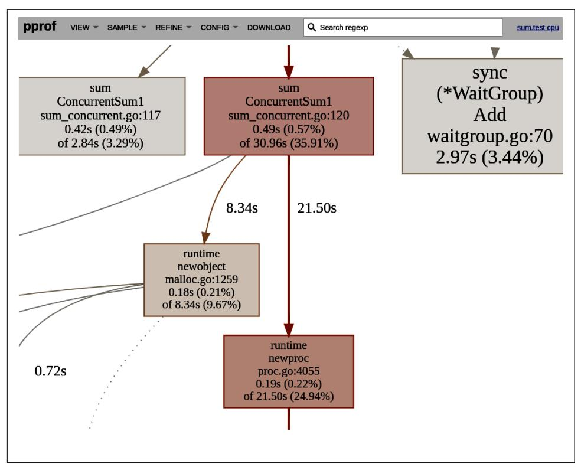

*Figure 9-5. Snippet of the Graph view of the CPU profile taken from [Example 10-10](014-chapter-10-optimization-examples.md#page-422-0) with line granularity*

### Don't Be Afraid of Unknowns!

It's normal to feel a bit anxious if you see your Go program's Graph profile for the first time. For example, it isn't uncommon to see various runtime functions. We don't need to always have an idea of what they do exactly, but we can always find that information if we want to!

Build your confidence in being able to dive into any new function or code line that matters. In Figure 9-5, the runtime.newproc function was one of the biggest bottle‐ necks for CPU time. Instinct might tell us it has something to do with creating a new goroutine (kind of new process), but it's relatively easy to confirm:

• A quick Google search for runtime.newproc github or Peek, Source, and Disassemble views gives us the exact [code line of](https://oreil.ly/3tgSz) newproc. From this, we can try to read the comment or code and figure out what this function is responsible for (not always trivial).

<span id="page-371-0"></span>• The Top view or Graph view with line granularity tells the exact line where this contribution starts. As presented in [Figure 9-5](#page-370-0), it is triggered by [line 120](https://oreil.ly/YlASl), which clearly shows creation of the goroutine!

Following the Graph view, we have the latest addition to the pprof tool—the Flame Graph view, which many members of the Go community prefer. So let's dive into it.

#### Flame Graph

The Flame Graph (sometimes also called the Icicle Graph) view in pprof is inspired by Brendan Gregg's [work](https://oreil.ly/sKFbH), focused initially on CPU profiling.

A flame graph visualizes a collection of stack traces (aka call stacks), shown as an adja‐ cency diagram with an inverted icicle layout. Flame graphs are commonly used to vis‐ ualize CPU profiler output, where stack traces are collected using sampling.

```
—Brendan Gregg, "The Flame Graphs"
```

The Flame Graph report rendered from *fd.pprof* is presented in Figure 9-6.


#### Color and Order of Segments Usually Do Not Matter

This depends on the tool that renders the Flame Graph, but for the pprof tool, both color and order do not have any meaning here. The segments are typically sorted by the location name or label value.

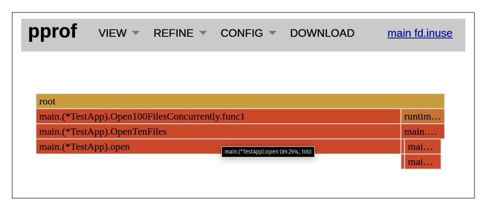

*Figure 9-6. The Flame Graph view of [Example 9-2](#page-353-0) with a function granularity*

The pprof is an inverted version of the original Flame Graph, where each significant code flow forms a separate icicle. The main attribute that matters here is the width of the rectangular segment, which represents the node from the Graph view—function in our case. The wider the block, the larger the cumulative contribution it is

<span id="page-372-0"></span>responsible for. You can hover over individual segments to see their absolute and percentage cumulative values. Click on each block to focus the view on the given code path.

Instead of edges, we can follow call hierarchy by looking at what's above the current segment. Don't focus too much on the height of the icicle—it only shows how com‐ plex (deep) the call stack is. It's the width that matters here.

In some way, a Flame Graph is often favored by more advanced engineers because it's more compact. It allows a pragmatic insight into the biggest bottlenecks of the sys‐ tem. It immediately shows the percentage of all resources that each code path con‐ tributed. At a glance, in [Figure 9-6](#page-371-0) we can quickly tell without any interactivity that Open100FilesConcurrently.func1 is the major bottleneck of opened files with approximately 90% of resources used by it. The Flame Graph is also excellent to show if there is any major bottleneck. On some occasions, a lot of small contributors might together generate a large usage. A Flame Graph will tell us about this situation imme‐ diately. Note that similar to the [Figure 9-4](#page-367-0) view, it can drop many nodes from the view. The number of dropped nodes is presented if you click the binary name at the top right corner.

Any of the three views we discussed—Top, Graph, or Flame Graph—should be the first point of interest to find the biggest bottleneck in our program efficiency. Remember about sampling, switching granularity to learn more, and focusing your time on the biggest bottlenecks first. However, three more views are worth briefly mentioning: Peek, Source, and Disassemble. Let's look at them in the next section.

#### Peek, Source, and Disassemble

The other three views—Peek, Source, and Disassemble—are not affected by the gran‐ ularity option. They all show the raw line or address level of locations, which is espe‐ cially useful if you want to go back to your source code to focus on your code optimization inside your favorite IDE.

The Peek view provides a table similar to the Top view. The only difference is that each code line shows all direct callers and the usage distribution in the Call and Calls % columns. It helps in cases with many callers where you want to narrow down the code path that contributes the most.

One of my favorite tools is the Source view. It shows the exact code line in the context of the program source code. In addition, it shows the few lines before and after. Unfortunately, the output is not ordered, so you have to use previous views to know what function or code line you want to focus on, and use the Search feature to focus on what you want. For example, we could see direct and cumulative contributions of Open100FilesConcurrently directly mapped to the code line in our code, as presen‐ ted in Figure 9-7.

*Figure 9-7. The Source view of [Example 9-2](#page-353-0) focused on the Open100FilesConcurrently search*

For me, there is something special in the Source view. Seeing the open file descrip‐ tors, allocation points, CPU time, etc., directly mapped to a code statement in your source code gives a bigger understanding and awareness than seeing lines as a bunch of boxes in [Figure 9-4.](#page-367-0) For the standard library code, or when you provide a binary (as mentioned for the Disassemble view), you can also click on a function to display its assembly code!

The Source view is incredibly useful when attempting to estimate the ["Complexity](011-chapter-7-data-driven-efficiency-assessment.md#page-259-0) [Analysis" on page 240](011-chapter-7-data-driven-efficiency-assessment.md#page-259-0) of the code we profile. I recommend using the Source view if you can't fully wrap your head around the part of the code that uses the resource and why.

Finally, the Disassemble view is useful for advanced profiling. It provides the Source view, but at the assembly level (see ["Assembly" on page 115\)](008-chapter-4-how-go-uses-the-cpu-resource-or-two.md#page-134-0). It allows checking com‐ pilation details around the problematic code. This view requires a provided binary built from the same source code as the program you took the profile from. For example, for my case with the *fd.inuse* file, I have to provide a statically built binary via a path using go tool pprof -http :8080 pkg/profile/fd/example/main fd.pprof. 13

<sup>13</sup> Note that currently there are some bugs in this view in pprof. When you are missing binary, the UI shows no matches found for regexp:. Search also does not work, but you can use the built-in browser search to find what you want (e.g., using Ctrl+F).

<span id="page-374-0"></span>

Currently, no mechanism will check if you are using the correct program binary for the profile you analyze. Therefore, the results might be, by accident, correct or totally wrong. The result in the error case is nondeterministic, so ensure you provide the correct binary!

The pprof tool is an amazing way to confirm, in a data-driven way, your initial guesses about the efficiency of your application and what causes the potential prob‐ lems. The amazing thing about the skills you acquired in this section is that the men‐ tioned text and visual representations of the pprof profiles are not only used by the native pprof tooling. Similar views and techniques are used among many other profiling tools and paid vendor services, like [Polar Signals,](https://oreil.ly/HowVb) [Grafana Phlare](https://oreil.ly/Ru0Hu) [Google](https://oreil.ly/mJu6V) [Profiler](https://oreil.ly/mJu6V), [Datadog's Continuous Profiler](https://oreil.ly/WF9fG), [Pyroscope project](https://oreil.ly/eKyK7), and more!

It is also quite likely that your Go IDE<sup>14</sup> supports rendering and gathering pprof pro‐ files out of the box. Using IDE is great as it can integrate directly into your source code and enable smooth navigation through locations. However, I prefer go tool pprof and pprof tool-based cloud projects like [the Parca project](https://oreil.ly/2PKkx) since we often have to profile on the macrobenchmarks level (see ["Macrobenchmarks" on page 306](012-chapter-8-benchmarking-versus-stress-and-load-tests.md#page-325-0)).

With the format and visualization descriptions complete, let's dive into how to obtain profiles from your Go program.

### Capturing the Profiling Signal

Recently we started treating profiling as [a fourth observability signal.](https://oreil.ly/zlAis) This is because profiling, in many ways, is very similar to the previously discussed signals in [Chap‐](010-chapter-6-efficiency-observability.md#page-212-0) [ter 6](010-chapter-6-efficiency-observability.md#page-212-0), like metrics, logging, and tracing. For example, similar to other signals, we need instrumentation and reliable experiments to obtain meaningful data.

We discussed how to write custom instrumentation in ["pprof Format" on page 332,](#page-351-0) and we will go through common existing profilers available in Go runtime. However, it's not enough to be able to fetch profiles about various resource usage in our pro‐ gram—we also need to know how to trigger situations that would give us the infor‐ mation about the efficiency bottleneck we want.

Fortunately, we already went through ["Reliability of Experiments" on page 256](012-chapter-8-benchmarking-versus-stress-and-load-tests.md#page-275-0) and ["Benchmarking Levels" on page 266](012-chapter-8-benchmarking-versus-stress-and-load-tests.md#page-285-0) that explained reliable experiments. Profiling practices are designed to integrate with our benchmarking process naturally. This enables a pragmatic optimization workflow that fits well in our TFBO loop (["Efficiency-Aware Development Flow" on page 102](007-chapter-3-conquering-efficiency.md#page-121-0)):

<sup>14</sup> For example, the plugin in [VSCode](https://oreil.ly/eaooe) or [GoLand.](https://oreil.ly/YT9cs)

- 1. We perform a benchmark on the desired level (micro, macro, or production) to assure the efficiency of our program.
- 2. If we are not happy with the result, we can rerun the same benchmark while also capturing the profile during or at the end of the experiment to find the efficiency bottleneck.


#### Always-On Profiling

You can design your workflow to not need to rerun the benchmark for profiling capturing. In ["Microbenchmarks" on page 275,](012-chapter-8-benchmarking-versus-stress-and-load-tests.md#page-294-0) I rec‐ ommended always capturing your profiles on most of your Go benchmarks. In ["Continuous Profiling" on page 373,](#page-392-0) you will learn how to profile continuously at macro or production levels!

Having instrumentation and the right experiment (reusing benchmarks) is great. Still, we also need to learn how to trigger and transfer the profile from the instrumen‐ tation of your choice to analysis with the tools you learned in ["go tool pprof Reports"](#page-359-0) [on page 340](#page-359-0).

We need to know the API for the profiler we want to use for that purpose. As we learned in [Chapter 6,](010-chapter-6-efficiency-observability.md#page-212-0) similar to other signals, we generally have two main types of instrumentation: autoinstrumentation and manual. Regarding the former model, there are many ways to obtain profiles about our Go program without adding a single line of code! With technology like [eBPF,](https://oreil.ly/8mqs6) we can have instrumentation for virtually any resource usage of our Go program. Many open source projects, start-ups, or established vendors are on the mission to make this space accessible and easier to use.

However, everything is a trade-off. The eBPF is still early technology that works only on Linux. It has some portability challenges across Linux kernel versions and non‐ trivial maintainability costs. It is also usually a generic solution that will never have the same reliability and ability to provide semantic, application-level profiles as we can now with more manual, in-process profilers. Finally, this is a Go programming language book, so I would love to share how to create, capture, and use native inprocess profilers.

The API for using instrumentation depends on the implementation. For example, you can write a profiler that will save a profile on a disk every minute or every time some event occurs (e.g., [when a certain Linux signal is captured\)](https://oreil.ly/xCW7u). However, generally in the Go community, we can outline three main patterns of triggering and saving profiles:

#### Programmatically triggered

Most profilers you will see and use in Go can be manually inserted into your code to save profiles when you want. This is what I used in [Example 9-2](#page-353-0) to cap‐ ture the *fd.pprof* file we were analyzing in ["go tool pprof Reports" on page 340.](#page-359-0) The typical interface has a signature similar to the WriteTo(w io.Writer) error (used in [Example 9-1\)](#page-352-0) that captures samples that were recorded from the begin‐ ning of the program run. The profile in pprof format is then written to a writer of your choice (typically a file).

Some profilers set an explicit starting point when the profiler starts recording samples. This is true, for example, for the CPU profiler (see ["CPU" on page 367](#page-386-0)) that has a signature like StartCPUProfile(w io.Writer) error to start the cycle, and then StopCPUProfile() to end the profiling cycle.

This pattern of using the profiles is great for quick tests in the development envi‐ ronment or when used in the microbenchmarks code (see ["Microbenchmarks"](012-chapter-8-benchmarking-versus-stress-and-load-tests.md#page-294-0) [on page 275\)](012-chapter-8-benchmarking-versus-stress-and-load-tests.md#page-294-0). Usually, however, developers don't use it directly. Instead, they often use it as a building block for two other patterns: Go benchmark integra‐ tions and HTTP handlers:

#### Go benchmark integrations

As presented in an example command I typically use for Go benchmarks in [Example 8-4](012-chapter-8-benchmarking-versus-stress-and-load-tests.md#page-301-0), you can fetch all standard profiles from a microbenchmark by specifying flags in the go test tool. Almost all profiles explained in ["Common](#page-379-0) [Profile Instrumentation" on page 360](#page-379-0) can be enabled using the -memprofile, -cpuprofile, -blockprofile, and -mutexprofile flags. No need to put custom code into your benchmark unless you want to trigger the profile at a certain moment. There's no support for custom profiles at the moment.

#### HTTP handlers

Finally, an HTTP server is the most common way to capture profiles for pro‐ grams at macro and production levels. This pattern is especially useful for back‐ end Go applications, which by default accept HTTP connections for normal use. It's then fairly easy to add special HTTP handlers for profiling and other moni‐ toring functionalities (e.g., the Prometheus /metrics endpoint). Let's explore this pattern next.

The standard Go library provides HTTP server handlers for all profilers using the pprof.Profile structure, for example, our [Example 9-1](#page-352-0) profiler or any of the stan‐ dard profiles explained in ["Common Profile Instrumentation" on page 360](#page-379-0). You can add these handlers to your http.Server in a few code lines in your Go program, as presented in [Example 9-5](#page-377-0).

<span id="page-377-0"></span>*Example 9-5. Creating the HTTP server with debug handlers for custom and standard profilers*

```
import (
 "net/http"
 "net/http/pprof"
 "github.com/felixge/fgprof"
)
// ...
m := http.NewServeMux()
m.HandleFunc("/debug/pprof/", pprof.Index)
m.HandleFunc("/debug/pprof/profile", pprof.Profile)
m.HandleFunc("/debug/fgprof/profile", fgprof.Handler().ServeHTTP)
srv := http.Server{Handler: m}
// Start server...
```

- The Mux structure allows registering HTTP server handlers on specific HTTP paths. Importing \_ "net/http/pprof" will register standard profiles in the default global mux (http.DefaultServeMux) by default. However, I always rec‐ ommend creating a new empty Mux instead of using a global one to be explicit for what paths you are registering. That's why I register them manually in my example.
- The pprof.Index handler exposes a root HTML index page that lists quick statis‐ tics and links to profilers registered using pprof.NewProfile. An example view is presented in [Figure 9-8.](#page-378-0) Additionally, this handler forwards to each profiler ref‐ erenced by name; for example, /debug/pprof/heap will forward to the heap pro‐ filer (see ["Heap" on page 360](#page-379-0)). Finally, this handler adds links to cmdline and trace handlers, which provides further debugging capabilities, and to the profile registered line below.
- The standard Go CPU is not using pprof.Profile, so we have to register that HTTP path explicitly.
- The same profile-capturing method can be used for third-party profilers, e.g., the profiler for ["Off-CPU Time" on page 369](#page-388-0) called fgprof.

<span id="page-378-0"></span>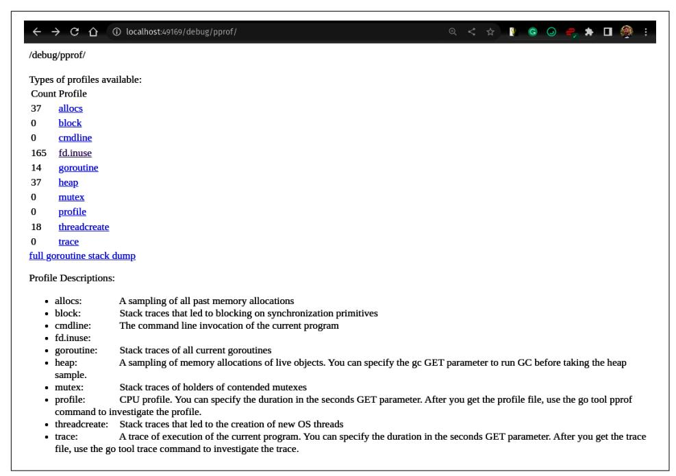

*Figure 9-8. The served HTML page from the* debug/pprof/ *path of the server created in [Example 9-5](#page-377-0)*

The index page is nice to have if you forget what name the profiler uses or what pro‐ filers you have available in your Go program. Notice that our custom [Example 9-1](#page-352-0) profiler is also on this list (fd.inuse with 165 files<sup>15</sup>), because it was created using pprof.NewProfile. For programs that do not import the fd package that has the code presented in [Example 9-1,](#page-352-0) this index page would miss the fd.inuse line.

A nice debugging page is not the primary purpose of the HTTP handlers. Their fun‐ damental benefit is that a human operator or automation can dynamically capture the profiles from outside, triggering them in the most relevant moments of the macro test, incident, or normal production run. In my experience, I have found four ways of using the profilers via the HTTP protocol:

• You can click on the link for the desired profiler in the HTML page visible in Figure 9-8, for example, heap. This will open the http://<address>/debug/ pprof/heap?debug=1 URL that prints the count of samples per stack trace in the current moment—a simplified memory profile in text format.

<sup>15</sup> Funny enough, the 165 number is excessive. Making this screenshot gave me the insight that I have a bug in the labeler code. I was not closing the temporary file.

- <span id="page-379-0"></span>• Removing the debug parameter will download the desired profile in pprof for‐ mat; e.g., the http://<address>/debug/pprof/heap URL in the browser will download the memory profile explained in "Heap" on page 360 to a local file. You can then open this file using go tool pprof, as I explained in ["go tool pprof](#page-359-0) [Reports" on page 340.](#page-359-0)
- You can point the pprof tool directly to the profiler URL to avoid the manual process of downloading the file. For example, we can open a web profiler viewer for a memory profile if we run in our terminal go tool pprof -http :8080 http://<address>/debug/pprof/heap.
- Finally, we can use another server to collect those profiles to a dedicated database periodically, e.g., using the [Phlare](https://oreil.ly/Ru0Hu) or [Parca](https://oreil.ly/2PKkx) projects explained in ["Continuous](#page-392-0) [Profiling" on page 373](#page-392-0).

To sum up, use whatever you find more convenient for the program you are analyz‐ ing. Profiling is great for understanding the efficiency of complex production appli‐ cations in a microservice architecture, so the pattern of the HTTP API for capturing profiles is usually what I use. The Go benchmark profiling is perhaps the most useful for the micro level. The mentioned access patterns are commonly used in the Go community, but it doesn't mean you can't innovate and write the capturing flow that will fit to your workflow better.

To explain the view types in ["go tool pprof Reports" on page 340](#page-359-0), pprof format, and custom profilers, I created the simplest possible file descriptor profiling instrumenta‐ tion ([Example 9-1](#page-352-0)). Fortunately, we don't need to write our instrumentation to have robust profiling for common machine resources. Go comes with a few standard pro‐ filers, well maintained and used by the community and users worldwide. Plus, I will mention a useful bonus profiler from the open source community. Let's unpack those in the next section.

### Common Profile Instrumentation

In Chapters [4](008-chapter-4-how-go-uses-the-cpu-resource-or-two.md#page-130-0) and [5,](009-chapter-5-how-go-uses-memory-resource.md#page-168-0) I explained two main resources we have to optimize for—CPU time and memory. I also discussed how those could impact latency. The whole space can be intimidating at first, given the complexity and the concern given in ["Reliability](012-chapter-8-benchmarking-versus-stress-and-load-tests.md#page-275-0) [of Experiments" on page 256](012-chapter-8-benchmarking-versus-stress-and-load-tests.md#page-275-0). This is why it's critical to understand what common profiling implementations Go has and how to use them. We will start with heap profiling.

### Heap

The heap profile, also sometimes referred to as the alloc profile, provides a reliable way to find the main contributors of the memory allocated on the heap (explained in

["Go Memory Management" on page 172](009-chapter-5-how-go-uses-memory-resource.md#page-191-0)). However, similar to the go\_ memstats\_heap metric mentioned in ["Memory Usage" on page 234](010-chapter-6-efficiency-observability.md#page-253-0), it only shows memory blocks allocated on the heap, not memory allocated on stack, or custom mmap calls. Still, the heap part of Go program memory usually causes the biggest problem; thus, the heap profile tends to be very useful, in my experience.

You can redirect the heap profile to io.Writer using [pprof.Lookup](https://oreil.ly/kMjqJ) [\("heap"\).WriteTo\(w, 0\)](https://oreil.ly/kMjqJ), with -memprofile on Go benchmark, or by calling the /debug/pprof/heap URL with handlers, as in [Example 9-5](#page-377-0). 16

The memory profiler has to be efficient for it to be feasible for practical purposes. That's why the heap profiler is sampled and deeply integrated with the [Go runtime](https://oreil.ly/NF1ni) [allocator flow](https://oreil.ly/NF1ni) that is responsible for allocating values, pointers, and memory blocks (see ["Values, Pointers, and Memory Blocks" on page 176](009-chapter-5-how-go-uses-memory-resource.md#page-195-0)). The sampling can be con‐ trolled by the [runtime.MemProfileRate](https://oreil.ly/iJaAU) variable (or the GODEBUG=memprofilerate=X environment variable) and is defined as the average number of bytes that must be allocated to record a profile sample. By default, Go records a sample per every 512 KB of allocated memory on the heap.


#### What Memory Profile Rate Should You Choose?

I would recommend not changing the default value of 512 KB. It is low enough for practical bottleneck analysis for most Go programs, and cheap enough so we can always have it on.

For more detailed profiling values or to optimize a smaller size of allocations on the critical path, consider changing it to one byte to record all allocations in your program. However, this can impact your application's latency and CPU time (which will be visible on the CPU profile). Still, it might be fine for your memory-focused benchmark.

If you have multiple allocations in a single function, it is often useful to analyze the heap profile in lines granularity (add the &g=lines URL parameter in the web viewer). An example heap profile of labeler in the e2e framework (see ["Go e2e](012-chapter-8-benchmarking-versus-stress-and-load-tests.md#page-329-0) [Framework" on page 310\)](012-chapter-8-benchmarking-versus-stress-and-load-tests.md#page-329-0) is presented in [Figure 9-9.](#page-381-0)

<sup>16</sup> The same profile is also available via /debug/pprof/alloc. The only difference is that the alloc profile has alloc\_space as the default value type.

<span id="page-381-0"></span>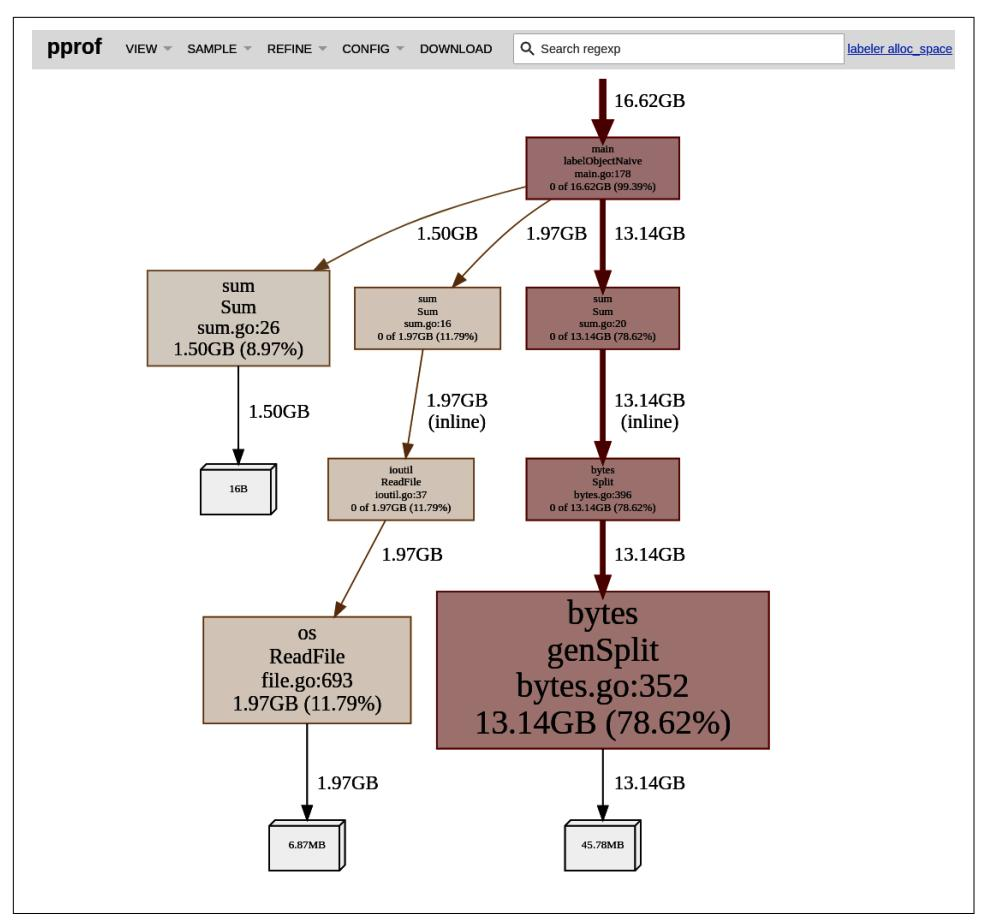

*Figure 9-9. The zoomed-in Graph view for the heap profile from the labeler Sum code from [Example 4-1](008-chapter-4-how-go-uses-the-cpu-resource-or-two.md#page-134-0) in alloc\_space dimension and lines granularity*

The unique aspect of the heap profile is that it has four value (sample) types, which you can choose in a new SAMPLE menu item. The currently selected value type is presented in the top right-hand corner. Each type is useful in a different way:

#### alloc\_space

In this mode, the sample value means a total number of allocated bytes by loca‐ tion on the heap since the start of your program. This means that we will see all the memory that was allocated in the past, but most likely is already released by the garbage collection.


Don't be surprised to see huge values here! For example, if the program runs for a longer time and one function allocates 100 KB every minute, it means ~411 GB after 30 days. This looks scary, but the same application might just use a maximum of 10 MB of physical memory during those 30 days.

The total historical allocations are great to see in the code that in total allocated the largest amount of bytes in the past, which can lead to problems with the max‐ imum memory used by that program. Even if the allocations made by certain locations were small but very frequent, it might be caused by the impact of the garbage collection (see ["Garbage Collection" on page 185\)](009-chapter-5-how-go-uses-memory-resource.md#page-204-0). The alloc\_space is also very useful for spotting past events that allocated large space.

For example, in [Figure 9-9](#page-381-0) we see 78.6% of cumulative memory used by the bytes.Split function. This knowledge will be extremely valuable in the example in ["Optimizing Memory Usage" on page 395.](014-chapter-10-optimization-examples.md#page-414-0) As we already saw in ["Go Bench‐](012-chapter-8-benchmarking-versus-stress-and-load-tests.md#page-296-0) [marks" on page 277](012-chapter-8-benchmarking-versus-stress-and-load-tests.md#page-296-0), the number of allocations is way larger than the dataset, so there must be a way to find a less expensive memory solution to splitting a string into lines.


#### Resetting Cumulative Allocations

We can't reset the heap profiler programmatically, for exam‐ ple, to start recording allocations from a certain moment.

However, as you will learn in ["Comparing and Aggregating](#page-397-0) [Profiles" on page 378](#page-397-0), we can perform operations like subtract‐ ing the pprof values. So for example, we can capture the heap profile at moment A, then 30 seconds later at moment B, and create a "delta" heap profile that will show what allocation happened during those 30 seconds.

There is also a hidden feature for Go pprof HTTP handlers. When capturing the heap profile, you can add a seconds parameter! For example, with [Example 9-5](#page-377-0) you can call http://<address>/debug/pprof/heap?seconds=30s to remotely capture a delta heap profile!

#### alloc\_objects

Similar to alloc\_space, the value tells us about the number of allocated memory blocks, not the actual space. This is mainly useful for finding the latency bottle‐ necks caused by frequent allocations.

<span id="page-383-0"></span>
#### inuse\_space

This mode shows the currently allocated bytes on the heap—the allocated mem‐ ory minus the released memory at each location. This value type is great for cases when we want to find the memory bottleneck in a specific moment of the program.<sup>17</sup>

Finally, this mode is excellent for finding memory leaks. The memory that was constantly allocated and never released will stand out in the profile.


#### Finding the Source of the Memory Leaks

The heap profile shows the code that allocated memory blocks, not the code (e.g., variables) that currently reference those memory blocks. To discover the latter, we could use the [view](https://oreil.ly/c4rGl) core [utility](https://oreil.ly/c4rGl) that analyzes the currently formed heap. This is, however, not trivial.

Instead, try to statically analyze the code path first to find where the created structures might be referred. But even before that, check the goroutine profile in the next section first. We will discuss this problem in ["Don't Leak Resources"](015-chapter-11-optimization-patterns.md#page-445-0) [on page 426.](015-chapter-11-optimization-patterns.md#page-445-0)

#### inuse\_objects

The value shows the current number of allocated memory blocks (objects) on the heap. This is useful to reveal the amount of live objects on the heap, which repre‐ sents well the amount of work for garbage collection (see ["Garbage Collection"](009-chapter-5-how-go-uses-memory-resource.md#page-204-0) [on page 185](009-chapter-5-how-go-uses-memory-resource.md#page-204-0)). Most of the CPU-bound work of garbage collection is in the mark phase that has to traverse through objects in a heap. So the more we have, the larger the negative impact allocation might be.

Knowing how to use heap profiles is a must-have skill for every Go developer interes‐ ted in the efficiency of their programs. Focus on the code with the biggest contribu‐ tion of allocations space. Don't worry about the absolute numbers that might not correlate with the memory you use with other observability tools (see ["Memory](010-chapter-6-efficiency-observability.md#page-253-0) [Usage" on page 234](010-chapter-6-efficiency-observability.md#page-253-0)). With higher memory profile rates, you see only a portion of the allocations that statically matter.

<sup>17</sup> Unfortunately, given I took the snapshot when the load test finished, the current amount of spaces contrib‐ uted by code toward the heap is minimal and does not represent any interesting event that happened in the past. You will see this value type being more useful in ["Continuous Profiling" on page 373.](#page-392-0)

<span id="page-384-0"></span>
### Goroutine

The goroutine profiler can show us how many goroutines are running and what code they are executing. This includes all goroutines waiting on I/O, locks, channels, etc. There is no sampling for this profile—all goroutines except [system goroutines](https://oreil.ly/bg2fB) are always captured.<sup>18</sup>

Similar to the heap profile, we can redirect this profile to io.Writer using pprof.Lookup("goroutine").WriteTo(w, 0), with -goroutineprofile on Go benchmark, or by calling the /debug/pprof/goroutine URL with handlers, as in [Example 9-5.](#page-377-0) The overhead of capturing a goroutine profile can be significant for Go programs with a larger number of goroutines or when you care about every 10 ms of your program latency.

The key value of the goroutine profile is to give you an awareness of what most of your code goroutines are doing. In some cases, you might be surprised how many goroutines your program requires to fulfill some functionality. Seeing a large (and perhaps increasing) number of goroutines doing the same thing might indicate a memory leak.

Remember that, as mentioned in [Figure 9-3,](#page-364-0) for Go developers, by design, there is no link between the new goroutine and the goroutine that created it.<sup>19</sup> For this reason, the root location we see in the profile is always the first statement or function where the goroutine is called.

The example Graph view for our labeler program is presented in [Figure 9-10.](#page-385-0) We can see that labeler does not do a lot. In the zoom-out view, we can see there are only 13 goroutines, and none of the locations are the application logic—only profiler goroutine, signal goroutine, and a few HTTP server ones polling connection bytes. This indicates that perhaps the server is waiting on a TCP connection for the incom‐ ing request.

<sup>18</sup> See the excellent [goroutine profiler overview.](https://oreil.ly/U8tCN)

<sup>19</sup> Technically speaking, the Go scheduler [records that information](https://oreil.ly/g3tl2). It can be exposed to us when stack is retrieved with GODEBUG=tracebackancestors=X.

<span id="page-385-0"></span>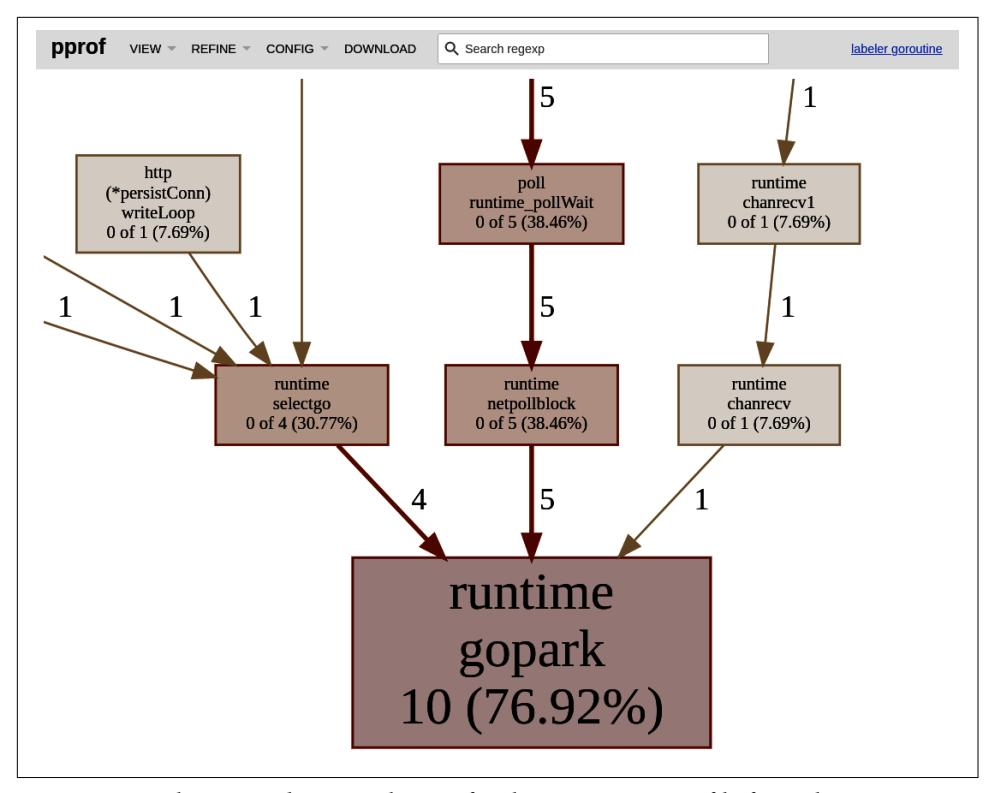

*Figure 9-10. The zoomed-in Graph view for the goroutine profile from the labeler Sum code from [Example 4-1](008-chapter-4-how-go-uses-the-cpu-resource-or-two.md#page-134-0)*

Still, Figure 9-10 makes you aware of a few common functions you can typically find in the goroutine view:

#### runtime.gopark

The [gopark](https://oreil.ly/Zqf2K) is an internal function that keeps the goroutine waiting for the state until an external callback will get it back to work. Essentially it is a way for the runtime scheduler to pause (park) goroutines when they are waiting for things a bit longer—for example, channel communication, network I/O, or sometimes mutex locks.

#### runtime.chanrecv *and* runtime.chansend

As the name suggests, a goroutine in the chanrecv function is receiving messages or waiting for something to be sent in the channel. Similarly, it is in chansend if it is sending a message or waiting for the channel to have a buffer room.

<span id="page-386-0"></span>
#### runtime.selectgo

You will see this if the goroutine is waiting or checking cases in the [select](https://oreil.ly/T52Kg) state‐ [ment](https://oreil.ly/T52Kg).

#### runtime.netpollblock

The netpoll [function](https://oreil.ly/5Iw71) sets the goroutine to wait until the I/O bytes are received from the network connection.

As you can see, it's fairly easy to track the functions' meaning, even if you are seeing them in your profile for the first time.

### CPU

We profile the CPU to find the parts of code that use CPU time the most. Reducing that allows us to reduce the cost of running our program and enable easier system scalability. For the CPU-bound programs, shaving some CPU usage also means reduced latency.

Profiling the CPU usage is proven to be very hard. The first reason for this is that the CPU just does a lot in a single moment—the CPU clocks can perform billions of operations per second. Understanding the full distribution of all the cycles across our program code is hard to track without slowing down significantly. The multi-CPU core programs make this problem even harder.

At the time of writing this book, Go 1.19 provides a CPU profiler integrated into the Go runtime. Any CPU profiler adds some overhead, so it can't just run in the background. We have to start and stop it for the whole process explicitly. Like other profilers, we can do that programmatically through the pprof.StartCPUProfile(w) and pprof.StopCPU Profile() functions. We can use the -cpuprofile flag on Go benchmark or the /debug/pprof/profile?seconds=<integer> URL with handlers in [Example 9-5](#page-377-0).


#### CPU Profile Has Its Start and End

Don't be surprised if the profile HTTP handler does not return the response immediately, as with other profiles! The HTTP han‐ dler will start the CPU profiler, run it for the number of seconds provided in the seconds parameter (30 seconds if not specified), and only then return the HTTP request.

The current implementation is heavily sampled. When the profiler starts, it schedules the OS-specific timers to interrupt the program execution at the specified rate. On Linux, this means using either [settimer](https://oreil.ly/tQNJK) or [timer\\_create](https://oreil.ly/WdjVW) to set up timers for each OS thread, and in the Go runtime, listening for the [SIGPROF](https://oreil.ly/dcQTf) signal. The signal inter‐ rupts the Go runtime, which then obtains the current stack trace of the goroutine <span id="page-387-0"></span>executing on that OS thread. The sample is then queued into a pre-allocated ring buffer, which is then scraped by the pprof writer every 100 milliseconds.<sup>20</sup>

The CPU profiling rate is currently hardcoded<sup>21</sup> to 100 Hz, so it will record, in theory, one sample from each OS thread every 10 ms of the CPU time (not real time). There are [plans](https://oreil.ly/VXEPO) to make this value configurable in the future.

Despite the CPU profile being one of the most popular efficiency workflows, it's a complex problem to solve. It will serve you well for the typical cases, but it's not per‐ fect. For example, there are known problems on some OSes like the BSD<sup>22</sup> and vari‐ ous inaccuracies in [some specific cases](https://oreil.ly/Ar8Up). In the future, we might see some improvements in this space, with [new proposals](https://oreil.ly/zDSEq) being currently considered that use [hardware-based performance monitor units \(PMUs\)](https://oreil.ly/75AHf).

The example CPU profile showing the distribution of CPU time taken by each func‐ tion for the labeler is presented in Figure 9-11. Given the inaccuracies from the lower sampling rate, the function granularity view might lead to better conclusions.

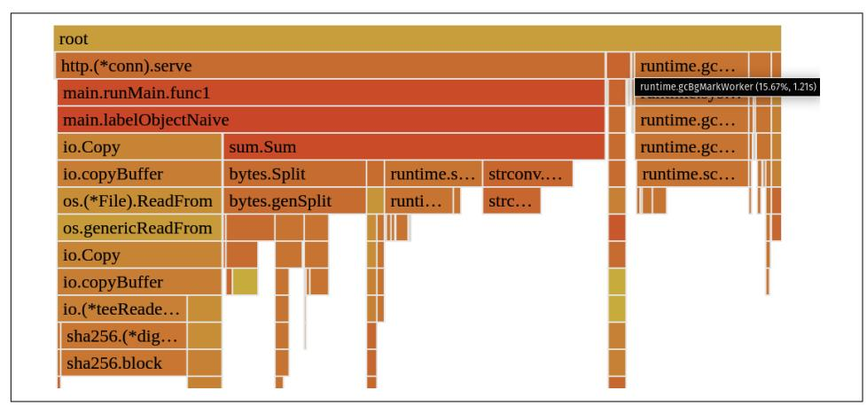

*Figure 9-11. The Flame Graph view for the 30-second CPU profile from the labeler Sum code from [Example 4-1](008-chapter-4-how-go-uses-the-cpu-resource-or-two.md#page-134-0) at functions granularity*

<sup>20</sup> See the [proposal for the next iteration of the potential CPU profiler](https://oreil.ly/8vy83) for a detailed description.

<sup>21</sup> Technically speaking, there is one very hacky way of setting different profiling CPU rates. You can call [run](https://oreil.ly/M8HwB) [time.SetCPUProfileRate\(\)](https://oreil.ly/M8HwB) with the rate you want right before pprof.StartCPUProfile(w). The pprof.StartCPUProfile(w) will try to override the rate, but it will fail due to [the bug.](https://oreil.ly/8JBxX) Change the rate only if you know what you are doing—100 Hz is usually a good default. Values higher than 250–500 Hz are not sup‐ ported by most of the OS timers anyway.

<sup>22</sup> See [this issue](https://oreil.ly/E0W5v) for a currently known list of OSes with certain problems.

<span id="page-388-0"></span>The CPU profile comes with two value types:

#### Samples

The sample value indicates the number of samples observed at the location.

#### CPU

Each sample value represents the CPU time.

From [Figure 9-11](#page-387-0), we can see what we have to focus on if we want to optimize CPU time or latency caused by the amount of work by our labeler Go program. From the Flame Graph view, we can outline five major parts:

#### io.Copy

This function used by the code responsible for copying the file from local object storage takes 22.6% of CPU time. Perhaps we could utilize local caching to save that CPU time.

#### bytes.Split

This splits lines in [Example 4-1](008-chapter-4-how-go-uses-the-cpu-resource-or-two.md#page-134-0) and takes 19.69%, so this function might be checked if there is any way we can split it into lines with less work.

#### gcBgMarkWorker

This function takes 15.6%, which indicates there was a large number of objects alive on the heap. Currently, the GC takes some portion of CPU time for garbage collection.

#### runtime.slicebytetostring

It indicates a nontrivial amount of CPU time (13.4%) is spent converting bytes to string. Thanks to the Source view, I could track it to num, err := strconv.ParseInt(string(line), 10, 64) line. This reveals a straightforward optimization of trying to come up with a function that parses integers directly from the byte slice.

#### strconv.ParseInt

This function uses 12.4% of CPU. We might want to check if there is any unnec‐ essary work or checks we could remove by writing our parsing function (spoiler: there is).

Turns out, such a CPU profile is valuable even if it is not entirely accurate. We will try the mentioned optimizations in ["Optimizing Latency" on page 383](014-chapter-10-optimization-examples.md#page-402-0).

### Off-CPU Time

It is often forgotten, but the typical goroutines mostly wait for work instead of exe‐ cuting on the CPU. This is why when looking to optimize the latency of our program's functionality, we can't just look at CPU time.<sup>23</sup> For all programs, especially the I/O-bound ones, your process might take a lot of time sleeping or waiting. Specif‐ ically, we can define four categories that compose the entire program execution, pre‐ sented in Figure 9-12.

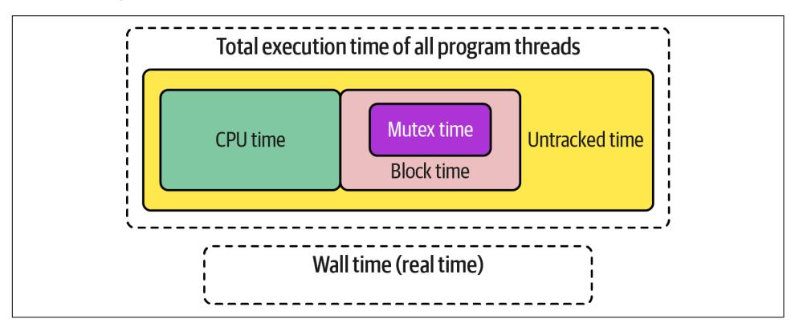

*Figure 9-12. The process execution time composition<sup>24</sup>*

The first observation is that the total execution time is longer than the wall time, so real time elapsed when executing this program. It's not because computers can slow time somehow; it's because all Go programs are multithreaded (or even multigorou‐ tines in Go), so the total measured execution time will always be longer than real time. We can outline four categories of execution time:

#### CPU time

The time our program actively spent using CPU, as explained in "CPU" [on page](#page-386-0) [367](#page-386-0).

#### Block time

The mutex time, plus the time our process spent waiting for Go channel commu‐ nication (e.g., <-ctx.Done(), as discussed in ["Go Runtime Scheduler" on page](008-chapter-4-how-go-uses-the-cpu-resource-or-two.md#page-157-0) [138](008-chapter-4-how-go-uses-the-cpu-resource-or-two.md#page-157-0)), so all synchronization primitives. We can profile that time using the block profiler. It's not enabled by default, so we need to turn it on by setting a nonzero block profiling rate using [runtime.SetBlockProfileRate\(int\)](https://oreil.ly/GwjwY). This specifies the number of nanoseconds spent blocked for one blocking event sample. Then we can use pprof.Lookup in Go, -blockprofile in Go benchmark, or the / debug/pprof/block HTTP handler to capture contention and delay value types.

<sup>23</sup> In fact, even CPU time includes waiting for a memory fetch, as discussed in ["CPU and Memory Wall Prob‐](008-chapter-4-how-go-uses-the-cpu-resource-or-two.md#page-145-0) [lem" on page 126](008-chapter-4-how-go-uses-the-cpu-resource-or-two.md#page-145-0). This is, however, included in the CPU profile.

<sup>24</sup> This view is heavily inspired by the [Felix's great guide.](https://oreil.ly/nwVwF)

<span id="page-390-0"></span>
#### Mutex time

The time spent on lock contentions (e.g., the time spent in [sync.RWMutex.Lock](https://oreil.ly/chnpS)). Like block profile, it's disabled by default and can be enabled with [runtime.Set](https://oreil.ly/oIg45) [MutexProfileFraction\(int\)](https://oreil.ly/oIg45). Fraction specifies that 1/*<fraction>* lock conten‐ tions should be tracked. Similarly, we can use pprof.Lookup in Go, mutexprofile in Go benchmark, or the /debug/pprof/mutex HTTP handler to capture mutex and delay value types.

#### Untracked off-CPU time

The goroutines that are sleeping, waiting for CPU time, I/O (e.g., from disk, net‐ work, or external device), syscalls, and so on are not tracked by any standard profiling tool. To discover the impact of that latency, we need to use different tools as explained next.


#### Do We Have to Measure or Find Bottlenecks in Off-CPU Time?

Program threads spend a lot of time off-CPU. This is why the main reason your program is slow might not be its CPU time. For exam‐ ple, suppose the execution of your program takes 20 seconds, but it waits 19 seconds on an answer from the database. In that case, we might want to look at bottlenecks in the database (or mitigate the database slowness in our code) instead of optimizing the CPU time.

Generally, it is recommended to use tracing to find the bottlenecks in the wall time (latency) of our functionality. Especially, distributed tracing allows us to narrow down our optimization focus to what takes the most time in the request of function‐ ality flow. Go has built-in [tracing instrumentation](https://oreil.ly/pKeI1), but it only instruments Go run‐ time, not our application code. However, we discussed basic tracing instrumentation compatible with the cloud-native standards like [OpenTelemetry](https://oreil.ly/sPiw9) to achieve application-level tracing.

There is also an amazing profiler called the [Full Go Profiler \(](https://oreil.ly/4WWHN)fgprof) out there focused on tracking both CPU and off-CPU time. While [it's not](https://oreil.ly/ri1Kb) officially recom‐ mended yet and has [known limitations,](https://oreil.ly/8Lk9t) I found it very useful, depending on what kind of Go program I analyze. The fgprof profile can be exposed using the HTTP handler mentioned in [Example 9-5.](#page-377-0) The example view of the fgprof profile for labeler service is presented in [Figure 9-13](#page-391-0).

<span id="page-391-0"></span>

| ınti | me.goexit        |                      |                   |                      |
|------|------------------|----------------------|-------------------|----------------------|
|      | http.(*persistC  | run.(*Group).Run.fu  | runtime.main      | view.(*worker).start |
|      | runtime.selectgo | main.runMain.func2   | main.main         | runtime.selectgo     |
|      | runtime.gopark   | http.(*Server).Lis   | main.runMain      | runtime.gopark       |
|      |                  | http.(*Server).Serve | run.(*Group).Run  |                      |
|      |                  | net.(*TCPListene     | runtime.chanrecv1 |                      |
|      |                  | net.(*TCPListene     | runtime.chanrecv  |                      |
|      |                  | net.(*netFD).accept  | runtime.gopark    |                      |
|      |                  | poll.(*FD).Accept    |                   |                      |
|      |                  | poll.(*pollDesc)     |                   |                      |
|      |                  | poll.(*pollDesc)     |                   |                      |
|      |                  | poll.runtime_poll    |                   |                      |
|      |                  | runtime.netpollblock |                   |                      |
| _    |                  | runtime.gopark       |                   |                      |

*Figure 9-13. The Flame Graph view for the 30-seconds-fgprof profile from the labeler Sum code from [Example 4-1](008-chapter-4-how-go-uses-the-cpu-resource-or-two.md#page-134-0) at functions granularity*

From the profile, we can quickly tell that for most of the wall time, the labeler ser‐ vice is simply waiting for the signal interrupt or HTTP requests! If we are interested in improving the maximum rate of the incoming requests that labeler can serve, we can quickly find that labeler is not the problem, but rather the testing client is not sending requests fast enough.<sup>25</sup>

To sum up, in this section, I presented the most common profiler implementations that are used<sup>26</sup> in the Go community. There are also tons of closed-box monitoring profilers like Linux perf and eBPF-based profiles, but they are outside the scope of this book. I prefer the ones I mentioned as they are free (open source!), explicit, and relatively easy to use and understand.

Let's now look at some lesser-known tools and practices I found useful when profil‐ ing Go programs.

<sup>25</sup> This can be confirmed in [Example 8-19](012-chapter-8-benchmarking-versus-stress-and-load-tests.md#page-331-0) code, where the k6s script has only one user that waits 500 ms between HTTP calls.

<sup>26</sup> I skipped the threadcreate profile present in the Go pprof package as it's known to be broken [since 2013](https://oreil.ly/b8MpS) with little priority to be fixed in the future.

<span id="page-392-0"></span>
### Tips and Tricks

There are three more advanced yet incredibly useful tricks for profiling I would love you to know. These helped me analyze software bottlenecks even more effectively. So let's go through them!

### Sharing Profiles

Typically, we don't work on software projects alone. Instead, we are in a bigger team, which shares responsibilities and reviews each other's code. Sharing is caring, so sim‐ ilar to ["Sharing Benchmarks with the Team \(and Your Future Self\)" on page 294](012-chapter-8-benchmarking-versus-stress-and-load-tests.md#page-313-0), we should focus on presenting our bottlenecks results and findings with team members or other interested parties.

We download or check multiple pprof profiles in the typical workflow. In theory, we could name them descriptively to avoid confusion and send them to each other using any file-sharing solution like Google Drive or Slack. This, however, tends to be cum‐ bersome because the recipient has to download the pprof file and run go tool pprof locally to analyze.

Another option is to share a screenshot of the profile, but we have to choose some partial view, which can be cryptic for others. Perhaps others would like to analyze the profile using a different view or value type. Maybe they want to find the sampling rate or narrow the profile down to some code path. With just a screenshot, you are miss‐ ing all of those interactive capabilities.

Fortunately, some websites allow us to save pprof files for others or our future self and analyze them without downloading that profile. For example, the [Polar Signals](https://oreil.ly/HowVb) company hosts an entirely free *[pprof.me](https://pprof.me)* website that allows exactly that. You can upload your profile (note that it will be shared publicly!) and share the link with team members, who can analyze it using common go tools pprof reports views (see ["go](#page-359-0) [tool pprof Reports" on page 340\)](#page-359-0). I use it all the time with my team.

### Continuous Profiling

In the open source ecosystem, continuous profiling was perhaps one of the most pop‐ ular topics in 2022. It means automatically collecting useful profiles from our Go pro‐ gram at every configured interval instead of being manually triggered.

In many cases, the efficiency problem happens somewhere in the remote environ‐ ment where the program is running. Perhaps it happened in the past in response to some event that is now hard to reproduce. Continuous profiling tools allow us to have our profiling "always on" and retrospectively look at profiles from the past.

<span id="page-393-0"></span>Say you see an increase in resource usage – say, CPU usage. And then you take a onetime profile to try to figure out what's using more resources. Continuous profiling is essentially doing this all the time. (...) When you have all this data over time, you can compare the entire lifetime of a version of a process to a newly rolled-out version. Or you can compare two different points in time. Let's say there's a CPU or memory spike. We can actually understand what was different in our processes down to the line number. It's super powerful, and it's an extension of the other tools already useful in observability, but it shines a different light on our running programs.

```
—Frederic Branczyk, "Grafana's Big Tent: Continuous Profiling with Frederic
Branczyk"
```

Continuous profiling emerged in the cloud-native open source community as the fourth observability signal, but it's not new. The concept was introduced first in 2010 by the ["Google-Wide Profiling: A Continuous Profiling Infrastructure For Data Cen‐](https://oreil.ly/FbHY8) [ters" research paper](https://oreil.ly/FbHY8) by Gang Ren et al., which proved that profiling can be used against production workloads continuously without the major overhead, and helped in efficiency optimizations at Google.

We have recently seen open source projects that made this technology more accessi‐ ble. I have personally used the continuous profiling tool for a couple of years already to profile our Go services, and I love it!

You can quickly set up continuous profiling using the open source [Parca project](https://oreil.ly/X8003). In many ways, it is similar to the [Prometheus project.](https://oreil.ly/2Sa3P) Parca is a single binary Go pro‐ gram that periodically captures profiles using the HTTP handlers we discussed in ["Capturing the Profiling Signal" on page 355](#page-374-0) and stores them in a local database. Then we can search for profiles, download them, or even use the embedded tool pprof like a viewer to analyze them.

You can use it anywhere: set up continuous profiling on your production, remote environment, or macrobenchmarking environment that might run in the cloud or on your laptop. It might not make sense on a microbenchmarks level, as we run tests in the smallest possible scope, which can be profiled for the full duration of the bench‐ mark (see ["Microbenchmarks" on page 275](012-chapter-8-benchmarking-versus-stress-and-load-tests.md#page-294-0)).

Adding continuous profiling with Parca to our labeler macrobenchmark in [Example 8-19](012-chapter-8-benchmarking-versus-stress-and-load-tests.md#page-331-0) requires only a few lines of code and a simple YAML configuration, as presented in Example 9-6.

*Example 9-6. Starting continuous profiling container in [Example 8-19](012-chapter-8-benchmarking-versus-stress-and-load-tests.md#page-331-0) between labeler creation and k6 script execution*

```
labeler := ...
parca := e2e.NewInstrumentedRunnable(e, "parca").
 WithPorts(map[string]int{"http": 7070}, "http").
```

```
 Init(e2e.StartOptions{
 Image: "ghcr.io/parca-dev/parca:main-4e20a666",
 Command: e2e.NewCommand("/bin/sh", "-c",
 `cat << EOF > /shared/data/config.yml && \
 /parca --config-path=/shared/data/config.yml
object_storage: 
 bucket:
 type: "FILESYSTEM"
 config:
 directory: "./data"
scrape_configs: 
- job_name: "%s"
 scrape_interval: "15s"
 static_configs:
 - targets: [ '`+labeler.InternalEndpoint("http")+`' ]
 profiling_config:
 pprof_config: 
 fgprof:
 enabled: true
 path: /debug/fgprof/profile
 delta: true
EOF
`),
 User: strconv.Itoa(os.Getuid()),
 Readiness: e2e.NewTCPReadinessProbe("http"),
 })
testutil.Ok(t, e2e.StartAndWaitReady(parca))
testutil.Ok(t, e2einteractive.OpenInBrowser("http://"+parca.Endpoint("http")))
k6 := ...
```

- The e2e [framework](https://oreil.ly/f0IJo) runs all workloads in the container, so we do that for the Parca server. We use the container image build from [the official project page](https://oreil.ly/ETsNV).
- The basic configuration of the Parca server has two parts. The first is object stor‐ age configuration: where we want to store Parca's database internal data files. Parca uses [FrostDB columnar storage](https://oreil.ly/A9y23) to store debugging information and pro‐ files. To make it easy, we can use the local filesystem as our most basic object storage.
- The second important configuration is the scrape configuration that allows us to put certain endpoints as targets to profile capturing. In our case, I only put the labeler HTTP endpoint on the local network. I also specified to get the profile every 15 seconds. For always-on production use, I would recommend larger intervals, e.g., one minute.

- <span id="page-395-0"></span>The common profile—like a heap, CPU, goroutine block, and mutex[—are](https://oreil.ly/pcZmg) [enabled by default.](https://oreil.ly/pcZmg) However, we have to manually allow other profiles, like the fgprof profile discussed in ["Off-CPU Time" on page 369](#page-388-0).
- Once Parca starts, we can use the e2einteractive package to open the Parca UI to explore viewer-like presentations of our profiles during or after the k6 script finishes.

Thanks to continuously profiling, we don't need to wait until our benchmark (using the k6 load tester) finishes—we can jump to our UI straightaway to see profiles every 15 seconds, live! Another great thing about continuous profiling is that we can extract metrics from the sum of all sample values taken from each profile over time. For example, Parca can give us a graph of heap memory usage for the labeler con‐ tainer over time, taken from periodic heap inuse\_alloc profiles (discussed in [Figure 9-9\)](#page-381-0). The result, presented in Figure 9-14, should have values very close to the go\_memstats\_heap\_total metric mentioned in ["Memory Usage" on page 234.](010-chapter-6-efficiency-observability.md#page-253-0)

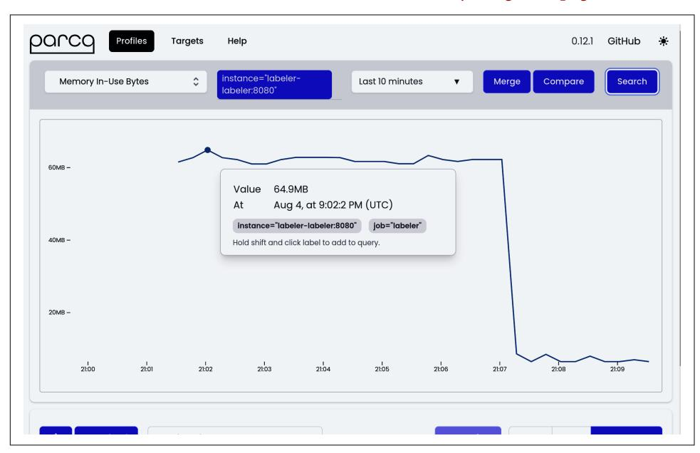

*Figure 9-14. Screenshot of Parca UI result showing the labeler [Figure 9-9](#page-381-0) inuse\_alloc profiles over time*

You can now click on samples in the graph, representing the moment of taking the profile snapshot. Thanks to continuous form, you can choose the time that interests you the most, perhaps the moment when the memory usage was the highest! Once clicked, the Flame Graph of that specific profile appears, as presented in [Figure 9-15.](#page-396-0)

<span id="page-396-0"></span>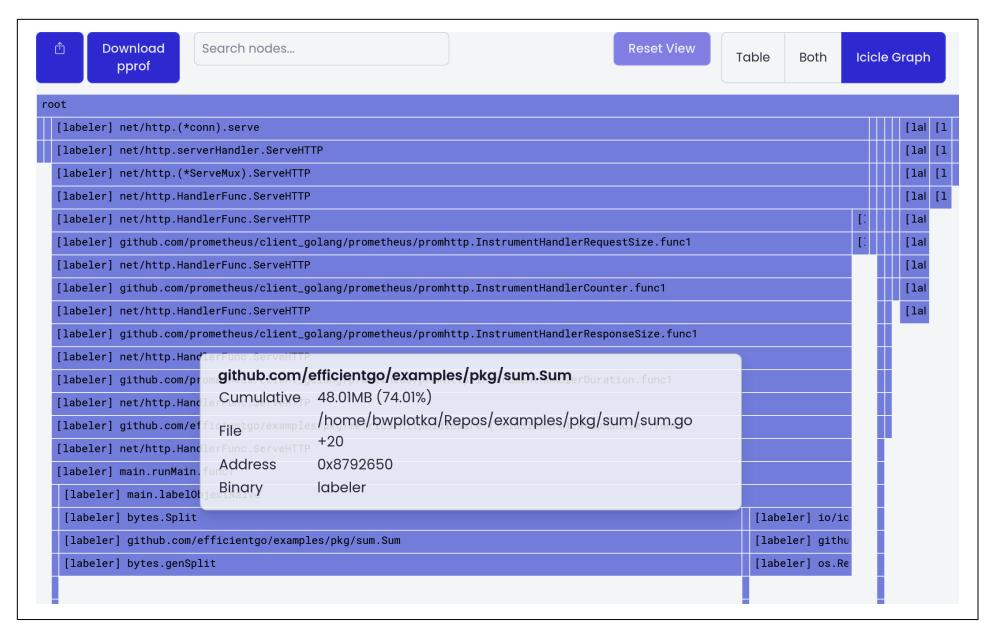

*Figure 9-15. Screenshot of Parca UI Flame Graph (called Icicle Graph in Parca) when you click the specific profile from [Figure 9-4](#page-367-0)*

The Parca maintainers decided to use a different visual style for the Flame Graphs than the go tool pprof tool in ["Flame Graph" on page 352](#page-371-0). However, as many other tools in the profiling space, it uses the same semantics. This means we can use our analyzing skills from go tool pprof specifics with different UIs like Parca.

In the profile view, we can download the pprof file we selected. We can share the profile as discussed in ["Sharing Profiles" on page 373,](#page-392-0) filter view, or choose different views. We also see a Flame Graph representing the function's contributions to the live objects in a heap for the selected time. We could not easily capture that manually. In [Figure 8-5](012-chapter-8-benchmarking-versus-stress-and-load-tests.md#page-342-0), I captured the profile after the interesting event happened, so I had to use alloc\_space that shows the total allocations from when the program started. For a long-living process, this view might be very noisy and show situations that I am not interested in. Even worse, the process might have restarted after certain events, like panics or OOMs. Doing such a heap profile after restart will tell us nothing. A similar problem occurs with every other profile that only shows the current or specific moment, like goroutines, CPUs, or our custom file descriptor profile.

This is where continuous profiling proves to be extremely helpful. It allows us to have profiles captured whenever an interesting event occurs, so we can quickly jump into the UI and analyze for efficiency bottlenecks. For example, in Figure 9-15, we can see the bytes.Split as the function that uses the most memory on the heap at the cur‐ rent moment.

<span id="page-397-0"></span>
#### Overhead of Continuous Profiling

Capturing on-demand profiles has some overhead to the running Go program. However, capturing multiple profiles periodically makes this overhead continuous throughout the application run, so ensure your profilers do not cause your efficiency to drop below the expected level.

Try to understand the overhead of profiling in your programs. The standard default Go profilers aim to not add more than 5% of the CPU overhead for a single process. You can control that by chang‐ ing the continuous profiling interval or the sampling of profiles. It is also useful to profile [only one of many of the same replicas in](https://oreil.ly/yAACa) [large deployments](https://oreil.ly/yAACa) to amortize collection cost.

In our [infrastructure at Red Hat,](https://oreil.ly/6CSV7) we run continuous profiling always on with a one-minute interval, and we keep only a few days' worth of profiles.

To sum up, I recommend continuous profiling on live Go programs that you know might need continuous efficiency improvement in the future. Parca is one open source example, but there are other projects or vendors<sup>27</sup> that allow you to do the same. Just be careful, as profiling might be addictive!

### Comparing and Aggregating Profiles

The pprof format has one more interesting characteristic. By design, it allows certain aggregations or comparison for multiple profiles:

#### Subtracting profiles

You can subtract one profile from another. This is useful to reduce noise and narrow down to the event or component you care about. For example, you can have a heap profile from one run of your Go program when you load tested simultaneously with some A and B events. Then, you can subtract the heap sec‐ ond profile you have from the same Go program that was load tested with only the B event to check what the impact was purely from the A event. The go tool pprof allows you to subtract one profile from another using the -base flag—for example, go tool pprof heap-AB.pprof -base heap-B.pprof.

<sup>27</sup> [Phlare,](https://oreil.ly/Ru0Hu) [Pyroscope,](https://oreil.ly/eKyK7) [Google Cloud Profiler](https://oreil.ly/OGoVR), [AWS CodeGuru Profiler](https://oreil.ly/urVE0), or [Datadog continuous profiler](https://oreil.ly/El7zq), to name a few.

<span id="page-398-0"></span>
#### Comparing profiles

[The comparison](https://oreil.ly/NHfZP) is similar to subtracting; instead of removing matching sample values, it provides negative or positive delta numbers between profiles. This is useful to measure the change of the contribution of a particular function before and after optimization. You can also use go tool pprof to compare your pro‐ files using -diff\_base.

#### Merging profiles

It is less known in the community, but you can merge multiple profiles into one! The merging functionality allows us to combine profiles representing the current situation. For example, we could take dozens of short CPU profiles into a single profile of all the CPU work across a longer duration. Or perhaps we could merge multiple heap profiles to the aggregate profile of all heap objects from multiple time points.

The go tool pprof does not support this. However, you can write your own Go program that does it using the [google/pprof/profile.Merge](https://oreil.ly/bvoSL) function.

I wasn't using these mechanics very often because I was easily confused with multiple local pprof files when working with the go tool pprof tool. This changed when I started working with more advanced profiling tools like Parca. As you can see in [Figure 9-14](#page-395-0), there is a Compare button to compare two particular profiles, and a Merge button to combine all profiles from the focused time range into one profile. With the UI, it is much easier to select what profiles you want to compare or aggre‐ gate, and how!

### Summary

Profiling space for Go might be nuanced, but it's not that difficult to utilize once you know the basics. In this chapter, we went through all the profiling aspects from the common profilers, through capturing patterns and pprof format, to standard visuali‐ zation techniques. Finally, we touched on advanced techniques like continuous profiling, which I recommend trying.


#### Profile First, Ask Questions Later

I would suggest using profiling in any shape that fits in your daily optimization workflow. Ask questions like what is causing the slowdown or high resource usage in your code only after you have already captured the profiles from your program.

<span id="page-399-0"></span>I believe this is not the end of the innovations in this space. Thanks to common effi‐ cient profiling formats like pprof that allow interoperability across different tools and profilers, we will see more tools, UI, useful visualizations, or even correlations with different observability signals mentioned in [Chapter 6.](010-chapter-6-efficiency-observability.md#page-212-0)

Furthermore, more eBPF profiles are emerging in the open source ecosystem, making profiling cheaper and more uniform across programming languages. So be openminded and try different techniques and tools to find out what works best for you, your team, or your organization.
