# Chapter 10: Optimization Examples

<span id="page-400-0"></span>It's finally time to collect all the tools, skills, and knowledge you gathered from the previous chapters and apply some optimizations! In this chapter, we will try to rein‐ force the pragmatic optimization flow by going through some examples.

We will attempt to optimize the naive implementation of the Sum from [Example 4-1.](008-chapter-4-how-go-uses-the-cpu-resource-or-two.md#page-134-0) I will show you how the TFBO (from ["Efficiency-Aware Development Flow"](007-chapter-3-conquering-efficiency.md#page-121-0) on page [102](007-chapter-3-conquering-efficiency.md#page-121-0)) can be applied to three different sets of efficiency requirements.

Optimizations/pessimizations don't generalize very well. It all depends on the code, so measure each time and don't cast absolute judgments.

—Bartosz Adamczewski, [Tweet](https://oreil.ly/oW3ND) (2022)

We will use our optimization stories as a foundation for some optimization patterns summarized in the next chapter. Learning about thousands of optimization cases that happened in the past is not very useful. Every case is different. The compiler and lan‐ guage change, so any "brute-force" attempt to try those thousands of optimizations one by one is not pragmatic.<sup>1</sup> Instead, I have focused on equipping you with the knowledge, tools, and practices that will let you find a more efficient solution to your problem!


Please don't focus on particular optimizations, e.g., the specific algorithmic or code changes I applied. Instead, try to follow how I came up with those changes, how I found what piece of code to optimize first, and how I assessed the change.

<sup>1</sup> For example, I already know about a [strconv.ParseInt](https://oreil.ly/IZxm7) optimization coming to Go 1.20, which would change the memory efficiency of the naive [Example 4-1](008-chapter-4-how-go-uses-the-cpu-resource-or-two.md#page-134-0) without any optimization from my side.

<span id="page-401-0"></span>We will start in "Sum Examples" by introducing the three problems. Then we will take the Sum and perform the optimizations in ["Optimizing Latency"](#page-402-0) on page 383, ["Optimizing Memory Usage" on page 395,](#page-414-0) and ["Optimizing Latency Using Concur‐](#page-421-0) [rency" on page 402.](#page-421-0) Finally, we will mention some other ways we could solve our goals in ["Bonus: Thinking Out of the Box" on page 411](#page-430-0). Let's go!

## Sum Examples

In [Chapter 4](008-chapter-4-how-go-uses-the-cpu-resource-or-two.md#page-130-0), we introduced a simple Sum implementation in [Example 4-1](008-chapter-4-how-go-uses-the-cpu-resource-or-two.md#page-134-0) that sums large numbers of integers provided in a file.<sup>2</sup> Let's leverage all the learning you have gained and use it to optimize [Example 4-1.](008-chapter-4-how-go-uses-the-cpu-resource-or-two.md#page-134-0) As we learned in ["Resource-Aware Effi‐](007-chapter-3-conquering-efficiency.md#page-105-0) [ciency Requirements" on page 86,](007-chapter-3-conquering-efficiency.md#page-105-0) we can't "just" optimize—we have to have some goal in mind. In this section, we will repeat the efficiency optimization flow three times, each time with different requirements:

- Lower latency with a maximum of one CPU used
- Minimal amount of memory
- Even lower latency with four CPU cores available for the workload

The terms *lower* or *minimal* are not very professional. Ideally, we have some more specific numbers to aim for, in a written form like a RAER. A quick Big O analysis can tell us that the Sum runtime complexity is at least O(*N*)—we have to revisit all lines at least once to compute the sum. Thus, the absolute latency goal, like "Sum has to be faster than 100 milliseconds," won't work as its problem space depends on the input. We can always find big enough input that violates any latency goals.

One way to address this is to specify the maximum possible input with some assump‐ tions and latency goals. The second is to define the required runtime complexity as a function that depends on input—so throughput. Let's do the latter and specify the amortized latency function for the Sum. We can do the same with memory. So let's be more specific. Imagine that, for my hardware, a system design stakeholder came up with the following required goals for the Sum in [Example 4-1:](008-chapter-4-how-go-uses-the-cpu-resource-or-two.md#page-134-0)

- Maximum latency of 10 nanoseconds per line (10 \* *N* nanoseconds) with maxi‐ mum one CPU used
- Latency as above and a maximum of 10 KB of memory allocated on the heap for any input

<sup>2</sup> If you are interested in what input files I used, see [the code I used](https://oreil.ly/0SMxA) for generating the input.

<span id="page-402-0"></span>• Maximum latency of 2.5 nanoseconds per line (2.5 \* *N* nanoseconds) with maxi‐ mum four CPU used


### What If We Can't Match This Goal?

It might be the case that the goals we initially aimed for will be hard to achieve due to underestimation of the problem, new requirements, or new knowledge. This is fine. In many cases, we can try to renegotiate the goals. For example, as we dissected in ["Optimization Design Levels" on page 98](007-chapter-3-conquering-efficiency.md#page-117-0), every optimization beyond a certain point costs more and more in time, effort, risk, and readability, so it might be cheaper to add more machines, CPUs, or RAM to the problem. The key is to estimate those costs roughly and help stakeholders decide what's best for them.

Following the TFBO flow, before we optimize, we first have to benchmark. Fortu‐ nately, we already discussed designs of benchmarks for the Sum code in ["Go Bench‐](012-chapter-8-benchmarking-versus-stress-and-load-tests.md#page-296-0) [marks" on page 277,](012-chapter-8-benchmarking-versus-stress-and-load-tests.md#page-296-0) so we can go ahead and use [Example 8-13](012-chapter-8-benchmarking-versus-stress-and-load-tests.md#page-315-0) for our benchmarks. I used the command presented in Example 10-1 to perform 5 10-second benchmarks with a 2 million integer input file and limited to 1 CPU.

*Example 10-1. The command to invoke the benchmark*

```
export ver=v1 && go test -run '^$' -bench '^BenchmarkSum$' \
 -benchtime 10s -count 5 -cpu 1 -benchmem \
 -cpuprofile=${ver}.cpu.pprof -memprofile=${ver}.mem.pprof | tee ${ver}.txt
```

With [Example 4-1](008-chapter-4-how-go-uses-the-cpu-resource-or-two.md#page-134-0), the preceding benchmark yielded the following results: 101 ms, 60.8 MB space allocated, and 1.60 million allocations per operation. Therefore, we will use that as our baseline.

### Optimizing Latency

Our requirements are clear. We need to make the Sum function in [Example 4-1](008-chapter-4-how-go-uses-the-cpu-resource-or-two.md#page-134-0) faster to achieve a throughput of at least 10 \* *N* nanoseconds. The baseline results give us 50 \* *N* nanoseconds. Time to see if there are any quick optimizations!

<span id="page-403-0"></span>

In ["Complexity Analysis" on page 240](011-chapter-7-data-driven-efficiency-assessment.md#page-259-0), I shared a detailed com‐ plexity of the Sum function that clearly outlines the problems and bottlenecks. However, I used information from this section to define that. For now, let's forget that we discussed such complexity and try to find all the information from scratch.

The best way is to perform a bottleneck analysis using the profiles explained in [Chap‐](013-chapter-9-data-driven-bottleneck-analysis.md#page-348-0) [ter 9.](013-chapter-9-data-driven-bottleneck-analysis.md#page-348-0) I captured the CPU profile on every benchmark with [Example 8-4](012-chapter-8-benchmarking-versus-stress-and-load-tests.md#page-301-0), so I could quickly bring the Flame Graph of the CPU time, as presented in Figure 10-1.

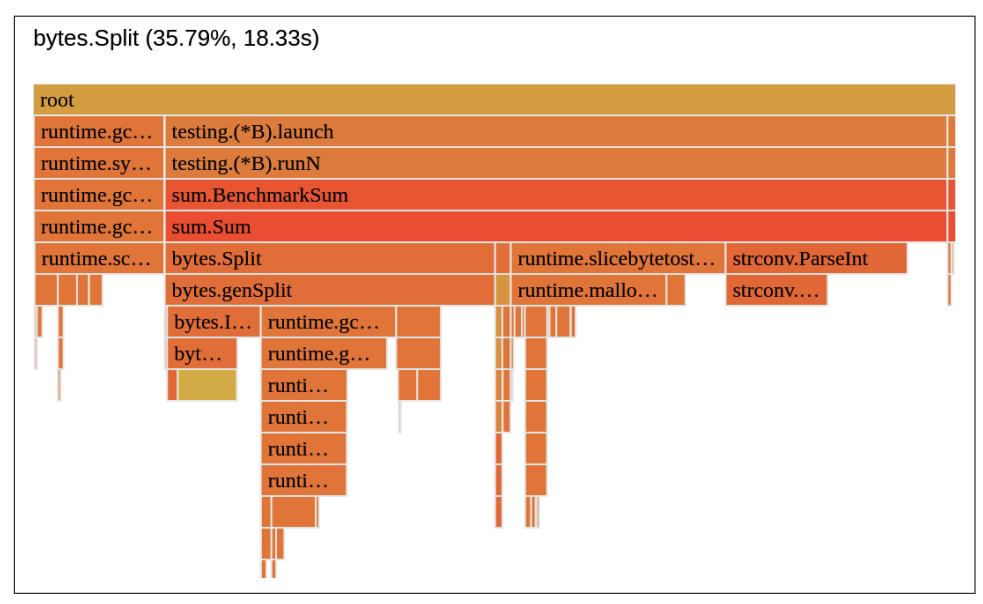

*Figure 10-1. Flame Graph view of [Example 4-1](008-chapter-4-how-go-uses-the-cpu-resource-or-two.md#page-134-0) CPU time with function granularity*

Profiling gives us a great overview of the situation. We see four clear major contribu‐ tors to the CPU time usage:

- bytes.Split
- strconv.ParseInt
- Runtime function runtime.slicebytetostr..., which ends with runtime.mal loc, meaning we spent a lot of CPU time allocating memory
- Runtime function runtime.gcBgMarkWorker, which indicates GC runs

<span id="page-404-0"></span>The CPU profile gives us a list of functions we can go through and potentially cut out some CPU usage. However, as we learned in ["Off-CPU Time" on page 369](013-chapter-9-data-driven-bottleneck-analysis.md#page-388-0), the CPU time might not be a bottleneck here. Therefore, we must first confirm if our function here is CPU bound, I/O bound, or mixed.

One way of doing this is by manually reading the source code. We can see that the only external medium used in [Example 4-1](008-chapter-4-how-go-uses-the-cpu-resource-or-two.md#page-134-0) is a file, which we use to read bytes from. The rest of the code should only perform computations using the memory and CPU.

This makes this code a mixed-bound job, but how mixed? Should we start with file reads optimization or CPU time?

The best way to find this out is the data-driven way. Let's check both CPU and off-CPU latency thanks to the full goroutine profile (fgprof) discussed in ["Off-CPU](013-chapter-9-data-driven-bottleneck-analysis.md#page-388-0) [Time" on page 369](013-chapter-9-data-driven-bottleneck-analysis.md#page-388-0). To collect it in the Go benchmark, I quickly wrapped our bench‐ mark from [Example 8-13](012-chapter-8-benchmarking-versus-stress-and-load-tests.md#page-315-0) with the fgprof profile in Example 10-2.

#### Example 10-2. Go benchmark with fgprof profiling

```
// BenchmarkSum_fgprof recommended run options:
// $ export ver=v1fg && go test -run '^$' -bench '^BenchmarkSum_fgprof' \
// -benchtime 60s -cpu 1 | tee ${ver}.txt 
func BenchmarkSum_fgprof(b *testing.B) {
 f, err := os.Create("fgprof.pprof")
 testutil.Ok(b, err)
 defer func() { testutil.Ok(b, f.Close()) }()
 closeFn := fgprof.Start(f, fgprof.FormatPprof)
 BenchmarkSum(b)
 testutil.Ok(b, closeFn())
}
```

- To get more reliable results, we have to measure for longer than five seconds. Let's measure for 60 seconds to be sure.
- To reuse code and have better reliability, we can execute the same [Example 8-13](012-chapter-8-benchmarking-versus-stress-and-load-tests.md#page-315-0) benchmark, just wrapped with the fgprof profile.

The resulting fgprof.pprof profile after 60 seconds is presented in [Figure 10-2.](#page-405-0)

<span id="page-405-0"></span>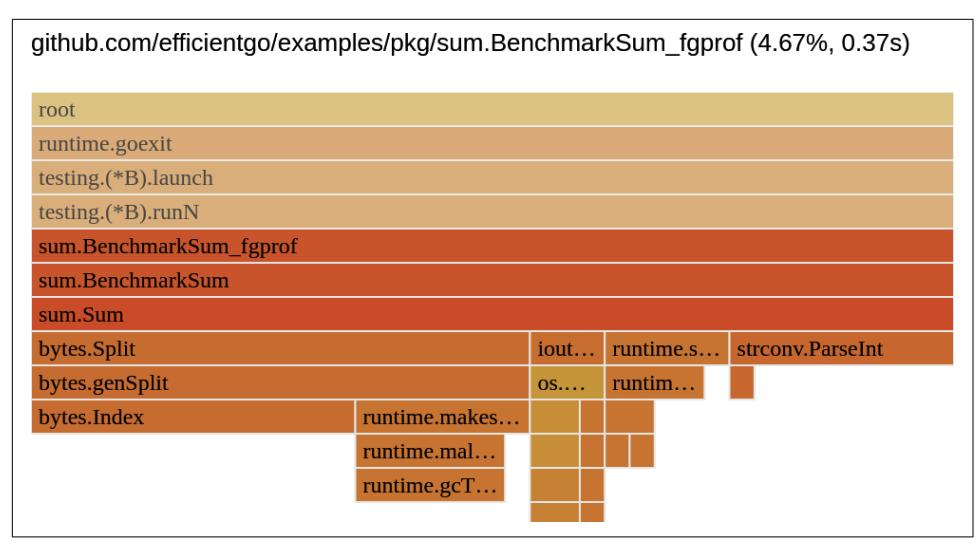

*Figure 10-2. Flame Graph view of [Example 4-1](008-chapter-4-how-go-uses-the-cpu-resource-or-two.md#page-134-0) CPU and off-CPU time with function granularity*

The full goroutine profile confirms that our workload is a mix of I/O (5%<sup>3</sup> ) and CPU time (majority). So while we have to worry about latency introduced by file I/O at some point, we can optimize CPU time first. So let's go ahead and focus on the big‐ gest bottleneck first: the bytes.Split function that takes almost 36% of the Sum CPU time, as seen in [Figure 10-1](#page-403-0).


#### Optimize One Thing at a Time

Thanks to [Figure 10-1,](#page-403-0) we found four main bottlenecks. However, I have chosen to focus on the biggest one in our first optimization in Example 10-3.

It is important to iterate one optimization at a time. It feels slower than if we would try to optimize all we know about now, but in practice, it is more effective. Each optimization might affect the other and introduce more unknowns. We can draw more reliable conclusions, e.g., compare the contributions percentage between profiles. Furthermore, why eliminate four bottlenecks if optimizing first might be enough to match our requirements?

<sup>3</sup> There is a small segment in Figure 10-2 that shows ioutil.ReadFile latency with 0.38% of all samples. When we unfold the ReadFile, the syscall.Read (which we could assume is an I/O latency) takes 0.25%, given the sum.BenchmarkSum\_fgprof contributes to 4.67% of overall wall time (the rest is taken by benchmarking and CPU profiling). The (0.25 \* 100%)/4.67 is equal to 5.4%.

<span id="page-406-0"></span>
### Optimizing bytes.Split

To figure out where the CPU time is spent in bytes.Split, we have to try to under‐ stand what this function does and how. By [definition,](https://oreil.ly/UqAg8) it splits a large byte slice into smaller slices based on the potentially multicharacter separator sep. Let's quickly look at the [Figure 10-1](#page-403-0) profile and focus on that function using the Refine options. This would show [bytes.Index](https://oreil.ly/DQrCS), and impact allocations and garbage collections with func‐ tions like makeslice and runtime.gcWriteBarrierDX. Furthermore, we could quickly look into the Go source code for the [genSplit](https://oreil.ly/pCMH1) used by bytes.Split to check how it's implemented. This should give us a few warning signals. There might be things that bytes.Split does but might not be necessary for our case:

- genSplit goes through the slices first [to count how many slices we expect](https://oreil.ly/Wq6F4) to have.
- genSplit allocates [a two-dimensional byte slice](https://oreil.ly/YzXdr) to put the results in. This is scary because for a large 7.2 MB byte slice with 2 million lines, it will allocate a slice with 2 million elements. A memory profile confirms that a lot of memory is allo‐ cated by this line.<sup>4</sup>
- Then it will iterate two million times using the [bytes.Index](https://oreil.ly/8diMw) function we saw in the profile. That is two million times we will go and gather bytes until the next separator.
- The separator in bytes.Split is a multicharacter, which requires a more compli‐ cated algorithm. Yet we need a simple, single-line newline separator.

Unfortunately, such an analysis of the mature standard library functions might be difficult for more beginner Go developers. What parts of this CPU time or memory usage are excessive, and what aren't?

What always helps me to answer this question is to go back to the algorithm design phase and try to design my own simplest splitting-lines algorithm tailored for the Sum problem. When we understand what a simple, efficient algorithm could look like and we are happy with it, we can then start challenging existing implementations. It turns out there is a very simple flow that might work for [Example 4-1.](008-chapter-4-how-go-uses-the-cpu-resource-or-two.md#page-134-0) Let's go through it in Example 10-3.

<sup>4</sup> We can further inspect that using ["Heap" on page 360](013-chapter-9-data-driven-bottleneck-analysis.md#page-379-0) profile, which would in my tests show us that 78.6% of the total 60.8 MB of allocation per operation is taken by bytes.Split!

```
func Sum2(fileName string) (ret int64, _ error) {
 b, err := os.ReadFile(fileName)
 if err != nil {
 return 0, err
 }
 var last int
 for i := 0; i < len(b); i++ {
 if b[i] != '\n' {
 continue
 }
 num, err := strconv.ParseInt(string(b[last:i]), 10, 64)
 if err != nil {
 return 0, err
 }
 ret += num
 last = i + 1
 }
 return ret, nil
}
```

- We record the index of the last seen newline, plus one, to tell where the next line starts.
- Compared to bytes.Split, we can hardcode a new line as our separator. In one loop iteration, while reusing the b byte slice, we can find the full line, parse the integer, and perform the sum. This algorithm is also often called "in place."

Before we come to any conclusion, we have to first check if our new algorithm works functionally. After successfully verifying it using the unit test, I ran [Example 8-13](012-chapter-8-benchmarking-versus-stress-and-load-tests.md#page-315-0) with the Sum2 function instead of Sum to assess its efficiency. The results are optimis‐ tic, with 50 ms and 12.8 MB worth of allocations. Compared to bytes.Split, we could perform 50% less work while using 78% less memory. Knowing that bytes.Split was responsible for ~36% of CPU time and 78.6% of memory alloca‐ tions, such an improvement tells us we completely removed this bottleneck from our code!

<span id="page-408-0"></span>

#### Standard Functions Might Not Be Perfect for All Cases

The preceding example of working optimization asks why the bytes.Split function wasn't optimal for us. Can't the Go commu‐ nity optimize it?

The answer is that bytes.Split and other standard or custom functions you might import on the internet could be not as effi‐ cient as the tailored algorithm for your requirements. Such a popu‐ lar function has to be, first of all, reliable for many edge cases that you might not have (e.g., multicharacter separator). Those are often optimized for cases that might be more involved and com‐ plex than our own.

It doesn't mean we have to rewrite all imported functions now. No, we should just be aware of the possibility of easy efficiency gains by providing a tailored implementation for critical paths. Still, we should use known and battle-tested code like a standard library. In most cases, it's good enough!

Is our Example 10-3 optimization our final one? Not quite—while we improved the throughput, we are at the 25 \* *N* nanoseconds mark, still far from our goal.

### Optimizing runtime.slicebytetostring

The CPU profile from the Example 10-3 benchmark should give us a clue about the next bottleneck, shown in Figure 10-3.

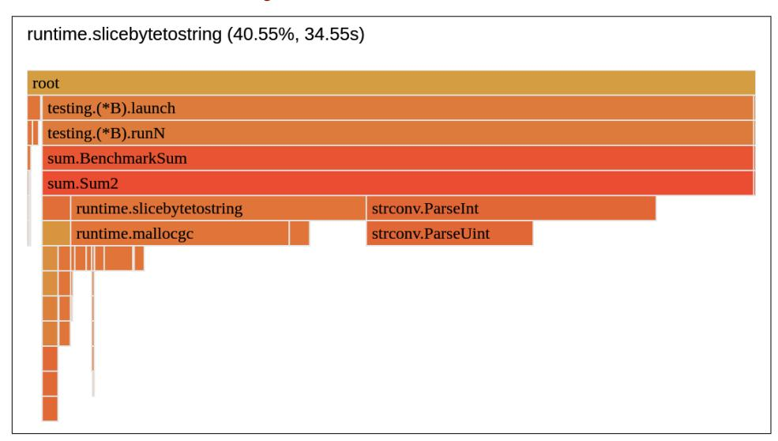

*Figure 10-3. Flame Graph view of Example 10-3 CPU time with function granularity*

<span id="page-409-0"></span>As the next bottleneck, let's take this odd runtime.slicebytetostring function that spends most of its CPU time allocating memory. If we look for it in the Source or Peek view, it points us to the num, err := strconv.ParseInt(string(b[last:i]), 10, 64) line in Example 10-3. Since this CPU time contribution is not accounted for to strconv.ParseInt (a separate segment), it tells us that it has to be executed before we invoke strconv ParseInt, yet in the same code line. The only dynamically exe‐ cuted things are the b byte slice subslicing and conversion to string. On further inspection, we can tell that the string conversion is expensive here.<sup>5</sup>

What's interesting is that [string](https://oreil.ly/7dv5w) is essentially a special [byte](https://oreil.ly/fYwwq) slice with no Cap field (capacity in string is always equal to length). As a result, at first it might be surpris‐ ing that the Go compiler spends so much time and memory on this. The reason is that string(<byte slice>) is equivalent to creating a new byte slice with the same number of elements, copying all bytes to a new byte, and then returning the string from it. The main reason for copying is that, by design, string [type is immutable,](https://oreil.ly/I4fER) so every function can use it without worrying about potential races. There is, however, a relatively safe way to convert []byte to string. Let's do that in Example 10-4.

*Example 10-4. Sum3 is Example 10-3 with optimized CPU bottleneck of string conversion*

```
// import "unsafe"
func zeroCopyToString(b []byte) string {
 return *((*string)(unsafe.Pointer(&b)))
}
func Sum3(fileName string) (ret int64, _ error) {
 b, err := os.ReadFile(fileName)
 if err != nil {
 return 0, err
 }
 var last int
 for i := 0; i < len(b); i++ {
 if b[i] != '\n' {
 continue
 }
 num, err := strconv.ParseInt(zeroCopyToString(b[last:i]), 10, 64)
 if err != nil {
 return 0, err
 }
```

<sup>5</sup> We can deduce that from the runtime.slicebytetostring function name in the profile. We can also split this line into three lines (string conversion in one, subslicing in the second, and invoking the parsing function in the third) and profile again to be sure.

```
 ret += num
 last = i + 1
 }
 return ret, nil
}
```

We can use the unsafe package to remove the type information from b and form an unsafe.Pointer. Then we can dynamically cast this to different types, e.g., string. It is unsafe because if the structures do not share the same layout, we might have memory safety problems or nondeterministic values. Yet the layout is shared between []byte and string, so it's safe for us. It is used in production in many projects, including Prometheus, known as [yoloString](https://oreil.ly/QmqCn).

The zeroCopyToString allows us to convert file bytes to string required by ParseInt with almost no overhead. After functional tests, we can confirm this by using the same benchmark with the Sum3 function again. The benefit is clear—Sum3 takes 25.5 ms for 2 million integers and 7.2 MB of allocated space. This means it is 49.2% faster than Example 10-3 when it comes to CPU time. The memory usage is also better, with our program allocating almost precisely the size of the input file—no more, no less.


#### Deliberate Trade-offs

With unsafe, no-copy bytes to string conversion, we enter a delib‐ erate optimization area. We introduced potentially unsafe code and added more nontrivial complexity to our code. While we clearly named our function zeroCopyToString, we have to justify and use such optimization only if necessary. In our case, it helps us reach our efficiency goals, so we can accept these drawbacks.

Are we fast enough? Not yet. We are almost there with 12.7 \* *N* nanoseconds throughput. Let's see if we can optimize something more.

### Optimizing strconv.Parse

Again, let's look at the newest CPU profile from the [Example 10-4](#page-409-0) benchmark to see the latest bottleneck we could try to check, as shown in [Figure 10-4](#page-411-0).

<span id="page-411-0"></span>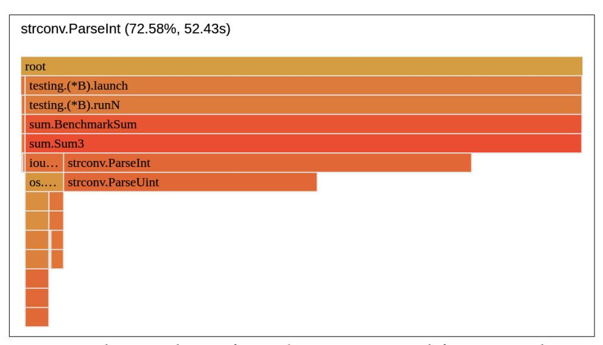

*Figure 10-4. Flame Graph view of [Example 10-4](#page-409-0) CPU time with function granularity*

With strconv.Parse using 72.6%, we can gain a lot if we can improve its CPU time. Similar to bytes.Split, we should check its profile and [implementation](https://oreil.ly/owR53). Following both paths, we can immediately outline a couple of elements that feel like excessive work:

- We check for an empty string twice, in [ParseInt](https://oreil.ly/gqJpb) and [ParseUint](https://oreil.ly/BB9Ie). Both are visible as nontrivial CPU time used in our profile.
- ParseInt allows us to parse to integers with different bases and bit sizes. We don't need this generic functionality or extra input to check our Sum3 code. We only care about 64-bit integers of base 10.

One solution here is similar to bytes.Split: finding or implementing our own ParseInt function that focuses on efficiency—does what we need and nothing more. The standard library offers the [strconv.Atoi](https://oreil.ly/CpZeF) function, which looks promising. How‐ ever, it still requires strings as input, which forces us to use unsafe package code. Instead, let's try to come up with our own quick implementation. After a few itera‐ tions of testing and microbenchmarking my new ParseInt function,<sup>6</sup> we can come up with the fourth iteration of our sum functionality, presented in [Example 10-5.](#page-412-0)

<sup>6</sup> In benchmarks, I also found that my ParseInt is also faster by 10% to strconv.Atoi for the Sum test data.

<span id="page-412-0"></span>*Example 10-5. Sum4 is [Example 10-4](#page-409-0) with optimized CPU bottleneck of string conversion*

```
func ParseInt(input []byte) (n int64, _ error) {
 factor := int64(1)
 k := 0
 if input[0] == '-' {
 factor *= -1
 k++
 }
 for i := len(input) - 1; i >= k; i-- {
 if input[i] < '0' || input[i] > '9' {
 return 0, errors.Newf("not a valid integer: %v", input)
 }
 n += factor * int64(input[i]-'0')
 factor *= 10
 }
 return n, nil
}
func Sum4(fileName string) (ret int64, err error) {
 b, err := os.ReadFile(fileName)
 if err != nil {
 return 0, err
 }
 var last int
 for i := 0; i < len(b); i++ {
 if b[i] != '\n' {
 continue
 }
 num, err := ParseInt(b[last:i])
 if err != nil {
 return 0, err
 }
 ret += num
 last = i + 1
 }
 return ret, nil
}
```

The side effect of our integer parsing optimization is that we can tailor our ParseInt to parse from a byte slice, not a string. As a result, we can simplify our code and avoid unsafe zeroCopyToString conversion. After tests and benchmarks, we see that Sum4 achieves 13.6 ms, 46.66% less than [Example 10-4,](#page-409-0) with the same memory allocations. <span id="page-413-0"></span>The full comparison of our sum functions is presented in Example 10-6 using our beloved benchstat tool.

*Example 10-6. Running benchstat on the results from all four iterations with a two million line file*

```
$ benchstat v1.txt v2.txt v3.txt v4.txt
name \ (time/op) v1.txt v2.txt v3.txt v4.txt
Sum 101ms ± 0% 50ms ± 2% 25ms ± 0% 14ms ± 0% 
name \ (alloc/op) v1.txt v2.txt v3.txt v4.txt
Sum 60.8MB ± 0% 12.8MB ± 0% 7.2MB ± 0% 7.2MB ± 0%
name \ (allocs/op) v1.txt v2.txt v3.txt v4.txt
Sum 1.60M ± 0% 1.60M ± 0% 0.00M ± 0% 0.00M ± 0%
```

Notice that benchstat can round some numbers for easier comparison with the large number from *v1.txt*. The *v4.txt* result is 13.6 ms, not 14 ms, which can make a difference in throughput calculations.

It seems like our hard work paid off. With the current results, we achieved 6.9 \* *N* nanoseconds throughput, which is more than enough to fulfill our first goal. How‐ ever, we only checked it with two million integers. Are we sure the same throughput can be maintained with larger or smaller input sizes? Our Big O runtime complexity O(*N*) would suggest so, but I ran the same benchmark with 10 million integers just in case. The 67.8 ms result gives the 6.78 \* *N* nanoseconds throughput. This more or less confirms our throughput number.

The code in [Example 10-5](#page-412-0) is not the fastest or most memory-efficient solution possi‐ ble. There might be more optimizations to the algorithm or code to improve things further. For example, if we profile [Example 10-5](#page-412-0), we would see a relatively new seg‐ ment, indicating 14% of total CPU time used. It's os.ReadFile code that wasn't so visible on past profiles, given other bottlenecks and something we didn't touch with our optimizations. We will mention its potential optimization in ["Pre-Allocate If You](015-chapter-11-optimization-patterns.md#page-459-0) [Can" on page 440](015-chapter-11-optimization-patterns.md#page-459-0). We could also try concurrency (which we will do in ["Optimizing](#page-421-0) [Latency Using Concurrency" on page 402](#page-421-0)). However, with one CPU, we cannot expect a lot of gains here.

What's important is that there is no need to improve anything else in this iteration, as we achieved our goal. We can stop the work and claim success! Fortunately, we did not need to add magic or dangerous nonportable tricks to our optimization flow. Only readable and easier deliberate optimizations were required.

<span id="page-414-0"></span>
### Optimizing Memory Usage

In the second scenario, our goal is focused on memory consumption while maintain‐ ing the same throughput. Imagine we have a new business customer for our software with Sum functionality that needs to run on an IoT device with little RAM available for this program. As a result, the requirement is to have a streaming algorithm: no matter the input size, it can only use 10 KB of heap memory in a single moment.

Such a requirement might look extreme at first glance, given the naive code in [Example 4-1](008-chapter-4-how-go-uses-the-cpu-resource-or-two.md#page-134-0) has a quite large space complexity. If a 10 million line, 36 MB file requires 304 MB of heap memory for [Example 4-1](008-chapter-4-how-go-uses-the-cpu-resource-or-two.md#page-134-0), how can we ensure the same file (or bigger!) can take a maximum of 10 KB of memory? Before we start to worry, let's analyze what we can do on this subject.

Fortunately, we already did some optimization work that improved memory alloca‐ tions as a side effect. Since the latency goal still applies, let's start with Sum4 in [Example 10-5,](#page-412-0) which fulfills that. The space complexity of Sum4 seems to be around O(*N*). It still depends on the input size and is far from our 10 KB goal.

### Moving to Streaming Algorithm

Let's pull up the heap profile from the Sum4 benchmark in Figure 10-5 to figure out what we can improve.

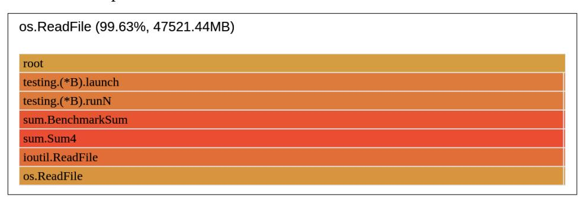

*Figure 10-5. Flame Graph view of [Example 10-5](#page-412-0) heap allocations with function granu‐ larity (alloc\_space)*

The memory profile is very boring. The first line allocates 99.6% of memory in [Example 10-5](#page-412-0). We essentially read the whole file into memory so we can iterate over the bytes in memory. Even if we waste some allocation elsewhere, we can't see it because of excessive allocation from os.ReadFile. Is there anything we can do about that?

During our algorithm, we must go through all the bytes in the file; thus, we have to read all bytes eventually. However, we don't need to read all of them to memory at <span id="page-415-0"></span>the same time. Technically, we only need a byte slice big enough to hold all digits for an integer to be parsed. This means we can try to design [the external memory algo‐](https://oreil.ly/Dr3MB) [rithm](https://oreil.ly/Dr3MB) to stream bytes in chunks. We can try using the existing bytes scanner from the standard library—the [bufio.Scanner](https://oreil.ly/CqiG7). For example, Sum5 in the Example 10-7 imple‐ mentation uses it to scan enough memory to read and parse a line.

*Example 10-7. Sum5 is [Example 10-5](#page-412-0) with bufio.Scanner*

```
func Sum5(fileName string) (ret int64, err error) {
 f, err := os.Open(fileName)
 if err != nil {
 return 0, err
 }
 defer errcapture.Do(&err, f.Close, "close file")
 scanner := bufio.NewScanner(f)
 for scanner.Scan() {
 num, err := ParseInt(scanner.Bytes())
 if err != nil {
 return 0, err
 }
 ret += num
 }
 return ret, scanner.Err()
}
```

- Instead of reading the whole file into memory, we open the file descriptor here.
- We have to make sure the file is closed after the computation so as not to leak resources. We use errcapture to get notified about potential errors in the deferred file Close.
- The scanner .Scan() method tells us if we hit the end of the file. It returns true if we still have bytes to result in splitting. The split is based on the provided func‐ tion in the .Split method. By default, [ScanLines](https://oreil.ly/YUpLU) is what we want.
- Don't forget to check the scanner error! With such iterator interfaces, it's very easy to forget to check its error.

To assess efficiency, now focusing more on memory, we can use the same [Example 8-13](012-chapter-8-benchmarking-versus-stress-and-load-tests.md#page-315-0) with Sum5. However, given our past optimizations, we've moved dan‐ gerously close to what can be reasonably measured within the accuracy and overhead of our tools for input files on the order of a million lines. If we got into microsecond latencies, our measurements might be skewed, given limits in the instrumentation accuracy and benchmarking tool overheads. So let's increase the file to 10 million <span id="page-416-0"></span>lines. The benchmarked Sum4 in [Example 10-5](#page-412-0) for that input results in 67.8 ms and 36 MB of memory allocated per operation. The Sum5 with the scanner outputs 157.1 ms and 4.33 KB per operation.

In terms of memory usage, this is great. If we look at the implementation, the scanner [allocates an initial 4 KB](https://oreil.ly/jbpJc) and uses it for reading the line. It increases this if needed when the line is longer, but our file doesn't have numbers longer than 10 digits, so it stays at 4 KB. Unfortunately, the scanner isn't fast enough for our latency require‐ ment. With a 131% slowdown to Sum4, we hit 15.6 \* *N* nanoseconds latency, which is too slow. We have to optimize latency again, knowing we still have around 6 KB to allocate to stay within the 10 KB memory goal.

### Optimizing bufio.Scanner

What can we improve? As usual, it's time to check the source code and profile of [Example 10-7](#page-415-0) in Figure 10-6.

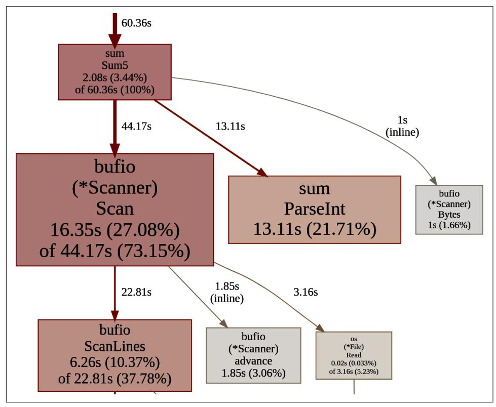

*Figure 10-6. Graph view of [Example 10-7](#page-415-0) CPU time with function granularity*

<span id="page-417-0"></span>The commentary on the Scanner structure in the standard library gives us a hint. It tells us that "Scanner [is for safe, simple jobs".](https://oreil.ly/6eXZE) The ScanLines is the main bottleneck here, and we can swap the implementation with a more efficient one. For example, the original function removes [carriage return \(CR\) control characters](https://oreil.ly/wwUbC), which wastes cycles for us as our input does not have them. I managed to provide optimized Scan Lines, which improves the latency by 20.5% to 125 ms, which is still too slow.

Similar to previous optimizations, it might be worth writing a custom streamed scan‐ ning implementation instead of bufio.Scanner. The Sum6 in Example 10-8 presents a potential solution.

*Example 10-8. Sum6 is [Example 10-5](#page-412-0) with buffered read*

```
func Sum6(fileName string) (ret int64, err error) {
 f, err := os.Open(fileName)
 if err != nil {
 return 0, err
 }
 defer errcapture.Do(&err, f.Close, "close file")
 buf := make([]byte, 8*1024)
 return Sum6Reader(f, buf)
}
func Sum6Reader(r io.Reader, buf []byte) (ret int64, err error) {
 var offset, n int
 for err != io.EOF {
 n, err = r.Read(buf[offset:])
 if err != nil && err != io.EOF {
 return 0, err
 }
 n += offset
 var last int
 for i := range buf[:n] {
 if buf[i] != '\n' {
 continue
 }
 num, err := ParseInt(buf[last:i])
 if err != nil {
 return 0, err
 }
 ret += num
 last = i + 1
 }
 offset = n - last
 if offset > 0 {
```

```
 _ = copy(buf, buf[last:n])
 }
 }
 return ret, nil
}
```

We create a single 8 KB buffer of bytes we will use for reading. I chose 8 KB and not 10 KB to leave some headroom within our 10 KB limit. The 8 KB also feels like a great number given the OS page is 4 KB, so we know it will need only 2 pages.

This buffer assumes that no integer is larger than ~8,000 digits. We can make it much smaller, even down to 10, as we know our input file does not have num‐ bers with more than 9 digits (plus the newline). However, this would make the algorithm much slower due to the certain waste explained in the next steps. Additionally, even without waste reading, 8 KB is faster than reading 8 bytes 1,024 times due to overhead.

- This time, let's separate functionality behind the convenient io.Reader interface. This will allow us to reuse Sum6Reader in the future.<sup>7</sup>
- In each iteration, we read the next 8 KB, minus offset bytes from a file. We start reading more file bytes after offset bytes to leave potential room for digits we didn't parse yet. This can happen if we read bytes that split some numbers into parts, e.g., we read ...\n12 and 34/n... in two different chunks.
- In the error handling, we excluded the io.EOF sentinel error, which indicated we hit the end of the file. That's not an error for us—we still want to process the remaining bytes.
- The number of bytes we have to process from the buffer is exactly n + offset, where n is the number of bytes read from a file. The end of file n can be smaller than what we asked for (length of the buf).
- We iterate over n bytes in the buf buffer.<sup>8</sup> Notice that we don't iterate over the whole slice because in an err == io.EOF situation, we might read less than 10

<sup>7</sup> Interestingly enough, just adding a new function call and interface slows down the program by 7% per opera‐ tion on my machine, proving that we are on a very high efficiency level already. However, given reusability, perhaps we can afford that slowdown.

<sup>8</sup> As an interesting fact, if we replace this line with a technically simpler loop like for i := 0; i < n; i++ {, the code is 5% slower! Don't take it as a rule (always measure!), as it probably depends on your workload, but it's interesting to see the range loop (without a second argument) be more efficient here.

KB of bytes, so we need to process only n of them. We process all lines found in our 10 KB buffer in each loop iteration.

We calculate offset, and if there is a need for one, we shift the remaining bytes to the front. This creates a small waste in CPU, but we don't allocate anything additional. Benchmarks will tell us if this is fine or not.

Our Sum6 code got a bit bigger and more complex, so hopefully, it gives good effi‐ ciency results to justify the complexity. Indeed, after the benchmark, we see it takes 69 ms and 8.34 KB. Just in case, let's put [Example 10-8](#page-417-0) to the extra test by computing an even larger file—100 million lines. With bigger input, Sum6 yields 693 ms and around 8 KB. This gives us a 6.9 \* *N* nanoseconds latency (runtime complexity) and space (heap) complexity of ~8 KB, which satisfies our goal.

Careful readers might still be wondering if I didn't miss anything. Why is space com‐ plexity 8 KB, not 8 + *x* KB? There are some additional bytes allocated for 10 million line files and even more bytes for larger ones. How do we know that at some point for a hundred-times larger file, the memory allocation would not exceed 10 KB?

If we are very strict and tight on that 10 KB allocation goal, we can try to figure out what happens. The most important thing is to validate that there is nothing that grows allocation with the file size. This time the memory profile is also invaluable, but to understand things fully, let's ensure we record all allocations by adding run time.MemProfileRate = 1 in our BenchmarkSum benchmark. The resulting profile is presented in Figure 10-7.

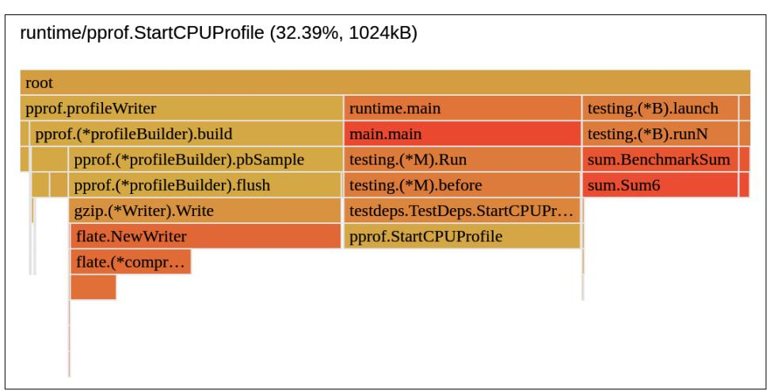

*Figure 10-7. Flame Graph view of [Example 10-8](#page-417-0) memory with function granularity and profile rate 1*

<span id="page-420-0"></span>We can see more allocations from the pprof package than our function. This indi‐ cates a relatively large allocation overhead by the profiling itself! Still, it does not prove that Sum does not allocate anything else on the heap than our 8 KB buffer. The Source view turns out to be helpful, presented in Figure 10-8.

*Figure 10-8. Source view of [Example 10-8](#page-417-0) memory with profile rate 1 after benchmark with 1,000 iterations and 10 MB input file*

It shows that Sum6 has only one heap allocation point. We can also benchmark without CPU profiling, which now gives stable 8,328 heap allocated bytes for any input size.

Success! Our goal is met, and we can move to the last task. The overview of each iter‐ ation's achieved result is shown in Example 10-9.

*Example 10-9. Running benchstat on the results from all 3 iterations with a 10 million line file*

```
$ benchstat v1.txt v2.txt v3.txt v4.txt
name \ (time/op) v4-10M.txt v5-10M.txt v6-10M.txt
Sum 67.8ms ± 3% 157.1ms ± 2% 69.4ms ± 1%
name \ (alloc/op) v4-10M.txt v5-10M.txt v6-10M.txt
Sum 36.0MB ± 0% 0.0MB ± 3% 0.0MB ± 0%
name \ (allocs/op) v4-10M.txt v5-10M.txt v6-10M.txt
Sum 5.00 ± 0% 4.00 ± 0% 4.00 ± 0%
```

<span id="page-421-0"></span>
### Optimizing Latency Using Concurrency

Hopefully, you are ready for the last challenge: getting our latency down even more to the 2.5 nanoseconds per line level. This time we have four CPU cores available, so we can try introducing some concurrency patterns to achieve it.

In ["When to Use Concurrency" on page 145](008-chapter-4-how-go-uses-the-cpu-resource-or-two.md#page-164-0), we mentioned the clear need for con‐ currency to employ asynchronous programming or event handling in our code. We talked about relatively easy gains where our Go program does a lot of I/O operations. However, in this section, I would love to show you how to improve the speed of our Sum in the [Example 4-1](008-chapter-4-how-go-uses-the-cpu-resource-or-two.md#page-134-0) code using concurrency with two typical pitfalls. Because of the tight latency requirement, let's take an already optimized version of Sum. Given we don't have any memory requirements, and Sum4 in [Example 10-5](#page-412-0) is only a little slower than Sum6, yet has a smaller amount of lines, let's take that as a start.

### A Naive Concurrency

As usual, let's pull out the [Example 10-5](#page-412-0) CPU profile, shown in Figure 10-9.

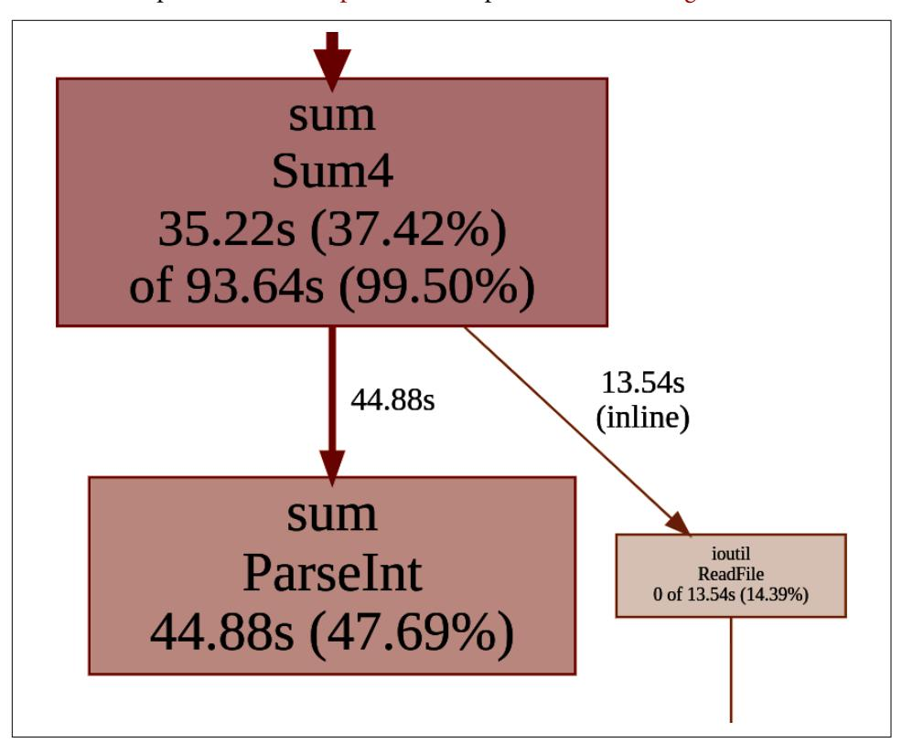

*Figure 10-9. Graph view of [Example 10-5](#page-412-0) CPU time with function granularity*

<span id="page-422-0"></span>As you might have noticed, most of [Example 10-5](#page-412-0) CPU time comes from ParseInt (47.7%). Since we're back to reading the whole file at the beginning of the program, the rest of the program is strictly CPU bound. As a result, with only one CPU we couldn't expect better latency with [the concurrency](https://oreil.ly/rsLff). However, given that within this task we have four CPU cores available, our task now is to find a way to evenly split the work of parsing the file's contents with as little coordination<sup>9</sup> between goroutines as possible. Let's explore three example approaches to optimize [Example 10-5](#page-412-0) with concurrency.

The first thing we have to do is find computations we can do independently at the same time—computations that do not affect each other. Because the sum is commu‐ tative, it does not matter in what order numbers are added. The naive, concurrent implementation could parse the integer from the string and add the result atomically to the shared variable. Let's explore this rather simple solution in Example 10-10.

*Example 10-10. Naive concurrent optimization to [Example 10-5](#page-412-0) that spins a new goroutine for each line to compute*

```
func ConcurrentSum1(fileName string) (ret int64, _ error) {
 b, err := os.ReadFile(fileName)
 if err != nil {
 return 0, err
 }
 var wg sync.WaitGroup
 var last int
 for i := 0; i < len(b); i++ {
 if b[i] != '\n' {
 continue
 }
 wg.Add(1)
 go func(line []byte) {
 defer wg.Done()
 num, err := ParseInt(line)
 if err != nil {
 // TODO(bwplotka): Return err using other channel.
 return
 }
 atomic.AddInt64(&ret, num)
 }(b[last:i])
 last = i + 1
 }
 wg.Wait()
 return ret, nil
```

<sup>9</sup> We discussed synchronization primitives in ["Go Runtime Scheduler" on page 138.](008-chapter-4-how-go-uses-the-cpu-resource-or-two.md#page-157-0)

<span id="page-423-0"></span>After the successful functional test, it's time for benchmarking. Similar to previous steps, we can reuse the same [Example 8-13](012-chapter-8-benchmarking-versus-stress-and-load-tests.md#page-315-0) by simply replacing Sum with Concurrent Sum1. I also changed the -cpu flag to 4 to unlock the four CPU cores. Unfortunately, the results are not very promising—for a 2 million line input, it takes about 540 ms and 151 MB of allocated space per operation! Almost 40 times more time than the simpler, noncurrent [Example 10-5.](#page-412-0)

### A Worker Approach with Distribution

Let's check the CPU profile in Figure 10-10 to learn why.

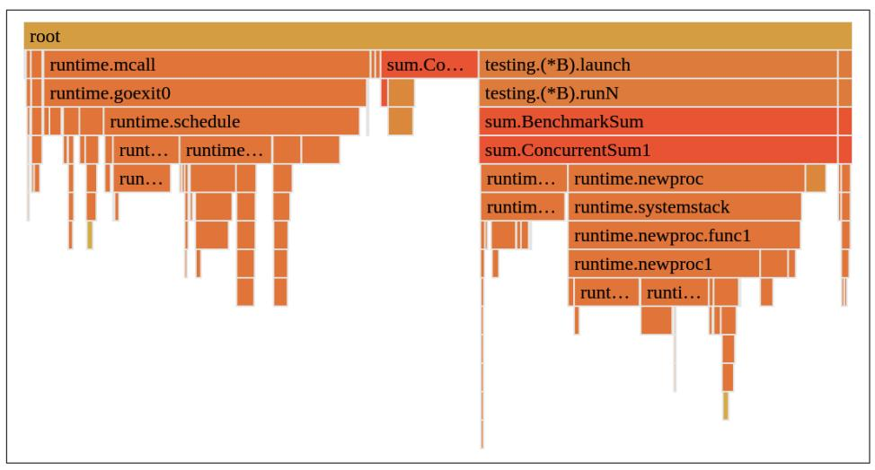

*Figure 10-10. Flame Graph view of [Example 10-10](#page-422-0) CPU time with function granularity*

The Flame Graph clearly shows the goroutine creation and scheduling overhead indi‐ cated by blocks called runtime.schedule and runtime.newproc. There are three main reasons why [Example 10-10](#page-422-0) is too naive and not recommended for our case:

- The concurrent work (parsing and adding) is too fast to justify the goroutine overhead (both in memory and CPU usage).
- For larger datasets, we create potentially millions of goroutines. While goroutines are relatively cheap and we can have hundreds of them, there is always a limit, given only four CPU cores to execute. So you can imagine the delay of the sched‐ uler that tries to fairly schedule millions of goroutines on four CPU cores.
- Our program will have a nondeterministic performance depending on the num‐ ber of lines in the file. We can potentially hit a problem of unbounded concur‐ rency since we will spam as many goroutines as the external file has lines (something outside our program control).

<span id="page-424-0"></span>That is not what we want, so let's improve our concurrent implementation. There are many ways we could go from here, but let's try to address all three problems we notice. We can solve problem number one by assigning more work to each goroutine. We can do that thanks to the fact that addition is also associative and cumulative. We can essentially group work into multiple lines, parse and add numbers in each goroutine, and add partial results to the total sum. Doing that automatically helps with problem number two. Grouping work means we will schedule fewer goroutines. The question is, what is the best number of lines in a group? Two? Four? A hundred?

The answer most likely depends on the number of goroutines we want in our process and the number of CPUs available. There is also problem number three—unbounded concurrency. The typical solution here is to use a worker pattern (sometimes called goroutine pooling). In this pattern, we agree on a number of goroutines up front, and we schedule all of them at once. Then we can create another goroutine that will dis‐ tribute the work evenly. Let's see an example implementation of that algorithm in Example 10-11. Can you predict if this implementation will be faster?

*Example 10-11. Concurrent optimization of [Example 10-5](#page-412-0) that maintains a finite set of goroutines that computes a group of lines. Lines are distributed using another goroutine.*

```
func ConcurrentSum2(fileName string, workers int) (ret int64, _ error) {
 b, err := os.ReadFile(fileName)
 if err != nil {
 return 0, err
 }
 var (
 wg = sync.WaitGroup{}
 workCh = make(chan []byte, 10)
 )
 wg.Add(workers + 1)
 go func() {
 var last int
 for i := 0; i < len(b); i++ {
 if b[i] != '\n' {
 continue
 }
 workCh <- b[last:i]
 last = i + 1
 }
 close(workCh)
 wg.Done()
 }()
 for i := 0; i < workers; i++ {
 go func() {
```

```
 var sum int64
 for line := range workCh {
 num, err := ParseInt(line)
 if err != nil {
 // TODO(bwplotka): Return err using other channel.
 continue
 }
 sum += num
 }
 atomic.AddInt64(&ret, sum)
 wg.Done()
 }()
 }
 wg.Wait()
 return ret, nil
}
```

- Remember, the sender is usually responsible for the closing channel. Even if our flow does not depend on it, it's a good practice to always close channels after use.
- Beware of common mistakes. The for \_, line := range <-workCh would sometimes compile as well, and it looks logical, but it's wrong. It will wait for the first message from the workCh channel and iterate over single bytes from the received byte slice. Instead, we want to iterate over messages.

Tests pass, so we can start benchmarking. Unfortunately, on average, this implemen‐ tation with 4 goroutines takes 207 ms to complete a single operation (using 7 MB of space). Still, this is 15 times slower than simpler, sequential [Example 10-5](#page-412-0).

### A Worker Approach Without Coordination (Sharding)

What's wrong this time? Let's investigate the CPU profile presented in Figure 10-11.

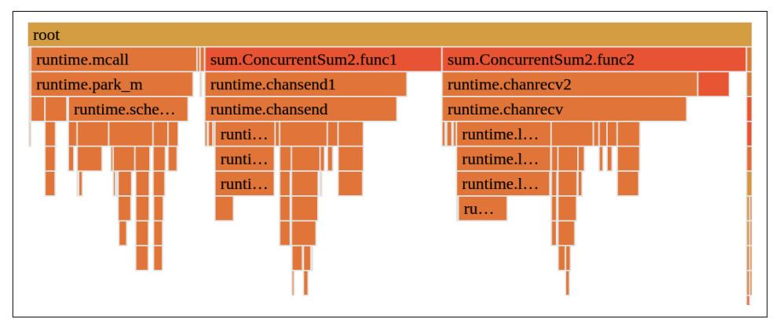

*Figure 10-11. Flame Graph view of [Example 10-11](#page-424-0) CPU time with function granularity*

<span id="page-426-0"></span>If you see a profile like this, it should immediately tell you that the concurrency over‐ head is again too large. We still don't see the actual work, like parsing integers, since this work has outnumbered the overhead. This time the overhead is caused by three elements:

#### runtime.schedule

The runtime code responsible for scheduling goroutines.

#### runtime.chansend

In our case, waiting on the lock to send to our single channel.

#### runtime.chanrecv

The same as chansend but waiting on a read from the receive channel.

As a result, parsing and additions are faster than the communication overhead. Essentially, coordination and distribution of the work take more CPU resources than the work itself.

We have multiple options for improvement here. In our case, we can try to remove the effort of distributing the work. We can accomplish this via a coordination-free algorithm that will shard (split) the workload evenly across all goroutines. It's coordi‐ nation free because there is no communication to agree on which part of the work is assigned to each goroutine. We can do that thanks to the fact that the file size is known up front, so we can use some sort of heuristic to assign each part of the file with multiple lines to each goroutine worker. Let's see how this could be imple‐ mented in Example 10-12.

*Example 10-12. Concurrent optimization of [Example 10-5](#page-412-0) that maintains a finite set of goroutines that computes groups of lines. Lines are sharded without coordination.*

```
func ConcurrentSum3(fileName string, workers int) (ret int64, _ error) {
 b, err := os.ReadFile(fileName)
 if err != nil {
 return 0, err
 }
 var (
 bytesPerWorker = len(b) / workers
 resultCh = make(chan int64)
 )
 for i := 0; i < workers; i++ {
 go func(i int) {
 // Coordination-free algorithm, which shards
 // buffered file deterministically.
 begin, end := shardedRange(i, bytesPerWorker, b)
 var sum int64
```

```
 for last := begin; begin < end; begin++ {
 if b[begin] != '\n' {
 continue
 }
 num, err := ParseInt(b[last:begin])
 if err != nil {
 // TODO(bwplotka): Return err using other channel.
 continue
 }
 sum += num
 last = begin + 1
 }
 resultCh <- sum
 }(i)
 }
 for i := 0; i < workers; i++ {
 ret += <-resultCh
 }
 close(resultCh)
 return ret, nil
}
```

shardedRange is not supplied for clarity. This function takes the size of the input file and splits into bytesPerWorker shards (four in our case). Then it gives each worker the i-th shard. You can see the full code [here](https://oreil.ly/By9wO).

Tests pass too, so we confirmed that [Example 10-12](#page-426-0) is functionally correct. But is it faster? Yes! The benchmark shows 7 ms and 7 MB per operation, which is almost twice as fast as sequential [Example 10-5.](#page-412-0) Unfortunately, this puts us in 3.4 \* *N* nano‐ seconds throughput, which is failing our goal of 2.5 \* *N*.

### A Streamed, Sharded Worker Approach

Let's profile in [Figure 10-12](#page-428-0) one more time to check if we can improve anything easily.

The CPU profile shows that the work done by our goroutines takes the most CPU time. However, ~10% of CPU time is spent reading all bytes, which we can also try to do concurrently. This effort does not look promising at first glance. However, even if we would remove all 10% of the CPU time, 10% better throughput gives us only the 3.1 \* *N* nanoseconds number, so not enough.

<span id="page-428-0"></span>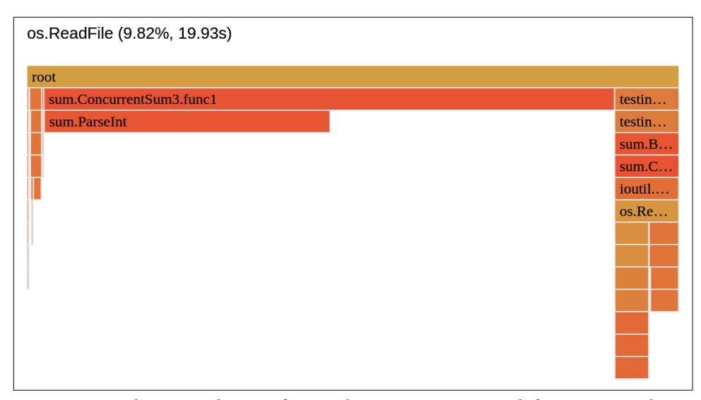

*Figure 10-12. Flame Graph view of [Example 10-12](#page-426-0) CPU time with function granularity*

This is where we have to be vigilant, though. As you can imagine, reading files is not a CPU-bound job, so perhaps the actual real time spend on that 10% of CPU time makes os.ReadFile a bigger bottleneck, thus a better option for us to optimize. As in ["Optimizing Latency" on page 383,](#page-402-0) let's perform a benchmark wrapped with the fgprof profile! The resulting full goroutine profile is presented in Figure 10-13.

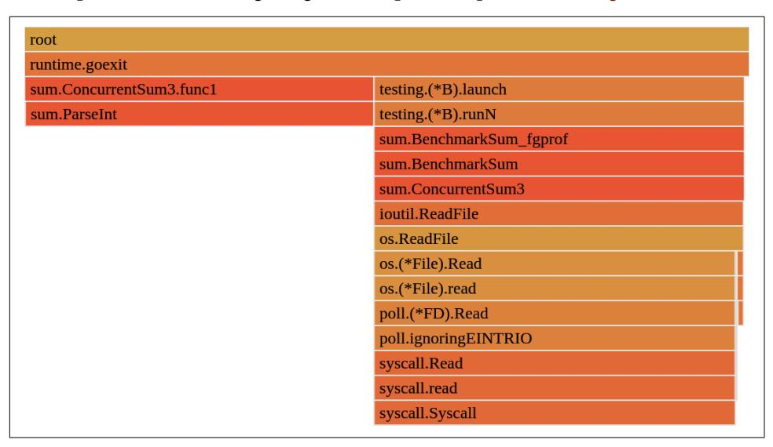

*Figure 10-13. Flame Graph view of [Example 10-12](#page-426-0) full goroutine profile with function granularity*

<span id="page-429-0"></span>The fgprof profile shows that a lot can be gained in latency if we try to read files concurrently, as it currently takes around 50% of the real time! This is way more promising, so let's try to move file reads to worker goroutines. The example imple‐ mentation is shown in Example 10-13.

*Example 10-13. Concurrent optimization of [Example 10-12](#page-426-0) that also reads from a file concurrently using separate buffers*

```
func ConcurrentSum4(fileName string, workers int) (ret int64, _ error) {
 f, err := os.Open(fileName)
 if err != nil {
 return 0, err
 }
 defer errcapture.Do(&err, f.Close, "close file")
 s, err := f.Stat()
 if err != nil {
 return 0, err
 }
 var (
 size = int(s.Size())
 bytesPerWorker = size / workers
 resultCh = make(chan int64)
 )
 if bytesPerWorker < 10 {
 return 0, errors.New("can't have less bytes per goroutine than 10")
 }
 for i := 0; i < workers; i++ {
 go func(i int) {
 begin, end := shardedRangeFromReaderAt(i, bytesPerWorker, size, f)
 r := io.NewSectionReader(f, int64(begin), int64(end-begin))
 b := make([]byte, 8*1024)
 sum, err := Sum6Reader(r, b)
 if err != nil {
 // TODO(bwplotka): Return err using other channel.
 }
 resultCh <- sum
 }(i)
 }
 for i := 0; i < workers; i++ {
 ret += <-resultCh
 }
 close(resultCh)
 return ret, nil
}
```

- <span id="page-430-0"></span>Instead of splitting the bytes from the input file in memory, we tell each gorout‐ ine what bytes from the file it can read. We can do this thanks to the [Section](https://oreil.ly/j4cQd) [Reader](https://oreil.ly/j4cQd), which returns a reader that only allows reading from a particular section. There is a small complexity in [shardedRangeFromReaderAt](https://oreil.ly/PwNty) to make sure we read all lines (we don't know where the newlines in a file are), but it can be done in the relatively easy algorithm presented here.
- We can reuse [Example 10-8](#page-417-0) for this job as it knows how to use any io.Reader implementation, so in our example, both \*os.File and \*io.SectionReader.

Let's assess the efficiency of that code. Finally, after all this work, [Example 10-13](#page-429-0) yields an astonishing 4.5 ms per operation for 2 million lines, and 23 ms for 10 mil‐ lion lines. This takes us into ~2.3 \* *N* nanosecond throughput, which satisfies our goal! A full comparison of latencies and memory allocations for successful iterations is presented in Example 10-14.

*Example 10-14. Running benchstat on the results from all four iterations with a two million line file*

```
name \ (time/op) v4-4core.txt vc3.txt vc4.txt
Sum-4 13.3ms ± 1% 6.9ms ± 6% 4.5ms ± 3%
name \ (alloc/op) v4-4core.txt vc3.txt vc4.txt
Sum-4 7.20MB ± 0% 7.20MB ± 0% 0.03MB ± 0%
```

To summarize, we went through three exercises showcasing the optimization flow focused on different goals. I also have some possible concurrency patterns that allow utilizing our multicore machines. Generally, I hope you saw how critical benchmark‐ ing and profiling were throughout this journey! Sometimes the results might surprise you, so always seek confirmation of your ideas.

There is, however, another way to solve those exercises in an innovative way that might work for certain use cases. Sometimes it allows us to avoid the huge optimiza‐ tion effort we did in the past three sections. Let's take a look!

### Bonus: Thinking Out of the Box

Given the challenging goals we set in this chapter, I spent a lot of time optimizing and explaining optimization for the naive Sum implementation in [Example 4-1.](008-chapter-4-how-go-uses-the-cpu-resource-or-two.md#page-134-0) This showed you some optimization ideas, practices, and generally a mental model I use during optimization efforts. But hard optimization work is not always an answer there are numerous ways to reach our goals.

For example, what if I told you there is a way to get amortized runtime complexity of a few nanoseconds and zero allocations (and just four more code lines)? Let's see Example 10-15.

*Example 10-15. Adding simplest caching to [Example 4-1](008-chapter-4-how-go-uses-the-cpu-resource-or-two.md#page-134-0)*

```
var sumByFile = map[string]int64{}
func Sum7(fileName string) (int64, error) {
 if s, ok := sumByFile[fileName]; ok {
 return s, nil
 }
 ret, err := Sum(fileName)
 if err != nil {
 return 0, err
 }
 sumByFile[fileName] = ret
 return ret, nil
}
```

sumByFile represents the simplest storage for cache. There are tons of more pro‐ duction read-caching implementations you can consider as well. We can write our own that will be goroutine safe. If we need more involved eviction policies, I would recommend [HashiCorp's golang-lru](https://oreil.ly/nnYoM) and the even more optimized [Dgraph's ristretto](https://oreil.ly/QNshi). For distributed systems, you should use distributed caching services like [Memcached,](https://oreil.ly/fudbQ) [Redis,](https://oreil.ly/1ovP1) or peer-to-peer caching solutions like [groupcache.](https://oreil.ly/vJONo)

The functional test passes, and the benchmarks show amazing results—for 100 million line files, we see 228 ns and 0 bytes allocated! This example is, of course, a very trivial one. It's unlikely our optimization journey is always as easy as that. Simple caching is limited and can't be used if the file input constantly changes. But what if we can?

Think smart, not hard. It might be the case that we don't need to optimize [Example 4-1](008-chapter-4-how-go-uses-the-cpu-resource-or-two.md#page-134-0) because the same input files are constantly used. Caching a single sum value for each file is cheap—even if we would have a million of those files, we can cache all using a few megabytes. If that's not the case, perhaps the file content often repeats, but the filename is unique. In that case, we could calculate the checksum of the file and cache based on that. It would be faster than parsing all lines into integers.

Focus on the goal and be smart and innovative. For example, a hard, week-long, deep optimization effort might not be worth it if there is some smart solution that avoids that work!

<span id="page-432-0"></span>
### Summary

We did it! We optimized the initial naive implementation of [Example 4-1](008-chapter-4-how-go-uses-the-cpu-resource-or-two.md#page-134-0) using the TFBO flow from ["Efficiency-Aware Development Flow" on page 102.](007-chapter-3-conquering-efficiency.md#page-121-0) Guided by the requirements, we managed to improve the Sum code significantly:

- We improved the runtime complexity from around 50.5 \* *N* nanoseconds (where N is a number of lines) to 2.25 \* *N*. This means around 22 times faster latency, even though both naive and most optimized algorithms are linear (we optimized O(*N*) constants).
- We improved the space complexity from around 30.4 \* *N* bytes to 8 KB, which means our code had O(*N*) asymptotic complexity but now has constant space complexity. This means the new Sum code will be much more predictable for the users and more friendly for the garbage collector.

To sum up, sometimes efficiency problems require a long and careful optimization process, as we did for Sum. On the other hand, sometimes, you can find quick and pragmatic optimization ideas that fulfill your goals quickly. Nevertheless, we all learned a lot from the exercises in this chapter (including me!).

Let's move to the last chapter of this book, where we will summarize some learning and patterns we saw during our exercises in this chapter, and what I have seen in the community from my experience.
