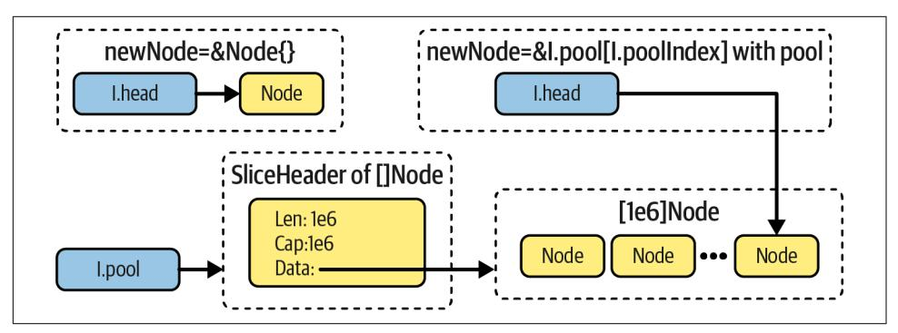
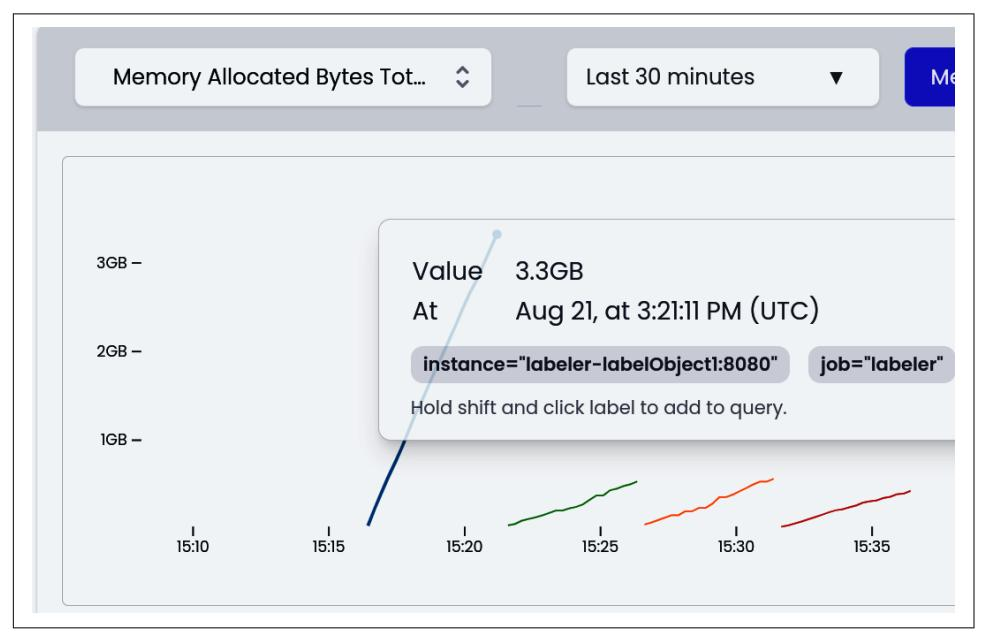
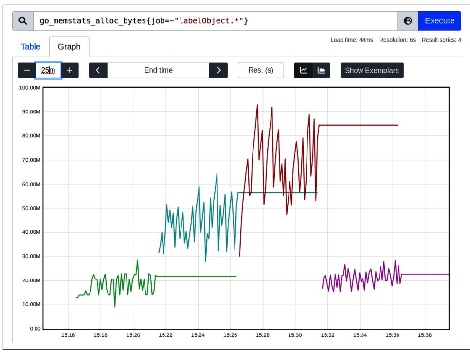

# Chapter 11: Optimization Patterns

<span id="page-434-0"></span>With all we've learned from the past 10 chapters, it's time to go through various pat‐ terns and common pitfalls I found when developing efficient code in Go. As I men‐ tioned in [Chapter 10,](014-chapter-10-optimization-examples.md#page-400-0) the optimization suggestion doesn't generalize well. However, given you should know at this point how to assess code changes effectively, there is no harm in stating some common patterns that improve efficiency in certain cases.


## Be a Mindful Go Developer

Remember that most optimization ideas you will see here are highly deliberate. This means we have to have a good reason to add them as they take the developer's time to get right and maintain in the future. Even if you learn about some common optimization, ensure it improves efficiency for your specific workload.

Don't use this chapter as a strict manual but as a list of potential options you did not think about. Nevertheless, always stick to the observability, benchmarking, and profiling tools we learned in pre‐ vious chapters to ensure the optimizations you do are pragmatic, follow [YAGNI](https://oreil.ly/G9OLQ), and are needed.

We will start with ["Common Patterns" on page 416](#page-435-0), where I describe some high-level optimization patterns we could see from optimization examples in [Chapter 10](014-chapter-10-optimization-examples.md#page-400-0). Then I will introduce you to the ["The Three Rs Optimization Method"](#page-440-0) on page 421, an excellent memory optimization framework from the Go (and Prometheus) community.

Finally, in ["Don't Leak Resources" on page 426](#page-445-0), ["Pre-Allocate If You Can" on page 440,](#page-459-0) "Overusing Memory with Arrays" on page 445, and ["Memory Reuse and Pooling" on](#page-468-0) [page 449,](#page-468-0) we will go through a set of specific optimizations, tips, and gotchas I wish I'd

<span id="page-435-0"></span>known when I started my journey with making Go code more efficient. I have chosen the most common ones that are worth being aware of!

Let's start with common optimization patterns. Some of them I used in previous chapters.

### Common Patterns

How can you find optimizations? After benchmarking, profiling, and studying the code, the process requires us to figure out a better algorithm, data structure, or code that will be more efficient. Of course, this is easier said than done.

Some practice and experience help, but we can outline a few patterns that repeat in our optimization journeys. Let's now walk through four generic patterns we see in the programming community and literature: doing less work, and trading functional‐ ity for efficiency, trading space for time, and trading time for space.

### Do Less Work

The first thing we should focus on is avoiding unnecessary work. Especially in ["Opti‐](014-chapter-10-optimization-examples.md#page-402-0) [mizing Latency" on page 383,](014-chapter-10-optimization-examples.md#page-402-0) we improved the CPU time multiple times by remov‐ ing a lot of unnecessary code. It might feel simplistic, but it's a powerful pattern we often forget. If some portion of the code is critical and requires optimization, we can go through bottlenecks (e.g., lines of code with large contributions we see in Source view as we discussed in ["go tool pprof Reports" on page 340](013-chapter-9-data-driven-bottleneck-analysis.md#page-359-0)) and check if we can:

*Skip unnecessary logic*

Can we remove this line? For example, in ["Optimizing Latency" on page 383,](014-chapter-10-optimization-examples.md#page-402-0) strconv.ParseInt had a lot of checks that weren't needed in our implementa‐ tion. We can use the assumptions and requirements we have to our advantage and trim down the functionality that isn't strictly needed. This also includes potential resources we can clean early or any resource leaks (see ["Don't Leak](#page-445-0) [Resources" on page 426](#page-445-0)).


#### Generic Implementations

It's very tempting to approach programming problems with a generic solution. We are trained to see patterns, and program‐ ming languages offer many abstractions and object-oriented paradigms to reuse more code.

As we could see in ["Optimizing Latency" on page 383,](014-chapter-10-optimization-examples.md#page-402-0) while the bytes.Split and strconv.ParseInt functions are well designed, safe to use, and richer in features, they might not always be suitable for critical paths. Being "generic" has many drawbacks, and efficiency is usually the first victim.

#### Do things once

Was it done already? Perhaps we already loop over the same array somewhere else, so we could do more things "in place," as we did in Example 10-3.

There might be cases where we validate some invariant even though it was vali‐ dated before. Or we sort again "just in case," but when we double-check the code, it was sorted already. For example, in the Thanos project, we can do a [k-way](https://oreil.ly/LxjZq) [merge](https://oreil.ly/LxjZq) instead of a naive merge and sort again when merging different metric streams because of the invariant that each stream gives metrics in lexicographic order.

Another common example is reusing memory. For instance, we can create a small buffer once and reuse it, as in [Example 10-8](014-chapter-10-optimization-examples.md#page-417-0), instead of creating a new one every time we need it. We can also use caching or ["Memory Reuse and Pooling"](#page-468-0) [on page 449](#page-468-0).

#### Leverage math to do less

Using math is an amazing way to reduce the work we have to do. For example, to calculate the number of samples retrieved through the Prometheus API, we don't decode chunks and iterate over all samples to count them. Instead, we estimate the number of samples by dividing the size of the chunk by the average sample size.

#### Use the knowledge or precomputed information

Many APIs and functions are designed to be smart and automate certain work, even if it means doing more work. One example is pre-allocation possibilities, discussed in ["Pre-Allocate If You Can" on page 440.](#page-459-0)

In another, more complex example, the [minio-go](https://oreil.ly/YqDZ6) object storage client we use in [objstore](https://oreil.ly/l8xHu) can upload an arbitrary io.Reader implementation. However, the implementation requires calculating the checksum before upload. Thus, if we don't give the total expected size of the bytes available in a reader, minio-go will use additional CPU cycles and memory to buffer the whole, potentially gigabytes-large object. All this just to calculate a checksum that has to be some‐ times sent up front. On the other hand, if we notice this and have the total size handy, providing this information through the API can dramatically improve upload efficiency.

These elements seem like they focus on CPU time and latency, but we can use the same toward memory or any other resource usage. For example, consider a small example in [Example 11-1](#page-437-0) that shows what it means to do "less work" focused on lower memory usage.

<span id="page-437-0"></span>*Example 11-1. The function finding if the slice has a duplicated element optimized with an empty struct. Uses ["Generics" on page 63](006-chapter-2-efficient-introduction-to-go.md#page-82-0).*

```
func HasDuplicates[T comparable](slice ...T) bool {
 dup := make(map[T]any, len(slice))
 for _, s := range slice {
 if _, ok := dup[s]; ok {
 return true
 }
 dup[s] = "whatever, I don't use this value"
 }
 return false
}
func HasDuplicates2[T comparable](slice ...T) bool {
 dup := make(map[T]struct{}, len(slice))
 for _, s := range slice {
 if _, ok := dup[s]; ok {
 return true
 }
 dup[s] = struct{}{}
 }
 return false
}
```

Since we don't use the map value, we can use the struct{} statement, which uses no memory. Thanks to this, the HasDuplicates2 on my machine is 22% faster and allocates 5 times less memory for a float64 slice with 1 million elements. The same pattern can be used in places where we don't care about value. For example, for channels we use to synchronize goroutines, we can use make(chan struct{}) to avoid unnecessary space we don't need.

Usually, there is always room to reduce some effort in our programs. We can use profiling to our advantage to check all expensive parts and their relevance to our problem. Often we can remove or transform those into cheaper forms, gaining efficiency.


#### Be Strategic!

Sometimes, doing less work now means more work or resource usage later. We can be strategic about this and ensure that our local benchmark doesn't miss the important trade-off elsewhere. This problem is highlighted in ["Memory Reuse and Pooling" on page 449](#page-468-0), where the macrobenchmark results give opposite conclusions to the microbenchmark.

<span id="page-438-0"></span>
### Trading Functionality for Efficiency

In some cases, we have to negotiate or remove certain functionality to improve effi‐ ciency. In ["Optimizing Latency" on page 383](014-chapter-10-optimization-examples.md#page-402-0), we can improve the CPU time by removing support for negative integers in the file. Without this requirement, we can remove the check for negative sign in the [Example 10-5](014-chapter-10-optimization-examples.md#page-412-0) ParseInt function! Perhaps this feature is not well used, and it can be traded for cheaper execution!

This is also why accepting all the possible features in the project is often not very sus‐ tainable. In many cases, an extra API, extra parameter, or functionality might add a significant efficiency penalty for critical paths, which could be avoided if we just limit the functionality to a minimum.<sup>1</sup>

### Trading Space for Time

What else can we do if we limit our program's work to a minimum by reducing unnecessary logic, features, and leaks? Generally, we can shift to systems, algorithms, or code that use less time but cost us more in terms of storage, like memory, disk, and so on. Let's walk through some possible changes like this:<sup>2</sup>

#### Precomputing result

Instead of computing the same expensive function, we could try to precompute it and store the result in some table lookup or variable.

These days, it's very common to see a compiler adapting optimization like this. The compiler trades compiler latency and program code space for faster execu‐ tion. For example, statements like 10\*1024\*1024 or 20 \* time.Seconds can be precomputed by a compiler, so they don't have to be computed at runtime.

But there might be cases of more complex function statements that the compiler can't precompute for us. For example, we could use regexp.Must Compile("… ").MatchString( in some condition, which is on a critical path. Perhaps it will be efficient to create a variable pattern := regexp.Must Compile("…") and operate on pattern.MatchString( in that heavily used code instead. On top of that, some cryptographic encryption offer [precompute meth‐](https://oreil.ly/2VBL4) [ods](https://oreil.ly/2VBL4) that speed up execution.

<sup>1</sup> I spoke about this problem at the [GitHub Global Maintainers Summit.](https://oreil.ly/z6YHe)

<sup>2</sup> This list was inspired by Chapter 4 in *Writing Efficient Programs* by Jon Louis Bentley.

<span id="page-439-0"></span>
#### Caching

When the computed results heavily depend on the input, precomputing it for one input that is only used from time to time is not very helpful. Instead, we can introduce caching as we did in [Example 4-1.](008-chapter-4-how-go-uses-the-cpu-resource-or-two.md#page-134-0) Writing our caching solution is a nontrivial effort and should be done with care.<sup>3</sup> There are many [caching policies,](https://oreil.ly/UAhqT) with the Least Recently Used (LRU) being the most popular in my experience. In ["Bonus: Thinking Out of the Box" on page 411,](014-chapter-10-optimization-examples.md#page-430-0) I mentioned a few off-the-shelf solutions in open source that we can use.

#### Augmenting data structure

We can often change the data structure so certain information can be accessed more easily, or by adding more information to the structure. For example, we can store the size next to a file descriptor to know the file size instead of asking for it every time.

In addition, we can maintain a map of elements next to the slice we already have in our structure, so we deduplicate or find elements easier (similar to the dedu‐ plication map I did in [Example 11-1\)](#page-437-0).

#### Decompressing

Compression algorithms are great for saving disk or memory space. However, any compression—e.g., string interning, gzip, [zstd](https://oreil.ly/OEx9B), etc.—have some CPU (thus, time) overhead, so when time is money, we might want to get rid of compres‐ sion. Be careful, though, as enabled compression can improve program latency, e.g., when used for messages across slow networks. Therefore, spending more CPU time to reduce message size so that we can send more with a smaller num‐ ber of network packets can potentially be faster.

Ideally, the decision is deliberate. For example, perhaps we know that based on the RAERs, our program can still use more memory, but we are not meeting the latency goal. In such a case, we could check if there is anything we can add, cache, or store that would allow you to spend less time in our program.

### Trading Time for Space

If we can spare some latency or extra CPU time but are low on memory during the execution, we can try the opposite rule to the previous one, trading space for time. The methods are usually exactly the opposite of those in ["Trading Space for Time" on](#page-438-0) [page 419:](#page-438-0) compressing and encoding more, removing extra fields from the struct, recomputing results, removing caches, etc.

<sup>3</sup> There's a reason some people call caches ["a memory leak you don't know about yet".](https://oreil.ly/KNQP3)

<span id="page-440-0"></span>

#### Trading Space for Time or Time for Space Optimizations Is Not Always Intuitive

Sometimes to save memory resource usage, we have to allocate more first!

For example, in "Overusing Memory with Arrays" on page 445 and ["Memory Reuse and Pooling" on page 449](#page-468-0), I mention situations where allocating more memory or explicitly copying memory is better, despite looking like more work. So it can save us more memory space in the long run.

To sum up, consider the four general rules as higher-level patterns of possible opti‐ mizations. Let me now introduce you to the "three Rs," which helped me a lot to guide some of the optimizations in my efficiency development tasks.

### The Three Rs Optimization Method

The three Rs technique is an excellent method to reduce waste. It is generally applica‐ ble for all computer resources, but it is often used for [ecology purposes](https://oreil.ly/p6elc) to reduce lit‐ eral waste. Thanks to those three ingredients—reduce, reuse, and recycle—we can reduce the impact we have on the Earth's environment and ensure sustainable living.

At [FOSDEM](https://fosdem.org) 2018, I saw [Bryan Boreham's amazing talk](https://oreil.ly/BLIiT), where he described using this method to mitigate memory issues. Indeed, the three Rs method is especially effective against memory allocations, which is the most common source of memory efficiency and GC overhead problems. So, let's explore each "R" component and how each can help.

### Reduce Allocations

Attempting to directly affect the pace [e.g., using GOGC or GOMEMLIMIT] of [garbage] collection has nothing to do with being sympathetic with the collector. It's really about getting more work done between each collection or during the collection. You affect that by reducing the amount or the number of allocations any piece of work adds to heap memory.

—William Kennedy, ["Garbage Collection in Go: Part I—Semantics"](https://oreil.ly/DVdNm)

There is almost always room to reduce allocations—look for the waste! Some ways to reduce the number of objects our code puts on the heap are obvious (reasonable opti‐ mizations like the pre-allocations of slices we saw in [Example 1-4\)](005-chapter-1-software-efficiency-matters.md#page-31-0).

<span id="page-441-0"></span>However, other optimizations require certain trade-offs—typically more CPU time or less readable code, for example:

- [String interning,](https://oreil.ly/qJu7u) where we avoid operating on the string type by providing a dictionary and using a much smaller, pointer-free dictionary of integers repre‐ senting the ID of the string.
- Unsafe conversion from []byte to string [\(and vice versa\) without copying](https://oreil.ly/Y10YT) [memory,](https://oreil.ly/Y10YT) which potentially saves allocations, but if done wrongly can keep more memory in a heap (discussed in [Example 11-15\)](#page-465-0).
- Ensuring that a variable does not escape to the heap can also be considered an effort that reduces allocations.

There are unlimited different ways we could reduce allocations. We already men‐ tioned some earlier. For example, when doing less work, we typically can allocate less! Another tip is to look for reducing allocations on all optimization design levels (["Optimization Design Levels" on page 98](007-chapter-3-conquering-efficiency.md#page-117-0)), not only code. In most cases, the algo‐ rithm must change first so we can have big improvements in the space complexity before we move to the code level.

### Reuse Memory

Reusing is also an effective technique. As we learned in ["Garbage Collection" on page](009-chapter-5-how-go-uses-memory-resource.md#page-204-0) [185](009-chapter-5-how-go-uses-memory-resource.md#page-204-0), the Go runtime already reuses memory somehow. Still, there are ways to explic‐ itly reuse objects like variables, slices, or maps for repeated operations instead of recreating them in every loop. We will discuss some techniques in ["Memory Reuse and](#page-468-0) [Pooling" on page 449.](#page-468-0)

Again, utilize all optimization design levels (see ["Optimization Design Levels"](007-chapter-3-conquering-efficiency.md#page-117-0) on [page 98](007-chapter-3-conquering-efficiency.md#page-117-0)). We can choose the designs of systems or algorithms that reuse memory; for example, see ["Moving to Streaming Algorithm" on page 395](014-chapter-10-optimization-examples.md#page-414-0). Another example of a "reuse" optimization on the system level is the TCP protocol. It offers to keep con‐ nections alive for reuse, which also helps with the network latency required to estab‐ lish a new connection.

<span id="page-442-0"></span>
#### Be Careful When Reusing

Treating this tip literally is tempting—many try to go as far as reus‐ ing every little thing, including variables. As we learned in ["Values,](009-chapter-5-how-go-uses-memory-resource.md#page-195-0) [Pointers, and Memory Blocks" on page 176](009-chapter-5-how-go-uses-memory-resource.md#page-195-0), variables are boxes that require some memory, but usually it's on the stack, so we should not be afraid to create more of them if needed. On the con‐ trary, overusing variables can lead to hard-to-find bugs when [we](https://oreil.ly/9Dfvb) [shadow variables](https://oreil.ly/9Dfvb).

Reusing complex structures can also be very dangerous for two reasons:<sup>4</sup>

- It is often not easy to reset the state of a complex structure before using it a second time (instead of allocating a new one, which creates a deterministic, empty structure).
- We cannot concurrently use those structures, which can limit further optimizations or surprise us and cause data races.

### Recycle

Recycling is a minimum of what we must have in our programs if we use any mem‐ ory. Fortunately, we don't need anything extra in our Go code, as it's the built-in GC's responsibility to recycle unused memory to the OS, unless we utilize advanced utilities like ["mmap Syscall" on page 162](009-chapter-5-how-go-uses-memory-resource.md#page-181-0) or other off-heap memory techniques.

However, if we can't "reduce" or "reuse" more memory, we can sometimes optimize our code or GC configuration, so the recycling is more efficient for the garbage col‐ lection. Let's go through some ways to improve recycling:

*Optimize the structure of the allocated object*

If we can't reduce the number of allocations, maybe we can reduce the number of pointers in our objects! However, avoiding pointers is not always possible, given popular structures like [time](https://oreil.ly/3ZmWi), [string](https://oreil.ly/CIoPc), or [slices](https://oreil.ly/Ow484), which contain pointers. Especially string doesn't look like it, but it is just a special []byte, which means it has a pointer to a byte array. In extreme cases, in certain conditions, it might be worth changing []string into [offsets \[\]int](https://oreil.ly/0zi89) and bytes []byte to make it a pointerfree structure!

Another widespread example where it's easy to get very pointer-rich structures is when implementing data structures that are supposed to be marshaled and unmarshaled to different byte formats like JSON, YAML, or [protobuf](https://oreil.ly/yZVuB). It is tempting to use pointers for nested structures to allow optionality of the field

<sup>4</sup> See a nice blog post about those [here](https://oreil.ly/KrVnG).

<span id="page-443-0"></span>(the ability to differentiate if the field was set or not). Some code generation engines like [Go protobuf generator](https://oreil.ly/SeNub) put all fields as pointers by default. This is fine for smaller Go programs, but if we use a lot of objects (which is common, especially if we use them for messages over the network), we might consider try‐ ing to remove pointers from those data structures (many generators and mar‐ shalers offer that option).


Reducing the number of pointers in our structures is better for GC and can make our data structure more L-cache friendly, decreasing the program latency. It also increases the chances that the compiler will put the data structure on the stack instead of the heap!

The main downside, however, is more overhead when you pass that struct by value (copy overhead mentioned in ["Val‐](009-chapter-5-how-go-uses-memory-resource.md#page-195-0) [ues, Pointers, and Memory Blocks" on page 176](009-chapter-5-how-go-uses-memory-resource.md#page-195-0)).

#### GC tuning

I mentioned in ["Garbage Collection" on page 185](009-chapter-5-how-go-uses-memory-resource.md#page-204-0) about two tuning options for Go GC: GOGC and GOMEMLIMIT.

Adjusting the GOGC option from the default 100% value might sometimes posi‐ tively affect your program efficiency. Moving the next GC collection to happen sooner or later (depending on need) might be beneficial. Unfortunately, it requires lots of benchmarking to find the right number. It also does not guaran‐ tee that this tuning will work well for all possible states of your applications. On top of that, this technique has poor sustainability if you change the critical path in your code a lot. Every change requires another tuning session. This is why some bigger companies like Google and [Uber](https://oreil.ly/8YMRi) invest in automated tools that adjust GOGC automatically in runtime!

The GOMEMLIMIT is another option you can adjust on top of the GOGC. It's a rela‐ tively new option for GC to run more frequently when the heap is close to or above the desired soft memory limit.

### Using Kubernetes? Use GOMEMLIMIT Together with Pod Memory Limits

Some orchestration systems like Kubernetes allow setting [hard resource limits](https://oreil.ly/4zpkg) on the workloads. For incompressible resources like memory, when the workload requires more memory as a limit, the system will typically OOM the process.

The GOMEMLIMIT option is designed to help if the GC memory overhead is caus‐ ing those OOMs (GC reacted to memory spikes). The [official guide](https://oreil.ly/zq6bb) also suggests that we should leave an additional 5–10% of headroom to account for memory sources the Go runtime is unaware of. Setting the GOMEMLIMIT option to 90–95% of the workload memory limit might be quite effective.

If we don't want to [oversubscribe memory on our machines](https://oreil.ly/GYTB9), we can also set GOGC=off to trigger GC only if close to the memory limit, which can save some CPU time.

See [a more detailed guide on GC tuning](https://oreil.ly/3nGzV) with the interactive visualizations.

#### Triggering GC and freeing OS memory manually

In extreme cases, we might want to experiment with manually triggered GC col‐ lections using runtime.GC(). For example, we might want to trigger GC man‐ ually after an operation that allocated a lot of memory and no longer reference it. Note that a manual GC trigger is usually a strong anti-pattern, especially in libra‐ ries as it has global effects.<sup>5</sup>

#### Allocating objects off-heap

We mentioned trying to allocate objects on the stack first instead of the heap. But the stack and heap are not our only options. There are ways to allocate memory off-heap, so that it's outside of the Go runtime's responsibility to manage.

We can achieve that with [the explicit](https://oreil.ly/yko2o) mmap syscall we learned in ["mmap Syscall"](009-chapter-5-how-go-uses-memory-resource.md#page-181-0) [on page 162.](009-chapter-5-how-go-uses-memory-resource.md#page-181-0) Some have even tried [calling C functions like](https://oreil.ly/6se5i) jemalloc through the [CGO](https://oreil.ly/6se5i).

While possible, we need to acknowledge that doing this can be compared to reimplementing parts of the Go Allocator from scratch, not to mention dealing with the manual allocations and lack of memory safety. It is the last thing we might want to try for the ultimate high-performance Go implementation!

On the bright side, this space is continuously improving. At the time of writing this book, the Go team approved and implemented an exciting [proposal](https://oreil.ly/jXgHY) behind the GOEXPERIMENT=arena environment variable. It allows allocating a set of objects from the contiguous region of memory (arena) that lives outside of heap regions managed by GC. As a result, we will be able to isolate, track, and quickly release that memory explicitly when we need it (e.g., when an HTTP request is handled) without waiting or paying for garbage collection cycles. What's special about arenas is that it's meant to panic your program when you accidentally use the memory that was unused before assuring a certain level of memory safety. I can't wait to start playing with it once it is released—it might mean safe and easier-to-use off-heap optimizations.

<sup>5</sup> For example, in [the Prometheus project we removed](https://oreil.ly/WFbrk) the manual GC trigger when code conditions changed a little. That decision was based on micro- and macrobenchmarks discussed in [Chapter 7](011-chapter-7-data-driven-efficiency-assessment.md#page-258-0).

<span id="page-445-0"></span>Benchmarking and measuring all the effects of these optimizations is essential before trying any recycle improvements on our production code. Some of these can be con‐ sidered tricky to maintain and unsafe if used without extensive tests.

To sum up, keep the three Rs method in mind, ideally in the same order: reduce, reuse, and recycle. Let's now dive into some common Go optimizations I have seen in my experience. Some of them might surprise you!

### Don't Leak Resources

Resource leak is a common problem that reduces the efficiency of our Go programs. The leak occurs when we create some resource or background goroutine, and after using it, we want it to get released or stopped, but it is accidentally left behind. This might not be noticeable on a smaller scale, but sooner or later this can become a large and hard-to-debug issue. I suggest always clearing something you created, even if you expect to exit the program in the next cycle!<sup>6</sup>


#### "This Program Has a Memory Leak!"

Not every higher memory utilization behavior can be considered a leak. For example, we could generally "waste" more memory for some operations, resulting in a spike in heap usage, but it gets cleared at some point.

Technically a leak is only when, for the same amount of load on the program (e.g., the same amount of HTTP traffic for a long-living service), we use an unbounded amount of resources (e.g., disk space, memory, rows in the database), which eventually run out.

There are cases of unexpected nondeterministic memory usage on the edge of the leak and waste. These are sometimes called pseudo‐ memory leaks, and we will discuss some of them in "Overusing Memory with Arrays" on page 445.

Perhaps we might think that memory should be an exception to this rule. The stack memory is automatically removed, and the garbage collection in Go dynamically removes the memory allocated on the heap.<sup>7</sup> There is no way to trigger the cleanup of a memory block other than stop referencing it and waiting (or triggering) a full GC cycle. However, don't let that fool you. There are many cases when the Go developer writes code that leaks memory, despite eventual garbage collection!

<sup>6</sup> The reason is that we might reuse the same code in a more long-living scenario, where a leak might have much bigger consequences.

<sup>7</sup> Unless we disabled it using the GOGC=off environment variable.

<span id="page-446-0"></span>There are a few reasons our program leaks memory:

- Our program constantly creates custom mmap syscalls and never closes them (or closes them slower than creating them). This will typically end with a process or machine OOM.
- Our program calls too many nested functions, typically infinite or large recur‐ sion. Our process will then exit with a stack overflow error.
- We are referencing a slice with a tiny length, but we forgot that its capacity is very large, as explained in "Overusing Memory with Arrays" on page 445.
- Our program constantly creates memory blocks on the heap, which are always referenced by some variables in the execution scope. This typically means we have leaked goroutines or infinitely growing slices or maps.

It's easy to fix memory leaks when we know where they are, but it's not easy to spot them. We often learn about leaks after the fact, when our application has already crashed. Without advanced tools like those in ["Continuous Profiling" on page 373,](013-chapter-9-data-driven-bottleneck-analysis.md#page-392-0) we have to hope to reproduce the problem with local tests, which is not always possible.

Even with the past heap profile, during the leak, we only see memory in the code that allocated memory blocks, not the code that currently references it.<sup>8</sup> Some of the memory leaks, especially those caused by leaked goroutines, can be narrowed down thanks to the goroutine, but not always.

Fortunately, a few best practices can proactively prevent us from leaking any incom‐ pressible resource (e.g., disk space, memory, etc.) and avoid that painful leak analysis. Consider the suggestions in this section as something we always care for and use as reasonable optimizations.

### Control the Lifecycle of Your Goroutines

Every time you use the go keyword in your program to launch a goroutine, you must know how, and when, that goroutine will exit. If you don't know the answer, that's a potential memory leak.

—Dave Cheney, ["Never Start a goroutine Without Knowing How It Will Stop"](https://oreil.ly/eZKzr)

Goroutines are an elegant and clean framework for concurrent programming but have some downsides. One is that each goroutine is fully isolated from other gorou‐ tines (unless we use an explicit synchronization paradigm). There is no central dis‐ patch in the Go runtime that we could call and, for example, ask to close the

<sup>8</sup> For that, we could use tools that [analyze the dumped core](https://oreil.ly/iTXhz), but they aren't very accessible at the moment, so I would not recommend them.

<span id="page-447-0"></span>goroutines created by the current goroutine (or even check which one it created). This is not a lack of maturity of the framework, but rather a design choice allowing goroutines to be very efficient. As a trade-off, we have to implement potential code that will stop them when the job is done—or, to be specific, the code inside the goroutine to stop itself (the only way!).

The solution is never to create a goroutine and leave it on its own without strict con‐ trol, even if we think the computation is fast. Instead, when scheduling goroutines, think about two aspects:

#### How to stop them

We should always ask ourselves when the goroutine will finish. Will it finish on its own, or do I have to trigger the finish using context, channels, and so on (as in the examples that follow)? Should I be able to abort the goroutine long execution if, e.g., the request was cancelled?

#### Should my function wait for the goroutine to finish?

Do I want my code to continue the execution without waiting for my goroutines to finish? Usually, the answer is no, and you should wait for the goroutine to stop, for example, using channels [sync.WaitGroup](https://oreil.ly/PQHom) (e.g., in [Example 10-10\)](014-chapter-10-optimization-examples.md#page-422-0), [errgroup](https://oreil.ly/G1Aqx), or the excellent [run.Group](https://oreil.ly/B1ABL) abstraction.

There are many cases where it feels safe just to let the goroutines "eventually" stop, but in practice, not waiting for them has dangerous consequences. For example, con‐ sider the HTTP server handler that computes some number asynchronously in Example 11-2.

*Example 11-2. Showcase of a common leak in a concurrent function*

```
func ComplexComputation() int {
 // Some computation...
 // Some cleanup...
 return 4
}
func Handle_VeryWrong(w http.ResponseWriter, r *http.Request) {
 respCh := make(chan int)
 go func() {
 defer close(respCh)
 respCh <- ComplexComputation()
 }()
 select {
 case <-r.Context().Done():
 return
 case resp := <-respCh:
```

```
 _, _ = w.Write([]byte(strconv.Itoa(resp)))
 return
 }
}
```

- Small function simulating longer computation. Imagine it takes around two sec‐ onds to complete all.
- Imagine a handler that schedules asynchronous computation.
- Our code does not depend on someone closing the channel, but as a good prac‐ tice, the sender closes it.
- If cancellation happens, we return immediately. Otherwise, we wait for the result. At first glance, the above code does not look too bad. It feels like we control the lifecycle of the scheduled goroutine.
- Unfortunately, the detail is hidden in more information. We control the lifecycle only in a good case (when no cancellation occurs). If our code hits this line, we are doing something bad here. We return without caring about the goroutine lifecycle. We don't stop it. We don't wait for it. Even worse, this is a permanent leak, i.e., the goroutine with ComplexCalculation will be starved—as no one reads from the respCh channel.

While the goroutine looks like it's controlled, it isn't in all cases. This leaky code is commonly seen in the Go codebase because it requires a lot of detailed focus to not forget about every little edge case. As a result of these mistakes, we tend to delay using goroutines in our Go, as it's easy to create leaks like this.

The worst part about leaks is that our Go program might survive long before some‐ one notices the adverse effects of such leaks. For example, running Handle\_Very Wrong and cancelling it periodically will eventually OOM this Go program, but if we cancel only from time to time and restart our application periodically, without good observability we might never notice it!

Fortunately, an amazing tool allows us to discover those leaks at the unit test level. Therefore, I suggest using a leak test in every unit (or test file) that uses concurrent code. One of them is called [goleak](https://oreil.ly/4N4bb) from Uber, and its basic use is presented in Example 11-3.

*Example 11-3. Testing for leaks in [Example 11-2](#page-447-0) code*

```
func TestHandleCancel(t *testing.T) {
 defer goleak.VerifyNone(t)
```

```
 w := httptest.NewRecorder()
 r := httptest.NewRequest("", "https://efficientgo.com", nil)
 wg := sync.WaitGroup{}
 wg.Add(1)
 ctx, cancel := context.WithCancel(context.Background())
 go func() {
 Handle_VeryWrong(w, r.WithContext(ctx))
 wg.Done()
 }()
 cancel()
 wg.Wait()
}
```

- Let's create tests that verify cancel behavior. This is where the leak is suspected to be triggered.
- To verify goroutine leaks, just defer [goleak.VerifyNone](https://oreil.ly/bgcwF) at the top of our test. It runs at the end of our test and fails if any unexpected goroutine is still running. We can also verify whole package tests using the [goloak.VerifyTestMain](https://oreil.ly/zyPjr) [method.](https://oreil.ly/zyPjr)

Running such a test causes the test to fail with the output in Example 11-4.

*Example 11-4. Output of two failed runs of Example 11-3*

```
=== RUN TestHandleCancel
 leaks.go:78: found unexpected goroutines:
 [Goroutine 8 in state sleep, with time.Sleep on top of the stack:
 goroutine 8 [sleep]:
 time.Sleep(0x3b9aca00)
 /go1.18.3/src/runtime/time.go:194 +0x12e
 github.com/efficientgo/examples/pkg/leak.ComplexComputation()
 /examples/pkg/leak/leak_test.go:107 +0x1e
 github.com/efficientgo/examples/pkg/leak.Handle_VeryWrong.func1()
 /examples/pkg/leak/leak_test.go:117 +0x5d
 created by github.com/efficientgo/examples/pkg/leak.Handle_VeryWrong
 /examples/pkg/leak/leak_test.go:115 +0x7d
 ]
--- FAIL: TestHandleCancel (0.44s)
=== RUN TestHandleCancel
 leaks.go:78: found unexpected goroutines:
 [Goroutine 21 in state chan send, with Handle_VeryWrong.func1 (...):
 goroutine 21 [chan send]:
 github.com/efficientgo/examples/pkg/leak.Handle_VeryWrong.func1()
 /examples/pkg/leak/leak_test.go:117 +0x71
 created by github.com/efficientgo/examples/pkg/leak.Handle_VeryWrong
 /examples/pkg/leak/leak_test.go:115 +0x7d
```

```
 ]
--- FAIL: TestHandleCancel (3.44s)
```

- We see the goroutines still running at the end of the test and what they were exe‐ cuting.
- If we waited a few seconds after cancelling, we could see that the goroutine was still running. However, this time it was waiting on a read from respCh, which would never happen.

The solution to such an edge case leak is to fix the [Example 11-2](#page-447-0) code. So let's go through two potential solutions in Example 11-5 that seem to fix the problem, but still leak in some way!

*Example 11-5. (Still) leaking handlers. This time the goroutines left behind eventually stop.*

```
func Handle_Wrong(w http.ResponseWriter, r *http.Request) {
 respCh := make(chan int, 1)
 go func() {
 defer close(respCh)
 respCh <- ComplexComputation()
 }()
 select {
 case <-r.Context().Done():
 return
 case resp := <-respCh:
 _, _ = w.Write([]byte(strconv.Itoa(resp)))
 return
 }
}
func Handle_AlsoWrong(w http.ResponseWriter, r *http.Request) {
 respCh := make(chan int, 1)
 go func() {
 defer close(respCh)
 respCh <- ComplexComputationWithCtx(r.Context())
 }()
 select {
 case <-r.Context().Done():
 return
 case resp := <-respCh:
 _, _ = w.Write([]byte(strconv.Itoa(resp)))
 return
 }
```

```
}
func ComplexComputationWithCtx(ctx context.Context) (ret int) {
 var done bool
 for !done && ctx.Err == nil {
 // Some partial computation...
 }
 // Some cleanup... 
 return ret
}
```

- The only difference between this code and HandleVeryWrong in [Example 11-2](#page-447-0) is that we create a channel with a buffer for one message. This allows the computa‐ tion goroutine to push one message to this channel without waiting for someone to read it. If we cancel and wait some time, the "left behind" goroutine will even‐ tually finish.
- To make things more efficient, we could even implement a ComplexComputation WithCtx that accepts context, which cancels computation and is no longer needed.
- Many context-cancelled functions do not finish immediately when the context is cancelled. Perhaps context is checked periodically, or some cleanup might be needed to revert cancelled changes. In our case, we simulate cleanup wait time with sleep.

The examples in Example 11-5 provide some progress, but unfortunately, they still technically leak. In some ways, the leak is only temporary, but it can still cause prob‐ lems for the following reasons:

*Unaccounted resource usage.*

If we used the Handle\_AlsoWrong function for request A, then A would cancel. As a result, the ComplexComputation would accidentally allocate a lot of memory after Handle\_AlsoWrong finished—it would create a confusing situation. Further‐ more, all observability tools would indicate that a spike of memory happened after request A finished, so it would be a false perception that request A is not correlated to the memory problem.

Accounting problems can have big consequences on the future scalability of our program. For example, imagine that a cancelled request usually takes 200 ms to finish. That's not true—if we accounted for all computations, we would see it's 200 ms with, e.g., 1 second for ComplexComputation cleanup latency. This calcu‐ lation is very important when predicting resource usage for certain traffic given certain machine resources.

*We can run out of resources sooner.*

Such "left behind" goroutines can still cause OOM as the usage is nondeterministic. Continuous runs and cancels can still give the impression that the server is ready to schedule another request, and keep adding leaked asynchro‐ nous jobs, which can eventually starve the program. This situation fits in the leak definition.

#### Are we sure they finished?

Furthermore, leaving behind goroutines gives us no visibility on how long they run and if they finished in all edge cases. Perhaps there is a bug that gets them stuck at some point.

As a result, I would highly suggest never leaving behind goroutines in your code. For‐ tunately, Example 11-3 marks all three functions (Handle\_VeryWrong, Handle\_Wrong, and Handle\_AlsoWrong) as leaking, which is usually what we want. To fix the leak completely, we can, in our case, always wait for the result channel, as presented in Example 11-6.

*Example 11-6. Version of [Example 11-2](#page-447-0) that is not leaking*

```
func Handle_Better(w http.ResponseWriter, r *http.Request) {
 respCh := make(chan int)
 go func() {
 defer close(respCh)
 respCh <- ComplexComputationWithCtx(r.Context())
 }()
 resp := <-respCh
 if r.Context().Err() != nil {
 return
 }
 _, _ = w.Write([]byte(strconv.Itoa(resp)))
}
```

Always reading from the channel allows us to wait for the goroutine stop. We also respond to cancel as quickly as possible, thanks to propagating proper con‐ text to ComplexComputationWithCtx.

Last but not least, be careful when you benchmark concurrent code. Always wait in each b.N iteration for what you want to define as "an operation." A common leak in benchmarking code with the solution is presented in [Example 11-7](#page-453-0).

<span id="page-453-0"></span>*Example 11-7. Showcase of a common leak in benchmarking concurrent code*

```
func BenchmarkComplexComputation_Wrong(b *testing.B) {
 for i := 0; i < b.N; i++ {
 go func() { ComplexComputation() }()
 go func() { ComplexComputation() }()
 }
}
func BenchmarkComplexComputation_Better(b *testing.B) {
 defer goleak.VerifyNone(
 b,
 goleak.IgnoreTopFunction("testing.(*B).run1"),
 goleak.IgnoreTopFunction("testing.(*B).doBench"),
 )
 for i := 0; i < b.N; i++ {
 wg := sync.WaitGroup{}
 wg.Add(2)
 go func() {
 defer wg.Done()
 ComplexComputation()
 }()
 go func() {
 defer wg.Done()
 ComplexComputation()
 }()
 wg.Wait()
 }
}
```

- Let's say we want to benchmark concurrent ComplexComputation. Scheduling two goroutines might find some interesting slowdowns if any resources are shared between those functions. However, these benchmark results are com‐ pletely wrong. My machine shows 1860 ns/op, but if we look carefully, we will see we don't wait for any of those goroutines to complete. As a result, we only measure the latency needed to schedule two goroutines per operation.
- To measure the latency of two concurrent computations, we have to wait for their completion, perhaps with sync.WaitGroup. This benchmark shows a much more realistic 2000339135 ns/op (two seconds per operation) result.
- We can also use goleak on our benchmarks to verify against leaks! However, we need to have a benchmark-specific filter due to this [issue.](https://oreil.ly/VTE9t)

To sum up, control your goroutine lifecycle for reliable efficiency now and in the future! Ensure the goroutine lifecycle as a reasonable optimization.

<span id="page-454-0"></span>
### Reliably Close Things

This might be obvious, but if we create some object that is supposed to be closed after use, we should ensure we don't forget or ignore this. We have to be extra careful if we create an instance of some struct or use a function, and we see some kind of "closer," for example:

- It returns cancel or close closure, e.g., [context.WithTimeout](https://oreil.ly/lmvQd) or [context.With](https://oreil.ly/aVkMY) [Cancel](https://oreil.ly/aVkMY). 9
- The returned object has a method with closing, cancelling, or stopping-like semantics, e.g., [io.ReaderCloser.Close\(\)](https://oreil.ly/7Lyfs), [time.Timer.Stop\(\)](https://oreil.ly/V7ba8), or TearDown.
- Some functions do not have a closer method but have a dedicated closing or deleting package-level function, e.g., the corresponding "releasing" function for [os.Create](https://oreil.ly/a2nt4) or [os.Mkdir](https://oreil.ly/klgKo) is [os.Remove](https://oreil.ly/DPNIA).

If we have such a situation, assume the worst: if we don't call that function at the end of using that object, bad things will happen. Some goroutine will not finish, some memory will be kept referenced, or worse, our data will not bet saved (e.g., in case of os.File.Close()). We should try to be vigilant. When we use a new abstraction, we should check if it has any closers. Unfortunately, there are no linters that would point out if we forgot to call them.<sup>10</sup>

Unfortunately, that isn't everything. We can't just defer a call to Close. Typically, it also returns the error, which might mean the close could not happen, and this situa‐ tion has to be handled. For example, os.Remove failed because of permission issues and the file was not removed. If we cannot exit the application, retry, or handle the error, we should at least be aware of this potential leak.

Does it mean that defer statements are less useful, and we have to have that if err != nil boilerplate for all closers? Not really. This is when I would suggest using the [errcapture](https://oreil.ly/ucTUB) and [logerrcapture](https://oreil.ly/vb2vn) packages. See Example 11-8.

#### Example 11-8. Examples of closing files with defer

```
// import "github.com/efficientgo/core/logerrcapture"
// import "github.com/efficientgo/core/errcapture"
```

<sup>9</sup> Yes! If we don't invoke the returned context.CancelContext function, it will keep a goroutine running for‐ ever (when WithContext was used) or until the timeout (WithTimeout).

<sup>10</sup> I have only seen linters that check some basic things like if the code closed [request body](https://oreil.ly/DpSLY), or [sql statements.](https://oreil.ly/EVB8M) There is room to contribute more of those, e.g., in the [semgrep-go](https://oreil.ly/WfmyC) project.

```
func doWithFile_Wrong(fileName string) error {
 f, err := os.Open(fileName)
 if err != nil {
 return err
 }
 defer f.Close() // Wrong! 
 // Use file...
 return nil
}
func doWithFile_CaptureCloseErr(fileName string) (err error) {
 f, err := os.Open(fileName)
 if err != nil {
 return err
 }
 defer errcapture.Do(&err, f.Close, "close file")
 // Use file...
 return nil
}
func doWithFile_LogCloseErr(logger log.Logger, fileName string) {
 f, err := os.Open(fileName)
 if err != nil {
 level.Error(logger).Log("err", err)
 return
 }
 defer logerrcapture.Do(logger, f.Close, "close file")
 // Use file...
}
```

- Never ignore errors. Especially on a file close, which often flushes some of our writes to disk only on Close, we lose data on an error.
- Fortunately, we don't need to give up on the amazing Go defer logic. Using err capture, we can return an error if f.Close returns an error. If doWithFile\_Cap tureCloseErr returns an error and we do Close, the potential close error will be appended to the returned one. This is possible thanks to the return argument (err error) of this function. This pattern will not work without it!
- We can also log the close error if we can't handle it.

If we see any project I was involved in (and influenced to impact patterns like this), I use errcapture in all functions that return errors, and I can defer them—a clean and reliable way to avoid some leaks.

Another common example of when we forget to close things is error cases. Suppose we have to open a set of files for later use. Making sure we close them is not always trivial, as shown in Example 11-9.

#### Example 11-9. Closing files in error cases

```
// import "github.com/efficientgo/core/merrors"
func openMultiple_Wrong(fileNames ...string) ([]io.ReadCloser, error) {
 files := make([]io.ReadCloser, 0, len(fileNames))
 for _, fn := range fileNames {
 f, err := os.Open(fn)
 if err != nil {
 return nil, err // Leaked files! 
 }
 files = append(files, f)
 }
 return files, nil
}
func openMultiple_Correct(fileNames ...string) ([]io.ReadCloser, error) {
 files := make([]io.ReadCloser, 0, len(fileNames))
 for _, fn := range fileNames {
 f, err := os.Open(fn)
 if err != nil {
 return nil, merrors.New(err, closeAll(files)).Err()
 }
 files = append(files, f)
 }
 return files, nil
}
func closeAll(closers []io.ReadCloser) error {
 errs := merrors.New()
 for _, c := range closers {
 errs.Add(c.Close())
 }
 return errs.Err()
}
```

This is often difficult to notice, but if we create more resources that have to be closed, or we want to close them in a different function, defer can't be used. This is normally fine, but if we want to create three files and we have an error when opening the second one, we are leaking resources for the first nonclosed file! We

<span id="page-457-0"></span>cannot just return the files opened so far from openMultiple\_Wrong and an error because the consistent flow is to ignore anything returned if there was an error. We typically have to close the already opened file to avoid leaks and confusion.

The solution is typically creating a short helper that will iterate over appended closers and close them. For example, we use the [merrors](https://oreil.ly/icRMt) package for convenient error append, because we want to know if any new error happened in any Close call.

To sum up, closing things is very important and considered a good optimization. Of course, no single pattern or linter would prevent us from all mistakes, but we can do a lot to reduce that risk.

### Exhaust Things

To make things more complex, certain implementations require us to do more work to release all resources fully. For example, an [io.Reader](https://oreil.ly/HR89x) implementation might not give the Close method, but it might assume that all bytes will be read fully. On the other hand, some implementations might have a Close method, yet still expect us to "exhaust" the reader for efficient use.

One of the most popular implementations that have such behavior are the [http.Request](https://oreil.ly/3Gq9j) and [http.Response](https://oreil.ly/3L02L) body io.ReadCloser from the standard library. The problem is shown in Example 11-10.

*Example 11-10. An example of the inefficiency of http/net Client caused by a wrongly handled HTTP response*

```
func handleResp_Wrong(resp *http.Response) error {
 if resp.StatusCode != http.StatusOK {
 return errors.Newf("got non-200 response; code: %v", resp.StatusCode)
 }
 return nil
}
func handleResp_StillWrong(resp *http.Response) error {
 defer func() {
 _ = resp.Body.Close()
 }()
 if resp.StatusCode != http.StatusOK {
 return errors.Newf("got non-200 response; code: %v", resp.StatusCode)
 }
 return nil
}
func handleResp_Better(resp *http.Response) (err error) {
```

```
 defer errcapture.ExhaustClose(&err, resp.Body, "close")
 if resp.StatusCode != http.StatusOK {
 return errors.Newf("got non-200 response; code: %v", resp.StatusCode)
 }
 return nil
}
func BenchmarkClient(b *testing.B) {
 defer goleak.VerifyNone(
 b,
 goleak.IgnoreTopFunction("testing.(*B).run1"),
 goleak.IgnoreTopFunction("testing.(*B).doBench"),
 )
 c := &http.Client{}
 defer c.CloseIdleConnections()
 b.ResetTimer()
 for i := 0; i < b.N; i++ {
 resp, err := c.Get("http://google.com")
 testutil.Ok(b, err)
 testutil.Ok(b, handleResp_Wrong(resp))
 }
}
```

- Imagine we are designing a function that handles an HTTP response from a [http.Client.Get](https://oreil.ly/uB0Vd) request. Get clearly mentions that the "caller should close resp.Body when done reading from it." This handleResp\_Wrong is wrong because it leaks two goroutines:
  - One doing net/http.(\*persistConn).writeLoop
  - The second doing net/http.(\*persistConn).readLoop, which is visible when we run BenchmarkClient with the goleak
- The handleResp\_StillWrong is better, as we stop the main leak. However, we still don't read bytes from the body. We might not need them, but the net/http implementations can block the TCP connection if we don't fully exhaust the body. Unfortunately, this is not well-known information. It is briefly mentioned in the [http.Client.Do](https://oreil.ly/RegPv) method description: "If the Body is not both read to EOF and closed, the Client's underlying RoundTripper (typically Transport) may not be able to re-use a persistent TCP connection to the server for a subsequent 'keep-alive' request."
- Ideally, we read until the EOF (end of file), representing the end of whatever we are reading. For this reason we created convenient helpers like ExhaustClose from [errcapture](https://oreil.ly/4LhOs) or [logerrcapture](https://oreil.ly/XRxyA) that do exactly this.

<span id="page-459-0"></span>Client runs some goroutines for each TCP connection we want to keep alive and reuse. We can close them using CloseIdleConnection to detect any leaks our code might introduce.

I wish structures like http.Response.Body were easier to use. The close and exhaust need for the body are important and should be used as a reasonable optimization. handleResp\_Wrong fails the BenchmarkClient with a leak error. The handleResp\_StillWrong does not leak any goroutine, so the leak test passes. The "leak" is on a different level, the TCP level, with the TCP connection being unable to reuse, which can cost us extra latency and insufficient file descriptors.

We can see its impact with the results of the BenchmarkClient benchmark in [Example 11-10.](#page-457-0) On my machine, it takes 265 ms to call http://google.com with handleResp\_StillWrong. For the version that cleans all resources in handleResp\_Better, it takes only 188 ms, which is 29% faster!<sup>11</sup>

The need for exhaust is also visible in http.HandlerFunc code. We should always ensure our server implementation exhausts and closes the http.Request body. Otherwise, we will have the same problem as in [Example 11-10.](#page-457-0) Similarly, this can be true for all sorts of iterators; for example, a [Prometheus storage can have a](https://oreil.ly/voRFc) [ChunkSeriesSet](https://oreil.ly/voRFc) iterator. Some implementations can leak or overuse resources if we forget to iterate through all items until Next() equals false.

To sum up, always check the implementation for those nontrivial edge cases. Ideally, we should design our implementations to have obvious efficiency guarantees.

Let's now dive into the pre-allocation technique I mentioned in previous chapters.

### Pre-Allocate If You Can

I mentioned pre-allocation in ["Optimized Code Is Not Readable" on page 7](005-chapter-1-software-efficiency-matters.md#page-26-0) as a rea‐ sonable optimization. I showed how easy it is to pre-allocate a slice with make in [Example 1-4](005-chapter-1-software-efficiency-matters.md#page-31-0) as an optimization to append. Generally, we want to reduce the amount of work that code has to do to resize or allocate new items if we know the code has to do it eventually.

The append example is important, but there are more examples. It turns out that almost every container implementation that cares about efficiency has some easier pre-allocation methods. See the ones in [Example 11-11](#page-460-0) with explanations.

<sup>11</sup> Which is quite interesting, considering we do more work in our code. We read through all bytes of the HTML returned by Google. Yet, it's faster as we create fewer TCP connections.

<span id="page-460-0"></span>*Example 11-11. Examples of pre-allocation for some common types*

```
const size = 1e6
slice := make([]string, 0, size)
for i := 0; i < size; i++ {
 slice = append(slice, "something")
}
slice2 := make([]string, size)
for i := 0; i < size; i++ {
 slice2[i] = "something"
}
m := make(map[int]string, size)
for i := 0; i < size; i++ {
 m[i] = "something"
}
buf := bytes.Buffer{}
buf.Grow(size)
for i := 0; i < size; i++ {
 _ = buf.WriteByte('a')
}
builder := strings.Builder{}
builder.Grow(size)
for i := 0; i < size; i++ {
 builder.WriteByte('a')
}
```

- Let's assume we know the size we want to grow the containers up front.
- make with slices allows us to grow the capacity of the underlying arrays to the given size. Thanks to the proactive growth of the array with make, the loop with append is much cheaper in CPU time and memory allocation. This is because append does not need to resize the array when it's too small.
  - Resizing is quite naive. It simply creates a new, bigger array and copies all ele‐ ments. A certain heuristic also tells how many new slices are grown. This heuris‐ tic was recently [changed,](https://oreil.ly/6uIHH) but it will still allocate and copy a few times until it extends to our expected one million elements. In our case, the same logic is 8 times faster with pre-allocation and allocates 16 MB instead of 88 MB of memory.
- We can also pre-allocate the slice's capacity and length. Both slice and slice2 will have the same elements. Both ways are almost equally efficient, so we use one that fits more functionally to what we need to do. However, with slice2, we are

<span id="page-461-0"></span>using all array elements, whereas in slice, we can grow it to be bigger but end up using a smaller number if needed.<sup>12</sup>

- Map can be created using make with an optional number representing its capacity. If we know the size up front, it's more efficient for Go to create the required internal data structure with up-front sizes. The efficiency results show the difference—on my machine, with pre-allocation, such map initialization takes 87 ms, without 179 ms! The total allocated space with pre-allocation is 57 MB, without 123 MB. However, map insertion can still allocate some memory, just much smaller than pre-allocation.
- Various buffers and builders offer the Grow function that also pre-allocates.

The preceding example is actually something I use very often during almost every coding session. Pre-allocation usually takes the extra line of code, but it is a fantastic, more readable pattern. If you are still not convinced that you won't have a lot of sit‐ uations when you know the size up front for the slice, let's talk about io.ReadAll. We use [io.ReadAll](https://oreil.ly/TN7bt) (previously [ioutil.ReadAll](https://oreil.ly/nt1oT)) functions in the Go community a lot. Did you know you can optimize it significantly by pre-allocating the internal byte slice if you know the size up front? Unfortunately, io.ReadAll does not have a size or capacity argument, but there is a simple way to optimize it, as presented in Example 11-12.

*Example 11-12. Examples of ReadAll optimizations with the benchmark*

```
func ReadAll1(r io.Reader, size int) ([]byte, error) {
 buf := bytes.Buffer{}
 buf.Grow(size)
 n, err := io.Copy(&buf, r)
 return buf.Bytes()[:n], err
}
func ReadAll2(r io.Reader, size int) ([]byte, error) {
 buf := make([]byte, size)
 n, err := io.ReadFull(r, buf)
 if err == io.EOF {
 err = nil
 }
 return buf[:n], err
}
func BenchmarkReadAlls(b *testing.B) {
```

<sup>12</sup> This is often used when we know only the worst-case size. Sometimes it's worth growing it to the worst case, even if we use less in the end. See "Overusing Memory with Arrays" on page 445.

```
 const size = int(1e6)
 inner := make([]byte, size)
 b.Run("io.ReadAll", func(b *testing.B) {
 b.ReportAllocs()
 for i := 0; i < b.N; i++ {
 buf, err := io.ReadAll(bytes.NewReader(inner))
 testutil.Ok(b, err)
 testutil.Equals(b, size, len(buf))
 }
 })
 b.Run("ReadAll1", func(b *testing.B) {
 b.ReportAllocs()
 for i := 0; i < b.N; i++ {
 buf, err := ReadAll1(bytes.NewReader(inner), size)
 testutil.Ok(b, err)
 testutil.Equals(b, size, len(buf))
 }
 })
 b.Run("ReadAll2", func(b *testing.B) {
 b.ReportAllocs()
 for i := 0; i < b.N; i++ {
 buf, err := ReadAll2(bytes.NewReader(inner), size)
 testutil.Ok(b, err)
 testutil.Equals(b, size, len(buf))
 }
 })
}
```

- One way of simulating ReadAll is by creating a pre-allocated buffer and using io.Copy to copy all bytes.
- Even more efficient is pre-allocating a byte slice and using ReadFull, which is similar. ReadAll does not use the io.EOF error sentinel if everything is read, so we need special handling for it.

The results, presented in Example 11-13, speak for themselves. The ReadAll2 using io.ReadFull is over eight times faster and allocates five times less memory for our one million byte slice.

*Example 11-13. Results of the benchmark in [Example 11-12](#page-461-0)*

```
BenchmarkReadAlls
BenchmarkReadAlls/io.ReadAll
BenchmarkReadAlls/io.ReadAll-12 1210 872388 ns/op 5241169 B/op 29 allocs/op
BenchmarkReadAlls/ReadAll1
BenchmarkReadAlls/ReadAll1-12 8486 165519 ns/op 1007723 B/op 4 allocs/op
```

```
BenchmarkReadAlls/ReadAll2
BenchmarkReadAlls/ReadAll2-12 10000 102414 ns/op 1007676 B/op 3 allocs/op
PASS
```

The io.ReadAll optimization is very often possible in our Go code. Especially when dealing with HTTP code, the request or response headers often offer a Content-Length header that allows pre-allocations.<sup>13</sup> The preceding examples represent only a small subset of types and abstractions that allow pre-allocation. Check the documen‐ tation and code of the type we use if we can average eager allocations for better efficiency.

However, there is one more amazing pre-allocation pattern I would like you to know. Consider a simple, singly linked list. If we implement it using pointers, and if we know we will insert millions of new elements on that list, is there a way to preallocate things for efficiency? Turns out there might be, as shown in Example 11-14.

*Example 11-14. Basic pre-allocation of linked list elements*

```
type Node struct {
 next *Node
 value int
}
type SinglyLinkedList struct {
 head *Node
 pool []Node
 poolIndex int
}
func (l *SinglyLinkedList) Grow(len int) {
 l.pool = make([]Node, len)
 l.poolIndex = 0
}
func (l *SinglyLinkedList) Insert(value int) {
 var newNode *Node
 if len(l.pool) > l.poolIndex {
 newNode = &l.pool[l.poolIndex]
 l.poolIndex++
 } else {
 newNode = &Node{}
 }
 newNode.next = l.head
 newNode.value = value
```

<sup>13</sup> For example, this is what we did in [Thanos](https://oreil.ly/8nWCH) some time ago.

```
 l.head = newNode
```

}

- This line makes this linked list a bit special. We maintain a pool of objects in the form of one slice.
- Thanks to the pool, we can implement our own Grow method, which will allocate a pool of many Node objects within one allocation. Generally, it's way faster to allocate one large []Node than millions of \*Node.
- During the insert, we can check if we have room in our pool and take one ele‐ ment from it instead of allocating an individual Node. This implementation can be expanded to be more robust, e.g., for subsequent growth, if we hit the capacity limit.

If we benchmarked the insertion of one million elements using the preceding linked list, we would see that the insertion takes four times less time with one eager alloca‐ tion and the same space with just one allocation instead of one million.

The simple pre-allocation with slices and maps presented in [Example 11-11](#page-460-0) have almost no downsides, so they can be treated as reasonable optimizations. The preallocation presented in Example 11-14, on the other hand, should be done with care, deliberately, and with benchmarks as it's not without trade-offs.

First, the problem is that potential deletion logic or allowing the Grow call multiple times is not trivial to implement. The second issue is that a single Node element is now connected to a very large single memory block. Let's dive into this problem in the next section.

### Overusing Memory with Arrays

As you probably know, slices are very powerful in Go. They offer [robust flexibility for](https://oreil.ly/YhOdH) [using arrays](https://oreil.ly/YhOdH) that is used daily in the Go community. But with power and flexibility comes responsibility. There are many cases where we might end up overusing mem‐ ory, which some might call a "memory leak." The main problem is that those cases will never appear in ["Go Benchmarks" on page 277](012-chapter-8-benchmarking-versus-stress-and-load-tests.md#page-296-0), because it's related to garbage collection and will not release memory we thought could be released. Let's explore this problem in [Example 11-15,](#page-465-0) which tests potential deletion in SinglyLinkedList introduced in Example 11-14.

<span id="page-465-0"></span>*Example 11-15. Reproducing memory overuse for a linked list that used pre-allocation in Example 11-14*

```
func (l *SinglyLinkedList) Delete(n *Node) { /* ... */ }
func TestSinglyLinkedList_Delete(t *testing.T) {
 l := &SinglyLinkedList{}
 l.Grow(size)
 for k := 0; k < size; k++ {
 l.Insert(k)
 }
 l.pool = nil // Dispose pool. 
 _printHeapUsage()
 // Remove all but last.
 for curr := l.head; curr.next != nil; curr = curr.next {
 l.Delete(curr)
 }
 _printHeapUsage()
 l.Delete(l.head)
 _printHeapUsage()
}
func _printHeapUsage() {
 m := runtime.MemStats{}
 runtime.GC()
 runtime.ReadMemStats(&m)
 fmt.Println(float64(m.HeapAlloc)/1024.0, "KB")
}
```

- Let's add deletion logic to the linked list, which removes the given element.
- Using a microbenchmark to assess the efficiency of Delete would show us that when Grow was used, the deletion was only marginally faster. However, to show‐ case the memory overuse problem, we would need the macrobenchmarks test (see ["Macrobenchmarks" on page 306\)](012-chapter-8-benchmarking-versus-stress-and-load-tests.md#page-325-0). Alternatively, we can write a brittle inter‐ active test as we did here.<sup>14</sup>
- Notice we are trying our best for the GC to remove the deleted node. However, we nil the pool variable, so the slice we used to create all nodes in the list is not referenced anywhere.

<sup>14</sup> This is great as a quick showcase, but does not work well as a reliable efficiency assessment.

- <span id="page-466-0"></span>We use a manual trigger for the GC and print of the heap, which is not very relia‐ ble generally as it contains allocations from background runtime work. However, it's good enough here to show us the problem. The pre-allocated list showed 15,818.5 KB in one of the runs, and 15,813.0 KB for the run without Grow. Don't look at the difference between those, but how this value changed for preallocated.
- Let's remove all but one element.
- In a perfect world, we would expect to hold only memory for one Node, right? This is the case for the non-pre-allocated list—189.85 KB on the heap. On the other hand, for the pre-allocated list, we can observe a certain problem: the heap is still big, with 15,831.2 KB on it!
- Only after all the elements do we see a small heap size for both cases (around 190 KB for both).

This problem is important to understand, and we have it every time we work with structs with arrays. The representation of what happens when all but one element is deleted in both cases is shown in Figure 11-1.



*Figure 11-1. The heap's state with references with one node in the list. On the left, cre‐ ated without a pool, on the right with it.*

When we allocate an individual object, we see that it receives its own memory block that can be managed in isolation. If we use pooling or subslicing (e.g., buf[1:2]) from a bigger slice, the GC will see that the big memory block for continuous mem‐ ory used by the array is referenced. It's not smart enough to see that only 1% of it is used and could be "clipped."

The solution is to avoid pooling or come up with a more advanced pool that can be grown or shrunk (maybe even automatically). For example, if half of the objects are deleted, we can "clip" the array behind our linked list nodes. Alternatively, we can add the on-demand ClipMemory method, as presented in Example 11-16.

*Example 11-16. Example implementation of clipping too-big memory block*

```
func (l *SinglyLinkedList) ClipMemory() {
 var objs int
 for curr := l.head; curr != nil; curr = curr.next {
 objs++
 }
 l.pool = make([]Node, objs)
 l.poolIndex = 0
 for curr := l.head; curr != nil; curr = curr.next {
 oldCurr := curr
 curr = &l.pool[l.poolIndex]
 l.poolIndex++
 curr.next = oldCurr.next
 curr.value = oldCurr.value
 if oldCurr == l.head {
 l.head = curr
 }
 }
}
```

- At this moment, we get rid of the reference to the old []Node slice and create a smaller one.
- As we saw in [Figure 11-1](#page-466-0), there are still other references to bigger memory blocks from each element in the list. So we need to perform a copy using a new pool of objects to ensure the GC can remove that old bigger pool.
- Let's not forget about the last pointer, l.head, which would otherwise still point to the old memory block.

We can now use the ClipMemory when we delete some items to resize the underlying memory block.

<span id="page-468-0"></span>As presented in [Example 11-15](#page-465-0), the overuse of memory is more common than we might think. However, we don't need such specific pooling to experience it. Subslic‐ ing and using clever zero copy functions like in [Example 10-4](014-chapter-10-optimization-examples.md#page-409-0) (zeroCopyToString) are very much prone to this problem.<sup>15</sup>


This section is not to demotivate you from pre-allocating things, subslicing, or experimenting with reusing byte slices. Rather it's a reminder to always keep in mind how Go manages memory (as discussed in ["Go Memory Management" on page 172](009-chapter-5-how-go-uses-memory-resource.md#page-191-0)) when we attempt to do more advanced things with slices and underlying arrays.

Remember that Go benchmarking does not cover memory usage characteristics, as mentioned in ["Microbenchmarks Versus Mem‐](012-chapter-8-benchmarking-versus-stress-and-load-tests.md#page-318-0) [ory Management" on page 299.](012-chapter-8-benchmarking-versus-stress-and-load-tests.md#page-318-0) Move to the ["Macrobenchmarks"](012-chapter-8-benchmarking-versus-stress-and-load-tests.md#page-325-0) [on page 306](012-chapter-8-benchmarking-versus-stress-and-load-tests.md#page-325-0) level to verify all efficiency aspects if you suspect you are affected by this problem.

Since we mentioned pooling, let's dive into the last section. What are the other ways to reuse and pool memory in Go? It turns out that sometimes not pooling anything might be better!

### Memory Reuse and Pooling

Memory reuse allows using the same memory blocks for subsequent operations. If the operation we perform requires a bigger struct or slice and we perform a lot of them in a quick sequence, it's wasteful to allocate a new memory block every time because:

- Allocation of memory with guaranteed zero-ing of the memory block takes CPU time.
- We put more work into the GC, so more CPU cycles are used.
- The GC is eventual, so our maximum heap size can grow uncontrollably.

I already presented some memory reuse techniques in [Example 10-8](014-chapter-10-optimization-examples.md#page-417-0), using a small buffer to process files chunk by chunk. Then, in Example 11-14, I showed how we could allocate one bigger memory block at once and use that as our pool of objects.

<sup>15</sup> In the Prometheus project ecosystem, we experienced such a problem many times. For example, chunk pool‐ ing caused us to keep arrays that were way bigger than required, so we introduced the Compact [method.](https://oreil.ly/ORx1C) In Thanos, I introduced a (probably too) clever ZLabel [construct](https://oreil.ly/Z3Q8n) that avoided expensive copy of strings for met‐ ric labels. It turned out to be beneficial for cases when we were not keeping the label strings for longer. For example, it was better to perform when we did [a lazy copy](https://oreil.ly/5o6sH).

<span id="page-469-0"></span>The logic of reusing objects, especially byte slices, is often enabled by many popular implementations, such as io.CopyBuffer or io.ReadFull. Even our Sum6Reader (r io.Reader, buf []byte) from [Example 10-8](014-chapter-10-optimization-examples.md#page-417-0) allows further reuse of the buffer. However, memory reuse is not always so easy. Consider the following example of byte slice reuse in Example 11-17.

#### Example 11-17. Simple buffering or byte slice

```
func processUsingBuffer(buf []byte) {
 buf = buf[:0]
 for i := 0; i < 1e6; i++ {
 buf = append(buf, 'a')
 }
 // Use buffer...
}
func BenchmarkProcess(b *testing.B) {
 b.Run("alloc", func(b *testing.B) {
 for i := 0; i < b.N; i++ {
 processUsingBuffer(nil)
 }
 })
 b.Run("buffer", func(b *testing.B) {
 buf := make([]byte, 1e6)
 b.ResetTimer()
 for i := 0; i < b.N; i++ {
 processUsingBuffer(buf)
 }
 })
}
```

- Because our logic uses append, we need to zero the length of the slice while reus‐ ing the same underlying array for efficiency.
- We can simulate no buffer by simply passing nil. Fortunately, Go handles nil sli‐ ces in the operations like buf[:0] or append([]byte(nil), 'a').
- Reusing the buffer is better in this case. On my machine, benchmarks show that each operation with reused buffer is almost two times faster and allocates zero bytes.

The preceding example looks excellent, but the real code contains complications and edge cases. Two main problems sometimes block us from implementing such naive memory reuse, as in Example 11-17:

- <span id="page-470-0"></span>• We know the buffer size will be similar for most operations, but we don't know the exact number. This can be easily fixed by passing an empty buffer and reus‐ ing the grown underlying array from the first operation.
- We might run the processUsingBuffer code concurrently at some point. Some‐ times with four workers, sometimes with one thousand, sometimes with one. In this case, we could implement this by maintaining a static number of buffers. The number could be the maximum goroutines we want to run concurrently or less with some locking. This obviously can have a lot of waste if the number of gorou‐ tines is dynamically changing and is sometimes zero.

For those reasons, the Go team came up with the [sync.Pool](https://oreil.ly/BAQwU) structure that performs a particular form of memory pooling. It's important to understand that memory pooling is not the same as typical caching.

The type that Brad Fitzpatrick requested [sync.Pool] is actually a pool: A set of inter‐ changeable values where it doesn't matter which concrete value you get out, because they're all identical. You wouldn't even notice when, instead of getting a value from the pool, you get a newly created one. Caches, on the other hand, map keys to concrete values.

```
—Dominik Honnef, "What's Happening in Go Tip"
```

The sync.Pool from the standard library is implemented purely as a very short, tem‐ porary cache for the same type of free memory blocks that last until more or less the next GC invocation. It uses quite smart logic that makes it thread-safe yet avoids locking as much as possible for efficient access. The main idea behind sync.Pool is to reuse memory that the GC did not yet release. Since we keep those memory blocks around until eventual GC, why not make them accessible and useful? The example of using sync.Pool in [Example 11-17](#page-469-0) is presented in Example 11-18.

*Example 11-18. Simple buffering using sync.Pool*

```
func processUsingPool(p *sync.Pool) {
 buf := p.Get().([]byte)
 buf = buf[:0]
 for i := 0; i < 1e6; i++ {
 buf = append(buf, 'a')
 }
 defer p.Put(buf)
 // Use buffer...
}
func BenchmarkProcess(b *testing.B) {
 b.ReportAllocs()
```

```
 p := sync.Pool{
 New: func() any { return []byte{} },
 }
 b.ResetTimer()
 for i := 0; i < b.N; i++ {
 processUsingPool(&p)
 }
}
```

- sync.Pool pools an object of the given type, so we must cast it to the type we put or create. When Get is involved, we either allocate a new object or use one of the pooled ones.
- To use the pool effectively, we need to put back the object to reuse. Remember to never put back the object you are still using to avoid races!
- The New closure specifies how a new object will be created.
- For our example, the implementation with sync.Pool is very efficient. It's over 2 times faster than without reuse, with an average of 2 KB of space allocated versus 5 MB allocated per operation from code that does not reuse the buffer.

While results look very promising, pooling using sync.Pool is a more advanced opti‐ mization that can bring more efficiency bottlenecks than optimizations if wrongly used. The first problem is that, as with any other complex structure that works with slices, using it is prone to errors. Consider the code with benchmark in Example 11-19.

*Example 11-19. Common, hard-to-spot bug while using sync.Pool and defer*

```
func processUsingPool_Wrong(p *sync.Pool) {
 buf := p.Get().([]byte)
 buf = buf[:0]
 defer p.Put(buf)
 for i := 0; i < 1e6; i++ {
 buf = append(buf, 'a')
 }
 // Use buffer...
}
func BenchmarkProcess(b *testing.B) {
 p := sync.Pool{
 New: func() any { return []byte{} },
 }
```

```
 b.ResetTimer()
 for i := 0; i < b.N; i++ {
 processUsingPool_Wrong(&p)
 }
}
```

There is a bug in this function that defies the point of using sync.Pool—Get will always allocate an object in our case. Can you spot it?

The problem is that the Put might be deferred to the correct time, but its argu‐ ment is evaluated at the moment of the defer schedule. As a result, the buf vari‐ able we are putting might point to a different slice if append will have to grow it.

As a result, the benchmark will show that this processUsingPool\_Wrong opera‐ tion is twice as slow as the alloc case in [Example 11-17](#page-469-0) that always allocates. Using sync.Pool to only Get and never Put is slower than straight allocation (make([]byte) in our case).

However, the real difficulty comes from the specific sync.Pool characteristic: it only pools objects for a short duration, which is not reflected by our typical microbenchmark like in [Example 11-18](#page-470-0). We can see the difference if we trigger GC manually in our benchmark, done for demonstration in Example 11-20.

*Example 11-20. Common, hard-to-spot bug while using sync.Pool and defer, triggering GC manually*

```
func BenchmarkProcess(b *testing.B) {
 b.Run("buffer-GC", func(b *testing.B) {
 buf := make([]byte, 1e6)
 b.ResetTimer()
 for i := 0; i < b.N; i++ {
 processUsingBuffer(buf)
 runtime.GC()
 runtime.GC()
 }
 })
 b.Run("pool-GC", func(b *testing.B) {
 p := sync.Pool{
 New: func() any { return []byte{} },
 }
 b.ResetTimer()
 for i := 0; i < b.N; i++ {
 processUsingPool(&p)
 runtime.GC()
 runtime.GC()
 }
```

```
 })
```

}

- The second surprise comes from the fact that in our initial benchmarks, the process\* operations are performed quickly, one after another. However, on a macro level that might not be true. This is fine for processUsingBuffer. If the GC runs once or twice in the meantime for our simple buffered solution, the allocation and latency (adjusted with GC latency) stay the same because we keep the memory references in our buf variable. The next processUsingBuffer will be as fast as always.
- This is not the case for the standard pool. After two GC runs, the sync.Pool is, by design, fully cleaned from all objects,<sup>16</sup> which results in performance worse than alloc in [Example 11-17.](#page-469-0)

As you can see, it's fairly easy to make mistakes using sync.Pool. The fact that it does not preserve the pool after garbage collection might be beneficial in cases where we don't want to keep pooled objects for a longer duration. However, in my experience, it makes it very hard to work with due to nondeterministic behavior caused by the combination of nontrivial sync.Pool implementation with an even more complex GC schedule.

To show the potential damage when sync.Pool is applied to the wrong workloads, let's try to optimize the memory use of the labeler service from ["Go e2e Frame‐](012-chapter-8-benchmarking-versus-stress-and-load-tests.md#page-329-0) [work" on page 310](012-chapter-8-benchmarking-versus-stress-and-load-tests.md#page-329-0) using optimized buffered code from [Example 10-8](014-chapter-10-optimization-examples.md#page-417-0) and four dif‐ ferent buffering techniques:

```
no-buffering
    Sum6Reader without buffering—always allocates a new buffer.
sync-pool
    With sync.Pool.
```

<sup>16</sup> If you are interested in the specific implementation details, check out [this amazing blog post.](https://oreil.ly/oMh6I)

<span id="page-474-0"></span>
#### gobwas-pool

With [gobwas/pool](https://oreil.ly/VZjYW) that maintains multiple buckets of sync.Pool. In theory, it should work well for byte slices that might require different buffer sizes.

#### static-buffers

With four static buffers that offer a buffer for a maximum of four goroutines.

The main problem is that the [Example 10-8](014-chapter-10-optimization-examples.md#page-417-0) workload might not look immediately like a wrong fit. The small allocation of make([]byte, 8\*1024) per operation is the only one we make during the computation, so pooling to save the total memory usage might feel like a valid choice. The microbenchmark also shows amazing results. The benchmarks perform sequential Sum6 operations on two different files (50% of the time, we use files with 10 million numbers, 50% with 100 million). The results are shown in Example 11-21.

*Example 11-21. The microbenchmark results with one hundred iterations that compare labeler labelObject logic using [Example 10-8](014-chapter-10-optimization-examples.md#page-417-0) and four different buffering versions*

```
name time/op
Labeler/no-buffering 430ms ± 0%
Labeler/sync-pool 435ms ± 0%
Labeler/gobwas-pool 438ms ± 0%
Labeler/static-buffers 434ms ± 0%
name alloc/op
Labeler/no-buffering 3.10MB ± 0%
Labeler/sync-pool 62.0kB ± 0%
Labeler/gobwas-pool 94.5kB ± 0% 
Labeler/static-buffers 62.0kB ± 0%
name allocs/op
Labeler/no-buffering 3.00 ± 0%
Labeler/sync-pool 3.00 ± 0%
Labeler/gobwas-pool 3.00 ± 0%
Labeler/static-buffers 2.00 ± 0%
```

The bucketed pool is slightly more memory intensive, but this is expected, as two separate pools are maintained. However, ideally, we expect to see larger benefits from that split on a larger scale.

We see that the sync.Pool version and static buffer are winning in terms of memory allocations. The latency is more or less similar, given most of [Example 10-8](014-chapter-10-optimization-examples.md#page-417-0) is spent on integer parsing, not allocating the buffer.

Unfortunately, on the macro level, for a 5-minute test per version with 2 virtual users in k6s performing a sum on 10 million lines and then 100 million line files, we see that the reality is different than what [Example 11-21](#page-474-0) showed. What's good is that the labeler without buffering allocates significantly more (3.3 GB in total) during that load than other versions (500 MB on average), as visible in Figure 11-2.



*Figure 11-2. The Parca Graph for the total memory allocated during macrobenchmark from heap profiles. Four lines indicate runs of four different versions in order: nobuffering, sync-pool, gobwas-pool, and static-buffers.*

However, it seems that such allocations are not a huge problem for the GC, as the simplest, no buffering solution labelObject1 has similar average latency to others (same CPU usage as well), but also the lowest maximum heap usage, as visible in [Figure 11-3](#page-476-0).

<span id="page-476-0"></span>

*Figure 11-3. The Prometheus Graph for the heap size during the macrobenchmark. Four lines indicate runs of four different versions in order: no-buffering, sync-pool, gobwas-pool, and static-buffers.*

You can reproduce the whole experiment thanks to the e2e [framework code in the](https://oreil.ly/9vDNZ) [example repo](https://oreil.ly/9vDNZ). The results were not satisfying, but the experiment can give us a lot of lessons:

- Reducing allocations might be the easiest way to improve latency and memory efficiency, but not always! Clearly, in this case, higher allocations were better than pooling. One reason is that the Sum6 in [Example 10-8](014-chapter-10-optimization-examples.md#page-417-0) was already heavily optimized. The CPU profile of Sum6 in [Example 10-8](014-chapter-10-optimization-examples.md#page-417-0) clearly shows that alloca‐ tion is not a latency bottleneck. Secondly, the slower allocation pace caused the GC to kick in less often, allowing generally higher maximum memory usage. Additional GOGC tuning might have helped here.
- The microbenchmarking does not always show the full picture. So always assess efficiency on multiple levels to be sure.
- The sync.Pool helps the most with allocation latency, not with maximum mem‐ ory usage, as our goal here.


#### The Optimization Journey Can Be a Roller Coaster!

Sometimes we achieve improvement, and sometimes we spend a few days on change that can't be merged. We all learn every day, try things, and sometimes fail. What's most important is to fail early, so the less efficient version is not accidentally released to our users!

The main issue of this experiment is that the sync.Pool is not designed for the type of workload that labeler represents. The sync.Pool have very specific use cases. Use it when:

- You want to reuse large or extreme amounts of objects to reduce the latency of those allocations.
- You don't care about the object content, just its memory blocks.
- You want to reuse those objects from multiple goroutines, which can vary in number.
- You want to reuse objects between quick computations that frequently happen (maximum one GC cycle away).

For example, sync.Pool works great when we want to pool objects for an [extremely](https://oreil.ly/9mvAE) [fast pseudorandom generator](https://oreil.ly/9mvAE). The HTTP servers use [many different pools of bytes](https://oreil.ly/TpzMN) to reuse bytes for reading from the network.

Unfortunately, in my experience, the sync.Pool is overused. The perception is that the sync.Pool is in the standard library, so it must be handy, but that isn't always true. The sync.Pool has a very narrow use case, and there are high chances it's not what we want.

### Why Can't We Always Have Nice Things in the Standard Library?

The community and Go team always debate for a long time until something is merged into the standard library. In most cases, features are rejected.

There is a good reason for that, and sync.Pool is a good example. It becomes the offi‐ cial standard whenever something is merged in the [Go repository.](https://oreil.ly/f2q36) However, in the case of sync.Pool, I think it created a wrong perception that it is useful for more cases. Perhaps to the point where it should be used more often than simple static buf‐ fers, as in [Example 11-17](#page-469-0). Otherwise, we would have an official structure like sync.Reusable or sync.Cache, right?<sup>17</sup>

<sup>17</sup> Interestingly enough, sync.Pool was proposed to be named sync.Cache initially and have cache semantics.

<span id="page-478-0"></span>This is misleading. We don't have something for static reusable buffers because it's easy to write your own, not because it's a less beneficial pattern!

To sum up, I prefer simple optimization first. The more clever the optimization is, the more vigilant we should be and the more benchmarking effort we should make. The sync.Pool structure is one of the more complex solutions. I would recommend looking at easier solutions first, e.g., a simple static reusable buffer of memory, as in [Example 11-17](#page-469-0). My recommendation is to avoid sync.Pool until you are sure your workloads match the use cases mentioned previously. In most cases, after reduced work and allocations, adding sync.Pool will only make your code less efficient, brit‐ tle, and harder to assess its efficiency.

### Summary

That's it. You made it to the end of this book, congratulations! I hope it was a fantas‐ tic and valuable journey. I know it was for me!

Perhaps, if you have made it this far, the world of pragmatic, efficient software is much more accessible for you than it was before opening this book. Or perhaps you see how all the details on how we write our code and design our algorithms can impact the software efficiency, which can translate to real cost in the long run.

In some ways, this is extremely exciting. With one deliberate change and the right observability tools to assess it, we can sometimes save millions of dollars for our employer, or enable use cases or customers that were not possible before. But, on the other hand, it is quite scary how easy it is to waste that money on silly mistakes like leaking a few goroutines or not pre-allocating some slices on critical paths.

My advice for you, if you are more on the "scared" side, is…to relax! Remember that nothing in the world is perfect, and our code can't be perfect either. It's good to know in what direction to turn to for perfection, but as the saying goes, ["Perfect is the](https://oreil.ly/OogZF) [enemy of good",](https://oreil.ly/OogZF) and there has to be a moment when the software is "good enough." In my opinion, this is the key difference between the professional, pragmatic, every‐ day efficiency practices I wanted to teach you here and Donald Knuth's "premature optimization is the root of all evil" world. This is also why my book is called *Efficient Go* and not *Ultra-Performance, Super Fast Go*.

I think the pragmatic car mechanic profession could be a good comparison to the pragmatic efficiency-aware software developer (sorry for my car analogies!). Imagine a passionate and experienced mechanical engineer with huge experience in building F1 cars—one of the fastest racing automobiles in the world. Imagine they work at the auto workshop, and a customer goes there with some standard saloon car that has an oil leak. Even with the greatest knowledge about making the car extremely fast, the pragmatic mechanic would fix the oil leak, double-check the whole car if there was

anything wrong with it, and that's it. However, if the mechanic starts to tune the cus‐ tomer's car for faster acceleration, better air efficiency, and braking performance, you can imagine the customer would not be satisfied. Better car performance would prob‐ ably make the customer happy, but this always comes with an extreme bill for work hours, expensive parts, and delayed time to repair.

Follow the same rules as you would expect from your mechanic. Do what's needed to be done to satisfy functional and efficiency goals. This is not being lazy; it's being pragmatic and professional. No optimization is premature if we do this within the premise of requirements.

That's why my second piece of advice is to always set some goals. Look how (in some sense) "easy" it was to assess if the Sum optimizations in [Chapter 10](014-chapter-10-optimization-examples.md#page-400-0) were acceptable or not. One of the biggest mistakes I made in most of my software projects was to ignore or procrastinate on setting clear, ideally written, data-driven goals for the project's expected efficiency. Even if it's obvious, note, "I expect this functionality to finish in one minute." You can iterate on better requirements later on! Without clear goals, every optimization is potentially premature.

Finally, my third bit of advice is to invest in good observability tools. I was lucky that during my daily job for the last few years, the teams I worked with delivered observa‐ bility software. Furthermore, those observability tools are *free* in open source, and every reader of this book can install them right now. I can't imagine not having the tools mentioned in [Chapter 6.](010-chapter-6-efficiency-observability.md#page-212-0)

On the other hand, I also see, as a tech leader of [the CNCF interest group observabil‐](https://oreil.ly/yJKg4) [ity,](https://oreil.ly/yJKg4) and speaker and attendee of technical conferences, how many developers and organizations don't use observability tools. They either don't observe their software or don't use those tools correctly! That is why it's very hard for those individuals or organizations to pragmatically improve the efficiency of their programs.

Don't get distracted by overhyped solutions and vendors who promise shiny observa‐ bility solutions for a high price.<sup>18</sup> Instead, I would recommend starting small with open source monitoring and observability solutions like [Prometheus,](https://oreil.ly/2Sa3P) [Loki](https://oreil.ly/Fw9I3), [Open‐](https://oreil.ly/RohpZ) [Search,](https://oreil.ly/RohpZ) [Tempo](https://oreil.ly/eZ2Gy), or [Jaeger](https://oreil.ly/q5O8u)!

<sup>18</sup> And be vigilant when someone offers shiny observability for a low price. It is often less cheap in practice, given how much data we usually have to pass through those systems.

<span id="page-480-0"></span>
### Next Steps

Throughout this book, we went through all the elements required to become effective with the efficiency development of Go if required. Particularly:

- We discussed motivation for efficient programs and introduction in [Chapter 1.](005-chapter-1-software-efficiency-matters.md#page-20-0)
- We walked through the foundational aspects of Go in [Chapter 2](006-chapter-2-efficient-introduction-to-go.md#page-54-0).
- We discussed challenges, optimizations, RAER, and TFBO in [Chapter 3.](007-chapter-3-conquering-efficiency.md#page-90-0)
- I explained the two most important resources we optimize for: the CPU in [Chap‐](008-chapter-4-how-go-uses-the-cpu-resource-or-two.md#page-130-0) [ter 4](008-chapter-4-how-go-uses-the-cpu-resource-or-two.md#page-130-0) and memory in [Chapter 5](009-chapter-5-how-go-uses-memory-resource.md#page-168-0). I also mentioned latency.
- We discussed observability and common instrumentation in [Chapter 6](010-chapter-6-efficiency-observability.md#page-212-0).
- We walked through data-driven efficiency analysis, complexities, and reliability of experiments in [Chapter 7.](011-chapter-7-data-driven-efficiency-assessment.md#page-258-0)
- We discussed benchmarking in [Chapter 8.](012-chapter-8-benchmarking-versus-stress-and-load-tests.md#page-294-0)
- I introduced the topic of profiling, which helps with bottleneck analysis in [Chapter 9.](013-chapter-9-data-driven-bottleneck-analysis.md#page-348-0)
- Finally, we optimized various code examples in [Chapter 10](014-chapter-10-optimization-examples.md#page-400-0) and summarized common patterns in [Chapter 11.](#page-434-0)

However, as with everything, there is always more to learn if you are interested!

First, I skipped some aspects of the Go language that were not strictly related to the efficiency topic. To learn more about those, I would recommend reading ["Practical](https://oreil.ly/VnFms) [Go Lessons"](https://oreil.ly/VnFms) authored by Maximilien Andile and…practicing writing Go programs for realistic goals for work or as a fun side project.<sup>19</sup>

Secondly, hopefully, I enabled you to understand the underlying mechanisms of the resources you are optimizing for. One of the next steps to becoming better at soft‐ ware efficiency is to learn more about other resources we commonly optimize for, for example:

### Disk

We use disk storage every day in our Go programs. The way OS handles reads or writes to it can be similarly complex, as you saw in ["OS Memory Management"](009-chapter-5-how-go-uses-memory-resource.md#page-175-0) [on page 156](009-chapter-5-how-go-uses-memory-resource.md#page-175-0). Understanding disk storage better (e.g., the [SSD](https://oreil.ly/3mjc6) characteristics) will make you a better developer. If you are curious about the alternative opti‐ mizations to disk access, I would also recommend reading about the [io\\_uring](https://oreil.ly/Sxagc)

<sup>19</sup> My recommendation is to [avoid following only tutorials.](https://oreil.ly/5YDe6) If you are out of your comfort zone and have to think on your own, you learn.

[interface that comes with the new Linux kernels](https://oreil.ly/Sxagc). It might allow you to build even better concurrency for your Go programs using a lot of disk access.

#### Network

Reading more about the network constraints like latency, bandwidth, and differ‐ ent protocols will make you more aware of how to optimize your Go code that is constrained by network limitations.

#### GPUs and FPGA

For more on offloading some computations to external devices like [GPUs](https://oreil.ly/yEi43) or [pro‐](https://oreil.ly/1dPXO) [grammable hardware](https://oreil.ly/1dPXO), I would recommend [cu,](https://oreil.ly/T8q9A) which uses the popular [CUDA](https://oreil.ly/PXZhH) [API](https://oreil.ly/PXZhH) for the NVIDIA GPUs, or this [guide](https://oreil.ly/v3dty) to run Go on Apple M1 GPUs.

Thirdly, while I might add more optimization examples in the next editions of this book, the list will never be complete. This is because some developers might want to try many more or less extreme optimizations for some specific part of their pro‐ grams. For example:

- Something I wanted to talk about but could not fit into this book is the impor‐ tance of error path and [instrumentation efficiency.](https://oreil.ly/2IoAP) Choosing efficient interfaces for your metrics, logging, tracing, and profiling instrumentations can be impor‐ tant.
- Memory alignment and [struct padding optimizations](https://oreil.ly/r1aJn) with tools like [structslop](https://oreil.ly/IuWGN).
- Using more efficient [string encodings](https://oreil.ly/ALPOm).
- Partial encoding and decoding of common formats like [protobuf](https://oreil.ly/gzswU).
- Removal of bound checks (BCE), e.g., from [arrays.](https://oreil.ly/uOHmo)
- Branchless Go coding, optimizing for [the CPU branch predictions](https://oreil.ly/v9eNk).
- [Array of structs versus structs of arrays and loop fusion and fission.](https://oreil.ly/SxPUA)
- Finally, try to run different languages from Go to offload some performancesensitive logic, for example, running [Rust from Go,](https://oreil.ly/vp5V3) or in the future, [Carbon](https://oreil.ly/ZO3Zn) from Go! Let's not forget about something much more common: running [Assembly](https://oreil.ly/eLZKW) [from Go](https://oreil.ly/eLZKW) for efficiency reasons.

Finally, all examples in this book are available at the *[https://github.com/efficientgo/](https://github.com/efficientgo/examples) [examples](https://github.com/efficientgo/examples)* open source repository. Give feedback, contribute, and learn together with others.

Everybody learns differently, so try what helps you the most. However, I strongly rec‐ ommend practicing the software of your choice using the practices you learned in this book. Try to set reasonable efficiency goals and try to optimize them.<sup>20</sup>

You are also welcome to use and contribute to other Go tools I maintain in the open source: *<https://github.com/efficientgo/core>*, *<https://github.com/efficientgo/e2e>*, *[https://](https://github.com/prometheus/prometheus) [github.com/prometheus/prometheus](https://github.com/prometheus/prometheus)*, and more!<sup>21</sup>

Join our ["Efficient Go" Discord Community](https://oreil.ly/cNnt2), and feel free to give feedback on the book, ask additional questions, or find new friends!

Massive thanks to all (see ["Acknowledgments" on page xvi\)](004-acknowledgments.md#page-17-0) who directly or indirectly helped to create this book. Thanks to those who mentored me to where I am now!

Thank you for buying and reading my book. See you in the open source! :)

<sup>20</sup> If you are interested, I would like to invite you to our yearly [efficiency-coding-advent](https://oreil.ly/OPPXh), where we try to solve [coding challenges around Christmas time](https://oreil.ly/10gGv) with an efficient approach.

<sup>21</sup> You can find all the projects I maintain (or used to maintain) on [my website.](https://oreil.ly/0af14)

<span id="page-484-0"></span>
## Latencies for Napkin Math Calculations

For designing and assessing optimizations on a different level, it's useful to be able to approximate and ballpark latency numbers for basic operations we see in interactions with the computer.

It's good to remember some of those numbers, but if you don't, I prepared a small table with the approximate, rounded, average latencies in Table A-1. It is heavily inspired by [Simon Eskildsen's napkin-math repository](https://oreil.ly/yXLnn), with a few modifications.

The repository was created in 2021. For CPU-based operations, those numbers are based on the server x86 CPU from the Xeon family. Note that things are still improv‐ ing every year, however, most of the numbers are stable since 2005, due to limitations explained in ["Hardware Is Getting Faster and Cheaper" on page 17](005-chapter-1-software-efficiency-matters.md#page-36-0). CPU-related latencies might be also different across various CPU architectures (e.g. ARM).

*Table A-1. CPU-related latencies*

| Operation                           | Latency           | Throughput |
|-------------------------------------|-------------------|------------|
| 3 Ghz CPU clock cycle               | 0.3 ns            | N/A        |
| CPU register access                 | 0.3 ns (1 cycle)  | N/A        |
| CPU L1 cache access                 | 0.9 ns (3 cycles) | N/A        |
| CPU L2 cache access                 | 3ns               | N/A        |
| Sequential memory R/W (64 bytes)    | 5 ns              | 10 GBps    |
| CPU L3 cache access                 | 20 ns             | N/A        |
| Hashing, not crypto-safe (64 bytes) | 25 ns             | 2 GBps     |
| Random memory R/W (64 bytes)        | 50 ns             | 1 GBps     |
| Mutex lock/unlock                   | 17 ns             | N/A        |
| System call                         | 500 ns            | N/A        |
| Hashing, crypto-safe (64 bytes)     | 500 ns            | 200 MBps   |

| Operation                           | Latency | Throughput |
|-------------------------------------|---------|------------|
| Sequential SSD read (8 KB)          | 1 μs    | 4 GBps     |
| Context switch                      | 10 μs   | N/A        |
| Sequential SSD write, -fsync (8KB)  | 10 μs   | 1 GBps     |
| TCP echo server (32 KiB)            | 10 μs   | 4 GBps     |
| Sequential SSD write, +fsync (8KB)  | 1 ms    | 10 MBps    |
| Sorting (64-bit integers)           | N/A     | 200 MBps   |
| Random SSD seek (8 KiB)             | 100 μs  | 70 MBps    |
| Compression                         | N/A     | 100 MBps   |
| Decompression                       | N/A     | 200 MBps   |
| Proxy: Envoy/ProxySQL/NGINX/HAProxy | 50 μs   | ?          |
| Network within same region          | 250 μs  | 100 MBps   |
| MySQL, memcached, Redis query       | 500 μs  | ?          |
| Random HDD Seek (8 KB)              | 10 ms   | 0.7 MBps   |
| Network NA East ↔ West              | 60 ms   | 25 MBps    |
| Network EU West ↔ NA East           | 80 ms   | 25 MBps    |
| Network NA West ↔ Singapore         | 180 ms  | 25 MBps    |
| Network EU West ↔ Singapore         | 160 ms  | 25 MBps    |
