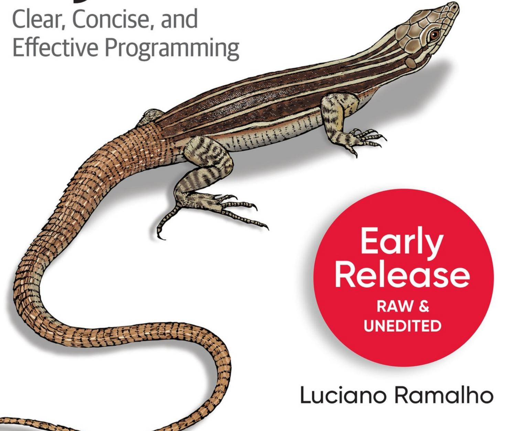

ROPONO

# Fluent Python

## Fluent Python

## SECOND EDITION

With Early Release ebooks, you get books in their earliest form—the author's raw and unedited content as they write—so you can take advantage of these technologies long before the official release of these titles.

## Luciano Ramalho

## Fluent Python

By Luciano Ramalho

Copyright © 2021 Luciano Gama de Sousa Ramalho. All rights reserved.

Printed in the United States of America.

Published by O'Reilly Media, Inc., 1005 Gravenstein Highway North, Sebastopol, CA 95472.

O'Reilly books may be purchased for educational, business, or sales promotional use. Online editions are also available for most titles ([http://oreilly.com](http://oreilly.com/)). For more information, contact our corporate/institutional sales department: 800-998-9938 or *corporate@oreilly.com*.

Acquisitions Editor: Amanda Quinn

Development Editor: Jeff Bleiel

Production Editor: Daniel Elfanbaum

Interior Designer: David Futato

Cover Designer: Karen Montgomery

Illustrator: Kate Dullea

August 2015: First Edition

September 2021: Second Edition

## Revision History for the Early Release

2020-03-09: First release

2020-05-08: Second release

2020-06-10: Third release

2020-08-20: Fourth release

2020-11-05: Fifth release

2020-12-21: Sixth release

2021-02-01: Seventh release

2021-03-01: Eighth release

2021-04-05: Ninth release

2021-05-13: Tenth release

2021-06-22: Eleventh release

2021-07-27: Twelfth release

See <http://oreilly.com/catalog/errata.csp?isbn=9781491946008> for release details.

The O'Reilly logo is a registered trademark of O'Reilly Media, Inc. *Fluent Python*, the cover image, and related trade dress are trademarks of O'Reilly Media, Inc.

While the publisher and the author have used good faith efforts to ensure that the information and instructions contained in this work are accurate, the publisher and the author disclaim all responsibility for errors or omissions, including without limitation responsibility for damages resulting from the use of or reliance on this work. Use of the information and instructions contained in this work is at your own risk. If any code samples or other technology this work contains or describes is subject to open source licenses or the intellectual property rights of others, it is your responsibility to ensure that your use thereof complies with such licenses and/or rights.

978-1-492-05628-7

[LSI]

## Dedication

Para Marta, com todo o meu amor.
