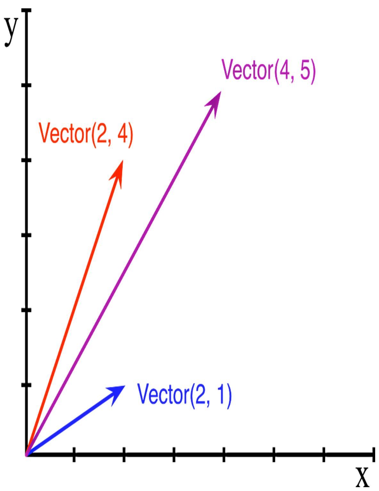
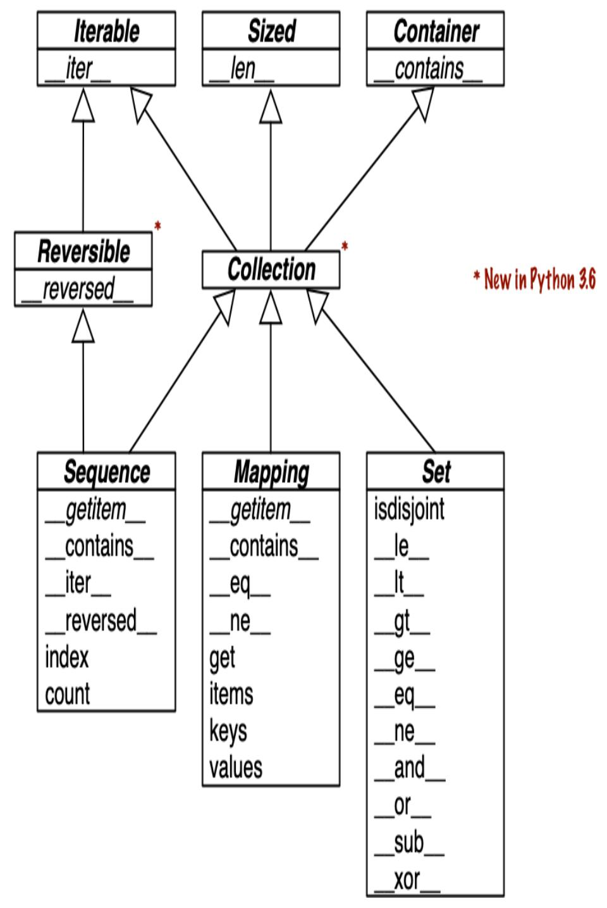

<span id="page-20-0"></span>
# Chapter 1: The Python Data Model

## A NOTE FOR EARLY RELEASE READERS

With Early Release ebooks, you get books in their earliest form—the author's raw and unedited content as they write—so you can take advantage of these technologies long before the official release of these titles.

This will be the 1st chapter of the final book. Please note that the GitHub repo will be made active later on.

If you have comments about how we might improve the content and/or examples in this book, or if you notice missing material within this chapter, please reach out to the author at [fluentpython2e@ramalho.org.](mailto:fluentpython2e@ramalho.org)

*Guido's sense of the aesthetics of language design is amazing. I've met many fine language designers who could build theoretically beautiful languages that no one would ever use, but Guido is one of those rare people who can build a language that is just slightly less theoretically beautiful but thereby is a joy to write programs in. [1](#page-49-0)*

<span id="page-20-1"></span>—Jim Hugunin, Creator of Jython, cocreator of AspectJ, architect of the .Net DLR

One of the best qualities of Python is its consistency. After working with Python for a while, you are able to start making informed, correct guesses about features that are new to you.

However, if you learned another object-oriented language before Python, you may find it strange to use len(collection) instead of collection.len(). This apparent oddity is the tip of an iceberg that, when properly understood, is the key to everything we call *Pythonic*. The

iceberg is called the Python Data Model, and it is the API that we use to make our own objects play well with the most idiomatic language features.

You can think of the data model as a description of Python as a framework. It formalizes the interfaces of the building blocks of the language itself, such as sequences, functions, iterators, coroutines, classes, context managers, and so on.

When using a framework, we spend a lot of time coding methods that are called by the framework. The same happens when we leverage the Python Data Model to build new classes. The Python interpreter invokes special methods to perform basic object operations, often triggered by special syntax. The special method names are always written with leading and trailing double underscores. For example, the syntax obj[key] is supported by the \_\_getitem\_\_ special method. In order to evaluate my\_collection[key], the interpreter calls my\_collection.\_\_getitem\_\_(key).

We implement special methods when we want our objects to support and interact with fundamental language constructs such as:

- Collections;
- Attribute access;
- Iteration (including asynchronous iteration using async for);
- Operator overloading;
- Function and method invocation;
- String representation and formatting;
- Asynchronous programing using await;
- Object creation and destruction;
- Managed contexts using the with or async with statements.

## MAGIC AND DUNDER

The term *magic method* is slang for special method, but how do we talk about a specific method like \_\_getitem\_\_? I learned to say "dunder-getitem" from author and teacher Steve Holden. "Dunder" is a shortcut for "double underscore before and after". That's why the special methods are also known as *dunder methods*. The *[Lexical Analysis](https://docs.python.org/3/reference/lexical_analysis.html#reserved-classes-of-identifiers)* chapter of *The Python Language Reference* warns that "*Any* use of \_\_\*\_\_ names, in any context, that does not follow explicitly documented use, is subject to breakage without warning."

<span id="page-22-0"></span>
## What's new in this chapter

This chapter had few changes from the first edition because it is an introduction to the Python Data Model, which is quite stable. The most significant changes are:

- Special methods supporting asynchronous programming and other [new features, added to the tables in "Overview of Special](#page-38-0) Methods".
- [Figure 1-2](#page-36-0) [showing the use of special methods in "Collection](#page-34-0) API", including the collections.abc.Collection abstract base class introduced in Python 3.6.

Also, here and throughout this *Second Edition* I adopted the *f-string* syntax introduced in Python 3.6, which is more readable and often more convenient than the older string formatting notations: the str.format() method and the % operator.

## TIP

One reason to still use my\_fmt.format() is when the definition of my\_fmt must be in a different place in the code than where the formatting operation needs to happen. For instance, when my\_fmt has multiple lines and is better defined in a constant, or when it must come from a configuration file, or from the database. Those are real needs, but don't happen very often.

<span id="page-23-1"></span>
## A Pythonic Card Deck

[Example 1-1](#page-23-0) is simple, but it demonstrates the power of implementing just two special methods, \_\_getitem\_\_ and \_\_len\_\_.

<span id="page-23-0"></span>*Example 1-1. A deck as a sequence of playing cards*

```
import collections
Card = collections.namedtuple('Card', ['rank', 'suit'])
class FrenchDeck:
 ranks = [str(n) for n in range(2, 11)] + list('JQKA')
 suits = 'spades diamonds clubs hearts'.split()
 def __init__(self):
 self._cards = [Card(rank, suit) for suit in self.suits
 for rank in self.ranks]
 def __len__(self):
 return len(self._cards)
 def __getitem__(self, position):
 return self._cards[position]
```

The first thing to note is the use of collections.namedtuple to construct a simple class to represent individual cards. We use namedtuple to build classes of objects that are just bundles of attributes with no custom methods, like a database record. In the example, we use it to provide a nice representation for the cards in the deck, as shown in the console session:

```
>>> beer_card = Card('7', 'diamonds')
>>> beer_card
Card(rank='7', suit='diamonds')
```

But the point of this example is the FrenchDeck class. It's short, but it packs a punch. First, like any standard Python collection, a deck responds to the len() function by returning the number of cards in it:

```
>>> deck = FrenchDeck()
>>> len(deck)
```

Reading specific cards from the deck—say, the first or the last—is easy, thanks to the \_\_getitem\_\_ method:

```
>>> deck[0]
Card(rank='2', suit='spades')
>>> deck[-1]
Card(rank='A', suit='hearts')
```

Should we create a method to pick a random card? No need. Python already has a function to get a random item from a sequence: random.choice. We can use it on a deck instance:

```
>>> from random import choice
>>> choice(deck)
Card(rank='3', suit='hearts')
>>> choice(deck)
Card(rank='K', suit='spades')
>>> choice(deck)
Card(rank='2', suit='clubs')
```

We've just seen two advantages of using special methods to leverage the Python Data Model:

- Users of your classes don't have to memorize arbitrary method names for standard operations ("How to get the number of items? Is it .size(), .length(), or what?").
- It's easier to benefit from the rich Python standard library and avoid reinventing the wheel, like the random.choice function.

But it gets better.

Because our \_\_getitem\_\_ delegates to the [] operator of self.\_cards, our deck automatically supports slicing. Here's how we look at the top three cards from a brand-new deck, and then pick just the Aces by starting at index 12 and skipping 13 cards at a time:

```
>>> deck[:3]
[Card(rank='2', suit='spades'), Card(rank='3', suit='spades'),
Card(rank='4', suit='spades')]
>>> deck[12::13]
[Card(rank='A', suit='spades'), Card(rank='A', suit='diamonds'),
Card(rank='A', suit='clubs'), Card(rank='A', suit='hearts')]
```

Just by implementing the \_\_getitem\_\_ special method, our deck is also iterable:

```
>>> for card in deck: # doctest: +ELLIPSIS
... print(card)
Card(rank='2', suit='spades')
Card(rank='3', suit='spades')
Card(rank='4', suit='spades')
...
```

We can also iterate over the deck in reverse:

```
>>> for card in reversed(deck): # doctest: +ELLIPSIS
... print(card)
Card(rank='A', suit='hearts')
Card(rank='K', suit='hearts')
Card(rank='Q', suit='hearts')
...
```

## ELLIPSIS IN DOCTESTS

Whenever possible, I extracted the Python console listings in this book from [doctests](https://docs.python.org/3/library/doctest.html) to ensure accuracy. When the output was too long, the elided part is marked by an ellipsis (...) like in the last line in the preceding code. In such cases, I used the # doctest: +ELLIPSIS directive to make the doctest pass. If you are trying these examples in the interactive console, you may omit the doctest comments altogether.

Iteration is often implicit. If a collection has no \_\_contains\_\_ method, the in operator does a sequential scan. Case in point: in works with our FrenchDeck class because it is iterable. Check it out:

```
>>> Card('Q', 'hearts') in deck
True
```

```
>>> Card('7', 'beasts') in deck
False
```

How about sorting? A common system of ranking cards is by rank (with aces being highest), then by suit in the order of spades (highest), hearts, diamonds, and clubs (lowest). Here is a function that ranks cards by that rule, returning 0 for the 2 of clubs and 51 for the ace of spades:

```
suit_values = dict(spades=3, hearts=2, diamonds=1, clubs=0)
def spades_high(card):
 rank_value = FrenchDeck.ranks.index(card.rank)
 return rank_value * len(suit_values) + suit_values[card.suit]
```

Given spades\_high, we can now list our deck in order of increasing rank:

```
>>> for card in sorted(deck, key=spades_high): # doctest:
+ELLIPSIS
... print(card)
Card(rank='2', suit='clubs')
Card(rank='2', suit='diamonds')
Card(rank='2', suit='hearts')
... (46 cards omitted)
Card(rank='A', suit='diamonds')
Card(rank='A', suit='hearts')
Card(rank='A', suit='spades')
```

Although FrenchDeck implicitly inherits from the object class, most of its functionality is not inherited, but comes from leveraging the data model and composition. By implementing the special methods \_\_len\_\_ and \_\_getitem\_\_, our FrenchDeck behaves like a standard Python sequence, allowing it to benefit from core language features (e.g., iteration and slicing) and from the standard library, as shown by the examples using random.choice, reversed, and sorted. Thanks to composition, the \_\_len\_\_ and \_\_getitem\_\_ implementations can delegate all the work to a list object, self.\_cards.

## HOW ABOUT SHUFFLING?

As implemented so far, a FrenchDeck cannot be shuffled, because it is *immutable*: the cards, and their positions cannot be changed, except by violating encapsulation and handling the \_cards attribute directly. In [Chapter 13,](020-chapter-13-interfaces-protocols-and-abcs.md#page-622-0) we will fix that by adding a oneline \_\_setitem\_\_ method.

<span id="page-27-0"></span>
## How Special Methods Are Used

The first thing to know about special methods is that they are meant to be called by the Python interpreter, and not by you. You don't write my\_object.\_\_len\_\_(). You write len(my\_object) and, if my\_object is an instance of a user-defined class, then Python calls the \_\_len\_\_ method you implemented.

<span id="page-27-1"></span>But the interpreter takes a shortcut when dealing for built-in types like list, str, bytearray, or extensions like the NumPy arrays. Python variable-sized collections written in C include a struct called PyVarObject, which has an ob\_size field holding the number of items in the collection. So, if my\_object is an instance of one of those built-ins, then len(my\_object) retrieves the value of the ob\_size field, and this is much faster than calling a method. [2](#page-49-1)

More often than not, the special method call is implicit. For example, the statement for i in x: actually causes the invocation of iter(x), which in turn may call x.\_\_iter\_\_() if that is available, or use x.\_\_getitem\_\_()—as in the FrenchDeck example.

Normally, your code should not have many direct calls to special methods. Unless you are doing a lot of metaprogramming, you should be implementing special methods more often than invoking them explicitly. The only special method that is frequently called by user code directly is \_\_init\_\_, to invoke the initializer of the superclass in your own \_\_init\_\_ implementation.

If you need to invoke a special method, it is usually better to call the related built-in function (e.g., len, iter, str, etc). These built-ins call the corresponding special method, but often provide other services and—for [built-in types—are faster than method calls. See, for example, "A Closer](024-chapter-17-iterables-iterators-and-generators.md#page-907-0) Look at the iter Function" in [Chapter 17](024-chapter-17-iterables-iterators-and-generators.md#page-840-0).

In the next sections, we'll see some of the most important uses of special methods:

- Emulating numeric types;
- String representation of objects;
- Boolean value of an object;
- Implementing collections.

<span id="page-28-0"></span>
## Emulating Numeric Types

Several special methods allow user objects to respond to operators such as +. We will cover that in more detail in [Chapter 16,](023-chapter-16-operator-overloading-doing-it-right.md#page-797-0) but here our goal is to further illustrate the use of special methods through another simple example.

We will implement a class to represent two-dimensional vectors—that is Euclidean vectors like those used in math and physics (see [Figure 1-1\)](#page-29-0).

<span id="page-29-0"></span>

*Figure 1-1. Example of two-dimensional vector addition; Vector(2, 4) + Vector(2, 1) results in Vector(4, 5).*

## TIP

The built-in complex type can be used to represent two-dimensional vectors, but our class can be extended to represent *n*-dimensional vectors. We will do that in [Chapter 17.](024-chapter-17-iterables-iterators-and-generators.md#page-840-0)

We will start by designing the API for such a class by writing a simulated console session that we can use later as a doctest. The following snippet tests the vector addition pictured in [Figure 1-1:](#page-29-0)

```
>>> v1 = Vector(2, 4)
>>> v2 = Vector(2, 1)
>>> v1 + v2
Vector(4, 5)
```

Note how the + operator results in a new Vector, displayed in a friendly format at the console.

The abs built-in function returns the absolute value of integers and floats, and the magnitude of complex numbers, so to be consistent, our API also uses abs to calculate the magnitude of a vector:

```
>>> v = Vector(3, 4)
>>> abs(v)
5.0
```

We can also implement the \* operator to perform scalar multiplication (i.e., multiplying a vector by a number to make a new vector with the same direction and a multiplied magnitude):

```
>>> v * 3
Vector(9, 12)
>>> abs(v * 3)
15.0
```

Example 1-2 is a Vector class implementing the operations just described, through the use of the special methods \_\_repr\_\_, \_\_abs\_\_, \_\_add\_\_ and \_\_mul\_\_.

```
"""
vector2d.py: a simplistic class demonstrating some special methods
It is simplistic for didactic reasons. It lacks proper error
handling,
especially in the ``__add__`` and ``__mul__`` methods.
This example is greatly expanded later in the book.
Addition::
 >>> v1 = Vector(2, 4)
 >>> v2 = Vector(2, 1)
 >>> v1 + v2
 Vector(4, 5)
Absolute value::
 >>> v = Vector(3, 4)
 >>> abs(v)
 5.0
Scalar multiplication::
 >>> v * 3
 Vector(9, 12)
 >>> abs(v * 3)
 15.0
"""
import math
class Vector:
 def __init__(self, x=0, y=0):
 self.x = x
 self.y = y
 def __repr__(self):
 return f'Vector({self.x!r}, {self.y!r})'
 def __abs__(self):
 return math.hypot(self.x, self.y)
```

```
 def __bool__(self):
 return bool(abs(self))
 def __add__(self, other):
 x = self.x + other.x
 y = self.y + other.y
 return Vector(x, y)
 def __mul__(self, scalar):
 return Vector(self.x * scalar, self.y * scalar)
```

We implemented five special methods in addition to the familiar \_\_init\_\_. Note that none of them is directly called within the class or in the typical usage of the class illustrated by the doctests. As mentioned before, the Python interpreter is the only frequent caller of most special methods.

Example 1-2 implements two operators: + and \*, to show basic usage of \_\_add\_\_ and \_\_mul\_\_. In both cases, the methods create and return a new instance of Vector, and do not modify either operand—self or other are merely read. This is the expected behavior of infix operators: to create new objects and not touch their operands. I will have a lot more to say about that in [Chapter 16.](023-chapter-16-operator-overloading-doing-it-right.md#page-797-0)

## WARNING

As implemented, Example 1-2 allows multiplying a Vector by a number, but not a number by a Vector, which violates the commutative property of scalar multiplication. We will fix that with the special method \_\_rmul\_\_ in [Chapter 16](023-chapter-16-operator-overloading-doing-it-right.md#page-797-0).

In the following sections, we discuss the code for the other special methods in Vector.

<span id="page-32-0"></span>
## String Representation

The \_\_repr\_\_ special method is called by the repr built-in to get the string representation of the object for inspection. Without a custom

\_\_repr\_\_, Python's console would display a Vector instance <Vector object at 0x10e100070>.

The interactive console and debugger call repr on the results of the expressions evaluated, as does the %r placeholder in classic formatting with the % operator, and the !r conversion field in the new [Format String Syntax](http://bit.ly/1Vm7gD1) used in *f-strings* the str.format method.

Note that the *f-string* in our \_\_repr\_\_, uses !r to get the standard representation of the attributes to be displayed. This is good practice, because it shows the crucial difference between Vector(1, 2) and Vector('1', '2')—the latter would not work in the context of this example, because the constructor's arguments should be numbers, not str.

The string returned by \_\_repr\_\_ should be unambiguous and, if possible, match the source code necessary to re-create the represented object. That is why our Vector representation looks like calling the constructor of the class (e.g., Vector(3, 4)).

In contrast, \_\_str\_\_ is called by the str() built-in and implicitly used by the print function. It should return a string suitable for display to end users.

Sometimes same string returned by \_\_repr\_\_ is user-friendly, and you don't need to code \_\_str\_\_ because the implementation inherited from the object class calls \_\_repr\_\_ as a fallback. [Example 5-2](010-chapter-5-data-class-builders.md#page-269-0) is one of several examples in this book with a custom \_\_str\_\_.

## TIP

Programmers with prior experience in languages with a toString method tend to implement \_\_str\_\_ and not \_\_repr\_\_. If you only implement one of these special methods in Python, choose \_\_repr\_\_.

["Difference between](http://bit.ly/1Vm7j1N) \_\_str\_\_ and \_\_repr\_\_ in Python" is a Stack Overflow question with excellent contributions from Pythonistas Alex Martelli and Martijn Pieters.

<span id="page-34-1"></span>
## Boolean Value of a Custom Type

Although Python has a bool type, it accepts any object in a boolean context, such as the expression controlling an if or while statement, or as operands to and, or, and not. To determine whether a value x is *truthy* or *falsy*, Python applies bool(x), which returns either True or False.

By default, instances of user-defined classes are considered truthy, unless either \_\_bool\_\_ or \_\_len\_\_ is implemented. Basically, bool(x) calls x.\_\_bool\_\_() and uses the result. If \_\_bool\_\_ is not implemented, Python tries to invoke x.\_\_len\_\_(), and if that returns zero, bool returns False. Otherwise bool returns True. Our implementation of \_\_bool\_\_ is conceptually simple: it returns

False if the magnitude of the vector is zero, True otherwise. We convert the magnitude to a Boolean using bool(abs(self)) because \_\_bool\_\_ is expected to return a boolean. Outside of \_\_bool\_\_ methods, it is rarely necessary to call bool() explicitly, because any object can be used in a boolean context.

Note how the special method \_\_bool\_\_ allows your objects to follow the truth value testing rules defined in the ["Built-in Types" chapter](http://docs.python.org/3/library/stdtypes.html#truth) of *The Python Standard Library* documentation.

## NOTE

A faster implementation of Vector.\_\_bool\_\_ is this:

```
 def __bool__(self):
 return bool(self.x or self.y)
```

This is harder to read, but avoids the trip through abs, \_\_abs\_\_, the squares, and square root. The explicit conversion to bool is needed because \_\_bool\_\_ must return a boolean and or returns either operand as is: x or y evaluates to x if that is *truthy*, otherwise the result is y, whatever that is.

<span id="page-34-0"></span>
## Collection API

[Figure 1-2](#page-36-0) documents the interfaces of the essential collection types in the language. All the classes in the diagram are ABCs—*abstract base classes*. ABCs and the collections.abc module are covered in [Chapter 13](020-chapter-13-interfaces-protocols-and-abcs.md#page-622-0). The goal of this brief section is to give a panoramic view of Python's most important collection interfaces, showing how they are built from special methods.

<span id="page-36-0"></span>

*Figure 1-2. UML class diagram with fundamental collection types. Method names in italic are abstract, so they must be implemented by concrete subclasses such as list and dict. The remaining methods have concrete implementations, therefore subclasses can inherit them.*

Each of the top ABCs has a single special method. The Collection ABC (new in Python 3.6) unifies the three essential interfaces that every collection should implement:

- Iterable to support for, [unpacking,](https://docs.python.org/3/tutorial/controlflow.html#unpacking-argument-lists) and other forms of iteration;
- Sized to support the len built-in function;
- Contains to support the in operator.

Python does not require concrete classes to actually inherit from any of these ABCs. Any class that implements \_\_len\_\_ satisfies the Sized interface.

Three very important specializations of Collection are:

- Sequence, formalizing the interface of built-ins like list and str;
- Mapping, implemented by dict, collections.defaultdict, etc.;
- Set: the interface of the set and frozenset built-in types.

Only Sequence is Reversible, because sequences support arbitrary ordering of their contents, while mappings and sets do not.

## NOTE

Since Python 3.7, the dict type is officially "ordered", but that only means that the key insertion order is preserved. You cannot rearrange the keys in a dict however you like.

All the special methods in the Set ABC implement infix operators. For example, a & b computes the intersection of sets a and b, and is implemented in the \_\_and\_\_ special method.

The next two chapters will cover standard library sequences, mappings, and sets in detail.

Now let's consider the major categories of special methods defined in the Python Data Model.

<span id="page-38-0"></span>
## Overview of Special Methods

The ["Data Model" chapter](http://docs.python.org/3/reference/datamodel.html) of *The Python Language Reference* lists more than 80 special method names. More than half of them implement arithmetic, bitwise, and comparison operators. As an overview of what is available, see following tables.

Table [1-1](#page-39-0) shows special method names excluding those used to implement infix operators or core math functions like abs. Most of these methods will be covered throughout the book, including the most recent additions: asynchronous special methods such as \_\_anext\_\_ (added in Python 3.5), and the class customization hook, \_\_init\_subclass\_\_ (from Python 3.6).

<span id="page-39-0"></span>T

а

b l

e

1

1

. S

p e

c i

а

l

m

e

t

h

0

d

n

а

m

e S

(

o

p e

r
a
t
o
r
s\ne
x
c
l\nu
d\ne
d
)

| Category  | Method | names |
|-----------|--------|-------|
| outogo. j |        |       |

| String/bytes<br>representation    | repr<br>h         | str   | _format  | _bytes | fspat   |
|-----------------------------------|-------------------|-------|----------|--------|---------|
| Conversion to number              | bool<br>inde      | •     | int      | float  | hash    |
| Emulating collections             | len<br>_contains_ | _     | setitem_ | delit  | em      |
| Iteration                         | iter<br>ed        | aiter | next,    | _anext | _revers |
| Callable or coroutine execution   | call              | await |          |        |         |
| Context management                | enter             | exit  | aexit    | aenter |         |
| Instance creation and destruction | new               | _init | _del     |        |         |

| Attribute management                                            | getattr<br>attr<br>dir | getattribute  | setattr<br>del                                                             |
|-----------------------------------------------------------------|------------------------|---------------|----------------------------------------------------------------------------|
| Attribute descriptors                                           | get                    | set<br>delete | set_name                                                                   |
| Abstract base classes                                           | instancecheck          | subclasscheck |                                                                            |
| Class<br>metaprogramming                                        | prepare<br>mro_entries | init_subclass | class_getitem                                                              |
|                                                                 |                        |               |                                                                            |
|                                                                 |                        |               | Infix and numerical operators are supported by the special methods in 1-2. |
| Here the most recent names arematmul,rmatmul, and               |                        |               |                                                                            |
|                                                                 |                        |               | imatmul, added in Python 3.5 to support the use of @ as an infix           |
| operator for matrix multiplication, as we'll see in Chapter 16. |                        |               |                                                                            |
|                                                                 |                        |               |                                                                            |

<span id="page-42-0"></span>T

а

b

l

e

1

-2

. S

p e

c i

а l

m

e

t

h o

d

n

а

m e

S

а

n

d

S y

m

b

o

## Operator category Symbols Method names

```
- + abs()
Unary numeric
                              __neg__ __pos__ __abs__
                              __lt__ __le__ __eq__ __ne__ __g
Rich comparison
             < \<= == !=
                              t____ge___
                >=
                              __add__ __sub__ __mul__ __truedi
             + - * / //
Arithmetic
                              v__ _floordiv__ _mod__ _matmu
             % @ divmod()
             round() ** pow l__ __divmod__ __round__ __pow__
             ()
                              __radd__ __rsub__ __rmul__ __rtr
Reversed
             (arithmetic operators
             with swapped operands) uediv__ _rfloordiv__ _rmod__ _
arithmetic
                              _rmatmul__ __rdivmod__ __rpow__
                              __iadd__ __isub__ __imul__ __itr
Augmented
             += -= *= /=
assignment
             //= %= @= **= uediv__ __ifloordiv__ __imod__ _
arithmetic
                              _imatmul__ __ipow__
                             __and__ _or__ _xor__ _lshift_
Bitwise
             & | ^ << >>
                              _ __rshift__ __invert__
```

Reversed bitwise (bitwise operators with swapped operands) \_\_rand\_\_ \_\_ror\_\_ \_\_rxor\_\_ \_\_rlsh ift\_\_ \_\_rrshift\_\_ Augmented assignment bitwise &= |= ^= <<= >>= \_\_iand\_\_ \_\_ior\_\_ \_\_ixor\_\_ \_\_ilsh ift\_\_ \_\_irshift\_\_

## NOTE

Python calls a reversed operator special method on the second operand when the corresponding special method on the first operand cannot be used. Augmented assignments are shortcuts combining an infix operator with variable assignment, e.g. a += b.

[Chapter 16](023-chapter-16-operator-overloading-doing-it-right.md#page-797-0) explains reversed operators and augmented assignment in detail.

<span id="page-44-0"></span>
## Why len Is Not a Method

I asked this question to core developer Raymond Hettinger in 2013 and the key to his answer was a quote from [The Zen of Python:](https://www.python.org/doc/humor/#the-zen-of-python) "practicality beats purity." In ["How Special Methods Are Used",](#page-27-0) I described how len(x) runs very fast when x is an instance of a built-in type. No method is called for the built-in objects of CPython: the length is simply read from a field in a C struct. Getting the number of items in a collection is a common operation and must work efficiently for such basic and diverse types as str, list, memoryview, and so on.

In other words, len is not called as a method because it gets special treatment as part of the Python Data Model, just like abs. But thanks to the special method \_\_len\_\_, you can also make len work with your own custom objects. This is a fair compromise between the need for efficient built-in objects and the consistency of the language. Also from The Zen of Python: "Special cases aren't special enough to break the rules."

## NOTE

<span id="page-45-0"></span>If you think of abs and len as unary operators, you may be more inclined to forgive their functional look-and-feel, as opposed to the method call syntax one might expect in an OO language. In fact, the ABC language—a direct ancestor of Python that pioneered many of its features—had an # operator that was the equivalent of len (you'd write #s). When used as an infix operator, written x#s, it counted the occurrences of x in s, which in Python you get as s.count(x), for any sequence s.

## Chapter Summary

By implementing special methods, your objects can behave like the built-in types, enabling the expressive coding style the community considers Pythonic.

A basic requirement for a Python object is to provide usable string representations of itself, one used for debugging and logging, another for presentation to end users. That is why the special methods \_\_repr\_\_ and \_\_str\_\_ exist in the data model.

Emulating sequences, as shown with the FrenchDeck example, is one of the most common uses of the special methods. For example, database libraries often return query results wrapped in sequence-like collections. Making the most of existing sequence types is the subject of [Chapter 2](007-chapter-2-an-array-of-sequences.md#page-51-0). Implementing your own sequences will be covered in [Chapter 12](019-chapter-12-writing-special-methods-for-sequences.md#page-577-0), when we create a multidimensional extension of the Vector class.

Thanks to operator overloading, Python offers a rich selection of numeric types, from the built-ins to decimal.Decimal and fractions.Fraction, all supporting infix arithmetic operators. The *NumPy* data science libraries support infix operators with matrices and tensors. Implementing operators—including reversed operators and augmented assignment—will be shown in [Chapter 16](023-chapter-16-operator-overloading-doing-it-right.md#page-797-0) via enhancements of the Vector example.

The use and implementation of the majority of the remaining special methods of the Python Data Model are covered throughout this book.

<span id="page-46-0"></span>
## Further Reading

The ["Data Model" chapter](http://docs.python.org/3/reference/datamodel.html) of *The Python Language Reference* is the canonical source for the subject of this chapter and much of this book.

*[Python in a Nutshell, 3rd Edition](http://shop.oreilly.com/product/0636920012610.do)* (O'Reilly) by Alex Martelli, Anna Ravenscroft, and Steve Holden has excellent coverage of the data model. Their description of the mechanics of attribute access is the most

authoritative I've seen apart from the actual C source code of CPython. Martelli is also a prolific contributor to Stack Overflow, with more than 6,200 answers posted. See his user profile at [Stack Overflow.](http://stackoverflow.com/users/95810/alex-martelli)

David Beazley has two books covering the data model in detail in the context of Python 3: *Python Essential Reference, 4th Edition* (Addison-Wesley Professional), and *[Python Cookbook, 3rd Edition](http://bit.ly/Python-ckbk)* (O'Reilly), coauthored with Brian K. Jones.

*The Art of the Metaobject Protocol* (AMOP, MIT Press) by Gregor Kiczales, Jim des Rivieres, and Daniel G. Bobrow explains the concept of a metaobject protocol, of which the Python Data Model is one example.

## SOAPBOX

## Data Model or Object Model?

What the Python documentation calls the "Python Data Model," most authors would say is the "Python object model." Martelli, Ravenscroft & Holden's *Python in a Nutshell 3E*, and David Beazley's *Python Essential Reference 4E* are the best books covering the "Python Data Model," but they refer to it as the "object model." On Wikipedia, the first definition of [object model](http://en.wikipedia.org/wiki/Object_model) is "The properties of objects in general in a specific computer programming language." This is what the "Python Data Model" is about. In this book, I will use "data model" because the documentation favors that term when referring to the [Python object model, and because it is the title of the chapter of](https://docs.python.org/3/reference/datamodel.html) *The Python Language Reference* most relevant to our discussions.

## Muggle Methods

The *[The Original Hacker's Dictionary](https://www.dourish.com/goodies/jargon.html)* defines *magic* as "as yet unexplained, or too complicated to explain" or "a feature not generally publicized which allows something otherwise impossible."

The Ruby community calls their equivalent of the special methods *magic methods*. Many in the Python community adopt that term as well. I believe the special methods are the opposite of magic. Python and Ruby empower their users with a rich metaobject protocol that is fully documented, enabling muggles like you and I to emulate many of the features available to core developers who write the interpreters for those languages.

In contrast, consider Go. Some objects in that language have features that are magic, in the sense that we cannot emulate them in our own user-defined types. For example, Go arrays, strings, and maps support the use brackets for item access, as in a[i]. But there's no way to make the [] notation work with a new collection type that you define. Even worse, Go has no user-level concept of an iterable interface or an iterator object, therefore its for/range syntax is limited to

supporting five "magic" built-in types, including arrays, strings and maps.

Maybe in the future, the designers of Go will enhance its metaobject protocol. But currently, it is much more limited than what we have in Python or Ruby.

## Metaobjects

*The Art of the Metaobject Protocol (AMOP)* is my favorite computer book title. But I mention it because the term *metaobject protocol* is useful to think about the Python Data Model and similar features in other languages. The *metaobject* part refers to the objects that are the building blocks of the language itself. In this context, *protocol* is a synonym of *interface*. So a *metaobject protocol* is a fancy synonym for object model: an API for core language constructs.

A rich metaobject protocol enables extending a language to support new programming paradigms. Gregor Kiczales, the first author of the *AMOP* book, later became a pioneer in aspect-oriented programming and the initial author of AspectJ, an extension of Java implementing that paradigm. Aspect-oriented programming is much easier to implement in a dynamic language like Python, and some frameworks do it. The most important example is *[zope.interface](https://zopeinterface.readthedocs.io/en/latest/)*, part of the framework on which the [Plone content management](https://plone.org/) system is build.

<span id="page-49-0"></span>[<sup>1</sup>](#page-20-1) [Story of Jython](http://hugunin.net/story_of_jython.html), written as a Foreword to *[Jython Essentials](http://bit.ly/jython-essentials)* (O'Reilly, 2002), by Samuele Pedroni and Noel Rappin.

<span id="page-49-1"></span>[<sup>2</sup>](#page-27-1) A C struct is a record type with named fields.
