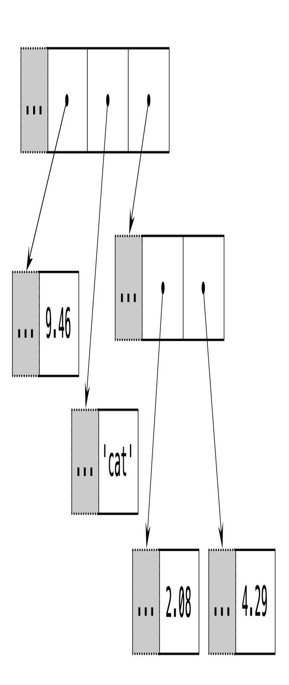
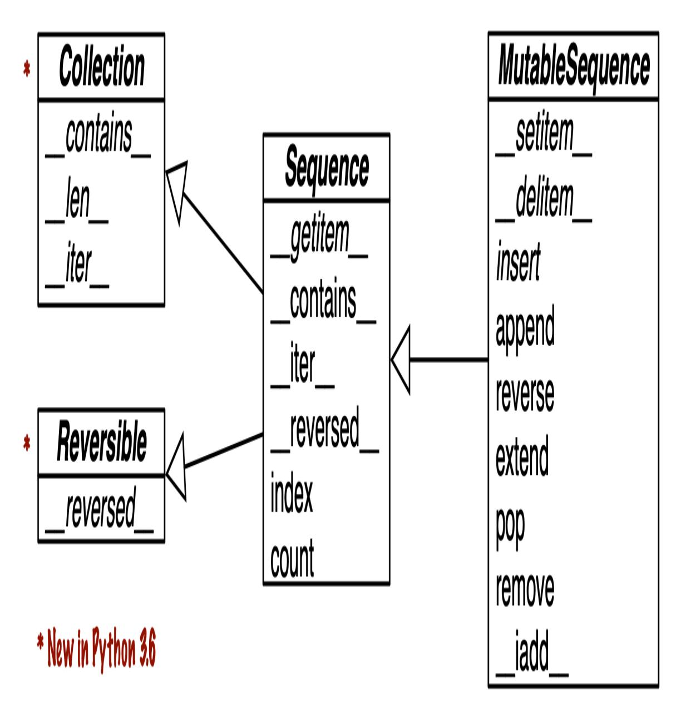
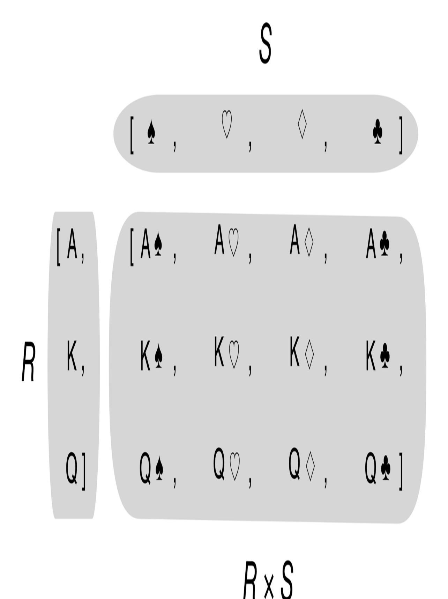
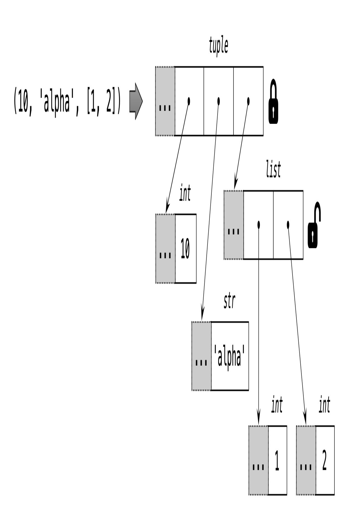
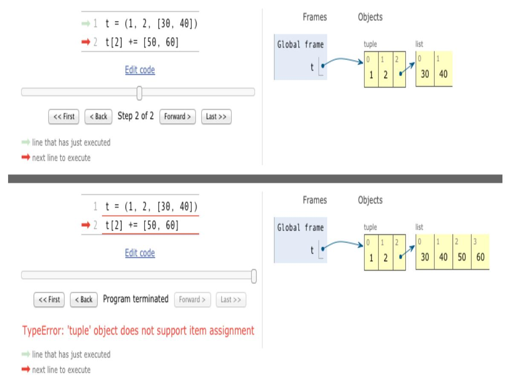

<span id="page-51-0"></span>
# Chapter 2: An Array of Sequences

## A NOTE FOR EARLY RELEASE READERS

With Early Release ebooks, you get books in their earliest form—the author's raw and unedited content as they write—so you can take advantage of these technologies long before the official release of these titles.

This will be the 2nd chapter of the final book. Please note that the GitHub repo will be made active later on.

If you have comments about how we might improve the content and/or examples in this book, or if you notice missing material within this chapter, please reach out to the author at [fluentpython2e@ramalho.org.](mailto:fluentpython2e@ramalho.org)

*As you may have noticed, several of the operations mentioned work equally for texts, lists and tables. Texts, lists and tables together are called trains. […] The FOR command also works generically on trains. [1](#page-138-0)*

<span id="page-51-1"></span>—Geurts, Meertens, and Pemberton, ABC Programmer's Handbook

Before creating Python, Guido was a contributor to the ABC language—a 10-year research project to design a programming environment for beginners. ABC introduced many ideas we now consider "Pythonic": generic operations on different types of sequences, built-in tuple and mapping types, structure by indentation, strong typing without variable declarations, and more. It's no accident that Python is so user-friendly.

Python inherited from ABC the uniform handling of sequences. Strings, lists, byte sequences, arrays, XML elements, and database results share a rich set of common operations including iteration, slicing, sorting, and concatenation.

Understanding the variety of sequences available in Python saves us from reinventing the wheel, and their common interface inspires us to create APIs that properly support and leverage existing and future sequence types.

Most of the discussion in this chapter applies to sequences in general, from the familiar list to the str and bytes types added in Python 3. Specific topics on lists, tuples, arrays, and queues are also covered here, but the specifics of Unicode strings and byte sequences appear in [Chapter 4](009-chapter-4-text-versus-bytes.md#page-201-0). Also, the idea here is to cover sequence types that are ready to use. Creating your own sequence types is the subject of [Chapter 12](019-chapter-12-writing-special-methods-for-sequences.md#page-577-0).

These are the main topics this chapter will cover:

- List comprehensions and the basics of generator expressions;
- Using tuples as records, versus using tuples as immutable lists;
- Sequence unpacking and sequence patterns;
- Reading from slices and writing to slices;
- Specialized sequence types, like arrays and queues.

<span id="page-52-0"></span>
## What's new in this chapter

[The most important update in this chapter is "Pattern Matching with](#page-81-0) Sequences". That's the first time the new pattern matching feature of Python 3.10 appears in this *Second Edition*.

Other changes are not updates but improvements over the *First Edition*:

- New diagram and description of the internals of sequences, contrasting containers and flat sequences.
- Brief comparison of the performance and storage characteristics of list versus tuple.

Caveats of tuples with mutable elements, and how to detect them if needed.

I moved coverage of named tuples to ["Classic Named Tuples"](010-chapter-5-data-class-builders.md#page-276-0) in [Chapter 5,](010-chapter-5-data-class-builders.md#page-265-0) where they are compared to typing.NamedTuple and @dataclass.

## NOTE

To make room for new content and keep the page count within reason, the section *Managing Ordered Sequences with Bisect* from the *First Edition* is now a [post](https://www.fluentpython.com/extra/ordered-sequences-with-bisect/) in the *[fluentpython.com](https://www.fluentpython.com/)* companion Web site.

<span id="page-53-0"></span>
## Overview of Built-In Sequences

The standard library offers a rich selection of sequence types implemented in C:

## Container sequences

Can hold items of different types, including nested containers. Some examples: list, tuple, and collections.deque.

## Flat sequences

Hold items of one simple type. Some examples: str, bytes, and array.array.

A *container sequence* holds references to the objects it contains, which may be of any type, while a *flat sequence* stores the value of its contents in its own memory space, and not as distinct Python objects. See Figure 2-1.

(9.46, 'cat', [2.08, 4.29])

array('d', [9.46, 2.08, 4.29])



| 9.46 | 2.08 | 4.29 |
|------|------|------|
|------|------|------|

*Figure 2-1. Simplified memory diagrams for a tuple and an array, each with 3 items. Gray cells represent the in-memory header of each Python object—not drawn to proportion. The tuple has an array of references to its items. Each item is a separate Python object, possibly holding references to other Python objects, like that 2-item list. In contrast, the Python array is a single object, holding a C language array of 3 doubles.*

Thus, flat sequences are more compact, but they are limited to holding primitive machine values like bytes, integers, and floats.

## NOTE

Every Python object in memory has a header with metadata. The simplest Python object, a float, has a value field and two metadata fields:

- ob\_refcnt: the object's reference count;
- ob\_type: a pointer to the object's type;
- ob\_fval: a C double holding the value of the float.

On a 64-bit Python build, each of those fields takes 8 bytes. That's why an array of floats is much more compact than a tuple of floats: the array is a single object holding the raw values of the floats, while the tuple consists of several objects—the tuple itself and each float object contained in it.

Another way of grouping sequence types is by mutability:

*Mutable sequences*

E.g. list, bytearray, array.array, and collections.deque.

*Immutable sequences*

E.g. tuple, str, and bytes.

[Figure 2-2](#page-56-0) helps visualize how mutable sequences inherit all methods from immutable sequences, and implement several additional methods. The builtin concrete sequence types do not actually subclass the Sequence and MutableSequence abstract base classes (ABCs), but they are *virtual*

*subclasses* registered with those ABCs—as we'll see in [Chapter 13.](020-chapter-13-interfaces-protocols-and-abcs.md#page-622-0) Being virtual subclasses, tuple and list pass these tests:

```
>>> from collections import abc
>>> issubclass(tuple, abc.Sequence)
True
>>> issubclass(list, abc.MutableSequence)
True
```

<span id="page-56-0"></span>

*Figure 2-2. Simplified UML class diagram for some classes from collections.abc (superclasses are on the left; inheritance arrows point from subclasses to superclasses; names in italic are abstract classes and abstract methods)*

Keep in mind these common traits: mutable versus immutable; container versus flat. They are helpful to extrapolate what you know about one sequence type to others.

The most fundamental sequence type is the list: a mutable container. I expect you are very familiar with lists, so we'll jump right into list comprehensions, a powerful way of building lists that is sometimes underused because the syntax may look unusual at first. Mastering list comprehensions opens the door to generator expressions, which—among other uses—can produce elements to fill up sequences of any type. Both are the subject of the next section.

<span id="page-57-1"></span>
## List Comprehensions and Generator Expressions

A quick way to build a sequence is using a list comprehension (if the target is a list) or a generator expression (for other kinds of sequences). If you are not using these syntactic forms on a daily basis, I bet you are missing opportunities to write code that is more readable and often faster at the same time.

If you doubt my claim that these constructs are "more readable," read on. I'll try to convince you.

## TIP

For brevity, many Python programmers refer to list comprehensions as *listcomps*, and generator expressions as *genexps*. I will use these words as well.

<span id="page-57-2"></span>
## List Comprehensions and Readability

[Here is a test: which do you find easier to read, E](#page-58-0)[xample 2-](#page-57-0)[1 or Example 2-](#page-58-0) 2?

<span id="page-57-0"></span>*Example 2-1. Build a list of Unicode codepoints from a string*

```
>>> symbols = '$¢£¥€¤'
>>> codes = []
>>> for symbol in symbols:
... codes.append(ord(symbol))
...
>>> codes
[36, 162, 163, 165, 8364, 164]
```

<span id="page-58-0"></span>*Example 2-2. Build a list of Unicode codepoints from a string, using a listcomp*

```
>>> symbols = '$¢£¥€¤'
>>> codes = [ord(symbol) for symbol in symbols]
>>> codes
[36, 162, 163, 165, 8364, 164]
```

Anybody who knows a little bit of Python can read [Example 2-1.](#page-57-0) However, after learning about listcomps, I find [Example 2-2](#page-58-0) more readable because its intent is explicit.

A for loop may be used to do lots of different things: scanning a sequence to count or pick items, computing aggregates (sums, averages), or any number of other tasks. The code in [Example 2-1](#page-57-0) is building up a list. In contrast, a listcomp is more explicit. Its goal is always to build a new list.

Of course, it is possible to abuse list comprehensions to write truly incomprehensible code. I've seen Python code with listcomps used just to repeat a block of code for its side effects. If you are not doing something with the produced list, you should not use that syntax. Also, try to keep it short. If the list comprehension spans more than two lines, it is probably best to break it apart or rewrite as a plain old for loop. Use your best judgment: for Python as for English, there are no hard-and-fast rules for clear writing.

## SYNTAX TIP

In Python code, line breaks are ignored inside pairs of [], {}, or (). So you can build multiline lists, listcomps, tuples, dictionaries etc. without using the \ line continuation escape which doesn't work if you accidentally type a space after it. Also, when those delimiter pairs are used to define a literal with a comma-separated series of items, a trailing comma will be ignored. So, for example, when coding a multi-line list literal, it is thoughtful to put a comma after the last item, making it a little easier for the next coder do add one more item to that list, and reducing noise when reading diffs.

## LOCAL SCOPE WITHIN COMPREHENSIONS AND GENERATOR EXPRESSIONS

In Python 3, list comprehensions, generator expressions, and their siblings set and dict comprehensions have a local scope to hold the variables assigned in the for clause.

However, variables assigned with the "Walrus operator" := remain accessible after those comprehensions or expressions return—unlike local variables in a function. *[PEP 572—Assignment Expressions](https://www.python.org/dev/peps/pep-0572/)* defines the scope of the target of := as the enclosing function, unless there is a global or nonlocal declaration for that target. [2](#page-138-1)

```
>>> x = 'ABC'
>>> codes = [ord(x) for x in x]
>>> x 
'ABC'
>>> codes
[65, 66, 67]
>>> codes = [last := ord(c) for c in x]
>>> last
67
>>> c
Traceback (most recent call last):
 File "<stdin>", line 1, in <module>
NameError: name 'c' is not defined
```

- x was not clobbered: it's still bound to 'ABC';
- last remains;
- c existed only inside the listcomp.

List comprehensions build lists from sequences or any other iterable type by filtering and transforming items. The filter and map built-ins can be composed to do the same, but readability suffers, as we will see next.

<span id="page-61-3"></span>
## Listcomps Versus map and filter

Listcomps do everything the map and filter functions do, without the contortions of the functionally challenged Python lambda. Consider [Example 2-3](#page-61-0).

<span id="page-61-0"></span>*Example 2-3. The same list built by a listcomp and a map/filter composition*

```
>>> symbols = '$¢£¥€¤'
>>> beyond_ascii = [ord(s) for s in symbols if ord(s) > 127]
>>> beyond_ascii
[162, 163, 165, 8364, 164]
>>> beyond_ascii = list(filter(lambda c: c > 127, map(ord,
symbols)))
>>> beyond_ascii
[162, 163, 165, 8364, 164]
```

I used to believe that map and filter were faster than the equivalent listcomps, but Alex Martelli pointed out that's not the case—at least not in the preceding examples. The *[02-array-seq/listcomp\\_speed.py](https://bit.ly/2UdBFwD)* script in the *Fluent Python* [code repository is a simple speed test comparing listcomp](https://github.com/fluentpython/example-code-2e) with filter/map.

I'll have more to say about map and filter in [Chapter 7.](013-chapter-7-functions-as-first-class-objects.md#page-360-0) Now we turn to the use of listcomps to compute Cartesian products: a list containing tuples built from all items from two or more lists.

<span id="page-61-2"></span>
## Cartesian Products

Listcomps can build lists from the Cartesian product of two or more iterables. The items that make up the Cartesian product are tuples made from items from every input iterable. The resulting list has a length equal to the lengths of the input iterables multiplied. See [Figure 2-3](#page-63-0).

For example, imagine you need to produce a list of T-shirts available in two colors and three sizes. [Example 2-4](#page-61-1) shows how to produce that list using a listcomp. The result has six items.

<span id="page-61-1"></span>*Example 2-4. Cartesian product using a list comprehension*

```
>>> colors = ['black', 'white']
>>> sizes = ['S', 'M', 'L']
```

```
>>> tshirts = [(color, size) for color in colors for size in sizes] 
>>> tshirts
[('black', 'S'), ('black', 'M'), ('black', 'L'), ('white', 'S'),
 ('white', 'M'), ('white', 'L')]
>>> for color in colors: 
... for size in sizes:
... print((color, size))
...
('black', 'S')
('black', 'M')
('black', 'L')
('white', 'S')
('white', 'M')
('white', 'L')
>>> tshirts = [(color, size) for size in sizes 
... for color in colors]
>>> tshirts
[('black', 'S'), ('white', 'S'), ('black', 'M'), ('white', 'M'),
 ('black', 'L'), ('white', 'L')]
```

- This generates a list of tuples arranged by color, then size.
- Note how the resulting list is arranged as if the for loops were nested in the same order as they appear in the listcomp.
- To get items arranged by size, then color, just rearrange the for clauses; adding a line break to the listcomp makes it easier to see how the result will be ordered.

<span id="page-63-0"></span>

*Figure 2-3. The Cartesian product of three card ranks and four suits is a sequence of twelve pairings*

In [Example 1-1](005-chapter-1-the-python-data-model.md#page-23-0) [\(Chapter 1\)](005-chapter-1-the-python-data-model.md#page-20-0), I used the following expression to initialize a card deck with a list made of 52 cards from all 13 ranks of each of the 4 suits, sorted by suit then rank:

```
 self._cards = [Card(rank, suit) for suit in self.suits
 for rank in self.ranks]
```

Listcomps are a one-trick pony: they build lists. To generate data for other sequence types, a genexp is the way to go. The next section is a brief look at genexps in the context of building sequences that are not lists.

<span id="page-64-1"></span>
## Generator Expressions

To initialize tuples, arrays, and other types of sequences, you could also start from a listcomp, but a genexp saves memory because it yields items one by one using the iterator protocol instead of building a whole list just to feed another constructor.

Genexps use the same syntax as listcomps, but are enclosed in parentheses rather than brackets.

[Example 2-5](#page-64-0) shows basic usage of genexps to build a tuple and an array.

<span id="page-64-0"></span>*Example 2-5. Initializing a tuple and an array from a generator expression*

```
>>> symbols = '$¢£¥€¤'
>>> tuple(ord(symbol) for symbol in symbols) 
(36, 162, 163, 165, 8364, 164)
>>> import array
>>> array.array('I', (ord(symbol) for symbol in symbols)) 
array('I', [36, 162, 163, 165, 8364, 164])
```

- If the generator expression is the single argument in a function call, there is no need to duplicate the enclosing parentheses.
- The array constructor takes two arguments, so the parentheses around the generator expression are mandatory. The first argument of the array constructor defines the storage type used for the numbers in the array, as we'll see in ["Arrays"](#page-107-0).

[Example 2-6](#page-65-0) uses a genexp with a Cartesian product to print out a roster of T-shirts of two colors in three sizes. In contrast with [Example 2-4,](#page-61-1) here the six-item list of T-shirts is never built in memory: the generator expression feeds the for loop producing one item at a time. If the two lists used in the Cartesian product had 1,000 items each, using a generator expression would save the cost of building a list with a million items just to feed the for loop.

<span id="page-65-0"></span>*Example 2-6. Cartesian product in a generator expression*

```
>>> colors = ['black', 'white']
>>> sizes = ['S', 'M', 'L']
>>> for tshirt in (f'{c} {s}' for c in colors for s in sizes): 
... print(tshirt)
...
black S
black M
black L
white S
white M
white L
```

The generator expression yields items one by one; a list with all six Tshirt variations is never produced in this example.

## NOTE

[Chapter 17](024-chapter-17-iterables-iterators-and-generators.md#page-840-0) is explains how generators work in detail. Here the idea was just to show the use of generator expressions to initialize sequences other than lists, or to produce output that you don't need to keep in memory.

Now we move on to the other fundamental sequence type in Python: the tuple.

<span id="page-65-1"></span>
## Tuples Are Not Just Immutable Lists

Some introductory texts about Python present tuples as "immutable lists," but that is short selling them. Tuples do double duty: they can be used as

immutable lists and also as records with no field names. This use is sometimes overlooked, so we will start with that.

<span id="page-66-1"></span>
## Tuples as Records

Tuples hold records: each item in the tuple holds the data for one field and the position of the item gives its meaning.

If you think of a tuple just as an immutable list, the quantity and the order of the items may or may not be important, depending on the context. But when using a tuple as a collection of fields, the number of items is usually fixed and their order is always important.

[Example 2-7](#page-66-0) shows tuples used as records. Note that in every expression, sorting the tuple would destroy the information because the meaning of each field is given by its position in the tuple.

<span id="page-66-0"></span>
## Example 2-7. Tuples used as records

```
>>> lax_coordinates = (33.9425, -118.408056) 
>>> city, year, pop, chg, area = ('Tokyo', 2003, 32_450, 0.66,
8014) 
>>> traveler_ids = [('USA', '31195855'), ('BRA', 'CE342567'), 
... ('ESP', 'XDA205856')]
>>> for passport in sorted(traveler_ids): 
... print('%s/%s' % passport) 
...
BRA/CE342567
ESP/XDA205856
USA/31195855
>>> for country, _ in traveler_ids: 
... print(country)
...
USA
BRA
ESP
```

- Latitude and longitude of the Los Angeles International Airport.
- Data about Tokyo: name, year, population (thousands), population change (%), area (km²).

- A list of tuples of the form (country\_code, passport\_number).
- As we iterate over the list, passport is bound to each tuple.
- The % formatting operator understands tuples and treats each item as a separate field.
- The for loop knows how to retrieve the items of a tuple separately this is called "unpacking." Here we are not interested in the second item, so we assign it to \_, a dummy variable.

## TIP

In general, using \_ as a dummy variable is just a convention. It's just a strange but valid variable name. However, there are two contexts where \_ is special:

- 1. In the Python console, the result of executing a line is assigned to \_—unless the result is None.
- 2. In a match/case statement, \_ is a wildcard that matches any value but is never assigned a value. See ["Pattern Matching with Sequences".](#page-81-0)

We often think of records as data structures with named fields. [Chapter 5](010-chapter-5-data-class-builders.md#page-265-0) presents two ways of creating tuples with named fields.

But often, there's no need to go through the trouble of creating a class just to name the fields, especially if you leverage unpacking and avoid using indexes to access the fields. In [Example 2-7](#page-66-0), we assigned ('Tokyo', 2003, 32\_450, 0.66, 8014) to city, year, pop, chg, area in a single statement. Then, the % operator assigned each item in the passport tuple to the corresponding slot in the format string in the print argument. Those are two examples of *tuple unpacking*.

## NOTE

The term *tuple unpacking* is widely used by Pythonistas, but *iterable unpacking* is gaining traction, as in the title of [PEP 3132 — Extended Iterable Unpacking.](http://python.org/dev/peps/pep-3132/)

["Unpacking sequences and iterables"](#page-77-0) presents a lot more about unpacking not only tuples, but sequences and iterables in general.

Now let's consider the tuple class as an immutable variant of the list class.

<span id="page-68-0"></span>
## Tuples as Immutable Lists

The Python interpreter and standard library make extensive use of tuples as immutable lists, and so should you. This brings two key benefits:

- 1. Clarity: when you see a tuple in code, you know its length will never change.
- 2. Performance: a tuple uses less memory than a list of the same length, and they allow Python to do some optimizations.

However, be aware that the immutability of a tuple only applies to the references contained in it. References in a tuple cannot be deleted or replaced. But if one of those references points to a mutable object, and that object is changed, then the value of the tuple changes. The next snippet illustrate this point by creating two tuples—a and b—which are initially equal. Figure 2-4 represents the initial layout of the b tuple in memory.

When the last item in b is changed, b and a become different:

```
>>> a = (10, 'alpha', [1, 2])
>>> b = (10, 'alpha', [1, 2])
>>> a == b
True
>>> b[-1].append(99)
>>> a == b
False
```

```
>>> b
(10, 'alpha', [1, 2, 99])
```



*Figure 2-4. The content of the tuple itself is immutable, but that only means the references held by the tuple will always point to the same objects. However, if one of the referenced objects is mutable—like a list—its content may change.*

[Tuples with mutable items can be a source of bugs. As we'll see in "What is](008-chapter-3-dictionaries-and-sets.md#page-149-0) Hashable", an object is only hashable if its value cannot ever change. An unhashable tuple cannot be inserted as a dict key, or a set element.

If you want to determine explicitly if a tuple (or any object) has a fixed value, you can use the hash built-in to create a fixed function like this:

```
>>> def fixed(o):
... try:
... hash(o)
... except TypeError:
... return False
... return True
...
>>> tf = (10, 'alpha', (1, 2))
>>> tm = (10, 'alpha', [1, 2])
>>> fixed(tf)
True
>>> fixed(tm)
False
```

We explore this issue further in ["The Relative Immutability of Tuples".](011-chapter-6-object-references-mutability-and-recycling.md#page-332-0)

Despite this caveat, tuples are widely used as immutable lists. They offer some performance advantages explained by Python core developer [Raymond Hettinger in a StackOverflow answer to the question Are tuples](https://stackoverflow.com/questions/68630/are-tuples-more-efficient-than-lists-in-python/22140115#22140115) more efficient than lists in Python? To summarize, Hettinger wrote:

- To evaluate a tuple literal, the Python compiler generates bytecode for a tuple constant in one operation, but for a list literal, the generated bytecode pushes each element as a separate constant to the data stack, and then builds the list.
- Given a tuple t, tuple(t) simply returns a reference to the same t. There's no need to copy. In contrast, given a list l, the list(l) constructor must create a new copy of l.

- Because of its fixed length, a tuple instance is allocated the exact memory space in needs. Instances of list, on the other hand, are allocated with room to spare, to amortize the cost of future appends.
- The references to the items in a tuple are stored in an array in the tuple struct, while a list holds a pointer to an array of references stored elsewhere. The indirection is necessary because when a list grows beyond the space currently allocated, Python needs to realocate the array of references to make room. The extra indirection makes CPU caches less effective.

<span id="page-72-0"></span>
## Comparing Tuple and List Methods

When using a tuple as an immutable variation of list, it is good to know how similar their APIs are. As you can see in [Table 2-1](#page-73-0), tuple supports all list methods that do not involve adding or removing items, with one exception—tuple lacks the \_\_reversed\_\_ method. However, that is just for optimization; reversed(my\_tuple) works without it.

<span id="page-73-0"></span>*Table2-1.Methodsandattributesfound*

i n l i s

t

0 r

t

и

p l

e (

m

e

t h

o d

s i

m

p l

e

m

e n

t

e

d b

у о b

*j e c t a r e o m i t t e d f o r b r e v i t y )*

|             | list | tuple |                                   |
|-------------|------|-------|-----------------------------------|
| sadd(s2)    | ●    | ●     | s + s2—concatenation              |
| siadd(s2)   | ●    |       | s += s2—in-place<br>concatenation |
| s.append(e) | ●    |       | Append one element after last     |
| s.clear()   | ●    |       | Delete all items                  |

<span id="page-76-0"></span>

| scontains<br>(e)    | ●<br>● | e in s                                                        |
|---------------------|--------|---------------------------------------------------------------|
| s.copy()            | ●      | Shallow copy of the list                                      |
| s.count(e)          | ●<br>● | Count occurrences of an<br>element                            |
| sdelitem<br>(p)     | ●      | Remove item at position p                                     |
| s.extend(it)        | ●      | Append items from iterable it                                 |
| sgetitem<br>(p)     | ●<br>● | s[p]—get item at position                                     |
| sgetnewargs_<br>_() | ●      | Support for optimized<br>serialization with pickle            |
| s.index(e)          | ●<br>● | Find position of first occurrence<br>of e                     |
| s.insert(p, e)      | ●      | Insert element e before the item                              |
|                     |        | at position p                                                 |
| siter()             | ●<br>● | Get iterator                                                  |
| slen()              | ●<br>● | len(s)—number of items                                        |
| smul(n)             | ●<br>● | s * n—repeated<br>concatenation                               |
| simul(n)            | ●      | s *= n—in-place repeated<br>concatenation                     |
| srmul(n)            | ●<br>● | n * s—reversed repeated<br>a<br>concatenation                 |
| s.pop([p])          | ●      | Remove and return last item or<br>item at optional position p |
| s.remove(e)         | ●      | Remove first occurrence of<br>element e by value              |

| s.reverse()                 | ● | Reverse the order of the items in<br>place                                 |
|-----------------------------|---|----------------------------------------------------------------------------|
| sreversed<br>()             | ● | Get iterator to scan items from<br>last to first                           |
| ssetitem<br>(p, e)          | ● | s[p] = e—put e in position<br>b<br>p, overwriting existing item            |
| s.sort([key],<br>[reverse]) | ● | Sort items in place with optional<br>keyword arguments key and r<br>everse |

- <span id="page-77-2"></span><span id="page-77-1"></span>[a](#page-76-0) Reversed operators are explained in [Chapter 16](023-chapter-16-operator-overloading-doing-it-right.md#page-797-0).
- <span id="page-77-3"></span>[b](#page-77-2) Also used to overwrite a subsequence. See ["Assigning to Slices".](#page-95-0)

Now let's switch to an important subject for idiomatic Python programming: tuple, list and iterable unpacking.

<span id="page-77-0"></span>
## Unpacking sequences and iterables

Unpacking is important because it avoids unnecessary and error-prone use of indexes to extract elements from sequences. Also, unpacking works with any iterable object as the data source—including iterators which don't support index notation []. The only requirement is that the iterable yields exactly one item per variable in the receiving end, unless you use a star (\*) to capture excess items as explained in ["Using \\* to grab excess items".](#page-78-0)

The most visible form of unpacking is *parallel assignment*; that is, assigning items from an iterable to a tuple of variables, as you can see in this example:

```
>>> lax_coordinates = (33.9425, -118.408056)
>>> latitude, longitude = lax_coordinates # unpacking
>>> latitude
33.9425
>>> longitude
-118.408056
```

An elegant application of unpacking is swapping the values of variables without using a temporary variable:

```
>>> b, a = a, b
```

Another example of unpacking is prefixing an argument with \* when calling a function:

```
>>> divmod(20, 8)
(2, 4)
>>> t = (20, 8)
>>> divmod(*t)
(2, 4)
>>> quotient, remainder = divmod(*t)
>>> quotient, remainder
(2, 4)
```

The preceding code shows another use of unpacking: allowing functions to return multiple values in a way that is convenient to the caller. As another example, the os.path.split() function builds a tuple (path, last\_part) from a filesystem path:

```
>>> import os
>>> _, filename = os.path.split('/home/luciano/.ssh/id_rsa.pub')
>>> filename
'id_rsa.pub'
```

Another way of using just some of the items when unpacking is to use the \* syntax, as we'll see right away.

<span id="page-78-0"></span>
## Using \* to grab excess items

Defining function parameters with \*args to grab arbitrary excess arguments is a classic Python feature.

In Python 3, this idea was extended to apply to parallel assignment as well:

```
>>> a, b, *rest = range(5)
>>> a, b, rest
```

```
(0, 1, [2, 3, 4])
>>> a, b, *rest = range(3)
>>> a, b, rest
(0, 1, [2])
>>> a, b, *rest = range(2)
>>> a, b, rest
(0, 1, [])
```

In the context of parallel assignment, the \* prefix can be applied to exactly one variable, but it can appear in any position:

```
>>> a, *body, c, d = range(5)
>>> a, body, c, d
(0, [1, 2], 3, 4)
>>> *head, b, c, d = range(5)
>>> head, b, c, d
([0, 1], 2, 3, 4)
```

<span id="page-79-0"></span>
## Unpacking with \* in function calls and sequence literals

[PEP 448—Additional Unpacking Generalizations](https://www.python.org/dev/peps/pep-0448/) introduced more flexible [syntax for iterable unpacking, best summarized in What's New In Python](https://docs.python.org/3/whatsnew/3.5.html#pep-448-additional-unpacking-generalizations) 3.5.

In function calls, we can use \* multiple times:

```
>>> def fun(a, b, c, d, *rest):
... return a, b, c, d, rest
...
>>> fun(*[1, 2], 3, *range(4, 7))
(1, 2, 3, 4, (5, 6))
```

The \* can also be used when defining list, tuple, or set literals, as shown these examples from [What's New In Python 3.5](https://docs.python.org/3/whatsnew/3.5.html#pep-448-additional-unpacking-generalizations):

```
>>> *range(4), 4
(0, 1, 2, 3, 4)
>>> [*range(4), 4]
[0, 1, 2, 3, 4]
>>> {*range(4), 4, *(5, 6, 7)}
{0, 1, 2, 3, 4, 5, 6, 7}
```

PEP 448 introduced similar new syntax for \*\*, which we'll see in ["Unpacking Mappings".](008-chapter-3-dictionaries-and-sets.md#page-143-0)

Finally, a powerful feature of tuple unpacking is that it works with nested structures.

<span id="page-80-1"></span>
## Nested Unpacking

The target of an unpacking can use nesting, e.g. (a, b, (c, d)). Python will do the right thing if the value has the same nesting structure. [Example 2-8](#page-80-0) shows nested unpacking in action.

<span id="page-80-0"></span>*Example 2-8. Unpacking nested tuples to access the longitude*

```
metro_areas = [
 ('Tokyo', 'JP', 36.933, (35.689722, 139.691667)), 
 ('Delhi NCR', 'IN', 21.935, (28.613889, 77.208889)),
 ('Mexico City', 'MX', 20.142, (19.433333, -99.133333)),
 ('New York-Newark', 'US', 20.104, (40.808611, -74.020386)),
 ('São Paulo', 'BR', 19.649, (-23.547778, -46.635833)),
]
def main():
 print(f'{"":15} | {"latitude":>9} | {"longitude":>9}')
 for name, _, _, (lat, lon) in metro_areas: 
 if lon <= 0: 
 print(f'{name:15} | {lat:9.4f} | {lon:9.4f}')
if __name__ == '__main__':
 main()
```

- Each tuple holds a record with four fields, the last of which is a coordinate pair.
- By assigning the last field to a nested tuple, we unpack the coordinates.
- The lon <= 0: test selects only cities in the Western hemisphere.

The output of [Example 2-8](#page-80-0) is:

```
 | lat. | lon.
Mexico City | 19.4333 | -99.1333
```

```
New York-Newark | 40.8086 | -74.0204
São Paulo | -23.5478 | -46.6358
```

The target of an unpacking assignment can also be a list, but good use cases are rare. Here is the only one I know: if you have a database query that returns a single record (e.g. the SQL code has a LIMIT 1 clause), then you can unpack and at the same time make sure there's only one result with this code:

```
>>> [record] = query_returning_single_row()
```

If the record has only one field, you can get it directly like this:

```
>>> [[field]] = query_returning_single_row_with_single_field()
```

Both of these could be written with tuples, but don't forget the syntax quirk that single-item tuples must be written with a trailing comma. So the first target would be (record,) and the second ((field,),). In both cases you get a silent bug if you forget a comma. [3](#page-138-2)

Now let's study pattern matching, which supports even more powerful ways to unpack sequences.

<span id="page-81-0"></span>
## Pattern Matching with Sequences

The most visible new feature in Python 3.10 is pattern matching with the match/case statement proposed in *[PEP 634—Structural Pattern](https://www.python.org/dev/peps/pep-0634/) Matching: Specification*.

<span id="page-81-1"></span>
## NOTE

Python core developer Carol Willing wrote an excellent quick introducion to pattern matching in the *[Structural Pattern Matching](https://docs.python.org/3.10/whatsnew/3.10.html#pep-634-structural-pattern-matching)* section of *[What's New In Python 3.10](https://docs.python.org/3.10/whatsnew/3.10.html)*. I will assume you've read Willing's intro, and give a brief overview focusing on match/case with sequence subjects and patterns.

<span id="page-82-1"></span>On the surface, match/case may look like a the switch/case statement from the C language—but that's only half the story. One key improvement of match over switch is *destructuring*—a more advanced form of unpacking. Destructuring is a new word in the Python vocabulary, but it is commonly used in the documentation of languages that support pattern matching—like Scala and Elixir. [4](#page-138-3)

[As a first example of destructuring,](#page-80-0) [Example 2-](#page-82-0)[9 shows part of Example 2-](#page-80-0) 8 rewritten with match/case.

<span id="page-82-0"></span>*Example 2-9. Destructuring nested tuples—requires Python ≥ 3.10.*

```
metro_areas = [
 ('Tokyo', 'JP', 36.933, (35.689722, 139.691667)),
 ('Delhi NCR', 'IN', 21.935, (28.613889, 77.208889)),
 ('Mexico City', 'MX', 20.142, (19.433333, -99.133333)),
 ('New York-Newark', 'US', 20.104, (40.808611, -74.020386)),
 ('São Paulo', 'BR', 19.649, (-23.547778, -46.635833)),
]
def main():
 print(f'{"":15} | {"latitude":>9} | {"longitude":>9}')
 for record in metro_areas:
 match record: 
 case [name, _, _, (lat, lon)] if lon <= 0: 
 print(f'{name:15} | {lat:9.4f} | {lon:9.4f}')
```

- The subject of this match is record— i.e. each of the tuples in metro\_areas.
- A case clause has two parts: a pattern and an optional guard with the if keyword.

In general, a sequence pattern matches the subject if:

- 1. the subject is a sequence *and*;
- 2. the subject and the pattern have the same number of items *and*;
- 3. each corresponding item matches, including nested items.

For example, the pattern [name, \_, \_, (lat, lon)] in Example 2- [9 matches a sequence with 4 items, and the last item must be a two-item](#page-82-0) sequence.

Sequence patterns may be written as tuples or lists or any combination of nested tuples and lists, but it makes no difference which syntax you use: in a pattern, tuples and lists match any sequence. I wrote the pattern as a list with a nested 2-tuple just to avoid repeating brackets or parentheses in [Example 2-9](#page-82-0).

A sequence pattern can match instances of any actual or virtual subclass of collections.abc.Sequence`footnote:[A virtual `Sequence subclass is any class registered by calling the Sequence.register() class method, as detailed in "A Virtual [Subclass of an ABC". Types implemented via Python/C API are elig](020-chapter-13-interfaces-protocols-and-abcs.md#page-665-0)ible if they set a specific marker bit. See [Py\\_TPFLAGS\\_SEQUENCE.](https://docs.python.org/3.10/c-api/typeobj.html#Py_TPFLAGS_SEQUENCE)] except for str, bytes, bytearray which are excluded for practical reasons. In the standard library, these types are compatible with sequence patterns:

```
list memoryview array.array
tuple range collections.deque
```

Unlike unpacking, patterns don't destructure iterables that are not sequences.

The \_ symbol is special in patterns: it matches any single item in that position, but it is never bound to the value of the matched item. Also, the \_ is the only variable that can appear more than once in pattern—unless the pattern is a combination of patterns joined by the | operator (which also has special meaning in a case clause).

A sequence pattern can be more strict using type information. For example, the following pattern matches the same nested sequence structure as the one in [Example 2-9,](#page-82-0) but the first item must be an instance of str, and both items in the 2-tuple must be instances of float.

```
 case [str(name), _, _, (float(lat), float(lon))]:
```

On the other hand, if we want to match any subject sequence starting with a str, and ending with a nested sequence of two floats, we can write:

```
 case [str(name), *_, (float(lat), float(lon))]:
```

The \*\_ matches any number of items, without binding them to a variable. Using \*extra instead of \*\_ would bind the items to extra as a list with 0 or more items.

The optional guard clause starting with if is evaluated only if the pattern [matches, and can reference variables bound in the pattern, as in Example 2-](#page-82-0) 9:

```
 match record:
 case [name, _, _, (lat, lon)] if lon <= 0:
 print(f'{name:15} | {lat:9.4f} | {lon:9.4f}')
```

The nested block with the print statement runs only if the pattern matches and the guard expression is *truthy*.

## TIP

Desctructuring with patterns is so expressive that sometimes a match with a single case can make code simpler. Guido van Rossum has a collection of case/match examples, including one that he titled *[A very deep iterable and type match with](https://bit.ly/3jamf6N) extraction*.

[Example 2-9](#page-82-0) is not an improvement over [Example 2-8.](#page-80-0) It's just an example to contrast two ways of doing the same thing. The next example shows how pattern matching can make some code safer, shorter, and easier to read.

<span id="page-84-0"></span>
## Pattern Matching Sequences in an Interpreter

Peter Norvig of Stanford University wrote *lis.py*: an interpreter for a subset [of the Scheme dialect of Lisp in 132 lines of beautiful and readable Python](https://github.com/fluentpython/lispy/blob/main/original/norvig/lis.py) code. I took Norvig's MIT-licensed code and updated it to Python 3.10 to

showcase pattern matching. In this section, I contrast parts of Norvig's code, using if/elif and unpacking, with a rewrite using match/case.

The two main functions of *lis.py* are parse and evaluate. The parser takes Scheme parenthesized expressions and returns Python lists. For example: [5](#page-138-4)

```
>>> parse('(gcd 18 44)')
['gcd', 18, 44]
>>> parse('(define double (lambda (n) (* n 2)))')
['define', 'double', ['lambda', ['n'], ['*', 'n', 2]]]
```

The evaluator takes lists like those and executes them.

Our focus here is destructuring, so I will not explain the evaluator actions. See ["Pattern Matching: a Case Study"](025-chapter-18-context-managers-and-else-blocks.md#page-940-0) to learn more about how *lis.py* works.

Here is Norvig's evaluator with minor changes, abbreviated to show only the sequence patterns:

<span id="page-85-0"></span>*Example 2-10. Matching patterns without match/case.*

```
def evaluate(x, env):
 "Evaluate an expression in an environment."
 if ...: # several lines omitted
 ...
 elif x[0] == 'quote': # (quote exp)
 (_, exp) = x
 return exp
 elif x[0] == 'if': # (if test conseq alt)
 (_, test, conseq, alt) = x
 exp = (conseq if evaluate(test, env) else alt)
 return evaluate(exp, env)
 elif x[0] == 'define': # (define var exp)
 (_, var, exp) = x
 env[var] = evaluate(exp, env)
 elif x[0] == 'lambda': # (lambda (var...) body...)
 (_, parms, *body) = x
 return Procedure(parms, body, env)
 # more lines omitted
```

Note how the elif blocks check the first item of the list, and then unpack the list, ignoring the first item. The extensive use of unpacking suggests that that Norvig is a fan of pattern matching, but he wrote that code originally for Python 2 (though it now works with any Python 3).

Using Python 3.10, we can refactor evaluate like this:

<span id="page-86-0"></span>*Example 2-11. Pattern matching with match/case—requires Python ≥ 3.10.*

```
def evaluate(exp, env):
 "Evaluate an expression in an environment."
 match exp:
 case ...: # several lines omitted
 ...
 case ['quote', exp]: 
 return exp
 case ['if', test, conseq, alt]: 
 exp = (conseq if evaluate(test, env) else alt)
 return evaluate(exp, env)
 case ['define', Symbol(var), exp]: 
 env[var] = evaluate(exp, env)
 case ['lambda', parms, *body] if len(body) >= 1: 
 return Procedure(parms, body, env)
 # more lines omitted
 case _:
 raise SyntaxError(repr(exp))
```

- Match if subject is a 2-item sequence starting with 'quote'.
- Match if subject is a 4-item sequence starting with 'if'.
- Match if subject is a 3-item sequence starting with 'define', followed by an instance of Symbol.
- Match if subject is a sequence of 3 or more items starting with 'lambda'. The guard ensures that \*body captures at least one item.
- When there are multiple case clauses, it is good practice to have a catch-all case. In this example, if the exp doesn't match any of the patterns, the expression is malformed, and I raise SyntaxError.

Without a catch-all, the whole match statement does nothing when a subject doesnt't match any case—and this can be a silent failure.

Norvig deliberately avoided error checking in *lis.py*, to keep the code easy to understand. With pattern matching, we can add more checks and still keep it readable. For example: in the 'define' pattern, the original code does not ensure that var is an instance of Symbol—that would require an if block, an isinstance call, and more code. [Example 2-11](#page-86-0) is shorter and safer than [Example 2-10.](#page-85-0)

We can make the 'lambda' pattern safer using a nested sequence pattern. This is the syntax of lambda in Scheme:

```
(lambda (parms...) body1 body2...)
```

The nested list after the lambda keyword is where the names of the formal parameters for the function are declared, and it must be a list, even if it has only one element. It may also be an empty list, if the function has no parameters—like Python's random.random().

However, as written in [Example 2-11,](#page-86-0) the case for 'lambda' matches any value in the parms position, including the first 'x' in this invalid subject:

```
['lambda', 'x', ['*', 'x', 2]]
```

To enforce the rule that parms must be a nested list, we can rewrite that case like this:

```
 case ['lambda', [*parms], *body] if len(body) >= 1:
 return Procedure(parms, body, env)
```

In a sequence pattern, \* can appear only once per sequence. Here we have two sequences: the outer and the inner.

We only added the characters [\*] to the case, made it look more like the Scheme syntax it handles, and implemented a new structural safety check.

Pattern matching supports declarative programming: the code describes "what" you want to match, instead of "how" to match it. The shape of the code follows the shape of the data.

T

а

b

l

e

2

2

. S

0

m

e S

C

h

e

m e

S

y

n

t

а C

t i

c f

0

r

m S

а

```
n
d
t
h
e
p
a
t
t
e
r
n
s
t
o
h
a
n
d
l
e
t
h
e
m
.
```

### Scheme syntax Pattern

```
(quote exp) ['quote', exp]
(if test conseq alt) ['if', test, conseq, alt]
(define var exp) ['define', Symbol(var), exp]
(lambda (parms…) body1 bod ['lambda', [*parms], *body] if len(bod
```

y2…) y) >= 1

I hope this refactoring of Norvig's evaluate with pattern matching convinced you that match/case can make some code more readable and safer. Recall that this was a quick overview focusing on sequence patterns. We'll cover other pattern forms in later chapters. Carol Willing's [introduction to pattern matching](https://docs.python.org/3.10/whatsnew/3.10.html#pep-634-structural-pattern-matching) offers more motivation, explanations and examples.

## NOTE

If you are intrigued and want to learn more about Norvig's *lis.py*, read his wonderful post [\(How to Write a \(Lisp\) Interpreter \(in Python\)\).](https://norvig.com/lispy.html) For more on refactoring *lis.py* with pattern matching, see ["Pattern Matching: a Case Study".](025-chapter-18-context-managers-and-else-blocks.md#page-940-0)

This concludes our brief tour of unpacking, destructuring, and pattern matching with sequences.

Every Python programmer knows that sequences can be sliced using the s[a:b] syntax. We now turn to some less well-known facts about slicing.

<span id="page-91-0"></span>
## Slicing

A common feature of list, tuple, str, and all sequence types in Python is the support of slicing operations, which are more powerful than most people realize.

In this section, we describe the *use* of these advanced forms of slicing. Their implementation in a user-defined class will be covered in [Chapter 12](019-chapter-12-writing-special-methods-for-sequences.md#page-577-0), in keeping with our philosophy of covering ready-to-use classes in this part of the book, and creating new classes in [Part IV.](017-part-iv-classes-and-protocols.md#page-532-0)

<span id="page-91-1"></span>
## Why Slices and Range Exclude the Last Item

The Pythonic convention of excluding the last item in slices and ranges works well with the zero-based indexing used in Python, C, and many other languages. Some convenient features of the convention are:

- It's easy to see the length of a slice or range when only the stop position is given: range(3) and my\_list[:3] both produce three items.
- It's easy to compute the length of a slice or range when start and stop are given: just subtract stop - start.
- It's easy to split a sequence in two parts at any index x, without overlapping: simply get my\_list[:x] and my\_list[x:]. For example:

```
>>> l = [10, 20, 30, 40, 50, 60]
>>> l[:2] # split at 2
[10, 20]
>>> l[2:]
[30, 40, 50, 60]
>>> l[:3] # split at 3
[10, 20, 30]
>>> l[3:]
[40, 50, 60]
```

The best arguments for this convention were written by the Dutch computer scientist Edsger W. Dijkstra (see the last reference in ["Further Reading"](#page-132-0)).

Now let's take a close look at how Python interprets slice notation.

<span id="page-92-0"></span>
## Slice Objects

This is no secret, but worth repeating just in case: s[a:b:c] can be used to specify a stride or step c, causing the resulting slice to skip items. The stride can also be negative, returning items in reverse. Three examples make this clear:

```
>>> s = 'bicycle'
>>> s[::3]
```

```
'bye'
>>> s[::-1]
'elcycib'
>>> s[::-2]
'eccb'
```

Another example was shown in Chapter 1 when we used deck[12::13] to get all the aces in the unshuffled deck:

```
>>> deck[12::13]
[Card(rank='A', suit='spades'), Card(rank='A', suit='diamonds'),
Card(rank='A', suit='clubs'), Card(rank='A', suit='hearts')]
```

The notation a:b:c is only valid within [] when used as the indexing or subscript operator, and it produces a slice object: slice(a, b, c). As we will see in "How Slicing Works", to evaluate the expression seq[start:stop:step], Python calls seq.\_\_getitem\_\_(slice(start, stop, step)). Even if you are not implementing your own sequence types, knowing about slice objects is useful because it lets you assign names to slices, just like spreadsheets allow naming of cell ranges.

Suppose you need to parse flat-file data like the invoice shown in Example 2-12. Instead of filling your code with hardcoded slices, you can name them. See how readable this makes the for loop at the end of the example.

<span id="page-93-0"></span>Example 2-12. Line items from a flat-file invoice

```
>>> invoice = """
0.....6................................
... 1909 Pimoroni PiBrella
                                          $17.50
$52.50
... 1489 6mm Tactile Switch x20
                                           $4.95
                                                   2
$9.90
... 1510 Panavise Jr. - PV-201
                                          $28.00
                                                   1
$28.00
... 1601 PiTFT Mini Kit 320x240
                                          $34.95
                                                   1
$34.95
... """
>>> SKU = slice(0, 6)
```

```
>>> DESCRIPTION = slice(6, 40)
>>> UNIT_PRICE = slice(40, 52)
>>> QUANTITY = slice(52, 55)
>>> ITEM_TOTAL = slice(55, None)
>>> line_items = invoice.split('\n')[2:]
>>> for item in line_items:
... print(item[UNIT_PRICE], item[DESCRIPTION])
...
 $17.50 Pimoroni PiBrella
 $4.95 6mm Tactile Switch x20
 $28.00 Panavise Jr. - PV-201
 $34.95 PiTFT Mini Kit 320x240
```

We'll come back to slice objects when we discuss creating your own collections in ["Vector Take #2: A Sliceable Sequence".](019-chapter-12-writing-special-methods-for-sequences.md#page-585-0) Meanwhile, from a user perspective, slicing includes additional features such as multidimensional slices and ellipsis (...) notation. Read on.

<span id="page-94-2"></span>
## Multidimensional Slicing and Ellipsis

```
The [] operator can also take multiple indexes or slices separated by
commas. The __getitem__ and __setitem__ special methods that
handle the [] operator simply receive the indices in a[i, j] as a tuple.
In other words, to evaluate a[i, j], Python calls
a.__getitem__((i, j)).
```

This is used, for instance, in the external NumPy package, where items of a two-dimensional numpy.ndarray can be fetched using the syntax a[i, j] and a two-dimensional slice obtained with an expression like a[m:n, k:l]. [Example 2-21](#page-119-0) later in this chapter shows the use of this notation.

Except for memoryview, the built-in sequence types in Python are onedimensional, so they support only one index or slice, and not a tuple of them. [6](#page-138-5)

<span id="page-94-1"></span><span id="page-94-0"></span>The ellipsis—written with three full stops (...) and not … (Unicode U+2026)—is recognized as a token by the Python parser. It is an alias to the Ellipsis object, the single instance of the ellipsis class. As such, it can be passed as an argument to functions and as part of a slice [7](#page-138-6)

specification, as in f(a, ..., z) or a[i:...]. NumPy uses ... as a shortcut when slicing arrays of many dimensions; for example, if x is a four-dimensional array, x[i, ...] is a shortcut for x[i, :, :, :,]. See the [Tentative NumPy Tutorial](http://wiki.scipy.org/Tentative_NumPy_Tutorial) to learn more about this.

At the time of this writing, I am unaware of uses of Ellipsis or multidimensional indexes and slices in the Python standard library. If you spot one, let me know. These syntactic features exist to support user-defined types and extensions such as NumPy.

Slices are not just useful to extract information from sequences; they can also be used to change mutable sequences in place—that is, without rebuilding them from scratch.

<span id="page-95-0"></span>
## Assigning to Slices

Mutable sequences can be grafted, excised, and otherwise modified in place using slice notation on the left-hand side of an assignment statement or as the target of a del statement. The next few examples give an idea of the power of this notation:

```
>>> l = list(range(10))
>>> l
[0, 1, 2, 3, 4, 5, 6, 7, 8, 9]
>>> l[2:5] = [20, 30]
>>> l
[0, 1, 20, 30, 5, 6, 7, 8, 9]
>>> del l[5:7]
>>> l
[0, 1, 20, 30, 5, 8, 9]
>>> l[3::2] = [11, 22]
>>> l
[0, 1, 20, 11, 5, 22, 9]
>>> l[2:5] = 100 
Traceback (most recent call last):
 File "<stdin>", line 1, in <module>
TypeError: can only assign an iterable
>>> l[2:5] = [100]
>>> l
[0, 1, 100, 22, 9]
```

When the target of the assignment is a slice, the right-hand side must be an iterable object, even if it has just one item.

Every coder knows that concatenation is a common operation with sequences. Introductory Python tutorials explain the use of + and \* for that purpose, but there are some subtle details on how they work, which we cover next.

<span id="page-96-0"></span>
## Using + and \* with Sequences

Python programmers expect that sequences support + and \*. Usually both operands of + must be of the same sequence type, and neither of them is modified but a new sequence of that same type is created as result of the concatenation.

To concatenate multiple copies of the same sequence, multiply it by an integer. Again, a new sequence is created:

```
>>> l = [1, 2, 3]
>>> l * 5
[1, 2, 3, 1, 2, 3, 1, 2, 3, 1, 2, 3, 1, 2, 3]
>>> 5 * 'abcd'
'abcdabcdabcdabcdabcd'
```

Both + and \* always create a new object, and never change their operands.

## WARNING

Beware of expressions like a \* n when a is a sequence containing mutable items because the result may surprise you. For example, trying to initialize a list of lists as my\_list = [[]] \* 3 will result in a list with three references to the same inner list, which is probably not what you want.

The next section covers the pitfalls of trying to use \* to initialize a list of lists.

<span id="page-97-2"></span>
## Building Lists of Lists

Sometimes we need to initialize a list with a certain number of nested lists —for example, to distribute students in a list of teams or to represent squares on a game board. The best way of doing so is with a list comprehension, as in [Example 2-13](#page-97-0).

<span id="page-97-0"></span>*Example 2-13. A list with three lists of length 3 can represent a tic-tac-toe board*

```
>>> board = [['_'] * 3 for i in range(3)] 
>>> board
[['_', '_', '_'], ['_', '_', '_'], ['_', '_', '_']]
>>> board[1][2] = 'X' 
>>> board
[['_', '_', '_'], ['_', '_', 'X'], ['_', '_', '_']]
```

- Create a list of three lists of three items each. Inspect the structure.
- Place a mark in row 1, column 2, and check the result.

A tempting but wrong shortcut is doing it like [Example 2-14](#page-97-1).

<span id="page-97-1"></span>*Example 2-14. A list with three references to the same list is useless*

```
>>> weird_board = [['_'] * 3] * 3 
>>> weird_board
[['_', '_', '_'], ['_', '_', '_'], ['_', '_', '_']]
>>> weird_board[1][2] = 'O'
>>> weird_board
[['_', '_', 'O'], ['_', '_', 'O'], ['_', '_', 'O']]
```

- The outer list is made of three references to the same inner list. While it is unchanged, all seems right.
- Placing a mark in row 1, column 2, reveals that all rows are aliases referring to the same object.

The problem with [Example 2-14](#page-97-1) is that, in essence, it behaves like this code:

```
row = ['_'] * 3
board = []
for i in range(3):
 board.append(row)
```

The same row is appended three times to board.

On the other hand, the list comprehension from [Example 2-13](#page-97-0) is equivalent to this code:

```
>>> board = []
>>> for i in range(3):
... row = ['_'] * 3 
... board.append(row)
...
>>> board
[['_', '_', '_'], ['_', '_', '_'], ['_', '_', '_']]
>>> board[2][0] = 'X'
>>> board 
[['_', '_', '_'], ['_', '_', '_'], ['X', '_', '_']]
```

- Each iteration builds a new row and appends it to board.
- Only row 2 is changed, as expected.

## TIP

If either the problem or the solution in this section are not clear to you, relax. [Chapter 6](011-chapter-6-object-references-mutability-and-recycling.md#page-323-0) was written to clarify the mechanics and pitfalls of references and mutable objects.

So far we have discussed the use of the plain + and \* operators with sequences, but there are also the += and \*= operators, which produce very different results depending on the mutability of the target sequence. The following section explains how that works.

<span id="page-98-0"></span>
## Augmented Assignment with Sequences

The augmented assignment operators += and \*= behave quite differently depending on the first operand. To simplify the discussion, we will focus on augmented addition first (+=), but the concepts also apply to \*= and to other augmented assignment operators.

The special method that makes += work is \_\_iadd\_\_ (for "in-place addition"). However, if \_\_iadd\_\_ is not implemented, Python falls back to calling \_\_add\_\_. Consider this simple expression:

```
>>> a += b
```

If a implements \_\_iadd\_\_, that will be called. In the case of mutable sequences (e.g., list, bytearray, array.array), a will be changed in place (i.e., the effect will be similar to a.extend(b)). However, when a does not implement \_\_iadd\_\_, the expression a += b has the same effect as a = a + b: the expression a + b is evaluated first, producing a new object, which is then bound to a. In other words, the identity of the object bound to a may or may not change, depending on the availability of \_\_iadd\_\_.

In general, for mutable sequences, it is a good bet that \_\_iadd\_\_ is implemented and that += happens in place. For immutable sequences, clearly there is no way for that to happen.

What I just wrote about += also applies to \*=, which is implemented via \_\_imul\_\_. The \_\_iadd\_\_ and \_\_imul\_\_ special methods are discussed in [Chapter 16.](023-chapter-16-operator-overloading-doing-it-right.md#page-797-0)

Here is a demonstration of \*= with a mutable sequence and then an immutable one:

```
>>> l = [1, 2, 3]
>>> id(l)
4311953800 
>>> l *= 2
>>> l
[1, 2, 3, 1, 2, 3]
>>> id(l)
```

```
4311953800 
>>> t = (1, 2, 3)
>>> id(t)
4312681568 
>>> t *= 2
>>> id(t)
4301348296
```

- ID of the initial list
- After multiplication, the list is the same object, with new items appended
- ID of the initial tuple
- After multiplication, a new tuple was created

<span id="page-100-1"></span>Repeated concatenation of immutable sequences is inefficient, because instead of just appending new items, the interpreter has to copy the whole target sequence to create a new one with the new items concatenated. [8](#page-138-7)

We've seen common use cases for +=. The next section shows an intriguing corner case that highlights what "immutable" really means in the context of tuples.

<span id="page-100-3"></span>
## A += Assignment Puzzler

Try to answer without using the console: what is the result of evaluating the two expressions in [Example 2-15?](#page-100-0) [9](#page-138-8)

<span id="page-100-0"></span>
## Example 2-15. A riddle

```
>>> t = (1, 2, [30, 40])
>>> t[2] += [50, 60]
```

What happens next? Choose the best answer:

```
1. t becomes (1, 2, [30, 40, 50, 60]).
```

- 2. TypeError is raised with the message 'tuple' object does not support item assignment.
- 3. Neither.
- 4. Both A and B.

When I saw this, I was pretty sure the answer was B, but it's actually D, "Both A and B"! [Example 2-16](#page-101-0) is the actual output from a Python 3.9 console. [10](#page-138-9)

<span id="page-101-1"></span><span id="page-101-0"></span>*Example 2-16. The unexpected result: item t2 is changed and an exception is raised*

```
>>> t = (1, 2, [30, 40])
>>> t[2] += [50, 60]
Traceback (most recent call last):
 File "<stdin>", line 1, in <module>
TypeError: 'tuple' object does not support item assignment
>>> t
(1, 2, [30, 40, 50, 60])
```

[Online Python Tutor](http://www.pythontutor.com/) is an awesome online tool to visualize how Python works in detail. [Figure 2-5](#page-102-0) is a composite of two screenshots showing the initial and final states of the tuple t from [Example 2-16.](#page-101-0)

<span id="page-102-0"></span>

*Figure 2-5. Initial and final state of the tuple assignment puzzler (diagram generated by Online Python Tutor)*

If you look at the bytecode Python generates for the expression s[a] += b [\(Example 2-17](#page-102-1)), it becomes clear how that happens.

<span id="page-102-1"></span>
## Example 2-17. Bytecode for the expression s[a] += b

```
>>> dis.dis('s[a] += b')
 1 0 LOAD_NAME 0 (s)
 3 LOAD_NAME 1 (a)
 6 DUP_TOP_TWO
 7 BINARY_SUBSCR 
 8 LOAD_NAME 2 (b)
 11 INPLACE_ADD 
 12 ROT_THREE
 13 STORE_SUBSCR 
 14 LOAD_CONST 0 (None)
 17 RETURN_VALUE
```

Put the value of s[a] on TOS (Top Of Stack).

- Perform TOS += b. This succeeds if TOS refers to a mutable object (it's a list, in [Example 2-16](#page-101-0)).
- Assign s[a] = TOS. This fails if s is immutable (the t tuple in [Example 2-16](#page-101-0)).

This example is quite a corner case—in 20 years using Python, I have never seen this strange behavior actually bite somebody.

I take three lessons from this:

- Avoid putting mutable items in tuples.
- Augmented assignment is not an atomic operation—we just saw it throwing an exception after doing part of its job.
- Inspecting Python bytecode is not too difficult, and can be helpful to see what is going on under the hood.

After witnessing the subtleties of using + and \* for concatenation, we can change the subject to another essential operation with sequences: sorting.

<span id="page-103-1"></span>
## list.sort versus the sorted Built-In

<span id="page-103-0"></span>The list.sort method sorts a list in-place—that is, without making a copy. It returns None to remind us that it changes the receiver and does not create a new list. This is an important Python API convention: functions or methods that change an object in-place should return None to make it clear to the caller that the receiver was changed, and no new object was created. Similar behavior can be seen, for example, in the random.shuffle(s) function, which shuffles the mutable sequence s in-place, and returns None. [11](#page-138-10)

## NOTE

The convention of returning None to signal in-place changes has a drawback: we cannot cascade calls to those methods. In contrast, methods that return new objects (e.g., all str [methods\) can be cascaded in the fluent interface style. See Wikipedia's "Fluent](http://en.wikipedia.org/wiki/Fluent_interface) interface" entry for further description of this topic.

In contrast, the built-in function sorted creates a new list and returns it. It accepts any iterable object as an argument, including immutable sequences and generators (see [Chapter 17](024-chapter-17-iterables-iterators-and-generators.md#page-840-0)). Regardless of the type of iterable given to sorted, it always returns a newly created list.

Both list.sort and sorted take two optional, keyword-only arguments:

## reverse

If True, the items are returned in descending order (i.e., by reversing the comparison of the items). The default is False.

## key

A one-argument function that will be applied to each item to produce its sorting key. For example, when sorting a list of strings, key=str.lower can be used to perform a case-insensitive sort, and key=len will sort the strings by character length. The default is the identity function (i.e., the items themselves are compared).

## TIP

You can also use the optional keyword parameter key with the min() and max() built-ins and with other functions from the standard library (e.g., itertools.groupby() and heapq.nlargest()).

Here are a few examples to clarify the use of these functions and keyword arguments. The examples also demonstrate that Python's sorting algorithm <span id="page-105-0"></span>is stable (i.e., it preserves the relative ordering of items that compare equal): [12](#page-138-11)

```
>>> fruits = ['grape', 'raspberry', 'apple', 'banana']
>>> sorted(fruits)
['apple', 'banana', 'grape', 'raspberry'] 
>>> fruits
['grape', 'raspberry', 'apple', 'banana'] 
>>> sorted(fruits, reverse=True)
['raspberry', 'grape', 'banana', 'apple'] 
>>> sorted(fruits, key=len)
['grape', 'apple', 'banana', 'raspberry'] 
>>> sorted(fruits, key=len, reverse=True)
['raspberry', 'banana', 'grape', 'apple'] 
>>> fruits
['grape', 'raspberry', 'apple', 'banana'] 
>>> fruits.sort() 
>>> fruits
['apple', 'banana', 'grape', 'raspberry']
```

- <span id="page-105-1"></span>This produces a new list of strings sorted alphabetically. [13](#page-139-0)
- Inspecting the original list, we see it is unchanged.
- This is the previous "alphabetical" ordering, reversed.
- A new list of strings, now sorted by length. Because the sorting algorithm is stable, "grape" and "apple," both of length 5, are in the original order.
- These are the strings sorted by length in descending order. It is not the reverse of the previous result because the sorting is stable, so again "grape" appears before "apple."
- So far, the ordering of the original fruits list has not changed.
- This sorts the list in place, and returns None (which the console omits).
- Now fruits is sorted.

## WARNING

By default, Python sorts strings lexicographically by character code. That means ASCII uppercase letters will come before lowercase letters, and non-ASCII characters are unlikely to be sorted in a sensible way. ["Sorting Unicode Text"](009-chapter-4-text-versus-bytes.md#page-243-0) covers proper ways of sorting text as humans would expect.

Once your sequences are sorted, they can be very efficiently searched. A binary search algorithm is already provided in the bisect module of the Python standard library. That module also includes the bisect.insort function, which you can use to make sure that your sorted sequences stay sorted. You'll find an illustrated introduction to the bisect module in *[Managing Ordered Sequences with Bisect](https://www.fluentpython.com/extra/ordered-sequences-with-bisect/)* post in the *[fluentpython.com](https://www.fluentpython.com/)* companion Web site.

Much of what we have seen so far in this chapter applies to sequences in general, not just lists or tuples. Python programmers sometimes overuse the list type because it is so handy—I know I've done it. For example, if you are processing large lists of numbers, you should consider using arrays instead. The remainder of the chapter is devoted to alternatives to lists and tuples.

<span id="page-106-1"></span>
## When a List Is Not the Answer

<span id="page-106-0"></span>The list type is flexible and easy to use, but depending on specific requirements, there are better options. For example, an array saves a lot of memory when you need to handle millions of floating-point values. On the other hand, if you are constantly adding and removing items from opposite ends of a list, it's good to know that a deque (double-ended queue) is a more efficient FIFO data structure. [14](#page-139-1)

## TIP

If your code frequently checks whether an item is present in a collection (e.g., item in my\_collection), consider using a set for my\_collection, especially if it holds a large number of items. Sets are optimized for fast membership checking. They are also iterable, but they are not sequences because the ordering of set items is unspecified.. We cover them in [Chapter 3](008-chapter-3-dictionaries-and-sets.md#page-140-0).

For the remainder of this chapter, we discuss mutable sequence types that can replace lists in many cases, starting with arrays.

<span id="page-107-0"></span>
## Arrays

If a list only contains numbers, an array.array is a more efficient replacement. Arrays support all mutable sequence operations (including .pop, .insert, and .extend), as well as additional methods for fast loading and saving such as .frombytes and .tofile.

A Python array is as lean as a C array. As shown in Figure 2-1, an array of float values does not hold full-fledged float instances, but only the packed bytes representing their machine values—similar to an array of double in the C language. When creating an array, you provide a typecode, a letter to determine the underlying C type used to store each item in the array. For example, b is the typecode for what C calls a signed char, an integer ranging from –128 to 127. If you create an array('b'), then each item will be stored in a single byte and interpreted as an integer. For large sequences of numbers, this saves a lot of memory. And Python will not let you put any number that does not match the type for the array.

[Example 2-18](#page-107-1) shows creating, saving, and loading an array of 10 million floating-point random numbers.

<span id="page-107-1"></span>*Example 2-18. Creating, saving, and loading a large array of floats*

```
>>> from array import array 
>>> from random import random
>>> floats = array('d', (random() for i in range(10**7)))
```

```
>>> floats[-1] 
0.07802343889111107
>>> fp = open('floats.bin', 'wb')
>>> floats.tofile(fp) 
>>> fp.close()
>>> floats2 = array('d') 
>>> fp = open('floats.bin', 'rb')
>>> floats2.fromfile(fp, 10**7) 
>>> fp.close()
>>> floats2[-1] 
0.07802343889111107
>>> floats2 == floats 
True
```

- Import the array type.
- Create an array of double-precision floats (typecode 'd') from any iterable object—in this case, a generator expression.
- Inspect the last number in the array.
- Save the array to a binary file.
- Create an empty array of doubles.
- Read 10 million numbers from the binary file.
- Inspect the last number in the array.
- Verify that the contents of the arrays match.

As you can see, array.tofile and array.fromfile are easy to use. If you try the example, you'll notice they are also very fast. A quick experiment shows that it takes about 0.1s for array.fromfile to load 10 million double-precision floats from a binary file created with array.tofile. That is nearly 60 times faster than reading the numbers from a text file, which also involves parsing each line with the float built-in. Saving with array.tofile is about 7 times faster than writing one float per line in a text file. In addition, the size of the binary file with 10

million doubles is 80,000,000 bytes (8 bytes per double, zero overhead), while the text file has 181,515,739 bytes, for the same data.

For the specific case of numeric arrays representing binary data, such as raster images, Python has the bytes and bytearray types discussed in [Chapter 4.](009-chapter-4-text-versus-bytes.md#page-201-0)

We wrap up this section on arrays with [Table 2-3,](#page-110-0) comparing the features of list and array.array.

<span id="page-110-0"></span>*Table2-3.Methodsandattributesfound*

i n l i S t 0 r а r r а y ( d e p r e С а t e d а r r а y m e t h 0 d

S

а

n

d

t

h

0

S

e

а

l

S

0 i

m

p l

e

m e

n

t

e

d b

у 0

b

j

e

C t

W

e

r

e

o

```
m
i
t
t
e
d
f
o
r
b
r
e
v
i
t
y
)
```

|                  | list | array |                                                               |
|------------------|------|-------|---------------------------------------------------------------|
|                  |      |       |                                                               |
| sadd(s2)         | ●    | ●     | s + s2—concatenation                                          |
| siadd(s2)        | ●    | ●     | s += s2—in-place<br>concatenation                             |
| s.append(e)      | ●    | ●     | Append one element after last                                 |
| s.byteswap()     |      | ●     | Swap bytes of all items in array<br>for endianness conversion |
| s.clear()        | ●    |       | Delete all items                                              |
| scontains<br>(e) | ●    | ●     | e in s                                                        |
| s.copy()         | ●    |       | Shallow copy of the list                                      |
| scopy()          |      | ●     | Support for copy.copy                                         |

| s.count(e)          | ● | ● | Count occurrences of an<br>element                                           |
|---------------------|---|---|------------------------------------------------------------------------------|
| sdeepcopy<br>()     |   | ● | Optimized support for copy.d<br>eepcopy                                      |
| sdelitem<br>(p)     | ● | ● | Remove item at position p                                                    |
| s.extend(it)        | ● | ● | Append items from iterable it                                                |
| s.frombytes(b)      |   | ● | Append items from byte<br>sequence interpreted as packed<br>machine values   |
| s.fromfile(f,<br>n) |   | ● | Append n items from binary file<br>f interpreted as packed machine<br>values |
| s.fromlist(l)       |   | ● | Append items from list; if one<br>causes TypeError, none are<br>appended     |
| sgetitem<br>(p)     | ● | ● | s[p]—get item or slice at<br>position                                        |
| s.index(e)          | ● | ● | Find position of first occurrence<br>of e                                    |
| s.insert(p, e)      | ● | ● | Insert element e before the item<br>at position p                            |
| s.itemsize          |   | ● | Length in bytes of each array<br>item                                        |
| siter()             | ● | ● | Get iterator                                                                 |
| slen()              | ● | ● | len(s)—number of items                                                       |
| smul(n)             | ● | ● | s * n—repeated<br>concatenation                                              |
| simul(n)            | ● | ● | s *= n—in-place repeated<br>concatenation                                    |
|                     |   |   |                                                                              |

<span id="page-115-0"></span>

| srmul(n)                    | ● | ● | n * s—reversed repeated<br>a<br>concatenation                              |
|-----------------------------|---|---|----------------------------------------------------------------------------|
| s.pop([p])                  | ● | ● | Remove and return item at<br>position p (default: last)                    |
| s.remove(e)                 | ● | ● | Remove first occurrence of<br>element e by value                           |
| s.reverse()                 | ● | ● | Reverse the order of the items in<br>place                                 |
| sreversed<br>()             | ● |   | Get iterator to scan items from<br>last to first                           |
| ssetitem<br>(p, e)          | ● | ● | s[p] = e—put e in position<br>p, overwriting existing item or<br>slice.    |
| s.sort([key],<br>[reverse]) | ● |   | Sort items in place with optional<br>keyword arguments key and r<br>everse |
| s.tobytes()                 |   | ● | Return items as packed machine<br>values in a bytes object                 |
| s.tofile(f)                 |   | ● | Save items as packed machine<br>values to binary file f                    |
| s.tolist()                  |   | ● | Return items as numeric objects<br>in a list                               |
| s.typecode                  |   | ● | One-character string identifying<br>the C type of the items                |

<span id="page-115-1"></span>[a](#page-115-0) Reversed operators are explained in [Chapter 16](023-chapter-16-operator-overloading-doing-it-right.md#page-797-0).

## TIP

As of Python 3.10, the array type does not have an in-place sort method like list.sort(). If you need to sort an array, use the built-in sorted function to rebuild the array:

```
a = array.array(a.typecode, sorted(a))
```

To keep a sorted array sorted while adding items to it, use the [bisect.insort](https://docs.python.org/3/library/bisect.html#bisect.insort) function.

If you do a lot of work with arrays and don't know about memoryview, you're missing out. See the next topic.

<span id="page-116-1"></span>
## Memory Views

The built-in memoryview class is a shared-memory sequence type that lets you handle slices of arrays without copying bytes. It was inspired by the NumPy library (which we'll discuss shortly in ["NumPy"\)](#page-118-0). Travis [Oliphant, lead author of NumPy, answers When should a memoryview be](http://bit.ly/1Vm6C8B) used? like this:

*A memoryview is essentially a generalized NumPy array structure in Python itself (without the math). It allows you to share memory between data-structures (things like PIL images, SQLite databases, NumPy arrays, etc.) without first copying. This is very important for large data sets.*

Using notation similar to the array module, the memoryview.cast method lets you change the way multiple bytes are read or written as units without moving bits around. memoryview.cast returns yet another memoryview object, always sharing the same memory.

[Example 2-19](#page-116-0) shows how to create alternate views on the same array of 6 bytes, to operate on it as 2×3 matrix or a 3×2 matrix:

<span id="page-116-0"></span>*Example 2-19. Handling 6 bytes memory of as 1×6, 2×3, and 3×2 views*

```
>>> from array import array
>>> octets = array('B', range(6)) 
>>> m1 = memoryview(octets) 
>>> m1.tolist()
[0, 1, 2, 3, 4, 5]
>>> m2 = m1.cast('B', [2, 3]) 
>>> m2.tolist()
[[0, 1, 2], [3, 4, 5]]
>>> m3 = m1.cast('B', [3, 2]) 
>>> m3.tolist()
[[0, 1], [2, 3], [4, 5]]
>>> m2[1,1] = 22 
>>> m3[1,1] = 33 
>>> octets 
array('B', [0, 1, 2, 33, 22, 5])
```

- Build array of 6 bytes (typecode 'B').
- Build memoryview from that array, then export it as list.
- Build new memoryview from that previous one, but with 2 rows and 3 columns.
- Yet another memoryview, now with 3 rows and 2 columns.
- Overwrite byte in m2 at row 1, column 1 with 22.
- Overwrite byte in m3 at row 1, column 1 with 33.
- Display original array, proving that the memory was shared among octets, m1, m2, and m3.

The awesome power of memoryview can also be used to corrupt. [Example 2-20](#page-117-0) shows how to change a single byte of an item in an array of 16-bit integers.

<span id="page-117-0"></span>*Example 2-20. Changing the value of an 16-bit integer array item by poking one of its bytes*

```
>>> numbers = array.array('h', [-2, -1, 0, 1, 2])
>>> memv = memoryview(numbers)
```

```
>>> len(memv)
5
>>> memv[0] 
-2
>>> memv_oct = memv.cast('B') 
>>> memv_oct.tolist() 
[254, 255, 255, 255, 0, 0, 1, 0, 2, 0]
>>> memv_oct[5] = 4 
>>> numbers
array('h', [-2, -1, 1024, 1, 2])
```

- Build memoryview from array of 5 16-bit signed integers (typecode 'h').
- memv sees the same 5 items in the array.
- Create memv\_oct by casting the elements of memv to bytes (typecode 'B').
- Export elements of memv\_oct as a list of 10 bytes, for inspection.
- Assign value 4 to byte offset 5.
- Note the change to numbers: a 4 in the most significant byte of a 2 byte unsigned integer is 1024.

## NOTE

You'll find an example of inspecting memoryview with the struct package at *[fluentpython.com](https://www.fluentpython.com/)*: [Parsing binary records with struct.](https://www.fluentpython.com/extra/parsing-binary-struct/)

Meanwhile, if you are doing advanced numeric processing in arrays, you should be using the NumPy libraries. We'll take a brief look at them right away.

<span id="page-118-0"></span>
## NumPy

Throughout this book, I make a point of highlighting what is already in the Python standard library so you can make the most of it. But NumPy is so awesome that a detour is warranted.

For advanced array and matrix operations, NumPy is the reason why Python became mainstream in scientific computing applications. NumPy implements multi-dimensional, homogeneous arrays and matrix types that hold not only numbers but also user-defined records, and provides efficient elementwise operations.

SciPy is a library, written on top of NumPy, offering many scientific computing algorithms from linear algebra, numerical calculus, and statistics. SciPy is fast and reliable because it leverages the widely used C and Fortran codebase from the [Netlib Repository](http://www.netlib.org/). In other words, SciPy gives scientists the best of both worlds: an interactive prompt and high-level Python APIs, together with industrial-strength number-crunching functions optimized in C and Fortran.

As a very brief NumPy demo, [Example 2-21](#page-119-0) shows some basic operations with two-dimensional arrays.

<span id="page-119-0"></span>*Example 2-21. Basic operations with rows and columns in a numpy.ndarray*

```
>>> import numpy as np
>>> a = np.arange(12) 
>>> a
array([ 0, 1, 2, 3, 4, 5, 6, 7, 8, 9, 10, 11])
>>> type(a)
<class 'numpy.ndarray'>
>>> a.shape 
(12,)
>>> a.shape = 3, 4 
>>> a
array([[ 0, 1, 2, 3],
 [ 4, 5, 6, 7],
 [ 8, 9, 10, 11]])
>>> a[2] 
array([ 8, 9, 10, 11])
>>> a[2, 1] 
9
>>> a[:, 1] 
array([1, 5, 9])
>>> a.transpose()
```

```
array([[ 0, 4, 8],
 [ 1, 5, 9],
 [ 2, 6, 10],
 [ 3, 7, 11]])
```

- Import NumPy, after installing (it's not in the Python standard library). Conventionally, numpy is imported as np.
- Build and inspect a numpy.ndarray with integers 0 to 11.
- Inspect the dimensions of the array: this is a one-dimensional, 12 element array.
- Change the shape of the array, adding one dimension, then inspecting the result.
- Get row at index 2.
- Get element at index 2, 1.
- Get column at index 1.
- Create a new array by transposing (swapping columns with rows).

NumPy also supports high-level operations for loading, saving, and operating on all elements of a numpy.ndarray:

```
>>> import numpy
>>> floats = numpy.loadtxt('floats-10M-lines.txt') 
>>> floats[-3:] 
array([ 3016362.69195522, 535281.10514262, 4566560.44373946])
>>> floats *= .5 
>>> floats[-3:]
array([ 1508181.34597761, 267640.55257131, 2283280.22186973])
>>> from time import perf_counter as pc
>>> t0 = pc(); floats /= 3; pc() - t0
0.03690556302899495
>>> numpy.save('floats-10M', floats) 
>>> floats2 = numpy.load('floats-10M.npy', 'r+') 
>>> floats2 *= 6
```

```
>>> floats2[-3:] 
memmap([ 3016362.69195522, 535281.10514262, 4566560.44373946])
```

- Load 10 million floating-point numbers from a text file.
- Use sequence slicing notation to inspect the last three numbers.
- Multiply every element in the floats array by .5 and inspect the last three elements again.
- Import the high-resolution performance measurement timer (available since Python 3.3).
- Divide every element by 3; the elapsed time for 10 million floats is less than 40 milliseconds.
- Save the array in a *.npy* binary file.
- Load the data as a memory-mapped file into another array; this allows efficient processing of slices of the array even if it does not fit entirely in memory.
- Inspect the last three elements after multiplying every element by 6.

## This was just an appetizer.

NumPy and SciPy are formidable libraries, and are the foundation of other awesome tools such as the [Pandas](http://pandas.pydata.org/)—which implements efficient array types that can hold nonnumeric data and provides import/export functions for many different formats like *.csv*, *.xls*, SQL dumps, HDF5, etc.—and Scikit[learn—currently the most widely used Machine Learning toolset. Most](https://scikit-learn.org/stable/) NumPy and SciPy functions are implemented in C or C++, and can leverage all CPU cores because they release Python's GIL (Global Interpreter Lock). The [Dask](https://dask.org/) project supports parallelizing NumPy, Pandas, and Scikit-Learn processing across clusters of machines. These packages deserve entire books about them. This is not one of those books. But no

overview of Python sequences would be complete without at least a quick look at NumPy arrays.

Having looked at flat sequences—standard arrays and NumPy arrays—we now turn to a completely different set of replacements for the plain old list: queues.

<span id="page-122-1"></span>
## Deques and Other Queues

The .append and .pop methods make a list usable as a stack or a queue (if you use .append and .pop(0), you get FIFO behavior). But inserting and removing from the head of a list (the 0-index end) is costly because the entire list must be shifted in memory.

The class collections.deque is a thread-safe double-ended queue designed for fast inserting and removing from both ends. It is also the way to go if you need to keep a list of "last seen items" or something of that nature, because a deque can be bounded—i.e., created with a fixed maximum length. If a bounded deque is full, when you add a new item it discards an item from the opposite end. [Example 2-22](#page-122-0) shows some typical operations performed on a deque.

<span id="page-122-0"></span>
## Example 2-22. Working with a deque

```
>>> from collections import deque
>>> dq = deque(range(10), maxlen=10) 
>>> dq
deque([0, 1, 2, 3, 4, 5, 6, 7, 8, 9], maxlen=10)
>>> dq.rotate(3) 
>>> dq
deque([7, 8, 9, 0, 1, 2, 3, 4, 5, 6], maxlen=10)
>>> dq.rotate(-4)
>>> dq
deque([1, 2, 3, 4, 5, 6, 7, 8, 9, 0], maxlen=10)
>>> dq.appendleft(-1) 
>>> dq
deque([-1, 1, 2, 3, 4, 5, 6, 7, 8, 9], maxlen=10)
>>> dq.extend([11, 22, 33]) 
>>> dq
deque([3, 4, 5, 6, 7, 8, 9, 11, 22, 33], maxlen=10)
>>> dq.extendleft([10, 20, 30, 40])
```

```
>>> dq
deque([40, 30, 20, 10, 3, 4, 5, 6, 7, 8], maxlen=10)
```

- The optional maxlen argument sets the maximum number of items allowed in this instance of deque; this sets a read-only maxlen instance attribute.
- Rotating with n > 0 takes items from the right end and prepends them to the left; when n < 0 items are taken from left and appended to the right.
- Appending to a deque that is full (len(d) == d.maxlen) discards items from the other end; note in the next line that the 0 is dropped.
- Adding three items to the right pushes out the leftmost -1, 1, and 2.
- Note that extendleft(iter) works by appending each successive item of the iter argument to the left of the deque, therefore the final position of the items is reversed.

[Table 2-4](#page-124-0) compares the methods that are specific to list and deque (removing those that also appear in object).

Note that deque implements most of the list methods, and adds a few that are specific to its design, like popleft and rotate. But there is a hidden cost: removing items from the middle of a deque is not as fast. It is really optimized for appending and popping from the ends.

The append and popleft operations are atomic, so deque is safe to use as a FIFO queue in multithreaded applications without the need for locks.

<span id="page-124-0"></span>T

а

b l

e

2

4

. М

e

t h

0

d

s i

m

p l

e

m

e

n

t

e d

i

n

l i

S

t

0

r

d

e

q

и

e

(

t

h 0

S

e

t

h

а

t

а

r e

а l

S

0

i

m

p l

e

m

e

n

t

e d

b

y

o b j e

C t

W

e

r e

0

m

i

t

t

e d

f o

r b

r

e

v

i

|                  | list | deque |                                                  |
|------------------|------|-------|--------------------------------------------------|
| sadd(s2)         | ●    |       | s + s2—concatenation                             |
| siadd(s2)        | ●    | ●     | s += s2—in-place<br>concatenation                |
| s.append(e)      | ●    | ●     | Append one element to the right<br>(after last)  |
| s.appendleft(e)  |      | ●     | Append one element to the left<br>(before first) |
| s.clear()        | ●    | ●     | Delete all items                                 |
| scontains<br>(e) | ●    |       | e in s                                           |
| s.copy()         | ●    |       | Shallow copy of the list                         |
| scopy()          |      | ●     | Support for copy.copy<br>(shallow copy)          |
| s.count(e)       | ●    | ●     | Count occurrences of an<br>element               |
| sdelitem<br>(p)  | ●    | ●     | Remove item at position p                        |
| s.extend(i)      | ●    | ●     | Append items from iterable i to<br>the right     |
| s.extendleft(i)  |      | ●     | Append items from iterable i to<br>the left      |
| sgetitem<br>(p)  | ●    | ●     | s[p]—get item or slice at<br>position            |
|                  |      |       |                                                  |

<span id="page-128-2"></span><span id="page-128-1"></span><span id="page-128-0"></span>

| s.index(e)                  | ●      | Find position of first occurrence<br>of e                                  |
|-----------------------------|--------|----------------------------------------------------------------------------|
| s.insert(p, e)              | ●      | Insert element e before the item<br>at position p                          |
| siter()                     | ●<br>● | Get iterator                                                               |
| slen()                      | ●<br>● | len(s)—number of items                                                     |
| smul(n)                     | ●      | s * n—repeated<br>concatenation                                            |
| simul(n)                    | ●      | s *= n—in-place repeated<br>concatenation                                  |
| srmul(n)                    | ●      | n * s—reversed repeated<br>a<br>concatenation                              |
| s.pop()                     | ●<br>● | b<br>Remove and return last item                                           |
| s.popleft()                 | ●      | Remove and return first item                                               |
| s.remove(e)                 | ●<br>● | Remove first occurrence of<br>element e by value                           |
| s.reverse()                 | ●<br>● | Reverse the order of the items in<br>place                                 |
| sreversed<br>()             | ●<br>● | Get iterator to scan items from<br>last to first                           |
| s.rotate(n)                 | ●      | Move n items from one end to<br>the other                                  |
| ssetitem<br>(p, e)          | ●<br>● | s[p] = e—put e in position<br>p, overwriting existing item or<br>slice.    |
| s.sort([key],<br>[reverse]) | ●      | Sort items in place with optional<br>keyword arguments key and r<br>everse |

- [a](#page-128-1) Reversed operators are explained in [Chapter 16](023-chapter-16-operator-overloading-doing-it-right.md#page-797-0).
- <span id="page-129-0"></span>[b](#page-128-2) a\_list.pop(p) allows removing from position p but deque does not support that option.

Besides deque, other Python standard library packages implement queues: *queue*

This provides the synchronized (i.e., thread-safe) classes SimpleQueue, Queue, LifoQueue, and PriorityQueue. These can be used for safe communication between threads. All except SimpleQueue can be bounded by providing a maxsize argument greater than 0 to the constructor. However, they don't discard items to make room as deque does. Instead, when the queue is full the insertion of a new item blocks—i.e., it waits until some other thread makes room by taking an item from the queue, which is useful to throttle the number of live threads.

## multiprocessing

Implements its own unbounded SimpleQueue and bounded Queue, very similar to those in the queue package, but designed for interprocess communication. A specialized multiprocessing.JoinableQueue is provided for task management.

## asyncio

Provides Queue, LifoQueue, PriorityQueue, and JoinableQueue with APIs inspired by the classes in the queue and multiprocessing modules, but adapted for managing tasks in asynchronous programming.

## heapq

In contrast to the previous three modules, heapq does not implement a queue class, but provides functions like heappush and heappop that let you use a mutable sequence as a heap queue or priority queue.

<span id="page-130-0"></span>This ends our overview of alternatives to the list type, and also our exploration of sequence types in general—except for the particulars of str and binary sequences, which have their own chapter ([Chapter 4\)](009-chapter-4-text-versus-bytes.md#page-201-0).

## Chapter Summary

Mastering the standard library sequence types is a prerequisite for writing concise, effective, and idiomatic Python code.

Python sequences are often categorized as mutable or immutable, but it is also useful to consider a different axis: flat sequences and container sequences. The former are more compact, faster, and easier to use, but are limited to storing atomic data such as numbers, characters, and bytes. Container sequences are more flexible, but may surprise you when they hold mutable objects, so you need to be careful to use them correctly with nested data structures.

Unfortunately, Python has no foolproof immutable container sequence type: even "immutable" tuples can have their values changed, when they contain mutable items like lists or user-defined objects.

List comprehensions and generator expressions are powerful notations to build and initialize sequences. If you are not yet comfortable with them, take the time to master their basic usage. It is not hard, and soon you will be hooked.

Tuples in Python play two roles: as records with unnamed fields and as immutable lists. When using a tuple as an immutable list, remember that a tuple value is only guaranteed to be fixed if all the items in it are also immutable. Calling hash(t) on a tuple is a quick way to assert that its value is fixed. A TypeError will be raised if t contains mutable items.

When a tuple is used as a record, tuple unpacking is the safest, most readable way of extracting the the fields of the tuple. Beyond tuples, \* works with lists and iterables in many contexts, and some of its use cases [appeared in Python 3.5 with PEP 448—Additional Unpacking](https://www.python.org/dev/peps/pep-0448/) Generalizations. Python 3.10 introduced pattern matching with match/case, supporting more powerful unpacking, known as destructuring.

Sequence slicing is a favorite Python syntax feature, and it is even more powerful than many realize. Multidimensional slicing and ellipsis (...) notation, as used in NumPy, may also be supported by user-defined sequences. Assigning to slices is a very expressive way of editing mutable sequences.

Repeated concatenation as in seq \* n is convenient and, with care, can be used to initialize lists of lists containing immutable items. Augmented assignment with += and \*= behaves differently for mutable and immutable sequences. In the latter case, these operators necessarily build new sequences. But if the target sequence is mutable, it is usually changed in place—but not always, depending on how the sequence is implemented.

The sort method and the sorted built-in function are easy to use and flexible, thanks to the optional key argument: a function to calculate the ordering criterion. By the way, key can also be used with the min and max built-in functions.

Beyond lists and tuples, the Python standard library provides array.array. Although NumPy and SciPy are not part of the standard library, if you do any kind of numerical processing on large sets of data, studying even a small part of these libraries can take you a long way.

We closed by visiting the versatile and thread-safe collections.deque, comparing its API with that of list in Table 2- [4 and mentioning other queue implementations in the standard library.](#page-124-0)

<span id="page-132-0"></span>
## Further Reading

Chapter 1, "Data Structures" of *[Python Cookbook, 3rd Edition](http://bit.ly/Python-ckbk)* (O'Reilly) by David Beazley and Brian K. Jones has many recipes focusing on sequences, including "Recipe 1.11. Naming a Slice," from which I learned the trick of assigning slices to variables to improve readability, illustrated in our [Example 2-12](#page-93-0).

The second edition of *Python Cookbook* was written for Python 2.4, but much of its code works with Python 3, and a lot of the recipes in Chapters 5 and 6 deal with sequences. The book was edited by Alex Martelli, Anna

Martelli Ravenscroft, and David Ascher, and it includes contributions by dozens of Pythonistas. The third edition was rewritten from scratch, and focuses more on the semantics of the language—particularly what has changed in Python 3—while the older volume emphasizes pragmatics (i.e., how to apply the language to real-world problems). Even though some of the second edition solutions are no longer the best approach, I honestly think it is worthwhile to have both editions of *Python Cookbook* on hand.

The official Python [Sorting HOW TO](http://docs.python.org/3/howto/sorting.html) has several examples of advanced tricks for using sorted and list.sort.

[PEP 3132 — Extended Iterable Unpacking](http://python.org/dev/peps/pep-3132/) is the canonical source to read about the new use of \*extra syntax on the left hand of parallel [assignments. If you'd like a glimpse of Python evolving, Missing \\*](http://bugs.python.org/issue2292) unpacking generalizations is a bug tracker issue proposing enhancements to [the iterable unpacking notation. PEP 448 — Additional Unpacking](https://www.python.org/dev/peps/pep-0448/) Generalizations resulted from the discussions in that issue.

As I mentioned in ["Pattern Matching with Sequences",](#page-81-0) Carol Willing's *[Structural Pattern Matching](https://docs.python.org/3.10/whatsnew/3.10.html#pep-634-structural-pattern-matching)* section of *[What's New In Python 3.10](https://docs.python.org/3.10/whatsnew/3.10.html)* is a great introduction to this major new feature in about 1400 words (that's less [than 5 pages when Firefox makes a PDF from the HTML\).](https://www.python.org/dev/peps/pep-0636/) *PEP 636— Structural Pattern Matching: Tutorial* is also good, but longer. The same PEP 636 includes [Appendix A—Quick Intro.](https://www.python.org/dev/peps/pep-0636/#appendix-a-quick-intro) It is shorter than Willing's intro because it omits high level considerations about why pattern matching is good for you. If you need more arguments to convince yourself or others [that pattern matching is good for Python, read the 22-page PEP 635—](https://www.python.org/dev/peps/pep-0635/) Structural Pattern Matching: Motivation and Rationale.

[Eli Bendersky's blog post "Less Copies in Python with the Buffer Protocol](http://bit.ly/1Vm6K7Y) and memoryviews includes a short tutorial on memoryview.

There are numerous books covering NumPy in the market, and many don't [mention "NumPy" in the title. Two examples are the open access Python](https://jakevdp.github.io/PythonDataScienceHandbook/) [Data Science Handbook by Jake VanderPlas, and Wes McKinney's](http://shop.oreilly.com/product/0636920050896.do) *Python for Data Analysis, 2e*.

"NumPy is all about vectorization". That is the opening sentence of Nicolas P. Rougier's open access book [From Python to NumPy](https://www.labri.fr/perso/nrougier/from-python-to-numpy/). Vectorized operations apply mathematical functions to all elements of an array without an explicit loop written in Python. They can operate in parallel, using special vector instructions in modern CPUs, leveraging multiple cores or delegating to the GPU, depending on the library. The first example in Rougier's book shows a speedup of 500 times after refactoring a nice Pythonic class using a generator method, into a lean and mean function calling a couple of NumPy vector functions.

To learn how to use deque (and other collections) see the examples and practical recipes in [8.3. collections — Container datatypes](https://docs.python.org/3/library/collections.html) in the Python documentation.

The best defense of the Python convention of excluding the last item in ranges and slices was written by Edsger W. Dijkstra himself, in a short memo titled ["Why Numbering Should Start at Zero"](https://www.cs.utexas.edu/users/EWD/transcriptions/EWD08xx/EWD831.html). The subject of the memo is mathematical notation, but it's relevant to Python because Dijkstra explains with rigor and humor why a sequence like 2, 3, …, 12 should always be expressed as 2 ≤ i < 13. All other reasonable conventions are refuted, as is the idea of letting each user choose a convention. The title refers to zero-based indexing, but the memo is really about why it is desirable that 'ABCDE'[1:3] means 'BC' and not 'BCD' and why it makes perfect sense to write range(2, 13) to produce 2, 3, 4, …, 12. By the way, the memo is a handwritten note, but it's beautiful and totally readable. Dijkstra's handwriting is so clear that someone created a [font](http://www.fonts101.com/fonts/view/Uncategorized/34398/Dijkstra) out of his notes.

## SOAPBOX

<span id="page-135-0"></span>
## The Nature of Tuples

In 2012, I presented a poster about the ABC language at PyCon US. Before creating Python, Guido van Rossum had worked on the ABC interpreter, so he came to see my poster. Among other things, we talked about the ABC *compounds*, which are clearly the predecessors of Python tuples. Compounds also support parallel assignment and are used as composite keys in dictionaries (or *tables*, in ABC parlance). However, compounds are not sequences. They are not iterable and you cannot retrieve a field by index, much less slice them. You either handle the compound as whole or extract the individual fields using parallel assignment, that's all.

I told Guido that these limitations make the main purpose of compounds very clear: they are just records without field names. His response: "Making tuples behave as sequences was a hack."

This illustrates the pragmatic approach that made Python more practical and more successful than ABC. From a language implementer perspective, making tuples behave as sequences costs little. As a result, the main use case for tuples as records is not so obvious, but we gained immutable lists—even if their type is not as clearly named as frozenlist.

## Flat Versus Container Sequences

To highlight the different memory models of the sequence types, I used the terms *container sequence* and *flat sequence*. The "container" word is from [the Data Model documentation:](https://docs.python.org/3/reference/datamodel.html#objects-values-and-types)

*Some objects contain references to other objects; these are called containers.*

I used the term "container sequence" to be specific, because there are containers in Python that are not sequences, like dict and set.

Container sequences can be nested because they may contain objects of any type, including their own type.

On the other hand, *flat sequences* are sequence types that cannot be nested because they only hold simple atomic types like integers, floats, or characters.

I adopted the term *flat sequence* because I needed something to contrast with "container sequence."

**Update:** despite the previous use of the word "containers" in the official documentation, there is an abstract class in collections.abc called Container. That ABC has just one method, \_\_contains\_\_—the special method behind the in operator. This means that strings and arrays, which are not containers in the traditional sense, are virtual subclasses of Container because they implement \_\_contains\_\_. This is just one more example of humans using a word to mean different things. In this book I'll write "container" with lowercase letters to mean "an object that contains references to other objects" and Container with capitalized initial in a singlespaced font to refer to collections.abc.Container.

## Mixed Bag Lists

Introductory Python texts emphasize that lists can contain objects of mixed types, but in practice that feature is not very useful: we put items in a list to process them later, which implies that all items should support at least some operation in common (i.e., they should all "quack" whether or not they are genetically 100% ducks). For example, you can't sort a list in Python 3 unless the items in it are comparable:

```
>>> l = [28, 14, '28', 5, '9', '1', 0, 6, '23', 19]
>>> sorted(l)
Traceback (most recent call last):
 File "<stdin>", line 1, in <module>
TypeError: unorderable types: str() < int()
```

Unlike lists, tuples often hold items of different types. That's natural: if each item in a tuple is a field, then each field may have a different type.

## Key Is Brilliant

The optional key argument of list.sort, sorted, max, and min is a great idea. Other languages force you to provide a two-argument comparison function like the deprecated cmp(a, b) function in Python 2. Using key is both simpler and more efficient. It's simpler because you just define a one-argument function that retrieves or calculates whatever criterion you want to use to sort your objects; this is easier than writing a two-argument function to return –1, 0, 1. It is also more efficient because the key function is invoked only once per item, while the two-argument comparison is called every time the sorting algorithm needs to compare two items. Of course, Python also has to compare the keys while sorting, but that comparison is done in optimized C code and not in a Python function that you wrote.

By the way, using key we can sort a mixed bag of numbers and number-like strings. We just need to decide whether we want to treat all items as integers or strings:

```
>>> l = [28, 14, '28', 5, '9', '1', 0, 6, '23', 19]
>>> sorted(l, key=int)
[0, '1', 5, 6, '9', 14, 19, '23', 28, '28']
>>> sorted(l, key=str)
[0, '1', 14, 19, '23', 28, '28', 5, 6, '9']
```

## Oracle, Google, and the Timbot Conspiracy

The sorting algorithm used in sorted and list.sort is Timsort, an adaptive algorithm that switches from insertion sort to merge sort strategies, depending on how ordered the data is. This is efficient because real-world data tends to have runs of sorted items. There is a [Wikipedia article](http://en.wikipedia.org/wiki/Timsort) about it.

Timsort was first deployed in CPython, in 2002. Since 2009, Timsort is also used to sort arrays in both standard Java and Android, a fact that

became widely known when Oracle used some of the code related to Timsort as evidence of Google infringement of Sun's intellectual property. See [Oracle v. Google - Day 14 Filings](http://bit.ly/1Vm6Ool).

Timsort was invented by Tim Peters, a Python core developer so prolific that he is believed to be an AI, the Timbot. You can read about that conspiracy theory in [Python Humor](https://www.python.org/doc/humor/#id9). Tim also wrote The Zen of Python: import this.

- <span id="page-138-0"></span>[1](#page-51-1) Leo Geurts, Lambert Meertens, and Steven Pemberton, *ABC Programmer's Handbook*, p. 8.
- <span id="page-138-1"></span>2 Thanks to reader Tina Lapine for pointing this out.
- <span id="page-138-2"></span>[3](#page-81-1) Thanks to tech reviewer Leonardo Rochael for this example.
- <span id="page-138-3"></span>[4](#page-82-1) In my view, a sequence of if/elif/elif/.../else blocks is a fine replacement for switch/case. It doesn't suffer from the [fallthrough](https://en.wikipedia.org/wiki/Switch_statement#Fallthrough) and [dangling else](https://en.wikipedia.org/wiki/Dangling_else) problems that some language designers irrationally copied from C—decades after they were widely known as the cause of countless bugs.
- <span id="page-138-4"></span>5 The latter is named eval in Norvig's code; I renamed it to avoid confusion with Python's eval built-in.
- <span id="page-138-5"></span>[6](#page-94-0) In ["Memory Views"](#page-116-1) we show that especially constructed memory views can have more than one dimension.
- <span id="page-138-6"></span>[7](#page-94-1) No, I did not get this backwards: the ellipsis class name is really all lowercase and the instance is a built-in named Ellipsis, just like bool is lowercase but its instances are True and False.
- <span id="page-138-7"></span>[8](#page-100-1) str is an exception to this description. Because string building with += in loops is so common in real codebases, CPython is optimized for this use case. Instances str are allocated in memory with extra room, so that concatenation does not require copying the whole string every time.
- <span id="page-138-8"></span>9 Thanks to Leonardo Rochael and Cesar Kawakami for sharing this riddle at the 2013 PythonBrasil Conference.
- <span id="page-138-9"></span>[10](#page-101-1) Readers suggested that the operation in the example can be done with t[2].extend([50,60]), without errors. I am aware of that, but my intent is to show the strange behavior of the += operator in this case.
- <span id="page-138-10"></span>[11](#page-103-0) Receiver is the target of a method call, the object bound to self in the method body.
- <span id="page-138-11"></span>[12](#page-105-0) Python's main sorting algorithm is named Timsort after its creator, Tim Peters. For a bit of Timsort trivia, see the ["Soapbox".](#page-135-0)

- <span id="page-139-0"></span> The words in this example are sorted alphabetically because they are 100% made of lowercase ASCII characters. See warning after the example.
- <span id="page-139-1"></span>First in, first out—the default behavior of queues.
