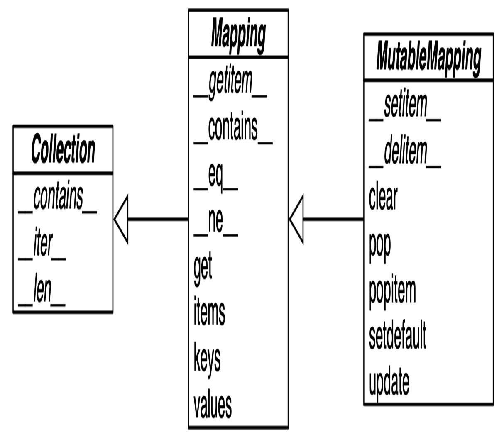
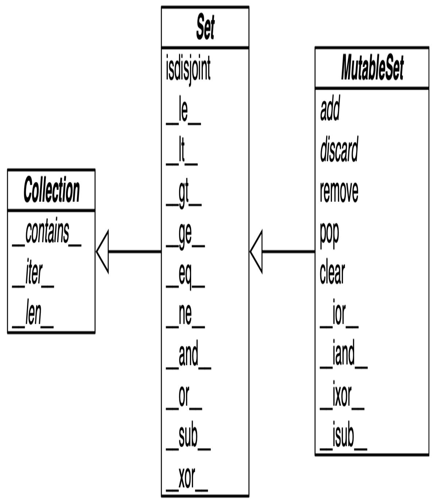

<span id="page-140-0"></span>
# Chapter 3: Dictionaries and Sets

## A NOTE FOR EARLY RELEASE READERS

With Early Release ebooks, you get books in their earliest form—the author's raw and unedited content as they write—so you can take advantage of these technologies long before the official release of these titles.

This will be the 3rd chapter of the final book. Please note that the GitHub repo will be made active later on.

If you have comments about how we might improve the content and/or examples in this book, or if you notice missing material within this chapter, please reach out to the author at [fluentpython2e@ramalho.org](mailto:fluentpython2e@ramalho.org).

*Python is basically dicts wrapped in loads of syntactic sugar.* —Lalo Martins, early digital nomad and Pythonista.

We use dictionaties in all our Python programs. If not directly in our code, then indirectly because the dict type is a fundamental part of Python's implementation. Class and instance attributes, module namespaces, and function keyword arguments are some of the core Python constructs represented by dictionaries in memory. The \_\_builtins\_\_.\_\_dict\_\_ stores all built-in types, objects, and functions.

Because of their crucial role, Python dicts are highly optimized—and continue to get improvements. *Hash tables* are the engines behind Python's highperformance dicts.

Other built-in types based on hash tables are set and frozenset. These offer richer APIs and operators than the sets you may have encountered in other popular languages. In particular, Python sets implement all the fundamental operations from set theory, like union, intersection, subset tests etc. With them, we can express algorithms in a more declarative way, avoiding lots of nested loops and conditionals.

Here is a brief outline of this chapter:

- Modern syntax to build and handle dicts and mappings, including enhanced unpacking and pattern matching.
- Common methods of mapping types.
- Special handling for missing keys.
- Variations of dict in the standard library.
- The set and frozenset types.
- Implications of hash tables in the behavior of sets and dictionaries.

<span id="page-141-0"></span>
## What's new in this chapter

Most changes in this *Second Edition* cover new features related to mapping types:

- ["Modern](#page-142-0) dict Syntax" covers enhanced unpacking syntax and different ways of merging mappings—including the | and |= operators supported by dicts since Python 3.9.
- ["Pattern Matching with Mappings"](#page-145-0) illustrates handling mappings with match/case, since Python 3.10.
- Section "[collections.OrderedDict](#page-163-0)" now focuses on the small but still relevant differences between dict and OrderedDict considering that dict keeps the key insertion order since Python 3.6.
- New sections on the view objects returned by dict.keys, dict.items, and dict.values[: "Dictionary views" and "Set](#page-189-0) operations on dict views".

The underlying implementation of dict and set still relies on hash tables, but the dict code has two important optimizations which save memory and preserve the insertion order of the keys in dict. The "Practical Consequences [of How dict Works" and "Practical Consequences of How Sets Work"](#page-172-0) summarize what you need to know to use them well.

### NOTE

After adding more than 200 pages in this *Second Edition*, I moved the optional section *[Internals of sets and dicts](https://www.fluentpython.com/extra/internals-of-sets-and-dicts/)* to the *[fluentpython.com](https://www.fluentpython.com/)* companion Web site. The updated and expanded [18-page post](https://www.fluentpython.com/extra/internals-of-sets-and-dicts/) includes explanations and diagrams about:

- The hash table algorithm and data structures, starting with its use in set, which is simpler to understand.
- The memory optimization that preserves key insertion order in dict instances (since Python 3.6).
- The key-sharing layout for dictionaries holding instance attributes—the \_\_dict\_\_ of user-defined objects (optimization implemented in Python 3.3).

<span id="page-142-0"></span>
## Modern dict Syntax

The next sections decribes advanced syntax features to build, unpack, and process mappings. Some of these features are not new in the language, but but may be new to you. Others require Python 3.9 (like the | operator) or Python 3.10 (like match/case). Let's start with one of the best and oldest of these features.

<span id="page-142-2"></span>
## dict Comprehensions

Since Python 2.7, the syntax of listcomps and genexps was adapted to dict comprehensions (and set comprehensions as well, which we'll soon visit). A *dictcomp* builds a dict instance by taking key:value pairs from any iterable. [Example 3-1](#page-142-1) shows the use of dict comprehensions to build two dictionaries from the same list of tuples.

<span id="page-142-1"></span>
### Example 3-1. Examples of dict comprehensions

```
>>> dial_codes = [ 
... (880, 'Bangladesh'),
... (55, 'Brazil'),
... (86, 'China'),
... (91, 'India'),
... (62, 'Indonesia'),
... (81, 'Japan'),
... (234, 'Nigeria'),
... (92, 'Pakistan'),
```

```
... (7, 'Russia'),
... (1, 'United States'),
... ]
>>> country_dial = {country: code for code, country in dial_codes} 
>>> country_dial
{'Bangladesh': 880, 'Brazil': 55, 'China': 86, 'India': 91,
'Indonesia': 62,
'Japan': 81, 'Nigeria': 234, 'Pakistan': 92, 'Russia': 7, 'United
States': 1}
>>> {code: country.upper() 
... for country, code in sorted(country_dial.items())
... if code < 70}
{55: 'BRAZIL', 62: 'INDONESIA', 7: 'RUSSIA', 1: 'UNITED STATES'}
```

- An iterable of key-value pairs like dial\_codes can be passed directly to the dict constructor, but…
- …here we swap the pairs: country is the key, and code is the value.
- Sorting country\_dial by name, reversing the pairs again, uppercasing values, and filtering items with code < 70.

If you're used to listcomps, dictcomps are a natural next step. If you aren't, the spread of the comprehension syntax means it's now more profitable than ever to become fluent in it.

<span id="page-143-0"></span>
## Unpacking Mappings

*[PEP 448—Additional Unpacking Generalizations](https://www.python.org/dev/peps/pep-0448/)* enhanced the support of mapping unpackings in two ways, since Python 3.5.

First, we can apply \*\* to more than one argument in a function call. This works when keys are all strings and unique accross all arguments (because duplicate keyword arguments are forbidden).

```
>>> def dump(**kwargs):
... return kwargs
...
>>> dump(**{'x': 1}, y=2, **{'z': 3})
{'x': 1, 'y': 2, 'z': 3}
```

Second, \*\* can be used inside a dict literal—also multiple times.

```
>>> {'a': 0, **{'x': 1}, 'y': 2, **{'z': 3, 'x': 4}}
{'a': 0, 'x': 4, 'y': 2, 'z': 3}
```

In this case, duplicate keys are allowed. Later occurrences overwrite previous ones—see the value mapped to x in the example.

This syntax can also be used to merge mappings, but there are other ways. Please read on.

<span id="page-144-0"></span>
## Merging Mappings with |

Python 3.9 supports using | and |= to merge mappings. This makes sense, since these are also the set union operators.

The | operator creates a new mapping:

```
>>> d1 = {'a': 1, 'b': 3}
>>> d2 = {'a': 2, 'b': 4, 'c': 6}
>>> d1 | d2
{'a': 2, 'b': 4, 'c': 6}
```

Usually the type of the new mapping will be the same as the type of the left operand—d1 in the example—but it can be the type of the second operand if user-defined types are involved, according the operator overloading rules we explore in [Chapter 16](023-chapter-16-operator-overloading-doing-it-right.md#page-797-0).

To update an existing mapping in-place, use |=. Continuing from the previous example, d1 was not changed, but now it is:

```
>>> d1
{'a': 1, 'b': 3}
>>> d1 |= d2
>>> d1
{'a': 2, 'b': 4, 'c': 6}
```

<span id="page-145-2"></span>
### TIP

[If you need to maintain code to run on Python 3.8 or earlier, the](https://www.python.org/dev/peps/pep-0584/) *[Motivation](https://www.python.org/dev/peps/pep-0584/#motivation)* section of *PEP 584—Add Union Operators To dict* provides a good summary of other ways to merge mappings.

Now let's see how pattern matching applies to mappings.

<span id="page-145-0"></span>
## Pattern Matching with Mappings

The match/case statement supports subjects that are mapping objects. Patterns for mappings look like dict literals, but they can match instances of any actual or virtual subclass of collections.abc.Mapping. [1](#page-199-0)

In [Chapter 2](007-chapter-2-an-array-of-sequences.md#page-51-0) we focused on sequence patterns only, but different types of patterns can be combined and nested. Thanks to destructuring, pattern matching is a powerful tool to process records structured like nested mappings and sequences, which we often need to read from JSON APIs and databases with semi-structured schemas, like MongoDB, EdgeDB, or PostgreSQL. [Example 3-2](#page-145-1) demonstrates that. The simple type hints in get\_creators make it clear that it takes a dict and returns a list.

<span id="page-145-1"></span>*Example 3-2. creator.py: get\_creators() extracts names of creators from media records.*

```
def get_creators(record: dict) -> list:
 match record:
 case {'type': 'book', 'api': 2, 'authors': [*names]}: 
 return names
 case {'type': 'book', 'api': 1, 'author': name}: 
 return [name]
 case {'type': 'book'}: 
 raise ValueError(f"Invalid 'book' record: {record!r}")
 case {'type': 'movie', 'director': name}: 
 return [name]
 case _: 
 raise ValueError(f'Invalid record: {record!r}')
```

Match any mapping with 'type': 'book', 'api' :2 and an 'authors' key mapped to a sequence. Return the items in the sequence, as a new list.

- Match any mapping with 'type': 'book', 'api' :1 and an 'author' key mapped to any object. Return the object inside a list.
- Any other mapping with 'type': 'book' is invalid, raise ValueError.
- Match any mapping with 'type': 'movie' and a 'director' key mapped to a single object. Return the object inside a list.
- Any other subject is invalid, raise ValueError.

[Example 3-2](#page-145-1) shows some useful practices for handling semi-structured data such as JSON records:

- include a field describing the kind of record (e.g. 'type': 'movie');
- include a field identifying the schema version (e.g. 'api': 2') to allow for future evolution of public APIs;
- have case clauses to handle invalid records of a specific type (e.g. 'book'), as well as a catch-all.

Now let's see how get\_creators handles some concrete doctests:

```
>>> b1 = dict(api=1, author='Douglas Hofstadter',
... type='book', title='Gödel, Escher, Bach')
>>> get_creators(b1)
['Douglas Hofstadter']
>>> from collections import OrderedDict
>>> b2 = OrderedDict(api=2, type='book',
... title='Python in a Nutshell',
... authors='Martelli Ravenscroft Holden'.split())
>>> get_creators(b2)
['Martelli', 'Ravenscroft', 'Holden']
>>> get_creators({'type': 'book', 'pages': 770})
Traceback (most recent call last):
 ...
ValueError: Invalid 'book' record: {'type': 'book', 'pages': 770}
>>> get_creators('Spam, spam, spam')
Traceback (most recent call last):
```

```
 ...
ValueError: Invalid record: 'Spam, spam, spam'
```

Note that the order of the keys in the patterns is irrelevant, even if the subject is an OrderedDict as b2.

In contrast with sequence patterns, mapping patterns succeed on partial matches. In the doctests, the b1 and b2 subjects include a 'title' key that does not appear in any 'book' pattern, yet they match.

There is no need to use \*\*extra to match extra key-value pairs, but if you want to capture them as a dict, you can prefix one variable with \*\*. It must be the last in the pattern, and \*\*\_ is forbidden because it would be redundant. A simple example:

```
>>> food = dict(category='ice cream', flavor='vanilla', cost=199)
>>> match food:
... case {'category': 'ice cream', **details}:
... print(f'Ice cream details: {details}')
...
Ice cream details: {'flavor': 'vanilla', 'cost': 199}
```

In ["Automatic Handling of Missing Keys"](#page-158-0) we'll study defaultdict and other mappings where key lookups via \_\_getitem\_\_ (i.e. d[key]) succeed because missing items are created on the fly. In the context of pattern matching, a match succeeds only if the subject already has the required keys at the top of the match statement.

### TIP

The automatic handling of missing keys is not triggered because pattern matching always uses the d.get(key, sentinel) method—where the default sentinel is a special marker value that cannot occur in user data.

Moving on from syntax and structure, let's study the API of mappings.

<span id="page-147-0"></span>
## Standard API of Mapping Types

The collections.abc module provides the Mapping and MutableMapping ABCs describing the interfaces of dict and similar types. See [Figure 3-1.](#page-148-0)

<span id="page-148-0"></span>

*Figure 3-1. Simplified UML class diagram for the MutableMapping and its superclasses from collections.abc (inheritance arrows point from subclasses to superclasses; names in italic are abstract classes and abstract methods)*

The main value of the ABCs is documenting and formalizing the standard interfaces for mappings, and serving as criteria for isinstance tests in code that needs to support mappings in a broad sense:

```
>>> my_dict = {}
>>> isinstance(my_dict, abc.Mapping)
True
>>> isinstance(my_dict, abc.MutableMapping)
True
```

### TIP

Using isinstance with an ABC is often better than checking whether a function argument is of the concrete dict type, because then alternative mapping types can be used. We'll discuss this in detail in [Chapter 13](020-chapter-13-interfaces-protocols-and-abcs.md#page-622-0).

To implement a custom mapping, it's easier to extend collections.UserDict, or to wrap a dict by composition, instead of subclassing these ABCs. The collections.UserDict class and all concrete mapping classes in the standard library encapsulate the basic dict in their implementation, which in turn is built on a hash table. Therefore, they all share the limitation that the keys must be *hashable* (the values need not be hashable, only the keys). If you need a refresher, the next section explains.

<span id="page-149-0"></span>
## What is Hashable

Here is part of the definition of hashable adapted from the [Python Glossary:](http://bit.ly/1K4qjwE)

<span id="page-149-1"></span>*An object is hashable if it has a hash code which never changes during its lifetime (it needs a \_\_hash\_\_() method), and can be compared to other objects (it needs an \_\_eq\_\_() method). Hashable objects which compare equal must have the same hash code. [2](#page-199-1)*

Numeric types and flat immutable types str and bytes are all hashable. Container types are hashable if they are immutable and all contained objects are also hashable. A frozenset is always hashable, because every element it contains must be hashable by definition. A tuple is hashable only if all its items are hashable. See tuples tt, tl, and tf:

```
>>> tt = (1, 2, (30, 40))
>>> hash(tt)
8027212646858338501
>>> tl = (1, 2, [30, 40])
>>> hash(tl)
Traceback (most recent call last):
 File "<stdin>", line 1, in <module>
TypeError: unhashable type: 'list'
>>> tf = (1, 2, frozenset([30, 40]))
>>> hash(tf)
-4118419923444501110
```

<span id="page-150-0"></span>The hash code of an object may be different depending on the version of Python, the machine architecture, and because of a *salt* added to the hash computation for security reasons. The hash code of a correctly implemented object is guaranteed to be constant only within one Python process. [3](#page-199-2)

User-defined types are hashable by default because their hash code is their id() and the \_\_eq\_\_() method inherited from the object class simply compares the object ids. If an object implements a custom \_\_eq\_\_() which takes into account its internal state, it will be hashable only if its \_\_hash\_\_() always returns the same hash code. In practice, this requires that \_\_eq\_\_() and \_\_hash\_\_() only take into account instance attributes that never change during the life of the object.

Now let's review the API of the most commonly used mapping types in Python: dict, defaultdict and OrderedDict.

<span id="page-150-1"></span>
## Overview of Common Mapping Methods

The basic API for mappings is quite rich. [Table 3-1](#page-151-0) shows the methods implemented by dict and two popular variations: defaultdict and OrderedDict, both defined in the collections module.

<span id="page-151-0"></span>Та

ble

3-

1.

Me

tho

ds

of

the

ma

ppi

ng

typ

es

dic

t,

col

lec tio

ns.

def

aul

tdi

ct,

an d

col

lec

tio

ns.

Or

der

ed

Di

ct

(co

*m mo n obj ect me tho ds om itte d for bre vit y); opt ion al ar gu me nts are en clo sed in*

*[…]*

|                    | dict | defaultdict | OrderedDict |                  |
|--------------------|------|-------------|-------------|------------------|
| d.clear()          | ●    | ●           | ●           | Remove all items |
| dcontains_<br>_(k) | ●    | ●           | ●           | k in d           |
| d.copy()           | ●    | ●           | ●           | Shallow copy     |

<span id="page-153-0"></span>

| dcopy()                               |   | • |   | Support for copy. copy(d)                                                                      |
|---------------------------------------|---|---|---|------------------------------------------------------------------------------------------------|
| d.default_fac<br>tory                 |   | • |   | Callable invoked<br>bymissing<br>to set missing<br>values <sup>a</sup>                         |
| ddelitem<br>(k)                       | • | • | • | del d[k]— remove item with key k                                                               |
| <pre>d.fromkeys(i t, [initial])</pre> | • | • | • | New mapping from<br>keys in iterable,<br>with optional initial<br>value (defaults to N<br>one) |
| <pre>d.get(k, [def ault])</pre>       | • | • | • | Get item with key k, return default or None if missing                                         |
| dgetitem<br>(k)                       | • | • | • | d[k]—get item with key k                                                                       |
| d.items()                             | • | • | • | Get view over items —(key, valu\ne) pairs                                                      |
| d. <u>iter(</u> )                     | • | • | • | Get iterator over keys                                                                         |
| d.keys()                              | • | • | • | Get view over keys                                                                             |
| dlen()                                | • | • | • | len(d)—number of items                                                                         |
| dmissing<br>(k)                       |   | • |   | Called whenge titem cannot find the key                                                        |
| <pre>d.move_to_end (k, [last])</pre>  |   |   | • | Move k first or last position (last is T rue by default)                                       |
| dor(other)                            | • | • | • | Support for d1   d2 to create new d                                                            |

<span id="page-154-1"></span><span id="page-154-0"></span>

|                                           |   |   | ict merging d1<br>and d2 (Python ≥<br>3.9)                                     |
|-------------------------------------------|---|---|--------------------------------------------------------------------------------|
| dior(oth •\ner)                           | • | • | Support for d1  = d2 to update d1 with d2 (Python ≥ 3.9)                       |
| d.pop(k, [def • ault])                    | • | • | Remove and return value at k, or defa ult or None if missing                   |
| d.popitem() ●                             | • | • | Remove and return<br>the last inserted<br>item as (key, va<br>lue) b           |
| dreversed_ •<br>_()                       | • | • | Support for rever se(d)—returns iterator for keys from last to first inserted. |
| dror(oth •<br>er)                         | • | • | Support for other $\mid$ dd—reversed union operator $(Python \ge 3.9)^{c}$     |
| <pre>d.setdefault   (k, [defaul t])</pre> | • | • | <pre>If k in d, return d[k]; else set d [k] = default and return it</pre>      |
| dsetitem •<br>(k, v)                      | • | • | d[k] = v—put v<br>at k                                                         |
| d.update(m, •<br>[**kwargs])              | • | • | Update d with items from mapping or iterable of (key, value) pairs             |
| d.values() •                              | • | • | Get <i>view</i> over values                                                    |

- <span id="page-155-0"></span>[a](#page-153-0) default\_factory is not a method, but a callable attribute set by the end user when a defaultdict is instantiated.
- <span id="page-155-1"></span>[b](#page-154-0) OrderedDict.popitem(last=False) removes the first item inserted (FIFO). The last keyword argument is not supported in dict or defaultdict as recently as Python 3.10b3.
- <span id="page-155-2"></span>[c](#page-154-1) Reversed operators are explained in [Chapter 16](023-chapter-16-operator-overloading-doing-it-right.md#page-797-0).

The way d.update(m) handles its first argument m is a prime example of *duck typing*: it first checks whether m has a keys method and, if it does, assumes it is a mapping. Otherwise, update() falls back to iterating over m, assuming its items are (key, value) pairs. The constructor for most Python mappings uses the logic of update() internally, which means they can be initialized from other mappings or from any iterable object producing (key, value) pairs.

A subtle mapping method is setdefault(). It avoids redundant key lookups when we need to update the value of an item in-place. The next section shows how to use it.

<span id="page-155-4"></span>
## Inserting or Updating Mutable Values

In line with Python's *fail-fast* philosophy, dict access with d[k] raises an error when k is not an existing key. Pythonistas know that d.get(k, default) is an alternative to d[k] whenever a default value is more convenient than handling KeyError. However, when you retrieve a mutable value and want to update it, there is better way.

Consider a script to index text, producing a mapping where each key is a word and the value is a list of positions where that word occurs, as shown in [Example 3-3](#page-155-3).

<span id="page-155-3"></span>*Example 3-3. Partial output from [Example 3-4](#page-156-0) processing the Zen of Python; each line shows a word and a list of occurrences coded as pairs: (line\_number, column\_number)*

```
$ python3 index0.py zen.txt
a [(19, 48), (20, 53)]
Although [(11, 1), (16, 1), (18, 1)]
ambiguity [(14, 16)]
```

```
and [(15, 23)]
are [(21, 12)]
aren [(10, 15)]
at [(16, 38)]
bad [(19, 50)]
be [(15, 14), (16, 27), (20, 50)]
beats [(11, 23)]
Beautiful [(3, 1)]
better [(3, 14), (4, 13), (5, 11), (6, 12), (7, 9), (8, 11), (17, 8),
(18, 25)]
...
```

[Example 3-4](#page-156-0), a suboptimal script written to show one case where dict.get is not the best way to handle a missing key. I adapted it from an example by Alex Martelli. [4](#page-199-3)

<span id="page-156-1"></span><span id="page-156-0"></span>*Example 3-4. index0.py uses dict.get to fetch and update a list of word occurrences from the index (a better solution is in [Example 3-5\)](#page-157-0)*

```
"""Build an index mapping word -> list of occurrences"""
import re
import sys
WORD_RE = re.compile(r'\w+')
index = {}
with open(sys.argv[1], encoding='utf-8') as fp:
 for line_no, line in enumerate(fp, 1):
 for match in WORD_RE.finditer(line):
 word = match.group()
 column_no = match.start() + 1
 location = (line_no, column_no)
 # this is ugly; coded like this to make a point
 occurrences = index.get(word, []) 
 occurrences.append(location) 
 index[word] = occurrences 
# display in alphabetical order
for word in sorted(index, key=str.upper): 
 print(word, index[word])
```

- Get the list of occurrences for word, or [] if not found.
- Append new location to occurrences.

<span id="page-157-1"></span>Put changed occurrences into index dict; this entails a second search through the index.

In the key= argument of sorted I am not calling str.upper, just passing a reference to that method so the sorted function can use it to normalize the words for sorting. [5](#page-199-4)

The three lines dealing with occurrences in [Example 3-4](#page-156-0) can be replaced by a single line using dict.setdefault. [Example 3-5](#page-157-0) is closer to Alex Martelli's code.

<span id="page-157-0"></span>*Example 3-5. index.py uses dict.setdefault to fetch and update a list of word occurrences from the index in a single line; contrast with [Example 3-4](#page-156-0)*

```
"""Build an index mapping word -> list of occurrences"""
import re
import sys
WORD_RE = re.compile(r'\w+')
index = {}
with open(sys.argv[1], encoding='utf-8') as fp:
 for line_no, line in enumerate(fp, 1):
 for match in WORD_RE.finditer(line):
 word = match.group()
 column_no = match.start() + 1
 location = (line_no, column_no)
 index.setdefault(word, []).append(location) 
# display in alphabetical order
for word in sorted(index, key=str.upper):
 print(word, index[word])
```

Get the list of occurrences for word, or set it to [] if not found; setdefault returns the value, so it can be updated without requiring a second search.

In other words, the end result of this line…

```
my_dict.setdefault(key, []).append(new_value)
```

…is the same as running…

```
if key not in my_dict:
 my_dict[key] = []
my_dict[key].append(new_value)
```

…except that the latter code performs at least two searches for key—three if it's not found—while setdefault does it all with a single lookup.

A related issue, handling missing keys on any lookup (and not only when inserting), is the subject of the next section.

<span id="page-158-0"></span>
## Automatic Handling of Missing Keys

Sometimes it is convenient to have mappings that return some made-up value when a missing key is searched. There are two main approaches to this: one is to use a defaultdict instead of a plain dict. The other is to subclass dict or any other mapping type and add a \_\_missing\_\_ method. Both solutions are covered next.

<span id="page-158-1"></span>
## defaultdict: Another Take on Missing Keys

A collections.defaultdict instance creates items with a default value on demand whenever a missing key is searched using d[k] syntax. [Example 3-6](#page-159-0) uses defaultdict to provide another elegant solution to the word index task from [Example 3-5](#page-157-0).

Here is how it works: when instantiating a defaultdict, you provide a callable to produce a default value whenever \_\_getitem\_\_ is passed a nonexistent key argument.

For example, given a defaultdict created as dd = defaultdict(list), if 'new-key' is not in dd, the expression dd['new-key'] does the following steps:

- 1. Calls list() to create a new list.
- 2. Inserts the list into dd using 'new-key' as key.

### 3. Returns a reference to that list.

The callable that produces the default values is held in an instance attribute named default\_factory.

<span id="page-159-0"></span>*Example 3-6. index\_default.py: using defaultdict instead of the setdefault method*

```
"""Build an index mapping word -> list of occurrences"""
import collections
import re
import sys
WORD_RE = re.compile(r'\w+')
index = collections.defaultdict(list) 
with open(sys.argv[1], encoding='utf-8') as fp:
 for line_no, line in enumerate(fp, 1):
 for match in WORD_RE.finditer(line):
 word = match.group()
 column_no = match.start() + 1
 location = (line_no, column_no)
 index[word].append(location) 
# display in alphabetical order
for word in sorted(index, key=str.upper):
 print(word, index[word])
```

- Create a defaultdict with the list constructor as default\_factory.
- If word is not initially in the index, the default\_factory is called to produce the missing value, which in this case is an empty list that is then assigned to index[word] and returned, so the .append(location) operation always succeeds.

If no default\_factory is provided, the usual KeyError is raised for missing keys.

### WARNING

The default\_factory of a defaultdict is only invoked to provide default values for \_\_getitem\_\_ calls, and not for the other methods. For example, if dd is a defaultdict, and k is a missing key, dd[k] will call the default\_factory to create a default value, but dd.get(k) still returns None, and k in dd is False.

The mechanism that makes defaultdict work by calling default\_factory is the \_\_missing\_\_ special method, a feature that we discuss next.

<span id="page-160-0"></span>
## The \_\_missing\_\_ Method

Underlying the way mappings deal with missing keys is the aptly named \_\_missing\_\_ method. This method is not defined in the base dict class, but dict is aware of it: if you subclass dict and provide a \_\_missing\_\_ method, the standard dict.\_\_getitem\_\_ will call it whenever a key is not found, instead of raising KeyError.

<span id="page-160-1"></span>
### WARNING

The \_\_missing\_\_ method is only called by \_\_getitem\_\_ (i.e., for the d[k] operator). The presence of a \_\_missing\_\_ method has no effect on the behavior of other methods that look up keys, such as get or \_\_contains\_\_ (which implements the in operator). This is why the default\_factory of defaultdict works only with \_\_getitem\_\_, as noted in the warning at the end of the previous section.

Suppose you'd like a mapping where keys are converted to str when looked up. A concrete use case is a device library for IoT , where a programmable board with general purpose I/O pins (e.g., a Raspberry Pi or an Arduino) is represented by a Board class with a my\_board.pins attribute, which is a mapping of physical pin identifiers to pin software objects. The physical pin identifier may be just a number or a string like "A0" or "P9\_12". For consistency, it is desirable that all keys in board.pins are strings, but it is also convenient that looking up a pin by number, as in [6](#page-199-5)

my\_arduino.pin[13], so that beginners are not tripped when they want to blink the LED on pin 13 of their Arduinos. [Example 3-7](#page-161-0) shows how such a mapping would work.

<span id="page-161-0"></span>*Example 3-7. When searching for a nonstring key, StrKeyDict0 converts it to str when it is not found*

```
Tests for item retrieval using `d[key]` notation::
 >>> d = StrKeyDict0([('2', 'two'), ('4', 'four')])
 >>> d['2']
 'two'
 >>> d[4]
 'four'
 >>> d[1]
 Traceback (most recent call last):
 ...
 KeyError: '1'
Tests for item retrieval using `d.get(key)` notation::
 >>> d.get('2')
 'two'
 >>> d.get(4)
 'four'
 >>> d.get(1, 'N/A')
 'N/A'
Tests for the `in` operator::
 >>> 2 in d
 True
 >>> 1 in d
 False
```

[Example 3-8](#page-162-0) implements a class StrKeyDict0 that passes the preceding doctests.

```
TIP
A better way to create a user-defined mapping type is to subclass
collections.UserDict instead of dict (as we'll do in Example 3-9). Here we
subclass dict just to show that __missing__ is supported by the built-in
dict.__getitem__ method.
```

<span id="page-162-0"></span>
## Example 3-8. StrKeyDict0 converts nonstring keys to str on lookup (see tests in Example 3-7\)

```
class StrKeyDict0(dict): 
 def __missing__(self, key):
 if isinstance(key, str): 
 raise KeyError(key)
 return self[str(key)] 
 def get(self, key, default=None):
 try:
 return self[key] 
 except KeyError:
 return default 
 def __contains__(self, key):
 return key in self.keys() or str(key) in self.keys()
```

- StrKeyDict0 inherits from dict.
- Check whether key is already a str. If it is, and it's missing, raise KeyError.
- Build str from key and look it up.
- The get method delegates to \_\_getitem\_\_ by using the self[key] notation; that gives the opportunity for our \_\_missing\_\_ to act.
- If a KeyError was raised, \_\_missing\_\_ already failed, so we return the default.
- Search for unmodified key (the instance may contain non-str keys), then for a str built from the key.

Take a moment to consider why the test isinstance(key, str) is necessary in the \_\_missing\_\_ implementation.

Without that test, our \_\_missing\_\_ method would work OK for any key k —str or not str—whenever str(k) produced an existing key. But if str(k) is not an existing key, we'd have an infinite recursion. In the last line of \_\_missing\_\_, self[str(key)] would call \_\_getitem\_\_ passing that str key, which in turn would call \_\_missing\_\_ again.

The \_\_contains\_\_ method is also needed for consistent behavior in this example, because the operation k in d calls it, but the method inherited from dict does not fall back to invoking \_\_missing\_\_. There is a subtle detail in our implementation of \_\_contains\_\_: we do not check for the key in the usual Pythonic way—k in my\_dict—because str(key) in self would recursively call \_\_contains\_\_. We avoid this by explicitly looking up the key in self.keys().

### NOTE

A search like k in my\_dict.keys() is efficient in Python 3 even for very large mappings because dict.keys() returns a view, which is similar to a set, as we'll see in ["Set operations on](#page-189-0) dict views". However, remember that k in my\_dict does the same job, and is faster because it avoids the attribute lookup to find the .keys method. I had a specific reason to use self.keys() in the \_\_contains\_\_ method in [Example 3-8](#page-162-0).

The check for the unmodified key—key in self.keys()—is necessary for correctness because StrKeyDict0 does not enforce that all keys in the dictionary must be of type str. Our only goal with this simple example is to make searching "friendlier" and not enforce types.

So far we have covered the dict and defaultdict mapping types, but the standard library comes with other mapping implementations, which we discuss next.

<span id="page-163-1"></span>
## Variations of dict

In this section is an overview of mapping types included in the standard library, besides defaultdict[, already covered in "](#page-158-1)defaultdict: Another Take on Missing Keys".

<span id="page-163-0"></span>
## collections.OrderedDict

Now that the built-in dict also keeps the keys ordered since Python 3.6, the most common reason to use OrderedDict is writing code that is backwardcompatible with earlier Python versions. Having said that, Python's documentation lists some remaining differences between dict and OrderedDict, which I quote here—only reordering the items for relevance in daily use:

- The equality operation for OrderedDict checks for matching order.
- The popitem() method of OrderedDict has a different signature. It accepts an optional argument to specify which item is popped.
- OrderedDict has a move\_to\_end() method to efficiently reposition an element to an endpoint.
- The regular dict was designed to be very good at mapping operations. Tracking insertion order was secondary.
- OrderedDict was designed to be good at reordering operations. Space efficiency, iteration speed, and the performance of update operations were secondary.
- Algorithmically, OrderedDict can handle frequent reordering operations better than dict. This makes it suitable for tracking recent accesses (for example in an LRU cache).

<span id="page-164-0"></span>
## collections.ChainMap

A ChainMap instance holds a list of mappings that can be searched as one. The lookup is performed on each input mapping in the order they appear in the constructor call, and succeeds as soon as the key is found in one of those mappings. For example:

```
>>> d1 = dict(a=1, b=3)
>>> d2 = dict(a=2, b=4, c=6)
>>> from collections import ChainMap
>>> chain = ChainMap(d1, d2)
>>> chain['a']
1
```

```
>>> chain['c']
6
```

The ChainMap instance does not copy the input mappings, but holds references to them. A later update to a key in the ChainMap will update the first input mapping where that key appears. Continuing the previous example:

```
>>> chain['b'] = -1
>>> d1
{'a': 1, 'b': -1}
>>> d2
{'a': 2, 'b': 4, 'c': 6}
```

ChainMap is useful to implement interpreters for languages with nested scopes, where each mapping represents a scope context, from the innermost [enclosing scope to the outermost scope. The "ChainMap objects" section of the](http://bit.ly/1Vm7I4c:) collections docs has several examples of ChainMap usage, including this snippet inspired by the basic rules of variable lookup in Python:

```
import builtins
pylookup = ChainMap(locals(), globals(), vars(builtins))
```

<span id="page-165-0"></span>
## collections.Counter

A mapping that holds an integer count for each key. Updating an existing key adds to its count. This can be used to count instances of hashable objects or as a multiset (see below). Counter implements the + and - operators to combine tallies, and other useful methods such as most\_common([n]), which returns an ordered list of tuples with the *n* most common items and their counts; see the [documentation](http://bit.ly/1JHVi2E). Here is Counter used to count letters in words:

```
>>> ct = collections.Counter('abracadabra')
>>> ct
Counter({'a': 5, 'b': 2, 'r': 2, 'c': 1, 'd': 1})
>>> ct.update('aaaaazzz')
>>> ct
Counter({'a': 10, 'z': 3, 'b': 2, 'r': 2, 'c': 1, 'd': 1})
>>> ct.most_common(3)
[('a', 10), ('z', 3), ('b', 2)]
```

Note that the 'b' and 'r' keys are tied in third place, but ct.most\_common(3) shows only three counts.

To use collections.Counter as a multiset, pretend each key is an element in the set, and the count is the number of occurrences of that element in the set.

<span id="page-166-0"></span>
## shelve.Shelf

The shelve module in the standard library provides persistent storage for a mapping of string keys to Python objects serialized in the pickle binary format. The curious name of shelve makes sense when you realize that pickle jars are stored in shelves.

The shelve.open module-level function returns a shelve.Shelf instance—a simple key-value DBM database backed by the dbm module, with these characteristics:

- shelve.Shelf subclasses abc.MutableMapping, so it provides the essential methods we expect of a mapping type.
- In addition, shelve.Shelf provides a few other I/O management methods, like sync and close.
- a Shelf instance is a context manager, so you can use a with block to make sure it is closed after use.
- Keys and values are saved whenever a new value is assigned to a key.
- The keys must be strings.
- The values must be objects that the pickle module can serialize.

The documentation for the [shelve](https://docs.python.org/3/library/shelve.html), [dbm](https://docs.python.org/3/library/dbm.html), and [pickle](https://docs.python.org/3/library/pickle.html) modules provide more details and some caveats.

<span id="page-167-1"></span>
### WARNING

Python's pickle is easy to use in the simplest cases, but has several drawbacks. Read Ned Batchelder's [Pickle's nine flaws](https://nedbatchelder.com/blog/202006/pickles_nine_flaws.html) before adopting any solution involving pickle. In his post, Ned mentions other serialization formats to consider.

OrderedDict, ChainMap, Counter, and Shelf are ready to use but can also be customized by subclassing. In contrast, UserDict is intended only as a base class to be extended.

<span id="page-167-2"></span>
## Subclassing UserDict Instead of dict

It's better to create a new mapping type by extending collections.UserDict rather than dict. We realize that when we try to extend our StrKeyDict0 from [Example 3-8](#page-162-0) to make sure that any keys added to the mapping are stored as str.

The main reason why it's better to subclass UserDict rather than dict is that the built-in has some implementation shortcuts that end up forcing us to override methods that we can just inherit from UserDict with no problems. [7](#page-199-6)

Note that UserDict does not inherit from dict, but uses composition: it has an internal dict instance, called data, which holds the actual items. This avoids undesired recursion when coding special methods like \_\_setitem\_\_, and simplifies the coding of \_\_contains\_\_, compared to [Example 3-8.](#page-162-0)

Thanks to UserDict, StrKeyDict ([Example 3-9\)](#page-167-0) is actually shorter than StrKeyDict0 ([Example 3-8\)](#page-162-0), but it does more: it stores all keys as str, avoiding unpleasant surprises if the instance is built or updated with data containing nonstring keys.

<span id="page-167-0"></span>*Example 3-9. StrKeyDict always converts non-string keys to str—on insertion, update, and lookup*

```
import collections
class StrKeyDict(collections.UserDict): 
 def __missing__(self, key):
```

```
 if isinstance(key, str):
 raise KeyError(key)
 return self[str(key)]
 def __contains__(self, key):
 return str(key) in self.data 
 def __setitem__(self, key, item):
 self.data[str(key)] = item
```

- StrKeyDict extends UserDict.
- \_\_missing\_\_ is exactly as in [Example 3-8.](#page-162-0)
- \_\_contains\_\_ is simpler: we can assume all stored keys are str and we can check on self.data instead of invoking self.keys() as we did in StrKeyDict0.
- \_\_setitem\_\_ converts any key to a str. This method is easier to overwrite when we can delegate to the self.data attribute.

Because UserDict extends abc.MutableMapping, the remaining methods that make StrKeyDict a full-fledged mapping are inherited from UserDict, MutableMapping, or Mapping. The latter have several useful concrete methods, in spite of being abstract base classes (ABCs). The following methods are worth noting:

## MutableMapping.update

This powerful method can be called directly but is also used by \_\_init\_\_ to load the instance from other mappings, from iterables of (key, value) pairs, and keyword arguments. Because it uses self[key] = value to add items, it ends up calling our implementation of \_\_setitem\_\_.

## Mapping.get

In StrKeyDict0 ([Example 3-8\)](#page-162-0), we had to code our own get to return the same results as \_\_getitem\_\_, but in [Example 3-9](#page-167-0) we inherited

Mapping.get, which is implemented exactly like StrKeyDict0.get (see [Python source code](http://bit.ly/1FEOPPB)).

### TIP

Antoine Pitrou authored [PEP 455 — Adding a key-transforming dictionary to collections](https://www.python.org/dev/peps/pep-0455/) and a patch to enhance the collections module with a TransformDict, that is more general than StrKeyDict and preserves the keys as they are provided, before tha transformation is applied. PEP 455 was rejected in May 2015—see Raymond Hettinger's [rejection message.](https://mail.python.org/pipermail/python-dev/2015-May/140003.html) To experiment with TransformDict, I extracted Pitrou's patch from [issue1898](http://bugs.python.org/issue18986)[6 into a standalone module \(](https://github.com/fluentpython/example-code-2e)[03-dict-set/transformdict.py](https://github.com/fluentpython/example-code-2e/blob/master/03-dict-set/transformdict.py) [in the](https://github.com/fluentpython/example-code-2e) *Fluent Python Second Edition* code repository).

We know there are immutable sequence types, but how about an immutable mapping? Well, there isn't a real one in the standard library, but a stand-in is available. That's next.

<span id="page-169-1"></span>
## Immutable Mappings

The mapping types provided by the standard library are all mutable, but you may need to prevent users from changing a mapping by accident. A concrete use case can be found, again, in a hardware programming library like *Pingo*, mentioned in "The [\\_\\_missing\\_\\_](#page-160-0) Method": the board.pins mapping represents the physical GPIO pins on the device. As such, it's useful to prevent inadvertent updates to board.pins because the hardware can't be changed via software, so any change in the mapping would make it inconsistent with the physical reality of the device.

The types module provides a wrapper class called MappingProxyType, which, given a mapping, returns a mappingproxy instance that is a readonly but dynamic proxy for the original mapping. This means that updates to the original mapping can be seen in the mappingproxy, but changes cannot be made through it. See [Example 3-10](#page-169-0) for a brief demonstration.

<span id="page-169-0"></span>*Example 3-10. MappingProxyType builds a read-only mappingproxy instance from a dict*

```
>>> from types import MappingProxyType
>>> d = {1: 'A'}
>>> d_proxy = MappingProxyType(d)
>>> d_proxy
mappingproxy({1: 'A'})
>>> d_proxy[1] 
'A'
>>> d_proxy[2] = 'x' 
Traceback (most recent call last):
 File "<stdin>", line 1, in <module>
TypeError: 'mappingproxy' object does not support item assignment
>>> d[2] = 'B'
>>> d_proxy 
mappingproxy({1: 'A', 2: 'B'})
>>> d_proxy[2]
'B'
>>>
```

- Items in d can be seen through d\_proxy.
- Changes cannot be made through d\_proxy.
- d\_proxy is dynamic: any change in d is reflected.

Here is how this could be used in practice in the hardware programming scenario: the constructor in a concrete Board subclass would fill a private mapping with the pin objects, and expose it to clients of the API via a public .pins attribute implemented as a mappingproxy. That way the clients would not be able to add, remove, or change pins by accident.

Next, we'll cover views—which allow high-performance oparations on a dict, without unnecessary copying of data.

<span id="page-170-0"></span>
## Dictionary views

The dict instance methods .keys(), .values(), and .items() return instances of classes called dict\_keys, dict\_values, and dict\_items, respectively. These dictionary views are read-only projections of the internal data structures used in the dict implementation. They avoid the memory overhead of the equivalent Python 2 methods that returned lists duplicating

data already in the target dict, and they also replace the old methods that returned iterators.

[Example 3-11](#page-171-0) shows some basic operations supported by all dictionary views.

<span id="page-171-0"></span>*Example 3-11. The .values() method returns a view of the values in a dict.*

```
>>> d = dict(a=10, b=20, c=30)
>>> values = d.values()
>>> values
dict_values([10, 20, 30]) 
>>> len(values) 
3
>>> list(values) 
[10, 20, 30]
>>> reversed(values) 
<dict_reversevalueiterator object at 0x10e9e7310>
>>> values[0]
Traceback (most recent call last):
 File "<stdin>", line 1, in <module>
TypeError: 'dict_values' object is not subscriptable
```

- The repr of a view object shows its content.
- We can query the len of a view.
- Views are iterable, so it's easy to create lists from them.
- Views implement \_\_reversed\_\_, returning a custom iterator.
- We can't use [] to get individual items from a view.

A view object is a dynamic proxy. If the source dict is updated, you can immediately see the changes through an existing view. Continuing from [Example 3-11](#page-171-0):

```
>>> d['z'] = 99
>>> d
{'a': 10, 'b': 20, 'c': 30, 'z': 99}
>>> values
dict_values([10, 20, 30, 99])
```

The classes dict\_keys, dict\_values, and dict\_items are internal: they are not available via \_\_builtins\_\_ or any standard library module, and even if you get a reference to one of them, you can't use it to create a view from scratch in Python code:

```
>>> values_class = type({}.values())
>>> v = values_class()
Traceback (most recent call last):
 File "<stdin>", line 1, in <module>
TypeError: cannot create 'dict_values' instances
```

The dict\_values class is the simplest dictionary view—it implements only the \_\_len\_\_, \_\_iter\_\_, and \_\_reversed\_\_ special methods. In addition to these methods, dict\_keys and dict\_items implement several set methods, almost as many as the frozenset class. After we cover sets, we'll [have more to say about](#page-189-0) dict\_keys and dict\_items in "Set operations on dict views".

Now let's see some rules and tips informed by the way dict is implemented under the hood.

<span id="page-172-0"></span>
## Practical Consequences of How dict Works

The hash table implementation of Python's dict is very efficient, but it's important to understand the practical effects of this design.

- Keys must be hashable objects. They must implement proper \_\_hash\_\_ and \_\_eq\_\_ [methods as described in "What is](#page-149-0) Hashable".
- Item access by key is very fast. A dict may have millions of keys, but Python can locate a key directly by computing the hash code of the key and deriving an index offset into the hash table, with the possible overhead of a small number of tries to find a matching entry.
- Key ordering is preserved as a side-effect of a more compact memory layout for dict in CPython 3.6, which became an official language feature in 3.7.

- <span id="page-173-0"></span>Despite its new compact layout, dicts inevitably have a significant memory overhead. The most compact internal data structure for a container would be an array of pointers to the items. Compared to that, a hash table needs to store more data per entry, and Python needs to keep at least ⅓ of the hash table rows empty to remain efficient. [8](#page-199-7)
- <span id="page-173-1"></span>To save memory, avoid creating instance attributes outside of the \_\_init\_\_ method.

That tip about instance attributes comes from the fact that Python's default behavior is to store instance attributes in a special \_\_dict\_\_ attribute which is a dict attached to each instance. Since [PEP 412—Key-Sharing Dictionary](https://www.python.org/dev/peps/pep-0412/) was implemented in Python 3.3, instances of a class can share a common hash table, stored with the class. That common hash table is shared by the \_\_dict\_\_ of each new instance that has the same attributes names as the first instance of that class when \_\_init\_\_ returns. Each instance \_\_dict\_\_ can then hold only its own attribute values as a simple array of pointers. Adding an instance attribute after \_\_init\_\_ forces Python to create a new hash table just for the \_\_dict\_\_ of that one instance (which was the default behavior for all instances before Python 3.3). According to PEP 412, this optimization reduces memory use by 10% to 20% for object-oriented programs. [9](#page-199-8)

The details of the compact layout and key-sharing optimizations are rather complex. For more, please read *[Internals of sets and dicts](https://www.fluentpython.com/extra/internals-of-sets-and-dicts/)* at [fluentpython.com](https://www.fluentpython.com/). Now let's dive into sets.

<span id="page-173-2"></span>
## Set Theory

Sets are not new in Python, but are still somewhat underused. The set type and its immutable sibling frozenset first appeared as modules in the Python 2.3 standard library, and were promoted to built-ins in Python 2.6.

### NOTE

In this book, I use the word "set" to refer both to set and frozenset. When talking specifically about the set class, I use constant width font: set.

A set is a collection of unique objects. A basic use case is removing duplication:

```
>>> 1 = ['spam', 'spam', 'eggs', 'spam', 'bacon', 'eggs']
>>> set(1)
{'eggs', 'spam', 'bacon'}
>>> list(set(1))
['eggs', 'spam', 'bacon']
```

```
If you want to remove duplicates but also preserve the order of the first occurrence of each item, you can now use a plain dict to do it, like this:

>>> dict.fromkeys(1).keys()
dict_keys(['spam', 'eggs', 'bacon'])
>>> list(dict.fromkeys(1).keys())
['spam', 'eggs', 'bacon']
```

Set elements must be hashable. The set type is not hashable, so you can't build a set with nested set instances. But frozenset is hashable, so you can have frozenset elements inside a set.

In addition to enforcing uniqueness, the set types implement many set operations as infix operators, so, given two sets a and b, a | b returns their union, a & b computes the intersection, a - b the difference, and a ^ b the symmetric difference. Smart use of set operations can reduce both the line count and the execution time of Python programs, at the same time making code easier to read and reason about—by removing loops and conditional logic.

For example, imagine you have a large set of email addresses (the haystack) and a smaller set of addresses (the needles) and you need to count how many needles occur in the haystack. Thanks to set intersection (the & operator) you can code that in a simple line (see Example 3-12).

<span id="page-174-0"></span>Example 3-12. Count occurrences of needles in a haystack, both of type set

```
found = len(needles & haystack)
```

Without the intersection operator, you'd have write [Example 3-13](#page-175-0) to accomplish the same task as [Example 3-12](#page-174-0).

<span id="page-175-0"></span>*Example 3-13. Count occurrences of needles in a haystack (same end result as [Example 3-12\)](#page-174-0)*

```
found = 0
for n in needles:
 if n in haystack:
 found += 1
```

[Example 3-12](#page-174-0) runs slightly faster than [Example 3-13.](#page-175-0) On the other hand, [Example 3-13](#page-175-0) works for any iterable objects needles and haystack, while [Example 3-12](#page-174-0) requires that both be sets. But, if you don't have sets on hand, you can always build them on the fly, as shown in [Example 3-14.](#page-175-1)

<span id="page-175-1"></span>*Example 3-14. Count occurrences of needles in a haystack; these lines work for any iterable types*

```
found = len(set(needles) & set(haystack))
# another way:
found = len(set(needles).intersection(haystack))
```

Of course, there is an extra cost involved in building the sets in [Example 3-14](#page-175-1), but if either the needles or the haystack is already a set, the alternatives in [Example 3-14](#page-175-1) may be cheaper than [Example 3-13.](#page-175-0)

Any one of the preceding examples are capable of searching 1,000 elements in a haystack of 10,000,000 items in about 0.3 milliseconds—that's close to 0.3 microseconds per element.

Besides the extremely fast membership test (thanks to the underlying hash table), the set and frozenset built-in types provide a rich API to create new sets or, in the case of set, to change existing ones. We will discuss the operations shortly, but first a note about syntax.

<span id="page-175-2"></span>
## Set Literals

The syntax of set literals—{1}, {1, 2}, etc.—looks exactly like the math notation, with one important exception: there's no literal notation for the empty set, so we must remember to write set().

### SYNTAX QUIRK

Don't forget: to create an empty set, you should use the constructor without an argument: set(). If you write {}, you're creating an empty dict—this hasn't changed in Python 3.

In Python 3, the standard string representation of sets always uses the {…} notation, except for the empty set:

```
>>> s = {1}
>>> type(s)
<class 'set'>
>>> s
{1}
>>> s.pop()
1
>>> s
set()
```

Literal set syntax like {1, 2, 3} is both faster and more readable than calling the constructor (e.g., set([1, 2, 3])). The latter form is slower because, to evaluate it, Python has to look up the set name to fetch the constructor, then build a list, and finally pass it to the constructor. In contrast, to process a literal like {1, 2, 3}, Python runs a specialized BUILD\_SET bytecode . [10](#page-199-9)

<span id="page-176-0"></span>There is no special syntax to represent frozenset literals—they must be created by calling the constructor. The standard string representation in Python 3 looks like a frozenset constructor call. Note the output in the console session:

```
>>> frozenset(range(10))
frozenset({0, 1, 2, 3, 4, 5, 6, 7, 8, 9})
```

Speaking of syntax, the idea of listcomps was adapted to build sets as well.

<span id="page-176-1"></span>
## Set Comprehensions

Set comprehensions (*setcomps*) were added way back in Python 2.7, together with the dictcomps that we saw in ["dict Comprehensions"](#page-142-2). [Example 3-15](#page-177-1)

shows how.

<span id="page-177-1"></span>*Example 3-15. Build a set of Latin-1 characters that have the word "SIGN" in their Unicode names*

```
>>> from unicodedata import name 
>>> {chr(i) for i in range(32, 256) if 'SIGN' in name(chr(i),'')} 
{'§', '=', '¢', '#', '¤', '<', '¥', 'µ', '×', '$', '¶', '£', '©',
'°', '+', '÷', '±', '>', '¬', '®', '%'}
```

- Import name function from unicodedata to obtain character names.
- Build set of characters with codes from 32 to 255 that have the word 'SIGN' in their names.

The order of the output changes for each Python process, because of the salted hash mentioned in ["What is Hashable".](#page-149-0)

Syntax matters aside, let's now consider the behavior of sets.

<span id="page-177-0"></span>
## Practical Consequences of How Sets Work

The set and frozenset types are both implemented with a hash table. This has these effects:

- Set elements must be hashable objects. They must implement proper \_\_hash\_\_ and \_\_eq\_\_ [methods as described in "What is](#page-149-0) Hashable".
- Membership testing is very efficient. A set may have millions of elements, but an element can be located directly by computing its hash code and deriving an index offset, with the possible overhead of a small number of tries to find a matching element or exhaust the search.
- Sets have a significant memory overhead, compared to a low-level array a pointers to its elements—which would be more compact but also much slower to search beyond a handful of elements.
- Element ordering depends on insertion order, but not in a useful or reliable way. If two elements are different but have the same hash

code, their position depends on which element is added first.

Adding elements to a set may change the order of existing elements. That's because the algorithm becomes less efficient if the hash table is more than ⅔ full, so Python may need to move and resize the table as it grows. When this happens, elements are reinserted and and their relative ordering may change.

See *[Internals of sets and dicts](https://www.fluentpython.com/extra/internals-of-sets-and-dicts/)* at *[fluentpython.com](https://www.fluentpython.com/)* for details.

Let's now review the rich assortment of operations provided by sets.

<span id="page-178-0"></span>
## Set Operations

[Figure 3-2](#page-179-0) gives an overview of the methods you can use on mutable and immutable sets. Many of them are special methods that overload operators such as & and >=. [Table 3-2](#page-180-0) shows the math set operators that have corresponding operators or methods in Python. Note that some operators and methods perform in-place changes on the target set (e.g., &=, difference\_update, etc.). Such operations make no sense in the ideal world of mathematical sets, and are not implemented in frozenset.

### TIP

The infix operators in [Table 3-2](#page-180-0) require that both operands be sets, but all other methods take one or more iterable arguments. For example, to produce the union of four collections, a, b, c, and d, you can call a.union(b, c, d), where a must be a set, but b, c, and d can be iterables of any type that produces hashable items. If you need to create a new set with the union of for iterables, instead of updating an existing set, you can write {\*a, \*b, \*c, \*d} since Python 3.5 thanks to [PEP 448—Additional Unpacking Generalizations](https://www.python.org/dev/peps/pep-0448/).

<span id="page-179-0"></span>

*Figure 3-2. Simplified UML class diagram for MutableSet and its superclasses from collections.abc (names in italic are abstract classes and abstract methods; reverse operator methods omitted for brevity)*

<span id="page-180-0"></span>T

a b

1

e 3

-2

. М

а

t h

e

m

а

t i

С

а

1 S

e t

0

p e

r

а

t

i

o

n

S

: t

h

e

S

e

m

e

t

h

0

d

S

e i

t

h

e r

p r

0 d

и

C

e

а n

e

W

S

e t

0

r

и

p d

*a t e t h e t a r g e t s e t i n p l a c e , i f i t' s m u t a b l e*

| S ∩ Z | s & z  | sand(z)                          | Intersection of s and z                                                               |
|-------|--------|----------------------------------|---------------------------------------------------------------------------------------|
|       | z & s  | srand(z)                         | Reversed & operator                                                                   |
|       |        | s.intersection<br>(it, …)        | Intersection of s and all sets built<br>from iterables it, etc.                       |
|       | s &= z | siand(z)                         | s updated with intersection of s and<br>z                                             |
|       |        | s.intersection_<br>update(it, …) | s updated with intersection of s and<br>all sets built from iterables it, etc.        |
| S ∪ Z | s   z  | sor(z)                           | Union of s and z                                                                      |
|       | z   s  | sror(z)                          | Reversed                                                                              |
|       |        | s.union(it, …)                   | Union of s and all sets built from<br>iterables it, etc.                              |
|       | s  = z | sior(z)                          | s updated with union of s and z                                                       |
|       |        | s.update(it, …)                  | s updated with union of s and all<br>sets built from iterables it, etc.               |
| S \ Z | s - z  | ssub(z)                          | Relative complement or difference<br>between s and z                                  |
|       | z - s  | srsub(z)                         | Reversed - operator                                                                   |
|       |        | s.difference(i<br>t, …)          | Difference between s and all sets<br>built from iterables it, etc.                    |
|       | s -= z | sisub(z)                         | s updated with difference between<br>s and z                                          |
|       |        | s.difference_up<br>date(it, …)   | s updated with difference between<br>s and all sets built from iterables i<br>t, etc. |
| S ∆ Z | s ^ z  | sxor(z)                          | Symmetric difference (the<br>complement of the intersection s &                       |

| z ^ s  | srxor(z)                                     | Reversed ^ operator                                                                       |
|--------|----------------------------------------------|-------------------------------------------------------------------------------------------|
|        | s.symmetric_dif<br>ference(it)               | Complement of s & set(it)                                                                 |
| s ^= z | sixor(z)                                     | s updated with symmetric<br>difference of s and z                                         |
|        | s.symmetric_dif<br>ference_update<br>(it, …) | s updated with symmetric<br>difference of s and all sets built<br>from iterables it, etc. |

[Table 3-3](#page-185-0) lists set predicates: operators and methods that return True or False.

<span id="page-185-0"></span>T

а

b

l

e

3

3

. S

e t

C

0

m

p а

r

i

S

0 n

0

p e

r

а

t

0

r S

а

n

d

m

e

*t h o d s t h a t r e t u r n a b o o l*

| Math symbol | Python operator | Method              | Description                                            |
|-------------|-----------------|---------------------|--------------------------------------------------------|
| S ∩ Z = ∅   |                 | s.isdisjoint<br>(z) | s and z are disjoint (no elements in<br>common)        |
| e ∈ S       | e in s          | scontains_<br>_(e)  | Element e is a member of s                             |
| S ⊆ Z       | s <= z          | sle(z)              | s is a subset of the z set                             |
|             |                 | s.issubset(i<br>t)  | s is a subset of the set built from the<br>iterable it |
| S ⊂ Z       | s < z           | slt(z)              | s is a proper subset of the z set                      |
| S ⊇ Z       | s >= z          | sge(z)              | s is a superset of the z set                           |

|       |       | s.issuperset<br>(it) | s is a superset of the set built from the<br>iterable it |
|-------|-------|----------------------|----------------------------------------------------------|
| S ⊃ Z | s > z | sgt(z)               | s is a proper superset of the z set                      |

In addition to the operators and methods derived from math set theory, the set types implement other methods of practical use, summarized in [Table 3-4.](#page-188-0)

<span id="page-188-0"></span>Tа b 1 e 3 4  $\boldsymbol{A}$ d d i t i 0 n а 1 S e t m e t h 0 d

S

set frozenset

s.add(e) • Add element e to s

| ●<br>s.clear()     | Remove all elements of s                                               |
|--------------------|------------------------------------------------------------------------|
| ●<br>●<br>s.copy() | Shallow copy of s                                                      |
| ●<br>s.discard(e)  | Remove element e from s if it is<br>present                            |
| ●<br>●<br>siter()  | Get iterator over s                                                    |
| ●<br>●<br>slen()   | len(s)                                                                 |
| ●<br>s.pop()       | Remove and return an element from s,<br>raising KeyError if s is empty |
| ●<br>s.remove(e)   | Remove element e from s, raising Key<br>Error if e not in s            |

This completes our overview of the features of sets. As promised in ["Dictionary views",](#page-170-0) we'll now see how two of the dictionary view types behave very much like a frozenset.

<span id="page-189-0"></span>
## Set operations on dict views

[Table 3-5](#page-190-0) shows that the view objects returned by the dict methods .keys() and .items() are remarkably similar to frozenset.

<span id="page-190-0"></span>T

а b

1

e 3

-5

. М

e

t h

o

d

s i

m

p l

e

m

e

n

t

e d

b

y f

r 0

Z

e

n

*s e t, d i c t \_ k e y s, a n d d i c t \_ i t e m*

*s.*

|                   | frozenset | dict_keys | dict_items | Description                           |
|-------------------|-----------|-----------|------------|---------------------------------------|
| sand(z)           | ●         | ●         | ●          | s & z<br>(intersection of s<br>and z) |
| srand(z) ●        |           | ●         | ●          | Reversed &<br>operator                |
| scontains_<br>_() | ●         | ●         | ●          | e in s                                |

| s.copy()                       | • |   |   | Shallow copy of S                                  |
|--------------------------------|---|---|---|----------------------------------------------------|
| s.difference<br>(it,)          | • |   |   | Difference between s and iterables it, etc.        |
| s.intersection(it,)            | • |   |   | Intersection of S and iterables it, etc.           |
| s.isdisjoint<br>(z)            | • | • | • | s and z are disjoint<br>(no elements in<br>common) |
| s.issubset(i<br>t)             | • |   |   | s is a subset of iterable it                       |
| s.issuperset<br>(it)           | • |   |   | S is a superset of iterable it                     |
| s. <u></u> iter()              | • | • | • | Get iterator over S                                |
| slen()                         | • | • | • | len(s)                                             |
| sor(z)                         | • | • | • | S   Z (union of S and Z)                           |
| sror()                         | • | • | • | Reversed  <br>operator                             |
| sreversed_<br>_()              |   | • | • | Get iterator over S in reverse order               |
| srsub(z)                       | • | • | • | Reversed -<br>operator                             |
| ssub(z)                        | • | • | • | s - z (difference<br>between s and z)              |
| s.symmetric_d<br>ifference(it) | • |   |   | Complement of S & set(it)                          |
| s.union(it,<br>)               | • |   |   | Union of s and iterables it, etc.                  |

```
s.__xor__() ● ● ● s ^ z (symmetric
                                   difference of s and
                                   z)
s.__rxor__() ● ● ● Reversed ^
                                   operator
```

In particular, dict\_keys and dict\_items implement the special methods to support the powerful set operators & (intersection), | (union), - (difference) and ^ (symmetric difference).

For example, using & is easy to get the keys that appear in two dictionaries:

```
>>> d1 = dict(a=1, b=2, c=3, d=4)
>>> d2 = dict(b=20, d=40, e=50)
>>> d1.keys() & d2.keys()
{'b', 'd'}
```

Note that the return value of & is a set. Even better: the set operators in dictionary views are compatible with set instances. Check this out:

```
>>> s = {'a', 'e', 'i'}
>>> d1.keys() & s
{'a'}
>>> d1.keys() | s
{'a', 'c', 'b', 'd', 'i', 'e'}
```

### WARNING

A dict\_items view only works as a set if all values in the dict are hashable. Attempting set operations on a dict\_items view with an unhashable value raises TypeError: unhashable type 'T', with T as the type of the offending value.

On the other hand, a dict\_keys view can always be used as a set, because every key is hashable—by definition.

Using set operators with views will save a lot of loops and ifs when inspecting the contents of dictionaries in your code. Let Python's efficient implementation in C work for you!

<span id="page-194-0"></span>With this, we can wrap up this chapter.

## Chapter Summary

Dictionaries are a keystone of Python. Over the years, the familiar {k1: v1, k2: v2} literal syntax was enhanced to support unpacking with \*\*, pattern matching—as well as dict comprehensions.

Beyond the basic dict, the standard library offers handy, ready-to-use specialized mappings like defaultdict, ChainMap, and Counter, all defined in the collections module. With the new dict implementation, OrderedDict is not as useful as before, but should remain in the standard library for backward compatibility—and has specific characterstics that dict doesn't have—such as taking into account key ordering in == comparisons. Also in the collections module is the UserDict, an easy to use base class to create custom mappings.

Two powerful methods available in most mappings are setdefault and update. The setdefault method can update items holding mutable values —for example, in a dict of list values—avoiding a second search for the same key. The update method allows bulk insertion or overwriting of items from any other mapping, from iterables providing (key, value) pairs and from keyword arguments. Mapping constructors also use update internally, allowing instances to be initialized from mappings, iterables, or keyword arguments. Since Python 3.9 we can also use the |= operator to update a mapping, and the | operator to create a new one from the union of two mappings.

A clever hook in the mapping API is the \_\_missing\_\_ method, which lets you customize what happens when a key is not found when using the d[k] syntax which invokes \_\_getitem\_\_.

The collections.abc module provides the Mapping and MutableMapping abstract base classes as standard interfaces, useful for run-time type checking. The MappingProxyType from the types module creates an immutable façade for a mapping you want to protect from accidental change. There are also ABCs for Set and MutableSet.

Dictionary views were great addition in Python 3, eliminating the memory overhead of the Python 2 .keys(), .values() and .items() methods that built lists duplicating data in the target dict instance. In addition, the dict\_keys and dict\_items classes support the most useful operators and methods of frozenset.

<span id="page-196-0"></span>
## Further Reading

In The Python Standard Library documentation, 8.3. collections — Container [datatypes includes examples and practical recipes with several mapping types](https://docs.python.org/3/library/collections.html). The Python source code for the module *Lib/collections/\_\_init\_\_.py* is a great reference for anyone who wants to create a new mapping type or grok the logic of the existing ones. Chapter 1 of *[Python Cookbook, Third edition](http://shop.oreilly.com/product/0636920027072.do)* (O'Reilly) by David Beazley and Brian K. Jones has 20 handy and insightful recipes with data structures—the majority using dict in clever ways.

Greg Gandenberger advocates for the continued use of collections.OrderedDict, on the grounds that "explicit is better than implicit", backward compatibility, and the fact that some tools and libraries assume the ordering of dict [keys is irrelevant—his post: Python Dictionaries](http://gandenberger.org/2018/03/10/ordered-dicts-vs-ordereddict/) Are Now Ordered. Keep Using OrderedDict..

[PEP 3106 — Revamping dict.keys\(\), .values\(\) and .items\(\)](https://www.python.org/dev/peps/pep-3106/) is where Guido van Rossum presented the dictionary views feature for Python 3. In the abstract, he wrote the idea came from the Java Collections Framework.

[PyPy](https://www.pypy.org/) was the first Python interpreter to implement Raymond Hettinger's [proposal of compact dicts, and they blogged about it in Faster, more memory](https://morepypy.blogspot.com/2015/01/faster-more-memory-efficient-and-more.html) efficient and more ordered dictionaries on PyPy, acknowledging that a similar [layout was adopted in PHP 7, described in PHP's new hashtable](https://nikic.github.io/2014/12/22/PHPs-new-hashtable-implementation.html) implementation. It's always great when creators cite prior art.

At PyCon 2017, Brandon Rhodes presented [The Dictionary Even Mightier,](https://www.youtube.com/watch?v=66P5FMkWoVU) a sequel to his classic animated presentation [The Mighty Dictionary](http://bit.ly/1JzEjiR)—including animated hash collisions! Another up-to-date, but more in-depth video on the internals of Python's dict is [Modern Dictionaries](https://www.youtube.com/watch?v=p33CVV29OG8) by Raymond Hettinger, where he tells that after initially failing to sell compact dicts to the CPython core devs, he lobbied the PyPy team, they adopted it, the idea gained traction, and was finally [contributed](https://docs.python.org/3/whatsnew/3.6.html#new-dict-implementation) to CPython 3.6 by INADA Naoki. For all details,

check out the extensive comments in the CPython code for [Objects/dictobject.c](https://github.com/python/cpython/blob/master/Objects/dictobject.c) and [Objects/dict-common.h](https://github.com/python/cpython/blob/master/Objects/dict-common.h), as well as the design document [Objects/dictnotes.txt](https://github.com/python/cpython/blob/master/Objects/dictnotes.txt).

[The rationale for adding sets to Python is documented in PEP 218 — Adding a](https://www.python.org/dev/peps/pep-0218/) Built-In Set Object Type. When PEP 218 was approved, no special literal syntax was adopted for sets. The set literals were created for Python 3 and backported to Python 2.7, along with dict and set comprehensions. At PyCon 2019, I presented [Set Practice: learning from Python's set types](https://www.youtube.com/watch?v=tGAngdU_8D8) [\(slides\)](https://speakerdeck.com/ramalho/python-set-practice-at-pycon), describing use cases of sets in real programs, covering their API design, and the implementation of [uintset](https://github.com/standupdev/uintset), a set class for integer elements using a bit vector instead of a hash table, inspired by an example in chapter 6 of the excellent *The Go Programming Language*, by Donovan & Kernighan.

IEEE's Spectrum magazine has a story about Hans Peter Luhn, a prolific inventor who patented a punched card deck to select cocktail recipes depending on ingredients available, among other diverse inventions including… hash tables! See [Hans Peter Luhn and the Birth of the Hashing Algorithm.](https://spectrum.ieee.org/tech-history/silicon-revolution/hans-peter-luhn-and-the-birth-of-the-hashing-algorithm)

### SOAPBOX

### Syntactic sugar

My friend Geraldo Cohen once remarked that Python is "simple and correct."

Programming language purists like to dismiss syntax as unimportant.

*Syntactic sugar causes cancer of the semicolon.*

—Alan Perlis

Syntax is the user interface of a programming language, so it does matter in practice.

Before finding Python, I did some Web programming using Perl and PHP. The syntax for mappings in these languages is very useful, and I badly miss it whenever I have to use Java or C.

A good literal syntax for mappings is very convenient for configuration, table-driven implementations, and to hold data for prototyping and testing. That's one lesson the designers of Go learned from dynamic languages. The lack of a good way to express structured data in code pushed the Java community to adopt the verbose and overly complex XML as a data format.

JSON was proposed as ["The Fat-Free Alternative to XML"](http://www.json.org/fatfree.html) and became a huge success, replacing XML in many contexts. A concise syntax for lists and dictionaries makes an excellent data interchange format.

PHP and Ruby imitated the hash syntax from Perl, using => to link keys to values. JavaScript uses : like Python. Why use two characters when one is readable enough? [11](#page-200-0)

<span id="page-198-0"></span>JSON came from JavaScript, but it also happens to be an almost exact subset of Python syntax. JSON is compatible with Python except for the spelling of the values true, false, and null.

Armin Ronacher [tweeted](https://twitter.com/mitsuhiko/status/1229385843585974272) that he likes to hack Python's global namespace to add JSON-compatible aliases for Python's True, False, and None so he can paste JSON directly in the console. The basic idea:

```
>>> true, false, null = True, False, None
>>> fruit = {
... "type": "banana",
... "avg_weight": 123.2,
... "edible_peel": false,
... "species": ["acuminata", "balbisiana", "paradisiaca"],
... "issues": null,
... }
>>> fruit
{'type': 'banana', 'avg_weight': 123.2, 'edible_peel': False,
'species': ['acuminata', 'balbisiana', 'paradisiaca'], 'issues':
None}
```

The syntax everybody now uses for exchanging data is Python's dict and list syntax. Now we have the nice syntax with the convenience of preserved insertion order.

Simple and correct.

- <span id="page-199-0"></span>[1](#page-145-2) A virtual subclass is any class registered by calling the .register() method of an ABC, as explained in ["A Virtual Subclass of an ABC".](020-chapter-13-interfaces-protocols-and-abcs.md#page-665-0) A type implemented via Python/C API is also eligible if a specific marker bit is set. See [Py\\_TPFLAGS\\_MAPPING](https://docs.python.org/3.10/c-api/typeobj.html#Py_TPFLAGS_MAPPING).
- <span id="page-199-1"></span>[2](#page-149-1) The [Python Glossary](http://bit.ly/1K4qjwE) entry for "hashable" uses the term "hash value" instead of *hash code*. I prefer *hash code* because that is a concept often discussed in the context of mappings, where items are made of keys and values, so it may be confusing to mention the hash code as a value. In this book, I only use *hash code*.
- <span id="page-199-2"></span>[3](#page-150-0) See [PEP 456—Secure and interchangeable hash algorithm](https://www.python.org/dev/peps/pep-0456/) to learn about the security implications and solutions adopted.
- <span id="page-199-3"></span>[4](#page-156-1) The original script appears in slide 41 of Martelli's ["Re-learning Python" presentation.](http://bit.ly/1QmmPFj) His script is actually a demonstration of dict.setdefault, as shown in our [Example 3-5.](#page-157-0)
- <span id="page-199-4"></span>[5](#page-157-1) This is an example of using a method as a first-class function, the subject of [Chapter 7](013-chapter-7-functions-as-first-class-objects.md#page-360-0).
- <span id="page-199-5"></span>[6](#page-160-1) One such library is [Pingo.io](https://github.com/pingo-io/pingo-py), no longer under active development.
- <span id="page-199-6"></span>[7](#page-167-1) The exact problem with subclassing dict [and other built-ins is covered in "Subclassing Built-In](021-chapter-14-inheritance-for-good-or-for-worse.md#page-702-0) Types Is Tricky".
- <span id="page-199-7"></span>[8](#page-173-0) That's how tuples are stored.
- <span id="page-199-8"></span>[9](#page-173-1) Unless the class has a \_\_slots\_\_ [attribute, as explained in "Saving Memory with](018-chapter-11-a-pythonic-object.md#page-560-0) \_\_slots\_\_".
- <span id="page-199-9"></span>[10](#page-176-0) This may be interesting, but is not super important. The speed up will happen only when a set literal is evaluated, and that happens at most once per Python process—when a module is initially compiled. If you're curious, import the dis function from the dis module and use it to

- disassemble the bytecodes for a set literal—e.g. dis('{1}')—and a set call dis('set([1])')
- <span id="page-200-0"></span>[11](#page-198-0) It's possible that Brendan Eich studied Python before he created JavaScript. I've heard a rumor that Netscape reached out to Guido van Rossum to embed Python in their browser, before Eich [spent 10 days](https://thenewstack.io/brendan-eich-on-creating-javascript-in-10-days-and-what-hed-do-differently-today/) creating a language almost completely unlike Java, except for the C-like syntax and the same set of reserved words. In the tale I heard, Guido told Netscape that Python was not suitable. Maybe it's just an urban legend.
