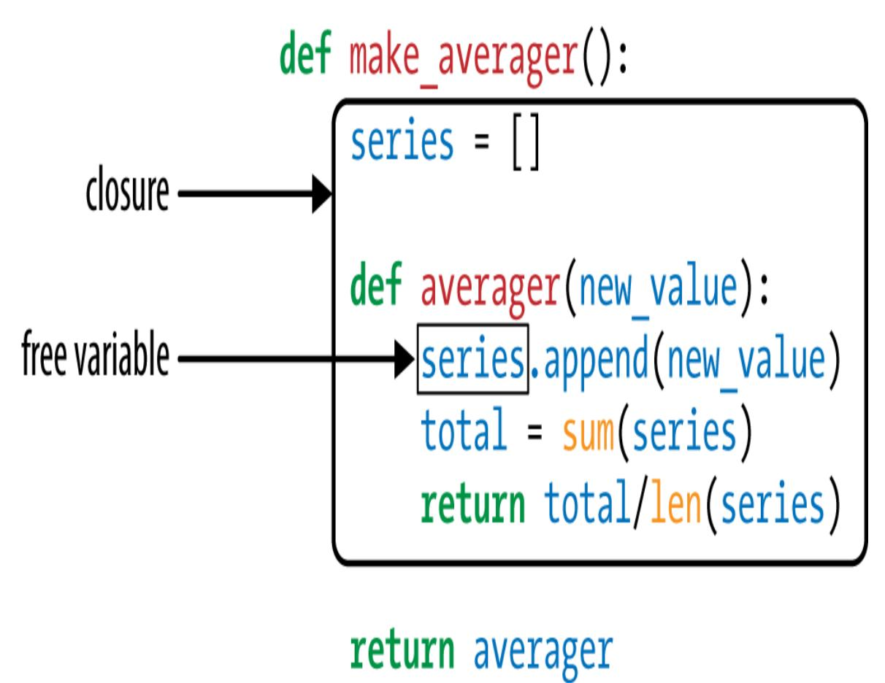

<span id="page-456-0"></span>
# Chapter 9: Decorators and Closures

## A NOTE FOR EARLY RELEASE READERS

With Early Release ebooks, you get books in their earliest form—the author's raw and unedited content as they write—so you can take advantage of these technologies long before the official release of these titles.

This will be the 9th chapter of the final book. Please note that the GitHub repo will be made active later on.

If you have comments about how we might improve the content and/or examples in this book, or if you notice missing material within this chapter, please reach out to the author at [fluentpython2e@ramalho.org.](mailto:fluentpython2e@ramalho.org)

*There's been a number of complaints about the choice of the name "decorator" for this feature. The major one is that the name is not consistent with its use in the GoF book. The name decorator probably owes more to its use in the compiler area—a syntax tree is walked and annotated. [1](#page-503-0)*

<span id="page-456-1"></span>—PEP 318 — Decorators for Functions and Methods

Function decorators let us "mark" functions in the source code to enhance their behavior in some way. This is powerful stuff, but mastering it requires understanding closures—which is what happens when functions capture variables defined outside of their bodies.

The most obscure reserved keyword in Python is nonlocal, introduced in Python 3.0. You can have a profitable life as a Python programmer without ever using it if you adhere to a strict regimen of class-centered object orientation. However, if you want to implement your own function

decorators, you must understand closures, and then the need for nonlocal becomes obvious.

Aside from their application in decorators, closures are also essential for any type of programming using callbacks, and for coding in a functional style when it makes sense.

The end goal of this chapter is to explain exactly how function decorators work, from the simplest registration decorators to the rather more complicated parameterized ones. However, before we reach that goal we need to cover:

- How Python evaluates decorator syntax
- How Python decides whether a variable is local
- Why closures exist and how they work
- What problem is solved by nonlocal

With this grounding, we can tackle further decorator topics:

- Implementing a well-behaved decorator
- Powerful decorators in the standard library: @cache, @lru\_cache, and @singledispatch
- Implementing a parameterized decorator

<span id="page-457-0"></span>
## What's new in this chapter

The caching decorator functools.cache—new in Python 3.9—is simpler than the traditional functools.lru\_cache, so I present it first. The latter is covered in ["Using lru\\_cache"](#page-481-0), including the simplified form added in Python 3.8.

Section ["Single Dispatch Generic Functions"](#page-483-0) was expanded and now uses type hints, the preferred way to use functools.singledispatch since Python 3.7.

["Parameterized Decorators"](#page-488-0) now includes a class-based example, [Example 9-27](#page-495-0).

I moved [Chapter 10](016-chapter-10-design-patterns-with-first-class-functions.md#page-504-0)—*Design Patterns with First-Class Functions*—to the [end of part III to improve the flow of the book. Section "Decorator-](016-chapter-10-design-patterns-with-first-class-functions.md#page-520-0)Enhanced Strategy Pattern" is now in that chapter, along with other variations of the Strategy design pattern using callables.

We start with a very gentle introduction to decorators, and then proceed with the rest of the items listed in the chapter opening.

<span id="page-458-1"></span>
## Decorators 101

A decorator is a callable that takes another function as argument (the decorated function).

A decorator may perform some processing with the decorated function, and returns it or replaces it with another function or callable object. [2](#page-503-1)

In other words, assuming an existing decorator named decorate, this code:

```
@decorate
def target():
 print('running target()')
```

Has the same effect as writing this:

```
def target():
 print('running target()')
target = decorate(target)
```

The end result is the same: at the end of either of these snippets, the target name is bound to whatever function is returned by decorate(target)—which may be the function initially named target, or may be a different function.

To confirm that the decorated function is replaced, see the console session in [Example 9-1.](#page-459-0)

<span id="page-459-0"></span>*Example 9-1. A decorator usually replaces a function with a different one*

```
>>> def deco(func):
... def inner():
... print('running inner()')
... return inner 
...
>>> @deco
... def target(): 
... print('running target()')
...
>>> target() 
running inner()
>>> target 
<function deco.<locals>.inner at 0x10063b598>
```

- deco returns its inner function object.
- target is decorated by deco.
- Invoking the decorated target actually runs inner.
- Inspection reveals that target is a now a reference to inner.

Strictly speaking, decorators are just syntactic sugar. As we just saw, you can always simply call a decorator like any regular callable, passing another function. Sometimes that is actually convenient, especially when doing *metaprogramming*—changing program behavior at runtime.

Three essential facts make a good summary of decorators:

- 1. A decorator is a function or another callable.
- 2. A decorator may replace the decorated function with a different one.
- 3. Decorators are executed immediately when a module is loaded.

Now let's focus on the third point.

<span id="page-460-1"></span>
## When Python Executes Decorators

A key feature of decorators is that they run right after the decorated function is defined. That is usually at *import time* (i.e., when a module is loaded by Python). Consider *registration.py* in [Example 9-2](#page-460-0).

<span id="page-460-0"></span>*Example 9-2. The registration.py module*

```
registry = [] 
def register(func): 
 print(f'running register({func})') 
 registry.append(func) 
 return func 
@register 
def f1():
 print('running f1()')
@register
def f2():
 print('running f2()')
def f3(): 
 print('running f3()')
def main(): 
 print('running main()')
 print('registry ->', registry)
 f1()
 f2()
 f3()
if __name__ == '__main__':
 main()
```

- registry will hold references to functions decorated by @register.
- register takes a function as argument.
- Display what function is being decorated, for demonstration.
- Include func in registry.

- Return func: we must return a function; here we return the same received as argument.
- f1 and f2 are decorated by @register.
- f3 is not decorated.
- main displays the registry, then calls f1(), f2(), and f3().
- main() is only invoked if *registration.py* runs as a script.

The output of running *registration.py* as a script looks like this:

```
$ python3 registration.py
running register(<function f1 at 0x100631bf8>)
running register(<function f2 at 0x100631c80>)
running main()
registry -> [<function f1 at 0x100631bf8>, <function f2 at
0x100631c80>]
running f1()
running f2()
running f3()
```

Note that register runs (twice) before any other function in the module. When register is called, it receives the decorated function object as an argument—for example, <function f1 at 0x100631bf8>.

After the module is loaded, the registry list holds references to the two decorated functions: f1 and f2. These functions, as well as f3, are only executed when explicitly called by main.

If *registration.py* is imported (and not run as a script), the output is this:

```
>>> import registration
running register(<function f1 at 0x10063b1e0>)
running register(<function f2 at 0x10063b268>)
```

At this time, if you inspect registry, this is what you see:

```
>>> registration.registry
[<function f1 at 0x10063b1e0>, <function f2 at 0x10063b268>]
```

The main point of [Example 9-2](#page-460-0) is to emphasize that function decorators are executed as soon as the module is imported, but the decorated functions only run when they are explicitly invoked. This highlights the difference between what Pythonistas call *import time* and *runtime*.

<span id="page-462-0"></span>
## Registration decorators

Considering how decorators are commonly employed in real code, [Example 9-2](#page-460-0) is unusual in two ways:

- The decorator function is defined in the same module as the decorated functions. A real decorator is usually defined in one module and applied to functions in other modules.
- The register decorator returns the same function passed as argument. In practice, most decorators define an inner function and return it.

Even though the register decorator in [Example 9-2](#page-460-0) returns the decorated function unchanged, that technique is not useless. Similar decorators are used in many Python frameworks to add functions to some central registry—for example, a registry mapping URL patterns to functions that generate HTTP responses. Such registration decorators may or may not change the decorated function.

[We will see a registration decorator applied in "Decorator-Enhanced](016-chapter-10-design-patterns-with-first-class-functions.md#page-520-0) Strategy Pattern" [\(Chapter 10\)](016-chapter-10-design-patterns-with-first-class-functions.md#page-504-0).

Most decorators do change the decorated function. They usually do it by defining an inner function and returning it to replace the decorated function. Code that uses inner functions almost always depends on closures to operate correctly. To understand closures, we need to take a step back and review how variable scopes work in Python.

<span id="page-463-2"></span>
## Variable Scope Rules

In [Example 9-3](#page-463-0), we define and test a function that reads two variables: a local variable a—defined as function parameter—and variable b that is not defined anywhere in the function.

<span id="page-463-0"></span>*Example 9-3. Function reading a local and a global variable*

```
>>> def f1(a):
... print(a)
... print(b)
...
>>> f1(3)
3
Traceback (most recent call last):
 File "<stdin>", line 1, in <module>
 File "<stdin>", line 3, in f1
NameError: global name 'b' is not defined
```

The error we got is not surprising. Continuing from [Example 9-3](#page-463-0), if we assign a value to a global b and then call f1, it works:

```
>>> b = 6
>>> f1(3)
3
6
```

Now, let's see an example that may surprise you.

Take a look at the f2 function in [Example 9-4](#page-463-1). Its first two lines are the same as f1 in [Example 9-3](#page-463-0), then it makes an assignment to b. But it fails at the second print, before the assignment is made.

<span id="page-463-1"></span>*Example 9-4. Variable b is local, because it is assigned a value in the body of the function*

```
>>> b = 6
>>> def f2(a):
... print(a)
... print(b)
... b = 9
...
>>> f2(3)
3
```

```
Traceback (most recent call last):
 File "<stdin>", line 1, in <module>
 File "<stdin>", line 3, in f2
UnboundLocalError: local variable 'b' referenced before assignment
```

Note that the output starts with 3, which proves that the print(a) statement was executed. But the second one, print(b), never runs. When I first saw this I was surprised, thinking that 6 should be printed, because there is a global variable b and the assignment to the local b is made after print(b).

But the fact is, when Python compiles the body of the function, it decides that b is a local variable because it is assigned within the function. The generated bytecode reflects this decision and will try to fetch b from the local scope. Later, when the call f2(3) is made, the body of f2 fetches and prints the value of the local variable a, but when trying to fetch the value of local variable b it discovers that b is unbound.

This is not a bug, but a design choice: Python does not require you to declare variables, but assumes that a variable assigned in the body of a function is local. This is much better than the behavior of JavaScript, which does not require variable declarations either, but if you do forget to declare that a variable is local (with var), you may clobber a global variable without knowing.

If we want the interpreter to treat b as a global variable and still assign a new value to it within the function, we use the global declaration:

```
>>> b = 6
>>> def f3(a):
... global b
... print(a)
... print(b)
... b = 9
...
>>> f3(3)
3
6
>>> b
9
```

In the examples above we can see two scopes in action:

- 1. A module global scope, made of names assigned to values outside of any class or function block.
- 2. Function local scopes, made of names assigned to values as parameters, or directly in the body of the function.

There is one other scope where variables can come from, which we call *nonlocal* and is fundamental for closres; we'll see it in a bit.

After this closer look at how variable scopes work in Python, we can tackle closures in the next section, ["Closures".](#page-467-0) If you are curious about the bytecode differences between the functions in Examples [9-3](#page-463-0) and [9-4,](#page-463-1) see the following sidebar.

## COMPARING BYTECODES

The dis module provides an easy way to disassemble the bytecode of Python functions. Read Examples [9-5](#page-466-0) and [9-6](#page-466-1) to see the bytecodes for f1 and f2 from Examples [9-3](#page-463-0) and [9-4](#page-463-1).

<span id="page-466-0"></span>*Example 9-5. Disassembly of the f1 function from [Example](#page-463-0) 9-3*

```
>>> from dis import dis
>>> dis(f1)
 2 0 LOAD_GLOBAL 0 (print) 
 3 LOAD_FAST 0 (a) 
 6 CALL_FUNCTION 1 (1 positional, 0
keyword pair)
 9 POP_TOP
 3 10 LOAD_GLOBAL 0 (print)
 13 LOAD_GLOBAL 1 (b) 
 16 CALL_FUNCTION 1 (1 positional, 0
keyword pair)
 19 POP_TOP
 20 LOAD_CONST 0 (None)
 23 RETURN_VALUE
```

- Load global name print.
- Load local name a.
- Load global name b.

Contrast the bytecode for f1 shown in [Example 9-5](#page-466-0) with the bytecode for f2 in [Example 9-6](#page-466-1).

<span id="page-466-1"></span>
## Example 9-6. Disassembly of the f2 function from Example 9-4

```
>>> dis(f2)
 2 0 LOAD_GLOBAL 0 (print)
 3 LOAD_FAST 0 (a)
 6 CALL_FUNCTION 1 (1 positional, 0
keyword pair)
 9 POP_TOP
 3 10 LOAD_GLOBAL 0 (print)
```

```
 13 LOAD_FAST 1 (b) 
 16 CALL_FUNCTION 1 (1 positional, 0
keyword pair)
 19 POP_TOP
 4 20 LOAD_CONST 1 (9)
 23 STORE_FAST 1 (b)
 26 LOAD_CONST 0 (None)
 29 RETURN_VALUE
```

Load *local* name b. This shows that the compiler considers b a local variable, even if the assignment to b occurs later, because the nature of the variable—whether it is local or not—cannot change in the body of the function.

The CPython VM that runs the bytecode is a stack machine, so LOAD and POP operations refer to the stack. It is beyond the scope of this book to further describe the Python opcodes, but they are documented along with the dis [module in dis — Disassembler for Python](http://docs.python.org/3/library/dis.html) bytecode.

<span id="page-467-0"></span>
## Closures

In the blogosphere, closures are sometimes confused with anonymous functions. Many confuse them because of the parallel history of those features: defining functions inside functions is not so common or convenient, until you have anonymous functions. And closures only matter when you have nested functions. So a lot of people learn both concepts at the same time.

Actually, a closure is a function—let's call it f—with an extended scope that encompasses variables referenced in the body of f that are not global variables nor local variables of f. Such variables must come from the local scope of an outer function which encompasses f.

It does not matter whether the function is anonymous or not; what matters is that it can access nonglobal variables that are defined outside of its body.

This is a challenging concept to grasp, and is better approached through an example.

Consider an avg function to compute the mean of an ever-growing series of values; for example, the average closing price of a commodity over its entire history. Every day a new price is added, and the average is computed taking into account all prices so far.

Starting with a clean slate, this is how avg could be used:

```
>>> avg(10)
10.0
>>> avg(11)
10.5
>>> avg(12)
11.0
```

Where does avg come from, and where does it keep the history of previous values?

For starters, [Example 9-7](#page-468-0) is a class-based implementation.

<span id="page-468-0"></span>*Example 9-7. average\_oo.py: A class to calculate a running average*

```
class Averager():
 def __init__(self):
 self.series = []
 def __call__(self, new_value):
 self.series.append(new_value)
 total = sum(self.series)
 return total / len(self.series)
```

The Averager class creates instances that are callable:

```
>>> avg = Averager()
>>> avg(10)
10.0
>>> avg(11)
10.5
```

```
>>> avg(12)
11.0
```

Now, [Example 9-8](#page-469-0) is a functional implementation, using the higher-order function make\_averager.

<span id="page-469-0"></span>*Example 9-8. average.py: A higher-order function to calculate a running average*

```
def make_averager():
 series = []
 def averager(new_value):
 series.append(new_value)
 total = sum(series)
 return total / len(series)
 return averager
```

When invoked, make\_averager returns an averager function object. Each time an averager is called, it appends the passed argument to the series, and computes the current average, as shown in [Example 9-9](#page-469-1).

<span id="page-469-1"></span>
## Example 9-9. Testing Example 9-8

```
>>> avg = make_averager()
>>> avg(10)
10.0
>>> avg(11)
10.5
>>> avg(12)
11.0
```

Note the similarities of the examples: we call Averager() or make\_averager() to get a callable object avg that will update the historical series and calculate the current mean. In [Example 9-7](#page-468-0), avg is an instance of Averager, and in [Example 9-8](#page-469-0) it is the inner function, averager. Either way, we just call avg(n) to include n in the series and get the updated mean.

It's obvious where the avg of the Averager class keeps the history: the self.series instance attribute. But where does the avg function in the second example find the series?

Note that series is a local variable of make\_averager because the assignment series = [] happens in the body of that function. But when avg(10) is called, make\_averager has already returned, and its local scope is long gone.

Within averager, series is a *free variable*. This is a technical term meaning a variable that is not bound in the local scope. See [Figure 9-1.](#page-470-0)

<span id="page-470-0"></span>

*Figure 9-1. The closure for averager extends the scope of that function to include the binding for the free variable series.*

Inspecting the returned averager object shows how Python keeps the names of local and free variables in the \_\_code\_\_ attribute that represents the compiled body of the function. [Example 9-10](#page-470-1) demonstrates.

<span id="page-470-1"></span>*Example 9-10. Inspecting the function created by make\_averager in [Example 9-8](#page-469-0)*

```
>>> avg.__code__.co_varnames
('new_value', 'total')
>>> avg.__code__.co_freevars
('series',)
```

The value for series is kept in the \_\_closure\_\_ attribute of the returned function avg. Each item in avg.\_\_closure\_\_ corresponds to a name in avg.\_\_code\_\_.co\_freevars. These items are cells, and they have an attribute called cell\_contents where the actual value can be found. [Example 9-11](#page-471-0) shows these attributes.

<span id="page-471-0"></span>
## Example 9-11. Continuing from Example 9-9

```
>>> avg.__code__.co_freevars
('series',)
>>> avg.__closure__
(<cell at 0x107a44f78: list object at 0x107a91a48>,)
>>> avg.__closure__[0].cell_contents
[10, 11, 12]
```

To summarize: a closure is a function that retains the bindings of the free variables that exist when the function is defined, so that they can be used later when the function is invoked and the defining scope is no longer available.

Note that the only situation in which a function may need to deal with external variables that are nonglobal is when it is nested in another function and those variables are part of the local scope of the outer function.

<span id="page-471-1"></span>
## The nonlocal Declaration

Our previous implementation of make\_averager was not efficient. In [Example 9-8](#page-469-0), we stored all the values in the historical series and computed their sum every time averager was called. A better implementation would only store the total and the number of items so far, and compute the mean from these two numbers.

[Example 9-12](#page-472-0) is a broken implementation, just to make a point. Can you see where it breaks?

<span id="page-472-0"></span>
## Example 9-12. A broken higher-order function to calculate a running average without keeping all history

```
def make_averager():
 count = 0
 total = 0
 def averager(new_value):
 count += 1
 total += new_value
 return total / count
 return averager
```

If you try [Example 9-12,](#page-472-0) here is what you get:

```
>>> avg = make_averager()
>>> avg(10)
Traceback (most recent call last):
 ...
UnboundLocalError: local variable 'count' referenced before
assignment
>>>
```

The problem is that the statement count += 1 actually means the same as count = count + 1, when count is a number or any immutable type. So we are actually assigning to count in the body of averager, and that makes it a local variable. The same problem affects the total variable.

We did not have this problem in [Example 9-8](#page-469-0) because we never assigned to the series name; we only called series.append and invoked sum and len on it. So we took advantage of the fact that lists are mutable.

But with immutable types like numbers, strings, tuples, etc., all you can do is read, never update. If you try to rebind them, as in count = count + 1, then you are implicitly creating a local variable count. It is no longer a free variable, and therefore it is not saved in the closure.

To work around this, the nonlocal keyword was introduced in Python 3. It lets you declare a variable as a free variable even when it is assigned

within the function. If a new value is assigned to a nonlocal variable, the binding stored in the closure is changed. A correct implementation of our newest make\_averager looks like [Example 9-13](#page-473-0).

<span id="page-473-0"></span>*Example 9-13. Calculate a running average without keeping all history (fixed with the use of nonlocal)*

```
def make_averager():
 count = 0
 total = 0
 def averager(new_value):
 nonlocal count, total
 count += 1
 total += new_value
 return total / count
 return averager
```

<span id="page-473-1"></span>After studing the use of nonlocal, let's summarize how Python's variable lookup works. [3](#page-503-2)

The Python bytecode compiler determines when the function is defined how to fetch a variable x that appears in it, based on these rules:

- <span id="page-473-2"></span>If there is a global x declaration, x comes from and is assigned to the x global variable the module. [4](#page-503-3)
- If there is a nonlocal x declaration, x comes from and is assigned to the x local variable of the nearest surrounding function where x is defined.
- If x is a parameter or is assigned a value in the function body, then x is local variable.
- If x is referenced but is not assigned and is not a parameter:
- x will be looked up in the local scopes of the surrounding function bodies (nonlocal scopes);
- If not found in sorrounding scopes, it will be read from the module global scope;

If not found in the global scope, it will be read from \_\_builtins\_\_.\_\_dict\_\_.

Now that we have Python closures covered, we can effectively implement decorators with nested functions.

<span id="page-474-2"></span>
## Implementing a Simple Decorator

[Example 9-14](#page-474-0) is a decorator that clocks every invocation of the decorated function and displays the elapsed time, the arguments passed, and the result of the call.

<span id="page-474-0"></span>*Example 9-14. clockdeco0.py: simple decorator to show the running time of functions*

```
import time
def clock(func):
 def clocked(*args): 
 t0 = time.perf_counter()
 result = func(*args) 
 elapsed = time.perf_counter() - t0
 name = func.__name__
 arg_str = ', '.join(repr(arg) for arg in args)
 print(f'[{elapsed:0.8f}s] {name}({arg_str}) -> {result!r}')
 return result
 return clocked
```

- Define inner function clocked to accept any number of positional arguments.
- This line only works because the closure for clocked encompasses the func free variable.
- Return the inner function to replace the decorated function.

[Example 9-15](#page-474-1) demonstrates the use of the clock decorator.

<span id="page-474-1"></span>*Example 9-15. Using the clock decorator*

```
import time
from clockdeco0 import clock
@clock
def snooze(seconds):
 time.sleep(seconds)
@clock
def factorial(n):
 return 1 if n < 2 else n*factorial(n-1)
if __name__ == '__main__':
 print('*' * 40, 'Calling snooze(.123)')
 snooze(.123)
 print('*' * 40, 'Calling factorial(6)')
 print('6! =', factorial(6))
```

The output of running [Example 9-15](#page-474-1) looks like this:

```
$ python3 clockdeco_demo.py
**************************************** Calling snooze(.123)
[0.12363791s] snooze(0.123) -> None
**************************************** Calling factorial(6)
[0.00000095s] factorial(1) -> 1
[0.00002408s] factorial(2) -> 2
[0.00003934s] factorial(3) -> 6
[0.00005221s] factorial(4) -> 24
[0.00006390s] factorial(5) -> 120
[0.00008297s] factorial(6) -> 720
6! = 720
```

<span id="page-475-0"></span>
## How It Works

Remember that this code:

```
@clock
  def factorial(n):
   return 1 if n < 2 else n*factorial(n-1)
Actually does this:
  def factorial(n):
   return 1 if n < 2 else n*factorial(n-1)
```

```
factorial = clock(factorial)
```

So, in both examples, clock gets the factorial function as its func argument (see [Example 9-14\)](#page-474-0). It then creates and returns the clocked function, which the Python interpreter assigns to factorial (behind the scenes, in the first example). In fact, if you import the clockdeco\_demo module and check the \_\_name\_\_ of factorial, this is what you get:

```
>>> import clockdeco_demo
>>> clockdeco_demo.factorial.__name__
'clocked'
>>>
```

So factorial now actually holds a reference to the clocked function. From now on, each time factorial(n) is called, clocked(n) gets executed. In essence, clocked does the following:

- 1. Records the initial time t0.
- 2. Calls the original factorial function, saving the result.
- 3. Computes the elapsed time.
- 4. Formats and displays the collected data.
- 5. Returns the result saved in step 2.

This is the typical behavior of a decorator: it replaces the decorated function with a new function that accepts the same arguments and (usually) returns whatever the decorated function was supposed to return, while also doing some extra processing.

## TIP

In *Design Patterns* by Gamma et al., the short description of the Decorator pattern starts with: "Attach additional responsibilities to an object dynamically." Function decorators fit that description. But at the implementation level, Python decorators bear little resemblance to the classic Decorator described in the original *Design Patterns* work. ["Soapbox"](#page-500-0) has more on this subject.

The clock decorator implemented in [Example 9-14](#page-474-0) has a few shortcomings: it does not support keyword arguments, and it masks the \_\_name\_\_ and \_\_doc\_\_ of the decorated function. [Example 9-16](#page-477-0) uses the functools.wraps decorator to copy the relevant attributes from func to clocked. Also, in this new version, keyword arguments are correctly handled.

<span id="page-477-0"></span>*Example 9-16. clockdeco.py: an improved clock decorator*

```
import time
import functools
def clock(func):
 @functools.wraps(func)
 def clocked(*args, **kwargs):
 t0 = time.perf_counter()
 result = func(*args, **kwargs)
 elapsed = time.perf_counter() - t0
 name = func.__name__
 arg_lst = [repr(arg) for arg in args]
 arg_lst.extend(f'{k}={v!r}' for k, v in kwargs.items())
 arg_str = ', '.join(arg_lst)
 print(f'[{elapsed:0.8f}s] {name}({arg_str}) -> {result!r}')
 return result
 return clocked
```

functools.wraps is just one of the ready-to-use decorators in the standard library. In the next section, we'll meet the most impressive decorator that functools provides: cache.

<span id="page-477-1"></span>
## Decorators in the Standard Library

Python has three built-in functions that are designed to decorate methods: property, classmethod, and staticmethod. We will discuss property in ["Using a Property for Attribute Validation"](030-chapter-23-dynamic-attributes-and-properties.md#page-1230-0) and the others in "classmethod Versus [staticmethod](018-chapter-11-a-pythonic-object.md#page-541-0)".

In [Example 9-16](#page-477-0) we saw another important decorator: functools.wraps, a helper for building well-behaved decorators. Some of the most interesting decorators in the standard library are cache, lru\_cache, and singledispatch—all from the functools module. We'll cover them next.

<span id="page-478-2"></span>
## Memoization with functools.cache

The functools.cache decorator implements memoization: an optimization technique that works by saving the results of previous invocations of an expensive function, avoiding repeat computations on previously used arguments. [5](#page-503-4)

<span id="page-478-1"></span>
## TIP

functools.cache was added in Python 3.9. If you need to run these examples in Python 3.8, replace @cache with @lru\_cache. For prior versions of Python, you must invoke the decorator, writing @lru\_cache(), as explained in ["Using lru\\_cache"](#page-481-0)

A good demonstration is to apply @cache to the painfully slow recursive function to generate the *n*th number in the Fibonacci sequence, as shown in [Example 9-17](#page-478-0).

<span id="page-478-0"></span>*Example 9-17. The very costly recursive way to compute the nth number in the Fibonacci series*

```
from clockdeco import clock
@clock
def fibonacci(n):
 if n < 2:
 return n
```

```
 return fibonacci(n - 2) + fibonacci(n - 1)
if __name__ == '__main__':
 print(fibonacci(6))
```

Here is the result of running *fibo\_demo.py*. Except for the last line, all output is generated by the clock decorator:

```
$ python3 fibo_demo.py
[0.00000042s] fibonacci(0) -> 0
[0.00000049s] fibonacci(1) -> 1
[0.00006115s] fibonacci(2) -> 1
[0.00000031s] fibonacci(1) -> 1
[0.00000035s] fibonacci(0) -> 0
[0.00000030s] fibonacci(1) -> 1
[0.00001084s] fibonacci(2) -> 1
[0.00002074s] fibonacci(3) -> 2
[0.00009189s] fibonacci(4) -> 3
[0.00000029s] fibonacci(1) -> 1
[0.00000027s] fibonacci(0) -> 0
[0.00000029s] fibonacci(1) -> 1
[0.00000959s] fibonacci(2) -> 1
[0.00001905s] fibonacci(3) -> 2
[0.00000026s] fibonacci(0) -> 0
[0.00000029s] fibonacci(1) -> 1
[0.00000997s] fibonacci(2) -> 1
[0.00000028s] fibonacci(1) -> 1
[0.00000030s] fibonacci(0) -> 0
[0.00000031s] fibonacci(1) -> 1
[0.00001019s] fibonacci(2) -> 1
[0.00001967s] fibonacci(3) -> 2
[0.00003876s] fibonacci(4) -> 3
[0.00006670s] fibonacci(5) -> 5
[0.00016852s] fibonacci(6) -> 8
8
```

The waste is obvious: fibonacci(1) is called eight times, fibonacci(2) five times, etc. But adding just two lines to use cache, performance is much improved. See [Example 9-18](#page-479-0).

<span id="page-479-0"></span>*Example 9-18. Faster implementation using caching*

```
import functools
from clockdeco import clock
```

```
@functools.cache 
@clock 
def fibonacci(n):
 if n < 2:
 return n
 return fibonacci(n - 2) + fibonacci(n - 1)
if __name__ == '__main__':
 print(fibonacci(6))
```

- This line works with Python 3.9 or later. See ["Using lru\\_cache"](#page-481-0) for alternatives supporting earlier versions of Python.
- This is an example of stacked decorators: @cache is applied on the function returned by @clock.

## STACKED DECORATORS

<span id="page-480-0"></span>To make sense of stacked decorators, recall that the @ is syntax sugar for applying the decorator function to the function below it. If there's more than one decorator, they behave like nested function calls. This:

```
@alpha
  @beta
  def my_fn():
   ...
Is the same as this:
  my_fn = alpha(beta(my_fn))
```

In other words, the beta decorator is applied first, and the function it returns is then passed to alpha.

Using cache in [Example 9-18,](#page-479-0) the fibonacci function is called only once for each value of n:

```
$ python3 fibo_demo_lru.py
[0.00000043s] fibonacci(0) -> 0
[0.00000054s] fibonacci(1) -> 1
[0.00006179s] fibonacci(2) -> 1
[0.00000070s] fibonacci(3) -> 2
[0.00007366s] fibonacci(4) -> 3
[0.00000057s] fibonacci(5) -> 5
[0.00008479s] fibonacci(6) -> 8
8
```

In another test, to compute fibonacci(30), [Example 9-18](#page-479-0) made the 31 calls needed in 0.00017s—total time–while the uncached [Example 9-17](#page-478-0) took 12.09s on an Intel Core i7 notebook, because it called fibonacci(1) 832,040 times, in a total of 2,692,537 calls.

All the arguments taken by the decorated function must be *hashable*, because the underlying lru\_cache uses a dict to store the results, and the keys are made from the positional and keyword arguments used in the calls.

Besides making silly recursive algorithms viable, @cache really shines in applications that need to fetch information from remote APIs.

## WARNING

functools.cache can consume all available memory if there is a very large number of cache entries. I consider it more suitable for use in short lived command-line scripts. In long running processes, I recommend using functools.lru\_cache with a suitable maxsize parameter, as explained in the next section.

<span id="page-481-0"></span>
## Using lru\_cache

The functools.cache decorator is actually a simple wrapper around the older functools.lru\_cache function, which is more flexible and compatible with Python 3.8 and earlier versions.

The main advantage of @lru\_cache is that its memory usage is bounded by the maxsize parameter, which has a rather conservative default value

of 128—which means the cache will hold at most 128 entries at any time.

The acronym LRU stands for Least Recently Used, meaning that older entries that have not been read for a while are discarded to make room for new ones.

Since Python 3.8 lru\_cache can be applied in two ways. This is how to use it in the simplest way:

```
@lru_cache
def costly_function(a, b):
 ...
```

The other way—available since Python 3.2—is to invoke it as a function with ():

```
@lru_cache()
def costly_function(a, b):
 ...
```

In both cases above, the default parameters would be used. They are:

```
maxsize=128
```

Sets the maximum number of entries to be stored. After the cache is full, the least recently used entry is discarded to make room for each new entry. For optimal performance, maxsize should be a power of 2. If you pass maxsize=None the LRU logic is disabled, so the cache works faster but entries are never discarded, which may consume too much memory. That's what @functools.cache does.

## typed=False

Determines whether results of different argument types are stored separately. For example, in the default setting, float and integer arguments that are considered equal are stored only once, so there would be a single entry for the calls f(1) and f(1.0). If typed=True, those arguments would produce different entries, possibly storing distinct results.

Here is an example invoking @lru\_cache with non-default parameters:

```
@lru_cache(maxsize=2**20, typed=True)
def costly_function(a, b):
 ...
```

Now let's study another powerful decorator: functools.singledispatch.

<span id="page-483-0"></span>
## Single Dispatch Generic Functions

Imagine we are creating a tool to debug web applications. We want to generate HTML displays for different types of Python objects.

We could start with a function like this:

```
import html
def htmlize(obj):
 content = html.escape(repr(obj))
 return f'<pre>{content}</pre>'
```

That will work for any Python type, but now we want to extend it to generate custom displays for some types. Some examples:

- str: replace embedded newline characters with '<br/>\n' and use <p> tags instead of <pre>.
- int: show the number in decimal and hexadecimal (with a special case for bool).
- list: output an HTML list, formatting each item according to its type.
- float and Decimal: output the value as usual, but also in the form of a fraction (why not?).

The behavior we want is shown in [Example 9-19](#page-484-0).

<span id="page-484-0"></span>
## Example 9-19. htmlize() generates HTML tailored to different object types

```
>>> htmlize({1, 2, 3}) 
'<pre>{1, 2, 3}</pre>'
>>> htmlize(abs)
'<pre>&lt;built-in function abs&gt;</pre>'
>>> htmlize('Heimlich & Co.\n- a game') 
'<p>Heimlich &amp; Co.<br/>\n- a game</p>'
>>> htmlize(42) 
'<pre>42 (0x2a)</pre>'
>>> print(htmlize(['alpha', 66, {3, 2, 1}])) 
<ul>
<li><p>alpha</p></li>
<li><pre>66 (0x42)</pre></li>
<li><pre>{1, 2, 3}</pre></li>
</ul>
>>> htmlize(True) 
'<pre>True</pre>'
>>> htmlize(fractions.Fraction(2, 3)) 
'<pre>2/3</pre>'
>>> htmlize(2/3) 
'<pre>0.6666666666666666 (2/3)</pre>'
>>> htmlize(decimal.Decimal('0.02380952'))
'<pre>0.02380952 (1/42)</pre>'
```

- The original function is registered for object, so it serves as a catchall to handle argument types that don't match the other implementations.
- str objects are also HTML-escaped but wrapped in <p></p> with <br/> line breaks inserted before each '\n'.
- An int is shown in decimal and hexadecimal, inside <pre></pre>.
- Each list item is formatted according to its type, and the whole sequence rendered as an HTML list.
- Although bool is an int subtype, it gets special treatment.
- Show Fraction as a fraction.

Show float and Decimal with an approximate fractional equivalent.

## Function singledispatch

Because we don't have Java-style method overloading in Python, we can't simply create variations of htmlize with different signatures for each data type we want to handle differently. A possible solution in Python would be to turn htmlize into a dispatch function, with a chain of if/elif/… or match/case/… calling specialized functions like htmlize\_str, htmlize\_int, etc. This is not extensible by users of our module, and is unwieldy: over time, the htmlize dispatcher would become too big, and the coupling between it and the specialized functions would be very tight.

The functools.singledispatch decorator allows different modules to contribute to the overall solution, and lets you easily provide a specialized functions even for types that belong to third party packages that you can't edit. If you decorate a plain function with @singledispatch, it becomes the entry point for a *generic function*: a group of functions to perform the same operation in different ways, depending on the type of the first argument. This is what is meant by the term single-dispatch. If more arguments were used to select the specific functions, we'd have multipledispatch. [Example 9-20](#page-485-0) shows how.

## WARNING

functools.singledispatch exists since Python 3.4, but it only supports type hints since Python 3.7. The last two functions in [Example 9-20](#page-485-0) illustrate the syntax that works in all versions of Python since 3.4.

<span id="page-485-0"></span>*Example 9-20. @singledispatch creates a custom @htmlize.register to bundle several functions into a generic function*

**from functools import** singledispatch **from collections import** abc **import fractions**

```
import decimal
import html
import numbers
@singledispatch 
def htmlize(obj: object) -> str:
 content = html.escape(repr(obj))
 return f'<pre>{content}</pre>'
@htmlize.register 
def _(text: str) -> str: 
 content = html.escape(text).replace('\n', '<br/>\n')
 return f'<p>{content}</p>'
@htmlize.register 
def _(seq: abc.Sequence) -> str:
 inner = '</li>\n<li>'.join(htmlize(item) for item in seq)
 return '<ul>\n<li>' + inner + '</li>\n</ul>'
@htmlize.register 
def _(n: numbers.Integral) -> str:
 return f'<pre>{n} (0x{n:x})</pre>'
@htmlize.register 
def _(n: bool) -> str:
 return f'<pre>{n}</pre>'
@htmlize.register(fractions.Fraction) 
def _(x) -> str:
 frac = fractions.Fraction(x)
 return f'<pre>{frac.numerator}/{frac.denominator}</pre>'
@htmlize.register(decimal.Decimal) 
@htmlize.register(float)
def _(x) -> str:
 frac = fractions.Fraction(x).limit_denominator()
 return f'<pre>{x} ({frac.numerator}/{frac.denominator})</pre>'
```

- @singledispatch marks the base function that handles the object type.
- Each specialized function is decorated with @«base».register
- <span id="page-486-0"></span>The type of the first argument given at runtime determines when this particular function definition will be used. The name of the specialized

<span id="page-487-0"></span>functions is irrelevant; \_ is a good choice to make this clear. [6](#page-503-5)

- For each additional type to get special treatment, register a new function with a matching type hint in the first parameter.
- The numbers ABCs are useful for use with singledispatch. [7](#page-503-6)
- bool is a *subtype-of* numbers.Integral, but the singledispatch logic seeks the implementation with the most specific matching type, regardless of the order they appear in the code.
- If you don't want to, or cannot, add type hints to the decorated function, you can pass a type to the @«base».register decorator. This syntax works in Python 3.4 or later.
- <span id="page-487-1"></span>The @«base».register decorator returns the undecorated function, so it's possible to stack them to register two or more types on the same implementation. [8](#page-503-7)

When possible, register the specialized functions to handle ABCs (abstract classes) such as numbers.Integral and abc.MutableSequence instead of concrete implementations like int and list. This allows your code to support a greater variety of compatible types. For example, a Python extension can provide alternatives to the int type with fixed bit lengths as subclasses of numbers.Integral. [9](#page-503-8)

<span id="page-487-2"></span>
## TIP

Using ABCs or typing.Protocol with @singledispatch allows your code to support existing or future classes that are actual or virtual subclasses of those ABCs, or that implement those protocols. The use of ABCs and the concept of a virtual subclass are subjects of [Chapter 13.](020-chapter-13-interfaces-protocols-and-abcs.md#page-622-0)

A notable quality of the singledispatch mechanism is that you can register specialized functions anywhere in the system, in any module. If you later add a module with a new user-defined type, you can easily provide a new custom function to handle that type. And you can write custom functions for classes that you did not write and can't change.

singledispatch is a well-thought-out addition to the standard library, [and it offers more features than I can describe here. PEP 443 — Single](https://www.python.org/dev/peps/pep-0443/)dispatch generic functions is a good reference—but it doesn't mention the use of type hints, which were added later. The functools module documentation has improved and more up-to-date coverage with several examples in its [singledispatch](https://docs.python.org/3/library/functools.html#functools.singledispatch) entry.

## NOTE

@singledispatch is not designed to bring Java-style method overloading to Python. A single class with many overloaded variations of a method is better than a single function with a lengthy stretch of if/elif/elif/elif blocks. But both solutions are flawed because they concentrate too much responsibility in a single code unit—the class or the function. The advantage of @singledispatch is supporting modular extension: each module can register a specialized function for each type it supports. In a realistic use case, you would not have all the implementations of generic function in the same module as in [Example 9-20](#page-485-0).

We've seen some decorators that take arguments, for example, @lru\_cache() and htmlize.register(float) created by @singledispatch in [Example 9-20.](#page-485-0) The next section shows how to build decorators that accept parameters.

<span id="page-488-0"></span>
## Parameterized Decorators

When parsing a decorator in source code, Python takes the decorated function and passes it as the first argument to the decorator function. So how do you make a decorator accept other arguments? The answer is: make a decorator factory that takes those arguments and returns a decorator,

which is then applied to the function to be decorated. Confusing? Sure. Let's start with an example based on the simplest decorator we've seen: register in [Example 9-21.](#page-489-0)

<span id="page-489-0"></span>*Example 9-21. Abridged registration.py module from [Example 9-2,](#page-460-0) repeated here for convenience*

```
registry = []
def register(func):
 print(f'running register({func})')
 registry.append(func)
 return func
@register
def f1():
 print('running f1()')
print('running main()')
print('registry ->', registry)
f1()
```

<span id="page-489-2"></span>
## A Parameterized Registration Decorator

In order to make it easy to enable or disable the function registration performed by register, we'll make it accept an optional active parameter which, if False, skips registering the decorated function. [Example 9-22](#page-489-1) shows how. Conceptually, the new register function is not a decorator but a decorator factory. When called, it returns the actual decorator that will be applied to the target function.

<span id="page-489-1"></span>*Example 9-22. To accept parameters, the new register decorator must be called as a function*

```
registry = set() 
def register(active=True): 
 def decorate(func): 
 print('running register'
 f'(active={active})->decorate({func})')
 if active: 
 registry.add(func)
 else:
 registry.discard(func)
```

```
 return func 
 return decorate 
@register(active=False) 
def f1():
 print('running f1()')
@register() 
def f2():
 print('running f2()')
def f3():
 print('running f3()')
```

- registry is now a set, so adding and removing functions is faster.
- register takes an optional keyword argument.
- The decorate inner function is the actual decorator; note how it takes a function as argument.
- Register func only if the active argument (retrieved from the closure) is True.
- If not active and func in registry, remove it.
- Because decorate is a decorator, it must return a function.
- register is our decorator factory, so it returns decorate.
- The @register factory must be invoked as a function, with the desired parameters.
- If no parameters are passed, register must still be called as a function—@register()—i.e., to return the actual decorator, decorate.

The main point is that register() returns decorate, which is then applied to the decorated function.

The code in [Example 9-22](#page-489-1) is in a *registration\_param.py* module. If we import it, this is what we get:

```
>>> import registration_param
running register(active=False)->decorate(<function f1 at
0x10063c1e0>)
running register(active=True)->decorate(<function f2 at
0x10063c268>)
>>> registration_param.registry
[<function f2 at 0x10063c268>]
```

Note how only the f2 function appears in the registry; f1 does not appear because active=False was passed to the register decorator factory, so the decorate that was applied to f1 did not add it to the registry.

If, instead of using the @ syntax, we used register as a regular function, the syntax needed to decorate a function f would be register()(f) to add f to the registry, or register(active=False)(f) to not add it (or remove it). See [Example 9-23](#page-491-0) for a demo of adding and removing functions to the registry.

<span id="page-491-0"></span>*Example 9-23. Using the registration\_param module listed in [Example 9-22](#page-489-1)*

```
>>> from registration_param import *
running register(active=False)->decorate(<function f1 at
0x10073c1e0>)
running register(active=True)->decorate(<function f2 at
0x10073c268>)
>>> registry 
{<function f2 at 0x10073c268>}
>>> register()(f3) 
running register(active=True)->decorate(<function f3 at
0x10073c158>)
<function f3 at 0x10073c158>
>>> registry 
{<function f3 at 0x10073c158>, <function f2 at 0x10073c268>}
>>> register(active=False)(f2) 
running register(active=False)->decorate(<function f2 at
0x10073c268>)
```

```
<function f2 at 0x10073c268>
>>> registry 
{<function f3 at 0x10073c158>}
```

- When the module is imported, f2 is in the registry.
- The register() expression returns decorate, which is then applied to f3.
- The previous line added f3 to the registry.
- This call removes f2 from the registry.
- Confirm that only f3 remains in the registry.

The workings of parameterized decorators are fairly involved, and the one we've just discussed is simpler than most. Parameterized decorators usually replace the decorated function, and their construction requires yet another level of nesting. Now we will explore the architecture of one such function pyramid.

<span id="page-492-1"></span>
## The Parameterized Clock Decorator

In this section, we'll revisit the clock decorator, adding a feature: users may pass a format string to control the output of the clocked function report. See [Example 9-24](#page-492-0).

## NOTE

For simplicity, [Example 9-24](#page-492-0) is based on the initial clock implementation from [Example 9-14,](#page-474-0) and not the improved one from [Example 9-16](#page-477-0) that uses @functools.wraps, adding yet another function layer.

<span id="page-492-0"></span>*Example 9-24. Module clockdeco\_param.py: the parameterized clock decorator*

```
import time
DEFAULT_FMT = '[{elapsed:0.8f}s] {name}({args}) -> {result}'
def clock(fmt=DEFAULT_FMT): 
 def decorate(func): 
 def clocked(*_args):
 t0 = time.perf_counter()
 _result = func(*_args) 
 elapsed = time.perf_counter() - t0
 name = func.__name__
 args = ', '.join(repr(arg) for arg in _args) 
 result = repr(_result) 
 print(fmt.format(**locals())) 
 return _result 
 return clocked 
 return decorate 
if __name__ == '__main__':
 @clock() 
 def snooze(seconds):
 time.sleep(seconds)
 for i in range(3):
 snooze(.123)
```

- clock is our parameterized decorator factory.
- decorate is the actual decorator.
- clocked wraps the decorated function.
- \_result is the actual result of the decorated function.
- \_args holds the actual arguments of clocked, while args is str used for display.
- result is the str representation of \_result, for display.
- <span id="page-493-0"></span>Using \*\*locals() here allows any local variable of clocked to be referenced in the fmt. [10](#page-503-9)

- clocked will replace the decorated function, so it should return whatever that function returns.
- decorate returns clocked.
- clock returns decorate.
- In this self test, clock() is called without arguments, so the decorator applied will use the default format str.

If you run [Example 9-24](#page-492-0) from the shell, this is what you get:

```
$ python3 clockdeco_param.py
[0.12412500s] snooze(0.123) -> None
[0.12411904s] snooze(0.123) -> None
[0.12410498s] snooze(0.123) -> None
```

[To exercise the new functionality, let's have a look at Examples](#page-495-1) [9-25](#page-494-0) [and 9-](#page-495-1) 26, which are two other modules using clockdeco\_param, and the outputs they generate.

<span id="page-494-0"></span>
## Example 9-25. clockdeco\_param\_demo1.py

```
import time
from clockdeco_param import clock
@clock('{name}: {elapsed}s')
def snooze(seconds):
 time.sleep(seconds)
for i in range(3):
 snooze(.123)
Output of Example 9-25:
  $ python3 clockdeco_param_demo1.py
  snooze: 0.12414693832397461s
  snooze: 0.1241159439086914s
  snooze: 0.12412118911743164s
```

<span id="page-495-1"></span>
## Example 9-26. clockdeco\_param\_demo2.py

```
import time
from clockdeco_param import clock
@clock('{name}({args}) dt={elapsed:0.3f}s')
def snooze(seconds):
 time.sleep(seconds)
for i in range(3):
 snooze(.123)
Output of Example 9-26:
  $ python3 clockdeco_param_demo2.py
  snooze(0.123) dt=0.124s
  snooze(0.123) dt=0.124s
  snooze(0.123) dt=0.124s
```

## NOTE

Graham Dumpleton and Lennart Regebro—technical reviewer of the *First Edition* argue that decorators are best coded as classes implementing \_\_call\_\_, and not as functions like the examples in this chapter. I agree that approach is better for non-trivial decorators, but to explain the basic idea of this language feature, functions are easier to understand. See ["Further Reading",](#page-497-0) in particular Graham Dumpleton's blog and wrapt module for industrial-strength techniques when building decorators.

The next section shows an example in the style recommended by Dumpleton and Regebro.

<span id="page-495-2"></span>
## A class-based clock decorator

As a final example, [Example 9-27](#page-495-0) lists the implementation of a parameterized clock decorator implemented as a class with \_\_call\_\_. Contrast [Example 9-24](#page-492-0) with [Example 9-27](#page-495-0). Which one do you prefer?

<span id="page-495-0"></span>*Example 9-27. Module clockdeco\_cls.py: parameterized clock decorator implemented as class*

```
import time
```

```
DEFAULT_FMT = '[{elapsed:0.8f}s] {name}({args}) -> {result}'
class clock: 
 def __init__(self, fmt=DEFAULT_FMT): 
 self.fmt = fmt
 def __call__(self, func): 
 def clocked(*_args):
 t0 = time.perf_counter()
 _result = func(*_args) 
 elapsed = time.perf_counter() - t0
 name = func.__name__
 args = ', '.join(repr(arg) for arg in _args)
 result = repr(_result)
 print(self.fmt.format(**locals()))
 return _result
 return clocked
```

- Instead of a clock outer function, the clock class is our parameterized decorator factory. I named it with a lowercase c to make clear that this implementation is a drop-in replacement for the one in [Example 9-24](#page-492-0).
- The argument passed in the clock(my\_format) is assigned to the fmt parameter here. The class constructor returns an instance of clock, with my\_format stored in self.fmt.
- \_\_call\_\_ makes the clock instance callable. When invoked, the instance replaces the decorated function with clocked
- clocked wraps the decorated function.

<span id="page-496-0"></span>This ends our exploration of function decorators. We'll see class decorators in [Chapter 25.](032-chapter-25-class-metaprogramming.md#page-1296-0)

## Chapter Summary

We covered some difficult terrain in this chapter. I tried to make the journey as smooth as possible, but we definitely entered the realm of metaprogramming.

We started with a simple @register decorator without an inner function, and finished with a parameterized @clock() involving two levels of nested functions.

Registration decorators, though simple in essence, have real applications in Python frameworks. We will apply the registration idea in one implementation of the Strategy design pattern in [Chapter 10.](016-chapter-10-design-patterns-with-first-class-functions.md#page-504-0)

Understanding how decorators actually work required covering the difference between *import time* and *runtime*, then diving into variable scoping, closures, and the new nonlocal declaration. Mastering closures and nonlocal is valuable not only to build decorators, but also to code event-oriented programs for GUIs or asynchronous I/O with callbacks, and to adopt a functional style when it makes sense.

Parameterized decorators almost always involve at least two nested functions, maybe more if you want to use @functools.wraps to produce a decorator that provides better support for more advanced techniques. One such technique is stacked decorators, which we saw in [Example 9-18](#page-479-0). For more sophisticated decorators, a class-based implementation may be easier to read and maintain.

As examples of parametrized decorators in the standard library, we visited the powerful @cache and @singledispatch from the functools module.

<span id="page-497-0"></span>
## Further Reading

Item #26 of Brett Slatkin's *[Effective Python, Second Edition](http://www.effectivepython.com/)* (Addison-Wesley, 2019) covers best practices for function decorators and

<span id="page-498-0"></span>recommends always using functools.wraps—which we saw in [Example 9-16](#page-477-0). [11](#page-503-10)

Graham Dumpleton has a [series of in-depth blog posts](http://bit.ly/1DePPcl) about techniques for implementing well-behaved decorators, starting with "How You [Implemented Your Python Decorator is Wrong". His deep expert](http://bit.ly/1DePVRi)ise in this matter is also nicely packaged in the [wrapt](http://wrapt.readthedocs.org/en/latest/) module he wrote to simplify the implementation of decorators and dynamic function wrappers, which support introspection and behave correctly when further decorated, when applied to methods and when used as attribute descriptors. [Chapter 24](031-chapter-24-attribute-descriptors.md#page-1258-0) in *Part VI* is about descriptors.

Chapter 9, *[Metaprogramming](https://learning.oreilly.com/library/view/python-cookbook-3rd/9781449357337/ch09.html)* of the *Python Cookbook, Third Edition* by David Beazley and Brian K. Jones (O'Reilly), has several recipes from elementary decorators to very sophisticated ones, including one that can be called as a regular decorator or as a decorator factory, e.g., @clock or @clock(). That's "Recipe 9.6. Defining a Decorator That Takes an Optional Argument" in that cookbook.

Michele Simionato authored a package aiming to "simplify the usage of decorators for the average programmer, and to popularize decorators by showing various non-trivial examples," according to the docs. It's available on PyPI as the [decorator package.](https://pypi.python.org/pypi/decorator)

[Created when decorators were still a new feature in Python, the Python](https://wiki.python.org/moin/PythonDecoratorLibrary) Decorator Library wiki page has dozens of examples. Because that page started years ago, some of the techniques shown have been superseded, but the page is still an excellent source of inspiration.

["Closures in Python"](http://web.archive.org/web/20201109032203/http://effbot.org/zone/closure.htm) is a short blog post by Fredrik Lundh that explains the terminology of closures.

[PEP 3104 — Access to Names in Outer Scopes](http://www.python.org/dev/peps/pep-3104/) describes the introduction of the nonlocal declaration to allow rebinding of names that are neither local nor global. It also includes an excellent overview of how this issue is resolved in other dynamic languages (Perl, Ruby, JavaScript, etc.) and the pros and cons of the design options available to Python.

On a more theoretical level, [PEP 227 — Statically Nested Scopes](http://www.python.org/dev/peps/pep-0227/) documents the introduction of lexical scoping as an option in Python 2.1 and as a standard in Python 2.2, explaining the rationale and design choices for the implementation of closures in Python.

[PEP 443](http://www.python.org/dev/peps/pep-0443/) provides the rationale and a detailed description of the singledispatch generic functions' facility. An old (March 2005) blog post by Guido van Rossum, ["Five-Minute Multimethods in Python"](http://www.artima.com/weblogs/viewpost.jsp?thread=101605), walks through an implementation of generic functions (a.k.a. multimethods) using decorators. His code supports multiple-dispatch (i.e., dispatch based on more than one positional argument). Guido's multimethods code is interesting, but it's a didactic example. For a modern, production-ready implementation of multiple-dispatch generic functions, check out [Reg](http://reg.readthedocs.org/en/latest/) by Martijn Faassen—author of the model-driven and REST-savvy [Morepath](http://morepath.readthedocs.org/en/latest/) web framework.

## SOAPBOX

<span id="page-500-0"></span>The designer of any language with first-class functions faces this issue: being first-class objects, functions are defined in a certain scope but may be invoked in other scopes. The question is: how to evaluate the free variables? The first and simplest answer is "dynamic scope." This means that free variables are evaluated by looking into the environment where the function is invoked.

If Python had dynamic scope and no closures, we could improvise avg —similar to [Example 9-8—](#page-469-0)like this:

```
>>> ### this is not a real Python console session! ###
>>> avg = make_averager()
>>> series = [] 
>>> avg(10)
10.0
>>> avg(11) 
10.5
>>> avg(12)
11.0
>>> series = [1] 
>>> avg(5)
3.0
```

- Before using avg, we have to define series = [] ourselves, so we must know that averager (inside make\_averager) refers to a list named series.
- Behind the scenes, series accumulates the values to be averaged.
- When series = [1] is executed, the previous list is lost. This could happen by accident, when handling two independent running averages at the same time.

Functions should be black boxes, with their implementation hidden from users. But with dynamic scope, if a function uses free variables, the programmer has to know its internals to set up an environment where it works correctly. After years of struggling with the LaTeX document preparation language, the excellent *Practical LaTeX* book by George Grätzer taught me that LaTeX variables use dynamic scope. That's why they were so confusing to me!

[Emacs Lisp also uses dynamic scope, at least by default. See Dynamic](https://www.gnu.org/software/emacs/manual/html_node/elisp/Dynamic-Binding.html) Binding in the Emacs Lisp manual for a short explanation.

Dynamic scope is easier to implement, which is probably why it was the path taken by John McCarthy when he created Lisp, the first [language to have first-class functions. Paul Graham's article "The Roots](http://www.paulgraham.com/rootsoflisp.html) of Lisp" is an accessible explanation of John McCarthy's original paper [about the Lisp language: "Recursive Functions of Symbolic](http://bit.ly/mccarthy_recursive) Expressions and Their Computation by Machine, Part I". McCarthy's paper is a masterpiece as great as Beethoven's 9th Symphony. Paul Graham translated it for the rest of us, from mathematics to English and running code.

Paul Graham's commentary explains how tricky dynamic scoping is. Quoting from "The Roots of Lisp":

*It's an eloquent testimony to the dangers of dynamic scope that even the very first example of higher-order Lisp functions was broken because of it. It may be that McCarthy was not fully aware of the implications of dynamic scope in 1960. Dynamic scope remained in Lisp implementations for a surprisingly long time—until Sussman and Steele developed Scheme in 1975. Lexical scope does not complicate the definition of eval very much, but it may make compilers harder to write.*

Today, lexical scope is the norm: free variables are evaluated considering the environment where the function is defined. Lexical scope complicates the implementation of languages with first-class functions, because it requires the support of closures. On the other hand, lexical scope makes source code easier to read. Most languages invented since Algol have lexical scope.

For many years, Python lambdas did not provide closures, contributing to the bad name of this feature among functionalprogramming geeks in the blogosphere. This was fixed in Python 2.2 (December 2001), but the blogosphere has a long memory. Since then, lambda is embarrassing only because of its limited syntax.

## Python Decorators and the Decorator Design Pattern

Python function decorators fit the general description of Decorator given by Gamma et al. in *Design Patterns*: "Attach additional responsibilities to an object dynamically. Decorators provide a flexible alternative to subclassing for extending functionality."

At the implementation level, Python decorators do not resemble the classic Decorator design pattern, but an analogy can be made.

In the design pattern, Decorator and Component are abstract classes. An instance of a concrete decorator wraps an instance of a concrete component in order to add behaviors to it. Quoting from *Design Patterns*:

*The decorator conforms to the interface of the component it decorates so that its presence is transparent to the component's clients. The decorator forwards requests to the component and may perform additional actions (such as drawing a border) before or after forwarding. Transparency lets you nest decorators recursively, thereby allowing an unlimited number of added responsibilities." (p. 175)*

In Python, the decorator function plays the role of a concrete Decorator subclass, and the inner function it returns is a decorator instance. The returned function wraps the function to be decorated, which is analogous to the component in the design pattern. The returned function is transparent because it conforms to the interface of the component by accepting the same arguments. It forwards calls to the component and may perform additional actions either before or after it. Borrowing from the previous citation, we can adapt the last sentence to

say that "Transparency lets you stack decorators, thereby allowing an unlimited number of added behaviors."

Note that I am not suggesting that function decorators should be used to implement the Decorator pattern in Python programs. Although this can be done in specific situations, in general the Decorator pattern is best implemented with classes to represent the Decorator and the components it will wrap.

- <span id="page-503-0"></span>[1](#page-456-1) That's the 1995 *Design Patterns* book by the so-called Gang of Four.
- <span id="page-503-1"></span>2 If you replace "function" with "class" in the previous sentence, you have a brief description of what a class decorator does. Class decorators are covered in [Chapter 25.](032-chapter-25-class-metaprogramming.md#page-1296-0)
- <span id="page-503-2"></span>[3](#page-473-1) Thanks to tech reviewer Leonardo Rochael suggesting this summary.
- <span id="page-503-3"></span>[4](#page-473-2) Python does not have a program global scope, only module global scopes.
- <span id="page-503-4"></span>[5](#page-478-1) To clarify, this is not a typo: ["memoization"](https://en.wikipedia.org/wiki/Memoization) is a computer science term vaguely related to "memorization", but not the same.
- <span id="page-503-5"></span>[6](#page-486-0) Unfortunately, Mypy 0.770 complains when it sees multiple functions with the same name…
- <span id="page-503-6"></span>[7](#page-487-0) Despite the warning in ["The Fall of the Numeric Tower"](014-chapter-8-type-hints-in-functions.md#page-424-0), the number ABC are not deprecated and you find them in Python 3 code.
- <span id="page-503-7"></span>[8](#page-487-1) Maybe one day you'll also be able to express this with single unparameterized @htmlize.register and type hint using Union, but when I tried, Python raised a TypeError with a message saying that Union is not a class. So, although PEP 484 *syntax* is supported by @singledispatch, the *semantics* are not there yet.
- <span id="page-503-8"></span>[9](#page-487-2) NumPy, for example, implements several machine-oriented [integer and floating-point](https://numpy.org/doc/stable/user/basics.types.html) types.
- <span id="page-503-9"></span>[10](#page-493-0) Tech reviewer Miroslav Šedivý noted: "It also means that code linters will complain about unused variables since they tend to ignore uses of locals()." Yes, that's yet another example of how static checking tools discourage the use of the dynamic features that attracted me and countless programmers to Python in the first place. To make the linter happy, I could spell out each local variable twice in the call: .format(elapsed=elapsed, name=name, args=args, result=result). I'd rather not. If you use static checking tools, it's very important to know when to ignore them.
- <span id="page-503-10"></span>[11](#page-498-0) I wanted to make the code as simple as possible, so I did not follow Slatkin's excellent advice in all examples.
