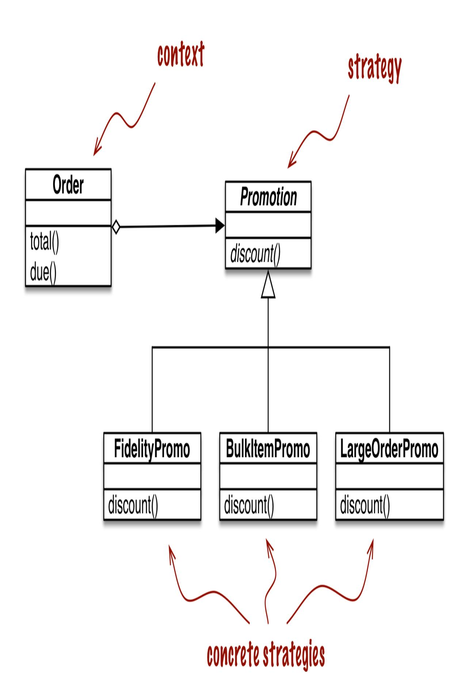
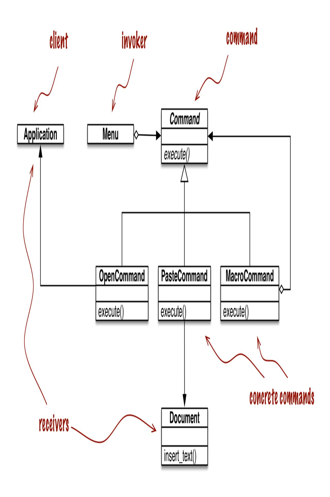

<span id="page-504-0"></span>
# Chapter 10: Design Patterns with First-Class Functions

## A NOTE FOR EARLY RELEASE READERS

With Early Release ebooks, you get books in their earliest form—the author's raw and unedited content as they write—so you can take advantage of these technologies long before the official release of these titles.

This will be the 10th chapter of the final book. Please note that the GitHub repo will be made active later on.

If you have comments about how we might improve the content and/or examples in this book, or if you notice missing material within this chapter, please reach out to the author at [fluentpython2e@ramalho.org.](mailto:fluentpython2e@ramalho.org)

*Conformity to patterns is not a measure of goodness. [1](#page-530-0)*

<span id="page-504-1"></span>—Ralph Johnson, Coauthor of the Design Patterns classic

In software engineering, a *[design pattern](https://en.wikipedia.org/wiki/Software_design_pattern)* is a general recipe for solving a common design problem. You don't need to know design patterns to follow this chapter. I will explain the patterns used in the examples.

The use of design patterns in programming was popularized by the landmark book *Design Patterns: Elements of Reusable Object-Oriented Software* (Addison-Wesley, 1995) by Erich Gamma, Richard Helm, Ralph Johnson & John Vlissides—a.k.a. "the Gang of Four." The book is a catalog of 23 patterns consisting of arrangements of classes exemplified with code in C++, but assumed to be useful in other Object-Oriented languages as well.

Although design patterns are language-independent, that does not mean every pattern applies to every language. For example, [Chapter 17](024-chapter-17-iterables-iterators-and-generators.md#page-840-0) will show that it doesn't make sense to emulate the recipe of the [Iterator](https://en.wikipedia.org/wiki/Iterator_pattern) pattern in Python, because the pattern is embedded in the language and ready to use in in the form of generators—which don't need classes to work, and require less code than the classic recipe.

The authors of *Design Patterns* acknowledge in their *Introduction* that the implementation language determines which patterns are relevant:

*The choice of programming language is important because it influences one's point of view. Our patterns assume Smalltalk/C++-level language features, and that choice determines what can and cannot be implemented easily. If we assumed procedural languages, we might have included design patterns called "Inheritance," "Encapsulation," and "Polymorphism." Similarly, some of our patterns are supported directly by the less common object-oriented languages. CLOS has multi-methods, for example, which lessen the need for a pattern such as Visitor. [2](#page-530-1)*

<span id="page-505-0"></span>In his 1996 presentation, ["Design Patterns in Dynamic Languages",](http://norvig.com/design-patterns/) Peter Norvig states that 16 out of the 23 patterns in the original *Design Patterns* book become either "invisible or simpler" in a dynamic language (slide 9). He was talking about the Lisp and Dylan languages, but many of the relevant dynamic features are also present in Python. In particular, in the context of languages with first-class functions, Norvig suggests rethinking the classic patterns known as Strategy, Command, Template Method, and Visitor.

The goal of this chapter is to show how—in some cases—functions can do the same work as classes, with code that is shorter and easier to read. We will refactor an implementation of Strategy using functions as objects, removing a lot of boilerplate code. We'll also discuss a similar approach to simplifying the Command pattern.

<span id="page-505-1"></span>
## What's new in this chapter

I moved this chapter to the end of Part III so I could apply a registration decorator in ["Decorator-Enhanced Strategy Pattern"](#page-520-0) and also use type hints in the examples. Most type hints used in this chapter are not complicated, and they do help with readability.

<span id="page-506-0"></span>
## Case Study: Refactoring Strategy

Strategy is a good example of a design pattern that can be simpler in Python if you leverage functions as first-class objects. In the following section, we describe and implement Strategy using the "classic" structure described in *Design Patterns*. If you are familiar with the classic pattern, you can skip to ["Function-Oriented Strategy"](#page-512-1) where we refactor the code using functions, significantly reducing the line count.

<span id="page-506-1"></span>
## Classic Strategy

The UML class diagram in Figure 10-1 depicts an arrangement of classes that exemplifies the Strategy pattern.



*Figure 10-1. UML class diagram for order discount processing implemented with the Strategy design pattern*

The Strategy pattern is summarized like this in *Design Patterns*:

*Define a family of algorithms, encapsulate each one, and make them interchangeable. Strategy lets the algorithm vary independently from clients that use it.*

A clear example of Strategy applied in the ecommerce domain is computing discounts to orders according to the attributes of the customer or inspection of the ordered items.

Consider an online store with these discount rules:

- Customers with 1,000 or more fidelity points get a global 5% discount per order.
- A 10% discount is applied to each line item with 20 or more units in the same order.
- Orders with at least 10 distinct items get a 7% global discount.

For brevity, let's assume that only one discount may be applied to an order.

The UML class diagram for the Strategy pattern is depicted in Figure 10-1. Its participants are:

## Context

Provides a service by delegating some computation to interchangeable components that implement alternative algorithms. In the ecommerce example, the context is an Order, which is configured to apply a promotional discount according to one of several algorithms.

## Strategy

The interface common to the components that implement the different algorithms. In our example, this role is played by an abstract class called Promotion.

## Concrete Strategy

One of the concrete subclasses of Strategy. FidelityPromo, BulkPromo, and LargeOrderPromo are the three concrete strategies implemented.

The code in [Example 10-1](#page-509-0) follows the blueprint in Figure 10-1. As described in *Design Patterns*, the concrete strategy is chosen by the client of the context class. In our example, before instantiating an order, the system would somehow select a promotional discount strategy and pass it to the Order constructor. The selection of the strategy is outside the scope of the pattern.

<span id="page-509-0"></span>*Example 10-1. Implementation of the Order class with pluggable discount strategies.*

```
from abc import ABC, abstractmethod
from collections.abc import Sequence
from decimal import Decimal
from typing import NamedTuple, Optional
class Customer(NamedTuple):
 name: str
 fidelity: int
class LineItem(NamedTuple):
 product: str
 quantity: int
 price: Decimal
 def total(self) -> Decimal:
 return self.price * self.quantity
class Order(NamedTuple): # the Context
 customer: Customer
 cart: Sequence[LineItem]
 promotion: Optional['Promotion'] = None
 def total(self) -> Decimal:
 totals = (item.total() for item in self.cart)
```

```
 return sum(totals, start=Decimal(0))
 def due(self) -> Decimal:
 if self.promotion is None:
 discount = Decimal(0)
 else:
 discount = self.promotion.discount(self)
 return self.total() - discount
 def __repr__(self):
 return f'<Order total: {self.total():.2f} due:
{self.due():.2f}>'
class Promotion(ABC): # the Strategy: an abstract base class
 @abstractmethod
 def discount(self, order: Order) -> Decimal:
 """Return discount as a positive dollar amount"""
class FidelityPromo(Promotion): # first Concrete Strategy
 """5% discount for customers with 1000 or more fidelity
points"""
 def discount(self, order: Order) -> Decimal:
 rate = Decimal('0.05')
 if order.customer.fidelity >= 1000:
 return order.total() * rate
 return Decimal(0)
class BulkItemPromo(Promotion): # second Concrete Strategy
 """10% discount for each LineItem with 20 or more units"""
 def discount(self, order: Order) -> Decimal:
 discount = Decimal(0)
 for item in order.cart:
 if item.quantity >= 20:
 discount += item.total() * Decimal('0.1')
 return discount
class LargeOrderPromo(Promotion): # third Concrete Strategy
 """7% discount for orders with 10 or more distinct items"""
 def discount(self, order: Order) -> Decimal:
 distinct_items = {item.product for item in order.cart}
 if len(distinct_items) >= 10:
```

```
 return order.total() * Decimal('0.07')
 return Decimal(0)
```

Note that in [Example 10-1](#page-509-0), I coded Promotion as an abstract base class (ABC), to use the @abstractmethod decorator and make the pattern more explicit.

[Example 10-2](#page-511-0) shows doctests used to demonstrate and verify the operation of a module implementing the rules described earlier.

<span id="page-511-0"></span>*Example 10-2. Sample usage of Order class with different promotions applied.*

```
 >>> joe = Customer('John Doe', 0) 
 >>> ann = Customer('Ann Smith', 1100)
 >>> cart = (LineItem('banana', 4, Decimal('.5')), 
 ... LineItem('apple', 10, Decimal('1.5')),
 ... LineItem('watermelon', 5, Decimal(5)))
 >>> Order(joe, cart, FidelityPromo()) 
 <Order total: 42.00 due: 42.00>
 >>> Order(ann, cart, FidelityPromo()) 
 <Order total: 42.00 due: 39.90>
 >>> banana_cart = (LineItem('banana', 30, Decimal('.5')), 
 ... LineItem('apple', 10, Decimal('1.5')))
 >>> Order(joe, banana_cart, BulkItemPromo()) 
 <Order total: 30.00 due: 28.50>
 >>> long_cart = tuple(LineItem(str(sku), 1, Decimal(1)) 
 ... for sku in range(10))
 >>> Order(joe, long_cart, LargeOrderPromo()) 
 <Order total: 10.00 due: 9.30>
 >>> Order(joe, cart, LargeOrderPromo())
 <Order total: 42.00 due: 42.00>
```

- Two customers: joe has 0 fidelity points, ann has 1,100.
- One shopping cart with three line items.
- The FidelityPromo promotion gives no discount to joe.
- ann gets a 5% discount because she has at least 1,000 points.
- The banana\_cart has 30 units of the "banana" product and 10 apples.

- Thanks to the BulkItemPromo, joe gets a \$1.50 discount on the bananas.
- long\_cart has 10 different items at \$1.00 each.
- joe gets a 7% discount on the whole order because of LargerOrderPromo.

[Example 10-1](#page-509-0) works perfectly well, but the same functionality can be implemented with less code in Python by using functions as objects. The next section shows how.

<span id="page-512-1"></span>
## Function-Oriented Strategy

Each concrete strategy in [Example 10-1](#page-509-0) is a class with a single method, discount. Furthermore, the strategy instances have no state (no instance attributes). You could say they look a lot like plain functions, and you would be right. [Example 10-3](#page-512-0) is a refactoring of [Example 10-1](#page-509-0), replacing the concrete strategies with simple functions and removing the Promo abstract class. Only small adjustments are needed in the Order class. [3](#page-531-0)

<span id="page-512-2"></span><span id="page-512-0"></span>*Example 10-3. Order class with discount strategies implemented as functions.*

```
from collections.abc import Sequence
from dataclasses import dataclass
from decimal import Decimal
from typing import Optional, Callable, NamedTuple
class Customer(NamedTuple):
 name: str
 fidelity: int
class LineItem(NamedTuple):
 product: str
 quantity: int
 price: Decimal
```

```
 def total(self):
 return self.price * self.quantity
@dataclass(frozen=True)
class Order: # the Context
 customer: Customer
 cart: Sequence[LineItem]
 promotion: Optional[Callable[['Order'], Decimal]] = None 
 def total(self) -> Decimal:
 totals = (item.total() for item in self.cart)
 return sum(totals, start=Decimal(0))
 def due(self) -> Decimal:
 if self.promotion is None:
 discount = Decimal(0)
 else:
 discount = self.promotion(self) 
 return self.total() - discount
 def __repr__(self):
 return f'<Order total: {self.total():.2f} due:
{self.due():.2f}>'
def fidelity_promo(order: Order) -> Decimal: 
 """5% discount for customers with 1000 or more fidelity
points"""
 if order.customer.fidelity >= 1000:
 return order.total() * Decimal('0.05')
 return Decimal(0)
def bulk_item_promo(order: Order) -> Decimal:
 """10% discount for each LineItem with 20 or more units"""
 discount = Decimal(0)
 for item in order.cart:
 if item.quantity >= 20:
 discount += item.total() * Decimal('0.1')
 return discount
def large_order_promo(order: Order) -> Decimal:
 """7% discount for orders with 10 or more distinct items"""
 distinct_items = {item.product for item in order.cart}
```

```
 if len(distinct_items) >= 10:
 return order.total() * Decimal('0.07')
 return Decimal(0)
```

- This type hint says: promotion may be None, or it may be a callable that takes an Order argument and returns a Decimal.
- To compute a discount, call the self.promotion callable, passing self as an argument. See below for the reason.
- No abstract class.
- Each strategy is a function.

## WHY SELF.PROMOTION(SELF)

In the Order class, promotion is not a method. It's an instance attribute that happens to be callable. So the first part of the expression, self.promotion, retrieves that callable. To invoke it, we must provide an instance of Order, which in this case is self. That's why self appears twice in that expression.

["Methods Are Descriptors"](031-chapter-24-attribute-descriptors.md#page-1282-0) will explain the mechanism that binds methods to instances automatically. It does not apply to promotion because it is not a method.

The code in [Example 10-3](#page-512-0) is shorter than [Example 10-1](#page-509-0). Using the new Order is also a bit simpler, as shown in the [Example 10-4](#page-514-0) doctests.

<span id="page-514-0"></span>
## Example 10-4. Sample usage of Order class with promotions as functions

```
 >>> joe = Customer('John Doe', 0) 
 >>> ann = Customer('Ann Smith', 1100)
 >>> cart = [LineItem('banana', 4, Decimal('.5')),
 ... LineItem('apple', 10, Decimal('1.5')),
 ... LineItem('watermelon', 5, Decimal(5))]
 >>> Order(joe, cart, fidelity_promo) 
 <Order total: 42.00 due: 42.00>
 >>> Order(ann, cart, fidelity_promo)
 <Order total: 42.00 due: 39.90>
 >>> banana_cart = [LineItem('banana', 30, Decimal('.5')),
 ... LineItem('apple', 10, Decimal('1.5'))]
 >>> Order(joe, banana_cart, bulk_item_promo)
```

```
 <Order total: 30.00 due: 28.50>
 >>> long_cart = [LineItem(str(item_code), 1, Decimal(1))
 ... for item_code in range(10)]
 >>> Order(joe, long_cart, large_order_promo)
 <Order total: 10.00 due: 9.30>
 >>> Order(joe, cart, large_order_promo)
 <Order total: 42.00 due: 42.00>
```

- Same test fixtures as [Example 10-1](#page-509-0).
- To apply a discount strategy to an Order, just pass the promotion function as an argument.
- A different promotion function is used here and in the next test.

Note the callouts in [Example 10-4](#page-514-0): there is no need to instantiate a new promotion object with each new order: the functions are ready to use.

<span id="page-515-1"></span><span id="page-515-0"></span>It is interesting to note that in *Design Patterns* the authors suggest: "Strategy objects often make good flyweights." A definition of the Flyweight in another part of that work states: "A flyweight is a shared object that can be used in multiple contexts simultaneously." The sharing is recommended to reduce the cost of creating a new concrete strategy object when the same strategy is applied over and over again with every new context—with every new Order instance, in our example. So, to overcome a drawback of the Strategy pattern—its runtime cost—the authors recommend applying yet another pattern. Meanwhile, the line count and maintenance cost of your code are piling up. [4](#page-531-1) [5](#page-531-2)

A thornier use case, with complex concrete strategies holding internal state, may require all the pieces of the Strategy and Flyweight design patterns combined. But often concrete strategies have no internal state; they only deal with data from the context. If that is the case, then by all means use plain old functions instead of coding single-method classes implementing a single-method interface declared in yet another class. A function is more lightweight than an instance of a user-defined class, and there is no need for Flyweight because each strategy function is created just once per Python

process when it loads the module. A plain function is also "a shared object that can be used in multiple contexts simultaneously."

Now that we have implemented the Strategy pattern with functions, other possibilities emerge. Suppose you want to create a "meta-strategy" that selects the best available discount for a given Order. In the following sections we study additional refactorings that implement this requirement using a variety of approaches that leverage functions and modules as objects.

<span id="page-516-2"></span>
## Choosing the Best Strategy: Simple Approach

[Given the same customers and shopping carts from the tests in Example 10-](#page-514-0) 4, we now add three additional tests in [Example 10-5](#page-516-0).

<span id="page-516-0"></span>*Example 10-5. The best\_promo function applies all discounts and returns the largest*

```
 >>> Order(joe, long_cart, best_promo) 
 <Order total: 10.00 due: 9.30>
 >>> Order(joe, banana_cart, best_promo) 
 <Order total: 30.00 due: 28.50>
 >>> Order(ann, cart, best_promo) 
 <Order total: 42.00 due: 39.90>
```

- best\_promo selected the larger\_order\_promo for customer joe.
- Here joe got the discount from bulk\_item\_promo for ordering lots of bananas.
- Checking out with a simple cart, best\_promo gave loyal customer ann the discount for the fidelity\_promo.

The implementation of best\_promo is very simple. See [Example 10-6.](#page-516-1)

<span id="page-516-1"></span>*Example 10-6. best\_promo finds the maximum discount iterating over a list of functions*

```
promos = [fidelity_promo, bulk_item_promo, large_order_promo] 
def best_promo(order: Order) -> Decimal: 
 """Compute the best discount available"""
 return max(promo(order) for promo in promos)
```

- promos: list of the strategies implemented as functions.
- best\_promo takes an instance of Order as argument, as do the other \*\_promo functions.
- Using a generator expression, we apply each of the functions from promos to the order, and return the maximum discount computed.

[Example 10-6](#page-516-1) is straightforward: promos is a list of functions. Once you get used to the idea that functions are first-class objects, it naturally follows that building data structures holding functions often makes sense.

Although [Example 10-6](#page-516-1) works and is easy to read, there is some duplication that could lead to a subtle bug: to add a new promotion strategy, we need to code the function and remember to add it to the promos list, or else the new promotion will work when explicitly passed as an argument to Order, but will not be considered by best\_promotion.

Read on for a couple of solutions to this issue.

<span id="page-517-0"></span>
## Finding Strategies in a Module

Modules in Python are also first-class objects, and the standard library provides several functions to handle them. The built-in globals is described as follows in the Python docs:

```
globals()
```

Return a dictionary representing the current global symbol table. This is always the dictionary of the current module (inside a function or

method, this is the module where it is defined, not the module from which it is called).

[Example 10-7](#page-518-0) is a somewhat hackish way of using globals to help best\_promo automatically find the other available \*\_promo functions.

<span id="page-518-0"></span>*Example 10-7. The promos list is built by introspection of the module global namespace*

```
from decimal import Decimal
from strategy import Order
from strategy import (
 fidelity_promo, bulk_item_promo, large_order_promo 
)
promos = [promo for name, promo in globals().items() 
 if name.endswith('_promo') and 
 name != 'best_promo' 
]
def best_promo(order: Order) -> Decimal: 
 """Compute the best discount available"""
 return max(promo(order) for promo in promos)
```

- <span id="page-518-1"></span>Import the promotion functions so they are available in the global namespace. [6](#page-531-3)
- Iterate over each item in the dict returned by globals().
- Select only values where the name ends with the \_promo suffix and…
- Filter out best\_promo itself, to avoid an infinite recursion when best\_promo is called.
- No changes in best\_promo.

Another way of collecting the available promotions would be to create a module and put all the strategy functions there, except for best\_promo. In [Example 10-8,](#page-519-0) the only significant change is that the list of strategy functions is built by introspection of a separate module called promotions. Note that [Example 10-8](#page-519-0) depends on importing the promotions module as well as inspect, which provides high-level introspection functions.

<span id="page-519-0"></span>*Example 10-8. The promos list is built by introspection of a new promotions module*

```
from decimal import Decimal
import inspect
from strategy import Order
import promotions
promos = [func for _, func in inspect.getmembers(promotions,
inspect.isfunction)]
def best_promo(order: Order) -> Decimal:
 """Compute the best discount available"""
 return max(promo(order) for promo in promos)
```

The function inspect.getmembers returns the attributes of an object —in this case, the promotions module—optionally filtered by a predicate (a boolean function). We use inspect.isfunction to get only the functions from the module.

[Example 10-8](#page-519-0) works regardless of the names given to the functions; all that matters is that the promotions module contains only functions that calculate discounts given orders. Of course, this is an implicit assumption of the code. If someone were to create a function with a different signature in the promotions module, then best\_promo would break while trying to apply it to an order.

We could add more stringent tests to filter the functions, by inspecting their arguments for instance. The point of [Example 10-8](#page-519-0) is not to offer a complete solution, but to highlight one possible use of module introspection.

A more explicit alternative to dynamically collecting promotional discount functions would be to use a simple decorator. That's next.

<span id="page-520-0"></span>
## Decorator-Enhanced Strategy Pattern

Recall that our main issue with [Example 10-6](#page-516-1) is the repetition of the function names in their definitions and then in the promos list used by the best\_promo function to determine the highest discount applicable. The repetition is problematic because someone may add a new promotional strategy function and forget to manually add it to the promos list—in which case, best\_promo will silently ignore the new strategy, introducing a subtle bug in the system. [Example 10-9](#page-520-1) solves this problem with the technique covered in ["Registration decorators"](015-chapter-9-decorators-and-closures.md#page-462-0).

<span id="page-520-1"></span>*Example 10-9. The promos list is filled by the promotion decorator*

```
Promotion = Callable[[Order], Decimal]
promos: list[Promotion] = [] 
def promotion(promo: Promotion) -> Promotion: 
 promos.append(promo)
 return promo
def best_promo(order: Order) -> Decimal:
 """Compute the best discount available"""
 return max(promo(order) for promo in promos) 
@promotion 
def fidelity(order: Order) -> Decimal:
 """5% discount for customers with 1000 or more fidelity
points"""
 if order.customer.fidelity >= 1000:
 return order.total() * Decimal('0.05')
 return Decimal(0)
@promotion
def bulk_item(order: Order) -> Decimal:
 """10% discount for each LineItem with 20 or more units"""
```

```
 discount = Decimal(0)
 for item in order.cart:
 if item.quantity >= 20:
 discount += item.total() * Decimal('0.1')
 return discount
@promotion
def large_order(order: Order) -> Decimal:
 """7% discount for orders with 10 or more distinct items"""
 distinct_items = {item.product for item in order.cart}
 if len(distinct_items) >= 10:
 return order.total() * Decimal('0.07')
 return Decimal(0)
```

- The promos list is a module global, and starts empty.
- promotion is a registration decorator: it returns the promo function unchanged, after appending it to the promos list.
- No changes needed to best\_promo, because it relies on the promos list.
- Any function decorated by @promotion will be added to promos.

This solution has several advantages over the others presented before:

- The promotion strategy functions don't have to use special names —no need for the \_promo suffix.
- The @promotion decorator highlights the purpose of the decorated function, and also makes it easy to temporarily disable a promotion: just comment out the decorator.
- Promotional discount strategies may be defined in other modules, anywhere in the system, as long as the @promotion decorator is applied to them.

In the next section, we discuss Command—another design pattern that is sometimes implemented via single-method classes when plain functions

would do.

<span id="page-522-0"></span>
## The Command Pattern

Command is another design pattern that can be simplified by the use of functions passed as arguments. Figure 10-2 shows the arrangement of classes in the Command pattern.



*Figure 10-2. UML class diagram for menu-driven text editor implemented with the Command design pattern. Each command may have a different receiver: the object that implements the action. For PasteCommand, the receiver is the Document. For OpenCommand, the receiver is the application.*

The goal of Command is to decouple an object that invokes an operation (the Invoker) from the provider object that implements it (the Receiver). In the example from *Design Patterns*, each invoker is a menu item in a graphical application, and the receivers are the document being edited or the application itself.

The idea is to put a Command object between the two, implementing an interface with a single method, execute, which calls some method in the Receiver to perform the desired operation. That way the Invoker does not need to know the interface of the Receiver, and different receivers can be adapted through different Command subclasses. The Invoker is configured with a concrete command and calls its execute method to operate it. Note in Figure 10-2 that MacroCommand may store a sequence of commands; its execute() method calls the same method in each command stored.

Quoting from Gamma et al., "Commands are an object-oriented replacement for callbacks." The question is: do we need an object-oriented replacement for callbacks? Sometimes yes, but not always.

Instead of giving the Invoker a Command instance, we can simply give it a function. Instead of calling command.execute(), the Invoker can just call command(). The MacroCommand can be implemented with a class implementing \_\_call\_\_. Instances of MacroCommand would be callables, each holding a list of functions for future invocation, as implemented in [Example 10-10](#page-524-0).

<span id="page-524-0"></span>*Example 10-10. Each instance of MacroCommand has an internal list of commands*

```
class MacroCommand:
 """A command that executes a list of commands"""
 def __init__(self, commands):
 self.commands = list(commands) 
 def __call__(self):
```

- Building a list from the commands arguments ensures that it is iterable and keeps a local copy of the command references in each MacroCommand instance.
- When an instance of MacroCommand is invoked, each command in self.commands is called in sequence.

More advanced uses of the Command pattern—to support undo, for example—may require more than a simple callback function. Even then, Python provides a couple of alternatives that deserve consideration:

- A callable instance like MacroCommand in [Example 10-10](#page-524-0) can keep whatever state is necessary, and provide extra methods in addition to \_\_call\_\_.
- A closure can be used to hold the internal state of a function between calls.

<span id="page-525-0"></span>This concludes our rethinking of the Command pattern with first-class functions. At a high level, the approach here was similar to the one we applied to Strategy: replacing with callables the instances of a participant class that implemented a single-method interface. After all, every Python callable implements a single-method interface and that method is named \_\_call\_\_.

## Chapter Summary

As Peter Norvig pointed out a couple of years after the classic *Design Patterns* book appeared, "16 of 23 patterns have qualitatively simpler implementation in Lisp or Dylan than in C++ for at least some uses of each [pattern" \(slide 9 of Norvig's "Design Patterns in Dynamic Languages"](http://bit.ly/1HGC0r5) presentation). Python shares some of the dynamic features of the Lisp and Dylan languages, in particular first-class functions, our focus in this part of the book.

From the same talk quoted at the start of this chapter, in reflecting on the 20th anniversary of *Design Patterns: Elements of Reusable Object-Oriented Software*, Ralph Johnson has stated that one of the failings of the book is "Too much emphasis on patterns as end-points instead of steps in the design process." In this chapter, we used the Strategy pattern as a starting point: a working solution that we could simplify using first-class functions. [7](#page-531-4)

<span id="page-526-1"></span>In many cases, functions or callable objects provide a more natural way of implementing callbacks in Python than mimicking the Strategy or the Command patterns as described by Gamma, Helm, Johnson & Vlissides. The refactoring of Strategy and the discussion of Command in this chapter are examples of a more general insight: sometimes you may encounter a design pattern or an API that requires that components implement an interface with a single method, and that method has a generic-sounding name such as "execute", "run", or "do\_it". Such patterns or APIs often can be implemented with less boilerplate code in Python using functions as first-class objects.

<span id="page-526-0"></span>
## Further Reading

"Recipe 8.21. Implementing the Visitor Pattern," in the *Python Cookbook, Third Edition* [\(O'Reilly\), by David Beazley and Brian K. Jones, presents a](http://shop.oreilly.com/product/0636920027072.do)n elegant implementation of the Visitor pattern in which a NodeVisitor class handles methods as first-class objects.

On the general topic of design patterns, the choice of readings for the Python programmer is not as broad as what is available to other language communities.

*Learning Python Design Patterns*, by Gennadiy Zlobin (Packt), is the only book that I have seen entirely devoted to patterns in Python. But Zlobin's work is quite short (100 pages) and covers eight of the original 23 design patterns.

*Expert Python Programming* by Tarek Ziadé (Packt) is one of the best intermediate-level Python books in the market, and its final chapter, "Useful Design Patterns," presents several of the classic patterns from a Pythonic perspective.

Alex Martelli has given several talks about Python Design Patterns. There is a video of his [EuroPython 2011 presentation](http://bit.ly/1HGBXvx) and a set of slides on his [personal website. I've found different slide decks and videos over the ye](http://www.aleax.it/gdd_pydp.pdf)ars, of varying lengths, so it is worthwhile to do a thorough search for his name with the words "Python Design Patterns." A publisher told me Martelli is working on a book about this subject. I will certainly get it when it comes out.

There are many books about design patterns in the context of Java, but among them the one I like most is *Head First Design Patterns, Second Edition* by Eric Freeman & Elisabeth Robson (O'Reilly). It explains 16 of the 23 classic patterns. If you like the wacky style of the *Head First* series and need an introduction to this topic, you will love that work. It is Javacentric, but the *Second Edition* was uptaded to reflect the addition of firstclass functions in Java, making some of the examples closer to code we'd write in Python.

For a fresh look at patterns from the point of view of a dynamic language with duck typing and first-class functions, *Design Patterns in Ruby* by Russ Olsen (Addison-Wesley) has many insights that are also applicable to Python. In spite of their many syntactic differences, at the semantic level Python and Ruby are closer to each other than to Java or C++.

In [Design Patterns in Dynamic Languages](http://norvig.com/design-patterns/) (slides), Peter Norvig shows how first-class functions (and other dynamic features) make several of the original design patterns either simpler or unnecessary.

The *Introduction* of the original *Design Patterns* book by Gamma et al. is worth the price of the book—more than the catalog of 23 patterns which includes recipes ranging from very important to rarely useful. The widely quoted design principles "Program to an interface, not an implementation" and "Favor object composition over class inheritance" both come from that *Introduction*.

The application of patterns to design originated with the architect Christopher Alexander, presented in the book *A Pattern Language* ( Oxford University Press, 1977). Alexander's idea is to create a standard vocabulary allowing teams to share common design decisions while designing buildings. M. J. Dominus wrote *["Design Patterns" Aren't](https://perl.plover.com/yak/design/)*: an intriguing slide deck and postscript text arguing that Alexander's original vision of patterns is more profound, more human, and also applicable to software engineering.

## SOAPBOX

Python has first-class functions and first-class types, features that [Norvig claims affect 10 of the 23 patterns \(slide 10 of Design Patterns](http://norvig.com/design-patterns/) in Dynamic Languages). In the [Chapter 9,](015-chapter-9-decorators-and-closures.md#page-456-0) we saw that Python also has generic functions (["Single Dispatch Generic Functions"](015-chapter-9-decorators-and-closures.md#page-483-0)), a limited form of the CLOS multimethods that Gamma et al. suggest as a simpler way to implement the classic Visitor pattern. Norvig, on the other hand, says that multimethods simplify the Builder pattern (slide 10). Matching design patterns to language features is not an exact science.

In classrooms around the world, design patterns are frequently taught using Java examples. I've heard more than one student claim that they were led to believe that the original design patterns are useful in any implementation language. It turns out that the "classic" 23 patterns from the Gamma et al. book apply to "classic" Java very well in spite of being originally presented mostly in the context of C++—a few have Smalltalk examples in the book. But that does not mean every one of those patterns applies equally well in any language. The authors are explicit right at the beginning of their book that "some of our patterns are supported directly by the less common object-oriented languages" (recall full quote on first page of this chapter).

The Python bibliography about design patterns is very thin, compared to that of Java, C++, or Ruby. In ["Further Reading"](#page-526-0) I mentioned *Learning Python Design Patterns* by Gennadiy Zlobin, which was published as recently as November 2013. In contrast, Russ Olsen's *Design Patterns in Ruby* was published in 2007 and has 384 pages— 284 more than Zlobin's work.

Now that Python is becoming increasingly popular in academia, let's hope more will be written about design patterns in the context of this language. Also, Java 8 introduced method references and anonymous functions, and those highly anticipated features are likely to prompt fresh approaches to patterns in Java—recognizing that as languages

evolve, so must our understanding of how to apply the classic design patterns.

## The \_\_call\_\_ of the wild

As we collaborated to put the final touches to this book, tech reviewer Leonardo Rochael wondered…

If functions have a \_\_call\_\_ method, and methods are also callable, do \_\_call\_\_ methods also have a \_\_call\_\_ method?

I don't know if his discovery is useful, but it is a fun fact:

```
>>> def turtle():
... return 'eggs'
...
>>> turtle()
'eggs'
>>> turtle.__call__()
'eggs'
>>> turtle.__call__.__call__()
'eggs'
>>> turtle.__call__.__call__.__call__()
'eggs'
>>> turtle.__call__.__call__.__call__.__call__()
'eggs'
>>> turtle.__call__.__call__.__call__.__call__.__call__()
'eggs'
>>>
turtle.__call__.__call__.__call__.__call__.__call__.__call__()
'eggs'
>>>
turtle.__call__.__call__.__call__.__call__.__call__.__call__._
_call__()
'eggs'
```

[Turtles all the way down!](https://en.wikipedia.org/wiki/Turtles_all_the_way_down)

<span id="page-530-0"></span>[<sup>1</sup>](#page-504-1) From a slide in the talk "Root Cause Analysis of Some Faults in Design Patterns," presented by Ralph Johnson at IME/CCSL, Universidade de São Paulo, Nov. 15, 2014.

<span id="page-530-1"></span>[<sup>2</sup>](#page-505-0) Quoted from page 4 of *Design Patterns* (Addison-Wesley, 1995).

- <span id="page-531-0"></span>[3](#page-512-2) I had to reimplement Order with @dataclass due to a bug in Mypy. You may ignore this detail, because this class works with NamedTuple as well, just like in [Example 10-1](#page-509-0). If Order is a NamedTuple, Mypy 0.910 crashes when checking the type hint for promotion. I tried adding # type ignore to that specific line, but Mypy crashed anyway. Mypy handles the same type hint correctly if Order is built with @dataclass. [Issue #9397](https://github.com/python/mypy/issues/9397) is unresolved as of July 19, 2021. Hopefully it will be fixed by the time you read this.
- <span id="page-531-1"></span>[4](#page-515-0) See page 323 of *Design Patterns*.
- <span id="page-531-2"></span>[5](#page-515-1) *idem*, p. 196
- <span id="page-531-3"></span>[6](#page-518-1) *flake8* and VS Code both complain that these names are imported but not used. By definition, static analysis tools cannot understand the dynamic nature of Python. If we heed every advice from such tools, we'll soon be writing grim and verbose Java-like code with Python syntax.
- <span id="page-531-4"></span>[7](#page-526-1) "Root Cause Analysis of Some Faults in Design Patterns", presented by Johnson at IME-USP, November 15, 2014.
