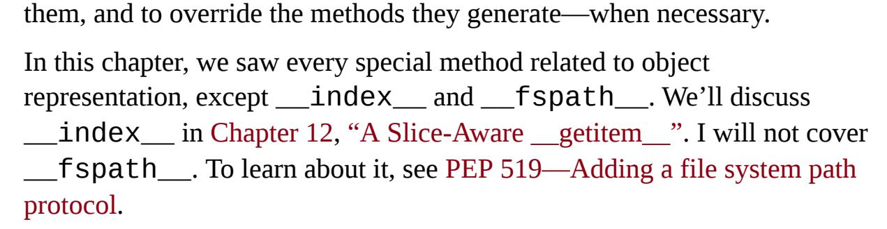

<span id="page-533-0"></span>
# Chapter 11: A Pythonic Object

## A NOTE FOR EARLY RELEASE READERS

With Early Release ebooks, you get books in their earliest form—the author's raw and unedited content as they write—so you can take advantage of these technologies long before the official release of these titles.

This will be the 11th chapter of the final book. Please note that the GitHub repo will be made active later on.

If you have comments about how we might improve the content and/or examples in this book, or if you notice missing material within this chapter, please reach out to the author at [fluentpython2e@ramalho.org.](mailto:fluentpython2e@ramalho.org)

<span id="page-533-1"></span>*For a library or framework to be Pythonic is to make it as easy and natural as possible for a Python programmer to pick up how to perform a task. . [1](#page-576-0)*

> —Martijn Faassen, creator of Python and JavaScript frameworks

Thanks to the Python Data Model, your user-defined types can behave as naturally as the built-in types. And this can be accomplished without inheritance, in the spirit of *duck typing*: you just implement the methods needed for your objects to behave as expected.

In previous chapters, we studied the behavior of many built-in objects. We will now build user-defined classes that behave as real Python objects. Your application classes probably don't need and should not implement as many special methods as the examples in this chapter. But if you are writing a library or a framework, the programmers who will use your classes may expect them to behave like the classes that Python provides. Fulfilling that expectation is one way of being "Pythonic."

This chapter starts where [Chapter 1](005-chapter-1-the-python-data-model.md#page-20-0) ended, by showing how to implement several special methods that are commonly seen in Python objects of many different types.

In this chapter, we will see how to:

- Support the built-in functions that convert objects to other types (e.g., repr(), bytes(), complex(), etc).
- Implement an alternative constructor as a class method.
- Extend the format mini-language used by f-strings, the format() built-in, and the str.format() method.
- Provide read-only access to attributes.
- Make an object hashable for use in sets and as dict keys.
- Save memory with the use of \_\_slots\_\_.

We'll do all that as we develop a simple two-dimensional Euclidean vector type, Vector2d. This code will be the foundation of an N-dimensional vector class in [Chapter 12](019-chapter-12-writing-special-methods-for-sequences.md#page-577-0).

The evolution of the example will be paused to discuss two conceptual topics:

- How and when to use the @classmethod and @staticmethod decorators.
- Private and protected attributes in Python: usage, conventions, and limitations.

<span id="page-534-0"></span>
## What's new in this chapter

I added a new epigraph and a few words in the second paragraph of the chapter to address the concept of "Pythonic"—which was only discussed at the very end in the first edition.

["Formatted Displays"](#page-542-0) was updated to mention f-strings, introduced in Python 3.6. It's a small change because f-strings support the same formatting mini-language as the format() built-in and the str.format() method, so any previously implemented \_\_format\_\_ methods simply work with f-strings.

The rest of the chapter barely changed—the special methods are mostly the same since Python 3.0, and the core ideas appeared in Python 2.2.

Let's get started with the object representation methods.

<span id="page-535-0"></span>
## Object Representations

Every object-oriented language has at least one standard way of getting a string representation from any object. Python has two:

```
repr()
```

Return a string representing the object as the developer wants to see it. It's what you get when the Python console or a debugger shows an object.

*str()*

Return a string representing the object as the user wants to see it. It's what you get when you print() an object.

The special methods \_\_repr\_\_ and \_\_str\_\_ support repr() and str(), as we saw in [Chapter 1](005-chapter-1-the-python-data-model.md#page-20-0). There are two additional special methods to support alternative representations of objects: \_\_bytes\_\_ and \_\_format\_\_. The \_\_bytes\_\_ method is analogous to \_\_str\_\_: it's called by bytes() to get the object represented as a byte sequence. Regarding \_\_format\_\_, it is used by f-strings, by the built-in function format(), and by the str.format() method. They call obj.\_\_format\_\_(format\_spec) to get string displays of objects

using special formatting codes. We'll cover \_\_bytes\_\_ in the next example, and \_\_format\_\_ after that.

## WARNING

If you're coming from Python 2, remember that in Python 3 \_\_repr\_\_, \_\_str\_\_, and \_\_format\_\_ must always return Unicode strings (type str). Only \_\_bytes\_\_ is supposed to return a byte sequence (type bytes).

<span id="page-536-1"></span>
## Vector Class Redux

In order to demonstrate the many methods used to generate object representations, we'll use a Vector2d class similar to the one we saw in [Chapter 1.](005-chapter-1-the-python-data-model.md#page-20-0) We will build on it in this and future sections. [Example 11-1](#page-536-0) illustrates the basic behavior we expect from a Vector2d instance.

<span id="page-536-0"></span>*Example 11-1. Vector2d instances have several representations*

```
 >>> v1 = Vector2d(3, 4)
 >>> print(v1.x, v1.y) 
 3.0 4.0
 >>> x, y = v1 
 >>> x, y
 (3.0, 4.0)
 >>> v1 
 Vector2d(3.0, 4.0)
 >>> v1_clone = eval(repr(v1)) 
 >>> v1 == v1_clone 
 True
 >>> print(v1) 
 (3.0, 4.0)
 >>> octets = bytes(v1) 
 >>> octets
b'd\\x00\\x00\\x00\\x00\\x00\\x00\\x08@\\x00\\x00\\x00\\x00\\x00\\x
00\\x10@'
 >>> abs(v1) 
 5.0
 >>> bool(v1), bool(Vector2d(0, 0)) 
 (True, False)
```

- The components of a Vector2d can be accessed directly as attributes (no getter method calls).
- A Vector2d can be unpacked to a tuple of variables.
- The repr of a Vector2d emulates the source code for constructing the instance.
- <span id="page-537-1"></span>Using eval here shows that the repr of a Vector2d is a faithful representation of its constructor call. [2](#page-576-1)
- Vector2d supports comparison with ==; this is useful for testing.
- print calls str, which for Vector2d produces an ordered pair display.
- bytes uses the \_\_bytes\_\_ method to produce a binary representation.
- abs uses the \_\_abs\_\_ method to return the magnitude of the Vector2d.
- bool uses the \_\_bool\_\_ method to return False for a Vector2d of zero magnitude or True otherwise.

Vector2d from [Example 11-1](#page-536-0) is implemented in *vector2d\_v0.py* ([Example 11-2\)](#page-537-0). The code is based on Example 1-2, except for the methods for the + and \* operations, which we'll see later in [Chapter 16](023-chapter-16-operator-overloading-doing-it-right.md#page-797-0). We'll add the method for == since it's useful for testing. At this point, Vector2d uses several special methods to provide operations that a Pythonista expects in a well-designed object.

<span id="page-537-0"></span>*Example 11-2. vector2d\_v0.py: methods so far are all special methods*

```
class Vector2d:
 typecode = 'd' 
 def __init__(self, x, y):
 self.x = float(x) 
 self.y = float(y)
 def __iter__(self):
 return (i for i in (self.x, self.y)) 
 def __repr__(self):
 class_name = type(self).__name__
 return '{}({!r}, {!r})'.format(class_name, *self) 
 def __str__(self):
 return str(tuple(self)) 
 def __bytes__(self):
 return (bytes([ord(self.typecode)]) + 
 bytes(array(self.typecode, self))) 
 def __eq__(self, other):
 return tuple(self) == tuple(other) 
 def __abs__(self):
 return math.hypot(self.x, self.y) 
 def __bool__(self):
 return bool(abs(self))
```

- typecode is a class attribute we'll use when converting Vector2d instances to/from bytes.
- Converting x and y to float in \_\_init\_\_ catches errors early, which is helpful in case Vector2d is called with unsuitable arguments.
- <span id="page-538-0"></span>\_\_iter\_\_ makes a Vector2d iterable; this is what makes unpacking work (e.g, x, y = my\_vector). We implement it simply by using a generator expression to yield the components one after the other. [3](#page-576-2)

- \_\_repr\_\_ builds a string by interpolating the components with {!r} to get their repr; because Vector2d is iterable, \*self feeds the x and y components to format.
- From an iterable Vector2d, it's easy to build a tuple for display as an ordered pair.
- To generate bytes, we convert the typecode to bytes and concatenate…
- …bytes converted from an array built by iterating over the instance.
- To quickly compare all components, build tuples out of the operands. This works for operands that are instances of Vector2d, but has issues. See the following warning.
- The magnitude is the length of the hypotenuse of the right triangle formed by the x and y components.
- \_\_bool\_\_ uses abs(self) to compute the magnitude, then converts it to bool, so 0.0 becomes False, nonzero is True.

## WARNING

Method \_\_eq\_\_ in [Example 11-2](#page-537-0) works for Vector2d operands but also returns True when comparing Vector2d instances to other iterables holding the same numeric values (e.g., Vector(3, 4) == [3, 4]). This may be considered a feature or a bug. Further discussion needs to wait until [Chapter 16,](023-chapter-16-operator-overloading-doing-it-right.md#page-797-0) when we cover operator overloading.

We have a fairly complete set of basic methods, but we still need a way to rebuild a Vector2d from the binary representation produced by bytes().

<span id="page-540-2"></span>
## An Alternative Constructor

Since we can export a Vector2d as bytes, naturally we need a method that imports a Vector2d from a binary sequence. Looking at the standard library for inspiration, we find that array.array has a class method named .frombytes that suits our purpose—we saw it in ["Arrays"](007-chapter-2-an-array-of-sequences.md#page-107-0). We adopt its name and use its functionality in a class method for Vector2d in *vector2d\_v1.py* ([Example 11-3\)](#page-540-0).

<span id="page-540-0"></span>*Example 11-3. Part of vector2d\_v1.py: this snippet shows only the frombytes class method, added to the Vector2d definition in vector2d\_v0.py ([Example 11-2](#page-537-0))*

```
 @classmethod 
 def frombytes(cls, octets): 
 typecode = chr(octets[0]) 
 memv = memoryview(octets[1:]).cast(typecode) 
 return cls(*memv)
```

- The classmethod decorator modifies a method so it can be called directly on a class.
- No self argument; instead, the class itself is passed as the first argument—conventionally named cls.
- Read the typecode from the first byte.
- <span id="page-540-1"></span>Create a memoryview from the octets binary sequence and use the typecode to cast it. [4](#page-576-3)
- Unpack the memoryview resulting from the cast into the pair of arguments needed for the constructor.

I just used a classmethod decorator and it is very Python-specific, so let's have a word about it.

<span id="page-541-0"></span>
## classmethod Versus staticmethod

The classmethod decorator is not mentioned in the Python tutorial, and neither is staticmethod. Anyone who has learned OO in Java may wonder why Python has both of these decorators and not just one of them.

Let's start with classmethod. [Example 11-3](#page-540-0) shows its use: to define a method that operates on the class and not on instances. classmethod changes the way the method is called, so it receives the class itself as the first argument, instead of an instance. Its most common use is for alternative constructors, like frombytes in [Example 11-3](#page-540-0). Note how the last line of frombytes actually uses the cls argument by invoking it to build a new instance: cls(\*memv).

In contrast, the staticmethod decorator changes a method so that it receives no special first argument. In essence, a static method is just like a plain function that happens to live in a class body, instead of being defined at the module level. [Example 11-4](#page-541-1) contrasts the operation of classmethod and staticmethod.

<span id="page-541-1"></span>*Example 11-4. Comparing behaviors of classmethod and staticmethod*

```
>>> class Demo:
... @classmethod
... def klassmeth(*args):
... return args 
... @staticmethod
... def statmeth(*args):
... return args 
...
>>> Demo.klassmeth() 
(<class '__main__.Demo'>,)
>>> Demo.klassmeth('spam')
(<class '__main__.Demo'>, 'spam')
>>> Demo.statmeth() 
()
>>> Demo.statmeth('spam')
('spam',)
```

klassmeth just returns all positional arguments.

- **2** statmeth does the same.
- No matter how you invoke it, Demo.klassmeth receives the Demo class as the first argument.
- Demo.statmeth behaves just like a plain old function.

<span id="page-542-1"></span>
### NOTE

The classmethod decorator is clearly useful, but I've never seen a compelling use case for staticmethod. If you want to define a function that does not interact with the class, just define it in the module. Maybe the function is closely related even if it never touches the class, so you may want to place it nearby in the code. Even so, defining the function right before or after the class in the same module is close enough for all practical purposes.<sup>5</sup>

Now that we've seen what classmethod is good for (and that staticmethod is not very useful), let's go back to the issue of object representation and see how to support formatted output.

<span id="page-542-0"></span>
## Formatted Displays

The f-strings, the format() built-in function, and the str.format() method delegate the actual formatting to each type by calling their .\_\_\_format\_\_(format\_spec) method. The format\_spec is a formatting specifier, which is either:

- The second argument in format(my\_obj, format\_spec),
   or
- Whatever appears after the colon in a replacement field delimited with {} inside an f-string or the fmt in fmt.str.format()

For example:

```
>>> brl = 1 / 4.82 # BRL to USD currency conversion rate
>>> brl
0.20746887966804978
>>> format(brl, '0.4f') 
'0.2075'
>>> '1 BRL = {rate:0.2f} USD'.format(rate=brl) 
'1 BRL = 0.21 USD'
>>> f'1 USD = {1 / brl:0.2f} BRL' 
'1 USD = 4.82 BRL'
```

- Formatting specifier is '0.4f'.
- Formatting specifier is '0.2f'. The rate part in the replacement field is not part of the formatting specifier. It determines which keyword argument of .format() goes into that replacement field.
- Again, the formatting specifier is '0.2f'. The 1 / brl expression is not part of it.

The second and third callouts make an important point: a format string such as '{0.mass:5.3e}' actually uses two separate notations. The '0.mass' to the left of the colon is the field\_name part of the replacement field syntax, and it can be an arbitrary expression in an f-string. The '5.3e' after the colon is the formatting specifier. The notation used [in the formatting specifier is called the Format Specification Mini-](http://bit.ly/1Gt4vJF)Language.

## TIP

If f-strings, format() and str.format() are new to you, classroom experience tells me it's best to study the format() built-in function first, which uses just the

[Format Specification Mini-Language](https://docs.python.org/3/library/string.html#formatspec)[. After you get the gist of that, read Formatted](https://docs.python.org/3/reference/lexical_analysis.html#f-strings) string literals and [Format String Syntax](https://docs.python.org/3/library/string.html#format-string-syntax) to learn about the {:} replacement field notation, used in f-strings and str.format() method (including the !s, !r, and !a conversion flags). F-strings don't make str.format() obsolete: most of the time fstrings solve the problem, but sometimes it's better to specify the formatting string elsewhere, and not where it will be rendered.

A few built-in types have their own presentation codes in the Format Specification Mini-Language. For example—among several other codes the int type supports b and x for base 2 and base 16 output, respectively, while float implements f for a fixed-point display and % for a percentage display:

```
>>> format(42, 'b')
'101010'
>>> format(2 / 3, '.1%')
'66.7%'
```

The Format Specification Mini-Language is extensible because each class gets to interpret the format\_spec argument as it likes. For instance, the classes in the datetime module use the same format codes in the strftime() functions and in their \_\_format\_\_ methods. Here are a couple examples using the format() built-in and the str.format() method:

```
>>> from datetime import datetime
>>> now = datetime.now()
>>> format(now, '%H:%M:%S')
'18:49:05'
>>> "It's now {:%I:%M %p}".format(now)
"It's now 06:49 PM"
```

If a class has no \_\_format\_\_, the method inherited from object returns str(my\_object). Because Vector2d has a \_\_str\_\_, this works:

```
>>> v1 = Vector2d(3, 4)
>>> format(v1)
'(3.0, 4.0)'
```

However, if you pass a format specifier, object.\_\_format\_\_ raises TypeError:

```
>>> format(v1, '.3f')
Traceback (most recent call last):
```

```
 ...
TypeError: non-empty format string passed to object.__format__
```

We will fix that by implementing our own format mini-language. The first step will be to assume the format specifier provided by the user is intended to format each float component of the vector. This is the result we want:

```
>>> v1 = Vector2d(3, 4)
>>> format(v1)
'(3.0, 4.0)'
>>> format(v1, '.2f')
'(3.00, 4.00)'
>>> format(v1, '.3e')
'(3.000e+00, 4.000e+00)'
```

[Example 11-5](#page-545-0) implements \_\_format\_\_ to produce the displays just shown.

<span id="page-545-0"></span>
## Example 11-5. Vector2d.format method, take #1

```
 # inside the Vector2d class
 def __format__(self, fmt_spec=''):
 components = (format(c, fmt_spec) for c in self) 
 return '({}, {})'.format(*components)
```

- Use the format built-in to apply the fmt\_spec to each vector component, building an iterable of formatted strings.
- Plug the formatted strings in the formula '(x, y)'.

Now let's add a custom formatting code to our mini-language: if the format specifier ends with a 'p', we'll display the vector in polar coordinates: <r, θ>, where r is the magnitude and θ (theta) is the angle in radians. The rest of the format specifier (whatever comes before the 'p') will be used as before.

## TIP

When choosing the letter for the custom format code I avoided overlapping with codes used by other types. In [Format Specification Mini-Language](http://bit.ly/1Gt4vJF) we see that integers use the codes 'bcdoxXn', floats use 'eEfFgGn%', and strings use 's'. So I picked 'p' for polar coordinates. Because each class interprets these codes independently, reusing a code letter in a custom format for a new type is not an error, but may be confusing to users.

To generate polar coordinates we already have the \_\_abs\_\_ method for the magnitude, and we'll code a simple angle method using the math.atan2() function to get the angle. This is the code:

```
 # inside the Vector2d class
 def angle(self):
 return math.atan2(self.y, self.x)
```

With that, we can enhance our \_\_format\_\_ to produce polar coordinates. See [Example 11-6.](#page-546-0)

<span id="page-546-0"></span>*Example 11-6. Vector2d.format method, take #2, now with polar coordinates*

```
 def __format__(self, fmt_spec=''):
 if fmt_spec.endswith('p'): 
 fmt_spec = fmt_spec[:-1] 
 coords = (abs(self), self.angle()) 
 outer_fmt = '<{}, {}>' 
 else:
 coords = self 
 outer_fmt = '({}, {})' 
 components = (format(c, fmt_spec) for c in coords) 
 return outer_fmt.format(*components)
```

- Format ends with 'p': use polar coordinates.
- Remove 'p' suffix from fmt\_spec.
- Build tuple of polar coordinates: (magnitude, angle).

- Configure outer format with angle brackets.
- Otherwise, use x, y components of self for rectangular coordinates.
- Configure outer format with parentheses.
- Generate iterable with components as formatted strings.
- Plug formatted strings into outer format.

With [Example 11-6](#page-546-0), we get results similar to these:

```
>>> format(Vector2d(1, 1), 'p')
'<1.4142135623730951, 0.7853981633974483>'
>>> format(Vector2d(1, 1), '.3ep')
'<1.414e+00, 7.854e-01>'
>>> format(Vector2d(1, 1), '0.5fp')
'<1.41421, 0.78540>'
```

As this section shows, it's not hard to extend the format specification minilanguage to support user-defined types.

Now let's move to a subject that's not just about appearances: we will make our Vector2d hashable, so we can build sets of vectors, or use them as dict keys.

<span id="page-547-0"></span>
## A Hashable Vector2d

As defined, so far our Vector2d instances are unhashable, so we can't put them in a set:

```
>>> v1 = Vector2d(3, 4)
>>> hash(v1)
Traceback (most recent call last):
 ...
TypeError: unhashable type: 'Vector2d'
>>> set([v1])
Traceback (most recent call last):
```

```
 ...
TypeError: unhashable type: 'Vector2d'
```

To make a Vector2d hashable, we must implement \_\_hash\_\_ (\_\_eq\_\_ is also required, and we already have it). We also need to make vector instances immutable, as we've seen in ["What is Hashable"](008-chapter-3-dictionaries-and-sets.md#page-149-0).

Right now, anyone can do v1.x = 7 and there is nothing in the code to suggest that changing a Vector2d is forbidden. This is the behavior we want:

```
>>> v1.x, v1.y
(3.0, 4.0)
>>> v1.x = 7
Traceback (most recent call last):
 ...
AttributeError: can't set attribute
```

We'll do that by making the x and y components read-only properties in [Example 11-7.](#page-548-0)

<span id="page-548-0"></span>*Example 11-7. vector2d\_v3.py: only the changes needed to make Vector2d immutable are shown here; see full listing in [Example 11-11](#page-552-0)*

```
class Vector2d:
 typecode = 'd'
 def __init__(self, x, y):
 self.__x = float(x) 
 self.__y = float(y)
 @property 
 def x(self): 
 return self.__x 
 @property 
 def y(self):
 return self.__y
 def __iter__(self):
 return (i for i in (self.x, self.y)) 
 # remaining methods: same as previous Vector2d
```

- <span id="page-549-1"></span>Use exactly two leading underscores (with zero or one trailing underscore) to make an attribute private. [6](#page-576-5)
- The @property decorator marks the getter method of a property.
- The getter method is named after the public property it exposes: x.
- Just return self.\_\_x.
- Repeat same formula for y property.
- Every method that just reads the x, y components can stay as they were, reading the public properties via self.x and self.y instead of the private attribute, so this listing omits the rest of the code for the class.

## NOTE

Vector.x and Vector.y are examples of read-only properties. Read/write properties will be covered in [Chapter 23](030-chapter-23-dynamic-attributes-and-properties.md#page-1203-0), where we dive deeper into @property.

Now that our vectors are reasonably safe from accidental mutation, we can implement the \_\_hash\_\_ method. It should return an int and ideally take into account the hashes of the object attributes that are also used in the \_\_eq\_\_ method, because objects that compare equal should have the same hash. The \_\_hash\_\_ special method [documentation](https://docs.python.org/3/reference/datamodel.html) suggests using the bitwise XOR operator (^) to mix the hashes of the components, so that's what we do. The code for our Vector2d.\_\_hash\_\_ method is really simple, as shown in [Example 11-8](#page-549-0).

<span id="page-549-0"></span>
## Example 11-8. vector2d\_v3.py: implementation of hash

```
 # inside class Vector2d:
 def __hash__(self):
 return hash(self.x) ^ hash(self.y)
```

With the addition of the \_\_hash\_\_ method, we now have hashable vectors:

```
>>> v1 = Vector2d(3, 4)
>>> v2 = Vector2d(3.1, 4.2)
>>> hash(v1), hash(v2)
(7, 384307168202284039)
>>> set([v1, v2])
{Vector2d(3.1, 4.2), Vector2d(3.0, 4.0)}
```

## TIP

It's not strictly necessary to implement properties or otherwise protect the instance attributes to create a hashable type. Implementing \_\_hash\_\_ and \_\_eq\_\_ correctly is all it takes. But the value of a hashable object is never supposed to change, so this provided an excellent opportunity to talk about read-only properties.

If you are creating a type that has a sensible scalar numeric value, you may also implement the \_\_int\_\_ and \_\_float\_\_ methods, invoked by the int() and float() constructors—which are used for type coercion in some contexts. There's also a \_\_complex\_\_ method to support the complex() built-in constructor. Perhaps Vector2d should provide \_\_complex\_\_, but I'll leave that as an exercise for you.

<span id="page-550-0"></span>
## Supporting Positional Patterns

So far, Vector2d instances are compatible with keyword class patterns covered in ["Keyword Class Patterns"](010-chapter-5-data-class-builders.md#page-312-1).

For example, all of these keyword patterns work as expected:

*Example 11-9. Keyword patterns for Vector2d subjects—requires Python 3.10.*

```
def keyword_pattern_demo(v: Vector2d) -> None:
 match v:
 case Vector2d(x=0, y=0):
 print(f'{v!r} is null')
 case Vector2d(x=0):
```

```
 print(f'{v!r} is vertical')
 case Vector2d(y=0):
 print(f'{v!r} is horizontal')
 case Vector2d(x=x, y=y) if x==y:
 print(f'{v!r} is diagonal')
 case _:
 print(f'{v!r} is awesome')
```

However, if you try to use a positional pattern like this:

```
 case Vector2d(_, 0):
 print(f'{v!r} is horizontal')
```

You get:

```
TypeError: Vector2d() accepts 0 positional sub-patterns (1 given)
```

To make Vector2d work with positional patterns, we need to add a class attribute named \_\_match\_args\_\_ , listing the instance attributes in the order they will be used for positional pattern matching:

```
class Vector2d:
 __match_args__ = ('x', 'y')
 # etc...
```

Now we can save a few keystrokes when writing patterns to match Vector2d subjects:

*Example 11-10. Positional patterns for Vector2d subjects—requires Python 3.10.*

```
def positional_pattern_demo(v: Vector2d) -> None:
 match v:
 case Vector2d(0, 0):
 print(f'{v!r} is null')
 case Vector2d(0):
 print(f'{v!r} is vertical')
 case Vector2d(_, 0):
 print(f'{v!r} is horizontal')
 case Vector2d(x, y) if x==y:
 print(f'{v!r} is diagonal')
```

```
 case _:
 print(f'{v!r} is awesome')
```

The \_\_match\_args\_\_ class attribute does not need to include all public instance attributes. In particular, if the class \_\_init\_\_ has required and optional arguments that are assigned to instance attributes, it may be reasonable to name the required arguments in \_\_match\_args\_\_, but not the optional ones.

Let's step back and review what we've coded so far in Vector2d.

<span id="page-552-1"></span>
## Complete Listing of Vector2d, version 3

We have been working on Vector2d for a while, showing just snippets, so [Example 11-11](#page-552-0) is a consolidated, full listing of *vector2d\_v3.py*, including the doctests I used when developing it.

<span id="page-552-0"></span>*Example 11-11. vector2d\_v3.py: the full monty*

```
"""
A two-dimensional vector class
 >>> v1 = Vector2d(3, 4)
 >>> print(v1.x, v1.y)
 3.0 4.0
 >>> x, y = v1
 >>> x, y
 (3.0, 4.0)
 >>> v1
 Vector2d(3.0, 4.0)
 >>> v1_clone = eval(repr(v1))
 >>> v1 == v1_clone
 True
 >>> print(v1)
 (3.0, 4.0)
 >>> octets = bytes(v1)
 >>> octets
b'd\\x00\\x00\\x00\\x00\\x00\\x00\\x08@\\x00\\x00\\x00\\x00\\x00\\x
00\\x10@'
 >>> abs(v1)
 5.0
 >>> bool(v1), bool(Vector2d(0, 0))
```

```
 (True, False)
Test of ``.frombytes()`` class method:
 >>> v1_clone = Vector2d.frombytes(bytes(v1))
 >>> v1_clone
 Vector2d(3.0, 4.0)
 >>> v1 == v1_clone
 True
Tests of ``format()`` with Cartesian coordinates:
 >>> format(v1)
 '(3.0, 4.0)'
 >>> format(v1, '.2f')
 '(3.00, 4.00)'
 >>> format(v1, '.3e')
 '(3.000e+00, 4.000e+00)'
Tests of the ``angle`` method::
 >>> Vector2d(0, 0).angle()
 0.0
 >>> Vector2d(1, 0).angle()
 0.0
 >>> epsilon = 10**-8
 >>> abs(Vector2d(0, 1).angle() - math.pi/2) < epsilon
 True
 >>> abs(Vector2d(1, 1).angle() - math.pi/4) < epsilon
 True
Tests of ``format()`` with polar coordinates:
 >>> format(Vector2d(1, 1), 'p') # doctest:+ELLIPSIS
 '<1.414213..., 0.785398...>'
 >>> format(Vector2d(1, 1), '.3ep')
 '<1.414e+00, 7.854e-01>'
 >>> format(Vector2d(1, 1), '0.5fp')
 '<1.41421, 0.78540>'
Tests of `x` and `y` read-only properties:
 >>> v1.x, v1.y
```

```
 (3.0, 4.0)
 >>> v1.x = 123
 Traceback (most recent call last):
 ...
 AttributeError: can't set attribute 'x'
Tests of hashing:
 >>> v1 = Vector2d(3, 4)
 >>> v2 = Vector2d(3.1, 4.2)
 >>> hash(v1), hash(v2)
 (7, 384307168202284039)
 >>> len({v1, v2})
 2
"""
from array import array
import math
class Vector2d:
 __match_args__ = ('x', 'y')
 typecode = 'd'
 def __init__(self, x, y):
 self.__x = float(x)
 self.__y = float(y)
 @property
 def x(self):
 return self.__x
 @property
 def y(self):
 return self.__y
 def __iter__(self):
 return (i for i in (self.x, self.y))
 def __repr__(self):
 class_name = type(self).__name__
 return '{}({!r}, {!r})'.format(class_name, *self)
 def __str__(self):
 return str(tuple(self))
```

```
 def __bytes__(self):
 return (bytes([ord(self.typecode)]) +
 bytes(array(self.typecode, self)))
 def __eq__(self, other):
 return tuple(self) == tuple(other)
 def __hash__(self):
 return hash(self.x) ^ hash(self.y)
 def __abs__(self):
 return math.hypot(self.x, self.y)
 def __bool__(self):
 return bool(abs(self))
 def angle(self):
 return math.atan2(self.y, self.x)
 def __format__(self, fmt_spec=''):
 if fmt_spec.endswith('p'):
 fmt_spec = fmt_spec[:-1]
 coords = (abs(self), self.angle())
 outer_fmt = '<{}, {}>'
 else:
 coords = self
 outer_fmt = '({}, {})'
 components = (format(c, fmt_spec) for c in coords)
 return outer_fmt.format(*components)
 @classmethod
 def frombytes(cls, octets):
 typecode = chr(octets[0])
 memv = memoryview(octets[1:]).cast(typecode)
 return cls(*memv)
```

To recap, in this and the previous sections, we saw some essential special methods that you may want to implement to have a full-fledged object.

## NOTE

You should only implement these special methods if your application needs them. End users don't care if the objects that make up the application are "Pythonic" or not.

On the other hand, if your classes are part of a library for other Python programmers to use, you can't really guess what they will do with your objects, and they may expect more of the "Pythonic" behaviors we are describing.

As coded in [Example 11-11](#page-552-0), Vector2d is a didactic example with a laundry list of special methods related to object representation, not a template for every user-defined class.

In the next section, we'll take a break from Vector2d to discuss the design and drawbacks of the private attribute mechanism in Python—the double-underscore prefix in self.\_\_x.

<span id="page-556-0"></span>
## Private and "Protected" Attributes in Python

In Python, there is no way to create private variables like there is with the private modifier in Java. What we have in Python is a simple mechanism to prevent accidental overwriting of a "private" attribute in a subclass.

Consider this scenario: someone wrote a class named Dog that uses a mood instance attribute internally, without exposing it. You need to subclass Dog as Beagle. If you create your own mood instance attribute without being aware of the name clash, you will clobber the mood attribute used by the methods inherited from Dog. This would be a pain to debug.

To prevent this, if you name an instance attribute in the form \_\_mood (two leading underscores and zero or at most one trailing underscore), Python stores the name in the instance \_\_dict\_\_ prefixed with a leading underscore and the class name, so in the Dog class, \_\_mood becomes \_Dog\_\_mood, and in Beagle it's \_Beagle\_\_mood. This language feature goes by the lovely name of *name mangling*.

[Example 11-12 shows the result in the](#page-548-0) Vector2d class from Example 11- 7.

<span id="page-557-0"></span>*Example 11-12. Private attribute names are "mangled" by prefixing the \_ and the class name*

```
>>> v1 = Vector2d(3, 4)
>>> v1.__dict__
{'_Vector2d__y': 4.0, '_Vector2d__x': 3.0}
>>> v1._Vector2d__x
3.0
```

Name mangling is about safety, not security: it's designed to prevent accidental access and not malicious prying. [Figure 11-1](#page-558-0) illustrates another safety device.

<span id="page-558-0"></span>

*Figure 11-1. A cover on a switch is a safety device, not a security one: it prevents accidents, not sabotage.*

Anyone who knows how private names are mangled can read the private attribute directly, as the last line of [Example 11-12](#page-557-0) shows—that's actually useful for debugging and serialization. They can also directly assign a value to a private component of a Vector2d by writing v1.\_Vector2d\_\_x

= 7. But if you are doing that in production code, you can't complain if something blows up.

The name mangling functionality is not loved by all Pythonistas, and neither is the skewed look of names written as self.\_\_x. Some prefer to avoid this syntax and use just one underscore prefix to "protect" attributes by convention (e.g., self.\_x). Critics of the automatic double-underscore mangling suggest that concerns about accidental attribute clobbering should be addressed by naming conventions. Ian Bicking—creator of pip, virtualenv, and other projects—wrote:

<span id="page-559-0"></span>*Never, ever use two leading underscores. This is annoyingly private. If name clashes are a concern, use explicit name mangling instead (e.g., \_MyThing\_blahblah). This is essentially the same thing as doubleunderscore, only it's transparent where double underscore obscures. [7](#page-576-6)*

<span id="page-559-1"></span>The single underscore prefix has no special meaning to the Python interpreter when used in attribute names, but it's a very strong convention among Python programmers that you should not access such attributes from outside the class. It's easy to respect the privacy of an object that marks its attributes with a single \_, just as it's easy respect the convention that variables in ALL\_CAPS should be treated as constants. [8](#page-576-7)

<span id="page-559-2"></span>Attributes with a single \_ prefix are called "protected" in some corners of the Python documentation. The practice of "protecting" attributes by convention with the form self.\_x is widespread, but calling that a "protected" attribute is not so common. Some even call that a "private" attribute. [9](#page-576-8)

To conclude: the Vector2d components are "private" and our Vector2d instances are "immutable"—with scare quotes—because there is no way to make them really private and immutable. [10](#page-576-9)

<span id="page-559-3"></span>We'll now come back to our Vector2d class. In the next section, we cover a special attribute (not a method) that affects the internal storage of an object, with potentially huge impact on the use of memory but little effect on its public interface: \_\_slots\_\_.

<span id="page-560-0"></span>
## Saving Memory with \_\_slots\_\_

By default, Python stores the attributes of each instance in a dict named \_\_dict\_\_. As we saw in ["Practical Consequences of How dict Works"](008-chapter-3-dictionaries-and-sets.md#page-172-0), a dict has a signficant memory overhead—even with the optimizations mentioned in that section. But if you define a class attribute named \_\_slots\_\_ holding sequence of attribute names, Python uses an alternative storage model for the instance attributes: the attributes named in \_\_slots\_\_ are stored in a hidden array or references that uses less memory than a dict. Let's see how that works through simple examples.

## Example 11-13. The Pixel class uses `slots.

```
>>> class Pixel:
... __slots__ = ('x', 'y') 
...
>>> p = Pixel() 
>>> p.__dict__ 
Traceback (most recent call last):
 ...
AttributeError: 'Pixel' object has no attribute '__dict__'
>>> p.x = 10 
>>> p.y = 20
>>> p.color = 'red' 
Traceback (most recent call last):
 ...
AttributeError: 'Pixel' object has no attribute 'color'
```

- \_\_slots\_\_ must be present when the class is created; adding or changing it later has no effect. The attribute names may be in a tuple or list, but I prefer a tuple to make it clear there's no point in changing it.
- Create an instance of Pixel, because we see the effects of \_\_slots\_\_ on the instances.
- First effect: instances of Pixel have no \_\_dict\_\_.
- Set the p.x and p.y attributes normally.

Second effect: trying to set an attribute not listed in \_\_slots\_\_ raises AttributeError.

So far, so good. Now let's create a subclass of Pixel to see the counterintuitive side of \_\_slots\_\_:

<span id="page-561-0"></span>
## Example 11-14. The OpenPixel is a subclass of Pixel.

```
>>> class OpenPixel(Pixel): 
... pass
...
>>> op = OpenPixel()
>>> op.__dict__ 
{}
>>> op.x = 8 
>>> op.__dict__ 
{}
>>> op.x 
8
>>> op.color = 'green' 
>>> op.__dict__ 
{'color': 'green'}
```

- OpenPixel declares no attributes of its own.
- Surprise: instances of OpenPixel have a \_\_dict\_\_.
- If you set attribute x (named in the \_\_slots\_\_ of the base class Pixel)…
- …it is not stored in the instance \_\_dict\_\_…
- …but it is stored in the hidden array of references in the instance.
- If you set an attribute not named in the \_\_slots\_\_…
- …it is stored in the instance \_\_dict\_\_.

| Example 11-14 shows that the effect ofslots is only partially<br>inherited by a subclass. To make sure that instances of a subclass have no<br>dict, you must declareslots again in the subclass.                                                                                        |
|------------------------------------------------------------------------------------------------------------------------------------------------------------------------------------------------------------------------------------------------------------------------------------------|
| If you declareslots = () (an empty tuple), then the instances of<br>the subclass will have nodict and will only accept the attributes<br>named in theslots of the base class.                                                                                                            |
| If you want a subclass to have additional attributes, name them in<br>slots:                                                                                                                                                                                                             |
| Example 11-15. The ColorPixel, another subclass of Pixel.                                                                                                                                                                                                                                |
| >>> class<br>ColorPixel(Pixel):<br><br>slots<br>=<br>('color',)<br>>>> cp<br>=<br>ColorPixel()<br>>>> cpdict<br>Traceback (most recent call last):<br>                                                                                                                                   |
| AttributeError: 'ColorPixel' object has no attribute 'dict'<br>>>> cp.x<br>=<br>2<br>>>> cp.color<br>=<br>'blue'<br>>>> cp.flavor<br>=<br>'banana'<br>Traceback (most recent call last):<br>                                                                                             |
| AttributeError: 'ColorPixel' object has no attribute 'flavor'                                                                                                                                                                                                                            |
| Essentially,slots of the superclasses are added to the<br>slots of the current class. Don't forget that single item tuples<br>must have a trailing comma.                                                                                                                                |
| ColorPixel instances have nodict                                                                                                                                                                                                                                                         |
| You can set the attributes declared in theslots of this class and<br>superclasses, but no other.                                                                                                                                                                                         |
| It's possible to "save memory and eat it too": if you add the 'dict'<br>name to theslots list, your instances will keep attributes named in<br>slots in the per-instance array of references, but will also support<br>dynamically created attributes, which will be stored in the usual |

\_\_dict\_\_. This is necessary if you want to use the @cached\_property [decorator, \(covered in "Step 5: Caching Properties](030-chapter-23-dynamic-attributes-and-properties.md#page-1227-0) with functools"). Of course, having '\_\_dict\_\_' in \_\_slots\_\_ may entirely defeat its purpose, depending on the number of static and dynamic attributes in each instance and how they are used. Careless optimization is worse than premature optimization: you add complexity but may not get any benefit. Another special per-instance attribute that you may want to keep is \_\_weakref\_\_, necessary for an object to support weak references (mentioned briefly in ["del and Garbage Collection"](011-chapter-6-object-references-mutability-and-recycling.md#page-346-0)). That attribute exists by default in instances of user-defined classes. However, if the class defines \_\_slots\_\_, and you need the instances to be targets of weak references, then you need to include '\_\_weakref\_\_' among the attributes named in \_\_slots\_\_. Now let's see the effect of adding \_\_slots\_\_ to Vector2d. **Simple Measure of \_\_slot\_\_ Savings** [Example 11-16](#page-563-0) shows the implementation of \_\_slots\_\_ in `Vector2d. *Example 11-16. vector2d\_v3\_slots.py: the slots attribute is the only addition to Vector2d* **class Vector2d**: \_\_match\_args\_\_ = ('x', 'y') \_\_slots\_\_ = ('\_\_x', '\_\_y') typecode = 'd'

\_\_match\_args\_\_ lists the public attribute names for positional pattern matching.

<span id="page-563-1"></span><span id="page-563-0"></span>*# methods are the same as previous version*

In contrast, \_\_slots\_\_ lists the names of the instance attributes, which in this case are private attributes.

To measure the memory savings, I wrote the *mem\_test.py* script. It takes the name of a module with a Vector2d class variant as command-line argument, and uses a list comprehension to build a list with 10,000,000 instances of Vector2d. In the first run shown in [Example 11-17](#page-564-0), I use vector2d\_v3.Vector2d (from [Example 11-7](#page-548-0)); in the second run, I used the version with \_\_slots\_\_ from [Example 11-16.](#page-563-0)

<span id="page-564-0"></span>*Example 11-17. mem\_test.py creates 10 million Vector2d instances using the class defined in the named module.*

\$ time python3 mem\_test.py vector2d\_v3

Selected Vector2d type: vector2d\_v3.Vector2d

code in the [fluentpython/example-code-2e](https://github.com/fluentpython/example-code-2e/blob/master/11-pythonic-obj/mem_test.py) repository.

```
Creating 10,000,000 Vector2d instances
Initial RAM usage: 6,983,680
 Final RAM usage: 1,666,535,424
real 0m11.990s
user 0m10.861s
sys 0m0.978s
(.py310b4) TW-LR-MBP:11-pythonic-obj luciano$ time python3
mem_test.py vector2d_v3_slots
Selected Vector2d type: vector2d_v3_slots.Vector2d
Creating 10,000,000 Vector2d instances
Initial RAM usage: 6,995,968
 Final RAM usage: 577,839,104
real 0m8.381s
user 0m8.006s
sys 0m0.352s
As Example 11-17 reveals, the RAM footprint of the script grows to 1.55
GiB when instance __dict__ is used in each of the 10 million
Vector2d instances, but that is reduced to 551 MiB when Vector2d has
a __slots__ attribute. The __slots__ version is also faster. The
mem_test.py script in this test basically deals with loading a module,
checking memory usage, and formatting results. You can find its source
```

## TIP

If you are handling millions of objects with numeric data, you should really be using NumPy arrays (see ["NumPy"](007-chapter-2-an-array-of-sequences.md#page-118-0)), which are not only memory-efficient but have highly optimized functions for numeric processing, many of which operate on the entire array at once. I designed the Vector2d class just to provide context when discussing special methods, because I try to avoid vague foo and bar examples when I can.

<span id="page-565-0"></span>
## Summarizing The Issues with \_\_slots\_\_

The \_\_slots\_\_ class attribute may provide significant memory savings if properly used, but there are a few caveats:

- You must remember to redeclare \_\_slots\_\_ in each subclass to prevent their instances to have \_\_dict\_\_.
- Instances will only be able to have the attributes listed in \_\_slots\_\_, unless you include '\_\_dict\_\_' in \_\_slots\_\_ (but doing so may negate the memory savings).
- Classes using \_\_slots\_\_ cannot use the @cached\_property decorator, unless they explicitly name '\_\_dict\_\_' in \_\_slots\_\_.
- Instances cannot be targets of weak references unless you add '\_\_weakref\_\_' in \_\_slots\_\_.

The last topic in this chapter has to do with overriding a class attribute in instances and subclasses.

<span id="page-565-1"></span>
## Overriding Class Attributes

A distinctive feature of Python is how class attributes can be used as default values for instance attributes. In Vector2d there is the typecode class attribute. It's used twice in the \_\_bytes\_\_ method, but we read it as self.typecode by design. Because Vector2d instances are created

without a typecode attribute of their own, self.typecode will get the Vector2d.typecode class attribute by default.

But if you write to an instance attribute that does not exist, you create a new instance attribute—e.g., a typecode instance attribute—and the class attribute by the same name is untouched. However, from then on, whenever the code handling that instance reads self.typecode, the instance typecode will be retrieved, effectively shadowing the class attribute by the same name. This opens the possibility of customizing an individual instance with a different typecode.

The default Vector2d.typecode is 'd', meaning each vector component will be represented as an 8-byte double precision float when exporting to bytes. If we set the typecode of a Vector2d instance to 'f' prior to exporting, each component will be exported as a 4-byte single precision float. [Example 11-18](#page-566-0) demonstrates.

## NOTE

We are discussing adding a custom instance attribute, therefore [Example 11-18](#page-566-0) uses the Vector2d implementation without \_\_slots\_\_ as listed in [Example 11-11](#page-552-0).

<span id="page-566-0"></span>
## Example 11-18. Customizing an instance by setting the typecode attribute that was formerly inherited from the class

```
>>> from vector2d_v3 import Vector2d
>>> v1 = Vector2d(1.1, 2.2)
>>> dumpd = bytes(v1)
>>> dumpd
b'd\x9a\x99\x99\x99\x99\x99\xf1?\x9a\x99\x99\x99\x99\x99\x01@'
>>> len(dumpd) 
17
>>> v1.typecode = 'f' 
>>> dumpf = bytes(v1)
>>> dumpf
b'f\xcd\xcc\x8c?\xcd\xcc\x0c@'
>>> len(dumpf) 
9
```

```
>>> Vector2d.typecode 
'd'
```

- Default bytes representation is 17 bytes long.
- Set typecode to 'f' in the v1 instance.
- Now the bytes dump is 9 bytes long.
- Vector2d.typecode is unchanged; only the v1 instance uses typecode 'f'.

Now it should be clear why the bytes export of a Vector2d is prefixed by the typecode: we wanted to support different export formats.

If you want to change a class attribute you must set it on the class directly, not through an instance. You could change the default typecode for all instances (that don't have their own typecode) by doing this:

```
>>> Vector2d.typecode = 'f'
```

However, there is an idiomatic Python way of achieving a more permanent effect, and being more explicit about the change. Because class attributes are public, they are inherited by subclasses, so it's common practice to subclass just to customize a class data attribute. The Django class-based views use this technique extensively. [Example 11-19](#page-567-0) shows how.

<span id="page-567-0"></span>*Example 11-19. The ShortVector2d is a subclass of Vector2d, which only overwrites the default typecode*

```
>>> from vector2d_v3 import Vector2d
>>> class ShortVector2d(Vector2d): 
... typecode = 'f'
...
>>> sv = ShortVector2d(1/11, 1/27) 
>>> sv
ShortVector2d(0.09090909090909091, 0.037037037037037035) 
>>> len(bytes(sv)) 
9
```

- Create ShortVector2d as a Vector2d subclass just to overwrite the typecode class attribute.
- Build ShortVector2d instance sv for demonstration.
- Inspect the repr of sv.
- Check that the length of the exported bytes is 9, not 17 as before.

This example also explains why I did not hardcode the class\_name in Vector2d.\_\_repr\_\_, but instead got it from type(self).\_\_name\_\_, like this:

```
 # inside class Vector2d:
 def __repr__(self):
 class_name = type(self).__name__
 return '{}({!r}, {!r})'.format(class_name, *self)
```

If I had hardcoded the class\_name, subclasses of Vector2d like ShortVector2d would have to overwrite \_\_repr\_\_ just to change the class\_name. By reading the name from the type of the instance, I made \_\_repr\_\_ safer to inherit.

<span id="page-568-0"></span>This ends our coverage of building a simple class that leverages the data model to play well with the rest of Python—offering different object representations, providing a custom formatting code, exposing read-only attributes, and supporting hash() to integrate with sets and mappings.

## Chapter Summary

The aim of this chapter was to demonstrate the use of special methods and conventions in the construction of a well-behaved Pythonic class.

Is *vector2d\_v3.py* [\(Example 11-11\)](#page-552-0) more Pythonic than *vector2d\_v0.py* ([Example 11-2\)](#page-537-0)? The Vector2d class in *vector2d\_v3.py* certainly exhibits more Python features. But whether the first or the last Vector2d implementation is suitable depends on the context where it would be used. Tim Peter's Zen of Python says:

*Simple is better than complex.*

An object should be as simple as the requirements dictate—and not a parade of language features. If the code is for an application, then it should focus on what is needed to support the end users, not more. If the code is for a library for other programmers to use, then it's reasonable to implement special methods supporting behaviors that Pythonistas expect. For example, \_\_eq\_\_ may not be necessary to support a business requirement, but it makes it makes the class easier to test.

My goal in expanding the Vector2d code was to provide context for discussing Python special methods and coding conventions. The examples in this chapter have demonstrated several of the special methods we first saw in [Table 1-1](005-chapter-1-the-python-data-model.md#page-39-0) [\(Chapter 1\)](005-chapter-1-the-python-data-model.md#page-20-0):

| String/bytes representation methods:repr,str,<br>format, andbytes    |
|----------------------------------------------------------------------|
| Methods for reducing an object to a number:abs,<br>bool,hash         |
| Theeq operator, to support testing and hashing (along with<br>hash). |

While supporting conversion to bytes we also implemented an alternative constructor, Vector2d.frombytes(), which provided the context for discussing the decorators @classmethod (very handy) and

@staticmethod (not so useful, module-level functions are simpler). The frombytes method was inspired by its namesake in the array.array class.

We saw that the [Format Specification Mini-Language](https://docs.python.org/3/library/string.html#formatspec) is extensible by implementing a \_\_format\_\_ method that parses a format\_spec provided to the format(obj, format\_spec) built-in or within replacement fields '{:«format\_spec»}' in f-strings or strings used with the str.format() method.

In preparation to make Vector2d instances hashable, we made an effort to make them immutable, at least preventing accidental changes by coding the x and y attributes as private, and exposing them as read-only properties. We then implemented \_\_hash\_\_ using the recommended technique of xor-ing the hashes of the instance attributes.

We then discussed the memory savings and the caveats of declaring a \_\_slots\_\_ attribute in Vector2d. Because using \_\_slots\_\_ has side effects, it really makes sense only when handling a very large number of instances—think millions of instances, not just thousands. In many such cases, using [pandas](https://pandas.pydata.org/) may be the best option.

The last topic we covered was the overriding of a class attribute accessed via the instances (e.g., self.typecode). We did that first by creating an instance attribute, and then by subclassing and overwriting at the class level.

Throughout the chapter, I mentioned how design choices in the examples were informed by studying the API of standard Python objects. If this chapter can be summarized in one sentence, this is it:

*To build Pythonic objects, observe how real Python objects behave.*

—Ancient Chinese proverb

<span id="page-570-0"></span>
## Further Reading

This chapter covered several special methods of the data model, so naturally the primary references are the same as the ones provided in [Chapter 1,](005-chapter-1-the-python-data-model.md#page-20-0) which gave a high-level view of the same topic. For convenience, I'll repeat those four earlier recommendations here, and add a few other ones:

*["Data Model" chapter](http://bit.ly/1GsZwss) of The Python Language Reference*

[Most of the methods we used in this chapter are documented in "3.3.1.](http://bit.ly/1Vma6b2) Basic customization".

*[Python in a Nutshell, 3rd Edition](http://shop.oreilly.com/product/0636920012610.do)* by Alex Martelli, Anna Ravenscroft, and Steve Holden covers the special methods in depth.

*[Python Cookbook, 3rd Edition,](http://shop.oreilly.com/product/0636920027072.do) by David Beazley and Brian K. Jones*

Modern Python practices demonstrated through recipes. Chapter 8, "Classes and Objects" in particular has several solutions related to discussions in this chapter.

*Python Essential Reference, 4th Edition, by David Beazley*

Covers the data model in detail. Even if only Python 2.6 and 3.0 is covered (in the fourth edition). The fundamental concepts are all the same and most of the Data Model APIs haven't changed at all since Python 2.2, when built-in types and user-defined classes were unified.

In 2015—the year when I finished *Fluent Python, First Edition*—Hynek Schlawack started the attrs package. From the attrs documentation:

*attrs is the Python package that will bring back the joy of writing classes by relieving you from the drudgery of implementing object protocols (aka dunder methods).*

I mentioned attrs as a more powerful alternative to @dataclass in ["Further Reading"](010-chapter-5-data-class-builders.md#page-317-0). The data class builders from [Chapter 5](010-chapter-5-data-class-builders.md#page-265-0) as well as attrs automatically equip your classes with several special methods. But knowing how to code those special methods yourself is still essential to



understand what those packages do, to decide whether you really need

An early realization of the need for distinct string representations for [objects appeared in Smalltalk. The 1996 article "How to Display an Object](http://bit.ly/1IIKX6t) as a String: printString and displayString" by Bobby Woolf discusses the implementation of the printString and displayString methods in that language. From that article, I borrowed the pithy descriptions "the way the developer wants to see it" and "the way the user wants to see it" when defining repr() and str() in ["Object Representations".](#page-535-0)

## SOAPBOX

<span id="page-573-0"></span>
## Properties Help Reduce Upfront Costs

In the initial versions of Vector2d, the x and y attributes were public, as are all Python instance and class attributes by default. Naturally, users of vectors need to access its components. Although our vectors are iterable and can be unpacked into a pair of variables, it's also desirable to write my\_vector.x and my\_vector.y to get each component.

When we felt the need to avoid accidental updates to the x and y attributes, we implemented properties, but nothing changed elsewhere in the code and in the public interface of Vector2d, as verified by the doctests. We are still able to access my\_vector.x and my\_vector.y.

This shows that we can always start our classes in the simplest possible way, with public attributes, because when (or if) we later need to impose more control with getters and setters, these can be implemented through properties without changing any of the code that already interacts with our objects through the names (e.g., x and y) that were initially simple public attributes.

This approach is the opposite of that encouraged by the Java language: a Java programmer cannot start with simple public attributes and only later, if needed, implement properties, because they don't exist in the language. Therefore, writing getters and setters is the norm in Java even when those methods do nothing useful—because the API cannot evolve from simple public attributes to getters and setters without breaking all code that uses those attributes.

[In addition, as Martelli, Ravenscroft & Holden point out in](http://shop.oreilly.com/product/0636920012610.do) *Python in a Nutshell, 3rd Edition*, typing getter/setter calls everywhere is goofy. You have to write stuff like:

```
>>> my_object.set_foo(my_object.get_foo() + 1)
```

Just to do this:

```
>>> my_object.foo += 1
```

Ward Cunningham, inventor of the wiki and an Extreme Programming pioneer, recommends asking "What's the simplest thing that could possibly work?" The idea is to focus on the goal. Implementing setters and getters up front is a distraction from the goal. In Python, we can simply use public attributes knowing we can change them to properties later, if the need arises. [11](#page-576-10)

## Safety Versus Security in Private Attributes

*Perl doesn't have an infatuation with enforced privacy. It would prefer that you stayed out of its living room because you weren't invited, not because it has a shotgun.*

<span id="page-574-1"></span>—Larry Wall, Creator of Perl

Python and Perl are polar opposites in many regards, but Guido and Larry seem to agree on object privacy.

Having taught Python to many Java programmers over the years, I've found a lot of them put too much faith in the privacy guarantees that Java offers. As it turns out, the Java private and protected modifiers normally provide protection against accidents only (i.e., safety). They only offer security against malicious intent if the application is specially configured and deployed on top of a Java [SecurityManager](http://bit.ly/1IIMdqd), and that seldom happens in practice, even in security conscious corporate settings.

To prove my point, I like to show this Java class ([Example 11-20](#page-574-0)).

<span id="page-574-0"></span>*Example 11-20. Confidential.java: a Java class with a private field named secret*

```
public class Confidential {
 private String secret = "";
 public Confidential(String text) {
```

```
 this.secret = text.toUpperCase();
 }
}
```

In [Example 11-20](#page-574-0), I store the text in the secret field after converting it to uppercase, just to make it obvious that whatever is in that field will be in all caps.

The actual demonstration consists of running *expose.py* with Jython. That script uses introspection ("reflection" in Java parlance) to get the value of a private field. The code is in [Example 11-21](#page-575-0).

<span id="page-575-0"></span>*Example 11-21. expose.py: Jython code to read the content of a private field in another class*

```
#!/usr/bin/env jython
# NOTE: Jython is still Python 2.7 in late2020
import Confidential
message = Confidential('top secret text')
secret_field = Confidential.getDeclaredField('secret')
secret_field.setAccessible(True) # break the lock!
print 'message.secret =', secret_field.get(message)
If you run Example 11-21, this is what you get:
  $ jython expose.py
  message.secret = TOP SECRET TEXT
```

The string 'TOP SECRET TEXT' was read from the secret private field of the Confidential class.

There is no black magic here: *expose.py* uses the Java reflection API to get a reference to the private field named 'secret', and then calls 'secret\_field.setAccessible(True)' to make it readable. The same thing can be done with Java code, of course (but it takes more than three times as many lines to do it; see the file [Expose.java](https://github.com/fluentpython/example-code-2e/blob/master/11-pythonic-obj/private/Expose.java) in the *[Fluent Python, Second Edition](https://github.com/fluentpython/example-code-2e)* code repository).

The crucial call .setAccessible(True) will fail only if the Jython script or the Java main program (e.g., Expose.class) is running under the supervision of a [SecurityManager](http://bit.ly/1IIMdqd). But in the real world, Java applications are rarely deployed with a SecurityManager except for Java applets when they were still supported by browsers.

My point is: in Java too, access control modifiers are mostly about safety and not security, at least in practice. So relax and enjoy the power Python gives you. Use it responsibly.

- <span id="page-576-0"></span>[1](#page-533-1) From Faassen's blog post *[What is Pythonic?](https://blog.startifact.com/posts/older/what-is-pythonic.html)*
- <span id="page-576-1"></span>[2](#page-537-1) I used eval to clone the object here just to make a point about repr; to clone an instance, the copy.copy function is safer and faster.
- <span id="page-576-2"></span>[3](#page-538-0) This line could also be written as yield self.x; yield.self.y. I have a lot more to say about the \_\_iter\_\_ special method, generator expressions, and the yield keyword in [Chapter 17](024-chapter-17-iterables-iterators-and-generators.md#page-840-0).
- <span id="page-576-3"></span>[4](#page-540-1) [We had a brief introduction to](007-chapter-2-an-array-of-sequences.md#page-116-1) memoryview, explaining its .cast method in "Memory Views".
- <span id="page-576-4"></span>[5](#page-542-1) Leonardo Rochael, one of the technical reviewers of this book disagrees with my low opinion of staticmethod, and recommends the blog post "The Definitive Guide on How to Use [Static, Class or Abstract Methods in Python" by Julien Danjou as a counter-argument.](http://bit.ly/1FSFTW6) Danjou's post is very good; I do recommend it. But it wasn't enough to change my mind about staticmethod. You'll have to decide for yourself.
- <span id="page-576-5"></span>[6](#page-549-1) [The pros and cons of private attributes are the subject of the upcoming "Private and](#page-556-0) "Protected" Attributes in Python".
- <span id="page-576-6"></span>[7](#page-559-0) From the [Paste Style Guide.](http://pythonpaste.org/StyleGuide.html)
- <span id="page-576-7"></span>[8](#page-559-1) In modules, a single \_ in front of a top-level name does have an effect: if you write from mymod import \* the names with a \_ prefix are not imported from mymod. However, you can still write [from mymod import \\_privatefunc](http://bit.ly/1Gt95rp). This is explained in the Python Tutorial, section 6.1. More on Modules.
- <span id="page-576-8"></span>[9](#page-559-2) One example is in the [gettext module docs.](http://bit.ly/1Gt9cDg)
- <span id="page-576-9"></span>[10](#page-559-3) If this state of affairs depresses you, and makes you wish Python was more like Java in this regard, don't read my discussion of the relative strength of the Java private modifier in ["Soapbox"](#page-573-0).
- <span id="page-576-10"></span>[11](#page-574-1) [See "Simplest Thing that Could Possibly Work: A Conversation with Ward Cunningham, Part](http://www.artima.com/intv/simplest3.html) V".
