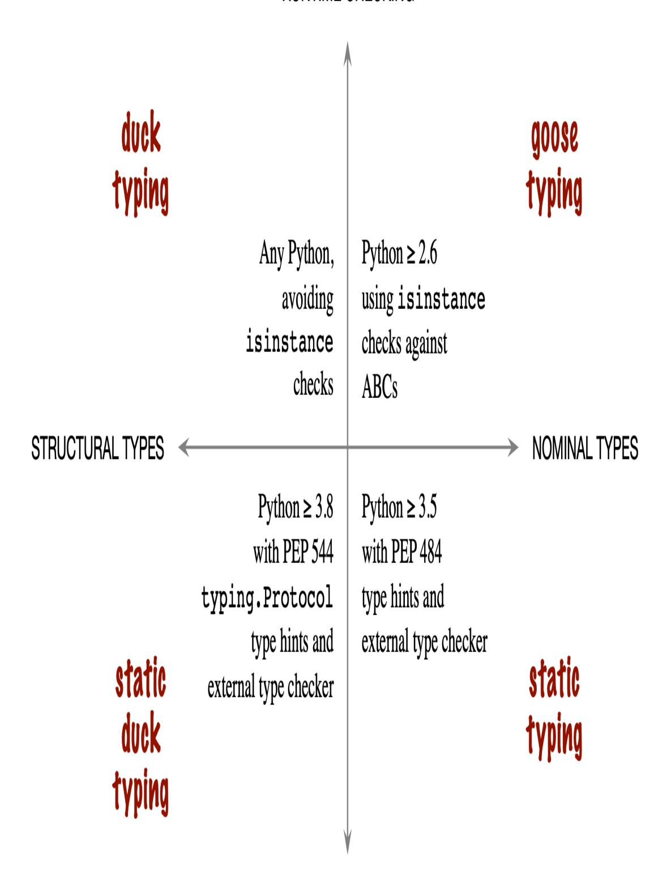
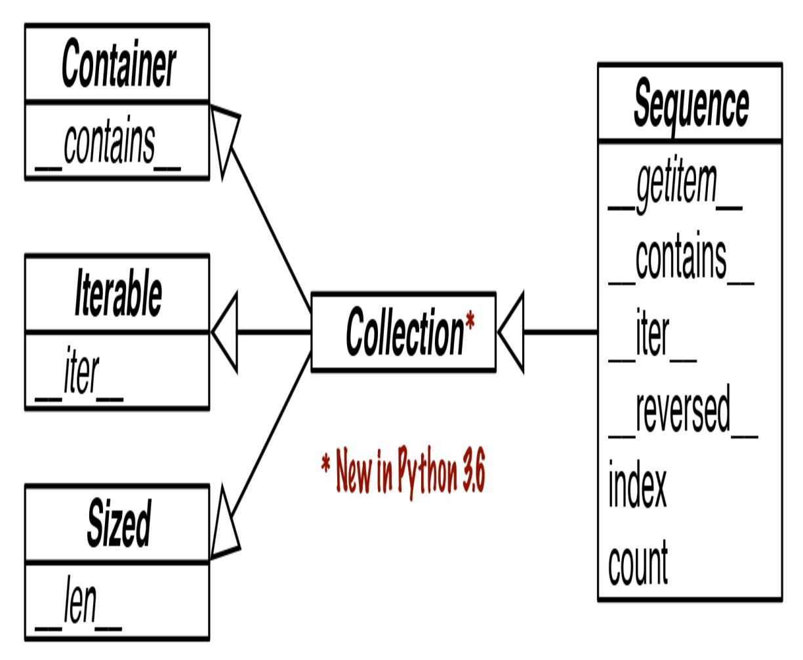
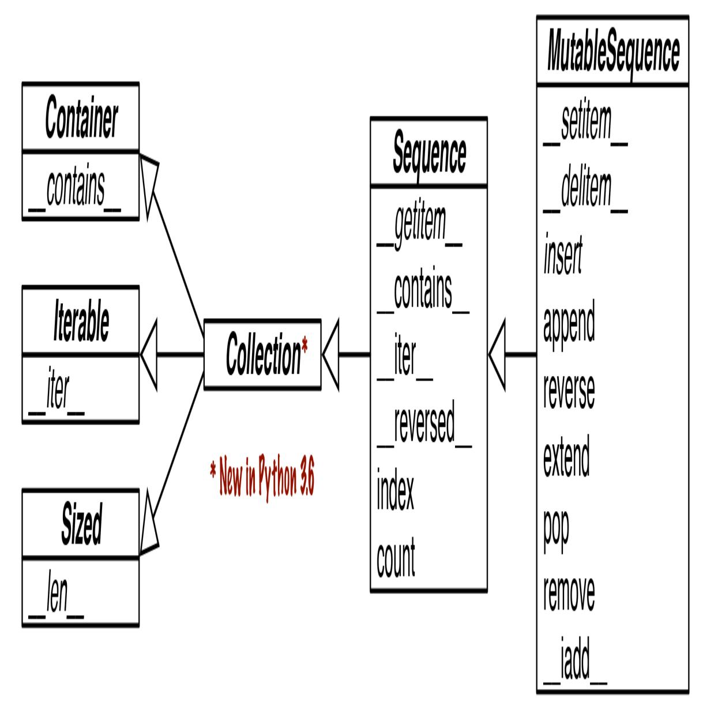
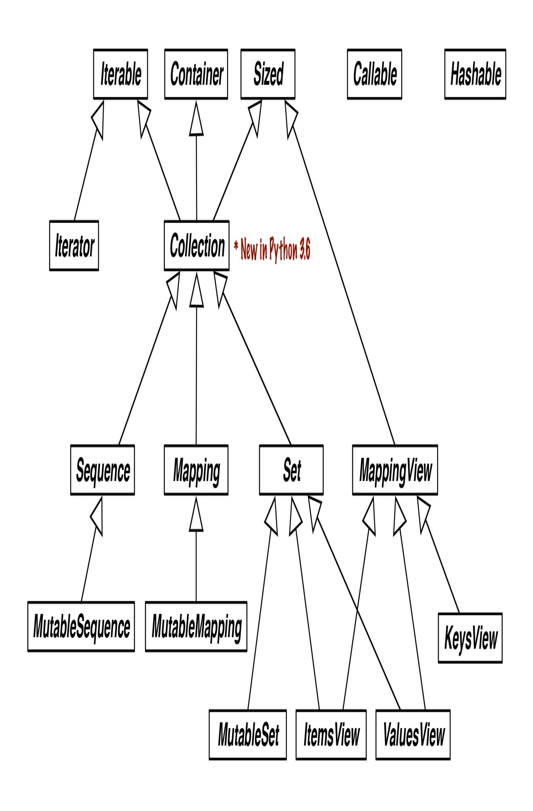
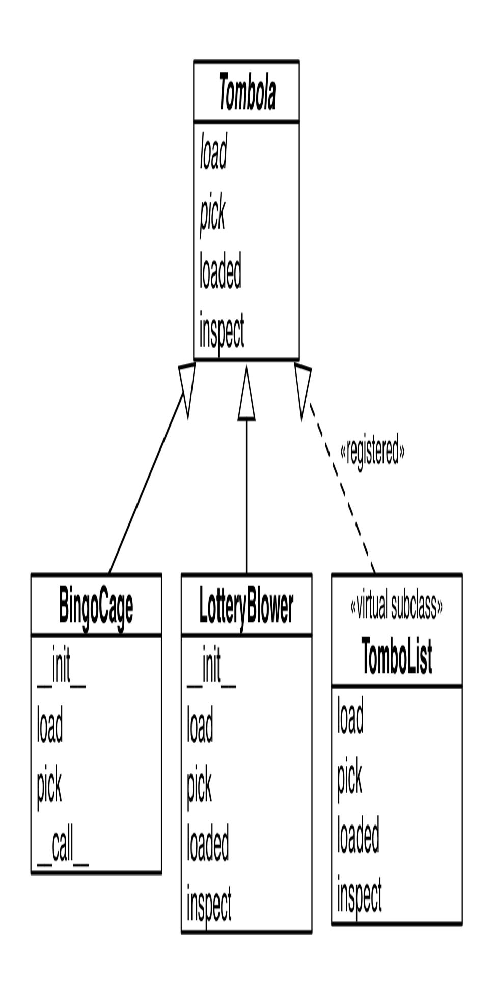
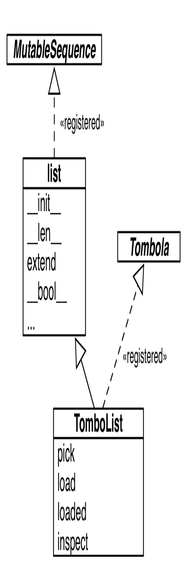
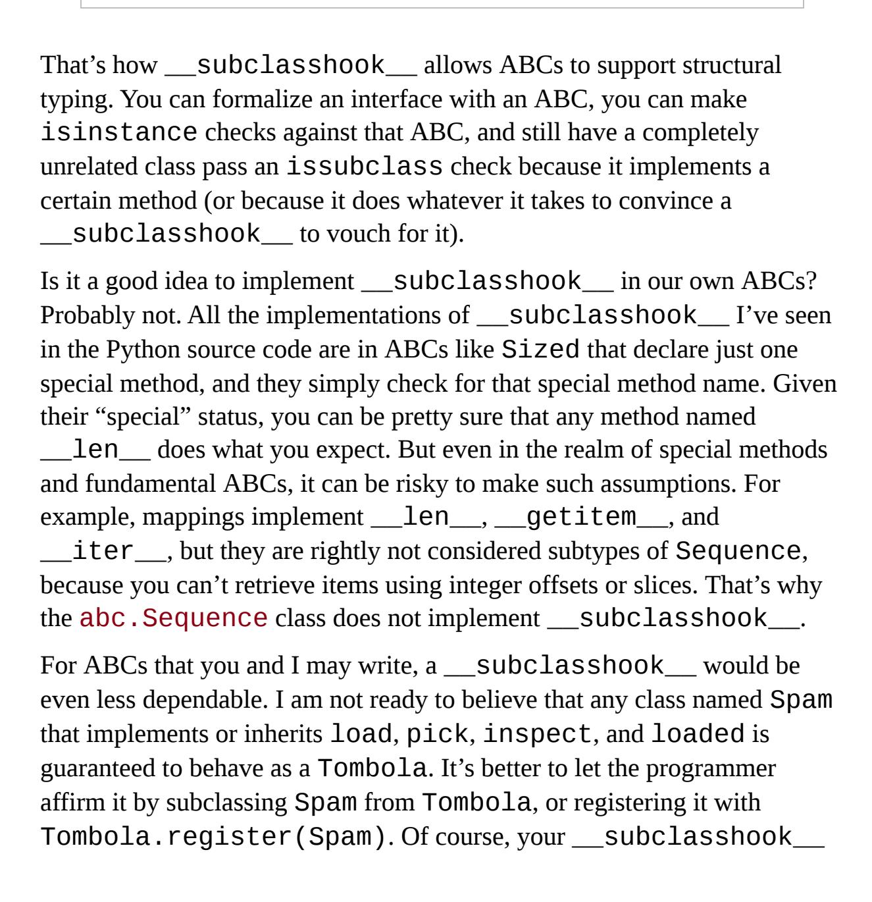
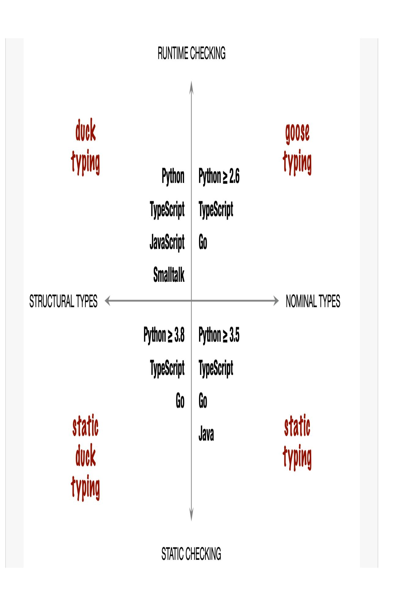

<span id="page-622-0"></span>
# Chapter 13: Interfaces, Protocols, and ABCs

## A NOTE FOR EARLY RELEASE READERS

With Early Release ebooks, you get books in their earliest form—the author's raw and unedited content as they write—so you can take advantage of these technologies long before the official release of these titles.

This will be the 13th chapter of the final book. Please note that the GitHub repo will be made active later on.

If you have comments about how we might improve the content and/or examples in this book, or if you notice missing material within this chapter, please reach out to the author at [fluentpython2e@ramalho.org.](mailto:fluentpython2e@ramalho.org)

*Program to an interface, not an implementation. [1](#page-698-0)*

> <span id="page-622-1"></span>—Gamma, Helm, Johnson, Vlissides, First Principle of Object-Oriented Design

Object-oriented programming is all about interfaces. The best approach to understanding a type in Python is knowing the methods it provides—its interface—as discussed in ["Types are defined by supported operations"](014-chapter-8-type-hints-in-functions.md#page-398-0) ([Chapter 8\)](014-chapter-8-type-hints-in-functions.md#page-388-0).

Depending on the programming language, we have one or more ways of defining and using interfaces. Since Python 3.8, we have four ways. They are depicted in the *Typing Map* (Figure 13-1). We can summarize them like this:

*duck typing*

Python's default approach to typing from the beginning. We've been studying duck typing since [Chapter 1](005-chapter-1-the-python-data-model.md#page-20-0).

## goose typing

The approach supported by Abstract Base Classes (ABCs) since Python 2.6, which relies on runtime checks of objects against ABCs. *Goose typing* is a major subject in this chapter.

## static typing

Traditional approach of statically-typed languages like C and Java; supported since Python 3.5 by the typing module, and enforced by external type checkers compliant with [PEP 484—Type Hints](https://www.python.org/dev/peps/pep-0484/). This is not the theme of this chapter. Most of [Chapter 8](014-chapter-8-type-hints-in-functions.md#page-388-0) and the upcoming [Chapter 15](022-chapter-15-more-about-type-hints.md#page-738-0) are about static typing.

## static duck typing

An approach made popular by the Go language; supported by subclasses of typing.Protocol—new in Python 3.8—also [enforced by external type checkers. We first saw this in "Static](014-chapter-8-type-hints-in-functions.md#page-433-0) Protocols" ([Chapter 8](014-chapter-8-type-hints-in-functions.md#page-388-0)).

<span id="page-623-0"></span>
## The Typing Map

## RUNTIME CHECKING



STATIC CHECKING

*Figure 13-1. The top half describes runtime type checking approaches using just the Python interpreter; the bottom requires an external static type checker such as MyPy or an IDE like PyCharm. The left quadrants cover typing based on the object's structure— i.e. the methods provided by the object, regardless of the name of its class or superclasses; the right quadrants depend on objects having explicitly named types: the name of the object's class, or the name of its superclasses.*

These four typing approaches are complementary: they have different pros and cons. It doesn't make sense to dismiss any of them.

Each of these four approaches rely on interfaces to work, but static typing can be done—poorly—using only concrete types instead of interface abstractions like protocols and Abstract Base Classes. This chapter is about duck typing, goose typing and static duck typing—typing disciplines that revolve around interfaces.

This chapter is split in four top sections, addressing three of the four quadrants in the *Typing Map* \(Figure 13-1\):

- ["Two kinds of protocols"](#page-626-0) compares the two forms of structural typing with protocols—i.e. the left-hand side of the *Typing Map*.
- ["Programming ducks"](#page-629-0) dives deeper into Python's usual duck typing, including how to make it safer while preserving its major strength: flexibility.
- ["Goose typing"](#page-638-0) explains the use of ABCs for stricter runtime type checking. This is the longest section, not because it's more important, but because there are more sections about *duck typing*, *static duck typing*, and *static typing* elsewhere in the book.
- ["Static protocols"](#page-672-1) covers usage, implementation and design of typing.Protocol subclasses—useful for static and runtime type checking.

<span id="page-625-0"></span>
## What's new in this chapter

This chapter was heavily edited and is about 24% longer than the corresponding *Chapter 11* in *Fluent Python, First Edition*. Although some sections and many paragraphs are the same, there's a lot of new content. These are the highlights:

- The chapter introduction and the *Typing Map* (Figure 13-1\) are new. That's the key to most new content in this chapter—and all other chapters related to typing in Python ≥ 3.8.
- ["Two kinds of protocols"](#page-626-0) explains the similarities and differences between dynamic and static protocols.
- ["Defensive programming and "fail fast""](#page-635-0) mostly reproduces content from the *First Edition*, but was updated and now has a section title to highlight its importance.
- ["Static protocols"](#page-672-1) is all new. It builds on the initial presentation in ["Static Protocols"](014-chapter-8-type-hints-in-functions.md#page-433-0) [\(Chapter 8](014-chapter-8-type-hints-in-functions.md#page-388-0)).
- I updated the UML class diagrams of collections.abc in [Figure 13-2,](#page-630-0) [Figure 13-3,](#page-646-0) and Figure 13-4 to include the Collection ABC added in Python 3.6.

*Fluent Python, First Edition* had a section encouraging use of the numbers ABCs for goose typing. In "The numbers ABCs and numeric [protocols", I explain why you should use numeric static protocols from t](#page-686-0)he typing module instead, if you plan to use static type checkers as well as runtime checks in the style of goose typing.

<span id="page-626-0"></span>
## Two kinds of protocols

The word *protocol* has different meanings in computer science depending on context. A network protocol such as HTTP specifies commands that a client can send to a server, such as GET, PUT, and HEAD. We saw in ["Protocols and Duck Typing"](019-chapter-12-writing-special-methods-for-sequences.md#page-583-0) that an object protocol specifies methods which an object must provide to fulfill a role. The FrenchDeck example in [Chapter 1](005-chapter-1-the-python-data-model.md#page-20-0) was demonstrated one object protocol, the sequence protocol: the methods that allow a Python object to behave as a sequence.

Implementing a full protocol may require several methods, but often it is OK to implement only part of it. Consider this Vowels class:

<span id="page-627-0"></span>*Example 13-1. Partial sequence protocol implementation with \_\_getitem\_\_.*

```
>>> class Vowels:
... def __getitem__(self, i):
... return 'AEIOU'[i]
...
>>> v = Vowels()
>>> v[0]
'A'
>>> v[-1]
'U'
>>> for c in v: print(c)
...
A
E
I
O
U
>>> 'E' in v
True
>>> 'Z' in v
False
Implementing __getitem__ is enough to allow retrieving items by
index, and also to support iteration and the in operator. The
__getitem__ special method is really the key to the sequence protocol.
Take a look at this entry from the Python/C API Reference Manual, section
Sequence Protocol:
int PySequence_Check(PyObject *o)
   Return 1 if the object provides sequence protocol, and 0 otherwise.
   Note that it returns 1 for Python classes with a __getitem__()
   method unless they are dict subclasses […]
```

We expect a sequence to also support len(), by implementing \_\_len\_\_. Vowels has no \_\_len\_\_ method, but it still behaves as a sequence in some contexts. And that may be enough for our purposes. That is why I like to say that a protocol is an "informal interface". That is also how protocols

are understood in Smalltalk, the first Object-Oriented programming environment to use that term.

Except in pages about network programming, most uses of the word "protocol" in the Python documentation refer to these informal interfaces.

[Now, with the adoption of PEP 544—Protocols: Structural subtyping \(static](https://www.python.org/dev/peps/pep-0544/) duck typing) in Python 3.8, the word "protocol" has another meaning in Python—closely related, but different. As we saw in ["Static Protocols"](014-chapter-8-type-hints-in-functions.md#page-433-0) ([Chapter 8\)](014-chapter-8-type-hints-in-functions.md#page-388-0), PEP 544 allows us to create subclasses of typing.Protocol to define one or more methods that a class must implement (or inherit) to satisfy a static type checker.

When I need to be specific, I will adopt these terms:

## dynamic protocol

The informal protocols Python always had. Dynamic protocols are implicit, defined by convention and described in the documentation. Python's most important dynamic protocols are supported by the interpreter itself, and are documented in the ["Data Model" chapter](http://docs.python.org/3/reference/datamodel.html) of *The Python Language Reference*.

## static protocol

[A protocol as defined by PEP 544—Protocols: Structural subtyping](https://www.python.org/dev/peps/pep-0544/) (static duck typing), since Python 3.8. A static protocol has an explicit definition: a typing.Protocol subclass.

There are two key differences between them:

- 1. An object may implement only part of a dynamic protocol and still be useful; but to fulfill a static protocol, the object must provide every method declared in the protocol class, even if your program doesn't need them all.
- 2. Static protocols can be verified by static type checkers, but dynamic protocols can't.

Both kinds of protocols share the essential characteristic that a class never needs to declare that it supports a protocol by name, i.e. by inheritance.

In addition to static protocols, Python provides another way of defining an explicit interface in code: an Abstract Base Class (ABC).

The rest of this chapter covers dynamic and static protocols, as well as ABCs.

<span id="page-629-0"></span>
## Programming ducks

Let's start our discussion of dynamic protocols with two of the most important in Python: the sequence and iterable protocols. The interpreter goes out of its way to handle objects that provide even a minimal implementation of those protocols, as the next section explains.

<span id="page-629-1"></span>
## Python Digs Sequences

The philosophy of the Python Data Model is to cooperate with essential dynamic protocols as much as possible. When it comes to sequences, Python tries hard to work with even the simplest implementations.

[Figure 13-2](#page-630-0) shows how the Sequence interface is formalized as an ABC. The Python interpreter and built-in sequences like list, str etc. do not rely on that ABC at all. I am using it only to describe what a full-fledged Sequence is expected to support.

<span id="page-630-0"></span>

*Figure 13-2. UML class diagram for the Sequence ABC and related abstract classes from collections.abc. Inheritance arrows point from subclass to its superclasses. Names in italic are abstract methods. Before Python 3.6, there was no Collection ABC—Sequence was a direct subclass of Container, Iterable, and Sized.*

## TIP

Most ABCs in the collections.abc module exist to formalize interfaces that are implemented by built-in objects and are implicitly supported by the interpreter—both of which predate the ABCs themselves. The ABCs are useful as starting points for new classes, and to support explicit type checking at runtime (a.k.a. *goose typing*) as well as type hints for static type checkers.

Studying [Figure 13-2,](#page-630-0) we see that a correct subclass of Sequence must implement \_\_getitem\_\_ and \_\_len\_\_ (from Sized). All the other

methods in Sequence are concrete, so subclasses can inherit their implementations—or provide better ones.

Now, recall the Vowels class in [Example 13-1](#page-627-0). It does not inherit from abc.Sequence and it only implements \_\_getitem\_\_.

There is no \_\_iter\_\_ method, yet Vowels instances are iterable because —as a fallback—if Python finds a \_\_getitem\_\_ method, it tries to iterate over the object by calling that method with integer indexes starting with 0. Because Python is smart enough to iterate over Vowels instances, it can also make the in operator work even when the \_\_contains\_\_ method is missing: it does a sequential scan to check if an item is present.

In summary, given the importance of sequence-like data structures, Python manages to make iteration and the in operator work by invoking \_\_getitem\_\_ when \_\_iter\_\_ and \_\_contains\_\_ are unavailable.

The original FrenchDeck from [Chapter 1](005-chapter-1-the-python-data-model.md#page-20-0) does not subclass abc.Sequence either, but it does implement both methods of the sequence protocol: \_\_getitem\_\_ and \_\_len\_\_. See [Example 13-2](#page-631-0).

<span id="page-631-0"></span>*Example 13-2. A deck as a sequence of cards (same as [Example 1-1](005-chapter-1-the-python-data-model.md#page-23-0))*

**import collections**

```
Card = collections.namedtuple('Card', ['rank', 'suit'])
class FrenchDeck:
 ranks = [str(n) for n in range(2, 11)] + list('JQKA')
 suits = 'spades diamonds clubs hearts'.split()
 def __init__(self):
 self._cards = [Card(rank, suit) for suit in self.suits
 for rank in self.ranks]
 def __len__(self):
 return len(self._cards)
 def __getitem__(self, position):
 return self._cards[position]
```

Several of the examples in [Chapter 1](005-chapter-1-the-python-data-model.md#page-20-0) work because of the special treatment Python gives to anything vaguely resembling a sequence. The iterable

protocol in Python represents an extreme form of duck typing: the interpreter tries two different methods to iterate over objects.

To be clear: the behaviors I described in this section are implemented in the interpreter itself, mostly in C. They do not depend on methods from the Sequence ABC. For example, the concrete methods \_\_\_iter\_\_ and \_\_contains\_\_ in the Sequence class emulate the built-in behaviors of the Python interpreter. If you are curious, check source code of these methods in *Lib/\_collections\_abc.py*.

Now let's study another example emphasizing the dynamic nature of protocols—and why static type checkers have no chance of dealing with them.

<span id="page-632-1"></span>
## Monkey-Patching: Implementing a Protocol at Runtime

<span id="page-632-0"></span>
### NOTE

Monkey patching is dynamically changing a module, class, or function at runtime, to add features or fix bugs. Because it does not change the source code like a regular patch, a monkey patch only affects the currently running instance of the program. The *gevent* networking library monkey patches parts of Python's standard library to allow lightweight concurrency without threads or async/await. Be aware that monkey patches depend on implementation details of the patched code, so they can easily break when libraries are updated.

The FrenchDeck class from Example 13-2 is missing an essential feature: it cannot be shuffled. Years ago when I first wrote the FrenchDeck example I did implement a Shuffle method. Later I had a Pythonic insight: if a FrenchDeck acts like a sequence, then it doesn't need its own Shuffle method because there is already random. Shuffle, documented as "Shuffle the sequence x in place."

The standard random, shuffle function is used like this:

```
>>> from random import shuffle
>>> l = list(range(10))
```

```
>>> shuffle(l)
>>> l
[5, 2, 9, 7, 8, 3, 1, 4, 0, 6]
```

## TIP

When you follow established protocols, you improve your chances of leveraging existing standard library and third-party code, thanks to duck typing.

However, if we try to shuffle a FrenchDeck instance, we get an exception, as in [Example 13-3](#page-633-0).

<span id="page-633-0"></span>
## Example 13-3. random.shuffle cannot handle FrenchDeck

```
>>> from random import shuffle
>>> from frenchdeck import FrenchDeck
>>> deck = FrenchDeck()
>>> shuffle(deck)
Traceback (most recent call last):
 File "<stdin>", line 1, in <module>
 File ".../random.py", line 265, in shuffle
 x[i], x[j] = x[j], x[i]
TypeError: 'FrenchDeck' object does not support item assignment
```

The error message is clear: "'FrenchDeck' object does not support item assignment." The problem is that shuffle operates *in place*, by swapping items inside the collection, and FrenchDeck only implements the *immutable* sequence protocol. Mutable sequences must also provide a \_\_setitem\_\_ method.

Because Python is dynamic, we can fix this at runtime, even at the interactive console. [Example 13-4](#page-633-1) shows how to do it.

<span id="page-633-1"></span>*Example 13-4. Monkey patching FrenchDeck to make it mutable and compatible with random.shuffle (continuing from [Example 13-3](#page-633-0))*

```
>>> def set_card(deck, position, card): 
... deck._cards[position] = card
...
>>> FrenchDeck.__setitem__ = set_card 
>>> shuffle(deck) 
>>> deck[:5]
[Card(rank='3', suit='hearts'), Card(rank='4', suit='diamonds'),
```

```
Card(rank='4',
suit='clubs'), Card(rank='7', suit='hearts'), Card(rank='9',
suit='spades')]
```

- Create a function that takes deck, position, and card as arguments.
- Assign that function to an attribute named \_\_setitem\_\_ in the FrenchDeck class.
- deck can now be shuffled because I added the necessary method of the mutable sequence protocol.

The signature of the \_\_setitem\_\_ special method is defined in *The Python Language Reference* in ["3.3.6. Emulating container types".](http://bit.ly/1QOyDQY) Here I named the arguments deck, position, card—and not self, key, value as in the language reference—to show that every Python method starts life as a plain function, and naming the first argument self is merely a convention. This is OK in a console session, but in a Python source file it's much better to use self, key, and value as documented.

The trick is that set\_card knows that the deck object has an attribute named \_cards, and \_cards must be a mutable sequence. The set\_card function is then attached to the FrenchDeck class as the \_\_setitem\_\_ special method. This is an example of *monkey patching*: changing a class or module at runtime, without touching the source code. Monkey patching is powerful, but the code that does the actual patching is very tightly coupled with the program to be patched, often handling private and undocumented attributes.

Besides being an example of monkey patching, [Example 13-4](#page-633-1) highlights the dynamic nature of protocols in dynamic duck typing: random.shuffle doesn't care about the class of the argument, it only needs the object to implement methods from the mutable sequence protocol. It doesn't even matter if the object was "born" with the necessary methods or if they were somehow acquired later.

Duck typing doesn't need to be wildly unsafe or hard to debug. The next section shows some useful code patterns to detect dynamic protocols without resorting to explicit checks.

<span id="page-635-0"></span>
## Defensive programming and "fail fast"

Defensive programming is like defensive driving: a set of practices to enhance safety even when faced with careless programmers—or drivers.

<span id="page-635-1"></span>Many bugs cannot be caught except at runtime—even in mainstream statically typed languages. In a dynamically typed language, "fail fast" is excellent advice for safer and easier to maintain programs. Failing fast means raising runtime errors as soon as possible, for example, rejecting invalid arguments right a the beginning of a function body. [3](#page-698-2)

Here is one example: when you write code that accepts a sequence of items to process internally as a list, don't enforce a list argument by type checking. Instead, take the argument and immediately build a list from it. [One example of this code pattern is the](#page-663-0) \_\_init\_\_ method in Example 13- 10, later in this chapter:

```
 def __init__(self, iterable):
 self._balls = list(iterable)
```

That way you make your code more flexible, because the list() constructor handles any iterable that fits in memory. If the argument is not iterable, the call will fail fast with a very clear TypeError exception, right when the object is initialized. If you want to be more explict, you can wrap the list() call with try/except to customize the error message —but I'd use that extra code only on an external API, because the problem would be easy to see for maintainers of the codebase. Either way, the offending call will appear near the end of the traceback, making it straightforward to fix. If you don't catch the invalid argument in the class constructor, the program will blow up later, when some other method of the class needs to operate on self.\_balls and it is not a list. Then the root cause will be harder to find.

Of course, calling list() on the argument would be bad if the data shouldn't be copied, either because it's too large or because the function, by design, needs to change it in place for the benefit of the caller, like random.shuffle does. In that case, a runtime check like isinstance(x, abc.MutableSequence) would be the way to go.

If you are afraid to get an infinite generator—not a common issue—you can begin by calling len() on the argument. This would reject iterators, while safely dealing with tuples, arrays, and other existing or future classes that fully implement the Sequence interface. Calling len() is usually very cheap and an invalid argument will raise an error immediately.

On the other hand, if any iterable is acceptable, then call iter(x) as soon [as possible to obtain an iterator, as we'll see in "Why Sequences Are](024-chapter-17-iterables-iterators-and-generators.md#page-844-0) Iterable: The iter Function". Again, if x is not iterable this will fail fast with an easy to debug exception.

In the cases I just described, a type hint could catch some problems earlier, but not all problems. Recall that the type Any is *consistent-with* every other type. Type inference may cause a variable to be tagged with the Any type. When that happens, the type checker is in the dark. In addition, type hints are not enforced at runtime. Fail fast is the last line of defense.

Defensive code leveraging duck types can also include logic to handle different types without using isinstance() or hasattr() tests.

One example is how we might emulate the handling of the field\_names argument in [collections.namedtuple](https://docs.python.org/3/library/collections.html#collections.namedtuple): field\_names accepts a single string with identifiers separated by spaces or commas, or a sequence of identifiers. [Example 13-5](#page-636-0) shows how I'd do it using duck typing.

<span id="page-636-0"></span>*Example 13-5. Duck typing to handle a string or an iterable of strings*

```
 try: 
 field_names = field_names.replace(',', ' ').split() 
 except AttributeError: 
 pass 
 field_names = tuple(field_names) 
 if not all(s.isidentifier() for s in field_names):
```

```
 raise ValueError('field_names must all be valid
identifiers')
```

- Assume it's a string (EAFP = it's easier to ask forgiveness than permission).
- Convert commas to spaces and split the result into a list of names.
- Sorry, field\_names doesn't quack like a str: it has no .replace, or it returns something we can't .split.
- If AttributeError was raised, then field\_names is not a str and we assume it was already an iterable of names.
- To make sure it's an iterable and to keep our own copy, create a tuple out of what we have. A tuple is more compact than list, and it also prevents my code from changing the names by mistake.
- Use str.isidentifier to ensure every name is a valid.

[Example 13-5](#page-636-0) shows one situation where duck typing is more expressive than static type hints. There is no way to spell a type hint that says "field\_names must be a string of identifiers separated by spaces or commas". This is the relevant part of the namedtuple signature on typeshed: (see full source at [stdlib/3/collections/](https://bit.ly/3iDoafU)*init*.pyi):

```
 def namedtuple(
 typename: str,
 field_names: Union[str, Iterable[str]],
 *,
 # rest of signature omitted
```

As you can see, field\_names is annotated as Union[str, Iterable[str]] which is OK as far as it goes, but is not enough to catch all possible problems.

After reviewing dynamic protocols, we move to a more explicit form of runtime type checking: goose typing.

<span id="page-638-0"></span>
## Goose typing

*An abstract class represents an interface. [4](#page-698-3)*

<span id="page-638-1"></span>—Bjarne Stroustrup, Creator of C++

Python doesn't have an interface keyword. We use Abstract Base Classes (ABCs) to define explicit interfaces.

The *Python Glossary* entry for [abstract base class](https://docs.python.org/3/glossary.html#term-abstract-base-class) has a good explanation of the value they bring to duck-typed languages:

*abstract base class*

Abstract base classes complement duck-typing by providing a way to define interfaces when other techniques like hasattr() would be clumsy or subtly wrong (for example with magic methods). ABCs introduce virtual subclasses, which are classes that don't inherit from a class but are still recognized by isinstance() and issubclass(); see the abc module documentation. [5](#page-699-0)

Goose typing is a runtime type checking approach that leverages ABCs. I will let Alex Martelli explain in ["Waterfowl and ABCs"](#page-639-0).

<span id="page-638-2"></span>
## NOTE

I am very grateful to my friends Alex Martelli and Anna Ravenscroft. I showed them the first outline of *Fluent Python* at OSCON 2013 and they encouraged me to submit it for publication with O'Reilly. Both later contributed with thorough tech reviews. Alex was already the most cited person in this book, and then he offered to write this essay. Take it away, Alex!

## WATERFOWL AND ABCS

<span id="page-639-0"></span>
## By Alex Martelli

I've been [credited on Wikipedia](http://en.wikipedia.org/wiki/Duck_typing#History) for helping spread the helpful meme and sound-bite "*duck typing*" (i.e, ignoring an object's actual type, focusing instead on ensuring that the object implements the method names, signatures, and semantics required for its intended use).

In Python, this mostly boils down to avoiding the use of isinstance to check the object's type (not to mention the even worse approach of checking, for example, whether type(foo) is bar—which is rightly anathema as it inhibits even the simplest forms of inheritance!).

The overall *duck typing* approach remains quite useful in many contexts —and yet, in many others, an often preferable one has evolved over time. And herein lies a tale…

In recent generations, the taxonomy of genus and species (including but not limited to the family of waterfowl known as Anatidae) has mostly been driven by *phenetics*—an approach focused on similarities of morphology and behavior… chiefly, *observable* traits. The analogy to "duck typing" was strong.

However, parallel evolution can often produce similar traits, both morphological and behavioral ones, among species that are actually unrelated, but just happened to evolve in similar, though separate, ecological niches. Similar "accidental similarities" happen in programming, too—for example, consider the classic OOP example:

```
class Artist:
 def draw(self): ...
class Gunslinger:
 def draw(self): ...
class Lottery:
 def draw(self): ...
```

Clearly, the mere existence of a method named draw, callable without arguments, is far from sufficient to assure us that two objects x and y such that x.draw() and y.draw() can be called are in any way exchangeable or abstractly equivalent—nothing about the similarity of the semantics resulting from such calls can be inferred. Rather, we need a knowledgeable programmer to somehow positively *assert* that such an equivalence holds at some level!

In biology (and other disciplines) this issue has led to the emergence (and, on many facets, the dominance) of an approach that's an alternative to phenetics, known as *cladistics*—focusing taxonomical choices on characteristics that are inherited from common ancestors, rather than ones that are independently evolved. (Cheap and rapid DNA sequencing can make cladistics highly practical in many more cases, in recent years.)

For example, sheldgeese (once classified as being closer to other geese) and shelducks (once classified as being closer to other ducks) are now grouped together within the subfamily Tadornidae (implying they're closer to each other than to any other Anatidae, as they share a closer common ancestor). Furthermore, DNA analysis has shown, in particular, that the white-winged wood duck is not as close to the Muscovy duck (the latter being a shelduck) as similarity in looks and behavior had long suggested—so the wood duck was reclassified into its own genus, and entirely out of the subfamily!

Does this matter? It depends on the context! For such purposes as deciding how best to cook a waterfowl once you've bagged it, for example, specific observable traits (not all of them—plumage, for example, is de minimis in such a context), mostly texture and flavor (old-fashioned phenetics!), may be far more relevant than cladistics. But for other issues, such as susceptibility to different pathogens (whether you're trying to raise waterfowl in captivity, or preserve them in the wild), DNA closeness can matter much more…

So, by very loose analogy with these taxonomic revolutions in the world of waterfowls, I'm recommending supplementing (not entirely replacing—in certain contexts it shall still serve) good old *duck typing* with… *goose typing*!

What *goose typing* means is: isinstance(obj, cls) is now just fine… as long as cls is an abstract base class—in other words, cls's metaclass is abc.ABCMeta.

<span id="page-641-0"></span>You can find many useful existing abstract classes in collections.abc (and additional ones in the numbers module of *The Python Standard Library*). [6](#page-699-1)

Among the many conceptual advantages of ABCs over concrete classes [\(e.g., Scott Meyer's "all non-leaf classes should be abstract"—see Item](http://ptgmedia.pearsoncmg.com/images/020163371x/items/item33.html) 33 in his book, *More Effective C++*), Python's ABCs add one major practical advantage: the register class method, which lets end-user code "declare" that a certain class becomes a "virtual" subclass of an ABC (for this purpose the registered class must meet the ABC's method name and signature requirements, and more importantly the underlying semantic contract—but it need not have been developed with any awareness of the ABC, and in particular need not inherit from it!). This goes a long way toward breaking the rigidity and strong coupling that make inheritance something to use with much more caution than typically practiced by most OOP programmers…

Sometimes you don't even need to register a class for an ABC to recognize it as a subclass!

That's the case for the ABCs whose essence boils down to a few special methods. For example:

```
>>> class Struggle:
... def __len__(self): return 23
...
>>> from collections import abc
>>> isinstance(Struggle(), abc.Sized)
True
```

As you see, abc.Sized recognizes Struggle as "a subclass," with no need for registration, as implementing the special method named \_\_len\_\_ is all it takes (it's supposed to be implemented with the proper syntax—callable without arguments—and semantics—returning a nonnegative integer denoting an object's "length"; any code that implements a specially named method, such as \_\_len\_\_, with arbitrary, non-compliant syntax and semantics has much worse problems anyway).

So, here's my valediction: whenever you're implementing a class embodying any of the concepts represented in the ABCs in numbers, collections.abc, or other framework you may be using, be sure (if needed) to subclass it from, or register it into, the corresponding ABC. At the start of your programs using some library or framework defining classes which have omitted to do that, perform the registrations yourself; then, when you must check for (most typically) an argument being, e.g, "a sequence," check whether:

```
isinstance(the_arg, collections.abc.Sequence)
```

And, *don't* define custom ABCs (or metaclasses) in production code… if you feel the urge to do so, I'd bet it's likely to be a case of "all problems look like a nail"-syndrome for somebody who just got a shiny new hammer—you (and future maintainers of your code) will be much happier sticking with straightforward and simple code, eschewing such depths. *Valē!*

## To summarize, *goose typing* entails:

- Subclassing from ABCs to make it explict that you are implementing a previously defined interface.
- Runtime type checking using ABCs instead of concrete classes as the second argument for isinstance and issubclass.

Alex makes the point that inheriting from an ABC is more than implementing the required methods: it's also a clear declaration of intent by the developer. That intent can also be made explicit through registering a virtual subclass.

## NOTE

Details of using register are covered in ["A Virtual Subclass of an ABC"](#page-665-0), later in this chapter. For now, here is a brief example: given the FrenchDeck class, if I want it to pass a check like issubclass(FrenchDeck, Sequence), I can make it a *virtual subclass* of the Sequence ABC with these lines:

**from collections.abc import** Sequence Sequence.register(FrenchDeck)

The use of isinstance and issubclass becomes more acceptable if you are checking against ABCs instead of concrete classes. If used with concrete classes, type checks limit polymorphism—an essential feature of object oriented programming. But with ABCs these tests are more flexible. After all, if a component does not implement an ABC by subclassing—but does implement the required methods— it can always be registered after the fact so it passes those explicit type checks.

However, even with ABCs, you should beware that excessive use of isinstance checks may be a *code smell*—a symptom of bad OO design.

It's usually *not* OK to have a chain of if/elif/elif with isinstance checks performing different actions depending on the type of an object: you should be using polymorphism for that—i.e., design your classes so that the interpreter dispatches calls to the proper methods, instead of you hardcoding the dispatch logic in if/elif/elif blocks.

On the other hand, it's OK to perform an isinstance check against an ABC if you must enforce an API contract: "Dude, you have to implement this if you want to call me," as technical reviewer Lennart Regebro put it.

That's particularly useful in systems that have a plug-in architecture. Outside of frameworks, duck typing is often simpler and more flexible than type checks.

Finally, in his essay, Alex reinforces more than once the need for restraint in the creation of ABCs. Excessive use of ABCs would impose ceremony in a language that became popular because it is practical and pragmatic. During the *Fluent Python* review process, Alex wrote in an e-mail:

*ABCs are meant to encapsulate very general concepts, abstractions, introduced by a framework—things like "a sequence" and "an exact number." [Readers] most likely don't need to write any new ABCs, just use existing ones correctly, to get 99.9% of the benefits without serious risk of misdesign.*

Now let's see goose typing in practice.

<span id="page-644-1"></span>
## Subclassing an ABC

Following Martelli's advice, we'll leverage an existing ABC, collections.MutableSequence, before daring to invent our own. In [Example 13-6,](#page-644-0) FrenchDeck2 is explicitly declared a subclass of collections.MutableSequence.

<span id="page-644-0"></span>*Example 13-6. frenchdeck2.py: FrenchDeck2, a subclass of collections.MutableSequence*

```
import collections
from collections.abc import MutableSequence
Card = collections.namedtuple('Card', ['rank', 'suit'])
class FrenchDeck2(MutableSequence):
 ranks = [str(n) for n in range(2, 11)] + list('JQKA')
 suits = 'spades diamonds clubs hearts'.split()
 def __init__(self):
 self._cards = [Card(rank, suit) for suit in self.suits
 for rank in self.ranks]
 def __len__(self):
 return len(self._cards)
```

```
 def __getitem__(self, position):
 return self._cards[position]
 def __setitem__(self, position, value): 
 self._cards[position] = value
 def __delitem__(self, position): 
 del self._cards[position]
 def insert(self, position, value): 
 self._cards.insert(position, value)
```

- \_\_setitem\_\_ is all we need to enable shuffling…
- But subclassing MutableSequence forces us to implement \_\_delitem\_\_, an abstract method of that ABC.
- We are also required to implement insert, the third abstract method of MutableSequence.

Python does not check for the implementation of the abstract methods at import time (when the *frenchdeck2.py* module is loaded and compiled), but only at runtime when we actually try to instantiate FrenchDeck2. Then, if we fail to implement any of the abstract methods, we get a TypeError exception with a message such as "Can't instantiate abstract class FrenchDeck2 with abstract methods \_\_delitem\_\_, insert". That's why we must implement \_\_delitem\_\_ and insert, even if our FrenchDeck2 examples do not need those behaviors: the MutableSequence ABC demands them.

As [Figure 13-3](#page-646-0) shows, not all methods of the Sequence and MutableSequence ABCs are abstract.

<span id="page-646-0"></span>

*Figure 13-3. UML class diagram for the MutableSequence ABC and its superclasses from collections.abc (inheritance arrows point from subclasses to ancestors; names in italic are abstract classes and abstract methods)*

To write FrenchDeck2 as a subclass of MutableSequence, I had to pay the price of implementing \_\_delitem\_\_ and insert, which my examples did not require. In return, FrenchDeck2 inherits five concrete methods from Sequence: \_\_contains\_\_, \_\_iter\_\_, \_\_reversed\_\_, index, and count. From MutableSequence, it gets another six methods: append, reverse, extend, pop, remove,

and \_\_iadd\_\_—which supports the += operator for in-place concatenation.

The concrete methods in each collections.abc ABC are implemented in terms of the public interface of the class, so they work without any knowledge of the internal structure of instances.

## TIP

As the coder of a concrete subclass, you may be able to override methods inherited from ABCs with more efficient implementations. For example, \_\_contains\_\_ works by doing a sequential scan of the sequence, but if your concrete sequence keeps its items sorted, you can write a faster \_\_contains\_\_ that does a binary search using bisect function (see [Link to Come]).

To use ABCs well, you need to know what's available. We'll review the collections ABCs next.

<span id="page-647-0"></span>
## ABCs in the Standard Library

Since Python 2.6, the standard library provides several ABCs. Most are defined in the collections.abc module, but there are others. You can find ABCs in the io and numbers packages, for example. But the most widely used are in collections.abc.

## TIP

There are two modules named abc in the standard library. Here we are talking about collections.abc. To reduce loading time, since Python 3.4 that module is implemented outside of the collections package—in *[Lib/\\_collections\\_abc.py](https://bit.ly/3ivVeXi)*—so it's imported separately from collections. The other abc module is just abc (i.e., *[Lib/abc.py](https://github.com/python/cpython/blob/master/Lib/abc.py)*) where the abc.ABC class is defined. Every ABC depends on the abc module, but we don't need to import it ourselves except to create a brand-new ABC.

<span id="page-648-0"></span>Figure 13-4 is a summary UML class diagram (without attribute names) of 17 ABCs defined in collections.abc. The documentation of collections.abc has [a nice table](http://bit.ly/1QOA9T8) summarizing the ABCs, their relationships, and their abstract and concrete methods (called "mixin methods"). There is plenty of multiple inheritance going on in Figure 13-4. We'll devote most of [Chapter 14](021-chapter-14-inheritance-for-good-or-for-worse.md#page-701-0) to multiple inheritance, but for now it's enough to say that it is usually not a problem when ABCs are concerned.[7](#page-699-2)



Let's review the clusters in Figure 13-4:

## Iterable, Container, Sized

Every collection should either inherit from these ABCs or implement compatible protocols. Iterable supports iteration with \_\_iter\_\_, Container supports the in operator with \_\_contains\_\_, and Sized supports len() with \_\_len\_\_.

## Collection

This ABC has no methods of its own, but was added in Python 3.6 to make it easier to subclass from Iterable, Container, and Sized.

## Sequence, Mapping, Set

These are the main immutable collection types, and each has a mutable [subclass. A detailed diagram for](#page-646-0) MutableSequence is in Figure 13- 3; for MutableMapping and MutableSet, there are diagrams in [Chapter 3](008-chapter-3-dictionaries-and-sets.md#page-140-0) (Figures [3-1](008-chapter-3-dictionaries-and-sets.md#page-148-0) and [3-2\)](008-chapter-3-dictionaries-and-sets.md#page-179-0).

## MappingView

In Python 3, the objects returned from the mapping methods .items(), .keys(), and .values() implement the interfaces defined in ItemsView, KeysView, and ValuesView, respectively. The first two also implement the rich interface of Set, with all the operators we saw in ["Set Operations".](008-chapter-3-dictionaries-and-sets.md#page-178-0)

## Iterator

Note that iterator subclasses Iterable. We discuss this further in [Chapter 17.](024-chapter-17-iterables-iterators-and-generators.md#page-840-0)

After looking at some existing ABCs, let's practice goose typing by implementing an ABC from scratch and putting it to use. The goal here is not to encourage everyone to start creating ABCs left and right, but to learn how to read the source code of the ABCs you'll find in the standard library and other packages.

## Callable, Hashable

These are not collections, but collections.abc was the first package to define ABCs in the standard library, and these two were deemed important enough to be included. They support type checking objects that must be callable or hashable.

For callable detection, the callable(obj) built-in function is more convenient than insinstance(obj, Callable).

If insinstance(obj, Hashable) returns False, you can be certain that obj is not hashable. But if the return is True, it may be a false positive. The next box explains.

## ISINSTANCE WITH HASHABLE AND ITERABLE CAN BE MISLEADING

It's easy to misinterpret the results of the isinstance and issubclass tests against the Hashable and Iterable ABCs.

If isinstance(obj, Hashable) returns True, that only means that the class of obj implements or inherits \_\_hash\_\_. But if obj is a tuple containing unhashable items, then obj is not hashable, despite the positive result of the isinstance check. Tech reviewer Jürgen Gmach pointed out that duck typing provides the most accurate way to determine if an instance is hashable: call hash(obj). That call will raise TypeError if obj is not hashable.

On the other hand, even when isinstance(obj, Iterable) returns False, Python may still be able to iterate over obj using \_\_getitem\_\_ with 0-based indices, as we saw in [Chapter 1](005-chapter-1-the-python-data-model.md#page-20-0) and ["Python Digs Sequences".](#page-629-1) The documentation for [collections.abc.Iterable](https://docs.python.org/3/library/collections.abc.html#collections.abc.Iterable) states:

*The only reliable way to determine whether an object is iterable is to call iter(obj).*

<span id="page-652-0"></span>
## Defining and Using an ABC

## TIP

This warning appeared in the *Interfaces* chapter of *Fluent Python, First Edition*:

*ABCs, like descriptors and metaclasses, are tools for building frameworks. Therefore, only a small minority of Python developers can create ABCs without imposing unreasonable limitations and needless work on fellow programmers.*

Now ABCs have more potential use cases in type hints to support static typing. As discussed in ["Abstract Base Classes"](014-chapter-8-type-hints-in-functions.md#page-422-0), using ABCs instead of concrete types in function argument type hints gives more flexibility to the caller.

To justify creating an ABC, we need to come up with a context for using it as an extension point in a framework. So here is our context: imagine you need to display advertisements on a website or a mobile app in random order, but without repeating an ad before the full inventory of ads is shown. Now let's assume we are building an ad management framework called ADAM. One of its requirements is to support user-provided non-repeating random-picking classes. To make it clear to ADAM users what is expected of a "non-repeating random-picking" component, we'll define an ABC. [8](#page-699-3)

<span id="page-653-0"></span>In the literature about data structures, "stack" and "queue" describe abstract interfaces in terms of physical arrangements of objects. I will follow suit and use a real-world metaphor to name our ABC: bingo cages and lottery blowers are machines designed to pick items at random from a finite set, without repeating, until the set is exhausted.

The ABC will be named Tombola, after the Italian name of bingo and the tumbling container that mixes the numbers.

The Tombola ABC has four methods. The two abstract methods are:

*.load(…)* put items into the container.

*.pick()*

remove one item at random from the container, returning it.

The concrete methods are:

*.loaded()*

return True if there is at least one item in the container.

*.inspect()*

return a tuple built from the items currently in the container, without changing its contents (the internal ordering is not preserved).

Figure 13-5 shows the Tombola ABC and three concrete implementations.



<span id="page-656-1"></span>*Figure 13-5. UML diagram for an ABC and three subclasses. The name of the Tombola ABC and its abstract methods are written in italics, per UML conventions. The dashed arrow is used for interface implementation—here I am using it to show that TomboList not only implements the Tombola interface, but is also registered as virtual subclass of Tombola—as we will see later in this chapter. [9](#page-699-4)*

## Example 13-7 shows the definition of the Tombola ABC.

<span id="page-656-0"></span>*Example 13-7. tombola.py: Tombola is an ABC with two abstract methods and two concrete methods*

```
import abc
class Tombola(abc.ABC): 
 @abc.abstractmethod
 def load(self, iterable): 
 """Add items from an iterable."""
 @abc.abstractmethod
 def pick(self): 
 """Remove item at random, returning it.
 This method should raise `LookupError` when the instance is
empty.
 """
 def loaded(self): 
 """Return `True` if there's at least 1 item, `False`
otherwise."""
 return bool(self.inspect()) 
 def inspect(self):
 """Return a sorted tuple with the items currently
inside."""
 items = []
 while True: 
 try:
 items.append(self.pick())
 except LookupError:
 break
 self.load(items) 
 return tuple(items)
```

To define an ABC, subclass abc.ABC.

<span id="page-657-0"></span>An abstract method is marked with the @abstractmethod decorator, and often its body is empty except for a docstring. [10](#page-699-5)

- The docstring instructs implementers to raise LookupError if there are no items to pick.
- An ABC may include concrete methods.
- Concrete methods in an ABC must rely only on the interface defined by the ABC (i.e., other concrete or abstract methods or properties of the ABC).
- We can't know how concrete subclasses will store the items, but we can build the inspect result by emptying the Tombola with successive calls to .pick()…
- …then use .load(…) to put everything back.

## TIP

An abstract method can actually have an implementation. Even if it does, subclasses will still be forced to override it, but they will be able to invoke the abstract method with super()[, adding functionality to it instead of implementing from scratch. See the](https://docs.python.org/3/library/abc.html) abc module documentation for details on @abstractmethod usage.

The code for the .inspect() method in [Example 13-7](#page-656-0) is silly but it shows that we can rely on .pick() and .load(…) to inspect what's inside the Tombola by picking all items and loading them back—without knowing how the items are actually stored. The point of this example is to highlight that it's OK to provide concrete methods in ABCs, as long as they only depend on other methods in the interface. Being aware of their internal data structures, concrete subclasses of Tombola may always override .inspect() with a smarter implementation, but they don't have to.

The .loaded() method in [Example 13-7](#page-656-0) has one line, but it's expensive: it calls .inspect() to build the tuple just to apply bool() on it. This works, but a concrete subclass can do much better, as we'll see.

Note that our roundabout implementation of .inspect() requires that we catch a LookupError thrown by self.pick(). The fact that self.pick() may raise LookupError is also part of its interface, but there is no way to make this explicit in Python, except in the documentation (see the docstring for the abstract pick method in [Example 13-7.](#page-656-0))

I chose the LookupError exception because of its place in the Python hierarchy of exceptions in relation to IndexError and KeyError, the most likely exceptions to be raised by the data structures used to implement a concrete Tombola. Therefore, implementations can raise LookupError, IndexError, KeyError, or a custom subclass of LookupError to comply. See Figure 13-6.

- <span id="page-660-1"></span>➊ LookupError is the exception we handle in Tombola.inspect;
- ➋ IndexError is the LookupError subclass raised when we try to get an item from a sequence with an index beyond the last position;
- ➌ KeyError is raised when we use a nonexistent key to get an item from a mapping.

We now have our very own Tombola ABC. To witness the interface checking performed by an ABC, let's try to fool Tombola with a defective implementation in [Example 13-8](#page-660-0).

<span id="page-660-0"></span>
## Example 13-8. A fake Tombola doesn't go undetected

```
>>> from tombola import Tombola
>>> class Fake(Tombola): 
... def pick(self):
... return 13
...
>>> Fake 
<class '__main__.Fake'>
>>> f = Fake() 
Traceback (most recent call last):
 File "<stdin>", line 1, in <module>
TypeError: Can't instantiate abstract class Fake with abstract
method load
```

- Declare Fake as a subclass of Tombola.
- The class was created, no errors so far.
- TypeError is raised when we try to instantiate Fake. The message is very clear: Fake is considered abstract because it failed to implement load, one of the abstract methods declared in the Tombola ABC.

So we have our first ABC defined, and we put it to work validating a class. We'll soon subclass the Tombola ABC, but first we must cover some ABC coding rules.

<span id="page-661-1"></span>
## ABC Syntax Details

The best way to declare an ABC is to subclass abc. ABC or any other ABC. abc. ABC is actually an instance of abc. ABCMeta—a special class factory, a.k.a. a "metaclass". We'll explain metaclasses in Chapter 25. For now, let's accept that metaclasses are used to build classes that are special in some way, and agree that an ABC is a special kind of class. For example, "regular" classes don't verify their subclasses for compliance to its interface, so this is a special behavior of ABCs.

Besides the @abstractmethod, the abc module defines the @abstractclassmethod, @abstractstaticmethod, and @abstractproperty decorators. However, these last three were deprecated in Python 3.3, when it became possible to stack decorators on top of @abstractmethod, making the others redundant. For example, the preferred way to declare an abstract class method is:

```
class MyABC(abc.ABC):
    @classmethod
    @abc.abstractmethod
    def an_abstract_classmethod(cls, ...):
        pass
```

<span id="page-661-0"></span>
### WARNING

The order of stacked function decorators matters, and in the case of @abstractmethod, the documentation is explicit:

When abstractmethod() is applied in combination with other method descriptors, it should be applied as the innermost decorator,  $...^{12}$ 

In other words, no other decorator may appear between @abstractmethod and the def statement.

Now that we got these ABC syntax issues covered, let's put Tombola to use by implementing two concrete descendants of it.

<span id="page-661-2"></span>
## Subclassing an ABC

Given the Tombola ABC, we'll now develop two concrete subclasses that satisfy its interface. These classes were pictured in Figure 13-5, along with the virtual subclass to be discussed in the next section.

The BingoCage class in [Example 13-9](#page-662-0) is a variation of [Example 7-8](013-chapter-7-functions-as-first-class-objects.md#page-370-0) using a better randomizer. This BingoCage implements the required abstract methods load and pick.

<span id="page-662-0"></span>*Example 13-9. bingo.py: BingoCage is a concrete subclass of Tombola*

```
import random
from tombola import Tombola
class BingoCage(Tombola): 
 def __init__(self, items):
 self._randomizer = random.SystemRandom() 
 self._items = []
 self.load(items) 
 def load(self, items):
 self._items.extend(items)
 self._randomizer.shuffle(self._items) 
 def pick(self): 
 try:
 return self._items.pop()
 except IndexError:
 raise LookupError('pick from empty BingoCage')
 def __call__(self): 
 self.pick()
```

- This BingoCage class explicitly extends Tombola.
- Pretend we'll use this for online gaming. random.SystemRandom implements the random API on top of the os.urandom(…) function, which provides random bytes "suitable for cryptographic use" according to the os [module docs.](http://docs.python.org/3/library/os.html#os.urandom)
- Delegate initial loading to the .load(…) method.

- Instead of the plain random.shuffle() function, we use the .shuffle() method of our SystemRandom instance.
- pick is implemented as in [Example 7-8.](013-chapter-7-functions-as-first-class-objects.md#page-370-0)
- \_\_call\_\_ is also from [Example 7-8.](013-chapter-7-functions-as-first-class-objects.md#page-370-0) It's not needed to satisfy the Tombola interface, but there's no harm in adding extra methods.

BingoCage inherits the expensive loaded and the silly inspect methods from Tombola. Both could be overridden with much faster oneliners, as in [Example 13-10.](#page-663-0) The point is: we can be lazy and just inherit the suboptimal concrete methods from an ABC. The methods inherited from Tombola are not as fast as they could be for BingoCage, but they do provide correct results for any Tombola subclass that correctly implements pick and load.

[Example 13-10](#page-663-0) shows a very different but equally valid implementation of the Tombola interface. Instead of shuffling the "balls" and popping the last, LottoBlower pops from a random position.

<span id="page-663-0"></span>*Example 13-10. lotto.py: LottoBlower is a concrete subclass that overrides the inspect and loaded methods from Tombola*

```
import random
from tombola import Tombola
class LottoBlower(Tombola):
 def __init__(self, iterable):
 self._balls = list(iterable) 
 def load(self, iterable):
 self._balls.extend(iterable)
 def pick(self):
 try:
 position = random.randrange(len(self._balls)) 
 except ValueError:
```

```
 raise LookupError('pick from empty LottoBlower')
 return self._balls.pop(position) 
 def loaded(self): 
 return bool(self._balls)
 def inspect(self): 
 return tuple(self._balls)
```

- The initializer accepts any iterable: the argument is used to build a list.
- The random.randrange(…) function raises ValueError if the range is empty, so we catch that and throw LookupError instead, to be compatible with Tombola.
- Otherwise the randomly selected item is popped from self.\_balls.
- Override loaded to avoid calling inspect (as Tombola.loaded does in [Example 13-7\)](#page-656-0). We can make it faster by working with self.\_balls directly—no need to build a whole new tuple.
- Override inspect with one-liner.

[Example 13-10](#page-663-0) illustrates an idiom worth mentioning: in \_\_init\_\_, self.\_balls stores list(iterable) and not just a reference to iterable (i.e., we did not merely assign self.\_balls = iterable[, aliasing the argument\). As mentioned in "Defensive](#page-635-0) programming and "fail fast"", this makes our LottoBlower flexible because the iterable argument may be any iterable type. At the same time, we make sure to store its items in a list so we can pop items. And even if we always get lists as the iterable argument, list(iterable) produces a copy of the argument, which is a good practice considering we will be removing items from it and the client might not expect that the provided list will be changed. [13](#page-699-8)

<span id="page-664-0"></span>We now come to the crucial dynamic feature of goose typing: declaring virtual subclasses with the register method.

<span id="page-665-0"></span>
## A Virtual Subclass of an ABC

An essential characteristic of goose typing—and one reason why it deserves a waterfowl name—is the ability to register a class as a *virtual subclass* of an ABC, even if it does not inherit from it. When doing so, we promise that the class faithfully implements the interface defined in the ABC—and Python will believe us without checking. If we lie, we'll be caught by the usual runtime exceptions.

This is done by calling a register class method on the ABC. The registered class then becomes a virtual subclass of the ABC, and will be recognized as such by issubclass, but it does not inherit any methods or attributes from the ABC.

## WARNING

Virtual subclasses do not inherit from their registered ABCs, and are not checked for conformance to the ABC interface at any time, not even when they are instantiated. Also, static type checkers can't handle virtual subclasses at this time. For details, see [Mypy issue 2922—ABCMeta.register support](https://github.com/python/mypy/issues/2922).

The register method is usually invoked as a plain function (see "Usage [of register in Practice"\), but it can also be used as a decorator. In](#page-668-0) [Example 13-11,](#page-667-0) we use the decorator syntax and implement TomboList, a virtual subclass of Tombola depicted in Figure 13-7.



*Figure 13-7. UML class diagram for the TomboList, a real subclass of list and a virtual subclass of Tombola*

<span id="page-667-0"></span>
## Example 13-11. tombolist.py: class TomboList is a virtual subclass of Tombola

```
from random import randrange
from tombola import Tombola
@Tombola.register 
class TomboList(list): 
 def pick(self):
 if self: 
 position = randrange(len(self))
 return self.pop(position) 
 else:
 raise LookupError('pop from empty TomboList')
 load = list.extend 
 def loaded(self):
 return bool(self) 
 def inspect(self):
 return tuple(self)
# Tombola.register(TomboList)
```

- Tombolist is registered as a virtual subclass of Tombola.
- Tombolist extends list.
- Tombolist inherits its boolean behavior from list, and that returns True if the list is not empty.
- Our pick calls self.pop, inherited from list, passing a random item index.
- Tombolist.load is the same as list.extend.
- <span id="page-667-1"></span>loaded delegates to bool. [14](#page-699-9)

It's always possible to call register in this way, and it's useful to do so when you need to register a class that you do not maintain, but which does fulfill the interface.

Note that because of the registration, the functions issubclass and isinstance act as if TomboList is a subclass of Tombola:

```
>>> from tombola import Tombola
>>> from tombolist import TomboList
>>> issubclass(TomboList, Tombola)
True
>>> t = TomboList(range(100))
>>> isinstance(t, Tombola)
True
```

However, inheritance is guided by a special class attribute named \_\_mro\_\_—the Method Resolution Order. It basically lists the class and its superclasses in the order Python uses to search for methods. If you inspect the \_\_mro\_\_ of TomboList, you'll see that it lists only the "real" superclasses—list and object: [15](#page-699-10)

```
>>> TomboList.__mro__
(<class 'tombolist.TomboList'>, <class 'list'>, <class 'object'>)
```

Tombola is not in Tombolist.\_\_mro\_\_, so Tombolist does not inherit any methods from Tombola.

This concludes our Tombola ABC case study. In the next section, we'll address how the register ABC function is used in the wild.

<span id="page-668-0"></span>
## Usage of register in Practice

In [Example 13-11](#page-667-0), we used Tombola.register as a class decorator. Prior to Python 3.3, register could not be used like that—it had to be called as a plain function after the class definition, as suggested by the comment at the end of [Example 13-11](#page-667-0). However, even now, it's more

widely deployed as a function to register classes defined elsewhere. For example, in the [source code](http://bit.ly/1QOA3Lt) for the collections.abc module, the built-in types tuple, str, range, and memoryview are registered as virtual subclasses of Sequence like this:

```
Sequence.register(tuple)
Sequence.register(str)
Sequence.register(range)
Sequence.register(memoryview)
```

Several other built-in types are registered to ABCs in *[\\_collections\\_abc.py](http://bit.ly/1QOA3Lt)*. Those registrations happen only when that module is imported, which is OK because you'll have to import it anyway to get the ABCs. For example, you need to import MutableMapping from collections.abc to perform a check like isinstance(my\_dict, MutableMapping).

Subclassing an ABC or registering with an ABC are both explicit ways of making our classes pass issubclass checks—as well as isinstance checks, which also rely on issubclass. But some ABCs support structural typing as well. The next section explains.

<span id="page-669-0"></span>
## Structural typing with ABCs

ABCs are mostly used with nominal typing. When a class Sub explicitly inherits from AnABC, or is registered with AnABC, the name of AnABC is linked to the Sub class—and that's how at runtime, issubclass(AnABC, Sub) returns True.

<span id="page-669-1"></span>In contrast, structural typing is about looking at the structure of an object's public interface to determine its type: an object is *consistent-with* a type if it implements the methods defined in the type. Dynamic and static duck typing are two approaches to structural typing. [16](#page-699-11)

It turns out that some ABCs also support structural typing. In his ["Waterfowl and ABCs"](#page-639-0) essay, Alex shows that a class can be recognized as a subclass of an ABC even without registration. Here is his example again, with an added test using issubclass:

```
>>> class Struggle:
... def __len__(self): return 23
...
>>> from collections import abc
>>> isinstance(Struggle(), abc.Sized)
True
>>> issubclass(Struggle, abc.Sized)
True
```

Class Struggle is considered a subclass of abc.Sized by the issubclass function (and, consequently, by isinstance as well) because abc.Sized implements a special class method named \_\_subclasshook\_\_.

The \_\_subclasshook\_\_ for Sized checks whether the class argument has an attribute named \_\_len\_\_. If it does, then it is considered a virtual subclass of Sized. See [Example 13-12.](#page-670-0)

<span id="page-670-0"></span>*Example 13-12. Definition of Sized from the source code of [Lib/\\_collections\\_abc.py](https://bit.ly/2T3cJE5).*

```
class Sized(metaclass=ABCMeta):
 __slots__ = ()
 @abstractmethod
 def __len__(self):
 return 0
 @classmethod
 def __subclasshook__(cls, C):
 if cls is Sized:
 if any("__len__" in B.__dict__ for B in C.__mro__): 
 return True 
 return NotImplemented
```

- If there is an attribute named \_\_len\_\_ in the \_\_dict\_\_ of any class listed in C.\_\_mro\_\_ (i.e., C and its superclasses)…
- …return True, signaling that C is a virtual subclass of Sized.
- Otherwise return NotImplemented to let the subclass check proceed.

## NOTE

If you are interested in the details of the subclass check, see the source code for the ABCMeta.\_\_subclasscheck\_\_ method in Python 3.6: *[Lib/abc.py](https://github.com/python/cpython/blob/c0a9afe2ac1820409e6173bd1893ebee2cf50270/Lib/abc.py#L196)*. Beware: it has lots of ifs and two recursive calls. In Python 3.7, Ivan Levkivskyi and INADA Naoki rewrote in C most of the logic for the abc module, for better performance. See Python [issue #31333. The current implementation of](https://bugs.python.org/issue31333) ABCMeta.\_\_subclasscheck\_\_ simply calls \_abc\_subclasscheck. The relevant C source code is in *[cpython/Modules/\\_abc.c#L605](https://bit.ly/3dzuW5A)*.



could also check method signatures and other features, but I just don't think it's worthwhile.

<span id="page-672-1"></span>
## Static protocols

## NOTE

Static protocols were introduced in ["Static Protocols"](014-chapter-8-type-hints-in-functions.md#page-433-0) ([Chapter 8](014-chapter-8-type-hints-in-functions.md#page-388-0)). I considered delaying all coverage of protocols until the present [Chapter 13,](#page-622-0) but decided that the initial presentation of type hints in functions had to include protocols because duck typing is an essential part of Python, and static type checking without protocols doesn't handle Pythonic APIs very well.

We will wrap up this chapter illustrating static protocols with two simple examples, and a discussion of numeric ABCs and protocols. Let's start by showing how a static protocol makes it possible to annotate and type check the double() [function we first saw in "Types are defined by supported](014-chapter-8-type-hints-in-functions.md#page-398-0) operations".

<span id="page-672-0"></span>
## The typed double function

When introducing Python to programmers more used to statically typed languages, one of my favorite examples is this simple double function.

```
>>> def double(x):
... return x * 2
...
>>> double(1.5)
3.0
>>> double('A')
'AA'
>>> double([10, 20, 30])
[10, 20, 30, 10, 20, 30]
>>> from fractions import Fraction
>>> double(Fraction(2, 5))
Fraction(4, 5)
```

<span id="page-673-0"></span>Before static protocols were introduced, there was no practical way to add type hints to double without limiting its possible uses. [17](#page-699-12)

Thanks to duck typing, double works even with types from the future, such as the enhanced Vector [class that we'll see in "Overloading \\* for](023-chapter-16-operator-overloading-doing-it-right.md#page-810-0) Scalar Multiplication" ([Chapter 16\)](023-chapter-16-operator-overloading-doing-it-right.md#page-797-0).

```
>>> from vector_v7 import Vector
>>> double(Vector([11.0, 12.0, 13.0]))
Vector([22.0, 24.0, 26.0])
```

The initial implementation of type hints in Python was a nominal type system: the name of a type in an annotation had to match the name of the type of the actual arguments—or the name of one of its superclasses. Since it's impossible to name all types that implement a protocol by supporting the required operations, duck typing could not be described by type hints before Python 3.8.

Now, with typing.Protocol we can tell Mypy that double takes an argument x that supports x \* 2. Here is how:

*Example 13-13. double\_protocol.py: definition of double using a Protocol.*

```
from typing import TypeVar, Protocol
T = TypeVar('T') 
class Repeatable(Protocol):
 def __mul__(self: T, repeat_count: int) -> T: ... 
RT = TypeVar('RT', bound=Repeatable) 
def double(x: RT) -> RT: 
 return x * 2
```

- We'll use this T in the \_\_mul\_\_ signature.
- \_\_mul\_\_ is the essence of the Repeatable protocol. The self parameter is usually not annotated—its type is assumed to be the class.

Here we use T to make sure the result type is the same as the type of self. Also, note that repeat\_count is limited to int in this protocol.

- The RT type variable is bounded by the Repeatable protocol: the type checker will require that the actual type implements Repeatable.
- Now the type checker is able to verify that the x parameter is an object that can be multiplied by an integer, and the return value has the same type as x.

This example shows why [PEP 544](https://www.python.org/dev/peps/pep-0544/) is titled "Protocols: Structural subtyping (static duck typing)". The nominal type of the actual argument x given to double is irrelevant as long as it quacks—that is, as long as it implements \_\_mul\_\_.

<span id="page-674-0"></span>
## Runtime checkable static protocols

In the *Typing Map* (Figure 13-1), typing.Protocol appears in the static checking area—the bottom half of the diagram. However, when defining a typing.Protocol subclass, you can use the @runtime\_checkable decorator to make that protocol support isinstance/issubclass checks at runtime. This works because typing.Protocol is an ABC, therefore it supports the \_\_subclasshook\_\_ we saw in ["Structural typing with ABCs".](#page-669-0)

As of Python 3.9, the typing module includes seven ready-to-use protocols that are runtime checkable. Here are two of them, quoted directly from the typing [documentation:](https://docs.python.org/3/library/typing.html#protocols)

*class typing.SupportsComplex* An ABC with one abstract method \_\_complex\_\_.

*class typing.SupportsFloat*

These protocols are designed to check numeric types for "convertibility": if an object o implements \_\_complex\_\_, then you should be able to get a complex by invoking complex(o)—because the \_\_complex\_\_ special method exists to support the complex() built-in function.

This is the [source code](https://github.com/python/cpython/blob/3635388f52b42e5280229104747962117104c453/Lib/typing.py#L1751) for the typing.SupportsComplex protocol:

## Example 13-14.

```
@runtime_checkable
class SupportsComplex(Protocol):
 """An ABC with one abstract method __complex__."""
 __slots__ = ()
 @abstractmethod
 def __complex__(self) -> complex:
 pass
```

<span id="page-675-0"></span>The key is the \_\_complex\_\_ abstract method. During static type checking, an object will be considered *consistent-with* the SupportsComplex protocol if it implements a \_\_complex\_\_ method that takes only self and returns a complex. [18](#page-699-13)

Thanks to the @runtime\_checkable class decorator applied to SupportsComplex, that protocol can also be used with isinstance checks:

## Example 13-15. Using SupportsComplex at runtime.

```
>>> from typing import SupportsComplex
>>> import numpy as np
>>> c64 = np.complex64(3+4j) 
>>> isinstance(c64, complex) 
False
>>> isinstance(c64, SupportsComplex) 
True
>>> c = complex(c64) 
>>> c
(3+4j)
>>> isinstance(c, SupportsComplex)
False
```

```
>>> complex(c)
(3+4j)
```

- complex64 is one of five complex number types provided by NumPy.
- None of the NumPy complex types subclass the built-in complex.
- But NumPy's complex types implement \_\_complex\_\_ so they comply with the SupportsComplex protocol.
- Therefore, you can create built-in complex objects from them.
- Sadly, the complex built-in type does not implement \_\_complex\_\_ although complex(c) works fine if c is a complex.

As a result of that last point, if you want to test whether an object c is a complex or SupportsComplex you can provide a tuple of types as the second argument to isinstance, like this:

```
isinstance(c, (complex, SupportsComplex))
```

An alternative would be to use the Complex ABC, defined in the numbers module. The built-in complex type and the NumPy complex64 and complex128 types are all registered as virtual subclasses of numbers.Complex, therefore this works:

```
>>> import numbers
>>> isinstance(c, numbers.Complex)
True
>>> isinstance(c64, numbers.Complex)
True
```

I recommended using the numbers ABCs in *Fluent Python, First Edition* but now that's no longer good advice, because those ABCs are not [recognized by the static type checkers, as we'll see in "The numbers ABCs](#page-686-0) and numeric protocols".

In this section I wanted to demonstrate that a runtime checkable protocol works with isinstance, but it turns out this is example not a particularly good use case of isinstance[, as the sidebar "Duck typing is your](#page-678-0) friend" explains.

## TIP

If you're using an external type checker, there is one advantage of explict isinstance checks: when you write an if statement where the condition is isinstance(o, MyType), then Mypy can infer that inside the if block the type of the o object is *consistent-with* MyType.

## DUCK TYPING IS YOUR FRIEND

<span id="page-678-0"></span>Very often at runtime, duck typing is the best approach for type checking: instead of calling isinstance or hasattr, just try the operations you need to do on the object, and handle exceptions as needed. Here is a concrete example.

Continuing the previous discussion—given an object o that I need to use as a complex number, this would be one approach:

```
if isinstance(o, (complex, SupportsComplex)):
 # do something that requires `o` to be convertible to
complex
else:
 raise TypeError('o must be convertible to complex')
```

The *goose typing* approach would be to use the numbers.Complex ABC:

```
if isinstance(o, numbers.Complex):
 # do something with `o`, an instance of `Complex`
else:
 raise TypeError('o must be an instance of Complex')
```

However, I prefer to leverage duck typing and do this, using the EAFP principle—it's easier to ask forgiveness than permission:

```
try:
 c = complex(o)
except TypeError as exc:
 raise TypeError('o must be convertible to complex') from
exc
```

And, if all you're going to do is raise a TypeError anyway, then I'd omit the try/except/raise statements and just write this:

```
c = complex(o)
```

In this last case, if o is not an acceptable type, Python will raise an exception with a very clear message: For example, this is what I get if o is a tuple:

```
TypeError: complex() first argument must be a string or a
number, not 'tuple'
```

I find the duck typing approach much better in this case.

Now that we've seen how to use static protocols at runtime with preexisting types like complex and numpy.complex64, let's see how to use them with a user-defined class.

<span id="page-679-1"></span>
## Supporting a static protocol

Recall the Vector2d class we built in [Chapter 11](018-chapter-11-a-pythonic-object.md#page-533-0). Given that a complex number and a Vector2d instance both consist of a pair of floats, it makes sense to support conversion from Vector2d to complex.

[Example 13-16](#page-679-0) shows the implementation of the \_\_complex\_\_ method to enhance the last version of Vector2d we saw in [Example 11-11.](018-chapter-11-a-pythonic-object.md#page-552-0) For completeness, we can support the inverse operation with a fromcomplex class method to build a Vector2d from a complex.

<span id="page-679-0"></span>*Example 13-16. vector2d\_v4.py: methods for converting to and from complex.*

```
 def __complex__(self):
 return complex(self.x, self.y)
 @classmethod
 def fromcomplex(cls, datum):
 return cls(datum.real, datum.imag)
```

This assumes that datum has .real and .imag attributes. We'll see a better implementation in [Example 13-17.](#page-680-0)

Given the code above, and the \_\_abs\_\_ method the Vector2d already had in [Example 11-11](018-chapter-11-a-pythonic-object.md#page-552-0), we get these features:

```
>>> from typing import SupportsComplex, SupportsAbs
>>> from vector2d_v4 import Vector2d
>>> v = Vector2d(3, 4)
>>> isinstance(v, SupportsComplex)
True
>>> isinstance(v, SupportsAbs)
True
>>> complex(v)
(3+4j)
>>> abs(v)
5.0
>>> Vector2d.fromcomplex(3+4j)
Vector2d(3.0, 4.0)
```

For runtime type checking, [Example 13-16](#page-679-0) is fine, but for better static coverage and error reporting with Mypy, the \_\_abs\_\_, \_\_complex\_\_ and fromcomplex methods should get type hints as shown in [Example 13-17](#page-680-0).

<span id="page-680-0"></span>*Example 13-17. vector2d\_v5.py: adding annotations to the methods under study.*

```
 def __abs__(self) -> float: 
 return math.hypot(self.x, self.y)
 def __complex__(self) -> complex: 
 return complex(self.x, self.y)
 @classmethod
 def fromcomplex(cls, datum: SupportsComplex) -> Vector2d: 
 c = complex(datum) 
 return cls(c.real, c.imag)
```

- The float return annotation is needed, otherwise Mypy infers Any, and doesn't check the body of the method.
- Even without the annotation, Mypy was able to infer that this returns a complex. The annotation prevents a warning, depending on your Mypy configuration.

- Here SupportsComplex ensures the datum is convertible.
- This explicit conversion is necessary, because the SupportsComplex type does not declare .real and .imag attributes, used in the next line. For example, Vector2d doesn't have those attributes, but implements \_\_complex\_\_.

<span id="page-681-0"></span>The return type of fromcomplex can be Vector2d if from \_\_future\_\_ import annotations appears at the top of the module. That import causes type hints to be stored as strings, without being evaluated at import time—when functions definitions are evaluated. Without the \_\_future\_\_ import of annotations, Vector2d is an invalid reference at this point (the class is not fully defined yet) and should be written as a string: 'Vector2d'—as if it were a forward reference. This \_\_future\_\_ import was introduced by PEP 563—Postponed [Evaluation of Annotations, implemented in Python 3.7. That behavio](https://www.python.org/dev/peps/pep-0563/)r was scheduled to become default in 3.10, but the change was delayed to a later version. When that happens, the import will be redundant but harmless. [19](#page-700-0)

## TYPE HINTS ARE IGNORED AT RUNTIME

<span id="page-682-0"></span>Type hints are ignored at runtime, including for isinstance or issubclass checks against static protocols. For example, this means that any class with a \_\_float\_\_ method is considered—at runtime—a virtual subclass of SupportsFloat, even if the \_\_float\_\_ method exists only to raise a clearly worded exception : [20](#page-700-1)

```
>>> from typing import SupportsFloat
>>> c = 3+4j
>>> isinstance(c, SupportsFloat)
True
>>> c.__float__
<method-wrapper '__float__' of complex object at
0x1065dc370>
>>> float(c)
Traceback (most recent call last):
 File "<stdin>", line 1, in <module>
TypeError: can't convert complex to float
```

Next, let's see how to create—and later, extend—a new static protocol.

<span id="page-682-2"></span>
## Designing a static protocol

While studying goose typing, we saw the Tombola ABC in "Defining and [Using an ABC". Here we'll see how to define a similar interface using a](#page-652-0) static protocol.

The Tombola ABC specifies two methods: pick and load. We could define a static protocol with these two methods as well, but I learned from the Go community that single-method protocols make static duck typing more useful and flexible. The Go standard library has several interfaces like Reader—an interface for I/O that requires just a read method. After a while, if you realize a more complete protocol is required, you can combine two or more protocols to define a new one.

Using a container that picks items at random may or may not require reloading the container, but it certainly needs a method to do the actual pick, so that's the method I will choose for the minimal RandomPicker protocol. The code for that protocol is in [Example 13-18](#page-683-0) and its use is demonstrated by tests in [Example 13-19](#page-683-1).

<span id="page-683-0"></span>
## Example 13-18. randompick.py: definition of RandomPicker.

```
from typing import Protocol, runtime_checkable, Any
@runtime_checkable
class RandomPicker(Protocol):
 def pick(self) -> Any: ...
```

## NOTE

The pick method returns Any. In ["Implementing a generic static protocol"](022-chapter-15-more-about-type-hints.md#page-776-0) we will see how to make RandomPicker a generic type with a parameter to let users of the protocol to specify the return type of the pick method.

<span id="page-683-1"></span>
## Example 13-19. randompick\_test.py: RandomPicker in use.

```
import random
from typing import Any, Iterable, TYPE_CHECKING
from randompick import RandomPicker 
class SimplePicker: 
 def __init__(self, items: Iterable) -> None:
 self._items = list(items)
 random.shuffle(self._items)
 def pick(self) -> Any: 
 return self._items.pop()
def test_isinstance() -> None: 
 popper: RandomPicker = SimplePicker([1]) 
 assert isinstance(popper, RandomPicker) 
def test_item_type() -> None: 
 items = [1, 2]
 popper = SimplePicker(items)
 item = popper.pick()
 assert item in items
 if TYPE_CHECKING:
 reveal_type(item) 
 assert isinstance(item, int)
```

- It's not necessary to import the static protocol to define a class that implements it. Here I imported RandomPicker only to use it test\_isintance below.
- SimplePicker implements RandomPicker—but it does not subclass it. This is static duck typing in action.
- Any is the default return type, so this annotation is not strictly necessary, but it does make it more clear that we are implementing the RandomPicker protocol as defined in [Example 13-18](#page-683-0).
- Don't forget to add -> None hints to your tests, if you want Mypy to look at them.
- I added a type hint for the popper variable to show that Mypy understands that SimplePicker is *consistent-with*.
- This test proves that an instance of SimplePicker is also an instance of RandomPicker. This works because of the @runtime\_checkable decorator applied to RandomPicker, and because SimplePicker has a pick method as required.
- This test invokes the pick method from a SimplePicker, verifies that it returns one of the items given to SimplePicker, and then does static and runtime checks on the returned item.
- This line generates a note in the output of Mypy.

As we saw in [Example 8-22,](014-chapter-8-type-hints-in-functions.md#page-436-0) reveal\_type is a "magic" function recognized by Mypy—that's why it is not imported and we can only call it inside if blocks protected by typing.TYPE\_CHECKING which is only True in the eyes of a static type checker, but is False at runtime.

Both tests in [Example 13-19](#page-683-1) pass. Mypy does not see any errors in that code either, and shows the result of the reveal\_type on the item

## returned by pick:

```
$ mypy randompick_test.py
randompick_test.py:24: note: Revealed type is 'Any'
```

Next, we'll see how to extend a protocol, adding a method.

<span id="page-685-3"></span>
## Extending a protocol

As I mentioned at the start of the previous section, Go developers advocate to err on the side of minimalism when defining interfaces—their name for static protocols. Many of the most widely used Go interfaces have a single method.

When practice reveals that a protocol with more methods is useful, instead of adding methods to the original protocol it's better to derive a new protocol from it. Extending a static protocol in Python has a few caveats, as [Example 13-20](#page-685-0) shows.

<span id="page-685-0"></span>
## Example 13-20. randompickload.py: extending RandomPicker.

```
from typing import Protocol, runtime_checkable
from randompick import RandomPicker
@runtime_checkable 
class LoadableRandomPicker(RandomPicker, Protocol): 
 def load(self, Iterable) -> None: ...
```

- <span id="page-685-1"></span>If you want the derived protocol to be runtime checkable, you must apply the decorator again—its behavior is not inherited. [21](#page-700-2)
- <span id="page-685-2"></span>Every protocol must explicitly name typing.Protocol as one of its base classes—in addition to the protocol we are extending. This is different from the way inheritance works in Python. [22](#page-700-3)
- Back to "regular" OOP: we only need to declare the method that is new in this derived protocol. The pick method declaration is inherited from RandomPicker.

This concludes the final example of defining and using a static protocol in this chapter. Naming is [considered](https://martinfowler.com/bliki/TwoHardThings.html) one of the hardest things in computer science, so let's talk about naming conventions for static protocols.

<span id="page-686-1"></span>
## Protocol naming conventions

The page *[Contributing to typeshed](https://github.com/python/typeshed/blob/master/CONTRIBUTING.md)* recommends this naming convention for static protocols:

- Use plain names for protocols that represent a clear concept (e.g. Iterator, Container).
- Use SupportsX for protocols that provide callable methods (e.g. SupportsInt, SupportsRead, SupportsReadSeek).
- Use HasX for protocols that have readable and/or writable attributes or getter/setter methods (e.g. HasItems, HasFileno).

The Go standard library has a naming convention that is also useful: for single method protocols, if the method name is a verb, append "-er" or "-or" to make it a noun. Examples: Formatter, Animator, Scanner. For inspiration, see *[Go \(Golang\) Standard Library Interfaces \(Selected\)](https://gist.github.com/asukakenji/ac8a05644a2e98f1d5ea8c299541fce9)* by Asuka Kenji.

To close this chapter, we'll go over numeric ABCs and their possible replacement with numeric protocols.

<span id="page-686-0"></span>
## The numbers ABCs and numeric protocols

## WARNING

As I review this in July 2021, the numbers package is not supported by PEP 484 or the [Mypy type checker. Since 2017 there is an open issue in the Mypy project titled "int is](https://github.com/python/mypy/issues/3186) not a Number?". This is not a Mypy bug; it reflects a shortcoming of the numbers package, which I explain below.

The [numbers](https://docs.python.org/3/library/numbers.html) package defines the so-called *numeric tower* described in [PEP 3141—A Type Hierarchy for Numbers.](https://www.python.org/dev/peps/pep-3141/) The tower is linear hierarchy of ABCs, where Number is the topmost ABC, Complex is its immediate subclass, and so on, down to Integral:

- Number
- Complex
- Real
- Rational
- Integral

So if you need to check for an integer, you can use isinstance(x, numbers.Integral) to accept int, bool (which subclasses int) or other integer types that are provided by external libraries that register their types as virtual subclasses of the numbers ABCs. For example, NumPy has [21 integer types](https://numpy.org/devdocs/user/basics.types.html)—as well as several variations of floating point types registered as numbers.Real, and complex numbers with various bit widths registered as numbers.Complex.

## TIP

Somewhat surprisingly, decimal.Decimal is not registered as a virtual subclass of numbers.Real. The reason is that, if you need the precision of Decimal in your program, then you want to be protected from accidental mixing of decimals with other less precise numeric types, particularly floating point numbers.

Sadly, the numeric tower was not designed for static type checking. The root ABC—numbers.Number—has no methods, so if you declare x: Number then type checkers will not let you do arithmetic or call any methods on x.

To be frank, we don't often need to implement type safe functions that can handle various types of floating point numbers, or integers of varying bit

widths. When needed, a possible workaround is to use the numeric protocols provided by the typing module, which we discussed in ["Runtime checkable static protocols".](#page-674-0)

Unfortunately, at runtime, the numeric protocols may let you down. As mentioned in ["Type Hints Are Ignored at Runtime",](#page-682-0) Python's complex type implements \_\_float\_\_, but the method exists only to raise TypeError with an explicit message: "can't convert complex to float." It implements \_\_int\_\_ as well, for the same reason. The presence of those methods make isinstance return misleading results. However, NumPy's complex types implement \_\_float\_\_ and \_\_int\_\_ methods that work, only issuing a warning when each of them is used for the first time:

```
>>> import numpy as np
>>> cd = np.cdouble(3+4j)
>>> cd
(3+4j)
>>> float(cd)
<stdin>:1: ComplexWarning: Casting complex values to real
discards the imaginary part
3.0
```

The opposite problem also happens: built-ins complex, float and int, and also numpy.float16, numpy.uint8 don't have a \_\_complex\_\_ method, so isinstance(x, SupportsComplex) returns False for them. . The NumPy complex types, such as np.complex64 do implement \_\_complex\_\_ to convert to a built-in complex. [23](#page-700-4)

<span id="page-688-0"></span>However, in practice, the complex() built-in constructor handles instances of all these types with no errors or warnings:

```
>>> import numpy as np
>>> from typing import SupportsComplex
>>> sample = [1+0j, np.complex64(1+0j), 1.0, np.float16(1.0), 1,
np.uint8(1)]
>>> [isinstance(x, SupportsComplex) for x in sample]
[False, True, False, False, False, False]
```

```
>>> [complex(x) for x in sample]
[(1+0j), (1+0j), (1+0j), (1+0j), (1+0j), (1+0j)]
```

This shows that isinstance checks against SupportsComplex suggest those conversions to complex would fail, but they all succeed. In the typing-sig mailing list, Guido pointed out that the built-in complex accepts a single argument, and that's why those conversions work.

On the other hand, Mypy accepts arguments of all those six types in a call to a to\_complex() function defined like this:

```
def to_complex(n: SupportsComplex) -> complex:
 return complex(n)
```

As I write this, NumPy has no type hints, so its number types are all Any. On the other hand, Mypy is somehow "aware" that the built-in int and float can be converted to complex, even though on typeshed only the built-in complex class has a \_\_complex\_\_ method. [24](#page-700-5) [25](#page-700-6)

In conclusion, although numeric types should not be hard to type check, the current situation is this: the type hints PEP-484 [eschews](https://www.python.org/dev/peps/pep-0484/#the-numeric-tower) the numeric tower and implicitly recommends that type checkers hard code the subtype relationships between built-in complex, float and int. Mypy does that, and also pragmatically accepts that int and float are *consistentwith* SupportsComplex, even though they don't implement \_\_complex\_\_.

<span id="page-689-1"></span>
<span id="page-689-0"></span>
## TIP

I only found unexpected results when using isinstance checks with numeric Supports\* protocols while experimenting with conversions to or from complex. If you don't use complex numbers, you can rely on those protocols instead of the numbers ABCs.

The main takeaways for this section are:

- The numbers ABCs are fine for goose typing, but unsuitable for static typing.
- The numeric static protocols SupportsComplex, SupportsFloat, etc. work well for static typing, but are unreliable for goose typing when complex numbers are involved.

<span id="page-690-0"></span>We are now ready for a quick review of what we saw in this chapter.

## Chapter Summary

The *Typing Map* \(Figure 13-1) is the key to making sense of this chapter. After a brief introduction to the four approaches to typing, we contrasted dynamic and static protocols, which respectively support *duck typing* and *static duck typing*. Both kinds of protocols share the essential characteristic that a class is never required to explicitly declare support for any specific protocol. A class supports a protocol simply by implementing the necessary methods.

The next major section was ["Programming ducks"](#page-629-0), where we explored the lengths to which the Python interpreter goes to make the sequence and iterable dynamic protocols work, including partial implementations of both. We then saw how a class can be made to implement a protocol at runtime through the addition of extra methods via monkey-patching. The duck typing section ended with hints for defensive programming, including detection of structural types without explicit isinstance or hasattr checks using try/except and failing fast.

After Alex Martelli introduced *goose typing* in ["Waterfowl and ABCs"](#page-639-0), we saw how to subclass existing ABCs, surveyed important ABCs in the standard library, and created an ABC from scratch, which we then implemented by traditional subclassing and by registration. To close this section, we saw how the \_\_subclasshook\_\_ special method enables ABCs to support structural typing by recognizing unrelated classes that provide methods fulfilling the interface defined in the ABC.

The last major section was ["Static protocols",](#page-672-1) where we resumed coverage of *static duck typing* which started in [Chapter 8](014-chapter-8-type-hints-in-functions.md#page-388-0), section ["Static Protocols".](014-chapter-8-type-hints-in-functions.md#page-433-0) We saw how the @runtime\_checkable decorator also leverages \_\_subclasshook\_\_ to support structural typing at runtime—even though the best use of static protocols is with static type checkers which can take into account type hints to make structural typing more reliable. Next we talked about the design and coding of a static protocol and how to [extend it. The chapter ended with "The numbers ABCs and numeric](#page-686-0) protocols" which tells the sad story of the derelict state of the numeric

tower and a few existing shortcomings of the proposed alternative: the numeric static protocols such as SupportsFloat and others added to the typing module in Python 3.8.

The main message of this chapter is that we have four complementary ways of programming with interfaces in modern Python, each with different advantages and drawbacks. You are likely to find suitable use cases for each typing scheme in any modern Python codebase of significant size. Rejecting any one of these approaches will make your work as a Python programmer harder than it needs to be.

Having said that, Python achieved widespread popularity while supporting only *duck typing*. Other popular languages such as JavaScript, PHP, and Ruby, as well as Lisp, Smalltalk, Erlang, and Clojure—not popular but very influential—are all languages that had and still have tremendous impact by leveraging the power and simplicity of *duck typing*.

<span id="page-692-0"></span>
## Further Reading

Great books about Python have—almost by definition—great coverage of duck typing. Two of my favorite Python books had updates released after *Fluent Python, First Edition*: *The Quick Python Book 3rd Edition* (Manning, 2018), by Naomi Ceder; and *[Python in a Nutshell, 3rd Edition](http://shop.oreilly.com/product/0636920012610.do)* (O'Reilly, 2017) by Alex Martelli, Anna Ravenscroft, and Steve Holden.

For a discussion of the pros and cons of dynamic typing, see Guido van [Rossum's interview to Bill Venners in "Contracts in Python: A](http://www.artima.com/intv/pycontract.html) Conversation with Guido van Rossum, Part IV".

The Mypy documentation is often the best source of information for anything related to static typing in Python, including static duck typing, addressed in their [Protocols and structural subtyping](https://mypy.readthedocs.io/en/stable/protocols.html) chapter.

The remaining references are all about *goose typing*. Beazley and Jones's *[Python Cookbook, 3rd Edition](http://shop.oreilly.com/product/0636920027072.do)* (O'Reilly) has a section about defining an ABC (Recipe 8.12). The book was written before Python 3.4, so they don't use the now preferred syntax of declaring ABCs by subclassing from

abc.ABC (instead, they use the metaclass keyword, which we'll only really need in [Chapter 25\)](032-chapter-25-class-metaprogramming.md#page-1296-0). Apart from this small detail, the recipe covers the major ABC features very well.

*The Python Standard Library by Example* by Doug Hellmann (Addison-Wesley), has a chapter about the abc module. It's also available on the Web in Doug's excellent [PyMOTW—Python Module of the Week.](https://pymotw.com/3/abc/index.html) Hellmann also uses the old style of ABC declaration:

PluginBase(metaclass=abc.ABCMeta) instead of the simpler PluginBase(abc.ABC) available since Python 3.4.

When using ABCs, multiple inheritance is not only common but practically inevitable, because each of the fundamental collection ABCs—Sequence, Mapping, and Set—extends Collection, which in turn extends multiple ABCs (see Figure 13-4). Therefore, [Chapter 14](021-chapter-14-inheritance-for-good-or-for-worse.md#page-701-0) is an important follow-up to this one.

[PEP 3119 — Introducing Abstract Base Classes](https://www.python.org/dev/peps/pep-3119) gives the rationale for ABCs. [PEP 3141 - A Type Hierarchy for Numbers](https://www.python.org/dev/peps/pep-3141) presents the ABCs of the [numbers](https://docs.python.org/3/library/numbers.html) module, but the discussion in the Mypy issue #3186—int is [not a Number? includes some arguments about why the numeric tower is](https://github.com/python/mypy/issues/3186) unsuitable for static type checking.

## SOAPBOX

## The MVP Journey of Python Static Typing

I work for Thoughtworks, a worldwide leader in agile software development. At Thoughtworks, we often recommend that our clients should aim to create and deploy MVPs: minimal viable products— "a simple version of a product that is given to users in order to validate the key business assumptions" as defined by my colleague Paulo Caroli in [Lean Inception](https://martinfowler.com/articles/lean-inception/), a post in [Martin Fowler's collective blog](https://martinfowler.com/).

Guido van Rossum and the other core developers who designed and implemented static typing have followed an MVP strategy since 2006. First, [PEP 3107—Function Annotations](https://www.python.org/dev/peps/pep-3107/) was implemented in Python 3.0 with very limited semantics: just syntax to attach annotations to function arguments and returns. This was done explicitly to allow for experimentation and collect feedback—key benefits of an MVP.

Eight years later, [PEP 484—Type Hints](https://www.python.org/dev/peps/pep-0484/) was proposed and approved. Its implementation in Python 3.5 required no changes in the language or standard library—except the addition of the typing module, on which no other part of the standard library depended. PEP 484 supported only nominal types with generics—similar to Java—but with the actual static checking done by external tools. Important features—like variable annotations, generic built-in types, and static protocols—were missing. Despite those limitations, this typing MVP was valuable enough to attract investment and adoption by companies with very large Python codebases, like Dropbox, Google, and Facebook—as well as support from professional IDEs like [PyCharm](https://www.jetbrains.com/pycharm/), [Wing,](https://wingware.com/) and [VS Code](https://code.visualstudio.com/).

[PEP 526—Syntax for Variable Annotations](https://www.python.org/dev/peps/pep-0526/) was the first evolutionary step that required changes to the interpreter, in Python 3.6. Further [changes to the interpreter were made in Python 3.7 to support PEP 563](https://www.python.org/dev/peps/pep-0563/) [—Postponed Evaluation of Annotations and PEP 560—Core support](https://www.python.org/dev/peps/pep-0560/) for typing module and generic types—which in turn allowed built-in and standard library collections to accept generic type hints out of the

[box in Python 3.9, thanks to PEP 585—Type Hinting Generics In](https://www.python.org/dev/peps/pep-0585/) Standard Collections.

During those years, some Python users—including me—were underwhelmed by the typing support. After I learned Go, the lack of static duck typing in Python's type hints was incomprehensible, in a language where duck typing had always been a core strength.

But that is the nature of MVPs: they may not satisfy all potential users, but they can be implemented with less effort, and guide further development with feedback from actual usage in the field.

If there is one thing we all learned from Python 3, is that incremental progress is safer than big-bang releases. I am glad we did not have to wait for Python 4—if it ever comes—to make Python more attractive to large enterprises, where the benefits of static typing outweigh the added complexity.

**Typing Approaches in Popular Languages**



*Figure 13-8. Four approaches to type checking and languages that support them.*

Figure 13-8 is a variation of the *Typing Map* \(Figure 13-1\) with the names of a few popular languages that support each of the typing approaches.

TypeScript and Python ≥ 3.8 are the only languages in my small and arbitrary sample that support all four approaches.

Go is clearly a statically typed language in the Pascal tradition, but it pioneered *static duck typing*—at least among languages that are widely used today. I also put Go in the *goose typing* quadrant because of its type assertions, which allow checking and adapting to different types at runtime.

If I had to draw a similar diagram in the year 2000, only the *duck typing* and the *static typing* quadrants would have languages in them. I am not aware of languages that supported *static duck typing* or *goose typing* 20 years ago. The fact that each of the four quadrants have at least three popular languages suggests that a lot of people see value in each of the four approaches to typing.

## Monkey Patching

Monkey patching has a bad reputation. If abused, it can lead to systems that are hard to understand and maintain. The patch is usually tightly coupled with its target, making it brittle. Another problem is that two libraries that apply monkey-patches may step on each other's toes, with the second library to run destroying patches of the first.

But monkey patching can also be useful, for example, to make a class implement a protocol at runtime. The adapter design pattern solves the same problem by implementing a whole new class.

It's easy to monkey-patch Python code, but there are limitations. Unlike Ruby and JavaScript, Python does not let you monkey-patch the built-in types. I actually consider this an advantage, because you can be certain that a str object will always have those same methods. This limitation reduces the chance that external libraries apply conflicting patches.

## Metaphors and Idioms in Interfaces

A metaphor fosters understanding by making constraints and affordances clear. That's the value of the words "stack" and "queue" in describing those fundamental data structures: they make clear which operations ara allowed, i.e. how items can be added or removed. On the other hand, Alan Cooper writes in *About Face, 4E* (Wiley):

*Strict adherence to metaphors ties interfaces unnecessarily tightly to the workings of the physical world.*

He's referring to user interfaces, but the admonition applies to APIs as well. But Cooper does grant that when a "truly appropriate" metaphor "falls on our lap," we can use it (he writes "falls on our lap" because it's so hard to find fitting metaphors that you should not spend time actively looking for them). I believe the bingo machine imagery I used in this chapter is appropriate and I stand by it.

*About Face* is by far the best book about UI design I've read—and I've read a few. Letting go of metaphors as a design paradigm, and replacing it with "idiomatic interfaces" was the most valuable thing I learned from Cooper's work.

In *About Face*, Cooper does not deal with APIs, but the more I think about his ideas, the more I see how they apply to Python. The fundamental protocols of the language are what Cooper calls "idioms." Once we learn what a "sequence" is we can apply that knowledge in different contexts. This is a main theme of *Fluent Python*: highlighting the fundamental idioms of the language, so your code is concise, effective, and readable—for a fluent Pythonista.

- <span id="page-698-0"></span>[1](#page-622-1) Design Patterns: Elements of Reusable Object-Oriented Software, Introduction, p. 18.
- <span id="page-698-1"></span>[2](#page-632-0) The *[Monkey patch](https://en.wikipedia.org/wiki/Monkey_patch)* article on Wikipedia has a funny example in Python.
- <span id="page-698-2"></span>[3](#page-635-1) That's why automated testing is necessary.
- <span id="page-698-3"></span>[4](#page-638-1) Bjarne Stroustrup, *The Design and Evolution of C++* (Addison-Wesley, 1994), p. 278.

- <span id="page-699-0"></span>[5](#page-638-2) Retrieved October 18, 2020.
- <span id="page-699-1"></span>[6](#page-641-0) You can also, of course, define your own ABCs—but I would discourage all but the most advanced Pythonistas from going that route, just as I would discourage them from defining their own custom metaclasses… and even for said "most advanced Pythonistas," those of us sporting deep mastery of every fold and crease in the language, these are not tools for frequent use: such "deep metaprogramming," if ever appropriate, is intended for authors of broad frameworks meant to be independently extended by vast numbers of separate development teams… less than 1% of "most advanced Pythonistas" may ever need that! — *A.M.*
- <span id="page-699-2"></span>[7](#page-648-0) Multiple inheritance was *considered harmful* and excluded from Java, except for interfaces: Java interfaces can extend multiple interfaces, and Java classes can implement multiple interfaces.
- <span id="page-699-3"></span>[8](#page-653-0) Perhaps the client needs to audit the randomizer; or the agency wants to provide a rigged one. You never know…
- <span id="page-699-4"></span>[9](#page-656-1) «registered» and «virtual subclass» are not standard UML terms. I am using them to represent a class relationship that is specific to Python.
- <span id="page-699-5"></span>[10](#page-657-0) Before ABCs existed, abstract methods would raise NotImplementedError to signal that subclasses were responsible for their implementation. In Smalltalk-80, abstract method bodies would invoke subclassResponsibility, a method inherited from object that would produce an error with the message "My subclass should have overridden one of my messages."
- <span id="page-699-6"></span>[11](#page-660-1) The complete tree appears in section "5.4. Exception hierarchy" of *The Python Standard Library* documentation.
- <span id="page-699-7"></span>[12](#page-661-0) [@abc.abstractmethod](http://bit.ly/1QOFpGB) entry in the abc [module documentation.](https://docs.python.org/dev/library/abc.html)
- <span id="page-699-8"></span>[13](#page-664-0) ["Defensive Programming with Mutable Parameters"](011-chapter-6-object-references-mutability-and-recycling.md#page-343-1) in [Chapter 6](011-chapter-6-object-references-mutability-and-recycling.md#page-323-0) was devoted to the aliasing issue we just avoided here.
- <span id="page-699-9"></span>[14](#page-667-1) The same trick I used with load() doesn't work with loaded(), because the list type does not implement \_\_bool\_\_, the method I'd have to bind to loaded. The bool() builtin doesn't need \_\_bool\_\_ to work because it can also use \_\_len\_\_. See "4.1. Truth Value [Testing" in the "Built-in Types" chapter of the Python documentation.](https://docs.python.org/3/library/stdtypes.html#truth)
- <span id="page-699-10"></span>15 There is a whole section explaining the \_\_mro\_\_ class attribute in "Multiple Inheritance and [Method Resolution Order". Right now, this quick explanation will do.](021-chapter-14-inheritance-for-good-or-for-worse.md#page-706-0)
- <span id="page-699-11"></span>[16](#page-669-1) The concept of type consistency was explained in ["Subtype-of versus Consistent-with".](014-chapter-8-type-hints-in-functions.md#page-407-0)
- <span id="page-699-12"></span>[17](#page-673-0) OK, double() is not very useful, except as an example. But the Python standard library has many functions that could not be properly annotated before static protocols were added in Python 3.8. I helped fixing a couple of bugs in typeshed by adding type hints using protocols. [For example, the pull request that fixed Should Mypy warn about potential invalid arguments](https://github.com/python/typeshed/issues/4051) to max? leveraged a \_SupportsLessThan protocol, which I used to enhance the annotations for max, min, sorted, and list.sort.
- <span id="page-699-13"></span>[18](#page-675-0) The \_\_slots\_\_ attribute is irrelevant to the current discussion—it's an optimization we covered in ["Saving Memory with](018-chapter-11-a-pythonic-object.md#page-560-0) \_\_slots\_\_".

- <span id="page-700-0"></span>[19](#page-681-0) Read the Python Steering Council [decision](https://mail.python.org/archives/list/python-dev@python.org/thread/CLVXXPQ2T2LQ5MP2Y53VVQFCXYWQJHKZ/) on *python-dev*.
- <span id="page-700-1"></span>20 Thanks to Guido van Rossum for telling me the reason why the complex.\_\_float\_\_ method exists and to Ivan Levkivskyi for pointing out that inspecting type hints at runtime would have an unacceptable performance cost. Type checking is not just a matter of checking whether the type of x is T: it's about determining that the type of x is *consistent-with* T, which may be expensive.
- <span id="page-700-2"></span>[21](#page-685-1) For details and rationale, please see the section about [@runtime\\_checkable](https://www.python.org/dev/peps/pep-0544/#runtime-checkable-decorator-and-narrowing-types-by-isinstance) in PEP 544— Protocols: Structural subtyping (static duck typing)
- <span id="page-700-3"></span>[22](#page-685-2) Again, please read [Merging and extending protocols](https://www.python.org/dev/peps/pep-0544/#merging-and-extending-protocols) in PEP 544 for details and rationale.
- <span id="page-700-4"></span>[23](#page-688-0) I did not test all the other float and integer variants NumPy offers
- <span id="page-700-5"></span>[24](#page-689-0) The NumPy number types are all registered against the appropriate numbers ABCs, but Mypy ignores that fact.
- <span id="page-700-6"></span>[25](#page-689-1) That's a well-meaning lie on the part of typeshed: as of Python 3.9, the built-in complex type does not actually have a \_\_complex\_\_ method.
