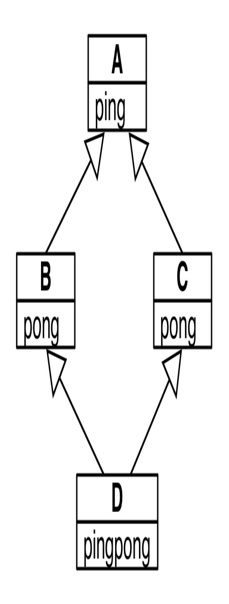
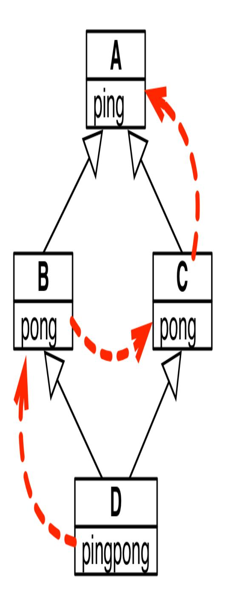
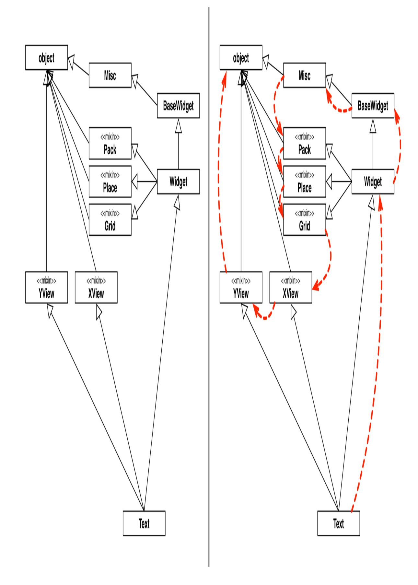
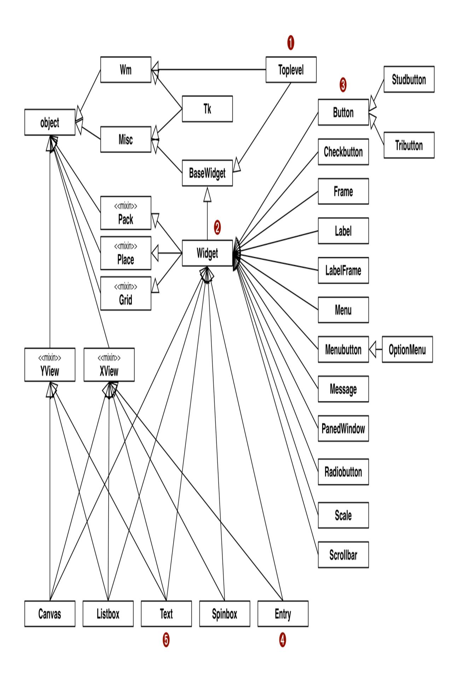
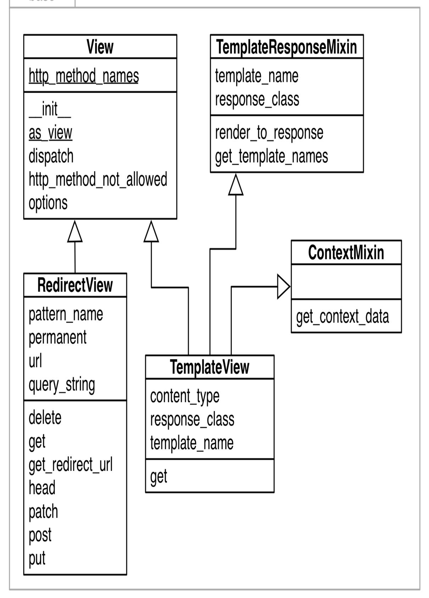
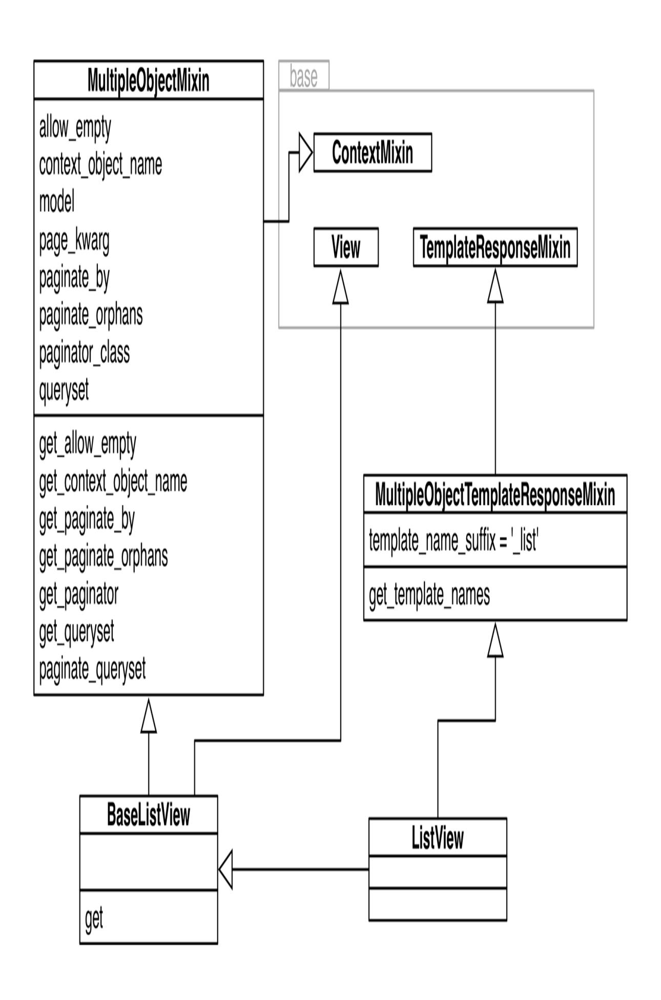

<span id="page-701-0"></span>
# Chapter 14: Inheritance: For Good or For Worse

## A NOTE FOR EARLY RELEASE READERS

With Early Release ebooks, you get books in their earliest form—the author's raw and unedited content as they write—so you can take advantage of these technologies long before the official release of these titles.

This will be the 14th chapter of the final book. Please note that the GitHub repo will be made active later on.

If you have comments about how we might improve the content and/or examples in this book, or if you notice missing material within this chapter, please reach out to the author at [fluentpython2e@ramalho.org.](mailto:fluentpython2e@ramalho.org)

—Alan Kay, The Early History of Smalltalk

This chapter is about inheritance and subclassing, with emphasis on two particulars that are very specific to Python:

- The pitfalls of subclassing from built-in types
- Multiple inheritance and the method resolution order

Many consider multiple inheritance more trouble than it's worth. The lack of it certainly did not hurt Java; it probably fueled its widespread adoption after many were traumatized by the excessive use of multiple inheritance in C++.

However, the amazing success and influence of Java means that a lot of programmers come to Python without having seen multiple inheritance in practice. This is why, instead of toy examples, our coverage of multiple

inheritance will be illustrated by two important Python projects: the Tkinter GUI toolkit and the Django Web framework.

<span id="page-702-2"></span>
## What's new in this chapter

This chapter has only minor changes. As the title suggests, the caveats of inheritance have always been one of the main themes here. But more and more software engineers consider it so problematic that I've added a couple [of paragraphs about avoiding inheritance altogether to the end of "Chapter](#page-730-0) Summary" and ["Further Reading"](#page-732-0).

We'll start with the issue of subclassing built-ins. The rest of the chapter will cover multiple inheritance with our case studies and discuss good and bad practices when building class hierarchies.

<span id="page-702-0"></span>
## Subclassing Built-In Types Is Tricky

Before Python 2.2, it was not possible to subclass built-in types such as list or dict. Since then, it can be done but there is a major caveat: the code of the built-ins (written in C) does not call special methods overridden by user-defined classes.

A good short description of the problem is in the documentation for *PyPy*, [in "Differences between PyPy and CPython", section Subclasses of built-in](http://bit.ly/1JHNmhX) types:

*Officially, CPython has no rule at all for when exactly overridden method of subclasses of built-in types get implicitly called or not. As an approximation, these methods are never called by other built-in methods of the same object. For example, an overridden \_\_getitem\_\_() in a subclass of dict will not be called by e.g. the built-in get() method.*

[Example 14-1](#page-702-1) illustrates the problem.

<span id="page-702-1"></span>*Example 14-1. Our \_\_setitem\_\_ override is ignored by the \_\_init\_\_ and \_\_update\_\_ methods of the built-in dict*

```
>>> class DoppelDict(dict):
... def __setitem__(self, key, value):
... super().__setitem__(key, [value] * 2) 
...
>>> dd = DoppelDict(one=1) 
>>> dd
{'one': 1}
>>> dd['two'] = 2 
>>> dd
{'one': 1, 'two': [2, 2]}
>>> dd.update(three=3) 
>>> dd
{'three': 3, 'one': 1, 'two': [2, 2]}
```

- DoppelDict.\_\_setitem\_\_ duplicates values when storing (for no good reason, just to have a visible effect). It works by delegating to the superclass.
- The \_\_init\_\_ method inherited from dict clearly ignored that \_\_setitem\_\_ was overridden: the value of 'one' is not duplicated.
- The [] operator calls our \_\_setitem\_\_ and works as expected: 'two' maps to the duplicated value [2, 2].
- The update method from dict does not use our version of \_\_setitem\_\_ either: the value of 'three' was not duplicated.

This built-in behavior is a violation of a basic rule of object-oriented programming: the search for methods should always start from the class of the target instance (self), even when the call happens inside a method implemented in a superclass. In this sad state of affairs, the \_\_missing\_\_ method—which we saw in "The [\\_\\_missing\\_\\_](008-chapter-3-dictionaries-and-sets.md#page-160-0) Method"—works as documented only because it's handled as a special case.

The problem is not limited to calls within an instance—whether self.get() calls self.\_\_getitem\_\_())—but also happens with overridden methods of other classes that should be called by the built-in

[methods. Example 14-2 is an example adapted from the PyPy](http://bit.ly/1JHNmhX) documentation.

<span id="page-704-0"></span>
## Example 14-2. The \_\_getitem\_\_ of AnswerDict is bypassed by dict.update

```
>>> class AnswerDict(dict):
... def __getitem__(self, key): 
... return 42
...
>>> ad = AnswerDict(a='foo') 
>>> ad['a'] 
42
>>> d = {}
>>> d.update(ad) 
>>> d['a'] 
'foo'
>>> d
{'a': 'foo'}
```

- AnswerDict.\_\_getitem\_\_ always returns 42, no matter what the key.
- ad is an AnswerDict loaded with the key-value pair ('a', 'foo').
- ad['a'] returns 42, as expected.
- d is an instance of plain dict, which we update with ad.
- The dict.update method ignored our AnswerDict.\_\_getitem\_\_.

## WARNING

Subclassing built-in types like dict or list or str directly is error-prone because the built-in methods mostly ignore user-defined overrides. Instead of subclassing the builtins, derive your classes from the [collections](http://docs.python.org/3/library/collections.html) module using UserDict, UserList, and UserString, which are designed to be easily extended.

If you subclass collections.UserDict instead of dict, the issues exposed in Examples [14-1](#page-702-1) and [14-2](#page-704-0) are both fixed. See [Example 14-3](#page-705-0).

<span id="page-705-0"></span>*Example 14-3. DoppelDict2 and AnswerDict2 work as expected because they extend UserDict and not dict*

```
>>> import collections
>>>
>>> class DoppelDict2(collections.UserDict):
... def __setitem__(self, key, value):
... super().__setitem__(key, [value] * 2)
...
>>> dd = DoppelDict2(one=1)
>>> dd
{'one': [1, 1]}
>>> dd['two'] = 2
>>> dd
{'two': [2, 2], 'one': [1, 1]}
>>> dd.update(three=3)
>>> dd
{'two': [2, 2], 'three': [3, 3], 'one': [1, 1]}
>>>
>>> class AnswerDict2(collections.UserDict):
... def __getitem__(self, key):
... return 42
...
>>> ad = AnswerDict2(a='foo')
>>> ad['a']
42
>>> d = {}
>>> d.update(ad)
>>> d['a']
42
>>> d
{'a': 42}
```

As an experiment to measure the extra work required to subclass a built-in, I rewrote the StrKeyDict class from [Example 3-9.](008-chapter-3-dictionaries-and-sets.md#page-167-0) The original version inherited from collections.UserDict, and implemented just three methods: \_\_missing\_\_, \_\_contains\_\_, and \_\_setitem\_\_. The experimental StrKeyDict subclassed dict directly, and implemented the same three methods with minor tweaks due to the way the data was stored.

| But in order to make it pass the same suite of tests, I had to implement |
|--------------------------------------------------------------------------|
| init, get, and update because the versions inherited from dict           |
| refused to cooperate with the overriddenmissing,                         |
| contains, andsetitem The UserDict subclass from                          |
| Example 3-9 has 16 lines, while the experimental dict subclass ended up  |
| 1<br>with 37 lines.                                                      |

<span id="page-706-1"></span>To summarize: the problem described in this section applies only to method delegation within the C language implementation of the built-in types, and only affects user-defined classes derived directly from those types. If you subclass from a class coded in Python, such as UserDict or MutableMapping, you will not be troubled by this. [2](#page-736-1)

<span id="page-706-2"></span>Another matter related to inheritance, particularly of multiple inheritance, is: how does Python decide which attribute to use if superclasses from parallel branches define attributes with the same name? The answer is next.

<span id="page-706-0"></span>
## Multiple Inheritance and Method Resolution Order





*Figure 14-1. Left: UML class diagram illustrating the "diamond problem." Right: Dashed arrows depict Python MRO (method resolution order) for [Example 14-4](#page-708-0).*

Any language implementing multiple inheritance needs to deal with potential naming conflicts when unrelated ancestor classes implement a method by the same name. This is called the "diamond problem," and is illustrated in Figure 14-1 and [Example 14-4](#page-708-0).

<span id="page-708-0"></span>*Example 14-4. diamond.py: classes A, B, C, and D form the graph in Figure 14-1*

```
class A:
 def ping(self):
 print('ping:', self)
class B(A):
 def pong(self):
 print('pong:', self)
class C(A):
 def pong(self):
 print('PONG:', self)
class D(B, C):
 def ping(self):
 super().ping()
 print('post-ping:', self)
 def pingpong(self):
 self.ping()
 super().ping()
 self.pong()
 super().pong()
 C.pong(self)
```

Note that both classes B and C implement a pong method. The only difference is that C.pong outputs the word PONG in uppercase.

If you call d.pong() on an instance of D, which pong method actually runs? In C++, the programmer must qualify method calls with class names to resolve this ambiguity. This can be done in Python as well. Take a look at [Example 14-5](#page-709-0).

<span id="page-709-0"></span>*Example 14-5. Two ways of invoking method pong on an instance of class D*

```
>>> from diamond import *
>>> d = D()
>>> d.pong() 
pong: <diamond.D object at 0x10066c278>
>>> C.pong(d) 
PONG: <diamond.D object at 0x10066c278>
```

- Simply calling d.pong() causes the B version to run.
- You can always call a method on a superclass directly, passing the instance as an explicit argument.

The ambiguity of a call like d.pong() is resolved because Python follows a specific order when traversing the inheritance graph. That order is called MRO: Method Resolution Order. Classes have an attribute called \_\_mro\_\_ holding a tuple of references to the superclasses in MRO order, from the current class all the way to the object class. For the D class, this is the \_\_mro\_\_ (see Figure 14-1):

```
>>> D.__mro__
(<class 'diamond.D'>, <class 'diamond.B'>, <class 'diamond.C'>,
<class 'diamond.A'>, <class 'object'>)
```

The recommended way to delegate method calls to superclasses is the super() built-in function, which became easier to use in Python 3, as method pingpong of class D in [Example 14-4](#page-708-0) illustrates. However, it's also possible, and sometimes convenient, to bypass the MRO and invoke a method on a superclass directly. For example, the D.ping method could be written as: [3](#page-736-2)

```
 def ping(self):
 A.ping(self) # instead of super().ping()
 print('post-ping:', self)
```

Note that when calling an instance method directly on a class, you must pass self explicitly, because you are accessing an *unbound method*.

However, it's safest and more future-proof to use super(), especially when calling methods on a framework, or any class hierarchies you do not control. [Example 14-6](#page-710-0) shows that super() follows the MRO when invoking a method.

<span id="page-710-0"></span>
## Example 14-6. Using super() to call ping (source code in Example 14-4)

```
>>> from diamond import D
>>> d = D()
>>> d.ping() 
ping: <diamond.D object at 0x10cc40630> 
post-ping: <diamond.D object at 0x10cc40630>
```

- The ping of D makes two calls.
- The first call is super().ping(); the super delegates the ping call to class A; A.ping outputs this line.
- The second call is print('post-ping:', self), which outputs this line.

Now let's see what happens when pingpong is called on an instance of D. See [Example 14-7.](#page-710-1)

<span id="page-710-1"></span>*Example 14-7. The five calls made by pingpong (source code in [Example 14-4](#page-708-0))*

```
>>> from diamond import D
>>> d = D()
>>> d.pingpong()
ping: <diamond.D object at 0x10bf235c0> 
post-ping: <diamond.D object at 0x10bf235c0>
ping: <diamond.D object at 0x10bf235c0> 
pong: <diamond.D object at 0x10bf235c0> 
pong: <diamond.D object at 0x10bf235c0> 
PONG: <diamond.D object at 0x10bf235c0>
```

Call #1 is self.ping(), which runs the ping method of D, which outputs this line and the next one.

- Call #2 is super().ping(), which bypasses the ping in D and finds the ping method in A.
- Call #3 is self.pong(), which finds the B implementation of pong, according to the \_\_mro\_\_.
- Call #4 is super().pong(), which finds the same B.pong implementation, also following the \_\_mro\_\_.
- Call #5 is C.pong(self), which finds the C.pong implementation, ignoring the \_\_mro\_\_.

The MRO takes into account not only the inheritance graph but also the order in which superclasses are listed in a subclass declaration. In other words, if in *diamond.py* ([Example 14-4\)](#page-708-0) the D class was declared as class D(C, B):, the \_\_mro\_\_ of class D would be different: C would be searched before B.

I often check the \_\_mro\_\_ of classes interactively when I am studying them. [Example 14-8](#page-711-0) has some examples using familiar classes.

<span id="page-711-0"></span>
## Example 14-8. Inspecting the \_\_mro\_\_ attribute in several classes

```
>>> bool.__mro__ 
(<class 'bool'>, <class 'int'>, <class 'object'>)
>>> def print_mro(cls): 
... print(', '.join(c.__name__ for c in cls.__mro__))
...
>>> print_mro(bool)
bool, int, object
>>> from frenchdeck2 import FrenchDeck2
>>> print_mro(FrenchDeck2) 
FrenchDeck2, MutableSequence, Sequence, Sized, Iterable, Container,
object
>>> import numbers
>>> print_mro(numbers.Integral) 
Integral, Rational, Real, Complex, Number, object
```

```
>>> import io 
>>> print_mro(io.BytesIO)
BytesIO, _BufferedIOBase, _IOBase, object
>>> print_mro(io.TextIOWrapper)
TextIOWrapper, _TextIOBase, _IOBase, object
```

- bool inherits methods and attributes from int and object.
- print\_mro produces more compact displays of the MRO.
- The ancestors of FrenchDeck2 include several ABCs from the collections.abc module.
- These are the numeric ABCs provided by the numbers module.
- The io module includes ABCs (those with the …Base suffix) and concrete classes like BytesIO and TextIOWrapper, which are the types of binary and text file objects returned by open(), depending on the mode argument.

## NOTE

The MRO is computed using an algorithm called C3. The canonical paper on the Python [MRO explaining C3 is Michele Simionato's "The Python 2.3 Method Resolution](http://bit.ly/1OwVqBd) Order". If you are interested in the subtleties of the MRO, ["Further Reading"](#page-732-0) has other pointers. But don't fret too much about this, the algorithm is sensible; as Simionato writes:

*[…] unless you make strong use of multiple inheritance and you have non-trivial hierarchies, you don't need to understand the C3 algorithm, and you can easily skip this paper.*

To wrap up this discussion of the MRO, Figure 14-2 illustrates part of the complex multiple inheritance graph of the Tkinter GUI toolkit from the Python standard library. To study the picture, start at the Text class at the bottom. The Text class implements a full featured, multiline editable text widget. It has rich functionality of its own, but also inherits many methods

from other classes. The left-hand side shows a plain UML class diagram. On the right, it's decorated with arrows showing the MRO, as listed here with the help of the print\_mro convenience function defined in [Example 14-8](#page-711-0):

```
>>> import tkinter
>>> print_mro(tkinter.Text)
Text, Widget, BaseWidget, Misc, Pack, Place, Grid, XView, YView,
object
```

In the next section, we'll discuss the pros and cons of multiple inheritance, with examples from real frameworks that use it.



<span id="page-715-1"></span>
## Multiple Inheritance in the Real World

It is possible to put multiple inheritance to good use. The Adapter pattern in the *Design Patterns* book uses multiple inheritance, so it can't be completely wrong to do it (the remaining 22 patterns in the book use single inheritance only, so multiple inheritance is clearly not a cure-all).

In the Python standard library, the most visible use of multiple inheritance is the collections.abc package. That is not controversial: after all, even Java supports multiple inheritance of interfaces, and ABCs are interface declarations that may optionally provide concrete method implementations. [4](#page-736-3)

<span id="page-715-0"></span>An extreme example of multiple inheritance in the standard library is the Tkinter GUI toolkit (module tkinter[: Python interface to Tcl/Tk\)](https://docs.python.org/3/library/tkinter.html). I used part of the Tkinter widget hierarchy to illustrate the MRO in Figure 14-2, but Figure 14-3 shows all the widget classes in the tkinter base package (there are more widgets in the [tkinter.ttk](https://docs.python.org/3/library/tkinter.ttk.html) sub-package).



*Figure 14-3. Summary UML diagram for the Tkinter GUI class hierarchy; classes tagged «mixin» are designed to provide concrete methods to other classes via multiple inheritance*

Tkinter is 20 years old as I write this, and is not an example of current best practices. But it shows how multiple inheritance was used when coders did not appreciate its drawbacks. And it will serve as a counter-example when we cover some good practices in the next section.

Consider these classes from Figure 14-3:

- ➊ Toplevel: The class of a top-level window in a Tkinter application.
- ➋ Widget: The superclass of every visible object that can be placed on a window.
- ➌ Button: A plain button widget.
- ➍ Entry: A single-line editable text field.
- ➎ Text: A multiline editable text field.

Here are the MROs of those classes, displayed by the print\_mro function from [Example 14-8](#page-711-0):

```
>>> import tkinter
>>> print_mro(tkinter.Toplevel)
Toplevel, BaseWidget, Misc, Wm, object
>>> print_mro(tkinter.Widget)
Widget, BaseWidget, Misc, Pack, Place, Grid, object
>>> print_mro(tkinter.Button)
Button, Widget, BaseWidget, Misc, Pack, Place, Grid, object
>>> print_mro(tkinter.Entry)
Entry, Widget, BaseWidget, Misc, Pack, Place, Grid, XView, object
>>> print_mro(tkinter.Text)
Text, Widget, BaseWidget, Misc, Pack, Place, Grid, XView, YView,
object
```

Things to note about how these classes relate to others:

Toplevel is the only graphical class that does not inherit from Widget, because it is the top-level window and does not behave like a widget—for example, it cannot be attached to a window or

frame. Toplevel inherits from Wm, which provides direct access functions of the host window manager, like setting the window title and configuring its borders.

- Widget inherits directly from BaseWidget and from Pack, Place, and Grid. These last three classes are geometry managers: they are responsible for arranging widgets inside a window or frame. Each encapsulates a different layout strategy and widget placement API.
- Button, like most widgets, descends only from Widget, but indirectly from Misc, which provides dozens of methods to every widget.
- Entry subclasses Widget and XView, the class that implements horizontal scrolling.
- Text subclasses from Widget, XView, and YView, which provides vertical scrolling functionality.

We'll now discuss some good practices of multiple inheritance and see whether Tkinter goes along with them.

<span id="page-718-0"></span>
## Coping with Multiple Inheritance

*[…] we needed a better theory about inheritance entirely (and still do). For example, inheritance and instancing (which is a kind of inheritance) muddles both pragmatics (such as factoring code to save space) and semantics (used for way too many tasks such as: specialization, generalization, speciation, etc.).*

—Alan Kay, The Early History of Smalltalk

As Alan Kay wrote, inheritance is used for different reasons, and multiple inheritance adds alternatives and complexity. It's easy to create incomprehensible and brittle designs using multiple inheritance. Because

we don't have a comprehensive theory, here are a few tips to avoid spaghetti class graphs.

<span id="page-719-0"></span>
## 1. Distinguish Interface Inheritance from Implementation Inheritance

When dealing with multiple inheritance, it's useful to keep straight the reasons why subclassing is done in the first place. The main reasons are:

- Inheritance of interface creates a subtype, implying an "is-a" relationship.
- Inheritance of implementation avoids code duplication by reuse.

In practice, both uses are often simultaneous, but whenever you can make the intent clear, do it. Inheritance for code reuse is an implementation detail, and it can often be replaced by composition and delegation. On the other hand, interface inheritance is the backbone of a framework.

<span id="page-719-1"></span>
## 2. Make Interfaces Explicit with ABCs

In modern Python, if a class is designed to define an interface, it should be an explicit ABC. In Python ≥ 3.4, this means: subclass abc.ABC or another ABC (see ["ABC Syntax Details"](020-chapter-13-interfaces-protocols-and-abcs.md#page-661-1) if you need to support older Python versions).

<span id="page-719-2"></span>
## 3. Use Mixins for Code Reuse

If a class is designed to provide method implementations for reuse by multiple unrelated subclasses, without implying an "is-a" relationship, it should be an explicit *mixin class*. Conceptually, a mixin does not define a new type; it merely bundles methods for reuse. A mixin should never be instantiated, and concrete classes should not inherit only from a mixin. Each mixin should provide a single specific behavior, implementing few and very closely related methods.

<span id="page-720-2"></span>
## 4. Make Mixins Explicit by Naming

There is no formal way in Python to state that a class is a mixin, so it is highly recommended that they are named with a …Mixin suffix. Tkinter does not follow this advice, but if it did, XView would be XViewMixin, Pack would be PackMixin, and so on with all the classes where I put the «mixin» tag in Figure 14-3.

<span id="page-720-3"></span>
## 5. An ABC May Also Be a Mixin; The Reverse Is Not True

Because an ABC can implement concrete methods, it works as a mixin as well. An ABC also defines a type, which a mixin does not. And an ABC can be the sole base class of any other class, while a mixin should never be subclassed alone except by another, more specialized mixin—not a common arrangement in real code.

One restriction applies to ABCs and not to mixins: the concrete methods implemented in an ABC should only collaborate with methods of the same ABC and its superclasses. This implies that concrete methods in an ABC are always for convenience, because everything they do, a user of the class can also do by calling other methods of the ABC.

<span id="page-720-4"></span>
## 6. Don't Subclass from More Than One Concrete Class

Concrete classes should have zero or at most one concrete superclass. In other words, all but one of the superclasses of a concrete class should be ABCs or mixins. For example, in the following code, if Alpha is a concrete class, then Beta and Gamma must be ABCs or mixins: [5](#page-736-4)

```
class MyConcreteClass(Alpha, Beta, Gamma):
 """This is a concrete class: it can be instantiated."""
 # ... more code ...
```

<span id="page-720-5"></span>
## 7. Provide Aggregate Classes to Users

<span id="page-720-1"></span>If some combination of ABCs or mixins is particularly useful to client code, provide a class that brings them together in a sensible way. Grady Booch

calls this an *aggregate class*. [6](#page-736-5)

For example, here is the complete [source code](http://bit.ly/1JHQqKU) for tkinter.Widget:

```
class Widget(BaseWidget, Pack, Place, Grid):
 """Internal class.
 Base class for a widget which can be positioned with the
 geometry managers Pack, Place or Grid."""
 pass
```

The body of Widget is empty, but the class provides a useful service: it brings together four superclasses so that anyone who needs to create a new widget does not need to remember all those mixins, or wonder if they need to be declared in a certain order in a class statement. A better example of this is the Django ListView class, which we'll discuss shortly, in "A [Modern Example: Mixins in Django Generic Views".](#page-723-0)

<span id="page-721-1"></span>
## 8. "Favor Object Composition Over Class Inheritance."

<span id="page-721-0"></span>The title of this section is the second principle of object-oriented design from the *Design Patterns* book, and is the best advice I can offer here. Once you get comfortable with inheritance, it's too easy to overuse it. Placing objects in a neat hierarchy appeals to our sense of order; programmers do it just for fun. [7](#page-736-6)

However, favoring composition leads to more flexible designs. For example, in the case of the tkinter.Widget class, instead of inheriting the methods from all geometry managers, widget instances could hold a reference to a geometry manager, and invoke its methods. After all, a Widget should not "be" a geometry manager, but could use the services of one via delegation. Then you could add a new geometry manager without touching the widget class hierarchy and without worrying about name clashes. Even with single inheritance, this principle enhances flexibility, because subclassing is a form of tight coupling, and tall inheritance trees tend to be brittle.

Composition and delegation can replace the use of mixins to make behaviors available to different classes, but cannot replace the use of interface inheritance to define a hierarchy of types.

We will now analyze Tkinter from the point of view of these recommendations.

<span id="page-722-0"></span>
## Tkinter: The Good, the Bad, and the Ugly

## NOTE

Keep in mind that Tkinter has been part of the standard library since Python 1.1 was released in 1994. Tkinter is a layer on top of the excellent Tk GUI toolkit of the Tcl language. The Tcl/Tk combo is not originally object oriented, so the Tk API is basically a vast catalog of functions. However, the toolkit is very object oriented in its concepts, if not in its implementation.

Most advice in the previous section is not followed by Tkinter, with #7 being a notable exception. Even then, it's not a great example, because composition would probably work better for integrating the geometry managers into Widget, as discussed in #8.

The docstring of tkinter.Widget starts with the words "Internal class." This suggests that Widget should probably be an ABC. Although Widget has no methods of its own, it does define an interface. Its message is: "You can count on every Tkinter widget providing basic widget methods (\_\_init\_\_, destroy, and dozens of Tk API functions), in addition to the methods of all three geometry managers." We can agree that this is not a great interface definition (it's just too broad), but it is an interface, and Widget "defines" it as the union of the interfaces of its superclasses.

The Tk class, which encapsulates the GUI application logic, inherits from Wm and Misc, neither of which are abstract or mixin (Wm is not proper mixin because TopLevel subclasses only from it). The name of the Misc class is—by itself—a very strong *code smell*. Misc has more than 100 methods, and all widgets inherit from it. Why is it necessary that every

single widget has methods for clipboard handling, text selection, timer management, and the like? You can't really paste into a button or select text from a scrollbar. Misc should be split into several specialized mixin classes, and not all widgets should inherit from every one of those mixins.

To be fair, as a Tkinter user, you don't need to know or use multiple inheritance at all. It's an implementation detail hidden behind the widget classes that you will instantiate or subclass in your own code. But you will suffer the consequences of excessive multiple inheritance when you type dir(tkinter.Button) and try to find the method you need among the 214 attributes listed.

Despite the problems, Tkinter is stable, flexible, and not necessarily ugly. The legacy (and default) Tk widgets are not themed to match modern user interfaces, but the tkinter.ttk package provides pretty, native-looking widgets, making professional GUI development viable since Python 3.1 (2009). Also, some of the legacy widgets, like Canvas and Text, are incredibly powerful. With just a little coding, you can turn a Canvas object into a simple drag-and-drop drawing application. Tkinter and Tcl/Tk are definitely worth a look if you are interested in GUI programming.

However, our theme here is not GUI programming, but the practice of multiple inheritance. A more up-to-date example with explicit mixin classes can be found in Django.

<span id="page-723-0"></span>
## A Modern Example: Mixins in Django Generic Views

## NOTE

You don't need to know Django to follow this section. I am just using a small part of the framework as a practical example of multiple inheritance, and I will try to give all the necessary background, assuming you have some experience with server-side web development in another language or framework.

In Django, a view is a callable object that takes, as argument, an object representing an HTTP request and returns an object representing an HTTP response. The different responses are what interests us in this discussion. They can be as simple as a redirect response, with no content body, or as complex as a catalog page in an online store, rendered from an HTML template and listing multiple merchandise with buttons for buying and links to detail pages.

Originally, Django provided a set of functions, called generic views, that implemented some common use cases. For example, many sites need to show search results that include information from numerous items, with the listing spanning multiple pages, and for each item a link to a page with detailed information about it. In Django, a list view and a detail view are designed to work together to solve this problem: a list view renders search results, and a detail view produces pages for individual items.

However, the original generic views were functions, so they were not extensible. If you needed to do something similar but not exactly like a generic list view, you'd have to start from scratch.

In Django 1.3, the concept of class-based views was introduced, along with a set of generic view classes organized as base classes, mixins, and readyto-use concrete classes. The base classes and mixins are in the base module of the django.views.generic package, pictured in Figure 14-4. At the top of the diagram we see two classes that take care of very distinct responsibilities: View and TemplateResponseMixin.

## TIP

A great resource to study these classes is the [Classy Class-Based Views](http://ccbv.co.uk/) website, where you can easily navigate through them, see all methods in each class (inherited, overridden, and added methods), view diagrams, browse their documentation, and jump to their [source code on GitHub](http://bit.ly/1JHSoe8).

View is the base class of all views (it could be an ABC), and it provides core functionality like the dispatch method, which delegates to

<span id="page-725-0"></span>"handler" methods like get, head, post, etc., implemented by concrete subclasses to handle the different HTTP verbs. The RedirectView class inherits only from View, and you can see that it implements get, head, post, etc. [8](#page-736-7)

<span id="page-725-1"></span>Concrete subclasses of View are supposed to implement the handler methods, so why aren't they part of the View interface? The reason: subclasses are free to implement just the handlers they want to support. A TemplateView is used only to display content, so it only implements get. If an HTTP POST request is sent to a TemplateView, the inherited View.dispatch method checks that there is no post handler, and produces an HTTP 405 Method Not Allowed response. [9](#page-737-0)



*Figure 14-4. UML class diagram for the django.views.generic.base module*

The TemplateResponseMixin provides functionality that is of interest only to views that need to use a template. A RedirectView, for example, has no content body, so it has no need of a template and it does not inherit from this mixin. TemplateResponseMixin provides behaviors to TemplateView and other template-rendering views, such as ListView, DetailView, etc., defined in other modules of the django.views.generic package. Figure 14-5 depicts the django.views.generic.list module and part of the base module.



*Figure 14-5. UML class diagram for the django.views.generic.list module. Here the three classes of the base module are collapsed (see Figure 14-4\). The ListView class has no methods or attributes: it's an aggregate class.*

For Django users, the most important class in Figure 14-5 is ListView, which is an aggregate class, with no code at all (its body is just a docstring). When instantiated, a ListView has an object\_list instance attribute through which the template can iterate to show the page contents, usually the result of a database query returning multiple objects. All the functionality related to generating this iterable of objects comes from the MultipleObjectMixin. That mixin also provides the complex pagination logic—to display part of the results in one page and links to more pages.

Suppose you want to create a view that will not render a template, but will produce a list of objects in JSON format. That's why the BaseListView exists. It provides an easy-to-use extension point that brings together View and MultipleObjectMixin functionality, without the overhead of the template machinery.

The Django class-based views API is a better example of multiple inheritance than Tkinter. In particular, it is easy to make sense of its mixin classes: each has a well-defined purpose, and they are all named with the … Mixin suffix.

Class-based views were not universally embraced by Django users. Many do use them in a limited way, as black boxes, but when it's necessary to create something new, a lot of Django coders continue writing monolithic view functions that take care of all those responsibilities, instead of trying to reuse the base views and mixins.

It does take some time to learn how to leverage class-based views and how to extend them to fulfill specific application needs, but I found that it was worthwhile to study them: they eliminate a lot of boilerplate code, make it easier to reuse solutions, and even improve team communication—for example, by defining standard names to templates, and to the variables passed to template contexts. Class-based views are Django views "on rails." <span id="page-730-0"></span>This concludes our tour of multiple inheritance and mixin classes.

## Chapter Summary

We started our coverage of inheritance explaining the problem with subclassing built-in types: their native methods implemented in C do not call overridden methods in subclasses, except in very few special cases. That's why, when we need a custom list, dict, or str type, it's easier to subclass UserList, UserDict, or UserString—all defined in the [collections](https://docs.python.org/3/library/collections.html) module, which actually wraps the built-in types and delegate operations to them—three examples of favoring composition over inheritance in the standard library. If the desired behavior is very different from what the built-ins offer, it may be easier to subclass the appropriate ABC from [collections.abc](https://docs.python.org/3/library/collections.abc.html) and write your own implementation.

The rest of the chapter was devoted to the double-edged sword of multiple inheritance. First we saw how the method resolution order, encoded in the \_\_mro\_\_ class attribute, addresses the problem of potential naming conflicts in inherited methods. We also saw how the super() built-in follows the \_\_mro\_\_ to call a method on a superclass. We then studied how multiple inheritance is used in the Tkinter GUI toolkit that comes with the Python standard library. Tkinter is not an example of current best practices, so we discussed some ways of coping with multiple inheritance, including careful use of mixin classes and avoiding multiple inheritance altogether by using composition instead. After considering how multiple inheritance is abused in Tkinter, we wrapped up by studying the core parts of the Django class-based views hierarchy, which I consider a better example of mixin usage.

Lennart Regebro—a very experienced Pythonista and one of first edition's technical reviewers—finds the design of Django's mixin views hierarchy confusing. But he also wrote:

*The dangers and badness of multiple inheritance are greatly overblown. I've actually never had a real big problem with it.*

In the end, each of us may have different opinions about how to use multiple inheritance, or whether to use it at all in our own projects.

Meanwhile, rejecting inheritance—even single inheritance—is a growing trend. One of the most successful languages created in the 21st century is Go. It doesn't have a construct called "class", but you can build types that are structs of encapsulated fields and you can attach methods to those structs. Go allows the definition of interfaces that are checked by the compiler using structural typing, a.k.a. *static duck typing*—very similar to what we now have with protocol types since Python 3.8. Go has special syntax for building types and interfaces by composition, but it does not support inheritance—not even among interfaces.

So perhaps the best advice about inheritance is: avoid it if you can. But often, we don't have a choice: the frameworks we use impose their own design choices.

<span id="page-732-0"></span>
## Further Reading

When using ABCs, multiple inheritance is not only common but practically inevitable, because each of the most fundamental collection ABCs (Sequence, Mapping, and Set) extend multiple ABCs. The source code for collections.abc (*[Lib/\\_collections\\_abc.py](http://bit.ly/1QOA3Lt)*) is a good example of multiple inheritance with ABCs—many of which are also mixin classes.

Raymond Hettinger's post [Python's super\(\) considered super!](http://bit.ly/1JHSZfW) explains the workings of super and multiple inheritance in Python from a positive perspective. It was written in response to Python's Super is nifty, but you [can't use it \(a.k.a. Python's Super Considered Harmful\) by James Knight.](https://fuhm.net/super-harmful/)

Despite the titles of those posts, the problem is not really the super builtin—which in Python 3 is not as ugly as it was in Python 2. The real issue is multiple inheritance, which is inherently complicated and tricky. Michele Simionato goes beyond criticizing and actually offers a solution in his [Setting Multiple Inheritance Straight](http://bit.ly/1HGpYxV): he implements traits, a constrained form of mixins that originated in the Self language. Simionato has a long series of illuminating blog posts about multiple inheritance in Python, [including The wonders of cooperative inheritance, or using super in Python](http://bit.ly/1HGpXdj)

[3; Mixins considered harmful, part 1 and part 2; and Things to Know About](http://bit.ly/1HGq1d4) Python Super, part 1, [part 2](http://bit.ly/1HGq1K7) and [part 3](http://bit.ly/1HGq48I). The oldest posts use the Python 2 super syntax, but are still relevant.

I read the first edition of Grady Booch's *Object-Oriented Analysis and Design, 3E* (Addison-Wesley, 2007), and highly recommend it as a general primer on object-oriented thinking, independent of programming language. It is a rare book that covers multiple inheritance without prejudice.

In 2021, it's more fashionable than ever to avoid inheritance, so here are two references about how to do that. Brandon Rhodes wrote The [Composition Over Inheritance Principle, part of his excellent Py](https://python-patterns.guide/gang-of-four/composition-over-inheritance/)[thon](https://python-patterns.guide/) Design Patterns guide on the Web. Augie Fackler and Nathaniel Manista presented The End Of Object Inheritance & The Beginning Of A New [Modularity at PyCon 2013—that was before I wrote the first edition, b](https://www.youtube.com/watch?v=3MNVP9-hglc)ut I only found it in 2019. Fackler and Manista talk about organizing systems around interfaces and functions that handle objects implementing those interfaces, avoiding the tight coupling and failure modes of classes and inheritance. That reminds me a lot of the Go way, but they advocate it for Python.

## SOAPBOX

## Think About the Classes You Really Need

The vast majority of programmers write applications, not frameworks. Even those who do write frameworks are likely to spend a lot (if not most) of their time writing applications. When we write applications, we normally don't need to code class hierarchies. At most, we write classes that subclass from ABCs or other classes provided by the framework. As application developers, it's very rare that we need to write a class that will act as the superclass of another. The classes we code are almost always leaf classes (i.e., leaves of the inheritance tree).

If, while working as an application developer, you find yourself building multilevel class hierarchies, it's likely that one or more of the following applies:

- You are reinventing the wheel. Go look for a framework or library that provides components you can reuse in your application.
- You are using a badly designed framework. Go look for an alternative.
- You are overengineering. Remember the *KISS principle*.
- You became bored coding applications and decided to start a new framework. Congratulations and good luck!

It's also possible that all of the above apply to your situation: you became bored and decided to reinvent the wheel by building your own overengineered and badly designed framework, which is forcing you to code class after class to solve trivial problems. Hopefully you are having fun, or at least getting paid for it.

## Misbehaving Built-ins: Bug or Feature?

The built-in dict, list, and str types are essential building blocks of Python itself, so they must be fast—any performance issues in them

would severely impact pretty much everything else. That's why CPython adopted the shortcuts that cause their built-in methods to misbehave by not cooperating with methods overridden by subclasses. A possible way out of this dilemma would be to offer two implementations for each of those types: one "internal," optimized for use by the interpreter and an external, easily extensible one.

But wait, this is what we have: UserDict, UserList, and UserString are not as fast as the built-ins but are easily extensible. The pragmatic approach taken by CPython means we also get to use, in our own applications, the highly optimized implementations that are hard to subclass. Which makes sense, considering that it's not so often that we need a custom mapping, list, or string, but we use dict, list and str every day. We just need to be aware of the trade-offs involved.

## Inheritance Across Languages

Alan Kay coined the term "object oriented," and Smalltalk had only single inheritance, although there are forks with various forms of multiple inheritance support, including the modern Squeak and Pharo Smalltalk dialects that support traits—a language construct that fulfills the role of a mixin class, while avoiding some of the issues with multiple inheritance.

The first popular language to implement multiple inheritance was C++, and the feature was abused enough that Java—intended as a C++ replacement—was designed without support for multiple inheritance of implementation (i.e., no mixin classes). That is, until Java 8 introduced default methods that make interfaces very similar to the abstract classes used to define interfaces in C++ and in Python. Except that Java interfaces cannot have state—a key distinction. After Java, probably the most widely deployed JVM language is Scala, and it implements traits. Other languages supporting traits are the latest stable versions of PHP and Groovy, and the under-construction languages Rust and Perl 6—so it's fair to say that traits are trendy as I write this.

Ruby offers an original take on multiple inheritance: it does not support it, but introduces mixins as a language feature. A Ruby class can include a module in its body, so the methods defined in the module become part of the class implementation. This is a "pure" form of mixin, with no inheritance involved, and it's clear that a Ruby mixin has no influence on the type of the class where it's used. This provides the benefits of mixins, while avoiding many of its usual problems.

Two new object-oriented languages that are getting a lot of attention severely limit inheritance: Go and Julia. Both are about programming "objects", but they avoid the term "class". Go has no inheritance at all. Julia has a type hierarchy but subtypes cannot inherit structure, only behaviors, and only abstract types can be subtyped. In addition, Julia methods are implemented using multiple dispatch—a more advanced form of the mechanism we saw in ["Single Dispatch Generic Functions".](015-chapter-9-decorators-and-closures.md#page-483-0)

- <span id="page-736-0"></span>[1](#page-706-1) [If you are curious, the experiment is in the](https://github.com/fluentpython/example-code) *strkeydict\_dictsub.py* file in the *Fluent Python* code repository.
- <span id="page-736-1"></span>[2](#page-706-2) By the way, in this regard, PyPy behaves more "correctly" than CPython, at the expense of introducing a minor incompatibility. See ["Differences between PyPy and CPython"](http://bit.ly/1JHNmhX) for details.
- <span id="page-736-2"></span>3 In Python 2, the second line of D.pingpong would be written as super(D, self).ping() rather than super().ping().
- <span id="page-736-3"></span>[4](#page-715-0) As previously mentioned, Java 8 allows interfaces to provide method implementations as well. The new feature is called [Default Methods](http://bit.ly/1JHPsyk) in the official Java Tutorial.
- <span id="page-736-4"></span>5 In ["Waterfowl and ABCs",](020-chapter-13-interfaces-protocols-and-abcs.md#page-639-0) Alex Martelli quotes Scott Meyer's *More Effective C++*, which goes even further: "all non-leaf classes should be abstract" (i.e., concrete classes should not have concrete superclasses at all).
- <span id="page-736-5"></span>[6](#page-720-1) "A class that is constructed primarily by inheriting from mixins and does not add its own structure or behavior is called an *aggregate class*.", Grady Booch et al., *Object Oriented Analysis and Design, 3E* (Addison-Wesley, 2007), p. 109.
- <span id="page-736-6"></span>[7](#page-721-0) Erich Gamma, Richard Helm, Ralph Johnson and John Vlissides, *Design Patterns: Elements of Reusable Object-Oriented Software*, *Introduction*, p. 20.
- <span id="page-736-7"></span>[8](#page-725-0) Django programmers know that the as\_view class method is the most visible part of the View interface, but it's not relevant to us here.

<span id="page-737-0"></span>

| 9 If you are into design patterns, you'll notice that the Django dispatch mechanism is a dynamic<br>variation of the Template Method pattern. It's dynamic because the View class does not force<br>subclasses to implement all handlers, but dispatch checks at runtime if a concrete handler is |
|---------------------------------------------------------------------------------------------------------------------------------------------------------------------------------------------------------------------------------------------------------------------------------------------------|
| available for the specific request.                                                                                                                                                                                                                                                               |
|                                                                                                                                                                                                                                                                                                   |
|                                                                                                                                                                                                                                                                                                   |
|                                                                                                                                                                                                                                                                                                   |
|                                                                                                                                                                                                                                                                                                   |
|                                                                                                                                                                                                                                                                                                   |
|                                                                                                                                                                                                                                                                                                   |
|                                                                                                                                                                                                                                                                                                   |
|                                                                                                                                                                                                                                                                                                   |
|                                                                                                                                                                                                                                                                                                   |
|                                                                                                                                                                                                                                                                                                   |
|                                                                                                                                                                                                                                                                                                   |
|                                                                                                                                                                                                                                                                                                   |
|                                                                                                                                                                                                                                                                                                   |
|                                                                                                                                                                                                                                                                                                   |
|                                                                                                                                                                                                                                                                                                   |
|                                                                                                                                                                                                                                                                                                   |
|                                                                                                                                                                                                                                                                                                   |
|                                                                                                                                                                                                                                                                                                   |
|                                                                                                                                                                                                                                                                                                   |
|                                                                                                                                                                                                                                                                                                   |
|                                                                                                                                                                                                                                                                                                   |
|                                                                                                                                                                                                                                                                                                   |
|                                                                                                                                                                                                                                                                                                   |
|                                                                                                                                                                                                                                                                                                   |
|                                                                                                                                                                                                                                                                                                   |
|                                                                                                                                                                                                                                                                                                   |
|                                                                                                                                                                                                                                                                                                   |
|                                                                                                                                                                                                                                                                                                   |
|                                                                                                                                                                                                                                                                                                   |
|                                                                                                                                                                                                                                                                                                   |
|                                                                                                                                                                                                                                                                                                   |
|                                                                                                                                                                                                                                                                                                   |
|                                                                                                                                                                                                                                                                                                   |
|                                                                                                                                                                                                                                                                                                   |
