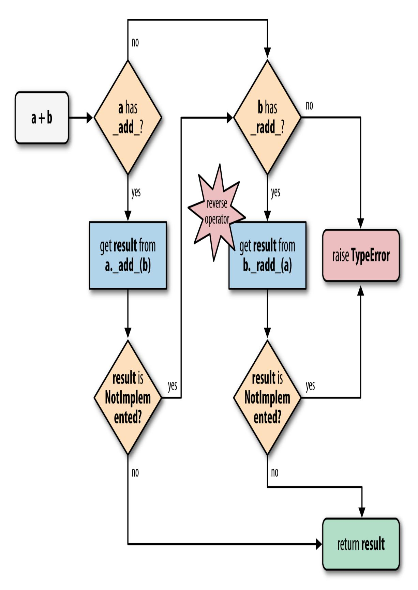
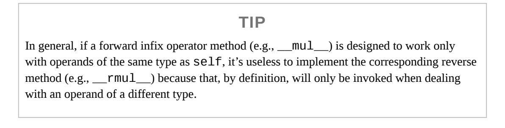

<span id="page-797-0"></span>
# Chapter 16: Operator Overloading: Doing It Right

## A NOTE FOR EARLY RELEASE READERS

With Early Release ebooks, you get books in their earliest form—the author's raw and unedited content as they write—so you can take advantage of these technologies long before the official release of these titles.

This will be the 16th chapter of the final book. Please note that the GitHub repo will be made active later on.

If you have comments about how we might improve the content and/or examples in this book, or if you notice missing material within this chapter, please reach out to the author at [fluentpython2e@ramalho.org](mailto:fluentpython2e@ramalho.org).

*There are some things that I kind of feel torn about, like operator overloading. I left out operator overloading as a fairly personal choice because I had seen too many people abuse it in C++. [1](#page-838-0)*

<span id="page-797-1"></span>—James Gosling, Creator of Java

Operator overloading allows user-defined objects to interoperate with infix operators such as + and | or unary operators like - and ~. More generally, function invocation (()), attribute access (.), and item access/slicing ([]) are also operators in Python, but this chapter covers unary and infix operators.

In ["Emulating Numeric Types"](005-chapter-1-the-python-data-model.md#page-28-0) [\(Chapter 1\)](005-chapter-1-the-python-data-model.md#page-20-0) we saw some trivial implementations of operators in a bare bones Vector class. The \_\_add\_\_ and \_\_mul\_\_ methods in Example 1-2 were written to show how special methods support operator overloading, but there are subtle problems in their implementations that we overlooked. Also, in [Example 11-2,](018-chapter-11-a-pythonic-object.md#page-537-0) we noted that the Vector2d.\_\_eq\_\_ method considers this to be True: Vector(3, 4)

== [3, 4]—which may or not make sense. We will address those matters in this chapter, as well as:

- How an infix operator method should signal it cannot handle an operand
- Using duck typing or goose typing to deal with operands of various types
- The special behavior of the rich comparison operators (e.g., ==, >, <=, etc.)
- <span id="page-798-1"></span>The default handling of augmented assignment operators such as +=, and how to overload them

<span id="page-798-2"></span>
## What's new in this chapter

Goose typing is a key part of Python, but the numbers ABCs are not supported in static typing, so I changed Example 16-11 to use duck typing instead of an explicit isinstance check against numbers.Real. [2](#page-838-1)

I covered the @ matrix multiplication operator *Fluent Python, First Edition* as an upcoming change when 3.5 was still in alpha. Accordingly, "Using @ as an [infix operator" is no longer a sidebar, but is integrated in the flow of the](#page-813-0) chapter. I leveraged goose typing to make the implementation of \_\_matmul\_\_ in that section safer than the one in the first edition, without compromising on flexibility.

["Further Reading"](#page-833-0) now has a couple of new references—including a blog post by Guido van Rossum. I also added mentions of two libraries that showcase effective use of operator overloading outside the domain of mathematics: pathlib and Scapy.

<span id="page-798-0"></span>
## Operator Overloading 101

Operator overloading has a bad name in some circles. It is a language feature that can be (and has been) abused, resulting in programmer confusion, bugs, and unexpected performance bottlenecks. But if well used, it leads to

pleasurable APIs and readable code. Python strikes a good balance between flexibility, usability, and safety by imposing some limitations:

- We cannot overload operators for the built-in types.
- We cannot create new operators, only overload existing ones.
- A few operators can't be overloaded: is, and, or, not (but the bitwise &, |, ~, can).

In [Chapter 12,](019-chapter-12-writing-special-methods-for-sequences.md#page-577-0) we already had one infix operator in Vector: ==, supported by the \_\_eq\_\_ method. In this chapter, we'll improve the implementation of \_\_eq\_\_ to better handle operands of types other than Vector. However, the rich comparison operators (==, !=, >, <, >=, <=) are special cases in operator overloading, so we'll start by overloading four arithmetic operators in Vector: the unary - and +, followed by the infix + and \*.

Let's start with the easiest topic: unary operators.

<span id="page-799-0"></span>
## Unary Operators

In *The Python Language Reference*, "6.5. Unary arithmetic and bitwise [operations" lists three unary operators, shown here with their associated](http://bit.ly/1JHV4bN) special methods:

```
- (__neg__)
   Arithmetic unary negation. If x is -2 then -x == 2.
```

*+ (\_\_pos\_\_)*

Arithmetic unary plus. Usually x == +x, but there are a few cases when that's not true. See ["When x and +x Are Not Equal"](#page-802-0) if you're curious.

```
~ (__invert__)
```

Bitwise inverse of an integer, defined as ~x == -(x+1). If x is 2 then ~x == -3.

The [Data Model" chapter](https://docs.python.org/3/reference/datamodel.html#object.__neg__) of *The Python Language Reference* also lists the abs(…) built-in function as a unary operator. The associated special method is \_\_abs\_\_, as we've seen before, starting with ["Emulating Numeric Types"](005-chapter-1-the-python-data-model.md#page-28-0).

It's easy to support the unary operators. Simply implement the appropriate special method, which will receive just one argument: self. Use whatever logic makes sense in your class, but stick to the fundamental rule of operators: always return a new object. In other words, do not modify self, but create and return a new instance of a suitable type.

In the case of - and +, the result will probably be an instance of the same class as self; for +, returning a copy of self is the best approach most of the time. For abs(…), the result should be a scalar number. As for ~, it's difficult to say what would be a sensible result if you're not dealing with bits in an integer, but in an *ORM* it could make sense to return the negation of an SQL WHERE clause, for example.

As promised before, we'll implement several new operators on the Vector class from [Chapter 12](019-chapter-12-writing-special-methods-for-sequences.md#page-577-0). [Example 16-1](#page-800-0) shows the \_\_abs\_\_ method we already had in [Example 12-16,](019-chapter-12-writing-special-methods-for-sequences.md#page-606-0) and the newly added \_\_neg\_\_ and \_\_pos\_\_ unary operator method.

<span id="page-800-0"></span>*Example 16-1. vector\_v6.py: unary operators - and + added to [Example 12-16](019-chapter-12-writing-special-methods-for-sequences.md#page-606-0)*

```
 def __abs__(self):
 return math.hypot(*self)
 def __neg__(self):
 return Vector(-x for x in self) 
 def __pos__(self):
 return Vector(self)
```

- To compute -v, build a new Vector with every component of self negated.
- To compute +v, build a new Vector with every component of self.

Recall that Vector instances are iterable, and the Vector.\_\_init\_\_ takes an iterable argument, so the implementations of \_\_neg\_\_ and \_\_pos\_\_ are

short and sweet.

We'll not implement \_\_invert\_\_, so if the user tries ~v on a Vector instance, Python will raise TypeError with a clear message: "bad operand type for unary ~: 'Vector'."

The following sidebar covers a curiosity that may help you win a bet about unary + [someday. The next important topic is "Overloading + for Vector](#page-803-0) Addition".

## WHEN X AND +X ARE NOT EQUAL

<span id="page-802-0"></span>Everybody expects that x == +x, and that is true almost all the time in Python, but I found two cases in the standard library where x != +x.

The first case involves the decimal.Decimal class. You can have x != +x if x is a Decimal instance created in an arithmetic context and +x is then evaluated in a context with different settings. For example, x is calculated in a context with a certain precision, but the precision of the context is changed and then +x is evaluated. See [Example 16-2](#page-802-1) for a demonstration.

<span id="page-802-1"></span>*Example 16-2. A change in the arithmetic context precision may cause x to differ from +x*

```
>>> import decimal
>>> ctx = decimal.getcontext() 
>>> ctx.prec = 40 
>>> one_third = decimal.Decimal('1') / decimal.Decimal('3') 
>>> one_third 
Decimal('0.3333333333333333333333333333333333333333')
>>> one_third == +one_third 
True
>>> ctx.prec = 28 
>>> one_third == +one_third 
False
>>> +one_third 
Decimal('0.3333333333333333333333333333')
```

- Get a reference to the current global arithmetic context.
- Set the precision of the arithmetic context to 40.
- Compute 1/3 using the current precision.
- Inspect the result; there are 40 digits after the decimal point.
- one\_third == +one\_third is True.
- Lower precision to 28—the default for Decimal arithmetic in Python 3.4.

- Now one\_third == +one\_third is False.
- Inspect +one\_third; there are 28 digits after the '.' here.

The fact is that each occurrence of the expression +one\_third produces a new Decimal instance from the value of one\_third, but using the precision of the current arithmetic context.

The second case where x != +x you can find in the [collections.Counter](http://bit.ly/1JHVi2E) documentation. The Counter class implements several arithmetic operators, including infix + to add the tallies from two Counter instances. However, for practical reasons, Counter addition discards from the result any item with a negative or zero count. And the prefix + is a shortcut for adding an empty Counter, therefore it produces a new Counter preserving only the tallies that are greater than zero. See [Example 16-3.](#page-803-1)

<span id="page-803-1"></span>*Example 16-3. Unary + produces a new Counter without zeroed or negative tallies*

```
>>> ct = Counter('abracadabra')
>>> ct
Counter({'a': 5, 'r': 2, 'b': 2, 'd': 1, 'c': 1})
>>> ct['r'] = -3
>>> ct['d'] = 0
>>> ct
Counter({'a': 5, 'b': 2, 'c': 1, 'd': 0, 'r': -3})
>>> +ct
Counter({'a': 5, 'b': 2, 'c': 1})
```

Now, back to our regularly scheduled programming.

<span id="page-803-0"></span>
## Overloading + for Vector Addition

### NOTE

The Vector class is a sequence type, and the section ["3.3.6. Emulating container types"](http://bit.ly/1QOyDQY) in the "Data Model" chapter says sequences should support the + operator for concatenation and \* for repetition. However, here we will implement + and \* as mathematical vector operations, which are a bit harder but more meaningful for a Vector type.

Adding two Euclidean vectors results in a new vector in which the components are the pairwise additions of the components of the addends. To illustrate:

```
>>> v1 = Vector([3, 4, 5])
>>> v2 = Vector([6, 7, 8])
>>> v1 + v2
Vector([9.0, 11.0, 13.0])
>>> v1 + v2 == Vector([3 + 6, 4 + 7, 5 + 8])
True
```

What happens if we try to add two Vector instances of different lengths? We could raise an error, but considering practical applications (such as information retrieval), it's better to fill out the shortest Vector with zeros. This is the result we want:

```
>>> v1 = Vector([3, 4, 5, 6])
>>> v3 = Vector([1, 2])
>>> v1 + v3
Vector([4.0, 6.0, 5.0, 6.0])
```

Given these basic requirements, the implementation of \_\_add\_\_ is short and sweet, as shown in [Example 16-4.](#page-804-0)

<span id="page-804-0"></span>
## Example 16-4. Vector.add method, take #1

```
 # inside the Vector class
 def __add__(self, other):
 pairs = itertools.zip_longest(self, other, fillvalue=0.0) 
 return Vector(a + b for a, b in pairs)
```

pairs is a generator that will produce tuples (a, b) where a is from self, and b is from other. If self and other have different lengths, fillvalue supplies the missing values for the shortest iterable.

A new Vector is built from a generator expression producing one sum for each item in pairs.

Note how \_\_add\_\_ returns a new Vector instance, and does not affect self or other.

### WARNING

Special methods implementing unary or infix operators should never change their operands. Expressions with such operators are expected to produce results by creating new objects. Only augmented assignment operators may change the first operand (self), as discussed in ["Augmented Assignment Operators".](#page-826-0)

[Example 16-4](#page-804-0) allows adding Vector to a Vector2d, and Vector to a tuple or to any iterable that produces numbers, as [Example 16-5](#page-805-0) proves.

<span id="page-805-0"></span>*Example 16-5. Vector.\_\_add\_\_ take #1 supports non-Vector objects, too*

```
>>> v1 = Vector([3, 4, 5])
>>> v1 + (10, 20, 30)
Vector([13.0, 24.0, 35.0])
>>> from vector2d_v3 import Vector2d
>>> v2d = Vector2d(1, 2)
>>> v1 + v2d
Vector([4.0, 6.0, 5.0])
```

Both additions in [Example 16-5](#page-805-0) work because \_\_add\_\_ uses zip\_longest(…), which can consume any iterable, and the generator expression to build the new Vector merely performs a + b with the pairs produced by zip\_longest(…), so an iterable producing any number items will do.

However, if we swap the operands ([Example 16-6](#page-805-1)), the mixed-type additions fail..

<span id="page-805-1"></span>*Example 16-6. Vector.\_\_add\_\_ take #1 fails with non-Vector left operands*

```
>>> v1 = Vector([3, 4, 5])
>>> (10, 20, 30) + v1
Traceback (most recent call last):
 File "<stdin>", line 1, in <module>
TypeError: can only concatenate tuple (not "Vector") to tuple
```

```
>>> from vector2d_v3 import Vector2d
>>> v2d = Vector2d(1, 2)
>>> v2d + v1
Traceback (most recent call last):
 File "<stdin>", line 1, in <module>
TypeError: unsupported operand type(s) for +: 'Vector2d' and 'Vector'
```

To support operations involving objects of different types, Python implements a special dispatching mechanism for the infix operator special methods. Given an expression a + b[, the interpreter will perform these steps \(also see Figure 16-](#page-807-0) 1):

- 1. If a has \_\_add\_\_, call a.\_\_add\_\_(b) and return result unless it's NotImplemented.
- 2. If a doesn't have \_\_add\_\_, or calling it returns NotImplemented, check if b has \_\_radd\_\_, then call b.\_\_radd\_\_(a) and return result unless it's NotImplemented.
- <span id="page-806-0"></span>3. If b doesn't have \_\_radd\_\_, or calling it returns NotImplemented, raise TypeError with an *unsupported operand types* message.

The \_\_radd\_\_ method is called the "reflected" or "reversed" version of \_\_add\_\_. I prefer to call them "reversed" special methods. Three of this book's technical reviewers—Alex, Anna, and Leo—told me they like to think of them as the "right" special methods, because they are called on the righthand operand. Whatever "r"-word you prefer, that's what the "r" prefix stands for in \_\_radd\_\_, \_\_rsub\_\_, and the like. [3](#page-839-0)

<span id="page-807-0"></span>

*Figure 16-1. Flowchart for computing a + b with \_\_add\_\_ and \_\_radd\_\_*

Therefore, to make the mixed-type additions in [Example 16-6](#page-805-1) work, we need to implement the Vector.\_\_radd\_\_ method, which Python will invoke as a fall back if the left operand does not implement \_\_add\_\_ or if it does but returns NotImplemented to signal that it doesn't know how to handle the right operand.

### WARNING

Do not confuse NotImplemented with NotImplementedError. The first, NotImplemented, is a special singleton value that an infix operator special method should return to tell the interpreter it cannot handle a given operand. In contrast, NotImplementedError is an exception that stub methods in abstract classes may raise to warn that subclasses must implement them.

The simplest possible \_\_radd\_\_ that works is shown in [Example 16-7.](#page-808-0)

<span id="page-808-0"></span>*Example 16-7. Vector.\_\_add\_\_ and \_\_radd\_\_ methods*

```
 # inside the Vector class
 def __add__(self, other): 
 pairs = itertools.zip_longest(self, other, fillvalue=0.0)
 return Vector(a + b for a, b in pairs)
 def __radd__(self, other): 
 return self + other
```

- No changes to \_\_add\_\_ from [Example 16-4;](#page-804-0) listed here because \_\_radd\_\_ uses it.
- \_\_radd\_\_ just delegates to \_\_add\_\_.

Often, \_\_radd\_\_ can be as simple as that: just invoke the proper operator, therefore delegating to \_\_add\_\_ in this case. This applies to any commutative operator; + is commutative when dealing with numbers or our vectors, but it's not commutative when concatenating sequences in Python.

The methods in [Example 16-4](#page-804-0) work with Vector objects, or any iterable with numeric items, such as a Vector2d, a tuple of integers, or an array of

floats. But if provided with a noniterable object, \_\_add\_\_ fails with a message that is not very helpful, as in [Example 16-8](#page-809-0).

<span id="page-809-0"></span>
### Example 16-8. Vector.\_\_add\_\_ method needs an iterable operand

```
>>> v1 + 1
Traceback (most recent call last):
 File "<stdin>", line 1, in <module>
 File "vector_v6.py", line 328, in __add__
 pairs = itertools.zip_longest(self, other, fillvalue=0.0)
TypeError: zip_longest argument #2 must support iteration
```

Another unhelpful message is given if an operand is iterable but its items cannot be added to the float items in the Vector. See [Example 16-9.](#page-809-1)

<span id="page-809-1"></span>*Example 16-9. Vector.\_\_add\_\_ method needs an iterable with numeric items*

```
>>> v1 + 'ABC'
Traceback (most recent call last):
 File "<stdin>", line 1, in <module>
 File "vector_v6.py", line 329, in __add__
 return Vector(a + b for a, b in pairs)
 File "vector_v6.py", line 243, in __init__
 self._components = array(self.typecode, components)
 File "vector_v6.py", line 329, in <genexpr>
 return Vector(a + b for a, b in pairs)
TypeError: unsupported operand type(s) for +: 'float' and 'str'
```

The problems in Examples [16-8](#page-809-0) and [16-9](#page-809-1) actually go deeper than obscure error messages: if an operator special method cannot return a valid result because of type incompatibility, it should return NotImplemented and not raise TypeError. By returning NotImplemented, you leave the door open for the implementer of the other operand type to perform the operation when Python tries the reversed method call.

In the spirit of duck typing, we will refrain from testing the type of the other operand, or the type of its elements. We'll catch the exceptions and return NotImplemented. If the interpreter has not yet reversed the operands, it will try that. If the reverse method call returns NotImplemented, then Python will raise TypeError with a standard error message like "unsupported operand type(s) for +: *Vector* and *str*."

The final implementation of the special methods for Vector addition are in [Example 16-10.](#page-810-1)

<span id="page-810-1"></span>*Example 16-10. vector\_v6.py: operator + methods added to vector\_v5.py [\(Example 12-16\)](019-chapter-12-writing-special-methods-for-sequences.md#page-606-0)*

```
 def __add__(self, other):
 try:
 pairs = itertools.zip_longest(self, other, fillvalue=0.0)
 return Vector(a + b for a, b in pairs)
 except TypeError:
 return NotImplemented
 def __radd__(self, other):
 return self + other
```

### WARNING

If an infix operator method raises an exception, it aborts the operator dispatch algorithm. In the particular case of TypeError, it is often better to catch it and return NotImplemented. This allows the interpreter to try calling the reversed operator method, which may correctly handle the computation with the swapped operands, if they are of different types.

At this point, we have safely overloaded the + operator by writing \_\_add\_\_ and \_\_radd\_\_. We will now tackle another infix operator: \*.

<span id="page-810-0"></span>
## Overloading \* for Scalar Multiplication

What does Vector([1, 2, 3]) \* x mean? If x is a number, that would be a scalar product, and the result would be a new Vector with each component multiplied by x—also known as an elementwise multiplication:

```
>>> v1 = Vector([1, 2, 3])
>>> v1 * 10
Vector([10.0, 20.0, 30.0])
>>> 11 * v1
Vector([11.0, 22.0, 33.0])
```

### NOTE

Another kind of product involving Vector operands would be the dot product of two vectors—or matrix multiplication, if you take one vector as a 1 × N matrix and the other as [an N × 1 matrix. We will implement that operator in our](#page-813-0) Vector class in "Using @ as an infix operator".

Back to our scalar product, again we start with the simplest \_\_mul\_\_ and \_\_rmul\_\_ methods that could possibly work:

```
 # inside the Vector class
 def __mul__(self, scalar):
 return Vector(n * scalar for n in self)
 def __rmul__(self, scalar):
 return self * scalar
```

Those methods do work, except when provided with incompatible operands. The scalar argument has to be a number that when multiplied by a float produces another float (because our Vector class uses an array of floats internally). So a complex number will not do, but the scalar can be an int, a bool (because bool is a subclass of int), or even a fractions.Fraction instance. In Example 16-11, the \_\_mul\_\_ method does not make an explicit type check on scalar, but instead converts it into a float, and returns NotImplemented if that fails. Yet another example of duck typing.

### NOTE

In *Fluent Python, First Edition*, I used goose typing in Example 16-11: testing the second operand with isinstance(scalar, numbers.Real). Currently I avoid using the numbers ABCs because they are not supported by PEP 484, and using types at runtime that cannot also be statically checked seems a bad idea to me. I hope one day those ABCs can be fixed so we can use them with goose typing as well as static typing. On the other hand, \_\_matmul\_\_ in [Example 16-12](#page-813-1) provides a good example of goose typing, new in this edition.

```
class Vector:
 typecode = 'd'
 def __init__(self, components):
 self._components = array(self.typecode, components)
 # many methods omitted in book listing, see vector_v7.py
 # in https://github.com/fluentpython/example-code-2e ...
 def __mul__(self, scalar):
 try:
 factor = float(scalar)
 except TypeError: 
 return NotImplemented 
 return Vector(n * factor for n in self)
 def __rmul__(self, scalar):
 return self * scalar
```

- If scalar cannot be converted to float…
- …return NotImplemented, to let Python try \_\_rmul\_\_ on the scalar operand.
- In this example, \_\_rmul\_\_ works fine by just performing self \* scalar, delegating to the \_\_mul\_\_ method.

With Example 16-11, we can multiply Vectors by scalar values of the usual and not so usual numeric types:

```
>>> v1 = Vector([1.0, 2.0, 3.0])
>>> 14 * v1
Vector([14.0, 28.0, 42.0])
>>> v1 * True
Vector([1.0, 2.0, 3.0])
>>> from fractions import Fraction
>>> v1 * Fraction(1, 3)
Vector([0.3333333333333333, 0.6666666666666666, 1.0])
```

Now that we can multiply Vector by scalars, let's see how to implement Vector by Vector products.

<span id="page-813-0"></span>
## Using @ as an infix operator

<span id="page-813-2"></span>The @ sign is well-known as the prefix of function decorators, but since 2015, it can also be used as an infix operator. For years, the dot product was written as numpy.dot(a, b) in NumPy. The function call notation makes longer formulas harder to translate from mathematical notation to Python, so the [numerical computing community lobbied for PEP 465—A dedicated infix](https://www.python.org/dev/peps/pep-0465/) operator for matrix multiplication which was implemented in Python 3.5. Today you can write a @ b to compute the dot product of two NumPy arrays. [4](#page-839-1)

The @ operator is supported by the special methods \_\_matmul\_\_, \_\_rmatmul\_\_, and \_\_imatmul\_\_, named for "matrix multiplication." These methods are not used anywhere in the standard library at this time, but are recognized by the interpreter since Python 3.5, so the NumPy team—and the rest of us—can support the @ operator in user-defined types. The parser was also changed to handle the new operator (a @ b was a syntax error in Python 3.4).

These simple tests show how @ should work with Vector instances:

```
>>> va = Vector([1, 2, 3])
>>> vz = Vector([5, 6, 7])
>>> va @ vz == 38.0 # 1*5 + 2*6 + 3*7
True
>>> [10, 20, 30] @ vz
380.0
>>> va @ 3
Traceback (most recent call last):
...
TypeError: unsupported operand type(s) for @: 'Vector' and 'int'
```

Here is the code of the relevant special methods:

<span id="page-813-1"></span>*Example 16-12. vector\_v7.py: operator @ methods*

```
class Vector:
 # many methods omitted in book listing
 def __matmul__(self, other):
 if (isinstance(other, abc.Sized) and
 isinstance(other, abc.Iterable)):
 if len(self) == len(other):
 return sum(a * b for a, b in zip(self, other))
```

```
 else:
 raise ValueError('@ requires vectors of equal
length.')
 else:
 return NotImplemented
 def __rmatmul__(self, other):
 return self @ other
```

- Both operands must implement \_\_len\_\_ and \_\_iter\_\_…
- …and have the same length to allow…
- …a beautiful application of sum, zip and generator expression.

[Example 16-12](#page-813-1) is a good example of *goose typing* in practice. If we tested the other operand against Vector, we'd deny users the flexibility of using lists or arrays as operands to @. As long as one operand is a Vector, our @ implementation supports other operands that are instances of abc.Sized and abc.Iterable. Both of these ABCs implement the \_\_subclasshook\_\_, therefore any object providing \_\_len\_\_ and \_\_iter\_\_ satisfies our test [no need to actually subclass those ABCs, as explained in "Structural typing](020-chapter-13-interfaces-protocols-and-abcs.md#page-669-0) with ABCs". In particular, our Vector class does not subclass either abc.Sized or abc.Iterable, but it does pass the isinstance checks against those ABCs because it has the necessary methods.

Let's review the arithmetic operators supported by Python, before diving into the special category of ["Rich Comparison Operators".](#page-818-0)

<span id="page-814-0"></span>
## Wrapping-up arithmetic operators

Implementing +, \*, and @ we saw the most common patterns for coding infix operators. The techniques we described are applicable to all operators listed in [Table 16-](#page-815-0)[1 \(the in-place operators will be covered in "Augmented Assignment](#page-826-0) Operators").

<span id="page-815-0"></span>T

a bl

e 1 6

-1. I

nf ix

o

p e

r

at

0 r

m

et

h

0

d

n

а m

e

S

(t h

e

in

-pl

а

C

e

o

p

e

r

at

0

rs

а

re

и

S

e

d fo

r

а

и

g m

e

nt

e d

а SS

ig

n

m

e

nt

C

0

m

p

а

ri S o n 0 p er at o rs а re in  $\boldsymbol{T}$ a bl e 1 6 -2 )

| Operator | Forward  | Reverse   | In-place  | Description                  |
|----------|----------|-----------|-----------|------------------------------|
|          |          |           |           |                              |
| +        | add      | radd      | iadd      | Addition or concatenation    |
| -        | sub      | rsub      | isub      | Subtraction                  |
| *        | mul      | rmul      | imul      | Multiplication or repetition |
| /        | truediv  | rtruediv  | itruediv  | True division                |
| //       | floordiv | rfloordiv | ifloordiv | Floor division               |
| %        | mod      | rmod      | imod      | Modulo                       |

<span id="page-818-1"></span>

| divmod()  | divmod | rdivmod | idivmod | Returns tuple of<br>floor division<br>quotient and<br>modulo |
|-----------|--------|---------|---------|--------------------------------------------------------------|
| **, pow() | pow    | rpow    | ipow    | a<br>Exponentiation                                          |
| @         | matmul | rmatmul | imatmul | Matrix<br>multiplication                                     |
| &         | and    | rand    | iand    | Bitwise and                                                  |
|           | or     | ror     | ior     | Bitwise or                                                   |
| ^         | xor    | rxor    | ixor    | Bitwise xor                                                  |
| <<        | lshift | rlshift | ilshift | Bitwise shift left                                           |
| >>        | rshift | rrshift | irshift | Bitwise shift right                                          |

<span id="page-818-2"></span>[a](#page-818-1) pow takes an optional third argument, modulo: pow(a, b, modulo), also supported by the special methods when invoked directly (e.g., a.\_\_pow\_\_(b, modulo)).

The rich comparison operators use a different set of rules. We cover them next.

<span id="page-818-0"></span>
## Rich Comparison Operators

The handling of the rich comparison operators ==, !=, >, <, >=, <= by the Python interpreter is similar to what we just saw, but differs in two important aspects:

- The same set of methods are used in forward and reverse operator calls. The rules are summarized in [Table 16-2](#page-819-0). For example, in the case of ==, both the forward and reverse calls invoke \_\_eq\_\_, only swapping arguments; and a forward call to \_\_gt\_\_ is followed by a reverse call to \_\_lt\_\_ with the swapped arguments.
- In the case of == and !=, if the reverse call fails, Python compares the object IDs instead of raising TypeError.

<span id="page-819-0"></span>*Table16-2.Richcomparisonoperators*

:

r

e

v

e

r

S

e

m

e

t h

0

d

S

i

n v

0

k

e

d

W

h

e

n

t h

e

i

n

i

t

i а

1 m

e

t h

o

d

C

а

1 l

r

e

t

и

r

n

S

N

o t

I

m

p l

e m

e

n

t

e d

| Group    | Infix operator | Forward method<br>call | Reverse method<br>call | Fall back               |
|----------|----------------|------------------------|------------------------|-------------------------|
| Equality | a == b         | aeq(b)                 | beq(a)                 | Return id(a) ==         |
|          |                |                        |                        | id(b)                   |
|          | a != b         | ane(b)                 | bne(a)                 | Return not (a =<br>= b) |
| Ordering | a > b          | agt(b)                 | blt(a)                 | Raise TypeError         |
|          | a < b          | alt(b)                 | bgt(a)                 | Raise TypeError         |
|          | a >= b         | age(b)                 | ble(a)                 | Raise TypeError         |
|          | a <= b         | ale(b)                 | bge(a)                 | Raise TypeError         |

### NEW BEHAVIOR IN PYTHON 3

The fallback step for all comparison operators changed from Python 2. For \_\_ne\_\_, Python 3 now returns the negated result of \_\_eq\_\_. For the ordering comparison operators, Python 3 raises TypeError with a message like 'unorderable types: int() < tuple()'. In Python 2, those comparisons produced weird results taking into account object types and IDs in some arbitrary way. However, it really makes no sense to compare an int to a tuple, for example, so raising TypeError in such cases is a real improvement in the language.

Given these rules, let's review and improve the behavior of the Vector.\_\_eq\_\_ method, which was coded as follows in *vector\_v5.py* [\(Example 12-16\)](019-chapter-12-writing-special-methods-for-sequences.md#page-606-0):

```
class Vector:
 # many lines omitted
 def __eq__(self, other):
 return (len(self) == len(other) and
 all(a == b for a, b in zip(self, other)))
```

That method produces the results in [Example 16-13](#page-823-0).

<span id="page-823-0"></span>
### Example 16-13. Comparing a Vector to a Vector, a Vector2d, and a tuple

```
>>> va = Vector([1.0, 2.0, 3.0])
>>> vb = Vector(range(1, 4))
>>> va == vb 
True
>>> vc = Vector([1, 2])
>>> from vector2d_v3 import Vector2d
>>> v2d = Vector2d(1, 2)
>>> vc == v2d 
True
>>> t3 = (1, 2, 3)
>>> va == t3 
True
```

- Two Vector instances with equal numeric components compare equal.
- A Vector and a Vector2d are also equal if their components are equal.
- A Vector is also considered equal to a tuple or any iterable with numeric items of equal value.

The last one of the results in [Example 16-13](#page-823-0) is probably not desirable. Do we really want a Vector to be considered equal to a tuple containing the same numbers? I have no hard rule about this; it depends on the application context. The Zen of Python says:

*In the face of ambiguity, refuse the temptation to guess.*

Excessive liberality in the evaluation of operands may lead to surprising results, and programmers hate surprises.

Taking a clue from Python itself, we can see that [1,2] == (1, 2) is False. Therefore, let's be conservative and do some type checking. If the second operand is a Vector instance (or an instance of a Vector subclass), then use the same logic as the current \_\_eq\_\_. Otherwise, return NotImplemented and let Python handle that. See [Example 16-14](#page-823-1).

<span id="page-823-1"></span>
## Example 16-14. vector\_v8.py: improved \_\_eq\_\_ in the Vector class

```
 def __eq__(self, other):
 if isinstance(other, Vector): 
 return (len(self) == len(other) and
 all(a == b for a, b in zip(self, other)))
```

```
 else:
 return NotImplemented
```

- If the other operand is an instance of Vector (or of a Vector subclass), perform the comparison as before.
- Otherwise, return NotImplemented.

If you run the tests in [Example 16-13](#page-823-0) with the new Vector.\_\_eq\_\_ from [Example 16-14,](#page-823-1) what you get now is shown in [Example 16-15](#page-824-0).

<span id="page-824-0"></span>*Example 16-15. Same comparisons as [Example 16-13](#page-823-0): last result changed*

```
>>> va = Vector([1.0, 2.0, 3.0])
>>> vb = Vector(range(1, 4))
>>> va == vb 
True
>>> vc = Vector([1, 2])
>>> from vector2d_v3 import Vector2d
>>> v2d = Vector2d(1, 2)
>>> vc == v2d 
True
>>> t3 = (1, 2, 3)
>>> va == t3 
False
```

- Same result as before, as expected.
- Same result as before, but why? Explanation coming up.
- Different result; this is what we wanted. But why does it work? Read on…

Among the three results in [Example 16-15,](#page-824-0) the first one is no news, but the last two were caused by \_\_eq\_\_ returning NotImplemented in Example 16- [14. Here is what happens in the example with a](#page-823-1) Vector and a Vector2d, step by step:

- 1. To evaluate vc == v2d, Python calls Vector.\_\_eq\_\_(vc, v2d).
- 2. Vector.\_\_eq\_\_(vc, v2d) verifies that v2d is not a Vector and returns NotImplemented.

- 3. Python gets NotImplemented result, so it tries Vector2d.\_\_eq\_\_(v2d, vc).
- 4. Vector2d.\_\_eq\_\_(v2d, vc) turns both operands into tuples an compares them: the result is True (the code for Vector2d.\_\_eq\_\_ is in [Example 11-11\)](018-chapter-11-a-pythonic-object.md#page-552-0).

As for the comparison between Vector and tuple in [Example 16-15,](#page-824-0) the actual steps are:

- 1. To evaluate va == t3, Python calls Vector.\_\_eq\_\_(va, t3).
- 2. Vector.\_\_eq\_\_(va, t3) verifies that t3 is not a Vector and returns NotImplemented.
- 3. Python gets NotImplemented result, so it tries tuple.\_\_eq\_\_(t3, va).
- 4. tuple.\_\_eq\_\_(t3, va) has no idea what a Vector is, so it returns NotImplemented.
- 5. In the special case of ==, if the reversed call returns NotImplemented, Python compares object IDs as a last resort.

How about !=? We don't need to implement it because the fallback behavior of the \_\_ne\_\_ inherited from object suits us: when \_\_eq\_\_ is defined and does not return NotImplemented, \_\_ne\_\_ returns that result negated.

In other words, given the same objects we used in [Example 16-15,](#page-824-0) the results for != are consistent:

```
>>> va != vb
False
>>> vc != v2d
False
>>> va != (1, 2, 3)
True
```

<span id="page-825-0"></span>The \_\_ne\_\_ inherited from object works like the following code—except that the original is written in C:[5](#page-839-2)

```
 def __ne__(self, other):
 eq_result = self == other
 if eq_result is NotImplemented:
 return NotImplemented
 else:
 return not eq_result
```

After covering the essentials of infix operator overloading, let's turn to a different class of operators: the augmented assignment operators.

<span id="page-826-0"></span>
## Augmented Assignment Operators

Our Vector class already supports the augmented assignment operators += and \*=. [Example 16-16](#page-826-1) shows them in action.

<span id="page-826-1"></span>*Example 16-16. Augmented assignment works with immutable targets by creating new instances and rebinding*

```
>>> v1 = Vector([1, 2, 3])
>>> v1_alias = v1 
>>> id(v1) 
4302860128
>>> v1 += Vector([4, 5, 6]) 
>>> v1 
Vector([5.0, 7.0, 9.0])
>>> id(v1) 
4302859904
>>> v1_alias 
Vector([1.0, 2.0, 3.0])
>>> v1 *= 11 
>>> v1 
Vector([55.0, 77.0, 99.0])
>>> id(v1)
4302858336
```

- Create alias so we can inspect the Vector([1, 2, 3]) object later.
- Remember the ID of the initial Vector bound to v1.
- Perform augmented addition.
- The expected result…

…but a new Vector was created.

- Inspect v1\_alias to confirm the original Vector was not altered.
- Perform augmented multiplication.
- Again, the expected result, but a new Vector was created.

If a class does not implement the in-place operators listed in [Table 16-1](#page-815-0), the augmented assignment operators are just syntactic sugar: a += b is evaluated exactly as a = a + b. That's the expected behavior for immutable types, and if you have \_\_add\_\_ then += will work with no additional code.

However, if you do implement an in-place operator method such as \_\_iadd\_\_, that method is called to compute the result of a += b. As the name says, those operators are expected to change the left-hand operand in place, and not create a new object as the result.

### WARNING

The in-place special methods should never be implemented for immutable types like our Vector class. This is fairly obvious, but worth stating anyway.

To show the code of an in-place operator, we will extend the BingoCage class from [Example 13-9](020-chapter-13-interfaces-protocols-and-abcs.md#page-662-0) to implement \_\_add\_\_ and \_\_iadd\_\_.

We'll call the subclass AddableBingoCage. [Example 16-17](#page-827-0) is the behavior we want for the + operator.

<span id="page-827-0"></span>*Example 16-17. A new AddableBingoCage instance can be created with*

```
 >>> vowels = 'AEIOU'
 >>> globe = AddableBingoCage(vowels) 
 >>> globe.inspect()
 ('A', 'E', 'I', 'O', 'U')
 >>> globe.pick() in vowels 
 True
 >>> len(globe.inspect()) 
 4
 >>> globe2 = AddableBingoCage('XYZ')
```

```
 >>> globe3 = globe + globe2
 >>> len(globe3.inspect()) 
 7
 >>> void = globe + [10, 20] 
 Traceback (most recent call last):
 ...
 TypeError: unsupported operand type(s) for +: 'AddableBingoCage'
and 'list'
```

- Create a globe instance with five items (each of the vowels).
- Pop one of the items, and verify it is one the vowels.
- Confirm that the globe is down to four items.
- Create a second instance, with three items.
- Create a third instance by adding the previous two. This instance has seven items.
- Attempting to add an AddableBingoCage to a list fails with TypeError. That error message is produced by the Python interpreter when our \_\_add\_\_ method returns NotImplemented.

Because an AddableBingoCage is mutable, [Example 16-18](#page-828-0) shows how it will work when we implement \_\_iadd\_\_.

<span id="page-828-0"></span>*Example 16-18. An existing AddableBingoCage can be loaded with += (continuing from [Example 16-17](#page-827-0))*

```
 >>> globe_orig = globe 
 >>> len(globe.inspect()) 
 4
 >>> globe += globe2 
 >>> len(globe.inspect())
 7
 >>> globe += ['M', 'N'] 
 >>> len(globe.inspect())
 9
 >>> globe is globe_orig 
 True
 >>> globe += 1 
 Traceback (most recent call last):
 ...
```

**TypeError**: right operand **in** += must be 'AddableBingoCage' **or** an iterable

- Create an alias so we can check the identity of the object later.
- globe has four items here.
- An AddableBingoCage instance can receive items from another instance of the same class.
- The right-hand operand of += can also be any iterable.
- Throughout this example, globe has always referred to the globe\_orig object.
- Trying to add a noniterable to an AddableBingoCage fails with a proper error message.

Note that the += operator is more liberal than + with regard to the second operand. With +, we want both operands to be of the same type (AddableBingoCage, in this case), because if we accepted different types this might cause confusion as to the type of the result. With the +=, the situation is clearer: the left-hand object is updated in place, so there's no doubt about the type of the result.

### TIP

I validated the contrasting behavior of + and += by observing how the list built-in type works. Writing my\_list + x, you can only concatenate one list to another list, but if you write my\_list += x, you can extend the left-hand list with items from any iterable x on the right-hand side. This how the list.extend() method works: it accepts any iterable argument.

Now that we are clear on the desired behavior for AddableBingoCage, we can look at its implementation in Example 16-19.

```
from tombola import Tombola
from bingo import BingoCage
class AddableBingoCage(BingoCage): 
 def __add__(self, other):
 if isinstance(other, Tombola): 
 return AddableBingoCage(self.inspect() + other.inspect())
 else:
 return NotImplemented
 def __iadd__(self, other):
 if isinstance(other, Tombola):
 other_iterable = other.inspect() 
 else:
 try:
 other_iterable = iter(other) 
 except TypeError: 
 self_cls = type(self).__name__
 msg = "right operand in += must be {!r} or an
iterable"
 raise TypeError(msg.format(self_cls))
 self.load(other_iterable) 
 return self
```

- AddableBingoCage extends BingoCage.
- Our \_\_add\_\_ will only work with an instance of Tombola as the second operand.
- Retrieve items from other, if it is an instance of Tombola.
- <span id="page-830-1"></span>Otherwise, try to obtain an iterator over other. [6](#page-839-3)
- If that fails, raise an exception explaining what the user should do. When possible, error messages should explicitly guide the user to the solution.
- If we got this far, we can load the other\_iterable into self.
- Very important: augmented assignment special methods must return self.

To wrap up this example, a final observation on Example 16-19: by design, no \_\_radd\_\_ was coded in AddableBingoCage, because there is no need for it. The forward method \_\_add\_\_ will only deal with right-hand operands of the same type, so if Python is trying to compute a + b where a is an AddableBingoCage and b is not, we return NotImplemented—maybe the class of b can make it work. But if the expression is b + a and b is not an AddableBingoCage, and it returns NotImplemented, then it's better to let Python give up and raise TypeError because we cannot handle b.



<span id="page-831-0"></span>This concludes our exploration of operator overloading in Python.

## Chapter Summary

We started this chapter by reviewing some restrictions Python imposes on operator overloading: no overloading of operators in built-in types, and overloading limited to existing operators, except for a few ones (is, and, or, not).

We got down to business with the unary operators, implementing \_\_neg\_\_ and \_\_pos\_\_. Next came the infix operators, starting with +, supported by the \_\_add\_\_ method. We saw that unary and infix operators are supposed to produce results by creating new objects, and should never change their operands. To support operations with other types, we return the NotImplemented special value—not an exception—allowing the interpreter to try again by swapping the operands and calling the reverse special method for that operator (e.g., \_\_radd\_\_). The algorithm Python uses to handle infix operators is summarized in the flowchart in [Figure 16-1](#page-807-0).

Mixing operand types requires detecting operands we can't handle. In this chapter, we did this in two ways: in the duck typing way, we just went ahead and tried the operation, catching a TypeError exception if it happened; later, in \_\_mul\_\_ and \_\_matmul\_\_, we did it with an explicit isinstance test. There are pros and cons to these approaches: duck typing is more flexible, but explicit type checking is more predictable.

In general, libraries should leverage duck typing—opening the door for objects regardless of their types, as long as they support the necessary operations. However, Python's operator dispatch algorithm may produce misleading error messages or unexpected results when combined with duck typing. For this reason, the discipline of type checking using isinstance calls against ABCs is often useful when writing special methods for operator overloading. That's the technique dubbed *goose typing* by Alex Martelli—which we saw in "Goose [typing". Goose typing is a good compromise between flexibility and safety,](020-chapter-13-interfaces-protocols-and-abcs.md#page-638-0) because existing or future user-defined types can be declared as actual or virtual subclasses of an ABC. In addition, if an ABC implements the \_\_subclasshook\_\_, then objects pass isinstance checks against that ABC by providing the required methods—no subclassing or registration required.

The next topic we covered was the rich comparison operators. We implemented == with \_\_eq\_\_ and discovered that Python provides a handy implementation of != in the \_\_ne\_\_ inherited from the object base class. The way Python evaluates these operators along with >, <, >=, and <= is slightly different, with special logic for choosing the reverse method, and fallback handling for == and != which never generate errors because Python compares the object IDs as a last resort.

In the last section, we focused on augmented assignment operators. We saw that Python handles them by default as a combination of plain operator followed by assignment, that is: a += b is evaluated exactly as a = a + b. That always creates a new object, so it works for mutable or immutable types. For mutable objects, we can implement in-place special methods such as \_\_iadd\_\_ for +=, and alter the value of the left-hand operand. To show this at work, we left behind the immutable Vector class and worked on implementing a BingoCage subclass to support += for adding items to the random pool, similar to the way the list built-in supports += as a shortcut for the list.extend() method. While doing this, we discussed how + tends to be stricter than += regarding the types it accepts. For sequence types, + usually requires that both operands are of the same type, while += often accepts any iterable as the right-hand operand.

<span id="page-833-0"></span>
## Further Reading

[Guido van Rossum wrote a good defense of operator overloading in Why](https://neopythonic.blogspot.com/2019/03/why-operators-are-useful.html) [operators are useful. Trey Hunner blogged Tuple ordering and deep](https://treyhunner.com/2019/03/python-deep-comparisons-and-code-readability/) comparisons in Python arguing that the rich comparisons operators in Python are more flexible and powerful than programmers may realize when coming from other languages.

Operator overloading is one area of Python programming where isinstance tests are common. The best practice around such tests is *goose typing*, covered in ["Goose typing"](020-chapter-13-interfaces-protocols-and-abcs.md#page-638-0). If you skipped that, make sure to read it.

[The main reference for the operator special methods is the "Data Model"](https://docs.python.org/3/reference/datamodel.html) [chapter. Another relevant reading in the Python documentation is "9.1.2.2.](http://bit.ly/1JHWP8W) [Implementing the arithmetic operations" in the](http://bit.ly/1JHWP8W) numbers module of The Python Standard Library.

A clever example of operator overloading appeared in the [pathlib](https://docs.python.org/3/library/pathlib.html) package, added in Python 3.4. Its Path class overloads the / operator to build filesystem paths from strings, as shown in this example from the documentation:

```
>>> p = Path('/etc')
>>> q = p / 'init.d' / 'reboot'
>>> q
PosixPath('/etc/init.d/reboot')
```

Another non-arithmetic example of operator overloading is in the [Scapy](https://pypi.org/project/scapy/) library, used to "send, sniff, dissect and forge network packets". In Scapy, the / operator builds packets by stacking fields from different network layers. See [Stacking layers](https://scapy.readthedocs.io/en/latest/usage.html#stacking-layers) for details.

If you are about to implement comparison operators, study functools.total\_ordering. That is class decorator that automatically generates methods for all rich comparison operators in any class that defines at least a couple of them. See the [functools module docs.](http://bit.ly/1C12IWF)

If you are curious about operator method dispatching in languages with [dynamic typing, two seminal readings are "A Simple Technique for Handling](http://bit.ly/1FVhejw) Multiple Polymorphism" by Dan Ingalls (member of the original Smalltalk team) and ["Arithmetic and Double Dispatching in Smalltalk-80"](http://bit.ly/1QrnuuD) by Kurt J. Hebel and Ralph Johnson (Johnson became famous as one of the authors of the original *Design Patterns* book). Both papers provide deep insight into the power of polymorphism in languages with dynamic typing, like Smalltalk, Python, and Ruby. Python does not use double dispatching for handling operators as described in those articles. The Python algorithm using forward and reverse operators is easier for user-defined classes to support than double dispatching, but requires special handling by the interpreter. In contrast, classic double dispatching is a general technique you can use in Python or any OO language beyond the specific context of infix operators, and in fact Ingalls, Hebel, and Johnson use very different examples to describe it.

[The article "The C Family of Languages: Interview with Dennis Ritchie,](http://www.gotw.ca/publications/c_family_interview.htm) Bjarne Stroustrup, and James Gosling" from which I quoted the epigraph in this chapter appeared in *Java Report*, 5(7), July 2000 and *C++ Report*, 12(7), July/August 2000, along with two other snippets I used in the **Soapbox** (next). If you are into programming language design, do yourself a favor and read that interview.

### SOAPBOX

<span id="page-836-0"></span>
## Operator Overloading: Pros and Cons

James Gosling, quoted at the start of this chapter, made the conscious decision to leave operator overloading out when he designed Java. In that [same interview \("The C Family of Languages: Interview with Dennis](http://bit.ly/1C12T4t) Ritchie, Bjarne Stroustrup, and James Gosling") he says:

*Probably about 20 to 30 percent of the population think of operator overloading as the spawn of the devil; somebody has done something with operator overloading that has just really ticked them off, because they've used like + for list insertion and it makes life really, really confusing. A lot of that problem stems from the fact that there are only about half a dozen operators you can sensibly overload, and yet there are thousands or millions of operators that people would like to define so you have to pick, and often the choices conflict with your sense of intuition.*

Guido van Rossum picked the middle way in supporting operator overloading: he did not leave the door open for users creating new arbitrary operators like <=> or :-), which prevents a Tower of Babel of custom operators, and allows the Python parser to be simple. Python also does not let you overload the operators of the built-in types, another limitation that promotes readability and predictable performance.

## Gosling goes on to say:

*Then there's a community of about 10 percent that have actually used operator overloading appropriately and who really care about it, and for whom it's actually really important; this is almost exclusively people who do numerical work, where the notation is very important to appealing to people's intuition, because they come into it with an intuition about what the + means, and the ability to say "a + b" where a and b are complex numbers or matrices or something really does make sense.*

The notation side of the issue cannot be underestimated. Here is an illustrative example from the realm of finances. In Python, you can compute compound interest using a formula written like this:

```
interest = principal * ((1 + rate) ** periods - 1)
```

That same notation works regardless of the numeric types involved. Thus, if you are doing serious financial work, you can make sure that periods is an int, while rate, interest, and principal are exact numbers —instances of the Python decimal.Decimal class — and that formula will work exactly as written.

But in Java, if you switch from float to BigDecimal to get arbitrary precision, you can't use infix operators anymore, because they only work with the primitive types. This is the same formula coded to work with BigDecimal numbers in Java:

```
BigDecimal interest = principal.multiply(BigDecimal.ONE.add(rate)
 .pow(periods).subtract(BigDecimal.ONE));
```

<span id="page-837-1"></span>It's clear that infix operators make formulas more readable, at least for most of us. And operator overloading is necessary to support nonprimitive types with infix operator notation. Having operator overloading in a high-level, easy-to-use language was probably a key reason for the amazing penetration of Python in scientific computing in recent years. [7](#page-839-4)

Of course, there are benefits to disallowing operator overloading in a language. It is arguably a sound decision for lower-level systems languages where performance and safety are paramount. The much newer Go language followed the lead of Java in this regard and does not support operator overloading.

But overloaded operators, when used sensibly, do make code easier to read and write. It's a great feature to have in a modern high-level language.

## A Glimpse at Lazy Evaluation

If you look closely at the traceback in [Example 16-9](#page-809-1), you'll see evidence of the *lazy* evaluation of generator expressions. [Example 16-20](#page-837-0) is that same traceback, now with callouts.

<span id="page-837-0"></span>*Example 16-20. Same as [Example](#page-809-1) 16-9*

```
>>> v1 + 'ABC'
Traceback (most recent call last):
```

```
 File "<stdin>", line 1, in <module>
 File "vector_v6.py", line 329, in __add__
 return Vector(a + b for a, b in pairs) 
 File "vector_v6.py", line 243, in __init__
 self._components = array(self.typecode, components) 
 File "vector_v6.py", line 329, in <genexpr>
 return Vector(a + b for a, b in pairs) 
TypeError: unsupported operand type(s) for +: 'float' and 'str'
```

- The Vector call gets a generator expression as its components argument. No problem at this stage.
- The components genexp is passed to the array constructor. Within the array constructor, Python tries to iterate over the genexp, causing the evaluation of the first item a + b. That's when the TypeError occurs.
- The exception propagates to the Vector constructor call, where it is reported.

This shows how the generator expression is evaluated at the latest possible moment, and not where it is defined in the source code.

In contrast, if the Vector constructor was invoked as Vector([a + b for a, b in pairs]), then the exception would happen right there, because the list comprehension tried to build a list to be passed as the argument to the Vector() call. The body of Vector.\_\_init\_\_ would not be reached at all.

[Chapter 17](024-chapter-17-iterables-iterators-and-generators.md#page-840-0) will cover generator expressions in detail, but I did not want to let this accidental demonstration of their lazy nature go unnoticed.

<span id="page-838-0"></span>[<sup>1</sup>](#page-797-1) [Source: "The C Family of Languages: Interview with Dennis Ritchie, Bjarne Stroustrup, and](http://www.gotw.ca/publications/c_family_interview.htm) James Gosling".

<span id="page-838-1"></span>[<sup>2</sup>](#page-798-1) The remaining ABCs in Python's standard library are still valuable for goose typing and static typing. The issue with the numbers [ABCs is explained in "The numbers ABCs and numeric](020-chapter-13-interfaces-protocols-and-abcs.md#page-686-0) protocols".

- <span id="page-839-0"></span>[3](#page-806-0) The Python documentation uses both terms. The ["Data Model" chapter](https://docs.python.org/3/reference/datamodel.html) uses "reflected," but ["9.1.2.2. Implementing the arithmetic operations"](http://bit.ly/1JHWP8W) in the numbers module docs mention "forward" and "reverse" methods, and I find this terminology better, because "forward" and "reversed" clearly name each of the directions, while "reflected" doesn't have an obvious opposite.
- <span id="page-839-1"></span>[4](#page-813-2) See ["Soapbox"](#page-836-0) for an discussion of the problem.
- <span id="page-839-2"></span>[5](#page-825-0) The logic for object.\_\_eq\_\_ and object.\_\_ne\_\_ is in function object\_richcompare in [Objects/typeobject.c](http://bit.ly/1C11uL7) in the CPython source code.
- <span id="page-839-3"></span>[6](#page-830-1) The iter built-in function will be covered in the next chapter. Here I could have used tuple(other), and it would work, but at the cost of building a new tuple when all the .load(…) method needs is to iterate over its argument.
- <span id="page-839-4"></span>[7](#page-837-1) My friend Mario Domenech Goulart, a core developer of the [CHICKEN Scheme compiler](http://www.call-cc.org/), will probably disagree with this.
