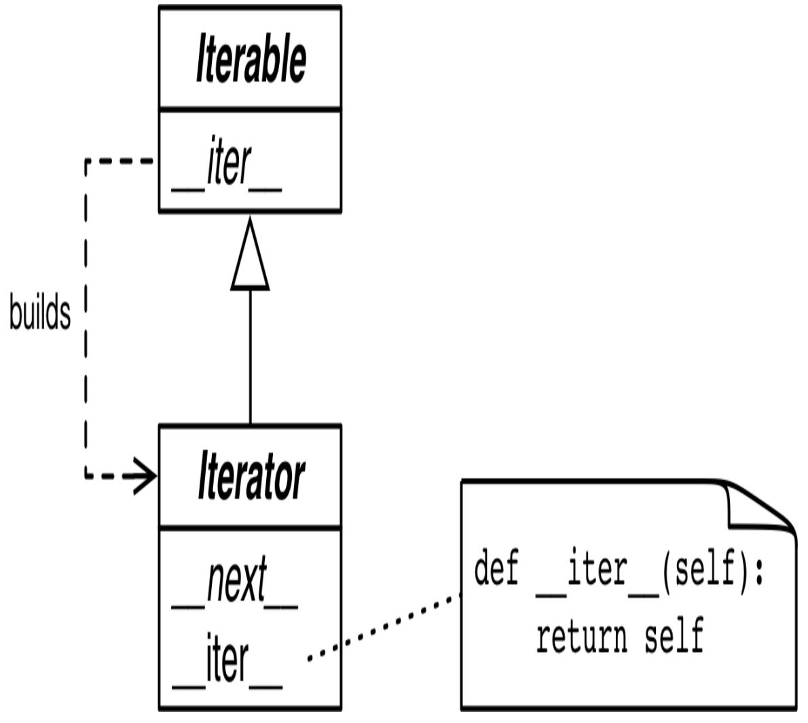

<span id="page-840-0"></span>
# Chapter 17: Iterables, Iterators, and Generators

## A NOTE FOR EARLY RELEASE READERS

With Early Release ebooks, you get books in their earliest form—the author's raw and unedited content as they write—so you can take advantage of these technologies long before the official release of these titles.

This will be the 17th chapter of the final book. Please note that the GitHub repo will be made active later on.

If you have comments about how we might improve the content and/or examples in this book, or if you notice missing material within this chapter, please reach out to the author at [fluentpython2e@ramalho.org.](mailto:fluentpython2e@ramalho.org)

*When I see patterns in my programs, I consider it a sign of trouble. The shape of a program should reflect only the problem it needs to solve. Any other regularity in the code is a sign, to me at least, that I'm using abstractions that aren't powerful enough—often that I'm generating by hand the expansions of some macro that I need to write. [1](#page-921-0)*

<span id="page-840-2"></span><span id="page-840-1"></span>—Paul Graham, Lisp hacker and venture capitalist

Iteration is fundamental to data processing: programs mostly apply computations to data series, from pixels to nucleotides. If the data doesn't fit in memory, we need to fetch the items *lazily*— one at a time and on demand. That's what an iterator does. This chapter shows how the Iterator pattern is built into the Python language so you never need to code it by hand.

Python does not have macros like Lisp (Paul Graham's favorite language), so abstracting away the Iterator pattern required changing the language: the yield keyword was added in Python 2.2 (2001). The yield keyword allows the construction of generator functions, which return iterators. [2](#page-921-1)

Python 3 uses generators in many places. Even the range() built-in now returns a generator-like object instead of full-blown lists like before. If you must build a list from range, you have to be explicit (e.g., list(range(100))).

Every collection in Python is *iterable*, and iterators are used internally to support:

- for loops
- Collection types construction and extension
- Looping over text files line by line
- List, dict, and set comprehensions
- Tuple unpacking
- Unpacking actual parameters with \* in function calls

This chapter covers the following topics:

- How the iter(…) built-in function is used internally to handle iterable objects
- How to implement the classic Iterator pattern in Python
- How a generator function works in detail, with line-by-line descriptions
- How the classic Iterator can be replaced by a generator function or generator expression
- Leveraging the general-purpose generator functions in the standard library
- Using the new yield from statement to combine generators

- A case study: using generator functions in a database conversion utility designed to work with large datasets
- Why generators and coroutines look alike but are actually very different and should not be mixed

<span id="page-842-1"></span>
## What's new in this chapter

The one major change was the introductory section on yield from, which grew from 1 to 6 pages. ["Subgenerators with yield from"](#page-894-0) now includes both simpler experiments demonstrating the behavior of generators with yield from, and a practical application of that syntax to traverse a tree data structure, developed step-by-step.

We'll get started studying how the iter(…) built-in function makes sequences iterable.

<span id="page-842-2"></span>
## A Sequence of Words

We'll start our exploration of iterables by implementing a Sentence class: you give its constructor a string with some text, and then you can iterate word by word. The first version will implement the sequence protocol, and it's iterable because all sequences are iterable—as we've seen since [Chapter 1](005-chapter-1-the-python-data-model.md#page-20-0). Now we'll see exactly why.

[Example 17-1](#page-842-0) shows a Sentence class that extracts words from a text by index.

<span id="page-842-0"></span>*Example 17-1. sentence.py: A Sentence as a sequence of words*

```
import re
import reprlib
RE_WORD = re.compile(r'\w+')
class Sentence:
 def __init__(self, text):
```

```
 self.text = text
 self.words = RE_WORD.findall(text) 
 def __getitem__(self, index):
 return self.words[index] 
 def __len__(self): 
 return len(self.words)
 def __repr__(self):
 return 'Sentence(%s)' % reprlib.repr(self.text)
```

- re.findall returns a list with all nonoverlapping matches of the regular expression, as a list of strings.
- self.words holds the result of .findall, so we simply return the word at the given index.
- To complete the sequence protocol, we implement \_\_len\_\_—but it is not needed to make an iterable object.
- <span id="page-843-1"></span>reprlib.repr is a utility function to generate abbreviated string representations of data structures that can be very large. [3](#page-921-2)

By default, reprlib.repr limits the generated string to 30 characters. See the console session in [Example 17-2](#page-843-0) to see how Sentence is used.

<span id="page-843-0"></span>*Example 17-2. Testing iteration on a Sentence instance*

```
>>> s = Sentence('"The time has come," the Walrus said,') 
>>> s
Sentence('"The time ha... Walrus said,') 
>>> for word in s: 
... print(word)
The
time
has
come
the
Walrus
said
>>> list(s) 
['The', 'time', 'has', 'come', 'the', 'Walrus', 'said']
```

- A sentence is created from a string.
- Note the output of \_\_repr\_\_ using ... generated by reprlib.repr.
- Sentence instances are iterable; we'll see why in a moment.
- Being iterable, Sentence objects can be used as input to build lists and other iterable types.

In the following pages, we'll develop other Sentence classes that pass the tests in [Example 17-2.](#page-843-0) However, the implementation in [Example 17-1](#page-842-0) is different from all the others because it's also a sequence, so you can get words by index:

```
>>> s[0]
'The'
>>> s[5]
'Walrus'
>>> s[-1]
'said'
```

Every Python programmer knows that sequences are iterable. Now we'll see precisely why.

<span id="page-844-0"></span>
## Why Sequences Are Iterable: The iter Function

Whenever the interpreter needs to iterate over an object x, it automatically calls iter(x).

The iter built-in function:

1. Checks whether the object implements \_\_iter\_\_, and calls that to obtain an iterator.

- 2. If \_\_iter\_\_ is not implemented, but \_\_getitem\_\_ is implemented, Python creates an iterator that attempts to fetch items in order, starting from index 0 (zero).
- 3. If that fails, Python raises TypeError, usually saying "*C* object is not iterable," where C is the class of the target object.

That is why any Python sequence is iterable: they all implement \_\_getitem\_\_. In fact, the standard sequences also implement \_\_iter\_\_, and yours should too, because the special handling of \_\_getitem\_\_ exists for backward compatibility reasons and may be gone in the future (although it is not deprecated as I write this).

As mentioned in ["Python Digs Sequences"](020-chapter-13-interfaces-protocols-and-abcs.md#page-629-1), this is an extreme form of duck typing: an object is considered iterable not only when it implements the special method \_\_iter\_\_, but also when it implements \_\_getitem\_\_, as long as \_\_getitem\_\_ accepts int keys starting from 0.

In the goose-typing approach, the definition for an iterable is simpler but not as flexible: an object is considered iterable if it implements the \_\_iter\_\_ method. No subclassing or registration is required, because abc.Iterable implements the \_\_subclasshook\_\_, as seen in ["Structural typing with ABCs"](020-chapter-13-interfaces-protocols-and-abcs.md#page-669-0). Here is a demonstration:

```
>>> class Foo:
... def __iter__(self):
... pass
...
>>> from collections import abc
>>> issubclass(Foo, abc.Iterable)
True
>>> f = Foo()
>>> isinstance(f, abc.Iterable)
True
```

However, note that our initial Sentence class does not pass the issubclass(Sentence, abc.Iterable) test, even though it is iterable in practice.

## TIP

As of Python 3.9, the most accurate way to check whether an object x is iterable is to call iter(x) and handle a TypeError exception if it isn't. This is more accurate than using isinstance(x, abc.Iterable), because iter(x) also considers the legacy \_\_getitem\_\_ method, while the Iterable ABC does not.

Explicitly checking whether an object is iterable may not be worthwhile if right after the check you are going to iterate over the object. After all, when the iteration is attempted on a noniterable, the exception Python raises is clear enough: TypeError: 'C' object is not iterable . If you can do better than just raising TypeError, then do so in a try/except block instead of doing an explicit check. The explicit check may make sense if you are holding on to the object to iterate over it later; in this case, catching the error early may be useful.

The next section makes explicit the relationship between iterables and iterators.

<span id="page-846-0"></span>
## Iterables Versus Iterators

[From the explanation in "Why Sequences Are Iterable: The](#page-844-0) iter Function" we can extrapolate a definition:

## iterable

Any object from which the iter built-in function can obtain an iterator. Objects implementing an \_\_iter\_\_ method returning an *iterator* are iterable. Sequences are always iterable; as are objects implementing a \_\_getitem\_\_ method that takes 0-based indexes.

It's important to be clear about the relationship between iterables and iterators: Python obtains iterators from iterables.

Here is a simple for loop iterating over a str. The str 'ABC' is the iterable here. You don't see it, but there is an iterator behind the curtain:

```
>>> s = 'ABC'
>>> for char in s:
... print(char)
...
A
B
C
```

If there was no for statement and we had to emulate the for machinery by hand with a while loop, this is what we'd have to write:

```
>>> s = 'ABC'
>>> it = iter(s) 
>>> while True:
... try:
... print(next(it)) 
... except StopIteration: 
... del it 
... break 
...
A
B
C
```

- Build an iterator it from the iterable.
- Repeatedly call next on the iterator to obtain the next item.
- The iterator raises StopIteration when there are no further items.
- Release reference to it—the iterator object is discarded.
- Exit the loop.

StopIteration signals that the iterator is exhausted. This exception is handled internally in for loops and other iteration contexts like list comprehensions, tuple unpacking, etc.

The standard interface for an iterator has two methods:

| next                                                                                                                                                                                     |
|------------------------------------------------------------------------------------------------------------------------------------------------------------------------------------------|
| Returns the next available item, raising StopIteration when there<br>are no more items.                                                                                                  |
| iter                                                                                                                                                                                     |
| Returns self; this allows iterators to be used where an iterable is<br>expected, for example, in a for loop.                                                                             |
| This is formalized in the collections.abc.Iterator ABC, which<br>defines thenext abstract method, and subclasses Iterable—<br>where the abstractiter method is defined. See Figure 17-1. |

<span id="page-849-0"></span>

*Figure 17-1. The Iterable and Iterator ABCs. Methods in italic are abstract. A concrete Iterable.\_\_iter\_\_ should return a new Iterator instance. A concrete Iterator must implement \_\_next\_\_. The Iterator.\_\_iter\_\_ method just returns the instance itself.*

The Iterator ABC implements \_\_iter\_\_ by doing return self. This allows an iterator to be used wherever an iterable is required. The source code for abc.Iterator is in [Example 17-3.](#page-849-1)

<span id="page-849-1"></span>*Example 17-3. abc.Iterator class; extracted from [Lib/\\_collections\\_abc.py](http://bit.ly/1C14QOi)* **class Iterator**(Iterable):

```
 __slots__ = ()
 @abstractmethod
 def __next__(self):
 'Return the next item from the iterator. When exhausted,
raise StopIteration'
```

## **raise StopIteration def** \_\_iter\_\_(self): **return** self @classmethod **def** \_\_subclasshook\_\_(cls, C): **if** cls **is** Iterator: **if** (any("\_\_next\_\_" **in** B.\_\_dict\_\_ **for** B **in** C.\_\_mro\_\_) **and** any("\_\_iter\_\_" **in** B.\_\_dict\_\_ **for** B **in** C.\_\_mro\_\_)): **return True return** NotImplemented

## WARNING

The Iterator ABC abstract method is it.\_\_next\_\_() in Python 3 and it.next() in Python 2. As usual, you should avoid calling special methods directly. Just use the next(it): this built-in function does the right thing in Python 2 and 3.

The *[Lib/types.py](https://github.com/python/cpython/blob/master/Lib/types.py#L6)* module source code in Python 3.9 has a comment that says:

```
# Iterators in Python aren't a matter of type but of protocol. A
large
# and changing number of builtin types implement *some* flavor of
# iterator. Don't check the type! Use hasattr to check for both
# "__iter__" and "__next__" attributes instead.
```

In fact, that's exactly what the \_\_subclasshook\_\_ method of the abc.Iterator ABC does (see [Example 17-3](#page-849-1)).

## TIP

Taking into account the advice from *Lib/types.py* and the logic implemented in *Lib/\_collections\_abc.py*, the best way to check if an object x is an iterator is to call isinstance(x, abc.Iterator). Thanks to Iterator.\_\_subclasshook\_\_, this test works even if the class of x is not a real or virtual subclass of Iterator.

Back to our Sentence class from [Example 17-1](#page-842-0), you can clearly see how the iterator is built by iter(…) and consumed by next(…) using the Python console:

```
>>> s3 = Sentence('Pig and Pepper') 
>>> it = iter(s3) 
>>> it # doctest: +ELLIPSIS
<iterator object at 0x...>
>>> next(it) 
'Pig'
>>> next(it)
'and'
>>> next(it)
'Pepper'
>>> next(it) 
Traceback (most recent call last):
 ...
StopIteration
>>> list(it) 
[]
>>> list(iter(s3)) 
['Pig', 'and', 'Pepper']
```

- Create a sentence s3 with three words.
- Obtain an iterator from s3.
- next(it) fetches the next word.
- There are no more words, so the iterator raises a StopIteration exception.
- Once exhausted, an iterator becomes useless.
- To go over the sentence again, a new iterator must be built.

Because the only methods required of an iterator are \_\_next\_\_ and \_\_iter\_\_, there is no way to check whether there are remaining items, other than to call next() and catch StopIteration. Also, it's not

possible to "reset" an iterator. If you need to start over, you need to call iter(…) on the iterable that built the iterator in the first place. Calling iter(…) on the iterator itself won't help, because—as mentioned— Iterator.\_\_iter\_\_ is implemented by returning self, so this will not reset a depleted iterator.

To wrap up this section, here is a definition for *iterator*:

*iterator*

Any object that implements the \_\_next\_\_ no-argument method that returns the next item in a series or raises StopIteration when there are no more items. Python iterators also implement the \_\_iter\_\_ method so they are *iterable* as well.

The first version of Sentence from [Example 17-1](#page-842-0) was iterable thanks to the special treatment the iter(…) built-in gives to sequences. Next, we will implement Sentence variations that implement \_\_iter\_\_ to return iterators.

<span id="page-852-0"></span>
## Sentence classes with \_\_iter\_\_

The first variation of Sentence implements the standard iterable protocol.

<span id="page-852-1"></span>
## Sentence Take #2: A Classic Iterator

The following Sentence class is built according to the classic Iterator design pattern according to the blueprint in the GoF book. Note that this is not idiomatic Python, as the next refactorings will make very clear. But it serves to make explicit the relationship between the iterable collection and the iterator object.

[Example 17-4](#page-853-0) shows an implementation of a Sentence that is iterable because it implements the \_\_iter\_\_ special method, which builds and returns a SentenceIterator. This is how the Iterator design pattern is described in the original *Design Patterns* book.

We are doing it this way here just to make clear the crucial distinction between an iterable and an iterator and how they are connected.

<span id="page-853-0"></span>*Example 17-4. sentence\_iter.py: Sentence implemented using the Iterator pattern*

```
import re
import reprlib
RE_WORD = re.compile(r'\w+')
class Sentence:
 def __init__(self, text):
 self.text = text
 self.words = RE_WORD.findall(text)
 def __repr__(self):
 return f'Sentence({reprlib.repr(self.text)})'
 def __iter__(self): 
 return SentenceIterator(self.words) 
class SentenceIterator:
 def __init__(self, words):
 self.words = words 
 self.index = 0 
 def __next__(self):
 try:
 word = self.words[self.index] 
 except IndexError:
 raise StopIteration() 
 self.index += 1 
 return word 
 def __iter__(self): 
 return self
```

The \_\_iter\_\_ method is the only addition to the previous Sentence implementation. This version has no \_\_getitem\_\_, to

| make it clear that the class is iterable because it implements<br>iter                                                                                                                                                                                                                                                                                                                                            |  |  |  |  |
|-------------------------------------------------------------------------------------------------------------------------------------------------------------------------------------------------------------------------------------------------------------------------------------------------------------------------------------------------------------------------------------------------------------------|--|--|--|--|
| iter fulfills the iterable protocol by instantiating and returning<br>an iterator.                                                                                                                                                                                                                                                                                                                                |  |  |  |  |
| SentenceIterator holds a reference to the list of words.                                                                                                                                                                                                                                                                                                                                                          |  |  |  |  |
| self.index determines the next word to fetch.                                                                                                                                                                                                                                                                                                                                                                     |  |  |  |  |
| Get the word at self.index.                                                                                                                                                                                                                                                                                                                                                                                       |  |  |  |  |
| If there is no word at self.index, raise StopIteration.                                                                                                                                                                                                                                                                                                                                                           |  |  |  |  |
| Increment self.index.                                                                                                                                                                                                                                                                                                                                                                                             |  |  |  |  |
| Return the word.                                                                                                                                                                                                                                                                                                                                                                                                  |  |  |  |  |
| Implement selfiter                                                                                                                                                                                                                                                                                                                                                                                                |  |  |  |  |
| The code in Example 17-4 passes the tests in Example 17-2.                                                                                                                                                                                                                                                                                                                                                        |  |  |  |  |
| Note that implementingiter in SentenceIterator is not<br>actually needed for this example to work, but the it's the right thing to do:<br>iterators are supposed to implement bothnext anditer, and<br>doing so makes our iterator pass the<br>issubclass(SentenceIterator, abc.Iterator) test. If we<br>had subclassed SentenceIterator from abc.Iterator, we'd<br>inherit the concrete abc.Iteratoriter method. |  |  |  |  |
| That is a lot of work (for us lazy Python programmers, anyway). Note how<br>most code in SentenceIterator deals with managing the internal state<br>of the iterator. Soon we'll see how to make it shorter. But first, a brief<br>detour to address an implementation shortcut that may be tempting, but is<br>just wrong.                                                                                        |  |  |  |  |

<span id="page-855-1"></span>
## Don't make the iterable an iterator for itself

The "Applicability" section of the Iterator design pattern in the *GoF book* says: [4](#page-921-3)

## Use the Iterator pattern

- <span id="page-855-0"></span>*to access an aggregate object's contents without exposing its internal representation.*
- *to support multiple traversals of aggregate objects.*
- *to provide a uniform interface for traversing different aggregate structures (that is, to support polymorphic iteration).*

To "support multiple traversals" it must be possible to obtain multiple independent iterators from the same iterable instance, and each iterator must keep its own internal state, so a proper implementation of the pattern requires each call to iter(my\_iterable) to create a new, independent, iterator. That is why we need the SentenceIterator class in this example.

## WARNING

Avoid making an iterable act as an iterator over itself. In other words, iterables must implement \_\_iter\_\_, but should not implement \_\_next\_\_.

On the other hand, iterators should always be iterable. An iterator's \_\_iter\_\_ should just return self.

Now that the classic Iterator pattern is properly demonstrated, we can let it go. The next section presents a more idiomatic implementation of Sentence.

<span id="page-856-1"></span>
## Sentence Take #3: A Generator Function

A Pythonic implementation of the same functionality uses a generator, avoiding all the work to implement the SentenceIterator class. A proper explanation of the generator comes right after [Example 17-5](#page-856-0).

<span id="page-856-0"></span>*Example 17-5. sentence\_gen.py: Sentence implemented using a generator*

```
import re
import reprlib
RE_WORD = re.compile(r'\w+')
class Sentence:
 def __init__(self, text):
 self.text = text
 self.words = RE_WORD.findall(text)
 def __repr__(self):
 return 'Sentence(%s)' % reprlib.repr(self.text)
 def __iter__(self):
 for word in self.words: 
 yield word 
 return 
# done!
```

- Iterate over self.words.
- Yield the current word.
- <span id="page-857-0"></span>This return is not needed; the function can just "fall-through" and return automatically. Either way, a generator function doesn't raise StopIteration: it simply exits when it's done producing values. [5](#page-921-4)
- No need for a separate iterator class!

Here again we have a different implementation of Sentence that passes the tests in [Example 17-2.](#page-843-0)

Back in the Sentence code in [Example 17-4,](#page-853-0) \_\_iter\_\_ called the SentenceIterator constructor to build an iterator and return it. Now the iterator in [Example 17-5](#page-856-0) is in fact a generator object, built automatically when the \_\_iter\_\_ method is called, because \_\_iter\_\_ here is a generator function.

A full explanation of generators follows.

<span id="page-857-2"></span>
## How a Generator Works

Any Python function that has the yield keyword in its body is a generator function: a function which, when called, returns a generator object. In other words, a generator function is a generator factory.

<span id="page-857-1"></span>
## TIP

The only syntax distinguishing a plain function from a generator function is the fact that the latter has a yield keyword somewhere in its body. Some argued that a new keyword like gen should be used for generator functions instead of def, but Guido did not agree. His arguments are in [PEP 255 — Simple Generators](https://www.python.org/dev/peps/pep-0255/). [6](#page-922-0)

Here is the simplest function useful to demonstrate the behavior of a generator: [7](#page-922-1)

```
>>> def gen_123(): 
... yield 1 
... yield 2
... yield 3
...
>>> gen_123 # doctest: +ELLIPSIS
<function gen_123 at 0x...> 
>>> gen_123() # doctest: +ELLIPSIS
<generator object gen_123 at 0x...> 
>>> for i in gen_123(): 
... print(i)
1
2
3
>>> g = gen_123() 
>>> next(g) 
1
>>> next(g)
2
>>> next(g)
3
>>> next(g) 
Traceback (most recent call last):
 ...
StopIteration
```

- Any Python function that contains the yield keyword is a generator function.
- Usually the body of a generator function has loop, but not necessarily; here I just repeat yield three times.
- Looking closely, we see gen\_123 is a function object.
- But when invoked, gen\_123() returns a generator object.
- Generators are iterators that produce the values of the expressions passed to yield.

- For closer inspection, we assign the generator object to g.
- Because g is an iterator, calling next(g) fetches the next item produced by yield.
- When the body of the function completes, the generator object raises a StopIteration.

A generator function builds a generator object that wraps the body of the function. When we invoke next(…) on the generator object, execution advances to the next yield in the function body, and the next(…) call evaluates to the value yielded when the function body is suspended. Finally, when the function body returns, the enclosing generator object raises StopIteration, in accordance with the Iterator protocol.

<span id="page-859-1"></span>
## TIP

I find it helpful to be strict when talking about the results obtained from a generator: I say that a generator *yields* or *produces* values. But it's confusing to say a generator "returns" values. Functions return values. Calling a generator function returns a generator. A generator yields or produces values. A generator doesn't "return" values in the usual way: the return statement in the body of a generator function causes StopIteration to be raised by the generator object. [8](#page-922-2)

[Example 17-6](#page-859-0) makes the interaction between a for loop and the body of the function more explicit.

<span id="page-859-0"></span>*Example 17-6. A generator function that prints messages when it runs*

```
>>> def gen_AB(): 
... print('start')
... yield 'A' 
... print('continue')
... yield 'B' 
... print('end.') 
...
>>> for c in gen_AB(): 
... print('-->', c)
```

```
...
start 
--> A 
continue 
--> B 
end. 
>>>
```

- The generator function is defined like any function, but uses yield.
- The first implicit call to next() in the for loop at will print 'start' and stop at the first yield, producing the value 'A'.
- The second implicit call to next() in the for loop will print 'continue' and stop at the second yield, producing the value 'B'.
- The third call to next() will print 'end.' and fall through the end of the function body, causing the generator object to raise StopIteration.
- To iterate, the for machinery does the equivalent of g = iter(gen\_AB()) to get a generator object, and then next(g) at each iteration.
- The loop block prints --> and the value returned by next(g). But this output will be seen only after the output of the print calls inside the generator function.
- The string 'start' appears as a result of print('start') in the generator function body.
- yield 'A' in the generator function body produces the value *A* consumed by the for loop, which gets assigned to the c variable and results in the output --> A.

Iteration continues with a second call next(g), advancing the generator function body from yield 'A' to yield 'B'. The text continue is output because of the second print in the generator function body.

- yield 'B' produces the value *B* consumed by the for loop, which gets assigned to the c loop variable, so the loop prints --> B.
- Iteration continues with a third call next(it), advancing to the end of the body of the function. The text end. appears in the output because of the third print in the generator function body.
- When the generator function body runs to the end, the generator object raises StopIteration. The for loop machinery catches that exception, and the loop terminates cleanly.

Now hopefully it's clear how Sentence.\_\_iter\_\_ in [Example 17-5](#page-856-0) works: \_\_iter\_\_ is a generator function which, when called, builds a generator object that implements the iterator interface, so the SentenceIterator class is no longer needed.

This second version of Sentence is much shorter than the first, but it's not as lazy as it could be. Nowadays, laziness is considered a good trait, at least in programming languages and APIs. A lazy implementation postpones producing values to the last possible moment. This saves memory and may avoid useless processing as well.

We'll build lazy Sentence classes next.

<span id="page-861-0"></span>
## Lazy sentences

The final variations of Sentence are lazy, taking advantage of a lazy function from the re module.

<span id="page-862-1"></span>
## Sentence Take #4: Lazy Generator

The Iterator interface is designed to be lazy: next(my\_iterator) produces one item at a time. The opposite of lazy is eager: lazy evaluation and eager evaluation are actual technical terms in programming language theory.

Our Sentence implementations so far have not been lazy because the \_\_init\_\_ eagerly builds a list of all words in the text, binding it to the self.words attribute. This will entail processing the entire text, and the list may use as much memory as the text itself (probably more; it depends on how many nonword characters are in the text). Most of this work will be in vain if the user only iterates over the first couple words.

Whenever you are using Python 3 and start wondering "Is there a lazy way of doing this?", often the answer is "Yes."

The re.finditer function is a lazy version of re.findall which, instead of a list, returns a generator producing re.MatchObject instances on demand. If there are many matches, re.finditer saves a lot of memory. Using it, our third version of Sentence is now lazy: it [only produces the next word when it is needed. The code is in Example 17-](#page-862-0) 7.

<span id="page-862-0"></span>*Example 17-7. sentence\_gen2.py: Sentence implemented using a generator function calling the re.finditer generator function*

```
import re
import reprlib
RE_WORD = re.compile(r'\w+')
class Sentence:
 def __init__(self, text):
 self.text = text 
 def __repr__(self):
 return f'Sentence({reprlib.repr(self.text)})'
 def __iter__(self):
```

```
 for match in RE_WORD.finditer(self.text): 
 yield match.group()
```

- No need to have a words list.
- finditer builds an iterator over the matches of RE\_WORD on self.text, yielding MatchObject instances.
- match.group() extracts the actual matched text from the MatchObject instance.

Generators are an awesome shortcut, but the code can be made even shorter with a generator expression.

<span id="page-863-1"></span>
## Sentence Take #5: Lazy Generator Expression

Simple generator functions like the one in the previous Sentence class ([Example 17-7](#page-862-0)) can be replaced by a generator expression.

A generator expression can be understood as a lazy version of a list comprehension: it does not eagerly build a list, but returns a generator that will lazily produce the items on demand. In other words, if a list comprehension is a factory of lists, a generator expression is a factory of generators.

[Example 17-8](#page-863-0) is a quick demo of a generator expression, comparing it to a list comprehension.

<span id="page-863-0"></span>*Example 17-8. The gen\_AB generator function is used by a list comprehension, then by a generator expression*

```
>>> def gen_AB(): 
... print('start')
... yield 'A'
... print('continue')
... yield 'B'
... print('end.')
...
>>> res1 = [x*3 for x in gen_AB()] 
start
```

```
continue
end.
>>> for i in res1: 
... print('-->', i)
...
--> AAA
--> BBB
>>> res2 = (x*3 for x in gen_AB()) 
>>> res2 
<generator object <genexpr> at 0x10063c240>
>>> for i in res2: 
... print('-->', i)
...
start
--> AAA
continue
--> BBB
end.
```

- This is the same gen\_AB function from [Example 17-6](#page-859-0).
- The list comprehension eagerly iterates over the items yielded by the generator object produced by calling gen\_AB(): 'A' and 'B'. Note the output in the next lines: start, continue, end.
- This for loop is iterating over the res1 list produced by the list comprehension.
- The generator expression returns res2. The call to gen\_AB() is made, but that call returns a generator, which is not consumed here.
- res2 is a generator object.
- Only when the for loop iterates over res2, the body of gen\_AB actually executes. Each iteration of the for loop implicitly calls next(res2), advancing gen\_AB to the next yield. Note the output of gen\_AB with the output of the print in the for loop.

So, a generator expression produces a generator, and we can use it to further reduce the code in the Sentence class. See [Example 17-9.](#page-865-0)

<span id="page-865-0"></span>*Example 17-9. sentence\_genexp.py: Sentence implemented using a generator expression*

```
import re
import reprlib
RE_WORD = re.compile(r'\w+')
class Sentence:
 def __init__(self, text):
 self.text = text
 def __repr__(self):
 return f'Sentence({reprlib.repr(self.text)})'
 def __iter__(self):
 return (match.group() for match in
RE_WORD.finditer(self.text))
```

The only difference from [Example 17-7](#page-862-0) is the \_\_iter\_\_ method, which here is not a generator function (it has no yield) but uses a generator expression to build a generator and then returns it. The end result is the same: the caller of \_\_iter\_\_ gets a generator object.

Generator expressions are syntactic sugar: they can always be replaced by generator functions, but sometimes are more convenient. The next section is about generator expression usage.

<span id="page-865-1"></span>
## Generator Expressions: When to Use Them

I used several generator expressions when implementing the Vector class in [Example 12-16](019-chapter-12-writing-special-methods-for-sequences.md#page-606-0). Each of the methods \_\_eq\_\_, \_\_hash\_\_, \_\_abs\_\_, angle, angles, format, \_\_add\_\_, and \_\_mul\_\_ has a generator expression. In all those methods, a list comprehension would also work, at the cost of using more memory to store the intermediate list values.

In [Example 17-9,](#page-865-0) we saw that a generator expression is a syntactic shortcut to create a generator without defining and calling a function. On the other hand, generator functions are much more flexible: you can code complex logic with multiple statements, and can even use them as *coroutines* (see [Chapter 19](026-chapter-19-classic-coroutines.md#page-953-0)).

For the simpler cases, a generator expression will do, and it's easier to read at a glance, as the Vector example shows.

My rule of thumb in choosing the syntax to use is simple: if the generator expression spans more than a couple of lines, I prefer to code a generator function for the sake of readability.

## SYNTAX TIP

When a generator expression is passed as the single argument to a function or constructor, you don't need to write a set of parentheses for the function call and another to enclose the generator expression. A single pair will do, like in the Vector call from the \_\_mul\_\_ method in [Example 12-16](019-chapter-12-writing-special-methods-for-sequences.md#page-606-0), reproduced here. However, if there are more function arguments after the generator expression, you need to enclose it in parentheses to avoid a SyntaxError:

```
def __mul__(self, scalar):
 if isinstance(scalar, numbers.Real):
 return Vector(n * scalar for n in self)
 else:
 return NotImplemented
```

The Sentence examples we've seen exemplify the use of generators playing the role of classic iterators: retrieving items from a collection. But generators can also be used to produce values independent of a data source. The next section shows an example of that.

<span id="page-866-0"></span>
## Another Example: Arithmetic Progression Generator

The classic Iterator pattern is all about traversal: navigating some data structure. But a standard interface based on a method to fetch the next item in a series is also useful when the items are produced on the fly, instead of retrieved from a collection. For example, the range built-in generates a bounded arithmetic progression (AP) of integers, and the itertools.count function generates a boundless AP.

We'll cover itertools.count in the next section, but what if you need to generate a bounded AP of numbers of any type?

[Example 17-10](#page-867-0) shows a few console tests of an ArithmeticProgression class we will see in a moment. The signature of the constructor in [Example 17-10](#page-867-0) is ArithmeticProgression(begin, step[, end]). The range() function is similar to the ArithmeticProgression here, but its full signature is range(start, stop[, step]). I chose to implement a different signature because for an arithmetic progression the step is mandatory but end is optional. I also changed the argument names from start/stop to begin/end to make it very clear that I opted for a different signature. In each test in [Example 17-10](#page-867-0) I call list() on the result to inspect the generated values.

<span id="page-867-0"></span>*Example 17-10. Demonstration of an ArithmeticProgression class*

```
 >>> ap = ArithmeticProgression(0, 1, 3)
 >>> list(ap)
 [0, 1, 2]
 >>> ap = ArithmeticProgression(1, .5, 3)
 >>> list(ap)
 [1.0, 1.5, 2.0, 2.5]
 >>> ap = ArithmeticProgression(0, 1/3, 1)
 >>> list(ap)
 [0.0, 0.3333333333333333, 0.6666666666666666]
 >>> from fractions import Fraction
 >>> ap = ArithmeticProgression(0, Fraction(1, 3), 1)
 >>> list(ap)
 [Fraction(0, 1), Fraction(1, 3), Fraction(2, 3)]
 >>> from decimal import Decimal
 >>> ap = ArithmeticProgression(0, Decimal('.1'), .3)
 >>> list(ap)
 [Decimal('0.0'), Decimal('0.1'), Decimal('0.2')]
```

Note that type of the numbers in the resulting arithmetic progression follows the type of begin or step, according to the numeric coercion rules of Python arithmetic. In [Example 17-10,](#page-867-0) you see lists of int, float, Fraction, and Decimal numbers.

[Example 17-11](#page-868-0) lists the implementation of the ArithmeticProgression class.

<span id="page-868-0"></span>
## Example 17-11. The ArithmeticProgression class

**class ArithmeticProgression**:

```
 def __init__(self, begin, step, end=None): 
 self.begin = begin
 self.step = step
 self.end = end # None -> "infinite" series
 def __iter__(self):
 result_type = type(self.begin + self.step) 
 result = result_type(self.begin) 
 forever = self.end is None 
 index = 0
 while forever or result < self.end: 
 yield result 
 index += 1
 result = self.begin + self.step * index
```

- \_\_init\_\_ requires two arguments: begin and step. end is optional, if it's None, the series will be unbounded.
- Get the type of adding self.begin and self.step. For example, if one is int and the other is float, result\_type will be float.
- <span id="page-868-1"></span>This line produces a result value equal to self.begin, but coerced to the type of the subsequent additions. [9](#page-922-3)
- For readability, the forever flag will be True if the self.end attribute is None, resulting in an unbounded series.
- This loop runs forever or until the result matches or exceeds self.end. When this loop exits, so does the function.

- The current result is produced.
- The next potential result is calculated. It may never be yielded, because the while loop may terminate.

In the last line of [Example 17-11,](#page-868-0) instead of simply incrementing the result with self.step iteratively, I opted to use an index variable and calculate each result by adding self.begin to self.step multiplied by index to reduce the cumulative effect of errors when working with floats.

The ArithmeticProgression class from [Example 17-11](#page-868-0) works as intended, and is a clear example of the use of a generator function to implement the \_\_iter\_\_ special method. However, if the whole point of a class is to build a generator by implementing \_\_iter\_\_, the class can be reduced to a generator function. A generator function is, after all, a generator factory.

[Example 17-12](#page-869-0) shows a generator function called aritprog\_gen that does the same job as ArithmeticProgression but with less code. The tests in [Example 17-10](#page-867-0) all pass if you just call aritprog\_gen instead of ArithmeticProgression. [10](#page-922-4)

<span id="page-869-1"></span>
<span id="page-869-0"></span>
## Example 17-12. The aritprog\_gen generator function

```
def aritprog_gen(begin, step, end=None):
 result = type(begin + step)(begin)
 forever = end is None
 index = 0
 while forever or result < end:
 yield result
 index += 1
 result = begin + step * index
```

[Example 17-12](#page-869-0) is pretty cool, but always remember: there are plenty of ready-to-use generators in the standard library, and the next section will show an even cooler implementation using the itertools module.

<span id="page-870-1"></span>
## Arithmetic Progression with itertools

The itertools module in Python 3.9 has 19 generator functions that can be combined in a variety of interesting ways.

For example, the itertools.count function returns a generator that produces numbers. Without arguments, it produces a series of integers starting with 0. But you can provide optional start and step values to achieve a result very similar to our aritprog\_gen functions:

```
>>> import itertools
>>> gen = itertools.count(1, .5)
>>> next(gen)
1
>>> next(gen)
1.5
>>> next(gen)
2.0
>>> next(gen)
2.5
```

However, itertools.count never stops, so if you call list(count()), Python will try to build a list larger than available memory and your machine will be very grumpy long before the call fails.

On the other hand, there is the itertools.takewhile function: it produces a generator that consumes another generator and stops when a given predicate evaluates to False. So we can combine the two and write this:

```
>>> gen = itertools.takewhile(lambda n: n < 3, itertools.count(1,
.5))
>>> list(gen)
[1, 1.5, 2.0, 2.5]
```

Leveraging takewhile and count, [Example 17-13](#page-870-0) is sweet and short.

<span id="page-870-0"></span>*Example 17-13. aritprog\_v3.py: this works like the previous aritprog\_gen functions*

### import itertools

```
def aritprog_gen(begin, step, end=None):
 first = type(begin + step)(begin)
 ap_gen = itertools.count(first, step)
 if end is not None:
 ap_gen = itertools.takewhile(lambda n: n < end, ap_gen)
 return ap_gen
```

Note that aritprog\_gen is not a generator function in [Example 17-13:](#page-870-0) it has no yield in its body. But it returns a generator, so it operates as a generator factory, just as a generator function does.

The point of [Example 17-13](#page-870-0) is: when implementing generators, know what is available in the standard library, otherwise there's a good chance you'll reinvent the wheel. That's why the next section covers several ready-to-use generator functions.

<span id="page-871-0"></span>
## Generator Functions in the Standard Library

The standard library provides many generators, from plain-text file objects providing line-by-line iteration, to the awesome [os.walk](http://bit.ly/1HGqqwh) function, which yields filenames while traversing a directory tree, making recursive filesystem searches as simple as a for loop.

The os.walk generator function is impressive, but in this section I want to focus on general-purpose functions that take arbitrary iterables as arguments and return generators that produce selected, computed, or rearranged items. In the following tables, I summarize two dozen of them, from the built-in, itertools, and functools modules. For convenience, I grouped them by high-level functionality, regardless of where they are defined.

## NOTE

Perhaps you know all the functions mentioned in this section, but some of them are underused, so a quick overview may be good to recall what's already available.

The first group are filtering generator functions: they yield a subset of items produced by the input iterable, without changing the items themselves. We used itertools.takewhile [previously in this chapter, in "Arithmetic](#page-870-1) Progression with itertools". Like takewhile, most functions listed in [Table 17-1](#page-873-0) take a predicate, which is a one-argument Boolean function that will be applied to each item in the input to determine whether the item is included in the output.

<span id="page-873-0"></span>T

а

b l

e

1

7

1

 $\boldsymbol{F}$ 

i

l

t

e

r i

n

g

g

e

n e

r

а

t

o r

f u

n

*c t i o n s*

| Module     | Function                                                       | Description                                                                                                                                              |
|------------|----------------------------------------------------------------|----------------------------------------------------------------------------------------------------------------------------------------------------------|
| itertools  | compress(it, sel<br>ector_it)                                  | Consumes two iterables in parallel; yields items<br>from it whenever the corresponding item in sele<br>ctor_it is truthy                                 |
| itertools  | dropwhile(predic<br>ate, it)                                   | Consumes it skipping items while predicate<br>computes truthy, then yields every remaining item<br>(no further checks are made)                          |
| (built-in) | filter(predicat<br>e, it)                                      | Applies predicate to each item of iterable,<br>yielding the item if predicate(item) is truthy;<br>if predicate is None, only truthy items are<br>yielded |
| itertools  | filterfalse(pred<br>icate, it)                                 | Same as filter, with the predicate logic<br>negated: yields items whenever predicate<br>computes falsy                                                   |
| itertools  | islice(it, stop)<br>or islice(it, st<br>art, stop, step=<br>1) | Yields items from a slice of it, similar to s[:sto<br>p] or s[start:stop:step] except it can be<br>any iterable, and the operation is lazy               |
| itertools  | takewhile(predic<br>ate, it)                                   | Yields items while predicate computes truthy,<br>then stops and no further checks are made                                                               |

The console listing in [Example 17-14](#page-874-0) shows the use of all functions in [Table 17-1](#page-873-0).

<span id="page-874-0"></span>*Example 17-14. Filtering generator functions examples*

```
>>> def vowel(c):
... return c.lower() in 'aeiou'
...
>>> list(filter(vowel, 'Aardvark'))
['A', 'a', 'a']
>>> import itertools
>>> list(itertools.filterfalse(vowel, 'Aardvark'))
['r', 'd', 'v', 'r', 'k']
>>> list(itertools.dropwhile(vowel, 'Aardvark'))
['r', 'd', 'v', 'a', 'r', 'k']
>>> list(itertools.takewhile(vowel, 'Aardvark'))
['A', 'a']
>>> list(itertools.compress('Aardvark', (1,0,1,1,0,1)))
['A', 'r', 'd', 'a']
>>> list(itertools.islice('Aardvark', 4))
['A', 'a', 'r', 'd']
>>> list(itertools.islice('Aardvark', 4, 7))
['v', 'a', 'r']
>>> list(itertools.islice('Aardvark', 1, 7, 2))
['a', 'd', 'a']
```

<span id="page-875-0"></span>The next group are the mapping generators: they yield items computed from each individual item in the input iterable—or iterables, in the case of map and starmap. The generators in [Table 17-2](#page-876-0) yield one result per item in the input iterables. If the input comes from more than one iterable, the output stops as soon as the first input iterable is exhausted. [11](#page-922-5)

<span id="page-876-0"></span>*Table17-2.Mappinggeneratorfunct*

| Module     | Function                              | Description                                                                                                                                                     |
|------------|---------------------------------------|-----------------------------------------------------------------------------------------------------------------------------------------------------------------|
| itertools  | accumulate(i<br>t, [func])            | Yields accumulated sums; if func is provided, yields<br>the result of applying it to the first pair of items, then to<br>the first result and next item, etc.   |
| (built-in) | enumerate(ite<br>rable, start=<br>0)  | Yields 2-tuples of the form (index, item), where i<br>ndex is counted from start, and item is taken from<br>the iterable                                        |
| (built-in) | map(func, it<br>1, [it2, …, i<br>tN]) | Applies func to each item of it, yielding the result; if<br>N iterables are given, func must take N arguments and<br>the iterables will be consumed in parallel |
| itertools  | starmap(func,<br>it)                  | Applies func to each item of it, yielding the result;<br>the input iterable should yield iterable items iit, and f<br>unc is applied as func(*iit)              |

## Example 17-15 demonstrates some uses of itertools.accumulate.

<span id="page-877-0"></span>
## Example 17-15. itertools.accumulate generator function examples

```
>>> sample = [5, 4, 2, 8, 7, 6, 3, 0, 9, 1]
>>> import itertools
>>> list(itertools.accumulate(sample)) 
[5, 9, 11, 19, 26, 32, 35, 35, 44, 45]
>>> list(itertools.accumulate(sample, min)) 
[5, 4, 2, 2, 2, 2, 2, 0, 0, 0]
>>> list(itertools.accumulate(sample, max)) 
[5, 5, 5, 8, 8, 8, 8, 8, 9, 9]
>>> import operator
>>> list(itertools.accumulate(sample, operator.mul)) 
[5, 20, 40, 320, 2240, 13440, 40320, 0, 0, 0]
>>> list(itertools.accumulate(range(1, 11), operator.mul))
[1, 2, 6, 24, 120, 720, 5040, 40320, 362880, 3628800]
```

- Running sum.
- Running minimum.
- Running maximum.
- Running product.
- Factorials from 1! to 10!.

The remaining functions of [Table 17-2](#page-876-0) are shown in [Example 17-16.](#page-878-0)

<span id="page-878-0"></span>
## Example 17-16. Mapping generator function examples

```
>>> list(enumerate('albatroz', 1)) 
[(1, 'a'), (2, 'l'), (3, 'b'), (4, 'a'), (5, 't'), (6, 'r'), (7,
'o'), (8, 'z')]
>>> import operator
>>> list(map(operator.mul, range(11), range(11))) 
[0, 1, 4, 9, 16, 25, 36, 49, 64, 81, 100]
>>> list(map(operator.mul, range(11), [2, 4, 8])) 
[0, 4, 16]
>>> list(map(lambda a, b: (a, b), range(11), [2, 4, 8])) 
[(0, 2), (1, 4), (2, 8)]
>>> import itertools
>>> list(itertools.starmap(operator.mul, enumerate('albatroz', 1))) 
['a', 'll', 'bbb', 'aaaa', 'ttttt', 'rrrrrr', 'ooooooo',
'zzzzzzzz']
>>> sample = [5, 4, 2, 8, 7, 6, 3, 0, 9, 1]
>>> list(itertools.starmap(lambda a, b: b/a,
... enumerate(itertools.accumulate(sample), 1))) 
[5.0, 4.5, 3.6666666666666665, 4.75, 5.2, 5.333333333333333,
5.0, 4.375, 4.888888888888889, 4.5]
```

- Number the letters in the word, starting from 1.
- Squares of integers from 0 to 10.
- Multiplying numbers from two iterables in parallel: results stop when the shortest iterable ends.

- This is what the zip built-in function does.
- Repeat each letter in the word according to its place in it, starting from 1.
- Running average.

Next, we have the group of merging generators—all of these yield items from multiple input iterables. chain and chain.from\_iterable consume the input iterables sequentially (one after the other), while product, zip, and zip\_longest consume the input iterables in parallel. See [Table 17-3](#page-880-0).

<span id="page-880-0"></span>*Table17-3.Generatorfunctionstha*

```
t
m
e
r
g
e
m
u
l
t
i
p
l
e
i
n
p
u
t
i
t
e
r
a
b
l
e
s
```

| Module    | Function              | Description                                                 |
|-----------|-----------------------|-------------------------------------------------------------|
| itertools | chain(it1, …,<br>itN) | Yield all items from it1, then from it2 etc.,<br>seamlessly |

| itertools  | chain.from_it<br>erable(it)                          | Yield all items from each iterable produced by it, one<br>after the other, seamlessly; it should yield iterable<br>items, for example, a list of iterables                                        |
|------------|------------------------------------------------------|---------------------------------------------------------------------------------------------------------------------------------------------------------------------------------------------------|
| itertools  | product(it1,<br>…, itN, repea<br>t=1)                | Cartesian product: yields N-tuples made by combining<br>items from each input iterable like nested for loops<br>could produce; repeat allows the input iterables to be<br>consumed more than once |
| (built-in) | zip(it1, …, i<br>tN)                                 | Yields N-tuples built from items taken from the iterables<br>in parallel, silently stopping when the first iterable is<br>exhausted                                                               |
| itertools  | zip_longest(i<br>t1, …, itN, f<br>illvalue=Non<br>e) | Yields N-tuples built from items taken from the iterables<br>in parallel, stopping only when the last iterable is<br>exhausted, filling the blanks with the fillvalue                             |

[Example 17-17](#page-882-0) shows the use of the itertools.chain and zip generator functions and their siblings. Recall that the zip function is named after the zip fastener or zipper (no relation with compression). Both zip and itertools.zip\_longest [were introduced in "The Awesome](019-chapter-12-writing-special-methods-for-sequences.md#page-603-0) zip".

<span id="page-882-0"></span>*Example 17-17. Merging generator function examples*

```
>>> list(itertools.chain('ABC', range(2))) 
['A', 'B', 'C', 0, 1]
>>> list(itertools.chain(enumerate('ABC'))) 
[(0, 'A'), (1, 'B'), (2, 'C')]
>>> list(itertools.chain.from_iterable(enumerate('ABC'))) 
[0, 'A', 1, 'B', 2, 'C']
>>> list(zip('ABC', range(5))) 
[('A', 0), ('B', 1), ('C', 2)]
>>> list(zip('ABC', range(5), [10, 20, 30, 40])) 
[('A', 0, 10), ('B', 1, 20), ('C', 2, 30)]
>>> list(itertools.zip_longest('ABC', range(5))) 
[('A', 0), ('B', 1), ('C', 2), (None, 3), (None, 4)]
>>> list(itertools.zip_longest('ABC', range(5), fillvalue='?')) 
[('A', 0), ('B', 1), ('C', 2), ('?', 3), ('?', 4)]
```

- chain is usually called with two or more iterables.
- chain does nothing useful when called with a single iterable.
- But chain.from\_iterable takes each item from the iterable, and chains them in sequence, as long as each item is itself iterable.
- zip is commonly used to merge two iterables into a series of twotuples.
- Any number of iterables can be consumed by zip in parallel, but the generator stops as soon as the first iterable ends.
- itertools.zip\_longest works like zip, except it consumes all input iterables to the end, padding output tuples with None as needed.
- The fillvalue keyword argument specifies a custom padding value.

The itertools.product generator is a lazy way of computing Cartesian products, which we built using list comprehensions with more than one for clause in ["Cartesian Products".](007-chapter-2-an-array-of-sequences.md#page-61-2) Generator expressions with multiple for clauses can also be used to produce Cartesian products lazily. [Example 17-18](#page-883-0) demonstrates itertools.product.

<span id="page-883-0"></span>
## Example 17-18. itertools.product generator function examples

```
>>> list(itertools.product('ABC', range(2))) 
[('A', 0), ('A', 1), ('B', 0), ('B', 1), ('C', 0), ('C', 1)]
>>> suits = 'spades hearts diamonds clubs'.split()
>>> list(itertools.product('AK', suits)) 
[('A', 'spades'), ('A', 'hearts'), ('A', 'diamonds'), ('A',
'clubs'),
('K', 'spades'), ('K', 'hearts'), ('K', 'diamonds'), ('K',
'clubs')]
>>> list(itertools.product('ABC')) 
[('A',), ('B',), ('C',)]
>>> list(itertools.product('ABC', repeat=2)) 
[('A', 'A'), ('A', 'B'), ('A', 'C'), ('B', 'A'), ('B', 'B'),
('B', 'C'), ('C', 'A'), ('C', 'B'), ('C', 'C')]
>>> list(itertools.product(range(2), repeat=3))
```

```
[(0, 0, 0), (0, 0, 1), (0, 1, 0), (0, 1, 1), (1, 0, 0),
(1, 0, 1), (1, 1, 0), (1, 1, 1)]
>>> rows = itertools.product('AB', range(2), repeat=2)
>>> for row in rows: print(row)
...
('A', 0, 'A', 0)
('A', 0, 'A', 1)
('A', 0, 'B', 0)
('A', 0, 'B', 1)
('A', 1, 'A', 0)
('A', 1, 'A', 1)
('A', 1, 'B', 0)
('A', 1, 'B', 1)
('B', 0, 'A', 0)
('B', 0, 'A', 1)
('B', 0, 'B', 0)
('B', 0, 'B', 1)
('B', 1, 'A', 0)
('B', 1, 'A', 1)
('B', 1, 'B', 0)
('B', 1, 'B', 1)
```

- The Cartesian product of a str with three characters and a range with two integers yields six tuples (because 3 \* 2 is 6).
- The product of two card ranks ('AK'), and four suits is a series of eight tuples.
- Given a single iterable, product yields a series of one-tuples, not very useful.
- The repeat=N keyword argument tells product to consume each input iterable N times.

Some generator functions expand the input by yielding more than one value per input item. They are listed in [Table 17-4](#page-885-0).

<span id="page-885-0"></span>*Table17-4.Generatorfunctionsthate*

X

р а

n

d

e

а

c h

i

n

p

и

t i

t

e

m

i

n

t 0

m

и

l

t

i

p l

e

0

*u t p u t i t e m s*

| Module    | Function                                           | Description                                                                                                        |
|-----------|----------------------------------------------------|--------------------------------------------------------------------------------------------------------------------|
| itertools | combinations(it, o<br>ut_len)                      | Yield combinations of out_len items from the<br>items yielded by it                                                |
| itertools | combinations_with_<br>replacement(it, ou<br>t_len) | Yield combinations of out_len items from the<br>items yielded by it, including combinations<br>with repeated items |
| itertools | count(start=0, ste<br>p=1)                         | Yields numbers starting at start, incremented<br>by step, indefinitely                                             |
| itertools | cycle(it)                                          | Yields items from it storing a copy of each, then<br>yields the entire sequence repeatedly, indefinitely           |
| itertools | permutations(it, o<br>ut_len=None)                 | Yield permutations of out_len items from the<br>items yielded by it; by default, out_len is le<br>n(list(it))      |
| itertools | repeat(item, [time<br>s])                          | Yield the given item repeatedly, indefinitely<br>unless a number of times is given                                 |

The count and repeat functions from itertools return generators that conjure items out of nothing: neither of them takes an iterable as input. We saw itertools.count in ["Arithmetic Progression with itertools".](#page-870-1)

The cycle generator makes a backup of the input iterable and yields its items repeatedly. [Example 17-19](#page-888-0) illustrates the use of count, repeat, and cycle.

<span id="page-888-0"></span>
## Example 17-19. count, cycle, and repeat

```
>>> ct = itertools.count() 
>>> next(ct) 
0
>>> next(ct), next(ct), next(ct) 
(1, 2, 3)
>>> list(itertools.islice(itertools.count(1, .3), 3)) 
[1, 1.3, 1.6]
>>> cy = itertools.cycle('ABC') 
>>> next(cy)
'A'
>>> list(itertools.islice(cy, 7)) 
['B', 'C', 'A', 'B', 'C', 'A', 'B']
>>> rp = itertools.repeat(7) 
>>> next(rp), next(rp)
(7, 7)
>>> list(itertools.repeat(8, 4)) 
[8, 8, 8, 8]
>>> list(map(operator.mul, range(11), itertools.repeat(5))) 
[0, 5, 10, 15, 20, 25, 30, 35, 40, 45, 50]
```

- Build a count generator ct.
- Retrieve the first item from ct.
- I can't build a list from ct, because ct never stops, so I fetch the next three items.
- I can build a list from a count generator if it is limited by islice or takewhile.
- Build a cycle generator from 'ABC' and fetch its first item, 'A'.
- A list can only be built if limited by islice; the next seven items are retrieved here.
- Build a repeat generator that will yield the number 7 forever.

- A repeat generator can be limited by passing the times argument: here the number 8 will be produced 4 times.
- A common use of repeat: providing a fixed argument in map; here it provides the 5 multiplier.

The combinations, combinations\_with\_replacement, and permutations generator functions—together with product—are called the *combinatorics generators* in the itertools documentation [page. There is a close relationship between](http://bit.ly/py-itertools) itertools.product and the remaining *combinatoric* functions as well, as [Example 17-20](#page-889-0) shows.

<span id="page-889-0"></span>*Example 17-20. Combinatoric generator functions yield multiple values per input item*

```
>>> list(itertools.combinations('ABC', 2)) 
[('A', 'B'), ('A', 'C'), ('B', 'C')]
>>> list(itertools.combinations_with_replacement('ABC', 2)) 
[('A', 'A'), ('A', 'B'), ('A', 'C'), ('B', 'B'), ('B', 'C'), ('C',
'C')]
>>> list(itertools.permutations('ABC', 2)) 
[('A', 'B'), ('A', 'C'), ('B', 'A'), ('B', 'C'), ('C', 'A'), ('C',
'B')]
>>> list(itertools.product('ABC', repeat=2)) 
[('A', 'A'), ('A', 'B'), ('A', 'C'), ('B', 'A'), ('B', 'B'), ('B',
'C'),
('C', 'A'), ('C', 'B'), ('C', 'C')]
```

- All combinations of len()==2 from the items in 'ABC'; item ordering in the generated tuples is irrelevant (they could be sets).
- All combinations of len()==2 from the items in 'ABC', including combinations with repeated items.
- All permutations of len()==2 from the items in 'ABC'; item ordering in the generated tuples is relevant.
- Cartesian product from 'ABC' and 'ABC' (that's the effect of repeat=2).

The last group of generator functions we'll cover in this section are designed to yield all items in the input iterables, but rearranged in some way. Here are two functions that return multiple generators: itertools.groupby and itertools.tee. The other generator function in this group, the reversed built-in, is the only one covered in this section that does not accept any iterable as input, but only sequences. This makes sense: because reversed will yield the items from last to first, it only works with a sequence with a known length. But it avoids the cost of making a reversed copy of the sequence by yielding each item as needed. I put the itertools.product function together with the *merging* generators in [Table 17-3](#page-880-0) because they all consume more than one iterable, while the generators in [Table 17-5](#page-891-0) all accept at most one input iterable.

<span id="page-891-0"></span>T

а

b l

e

1

7

5

. R

e

а r

r

а

n

g i

n

g

д е

n

e

r

а

t o

r

f

*u n c t i o n s*

| Module     | Function                  | Description                                                                                                                                   |
|------------|---------------------------|-----------------------------------------------------------------------------------------------------------------------------------------------|
| itertools  | groupby(it, k<br>ey=None) | Yields 2-tuples of the form (key, group), where ke<br>y is the grouping criterion and group is a generator<br>yielding the items in the group |
| (built-in) | reversed(seq)             | Yields items from seq in reverse order, from last to<br>first; seq must be a sequence or implement therev<br>ersed special method             |
| itertools  | tee(it, n=2)              | Yields a tuple of n generators, each yielding the items of<br>the input iterable independently                                                |

[Example 17-21](#page-892-0) demonstrates the use of itertools.groupby and the reversed built-in. Note that itertools.groupby assumes that the input iterable is sorted by the grouping criterion, or at least that the items are clustered by that criterion—even if not sorted.

<span id="page-892-0"></span>
## Example 17-21. itertools.groupby

```
>>> list(itertools.groupby('LLLLAAGGG')) 
[('L', <itertools._grouper object at 0x102227cc0>),
('A', <itertools._grouper object at 0x102227b38>),
('G', <itertools._grouper object at 0x102227b70>)]
>>> for char, group in itertools.groupby('LLLLAAAGG'): 
... print(char, '->', list(group))
...
L -> ['L', 'L', 'L', 'L']
A -> ['A', 'A',]
```

```
G -> ['G', 'G', 'G']
>>> animals = ['duck', 'eagle', 'rat', 'giraffe', 'bear',
... 'bat', 'dolphin', 'shark', 'lion']
>>> animals.sort(key=len) 
>>> animals
['rat', 'bat', 'duck', 'bear', 'lion', 'eagle', 'shark',
'giraffe', 'dolphin']
>>> for length, group in itertools.groupby(animals, len): 
... print(length, '->', list(group))
...
3 -> ['rat', 'bat']
4 -> ['duck', 'bear', 'lion']
5 -> ['eagle', 'shark']
7 -> ['giraffe', 'dolphin']
>>> for length, group in itertools.groupby(reversed(animals), len):
... print(length, '->', list(group))
...
7 -> ['dolphin', 'giraffe']
5 -> ['shark', 'eagle']
4 -> ['lion', 'bear', 'duck']
3 -> ['bat', 'rat']
>>>
```

- groupby yields tuples of (key, group\_generator).
- Handling groupby generators involves nested iteration: in this case, the outer for loop and the inner list constructor.
- To use groupby, the input should be sorted; here the words are sorted by length.
- Again, loop over the key and group pair, to display the key and expand the group into a list.
- Here the reverse generator iterates over animals from right to left.

The last of the generator functions in this group is iterator.tee, which has a unique behavior: it yields multiple generators from a single input iterable, each yielding every item from the input. Those generators can be consumed independently, as shown in [Example 17-22.](#page-894-1)

<span id="page-894-1"></span>*Example 17-22. itertools.tee yields multiple generators, each yielding every item of the input generator*

```
>>> list(itertools.tee('ABC'))
[<itertools._tee object at 0x10222abc8>, <itertools._tee object at
0x10222ac08>]
>>> g1, g2 = itertools.tee('ABC')
>>> next(g1)
'A'
>>> next(g2)
'A'
>>> next(g2)
'B'
>>> list(g1)
['B', 'C']
>>> list(g2)
['C']
>>> list(zip(*itertools.tee('ABC')))
[('A', 'A'), ('B', 'B'), ('C', 'C')]
```

Note that several examples in this section used combinations of generator functions. This is a great feature of these functions: because they take generators as arguments and return generators, they can be combined in many different ways.

The yield from syntax provides a new way of combining generators. That's next.

<span id="page-894-0"></span>
## Subgenerators with yield from

The yield from expression syntax was introduced in Python 3.3 to allow a generator to delegate work to a subgenerator.

[Example 17-23](#page-894-2) is a simple experiment with yield from:

<span id="page-894-2"></span>*Example 17-23. Test driving yield from.*

```
>>> def sub_gen():
... yield 1.1
... yield 1.2
...
>>> def gen():
... yield 1
... yield from sub_gen()
```

```
... yield 2
...
>>> for x in gen():
... print(x)
...
1
1.1
1.2
2
```

In [Example 17-23](#page-894-2), the for loop is the *client code*, gen is the *delegating generator* and sub\_gen is the *subgenerator*. Note that yield from pauses gen, then executes sub\_gen. The values yielded by sub\_gen pass through gen directly to the client for loop. Meanwhile, gen is suspended and cannot see the values passing through it. When sub\_gen is done, gen resumes.

When used in an expression, the value of yield from is the return value of the subgenerator. [Example 17-24](#page-895-0) demonstrates.

<span id="page-895-0"></span>*Example 17-24. yield from gets the return value of the subgenerator.*

```
>>> def sub_gen():
... yield 1.1
... yield 1.2
... return 'Done!'
...
>>> def gen():
... yield 1
... result = yield from sub_gen()
... print('<--', result)
... yield 2
...
>>> for x in gen():
... print(x)
...
1
1.1
1.2
<-- Done!
2
```

Now that we've seen the basics of yield from, let's study a couple of simple but practical examples of its use.

<span id="page-896-0"></span>
## Reinventing chain.

Before yield from was introduced, when a generator needed to yield values produced from another generator, nested for loops were the only way.

Here is an example: the itertools module of the Python standard library has a chain generator that yields items from several iterables, iterating over the first, then the second and so on up to the last. This is a homemade implementation of chain in Python, using nested for loops: [12](#page-922-6)

```
>>> def chain(*iterables):
... for it in iterables:
... for i in it:
... yield i
...
>>> s = 'ABC'
>>> t = tuple(range(3))
>>> list(chain(s, t))
['A', 'B', 'C', 0, 1, 2]
```

The chain generator above is delegating to each iterable it in turn, by driving each it in the inner for loop. That inner loop can be replaced with a yield from expression, as shown in the next console listing:

```
>>> def chain(*iterables):
... for i in iterables:
... yield from i
...
>>> list(chain(s, t))
['A', 'B', 'C', 0, 1, 2]
```

The use of yield from in this example is correct, and the code reads better, but it seems like mere syntactic sugar. Now let's develop a more interesting example.

<span id="page-896-2"></span>
## Traversing a tree

In this section we'll use yield from in a script to traverse a tree structure. We will build it in baby steps.

The tree structure for this example is Python's [exception hierarchy](https://docs.python.org/3/library/exceptions.html#exception-hierarchy). But the code can be easily adapted to show a directory tree or any other tree structure.

Starting from BaseException at level zero, the exception hierarchy is 5 levels deep (as of Python 3.9). Our first baby step is to show level zero.

Given a root class, the tree generator in [Example 17-25](#page-897-0) yields its name and stops:

<span id="page-897-0"></span>*Example 17-25. tree/step0/tree.py: yield the name of root class and stop.*

```
def tree(cls):
 yield cls.__name__
def display(cls):
 for cls_name in tree(cls):
 print(cls_name)
if __name__ == '__main__':
 display(BaseException)
```

The output of [Example 17-25](#page-897-0) is just one line:

```
BaseException
```

The next baby step takes us to level 1. The tree generator will yield the name of the root class and the names of each direct subclass. The names of the subclasses are indented to reveal the hierarchy. This is the output we want:

```
$ python3 tree.py
BaseException
 Exception
 GeneratorExit
 SystemExit
 KeyboardInterrupt
```

## Example 17-26 produces that output.

<span id="page-898-0"></span>*Example 17-26. tree/step1/tree.py: yield the name of root class and direct subclasses.*

```
def tree(cls):
 yield cls.__name__, 0 
 for sub_cls in cls.__subclasses__(): 
 yield sub_cls.__name__, 1 
def display(cls):
 for cls_name, level in tree(cls):
 indent = ' ' * 4 * level 
 print(f'{indent}{cls_name}')
if __name__ == '__main__':
 display(BaseException)
```

- To support the indented output, yield the name of the class and its level in the hierarchy.
- <span id="page-898-2"></span>Use the \_\_subclasses\_\_ special method to get list of subclasses. [13](#page-922-7)
- Yield name of subclass and level 1.
- Build indentation string of 4 spaces times level. At level zero, this will be an empty string.

In [Example 17-27](#page-898-1) we refactor to separate the special case of the root class from the subclasses, which are now handled in the sub\_tree generator. At yield from, the tree generator is suspended and sub\_tree takes over yielding values.

<span id="page-898-1"></span>*Example 17-27. tree/step2/tree.py: tree yields root class name, then delegates to sub\_tree.*

```
def tree(cls):
 yield cls.__name__, 0
 yield from sub_tree(cls)
```

```
def sub_tree(cls):
 for sub_cls in cls.__subclasses__():
 yield sub_cls.__name__, 1 
def display(cls):
 for cls_name, level in tree(cls):
 indent = ' ' * 4 * level
 print(f'{indent}{cls_name}')
if __name__ == '__main__':
 display(BaseException)
```

- Delegate to sub\_tree to yield the names of the subclasses.
- Yield name of subclass and level 1, directly to the printing for loop driving tree.

In keeping with our baby steps method, we'll write the simplest code we can imagine to reach level 2. For depth-first tree traversal, after yielding each node in level 1, we want to yield the children of that node in level 2, before resuming level 1. We can code this with a nested for loop, as in [Example 17-28](#page-899-0).

<span id="page-899-0"></span>*Example 17-28. tree/step3/tree.py: sub\_tree traverses levels 1 and 2 depth-first.*

```
def tree(cls):
 yield cls.__name__, 0
 yield from sub_tree(cls)
def sub_tree(cls):
 for sub_cls in cls.__subclasses__():
 yield sub_cls.__name__, 1
 for sub_sub_cls in sub_cls.__subclasses__():
 yield sub_sub_cls.__name__, 2
def display(cls):
 for cls_name, level in tree(cls):
```

```
 indent = ' ' * 4 * level
 print(f'{indent}{cls_name}')
if __name__ == '__main__':
 display(BaseException)
```

This is the result of running step3/tree.py from [Example 17-28:](#page-899-0)

```
$ python3 tree.py
BaseException
 Exception
 TypeError
 StopAsyncIteration
 StopIteration
 ImportError
 OSError
 EOFError
 RuntimeError
 NameError
 AttributeError
 SyntaxError
 LookupError
 ValueError
 AssertionError
 ArithmeticError
 SystemError
 ReferenceError
 MemoryError
 BufferError
 Warning
 GeneratorExit
 SystemExit
 KeyboardInterrupt
```

You may already know where this is going, but I will stick to baby steps one more time: let's reach level 3 by adding yet another nested for loop. The rest of the program is unchanged, so [Example 17-29](#page-900-0) shows only the sub\_tree generator.

<span id="page-900-0"></span>*Example 17-29. sub\_tree generator from tree/step4/tree.py.*

```
def sub_tree(cls):
 for sub_cls in cls.__subclasses__():
 yield sub_cls.__name__, 1
```

```
 for sub_sub_cls in sub_cls.__subclasses__():
 yield sub_sub_cls.__name__, 2
 for sub_sub_sub_cls in sub_sub_cls.__subclasses__():
 yield sub_sub_sub_cls.__name__, 3
```

There is a clear pattern in [Example 17-29.](#page-900-0) We do a for loop to get the subclasses of level N. Each time around the loop we yield a subclass and level N, then start another for loop to visit level N+1.

In ["Reinventing](#page-896-0) chain." we saw how we can replace a nested for loop driving a generator with yield from on the same generator. We can apply that idea here, if we make sub\_tree accept a level parameter, and yield from it recursively, passing the current subclass as the new root class with the next level number. See [Example 17-30.](#page-901-0)

<span id="page-901-0"></span>*Example 17-30. tree/step5/tree.py: recursive sub\_tree goes as far as memory allows.*

```
def tree(cls):
 yield cls.__name__, 0
 yield from sub_tree(cls, 1)
def sub_tree(cls, level):
 for sub_cls in cls.__subclasses__():
 yield sub_cls.__name__, level
 yield from sub_tree(sub_cls, level+1)
def display(cls):
 for cls_name, level in tree(cls):
 indent = ' ' * 4 * level
 print(f'{indent}{cls_name}')
if __name__ == '__main__':
 display(BaseException)
```

[Example 17-30](#page-901-0) can traverse trees of any depth, limited only by Python's recursion limit. The default limit allows 1000 pending functions.

Any good tutorial about recursion will stress the importance of a base case to avoid infinite recursion. The body of a recursive function often has an if with one branch that does not make a recursive call—that's the base case. In

[Example 17-30](#page-901-0), sub\_tree has no if, but there is an implicit conditional in the for loop: if cls.\_\_subclasses\_\_() returns an empty list, the body of the loop is not executed, therefore no recursive call happens. The base case is when the current class has no subclasses. In that case, sub\_tree does yields nothing. It just returns.

[Example 17-30](#page-901-0) works as intended, but we can make it more elegant by [recalling the pattern we observed in when we reached level 3 \(Example 17-](#page-900-0) 29): we yield a subclass with level N, then start a nested for loop to visit level N+1. In [Example 17-30](#page-901-0) we replaced that nested loop with yield from. Now we can merge tree and sub\_tree into a single generator. [Example 17-31](#page-902-0) is the last step for this example.

<span id="page-902-0"></span>*Example 17-31. tree/step6/tree.py: recursive calls of tree pass an incremented level argument.*

```
def tree(cls, level=0):
 yield cls.__name__, level
 for sub_cls in cls.__subclasses__():
 yield from tree(sub_cls, level+1)
def display(cls):
 for cls_name, level in tree(cls):
 indent = ' ' * 4 * level
 print(f'{indent}{cls_name}')
if __name__ == '__main__':
 display(BaseException)
```

At the start of ["Subgenerators with yield from"](#page-894-0) we saw how yield from connects the subgenerator directly to the client code, bypassing the delegating generator. That connection becomes really important when generators are used as coroutines and not only produce but also consume values from the client code. [Chapter 19](026-chapter-19-classic-coroutines.md#page-953-0) dives into coroutines, and has several pages explaining why yield from is much more than syntactic sugar.

After this first encounter with yield from, we'll go back to our review of iterable-savvy functions in the standard library.

<span id="page-903-0"></span>
## Iterable Reducing Functions

The functions in [Table 17-6](#page-904-0) all take an iterable and return a single result. They are known as "reducing," "folding," or "accumulating" functions. Actually, every one of the built-ins listed here can be implemented with functools.reduce, but they exist as built-ins because they address some common use cases more easily. Also, in the case of all and any, there is an important optimization that can't be done with reduce: these functions short-circuit (i.e., they stop consuming the iterator as soon as the result is determined). See the last test with any in [Example 17-32](#page-906-0).

<span id="page-904-0"></span>Tа b l e 1 7 6 . В и i l t -i n f и n C t i o n S t h а t r e

а

*d i t e r a b l e s a n d r e t u r n s i n g l e v a l u e*

*s*

| Module     | Function | Description                                              |
|------------|----------|----------------------------------------------------------|
|            |          |                                                          |
| (built-in) | all(it)  | Returns True if all items in it are truthy, otherwise Fa |

<span id="page-906-2"></span>
<span id="page-906-1"></span>
### lse; all([]) returns True

| (built-in) | any(it)                             | Returns True if any item in it is truthy, otherwise Fal<br>se; any([]) returns False                                                                                                 |
|------------|-------------------------------------|--------------------------------------------------------------------------------------------------------------------------------------------------------------------------------------|
| (built-in) | max(it, [key<br>=,] [default<br>=]) | a<br>Returns the maximum value of the items in it;<br>key is<br>an ordering function, as in sorted; default is<br>returned if the iterable is empty                                  |
| (built-in) | min(it, [key<br>=,] [default<br>=]) | b<br>Returns the minimum value of the items in it.<br>key is<br>an ordering function, as in sorted; default is<br>returned if the iterable is empty                                  |
| functools  | reduce(func,<br>it, [initia<br>l])  | Returns the result of applying func to the first pair of<br>items, then to that result and the third item and so on; if<br>given, initial forms the initial pair with the first item |
| (built-in) | sum(it, start<br>=0)                | The sum of all items in it, with the optional start<br>value added (use math.fsum for better precision when<br>adding floats)                                                        |

- <span id="page-906-3"></span>[a](#page-906-1) May also be called as max(arg1, arg2, …, [key=?]), in which case the maximum among the arguments is returned.
- <span id="page-906-4"></span>[b](#page-906-2) May also be called as min(arg1, arg2, …, [key=?]), in which case the minimum among the arguments is returned.

The operation of all and any is exemplified in [Example 17-32](#page-906-0).

<span id="page-906-0"></span>
## Example 17-32. Results of all and any for some sequences

```
>>> all([1, 2, 3])
True
>>> all([1, 0, 3])
False
>>> all([])
True
>>> any([1, 2, 3])
True
>>> any([1, 0, 3])
True
>>> any([0, 0.0])
False
>>> any([])
```

```
False
>>> g = (n for n in [0, 0.0, 7, 8])
>>> any(g)
True
>>> next(g)
8
```

A longer explanation about functools.reduce appeared in "Vector [Take #4: Hashing and a Faster ==".](019-chapter-12-writing-special-methods-for-sequences.md#page-595-0)

Another built-in that takes an iterable and returns something else is sorted. Unlike reversed, which is a generator function, sorted builds and returns an actual list. After all, every single item of the input iterable must be read so they can be sorted, and the sorting happens in a list, therefore sorted just returns that list after it's done. I mention sorted here because it does consume an arbitrary iterable.

Of course, sorted and the reducing functions only work with iterables that eventually stop. Otherwise, they will keep on collecting items and never return a result.

We'll now go back to the iter() built-in: it has a little-known feature that we haven't covered yet.

<span id="page-907-0"></span>
## A Closer Look at the iter Function

As we've seen, Python calls iter(x) when it needs to iterate over an object x.

But iter has another trick: it can be called with two arguments to create an iterator from a regular function or any callable object. In this usage, the first argument must be a callable to be invoked repeatedly (with no arguments) to yield values, and the second argument is a sentinel: a marker value which, when returned by the callable, causes the iterator to raise StopIteration instead of yielding the sentinel.

The following example shows how to use iter to roll a six-sided dice until a 1 is rolled:

```
>>> def d6():
... return randint(1, 6)
...
>>> d6_iter = iter(d6, 1)
>>> d6_iter
<callable_iterator object at 0x00000000029BE6A0>
>>> for roll in d6_iter:
... print(roll)
...
4
3
6
3
```

Note that the iter function here returns a callable\_iterator. The for loop in the example may run for a very long time, but it will never display 1, because that is the sentinel value. As usual with iterators, the d6\_iter object in the example becomes useless once exhausted. To start over, you must rebuild the iterator by invoking iter(…) again.

A simple example used to be found in the iter built-in function [documentation: this snippet reads lines from a file until a blank lin](http://bit.ly/1HGqw70)e terminated with *\n* is found.

```
with open('mydata.txt') as fp:
 for line in iter(fp.readline, '\n'):
 process_line(line)
```

However, that example is problematic in practice. If no blank line with a single *\n* is present, the for loop will run forever because fp.readline() returns an empty string '' when the end of file is reached.

Since I wrote *Fluent Python, First Edition*, that example was replaced in the iter [entry](http://bit.ly/1HGqw70) with this new one, a block reader. The documentation explains:

*One useful application of the second form of iter() is to build a blockreader. For example, reading fixed-width blocks from a binary database file until the end of file is reached:*

```
from functools import partial
with open('mydata.db', 'rb') as f:
 read64 = partial(f.read, 64)
 for block in iter(read64, b''):
 process_block(block)
```

For clarity, I've added the read64 [assignment, which is not in the current](http://bit.ly/1HGqw70) example.

To close this chapter, I present a practical example of using generators to handle a large volume of data efficiently.

<span id="page-909-0"></span>
## Case Study: Generators in a Database Conversion Utility

Years ago I worked at BIREME, a digital library run by PAHO/WHO (Pan-American Health Organization/World Health Organization) in São Paulo, Brazil. Among the bibliographic datasets created by BIREME are LILACS (Latin American and Caribbean Health Sciences index) and SciELO (Scientific Electronic Library Online), two comprehensive databases indexing the scientific and technical literature produced in the region.

Since the late 1980s, the database system used to manage LILACS is CDS/ISIS, a non-relational, document database created by UNESCO and eventually rewritten in C by BIREME to run on GNU/Linux servers. One of my jobs was to research alternatives for a possible migration of LILACS and eventually the much larger SciELO—to a modern, open source, document database such as CouchDB or MongoDB.

As part of that research, I wrote a Python script, *isis2json.py*, that reads a CDS/ISIS file and writes a JSON file suitable for importing to CouchDB or MongoDB. Initially, the script read files in the ISO-2709 format exported by CDS/ISIS. The reading and writing had to be done incrementally because the full datasets were much bigger than main memory. That was easy enough: each iteration of the main for loop read one record from the *.iso* file, massaged it, and wrote it to the *.json* output.

However, for operational reasons, it was deemed necessary that *isis2json.py* supported another CDS/ISIS data format: the binary *.mst* files used in production at BIREME—to avoid the costly export to ISO-2709.

Now I had a problem: the libraries used to read ISO-2709 and *.mst* files had very different APIs. And the JSON writing loop was already complicated because the script accepted a variety of command-line options to restructure each output record. Reading data using two different APIs in the same for loop where the JSON was produced would be unwieldy.

The solution was to isolate the reading logic into a pair of generator functions: one for each supported input format. In the end, the *isis2json.py* script was split into four functions. You can see the main Python 2 script in [Link to Come], but the full source code with dependencies is in *[fluentpython/isis2json](http://bit.ly/1HGqzzT)* on GitHub.

Here is a high-level overview of how the script is structured:

## main

The main function uses argparse to read command-line options that configure the structure of the output records. Based on the input filename extension, a suitable generator function is selected to read the data and yield the records, one by one.

## iter\_iso\_records

This generator function reads *.iso* files (assumed to be in the ISO-2709 format). It takes two arguments: the filename and isis\_json\_type, one of the options related to the record structure. Each iteration of its for loop reads one record, creates an empty dict, populates it with field data, and yields the dict.

## iter\_mst\_records

<span id="page-910-0"></span>This other generator functions reads *.mst* files. If you look at the source code for *isis2json.py*, you'll see that it's not as simple as iter\_iso\_records, but its interface and overall structure is the [14](#page-922-8)

same: it takes a filename and an isis\_json\_type argument and enters a for loop, which builds and yields one dict per iteration, representing a single record.

## write\_json

This function performs the actual writing of the JSON records, one at a time. It takes numerous arguments, but the first one—input\_gen—is a reference to a generator function: either iter\_iso\_records or iter\_mst\_records. The main for loop in write\_json iterates over the dictionaries yielded by the selected input\_gen generator, massages it in several ways as determined by the command-line options, and appends the JSON record to the output file.

By leveraging generator functions, I was able to decouple the reading logic from the writing logic. Of course, the simplest way to decouple them would be to read all records to memory, then write them to disk. But that was not a viable option because of the size of the datasets. Using generators, the reading and writing is interleaved, so the script can process files of any size.

Now if *isis2json.py* needs to support an additional input format—say, MARCXML, a DTD used by the U.S. Library of Congress to represent ISO-2709 data—it will be easy to add a third generator function to implement the reading logic, without changing anything in the complicated write\_json function.

This is not rocket science, but it's a real example where generators provided a flexible solution to processing databases as a stream of records, keeping memory usage low regardless of the amount of data. Anyone who manages large datasets finds many opportunities for using generators in practice.

The next section addresses an aspect of generators that we'll actually skip for now. Read on to understand why.

<span id="page-911-0"></span>
## Generators as Coroutines

About five years after generator functions with the yield keyword were introduced in Python 2.2, [PEP 342 — Coroutines via Enhanced Generators](https://www.python.org/dev/peps/pep-0342/) was implemented in Python 2.5. This proposal added extra methods and functionality to generator objects, most notably the .send() method.

Like .\_\_next\_\_(), .send() causes the generator to advance to the next yield, but it also allows the client using the generator to send data into it: whatever argument is passed to .send() becomes the value of the corresponding yield expression inside the generator function body. In other words, .send() allows two-way data exchange between the client code and the generator—in contrast with .\_\_next\_\_(), which only lets the client receive data from the generator.

This is such a major "enhancement" that it actually changes the nature of generators: when used in this way, they become *coroutines*. David Beazley —probably the most prolific writer and speaker about coroutines in the Python community—warned in a famous [PyCon US 2009 tutorial](http://www.dabeaz.com/coroutines/):

- *Generators produce data for iteration*
- *Coroutines are consumers of data*
- *To keep your brain from exploding, you don't mix the two concepts together*
- *Coroutines are not related to iteration*
- <span id="page-912-0"></span>*Note: There is a use of having yield produce a value in a coroutine, but it's not tied to iteration. [15](#page-922-9)*
  - —David Beazley, A Curious Course on Coroutines and Concurrency

I will follow Dave's advice and close this chapter—which is really about iteration techniques—without touching send and the other features that make generators usable as coroutines. Coroutines will be covered in [Chapter 19](026-chapter-19-classic-coroutines.md#page-953-0).

<span id="page-913-0"></span>
## Generic Iterable Types

## XXX

```
class typing.Iterable(Generic[T_co]):
 ...
class typing.Iterator(Iterable[T_co]):
 ...
```

## Chapter Summary

<span id="page-914-0"></span>Iteration is so deeply embedded in the language that I like to say that Python groks iterators. The integration of the Iterator pattern in the semantics of Python is a prime example of how design patterns are not equally applicable in all programming languages. In Python, a classic iterator implemented "by hand" as in [Example 17-4](#page-853-0) has no practical use, except as a didactic example. [16](#page-922-10)

In this chapter, we built a few versions of a class to iterate over individual words in text files that may be very long. Thanks to the use of generators, the successive refactorings of the Sentence class become shorter and easier to read—when you know how they work.

We then coded a generator of arithmetic progressions and showed how to leverage the itertools module to make it simpler. An overview of 24 general-purpose generator functions in the standard library followed.

Following that, we looked at the iter built-in function: first, to see how it returns an iterator when called as iter(o), and then to study how it builds an iterator from any function when called as iter(func, sentinel).

For practical context, I described the implementation of a database conversion utility using generator functions to decouple the reading to the writing logic, enabling efficient handling of large datasets and making it easy to support more than one data input format.

Also mentioned in this chapter were the yield from syntax, new in Python 3.3, and coroutines. Both topics were just introduced here; they get more coverage later in the book.

<span id="page-914-1"></span>
## Further Reading

A detailed technical explanation of generators appears in The Python Language Reference in [6.2.9. Yield expressions.](http://bit.ly/1MM5Xb5) The PEP where generator functions were defined is [PEP 255 — Simple Generators](https://www.python.org/dev/peps/pep-0255/).

The itertools [module documentation](https://docs.python.org/3/library/itertools.html) is excellent because of all the examples included. Although the functions in that module are implemented in C, the documentation shows how many of them would be written in Python, often by leveraging other functions in the module. The usage examples are also great: for instance, there is a snippet showing how to use the accumulate function to amortize a loan with interest, given a list of payments over time. There is also an [Itertools Recipes](http://bit.ly/1MM5YvA) section with additional high-performance functions that use the itertools functions as building blocks.

Beyond Python's standard library, I recommend the [More Itertools](https://more-itertools.readthedocs.io/en/stable/index.html) package, which follows the fine itertools tradition in providing powerful generators with plenty of examples and some useful recipes.

Chapter 4, "Iterators and Generators," of *Python Cookbook, 3E* (O'Reilly), by David Beazley and Brian K. Jones, has 16 recipes covering this subject from many different angles, focusing on practical applications. It includes some illuminating recipes with yield from.

Sebastian Rittau—a top contributor of *typeshed*—explains why iterators should be interable, as he noted in 2006 that [Java: Iterators are not Iterable](https://rittau.org/2006/11/java-iterators-are-not-iterable/).

The yield from syntax is explained with examples in *What's New in Python 3.3*, section [PEP 380: Syntax for Delegating to a Subgenerator.](http://bit.ly/1MM6d9R) [We'll also cover it in detail in "](026-chapter-19-classic-coroutines.md#page-982-0)[Using yield from](026-chapter-19-classic-coroutines.md#page-974-0)[" and "The Meaning of](026-chapter-19-classic-coroutines.md#page-982-0) yield from" in [Chapter 19.](026-chapter-19-classic-coroutines.md#page-953-0)

If you are interested in document databases and would like to learn more [about the context of "Case Study: Generators in a Database Conversion](#page-909-0) Utility", the Code4Lib Journal—which covers the intersection between libraries and technology—published my paper "From ISIS to CouchDB: [Databases and Data Models for Bibliographic Records". One section of t](http://journal.code4lib.org/articles/4893)he paper describes the *isis2json.py* script. The rest of it explains why and how the semi-structured data model implemented by document databases like CouchDB and MongoDB are more suitable for cooperative bibliographic data collection than the relational model.

## SOAPBOX

## Generator Function Syntax: More Sugar Would Be Nice

*Designers need to ensure that controls and displays for different purposes are significantly different from one another.*

—Donald Norman, The Design of Everyday Things

Source code plays the role of "controls and displays" in programming languages. I think Python is exceptionally well designed; its source code is often as readable as pseudocode. But nothing is perfect. Guido van Rossum should have followed Donald Norman's advice (previously quoted) and introduced another keyword for defining generator expressions, instead of reusing def. The "BDFL Pronouncements" section of [PEP 255 — Simple Generators](https://www.python.org/dev/peps/pep-0255/) actually argues:

*A "yield" statement buried in the body is not enough warning that the semantics are so different.*

But Guido avoids introducing new keywords, because they may break existing code. The Python 3 breakage was a one-off event—I believe that because I started using Python 1.5 and when Python 2 came along, most programs did not break. Anyway, Guido did not find that argument convincing, and I don't anticipate major breaking changes in future versions of Python, so we are stuck with def doing double-duty for functions and generators.

Reusing the function syntax for generators has other bad consequences. In the paper and experimental work "Python, the Full Monty: A Tested Semantics for the Python Programming Language," Politz et al. show this trivial example of a generator function (section 4.1 of the paper): [17](#page-922-11)

```
def f(): x=0
 while True:
 x += 1
 yield x
```

The authors then make the point that we can't abstract the process of yielding with a function call ([Example 17-33\)](#page-917-0).

<span id="page-917-0"></span>*Example 17-33. "[This] seems to perform a simple abstraction over the process of yielding" (Politz et al.)*

```
def f():
 def do_yield(n):
 yield n
 x = 0
 while True:
 x += 1
 do_yield(x)
```

If we call f() in [Example 17-33](#page-917-0), we get an infinite loop, and not a generator, because the yield keyword only makes the immediately enclosing function a generator function. The call do\_yield(x) returns a generator object which is immediately discarded, and the body of do\_yield never runs.

Although generator functions look like functions, we cannot delegate to another generator function with a simple function call. As a point of comparison, the Lua language does not impose this limitation. A Lua coroutine can call other functions and any of them can yield to the original caller.

The new yield from syntax was introduced to allow a Python generator or coroutine to delegate work to another, without requiring the workaround of an inner for loop. [Example 17-33](#page-917-0) can be "fixed" by prefixing the function call with yield from, as in [Example 17-34](#page-917-1).

<span id="page-917-1"></span>*Example 17-34. This actually abstracts over the process of yielding*

```
def f():
 def do_yield(n):
 yield n
 x = 0
 while True:
 x += 1
 yield from do_yield(x)
```

Reusing def for declaring generators was a usability mistake, and the problem was compounded in Python 2.5 with coroutines, which are also coded as functions with yield. In the case of coroutines, the yield just happens to appear—usually—on the right-hand side of an assignment, because it receives the argument of the .send() call from the client. As David Beazley says:

<span id="page-918-0"></span>*Despite some similarities, generators and coroutines are basically two different concepts. [18](#page-922-12)*

Fortunately, when Guido accepted [PEP 492](https://docs.python.org/3/whatsnew/3.5.html#whatsnew-pep-492) by Yury Selivanov, the async and await keywords were introduced to support coroutines, which are now declared with async def. I celebrated that decision, but it did cause breakage: when I wrote the first edition of *Fluent Python*, the asyncio package had a very important function named async. It was renamed to ensure\_future, breaking many of the asyncio examples in the book. The asyncio API was provisional at the time, so I can't blame them. And I really like the new keywords. We'll cover them in [Chapter 19](026-chapter-19-classic-coroutines.md#page-953-0) and [Chapter 22.](029-chapter-22-asynchronous-programming.md#page-1122-0)

However, PEP 492 did not fix the issue of using a plain def to declare generators. It can be argued that, because those features were made to work with little additional syntax, extra syntax would be merely "syntactic sugar." I happen to like syntactic sugar when it makes features that are different look different. The lack of syntactic sugar is the main reason why Lisp code is hard to read: every language construct in Lisp looks like a function call.

## Terminology matters

Over the years, Python's official documentation has been inconsistent about the words "generator" and "iterator", using them as near synonyms in some places, but meaning different things in other places. Sometime after I wrote the first edition of *Fluent Python*, Python's [Glossary](https://docs.python.org/3/glossary.html) was updated with new, clearly distinct definitions for those words and related terms. As I write this in February 2020, this is the definition of *generator* from the Python Glossary:

## generator

*A function which returns a generator iterator. It looks like a normal function except that it contains yield expressions for producing a series of values usable in a for loop or that can be retrieved one at a time with the next() function.*

*Usually refers to a generator function, but may refer to a generator iterator in some contexts. In cases where the intended meaning isn't clear, using the full terms avoids ambiguity.*

—Python Glossary

I like that definition. The next Glossary entry is good as well:

## generator iterator

*An object created by a generator function.*

*Each yield temporarily suspends processing, remembering the location execution state (including local variables and pending trystatements). When the generator iterator resumes, it picks up where it left off (in contrast to functions which start fresh on every invocation).*

—Python Glossary

Generator iterator would be a good term to describe the object returned by a generator, but the Python runtime has not changed to adopt this new term:

```
>>> def gen():
... yield 1
...
>>> gen()
<generator object gen at 0x10bb3d120>
```

As long as Python itself uses the term *generator object* in that way, I am afraid *generator iterator* will not catch on, and the terminology will remain inconsistent. I did not adopt *generator iterator* in this second edition. I am sticking with *generator object*. But the Glossary has

encouraged me to use the unqualified word *generator* when writing about generator functions.

After *generator iterator*, the next definition in the Glossary is for *generator expression*. It says:

## generator iterator

*An expression that returns an iterator. It looks like a normal expression followed by a for clause defining a loop variable, range, and an optional if clause. The combined expression generates values for an enclosing function:*

```
>>> sum(i * i for i in range(10)) # sum of squares 0, 1,
4, ... 81
285
```

—Python Glossary

That definition uses the word *iterator* to describe the object returned by a generator expression. I don't see the point of naming such objects differently from those returned by generator functions. Python agrees with me: it also calls that a *generator object*.

```
>>> (i*i for i in range(10))
<generator object <genexpr> at 0x10bb3d190>
```

Finally, the definition for *iterator* in the Glossary starts with these words:

## iterator

*An object representing a stream of data. Repeated calls to the iterator's \_\_next\_\_() method (or passing it to the built-in function next()) return successive items in the stream. When no more data are available a StopIteration exception is raised instead. […]*

—Python Glossary

The entry is longer than that, but that's the most important part. I like it. This definition encompasses classic iterators with a user-defined \_\_next\_\_ method as well as generator objects returned by generator functions or generator expressions. The main point is: generator objects are iterators that Python builds for you.

## The Minimalistic Iterator Interface in Python

In the "Implementation" section of the Iterator pattern, the *Gang of Four* wrote: [19](#page-922-13)

<span id="page-921-5"></span>*The minimal interface to Iterator consists of the operations First, Next, IsDone, and CurrentItem.*

However, that very sentence has a footnote which reads:

*We can make this interface even smaller by merging Next, IsDone, and CurrentItem into a single operation that advances to the next object and returns it. If the traversal is finished, then this operation returns a special value (0, for instance) that marks the end of the iteration.*

This is close to what we have in Python: the single method \_\_next\_\_ does the job. But instead of using a sentinel, which could be overlooked by mistake, the StopIteration exception signals the end of the iteration. Simple and correct: that's the Python way.

- <span id="page-921-0"></span>[1](#page-840-1) From ["Revenge of the Nerds"](http://www.paulgraham.com/icad.html), a blog post.
- <span id="page-921-1"></span>[2](#page-840-2) Python 2.2 users could use yield with the directive from \_\_future\_\_ import generators; yield became available by default in Python 2.3.
- <span id="page-921-2"></span>[3](#page-843-1) We first used reprlib in ["Vector Take #1: Vector2d Compatible"](019-chapter-12-writing-special-methods-for-sequences.md#page-579-0).
- <span id="page-921-3"></span>[4](#page-855-0) Gamma et. al., *Design Patterns: Elements of Reusable Object-Oriented Software*, p. 259.
- <span id="page-921-4"></span>[5](#page-857-0) When reviewing this code, Alex Martelli suggested the body of this method could simply be return iter(self.words). He is correct, of course: the result of calling \_\_iter\_\_ would also be an iterator, as it should be. However, I used a for loop with yield here to introduce the syntax of a generator function, which will be covered in detail in the next section.

- <span id="page-922-0"></span>[6](#page-857-1) Sometimes I add a gen prefix or suffix when naming generator functions, but this is not a common practice. And you can't do that if you're implementing an iterable, of course: the necessary special method must be named \_\_iter\_\_.
- <span id="page-922-1"></span>7 Thanks to David Kwast for suggesting this example.
- <span id="page-922-2"></span>[8](#page-859-1) Prior to Python 3.3, it was an error to provide a value with the return statement in a generator function. Now that is legal, but the return still causes a StopIteration exception to be raised. The caller can retrieve the return value from the exception object. However, this is only relevant when using a generator function as a coroutine, as we'll see in ["Returning a Value from a Coroutine".](026-chapter-19-classic-coroutines.md#page-971-0)
- <span id="page-922-3"></span>[9](#page-868-1) In Python 2, there was a coerce() built-in function but it's gone in Python 3, deemed unnecessary because the numeric coercion rules are implicit in the arithmetic operator methods. So the best way I could think of to coerce the initial value to be of the same type as the rest of the series was to perform the addition and use its type to convert the result. I asked about this in the Python-list and got an excellent [response from Steven D'Aprano](http://bit.ly/1Ml6JKZ).
- <span id="page-922-4"></span>[10](#page-869-1) The *14-it-generator/* directory in the *Fluent Python* [code repository](http://bit.ly/1JItSti) includes doctests and a script, *aritprog\_runner.py*, which runs the tests against all variations of the *aritprog\*.py* scripts.
- <span id="page-922-5"></span>[11](#page-875-0) Here the term "mapping" is unrelated to dictionaries, but has to do with the map built-in.
- <span id="page-922-6"></span>12 The itertools.chain from the standard library is written in C.
- <span id="page-922-7"></span>[13](#page-898-2) We saw this method earlier in [Link to Come], [Chapter 13](020-chapter-13-interfaces-protocols-and-abcs.md#page-622-0).
- <span id="page-922-8"></span>[14](#page-910-0) The library used to read the complex *.mst* binary is actually written in Java, so this functionality is only available when *isis2json.py* is executed with the Jython interpreter, version 2.5 or newer. For further details, see the *[README.rst](http://bit.ly/1MM5aXD)* file in the repository. The dependencies are imported inside the generator functions that need them, so the script can run even if only one of the external libraries is available.
- <span id="page-922-9"></span>[15](#page-912-0) Slide 33, "Keeping It Straight," in ["A Curious Course on Coroutines and Concurrency".](http://www.dabeaz.com/coroutines/Coroutines.pdf)
- <span id="page-922-10"></span>[16](#page-914-0) According to the [Jargon file](http://catb.org/~esr/jargon/html/G/grok.html), to *grok* is not merely to learn something, but to absorb it so "it becomes part of you, part of your identity."
- <span id="page-922-11"></span>17 Joe Gibbs Politz, Alejandro Martinez, Matthew Milano, Sumner Warren, Daniel Patterson, Junsong Li, Anand Chitipothu, and Shriram Krishnamurthi, "Python: The Full Monty," SIGPLAN Not. 48, 10 (October 2013), 217-232.
- <span id="page-922-12"></span>[18](#page-918-0) Slide 31, ["A Curious Course on Coroutines and Concurrency".](http://www.dabeaz.com/coroutines/Coroutines.pdf)
- <span id="page-922-13"></span>[19](#page-921-5) Gamma et. al., *Design Patterns: Elements of Reusable Object-Oriented Software*, p. 261.
