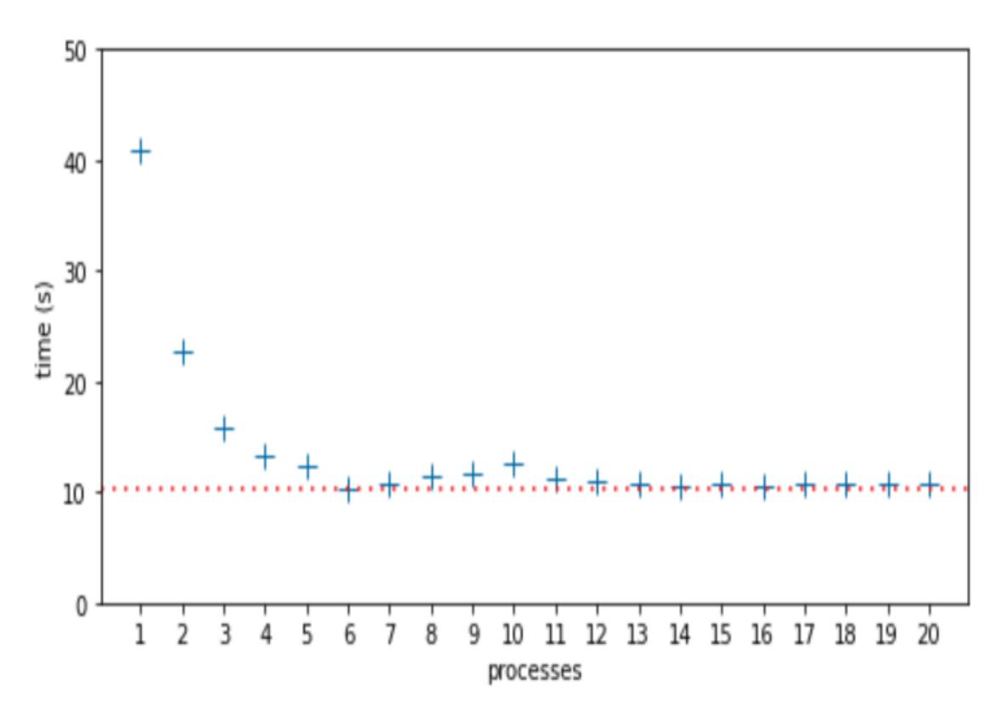
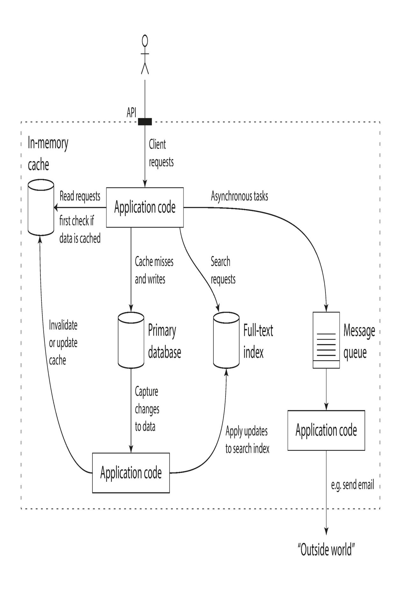
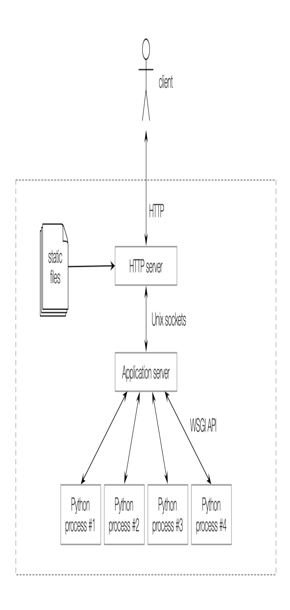

<span id="page-1019-2"></span>
# Chapter 20: Concurrency Models in Python

## A NOTE FOR EARLY RELEASE READERS

With Early Release ebooks, you get books in their earliest form—the author's raw and unedited content as they write—so you can take advantage of these technologies long before the official release of these titles.

This will be the 20th chapter of the final book. Please note that the GitHub repo will be made active later on.

If you have comments about how we might improve the content and/or examples in this book, or if you notice missing material within this chapter, please reach out to the author at [fluentpython2e@ramalho.org.](mailto:fluentpython2e@ramalho.org)

*Concurrency is about dealing with lots of things at once.*

*Parallelism is about doing lots of things at once.*

*Not the same, but related.*

*One is about structure, one is about execution.*

*Concurrency provides a way to structure a solution to solve a problem that may (but not necessarily) be parallelizable. [1](#page-1076-0)*

<span id="page-1019-1"></span><span id="page-1019-0"></span>—Rob Pike, Co-inventor of the Go language

This chapter is about how to make Python deal with "lots of things at once." This may involve concurrent or parallel programming—even academics who are keen on jargon disagree on how to use those terms. I will adopt Rob Pike's informal definitions quoted above, but note that I've found [2](#page-1076-1)

academic papers and books that claim to be about parallel computing but mostly covered concurrency.

Parallelism is a special case of concurrency, in Pike's view. All parallel systems are concurrent, but not all concurrent systems are parallel. In the early 2000's we used single core machines that handled 100 processes concurrently on GNU Linux. A modern laptop with 4 CPU cores is routinely running more than 200 processes at any given time under normal, casual use. To execute 200 tasks in parallel you'd need 200 cores. So, in practice, most computing is concurrent and not parallel. The OS manages hundreds of processes, making sure each has an opportunity to make progress, even if the CPU itself can't do more than 4 things at once. That's why Rob Pike titled that talk "Concurrency Is Not Parallelism (It's Better)."

This chapter assumes no prior knowledge of concurrent or parallel programming. After a brief conceptual introduction, we will study simple examples to introduce and compare Python's core packages for concurrent programming: threading, multiprocessing, and asyncio.

The last 30% of the chapter is a high-level overview of third-party tools, libraries, application servers, and distributed task queues—all of which can enhance the performance and scalability of Python applications. These are all important topics, but beyond the scope of a book focused on core Python language features. Nevertheless, I felt it was important to address these themes in this second edition of *Fluent Python*, because Python's fitness for concurrent and parallel computing is not limited to what the standard library provides. That's why YouTube, DropBox, Instagram, Reddit, and others were able to achieve Web scale when they started, using Python as their primary language.

<span id="page-1020-0"></span>
## What's new in this chapter

This chapter is new in *Fluent Python, Second Edition*. The spinner examples in ["A Concurrent Hello World"](#page-1025-0) previously were in the chapter about asyncio. Here they are improved, and provide the first illustration of Python's three approaches to concurrency: threads, processes, and native coroutines.

The remaining content is new—except for a few paragraphs that originally appeared in the chapters on concurrent.futures and asyncio.

["The Big Picture"](#page-1054-0) is different from the rest of the book: there are no code examples. The goal is to mention important tools that you may want to study to achieve high-performance concurrency and parallelism beyond what's possible with Python's standard library.

<span id="page-1021-0"></span>
## A Bit of Jargon

Let's make sure we are on the same page regarding some core concepts. Here are some terms I will use for the rest of this chapter and the next two.

## concurrency

The ability to handle multiple pending tasks, making progress one at a time or in parallel (not necessarily) so that they all eventually succeed or fail. A single-core CPU is capable of concurrency if it runs an OS scheduler that interleaves the execution of the pending tasks. Also known as multitasking.

## parallelism

The ability to execute multiple computations at the same time. This requires a multi-core CPU, a GPU, or multiple computers in cluster.

## process

An instance of a computer program while it is running, using memory and a slice of the CPU time. Modern operating systems are able to manage multiple processes concurrently, with each process isolated in its own private memory space. Processes communicate via pipes, sockets, or memory mapped files—all of which can only carry raw bytes, not live Python objects. A process can spawn sub-processes, each called a child process. These are also isolated from each other and from the parent.

## thread

An execution path within a single process. When a process starts, it uses a single thread: the main thread. Using operating system APIs, a process can create more threads that operate concurrently thanks to the operating system scheduler. Threads share the memory space of the process, which holds live Python objects. This allows easy communication between threads, but can also lead to corrupted data when more than one thread updates the same object concurrently.

## contention

Dispute over a limited asset. Resource contention happens when multiple processes or threads try to access a shared resource—such as a lock or storage. There's also CPU contention, when compute-intensive processes or threads must wait for their share of CPU time.

## lock

An object that threads can use to coordinate and synchronize their actions and avoid corrupting data. While updating a shared data structure, a thread should hold an associated lock. This makes other well-behaved threads wait until the lock is released before accessing the same data structure. The simplest type of lock is also known as a mutex (for mutual exclusion).

Now let's use some of that jargon to understand concurrency support in Python.

<span id="page-1022-0"></span>
## Processes, threads, and Python's Infamous GIL

Here is how the concepts we just saw apply to Python programming, in ten points.

- 1. Each instance of the Python interpreter is a process. You can start additional Python processes using the multiprocessing or concurrent.futures libraries. Python's subprocess library is designed to launch processes to run external programs, regardless of the languages used to write them.
- 2. The Python interpreter uses a single thread to run the user's program and the memory garbage collector. You can start additional Python threads using the threading or concurrent.futures libraries.
- 3. Access to reference counts and other internal interpreter state is controlled by a lock, the Global Interpreter Lock (GIL). Only one Python thread can hold the GIL at any time. This means that only one Python thread can execute at any time, regardless of the number of CPU cores.
- <span id="page-1023-0"></span>4. To prevent a Python thread from holding the GIL indefinitely, Python's bytecode interpreter pauses the current Python thread every 5ms by default , releasing the GIL. The thread can then try to reacquire the GIL, but if there are other threads waiting for it, the OS scheduler may pick one of them to proceed. [3](#page-1076-2)
- 5. When we write Python code, we have no control over the GIL. But a built-in function or an extension written in C—or any language that interfaces at the Python/C API level—can release the GIL while running time-consuming tasks.
- <span id="page-1023-1"></span>6. Every Python standard library function that makes a syscall releases the GIL. This includes all functions that perform disk I/O, network I/O, and time.sleep(). Many CPU-intensive functions in the NumPy/SciPy libraries, as well as the compressing/decompressing functions from the zlib and bz2 modules also release the GIL. [4](#page-1077-0) [5](#page-1077-1)
- <span id="page-1023-2"></span>7. Extensions that integrate at the Python/C level can also launch other non-Python threads that are not affected by the GIL. Such

GIL-free threads generally cannot change Python objects, but they can read from and write to the memory underlying array.array [or NumPy arrays, which support the buffer](https://www.python.org/dev/peps/pep-3118/) protocol.

- 8. The effect of the GIL on network programming with Python threads is relatively small, because the I/O functions release the GIL, and reading or writing to the network always implies high latency—compared to reading and writing to memory. Consequently, each individual thread spends a lot of time waiting anyway, so their execution can be interleaved without major impact on the overall throughput. That's why David Beazley says: "Python threads are great at doing nothing." [6](#page-1077-2)
- <span id="page-1024-0"></span>9. Contention over the GIL slows down compute-intensive Python threads. Sequential, single-threaded code is simpler and faster for such tasks.
- 10. To run CPU-intensive Python code on multiple cores, you must use multiple Python processes.

<span id="page-1024-1"></span>Here is a good summary from the documentation of the threading module: [7](#page-1077-3)

*CPython implementation detail: In CPython, due to the Global Interpreter Lock, only one thread can execute Python code at once (even though certain performance-oriented libraries might overcome this limitation). If you want your application to make better use of the computational resources of multi-core machines, you are advised to use multiprocessing or concurrent.futures.ProcessPoolExecutor. However, threading is still an appropriate model if you want to run multiple I/Obound tasks simultaneously.*

The previous paragraph starts with "CPython implementation detail" because the GIL is not part of the Python language definition. The Jython implementation does not have a GIL. Unfortunately, Jython is lagging [behind—it's still tracking Python 2.7. The highly performant PyPy](https://www.pypy.org/)

[interpreter also has a GIL in its 2.7 and 3.7 versions—the latest as o](https://www.pypy.org/)f June, 2021.

Enough concepts for now. Let's see some code.

<span id="page-1025-0"></span>
## A Concurrent Hello World

During a discussion about threads and how to avoid the GIL, Python contributor Michele Simionato [posted an example](https://mail.python.org/pipermail/python-list/2009-February/675659.html) that is like a concurrent *Hello World*: the simplest program to demonstrate how Python can "walk and chew gum."

Simionato's program uses multiprocessing, but I adapted it to introduce threading and asyncio as well. Let's start with the threading version, which may look familiar if you've studied threads in Java or C.

<span id="page-1025-2"></span>
## Spinner with threading

The idea of the next few examples is simple: start a function that blocks for 3 seconds while animating characters in the terminal to let the user know that the program is "thinking" and not stalled.

<span id="page-1025-1"></span>An animated spinner is built by displaying each character in the string "\|/-" in the same screen position. When the slow computation finishes, the line with the spinner is cleared and the result is shown: Answer: 42. [8](#page-1077-4)

Figure 20-1 shows the output of two versions of the spinning example: first with threads, then with coroutines. If you're away from the computer, imagine the \ in the last line is spinning.

*Figure 20-1. The scripts spinner\_thread.py and spinner\_async.py produce similar output: the repr of a spinner object and the text "Answer: 42". In the screenshot, spinner\_async.py is still running, and the animated message "/ thinking!" is shown; that line will be replaced by "Answer: 42" after 3 seconds.*

Let's review the *spinner\_thread.py* script first. [Example 20-1](#page-1026-1) lists the first two functions in the script, and [Example 20-2](#page-1028-0) shows the rest.

<span id="page-1026-1"></span>*Example 20-1. spinner\_thread.py: the spin and slow functions.*

```
import itertools
import time
from threading import Thread, Event
def spin(msg: str, done: Event) -> None: 
 for char in itertools.cycle(r'\|/-'): 
 status = f'\r{char} {msg}' 
 print(status, end='', flush=True)
 if done.wait(.1): 
 break 
 blanks = ' ' * len(status)
 print(f'\r{blanks}\r', end='') 
def slow() -> int:
 time.sleep(3) 
 return 42
```

- This function will run in a separate thread. The done argument is an instance of threading.Event, a simple way to synchronize threads.
- This is an infinite loop because itertools.cycle yields one character at a time, cycling through the string forever.
- The trick for text-mode animation: move the cursor back to the start of the line with the carriage return ASCII control character ('\r').
- The Event.wait(timeout=None) method returns True when the event is set by another thread; if the timeout elapses, it returns False. The .1s timeout sets the "frame rate" of the animation to 10FPS. If you want the spinner to go faster, use a smaller timeout.
- Exit the infinite loop.
- Clear the status line by overwriting with spaces and moving the cursor back to the beginning.
- slow() will be called by the main thread. Imagine this is a slow API call over the network. Calling sleep blocks the main thread, but the GIL is released so the spinner thread can proceed.

## TIP

The first important insight of this example is that time.sleep() blocks the calling thread but releases the GIL, allowing other Python threads to run.

The spin and slow functions will execute concurrently. The main thread —the only thread when the program starts—will start a new thread to run spin and then call slow. By design, there is no API for terminating a thread in Python. You must send it a message to shut down.

The threading.Event class is Python's simplest signalling mechanism to coordinate threads. An Event instance has an internal boolean flag which starts as False. Calling Event.set() sets the flag to True. While the flag is false, if a thread calls Event.wait(), it is blocked until another thread calls Event.set(), at which time Event.wait() returns True. If a timeout in seconds is given to Event.wait(s), this call returns False when the timeout elapses, or returns True as soon as Event.set() is called by another thread.

The supervisor function, listed in [Example 20-2,](#page-1028-0) uses an Event to signal the spin function to exit.

<span id="page-1028-0"></span>*Example 20-2. spinner\_thread.py: the supervisor and main functions.*

```
def supervisor() -> int: 
 done = Event() 
 spinner = Thread(target=spin, args=('thinking!', done)) 
 print(f'spinner object: {spinner}') 
 spinner.start() 
 result = slow() 
 done.set() 
 spinner.join() 
 return result
def main() -> None:
 result = supervisor() 
 print(f'Answer: {result}')
if __name__ == '__main__':
 main()
```

- supervisor will return the result of slow.
- The threading.Event instance is the key to coordinate the activities of the main thread and the spinner thread, as explained below.
- To create a new Thread, provide a function as the target keyword argument, and positional arguments to the target as a tuple passed via args.

Display the spinner object. The output is <Thread(Thread-1, initial)>, where initial is the state of the thread—meaning it has not started.

- Start the spinner thread.
- Call slow, which blocks the main thread. Meanwhile, the secondary thread is running the spinner animation.
- Set the Event flag to True; this will terminate the for loop inside the spin function.
- Wait until the spinner thread finishes.
- Run the supervisor function. I wrote separate main and supervisor functions to make this example look more like the asyncio version in [Example 20-4](#page-1032-0).

When the main thread sets the done event, the spinner thread will eventually notice and exit cleanly.

Now let's take a look at a similar example using the multiprocessing package.

<span id="page-1029-0"></span>
## Spinner with multiprocessing

The multiprocessing package supports running concurrent tasks in separate Python processes instead of threads. When you create a multiprocessing.Process instance, a whole new Python interpreter is started as a child process in the background. Since each Python process has its own GIL, this allows your program to use all available CPU cores. We'll see practical effects in ["A Homegrown Process Pool"](#page-1044-0), but for this simple program it makes no real difference.

The point of this section is to introduce multiprocessing and show that its API emulates the threading API, making it easy to convert

simple programs from threads to processes, as shown in *spinner\_proc.py* ([Example 20-3](#page-1030-0)).

<span id="page-1030-0"></span>*Example 20-3. spinner\_proc.py: only the changed parts are shown. Everything else is the same as spinner\_thread.py.*

```
import itertools
import time
from multiprocessing import Process, Event 
from multiprocessing import synchronize 
def spin(msg: str, done: synchronize.Event) -> None: 
# [snip] the rest of spin and slow functions are unchanged from
spinner_thread.py
def supervisor() -> int:
 done = Event()
 spinner = Process(target=spin, 
 args=('thinking!', done))
 print(f'spinner object: {spinner}') 
 spinner.start()
 result = slow()
 done.set()
 spinner.join()
 return result
# [snip] main function is unchanged as well
```

- The basic multiprocessing API imitates the threading API, but type hints and *mypy* expose this difference: multiprocessing.Event is a function (not a class like threading.Event) which returns a synchronize.Event instance…
- …forcing us to import multiprocessing.synchronize…
- …to write this type hint.
- Basic usage of the Process class is similar to Thread.

The spinner object is displayed as <Process name='Process-1' parent=14868 initial>, were 14868 is the process id of the Python instance running spinner\_proc.py.

The basic API of threading and multiprocessing are similar, but their implementation is very different and multiprocessing has a much larger API to handle the added complexity of multi-process programming. For example, one challenge when converting from threads to processes is how to communicate between processes that are isolated by the operating system and can't share Python objects. This means that objects crossing process boundaries have to be serialized and deserialized, which creates overhead. In [Example 20-3](#page-1030-0) the only data that crosses the process boundary is the Event state, which is implemented with a low-level OS semaphore in the C code underlying the multiprocessing module.

## NOTE

The semaphore is a fundamental building block that can be used to implement other synchronization mechanisms. Python provides different semaphore classes for use with threads, processes and coroutines. We'll see asyncio.Semaphore in "Using [asyncio.as\\_completed and a semaphore" \(Chapter 22\).](029-chapter-22-asynchronous-programming.md#page-1140-0)

Now let's see how the same behavior can be achieved with coroutines instead of threads or processes.

<span id="page-1031-0"></span>
## Spinner with asyncio

## NOTE

[Chapter 22](029-chapter-22-asynchronous-programming.md#page-1122-0) is entirely devoted to asynchronous programming with coroutines. This is just a high-level introduction to contrast this approach with the traditional threading and multiprocessing concurrency models. As such, we will overlook many details.

It is the job of OS schedulers to allocate CPU time to drive threads and processes. In contrast, coroutines are driven by an application-level event loop that manages a queue of pending coroutines, drives them one by one, monitors events triggered by I/O operations initiated by coroutines, and passes control back to the corresponding coroutine when each event happens. The event loop and the library coroutines and the user coroutines all execute in a single thread. Therefore, any time spent in a coroutine slows down the event loop—and all other coroutines.

## NOTE

In the taxi simulator of [Example 19-23](026-chapter-19-classic-coroutines.md#page-1002-0), the taxi\_process classic coroutines were driven by a main loop in the Simulator.run method. That main loop was an event loop, except that it handled simulation events like "drop off passenger" instead of system events triggered by I/O and timers. The event loop of asyncio is more complex than that simulation loop, but the idea is the same. So if you want to understand how concurrency with coroutines works, studying *taxi\_sim.py* may be a good starting point.

The coroutine version of the spinner program is easier to understand if we start from the main function, then study the supervisor. That's what [Example 20-4](#page-1032-0) shows.

<span id="page-1032-0"></span>*Example 20-4. spinner\_async.py: the main function and supervisor coroutine*

```
def main() -> None: 
 result = asyncio.run(supervisor()) 
 print(f'Answer: {result}')
async def supervisor() -> int: 
 spinner = asyncio.create_task(spin('thinking!')) 
 print(f'spinner object: {spinner}') 
 result = await slow() 
 spinner.cancel() 
 return result
if __name__ == '__main__':
 main()
```

- main is the only regular function in this program—the others are coroutines.
- The asyncio.run function starts the event loop to drive the coroutine that will eventually set the other coroutines in motion. The main function will stay blocked until supervisor returns. The return value of supervisor will be the return value of asyncio.run.
- Native coroutines are defined with async def.
- asyncio.create\_task schedules the eventual execution of spin, immediately returning an instance of asyncio.Task.
- The repr of the spinner object looks like <Task pending name='Task-2' coro=<spin() running at /path/to/spinner\_async.py:11>>.
- The await keyword calls slow, blocking supervisor until slow returns. The return value of slow will be assigned to result.
- The Task.cancel method raises a CancelledError exception inside the spin coroutine, as we'll see in [Example 20-5.](#page-1034-0)

[Example 20-4](#page-1032-0) demonstrates the three main ways of running a coroutine: *asyncio.run(coro())*

Called from a regular function to drive a coroutine object which usually is the entry point for all the asynchronous code in the program, like the supervisor in this example. This call blocks until the body of coro returns. The return value of the run() call is whatever the body of coro returns.

*asyncio.create\_task(coro())*

Called from a coroutine to schedule another coroutine to execute eventually. This call does not suspend the current coroutine. It returns a Task instance, an object that wraps the coroutine object and provides methods to control and query its state.

## await coro()

Called from a coroutine to transfer control to the coroutine object returned by coro(). This suspends the current coroutine until the body of coro returns. The value of the await expression is whatever body of coro returns.

## NOTE

Remember: invoking a coroutine as coro() immediately returns a coroutine object, but does not run the body of the coro function. Driving the body of coroutines is the job of the event loop, which invokes the .send() method on the coroutine objects, just like we drove classic coroutines built from generators in [Chapter 19](026-chapter-19-classic-coroutines.md#page-953-0).

Now let's study the spin and slow coroutines in [Example 20-5](#page-1034-0).

<span id="page-1034-0"></span>
## Example 20-5. spinner\_async.py: the spin and slow coroutines

```
import asyncio
import itertools
async def spin(msg: str) -> None: 
 for char in itertools.cycle(r'\|/-'):
 status = f'\r{char} {msg}'
 print(status, flush=True, end='')
 try:
 await asyncio.sleep(.1) 
 except asyncio.CancelledError: 
 break
 blanks = ' ' * len(status)
 print(f'\r{blanks}\r', end='')
async def slow() -> int:
 await asyncio.sleep(3) 
 return 42
```

- We don't need the Event argument that was used to signal that slow had completed its job in *spinner\_thread.py* [\(Example 20-1\)](#page-1026-1).
- Use await asyncio.sleep(.1) instead of time.sleep(.1), to pause without blocking other coroutines. See explanation after this example.
- asyncio.CancelledError is raised when the cancel method is called on the Task controlling this coroutine. Time to exit the loop.
- The slow coroutine also uses await asyncio.sleep instead of time.sleep.

## Experiment: Break the Spinner for an Insight

Here is an experiment I recommend to understand how *spinner\_async.py* works. Import the time module, then go to the slow coroutine and replace the line await asyncio.sleep(3) with a call to time.sleep(3), like this:

<span id="page-1035-0"></span>*Example 20-6. spinner\_async.py: replacing await asyncio.sleep(3) with time.sleep(3)*

```
async def slow() -> int:
 time.sleep(3)
 return 42
```

Watching the behavior is more memorable than reading about it. Go ahead, I'll wait.

When you run the experiment, this is what you see:

- 1. The spinner object is shown, similar to this: <Task pending name='Task-2' coro=<spin() running at /path/to/spinner\_async.py:12>>.
- 2. The spinner never appears. The program hangs for 3 seconds.
- 3. "Answer: 42" is displayed and the program ends.

To understand what is happening, recall that Python code using asyncio has only one flow of execution, unless you've explicitly started additional threads or processes. That means only one coroutine executes at any point in time. Concurrency is achieved by control passing from one coroutine to another. Let's focus on what happens in the supervisor and slow coroutines during the proposed experiment:

*Example 20-7. spinner\_async\_experiment.py: the supervisor and slow coroutines*

```
async def slow() -> int:
 time.sleep(3) 
 return 42
async def supervisor() -> int:
 spinner = asyncio.create_task(spin('thinking!')) 
 print(f'spinner object: {spinner}') 
 result = await slow() 
 spinner.cancel() 
 return result
```

- The spinner task is created, to eventually drive the execution of spin.
- The display shows the Task is "pending".
- The await expression transfers control to the slow coroutine.
- time.sleep(3) blocks for 3 seconds; nothing else can happen in the program, because the main thread is blocked—and it is the only thread. The operating system will continue with other activities. After 3 seconds, sleep unblocks, and slow returns.
- Right after slow returns, the spinner task is cancelled. The flow of control never reached the body of the spin coroutine.

The *spinner\_async\_experiment.py* teaches an important lesson:

## WARNING

Never use time.sleep(…) in asyncio coroutines unless you want to pause your whole program. If a coroutine needs to spend some time doing nothing, it should await asyncio.sleep(DELAY). This yields control back to the asyncio event loop, which can drive other pending coroutines.

<span id="page-1037-2"></span>
## Supervisors Side-by-side

The line count of *spinner\_thread.py* and *spinner\_async.py* is nearly the same. The supervisor functions are the heart of these examples. Let's compare them in detail. [Example 20-8](#page-1037-0) lists only the supervisor from [Example 20-2](#page-1028-0).

<span id="page-1037-0"></span>*Example 20-8. spinner\_thread.py: the threaded supervisor function*

```
def supervisor() -> int:
 done = Event()
 spinner = Thread(target=spin,
 args=('thinking!', done))
 print('spinner object:', spinner)
 spinner.start()
 result = slow()
 done.set()
 spinner.join()
 return result
```

For comparison, [Example 20-9](#page-1037-1) shows the supervisor coroutine from [Example 20-4](#page-1032-0).

<span id="page-1037-1"></span>*Example 20-9. spinner\_async.py: the asynchronous supervisor coroutine*

```
async def supervisor() -> int:
 spinner = asyncio.create_task(spin('thinking!'))
 print('spinner object:', spinner)
 result = await slow()
 spinner.cancel()
 return result
```

Here is a summary of the differences and similarities to note between the two supervisor implementations:

- An asyncio.Task is roughly the equivalent of a threading.Thread.
- A Task drives a coroutine object, and a Thread invokes a callable.
- A coroutine yields control explicitly with the await keyword.
- You don't instantiate Task objects yourself, you get them by passing a coroutine to asyncio.create\_task(…).
- When asyncio.create\_task(…) returns a Task object, it is already scheduled to run, but a Thread instance must be explicitly told to run by calling its start method.
- In the threaded supervisor, slow is a plain function and is directly invoked by the main thread. In the asynchronous supervisor, slow is a coroutine driven by await.
- There's no API to terminate a thread from the outside; instead, you must send a signal—like setting the done Event object. For tasks, there is the Task.cancel() instance method, which raises CancelledError at the await expression where the coroutine body is currently suspended.
- The supervisor coroutine must be started with asyncio.run in the main function.

This comparison should help you understand how concurrent jobs are orchestrated with asyncio, in contrast to how it's done with the Threading module which may be more familiar to you.

One final point related to threads versus coroutines: if you've done any nontrivial programming with threads, you know how challenging it is to reason about the program because the scheduler can interrupt a thread at any time. You must remember to hold locks to protect the critical sections of your program, to avoid getting interrupted in the middle of a multistep operation—which could leave data in an invalid state.

With coroutines, your code is protected against interruption by default. You must explicitly await to let the rest of the program run. Instead of holding locks to synchronize the operations of multiple threads, coroutines are "synchronized" by definition: only one of them is running at any time. When you want to give up control, you use await to yield control back to the scheduler. That's why it is possible to safely cancel a coroutine: by definition, a coroutine can only be cancelled when it's suspended at an await expression, so you can perform cleanup by handling the CancelledError exception.

The time.sleep() call blocks but does nothing. Now we'll experiment with a CPU-intensive call to get a better understanding of the GIL, as well as the effect of CPU-intensive functions in asynchronous code.

<span id="page-1039-1"></span>
## The Real Impact of the GIL

In the threading code ([Example 20-1](#page-1026-1)), you can replace the time.sleep(3) call in the slow function with an HTTP client request from your favorite library, and the spinner will keep spinning. That's because a well-designed network library will release the GIL while waiting for the network.

You can also replace the asyncio.sleep(3) expression in the slow coroutine to await for a response from a well-designed asynchronous network library, because such libraries provide coroutines that yield control back to the event loop while waiting for the network. Meanwhile, the spinner will keep spinning.

With CPU intensive code, the story is different. Consider the function is\_prime in [Example 20-10](#page-1039-0), which returns True if the argument is a prime number, False if it's not.

<span id="page-1039-0"></span>*Example 20-10. primes.py: an easy to read primality check, from Python's [ProcessPoolExecutor](https://docs.python.org/3/library/concurrent.futures.html#processpoolexecutor-example) example.*

```
def is_prime(n: int) -> bool:
 if n < 2:
```

```
 return False
 if n == 2:
 return True
 if n % 2 == 0:
 return False
 root = math.isqrt(n)
 for i in range(3, root + 1, 2):
 if n % i == 0:
 return False
 return True
```

<span id="page-1040-0"></span>The call is\_prime(5\_000\_111\_000\_222\_021) takes about 3.3s on the company laptop I am using now. [9](#page-1077-5)

<span id="page-1040-1"></span>
## Quick Quiz

Given what we've seen so far, please take the time to consider the following three-part question. One part of the answer is tricky (at least it was for me).

*What would happen to the spinner animation if made the following changes, assuming that n = 5\_000\_111\_000\_222\_021—that prime which my machine takes 3.3s to verify:*

- 1. *In spinner\_proc.py, replace time.sleep(3) with a call to is\_prime(n)?*
- 2. *In spinner\_thread.py, replace time.sleep(3) with a call to is\_prime(n)?*
- 3. *In spinner\_async.py, replace await asyncio.sleep(3) with a call to is\_prime(n)?*

Before you run the code or read on, I recommend figuring out the answers on your own. Then, you may want to copy and modify the *spinner*\*.py\_ examples as suggested.

Now the answers, from easier to hardest.

## 1. Answer for multiprocessing

<span id="page-1041-0"></span>The spinner is controlled by a child process, so it continues spinning while the primality test is computed by the parent process. [10](#page-1077-6)

## 2. Answer for threading

The spinner is controlled by a secondary thread, so it continues spinning while the primality test is computed by the main thread.

I did not get this answer right at first: I was expecting the spinner to freeze because I overestimated the impact of the GIL .

In this particular example the spinner keeps spinning because Python suspends the running thread every 5ms (by default), making the GIL available to other pending threads. Therefore, the main thread running is\_prime is interrupted every 5ms, allowing the secondary thread to wake up and iterate once through the for loop, until it calls the wait method of the done event, at which time it will release the GIL. The main thread will then grab the GIL, and the is\_prime computation will proceed for another 5ms.

This does not have a visible impact on the running time of this specific example because the spin function quickly iterates once and releases the GIL as it waits for the done event, so there is not much contention for the GIL. The main thread running is\_prime will have the GIL most of the time.

We got away with a compute intensive task using threading in this simple experiment because there are only two threads: one hogging the CPU, and the other waking up only 10 times per second to update the spinner.

But you if you have two ore more threads vying for a lot of CPU time, your program will be slower than sequential code.

## 3. Answer for asyncio

If you call is\_prime(5\_000\_111\_000\_222\_021) in the slow coroutine of the *spinner\_async.py* example, the spinner will never appear. The effect would be the same we had in [Example 20-6](#page-1035-0), when we replaced await asyncio.sleep(3) with time.sleep(3): no spinning at all. The flow of control will pass from supervisor to slow, and then to is\_prime. When is\_prime returns, slow returns as well, and supervisor resumes, cancelling the spinner task before it is executed even once. The program appears frozen for about 3s, then shows the answer.

## POWER NAPPING WITH SLEEP(0)

One way to keep the spinner alive is to rewrite is\_prime as a coroutine, and periodically call asyncio.sleep(0) in an await expression to yield control back to the event loop, like this:

*Example 20-11. spinner\_async\_nap.py: is\_prime is now a coroutine*

```
async def is_prime(n):
 if n < 2:
 return False
 if n == 2:
 return True
 if n % 2 == 0:
 return False
 root = math.isqrt(n)
 for i in range(3, root + 1, 2):
 if n % i == 0:
 return False
 if i % 100_000 == 1: 
 await asyncio.sleep(0)
 return True
```

- Micro-optimization: bind sleep to asyncio.sleep to avoid the attribute lookup inside the loop.
- await sleep(0) once every 100,000 iterations.

[Issue #284](https://github.com/python/asyncio/issues/284) in the asyncio repository has an informative discussion about the use of asyncio.sleep(0).

However, be aware this will slow down is\_prime, and—more importantly—will still slow down the event loop and your whole program with it. When I used await asyncio.sleep(0) every 100,000 iterations, the spinner was smooth but the program ran in 4.9s on my machine, almost 50% longer than the original primes.is\_prime function by itself with the same argument (5\_000\_111\_000\_222\_021).

Using await asyncio.sleep(0) should be considered a stopgap measure before you refactor your asynchronous code to delegate CPUintensive computations to another process. We'll see one way of doing that with [asyncio.loop.run\\_in\\_executor](https://docs.python.org/3/library/asyncio-eventloop.html#asyncio.loop.run_in_executor), covered in [Chapter 22](029-chapter-22-asynchronous-programming.md#page-1122-0). Another option would be a task queue, which we'll briefly discuss in ["Distributed task queues"](#page-1063-0).

So far, we've only experimented with a single call to a CPU-intensive function. The next section presents concurrent execution of multiple CPUintensive calls.

<span id="page-1044-0"></span>
## A Homegrown Process Pool

## WARNING

I wrote this section to demonstrate the effect of multiple processes for CPU intensive tasks, and the common pattern of using queues to distribute tasks and collect results. [Chapter 21](028-chapter-21-concurrency-with-futures.md#page-1079-0) will show a simpler way of distributing tasks to processes: a ProcessPoolExecutor from the concurrent.futures package, which uses queues internally.

In this section we'll write programs to compute the primality of a sample of 20 integers, from 2 to 9,999,999,999,999,999—i.e. 10 -1, or more than 2 . The sample includes small and large primes, as well as composite numbers with small and large prime factors. 16 53

The *sequential.py* program provides the performance baseline. Here is a sample run:

```
$ python3 sequential.py
 2 P 0.000001s
142702110479723 P 0.568328s
299593572317531 P 0.796773s
3333333333333301 P 2.648625s
3333333333333333 0.000007s
3333335652092209 2.672323s
```

```
4444444444444423 P 3.052667s
4444444444444444 0.000001s
4444444488888889 3.061083s
5555553133149889 3.451833s
5555555555555503 P 3.556867s
5555555555555555 0.000007s
6666666666666666 0.000001s
6666666666666719 P 3.781064s
6666667141414921 3.778166s
7777777536340681 4.120069s
7777777777777753 P 4.141530s
7777777777777777 0.000007s
9999999999999917 P 4.678164s
9999999999999999 0.000007s
Total time: 40.31
```

The results are shown in three columns:

- 1. the number to be checked;
- 2. P if it's a prime number, blank if not;
- 3. elapsed time for checking the primality for that specific number.

In this example, the total time is approximately the sum of the times for [each check—but it is computed separately, as you can see in Example 20-](#page-1045-0) 12.

<span id="page-1045-0"></span>*Example 20-12. sequential.py: sequential primality check for a small dataset*

```
#!/usr/bin/env python3
"""
sequential.py: baseline for comparing sequential, multiprocessing,
and threading code for CPU-intensive work.
"""
from time import perf_counter
from typing import NamedTuple
from primes import is_prime, NUMBERS
class Result(NamedTuple): 
 prime: bool
 elapsed: float
```

```
def check(n: int) -> Result: 
 t0 = perf_counter()
 prime = is_prime(n)
 return Result(prime, perf_counter() - t0)
def main() -> None:
 print(f'Checking {len(NUMBERS)} numbers sequentially:')
 t0 = perf_counter()
 for n in NUMBERS: 
 prime, elapsed = check(n)
 label = 'P' if prime else ' '
 print(f'{n:16} {label} {elapsed:9.6f}s')
 elapsed = perf_counter() - t0 
 print(f'Total time: {elapsed:.2f}s')
if __name__ == '__main__':
 main()
```

- The check function (below) returns a Result tuple with the boolean value of the is\_prime call and the elapsed time.
- check(n) calls is\_prime(n) and computes the elapsed time to return a Result.
- For each number in the sample, we call check and display the result.
- Compute and display the total elapsed time.

<span id="page-1046-0"></span>
## Process-based Solution

The next example, *procs.py*, shows the use of multiple processes to distribute the primality checks across multiple CPU cores. These are the times I get with *procs.py*:

```
$ python3 procs.py
Checking 20 numbers with 12 processes:
 2 P 0.000002s
3333333333333333 0.000021s
4444444444444444 0.000002s
5555555555555555 0.000018s
```

```
6666666666666666 0.000002s
142702110479723 P 1.350982s
7777777777777777 0.000009s
299593572317531 P 1.981411s
9999999999999999 0.000008s
3333333333333301 P 6.328173s
3333335652092209 6.419249s
4444444488888889 7.051267s
4444444444444423 P 7.122004s
5555553133149889 7.412735s
5555555555555503 P 7.603327s
6666666666666719 P 7.934670s
6666667141414921 8.017599s
7777777536340681 8.339623s
7777777777777753 P 8.388859s
9999999999999917 P 8.117313s
Total time: 9.58s
```

The last line of the output shows that *procs.py* was 4.2 times faster than *sequential.py*.

<span id="page-1047-0"></span>
## Understanding the Elapsed Times

Note that the elapsed time in the first column is for checking that specific number. For example, is\_prime(7777777777777753) took almost 8.4s to return True. Meanwhile, other processes were checking other numbers in parallel.

There were 20 numbers to check. I wrote *procs.py* to start a number of worker processes equal to the number of CPU cores, as determined by multiprocessing.cpu\_count().

The total time in this case is much less than sum of the elapsed time for the individual checks. There is some overhead in spinning up processes and in inter-process communication, so the end result is that the multiprocess version is only about 4.2 times faster than the sequential. That's good, but a little disappointing considering the code launches 12 processes to use all cores on this laptop.

## NOTE

The multiprocessing.cpu\_count() function returns 12 on the MacBook Pro I'm using to write this chapter. It's actually a 6-CPU Core-i7, but the OS reports 12 CPUs because of hyper-threading, an Intel technology which executes 2 threads per core. However, hyper-threading works better when one of the threads is not working as hard as the other thread in the same core—perhaps the first is stalled waiting for data after a cache miss, and the other is crunching numbers. Anyway, there's no free lunch: this laptop performs like a 6-CPU machine for compute-intensive work that doesn't use a lot of memory—like that simple primality test. I'm not complaining, just saying.

<span id="page-1048-0"></span>
## Code for the Multi-core Prime Checker

When we delegate computing to threads or processes, our code does not call the worker function directly, so we can't simply get a return value. Instead, the worker is driven by the thread or process library, and it eventually produces a result which needs to be stored somewhere. Coordinating workers and collecting results are common uses of queues in concurrent programming (and also in distributed systems, by the way).

Queues are data structures that—usually—enforce FIFO ordering: first in, first out. Queues need to be implemented according to the underlying concurrency model: the queue package in Python's standard library provides queue classes to support threads, while the multiprocessing and asyncio packages implement their own queue classes. The queue and asyncio packages also include queues that are not FIFO: LifoQueue and PriorityQueue.

Much of the new code in *procs.py* has to do with setting up and using queues. The top of the file is in [Example 20-13](#page-1049-0).

## WARNING

SimpleQueue was added to multiprocessing in Python 3.9. If you're using an earlier version of Python, you can replace SimpleQueue with Queue in this example.

<span id="page-1049-0"></span>
## Example 20-13. procs.py: multiprocess primality check; imports, types and functions

```
import sys
from time import perf_counter
from typing import NamedTuple
from multiprocessing import Process, SimpleQueue, cpu_count 
from multiprocessing import queues 
from primes import is_prime, NUMBERS
class PrimeResult(NamedTuple): 
 n: int
 prime: bool
 elapsed: float
JobQueue = queues.SimpleQueue[int] 
ResultQueue = queues.SimpleQueue[PrimeResult] 
def check(n: int) -> PrimeResult: 
 t0 = perf_counter()
 res = is_prime(n)
 return PrimeResult(n, res, perf_counter() - t0)
def worker(jobs: JobQueue, results: ResultQueue) -> None: 
 while n := jobs.get(): 
 results.put(check(n))
```

- Trying to emulate threading, multiprocessing provides multiprocessing.SimpleQueue, but this is a method bound to a pre-defined instance of a lower-level BaseContext class. We must call this SimpleQueue to build a queue, but it can't be used in type hints.
- multiprocessing.queues includes the SimpleQueue class we need for type hints.
- PrimeResult includes the number checked for primality. Keeping n together with the other result fields simplifies displaying results later.
- We'll use a SimpleQueue to send numbers to the processes that will do the work.

- A second SimpleQueue will collect the results. The values in the queue will be tuples made of the number to be tested for primality, and a Result tuple.
- This is similar to *sequential.py*.
- worker gets a queue with the numbers to be checked, and another to put results.
- In this code, I use the number 0 as a sentinel: a signal for the worker to finish. If n is not 0, proceed with the loop. [11](#page-1077-7)
- Invoke the primality check and enqueue PrimeResult.

<span id="page-1050-1"></span>
## WHAT'S A GOOD POISON PILL?

<span id="page-1050-3"></span>The worker function in [Example 20-13](#page-1049-0) follows a common pattern in concurrent programming: looping indefinitely while taking items from a queue and processing each with a function that does the actual work. The loop ends when the queue produces a sentinel. In this pattern, the sentinel that kills the worker is sometimes called a "poison pill".

<span id="page-1050-2"></span>Besides None, calling object() is a common way to get a unique value to use as sentinel. However, this does not work across processes, because when you pickle.dump and pickle.load an instance of object, the unpickled instance is distinct from the original and doesn't compare equal. If None can occur in the stream, a good alternative is ..., the Ellipsis built-in object, which survives serialization without losing its identity. [12](#page-1077-8)

Now let's study the main function of *procs.py* in [Example 20-14.](#page-1050-0)

<span id="page-1050-0"></span>
## Example 20-14. procs.py: multiprocess primality check; main function

```
def main() -> None:
 if len(sys.argv) < 2: 
 workers = cpu_count()
 else:
 workers = int(sys.argv[1])
 print(f'Checking {len(NUMBERS)} numbers with {workers}
```

```
processes:')
 jobs: JobQueue = SimpleQueue()
 results: ResultQueue = SimpleQueue()
 t0 = perf_counter()
 for n in NUMBERS: 
 jobs.put(n)
 for _ in range(workers):
 proc = Process(target=worker, args=(jobs, results)) 
 proc.start() 
 jobs.put(0) 
 while True:
 n, prime, elapsed = results.get() 
 label = 'P' if prime else ' '
 print(f'{n:16} {label} {elapsed:9.6f}s') 
 if jobs.empty(): 
 break
 elapsed = perf_counter() - t0
 print(f'Total time: {elapsed:.2f}s')
if __name__ == '__main__':
 main()
```

- If no command line argument is given, set the number of workers to the number of CPU cores; otherwise, create as many workers as given in the first argument.
- jobs and results are the queues described in [Example 20-13.](#page-1049-0)
- Enqueue the numbers to be checked in jobs.
- Fork a child process for each worker. Each child will run the loop inside its own instance of the worker function, until it fetches a 0 from the jobs queue.
- Start the child process.
- Enqueue one 0 for each worker as a sentinel.

- Get the checked number n and the Result. Calling .get() on a queue blocks until there is an item in the queue. It's also possible to make this unblocking, or set a timeout. See the [SimpleQueue.get](https://docs.python.org/3/library/queue.html#queue.SimpleQueue.get) documentation for details.
- The results will not come back in the same order we submitted the jobs, so we needed to put n in each PrimeResult tuple to make this print call. Otherwise, we'd have no way to know which result belonged to each number.
- Exit the loop when the jobs queue is empty.

In this example, it's safe to exit the last loop when the jobs queue is empty because the last item put in that queue is a sentinel. Therefore, when a worker gets that sentinel, all the other workers got their sentinels as well, and no more inter-process communication will happen. If the last item in jobs were a big prime, it could happen that jobs is empty but a worker is still running.

## NOTE

If the main process exits before all workers are done, you may see confusing tracebacks on FileNotFoundError exceptions caused by an internal lock in multiprocessing. Debugging concurrent code is always hard, and debugging multiprocessing is even harder, because of all the complexity behind the threadlike façade. Fortunately, the ProcessPoolExecutor we'll meet in [Chapter 21](028-chapter-21-concurrency-with-futures.md#page-1079-0) is simpler and more robust than this example.

## Experimenting with More or Less Workers

You may want try running *procs.py* passing arguments to set the number of worker processes. For example, this command…

\$ python3 procs.py 2

…will launch two worker processes, producing results almost twice as fast as *sequential.py*—if your machine has at least two cores and is not too busy running other programs.

I ran *procs.py* 12 times with 1 to 20 processes, totalling 240 runs. Then I computed the median time for all runs with the same number of processes, and plotted [Figure 20-2](#page-1053-0).

<span id="page-1053-0"></span>

*Figure 20-2. Median run times for each number of processes from 1 to 20. Highest median time was 40.81s, with 1 process. Lowest median was 10.39, with 6 processes, indicated by the dotted line.*

In this 6-core laptop, the lowest median time was with 6 processes: 10.39s —marked by the dotted line in [Figure 20-2](#page-1053-0). I expected the run time to increase after 6 processes due to CPU contention, and it reaches a local maximum of 12.51s at 10 processes. I did not expect and I can't explain why the performance improves at 11 processes and stays almost flat from 13 to 20 processes, with median times only slightly higher than the lowest median time at 6 processes.

<span id="page-1054-4"></span>
## Thread-based Non-solution

<span id="page-1054-1"></span>I also wrote *threads.py*, a version of *procs.py* using threading instead of multiprocessing. The code is very similar—as is usually the case when converting simple examples between these two APIs. . Due to the GIL and the compute-intensive nature of is\_prime, the threaded version is slower than the sequential code, and it gets slower as the number of threads increase, because of CPU contention and the cost of context switching: to switch to a new thread, the OS needs to save CPU registers and update the program counter and stack pointer—triggering expensive side-effects like invalidating caches and swapping memory pages. [13](#page-1077-9) [14](#page-1077-10)

<span id="page-1054-2"></span>The next two chapters will cover more about concurrent programming in Python, using the high-level concurrent.futures library to manage threads and processes ([Chapter 21\)](028-chapter-21-concurrency-with-futures.md#page-1079-0) and the asyncio library for asynchronous programming ([Chapter 22\)](029-chapter-22-asynchronous-programming.md#page-1122-0).

The remaining sections in this chapter aim to answer the question:

*Given the limitations discussed so far, how is Python thriving in a multicore world?*

<span id="page-1054-0"></span>
## The Big Picture

Consider this citation from the widely quoted article *The Free Lunch Is Over* by Herb Sutter:

*The major processor manufacturers and architectures, from Intel and AMD to Sparc and PowerPC, have run out of room with most of their traditional approaches to boosting CPU performance. Instead of driving clock speeds and straight-line instruction throughput ever higher, they are instead turning en masse to hyperthreading and multicore architectures. [15](#page-1077-11)*

<span id="page-1054-3"></span>What Sutter calls the "free lunch" was the trend of software getting faster with no additional developer effort because CPUs were executing sequential code faster, year after year. Since 2004, that is no longer true:

clock speeds and execution optimizations reached a plateau, and now any significant increase in performance must come from leveraging multiple cores or hyper-threading, advances that only benefit code that is written for concurrent execution.

Python's story started in the early 1990's, when CPUs were still getting exponentially faster at sequential code execution. No talk about multi-core CPUs except in supercomputers back then. At the time, the decision to have a GIL was a no-brainer. The GIL makes the interpreter faster when running on a single core, and its implementation simpler. The GIL also makes it easier to write simple extensions through the Python/C API.

<span id="page-1055-0"></span>
### NOTE

<span id="page-1055-1"></span>I just wrote "simple extensions" because an extension does not need to deal with the GIL at all. A function written in C or Fortran may be hundreds of times faster than the same in Python. <sup>17</sup> Therefore the added complexity of releasing the GIL to leverage multi-core CPUs may not be needed in many cases. So we can thank the GIL for many extensions available for Python—and that is certainly one of the key reasons why the language is so popular today.

Despite the GIL, Python is thriving in applications that require concurrent or parallel execution, thanks to libraries and software architectures that work around the limitations of CPython.

Now let's discuss how Python is used in system administration, data science, and server-side application development in the multi-core, distributed computing world of 2021.

<span id="page-1055-2"></span>
## System Administration

Python is widely used to manage large fleets of servers, routers, load balancers, network-attached storage (NAS). It's also a leading option in software-defined networking (SDN) and ethical hacking. Major cloud service providers support Python through libraries and tutorials authored by the providers themselves or by their large communities of Python users.

In this domain, Python scripts automate configuration tasks by issuing commands to be carried out by the remote machines, so rarely there are CPU-bound operations to be done. Threads or coroutines are well suited for such jobs. In particular, the concurrent.futures package we'll see in [Chapter 21](028-chapter-21-concurrency-with-futures.md#page-1079-0) can be used to perform the same operations on many remote machines at the same time without a lot of complexity.

There is also a growing number of libraries for system administration supporting coroutines and asyncio. In 2016, Facebook's Production [Engineering team reported: "We are increasingly relying on AsyncIO,](https://engineering.fb.com/2016/05/27/production-engineering/python-in-production-engineering/) which was introduced in Python 3.4, and seeing huge performance gains as we move codebases away from Python 2."

<span id="page-1056-0"></span>
## Data Science

Data Science—including Artificial Intelligence—and scientific computing are very well served by Python. Applications in these fields are computeintensive, but Python users benefit from a vast ecosystem of numeric computing libraries written in C, C++, Fortran, Cython, etc.—many of which are able to leverage multi-core machines, GPUs, and/or distributed parallel computing in heterogeneous clusters.

As of 2021, Python's data science ecosystem includes impressive tools such as:

## Project Jupyter

Two browser based interfaces—Jupyter Notebook and JupyterLab—that allow users to run and document analytics code potentially running across the network on remote machines. Both are hybrid Python/JavaScript applications, supporting computing kernels written in different languages, all integrated via ZeroMQ—an asynchronous messaging library for distributed applications. The name *Jupyter* actually comes from Julia, Python, and R, the first three languages supported by the Notebook. The rich ecosystem built on top of the Jupyter tools include [Bokeh,](https://docs.bokeh.org/en/latest/index.html) a powerful interactive visualization library that lets users navigate and interact with large datasets or continuously

updated streaming data, thanks to the performance of modern JavaScript engines and browsers.

## TensorFlow and PyTorch

[These are the top two deep learning frameworks, according to O'Reilly](https://www.oreilly.com/radar/where-programming-ops-ai-and-the-cloud-are-headed-in-2021/) Media's January 2021 report on usage of their learning resources during 2020. Both projects are written in C++, and are able to leverage multiple cores, GPUs, and clusters. They support other languages as well, but Python is their main focus and is used by the majority of their users. TensorFlow was created and is used internally by Google; PyTorch by Facebook.

## Dask

A parallel computing library that can farm out work to local processes or clusters of machines, "tested on some of the largest supercomputers in the world"—as their [home page](https://dask.org/) states. Dask offers APIs that closely emulate NumPy, Pandas, and Scikit-Learn—the most popular libraries in data science and machine learning today. Dask can be used from JupyterLab or Jupyter Notebook, and leverages Bokeh not only for data visualization but also for an interactive dashboard showing the flow of data and computations across the processes/machines in near real-time. Dask is so impressive that I recommend watching a video such as this [15-minute demo](https://www.youtube.com/watch?v=ods97a5Pzw0) in which Matthew Rocklin—a maintainer of the project—shows Dask crunching data on 64 cores distributed in 8 EC2 machines on AWS.

These are only some examples to illustrate how the data science community is creating solutions that leverage the best of Python and overcome the limitations of the CPython runtime.

<span id="page-1057-0"></span>
## Server-side Web/Mobile Development

Python is widely used in Web applications and for the back-end APIs supporting mobile applications. How is it that Google, YouTube, Dropbox, Instagram, Quora, and Reddit—among others—managed to build Python server-side applications serving hundreds of millions of users 24x7? Again, the answer goes way beyond what Python provides "out of the box."

Before we discuss tools to support Python at scale, I must quote an admonition from the Thoughtworks Technology Radar:

## High performance envy/web scale envy

*We see many teams run into trouble because they have chosen complex tools, frameworks or architectures because they "might need to scale". Companies such as Twitter and Netflix need to support extreme loads and so need these architectures, but they also have extremely skilled development teams able to handle the complexity. Most situations do not require these kinds of engineering feats; teams should keep their web scale envy in check in favor of simpler solutions that still get the job done. [18](#page-1077-14)*

<span id="page-1058-0"></span>At *Web scale*, the key is an architecture that allows horizontal scaling. At that point, all systems are distributed systems, and no single programming language is likely to be the right choice for every part of solution.

Distributed systems is a field of academic research, but fortunately some practitioners have written accessible books anchored on solid research and practical experience. One of them is Martin Kleppmann, the author of *Designing Data-Intensive Applications* (O'Reilly, 2017).

Consider Figure 20-3, the first of many architecture diagrams in Kleppmann's book. Here are some components I've seen in Python engagements that I worked on or have firsthand knowledge:

- <span id="page-1058-1"></span>application caches : *memcached*, *Varnish*, *Redis*; [19](#page-1077-15)
- relational databases: *PostgreSQL*, *MySQL*;
- document databases: *Apache CouchDB*, *MongoDB*;
- full-text indexes: *Elasticsearch*, *Apache Solr*;
- message queues: *RabbitMQ*, *Redis*.



There are other industrial-strength Open Source products in each of those categories. Major cloud providers also offer their own proprietary alternatives.

Kleppmann's diagram is general and language-independent—as is his book. For Python server-side applications, two specific components are often deployed:

- <span id="page-1060-0"></span>An application server to distribute the load among several instances of the Python application. The application server would appear near the top in Figure 20-3, handling client requests before they reached the application code.
- A task queue built around the message queue on the right-hand side of Figure 20-3, providing a higher level, easier to use API to distribute tasks to workers running on other machines.

The next two sections explore these components that are recommended best practices in Python server-side deployments.

<span id="page-1060-2"></span>
## WSGI Application servers

<span id="page-1060-1"></span>WSGI—the [Web Server Gateway Interface—](https://www.python.org/dev/peps/pep-3333/)is a standard API for a Python framework or application to receive requests from a HTTP server and send responses to it. The WSGI API is implemented by application servers manage one or more Python processes running your application, maximizing the use of the available CPUs. Figure 20-4 illustrates a typical deployment. [21](#page-1077-17)



*Figure 20-4. Clients connect to a HTTP server that delivers static files and routes other requests to the application server, which forks several Python processes to run the application code, maximizing the use of the CPU cores.*

The best known application servers in Python Web projects are:

- *[mod\\_wsgi](https://modwsgi.readthedocs.io/en/master/)*;
- <span id="page-1062-0"></span>*[uWSGI](https://uwsgi-docs.readthedocs.io/en/latest/)*; [22](#page-1078-0)
- *[gunicorn](https://gunicorn.org/)*;
- *[NGINX Unit](https://unit.nginx.org/)*.

For users Apache HTTP, *mod\_wsgi* is the best option. It's as old as WSGI itself, but is actively maintained, and now provides a command-line launcher called mod\_wsgi-express that makes it easier to configure and more suitable for use in Docker containers.

*uWSGI* and *gunicorn* are the top choices in recent projects I know about. Both are often used with the *NGINX* HTTP server. *uWSGI* offers a lot of extra functionality, including an application cache, a task queue, cron-like periodic tasks, and many other features. On the flip side, *uWSGI* is much harder to configure properly than *gunicorn*. [23](#page-1078-1)

<span id="page-1062-1"></span>Released in 2018, *NGINX Unit* is a new product from the makers of the well known *NGINX* HTTP server and reverse proxy.

*mod\_wsgi* and *gunicorn* support Python Web apps only, while *uWSGI* and *NGINX Unit* work with other languages as well. Please browse their docs to learn more.

The main point: all of these application servers leverage all CPU cores on the server by forking multiple Python processes to run traditional Web apps written in good old sequential code in *Django*, *Flask*, *Pyramid* etc. This explains why it's been possible to earn a living as a Python Web developer without ever studying the threading, multiprocessing, or asyncio modules: the application server handles concurrency transparently.

<span id="page-1063-1"></span>
### ASGI—ASYNCHRONOUS SERVER GATEWAY INTERFACE

WSGI is a synchronous API. It doesn't support coroutines with async/await—the most efficient way to implement WebSockets or HTTP long polling in Python. The [ASGI specification](https://asgi.readthedocs.io/en/latest/index.html) is a successor to WSGI designed for asynchronous Python Web frameworks such as *aiohttp*, *Sanic*, *FastAPI* etc. as well as *Django* and *Flask*, which are gradually adding asynchronous functionality.

Now let's turn to another way of bypassing the GIL to achieve higher performance with server-side Python applications.

<span id="page-1063-0"></span>
## Distributed task queues

When the application server delivers a request to one of the Python processes running your code, your app needs to respond quickly: you want the process to be available to handle the next request as soon as possible. However, some requests demand actions that may take longer—for example, sending e-mail or generating a PDF. That's the problem that distributed task queues are designed to solve.

*[Celery](https://docs.celeryproject.org/en/stable/getting-started/introduction.html)* and [RQ](https://python-rq.org/) are the best known Open Source task queues with Python APIs. Cloud providers also offer their own proprietary task queues.

These products wrap a message queue and offer a high-level API for delegating tasks to workers, possibly running on different machines.

## NOTE

In the context of task queues, the words *producer* and *consumer* are used instead of traditional client/server terminology. For example, a *Django* view handler *produces* job requests which are put in the queue to be *consumed* by one or more PDF rendering processes.

Quoting directly from *Celery*'s [FAQ,](https://docs.celeryproject.org/en/stable/faq.html#what-kinds-of-things-should-i-use-celery-for) here are some typical use cases:

- *Running something in the background. For example, to finish the web request as soon as possible, then update the users page incrementally. This gives the user the impression of good performance and "snappiness", even though the real work might actually take some time.*
- *Running something after the web request has finished.*
- *Making sure something is done, by executing it asynchronously and using retries.*
- *Scheduling periodic work.*

Besides solving these immediate problems, task queues support horizontal scalability. Producers and consumers are decoupled: a producer doesn't call a consumer, it puts a request in a queue. Consumers don't need to know anything about the producers (but the request may include information about the producer, if an acknowledgement is required). Crucially, you can easily add more workers to consume tasks as demand grows. That's why *Celery* and *RQ* are called distributed task queues.

Recall that our simple *procs.py* [\(Example 20-13](#page-1049-0)) used two queues: one for job requests, the other for collecting results. The distributed architecture of *Celery* and *RQ* uses a similar pattern. Both support using the *[Redis](https://redis.io/)* NoSQL database as a message queue and result storage. *Celery* also supports other message queues like *RabbitMQ* or *Amazon SQS*, as well other databases for result storage.

<span id="page-1064-0"></span>This wraps up our introduction to concurrency in Python. The next two chapters will continue this theme, focusing on the concurrent.futures and asyncio packages of the standard library.

## Chapter Summary

After a bit of theory, this chapter presented the spinner scripts implemented in each of Python's three native concurrency programming models:

- Threads, with the threading package;
- Processes, with multiprocessing;
- Asynchronous coroutines with asyncio.

We then explored the real impact of the GIL with an experiment: changing the spinner examples to compute the primality of a large integer and observe the resulting behavior. This demonstrated graphically that CPUintensive functions must be avoided in asyncio, as they block the event loop. The threaded version of the experiment worked—despite the GIL because Python periodically interrupts threads, and the example used only two threads: one doing compute-intensive work, and the other driving the animation only 10 times per second. The multiprocessing variant worked around the GIL, starting a new process just for the animation while the main process did the primality check.

The next example, computing several primes, highlighted the difference between multiprocessing and threading, proving that only processes allow Python to benefit from multicore CPUs. Python's GIL makes threads worse than sequential code for heavy computations.

The GIL dominates discussions about concurrent and parallel computing in Python, but we should not overestimate its impact. That was the point of ["The Big Picture"](#page-1054-0). For example, the GIL doesn't affect many use cases of Python in systems administration. On the other hand, the data science and server-side development communities have worked around the GIL with industrial-strength solutions tailored to their specific needs. The last two sections mentioned two common elements to support Python server-side applications at scale: WSGI application servers and distributed task queues.

<span id="page-1066-0"></span>
## Further Reading

This chapter has an extensive reading list, so I split it in subsections.

<span id="page-1066-1"></span>
## Concurrency with threads and processes

The concurrent.futures library covered in [Chapter 21](028-chapter-21-concurrency-with-futures.md#page-1079-0) uses threads, processes, locks, and queues under the hood, but you won't see individual instances of them; they're bundled and managed by the higher-level abstractions of a ThreadPoolExecutor and a ProcessPoolExecutor. If you want to learn more about the practice of [concurrent programming with those low-level objects, An Intro to](https://realpython.com/intro-to-python-threading/) Threading in Python by Jim Anderson is a good first read. Doug Hellmann has a chapter titled *Concurrency with Processes, Threads, and Coroutines* in his [site](https://pymotw.com/3/concurrency.html) and book: [Python 3 Standard Library by Example](https://www.pearson.com/us/higher-education/program/Hellmann-Python-3-Standard-Library-by-Example-The/PGM328871.html) (Addison-Wesley, 2017).

Brett Slatkin's *[Effective Python, Second Edition](http://www.effectivepython.com/)* (Addison-Wesley, 2019), David Beazley's *Python Essential Reference, 4th Edition* (Addison-Wesley Professional, 2009), and Martelli, Ravenscroft & Holden's *Python in a Nutshell*, 3E (O'Reilly) are other general Python references with significant coverage of threading and multiprocessing. The vast multiprocessing official documentation includes useful advice in its [Programming guidelines](https://docs.python.org/3/library/multiprocessing.html#programming-guidelines) section.

Jesse Noller and Richard Oudkerk contributed the multiprocessing [package, introduced in PEP 371 — Addition of the multiprocessing package](https://www.python.org/dev/peps/pep-0371/) to the standard library. The [official documentation for the package](http://bit.ly/multi-docs) is a 93 KB *.rst* file—that's about 63 pages—making it one of the longest chapters in the Python standard library.

In *[High Performance Python, 2nd Edition](https://learning.oreilly.com/library/view/high-performance-python/9781492055013/)* (O'Reilly, 2020), authors Micha Gorelick and Ian Ozsvald includes a chapter about multiprocessing with an example about checking for primes with a different strategy than our *procs.py* example: for each number, they split the range of possible factors—from 2 to sqrt(n)—into sub-ranges, and make each worker

iterate over one of the sub-ranges. Their divide-and-conquer approach is typical of scientific computing applications where the data sets are huge, and workstations (or clusters) have more CPU cores than users. On a server-side system handling requests from many users, it is simpler and more efficient to let each process work on one computation from start to finish—reducing the overhead of communication and coordination among processes. Besides multiprocessing, Gorelick & Ozsvald present many other ways of developing and deploying high performance data science applications leveraging multiple cores, GPUs, clusters, profilers, and compilers like Cython and Numba. Their last chapter, *Lessons from the Field*, is a valuable collection of short case studies contributed by other practitioners of high-performance computing in Python.

In *[Advanced Python Development](https://www.apress.com/gp/book/9781484257920)* (Apress, 2020), author Matthew Wilkes is a rare book that includes short examples to explain concepts, while also showing how to build a realistic application ready for production: a data aggregator, similar to DevOps monitoring systems or IoT data collectors for distributed sensors. Two chapters in *Advanced Python Development* cover concurrent programming with threading and asyncio.

Jan Palach's *[Parallel Programming with Python](https://www.packtpub.com/product/parallel-programming-with-python/9781783288397)* (Packt, 2014), explains the core concepts behind concurrency and parallelism, covering Python's standard library as well as *Celery*.

<span id="page-1067-0"></span>*The Truth About Threads* is the title of chapter 2 in *[Using Asyncio in Python](https://learning.oreilly.com/library/view/using-asyncio-in/9781492075325/)* by Caleb Hattingh (O'Reilly, 2020). The chapter covers the benefits and drawbacks of threading—with compelling quotes from several authoritative sources—making it clear that the fundamental challenges of threads have nothing to do with Python or the GIL. Quoting verbatim from page 14 of *Using Asyncio in Python*: [24](#page-1078-2)

*These themes repeat throughout:*

- *Threading makes code hard to reason about.*
- *Threading is an inefficient model for large-scale concurrency (thousands of concurrent tasks).*

If you want to learn the hard way how difficult it is to reason about threads and locks—without risking your job—try the exercises in Alen Downey's workbook *[The Little Book of Semaphores](https://greenteapress.com/wp/semaphores/)*. The exercises in Downey's book range from easy to very hard to unsolvable, but even the easy ones are eye opening.

<span id="page-1068-1"></span>
## The GIL

If you are intrigued about the GIL, start with the *Python Library and Extension FAQ* (["Can't we get rid of the Global Interpreter Lock?"](http://bit.ly/1HGtb0F)). Also worth reading are posts by Guido van Rossum and Jesse Noller (contributor of the multiprocessing package): ["It isn't Easy to Remove the GIL"](http://bit.ly/1HGtcBF) and ["Python Threads and the Global Interpreter Lock."](http://bit.ly/1JIvgwd)

*[CPython Internals](https://realpython.com/products/cpython-internals-book/)* by Anthony Shaw explains the implementation of the CPython 3 interpreter at the C programming level. Shaw's longest chapter is *Parallelism and Concurrency*: a deep dive into Python's native support for threads and processes, including managing the GIL from extensions using the C/Python API.

<span id="page-1068-0"></span>Finally, David Beazley has a detailed exploration on the inner workings of the GIL: ["Understanding the Python GIL."](http://www.dabeaz.com/GIL/) In slide #54 of the [presentation](http://bit.ly/1HGtCrK), Beazley reports some alarming results, including a 20× increase in processing time for a particular benchmark with the new GIL algorithm introduced in Python 3.2. However, Beazley apparently used an empty while True: pass to simulate CPU-bound work, and that is not [realistic. The issue is not significant with real workloads, according to a](http://bugs.python.org/issue7946#msg223110) comment by Antoine Pitrou—who implemented the new GIL algorithm in the bug report submitted by Beazley. [25](#page-1078-3)

<span id="page-1068-2"></span>
## Concurrency beyond the standard library

I've already mentioned two books that cover concurrency using Python's standard library, which also include significant coverage of third-party libraries and tools: *[H](https://www.packtpub.com/product/parallel-programming-with-python/9781783288397)[igh Performance Python, 2nd Editio](https://learning.oreilly.com/library/view/high-performance-python/9781492055013/)[n](https://www.packtpub.com/product/parallel-programming-with-python/9781783288397)* and *Parallel Programming with Python*.

Francesco Pierfederici's [Distributed Computing with Python](https://www.packtpub.com/product/distributed-computing-with-python/9781785889691) (Packt, 2016), which also addresses using cloud providers and HPC (High-Performance Computing) clusters.

[Python, Performance, and GPUs](https://towardsdatascience.com/python-performance-and-gpus-1be860ffd58d) by Matthew Rocklin is "a status update for using GPU accelerators from Python", posted in June 2019.

"Instagram currently features the world's largest deployment of the *Django* web framework, which is written entirely in Python." That's the opening sentence of the blog post [Web Service Efficiency at Instagram with Python](https://instagram-engineering.com/web-service-efficiency-at-instagram-with-python-4976d078e366) written by Min Ni—a software engineer at Instagram. The post describes metrics and tools Instagram uses to optimize the efficiency of their Python codebase, as well as detect and diagnose performance regressions as they deploy their back end "30-50 times a day."

*[Architecture Patterns with Python: Enabling Test-Driven Development,](https://www.oreilly.com/library/view/architecture-patterns-with/9781492052197/) Domain-Driven Design, and Event-Driven Microservices* by Harry Percival & Bob Gregory (O'Reilly, 2020) presents architectural patterns for Python server-side applications. The authors also made the book freely available online at [cosmicpython.com.](https://www.cosmicpython.com/)

Two elegant and easy to use libraries for parallelizing tasks over processes are *[lelo](https://pypi.python.org/pypi/lelo)* by João S. O. Bueno and *[python-parallelize](http://bit.ly/1HGtF6Q)* by Nat Pryce. The *lelo* package defines a @parallel decorator that you can apply to any function to magically make it unblocking: when you call the decorated function, its execution is started in another process. Nat Pryce's *pythonparallelize* package provides a parallelize generator that distributes the execution of a for loop over multiple CPUs. Both packages are built on the multiprocessing library.

Python core developer Eric Snow maintains a [Multi-core Python](https://github.com/ericsnowcurrently/multi-core-python/wiki) wiki, with notes about his and other people's efforts to improve Python's support for [parallel execution. Snow is the author of PEP 554—Multiple Interpreters in](https://www.python.org/dev/peps/pep-0554/) the Stdlib. If approved and implemented, PEP 554 lays the groundwork for future enhancements that may eventually allow Python to use multiple cores without the overheads of multiprocessing. One of the biggest

blockers is the complex interaction between multiple active subinterpreters and extensions that assume a single interpreter.

Mark Shannon—also a Python maintainer—created a useful table comparing concurrent models in Python

*[https://gist.github.com/markshannon/79cace3656b40e21b7021504daee950](https://gist.github.com/markshannon/79cace3656b40e21b7021504daee950c) c* referenced in a discussion about subinterpreters between him, Eric Snow, and other developers on the *[python-dev](https://mail.python.org/archives/list/python-dev@python.org/message/YOOQZCFOKEPQ24YHWWLQSJ3RCXFMS7D7/)* mailing list. In Shannon's table, the "Ideal CSP" column refers to the theoretical Communicating sequential [processes model proposed by Tony Hoare in 1978. Go also allows share](https://en.wikipedia.org/wiki/Communicating_sequential_processes)d objects, violating an essential constraint of CSP: execution units should communicate through message passing through channels.

The actor model of concurrent programming underlies the highly scalable Erlang and Elixir languages, as well as the Akka framework for Scala and Java. If you want to try out the actor model in Python, check out the [Thespian](http://thespianpy.com/doc/) and [Pykka](https://www.pykka.org/en/latest/) libraries.

My remaining recommendations have few or zero mentions of Python, but are nevertheless relevant to readers interested in the theme of this chapter.

<span id="page-1070-1"></span>
## Concurrency and scalability beyond Python

*[RabbitMQ in Action](https://www.manning.com/books/rabbitmq-in-action)* by Alvaro Videla and Jason J. W. Williams (Manning, 2012) is a very well written introduction to *RabbitMQ* and the Advanced Message Queuing Protocol (AMQP) standard, with examples in Python, PHP, and Ruby. Regardless of the rest of your tech stack, and even if you plan to use *Celery* with *RabbitMQ* under the hood, I recommend this book for its coverage of concepts, motivation, and patterns for distributed message queues, as well as operating and tuning *RabbitMQ* at scale.

<span id="page-1070-0"></span>I learned a lot reading *[Seven Concurrency Models in Seven Weeks](https://pragprog.com/titles/pb7con/seven-concurrency-models-in-seven-weeks/)*, by Paul Butcher (Pragmatic Bookshelf, 2014)—with the eloquent subtitle *When Threads Unravel*. Chapter 1 of the book presents the core concepts and challenges of programming with threads and locks in Java. The remaining six chapters the book are devoted to what the author considers better alternatives for concurrent and parallel programming, as supported by [26](#page-1078-4)

different languages, tools and libraries. The examples use Java, Clojure, Elixir, and C (for the chapter about parallel programming with the OpenCL [framework\). The CSP model is exemplified with Clojure code, although the](https://en.wikipedia.org/wiki/OpenCL) Go language deserves credit for popularizing that approach. Elixir is the language of the examples illustrating the actor model. A freely available, alternative [bonus chapter](https://media.pragprog.com/titles/pb7con/Bonus_Chapter.pdf) about actors uses Scala and the Akka framework. Unless you already know Scala, Elixir is a more accessible language to learn and experiment with the actor model and the Erlang/OTP distributed systems platform.

Unmesh Joshi of Thoughtworks has contributed several pages documenting *Patterns of Distributed Systems* to Martin Fowler's [blog.](https://martinfowler.com/) The [opening page](https://martinfowler.com/articles/patterns-of-distributed-systems/) is a great introduction the topic, with links to individual patterns. Joshi is adding patterns incrementally, but what's already there distills years of hard-earned experience in mission-critical systems.

Martin Kleppmann's *[Designing Data-Intensive Applications](https://www.oreilly.com/library/view/designing-data-intensive-applications/9781491903063/)* (O'Reilly, 2017) is a rare book written by a practitioner with deep industry experience and advanced academic background. The author worked with large-scale data infrastructure at LinkedIn and two startups, before becoming a researcher of distributed systems at the University of Cambridge. Each chapter in Kleppmann's book ends with an extensive list of references including recent research results. The book also includes numerous illuminating diagrams and beautiful concept maps.

I was fortunate to be in the audience for Francesco Cesarini's outstanding workshop on the architecture of reliable distributed systems at OSCON 2016: *Designing and architecting for scalability with Erlang/OTP* [\(video](https://www.oreilly.com/library/view/oscon-2016-video/9781491965153/video247021.html) at the O'Reilly Learning Platform). Despite the title, 9:35 into the video Cesarini explains:

*Very little of what I am going to say will be Erlang-specific […]. The fact remains that Erlang will remove a lot of accidental difficulties to making systems which are resilient and which never fail, and are scalable. So it will be much easier if you do use Erlang, or a language running on the Erlang virtual machine.*

[That workshop was based on the last four chapters of](https://learning.oreilly.com/library/view/designing-for-scalability/9781449361556/) *Designing for Scalability with Erlang/OTP* by Francesco Cesarini and Steve Vinoski (O'Reilly, 2016).

Programming distributed systems is challenging and exciting, but beware of *[Web-scale envy](https://www.thoughtworks.com/radar/techniques/high-performance-envy-web-scale-envy)*. The [KISS principle](https://en.wikipedia.org/wiki/KISS_principle) remains solid engineering advice.

Check out the paper *[Scalability! But at what COST?](https://www.usenix.org/conference/hotos15/workshop-program/presentation/mcsherry)* by Frank McSherry, Michael Isard & Derek G. Murray. The authors identified parallel graphprocessing systems presented in academic symposia that require hundreds of cores to outperform a "competent single-threaded implementation." They also found systems that "underperform one thread for all of their reported configurations."

Those findings remind me of a classic hacker quip:

*My Perl script is faster than your Hadoop cluster.*

## SOAPBOX

## Concurrency in the competition

MRI—the reference implementation of Ruby—also has a GIL, so its threads are under the same limitations as Python's. Meanwhile, JavaScript interpreters don't support user-level threads at all; asynchronous programming is their only path to concurrency. I mention this because Ruby and JavaScript are the closest direct competitors to Python as general-purpose, dynamic programming languages.

Looking at languages born in the 21st century, Go and Elixir are probably the ones best positioned to eat Python's lunch when concurrency matters. Both were designed from day 0 to allow highly efficient and reliable concurrent programming. Elixir, Go, and Python are my favorite languages today—in alphabetical order.

## To manage complexity, we need constraints

I learned to program on a TI-58 calculator. Its "language" was similar to assembly. At that level, all "variables" are globals, and you don't have the luxury of structured flow control statements. You have conditional jumps: instructions that take the execution directly to an arbitrary location—ahead or behind the current spot—depending on the value of a CPU register or flag.

Basically you can do anything in assembly, and that's the challenge: there are very few constraints to keep you from making mistakes, and to help maintainers understand the code when changes are needed.

The second language I learned the was the unstructured BASIC that came with 8-bit computers—nothing like VisualBasic, which appeared much later. There were FOR, GOSUB and RETURN statements, but still no concept of local variables. GOSUB did not support parameter passing: it was just a fancy GOTO that put a return line number in a stack so that RETURN had a target to jump to. Subroutines could help themselves to the global data, and put results there too. We had to

improvise other forms of flow control with combinations of IF and GOTO—which, again, allowed you to jump to any line of the program.

After a few years of programming with jumps and global variables, I remember the struggle to rewire my brain for "structured programming" when I learned Pascal. Now I had to use flow control statements around blocks of code that have a single entry point. I couldn't jump to any instruction I liked. Global variables were unavoidable in BASIC, but now they were taboo. I needed to rethink the flow of data and explicitly pass arguments to functions.

The next challenge for me was learning Object Oriented Programming. At core, OOP is structured programming with more constraints and polymorphism. Information hiding forces yet another rethink of where data lives. I remember being frustrated more than once because I had to refactor my code so that a method I was writing could get information that was encapsulated in an object that my method could not reach.

Functional programming languages add other constraints, but immutability is the hardest to swallow after decades of imperative programming and OOP.

After we get used to these constraints, we see them as blessings. They make reasoning about the code much easier.

Lack of constraints is the main problem with the threads-and-locks model of concurrent programming.

When summarizing chapter 1 of *Seven Concurrency Models in Seven Weeks*, Paul Butcher wrote:

*The greatest weakness of the approach, however, is that threads-andlocks programming is hard. It may be easy for a language designer to add them to a language, but they provide us, the poor programmers, with very little help.*

Some examples of unconstrained behavior in that model:

Threads can share access to arbitrary mutable data structures.

- The scheduler can interrupt a thread at almost any point, including in the middle of a simple operation like a += 1. Very few operations are atomic at the level of source code expressions.
- Locks are usually *advisory*. That's a technical term meaning that you must remember to explicitly hold a lock before updating a shared data structure. If you forget to get the lock, nothing prevents your code from messing up the data while another thread dutifully holds the lock and is updating the same data.

In contrast, consider some constraints enforced by the actor model, where the unit of execution is called "actor" instead of thread. [27](#page-1078-5)

- <span id="page-1075-0"></span>An actor can have internal state, but cannot share state with other actors.
- Actors can only communicate by sending and receiving messages.
- Messages only hold copies of data, not references to mutable data.
- An actor only handles one message at a time. There is no concurrent execution inside a single actor.

Of course, you can adopt an *actor style* of coding in any language, by following these rules. You can also use OOP idioms in C, and even structured programming patterns in assembly. But doing any of that requires a lot of agreement and discipline among everyone who touches the code.

Managing locks is unnecessary in the actor model, as implemented by Erlang and Elixir, where all data types are immutable.

Threads-and-locks are not going away. I just don't think dealing with such low-level entities is a good use of my time as I write applications —as opposed to kernel modules or databases.

I reserve the right to change my mind, always. But right now, I am convinced that the actor model is the most sensible, general purpose concurrent programming model available. CSP (Communicating Sequential Process) is also sensible, but its implementation in Go leaves out some constraints.

## Old habits die hard

Like the actor model, CSP also advocates a form of message passing. The best practice is that goroutines—the unit of execution in Go communicate through channels which are essentially queues with blocking puts and gets. Rob Pike—co-creator of Go—is known for his "proverbs", one of which says:

*Don't communicate by sharing memory, share memory by communicating.*

In the name of performance, I've seen Go developers advocate sharing memory as standard practice, instead of an optimization technique to be considered in extreme cases, mostly in libraries, and rarely in application code. Go's standard library provides locks, enabling a coroutine-and-locks style that contradicts the essence of CSP.

In the name of performance, why don't we go back to assembly?

We need constraints to keep our thinking straight and our systems running.

- <span id="page-1076-0"></span>[1](#page-1019-0) Slide 5 of the talk ["Concurrency Is Not Parallelism \(It's Better\)"](http://bit.ly/1OwVTUf).
- <span id="page-1076-1"></span>[2](#page-1019-1) I studied and worked with Prof. Imre Simon who liked to say there are two major sins in science: using different words to mean the same thing and using one word to mean different things. Imre Simon (1943–2009) was a pioneer of computer science in Brazil who made seminal contributions to Automata Theory and started the field of Tropical Mathematics. He was also an advocate of free software and free culture.
- <span id="page-1076-2"></span>[3](#page-1023-0) You can see the configured interval by calling [sys.getswitchinterval\(\)](https://docs.python.org/3/library/sys.html#sys.getswitchinterval) and change it via [sys.setswitchinterval\(s\)](https://docs.python.org/3/library/sys.html#sys.setswitchinterval).

- <span id="page-1077-0"></span>[4](#page-1023-1) A syscall is a call from user code to a function of the operating system kernel. I/O, timers, and locks are some of the kernel services available through syscalls. To learn more, read the Wikipedia [System call](https://en.wikipedia.org/wiki/System_call) article.
- <span id="page-1077-1"></span>[5](#page-1023-2) The zlib and bz2 modules are specifically mentioned in a [python-dev message](https://mail.python.org/pipermail/python-dev/2009-October/093356.html) by Antoine Pitrou, who contributed the time-slicing GIL logic to Python 3.2.
- <span id="page-1077-2"></span>[6](#page-1024-0) Source: slide 106 of ["Generators: The Final Frontier"](http://www.dabeaz.com/finalgenerator/).
- <span id="page-1077-3"></span>[7](#page-1024-1) Source: last paragraph of the [Thread objects](https://docs.python.org/3/library/threading.html#thread-objects) section
- <span id="page-1077-4"></span>[8](#page-1025-1) Unicode has lots of characters useful for simple animations, like the [Braille patterns](https://en.wikipedia.org/wiki/Braille_Patterns) for example. I used the ASCII "\|/-" to keep the examples simple.
- <span id="page-1077-5"></span>[9](#page-1040-0) It's a 15″ MacBook Pro 2018 with a 6-core, 2.2 GHz Intel Core i7 CPU.
- <span id="page-1077-6"></span>[10](#page-1041-0) This is true today because you are probably using a modern OS with *preemptive multitasking*. Windows before the NT era and MacOS before the OSX era were not "preemptive", therefore any process could take over 100% of the CPU and freeze the whole system. We are not completely free of this kind of problem today but trust this gray beard: this troubled every user in the 1990s, and a hard reset was the only cure.
- <span id="page-1077-7"></span>[11](#page-1050-1) In this example, 0 is a convenient sentinel. None is also commonly used for that. Using 0 keeps the type hints for PrimeResult and PrimeResult—and the code for worker—as simple as possible.
- <span id="page-1077-8"></span>[12](#page-1050-2) Surviving serialization without losing our identity is a pretty good life goal.
- <span id="page-1077-9"></span>[13](#page-1054-1) Look for *primes/threads.py* the *[Fluent Python 2e](https://github.com/fluentpython/example-code-2e)* code repository if you are curious.
- <span id="page-1077-10"></span>[14](#page-1054-2) To learn more, see [Context switch](https://en.wikipedia.org/wiki/Context_switch) in the English Wikipedia.
- <span id="page-1077-11"></span>[15](#page-1054-3) *The Free Lunch Is Over: A Fundamental Turn Toward Concurrency in Software*—*Dr. Dobb's Journal*, March 2005. [Available online.](http://www.gotw.ca/publications/concurrency-ddj.htm)
- <span id="page-1077-12"></span>[16](#page-1055-0) These are probably the same reasons that prompted the creator of the Ruby language, Yukihiro Matsumoto, to use a GIL in his interpreter as well.
- <span id="page-1077-13"></span>[17](#page-1055-1) As an exercise in college, I had to implemented the LZW compression algorithm in C. But first I wrote it in Python, to check my understanding of the spec. The C version was about 900× faster.
- <span id="page-1077-14"></span>[18](#page-1058-0) Source: Thoughtworks Technology Advisory Board, [Technology Radar—November 2015](https://www.thoughtworks.com/radar/techniques/high-performance-envy-web-scale-envy).
- <span id="page-1077-15"></span>[19](#page-1058-1) Contrast application caches—used directly by your application code—with HTTP caches, which would be placed on the top edge of Figure 20-3 to serve static assets like images, CSS, and JS files. Content Delivery Networks (CDN) offer another type of HTTP cache, deployed in data centers closer to the end users of your application.
- <span id="page-1077-16"></span>[20](#page-1060-0) Diagram and caption from Figure 1-1 *Designing Data-Intensive Applications* (O'Reilly, 2017)
- <span id="page-1077-17"></span>[21](#page-1060-1) Some speakers spell out the WSGI acronym, while others pronounce it as one word rhyming with "whisky".

- <span id="page-1078-0"></span>[22](#page-1062-0) *uWSGI* is spelled with a lowercase "u", but that is pronounced as the Greek letter "µ", so the whole name sounds like "micro-whisky" with a "g" instead of the "k".
- <span id="page-1078-1"></span>[23](#page-1062-1) [Bloomberg engineers Peter Sperl and Ben Green wrote Configuring uWSGI for Production](https://www.techatbloomberg.com/blog/configuring-uwsgi-production-deployment/) Deployment, explaining how many of the default settings in *uWSGI* are not suitable for many common deployment scenarios. Sperl presented a summary of their recommendations at [EuroPython 2019](https://www.youtube.com/watch?v=p6R1h2Nn468). Highly recommended for users of *uWSGI*.
- <span id="page-1078-2"></span>[24](#page-1067-0) Caleb is one of the tech reviewers of *Fluent Python, Second Edition*
- <span id="page-1078-3"></span>[25](#page-1068-0) Thanks to Lucas Brunialti for sending me a link to this talk.
- <span id="page-1078-4"></span>[26](#page-1070-0) Python's threading and concurrent.futures APIs are heavily influenced by the Java standard library.
- <span id="page-1078-5"></span>[27](#page-1075-0) The Erlang community uses the term "process" for actors. In Erlang, each process is a function in its own loop, so they are very lightweight and it's feasible to have millions of them active at once in a single machine—no relation to the heavyweight OS processes we've been talking about elsewhere in this chapter. So here we have examples of the two sins described by Prof. Simon: using different words to mean the same thing, and using one word to mean different things.
