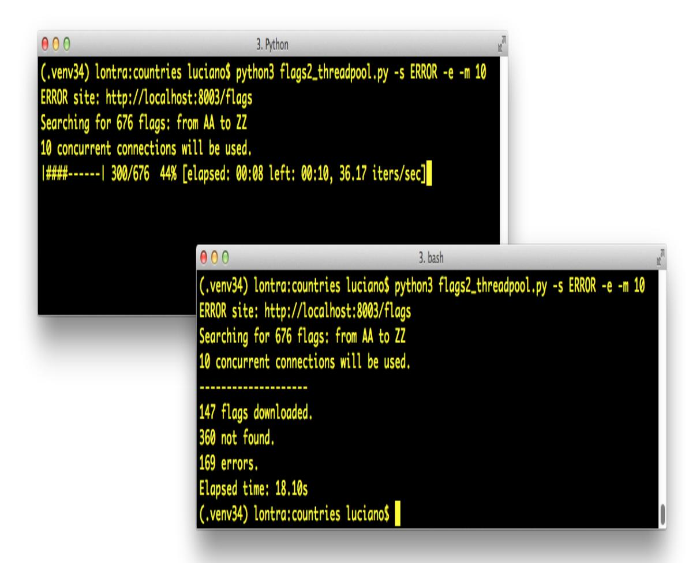

<span id="page-1079-0"></span>
# Chapter 21: Concurrency with Futures

## A NOTE FOR EARLY RELEASE READERS

With Early Release ebooks, you get books in their earliest form—the author's raw and unedited content as they write—so you can take advantage of these technologies long before the official release of these titles.

This will be the 21st chapter of the final book. Please note that the GitHub repo will be made active later on.

If you have comments about how we might improve the content and/or examples in this book, or if you notice missing material within this chapter, please reach out to the author at [fluentpython2e@ramalho.org.](mailto:fluentpython2e@ramalho.org)

*The people bashing threads are typically system programmers which have in mind use cases that the typical application programmer will never encounter in her life. […] In 99% of the use cases an application programmer is likely to run into, the simple pattern of spawning a bunch of independent threads and collecting the results in a queue is everything one needs to know. [1](#page-1120-0)*

<span id="page-1079-1"></span>—Michele Simionato, Python deep thinker

This chapter focuses on the concurrent.futures library that encapsulates the pattern of "spawning a bunch of independent threads and collecting the results in a queue" described by Michele Simionato, making it almost trivial to use. The package also supports processes, useful for compute-intensive tasks.

Here I also introduce the concept of "futures"—objects representing the asynchronous execution of an operation, similar to JavaScript promises. This primitive idea is the foundation not only of concurrent.futures but also of the asyncio package, the subject of [Chapter 22](029-chapter-22-asynchronous-programming.md#page-1122-0).

<span id="page-1080-1"></span>
## What's new in this chapter

This chapter had few important changes from the first edition, because the concurrent.futures API is stable, with minor changes since its introduction in Python 3.2.

[Example 21-3](#page-1086-0) (*flags\_threadpool.py*) is a bit simpler after I removed some code to set up the number of workers, now that the ThreadPoolExecutor in Python 3.8 got smarter: it doesn't start unnecessary threads, and its logic for automatically setting the number of workers was updated. I added a few paragraphs explaining the new logic at the end of ["Downloading with concurrent.futures".](#page-1085-0)

[I was able to greatly simplify the setup for the experiments in "Downloads](#page-1101-0) with Progress Display and Error Handling" thanks to the multi-threaded server added to the [http.server](https://docs.python.org/3/library/http.server.html) package in Python 3.7. Previously, that package offered only the single-threaded BaseHttpServer which was no good for experimenting with concurrent clients, so I had to resort to external tools in the *First Edition*.

In ["Launching Processes with concurrent.futures"](#page-1093-0), I replaced the previous examples using ProcessPoolExecutor with a new version of the primality checker, showing how that class simplifies the code we saw in ["Code for the Multi-core Prime Checker"](027-chapter-20-concurrency-models-in-python.md#page-1048-0).

Finally, I moved some conceptual content to the new [Chapter 20–](027-chapter-20-concurrency-models-in-python.md#page-1019-2) *Concurrency Models in Python*.

<span id="page-1080-0"></span>
## Concurrent Web Downloads

Concurrency is essential to efficient network I/O: instead of wasting CPU cycles waiting for remote machines, the application should do something else until a response comes back over the wire.

To make this last point with code, I wrote three simple programs to download images of 20 country flags from the Web. The first one, *flags.py*, runs sequentially: it only requests the next image when the previous one is downloaded and saved locally. The other two scripts make concurrent downloads: they request several images practically at the same time, and save them as they arrive. The *flags\_threadpool.py* script uses the concurrent.futures package, while *flags\_asyncio.py* uses asyncio.

[Example 21-1](#page-1081-0) shows the result of running the three scripts, three times each. I also posted a [73s video on YouTube](https://www.youtube.com/watch?v=A9e9Cy1UkME) so you can watch them running while a MacOS Finder window displays the flags as they are saved. The scripts are downloading images from *fluentpython.com*, which is behind a CDN, so you may see slower results in the first runs. The results in [Example 21-1](#page-1081-0) were obtained after several runs, so the CDN cache was warm.

<span id="page-1081-0"></span>*Example 21-1. Three typical runs of the scripts flags.py, flags\_threadpool.py, and flags\_asyncio.py*

```
$ python3 flags.py
BD BR CD CN DE EG ET FR ID IN IR JP MX NG PH PK RU TR US VN 
20 flags downloaded in 7.26s 
$ python3 flags.py
BD BR CD CN DE EG ET FR ID IN IR JP MX NG PH PK RU TR US VN
20 flags downloaded in 7.20s
$ python3 flags.py
BD BR CD CN DE EG ET FR ID IN IR JP MX NG PH PK RU TR US VN
20 flags downloaded in 7.09s
$ python3 flags_threadpool.py
DE BD CN JP ID EG NG BR RU CD IR MX US PH FR PK VN IN ET TR
20 flags downloaded in 1.37s 
$ python3 flags_threadpool.py
EG BR FR IN BD JP DE RU PK PH CD MX ID US NG TR CN VN ET IR
20 flags downloaded in 1.60s
$ python3 flags_threadpool.py
BD DE EG CN ID RU IN VN ET MX FR CD NG US JP TR PK BR IR PH
20 flags downloaded in 1.22s
$ python3 flags_asyncio.py 
BD BR IN ID TR DE CN US IR PK PH FR RU NG VN ET MX EG JP CD
20 flags downloaded in 1.36s
$ python3 flags_asyncio.py
```

RU CN BR IN FR BD TR EG VN IR PH CD ET ID NG DE JP PK MX US 20 flags downloaded in 1.27s \$ python3 flags\_asyncio.py RU IN ID DE BR VN PK MX US IR ET EG NG BD FR CN JP PH CD TR 20 flags downloaded in 1.42s

- The output for each run starts with the country codes of the flags as they are downloaded, and ends with a message stating the elapsed time.
- It took *flags.py* an average 7.18s to download 20 images.
- The average for *flags\_threadpool.py* was 1.40s.
- For *flags\_asyncio.py*, 1.35 was the average time.
- Note the order of the country codes: the downloads happened in a different order every time with the concurrent scripts.

The difference in performance between the concurrent scripts is not significant, but they are both more than five times faster than the sequential script—and this is just for the small task of downloading 20 files of a few kilobytes each. If you scale the task to hundreds of downloads, the concurrent scripts can outpace the sequential code by a factor or 20 or more.

## WARNING

While testing concurrent HTTP clients against public Web servers you may inadvertently launch a denial-of-service (DoS) attack, or be suspected of doing so. In the case of [Example 21-1](#page-1081-0), it's OK to do it because those scripts are hardcoded to make only 20 requests. We'll use Python's http.server package to run tests later in this chapter.

Now let's study the implementations of two of the scripts tested in [Example 21-1](#page-1081-0): *flags.py* and *flags\_threadpool.py*. I will leave the third script, *flags\_asyncio.py*, for [Chapter 22,](029-chapter-22-asynchronous-programming.md#page-1122-0) but I wanted to demonstrate all three together to make two points:

- 1. Regardless of the concurrency constructs you use—threads or coroutines—you'll see vastly improved throughput over sequential code in network I/O operations, if you code it properly.
- <span id="page-1083-1"></span>2. For HTTP clients that can control how many requests they make, there is no significant difference in performance between threads and coroutines. [2](#page-1121-0)

On to the code.

<span id="page-1083-2"></span>
## A Sequential Download Script

[Example 21-2](#page-1083-0) is not very interesting, but we'll reuse most of its code and settings to implement the concurrent scripts, so it deserves some attention.

## NOTE

For clarity, there is no error handling in [Example 21-2.](#page-1083-0) We will deal with exceptions later, but here we want to focus on the basic structure of the code, to make it easier to contrast this script with the concurrent ones.

<span id="page-1083-0"></span>
## Example 21-2. flags.py: sequential download script; some functions will be reused by the other scripts

```
import time
from pathlib import Path
from typing import Callable
import requests 
POP20_CC = ('CN IN US ID BR PK NG BD RU JP '
 'MX PH VN ET EG DE IR TR CD FR').split() 
BASE_URL = 'http://fluentpython.com/data/flags' 
DEST_DIR = Path('downloaded') 
def save_flag(img: bytes, filename: str) -> None:
```

```
 (DEST_DIR / filename).write_bytes(img)
def get_flag(cc: str) -> bytes: 
 url = f'{BASE_URL}/{cc}/{cc}.gif'.lower()
 resp = requests.get(url)
 return resp.content
def download_many(cc_list: list[str]) -> int: 
 for cc in sorted(cc_list): 
 image = get_flag(cc)
 save_flag(image, f'{cc}.gif')
 print(cc, end=' ', flush=True) 
 return len(cc_list)
def main(downloader: Callable[[list[str]], int]) -> None: 
 t0 = time.perf_counter() 
 count = downloader(POP20_CC)
 elapsed = time.perf_counter() - t0
 print(f'\n{count} downloads in {elapsed:.2f}s')
if __name__ == '__main__':
 main(download_many)
```

- Import the requests library; it's not part of the standard library, so by convention we import it after the standard library modules os, time, and sys, and insert a blank line to separate them.
- List of the ISO 3166 country codes for the 20 most populous countries in order of decreasing population.
- <span id="page-1084-0"></span>The directory with the flag images. [3](#page-1121-1)
- Local directory where the images are saved.
- Save the img bytes to filename in the DEST\_DIR.
- Given a country code, build the URL and download the image using requests, returning the binary contents of the response.
- download\_many is the key function to compare with the concurrent implementations.

- Loop over the list of country codes in alphabetical order, to make it easy to see that the ordering is preserved in the output; return the number of country codes downloaded.
- Display a country code and flush sys.stdout so we can see progress as each download happens; flushing is needed because, otherwise, Python waits for a line break to output the stdout buffer.
- main must be called with the function that will make the downloads; that way, we can use main as library function with other implementations of download\_many in the threadpool and ascyncio examples.
- main records and reports the elapsed time after running the downloader function.
- Call main with the download\_many function.

## TIP

The *[requests](https://pypi.python.org/pypi/requests)* library is more powerful and easier to use than the urllib.request module from the Python 3 standard library. In fact, requests is considered a model Pythonic API.

There's really nothing new to *flags.py*. It serves as a baseline for comparing the other scripts and I used it as a library to avoid redundant code when implementing them. Now let's see a reimplementation using concurrent.futures.

<span id="page-1085-0"></span>
## Downloading with concurrent.futures

The main features of the concurrent.futures package are the ThreadPoolExecutor and ProcessPoolExecutor classes, which implement an API for to submitting callables for execution in different

threads or processes, respectively. The classes transparently manage a pool of worker threads or processes, and queues to distribute jobs and collect results. But the interface is very high level, and we don't need to know about any of those details for a simple use case like our flag downloads.

[Example 21-3](#page-1086-0) shows the easiest way to implement the downloads concurrently, using the ThreadPoolExecutor.map method.

<span id="page-1086-0"></span>*Example 21-3. flags\_threadpool.py: threaded download script using futures.ThreadPoolExecutor*

```
from concurrent import futures
from flags import save_flag, get_flag, main 
def download_one(cc: str): 
 image = get_flag(cc)
 save_flag(image, f'{cc}.gif')
 print(cc, end=' ', flush=True)
 return cc
def download_many(cc_list: list[str]) -> int:
 with futures.ThreadPoolExecutor() as executor: 
 res = executor.map(download_one, sorted(cc_list)) 
 return len(list(res)) 
if __name__ == '__main__':
 main(download_many)
```

- Reuse some functions from the flags module [\(Example 21-2\)](#page-1083-0).
- Function to download a single image; this is what each worker will execute.
- Instantiate the ThreadPoolExecutor as a context manager; the executor.\_\_exit\_\_ method will call executor.shutdown(wait=True), which will block until all threads are done.

The map method is similar to the map built-in, except that the download\_one function will be called concurrently from multiple threads; it returns a generator that you can iterate to retrieve the value returned by each function call—in this case, each call to download\_one will return a country code.

- Return the number of results obtained; if any of the threaded calls raises an exception, that exception is raised here when the implicit next() call inside the list constructor tries to retrieve the corresponding return value from the iterator.
- Call the main function from the flags module, passing the concurrent version of download\_many.

Note that the download\_one function from [Example 21-3](#page-1086-0) is essentially the body of the for loop in the download\_many function from [Example 21-2](#page-1083-0). This is a common refactoring when writing concurrent code: turning the body of a sequential for loop into a function to be called concurrently.

## TIP

[Example 21-3](#page-1086-0) is very short because I was able to reuse most functions from the sequential \_flags.py\_ script. One of the best features of concurrent.futures is to make it simple to add concurrent execution on top of legacy sequential code.

The ThreadPoolExecutor constructor takes several arguments not shown, but the first and most important one is max\_workers, setting the maximum number of worker threads to be executed. Until Python 3.4, max\_workers was required. In 3.5, max\_workers became optional, with a default of None. When max\_workers is None, the ThreadPoolExecutor decides its value using the following expression —since Python 3.8:

```
max_workers = min(32, os.cpu_count() + 4)
```

[The rationale is well explained in the](https://docs.python.org/3.9/library/concurrent.futures.html#concurrent.futures.ThreadPoolExecutor) ThreadPoolExecutor documentation:

*This default value preserves at least 5 workers for I/O bound tasks. It utilizes at most 32 CPU cores for CPU bound tasks which release the GIL. And it avoids using very large resources implicitly on many-core machines.*

*ThreadPoolExecutor now reuses idle worker threads before starting max\_workers worker threads too.*

To conclude: the computed default for max\_workers is sensible, and ThreadPoolExecutor avoids starting new workers unnecessarily. Understanding the logic behind max\_workers may help you decide when and how to set it yourself.

The library is called concurrency.futures yet there are no futures to be seen in [Example 21-3](#page-1086-0), so you may be wondering where they are. The next section explains.

<span id="page-1088-0"></span>
## Where Are the Futures?

Futures are essential components in the internals of concurrent.futures and of asyncio, but as users of these libraries we sometimes don't see them. [Example 21-3](#page-1086-0) leverages futures behind the scenes, but the code I wrote does not touch them directly. This section is an overview of futures, with an example that shows them in action.

Since Python 3.4, there are two classes named Future in the standard library: concurrent.futures.Future and asyncio.Future. They serve the same purpose: an instance of either Future class represents a deferred computation that may or may not have completed. This is similar to the Deferred class in Twisted, the Future class in Tornado, and Promise in modern JavaScript.

Futures encapsulate pending operations so that they can be put in queues, their state of completion can be queried, and their results (or exceptions) can be retrieved when available.

An important thing to know about futures is that you and I should not create them: they are meant to be instantiated exclusively by the concurrency framework, be it concurrent.futures or asyncio. Here is why: a Future represents something that will eventually run, and the only way to be sure that something will run is to schedule its execution. In particular, concurrent.futures.Future instances are created only as the result of scheduling a callable for execution with a concurrent.futures.Executor subclass. For example, the Executor.submit() method takes a callable, schedules it to run, and returns a Future.

Client code is not supposed to change the state of a future: the concurrency framework changes the state of a future when the computation it represents is done, and we can't control when that happens.

Both types of Future have a .done() method that is nonblocking and returns a Boolean that tells you whether the callable wrapped that future has executed or not. However, instead of repeatedly asking whether a future is done, client code usually asks to be notified. That's why both Future classes have an .add\_done\_callback() method: you give it a callable, and the callable will be invoked with the future as the single argument when the future is done.

There is also a .result() method, which works the same in both classes when the future is done: it returns the result of the callable, or re-raises whatever exception might have been thrown when the callable was executed. However, when the future is not done, the behavior of the result method is very different between the two flavors of Future. In a concurrency.futures.Future instance, invoking f.result() will block the caller's thread until the result is ready. An optional timeout argument can be passed, and if the future is not done in the specified time, the result method raises TimeoutError. In [Link to Come], we'll see

that the asyncio.Future.result method does not support timeout, and the preferred way to get the result of futures in that library is to use await—which doesn't work with concurrency.futures.Future instances.

Several functions in both libraries return futures; others use them in their implementation in a way that is transparent to the user. An example of the latter is the Executor.map we saw in [Example 21-3](#page-1086-0): it returns an iterator in which \_\_next\_\_ calls the result method of each future, so we get the results of the futures, and not the futures themselves.

To get a practical look at futures, we can rewrite [Example 21-3](#page-1086-0) to use the [concurrent.futures.as\\_completed](http://bit.ly/1JIsEOW) function, which takes an iterable of futures and returns an iterator that yields futures as they are done.

Using futures.as\_completed requires changes to the download\_many function only. The higher-level executor.map call is replaced by two for loops: one to create and schedule the futures, the other to retrieve their results. While we are at it, we'll add a few print calls to display each future before and after it's done [Example 21-4](#page-1090-0) shows the code for a new download\_many function. The code for download\_many grew from 5 to 17 lines, but now we get to inspect the mysterious futures. The remaining functions are the same as in [Example 21-3](#page-1086-0).

<span id="page-1090-0"></span>*Example 21-4. flags\_threadpool\_futures.py: replacing executor.map with executor.submit and futures.as\_completed in the download\_many function*

```
def download_many(cc_list: list[str]) -> int:
 cc_list = cc_list[:5] 
 with futures.ThreadPoolExecutor(max_workers=3) as executor: 
 to_do: list[futures.Future] = []
 for cc in sorted(cc_list): 
 future = executor.submit(download_one, cc) 
 to_do.append(future) 
 print(f'Scheduled for {cc}: {future}') 
 for count, future in enumerate(futures.as_completed(to_do),
1): 
 res: str = future.result() 
 print(f'{future} result: {res!r}')
```

### **return** count

- For this demonstration, use only the top five most populous countries.
- Set max\_workers to 3 so we can see pending futures in the output.
- Iterate over country codes alphabetically, to make it clear that results will arrive out of order.
- executor.submit schedules the callable to be executed, and returns a future representing this pending operation.
- Store each future so we can later retrieve them with as\_completed.
- Display a message with the country code and the respective future.
- as\_completed yields futures as they are completed.
- Get the result of this future.
- Display the future and its result.

Note that the future.result() call will never block in this example because the future is coming out of as\_completed. [Example 21-5](#page-1091-0) shows the output of one run of [Example 21-4.](#page-1090-0)

<span id="page-1091-0"></span>
## Example 21-5. Output of flags\_threadpool\_futures.py

```
$ python3 flags_threadpool_futures.py
Scheduled for BR: <Future at 0x100791518 state=running> 
Scheduled for CN: <Future at 0x100791710 state=running>
Scheduled for ID: <Future at 0x100791a90 state=running>
Scheduled for IN: <Future at 0x101807080 state=pending> 
Scheduled for US: <Future at 0x101807128 state=pending>
CN <Future at 0x100791710 state=finished returned str> result: 'CN' 
BR ID <Future at 0x100791518 state=finished returned str> result:
'BR'
```

```
<Future at 0x100791a90 state=finished returned str> result: 'ID'
IN <Future at 0x101807080 state=finished returned str> result: 'IN'
US <Future at 0x101807128 state=finished returned str> result: 'US'
```

5 downloads in 0.70s

- The futures are scheduled in alphabetical order; the repr() of a future shows its state: the first three are running, because there are three worker threads.
- The last two futures are pending, waiting for worker threads.
- The first CN here is the output of download\_one in a worker thread; the rest of the line is the output of download\_many.
- Here two threads output codes before download\_many in the main thread can display the result of the first thread.

## TIP

I recommend experimenting with *flags\_threadpool\_futures.py*. If you run it several times, you'll see the order of the results varying. Increasing max\_workers to 5 will increase the variation in the order of the results. Decreasing it to 1 will make this script run sequentially, and the order of the results will always be the order of the submit calls.

We saw two variants of the download script using concurrent.futures: [Example 21-3](#page-1086-0) with ThreadPoolExecutor.map and [Example 21-4](#page-1090-0) with futures.as\_completed. If you are curious about the code for *flags\_asyncio.py*, you may peek at [Example 22-3](029-chapter-22-asynchronous-programming.md#page-1132-0) in [Chapter 22,](029-chapter-22-asynchronous-programming.md#page-1122-0) where it is explained.

Now let's take a brief look at a simple way to work around the GIL for CPU-bound jobs using concurrent.futures.

<span id="page-1093-0"></span>
## Launching Processes with concurrent.futures

The [concurrent.futures](https://docs.python.org/3/library/concurrent.futures.html) documentation page is subtitled "Launching parallel tasks". The package enables parallel computation on multi-core machines because it supports distributing work among multiple Python processes using the ProcessPoolExecutor class.

Both ProcessPoolExecutor and ThreadPoolExecutor implement the [Executor](https://docs.python.org/3.9/library/concurrent.futures.html#concurrent.futures.Executor) interface, so it's easy to switch from a threadbased to a process-based solution using concurrent.futures.

There is no advantage in using a ProcessPoolExecutor for the flags download example or any I/O-bound job. It's easy to verify this; just change these lines in [Example 21-3:](#page-1086-0)

```
def download_many(cc_list: list[str]) -> int:
 with futures.ThreadPoolExecutor() as executor:
```

To this:

```
def download_many(cc_list: list[str]) -> int:
 with futures.ProcessPoolExecutor() as executor:
```

The constructor for ProcessPoolExecutor also has a max\_workers parameter which defaults to None. In that case, the executor limits the number of workers to the number returned by os.cpu\_count().

Processes use more memory and take longer to start than threads, so the real value of ProcessPoolExecutor is in CPU-intensive jobs. Let's go back to the primality test example of ["A Homegrown Process Pool"](027-chapter-20-concurrency-models-in-python.md#page-1044-0), rewriting it with concurrent.futures.

<span id="page-1093-1"></span>
## Multi-core Prime Checker Redux

In ["Code for the Multi-core Prime Checker"](027-chapter-20-concurrency-models-in-python.md#page-1048-0) we studied *procs.py*, a script that checked the primality of some large numbers using

multiprocessing. In [Example 21-6](#page-1094-0) we solve the same problem in the *proc\_pool.py* program using a ProcessPoolExecutor. From the first import to the main() call at the end, *procs.py* has 43 non-blank lines of code, and *proc\_pool.py* has 31—28% shorter.

<span id="page-1094-0"></span>*Example 21-6. proc\_pool.py: procs.py rewritten with ProcessPoolExecutor*

```
import sys
from concurrent import futures 
from time import perf_counter
from typing import NamedTuple
from primes import is_prime, NUMBERS
class PrimeResult(NamedTuple): 
 n: int
 flag: bool
 elapsed: float
def check(n: int) -> PrimeResult:
 t0 = perf_counter()
 res = is_prime(n)
 return PrimeResult(n, res, perf_counter() - t0)
def main() -> None:
 if len(sys.argv) < 2:
 workers = None 
 else:
 workers = int(sys.argv[1])
 executor = futures.ProcessPoolExecutor(workers) 
 actual_workers = executor._max_workers # type: ignore 
 print(f'Checking {len(NUMBERS)} numbers with {actual_workers}
processes:')
 t0 = perf_counter()
 numbers = sorted(NUMBERS, reverse=True) 
 with executor: 
 for n, prime, elapsed in executor.map(check, numbers): 
 label = 'P' if prime else ' '
 print(f'{n:16} {label} {elapsed:9.6f}s')
 time = perf_counter() - t0
```

```
 print(f'Total time: {time:.2f}s')
if __name__ == '__main__':
 main()
```

- No need to import multiprocessing, SimpleQueue etc.; concurrent.futures hides all that.
- The PrimeResult tuple and the check function are the same we saw in *procs.py*, but we don't need the queues and the worker function anymore.
- Instead of deciding ourselves how many workers to use if no commandline argument was given, we set workers to None and let the ProcessPoolExecutor decide.
- Here I build the ProcessPoolExecutor before the with block in ➐ so that I can display the actual number of workers in the next line.
- \_max\_workers is an undocumented instance attribute of a ProcessPoolExecutor. I decided to use it to show the number of workers when the workers variable is None; *mypy* correctly complains when I access it, so I put the type: ignore comment to silence it.
- Sort the numbers to be checked in descending order. This will expose a difference in the behavior of *proc\_pool.py* when compared with *procs.py*. See below.
- Use the executor as a context manager, as usual.
- The executor.map call will return the PrimeResult instances returned by check in the same order as the numbers arguments.

If you run [Example 21-6](#page-1094-0), you'll see the results appearing in strict descending order, as shown in [Example 21-7.](#page-1096-0) In contrast, the ordering of the output of *procs.py* (shown in ["Process-based Solution"](027-chapter-20-concurrency-models-in-python.md#page-1046-0)) is heavily influenced by the difficulty in checking whether each number is a prime. For example, *procs.py* shows the result for 7777777777777777 near the top, because it has a low divisor, 7, so is\_prime quickly determines it's not a prime. In contrast, 7777777536340681 is 88191709 so is\_prime will take much longer to determine that it's a composite number, end even longer to find out that 7777777777777753 is prime—therefore both of these numbers appear near the end of the output of *procs.py*. 2

Running *proc\_pool.py* you'll observe not only the descending order of the results, but also that the program will appear to be stuck after showing the result for 9999999999999999.

<span id="page-1096-0"></span>
## Example 21-7. Output of proc\_pool.py

```
$ ./proc_pool.py
Checking 20 numbers with 12 processes:
9999999999999999 0.000024s 
9999999999999917 P 9.500677s 
7777777777777777 0.000022s 
7777777777777753 P 8.976933s
7777777536340681 8.896149s
6666667141414921 8.537621s
6666666666666719 P 8.548641s
6666666666666666 0.000002s
5555555555555555 0.000017s
5555555555555503 P 8.214086s
5555553133149889 8.067247s
4444444488888889 7.546234s
4444444444444444 0.000002s
4444444444444423 P 7.622370s
3333335652092209 6.724649s
3333333333333333 0.000018s
3333333333333301 P 6.655039s
 299593572317531 P 2.072723s
 142702110479723 P 1.461840s
 2 P 0.000001s
Total time: 9.65s
```

- This line appears very quickly.
- This line takes more than 9.5s to show up.

All the remaining lines appear almost immediately.

Here is why *proc\_pool.py* behaves in that way:

- As mentioned before, executor.map(check, numbers) returns the result in the same order as the numbers are given.
- By default, *proc\_pool.py* uses as many workers as there are CPUs —it's what ProcessPoolExecutor does when max\_workers is None. That's 12 processes in this laptop.
- Because we are submitting numbers in descending order, the first is 9999999999999999, with 9 as a divisor it returns quickly.
- The second number is 9999999999999917, the largest prime in the sample. This will take longer than all the others to check.
- Meanwhile, the remaining 11 processes will be checking other numbers which are either primes or composites with large factors, or composites with very small factors.
- When the worker in charge of 9999999999999917 finally determines that's a prime, all the other processes have completed their last jobs, so the results appear immediately after.

## NOTE

Although the progress of *proc\_pool.py* is not as visible as that of *procs.py*, the overall execution time is practically the same as depicted in [Figure 20-2](027-chapter-20-concurrency-models-in-python.md#page-1053-0), for the same number of workers and CPU cores.

Understanding how concurrent programs behave is not straightforward, so here's is a second experiment that may help you visualize the operation of Executor.map.

<span id="page-1098-1"></span>
## Experimenting with Executor.map

Let's investigate Executor.map`, now using a ThreadPoolExecutor with three workers running five callables that output timestamped messages. The code is in [Example 21-8](#page-1098-0), the out put in [Example 21-9.](#page-1099-0)

<span id="page-1098-0"></span>*Example 21-8. demo\_executor\_map.py: Simple demonstration of the map method of ThreadPoolExecutor*

```
from time import sleep, strftime
from concurrent import futures
def display(*args): 
 print(strftime('[%H:%M:%S]'), end=' ')
 print(*args)
def loiter(n): 
 msg = '{}loiter({}): doing nothing for {}s...'
 display(msg.format('\t'*n, n, n))
 sleep(n)
 msg = '{}loiter({}): done.'
 display(msg.format('\t'*n, n))
 return n * 10 
def main():
 display('Script starting.')
 executor = futures.ThreadPoolExecutor(max_workers=3) 
 results = executor.map(loiter, range(5)) 
 display('results:', results) 
 display('Waiting for individual results:')
 for i, result in enumerate(results): 
 display(f'result {i}: {result}')
if __name__ == '__main__':
 main()
```

- This function simply prints whatever arguments it gets, preceded by a timestamp in the format [HH:MM:SS].
- loiter does nothing except display a message when it starts, sleep for *n* seconds, then display a message when it ends; tabs are used to indent the messages according to the value of *n*.

- loiter returns n \* 10 so we can see how to collect results.
- Create a ThreadPoolExecutor with three threads.
- Submit five tasks to the executor. Since there are only three threads, only three of those tasks will start immediately: the calls loiter(0), loiter(1), and loiter(2)); this is a nonblocking call.
- Immediately display the results of invoking executor.map: it's a generator, as the output in [Example 21-9](#page-1099-0) shows.
- The enumerate call in the for loop will implicitly invoke next(results), which in turn will invoke \_f.result() on the (internal) \_f future representing the first call, loiter(0). The result method will block until the future is done, therefore each iteration in this loop will have to wait for the next result to be ready.

I encourage you to run [Example 21-8](#page-1098-0) and see the display being updated incrementally. While you're at it, play with the max\_workers argument for the ThreadPoolExecutor and with the range function that produces the arguments for the executor.map call—or replace it with lists of handpicked values to create different delays.

[Example 21-9](#page-1099-0) shows a sample run of [Example 21-8.](#page-1098-0)

<span id="page-1099-0"></span>*Example 21-9. Sample run of demo\_executor\_map.py from [Example 21-8](#page-1098-0)*

```
$ python3 demo_executor_map.py
[15:56:50] Script starting. 
[15:56:50] loiter(0): doing nothing for 0s... 
[15:56:50] loiter(0): done.
[15:56:50] loiter(1): doing nothing for 1s... 
[15:56:50] loiter(2): doing nothing for 2s...
[15:56:50] results: <generator object result_iterator at
0x106517168> 
[15:56:50] loiter(3): doing nothing for 3s... 
[15:56:50] Waiting for individual results:
[15:56:50] result 0: 0
```

```
[15:56:51] loiter(1): done.
[15:56:51] loiter(4): doing nothing
for 4s...
[15:56:51] result 1: 10 
[15:56:52] loiter(2): done. 
[15:56:52] result 2: 20
[15:56:53] loiter(3): done.
[15:56:53] result 3: 30
[15:56:55] loiter(4): done. 
[15:56:55] result 4: 40
```

- This run started at 15:56:50.
- <span id="page-1100-0"></span>The first thread executes loiter(0), so it will sleep for 0s and return even before the second thread has a chance to start, but YMMV. [4](#page-1121-2)
- loiter(1) and loiter(2) start immediately (because the thread pool has three workers, it can run three functions concurrently).
- This shows that the results returned by executor.map is a generator; nothing so far would block, regardless of the number of tasks and the max\_workers setting.
- Because loiter(0) is done, the first worker is now available to start the fourth thread for loiter(3).
- This is where execution may block, depending on the parameters given to the loiter calls: the \_\_next\_\_ method of the results generator must wait until the first future is complete. In this case, it won't block because the call to loiter(0) finished before this loop started. Note that everything up to this point happened within the same second: 15:56:50.
- loiter(1) is done one second later, at 15:56:51. The thread is freed to start loiter(4).
- The result of loiter(1) is shown: 10. Now the for loop will block waiting for the result of loiter(2).

- The pattern repeats: loiter(2) is done, its result is shown; same with loiter(3).
- There is a 2s delay until loiter(4) is done, because it started at 15:56:51 and did nothing for 4s.

The Executor.map function is easy to use, but often it's preferable to get the results as they are ready, regardless of the order they were submitted. To do that, we need a combination of the Executor.submit method and the futures.as\_completed function, as we saw in [Example 21-4.](#page-1090-0) We'll come back to this technique in ["Using futures.as\\_completed"](#page-1112-0).

## TIP

The combination of executor.submit and futures.as\_completed is more flexible than executor.map because you can submit different callables and arguments, while executor.map is designed to run the same callable on the different arguments. In addition, the set of futures you pass to futures.as\_completed may come from more than one executor—perhaps some were created by a ThreadPoolExecutor instance while others are from a ProcessPoolExecutor.

In the next section, we will resume the flag download examples with new requirements that will force us to iterate over the results of futures.as\_completed instead of using executor.map.

<span id="page-1101-0"></span>
## Downloads with Progress Display and Error Handling

As mentioned, the scripts in ["Concurrent Web Downloads"](#page-1080-0) have no error handling to make them easier to read and to contrast the structure of the three approaches: sequential, threaded, and asynchronous.

In order to test the handling of a variety of error conditions, I created the flags2 examples:

*flags2\_common.py*

This module contains common functions and settings used by all flags2 examples, including a main function, which takes care of command-line parsing, timing, and reporting results. This is really support code, not directly relevant to the subject of this chapter, so I will [not list the source code here, but you can find it the](https://github.com/fluentpython/example-code-2e) *Fluent Python 2e* code repository.

*flags2\_sequential.py*

A sequential HTTP client with proper error handling and progress bar display. Its download\_one function is also used by flags2\_threadpool.py.

*flags2\_threadpool.py*

Concurrent HTTP client based on futures.ThreadPoolExecutor to demonstrate error handling and integration of the progress bar.

*flags2\_asyncio.py*

Same functionality as previous example but implemented with asyncio and aiohttp[. This will be covered in "Enhancing the](#page-1139-0) asyncio downloader", in [Chapter 22.](029-chapter-22-asynchronous-programming.md#page-1122-0)

### BE CAREFUL WHEN TESTING CONCURRENT CLIENTS

When testing concurrent HTTP clients on public Web servers, you may generate many requests per second, and that's how denial-of-service (DoS) attacks are made. Carefully throttle your clients when hitting public servers. For high-concurrency experiments, set up a local HTTP server for testing. The [ThreadingHTTPServer](https://docs.python.org/3/library/http.server.html#http.server.ThreadingHTTPServer) that comes with Python is OK for testing , and it can serve files in the current directory if you run it with: [5](#page-1121-3)

<span id="page-1103-0"></span>python -m http.server

Append the -h option to the command above for more options.

The most visible feature of the flags2 examples is that they have an animated, text-mode progress bar implemented with the [TQDM package](https://github.com/noamraph/tqdm). I posted a [108s video on YouTube](https://www.youtube.com/watch?v=M8Z65tAl5l4) to show the progress bar and contrast the speed of the three flags2 scripts. In the video, I start with the sequential download, but I interrupt it after 32s because it was going to take more than 5 minutes to hit on 676 URLs and get 194 flags; I then run the threaded and asyncio scripts three times each, and every time they complete the job in 6s or less (i.e., more than 60 times faster). [Figure 21-1](#page-1104-0) shows two screenshots: during and after running *flags2\_threadpool.py*.

<span id="page-1104-0"></span>

*Figure 21-1. Top-left: flags2\_threadpool.py running with live progress bar generated by tqdm; bottom-right: same terminal window after the script is finished.*

TQDM is very easy to use, the simplest example appears in an animated *.gif* in the project's *[README.md](https://github.com/noamraph/tqdm/blob/master/README.md)*. If you type the following code in the Python console after installing the tqdm package, you'll see an animated progress bar were the comment is:

```
>>> import time
>>> from tqdm import tqdm
>>> for i in tqdm(range(1000)):
... time.sleep(.01)
...
>>> # -> progress bar will appear here <-
```

Besides the neat effect, the tqdm function is also interesting conceptually: it consumes any iterable and produces an iterator which, while it's consumed, displays the progress bar and estimates the remaining time to complete all iterations. To compute that estimate, tqdm needs to get an iterable that has a len, or receive as a second argument the expected number of items. Integrating TQDM with our flags2 examples provides an opportunity to look deeper into how the concurrent scripts actually work, by forcing us to use the [futures.as\\_completed](http://bit.ly/1JIsEOW) and the [asyncio.as\\_completed](http://bit.ly/1JIufV1) functions so that tqdm can display progress as each future is completed.

The other feature of the flags2 example is a command-line interface. All three scripts accept the same options, and you can see them by running any of the scripts with the -h option. [Example 21-10](#page-1105-0) shows the help text.

<span id="page-1105-0"></span>
## Example 21-10. Help screen for the scripts in the flags2 series

```
$ python3 flags2_threadpool.py -h
usage: flags2_threadpool.py [-h] [-a] [-e] [-l N] [-m CONCURRENT]
[-s LABEL]
 [-v]
 [CC [CC ...]]
Download flags for country codes. Default: top 20 countries by
population.
positional arguments:
 CC country code or 1st letter (eg. B for
BA...BZ)
optional arguments:
 -h, --help show this help message and exit
 -a, --all get all available flags (AD to ZW)
 -e, --every get flags for every possible code (AA...ZZ)
 -l N, --limit N limit to N first codes
 -m CONCURRENT, --max_req CONCURRENT
 maximum concurrent requests (default=30)
 -s LABEL, --server LABEL
 Server to hit; one of DELAY, ERROR, LOCAL,
REMOTE
 (default=LOCAL)
 -v, --verbose output detailed progress info
```

All arguments are optional. The most important arguments are discussed next.

One option you can't ignore is -s/--server: it lets you choose which HTTP server and base URL will be used in the test. You can pass one of four strings to determine where the script will look for the flags (the strings are case insensitive):

## LOCAL

Use http://localhost:8000/flags; this is the default. You should configure a local HTTP server to answer at port 8000. See ["Setting up test servers"](#page-1107-0) for instructions.

## REMOTE

Use http://fluentpython.com/data/flags; that is a public website owned by me, hosted on a shared server. Please do not pound it with too many concurrent requests. The fluentpython.com domain is handled by the [Cloudflare](http://www.cloudflare.com/) CDN (Content Delivery Network) so you may notice that the first downloads are slower, but they get faster when the CDN cache warms up. [6](#page-1121-4)

## DELAY

<span id="page-1106-0"></span>Use http://localhost:8001/flags; a server delaying HTTP responses should be listening to port 8001. I wrote *slow\_server.py* to make it easier to experiment. You'll find it in the *21-futures/getflags/* directory of the *[Fluent Python 2e](https://github.com/fluentpython/example-code-2e)* [code repository. See "Setting up test](#page-1107-0) servers" for instructions.

## ERROR

Use http://localhost:8002/flags; a server introducing HTTP errors and delaying responses should be installed at port 8002. Running *slow\_server.py* [is an easy way to do it. See "Setting up test](#page-1107-0) servers".

## SETTING UP TEST SERVERS

<span id="page-1107-0"></span>If you don't already have a local HTTP server for testing, here are the steps for an easy way to do it:

- 1. Clone or download the *[Fluent Python 2e](https://github.com/fluentpython/example-code-2e)* code repository.
- 2. Open your shell and go to the *21-futures/getflags/* directory of your local copy of the repository.
- 3. Unzip the *flags.zip* file, creating a *flags* directory at *21 futures/getflags/flags/*.
- 4. Open a second shell, go to the *21-futures/getflags/* directory and run python3 -m http.server. This will start a ThreadingHTTPServer listening to port 8000, serving the local files. If you open the URL *<http://localhost:8000/flags/>* with your browser, you'll see a long list of directories named with two-letter country codes from ad/ to zw/.
- 5. Now you can go back to the first shell and run the *flags2\*.py* examples with the default --server LOCAL option.
- 6. To test with the --server DELAY option, go to *21 futures/getflags/* and run python3 slow\_server.py 8001. This will add a .5s delay before each response.
- 7. To test with the --server ERROR option, go to *21 futures/getflags/* and run python3 slow\_server.py 8002 --error-rate .25. Each request will have a 25% probability of getting a [418 I'm a teapot](https://developer.mozilla.org/en-US/docs/Web/HTTP/Status/418) response, and all responses will be delayed .5s.

I wrote *slow\_server.py* reusing code from Python's [http.server](https://github.com/python/cpython/blob/917eca700aa341f8544ace43b75d41b477e98b72/Lib/http/server.py) standard library module, which "is not recommended for production" according to the [documentation](https://docs.python.org/3/library/http.server.html). To set up a more reliable testing

environment, I recommend configuring [Nginx](https://www.nginx.com/) and [toxiproxy](https://github.com/shopify/toxiproxy) with equivalent parameters.

By default, each *flags2\*.py* script will fetch the flags of the 20 most populous countries from the LOCAL server (http://localhost:8000/flags) using a default number of

concurrent connections, which varies from script to script. [Example 21-11](#page-1108-0) shows a sample run of the *flags2\_sequential.py* script using all defaults.

<span id="page-1108-0"></span>*Example 21-11. Running flags2\_sequential.py with all defaults: LOCAL site, top-20 flags, 1 concurrent connection*

```
$ python3 flags2_sequential.py
LOCAL site: http://localhost:8000/flags
Searching for 20 flags: from BD to VN
1 concurrent connection will be used.
--------------------
20 flags downloaded.
Elapsed time: 0.10s
```

You can select which flags will be downloaded in several ways. [Example 21-12](#page-1108-1) shows how to download all flags with country codes starting with the letters A, B, or C.

<span id="page-1108-1"></span>*Example 21-12. Run flags2\_threadpool.py to fetch all flags with country codes prefixes A, B, or C from DELAY server*

```
$ python3 flags2_threadpool.py -s DELAY a b c
DELAY site: http://localhost:8001/flags
Searching for 78 flags: from AA to CZ
30 concurrent connections will be used.
--------------------
43 flags downloaded.
35 not found.
Elapsed time: 1.72s
```

Regardless of how the country codes are selected, the number of flags to fetch can be limited with the -l/--limit option. [Example 21-13](#page-1109-0) demonstrates how to run exactly 100 requests, combining the -a option to get all flags with -l 100.

<span id="page-1109-0"></span>
## Example 21-13. Run flags2\_asyncio.py to get 100 flags (-al 100) from the ERROR server, using 100 concurrent requests (-m 100)

```
$ python3 flags2_asyncio.py -s ERROR -al 100 -m 100
ERROR site: http://localhost:8002/flags
Searching for 100 flags: from AD to LK
100 concurrent connections will be used.
--------------------
73 flags downloaded.
27 errors.
Elapsed time: 0.64s
```

That's the user interface of the flags2 examples. Let's see how they are implemented.

<span id="page-1109-2"></span>
## Error Handling in the flags2 Examples

The common strategy in all three examples to deal with HTTP errors is that 404 errors (not found) are handled by the function in charge of downloading a single file (download\_one). Any other exception propagates to be handled by the download\_many function or the supervisor coroutine —in the asyncio example.

Once more, we'll start by studying the sequential code, which is easier to follow—and mostly reused by the thread pool script. [Example 21-14](#page-1109-1) shows the functions that perform the actual downloads in the *flags2\_sequential.py* and *flags2\_threadpool.py* scripts.

<span id="page-1109-1"></span>*Example 21-14. flags2\_sequential.py: basic functions in charge of downloading; both are reused in flags2\_threadpool.py*

```
def get_flag(base_url: str, cc: str) -> bytes:
 url = f'{base_url}/{cc}/{cc}.gif'.lower()
 resp = requests.get(url)
 if resp.status_code != 200: 
 resp.raise_for_status()
 return resp.content
def download_one(cc: str, base_url: str, verbose: bool = False):
 try:
 image = get_flag(base_url, cc)
 except requests.exceptions.HTTPError as exc: 
 res = exc.response
```

```
 if res.status_code == 404:
 status = HTTPStatus.not_found 
 msg = 'not found'
 else: 
 raise
 else:
 save_flag(image, f'{cc}.gif')
 status = HTTPStatus.ok
 msg = 'OK'
 if verbose: 
 print(cc, msg)
 return Result(status, cc)
```

- get\_flag uses requests.Response.raise\_for\_status to raise an exception for any HTTP code other than 200.
- download\_one catches requests.exceptions.HTTPError to handle HTTP code 404 specifically…
- …by setting its local status to HTTPStatus.not\_found; HTTPStatus is an Enum imported from *flags2\_common.py*.
- Any other HTTPError exception is re-raised; other exceptions will just propagate to the caller.
- If the -v/--verbose command-line option is set, the country code and status message will be displayed; this how you'll see progress in the verbose mode.
- The Result tuple returned by download\_one will have a status field with a value of HTTPStatus.not\_found or HTTPStatus.ok.

[Example 21-15](#page-1111-0) lists the sequential version of the download\_many function. This code is straightforward, but its worth studying to contrast with the concurrent versions coming up. Focus on how it reports progress, handles errors, and tallies downloads.

<span id="page-1111-0"></span>*Example 21-15. flags2\_sequential.py: the sequential implementation of download\_many*

```
def download_many(cc_list: list[str],
 base_url: str,
 verbose: bool,
 _unused_concur_req: int) -> Counter[int]:
 counter: Counter[int] = Counter() 
 cc_iter = sorted(cc_list) 
 if not verbose:
 cc_iter = tqdm.tqdm(cc_iter) 
 for cc in cc_iter: 
 try:
 res = download_one(cc, base_url, verbose) 
 except requests.exceptions.HTTPError as exc: 
 error_msg = 'HTTP error {res.status_code} -
{res.reason}'
 error_msg = error_msg.format(res=exc.response)
 except requests.exceptions.ConnectionError: 
 error_msg = 'Connection error'
 else: 
 error_msg = ''
 status = res.status
 if error_msg:
 status = HTTPStatus.error 
 counter[status] += 1 
 if verbose and error_msg: 
 print(f'*** Error for {cc}: {error_msg}')
 return counter
```

- This Counter will tally the different download outcomes: HTTPStatus.ok, HTTPStatus.not\_found, or HTTPStatus.error.
- cc\_iter holds the list of the country codes received as arguments, ordered alphabetically.
- If not running in verbose mode, cc\_iter is passed to the tqdm function, which will return an iterator that yields the items in cc\_iter

while also displaying the animated progress bar.

- This for loop iterates over cc\_iter and…
- …performs the download by successive calls to download\_one.
- HTTP-related exceptions raised by get\_flag and not handled by download\_one are handled here.
- Other network-related exceptions are handled here. Any other exception will abort the script, because the flags2\_common.main function that calls download\_many has no try/except.
- If no exception escaped download\_one, then the status is retrieved from the HTTPStatus namedtuple returned by download\_one.
- If there was an error, set the local status accordingly.
- Increment the counter by using the value of the HTTPStatus Enum as key.
- If running in verbose mode, display the error message for the current country code, if any.
- Return the counter so that the main function can display the numbers in its final report.

We'll now study the refactored thread pool example, *flags2\_threadpool.py*.

<span id="page-1112-0"></span>
## Using futures.as\_completed

In order to integrate the TQDM progress bar and handle errors on each request, the *flags2\_threadpool.py* script uses futures.ThreadPoolExecutor with the

futures.as\_completed function we've already seen. [Example 21-16](#page-1113-0) is the full listing of *flags2\_threadpool.py*. Only the download\_many function is implemented; the other functions are reused from *flags2\_common.py* and *flags2\_sequential.py*.

<span id="page-1113-0"></span>
## Example 21-16. flags2\_threadpool.py: full listing

```
from collections import Counter
from concurrent import futures
import requests
import tqdm # type: ignore 
from flags2_common import main, HTTPStatus 
from flags2_sequential import download_one 
DEFAULT_CONCUR_REQ = 30 
MAX_CONCUR_REQ = 1000 
def download_many(cc_list: list[str],
 base_url: str,
 verbose: bool,
 concur_req: int) -> Counter[int]:
 counter: Counter[int] = Counter()
 with futures.ThreadPoolExecutor(max_workers=concur_req) as
executor: 
 to_do_map = {} 
 for cc in sorted(cc_list): 
 future = executor.submit(download_one, cc,
 base_url, verbose) 
 to_do_map[future] = cc 
 done_iter = futures.as_completed(to_do_map) 
 if not verbose:
 done_iter = tqdm.tqdm(done_iter, total=len(cc_list)) 
 for future in done_iter: 
 try:
 res = future.result() 
 except requests.exceptions.HTTPError as exc: 
 error_fmt = 'HTTP {res.status_code} - {res.reason}'
 error_msg = error_fmt.format(res=exc.response)
 except requests.exceptions.ConnectionError:
 error_msg = 'Connection error'
 else:
 error_msg = ''
 status = res.status
```

```
 if error_msg:
 status = HTTPStatus.error
 counter[status] += 1
 if verbose and error_msg:
 cc = to_do_map[future] 
 print(f'*** Error for {cc}: {error_msg}')
 return counter
if __name__ == '__main__':
 main(download_many, DEFAULT_CONCUR_REQ, MAX_CONCUR_REQ)
```

- Import the progress-bar display library, and tell *mypy* to skip checking it.
- Import one function and one Enum from the flags2\_common module.
- Reuse the download\_one from flags2\_sequential [\(Example 21-14](#page-1109-1)).
- If the -m/--max\_req command-line option is not given, this will be the maximum number of concurrent requests, implemented as the size of the thread pool; the actual number may be smaller, if the number of flags to download is smaller.
- MAX\_CONCUR\_REQ caps the maximum number of concurrent requests regardless of the number of flags to download or the -m/--max\_req command-line option; it's a safety precaution.
- Create the executor with max\_workers set to concur\_req, computed by the main function as the smaller of: MAX\_CONCUR\_REQ, the length of cc\_list, and the value of the -m/--max\_req command-line option. This avoids creating more threads than necessary.
- This dict will map each Future instance—representing one download—with the respective country code for error reporting.

- Iterate over the list of country codes in alphabetical order. The order of the results will depend on the timing of the HTTP responses more than anything, but if the size of the thread pool (given by concur\_req) is much smaller than len(cc\_list), you may notice the downloads batched alphabetically.
- Each call to executor.submit schedules the execution of one callable and returns a Future instance. The first argument is the callable, the rest are the arguments it will receive.
- Store the future and the country code in the dict.
- futures.as\_completed returns an iterator that yields futures as they are done.
- If not in verbose mode, wrap the result of as\_completed with the tqdm function to display the progress bar; because done\_iter has no len, we must tell tqdm what is the expected number of items as the total= argument, so tqdm can estimate the work remaining.
- Iterate over the futures as they are completed.
- Calling the result method on a future either returns the value returned by the callable, or raises whatever exception was caught when the callable was executed. This method may block waiting for a resolution, but not in this example because as\_completed only returns futures that are done.
- Handle the potential exceptions; the rest of this function is identical to the sequential version of download\_many [\(Example 21-15](#page-1111-0)), except for the next callout.
- To provide context for the error message, retrieve the country code from the to\_do\_map using the current future as key. This was not necessary in the sequential version because we were iterating over the

list of country codes, so we had the current cc; here we are iterating over the futures.

## TIP

[Example 21-16](#page-1113-0) uses an idiom that's very useful with futures.as\_completed: building a dict to map each future to other data that may be useful when the future is completed. Here the to\_do\_map maps each future to the country code assigned to it. This makes it easy to do follow-up processing with the result of the futures, despite the fact that they are produced out of order.

<span id="page-1116-0"></span>Python threads are well suited for I/O-intensive applications, and the concurrent.futures package makes them trivially simple to use for certain use cases. With ProcessPoolExecutor, you can also solve CPU-intensive problems on multiple cores—if the computations are ["embarrassingly parallel".](http://bit.ly/1HGtGaR) This concludes our basic introduction to concurrent.futures.

## Chapter Summary

We started the chapter by comparing two concurrent HTTP clients with a sequential one, demonstrating significant performance gains over the sequential script.

After studying the first example based on concurrent.futures, we took a closer look at future objects, either instances of concurrent.futures.Future, or asyncio.Future, emphasizing what these classes have in common (their differences will be emphasized in [Chapter 22](029-chapter-22-asynchronous-programming.md#page-1122-0)). We saw how to create futures by calling Executor.submit, and iterate over completed futures with concurrent.futures.as\_completed.

We then discussed the use of multiple processes with the concurrent.futures.ProcessPoolExecutor class, to go around the GIL and use multiple CPU cores to simplify the multicore prime checker we first saw in [Chapter 20](027-chapter-20-concurrency-models-in-python.md#page-1019-2).

In the following section, we took a close look at how the concurrent.futures.ThreadPoolExecutor works, with a didactic example launching tasks that did nothing for a few seconds, except displaying their status with a timestamp.

Next we went back to the flag downloading examples. Enhancing them with a progress bar and proper error handling prompted further exploration of the future.as\_completed generator function showing a common pattern: storing futures in a dict to link further information to them when submitting, so that we can use that information when the future comes out of the as\_completed iterator.

<span id="page-1117-0"></span>
## Further Reading

The concurrent.futures package was contributed by Brian Quinlan, who presented it in a great talk titled ["The Future Is Soon!"](http://bit.ly/1JIuZJy) at PyCon Australia 2010. Quinlan's talk has no slides; he shows what the library does by typing code directly in the Python console. As a motivating example, the presentation features a short video with XKCD cartoonist/programmer Randall Munroe making an unintended DOS attack on Google Maps to build a colored map of driving times around his city. The formal introduction to the library is PEP 3148 - futures - execute computations [asynchronously. In the PEP, Quinlan wrote that the](https://www.python.org/dev/peps/pep-3148/) concurrent.futures library was "heavily influenced by the Java java.util.concurrent package."

For additional resources covering concurrent.futures, please see ["Further Reading"](027-chapter-20-concurrency-models-in-python.md#page-1066-0) ([Chapter 20](027-chapter-20-concurrency-models-in-python.md#page-1019-2)). All the references that cover Python's threading and multiprocessing [in "Concurrency with threads and](027-chapter-20-concurrency-models-in-python.md#page-1066-1) processes" also cover concurrent.futures.

<span id="page-1119-0"></span>
## SOAPBOX

## Thread avoidance

*Concurrency: one of the most difficult topics in computer science (usually best avoided). [7](#page-1121-5)*

—David Beazley, Python coach and mad scientist

I agree with the apparently contradictory quotes by David Beazley, above, and Michele Simionato at the start of this chapter.

I attended a course about concurrency at the university. All we did was [POSIX threads](https://en.wikipedia.org/wiki/POSIX_Threads) programming. What I learned: I don't want to manage threads and locks myself, for the same reason that I don't want to manage memory allocation and deallocation. Those jobs are best carried out by the systems programmers who have the know-how, the inclination, and the time to get them right—hopefully. I am paid to develop applications, not operating systems. I don't need all the fine [grained control of threads, locks,](https://en.wikipedia.org/wiki/C_dynamic_memory_allocation) malloc, and free—see C dynamic memory allocation.

That's why I think the concurrent.futures package is interesting: it treats threads, processes, and queues as infrastructure at your service, not something you have to deal with directly. Of course, it's designed with simple jobs in mind, the so-called embarrassingly parallel problems. But that's a large slice of the concurrency problems we face when writing applications—as opposed to operating systems or database servers, as Simionato points out in that quote.

For "nonembarrassing" concurrency problems, threads and locks are not the answer either. Threads will never disappear at the OS level, but every programming language I've found exciting in the last several years provides higher-level, concurrency abstractions that are easier to use correctly, as the *[Seven Concurrency Models in Seven Weeks](https://pragprog.com/titles/pb7con/seven-concurrency-models-in-seven-weeks/)* book demonstrates. Go, Elixir, and Clojure are among them. Erlang—the implementation language of Elixir—is a prime example of a language designed from the ground up with concurrency in mind. It doesn't

excite me for a simple reason: I find its syntax ugly. Python spoiled me that way.

José Valim, previously a Ruby on Rails core contributor, designed Elixir with a pleasant, modern syntax. Like Lisp and Clojure, Elixir implements syntactic macros. That's a double-edged sword. Syntactic macros enable powerful DSLs, but the proliferation of sublanguages can lead to incompatible codebases and community fragmentation. Lisp drowned in a flood of macros, with each Lisp shop using its own arcane dialect. Standardizing around Common Lisp resulted in a bloated language. I hope José Valim can inspire the Elixir community to avoid a similar outcome. So far, it's looking good. The [Ecto](https://hexdocs.pm/ecto/getting-started.html) database wrapper and query generator is a joy to use: a great example of using macros to create a flexible yet user-friendly DSL—Domain Specific Language for interacting with relational and non-relational databases.

Like Elixir, Go is a modern language with fresh ideas. But, in some regards, it's a conservative language, compared to Elixir. Go doesn't have macros, and its syntax is simpler than Python's. Go doesn't support inheritance or operator overloading, and it offers fewer opportunities for metaprogramming than Python. These limitations are considered features. They lead to more predictable behavior and performance. That's a big plus in the highly concurrent, mission-critical settings where Go aims to replace C++, Java, and Python.

While Elixir and Go are direct competitors in the high-concurrency space, their design philosophies appeal to different crowds. Both are likely to thrive. But in the history of programming languages, the conservative ones tend to attract more coders. After I finish writing this book, I will devote more time to become fluent in Go, Elixir, and the Erlang/OTP platform.

<span id="page-1120-0"></span>[<sup>1</sup>](#page-1079-1) From Michele Simionato's post Threads, processes and concurrency in Python: some [thoughts, subtitled "Removing the hype around the multicore \(non\) revolution and som](http://bit.ly/1JIrYZQ)e (hopefully) sensible comment about threads and other forms of concurrency."

- <span id="page-1121-0"></span>[2](#page-1083-1) For servers which may be hit by many clients, there is a difference: coroutines scale better because they use much less memory than threads, and also reduce the cost of context switching, which I mentioned in ["Thread-based Non-solution"](027-chapter-20-concurrency-models-in-python.md#page-1054-4).
- <span id="page-1121-1"></span>[3](#page-1084-0) The images are originally from the [CIA World Factbook](http://1.usa.gov/1JIsmHJ), a public-domain, U.S. government publication. I copied them to my site to avoid the risk of launching a DOS attack on CIA.gov.
- <span id="page-1121-2"></span>[4](#page-1100-0) Your mileage may vary: with threads, you never know the exact sequencing of events that should happen practically at the same time; it's possible that, in another machine, you see loiter(1) starting before loiter(0) finishes, particularly because sleep always releases the GIL so Python may switch to another thread even if you sleep for 0s.
- <span id="page-1121-3"></span>[5](#page-1103-0) In my testing, about 1% of the requests I make to ThreadingHTTPServer fail. The docs warn that it's not intended for production, and for testing purposes it's good that not all requests work.
- <span id="page-1121-4"></span>[6](#page-1106-0) Before configuring Cloudflare, I got HTTP 503 errors—Service Temporarily Unavailable when testing the scripts with a few dozen concurrent requests on my inexpensive shared host account. Now those errors are gone.
- <span id="page-1121-5"></span>[7](#page-1119-0) Slide #9 from ["A Curious Course on Coroutines and Concurrency,"](http://www.dabeaz.com/coroutines/) tutorial presented at PyCon 2009.
