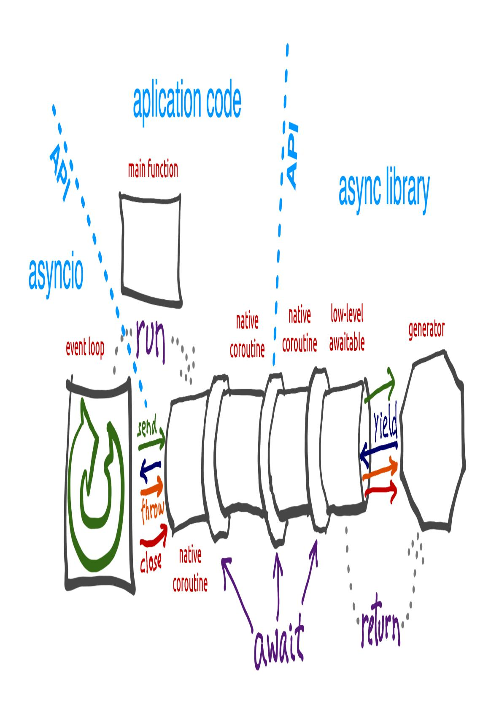
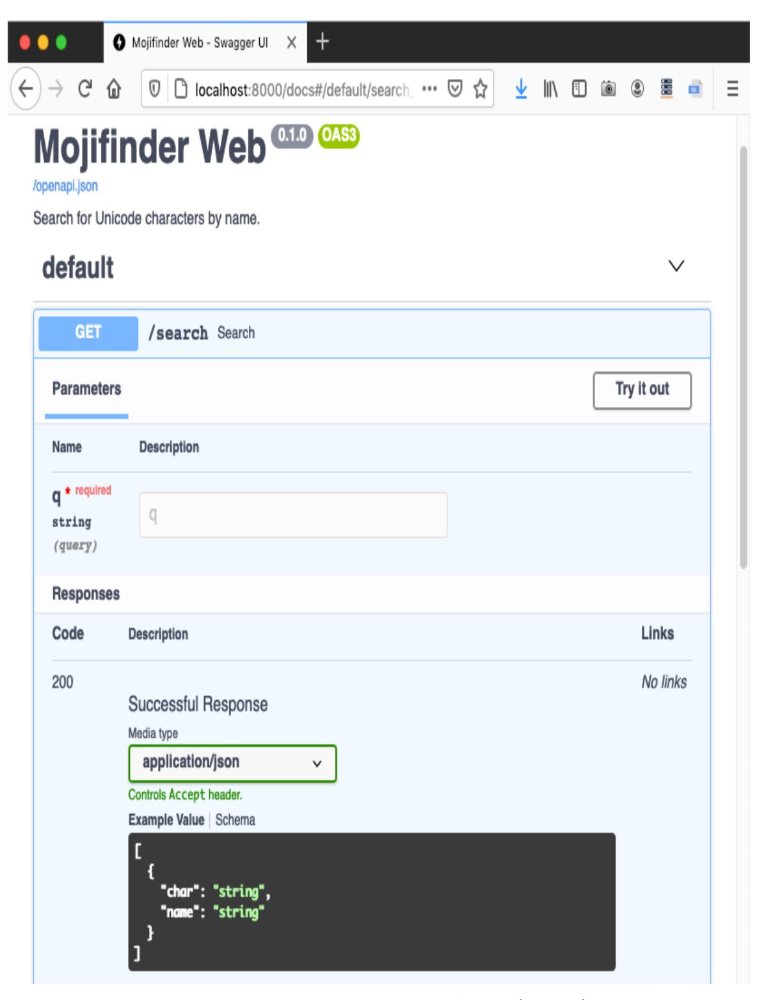

<span id="page-1122-0"></span>
# Chapter 22: Asynchronous Programming

## A NOTE FOR EARLY RELEASE READERS

With Early Release ebooks, you get books in their earliest form—the author's raw and unedited content as they write—so you can take advantage of these technologies long before the official release of these titles.

This will be the 22nd chapter of the final book. Please note that the GitHub repo will be made active later on.

If you have comments about how we might improve the content and/or examples in this book, or if you notice missing material within this chapter, please reach out to the author at [fluentpython2e@ramalho.org.](mailto:fluentpython2e@ramalho.org)

*The problem with normal approaches to asynchronous programming as that they're all-or-nothing propositions. You rewrite all your code so none of it blocks or you're just wasting your time. [1](#page-1201-0)*

> <span id="page-1122-1"></span>—Alvaro Videla & Jason J. W. Williams, RabbitMQ in Action

This chapter addresses three major topics that are closely related:

- Python's async def, await, async with, and async for constructs;
- Objects supporting those constructs: native coroutines and asynchronous variants of context managers, iterables, generators, and comprehensions;
- asyncio and other asynchronous libraries.

That's a lot, so we'll only scratch the surface asyncio and the other libraries. The other topics build on ideas we've seen before: iterables and generators [\(Chapter 17](024-chapter-17-iterables-iterators-and-generators.md#page-840-0)), context managers ([Chapter 18](025-chapter-18-context-managers-and-else-blocks.md#page-923-1)), and coroutines ([Chapter 19](026-chapter-19-classic-coroutines.md#page-953-0)).

## Also covered here:

- How to avoid blocking the event loop by delegating slow operations to a thread or process pool;
- Simple network programs using asyncio, aiohttp, *FastAPI*, and *Curio*;
- Advantages and pitfalls of asynchronous programming.

<span id="page-1123-0"></span>
## TIP

The asyncio [documentation](https://docs.python.org/3/library/asyncio.html) is much better after Yuri Selivanov reorganized it, separating the few functions useful to application developers from the low-level API for creators of packages like Web frameworks and database drivers. [2](#page-1202-0)

For book-length coverage of asyncio, I recommend *[Using Asyncio in Python](https://learning.oreilly.com/library/view/using-asyncio-in/9781492075325/)* by Caleb Hattingh (O'Reilly, 2020). Full disclosure: he is one of the tech reviewers of this book.

<span id="page-1123-1"></span>
## What's New in this Chapter

When I wrote *Fluent Python, First Edition*, the asyncio library was provisional and the async/await keywords did not exist. Therefore, I had to update all examples in this chapter. I also created new examples: domain probing scripts, a *FastAPI* Web service, and experiments with Python's new asynchronous console mode.

New sections cover language features that did not exist at the time, such as native coroutines, async with, async for and the objects that support those constructs.

The ideas in ["How Async Works and How It Doesn't"](#page-1188-0) reflect hard earned lessons that I consider essential reading for anyone using asynchronous programming. They may save you a lot of trouble—whether you're using Python or *Node.js*.

Finally, I removed several paragraphs about asyncio.Futures, which is now considered part of the low-level asyncio APIs.

<span id="page-1124-1"></span>
## A few definitions

At the start of [Chapter 19,](026-chapter-19-classic-coroutines.md#page-953-0) we saw that Python 3.5 and later offer three kinds of coroutines:

## native coroutines

A coroutine defined with async def. You can delegate from a native coroutine to another native coroutine using the await keyword, similar to how classic coroutines use yield from. The async def statement always defines a native coroutine, even if the await keyword is not used in its body. The await keyword cannot be used outside of a native coroutine. [3](#page-1202-1)

## classic coroutines

<span id="page-1124-0"></span>A generator function that consumes data sent to it via my\_coro.send(data) calls, and reads that data by using yield in an expression. Classic coroutines can delegate to other classic coroutines using yield from. Classic coroutines cannot be driven by await, and are no longer supported by asyncio.

## generator-based coroutines

A generator function decorated with @types.coroutine introduced in Python 3.5. That decorator makes the generator compatible with the new await keyword.

In this chapter, we focus on native coroutines.

<span id="page-1125-0"></span>
### @ASYNCIO.COROUTINE HAS NO FUTURE 4

The @asyncio.coroutine decorator for classic coroutines and generator-based coroutines was deprecated in Python 3.8 and is scheduled for removal in Python 3.11, according to [issue43216](https://bugs.python.org/issue43216). In contrast, @types.coroutine should remain, per [issue36921.](https://bugs.python.org/issue36921) It is no longer supported by asyncio, but is used in low-level code in the *Curio* and *Trio* asynchronous frameworks.

<span id="page-1125-1"></span>
## Example: Probing Domains

Imagine you are about to start a new blog on Python, and you plan to register a domain using a Python keyword and the .DEV suffix—for example: AWAIT.DEV. [Example 22-1](#page-1126-0) is a script using asyncio to check several domains concurrently. This is the output it produces:

```
$ python3 blogdom.py
 with.dev
+ elif.dev
+ def.dev
 from.dev
 else.dev
 or.dev
 if.dev
 del.dev
+ as.dev
 none.dev
 pass.dev
 true.dev
+ in.dev
+ for.dev
+ is.dev
+ and.dev
+ try.dev
+ not.dev
```

Note that the domains appear unordered. If you run the script, you'll see them displayed one after the other, with varying delays. The + sign

<span id="page-1126-1"></span>indicates your machine was able to resolve the domain via DNS. Otherwise, the domain did not resolve and may be available. [5](#page-1202-3)

In *blogdom.py*, the DNS probing is done via native coroutine objects. Because the asynchronous operations are interleaved, the time needed to check the 18 domains is much less than checking them sequentially. In fact, the total time is practically the same as the time for the single slowest DNS response, instead of the sum of the times of all responses.

Here is the code for *blogdom.py*:

<span id="page-1126-0"></span>*Example 22-1. blogdom.py: search for domains for a Python blog*

```
#!/usr/bin/env python3
import asyncio
import socket
from keyword import kwlist
MAX_KEYWORD_LEN = 4 
async def probe(domain: str) -> tuple[str, bool]: 
 loop = asyncio.get_running_loop() 
 try:
 await loop.getaddrinfo(domain, None) 
 except socket.gaierror:
 return (domain, False)
 return (domain, True)
async def main() -> None: 
 names = (kw for kw in kwlist if len(kw) <= MAX_KEYWORD_LEN) 
 domains = (f'{name}.dev'.lower() for name in names) 
 coros = [probe(domain) for domain in domains] 
 for coro in asyncio.as_completed(coros): 
 domain, found = await coro 
 mark = '+' if found else ' '
 print(f'{mark} {domain}')
if __name__ == '__main__':
 asyncio.run(main())
```

Set maximum length of keyword for domains, because shorter is better.

- probe returns a tuple with the domain name and a boolean; True means the domain resolved. Returning the domain name will make it easier to display the results.
- Get a reference to the asyncio event loop, so we can use it next.
- The [loop.getaddrinfo\(…\)](https://docs.python.org/3/library/asyncio-eventloop.html#asyncio.loop.getaddrinfo) coroutine-method returns a five-part [tuple of parameters to connect to the given address using a socket. In](https://docs.python.org/3/library/socket.html#socket.getaddrinfo) this example, we don't need the result. If we got it, the domain resolves; otherwise, it doesn't.
- main must be a coroutine, so that we can use await in it.
- Generator to yield Python keywords with length up to MAX\_KEYWORD\_LEN.
- Generator to yield domain names with the .dev suffix.
- Build a list of coroutine objects by invoking the probe coroutine with each domain argument.
- asyncio.as\_completed is a generator that yields the coroutines in the order they are completed—not the order they were submitted. It's similar to futures.as\_completed, which we saw in [Chapter 21](028-chapter-21-concurrency-with-futures.md#page-1079-0), [Example 21-4](028-chapter-21-concurrency-with-futures.md#page-1090-0).
- At this point, we know the coroutine is done because that's how as\_completed works. Therefore, the await expression will not block but we need it to get the result from coro. If coro raised an unhandled exception, it would be re-raised here.
- This is a common pattern for scripts that use asyncio: implement main as a coroutine, and drive it here with asyncio.run.

## TIP

The asyncio.get\_running\_loop function was added in Python 3.7 for use inside coroutines as shown in probe. Its implementation is simpler and faster than asyncio.get\_event\_loop (which may start an event loop if necessary). If there's no running loop, asyncio.get\_running\_loop raises RuntimeError.

<span id="page-1128-0"></span>
## Guido's trick to read asynchronous code

There are a lot of new concepts to grasp in asyncio but the overall logic of [Example 22-1](#page-1126-0) is easy to follow if you employ a trick suggested by Guido van Rossum himself: squint and pretend the async and await keywords are not there. If you do that, you'll realize that coroutines read like plain old sequential functions.

For example, imagine that the body of this coroutine…

```
async def probe(domain: str) -> tuple[str, bool]:
 loop = asyncio.get_running_loop()
 try:
 await loop.getaddrinfo(domain, None)
 except socket.gaierror:
 return (domain, False)
 return (domain, True)
```

…works like the following function, except that it magically never blocks:

```
def probe(domain: str) -> tuple[str, bool]: # no async
 loop = asyncio.get_running_loop()
 try:
 loop.getaddrinfo(domain, None) # no await
 except socket.gaierror:
 return (domain, False)
 return (domain, True)
```

Using the syntax await loop.getaddrinfo(…) avoids blocking because await suspends the current coroutine object—for example, probe('if.dev'). A new coroutine object is created, getaddrinfo('if.dev', None), it starts the low-level addrinfo query and yields control back to the event loop, which can drive other pending coroutine objects, such as probe('or.dev'). When the event loop gets a response for the getaddrinfo('if.dev', None) query, that specific coroutine object resumes and returns control back to the probe('if.dev')—which was suspended at await—and can now handle a possible exception and return the result tuple.

So far, we've only seen asyncio.as\_completed and await applied to coroutines. But they handle any *awaitable* object. That concept is explained next.

<span id="page-1129-0"></span>
## New concept: awaitable

The for keyword works with *iterables*. The await keyword works with *awaitables*.

As an end user of asyncio, these are the awaitables you will see on a daily basis:

- A *native coroutine object*, which you get by calling a *native coroutine function*.
- An asyncio.Task, which usually you get by passing a coroutine object to asyncio.create\_task().

However, end-user code does not always need to await on a Task. We use asyncio.create\_task(one\_coro()) to schedule one\_coro for concurrent execution, without waiting for its return. That's what we did with the spinner coroutine in *spinner\_async.py* ([Example 20-4\)](027-chapter-20-concurrency-models-in-python.md#page-1032-0). If you don't expect to cancel the task or wait for it, there is no need to keep the Task object returned from create\_task. Creating the task is enough to schedule the coroutine to run.

In contrast, we use await other\_coro() to run other\_coro right now and wait for its completion because we need its result before we can

proceed. In *spinner\_async.py*, the supervisor coroutine did res = await slow() to execute slow and get its result.

When implementing asynchronous libraries or contributing to asyncio itself, you may also deal with these lower-level awaitables:

- An object with an \_\_await\_\_ method that returns an iterator; for example, an asyncio.Future instance (asyncio.Task is a subclass of asyncio.Future).
- Objects written in other languages using the Python/C API with a tp\_as\_async.am\_await function, returning an iterator (similar to \_\_await\_\_ method).

Existing codebases may also have one additional kind of awaitable: *generator-based coroutine objects*—which are in the process of being deprecated.

## NOTE

PEP 492 [states](https://www.python.org/dev/peps/pep-0492/#await-expression) that the await expression "uses the yield from implementation with an extra step of validating its argument" and "await only accepts an awaitable." The PEP does not explain that implementation in detail, but refers to [PEP 380,](https://www.python.org/dev/peps/pep-0380/) which introduced yield from[. In this book there is a detailed explanation in "The Meaning](#page-982-0) of yield from".

Now let's study the asyncio version of a script that downloads a fixed set of flag images.

<span id="page-1130-0"></span>
## Downloading with asyncio and aiohttp

The *flags\_asyncio.py* script downloads a fixed set of 20 flags from *fluentpython.com*. We first mentioned it ["Concurrent Web Downloads"](028-chapter-21-concurrency-with-futures.md#page-1080-0), but now we'll study it in detail, applying the concepts we just saw.

As of Python 3.9, asyncio only supports TCP and UDP directly, and there are no asynchronous HTTP client or server packages in the standard library. I am using *[aiohttp](https://docs.aiohttp.org/en/stable/)* 3.7.4 in the HTTP client examples.

We'll explore *flags\_asyncio.py* from the bottom up—that is, looking first at the functions that set up the action in [Example 22-2](#page-1131-0).

## WARNING

To make the code easier to read, *flags\_asyncio.py* has no error handling. As we introduce async/await, it's useful to focus on the "happy path" initially, to understand how regular functions and coroutines are arranged in a program.

Starting with ["Enhancing the asyncio downloader"](#page-1139-0), the examples include error handling and more features.

<span id="page-1131-0"></span>
## Example 22-2. flags\_asyncio.py: startup functions

```
def download_many(cc_list: list[str]) -> int: 
 return asyncio.run(supervisor(cc_list)) 
async def supervisor(cc_list: list[str]) -> int:
 async with ClientSession() as session: 
 to_do = [download_one(session, cc) 
 for cc in sorted(cc_list)]
 res = await asyncio.gather(*to_do) 
 return len(res) 
if __name__ == '__main__':
 main(download_many)
```

- This needs to be a plain function—not a coroutine—so it can be passed to and called by the main function from the *flags.py* module [\(Example 21-2](028-chapter-21-concurrency-with-futures.md#page-1083-0)).
- Execute the event loop driving the supervisor(cc\_list) coroutine object until it returns. This will block while the event loop runs. The result of this line is whatever supervisor returns.

- HTTP client operations in aiohttp are methods of ClientSession, which is also an asynchronous context manager: a context manager with asynchronous set-up and tear-down methods (more about this in ["Asynchronous Context Managers"](#page-1137-0)). All HTTP requests in aiohttp must execute in the context of an active ClientSession.
- Build a list of coroutine objects by calling the download\_one coroutine once for each flag to be retrieved.
- Wait for the asynctio.gather coroutine, which accepts one or more awaitable arguments and waits for all of them to complete, returning a list of results for the given awaitables in the order they were submitted.
- supervisor returns the length the list returned by asyncio.gather.

**import asyncio**

Now let's review the top of *flags\_asyncio.py*. I reorganized the coroutines so we can read them in the order they are started by the event loop.

<span id="page-1132-0"></span>*Example 22-3. flags\_asyncio.py: imports and download functions*

```
from aiohttp import ClientSession 
from flags import BASE_URL, save_flag, main 
async def download_one(session: ClientSession, cc: str): 
 image = await get_flag(session, cc)
 save_flag(image, f'{cc}.gif')
 print(cc, end=' ', flush=True)
 return cc
async def get_flag(session: ClientSession, cc: str) -> bytes: 
 url = f'{BASE_URL}/{cc}/{cc}.gif'.lower()
 async with session.get(url) as resp: 
 return await resp.read()
```

- aiohttp must be installed—it's not in the standard library.
- Reuse code from *flags.py* ([Example 21-2](028-chapter-21-concurrency-with-futures.md#page-1083-0)).
- download\_one must be a native coroutine, so it can await on get\_flag—which does the HTTP request. Then it displays the code of the downloaded flag, and saves the image.
- get\_flag needs to receive the ClientSession to make the request.
- The get method of an aiohttp.ClientSession instance returns a ClientResponse object which is also an asynchronous context manager.
- Network I/O operations are implemented as coroutine-methods, so they are driven asynchronously by the asyncio event loop.

## NOTE

For better performance, the save\_flag call inside get\_flag should be asynchronous, but asyncio does not provide an asynchronous filesystem API at this time—as *Node.js* does. If profiling reveals that is a bottleneck in your application, you can use the [loop.run\\_in\\_executor](http://bit.ly/1HGtQzc) function to run save\_flag in a thread pool. [Example 22-8](#page-1149-0) will show how.

Your code delegates to the aiohttp coroutines explicitly through await or implicitly through the special methods of the asynchronous context managers, such as ClientSession and ClientResponse—as we'll see in ["Asynchronous Context Managers"](#page-1137-0).

<span id="page-1133-0"></span>
## The Secret of Native Coroutines: Humble Generators

A key difference between the classic coroutine examples we saw in [Chapter 19](026-chapter-19-classic-coroutines.md#page-953-0) and *flags\_asyncio.py* is that there are no visible .send() calls or yield expressions in the latter. Your code sits between the asyncio library and the asynchronous libraries you are using, such as aiohttp. This is illustrated in Figure 22-1.



*Figure 22-1. In an asynchronous program, a user's function starts the event loop, scheduling an initial coroutine with asyncio.run. Each user's coroutine drives the next with an await expression, forming a channel that enables communication between a library such as aiohttp and the event loop. Compare this with [Figure 19-2.](026-chapter-19-classic-coroutines.md#page-977-0)*

Under the hood, the asyncio event loop makes the .send calls that drive your coroutines, and your coroutines await on other coroutines, including library coroutines. As mentioned, await borrows most of its implementation from yield from, which also makes .send calls to drive coroutines.

The await chain eventually reaches a low-level awaitable, which returns a plain generator that the event loop can drive in response to events such as timers or network I/O. The low-level awaitables and generators at the end of these await chains are implemented deep into the libraries, are not part of their APIs, and may be written in C.

Using functions like asyncio.gather and asyncio.create\_task, you can start multiple concurrent await channels, enabling concurrent execution of multiple I/O operations driven by a single event loop, in a single thread.

<span id="page-1136-0"></span>
## The all-or-nothing problem

Note that in [Example 22-3](#page-1132-0) I could not reuse the get\_flag function from *flags.py* ([Example 21-2\)](028-chapter-21-concurrency-with-futures.md#page-1083-0) because it uses the requests library, which performs blocking I/O: it would block the event loop. To leverage asyncio, we must replace every function that hits the network with an asynchronous version that is activated with await or asyncio.create\_task, so that control is given back to the event loop. Using `await in get\_flag means that it must be driven as a coroutine.

If you can't rewrite a blocking function as a native coroutine, you should [run it in a separate thread or process, as we'll see in "Using an Executor to](#page-1148-0) Avoid Blocking the Event Loop".

This is why I chose the epigraph for this chapter, which says: "You rewrite all your code so none of it blocks or you're just wasting your time."

For the same reason, I could not reuse the download\_one function from *flags\_threadpool.py* ([Example 21-3](028-chapter-21-concurrency-with-futures.md#page-1086-0)) either. The code in [Example 22-3](#page-1132-0) drives get\_flag with await, so download\_one must also be a coroutine. For each request, a download\_one coroutine object is created in supervisor, and they are all driven by the asyncio.gather coroutine.

Now let's study the async with statement that appeared in supervisor ([Example 22-2](#page-1131-0)) and get\_flag [\(Example 22-3\)](#page-1132-0).

<span id="page-1137-0"></span>
## Asynchronous Context Managers

In ["Context Managers and with Blocks"](025-chapter-18-context-managers-and-else-blocks.md#page-927-0) we saw how an object can be used to run code before and after the body of a with block, if its class provides the \_\_enter\_\_ and \_\_exit\_\_ methods.

Now, consider this [Example 22-4,](#page-1137-1) from the *[asyncpg](https://magicstack.github.io/asyncpg/current/)* asyncio-compatible PostgreSQL driver [documentation on transactions:](https://magicstack.github.io/asyncpg/current/api/index.html#transactions)

<span id="page-1137-1"></span>*Example 22-4. Sample code from the documentation of the asyncpg PostgreSQL driver.*

```
tr = connection.transaction()
await tr.start()
try:
 await connection.execute("INSERT INTO mytable VALUES (1, 2,
3)")
except:
 await tr.rollback()
 raise
else:
 await tr.commit()
```

A database transaction is a natural fit for the context manager protocol: the transaction has to be started, data is changed with connection.execute, and then a rollback or commit must happen, depending on the outcome of the changes.

In an asynchronous driver like *asyncpg*, the set up and wrap up need to be coroutines—so that other operations can happen concurrently. However, the implementation of the classic with statement doesn't support coroutines doing the work of \_\_enter\_\_ or \_\_exit\_\_.

That's why [PEP 492—Coroutines with async and await syntax](https://www.python.org/dev/peps/pep-0492/) introduced the async with statement, which works with asynchronous context managers: objects implementing the \_\_aenter\_\_ and \_\_aexit\_\_ methods as coroutines.

With async with, [Example 22-4](#page-1137-1) can be written like this other snippet from the *asyncpg* [documentation:](https://magicstack.github.io/asyncpg/current/api/index.html#transactions)

```
async with connection.transaction():
 await connection.execute("INSERT INTO mytable VALUES (1, 2,
3)")
```

In the *asyncpg* [Transaction](https://magicstack.github.io/asyncpg/current/_modules/asyncpg/transaction.html) class, the \_\_aenter\_\_ coroutine method does await self.start() and the \_\_aexit\_\_ coroutine awaits on private \_\_rollback or \_\_commit coroutine methods, depending on whether an exception occurred or not. The use of coroutines to implement Transaction as an asynchronous context manager allows *asyncpg* to handle many transactions concurrently.

Back to *flags\_asyncio.py*, the ClientSession and ClientResponse classes of aiohttp are both asynchronous context managers to be able to use awaitables their \_\_aenter\_\_ and \_\_aexit\_\_ special coroutine methods. The *aiohttp* documentation has a high-level explanation about [these asynchronous context managers titled Why is aiohttp client API that](https://docs.aiohttp.org/en/stable/http_request_lifecycle.html#why-is-aiohttp-client-api-that-way) way?

## NOTE

["Asynchronous Generators as Context Managers"](#page-1178-0) shows how to use Python's contextlib to create an asynchronous context manager without having to write a class. That explanation comes later in this chapter because of a pre-requisite topic: ["Asynchronous Generator Functions"](#page-1171-0).

We'll now enhance the asyncio flag download example with a progress bar, which will lead us to explore a bit more of the asyncio API.

<span id="page-1139-0"></span>
## Enhancing the asyncio downloader

Recall from ["Downloads with Progress Display and Error Handling"](028-chapter-21-concurrency-with-futures.md#page-1101-0) that the *flags2* set of examples share the same command-line interface, and they display a progress bar while the downloads are happening. They also include error handling.

## TIP

I encourage you to play with the *flags2* examples to develop an intuition of how concurrent HTTP clients perform. Use the -h option to see the help screen in [Example 21-10.](028-chapter-21-concurrency-with-futures.md#page-1105-0) Use the -a, -e, and -l command-line options to control the number of downloads, and the -m option to set the number of concurrent downloads. Run tests against the LOCAL, REMOTE, DELAY, and ERROR servers. Discover the optimum number of concurrent downloads to maximize throughput against each server. Tweak the options for the test servers as described in ["Setting up test servers"](028-chapter-21-concurrency-with-futures.md#page-1107-0).

For instance, [Example 22-5](#page-1139-1) shows how to get 100 flags (-al 100) from the ERROR server, using 100 concurrent requests (-m 100).

<span id="page-1139-1"></span>
## Example 22-5. Running flags2\_asyncio.py

```
$ python3 flags2_asyncio.py -s ERROR -al 100 -m 100
ERROR site: http://localhost:8002/flags
Searching for 100 flags: from AD to LK
100 concurrent connections will be used.
--------------------
73 flags downloaded.
```

27 errors.

Elapsed time: 0.64s

### ACT RESPONSIBLY WHEN TESTING CONCURRENT CLIENTS

Even if the overall download time is not much different between the threaded and asyncio HTTP clients, asyncio can send requests faster, so it's more likely that the server will suspect a DOS attack. To really exercise these concurrent clients at full [throttle, please set up local HTTP servers for testing as explained in "Setting up test](028-chapter-21-concurrency-with-futures.md#page-1107-0) servers".

Now let's see how *flags2\_asyncio.py* is implemented.

<span id="page-1140-0"></span>
## Using asyncio.as\_completed and a semaphore

In [Example 22-3,](#page-1132-0) we passed several coroutines to asyncio.gather, which returns a list with results of the coroutines in the order they were submitted. This means that asyncio.gather can only return when all the awaitables are done. However, to update a progress bar we need to get results as they are done.

Fortunately, there is an asyncio equivalent of the as\_completed generator function we used in the thread pool example with the progress bar ([Example 21-16](028-chapter-21-concurrency-with-futures.md#page-1113-0)).

[Example 22-6](#page-1140-1) shows the top of the *flags2\_asyncio.py* script where the get\_flag and download\_one coroutines are defined. [Example 22-7](#page-1145-0) lists the rest of the source, with supervisor and download\_many. This script is longer than *flags\_asyncio.py* because of error handling.

<span id="page-1140-1"></span>*Example 22-6. flags2\_asyncio.py: Top portion of the script; remaining code is in [Example 22-7](#page-1145-0)*

```
import asyncio
from collections import Counter
import aiohttp
import tqdm # type: ignore
```

```
from flags2_common import main, HTTPStatus, Result, save_flag
# default set low to avoid errors from remote site, such as
# 503 - Service Temporarily Unavailable
DEFAULT_CONCUR_REQ = 5
MAX_CONCUR_REQ = 1000
class FetchError(Exception): 
 def __init__(self, country_code: str):
 self.country_code = country_code
async def get_flag(session: aiohttp.ClientSession, 
 base_url: str,
 cc: str) -> bytes:
 url = f'{base_url}/{cc}/{cc}.gif'.lower()
 async with session.get(url) as resp:
 if resp.status == 200:
 return await resp.read()
 else:
 resp.raise_for_status() 
 return bytes()
async def download_one(session: aiohttp.ClientSession, 
 cc: str,
 base_url: str,
 semaphore: asyncio.Semaphore,
 verbose: bool) -> Result:
 try:
 async with semaphore: 
 image = await get_flag(session, base_url, cc)
 except aiohttp.ClientResponseError as exc:
 if exc.status == 404: 
 status = HTTPStatus.not_found
 msg = 'not found'
 else:
 raise FetchError(cc) from exc 
 else:
 save_flag(image, f'{cc}.gif')
 status = HTTPStatus.ok
 msg = 'OK'
 if verbose and msg:
 print(cc, msg)
 return Result(status, cc)
```

- We'll use this custom exception to wrap other HTTP or network exceptions and carry the country\_code for error reporting.
- get\_flag will either return the bytes of the image downloaded, raise web.HTTPNotFound if the HTTP response status is 404, or raise an aiohttp.HttpProcessingError for other HTTP status codes.
- This raises an exception for codes >= 400. If that's not the case, return 0 bytes in the next line.
- The semaphore argument is an instance of [asyncio.Semaphore](http://bit.ly/1f6Csp8), a synchronization device that limits the number of concurrent requests.
- The semaphore is used as an asynchronous context manager so that the system as whole is not blocked: only this coroutine is suspended [when the semaphore counter is zero. More about this in "About](#page-1144-0) Semaphores".
- If the HTTP status was 404—not found—save it to add to the Result to be returned, and set an appropriate message for verbose mode reporting.
- Wrap any other aiohttp.ClientResponseError as a FetchError with the country code and the original exception chained using the raise X from Y syntax introduced in PEP 3134 — [Exception Chaining and Embedded Tracebacks.](https://www.python.org/dev/peps/pep-3134/)

Network client code of the sort we are studying should always use some throttling mechanism to avoid pounding the server with too many concurrent requests. In *flags2\_threadpool.py* ([Example 21-16\)](028-chapter-21-concurrency-with-futures.md#page-1113-0), the throttling was done by instantiating the ThreadPoolExecutor with the required max\_workers argument set to concur\_req in the download\_many function. In *flags2\_asyncio.py* I used an asyncio.Semaphore created by the supervisor function (shown

next, in [Example 22-7](#page-1145-0)) and passed as the semaphore argument to download\_one in [Example 22-6.](#page-1140-1)

## ABOUT SEMAPHORES

<span id="page-1144-0"></span>The semaphore is a simple but flexible synchronization primitive invented by computer scientist Edsger W. Dijkstra in the early 1960's. Other synchronization objects—such as locks and barriers—can be built on top of semaphores.

There are three Semaphore classes in Python's standard library: one in threading, another in multiprocessing, and a third one in asyncio. Here we'll discuss the latter.

An asyncio.Semaphore has an internal counter that is decremented whenever we drive the .acquire() coroutine method, and incremented when we call the .release() method—which is not a coroutine because it never blocks.

The initial value of the counter is set when the Semaphore is instantiated, as in this line of supervisor:

```
 semaphore = asyncio.Semaphore(concur_req)
```

Calling .acquire() does not block when the counter is greater than zero, but if the counter is zero, .acquire() will suspend the calling coroutine until some other coroutine calls .release() on the same Semaphore, thus incrementing the counter. In [Example 22-6,](#page-1140-1) I don't use .acquire() or .release() directly, but use the semaphore as an asynchronous context manager in this block of code inside download\_one:

```
 async with semaphore:
 image = await get_flag(session, base_url, cc)
```

```
The Semaphore.__aenter__ coroutine method awaits for
.acquire(), and its __aexit__ coroutine method calls
.release().
```

That snippet guarantees that no more than concur\_req instances of get\_flags coroutines will be active at any time.

<span id="page-1145-1"></span>Each of the Semaphore classes in the standard library has a BoundedSemaphore subclass that enforces an additional constraint: the internal counter can never become larger than the initial value when there are more .release() than .acquire() operations. [6](#page-1202-4)

Now let's take a look at the rest of the script in [Example 22-7.](#page-1145-0)

<span id="page-1145-0"></span>*Example 22-7. flags2\_asyncio.py: Script continued from [Example 22-6](#page-1140-1)*

```
async def supervisor(cc_list: list[str],
 base_url: str,
 verbose: bool,
 concur_req: int) -> Counter[HTTPStatus]: 
 counter: Counter[HTTPStatus] = Counter()
 semaphore = asyncio.Semaphore(concur_req) 
 async with aiohttp.ClientSession() as session:
 to_do = [download_one(session, cc, base_url, semaphore,
verbose)
 for cc in sorted(cc_list)] 
 to_do_iter = asyncio.as_completed(to_do) 
 if not verbose:
 to_do_iter = tqdm.tqdm(to_do_iter, total=len(cc_list)) 
 for coro in to_do_iter: 
 try:
 res = await coro 
 except FetchError as exc: 
 country_code = exc.country_code 
 try:
 error_msg = exc.__cause__.message # type:
ignore 
 except AttributeError:
 error_msg = 'Unknown cause' 
 if verbose and error_msg:
 print(f'*** Error for {country_code}:
{error_msg}')
 status = HTTPStatus.error
 else:
 status = res.status
 counter[status] += 1 
 return counter
```

```
def download_many(cc_list: list[str],
 base_url: str,
 verbose: bool,
 concur_req: int) -> Counter[HTTPStatus]:
 coro = supervisor(cc_list, base_url, verbose, concur_req)
 counts = asyncio.run(coro) 
 return counts
if __name__ == '__main__':
 main(download_many, DEFAULT_CONCUR_REQ, MAX_CONCUR_REQ)
```

- supervisor takes the same arguments as the download\_many function, but it cannot be invoked directly from main precisely because it's a coroutine and not a plain function like download\_many.
- Create an asyncio.Semaphore that will allow at most concur\_req active coroutines among those using this semaphore. The value of concur\_req is computed by the main function from *flags2\_common.py*, based on command-line options and constants set in each example.
- Create a list of coroutine objects, one per call to the download\_one coroutine.
- Get an iterator that will return coroutine objects as they are done. I did not place this call to as\_completed directly in the for loop below because I may need to wrap it with the tqdm iterator for the progress bar, depending on the user's choice for verbosity.
- Wrap the as\_completed iterator with the tqdm generator function to display progress.
- Iterate over the completed coroutine objects; this loop is similar to the one in download\_many in [Example 21-16](028-chapter-21-concurrency-with-futures.md#page-1113-0); most changes have to do with exception handling because of differences in the HTTP libraries (requests versus aiohttp).

- await on the coroutine to get its result. This will not block because as\_completed only produces coroutines that are done.
- Every exception in download\_one is wrapped in a FetchError with the original exception chained.
- Get the country code where the error occurred from the FetchError exception.
- Try to retrieve the error message from the original exception. Despite being protected by try/except AttributeError, Mypy reports two missing attribute errors in this line. Fortunately, we can silence it. Thank Guido for optional typing.
- If the error message cannot be found in the original exception, use the name of the chained exception class as the error message.
- Tally outcomes.
- Return the counter, as in the other scripts.
- download\_many instantiates the supervisor coroutine object and passes it to the event loop with asyncio.run.

In [Example 22-7,](#page-1145-0) we could not use the mapping of futures to country codes we saw in [Example 21-16](028-chapter-21-concurrency-with-futures.md#page-1113-0) because the awaitables returned by asyncio.as\_completed are not necessarily the same awaitables we pass into the as\_completed call. Internally, the asyncio machinery may replace the awaitables we provide with others that will, in the end, produce the same results. [7](#page-1202-5)

<span id="page-1147-0"></span>Because I could not use the awaitables as keys to retrieve the country code from a dict in case of failure, I implemented the custom FetchError exception (shown in [Example 22-6\)](#page-1140-1). FetchError wraps a network exception and holds the country code associated with it, so the country code can be reported with the error in verbose mode. If there is no error, the country code is available as the result of the await coro expression at the top of the for loop.

This wraps up the discussion of an asyncio example functionally equivalent to the *flags2\_threadpool.py* we saw earlier.

While discussing [Example 22-3](#page-1132-0), I noted that save\_flag performs file I/O and should be executed asynchronously for better performance. The following section shows how.

<span id="page-1148-0"></span>
## Using an Executor to Avoid Blocking the Event Loop

In the Python community, we tend to overlook the fact that local filesystem access is blocking, rationalizing that it doesn't suffer from the higher latency of network access—which is also dangerously unpredictable. In contrast, *Node.js* programmers are constantly reminded that all filesystem functions are blocking because their signatures require a callback. Each time event loop is blocked because of any I/O, you are wasting millions of CPU cycles. This may have a significant impact on the overall performance of the application.

In [Example 22-6,](#page-1140-1) the blocking function is save\_flag. In the threaded version of the script ([Example 21-16](028-chapter-21-concurrency-with-futures.md#page-1113-0)), save\_flag blocks the thread that's running the download\_one function, but that's only one of several worker threads. Behind the scenes, the blocking I/O call releases the GIL, so another thread can proceed. But in *flags2\_asyncio.py*, save\_flag blocks the single thread our code shares with the asyncio event loop, therefore the whole application freezes while the file is being saved. The solution to this problem is the run\_in\_executor method of the event loop object.

The asyncio event loop provides a thread pool executor, and you can send callables to be executed by it with loop.run\_in\_executor. This allows potentially blocking code to run in other threads, without blocking the event loop in the main thread or our program. Of course, the main

thread and the thread pool will still share the same GIL, but that should not be a problem if the thread pool is used for I/O.

To use this feature in our example, we only need to change a few lines in the download\_one coroutine, as shown in [Example 22-8](#page-1149-0).

<span id="page-1149-0"></span>*Example 22-8. flags2\_asyncio\_executor.py: Using the default thread pool executor to run save\_flag*

```
async def download_one(session: aiohttp.ClientSession,
 cc: str,
 base_url: str,
 semaphore: asyncio.Semaphore,
 verbose: bool) -> Result:
 try:
 async with semaphore:
 image = await get_flag(session, base_url, cc)
 except aiohttp.ClientResponseError as exc:
 if exc.status == 404:
 status = HTTPStatus.not_found
 msg = 'not found'
 else:
 raise FetchError(cc) from exc
 else:
 loop = asyncio.get_running_loop() 
 loop.run_in_executor(None, 
 save_flag, image, f'{cc}.gif') 
 status = HTTPStatus.ok
 msg = 'OK'
 if verbose and msg:
 print(cc, msg)
 return Result(status, cc)
```

- Get a reference to the event loop object.
- The first argument to run\_in\_executor is an concurrent.futures.Executor instance; if None, the default thread pool executor provided by the event loop is used.
- The remaining arguments are the callable and its positional arguments.

When I tested [Example 22-8](#page-1149-0), there was no noticeable change in performance for using run\_in\_executor to save the flag images because they are small (13 KB each, on average). But you'll see an effect if you edit the save\_flag function in *flags2\_common.py* to save 10 times as many bytes on each file—just by coding fp.write(img \* 10) instead of fp.write(img). With an average download size of 130 KB, the advantage of using run\_in\_executor becomes clear. If you're downloading megapixel images, the speedup will be significant.

The implementation of asyncio itself uses run\_in\_executor under the hood in a few places. For example the, loop.getaddrinfo(…) coroutine we saw in [Example 22-1](#page-1126-0) is implemented by calling the getaddrinfo function from the socket module—which is a blocking function that may take seconds to return, as it depends on DNS resolution.

## TIP

A common pattern in asynchronous APIs is to wrap blocking calls that are implementation details in coroutines using run\_in\_executor internally. That way, you provide a consistent interface of coroutines to be driven with await, and hide the threads you need to use for pragmatic reasons. The [Motor](https://motor.readthedocs.io/en/stable/) asynchronous driver for *MongoDB* has an API compatible with async/await that is really a façade around a threaded core which talks to the database server. A. Jesse Jiryu Davis, the lead developer of *Motor*, explains his reasoning in *[Response to "Asynchronous Python and](https://emptysqua.re/blog/response-to-asynchronous-python-and-databases/) Databases"*.

The main reason to pass an explict Executor to loop.run\_in\_executor is to employ a ProcessPoolExecutor if the function to execute is CPU intensive, so that it runs in a different Python process, avoiding contention for the GIL. Because of the high start-up cost, it would be better to start the ProcessPoolExecutor in the supervisor, and pass it to the coroutines that need to use it.

The next example demonstrates the simple pattern of executing one asynchronous task after the other using coroutines. This deserves our attention because anyone with previous experience with JavaScript knows that running one asynchronous function after the other was the reason for the nested coding pattern known as [pyramids of doom.](https://web.archive.org/web/20151209151711/http://tritarget.org/blog/2012/11/28/the-pyramid-of-doom-a-javascript-style-trap) The await

keyword makes that curse go away. That's why we now have it in Python and JavaScript.

<span id="page-1151-0"></span>
## Making Multiple Requests for Each Download

Suppose you want to save each country flag with the name of the country and the country code, instead of just the country code. Now you need to make two HTTP requests per flag: one to get the flag image itself, the other to get the *metadata.json* file in the same directory as the image: that's where the name of the country is recorded.

Articulating multiple requests in the same task is easy in the threaded script: just make one request then the other, blocking the thread twice, and keeping both pieces of data (country code and name) in local variables, ready to use when saving the files. If you needed to do the same in an asynchronous script with callbacks, you needed nested functions so that the country code and name were available in their closures until you could save the file because each callback runs in a different local scope. The await keyword provides relief from that, allowing you to drive the asynchronous requests one after the other from the local scope of a coroutine.

The third variation of the asyncio flag downloading script has a couple of changes:

## get\_country

This new coroutine fetches the *metadata.json* file for the country code, and gets the name of the country from it.

## download\_one

This coroutine now uses await to delegate to get\_flag and the new get\_country coroutine, using the result of the latter to build the name of the file to save.

Let's start with the code for get\_country. Note that it is very similar to get\_flag from [Example 22-6](#page-1140-1).

## Example 22-9. flags3\_asyncio.py: get\_country coroutine

```
async def get_country(session: aiohttp.ClientSession, 
 base_url: str,
 cc: str) -> str:
 url = f'{base_url}/{cc}/metadata.json'
 async with session.get(url) as resp:
 if resp.status == 200:
 metadata = await resp.json() 
 return metadata.get('country', 'no name') 
 else:
 resp.raise_for_status()
 return ''
```

- This coroutine returns a string with the country name—if all goes well.
- metadata will get a Python dict built from the JSON contents of the response.
- Get the country name or 'no name' if it is missing.

Now the modified download\_one, which has only a few lines changed from the same coroutine in [Example 22-6](#page-1140-1)

<span id="page-1152-0"></span>
## Example 22-10. flags3\_asyncio.py: download\_one coroutine

```
async def download_one(session: aiohttp.ClientSession,
 cc: str,
 base_url: str,
 semaphore: asyncio.Semaphore,
 verbose: bool) -> Result:
 try:
 async with semaphore:
 image = await get_flag(session, base_url, cc) 
 async with semaphore:
 country = await get_country(session, base_url, cc) 
 except aiohttp.ClientResponseError as exc:
 if exc.status == 404:
 status = HTTPStatus.not_found
 msg = 'not found'
 else:
 raise FetchError(cc) from exc
 else:
 filename = country.replace(' ', '_') 
 filename = f'{filename}.gif'
```

```
 loop = asyncio.get_running_loop()
 loop.run_in_executor(None,
 save_flag, image, filename)
 status = HTTPStatus.ok
 msg = 'OK'
 if verbose and msg:
 print(cc, msg)
 return Result(status, cc)
```

- Get the flag image…
- …then the country name.
- Use the country name to create a filename. As a command-line user, I don't like to see spaces in filenames.

## Much better than nested callbacks!

I could schedule both get\_flag and get\_country in parallel using asyncio.gather, but if get\_flag raises an exception there is no image to save, so it's pointless to run get\_country. But there are cases where it makes sense to use asyncio.gather to hit several APIs at the same time instead of waiting for one response before making the next request.

I put the calls to get\_flag and get\_country in separate with blocks controlled by the semaphore because it's good practice to hold semaphores and locks for the shortest possible time.

In *flags3\_asyncio.py*, the await syntax appears six times, and async with five times. Hopefully, you should be getting the hang of asynchronous programming in Python. One challenge is to know when you have to use await and when you can't use it. The answer in principle is easy, you await coroutines and other awaitables, such as asyncio.Task instances. But some APIs are tricky, mixing coroutines and plain functions in seemingly arbitrary ways, like the StreamWriter class we'll use in [Example 22-14.](#page-1167-0)

[Example 22-10](#page-1152-0) wraps up the *flags* set of examples. We'll now go from client scripts to writing servers with asyncio.

<span id="page-1154-1"></span>
## Writing asyncio Servers

The classic toy example of a TCP server is an [echo server.](https://docs.python.org/3/library/asyncio-stream.html#tcp-echo-server-using-streams) We'll build slightly more interesting toys: server-side Unicode character search utilities, first using HTTP with *FastAPI*, then using plain TCP with asyncio only.

These servers let users query for Unicode characters based on words in their standard names from the unicodedata module we discussed in "The [Unicode Database". Figure 22-2 shows a session with the](009-chapter-4-text-versus-bytes.md#page-246-2) *web\_mojifinder.py* server.

<span id="page-1154-0"></span>

*Figure 22-2. Browser window displaying search results for "mountain" from the web\_mojifinder.py service.*

The Unicode search logic in these examples is in the InvertedIndex class in the *charindex.py* module in the *[Fluent Python 2e](https://github.com/fluentpython/example-code-2e)* code repository. There's nothing concurrent in that small module, so I'll only give a brief

overview in the optional box below. You can skip to the HTTP server implementation in ["A FastAPI Web Service".](#page-1157-0)

## WHAT IS AN INVERTED INDEX

An inverted index usually maps words to documents in which they occur. In the *mojifinder* examples, the "documents" are characters. The charindex.InvertedIndex class indexes each word that appears in each character name in the Unicode database, and creates an inverted index stored in a defaultdict. For example, to index character U+0037—DIGIT SEVEN—the InvertedIndex initializer appends the character '7' to the entries under the keys 'DIGIT' and 'SEVEN'. After indexing the Unicode 13.0.0 data bundled with Python 3.9.1, 'DIGIT' maps to 868 characters, and 'SEVEN' maps to 143, including U+1F556—CLOCK FACE SEVEN OCLOCK and U+2790 —DINGBAT NEGATIVE CIRCLED SANS-SERIF DIGIT SEVEN (which appears in many code listings in this book).

See Figure 22-3 for a demonstration using the entries for 'CAT' and 'FACE'.

*Figure 22-3. Python console exploring InvertedIndex attribute entries and search method.*

The InvertedIndex.search method breaks the query into words, and returns the intersection of the entries for each word. That's why

searching for "face" finds 171 results, "cat" finds 14, but "cat face" only 10.

That's the beautiful idea behind an inverted index: a fundamental building block in information retrieval—the theory behind search engines. See the English Wikipedia article [Inverted Index](https://en.wikipedia.org/wiki/Inverted_index) to learn more.

<span id="page-1157-0"></span>
## A FastAPI Web Service

I wrote the next example—*web\_mojifinder.py*—using *[FastAPI](https://fastapi.tiangolo.com/)*: one of the [Python ASGI Web frameworks mentioned in "ASGI—Asynchronous](027-chapter-20-concurrency-models-in-python.md#page-1063-1) Server Gateway Interface". [Figure 22-2](#page-1154-0) is a screenshot of the front-end. It's a super simple SPA (Single Page Application): after the initial HTML download, the UI is updated by client-side JavaScript communicating with the server.

*FastAPI* is designed to implement back-ends for SPA and mobile apps, which mostly consist of Web API end points returning JSON responses instead of server-rendered HTML. *FastAPI* leverages decorators, type hints, and code introspection to eliminate a lot of the boilerplate code for Web APIs, and also automatically publishes interactive OpenAPI—a.k.a. [Swagger—](https://swagger.io/specification/)documentation for the APIs we create. [Figure 22-4](#page-1158-0) shows the auto-generated /docs page for *web\_mojifinder.py*.

<span id="page-1158-0"></span>

*Figure 22-4. Auto-generated OpenAPI schema for the /search endpoint.*

[Example 22-11](#page-1159-0) is the code for *web\_mojifinder.py*, but that's just the backend code. When you hit the root URL /, the server sends the *form.html* file which has 81 lines of code, including 54 lines of JavaScript to communicate with the server and fill a table with the results. If you're interested in reading plain framework-less JavaScript, please find *22 async/mojifinder/static/form.html* in the *[Fluent Python 2e](https://github.com/fluentpython/example-code-2e)* code repository

<span id="page-1159-1"></span>To run *web\_mojifinder.py*, you need to install two packages and their dependencies: *FastAPI* and *uvicorn*. . [8](#page-1202-6)

This is the command to run [Example 22-11](#page-1159-0) with *uvicorn* in development mode:

```
$ uvicorn web_mojifinder:app --reload
```

The parameters are:

```
web_mojifinder:app
```

The package name, a colon, and the name of the ASGI application defined in it—app is the conventional name.

```
--reload
```

Make *uvicorn* monitor changes to application source files and automatically reload them. Useful only during development.

Now let's study the source code for *web\_mojifinder.py*.

<span id="page-1159-0"></span>
## Example 22-11. web\_mojifinder.py: complete source

```
from pathlib import Path
from unicodedata import name
from fastapi import FastAPI
from fastapi.responses import HTMLResponse
from pydantic import BaseModel
from charindex import InvertedIndex
app = FastAPI( 
 title='Mojifinder Web',
 description='Search for Unicode characters by name.',
)
```

```
class CharName(BaseModel): 
 char: str
 name: str
def init(app): 
 app.state.index = InvertedIndex()
 static = Path(__file__).parent.absolute() / 'static' 
 app.state.form = (static / 'form.html').read_text()
init(app) 
@app.get('/search', response_model=list[CharName]) 
async def search(q: str): 
 chars = app.state.index.search(q)
 return ({'char': c, 'name': name(c)} for c in chars) 
@app.get('/', response_class=HTMLResponse, include_in_schema=False)
def form(): 
 return app.state.form
# no main funcion
```

- This line defines the ASGI app. It could be as simple as app = FastAPI(). The parameters shown are metadata for the autogenerated documentation.
- <span id="page-1160-0"></span>A *pydantic* schema for a JSON response with char and name fields. [9](#page-1202-7)
- Build the index and load the static HTML form, attaching both to the app.state for later use.
- <span id="page-1160-1"></span>Unrelated to the theme of this chapter, but worth noting: the elegant use of the overloaded / operator by pathlib. [10](#page-1202-8)
- Run init when this module is loaded by the ASGI server.
- Route for the /search endpoint; response\_model uses that CharName *pydantic* model to describe the response format.
- *FastAPI* assumes that any arguments that appear in the function or coroutine signature that are not in the route path will be passed in the

HTTP query string, e.g. /search?q=cat. Since q has no default, *FastAPI* will return a 422 (Unprocessable Entity) status if q is missing from the query string.

- Returning an iterable of dicts compatible with the response\_model schema allows *FastAPI* to build the JSON response according to the response\_model in the @app.get decorator.
- Regular functions can also be used to produce responses.
- This module has no main function. It is loaded and driven by the ASGI server—*uvicorn* in this example.

[Example 22-11](#page-1159-0) has no direct calls to asyncio. *FastAPI* is built on the *Starlette* ASGI toolkit, which in turn uses asyncio.

Also note that the body of search doesn't use await, async with or async for, therefore it could be a plain function. I defined search as a coroutine just to show that *FastAPI* knows how to handle it. In a real app, most endpoints will query databases or hit other remote servers, so it is a critical advantage of *FastAPI*—and ASGI frameworks in general—to support coroutines that can take advantage of asynchronous libraries for network I/O.

## TIP

The init and form functions I wrote to load and serve the static HTML form are a hack to make the example short and easy to run. The recommended best practice is to have a proxy/load-balancer in front of the ASGI server to handle all static assets, and also use a CDN (Content Delivery Network) when possible. One such proxy/loadbalancer is *[Traefik](https://doc.traefik.io/traefik/)*, a self-described "edge router" that "receives requests on behalf of your system and finds out which components are responsible for handling them." *FastAPI* has [project generation](https://fastapi.tiangolo.com/project-generation/) scripts that prepare your code to do that.

The typing enthusiast may have noticed that there are no return type hints in search and form. Instead, *FastAPI* relies on the response\_model= keyword argument in the route decorators. The [Response Model](https://fastapi.tiangolo.com/tutorial/response-model/) page in the *FastAPI* documentation explains:

*The response model is declared in this parameter instead of as a function return type annotation, because the path function may not actually return that response model but rather return a dict, database object or some other model, and then use the response\_model to perform the field limiting and serialization.*

For example, in search I returned a generator of dict items, not a list of CharName objects, but that's good enough for *FastAPI* and *pydantic* to validate my data and build the appropriate JSON response compatible with response\_model=list[CharName].

We'll now focus on the *tcp\_mojifinder.py* script that is answering the queries in [Figure 22-5.](#page-1163-0)

<span id="page-1162-0"></span>
## An asyncio TCP Server

The *tcp\_mojifinder.py* program uses plain TCP to communicate with a client like Telnet or Netcat, so I could write it using asyncio without external dependencies—and without reinventing HTTP. [Figure 22-5](#page-1163-0) shows text-based UI.

<span id="page-1163-0"></span>

*Figure 22-5. Telnet session with the tcp\_mojifinder.py server: querying for "cat face" then "fire".*

This program is twice as long as *web\_mojifinder.py*, so I split the presentation into three parts: [Example 22-12,](#page-1164-0) [Example 22-14](#page-1167-0), and [Example 22-15](#page-1169-0). The top of *tcp\_mojifinder.py*—including the import statements—is in [Example 22-14,](#page-1167-0) but I will start describing the supervisor coroutine and the main function that drives the program.

<span id="page-1164-0"></span>*Example 22-12. tcp\_mojifinder.py: a simple TCP server; continues in [Example 22-14](#page-1167-0).*

```
async def supervisor(index: InvertedIndex, host: str, port: int):
 server = await asyncio.start_server( 
 functools.partial(finder, index), 
 host, port) 
 socket_list = cast(tuple[TransportSocket, ...], server.sockets) 
 addr = socket_list[0].getsockname()
 print(f'Serving on {addr}. Hit CTRL-C to stop.') 
 await server.serve_forever() 
def main(host: str = '127.0.0.1', port_arg: str = '2323'):
 port = int(port_arg)
 print('Building index.')
 index = InvertedIndex() 
 try:
 asyncio.run(supervisor(index, host, port)) 
 except KeyboardInterrupt: 
 print('\nServer shut down.')
if __name__ == '__main__':
 main(*sys.argv[1:])
```

- This await quickly gets an instance of asyncio.Server, a TCP socket server. By default, start\_server creates and starts the server, so it's ready to receive connections.
- The first argument to start\_server is client\_connected\_cb, a callback to run when a new client connection starts. The callback can be a function or a coroutine, but it must accept exactly two arguments: an asyncio.StreamReader and an asyncio.StreamWriter. However, my finder coroutine also needs to get an index, so I used functools.partial to bind that parameter and obtain a callable

which takes the reader and writer. Adapting user functions to callback APIs is the most common use case for functools.partial.

- host and port are the second and third arguments to start\_server[. See the full signature in the](https://docs.python.org/3/library/asyncio-stream.html#asyncio.start_server) asyncio documentation.
- This cast is needed because *typeshed* has an outdated type hint for the sockets property of the Server [class—as of May 2021. See issue](https://github.com/python/typeshed/issues/5535) #5535 on *typeshed*.
- Display address and port of the first socket of the server.
- Although start\_server already started the server as a concurrent task, I need to await on the server\_forever method so that my supervisor is suspended here. Without this line, supervisor would return immediately, ending the loop started with asyncio.run(supervisor(…)), and exiting the program. The documentation for [Server.serve\\_forever](https://docs.python.org/3/library/asyncio-eventloop.html#asyncio.Server.serve_forever) says: "This method can be called if the server is already accepting connections."
- <span id="page-1165-1"></span>Build the inverted index. [11](#page-1202-9)
- Start the event loop running supervisor.
- Catch the KeyboardInterrupt to avoid a distracting traceback when I stop the server with CTRL-C on the terminal running it.

You may find it easier to understand how control flows in *tcp\_mojifinder.py* if you study the output it generates on the server console, listed in [Example 22-13](#page-1165-0).

<span id="page-1165-0"></span>*Example 22-13. tcp\_mojifinder.py: this is the server side of the session depicted in [Figure 22-5](#page-1163-0)*

```
Serving on ('127.0.0.1', 2323). Hit CTRL-C to stop. 
 From ('127.0.0.1', 58192): 'cat face' 
 To ('127.0.0.1', 58192): 10 results.
 From ('127.0.0.1', 58192): 'fire' 
 To ('127.0.0.1', 58192): 11 results.
 From ('127.0.0.1', 58192): '\x00' 
Close ('127.0.0.1', 58192). 
^C 
Server shut down. 
$
```

- Output by main. Before the next line appears, I see a 0.6s delay on my machine while the index is built.
- Output by supervisor.
- First iteration of a while loop in finder. The TCP/IP stack assigned port 58192 to my Telnet client. If you connect several clients to the server, you'll see their various ports in the output.
- Second iteration of the while loop in finder.
- I hit CTRL-C on the client terminal; the while loop in finder exits.
- The finder coroutine displays this message then exits. Meanwhile the server is still running, ready to service another client.
- I hit CTRL-C on the server terminal; server.serve\_forever is cancelled, ending supervisor and the event loop.
- Output by main.

After main builds the index and starts the event loop, supervisor quickly displays the Serving on… message and is suspended at the await server.serve\_forever() line. At that point, control flows into the event loop and stays there, occasionally coming back to the finder coroutine, which yields control back to the event loop whenever it needs to wait for the network to send or receive data.

While the event loop is alive, a new instance of the finder coroutine will be started for each client that connects to the server. In this way, many clients can be handled concurrently by this simple server. This continues until a KeyboardInterrupt occurs on the server or its process is killed by the OS.

Now let's see the top of *tcp\_mojifinder.py*, with the finder coroutine.

<span id="page-1167-0"></span>*Example 22-14. tcp\_mojifinder.py: continued from [Example 22-12.](#page-1164-0)*

```
import asyncio
import functools
import sys
from asyncio.trsock import TransportSocket
from typing import cast
from charindex import InvertedIndex, format_results 
CRLF = b'\r\n'
PROMPT = b'?> '
async def finder(index: InvertedIndex, 
 reader: asyncio.StreamReader,
 writer: asyncio.StreamWriter):
 client = writer.get_extra_info('peername') 
 while True: 
 writer.write(PROMPT) # can't await! 
 await writer.drain() # must await! 
 data = await reader.readline() 
 try:
 query = data.decode().strip() 
 except UnicodeDecodeError: 
 query = '\x00'
 print(f' From {client}: {query!r}') 
 if query:
 if ord(query[:1]) < 32: 
 break
 results = await search(query, index, writer) 
 print(f' To {client}: {results} results.') 
 writer.close() 
 await writer.wait_closed() 
 print(f'Close {client}.')
```

format\_results is useful to display the results of InvertedIndex.search in a text-based UI such as the command line or a Telnet session.

- To pass finder to asyncio.start\_server I wrapped it with functools.partial, because the server expects a coroutine or function that takes only the reader and writer arguments.
- Get the remote client address to which the socket is connected.
- This loop handles a dialog that lasts until a control character is received from the client.
- The StreamWriter.write method is not a coroutine, just a plain function; this line sends the ?> prompt.
- StreamWriter.drain flushes the writer buffer; it is a coroutine, so it must be driven with await.
- StreamWriter.readline is a coroutine that returns bytes.
- Decode the bytes to str, using the default UTF-8 encoding.
- A UnicodeDecodeError may happen when the user hits CTRL-C and the Telnet client sends control bytes; if that happens, replace the query with a null character, for simplicity.
- Log the query to the server console.
- Exit the loop if a control or null character was received.
- Do the actual search; code presented next.
- Log the response to the server console.
- Close the StreamWriter.

- Wait for the StreamWriter to close. This is recommended in the .close() [method documentation.](https://docs.python.org/3/library/asyncio-stream.html#asyncio.StreamWriter.close)
- Log the end of this client's session to the server console.

The last piece of this example is the search coroutine:

<span id="page-1169-0"></span>
## Example 22-15. tcp\_mojifinder.py: search coroutine.

```
async def search(query: str, 
 index: InvertedIndex,
 writer: asyncio.StreamWriter) -> int:
 chars = index.search(query) 
 lines = (line.encode() + CRLF for line 
 in format_results(chars))
 writer.writelines(lines) 
 await writer.drain() 
 status_line = f'{"─" * 66} {len(chars)} found' 
 writer.write(status_line.encode() + CRLF)
 await writer.drain()
 return len(chars)
```

- search must be a coroutine because it writes to a StreamWriter and must use its .drain() coroutine method.
- Query the inverted index.
- This generator expression will yield byte strings encoded in UTF-8 with the Unicode codepoint, the actual character, its name and a CRLF sequence—e.g. b'U+0039\t9\tDIGIT NINE\r\n').
- Send the lines. Surprisingly, writer.writelines is not a coroutine.
- But writer.drain() is a coroutine. Don't forget the await!
- Build a status line, then send it.

Note that all network I/O in *tcp\_mojifinder.py* is in bytes: we need to decode the bytes received from the network, and encode strings before sending them out. In Python 3, the default encoding is UTF-8, and that's what I used implicitly in all encode and decode calls in this example.

## WARNING

Note that some of the I/O methods are coroutines and must be driven with await, while others are simple functions. For example, StreamWriter.write is a plain function, because it writes to a buffer. On the other hand, StreamWriter.drain which flushes the buffer and performs the network I/O—is a coroutine, as is StreamReader.readline—but not StreamWriter.writelines! While I was writing the first edition of this book, the asyncio API docs were improved with [clear labeling of coroutines as such.](https://docs.python.org/3/library/asyncio-stream.html#streamwriter)

The *tcp\_mojifinder.py* code leverages the high-level asyncio [Streams API](https://docs.python.org/3/library/asyncio-stream.html) that provides a ready-to-use server so you only need to implement a handler function, which can be a plain callback or a coroutine. There is also a lower-level [Transports and Protocols API](https://docs.python.org/3/library/asyncio-protocol.html), inspired by the transport and protocols abstractions in the *Twisted* framework. Refer to the asyncio [documentation for more information, including TCP and UDP echo servers](https://docs.python.org/3/library/asyncio-protocol.html#tcp-echo-server) and clients implemented with that lower-level API.

Our next topic is async for and the objects that make it work.

<span id="page-1170-0"></span>
## Asynchronous iteration and asynchronous iterables

We saw in ["Asynchronous Context Managers"](#page-1137-0) how async with works with objects implementing the \_\_aenter\_\_ and \_\_aexit\_\_ methods returning awaitables—usually in the form of coroutine objects.

Similarly, async for works with *asynchronous iterables*: objects that implement \_\_aiter\_\_. However, \_\_aiter\_\_ must be a regular method —not a coroutine-method—and it must return an *asynchronous iterator*.

An asynchronous iterator provides an \_\_anext\_\_ coroutine-method that returns an awaitable—often a coroutine object. They are also expected to implement \_\_aiter\_\_, which usually returns self. This mirrors the [important distinction of iterables and iterators we discussed in "Don't make](024-chapter-17-iterables-iterators-and-generators.md#page-855-1) the iterable an iterator for itself".

The *aiopg* asynchronous PostgreSQL driver [documentation](https://github.com/aio-libs/aiopg) has an example that illustrates the use of async for to iterate over the rows of a database cursor:

```
async def go():
 pool = await aiopg.create_pool(dsn)
 async with pool.acquire() as conn:
 async with conn.cursor() as cur:
 await cur.execute("SELECT 1")
 ret = []
 async for row in cur:
 ret.append(row)
 assert ret == [(1,)]
```

In this example the query will return a single row, but in a realistic scenario you may have thousands of rows in response to a SELECT query. For large responses, the cursor will not be loaded with all the rows in a single batch. Therefore it is important that async for row in cur: does not block the event loop while the cursor may be waiting for additional rows. By implementing the cursor as an asynchronous iterator, *aiopg* may yield to the event loop at each \_\_anext\_\_ call, and resume later when more rows arrive from PostgreSQL.

<span id="page-1171-0"></span>
## Asynchronous Generator Functions

You can implement an asynchronous iterator by writing a class with \_\_anext\_\_ and \_\_aiter\_\_, but there is a simpler way: write a function declared with async def and use yield in its body. This parallels how generator functions simplify the classic iterator pattern.

Let's study a simple example using async for and implementing an asynchronous generator. In [Example 22-1](#page-1126-0) we saw *blogdom.py*, a script that probed domain names. Now suppose we find other uses for the probe coroutine we defined there, and decide to put it into a new module *domainlib.py*—together with a new multi\_probe asynchronous generator that takes a list of domain names and yields results as they are probed.

We'll look at the implementation of *domainlib.py* soon, but first let's see how it is used with Python's new asynchronous console.

<span id="page-1172-0"></span>
## Experimenting with Python's Async Console

[Since Python 3.8](https://docs.python.org/3/whatsnew/3.8.html#asyncio) you can run the interpreter with the -m asyncio command-line option to get an "async REPL": a Python console that imports asyncio, provides a running event loop, and accepts await, async for and async with at the top level prompt—which otherwise are syntax errors when used outside of native coroutines. [12](#page-1202-10)

To experiment with *domainlib.py*, go to the *22-async/domains/asyncio/* directory in your local copy of the *[Fluent Python 2e](https://github.com/fluentpython/example-code-2e)* code repository. Then run:

```
$ python -m asyncio
```

You'll see the console start, similar to this:

```
asyncio REPL 3.9.1 (v3.9.1:1e5d33e9b9, Dec 7 2020, 12:10:52)
[Clang 6.0 (clang-600.0.57)] on darwin
Use "await" directly instead of "asyncio.run()".
Type "help", "copyright", "credits" or "license" for more
information.
>>> import asyncio
>>>
```

Note how it says you can use await instead of asyncio.run()—to drive coroutines and other awaitables. The asyncio module is automatically imported.

Now let's import *domainlib.py* and play with its two coroutines: probe and multi\_probe.

<span id="page-1173-0"></span>
## Example 22-16. Experimenting with domainlib.py after running python3 -m asyncio.

```
>>> await asyncio.sleep(3, 'Rise and shine!') 
'Rise and shine!'
>>> from domainlib import *
>>> await probe('python.org') 
Result(domain='python.org', found=True) 
>>> names = 'python.org rust-lang.org golang.org
n05uch1an9.org'.split() 
>>> async for result in multi_probe(names): 
... print(*result, sep='\t')
...
golang.org True 
n05uch1an9.org False
python.org True
rust-lang.org True
>>>
```

- Try a simple await to see the asynchronous console in action. Fun fact: asyncio.sleep() takes an optional second argument that is returned when you await it.
- Drive the probe coroutine.
- The domainlib version of probe returns a Result named tuple.
- Make a list of domains.
- Iterate with async for over the multi\_probe asynchronous generator to display the results.
- Note that the results are not in the order the domains were given to multiprobe. They appear as each DNS response comes back.

[Example 22-16](#page-1173-0) shows that multi\_probe is an asynchronous generator because it is compatible with async for. Now let's do a few more experiments, continuing from that example.

*Example 22-17. More experiments, continuing from [Example 22-16](#page-1173-0).*

```
>>> probe('python.org') 
<coroutine object probe at 0x10e313740>
>>> multi_probe(names) 
<async_generator object multi_probe at 0x10e246b80>
>>> for r in multi_probe(names): 
... print(r)
...
Traceback (most recent call last):
 ...
TypeError: 'async_generator' object is not iterable
```

- Calling a native coroutine gives you a coroutine object.
- Calling an asynchronous generator gives you an async\_generator object.
- We can't use a regular for loop with asynchronous generators because they implement \_\_aiter\_\_ instead of \_\_iter\_\_.

Asynchronous generators are driven by async for, which can be a block statement (as seen in [Example 22-16](#page-1173-0)), and it also appears in asynchronous comprehensions, which we'll cover soon.

## Implementing an Asynchronous Generator

Now let's study the code for *domainlib.py*, with the multi\_probe asynchronous generator.

<span id="page-1174-0"></span>*Example 22-18. domainlib.py: functions for probing domains*

```
import asyncio
import socket
from collections.abc import Iterable, AsyncIterator
from typing import NamedTuple, Optional
class Result(NamedTuple): 
 domain: str
 found: bool
OptionalLoop = Optional[asyncio.AbstractEventLoop]
```

```
async def probe(domain: str, loop: OptionalLoop = None) -> Result: 
 if loop is None:
 loop = asyncio.get_running_loop()
 try:
 await loop.getaddrinfo(domain, None)
 except socket.gaierror:
 return Result(domain, False)
 return Result(domain, True)
async def multi_probe(domains: Iterable[str]) ->
AsyncIterator[Result]: 
 loop = asyncio.get_running_loop()
 coros = [probe(domain, loop) for domain in domains] 
 for coro in asyncio.as_completed(coros): 
 result = await coro 
 yield result
```

- NamedTuple makes the result from probe easier to read and debug.
- This type alias is to avoid making the next line too long for a book listing.
- probe now gets an optional loop argument, to save repeated calls to get\_running\_loop when this coroutine is driven by multi\_probe.
- An asynchronous generator function produces an asynchronous generator object, which can be annotated as AsyncIterator[SomeType].
- Build list of probe coroutine objects, each with a different domain but all with the same loop.
- Note that this is not async for because asyncio.as\_completed is a classic generator.
- Await on the coroutine object to retrieve the result.

Yield result. This is the line that makes multi\_probe an asynchronous generator.

## NOTE

The for loop in [Example 22-18](#page-1174-0) could be shorter:

```
 for coro in asyncio.as_completed(coros):
 yield await coro
```

Python parses that as yield (await coro), so it works. But I thought it could be confusing to use that shortcut in the first asynchronous generator example in the book, so I split it in two lines.

Given *domainlib.py*, we can demonstrate the use of the multi\_probe asynchronous generator in *domaincheck.py*: a script that takes a domain suffix and searches for domais made from short Python keywords. Here is a sample output of *domaincheck.py*:

```
$ ./domaincheck.py net
FOUND NOT FOUND
===== =========
in.net
del.net
true.net
for.net
is.net
 none.net
try.net
 from.net
and.net
or.net
else.net
with.net
if.net
as.net
 elif.net
 pass.net
 not.net
 def.net
```

Thanks to *domainlib*, the code for *domaincheck.py* is straightforward.

## Example 22-19. domaincheck.py: utility for probing domains using domainlib

```
#!/usr/bin/env python3
import asyncio
import sys
from keyword import kwlist
from domainlib import multi_probe
async def main(tld: str) -> None:
 tld = tld.strip('.')
 names = (kw for kw in kwlist if len(kw) <= 4) 
 domains = (f'{name}.{tld}'.lower() for name in names) 
 print('FOUND\t\tNOT FOUND') 
 print('=====\t\t=========')
 async for domain, found in multi_probe(domains): 
 indent = '' if found else '\t\t' 
 print(f'{indent}{domain}')
if __name__ == '__main__':
 if len(sys.argv) == 2:
 asyncio.run(main(sys.argv[1])) 
 else:
 print('Please provide a TLD.', f'Example: {sys.argv[0]}
COM.BR')
```

- Generate keywords with length up to 4.
- Generate domain names with the given suffix as TLD.
- Format a header for the tabular output.
- Asynchronously iterate over multi\_probe(domains).
- Set indent to zero or two tabs to put the result in the proper column.
- Run the main coroutine with the given command-line argument.

Generators have one extra use unrelated to iteration: they can be made into context managers. This also applies to asynchronous generators.

<span id="page-1178-0"></span>
## Asynchronous Generators as Context Managers

Writing our own asynchronous context managers is not a frequent programming task, but if you need to write one, consider using the [@asynccontextmanager](https://docs.python.org/3/library/contextlib.html#contextlib.asynccontextmanager) decorator added to the contextlib module in Python 3.7. That's very similar to the @contextmanager decorator we studied in ["Using @contextmanager"](025-chapter-18-context-managers-and-else-blocks.md#page-935-0).

An interesting example combining @asynccontextmanager with loop.run\_in\_executor appears in Caleb Hattingh's book *Using Asyncio in Python*[. Example 22-20 is Caleb's code—with a single chan](https://learning.oreilly.com/library/view/using-asyncio-in/9781492075325/)ge and added callouts.

<span id="page-1178-1"></span>*Example 22-20. Example using @asynccontextmanager and loop.run\_in\_executor*

```
from contextlib import asynccontextmanager
@asynccontextmanager
async def web_page(url): 
 loop = asyncio.get_running_loop() 
 data = await loop.run_in_executor( 
 None, download_webpage, url)
 yield data 
 await loop.run_in_executor(None, update_stats, url) 
async with web_page('google.com') as data: 
 process(data)
```

- The decorated function must be an asynchronous generator.
- Minor update to Caleb's code: use the lightweight get\_running\_loop instead of get\_event\_loop.
- Suppose download\_webpage is a blocking function using the *requests* library; we run it in a separate thread to avoid blocking the event loop.

- All lines before this yield expression will become the \_\_aenter\_\_ coroutine-method of the asynchronous context manager built by the decorator. The value of data will be bound to the data variable after the as clause in the async with statement below.
- Lines after the yield will become the \_\_aexit\_\_ coroutine-method. Here another blocking call is delegated to the thread executor.
- Use web\_page with async with.

This is very similar to the sequential @contextmanager decorator. Please see ["Using @contextmanager"](025-chapter-18-context-managers-and-else-blocks.md#page-935-0) for more details, including error handling at the yield line. For another example of @asynccontextmanager, see the contextlib [documentation.](https://docs.python.org/3/library/contextlib.html#contextlib.asynccontextmanager)

Now let's wrap up our coverage of asynchronous generator functions by contrasting them with native coroutines.

## Asynchronous Generators Versus Native Coroutines

Here are some key similarities and differences between a native coroutine and an asynchronous generator functions:

- Both are declared with async def.
- An asynchronous generator always has a yield expression in its body—that's what makes it a generator. A native coroutine never has yield.
- A native coroutine may return some value other than None. An asynchronous generator can only use empty return statements.
- Native coroutines are awaitable: they can be driven by await expressions or passed to one of the many asyncio functions that take awaitable arguments, such as create\_task. Asynchronous

generators are not awaitable. They are asynchronous iterables, driven by async for or by asynchronous comprehensions.

Time to talk about asynchronous comprehensions.

<span id="page-1180-0"></span>
## Async Comprehensions and Async Generator Expressions

[PEP 530—Asynchronous Comprehensions](https://www.python.org/dev/peps/pep-0530/) introduced the use of async for and await in the syntax of comprehensions and generator expressions, starting with Python 3.6.

The only construct defined by PEP 530 that can appear outside an async def body is an asynchronous generator expression.

## Defining and Using an Asynchronous Generator Expression

Given the multi\_probe asynchronous generator from [Example 22-18,](#page-1174-0) we could write another asynchronous generator returning only the names of the domains found. Here is how—again using the asynchronous console launched with -m asyncio:

*Example 22-21. domaincheck.py: utility for probing domains using domainlib*

```
>>> import asyncio
>>> from domainlib import multi_probe
>>> names = 'python.org rust-lang.org golang.org
n05uch1an9.org'.split()
>>> gen_found = (domain async for domain, found in
multi_probe(names) if found) 
>>> gen_found
<async_generator object <genexpr> at 0x10a8f9700> 
>>> async for name in gen_found: 
... print(name)
...
golang.org
python.org
rust-lang.org
```

The use of async for makes this an asynchronous generator expression. It can be defined anywhere in a Python module.

- The asynchronous generator expression builds an async\_generator object—exactly the same type of object returned by an asynchronous generator function like multi\_probe.
- The asynchronous generator object is driven by the async for statement—which in turn can only appear inside an async def body —or in the magic asynchronous console I used in this example.

To summarize: an asynchronous generator expression can be defined anywhere in your program, but it can only be used inside a native coroutine or asynchronous generator function.

The remaining constructs introduced by PEP 530 can only be defined and used inside native coroutines or asynchronous generator functions.

## Asynchronous Comprehensions

Yuri Selivanov—the author of PEP 530—justifies the need for asynchronous comprehensions with three short code snippets reproduced next.

We can all agree that we should be able to rewrite this code:

```
result = []
async for i in aiter():
 if i % 2:
 result.append(i)
```

Like this:

```
result = [i async for i in aiter() if i % 2]
```

In addition, given a native coroutine fun, we should be able to write this:

```
result = [await fun() for fun in funcs]
```

Using await in a list comprehension does the same job as asyncio.gather. Back to the magic asynchronous console:

```
>>> names = 'python.org rust-lang.org golang.org
n05uch1an9.org'.split()
>>> names = sorted(names)
>>> coros = [probe(name) for name in names]
>>> await asyncio.gather(*coros)
[Result(domain='golang.org', found=True),
Result(domain='n05uch1an9.org', found=False),
Result(domain='python.org', found=True), Result(domain='rust-
lang.org', found=True)]
>>> [await probe(name) for name in names]
[Result(domain='golang.org', found=True),
Result(domain='n05uch1an9.org', found=False),
Result(domain='python.org', found=True), Result(domain='rust-
lang.org', found=True)]
>>>
```

Note that I sorted the list of names to show that the results come out in the order they were submitted, in both cases.

PEP 530 allows the use of async for and await in list comprehensions as well as in dict and set comprehensions. For example, here is a dict comprehension to store the results of multi\_probe—in the asynchronous console:

```
>>> {name: found async for name, found in multi_probe(names)}
{'golang.org': True, 'python.org': True, 'n05uch1an9.org': False,
'rust-lang.org': True}
```

We can use the await keyword in the expression before the for or async for clause, and also in the expression after the if clause. Here is a set comprehension in the asynchronous console, collecting only the domains that were found:

```
>>> {name for name in names if (await probe(name)).found}
{'rust-lang.org', 'python.org', 'golang.org'}
```

I had to put extra parenthesis around the await expression due to the higher precedence of the \_\_getattr\_\_ operator . (dot).

Again, all of these comprehensions can only appear inside an async def body or in the enchanted asynchronous console.

Now let's briefly discuss type hints for asynchronous types.

<span id="page-1183-0"></span>
## Generic Asynchronous Types

The following types were introduced in Python 3.5 and 3.6 to annotate asynchronous objects:

```
class typing.AsyncContextManager(Generic[T_co]):
 ...
class typing.AsyncIterable(Generic[T_co]):
 ...
class typing.AsyncIterator(AsyncIterable[T_co]):
 ...
class typing.AsyncGenerator(AsyncIterator[T_co], Generic[T_co,
T_contra]):
 ...
class typing.Awaitable(Generic[T_co]):
 ...
class typing.Coroutine(Awaitable[V_co], Generic[T_co, T_contra,
V_co]):
 ...
```

With Python 3.9, we should use the collections.abc equivalents of the above.

I want to highlight three aspects of those generic types.

First: they are all covariant on the first type parameter, which is the type of [the items yielded from these objects. Recall rule #1 of "Variance Rules of](022-chapter-15-more-about-type-hints.md#page-775-0) Thumb":

*If a formal type parameter defines a type for data that comes out of the object, it can be covariant.*

Second: AsyncGenerator and Coroutine are contravariant on the second to last parameter. That's the type of the argument of the low-level .send() method that the event loop calls to drive asynchronous generators and coroutines. As such, it is an "input" type. Therefore, it can be contravariant, per *Variance Rule of Thumb #2*:

*If a formal type parameter defines a type for data that goes into the object after its initial construction, it can be contravariant.*

Third: AsyncGenerator has no return type, in contrast with typing.Generator [which we saw in "Generic Type Hints for Classic](026-chapter-19-classic-coroutines.md#page-1005-0) Coroutines". Returning a value by raising StopIteration(value) was one of the hacks that enabled generators to operate as coroutines and support yield from, as we saw in [Chapter 19.](026-chapter-19-classic-coroutines.md#page-953-0) There is no such overlap among the asynchronous objects: AsyncGenerators objects don't return values, and are completely separate from native coroutine objects, which are annotated with typing.Coroutine.

Now let's talk about a very important feature of the async statements, async expressions, and the objects they create: they are often used with asyncio but, they are actually library-independent.

<span id="page-1184-1"></span>
## Async beyond asyncio: Curio

<span id="page-1184-0"></span>Python's async/await language constructs are not tied to any specific event loop or library. Thanks to the hackable API provided by special methods, anyone sufficiently motivated can write their own asynchronous runtime environment and framework to drive native coroutines, asynchronous generators etc. [13](#page-1202-11)

That's what David Beazley did in his *[Curio](https://curio.readthedocs.io/en/latest/index.html)* project. He was interested in rethinking how these new language features could be used in a framework built from scratch. Recall that asyncio was released in Python 3.4, and it used yield from instead of await, so its API could not leverage asynchronous context managers, asynchronous iterators, and everything

else that the async/await keywords made possible. As a result, *Curio* has a cleaner API and a simpler implementation, compared to asyncio.

[Example 22-22](#page-1185-0) shows the *blogdom.py* script [\(Example 22-1\)](#page-1126-0) rewritten to use *Curio*.

<span id="page-1185-0"></span>*Example 22-22. blogdom.py: [Example 22-1](#page-1126-0), now using Curio.*

```
#!/usr/bin/env python3
from curio import run, TaskGroup
import curio.socket as socket
from keyword import kwlist
MAX_KEYWORD_LEN = 4
async def probe(domain: str) -> tuple[str, bool]: 
 try:
 await socket.getaddrinfo(domain, None) 
 except socket.gaierror:
 return (domain, False)
 return (domain, True)
async def main() -> None:
 names = (kw for kw in kwlist if len(kw) <= MAX_KEYWORD_LEN)
 domains = (f'{name}.dev'.lower() for name in names)
 async with TaskGroup() as group: 
 for domain in domains:
 await group.spawn(probe, domain) 
 async for task in group: 
 domain, found = task.result
 mark = '+' if found else ' '
 print(f'{mark} {domain}')
if __name__ == '__main__':
 run(main())
```

- probe doesn't need to get the event loop, because…
- getaddrinfo is a top-level function of curio.socket, not a method of a loop object—as it is in asyncio.
- A TaskGroup is a core concept in *Curio*, to monitor and control several coroutines, and to make sure they are all executed and cleaned

- TaskGroup.spawn is how you start a coroutine, managed by a specific TaskGroup instance. The coroutine is wrapped by a Task.
- Iterating with async for over a TaskGroup yields Task instances as each is completed. This corresponds to the line in [Example 22-1](#page-1126-0) using for … as\_completed(…):.
- *Curio* pioneered this sensible way to start an asynchronous program in Python.

To expand on the last point: if you look at the asyncio code examples for *Fluent Python, First Edition* you'll see lines like these, repeated over and over:

```
 loop = asyncio.get_event_loop()
 loop.run_until_complete(main())
 loop.close()
```

A *Curio* TaskGroup is an asynchronous context manager that replaces several ad-hoc APIs and coding patterns in asyncio. We just saw how iterating over a TaskGroup makes the asyncio.as\_completed(…) function unnecessary. Another example: instead of a special gather function, this snippet from the *[Task Groups](https://curio.readthedocs.io/en/latest/reference.html#task-groups)* docs collects the results of all tasks in the group:

```
async with TaskGroup(wait=all) as g:
 await g.spawn(coro1)
 await g.spawn(coro2)
 await g.spawn(coro3)
print('Results:', g.results)
```

Task groups support *[structured concurrency](https://en.wikipedia.org/wiki/Structured_concurrency)*: a form of concurrent programming that constrains all the activity of a group of asynchronous tasks to a single entry and exit point. This is analogous to structured

programming, which eschewed the GOTO command and introduced block statements to limit the entry and exit points of loops and subroutines. When used as an asynchronous context manager, a TaskGroup ensures that all tasks spawned inside are completed or cancelled, and any exceptions raised, upon exiting the enclosed block.

## NOTE

Structured concurrency will probably be adopted by asyncio in upcoming Python releases. A strong indication appears in [PEP 654–Exception Groups and except\\*](https://www.python.org/dev/peps/pep-0654/), which is under consideration for Python 3.10—as of March 2021. The *[Motivation](https://www.python.org/dev/peps/pep-0654/#motivation)* section mentions *Trio's* "nurseries", their name for task groups: "Implementing a better task spawning API in asyncio, inspired by Trio nurseries, was the main motivation for this PEP."

Another important feature of *Curio* is better support for programming with coroutines and threads in the same codebase—a necessity in most nontrivial asynchronous programs. Starting a thread with await spawn\_thread(func, …) returns an AsyncThread object with a Task-like interface. Threads can call coroutines thanks to a special [AWAIT\(coro\)](https://curio.readthedocs.io/en/latest/reference.html#AWAIT) function—named in all-caps because await is now a keyword.

*Curio* also provides a UniversalQueue that can be used to coordinate the work among threads, *Curio* coroutines, and asyncio coroutines. That's right, *Curio* has features that allow it to run in a thread along with asyncio in another thread, in the same process, communicating via UniversalQueue and UniversalEvent. The API for these "universal" classes is the same inside and outside of coroutines, but in a coroutine you need to prefix calls with await.

As I write this in March 2021, there are no asynchronous HTTP or database libraries compatible with *Curio*, so its usage "out of the box" is limited to low-level network programming. In the *Curio* repository there is an impressive set [network programming examples](https://github.com/dabeaz/curio/tree/78bca8a6ad677ef51e1568ac7b3e51441ab49c42/examples), including one using

*WebSocket*, and another implementing the [RFC 8305—Happy Eyeballs](https://tools.ietf.org/html/rfc8305) concurrent algorithm for connecting to IPv6 endpoints with fast fallback to IPv4 if needed.

The design of *Curio* has been influential. The *[Trio](https://trio.readthedocs.io/en/stable/)* framework started by Nathaniel J. Smith was heavily inspired by *Curio*. *Curio* may also have prompted Python contributors to improve the usability of the asyncio API. For example, in its earliest releases, asyncio users very often had to get and pass around a loop object because some essential functions were either loop methods or required a loop argument. As of Python 3.9, direct access to the loop is not needed as often, and in fact several functions that accepted an optional loop are now deprecating that argument.

Now let's talk about the advantages and challenges of asynchronous programming.

<span id="page-1188-0"></span>
## How Async Works and How It Doesn't

The sections closing this chapter discuss high-level ideas around asynchronous programming, regardless of the language or library you are using.

Let's begin by explaining the #1 reason why asynchronous programming is appealing, followed by a popular myth, and how to deal with it.

<span id="page-1188-2"></span>
## Running Circles Around Blocking Calls

<span id="page-1188-1"></span>Ryan Dahl, the inventor of *Node.js*, introduces the philosophy of his project by saying "We're doing I/O completely wrong. " He defines a *blocking function* as one that does file or network I/O, and argues that we can't treat them as we treat nonblocking functions. To explain why, he presents the numbers in the second column of [Table 22-1](#page-1189-0). [14](#page-1202-12)

<span id="page-1189-0"></span>T

а b l

e

2 2

1

. М

o d

e

r

n

C

0

m

p и

t

e

r l

а

t

e

n C

y f

0 r

r e а d i n g d а t a f r 0 m d i f f e r e

n
t
d\ne
v\ni
c\ne
s
;
t

h i

r d

C

o

1

и

m

n

S

h

o W

S

p

r o

p

o

r t

i

o

n

а

l t

i

m

e

S

i

n

а

S

C а

*leeasiertounderstandforusslowhumans*

| Device   | CPU cycles  | Proportional "human" scale |  |  |
|----------|-------------|----------------------------|--|--|
|          |             |                            |  |  |
| L1 cache | 3           | 3 seconds                  |  |  |
| L2 cache | 14          | 14 seconds                 |  |  |
| RAM      | 250         | 250 seconds                |  |  |
| disk     | 41,000,000  | 1.3 years                  |  |  |
| network  | 240,000,000 | 7.6 years                  |  |  |
|          |             |                            |  |  |

To make sense of [Table 22-1,](#page-1189-0) bear in mind that modern CPUs with GHz clocks run billions of cycles per second. Let's say that a CPU runs exactly 1 billion cycles per second. That CPU can make more than 333 million L1 cache reads in one second, or 4 (four!) network reads in the same time. The third column of [Table 22-1](#page-1189-0) puts those numbers in perspective by multiplying the second column by a constant factor. So, in an alternate universe, if one read from L1 cache took 3 seconds, then a network read would take 7.6 years!

[Table 22-1](#page-1189-0) explains why a disciplined approach to asynchronous programming can lead to high performance servers. The challenge is achieving that discipline. The first step is to recognize that "I/O bound system" is a fantasy.

<span id="page-1193-0"></span>
## The Myth of I/O Bound Systems

A commonly repeated meme is that asynchronous programming is good for "I/O bound systems". I learned the hard way that there are no "I/O bound systems". You may have I/O bound *functions*. Perhaps the vast majority of the functions in your system are I/O bound, i.e. they spend more time waiting for I/O than crunching data. While waiting, they cede control to the event loop which can then drive some other pending task. But inevitably,

any non-trivial system will have some parts that are CPU-bound. Even trivial systems reveal that, under stress. In ["Soapbox"](#page-1199-0) I tell the story of two asynchronous programs that struggled with CPU-bound functions slowing down the event loop with severe impact on performance.

Given that any non-trivial system will have CPU-bound functions, dealing with them is the key to success in asynchronous programming.

<span id="page-1194-0"></span>
## Avoiding CPU-bound Traps

If you're using Python at scale, you should have some automated tests designed specifically to detect performance regressions as soon as they appear. This is critically important with asynchronous code, but also relevant to threaded Python code—because of the GIL. If you wait until the slowdown starts bothering the development team, it's too late. The fix will probably require some major make over.

Here are some options for when you identify a CPU-hogging bottleneck:

- delegate the task to a Python process pool;
- delegate the task to an external task queue;
- rewrite the relevant code in Cython, C, Rust or some other language that compiles to machine code and interfaces with the Python/C API, preferably releasing the GIL;
- decide that you can afford the performance hit and do nothing—but record the decision to make it easier to revert it later.

The external task queue should be chosen and integrated as soon as possible at the start of the project, so that nobody in the team hesitates to use it when needed.

The last option—do nothing—falls in the category of [technical debt.](https://en.wikipedia.org/wiki/Technical_debt)

Concurrent programming is a fascinating topic, and I would like to write a lot more about it. But it is not the main focus of the book, and this is already one of the longest chapters, so let's wrap it up.

<span id="page-1195-0"></span>
## Chapter Summary

*The problem with normal approaches to asynchronous programming as that they're all-or-nothing propositions. You rewrite all your code so none of it blocks or you're just wasting your time.*

> —Alvaro Videla & Jason J. W. Williams, RabbitMQ in Action

I chose that epigraph for this chapter for two reasons. At a high level, it reminds us to avoid blocking the event loop by delegating slow tasks to a different processing unit, from a simple thread all the way to a distributed task queue. At a lower level, it is also a warning: once you write your first async def, your program is inevitably going to have more and more async def, await, async with and async for. And using nonasynchronous libraries suddenly becomes a challenge.

After the simple *spinner* examples in [Chapter 20,](027-chapter-20-concurrency-models-in-python.md#page-1019-2) here we really focused on asynchronous programing with native coroutines, starting with the *blogdom.py* DNS probing example, followed by the concept of *awaitables*. While reading the source code of *flags\_asyncio.py*, we found the first example of an *asynchronous context manager*.

The more advanced variations of the flag downloading program introduced two powerful functions: the asyncio.as\_completed generator and the loop.run\_in\_executor coroutine. We also saw the concept and application of a semaphore to limit the number of concurrent downloads as expected from well-behaved HTTP clients.

Server-side asynchronous programming was presented through the *mojifinder* examples: a *FastAPI* Web service and *tcp\_mojifinder.py*—the latter using just asyncio and the TCP protocol.

Asynchronous iteration and asynchronous iterables were the next major topic, with sections on async for, Python's async console, asynchronous generators, asynchronous generator expressions, and asynchronous comprehensions.

The last example in the chapter was *blogdom.py* rewritten with the *Curio* framework, to demonstrate how Python's asynchronous features are not tied to the asyncio package. *Curio* also showcases the concept of *structured concurrency* which may have an industry-wide impact, bringing more clarity to concurrent code.

Finally, the sections under ["How Async Works and How It Doesn't"](#page-1188-0) discuss the main appeal of asynchronous programming, the misconception of "I/O bound systems", and dealing with the inevitable CPU-bound parts of your program.

<span id="page-1196-0"></span>
## Further Reading

David Beazley's PyOhio 2016 keynote *[Fear and Awaiting in Async](https://www.youtube.com/watch?v=E-1Y4kSsAFc)* is a fantastic, live coded introduction to the potential of the language features made possible by Yuri Selivanov's contribution of the async/await keywords in Python 3.5. At one point, Beazley complains that await can't [be used in list comprehensions, but that was fixed by Selivanov in](https://www.python.org/dev/peps/pep-0530/) *PEP 530 —Asynchronous Comprehensions*, implemented in Python 3.6 later in that same year. Apart from that, everything else in Beazley's keynote is timeless, as he demonstrates how the asynchronous objects we saw in this chapter work, without the help of any framework—just a simple run function using .send(None) to drive coroutines. Only at the very end Beazley shows *[Curio](https://github.com/dabeaz/curio)*, which he started that year as an experiment to see how far can you go doing asynchronous programming without a foundation of callbacks or futures, just coroutines. As it turns out, you can go very far—as demonstrated by the evolution of *Curio* and the later creation of *[Trio](https://trio.readthedocs.io/en/stable/)* by Nathaniel J. Smith. *Curio's* documentation has [links](https://curio.readthedocs.io/en/latest/#curio-university) to more talks by Beazley on the subject.

Besides starting *Trio*, Nathaniel J. Smith wrote two deep blog posts that I highly recommend: *[Some thoughts on asynchronous API design in a post](https://vorpus.org/blog/some-thoughts-on-asynchronous-api-design-in-a-post-asyncawait-world/)async/await world*—contrasting the design of *Curio* with that of *asyncio* and *[Notes on structured concurrency, or: Go statement considered harmful](https://vorpus.org/blog/notes-on-structured-concurrency-or-go-statement-considered-harmful/)* —about structured concurrency. Smith also gave a long and informative

answer to the question *[What is the core difference between asyncio and](https://stackoverflow.com/questions/49482969/what-is-the-core-difference-between-asyncio-and-trio) trio?* on StackOverflow.

To learn more about the *asyncio* package, I've mentioned the best written resources I know at the start of this chapter: the [official documentation](https://docs.python.org/3/library/asyncio.html) after the outstanding [overhaul](https://bugs.python.org/issue33649) started by Yuri Selivanov in 2018, and Caleb Hattingh's book *[Using Asyncio in Python](https://learning.oreilly.com/library/view/using-asyncio-in/9781492075325/)* (O'Reilly, 2020). In the official documentation, make sure to read *[Developing with asyncio](https://docs.python.org/3/library/asyncio-dev.html)*: documenting the *asyncio* debug mode, and also discussing "common mistakes and traps" and "how to avoid them".

For a very accessible, 30-minute introduction to asynchronous programming in general and also *asyncio*, watch Miguel Grinberg's *[Asynchronous Python for the Complete Beginner](https://www.youtube.com/watch?v=iG6fr81xHKA)*, presented at PyCon 2017. Another great introduction is *Demystifying Python's Async and Await Keywords* [presented by Michael Kennedy—where among other things](https://www.youtube.com/watch?v=F19R_M4Nay4) I learned about the *[unsync](https://asherman.io/projects/unsync.html)* library that provides a decorator to delegate the execution of coroutines, I/O bound functions and CPU-bound functions to asyncio, threading or multiprocessing as needed.

At EuroPython 2019, Lynn Root—a global leader of *[PyLadies](https://pyladies.com/)*—presented the excellent *[Advanced asyncio: Solving Real-world Production Problems](https://www.youtube.com/watch?v=sW76-pRkZk8)*, informed by her experience using Python as a Staff Engineer at Spotify.

In 2020, Łukasz Langa recorded a series of great videos about *asyncio*, starting with *[Learn Python's AsyncIO #1 - The Async Ecosystem](https://www.youtube.com/watch?v=Xbl7XjFYsN4)*. Langa also made the super cool video *[AsyncIO + Music](https://www.youtube.com/watch?v=02CLD-42VdI)* for PyCon 2020 that not only shows *asyncio* applied in a very concrete of event-oriented domain, but also explains it from the ground up.

Another area dominated by event-oriented programming is embedded systems. That's why Damien George added support for async/await in his *[MicroPython](https://micropython.org/)* interpreter for microcontrollers. At PyCon Australia 2018, Matt Trentini demonstrated the *[uasyncio](https://docs.micropython.org/en/latest/library/uasyncio.html)* library, a subset of *asyncio* that is part of *MicroPython's* standard library.

For higher level thinking about async programming in Python, read the blog post *[Python async frameworks—Beyond developer tribalism](https://www.encode.io/articles/python-async-frameworks-beyond-developer-tribalism)* by Tom

## Christie.

Finally, I highly recommend *[What Color Is Your Function?](https://journal.stuffwithstuff.com/2015/02/01/what-color-is-your-function/)* by Bob Nystrom, discussing the incompatible execution models of plain functions versus async functions—a.k.a. coroutines—in JavaScript, Python, C#, and other languages. Spoiler alert—Nystrom's conclusion is: the language that got this right is Go, where all functions are the same color. I like that about [Go. But I also think Nathaniel J. Smith has a point when he wrote](https://vorpus.org/blog/notes-on-structured-concurrency-or-go-statement-considered-harmful/) *Go statement considered harmful*. Nothing is perfect, and concurrent programming is always complicated.

## SOAPBOX

<span id="page-1199-0"></span>
## How a Slow Function Almost Spoiled The uvloop Benchmarks

In 2016, Yuri Selivanov released *[uvloop](https://github.com/MagicStack/uvloop)*, "a fast, drop-in replacement of the built-in asyncio event loop". The benchmarks presented in Selivanov's [blog post](http://magic.io/blog/uvloop-blazing-fast-python-networking/) announcing the library in 2016 are very impressive. He wrote: "it is at least 2x faster than nodejs, gevent, as well as any other Python asynchronous framework. The performance of uvloop-based asyncio is close to that of Go programs."

However, the post reveals that *uvloop* is able to match the performance of Go under two conditions:

- 1. Go is configured to use a single thread. That makes the Go runtime behave similarly to asyncio: concurrency is achieved via multiple coroutines driven by an event loop, all in a single thread. [15](#page-1202-13)
- <span id="page-1199-1"></span>2. The Python 3.5 code uses *[httptools](https://github.com/MagicStack/httptools)* in addition to *uvloop* itself.

Selivanov explains that he wrote *httptools* after benchmarking *uvloop* with *[aiohttp](https://docs.aiohttp.org/en/stable/)*—one of the first full-featured HTTP libraries built on asyncio:

*However, the performance bottleneck in aiohttp turned out to be its HTTP parser, which is so slow, that it matters very little how fast the underlying I/O library is. To make things more interesting, we created a Python binding for http-parser (nodejs HTTP parser C library, originally developed for Nginx). The library is called httptools, and is available on Github and PyPI.*

Now think about that: Selivanov's HTTP performance tests consisted of a simple echo server written in the different languages/libraries, pounded by the *[wrk](https://github.com/wg/wrk)* benchmarking tool. Most developers would consider a simple echo server an "I/O bound system", right? But it turned out that parsing HTTP headers is CPU-bound, and it had a slow

<span id="page-1200-0"></span>Python implementation in *aiohttp* in when Selivanov did the benchmarks in 2016. Whenever a Python function was parsing headers in Python, the event loop was blocked. The impact was so significant that Selivanov went to the extra trouble of writing *httptools*. Without optimizing the CPU-bound code, the performance gains of a faster event loop were lost. [16](#page-1202-14)

## Death by a Thousand Cuts

Instead of a simple echo server, imagine a complex and evolving Python system with tens of thousands of lines of asynchronous code, interfacing with many external libraries. Years ago I was asked to help diagnose performance problems in a system like that. It was written in Python 2.7 with the *[Twisted](https://twistedmatrix.com/trac/)* framework—a solid library and in many ways a precursor to asyncio itself.

Python was used to build a façade for the Web UI, integrating functionality provided by pre-existing libraries and command-line tools written in other languages—but not designed for concurrent execution.

<span id="page-1200-1"></span>The project was ambitious, it had been in development for more than a year already, but it was not in production yet. Over time, the developers noticed that the performance of the whole system was decreasing, and they were having a hard time finding the bottlenecks. [17](#page-1202-15)

What was happening: with each added feature, more CPU-bound code was slowing down *Twisted*'s event loop. Python's role as a glue language meant there was a lot of data parsing and conversion between data formats. There wasn't a single bottleneck: the problem was spread over countless little functions added over months of development. Fixing that would require rethinking the architecture of the system, rewriting a lot of code, probably leveraging a task queue, perhaps using microservices or custom libraries written in languages better suited for CPU-intensive concurrent processing. The stakeholders were not prepared to make that additional investment, and the project was cancelled shortly afterwards.

When I told this story to Glyph Lefkowitz—founder the *Twisted* project —he said that one of his priorities at the start of an asynchronous programming project is to decide which tools he will use to farm-out the CPU-intensive tasks. This conversation with Glyph was the inspiration for ["Avoiding CPU-bound Traps".](#page-1194-0)

## Smarter Clients for Better Concurrency

Dealing with slow clients is a major challenge for server-side programmers. Asynchronous programming is a good general strategy to deal with slow clients precisely because it is much cheaper to have a coroutine than a thread waiting for each client, therefore you can handle many more slow clients.

But you can also help your server-side system handle more clients if they are smarter. For example, in *web\_mojifinder.py*, there is no pagination. If you search for "CJK", you'll get more than 90,000 Chinese, Japanese, and Korean characters (that's what CJK stands for). Nobody will read more than a few dozen lines, so it is a waste of computing power and bandwidth to send so many results. Implementing pagination or "infinite scroll" can drastically reduce this waste, but it does require more code on the client and the server.

Pagination is just one example. The main point is: consider how to split the task of the server in smaller chunks, so that it can handle more clients at one time. If you're used to the full-page-at-time style of Web development, this requires a new mindset, a lot more front-end code, and—sometimes—the use of new technology such as *WebSockets*, which an asynchronous server-side framework is better prepared to handle. That's the reason why the ASGI specification was started by *Django* developers, and they are adding asynchronous features with every new release since *Django 3.0*.

<span id="page-1201-0"></span>[<sup>1</sup>](#page-1122-1) Videla & Williams, *RabbitMQ in Action (Manning, 2012)*, Chapter 4, *Solving Problems with Rabbit: coding and patterns*, p. 61

- <span id="page-1202-0"></span>[2](#page-1123-0) Selivanov implemented async/await in Python, and wrote the related PEPs [492,](https://www.python.org/dev/peps/pep-0492/) [525](https://www.python.org/dev/peps/pep-0525/), and [530.](https://www.python.org/dev/peps/pep-0530/)
- <span id="page-1202-1"></span>[3](#page-1124-0) There is one exception to this rule: if you run Python with the -m asyncio option you can use await directly at the >>> prompt to drive a native coroutine. This is explained in ["Experimenting with Python's Async Console"](#page-1172-0).
- <span id="page-1202-2"></span>[4](#page-1125-0) Sorry, I could not resist it.
- <span id="page-1202-3"></span>[5](#page-1126-1) true.dev is available for USD 360/year as I write this. I see that for.dev is registered, but has no DNS configured.
- <span id="page-1202-4"></span>[6](#page-1145-1) Thanks to Guto Maia who noted that the concept of a semaphore was not explained when he read the first edition draft for this chapter.
- <span id="page-1202-5"></span>[7](#page-1147-0) A detailed discussion about this can be found in a thread I started in the python-tulip group, titled ["Which other futures my come out of asyncio.as\\_completed?".](http://bit.ly/1f6CBZx) Guido responds, and gives insight on the implementation of as\_completed as well as the close relationship between futures and coroutines in asyncio.
- <span id="page-1202-6"></span>[8](#page-1159-1) Instead of *uvicorn*, you may use another ASGI server, such as *hypercorn* or *Daphne*. See the official ASGI documentation [page about implementations](https://asgi.readthedocs.io/en/latest/implementations.html) for more
- <span id="page-1202-7"></span>[9](#page-1160-0) As mentioned in [Chapter 8,](014-chapter-8-type-hints-in-functions.md#page-388-0) *[pydantic](https://pydantic-docs.helpmanual.io/)* enforces type hints at runtime, for data validation.
- <span id="page-1202-8"></span>[10](#page-1160-1) Thanks for tech reviewer Miroslav Šedivý for highlighting good places to use pathlib in code examples.
- <span id="page-1202-9"></span>[11](#page-1165-1) Tech reviewer Leonardo Rochael pointed out that building the index could be delegated to another thread using loop.run\_with\_executor() in the supervisor coroutine, so the server would be ready to take requests immediately while the index is built. That's true, but querying the index is the only thing this server does, so it would not be a big win in this example.
- <span id="page-1202-10"></span>12 This is great for experimentation, like the *Node.js* console. Thanks Yuri Selivanov for yet another excellent contribution to asynchronous Python.
- <span id="page-1202-11"></span>[13](#page-1184-0) That's in contrast with JavaScript, where async/await is hardwired to the built-in event loop and runtime environment, i.e. a browser, *Node.js*, or *Deno*.
- <span id="page-1202-12"></span>[14](#page-1188-1) Video: [Introduction to](https://www.youtube.com/watch?v=M-sc73Y-zQA) *Node.js* at 4:55.
- <span id="page-1202-13"></span>[15](#page-1199-1) Using a single thread was the default setting until Go 1.5 was released. Years before, Go had already earned a well deserved reputation for enabling highly concurrent networked systems. One more evidence that concurrency doesn't require multiple threads or CPU cores.
- <span id="page-1202-14"></span>[16](#page-1200-0) Maybe that part of *aiohttp* has been optimized since then; I haven't checked.
- <span id="page-1202-15"></span>[17](#page-1200-1) Regardless of technical choices, this was probably the biggest mistake in this project: the stakeholders did not go for an MVP approach—delivering a Minimum Viable Product as soon as possible, and then adding features at a steady pace.
