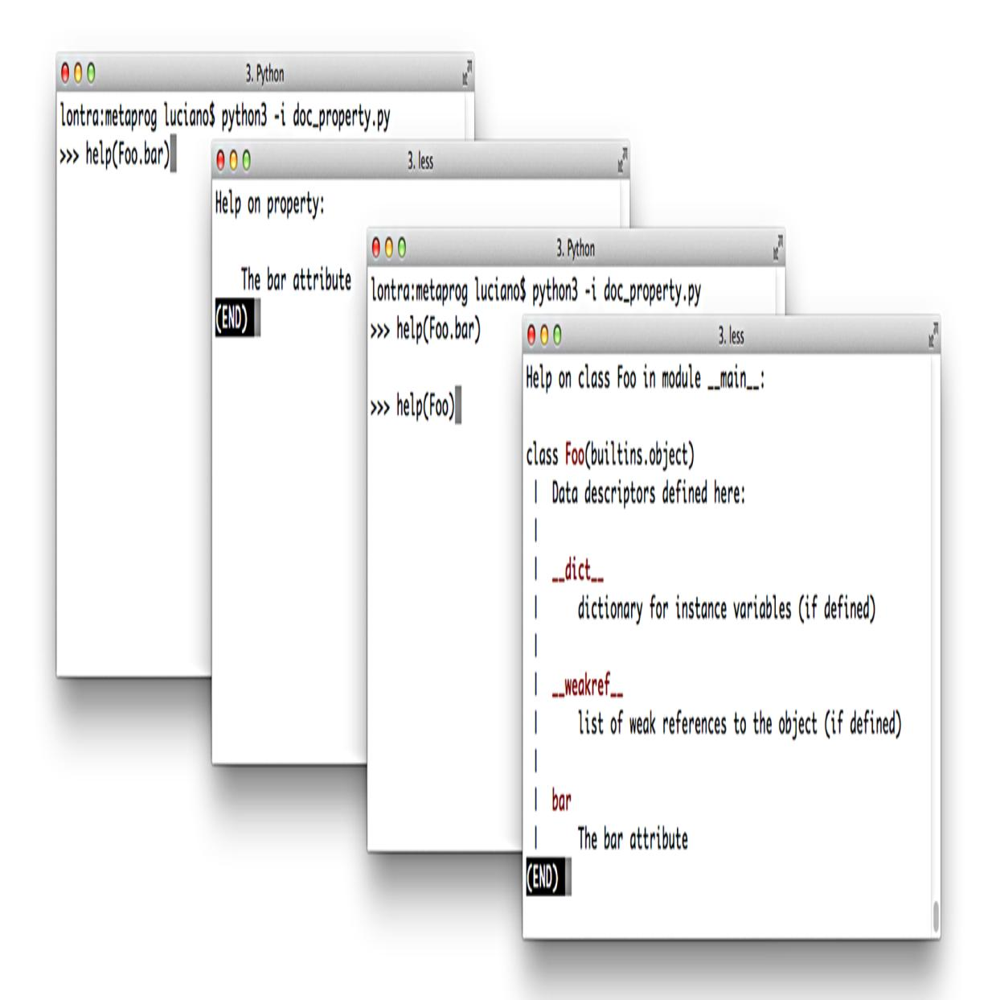

<span id="page-1203-0"></span>
# Chapter 23: Dynamic Attributes and Properties

## A NOTE FOR EARLY RELEASE READERS

With Early Release ebooks, you get books in their earliest form—the author's raw and unedited content as they write—so you can take advantage of these technologies long before the official release of these titles.

This will be the 23rd chapter of the final book. Please note that the GitHub repo will be made active later on.

If you have comments about how we might improve the content and/or examples in this book, or if you notice missing material within this chapter, please reach out to the author at [fluentpython2e@ramalho.org.](mailto:fluentpython2e@ramalho.org)

*The crucial importance of properties is that their existence makes it perfectly safe and indeed advisable for you to expose public data attributes as part of your class's public interface. [1](#page-1256-0)*

> <span id="page-1203-1"></span>—Martelli, Ravenscroft & Holden, Why properties are important

Data attributes and methods are collectively known as *attributes* in Python. A method is an attribute that is *callable*. Besides data attributes and methods, we can also create properties, which replace a public data attribute with *accessor methods* (i.e., getter/setter), without changing the class interface. This follows Bertrand Meyer's *Uniform access principle*:

<span id="page-1203-2"></span>*All services offered by a module should be available through a uniform notation, which does not betray whether they are implemented through storage or through computation. [2](#page-1256-1)*

Besides the property decorator, Python provides a rich API for controlling attribute access and implementing dynamic attributes. The interpreter calls the \_\_getattr\_\_ and \_\_setattr\_\_ special methods to handle attribute access or assignment using dot notation (e.g., obj.attr) or via the built-in functions getattr and setattr. A userdefined class implementing \_\_getattr\_\_ can implement "virtual attributes" by computing values on the fly whenever somebody tries to read a nonexistent attribute like obj.no\_such\_attr.

Coding dynamic attributes is the kind of metaprogramming that framework authors do. However, in Python the basic techniques are straightforward, so we can use them in everyday data wrangling tasks. That's how we'll start this chapter.

<span id="page-1204-1"></span>
## What's new in this chapter

Most updates to this chapter were motivated by a discussion of @functools.cached\_property (introduced in Python 3.8), as well as the combined use @property with @functools.cache (new in 3.9). This affected the code for the Record and Event classes that appear [in](https://www.python.org/dev/peps/pep-0412/) ["Computed Properties](#page-1215-0)[". I also added a refactoring to leverage the PEP](https://www.python.org/dev/peps/pep-0412/) 412—Key-Sharing Dictionary optimization.

To highlight more relevant features while keeping the examples readable, I removed some nonessential code—merging the old DbRecord class into Record, replacing shelve.Shelve with a dict, and deleting the logic to download the OSCON dataset—which the examples now read from a local file included in the *[Fluent Python, Second Edition](https://github.com/fluentpython/example-code-2e)* code repository.

<span id="page-1204-2"></span>
## Data Wrangling with Dynamic Attributes

<span id="page-1204-0"></span>In the next few examples, we'll leverage dynamic attributes to work with a JSON dataset published by O'Reilly for the OSCON 2014 conference. [Example 23-1](#page-1205-0) shows four records from that dataset.[3](#page-1256-2)

<span id="page-1205-0"></span>*Example 23-1. Sample records from osconfeed.json; some field contents abbreviated*

```
{ "Schedule":
 { "conferences": [{"serial": 115 }],
 "events": [
 { "serial": 34505,
 "name": "Why Schools Don´t Use Open Source to Teach
Programming",
 "event_type": "40-minute conference session",
 "time_start": "2014-07-23 11:30:00",
 "time_stop": "2014-07-23 12:10:00",
 "venue_serial": 1462,
 "description": "Aside from the fact that high school
programming...",
 "website_url":
"http://oscon.com/oscon2014/public/schedule/detail/34505",
 "speakers": [157509],
 "categories": ["Education"] }
 ],
 "speakers": [
 { "serial": 157509,
 "name": "Robert Lefkowitz",
 "photo": null,
 "url": "http://sharewave.com/",
 "position": "CTO",
 "affiliation": "Sharewave",
 "twitter": "sharewaveteam",
 "bio": "Robert ´r0ml´ Lefkowitz is the CTO at Sharewave, a
startup..." }
 ],
 "venues": [
 { "serial": 1462,
 "name": "F151",
 "category": "Conference Venues" }
 ]
 }
}
```

[Example 23-1](#page-1205-0) shows 4 of the 895 records in the JSON file. The entire dataset is a single JSON object with the key "Schedule", and its value is another mapping with four keys: "conferences", "events", "speakers", and "venues". Each of those four keys maps to a list of records. In the full dataset the "events", "speakers", and "venues" lists have dozens or hundreds of records, while "conferences" has only

that one record shown in [Example 23-1.](#page-1205-0) Every record has a "serial" field, which is a unique identifier for the record within the list.

I used Python's console to explore the dataset, as shown in [Example 23-2.](#page-1206-0)

<span id="page-1206-0"></span>
## Example 23-2. Interactive exploration of osconfeed.json

```
>>> import json
>>> with open('data/osconfeed.json') as fp:
... feed = json.load(fp) 
>>> sorted(feed['Schedule'].keys()) 
['conferences', 'events', 'speakers', 'venues']
>>> for key, value in sorted(feed['Schedule'].items()):
... print(f'{len(value):3} {key}') 
...
 1 conferences
484 events
357 speakers
 53 venues
>>> feed['Schedule']['speakers'][-1]['name'] 
'Carina C. Zona'
>>> feed['Schedule']['speakers'][-1]['serial'] 
141590
>>> feed['Schedule']['events'][40]['name']
'There *Will* Be Bugs'
>>> feed['Schedule']['events'][40]['speakers'] 
[3471, 5199]
```

- feed is a dict holding nested dicts and lists, with string and integer values.
- List the four record collections inside "Schedule".
- Display record counts for each collection.
- Navigate through the nested dicts and lists to get the name of the last speaker.
- Get serial number of that same speaker.
- Each event has a 'speakers' list with zero or more speaker serial numbers.

<span id="page-1207-2"></span>
## Exploring JSON-Like Data with Dynamic Attributes

<span id="page-1207-1"></span>[Example 23-2](#page-1206-0) is simple enough, but the syntax feed['Schedule'] ['events'][40]['name'] is cumbersome. In JavaScript, you can get the same value by writing feed.Schedule.events[40].name. It's easy to implement a dict-like class that does the same in Python—there are plenty of implementations on the Web. I wrote FrozenJSON, which is simpler than most recipes because it supports reading only: it's just for exploring the data. FrozenJSON is also recursive, dealing automatically with nested mappings and lists. [4](#page-1256-3)

[Example 23-3](#page-1207-0) is a demonstration of FrozenJSON and the source code is in [Example 23-4.](#page-1209-0)

<span id="page-1207-0"></span>*Example 23-3. FrozenJSON from [Example 23-4](#page-1209-0) allows reading attributes like name and calling methods like .keys() and .items()*

```
 >>> import json
 >>> raw_feed = json.load(open('data/osconfeed.json'))
 >>> feed = FrozenJSON(raw_feed) 
 >>> len(feed.Schedule.speakers) 
 357
 >>> feed.keys()
 dict_keys(['Schedule'])
 >>> sorted(feed.Schedule.keys()) 
 ['conferences', 'events', 'speakers', 'venues']
 >>> for key, value in sorted(feed.Schedule.items()):
 ... print(f'{len(value):3} {key}')
 ...
 1 conferences
 484 events
 357 speakers
 53 venues
 >>> feed.Schedule.speakers[-1].name 
 'Carina C. Zona'
 >>> talk = feed.Schedule.events[40]
 >>> type(talk) 
 <class 'explore0.FrozenJSON'>
 >>> talk.name
 'There *Will* Be Bugs'
 >>> talk.speakers 
 [3471, 5199]
 >>> talk.flavor 
 Traceback (most recent call last):
```

 ... **KeyError**: 'flavor'

- Build a FrozenJSON instance from the raw\_feed made of nested dicts and lists.
- FrozenJSON allows traversing nested dicts by using attribute notation; here we show the length of the list of speakers.
- Methods of the underlying dicts can also be accessed, like .keys(), to retrieve the record collection names.
- Using items(), we can retrieve the record collection names and their contents, to display the len() of each of them.
- A list, such as feed.Schedule.speakers, remains a list, but the items inside are converted to FrozenJSON if they are mappings.
- Item 40 in the events list was a JSON object; now it's a FrozenJSON instance.
- Event records have a speakers list with speaker serial numbers.
- Trying to read a missing attribute raises KeyError, instead of the usual AttributeError.

The keystone of the FrozenJSON class is the \_\_getattr\_\_ method, which we already used in the Vector example in "Vector Take #3: [Dynamic Attribute Access", to retrieve](019-chapter-12-writing-special-methods-for-sequences.md#page-590-1) Vector components by letter v.x, v.y, v.z, etc. It's essential to recall that the \_\_getattr\_\_ special method is only invoked by the interpreter when the usual process fails to retrieve an attribute (i.e., when the named attribute cannot be found in the instance, nor in the class or in its superclasses).

The last line of [Example 23-3](#page-1207-0) exposes a minor issue with my code: trying to read a missing attribute should raise AttributeError, and not

KeyError as shown. When I implemented the error handling to do that, the \_\_getattr\_\_ method became twice as long, distracting from the most important logic I wanted to show. Given that users would know that a FrozenJSON is built from mappings and lists, I think the KeyError is not too confusing.

As shown in [Example 23-4](#page-1209-0), the FrozenJSON class has only two methods (\_\_init\_\_, \_\_getattr\_\_) and a \_\_data instance attribute, so attempts to retrieve an attribute by any other name will trigger \_\_getattr\_\_. This method will first look if the self.\_\_data dict has an attribute (not a key!) by that name; this allows FrozenJSON instances to handle any dict method such as items, by delegating to self.\_\_data.items(). If self.\_\_\_data doesn't have an attribute with the given name, \_\_getattr\_\_ uses name as a key to retrieve an item from self.\_\_dict, and passes that item to FrozenJSON.build. This allows navigating through nested structures in the JSON data, as each nested mapping is converted to another FrozenJSON instance by the build class method.

<span id="page-1209-0"></span>*Example 23-4. explore0.py: turn a JSON dataset into a FrozenJSON holding nested FrozenJSON objects, lists, and simple types*

```
from collections import abc
```

```
class FrozenJSON:
 """A read-only façade for navigating a JSON-like object
 using attribute notation
 """
 def __init__(self, mapping):
 self.__data = dict(mapping) 
 def __getattr__(self, name): 
 try:
 return getattr(self.__data, name) 
 except AttributeError:
 return FrozenJSON.build(self.__data[name]) 
 @classmethod
 def build(cls, obj):
```

```
 if isinstance(obj, abc.Mapping): 
 return cls(obj)
 elif isinstance(obj, abc.MutableSequence): 
 return [cls.build(item) for item in obj]
 else: 
 return obj
```

- Build a dict from the mapping argument. This ensures we got a mapping or something that can be converted to one.
- \_\_getattr\_\_ is called only when there's no attribute with that name.
- If name matches an attribute of the instance \_\_data, return that. This is how calls like feed.keys() are handled: the keys method is an attribute of the \_\_data dict.
- <span id="page-1210-0"></span>Otherwise, fetch the item with the key name from self.\_\_data, and return the result of calling FrozenJSON.build() on that. [5](#page-1256-4)
- This is an alternate constructor, a common use for the @classmethod decorator.
- If obj is a mapping, build a FrozenJSON with it. This is an example of *goose typing*.
- <span id="page-1210-1"></span>If it is a MutableSequence, it must be a list, so we build a list by passing each item in obj recursively to .build(). [6](#page-1257-0)
- If it's not a dict or a list, return the item as it is. It should be a str or an int, given the contents of the JSON file.

Note that no caching or transformation of the original dataset is done. As the dataset is traversed, the nested data structures are converted again and again into FrozenJSON. That's OK for a dataset of this size, and for a script that will only be used to explore or convert the data.

Any script that generates or emulates dynamic attribute names from arbitrary sources must deal with one issue: the keys in the original data may not be suitable attribute names. The next section addresses this.

<span id="page-1211-1"></span>
## The Invalid Attribute Name Problem

The FrozenJSON code doesn't handle attribute names that are Python keywords. For example, if you build an object like this:

```
>>> student = FrozenJSON({'name': 'Jim Bo', 'class': 1982})
```

You won't be able to read student.class because class is a reserved keyword in Python:

```
>>> student.class
 File "<stdin>", line 1
 student.class
 ^
SyntaxError: invalid syntax
```

You can always do this, of course:

```
>>> getattr(student, 'class')
1982
```

But the idea of FrozenJSON is to provide convenient access to the data, so a better solution is checking whether a key in the mapping given to FrozenJSON.\_\_init\_\_ is a keyword, and if so, append an \_ to it, so the attribute can be read like this:

```
>>> student.class_
1982
```

This can be achieved by replacing the one-liner \_\_init\_\_ from [Example 23-4](#page-1209-0) with the version in [Example 23-5.](#page-1211-0)

<span id="page-1211-0"></span>*Example 23-5. explore1.py: append a \_ to attribute names that are Python keywords*

```
 def __init__(self, mapping):
 self.__data = {}
 for key, value in mapping.items():
 if keyword.iskeyword(key): 
 key += '_'
 self.__data[key] = value
```

The keyword.iskeyword(…) function is exactly what we need; to use it, the keyword module must be imported, which is not shown in this snippet.

A similar problem may arise if a key in the JSON is not a valid Python identifier:

```
>>> x = FrozenJSON({'2be':'or not'})
>>> x.2be
 File "<stdin>", line 1
 x.2be
 ^
SyntaxError: invalid syntax
```

Such problematic keys are easy to detect in Python 3 because the str class provides the s.isidentifier() method, which tells you whether s is a valid Python identifier according to the language grammar. But turning a key that is not a valid identifier into valid attribute name is not trivial. Two simple solutions would be raising an exception or replacing the invalid keys with generic names like attr\_0, attr\_1, and so on. For the sake of simplicity, I will not worry about this issue.

After giving some thought to the dynamic attribute names, let's turn to another essential feature of FrozenJSON: the logic of the build class method, which is used by \_\_getattr\_\_ to return a different type of object depending on the value of the attribute being accessed, so that nested structures are converted to FrozenJSON instances or lists of FrozenJSON instances.

Instead of a class method, the same logic could be implemented as the \_\_new\_\_ special method, as we'll see next.

<span id="page-1213-0"></span>
## Flexible Object Creation with \_\_new\_\_

We often refer to \_\_init\_\_ as the constructor method, but that's because we adopted jargon from other languages. In Python, \_\_init\_\_ gets self as the first argument, therefore the object already exists when \_\_init\_\_ is called by the interpreter. Also, \_\_init\_\_ cannot return anything. So it's really an initializer, not a constructor.

The special method that Python calls to construct an instance is \_\_new\_\_: it's a class method, but gets special treatment, so the @classmethod decorator is not used. Python takes the instance returned by \_\_new\_\_ and passes it as the first argument self of \_\_init\_\_. We rarely need to code \_\_new\_\_, because the implementation inherited from object suffices for the vast majority of use cases.

If necessary, the \_\_new\_\_ method can also return an instance of a different class. When that happens, the interpreter does not call \_\_init\_\_. In other words, Python's logic for building an object is similar to this pseudocode:

```
# pseudo-code for object construction
def make(the_class, some_arg):
 new_object = the_class.__new__(some_arg)
 if isinstance(new_object, the_class):
 the_class.__init__(new_object, some_arg)
 return new_object
# the following statements are roughly equivalent
x = Foo('bar')
x = make(Foo, 'bar')
```

[Example 23-6](#page-1213-1) shows a variation of FrozenJSON where the logic of the former build class method was moved to \_\_new\_\_.

<span id="page-1213-1"></span>*Example 23-6. explore2.py: using new instead of build to construct new objects that may or may not be instances of FrozenJSON*

```
from collections import abc
import keyword
class FrozenJSON:
 """A read-only façade for navigating a JSON-like object
```

## *using attribute notation """* **def** \_\_new\_\_(cls, arg): **if** isinstance(arg, abc.Mapping): **return** super().\_\_new\_\_(cls) **elif** isinstance(arg, abc.MutableSequence): **return** [cls(item) **for** item **in** arg] **else**: **return** arg **def** \_\_init\_\_(self, mapping): self.\_\_data = {} **for** key, value **in** mapping.items(): **if** keyword.iskeyword(key): key += '\_'

self.\_\_data[key] = value

**if** hasattr(self.\_\_data, name):

**return** getattr(self.\_\_data, name)

**return** FrozenJSON(self.\_\_data[name])

**def** \_\_getattr\_\_(self, name):

**else**:

- As a class method, the first argument \_\_new\_\_ gets is the class itself, and the remaining arguments are the same that \_\_init\_\_ gets, except for self.
- The default behavior is to delegate to the \_\_new\_\_ of a super class. In this case, we are calling \_\_new\_\_ from the object base class, passing FrozenJSON as the only argument.
- The remaining lines of \_\_new\_\_ are exactly as in the old build method.
- This was where FrozenJSON.build was called before; now we just call the FrozenJSON class, which Python handles by calling FrozenJSON.\_\_new\_\_.

| Thenew method gets the class as the first argument because, usually,   |
|------------------------------------------------------------------------|
| the created object will be an instance of that class. So, in           |
| FrozenJSONnew, when the expression                                     |
| super()new(cls) effectively calls                                      |
| objectnew(FrozenJSON), the instance built by the object                |
| class is actually an instance of FrozenJSON—i.e., theclass             |
| attribute of the new instance will hold a reference to FrozenJSON—even |
| though the actual construction is performed by objectnew,              |
| implemented in C, in the guts of the interpreter.                      |

The OSCON JSON dataset is structured in a way that is not helpful. For example, the event at index 40, titled 'There \*Will\* Be Bugs' has two speakers, 3471 and 5199. Finding the names of the speakers is awkward, because those are serial numbers and the Schedule.speakers list is not indexed by them. To get each speaker, we must iterate over that list until we find a record with a matching serial number. Our next task is restructuring the data, to prepare for automatic retrieval of linked records.

<span id="page-1215-0"></span>
## Computed Properties

## NOTE

We first saw the @property decorator in [Chapter 11](018-chapter-11-a-pythonic-object.md#page-533-0), section ["A Hashable Vector2d".](018-chapter-11-a-pythonic-object.md#page-547-0) In [Example 11-7,](018-chapter-11-a-pythonic-object.md#page-548-0) I used two properties in Vector2d just to make the x and y attributes read-only. Here we will see properties that compute values, leading to a discussion of how to cache such values.

The records in the 'events' list of the OSCON JSON data contain integer serial numbers pointing to records in the 'speakers' and 'venues' lists. For example, this is the record for a conference talk (with an elided description):

```
{ "serial": 33950,
 "name": "There *Will* Be Bugs",
 "event_type": "40-minute conference session",
 "time_start": "2014-07-23 14:30:00",
 "time_stop": "2014-07-23 15:10:00",
 "venue_serial": 1449,
 "description": "If you're pushing the envelope of
programming...",
 "website_url":
"http://oscon.com/oscon2014/public/schedule/detail/33950",
 "speakers": [3471, 5199],
 "categories": ["Python"] }
```

We will implement an Event class with venue and speakers properties to return the linked data automatically—in other words, "dereferencing" the serial number. Given an Event instance, this is the desired behavior:

## Example 23-7.

```
 >>> event 
 <Event 'There *Will* Be Bugs'>
 >>> event.venue 
 <Record serial=1449>
 >>> event.venue.name 
 'Portland 251'
 >>> for spkr in event.speakers: 
 ... print(f'{spkr.serial}: {spkr.name}')
 ...
 3471: Anna Martelli Ravenscroft
 5199: Alex Martelli
```

- Given an Event instance…
- …reading event.venue returns a Record object instead of a serial number.
- Now it's easy to get the name of the venue.
- The event.speakers property returns a list of Record instances.

As usual, we will build the code step-by-step, starting with the Record class and a function to read the JSON data and return a dict with Record instances.

<span id="page-1217-2"></span>
## Step 1: Data-driven Attribute Creation

Here is the doctest to guide this first step:

<span id="page-1217-1"></span>*Example 23-8. Test driving schedule\_v1.py ([Example 23-9\)](#page-1217-0)*

```
 >>> records = load(JSON_PATH) 
 >>> speaker = records['speaker.3471'] 
 >>> speaker 
 <Record serial=3471>
 >>> speaker.name, speaker.twitter 
 ('Anna Martelli Ravenscroft', 'annaraven')
```

- load a dict with the JSON data.
- The keys in records are strings built from the record type and serial.
- speaker is an instance of the Record class defined in [Example 23-9.](#page-1217-0)
- Fields from the original JSON can be retrieved as Record instance attributes.

The code for *schedule\_v1.py* is in [Example 23-9.](#page-1217-0)

<span id="page-1217-0"></span>*Example 23-9. schedule\_v1.py: reorganizing the OSCON schedule data*

```
import json
JSON_PATH = 'data/osconfeed.json'
class Record:
 def __init__(self, **kwargs):
 self.__dict__.update(kwargs) 
 def __repr__(self):
 cls_name = self.__class__.__name__
 return f'<{cls_name} serial={self.serial!r}>' 
def load(path=JSON_PATH):
```

```
 records = {} 
 with open(path) as fp:
 raw_data = json.load(fp) 
 for collection, raw_records in raw_data['Schedule'].items(): 
 record_type = collection[:-1] 
 for raw_record in raw_records:
 key = f'{record_type}.{raw_record["serial"]}'
 records[key] = Record(**raw_record) 
 return records
```

- This is a common shortcut to build an instance with attributes created from keyword arguments (detailed explanation follows).
- Use the serial field to build the custom Record representation shown in [Example 23-8](#page-1217-1).
- load will ultimately return a dict of Record instances.
- Parse the JSON, returning native Python objects: lists, dicts, strings, numbers etc.
- Iterate over the four top-level lists named 'conferences', 'events', 'speakers', and 'venues'.
- record\_type is the list name without the last character, so speakers becomes speaker.
- Build the key in the format 'speaker.3471'.
- Create a Record instance and save it in records with the key

```
The Record.__init__ method illustrates an old Python hack. Recall
that the __dict__ of an object is where its attributes are kept—unless
__slots__ is declared in the class, as we saw in "Saving Memory with
__slots__". So, updating an instance __dict__ with a mapping is a
quick way to create a bunch of attributes in that instance.7
```

## NOTE

Depending on the application, the Record class may need to deal with keys that are not valid attribute names, as we saw in ["The Invalid Attribute Name Problem"](#page-1211-1). Dealing with that issue would distract from the key idea of this example, and is not a problem in the data set we are reading.

The definition of Record in [Example 23-9](#page-1217-0) is so simple that you may be wondering why I did not use it before, instead of the more complicated FrozenJSON. There are two reasons. First, FrozenJSON works by recursively converting the nested mappings and lists; Record doesn't need that because our converted dataset doesn't have mappings nested in mappings or lists. The records contain only strings, integers, lists of strings, and lists of integers. Second reason: FrozenJSON provides access to the embedded \_\_data dict attributes—which we used to invoke methods like .keys()—and now we don't need that functionality either.

## NOTE

The Python standard library provides at least two classes similar to Record, where each instance has an arbitrary set of attributes built from keyword arguments given to \_\_init\_\_: [multiprocessing.Namespace](http://bit.ly/1cPLZzd) and [argparse.Namespace](http://bit.ly/1cPM1qG). I wrote the simpler Record class to highlight the essential idea: \_\_init\_\_ updating the instance \_\_dict\_\_.

After reorganizing the schedule dataset, we can enhance the Record class to automatically retrieve venue and speaker records referenced in an event record. We'll use properties to do that in the next examples.

<span id="page-1219-0"></span>
## Step 2: Property to Retrieve a Linked Record

The goal of this next version is: given an event record, reading its venue property will return a Record. This is similar to what the Django ORM

does when you access a ForeignKey field: instead of the key, you get the linked model object.

We'll start with the venue property. See the partial interaction in [Example 23-10](#page-1220-0) as an example.

<span id="page-1220-0"></span>
## Example 23-10. Extract from the doctests of schedule\_v2.py

```
 >>> event = Record.fetch('event.33950') 
 >>> event 
 <Event 'There *Will* Be Bugs'>
 >>> event.venue 
 <Record serial=1449>
 >>> event.venue.name 
 'Portland 251'
 >>> event.venue_serial 
 1449
```

- The Record.fetch static method gets a Record or an Event from the dataset.
- Note that event is an instance of the Event class.
- Accessing event.venue returns a Record instance.
- Now it's easy to find out the name of an event.venue.
- The Event instance also has a venue\_serial attribute, from the JSON data.

Event is a subclass of Record adding a venue to retrieve linked records, and a specialized \_\_repr\_\_ method.

The code for this section is in the *schedule\_v2.py* module in the *Fluent Python 2e* [code repository. The example has nearly 60 lines, so I'll pres](https://github.com/fluentpython/example-code-2e)ent it in parts, starting with the enhanced Record class.

*Example 23-11. schedule\_v2.py: Record class with a new fetch method.*

```
import inspect 
import json
```

```
JSON_PATH = 'data/osconfeed.json'
class Record:
 __index = None 
 def __init__(self, **kwargs):
 self.__dict__.update(kwargs)
 def __repr__(self):
 cls_name = self.__class__.__name__
 return f'<{cls_name} serial={self.serial!r}>'
 @staticmethod 
 def fetch(key):
 if Record.__index is None: 
 Record.__index = load()
 return Record.__index[key]
```

- inspect will be used in load, listed in [Example 23-13](#page-1223-0).
- The \_\_index private class attribute will eventually hold a reference to the dict returned by load.
- fetch is a staticmethod to make it explicit that its effect is always exactly the same, no matter how it's called.
- Populate the Record.\_\_index if needed.
- Use it to retrieve the record with the given key.

## TIP

This is one example where the use of staticmethod makes sense. The fetch method always acts on the Record.\_\_index class attribute, even if invoked as Event.fetch(). It would be misleading to code it as a class method because the cls first argument would not be used.

Now we get to the use of a property in the Event class, listed in [Example 23-12](#page-1222-0).

<span id="page-1222-0"></span>
## Example 23-12. schedule\_v2.py: the Event class

```
class Event(Record): 
 def __repr__(self):
 if hasattr(self, 'name'): 
 cls_name = self.__class__.__name__
 return f'<{cls_name} {self.name!r}>'
 else:
 return super().__repr__()
 @property
 def venue(self):
 key = f'venue.{self.venue_serial}'
 return self.__class__.fetch(key)
```

- Event extends Record.
- If the instance has a name attribute, it is used to produce a custom representation. Otherwise, delegate to the \_\_repr\_\_ from Record.
- The venue property builds a key from the venue\_serial attribute, and passes it to the fetch class method, inherited from Record (the reason for using self.\_\_class\_\_ is explained shortly).

The second line of the venue method of [Example 23-12,](#page-1222-0) returns self.\_\_class\_\_.fetch(key). Why not simply call self.fetch(key)? The simpler form works with the specific OSCON dataset because there is no event record with a 'fetch' key. But, if an event record had a key named 'fetch', then within that specific Event instance, the reference self.fetch would retrieve the value of that field, instead of the fetch class method that Event inherits from Record. This is a subtle bug, and it could easily sneak through testing because it depends on the dataset.

## WARNING

When creating instance attribute names from data, there is always the risk of bugs due to shadowing of class attributes—such as methods—or data loss through accidental overwriting of existing instance attributes. These problems may explain why Python dicts are not like JavaScript objects in the first place.

If the Record class behaved more like a mapping, implementing a dynamic \_\_getitem\_\_ instead of a dynamic \_\_getattr\_\_, there would be no risk of bugs from overwriting or shadowing. A custom mapping is probably the Pythonic way to implement Record. But if I took that road, we'd not be studying the tricks and traps of dynamic attribute programming.

The final piece of this example is the revised load function in [Example 23-13](#page-1223-0).

<span id="page-1223-0"></span>
## Example 23-13. schedule\_v2.py: the load function

```
def load(path=JSON_PATH):
 records = {}
 with open(path) as fp:
 raw_data = json.load(fp)
 for collection, raw_records in raw_data['Schedule'].items():
 record_type = collection[:-1] 
 cls_name = record_type.capitalize() 
 cls = globals().get(cls_name, Record) 
 if inspect.isclass(cls) and issubclass(cls, Record): 
 factory = cls 
 else:
 factory = Record 
 for raw_record in raw_records: 
 key = f'{record_type}.{raw_record["serial"]}'
 records[key] = factory(**raw_record) 
 return records
```

- So far, no changes from the load in *schedule\_v1.py* [\(Example 23-9\)](#page-1217-0).
- Capitalize the record\_type to get a possible class name; e.g., 'event' becomes 'Event'.

- Get an object by that name from the module global scope; get the Record class if there's no such object.
- If the object just retrieved is a class, and is a subclass of Record…
- …bind the factory name to it. This means factory may be any subclass of Record, depending on the record\_type.
- Otherwise, bind the factory name to Record.
- The for loop that creates the key and saves the records is the same as before, except that…
- …the object stored in records is constructed by factory, which may be Record or a subclass like Event selected according to the record\_type.

Note that the only record\_type that has a custom class is Event, but if classes named Speaker or Venue are coded, load will automatically use those classes when building and saving records, instead of the default Record class.

We'll now apply the same idea to a new speakers property in the Events class.

<span id="page-1224-1"></span>
## Step 3: Property Overriding an Existing Attribute

The name of the venue property in [Example 23-12](#page-1222-0) does not match a field name in the Event records. Its data comes from a venue\_serial attribute. In contrast, each Event instance has speaker attribute with a list of serial numbers, and we want to expose that information as a speaker property returning a list of Record instances. This name clash requires some special attention, as [Example 23-14](#page-1224-0) reveals.

<span id="page-1224-0"></span>*Example 23-14. schedule\_v3.py: the speakers property*

```
 @property
 def speakers(self):
 spkr_serials = self.__dict__['speakers'] 
 fetch = self.__class__.fetch
 return [fetch(f'speaker.{key}')
 for key in spkr_serials]
```

- The data we want is in a speakers attribute, but we must retrieve it directly from the instance \_\_dict\_\_ to avoid a recursive call to the speakers property.
- Return a list of all records with keys corresponding to the numbers in spkr\_serials.

Inside the speakers method, trying to read self.speakers will invoke the property itself, quickly raising a RecursionError. However if we read the same data via the self.\_\_dict\_\_['speakers'], Python's usual algorithm for retrieving attributes is bypassed, the property is not called, and the recursion is avoided. For this reason, reading or writing data directly to an object's \_\_dict\_\_ is a common Python metaprogramming trick.

## WARNING

The interpreter evaluates obj.my\_attr by first looking at the class of obj. If the class has a property with the my\_attr name, that property shadows an instance attribute by the same name. Examples in ["Properties Override Instance Attributes"](#page-1235-0) will demonstrate this, and [Chapter 24](031-chapter-24-attribute-descriptors.md#page-1258-0) will reveal that a property is implemented as a descriptor—a more powerful and general abstraction.

As I coded the list comprehension in [Example 23-14,](#page-1224-0) my programmer's lizard brain thought "This may be expensive." Not really, because events in the OSCON dataset have few speakers, so coding anything more complicated would be premature optimization. However, caching a property is a common need—and there are caveats. So let's see how to do that in the next examples.

<span id="page-1226-3"></span>
## Step 4: Bespoke Property Cache

<span id="page-1226-2"></span>Caching properties is a common need because there is an expectation that an expression like event.venue should be inexpensive. Some form of caching could become necessary if the Record.fetch method behind the Event properties needed to query a database or a Web API. [8](#page-1257-2)

In *Fluent Python, First Edition*, I coded the custom caching logic for the speakers method as shown in [Example 23-15](#page-1226-0).

<span id="page-1226-0"></span>*Example 23-15. Custom caching logic using hasattr disables key-sharing optimization.*

```
 @property
 def speakers(self):
 if not hasattr(self, '__speaker_objs'): 
 spkr_serials = self.__dict__['speakers']
 fetch = self.__class__.fetch
 self.__speaker_objs = [fetch(f'speaker.{key}')
 for key in spkr_serials]
 return self.__speaker_objs
```

- If the instance doesn't have an attribute named \_\_speaker\_objs, fetch the speaker objects and store them there.
- Return self.\_\_speaker\_objs.

The handmade caching in [Example 23-15](#page-1226-0) is straightforward, but creating an attribute after the instance is initialized defeats the PEP 412—Key-Sharing [Dictionary optimization, as explained in \[Link to Come\]. Depending on the](https://www.python.org/dev/peps/pep-0412/) size of the dataset, the difference in memory usage may be important.

A similar hand-rolled solution that works well with the key-sharing optimization requires coding an \_\_init\_\_ for the Event class, to create the necessary \_\_speaker\_objs initialized to None, and then checking for that in the speakers method. See [Example 23-16.](#page-1226-1)

<span id="page-1226-1"></span>*Example 23-16. Storage defined in \_\_init\_\_ to leverage key-sharing optimization.*

```
class Event(Record):
 def __init__(self, **kwargs):
 self.__speaker_objs = None
 super().__init__(**kwargs)
# 15 lines omitted...
 @property
 def speakers(self):
 if self.__speaker_objs is None:
 spkr_serials = self.__dict__['speakers']
 fetch = self.__class__.fetch
 self.__speaker_objs = [fetch(f'speaker.{key}')
 for key in spkr_serials]
 return self.__speaker_objs
```

[Example 23-15](#page-1226-0) and [Example 23-16](#page-1226-1) illustrate simple caching techniques that are fairly common in legacy Python codebases. However, in multi-threaded programs handmade caches like those introduce race conditions that may lead to corrupted data. If two threads are reading a property that was not previously cached, the first thread will need to compute the data for the cache attribute (\_\_speaker\_objs in the examples) and the second thread may read a cached value that is not yet complete.

Fortunately, Python 3.8 introduced @functools.cached\_property decorator which is thread-safe. Unfortunately, it comes with a couple of caveats, explained next.

<span id="page-1227-0"></span>
## Step 5: Caching Properties with functools

The functools module provides three decorators for caching. We saw @cache and @lru\_cache in ["Memoization with functools.cache"](015-chapter-9-decorators-and-closures.md#page-478-2) ([Chapter 9\)](015-chapter-9-decorators-and-closures.md#page-456-0). Python 3.8 introduced @cached\_property.

The functools.cached\_property decorator caches the result of the method in an instance attribute with the same name. For example, in Example 23-17, the value computed by the venue method is stored in a venue attribute in self. After that, when client code tries to read venue, the newly created venue instance attribute is used instead of the method.

```
 @cached_property
 def venue(self):
 key = f'venue.{self.venue_serial}'
 return self.__class__.fetch(key)
```

In ["Step 3: Property Overriding an Existing Attribute",](#page-1224-1) we saw that a property shadows an instance attribute by the same name. If that is true, how can @cached\_property work? If the property overrides the instance attribute, the venue attribute will be ignored and the venue method will always be called, computing the key and running fetch every time!

The answer is a bit sad: cached\_property is a misnomer. The @cached\_property decorator does not create a full-fledged property. While @property creates an *overriding descriptor*, @cached\_property creates a *non-overriding descriptor*. We will study both kinds of descriptors in [Chapter 24](031-chapter-24-attribute-descriptors.md#page-1258-0).

For now, let us set aside the underlying implementation and focus on the differences between cached\_property and property from a user [point of view. Raymond Hettinger explains them very well in the Python](https://docs.python.org/3/library/functools.html#functools.cached_property) Docs:

*The mechanics of cached\_property() are somewhat different from property(). A regular property blocks attribute writes unless a setter is defined. In contrast, a cached\_property allows writes.*

*The cached\_property decorator only runs on lookups and only when an attribute of the same name doesn't exist. When it does run, the cached\_property writes to the attribute with the same name. Subsequent attribute reads and writes take precedence over the cached\_property method and it works like a normal attribute.*

<span id="page-1228-1"></span>*The cached value can be cleared by deleting the attribute. This allows the cached\_property method to run again.[9](#page-1257-3)*

Back to our Event class: the specific behavior of @cached\_property makes it unsuitable to decorate speakers, because that method relies on an existing attribute also named speakers, containing the serial numbers of the event speakers.

## WARNING

@cached\_property has some important limitations:

- It cannot be used as a drop-in replacement to @property if the decorated method already depends on an instance attribute with the same name;
- It cannot be used in a class that defines \_\_slots\_\_;
- It defeats the key-sharing optimization of the instance \_\_dict\_\_, because it creates an instance attribute after \_\_init\_\_.

Despite these limitations, @cached\_property addresses a common need in a simple way, and it is thread-safe. Its [Python code](https://github.com/python/cpython/blob/e6d0107e13ed957109e79b796984d3d026a8660d/Lib/functools.py#L926) is an example of using a [reentrant lock](https://docs.python.org/3/library/threading.html#threading.RLock).

The @cached\_property [documentation](https://docs.python.org/3/library/functools.html#functools.cached_property) recommends an alternative solution that we can use with speakers: stacking @property and @cache decorators, as shown in [Example 23-18](#page-1229-0)

<span id="page-1229-0"></span>
## Example 23-18. Stacking @property on @cache.

```
 @property 
 @cache 
 def speakers(self):
 spkr_serials = self.__dict__['speakers']
 fetch = self.__class__.fetch
 return [fetch(f'speaker.{key}')
 for key in spkr_serials]
```

- The order here is important, @property goes on top…
- …of @cache.

Recall from ["Stacked decorators"](015-chapter-9-decorators-and-closures.md#page-480-0) the meaning of that syntax. The top three lines of [Example 23-18](#page-1229-0) are similar to:

```
speakers = property(cache(speakers))
```

The @cache is applied to speakers, returning a new function. That function then is decorated by @property, which replaces it with a newly constructed property.

This wraps up our discussion of read-only properties and caching decorators. In the next section, we will create a read/write property.

<span id="page-1230-0"></span>
## Using a Property for Attribute Validation

Besides computing attribute values, properties are also used to enforce business rules by changing a public attribute into an attribute protected by a getter and setter without affecting client code. Let's work through an extended example.

<span id="page-1230-2"></span>
## LineItem Take #1: Class for an Item in an Order

Imagine an app for a store that sells organic food in bulk, where customers can order nuts, dried fruit, or cereals by weight. In that system, each order would hold a sequence of line items, and each line item could be represented by a class as in [Example 23-19.](#page-1230-1)

<span id="page-1230-1"></span>*Example 23-19. bulkfood\_v1.py: the simplest LineItem class*

### **class LineItem**:

```
 def __init__(self, description, weight, price):
 self.description = description
 self.weight = weight
 self.price = price
 def subtotal(self):
 return self.weight * self.price
```

That's nice and simple. Perhaps too simple. [Example 23-20](#page-1231-0) shows a problem.

<span id="page-1231-0"></span>
## Example 23-20. A negative weight results in a negative subtotal

```
 >>> raisins = LineItem('Golden raisins', 10, 6.95)
 >>> raisins.subtotal()
 69.5
 >>> raisins.weight = -20 # garbage in...
 >>> raisins.subtotal() # garbage out...
 -139.0
```

This is a toy example, but not as fanciful as you may think. Here is a true story from the early days of Amazon.com:

*We found that customers could order a negative quantity of books! And we would credit their credit card with the price and, I assume, wait around for them to ship the books. [10](#page-1257-4)*

```
—Jeff Bezos, Founder and CEO of Amazon.com
```

How do we fix this? We could change the interface of LineItem to use a getter and a setter for the weight attribute. That would be the Java way, and it's not wrong.

On the other hand, it's natural to be able set the weight of an item by just assigning to it; and perhaps the system is in production with other parts already accessing item.weight directly. In this case, the Python way would be to replace the data attribute with a property.

<span id="page-1231-3"></span>
## LineItem Take #2: A Validating Property

Implementing a property will allow us to use a getter and a setter, but the interface of LineItem will not change (i.e., setting the weight of a LineItem will still be written as raisins.weight = 12).

[Example 23-21](#page-1231-1) lists the code for a read/write weight property.

<span id="page-1231-1"></span>*Example 23-21. bulkfood\_v2.py: a LineItem with a weight property* **class LineItem**:

```
 def __init__(self, description, weight, price):
```

```
 self.description = description
 self.weight = weight 
 self.price = price
 def subtotal(self):
 return self.weight * self.price
 @property 
 def weight(self): 
 return self.__weight 
 @weight.setter 
 def weight(self, value):
 if value > 0:
 self.__weight = value 
 else:
 raise ValueError('value must be > 0')
```

- Here the property setter is already in use, making sure that no instances with negative weight can be created.
- @property decorates the getter method.
- The methods that implement a property all have the name of the public attribute: weight.
- The actual value is stored in a private attribute \_\_weight.
- The decorated getter has a .setter attribute, which is also a decorator; this ties the getter and setter together.
- If the value is greater than zero, we set the private \_\_weight.
- Otherwise, ValueError is raised.

Note how a LineItem with an invalid weight cannot be created now:

```
>>> walnuts = LineItem('walnuts', 0, 10.00)
Traceback (most recent call last):
 ...
ValueError: value must be > 0
```

Now we have protected weight from users providing negative values. Although buyers usually can't set the price of an item, a clerical error or a bug may create a LineItem with a negative price. To prevent that, we could also turn price into a property, but this would entail some repetition in our code.

Remember the Paul Graham quote from [Chapter 17](024-chapter-17-iterables-iterators-and-generators.md#page-840-0): "When I see patterns in my programs, I consider it a sign of trouble." The cure for repetition is abstraction. There are two ways to abstract away property definitions: using a property factory or a descriptor class. The descriptor class approach is more flexible, and we'll devote [Chapter 24](031-chapter-24-attribute-descriptors.md#page-1258-0) to a full discussion of it. Properties are in fact implemented as descriptor classes themselves. But here we will continue our exploration of properties by implementing a property factory as a function.

But before we can implement a property factory, we need to have a deeper understanding of properties.

<span id="page-1233-0"></span>
## A Proper Look at Properties

Although often used as a decorator, the property built-in is actually a class. In Python, functions and classes are often interchangeable, because both are callable and there is no new operator for object instantiation, so invoking a constructor is no different than invoking a factory function. And both can be used as decorators, as long as they return a new callable that is a suitable replacement of the decorated function.

This is the full signature of the property constructor:

```
property(fget=None, fset=None, fdel=None, doc=None)
```

All arguments are optional, and if a function is not provided for one of them, the corresponding operation is not allowed by the resulting property object.

The property type was added in Python 2.2, but the @ decorator syntax appeared only in Python 2.4, so for a few years, properties were defined by passing the accessor functions as the first two arguments.

The "classic" syntax for defining properties without decorators is illustrated in [Example 23-22](#page-1234-0).

<span id="page-1234-0"></span>*Example 23-22. bulkfood\_v2b.py: same as [Example 23-21](#page-1231-1) but without using decorators*

### **class LineItem**:

```
 def __init__(self, description, weight, price):
 self.description = description
 self.weight = weight
 self.price = price
 def subtotal(self):
 return self.weight * self.price
 def get_weight(self): 
 return self.__weight
 def set_weight(self, value): 
 if value > 0:
 self.__weight = value
 else:
 raise ValueError('value must be > 0')
 weight = property(get_weight, set_weight)
```

- A plain getter.
- A plain setter.
- Build the property and assign it to a public class attribute.

The classic form is better than the decorator syntax in some situations; the code of the property factory we'll discuss shortly is one example. On the other hand, in a class body with many methods, the decorators make it explicit which are the getters and setters, without depending on the convention of using get and set prefixes in their names.

The presence of a property in a class affects how attributes in instances of that class can be found in a way that may be surprising at first. The next section explains.

<span id="page-1235-0"></span>
## Properties Override Instance Attributes

Properties are always class attributes, but they actually manage attribute access in the instances of the class.

In ["Overriding Class Attributes"](018-chapter-11-a-pythonic-object.md#page-565-1) we saw that when an instance and its class both have a data attribute by the same name, the instance attribute overrides, or shadows, the class attribute—at least when read through that instance. [Example 23-23](#page-1235-1) illustrates this point.

<span id="page-1235-1"></span>*Example 23-23. Instance attribute shadows class data attribute*

```
>>> class Class: 
... data = 'the class data attr'
... @property
... def prop(self):
... return 'the prop value'
...
>>> obj = Class()
>>> vars(obj) 
{}
>>> obj.data 
'the class data attr'
>>> obj.data = 'bar'
>>> vars(obj) 
{'data': 'bar'}
>>> obj.data 
'bar'
>>> Class.data 
'the class data attr'
```

- Define Class with two class attributes: the data data attribute and the prop property.
- vars returns the \_\_dict\_\_ of obj, showing it has no instance attributes.
- Reading from obj.data retrieves the value of Class.data.

- Writing to obj.data creates an instance attribute.
- Inspect the instance to see the instance attribute.
- Now reading from obj.data retrieves the value of the instance attribute. When read from the obj instance, the instance data shadows the class data.
- The Class.data attribute is intact.

Now, let's try to override the prop attribute on the obj instance. Resuming the previous console session, we have [Example 23-24.](#page-1236-0)

<span id="page-1236-0"></span>*Example 23-24. Instance attribute does not shadow class property (continued from [Example 23-23\)](#page-1235-1)*

```
>>> Class.prop 
<property object at 0x1072b7408>
>>> obj.prop 
'the prop value'
>>> obj.prop = 'foo' 
Traceback (most recent call last):
 ...
AttributeError: can't set attribute
>>> obj.__dict__['prop'] = 'foo' 
>>> vars(obj) 
{'data': 'bar', 'prop': 'foo'}
>>> obj.prop 
'the prop value'
>>> Class.prop = 'baz' 
>>> obj.prop 
'foo'
```

- Reading prop directly from Class retrieves the property object itself, without running its getter method.
- Reading obj.prop executes the property getter.
- Trying to set an instance prop attribute fails.

- Putting 'prop' directly in the obj.\_\_dict\_\_ works.
- We can see that obj now has two instance attributes: data and prop.
- However, reading obj.prop still runs the property getter. The property is not shadowed by an instance attribute.
- Overwriting Class.prop destroys the property object.
- Now obj.prop retrieves the instance attribute. Class.prop is not a property anymore, so it no longer overrides obj.prop.

As a final demonstration, we'll add a new property to Class, and see it overriding an instance attribute. [Example 23-25](#page-1237-0) picks up where [Example 23-24](#page-1236-0) left off.

<span id="page-1237-0"></span>*Example 23-25. New class property shadows existing instance attribute (continued from [Example 23-24\)](#page-1236-0)*

```
>>> obj.data 
'bar'
>>> Class.data 
'the class data attr'
>>> Class.data = property(lambda self: 'the "data" prop value') 
>>> obj.data 
'the "data" prop value'
>>> del Class.data 
>>> obj.data 
'bar'
```

- obj.data retrieves the instance data attribute.
- Class.data retrieves the class data attribute.
- Overwrite Class.data with a new property.
- obj.data is now shadowed by the Class.data property.
- Delete the property.

obj.data now reads the instance data attribute again.

The main point of this section is that an expression like obj.data does not start the search for data in obj. The search actually starts at obj.\_\_class\_\_, and only if there is no property named data in the class, Python looks in the obj instance itself. This applies to *overriding descriptors* in general, of which properties are just one example. Further treatment of descriptors must wait for [Chapter 24.](031-chapter-24-attribute-descriptors.md#page-1258-0)

Now back to properties. Every Python code unit—modules, functions, classes, methods—can have a docstring. The next topic is how to attach documentation to properties.

<span id="page-1238-0"></span>
## Property Documentation

When tools such as the console help() function or IDEs need to display the documentation of a property, they extract the information from the \_\_doc\_\_ attribute of the property.

If used with the classic call syntax, property can get the documentation string as the doc argument:

```
 weight = property(get_weight, set_weight, doc='weight in
kilograms')
```

When property is deployed as a decorator, the docstring of the getter method—the one with the @property decorator itself—is used as the documentation of the property as a whole. [Figure 23-1](#page-1239-0) shows the help screens generated from the code in [Example 23-26.](#page-1239-1)

<span id="page-1239-0"></span>

*Figure 23-1. Screenshots of the Python console when issuing the commands help(Foo.bar) and help(Foo). Source code in [Example 23-26.](#page-1239-1)*

<span id="page-1239-1"></span>
## Example 23-26. Documentation for a property

```
 @property
 def bar(self):
 '''The bar attribute'''
 return self.__dict__['bar']
```

**class Foo**:

```
 @bar.setter
 def bar(self, value):
 self.__dict__['bar'] = value
```

Now that we have these property essentials covered, let's go back to the issue of protecting both the weight and price attributes of LineItem so they only accept values greater than zero—but without implementing two nearly identical pairs of getters/setters by hand.

<span id="page-1240-1"></span>
## Coding a Property Factory

We'll create a factory to create quantity properties—so named because the managed attributes represent quantities that can't be negative or zero in the application. [Example 23-27](#page-1240-0) shows the clean look of the LineItem class using two instances of quantity properties: one for managing the weight attribute, the other for price.

<span id="page-1240-0"></span>*Example 23-27. bulkfood\_v2prop.py: the quantity property factory in use*

```
class LineItem:
 weight = quantity('weight') 
 price = quantity('price') 
 def __init__(self, description, weight, price):
 self.description = description
 self.weight = weight 
 self.price = price
 def subtotal(self):
 return self.weight * self.price
```

- Use the factory to define the first custom property, weight, as a class attribute.
- This second call builds another custom property, price.
- Here the property is already active, making sure a negative or 0 weight is rejected.

The properties are also in use here, retrieving the values stored in the instance.

Recall that properties are class attributes. When building each quantity property, we need to pass the name of the LineItem attribute that will be managed by that specific property. Having to type the word weight twice in this line is unfortunate:

```
 weight = quantity('weight')
```

But avoiding that repetition is complicated because the property has no way of knowing which class attribute name will be bound to it. Remember: the right-hand side of an assignment is evaluated first, so when quantity() is invoked, the weight class attribute doesn't even exist.

## NOTE

Improving the quantity property so that the user doesn't need to retype the attribute name is a nontrivial metaprogramming problem. We'll see a workaround in [Chapter 24](031-chapter-24-attribute-descriptors.md#page-1258-0), but real solutions will have to wait until [Chapter 25,](032-chapter-25-class-metaprogramming.md#page-1296-0) because they require either a class decorator or a metaclass.

<span id="page-1241-1"></span>[Example 23-28](#page-1241-0) lists the implementation of the quantity property factory. [11](#page-1257-5)

<span id="page-1241-0"></span>*Example 23-28. bulkfood\_v2prop.py: the quantity property factory*

```
def quantity(storage_name): 
 def qty_getter(instance): 
 return instance.__dict__[storage_name] 
 def qty_setter(instance, value): 
 if value > 0:
 instance.__dict__[storage_name] = value 
 else:
 raise ValueError('value must be > 0')
 return property(qty_getter, qty_setter)
```

- The storage\_name argument determines where the data for each property is stored; for the weight, the storage name will be 'weight'.
- The first argument of the qty\_getter could be named self, but that would be strange because this is not a class body; instance refers to the LineItem instance where the attribute will be stored.
- qty\_getter references storage\_name, so it will be preserved in the closure of this function; the value is retrieved directly from the instance.\_\_dict\_\_ to bypass the property and avoid an infinite recursion.
- qty\_setter is defined, also taking instance as first argument.
- The value is stored directly in the instance.\_\_dict\_\_, again bypassing the property.
- Build a custom property object and return it.

The bits of [Example 23-28](#page-1241-0) that deserve careful study revolve around the storage\_name variable. When you code each property in the traditional way, the name of the attribute where you will store a value is hardcoded in the getter and setter methods. But here, the qty\_getter and qty\_setter functions are generic, and they depend on the storage\_name variable to know where to get/set the managed attribute in the instance \_\_dict\_\_. Each time the quantity factory is called to build a property, the storage\_name must be set to a unique value.

The functions qty\_getter and qty\_setter will be wrapped by the property object created in the last line of the factory function. Later when called to perform their duties, these functions will read the storage\_name from their closures, to determine where to retrieve/store the managed attribute values.

In [Example 23-29](#page-1243-0), I create and inspect a LineItem instance, exposing the storage attributes.

<span id="page-1243-0"></span>
## Example 23-29. bulkfood\_v2prop.py: the quantity property factory

```
 >>> nutmeg = LineItem('Moluccan nutmeg', 8, 13.95)
 >>> nutmeg.weight, nutmeg.price 
 (8, 13.95)
 >>> sorted(vars(nutmeg).items()) 
 [('description', 'Moluccan nutmeg'), ('price', 13.95),
('weight', 8)]
```

- Reading the weight and price through the properties shadowing the namesake instance attributes.
- Using vars to inspect the nutmeg instance: here we see the actual instance attributes used to store the values.

Note how the properties built by our factory leverage the behavior described in ["Properties Override Instance Attributes"](#page-1235-0): the weight property overrides the weight instance attribute so that every reference to self.weight or nutmeg.weight is handled by the property functions, and the only way to bypass the property logic is to access the instance \_\_dict\_\_ directly.

The code in [Example 23-29](#page-1243-0) may be a bit tricky, but it's concise: it's identical in length to the decorated getter/setter pair defining just the weight property in [Example 23-21.](#page-1231-1) The LineItem definition in [Example 23-27](#page-1240-0) looks much better without the noise of the getter/setters.

In a real system, that same kind of validation may appear in many fields, across several classes, and the quantity factory would be placed in a utility module to be used over and over again. Eventually that simple factory could be refactored into a more extensible descriptor class, with specialized subclasses performing different validations. We'll do that in [Chapter 24](031-chapter-24-attribute-descriptors.md#page-1258-0).

Now let us wrap up the discussion of properties with the issue of attribute deletion.

<span id="page-1244-2"></span>
## Handling Attribute Deletion

Recall from the Python tutorial that object attributes can be deleted using the del statement:

```
del my_object.an_attribute
```

In practice, deleting attributes is not something we do every day in Python, and the requirement to handle it with a property is even more unusual. But it is supported, and I can think of a silly example to demonstrate it.

In a property definition, the @my\_property.deleter decorator wraps the method in charge of deleting the attribute managed by the property. As promised, [Example 23-30](#page-1244-0) is a silly example showing how to code a property deleter.

<span id="page-1244-0"></span>*Example 23-30. blackknight.py: inspired by the Black Knight character of "Monty Python and the Holy Grail"*

```
class BlackKnight:
```

```
 def __init__(self):
 self.phrases = [
 ('an arm', "'Tis but a scratch."),
 ('another arm', "It's just a flesh wound."),
 ('a leg', "I'm invincible!"),
 ('another leg', "All right, we'll call it a draw.")
 ]
 @property
 def member(self):
 print('next member is:')
 return self.phrases[0][0]
 @member.deleter
 def member(self):
 member, text = self.phrases.pop(0)
 print(f'BLACK KNIGHT (loses {member}) -- {text}')
```

The doctests in *blackknight.py* are in [Example 23-31.](#page-1244-1)

<span id="page-1244-1"></span>*Example 23-31. blackknight.py: doctests for [Example 23-30](#page-1244-0) (the Black Knight never concedes defeat)*

```
 >>> knight = BlackKnight()
 >>> knight.member
 next member is:
 'an arm'
 >>> del knight.member
 BLACK KNIGHT (loses an arm) -- 'Tis but a scratch.
 >>> del knight.member
 BLACK KNIGHT (loses another arm) -- It's just a flesh wound.
 >>> del knight.member
 BLACK KNIGHT (loses a leg) -- I'm invincible!
 >>> del knight.member
 BLACK KNIGHT (loses another leg) -- All right, we'll call it a
draw.
```

Using the classic call syntax instead of decorators, the fdel argument configures the deleter function. For example, the member property would be coded like this in the body of the BlackKnight class:

```
 member = property(member_getter, fdel=member_deleter)
```

If you are not using a property, attribute deletion can also be handled by implementing the lower-level \_\_delattr\_\_ special method, presented in ["Special Methods for Attribute Handling"](#page-1247-0). Coding a silly class with \_\_delattr\_\_ is left as an exercise to the procrastinating reader.

Properties are a powerful feature, but sometimes simpler or lower-level alternatives are preferable. In the final section of this chapter, we'll review some of the core APIs that Python offers for dynamic attribute programming.

<span id="page-1245-0"></span>
## Essential Attributes and Functions for Attribute Handling

Throughout this chapter, and even before in the book, we've used some of the built-in functions and special methods Python provides for dealing with dynamic attributes. This section gives an overview of them in one place, because their documentation is scattered in the official docs.

<span id="page-1246-2"></span>
## Special Attributes that Affect Attribute Handling

<span id="page-1246-1"></span><span id="page-1246-0"></span>

| The behavior of many of the functions and special methods listed in the<br>following sections depend on three special attributes:                                                                                                                                                                                                      |
|----------------------------------------------------------------------------------------------------------------------------------------------------------------------------------------------------------------------------------------------------------------------------------------------------------------------------------------|
| class                                                                                                                                                                                                                                                                                                                                  |
| A reference to the object's class (i.e., objclass is the same as<br>type(obj)). Python looks for special methods such as<br>getattr only in an object's class, and not in the instances<br>themselves.                                                                                                                                 |
| dict                                                                                                                                                                                                                                                                                                                                   |
| A mapping that stores the writable attributes of an object or class. An<br>object that has adict can have arbitrary new attributes set at any<br>time. If a class has aslots attribute, then its instances may not<br>have adict Seeslots (next).                                                                                      |
| slots                                                                                                                                                                                                                                                                                                                                  |
| An attribute that may be defined in a class to limit the attributes its<br>instances can haveslots is a tuple of strings naming the<br>12<br>allowed attributes.<br>If the 'dict' name is not inslots,<br>then the instances of that class will not have adict of their own,<br>and only the named attributes will be allowed in them. |
| Built-In Functions for Attribute Handling                                                                                                                                                                                                                                                                                              |
| These five built-in functions perform object attribute reading, writing, and<br>introspection:                                                                                                                                                                                                                                         |
| dir([object])                                                                                                                                                                                                                                                                                                                          |
| Lists most attributes of the object. The official docs say dir is intended<br>for interactive use so it does not provide a comprehensive list of<br>attributes, but an "interesting" set of names. dir can inspect objects<br>implemented with or without adict Thedict attribute                                                      |

```
itself is not listed by dir, but the __dict__ keys are listed. Several
special attributes of classes, such as __mro__, __bases__, and
__name__ are not listed by dir either. If the optional object
argument is not given, dir lists the names in the current scope.
```

## getattr(object, name[, default])

Gets the attribute identified by the name string from the object. This may fetch an attribute from the object's class or from a superclass. If no such attribute exists, getattr raises AttributeError or returns the default value, if given.

## hasattr(object, name)

Returns True if the named attribute exists in the object, or can be somehow fetched through it (by inheritance, for example). The [documentation](https://docs.python.org/3/library/functions.html#hasattr) explains: "This is implemented by calling getattr(object, name) and seeing whether it raises an AttributeError or not."

## setattr(object, name, value)

Assigns the value to the named attribute of object, if the object allows it. This may create a new attribute or overwrite an existing one.

## vars([object])

Returns the \_\_dict\_\_ of object; vars can't deal with instances of classes that define \_\_slots\_\_ and don't have a \_\_dict\_\_ (contrast with dir, which handles such instances). Without an argument, vars() does the same as locals(): returns a dict representing the local scope.

<span id="page-1247-0"></span>
## Special Methods for Attribute Handling

When implemented in a user-defined class, the special methods listed here handle attribute retrieval, setting, deletion, and listing.

Attribute access using either dot notation or the built-in functions getattr, hasattr, and setattr trigger the appropriate special methods listed here. Reading and writing attributes directly in the instance \_\_dict\_\_ does not trigger these special methods—and that's the usual way to bypass them if needed.

["Section 3.3.9. Special method lookup"](http://bit.ly/1cPO3qP) of the "Data model" chapter warns:

*For custom classes, implicit invocations of special methods are only guaranteed to work correctly if defined on an object's type, not in the object's instance dictionary.*

In other words, assume that the special methods will be retrieved on the class itself, even when the target of the action is an instance. For this reason, special methods are not shadowed by instance attributes with the same name.

In the following examples, assume there is a class named Class, obj is an instance of Class, and attr is an attribute of obj.

For every one of these special methods, it doesn't matter if the attribute access is done using dot notation or one of the built-in functions listed in ["Built-In Functions for Attribute Handling".](#page-1246-0) For example, both obj.attr and getattr(obj, 'attr', 42) trigger Class.\_\_getattribute\_\_(obj, 'attr'). *\_\_delattr\_\_(self, name)* Always called when there is an attempt to delete an attribute using the del statement; e.g., del obj.attr triggers Class.\_\_delattr\_\_(obj, 'attr'). *\_\_dir\_\_(self)* Called when dir is invoked on the object, to provide a listing of attributes; e.g., dir(obj) triggers Class.\_\_dir\_\_(obj). *\_\_getattr\_\_(self, name)*

Called only when an attempt to retrieve the named attribute fails, after the obj, Class, and its superclasses are searched. The expressions obj.no\_such\_attr, getattr(obj, 'no\_such\_attr'), and hasattr(obj, 'no\_such\_attr') may trigger Class.\_\_getattr\_\_(obj, 'no\_such\_attr'), but only if an attribute by that name cannot be found in obj or in Class and its superclasses.

## \_\_getattribute\_\_(self, name)

Always called when there is an attempt to retrieve the named attribute, except when the attribute sought is a special attribute or method. Dot notation and the getattr and hasattr built-ins trigger this method. \_\_getattr\_\_ is only invoked after \_\_getattribute\_\_, and only when \_\_getattribute\_\_ raises AttributeError. To retrieve attributes of the instance obj without triggering an infinite recursion, implementations of \_\_getattribute\_\_ should use super().\_\_getattribute\_\_(obj, name).

## \_\_setattr\_\_(self, name, value)

Always called when there is an attempt to set the named attribute. Dot notation and the setattr built-in trigger this method; e.g., both obj.attr = 42 and setattr(obj, 'attr', 42) trigger Class.\_\_setattr\_\_(obj, 'attr', 42).

## TIP

In practice, because they are unconditionally called and affect practically every attribute access, the \_\_getattribute\_\_ and \_\_setattr\_\_ special methods are harder to use correctly than \_\_getattr\_\_—which only handles nonexisting attribute names. Using properties or descriptors is less error prone than defining these special methods.

This concludes our dive into properties, special methods, and other techniques for coding dynamic attributes.

<span id="page-1250-0"></span>
## Chapter Summary

We started our coverage of dynamic attributes by showing practical examples of simple classes to make it easier to deal with a JSON dataset. The first example was the FrozenJSON class that converted nested dicts and lists into nested FrozenJSON instances and lists of them. The FrozenJSON code demonstrated the use of the \_\_getattr\_\_ special method to convert data structures on the fly, whenever their attributes were read. The last version of FrozenJSON showcased the use of the \_\_new\_\_ constructor method to transform a class into a flexible factory of objects, not limited to instances of itself.

We then converted the JSON dataset to a dict storing instances of a Record class. The first rendition of Record was a few lines long and introduced the "bunch" idiom: using self.\_\_dict\_\_.update(\*\*kwargs) to build arbitrary attributes from keyword arguments passed to \_\_init\_\_. The second iteration added the Event class implementing automatic retrieval of linked records through properties. Computed property values sometimes require caching, and we covered a few ways of doing that. After realizing that @functools.cached\_property does not implement the basic behavior expected of methods decorated with the @property built-in, we finally settled on the use of @cached\_property in one method, and @functools.cache decorated with @property in the other method.

Coverage of properties continued with the LineItem class, where a property was deployed to protect a weight attribute from negative or zero values that make no business sense. After a deeper look at property syntax and semantics, we created a property factory to enforce the same validation on weight and price, without coding multiple getters and setters. The property factory leveraged subtle concepts—such as closures and the instance attribute overriding by properties—to provide an elegant generic solution using the same number of lines as a single hand-coded property definition.

Finally, we had a brief look at handling attribute deletion with properties, followed by an overview of the key special attributes, built-in functions, and special methods that support attribute metaprogramming in the core Python language.

<span id="page-1251-0"></span>
## Further Reading

The official documentation for the attribute handling and introspection built-in functions is [Chapter 2, "Built-in Functions"](http://bit.ly/1cPOrpc) of *The Python Standard Library*. The related special methods and the \_\_slots\_\_ special attribute [are documented in The Python Language Reference in "3.3.2. Customizing](http://bit.ly/1cPOlxV) attribute access". The semantics of how special methods are invoked bypassing instances is explained in ["3.3.9. Special method lookup".](http://bit.ly/1cPO3qP) In [Chapter 4, "Built-in Types," of the Python Standard Library, "4.13. Special](http://bit.ly/1cPOodb) Attributes" covers \_\_class\_\_ and \_\_dict\_\_ attributes.

*[Python Cookbook, 3E](http://shop.oreilly.com/product/0636920027072.do)* by David Beazley and Brian K. Jones (O'Reilly) has several recipes covering the topics of this chapter, but I will highlight three that are outstanding: "Recipe 8.8. Extending a Property in a Subclass" addresses the thorny issue of overriding the methods inside a property inherited from a superclass; "Recipe 8.15. Delegating Attribute Access" [implements a proxy class showcasing most special methods from "Special](#page-1247-0) Methods for Attribute Handling" in this book; and the awesome "Recipe 9.21. Avoiding Repetitive Property Methods," which was the basis for the property factory function presented in [Example 23-28](#page-1241-0).

*[Python in a Nutshell, 3E](https://www.oreilly.com/library/view/python-in-a/9781491913833/)* (O'Reilly), by Alex Martelli, Anna Ravenscroft, and Steve Holden is rigorous and objective. They devote only three pages to properties, but that's because the book follows an axiomatic presentation style: the preceding 15 pages or so provide a thorough description of the semantics of Python classes from the ground up, including descriptors, which are how properties are actually implemented under the hood. So by the time Martelli et.al. get to properties, they can pack a lot of insights in those three pages—including that which I selected to open this chapter.

Bertrand Meyer—quoted in the *Uniform Access Principle* definition in this chapter opening—pioneered the Design by Contract methodology, designed the Eiffel language, and wrote the excellent *Object-Oriented Software Construction, 2E* (Prentice-Hall). The book is more than 1,250 pages long, and I confess I did not read it all, but the first six chapters provide one of the best conceptual introductions to OO analysis and design I've seen. Chapter 11 presents Design by Contract, and Chapter 35 offers his assessments of some influential OO languages: Simula, Smalltalk, CLOS (the Common Lisp Object System), Objective-C, C++, and Java, with brief comments on some others. Only in the last page of the book he reveals that the highly readable "notation" he uses as pseudocode is Eiffel.

## SOAPBOX

<span id="page-1253-0"></span>Meyer's *Uniform Access Principle* is aesthetically appealing. As a programmer using an API, I shouldn't have to care whether product.price simply fetches a data attribute or performs a computation. As a consumer and a citizen, I do care: in e-commerce today the value of product.price often depends on who is asking, so it's certainly not a mere data attribute. In fact, it's common practice that the price is lower if the query comes from outside the store—say, from a price-comparison engine. This effectively punishes loyal customers who like to browse within a particular store. But I digress.

The previous digression does raise a relevant point for programming: although the Uniform Access Principle makes perfect sense in an ideal world, in reality users of an API may need to know whether reading product.price is potentially too expensive or time-consuming. That's a problem with programming abstractions in general: they make it hard to reason about the runtime cost of evaluating an expression. On the other hand, abstractions let users accomplish more with less code. It's a trade-off. As usual in matters of software engineering, Ward Cunningham's [original Wiki](http://bit.ly/1HGvZuA) hosts insightful arguments about the merits of the [Uniform Access Principle](http://bit.ly/1HGvNvk).

In object-oriented programming languages, application or violations of the Uniform Access Principle usually revolve around the syntax of reading public data attributes versus invoking getter/setter methods.

Smalltalk and Ruby address this issue in a simple and elegant way: they don't support public data attributes at all. Every instance attribute in these languages is private, so every access to them must be through methods. But their syntax makes this painless: in Ruby, product.price invokes the price getter; in Smalltalk, it's simply product price.

<span id="page-1253-1"></span>At the other end of the spectrum, the Java language allows the programmer to choose among four access level modifiers.[13](#page-1257-7)

The general practice does not agree with the syntax established by the Java designers, though. Everybody in Java-land agrees that attributes should be private, and you must spell it out every time, because it's not the default. When all attributes are private, all access to them from outside the class must go through accessors. Java IDEs include shortcuts for generating accessor methods automatically. Unfortunately, the IDE is not so helpful when you must read the code six months later. It's up to you to wade through a sea of do-nothing accessors to find those that add value by implementing some business logic.

Alex Martelli speaks for the majority of the Python community when he calls accessors "goofy idioms" and then provides these examples that look very different but do the same thing: [14](#page-1257-8)

```
someInstance.widgetCounter += 1
# rather than...
someInstance.setWidgetCounter(someInstance.getWidgetCounter()
+ 1)
```

Sometimes when designing APIs, I've wondered whether every method that does not take an argument (besides self), returns a value (other than None), and is a pure function (i.e., has no side effects) should be replaced by a read-only property. In this chapter, the LineItem.subtotal method (as in [Example 23-27](#page-1240-0)) would be a good candidate to become a read-only property. Of course, this excludes methods that are designed to change the object, such as my\_list.clear(). It would be a terrible idea to turn that into a property, so that merely accessing my\_list.clear would delete the contents of the list!

In the [Pingo.io](http://www.pingo.io/docs/) GPIO library (mentioned in "The \_\_missing\_\_ [Method"\), much of the user-level API is based on properties. For](008-chapter-3-dictionaries-and-sets.md#page-160-0) example, to read the current value of an analog pin, the user writes pin.value, and setting a digital pin mode is written as pin.mode = OUT. Behind the scenes, reading an analog pin value or setting a digital pin mode may involve a lot of code, depending on the specific

board driver. We decided to use properties in Pingo because we want the API to be comfortable to use even in interactive environments like [iPython Notebook,](http://ipython.org/notebook.html) and we feel pin.mode = OUT is easier on the eyes and on the fingers than pin.set\_mode(OUT).

Although I find the Smalltalk and Ruby solution cleaner, I think the Python approach makes more sense than the Java one. We are allowed to start simple, coding data members as public attributes, because we know they can always be wrapped by properties (or descriptors, which we'll talk about in the next chapter).

## \_\_new\_\_ Is Better Than new

Another example of the Uniform Access Principle (or a variation of it) is the fact that function calls and object instantiation use the same syntax in Python: my\_obj = foo(), where foo may be a class or any other callable.

Other languages influenced by C++ syntax have a new operator that makes instantiation look different than a call. Most of the time, the user of an API doesn't care whether foo is a function or a class. Until recently, I was under the impression that property was a function. In normal usage, it makes no difference.

<span id="page-1255-0"></span>There are many good reasons for replacing constructors with factories. A popular motive is limiting the number of instances, by returning previously built ones (as in the Singleton pattern). A related use is caching expensive object construction. Also, sometimes it's convenient to return objects of different types depending on the arguments given. [15](#page-1257-9)

Coding a constructor is simpler; providing a factory adds flexibility at the expense of more code. In languages that have a new operator, the designer of an API must decide in advance whether to stick with a simple constructor or invest in factory. If the initial choice is wrong, the correction may be costly—all because new is an operator.

Sometimes it may also be convenient to go the other way, and replace a simple function with a class.

In Python, classes and functions are interchangeable in many situations. Not only because there's no new operator, but also because there is the \_\_new\_\_ special method, which can turn a class into a factory [producing objects of different kinds \(as we saw in "Flexible Object](#page-1213-0) Creation with \_\_new\_\_") or returning prebuilt instances instead of creating a new one every time.

[This function-class duality would be easier to leverage if PEP 8 — Style](http://bit.ly/1HGvYH7) Guide for Python Code did not recommend CamelCase for class names. On the other hand, dozens of classes in the standard library have lowercase names (e.g., property, str, defaultdict, etc.). So maybe the use of lowercase class names is a feature, and not a bug. But however we look at it, the inconsistent capitalization of classes in the Python standard library poses a usability problem.

Although calling a function is not different than calling a class, it's good to know which is which because of another thing we can do with a class: subclassing. So I personally use CamelCase in every class that I code, and I wish all classes in the Python standard library used the same convention. I am looking at you, collections.OrderedDict and collections.defaultdict.

- <span id="page-1256-0"></span>[1](#page-1203-1) Alex Martelli, Anna Ravenscroft & Steve Holden, *[Python in a Nutshell, 3rd Edition](https://www.oreilly.com/library/view/python-in-a/9781491913833/)* (O'Reilly), p. 123.
- <span id="page-1256-1"></span>[2](#page-1203-2) Bertrand Meyer, *Object-Oriented Software Construction*, 2E, p. 57.
- <span id="page-1256-2"></span>[3](#page-1204-0) The OSCON conferences were a permanent casualty of the COVID-19 pandemic. The original 744KB JSON file I used for these examples is still [online](http://www.oreilly.com/pub/sc/osconfeed) as of December 19, 2020. A copy named *osconfeed.json* can be found in the *23-dyn-attr-prop/oscon/data* directory in the [example code repository](https://github.com/fluentpython/example-code-2e)
- <span id="page-1256-3"></span>[4](#page-1207-1) Two examples are [AttrDict](https://pypi.python.org/pypi/attrdict) and [addict](https://pypi.python.org/pypi/addict).
- <span id="page-1256-4"></span>[5](#page-1210-0) The expression self.\_\_data[name] is where a KeyError exception may occur. Ideally, it should be handled and an AttributeError raised instead, because that's what is

- expected from \_\_getattr\_\_. The diligent reader is invited to code the error handling as an exercise.
- <span id="page-1257-0"></span>[6](#page-1210-1) The source of the data is JSON, and the only collection types in JSON data are dict and list.
- <span id="page-1257-1"></span>7 By the way, Bunch is the name of the class used by Alex Martelli to share this tip in a recipe from 2001 titled "The simple but handy *[collector of a bunch of named stuff](http://bit.ly/1cPM8T3)* class". The comments on Alex's recipe suggest interesting enhancements.
- <span id="page-1257-2"></span>[8](#page-1226-2) This is actually a downside of Meyer's Uniform Access Principle, which I mentioned in the opening of this chapter. Read the optional ["Soapbox"](#page-1253-0) if you're interested in this discussion.
- <span id="page-1257-3"></span>[9](#page-1228-1) Source: [@functools.cached\\_property](https://docs.python.org/3/library/functools.html#functools.cached_property) documentation. I know Raymond Hettinger authored [this explanation because he wrote it as a response to an issue I filed: bpo42781](https://bugs.python.org/issue42781) functools.cached\_property docs should explain that it is non-overriding. Hettinger is a major contributor to the official Python docs and standard library. He also wrote the excellent [Descriptor HowTo Guide](http://bit.ly/1HGwlS3), a key resource for [Chapter 24](031-chapter-24-attribute-descriptors.md#page-1258-0).
- <span id="page-1257-4"></span>10 Direct quote by Jeff Bezos in the *Wall Street Journal* story ["Birth of a Salesman"](http://on.wsj.com/1ECl8Dl) (October 15, 2011).
- <span id="page-1257-5"></span>[11](#page-1241-1) [This code is adapted from "Recipe 9.21. Avoiding Repetitive Property Methods" from](http://shop.oreilly.com/product/0636920027072.do) *Python Cookbook, 3E* by David Beazley and Brian K. Jones (O'Reilly).
- <span id="page-1257-6"></span>[12](#page-1246-1) Alex Martelli points out that, although \_\_slots\_\_ can be coded as a list, it's better to be explicit and always use a tuple, because changing the list in the \_\_slots\_\_ after the class body is processed has no effect, so it would be misleading to use a mutable sequence there.
- <span id="page-1257-7"></span>[13](#page-1253-1) Including the no-name default that the [Java Tutorial](http://bit.ly/1cPOMIE) calls "package-private."
- <span id="page-1257-8"></span>14 Alex Martelli, *Python in a Nutshell, 2E* (O'Reilly), p. 101.
- <span id="page-1257-9"></span>[15](#page-1255-0) [The reasons I am about to mention are given in the Dr. Dobbs Journal article titled "Java's](http://ubm.io/1cPP4PN) new Considered Harmful", by Jonathan Amsterdam and in *"Consider static factory methods instead of constructors"*, which is Item 1 of the award-winning book *Effective Java* (Addison-Wesley) by Joshua Bloch.
