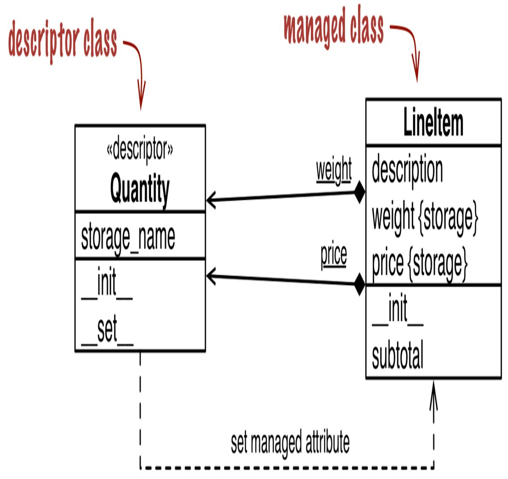
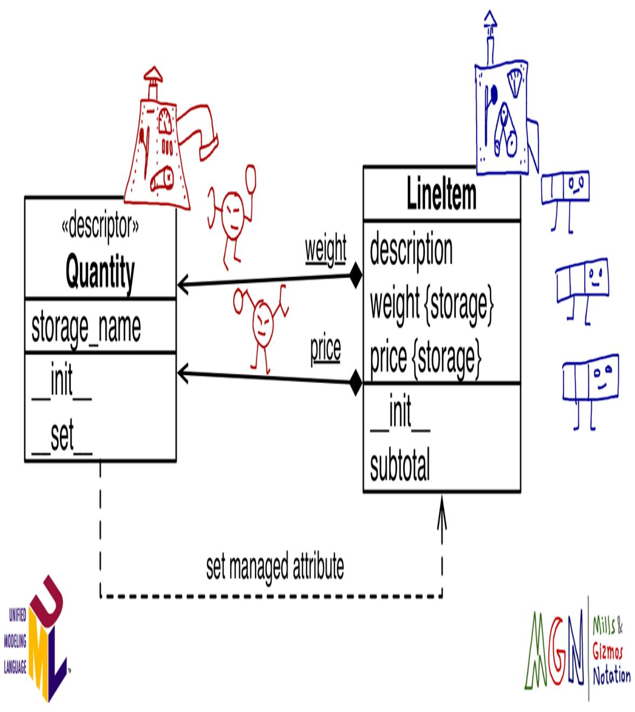
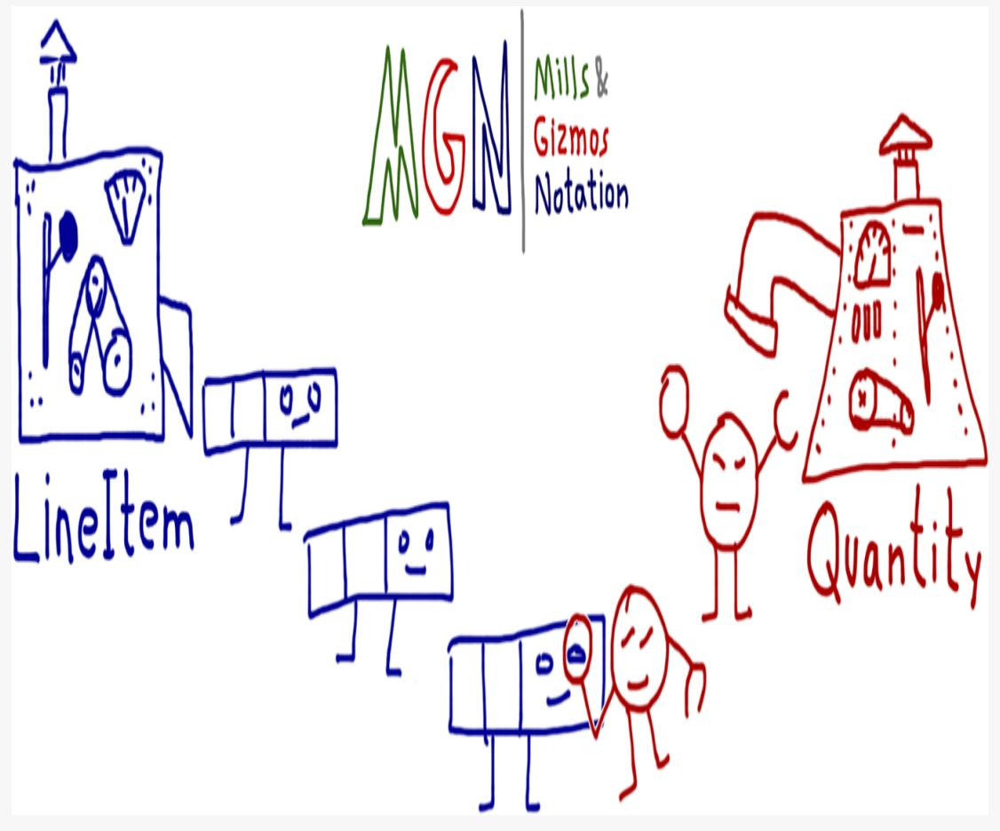
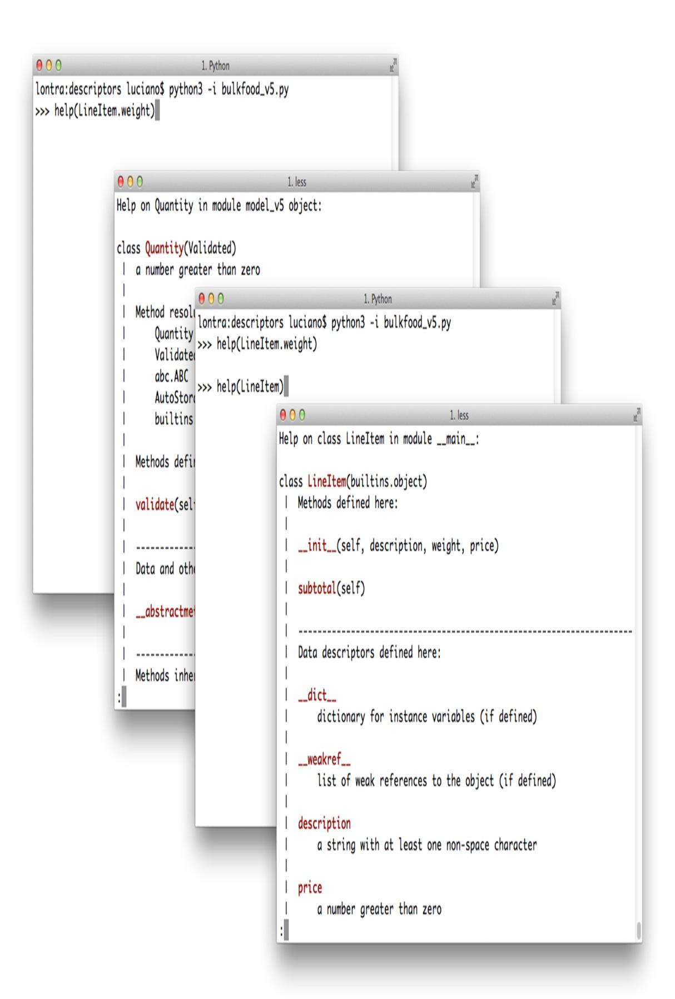

<span id="page-1258-0"></span>
# Chapter 24: Attribute Descriptors

## A NOTE FOR EARLY RELEASE READERS

With Early Release ebooks, you get books in their earliest form—the author's raw and unedited content as they write—so you can take advantage of these technologies long before the official release of these titles.

This will be the 24th chapter of the final book. Please note that the GitHub repo will be made active later on.

If you have comments about how we might improve the content and/or examples in this book, or if you notice missing material within this chapter, please reach out to the author at [fluentpython2e@ramalho.org.](mailto:fluentpython2e@ramalho.org)

*Learning about descriptors not only provides access to a larger toolset, it creates a deeper understanding of how Python works and an appreciation for the elegance of its design. [1](#page-1295-0)*

<span id="page-1258-1"></span>—Raymond Hettinger, Python core developer and guru

Descriptors are a way of reusing the same access logic in multiple attributes. For example, field types in ORMs such as the Django ORM and SQL Alchemy are descriptors, managing the flow of data from the fields in a database record to Python object attributes and vice versa.

| A descriptor is a class that implements a dynamic protocol consisting of the |
|------------------------------------------------------------------------------|
| get,set, anddelete methods. The property class                               |
| implements the full descriptor protocol. As usual with dynamic protocols,    |
| partial implementations are OK. In fact, most descriptors we see in real     |
| code implement onlyget andset, and many implement only                       |
| one of these methods.                                                        |

Descriptors are a distinguishing feature of Python, deployed not only at the application level but also in the language infrastructure. Besides properties, other Python features that leverage descriptors are methods and the classmethod and staticmethod decorators. Understanding descriptors is key to Python mastery. This is what this chapter is about.

<span id="page-1259-0"></span>
## What's new in this chapter

The Quantity descriptor example in "LineItem Take #4: Automatic [Storage Attribute Names" was dramatically simplified thanks to the](#page-1269-0) \_\_set\_name\_\_ special method added to the descriptor protocol in Python 3.6.

[I removed the property factory example formerly in "LineItem Take #4:](#page-1269-0) Automatic Storage Attribute Names" because it became irrelevant: the point was to show an alternative way of solving the Quantity problem, but with the addition of \_\_set\_name\_\_ the descriptor solution becomes much simpler.

The AutoStorage [class that used to appear in "LineItem Take #5: A](#page-1271-0) New Descriptor Type" is also gone because \_\_set\_name\_\_ made it obsolete.

<span id="page-1259-1"></span>
## Descriptor Example: Attribute Validation

As we saw in ["Coding a Property Factory"](030-chapter-23-dynamic-attributes-and-properties.md#page-1240-1), a property factory is a way to avoid repetitive coding of getters and setters by applying functional programming patterns. A property factory is a higher-order function that creates a parameterized set of accessor functions and builds a custom property instance from them, with closures to hold settings like the storage\_name. The object-oriented way of solving the same problem is a descriptor class.

We'll continue the series of LineItem examples where we left it, in ["Coding a Property Factory",](030-chapter-23-dynamic-attributes-and-properties.md#page-1240-1) by refactoring the quantity property

factory into a Quantity descriptor class.

<span id="page-1260-0"></span>
## LineItem Take #3: A Simple Descriptor

A class implementing a \_\_get\_\_, a \_\_set\_\_, or a \_\_delete\_\_ method is a descriptor. You use a descriptor by declaring instances of it as class attributes of another class.

We'll create a Quantity descriptor and the LineItem class will use two instances of Quantity: one for managing the weight attribute, the other for price. A diagram helps, so take a look at [Figure 24-1.](#page-1261-0)

<span id="page-1261-0"></span>

*Figure 24-1. UML class diagram for LineItem using a descriptor class named Quantity. Underlined attributes in UML are class attributes. Note that weight and price are instances of Quantity attached to the LineItem class, but LineItem instances also have their own weight and price attributes where those values are stored.*

Note that the word weight appears twice in [Figure 24-1](#page-1261-0), because there are really two distinct attributes named weight: one is a class attribute of LineItem, the other is an instance attribute that will exist in each LineItem object. This also applies to price.

From now on, I will use the following definitions:

*Descriptor class*

A class implementing the descriptor protocol. That's Quantity in [Figure 24-1.](#page-1261-0)

## Managed class

The class where the descriptor instances are declared as class attributes —LineItem in [Figure 24-1](#page-1261-0).

## Descriptor instance

Each instance of a descriptor class, declared as a class attribute of the managed class. In [Figure 24-1](#page-1261-0), each descriptor instance is represented by a composition arrow with an underlined name (the underline means class attribute in UML). The black diamonds touch the LineItem class, which contains the descriptor instances.

## Managed instance

One instance of the managed class. In this example, LineItem instances will be the managed instances (they are not shown in the class diagram).

## Storage attribute

An attribute of the managed instance that will hold the value of a managed attribute for that particular instance. In [Figure 24-1](#page-1261-0), the LineItem instance attributes weight and price will be the storage attributes. They are distinct from the descriptor instances, which are always class attributes.

## Managed attribute

A public attribute in the managed class that will be handled by a descriptor instance, with values stored in storage attributes. In other words, a descriptor instance and a storage attribute provide the infrastructure for a managed attribute.

It's important to realize that Quantity instances are class attributes of LineItem. This crucial point is highlighted by the mills and gizmos in [Figure 24-2.](#page-1263-0)

<span id="page-1263-0"></span>

*Figure 24-2. UML class diagram annotated with MGN (Mills & Gizmos Notation): classes are mills that produce gizmos—the instances. The Quantity mill produces two gizmos with round heads, which are attached to the LineItem mill: weight and price. The LineItem mill produces rectangular gizmos that have their own weight and price attributes where those values are stored.*

<span id="page-1264-1"></span>
## INTRODUCING MILLS & GIZMOS NOTATION

After explaining descriptors many times, I realized UML is not very good at showing relationships involving classes and instances, like the relationship between a managed class and the descriptor instances. So I invented my own "language," the Mills & Gizmos Notation (MGN), which I use to annotate UML diagrams. [2](#page-1295-1)

MGN is designed to make very clear the distinction between classes and instances. See [Figure 24-3.](#page-1264-0) In MGN, a class is drawn as a "mill," a complicated machine that produces gizmos. Classes/mills are always machines with levers and dials. The gizmos are the instances, and they look much simpler. When this book is rendered in color, gizmos have the same color as the mill that made it.

<span id="page-1264-0"></span>

*Figure 24-3. MGN sketch showing the LineItem class making three instances, and Quantity making two. One instance of Quantity is retrieving a value stored in a LineItem instance.*

For this example, I drew LineItem instances as rows in a tabular invoice, with three cells representing the three attributes (description, weight, and price). Because Quantity instances are descriptors, they have a magnifying glass to \_\_get\_\_ values and a claw to \_\_set\_\_ values. When we get to metaclasses, you'll thank me for these doodles.

Enough doodling for now. Here is the code: [Example 24-1](#page-1265-0) shows the Quantity descriptor class, and [Example 24-2](#page-1267-0) lists a new LineItem class using two instances of Quantity.

<span id="page-1265-0"></span>*Example 24-1. bulkfood\_v3.py: Quantity descriptors manage attributes in LineItem*

```
class Quantity: 
 def __init__(self, storage_name):
 self.storage_name = storage_name 
 def __set__(self, instance, value): 
 if value > 0:
 instance.__dict__[self.storage_name] = value 
 else:
 msg = f'{self.storage_name} must be > 0'
 raise ValueError(msg)
 def __get__(self, instance, owner): 
 return instance.__dict__[self.storage_name]
```

- Descriptor is a protocol-based feature; no subclassing is needed to implement one.
- Each Quantity instance will have a storage\_name attribute: that's the name of the storage attribute to hold the value in the managed instances.
- \_\_set\_\_ is called when there is an attempt to assign to the managed attribute. Here, self is the descriptor instance (i.e., LineItem.weight or LineItem.price), instance is the

managed instance (a LineItem instance), and value is the value being assigned.

- We must store attribute value directly into \_\_dict\_\_; calling setattr(self, self.storage\_name) would trigger the \_\_set\_\_ method again, leading to infinite recursion.
- We need to implement \_\_get\_\_ because the name of the managed attribute may not the same as the storage\_name. The owner argument will be explained shortly.

Implementing \_\_get\_\_ is necessary because a user could write something like this:

```
class House:
 rooms = Quantity('number_of_rooms')
```

In the House class, the managed attribute is rooms, but the storage attribute is number\_of\_rooms.

Note that \_\_get\_\_ receives three arguments: self, instance, and owner. The owner argument is a reference to the managed class (e.g., LineItem), and it's useful if you want the descriptor to support retrieving a class attribute—perhaps to emulate Python's default behavior of retrieving a class attribute when the name is not found in the instance.

If a managed attribute, such as weight, is retrieved via the class like LineItem.weight, the descriptor \_\_get\_\_ method receives None as the value for the instance argument.

To support introspection and other metaprogramming tricks by the user, it's a good practice to make \_\_get\_\_ return the descriptor instance when the managed attribute is accessed through the class. To do that, we'd code \_\_get\_\_ like this:

```
 def __get__(self, instance, owner):
 if instance is None:
```

```
 return self
 else:
 return instance.__dict__[self.storage_name]
```

[Example 24-2](#page-1267-0) demonstrates the use of Quantity in LineItem.

<span id="page-1267-0"></span>*Example 24-2. bulkfood\_v3.py: Quantity descriptors manage attributes in LineItem*

```
class LineItem:
 weight = Quantity('weight') 
 price = Quantity('price') 
 def __init__(self, description, weight, price): 
 self.description = description
 self.weight = weight
 self.price = price
 def subtotal(self):
 return self.weight * self.price
```

- The first descriptor instance will manage the weight attribute.
- The second descriptor instance will manage the weight attribute.
- The rest of the class body is as simple and clean as the original code in *bulkfood\_v1.py* [\(Example 23-19](030-chapter-23-dynamic-attributes-and-properties.md#page-1230-1)).

<span id="page-1267-1"></span>The code in [Example 24-2](#page-1267-0) works as intended, preventing the sale of truffles for \$0: [3](#page-1295-2)

```
>>> truffle = LineItem('White truffle', 100, 0)
Traceback (most recent call last):
 ...
ValueError: value must be > 0
```

## WARNING

When coding descriptor \_\_get\_\_ and \_\_set\_\_ methods, keep in mind what the self and instance arguments mean: self is the descriptor instance, and instance is the managed instance. Descriptors managing instance attributes should store values in the managed instances. That's why Python provides the instance argument to the descriptor methods.

It may be tempting, but wrong, to store the value of each managed attribute in the descriptor instance itself. In other words, in the \_\_set\_\_ method, instead of coding:

```
 instance.__dict__[self.storage_name] = value
```

the tempting but bad alternative would be:

```
 self.__dict__[self.storage_name] = value
```

To understand why this would be wrong, think about the meaning of the first two arguments to \_\_set\_\_: self and instance. Here, self is the descriptor instance, which is actually a class attribute of the managed class. You may have thousands of LineItem instances in memory at one time, but you'll only have two instances of the descriptors: the class attributes LineItem.weight and LineItem.price. So anything you store in the descriptor instances themselves is actually part of a LineItem class attribute, and therefore is shared among all LineItem instances.

A drawback of [Example 24-2](#page-1267-0) is the need to repeat the names of the attributes when the descriptors are instantiated in the managed class body. It would be nice if the LineItem class could be declared like this:

```
class LineItem:
 weight = Quantity()
 price = Quantity()
 # remaining methods as before
```

As it stands, [Example 24-2](#page-1267-0) requires naming each Quantity explicitly, which is not only inconvenient but dangerous: if a programmer copy and pasting code forgets to edit both names and writes something like price = Quantity('weight'), the program will misbehave badly, clobbering the value of weight whenever the price is set.

The problem is that—as we saw in [Chapter 6—](011-chapter-6-object-references-mutability-and-recycling.md#page-323-0)the right-hand side of an assignment is executed before the variable exists. The expression Quantity() is evaluated to create a descriptor instance, and there is no way the code in the Quantity class can guess the name of the variable to which the descriptor will be bound (e.g., weight or price).

Thankfully, the descriptor protocol now supports the aptly named \_\_set\_name\_\_ special method. We'll see how to use it next.

## NOTE

Automatic naming of a descriptor storage attribute used to be a thorny issue. In *Fluent Python, First Edition* I devoted several pages and lines of code in this chapter and the next to presenting different solutions, including the use of a class decorator and then a metaclasses in [Chapter 25.](032-chapter-25-class-metaprogramming.md#page-1296-0) This was greatly simplified in Python 3.6.

<span id="page-1269-0"></span>
## LineItem Take #4: Automatic Storage Attribute Names

<span id="page-1269-2"></span><span id="page-1269-1"></span>

| To avoid retyping the attribute name in the descriptor instances, we'll                                                             |
|-------------------------------------------------------------------------------------------------------------------------------------|
| implementset_name to create storage_name of each                                                                                    |
| Quantity instance. Theset_name special method was added to                                                                          |
| the descriptor protocol in Python 3.6. The interpreter calls                                                                        |
| set_name on each descriptor it finds in a class body—if the                                                                         |
| 4<br>descriptor implements it.                                                                                                      |
| In Example 24-3, the LineItem descriptor class doesn't need an<br>init Instead,set_item saves the name of the storage<br>attribute. |
| Example 24-3. bulkfood_v4.py:set_name sets the name for each                                                                        |
| Quantity descriptor instance                                                                                                        |

### **class Quantity**:

```
 def __set_name__(self, owner, name): 
 self.storage_name = name 
 def __set__(self, instance, value): 
 if value > 0:
 instance.__dict__[self.storage_name] = value
 else:
 msg = f'{self.storage_name} must be > 0'
 raise ValueError(msg)
 # no __get__ needed 
class LineItem:
 weight = Quantity() 
 price = Quantity()
 def __init__(self, description, weight, price):
 self.description = description
 self.weight = weight
 self.price = price
 def subtotal(self):
 return self.weight * self.price
```

- self is the descriptor instance (not the managed instance); owner is the managed class; and name is the name of the attribute of owner to which this descriptor instance was assigned in the class body of owner.
- This is what the \_\_init\_\_ did in [Example 24-2.](#page-1267-0)
- The \_\_set\_\_ method here is exactly the same as in [Example 24-2.](#page-1267-0)
- Implementing \_\_get\_\_ is not necessary because the name of the storage attribute matches the name of the managed attribute. The expression product.price gets the price attribute directly from the LineItem instance.
- Now we don't need to pass the managed attribute name to the Quantity constructor. That was the goal for this version.

Looking at [Example 24-3,](#page-1269-1) you may think that's a lot of code just for managing a couple of attributes, but it's important to realize that the descriptor logic is now abstracted into a separate code unit: the Quantity class. Usually we do not define a descriptor in the same module where it's used, but in a separate utility module designed to be used across the application—even in many applications, if you are developing a framework.

With this in mind, [Example 24-4](#page-1271-1) better represents the typical usage of a descriptor.

<span id="page-1271-1"></span>*Example 24-4. bulkfood\_v4c.py: LineItem definition uncluttered; the Quantity descriptor class now resides in the imported model\_v4c module*

```
class LineItem:
 weight = model.Quantity() 
 price = model.Quantity()
 def __init__(self, description, weight, price):
 self.description = description
 self.weight = weight
 self.price = price
 def subtotal(self):
 return self.weight * self.price
```

- Import the model\_v4c module where Quantity is implemented.
- Put model.Quantity to use.

**import model\_v4c as model**

Django users will notice that [Example 24-4](#page-1271-1) looks a lot like a model definition. It's no coincidence: Django model fields are descriptors.

Because descriptors are implemented as classes, we can leverage inheritance to reuse some of the code we have for new descriptors. That's what we'll do in the following section.

<span id="page-1271-0"></span>
## LineItem Take #5: A New Descriptor Type

The imaginary organic food store hits a snag: somehow a line item instance was created with a blank description and the order could not be fulfilled. To prevent that, we'll create a new descriptor, NonBlank. As we design NonBlank, we realize it will be very much like the Quantity descriptor, except for the validation logic.

This prompts a refactoring, producing Validated, an abstract class that overrides the \_\_set\_\_ method, calling a validate method that must be implemented by subclasses.

We'll then rewrite Quantity and implement NonBlank by inheriting from Validated and just coding the validate methods.

The relationship between Validated, Quantity, and NonBlank is an application of the *Template Method* as described in the *Design Patterns* classic:

<span id="page-1272-1"></span>*A template method defines an algorithm in terms of abstract operations that subclasses override to provide concrete behavior. [5](#page-1295-4)*

In [Example 24-5,](#page-1272-0) Validated.\_\_set\_\_ is the template method and self.validate is the abstract operation.

<span id="page-1272-0"></span>*Example 24-5. model\_v5.py: the Validated ABC*

```
import abc
class Validated(abc.ABC):
 def __set_name__(self, owner, name):
 self.storage_name = name
 def __set__(self, instance, value):
 value = self.validate(self.storage_name, value) 
 instance.__dict__[self.storage_name] = value 
 @abc.abstractmethod
 def validate(self, name, value): 
 """return validated value or raise ValueError"""
```

\_\_set\_\_ delegates validation to the validate method…

- …then uses the returned value to update the stored value.
- validate is an abstract method; this is the template method.

Alex Martelli prefers to call this design pattern *Self-Delegation*, and I agree it's a more descriptive name: the first line of \_\_set\_\_ self-delegates to validate. [6](#page-1295-5)

<span id="page-1273-2"></span>The concrete Validated subclasses in this example are Quantity and NonBlank, shown in [Example 24-6](#page-1273-0).

<span id="page-1273-0"></span>*Example 24-6. model\_v5.py: Quantity and NonBlank, concrete Validated subclasses*

```
class Quantity(Validated):
 """a number greater than zero"""
 def validate(self, name, value): 
 if value <= 0:
 raise ValueError(f'{name} must be > 0')
 return value
class NonBlank(Validated):
 """a string with at least one non-space character"""
 def validate(self, name, value):
 value = value.strip()
 if len(value) == 0:
 raise ValueError(f'{name} cannot be blank')
 return value
```

Users of *model\_v5.py* don't need to know all these details. What matters is that they get to use Quantity and NonBlank to automate the validation of instance attributes. See the latest LineItem class in [Example 24-7.](#page-1273-1)

<span id="page-1273-1"></span>*Example 24-7. bulkfood\_v5.py: LineItem using Quantity and NonBlank descriptors*

```
import model_v5 as model 
class LineItem:
 description = model.NonBlank()
```

```
 weight = model.Quantity()
 price = model.Quantity()
 def __init__(self, description, weight, price):
 self.description = description
 self.weight = weight
 self.price = price
 def subtotal(self):
 return self.weight * self.price
```

- Import the model\_v5 module, giving it a friendlier name.
- Put model.NonBlank to use. The rest of the code is unchanged.

The LineItem examples we've seen in this chapter demonstrate a typical use of descriptors to manage data attributes. Descriptors like Quantity are called overriding descriptors because its \_\_set\_\_ method overrides (i.e., intercepts and overrules) the setting of an instance attribute by the same name in the managed instance. However, there are also nonoverriding descriptors. We'll explore this distinction in detail in the next section.

<span id="page-1274-0"></span>
## Overriding Versus Non-Overriding Descriptors

Recall that there is an important asymmetry in the way Python handles attributes. Reading an attribute through an instance normally returns the attribute defined in the instance, but if there is no such attribute in the instance, a class attribute will be retrieved. On the other hand, assigning to an attribute in an instance normally creates the attribute in the instance, without affecting the class at all.

This asymmetry also affects descriptors, in effect creating two broad categories of descriptors depending on whether the \_\_set\_\_ method is implemented. If \_\_set\_\_ is present, the class is an overriding descriptor; otherwise, it is a non-overriding descriptor. These terms will make sense as we study descriptor behaviors in the next examples.

Observing the different descriptor categories requires a few classes, so we'll use the code in [Example 24-8](#page-1275-0) as our testbed for the following sections.

## **TIP** Every \_\_get\_\_ and \_\_set\_\_ method in Example 24-8 calls print\_args so their invocations are displayed in a readable way. Understanding print\_args and the auxiliary functions cls\_name and display is not important, so don't get distracted by them.

<span id="page-1275-0"></span>
## Example 24-8. descriptorkinds.py: simple classes for studying descriptor overriding behaviors

```
### auxiliary functions for display only ###
def cls_name(obj_or_cls):
 cls = type(obj_or_cls)
 if cls is type:
 cls = obj_or_cls
 return cls.__name__.split('.')[-1]
def display(obj):
 cls = type(obj)
 if cls is type:
 return '<class {}>'.format(obj.__name__)
 elif cls in [type(None), int]:
 return repr(obj)
 else:
 return '<{} object>'.format(cls_name(obj))
def print_args(name, *args):
 pseudo_args = ', '.join(display(x) for x in args)
 print('-> {}.__{}__({})'.format(cls_name(args[0]), name,
pseudo_args))
### essential classes for this example ###
class Overriding: 
 """a.k.a. data descriptor or enforced descriptor"""
```

```
 def __get__(self, instance, owner):
 print_args('get', self, instance, owner) 
 def __set__(self, instance, value):
 print_args('set', self, instance, value)
class OverridingNoGet: 
 """an overriding descriptor without ``__get__``"""
 def __set__(self, instance, value):
 print_args('set', self, instance, value)
class NonOverriding: 
 """a.k.a. non-data or shadowable descriptor"""
 def __get__(self, instance, owner):
 print_args('get', self, instance, owner)
class Managed: 
 over = Overriding()
 over_no_get = OverridingNoGet()
 non_over = NonOverriding()
 def spam(self): 
 print('-> Managed.spam({})'.format(display(self)))
```

- An overriding descriptor class with \_\_get\_\_ and \_\_set\_\_.
- The print\_args function is called by every descriptor method in this example.
- An overriding descriptor without a \_\_get\_\_ method.
- No \_\_set\_\_ method here, so this is a non-overriding descriptor.
- The managed class, using one instance of each of the descriptor classes.
- The spam method is here for comparison, because methods are also descriptors.

In the following sections, we will examine the behavior of attribute reads and writes on the Managed class and one instance of it, going through each of the different descriptors defined.

<span id="page-1277-1"></span>
## Overriding Descriptors

A descriptor that implements the \_\_set\_\_ method is an *overriding descriptor*, because although it is a class attribute, a descriptor implementing \_\_set\_\_ will override attempts to assign to instance attributes. This is how [Example 24-3](#page-1269-1) was implemented. Properties are also overriding descriptors: if you don't provide a setter function, the default \_\_set\_\_ from the property class will raise AttributeError to signal that the attribute is read-only. Given the code in [Example 24-8,](#page-1275-0) experiments with an overriding descriptor can be seen in [Example 24-9.](#page-1277-0)

## WARNING

Python contributors and authors use different terms when discussing these concepts. I adopted "overriding descriptor" from the book *Python in a Nutshell*. The official Python documentation uses "data descriptor", but "overriding descriptor" highlights the special behavior. Overriding descriptors are also called "enforced descriptors". Synonyms for non-overriding descriptors include "non-data descriptors" or "shadowable descriptors".

<span id="page-1277-0"></span>*Example 24-9. Behavior of an overriding descriptor: obj.over is an instance of Overriding ([Example 24-8](#page-1275-0))*

```
 >>> obj = Managed() 
 >>> obj.over 
 -> Overriding.__get__(<Overriding object>, <Managed object>,
 <class Managed>)
 >>> Managed.over 
 -> Overriding.__get__(<Overriding object>, None, <class
Managed>)
 >>> obj.over = 7 
 -> Overriding.__set__(<Overriding object>, <Managed object>, 7)
 >>> obj.over 
 -> Overriding.__get__(<Overriding object>, <Managed object>,
 <class Managed>)
 >>> obj.__dict__['over'] = 8
```

```
 >>> vars(obj) 
 {'over': 8}
 >>> obj.over 
 -> Overriding.__get__(<Overriding object>, <Managed object>,
 <class Managed>)
```

- Create Managed object for testing.
- obj.over triggers the descriptor \_\_get\_\_ method, passing the managed instance obj as the second argument.
- Managed.over triggers the descriptor \_\_get\_\_ method, passing None as the second argument (instance).
- Assigning to obj.over triggers the descriptor \_\_set\_\_ method, passing the value 7 as the last argument.
- Reading obj.over still invokes the descriptor \_\_get\_\_ method.
- Bypassing the descriptor, setting a value directly to the obj.\_\_dict\_\_.
- Verify that the value is in the obj.\_\_dict\_\_, under the over key.
- However, even with an instance attribute named over, the Managed.over descriptor still overrides attempts to read obj.over.

<span id="page-1278-0"></span>
## Overriding Descriptor Without \_\_get\_\_

Properties and other overriding descriptors such as Django model fields implement both \_\_set\_\_ and \_\_get\_\_, but it's also possible to implement only \_\_set\_\_, as we saw in [Example 24-2](#page-1267-0). In this case, only writing is handled by the descriptor. Reading the descriptor through an instance will return the descriptor object itself because there is no \_\_get\_\_ to handle that access. If a namesake instance attribute is created with a new value via direct access to the instance \_\_dict\_\_, the

\_\_set\_\_ method will still override further attempts to set that attribute, but reading that attribute will simply return the new value from the instance, instead of returning the descriptor object. In other words, the instance attribute will shadow the descriptor, but only when reading. See [Example 24-10](#page-1279-0).

<span id="page-1279-0"></span>*Example 24-10. Overriding descriptor without \_\_get\_\_: obj.over\_no\_get is an instance of OverridingNoGet ([Example 24-8](#page-1275-0))*

```
 >>> obj.over_no_get 
 <__main__.OverridingNoGet object at 0x665bcc>
 >>> Managed.over_no_get 
 <__main__.OverridingNoGet object at 0x665bcc>
 >>> obj.over_no_get = 7 
 -> OverridingNoGet.__set__(<OverridingNoGet object>, <Managed
object>, 7)
 >>> obj.over_no_get 
 <__main__.OverridingNoGet object at 0x665bcc>
 >>> obj.__dict__['over_no_get'] = 9 
 >>> obj.over_no_get 
 9
 >>> obj.over_no_get = 7 
 -> OverridingNoGet.__set__(<OverridingNoGet object>, <Managed
object>, 7)
 >>> obj.over_no_get 
 9
```

- This overriding descriptor doesn't have a \_\_get\_\_ method, so reading obj.over\_no\_get retrieves the descriptor instance from the class.
- The same thing happens if we retrieve the descriptor instance directly from the managed class.
- Trying to set a value to obj.over\_no\_get invokes the \_\_set\_\_ descriptor method.
- Because our \_\_set\_\_ doesn't make changes, reading obj.over\_no\_get again retrieves the descriptor instance from the managed class.

Going through the instance \_\_dict\_\_ to set an instance attribute named over\_no\_get.

- Now that over\_no\_get instance attribute shadows the descriptor, but only for reading.
- Trying to assign a value to obj.over\_no\_get still goes through the descriptor set.
- But for reading, that descriptor is shadowed as long as there is a namesake instance attribute.

<span id="page-1280-1"></span>
## Non-overriding Descriptor

A descriptor that does not implement \_\_set\_\_ is a non-overriding descriptor. Setting an instance attribute with the same name will shadow the descriptor, rendering it ineffective for handling that attribute in that specific instance. Methods and @functools.cached\_property are implemented as non-overriding descriptors. [Example 24-11](#page-1280-0) shows the operation of a non-overriding descriptor.

<span id="page-1280-0"></span>*Example 24-11. Behavior of a non-overriding descriptor: obj.non\_over is an instance of non-overriding ([Example 24-8](#page-1275-0))*

```
 >>> obj = Managed()
 >>> obj.non_over 
 -> NonOverriding.__get__(<NonOverriding object>, <Managed
object>,
 <class Managed>)
 >>> obj.non_over = 7 
 >>> obj.non_over 
 7
 >>> Managed.non_over 
 -> NonOverriding.__get__(<NonOverriding object>, None, <class
Managed>)
 >>> del obj.non_over 
 >>> obj.non_over 
 -> NonOverriding.__get__(<NonOverriding object>, <Managed
object>,
 <class Managed>)
```

|                                                                                                                                                                                                           | obj.non_over triggers the descriptorget method, passing<br>obj as the second argument.                                                        |  |
|-----------------------------------------------------------------------------------------------------------------------------------------------------------------------------------------------------------|-----------------------------------------------------------------------------------------------------------------------------------------------|--|
|                                                                                                                                                                                                           | Managed.non_over is a non-overriding descriptor, so there is no<br>set to interfere with this assignment.                                     |  |
|                                                                                                                                                                                                           | The obj now has an instance attribute named non_over, which<br>shadows the namesake descriptor attribute in the Managed class.                |  |
|                                                                                                                                                                                                           | The Managed.non_over descriptor is still there, and catches this<br>access via the class.                                                     |  |
|                                                                                                                                                                                                           | If the non_over instance attribute is deleted…                                                                                                |  |
|                                                                                                                                                                                                           | Then reading obj.non_over hits theget method of the<br>descriptor in the class, but note that the second argument is the managed<br>instance. |  |
| In the previous examples, we saw several assignments to an instance<br>attribute with the same name as a descriptor, and different results according<br>to the presence of aset method in the descriptor. |                                                                                                                                               |  |

The setting of attributes in the class cannot be controlled by descriptors attached to the same class. In particular, this means that the descriptor attributes themselves can be clobbered by assigning to the class, as the next section explains.

<span id="page-1281-1"></span>
## Overwriting a Descriptor in the Class

Regardless of whether a descriptor is overriding or not, it can be overwritten by assignment to the class. This is a monkey-patching technique, but in [Example 24-12](#page-1281-0) the descriptors are replaced by integers, which would effectively break any class that depended on the descriptors for proper operation.

<span id="page-1281-0"></span>*Example 24-12. Any descriptor can be overwritten on the class itself*

```
 >>> obj = Managed() 
 >>> Managed.over = 1 
 >>> Managed.over_no_get = 2
 >>> Managed.non_over = 3
 >>> obj.over, obj.over_no_get, obj.non_over 
 (1, 2, 3)
```

- Create a new instance for later testing.
- Overwrite the descriptor attributes in the class.
- The descriptors are really gone.

[Example 24-12](#page-1281-0) reveals another asymmetry regarding reading and writing attributes: although the reading of a class attribute can be controlled by a descriptor with \_\_get\_\_ attached to the managed class, the writing of a class attribute cannot be handled by a descriptor with \_\_set\_\_ attached to the same class.

## TIP

In order to control the setting of attributes in a class, you have to attach descriptors to the class of the class—in other words, the metaclass. By default, the metaclass of userdefined classes is type, and you cannot add attributes to type. But in [Chapter 25](032-chapter-25-class-metaprogramming.md#page-1296-0), we'll create our own metaclasses.

Let's now focus on how descriptors are used to implement methods in Python.

<span id="page-1282-0"></span>
## Methods Are Descriptors

A function within a class becomes a bound method because all user-defined functions have a \_\_get\_\_ method, therefore they operate as descriptors when attached to a class. [Example 24-13](#page-1283-0) demonstrates reading the spam method from the Managed class introduced in [Example 24-8](#page-1275-0).

<span id="page-1283-0"></span>
## Example 24-13. A method is a non-overriding descriptor

```
 >>> obj = Managed()
 >>> obj.spam 
 <bound method Managed.spam of <descriptorkinds.Managed object
at 0x74c80c>>
 >>> Managed.spam 
 <function Managed.spam at 0x734734>
 >>> obj.spam = 7 
 >>> obj.spam
 7
```

- Reading from obj.spam retrieves a bound method object.
- But reading from Managed.spam retrieves a function.
- Assigning a value to obj.spam shadows the class attribute, rendering the spam method inaccessible from the obj instance.

Functions do not implement \_\_set\_\_, therefore they are non-overriding descriptors, as the last line of [Example 24-13](#page-1283-0) shows.

The other key takeaway from [Example 24-13](#page-1283-0) is that obj.spam and Managed.spam retrieve different objects. As usual with descriptors, the \_\_get\_\_ of a function returns a reference to itself when the access happens through the managed class. But when the access goes through an instance, the \_\_get\_\_ of the function returns a bound method object: a callable that wraps the function and binds the managed instance (e.g., obj) to the first argument of the function (i.e., self), like the functools.partial [function does \(as seen in "Freezing Arguments](013-chapter-7-functions-as-first-class-objects.md#page-380-1) with functools.partial").

[For a deeper understanding of this mechanism, take a look at Example 24-](#page-1283-1) 14.

<span id="page-1283-1"></span>*Example 24-14. method\_is\_descriptor.py: a Text class, derived from UserString*

```
class Text(collections.UserString):
 def __repr__(self):
 return 'Text({!r})'.format(self.data)
 def reverse(self):
 return self[::-1]
```

Now let's investigate the Text.reverse method. See [Example 24-15.](#page-1284-0)

<span id="page-1284-0"></span>
## Example 24-15. Experiments with a method

```
 >>> word = Text('forward')
 >>> word 
 Text('forward')
 >>> word.reverse() 
 Text('drawrof')
 >>> Text.reverse(Text('backward')) 
 Text('drawkcab')
 >>> type(Text.reverse), type(word.reverse) 
 (<class 'function'>, <class 'method'>)
 >>> list(map(Text.reverse, ['repaid', (10, 20, 30),
Text('stressed')])) 
 ['diaper', (30, 20, 10), Text('desserts')]
 >>> Text.reverse.__get__(word) 
 <bound method Text.reverse of Text('forward')>
 >>> Text.reverse.__get__(None, Text) 
 <function Text.reverse at 0x101244e18>
 >>> word.reverse 
 <bound method Text.reverse of Text('forward')>
 >>> word.reverse.__self__ 
 Text('forward')
 >>> word.reverse.__func__ is Text.reverse 
 True
```

- The repr of a Text instance looks like a Text constructor call that would make an equal instance.
- The reverse method returns the text spelled backward.
- A method called on the class works as a function.
- Note the different types: a function and a method.

Text.reverse operates as a function, even working with objects that are not instances of Text.

- Any function is a non-overriding descriptor. Calling its \_\_get\_\_ with an instance retrieves a method bound to that instance.
- Calling the function's \_\_get\_\_ with None as the instance argument retrieves the function itself.
- The expression word.reverse actually invokes Text.reverse.\_\_get\_\_(word), returning the bound method.
- The bound method object has a \_\_self\_\_ attribute holding a reference to the instance on which the method was called.
- The \_\_func\_\_ attribute of the bound method is a reference to the original function attached to the managed class.

The bound method object also has a \_\_call\_\_ method, which handles the actual invocation. This method calls the original function referenced in \_\_func\_\_, passing the \_\_self\_\_ attribute of the method as the first argument. That's how the implicit binding of the conventional self argument works.

The way functions are turned into bound methods is a prime example of how descriptors are used as infrastructure in the language.

After this deep dive into how descriptors and methods work, let's go through some practical advice about their use.

<span id="page-1285-0"></span>
## Descriptor Usage Tips

The following list addresses some practical consequences of the descriptor characteristics just described:

*Use property to Keep It Simple*

<span id="page-1286-0"></span>

| The property built-in creates overriding descriptors implementing<br>bothset andget, even if you do not define a setter<br>method. The defaultset of a property raises<br>AttributeError: can't set attribute, so a property is<br>the easiest way to create a read-only attribute, avoiding the issue<br>described next.                                                                                                                                                                                              |
|------------------------------------------------------------------------------------------------------------------------------------------------------------------------------------------------------------------------------------------------------------------------------------------------------------------------------------------------------------------------------------------------------------------------------------------------------------------------------------------------------------------------|
| Read-only descriptors requireset                                                                                                                                                                                                                                                                                                                                                                                                                                                                                       |
| If you use a descriptor class to implement a read-only attribute, you<br>must remember to code bothget andset, otherwise<br>setting a namesake attribute on an instance will shadow the descriptor.<br>Theset method of a read-only attribute should just raise<br>7<br>AttributeError with a suitable message.                                                                                                                                                                                                        |
| Validation descriptors can work withset only                                                                                                                                                                                                                                                                                                                                                                                                                                                                           |
| In a descriptor designed only for validation, theset method<br>should check the value argument it gets, and if valid, set it directly in<br>the instancedict using the descriptor instance name as key. That<br>way, reading the attribute with the same name from the instance will be<br>as fast as possible, because it will not require aget See the code<br>for Example 24-2.                                                                                                                                     |
| Caching can be done efficiently withget only                                                                                                                                                                                                                                                                                                                                                                                                                                                                           |
| If you code just theget method, you have a non-overriding<br>descriptor. These are useful to make some expensive computation and<br>then cache the result by setting an attribute by the same name on the<br>instance. The namesake instance attribute will shadow the descriptor, so<br>subsequent access to that attribute will fetch it directly from the instance<br>dict and not trigger the descriptorget anymore. The<br>@functools.cached_property decorator actually produces a<br>non-overriding descriptor. |

*Non-special methods can be shadowed by instance attributes*

Because functions and methods only implement \_\_get\_\_, they are non-overriding descriptors. A simple assignment like my\_obj.the\_method = 7 means that further access to the\_method through that instance will retrieve the number 7 without affecting the class or other instances. However, this issue does not interfere with special methods. The interpreter only looks for special methods in the class itself, in other words, repr(x) is executed as x.\_\_class\_\_.\_\_repr\_\_(x), so a \_\_repr\_\_ attribute defined in x has no effect on repr(x). For the same reason, the existence of an attribute named \_\_getattr\_\_ in an instance will not subvert the usual attribute access algorithm.

The fact that non-special methods can be overridden so easily in instances may sound fragile and error-prone, but I personally have never been bitten by this in more than 20 years of Python coding. On the other hand, if you are doing a lot of dynamic attribute creation, where the attribute names come from data you don't control (as we did in the earlier parts of this chapter), then you should be aware of this and perhaps implement some filtering or escaping of the dynamic attribute names to preserve your sanity.

## NOTE

The FrozenJSON class in [Example 23-5](030-chapter-23-dynamic-attributes-and-properties.md#page-1211-0) is safe from instance attribute shadowing methods because its only methods are special methods and the build class method. Class methods are safe as long as they are always accessed through the class, as I did with FrozenJSON.build in [Example 23-5—](030-chapter-23-dynamic-attributes-and-properties.md#page-1211-0)later replaced by \_\_new\_\_ in [Example 23-6.](030-chapter-23-dynamic-attributes-and-properties.md#page-1213-1) The Record and Event presented in ["Computed Properties"](030-chapter-23-dynamic-attributes-and-properties.md#page-1215-0) are also safe: they implement only special methods, static methods, and properties. Properties are overriding descriptors, so they are not shadowed by instance attributes.

To close this chapter, we'll cover two features we saw with properties that we have not addressed in the context of descriptors: documentation and handling attempts to delete a managed attribute.

<span id="page-1288-0"></span>
## Descriptor docstring and Overriding Deletion

The docstring of a descriptor class is used to document every instance of the descriptor in the managed class. Figure 24-4 shows the help displays for the LineItem class with the Quantity and NonBlank descriptors from Examples [24-6](#page-1273-0) and [24-7](#page-1273-1).



*Figure 24-4. Screenshots of the Python console when issuing the commands help(LineItem.weight) and help(LineItem)*

That is somewhat unsatisfactory. In the case of LineItem, it would be good to add, for example, the information that weight must be in kilograms. That would be trivial with properties, because each property handles a specific managed attribute. But with descriptors, the same Quantity descriptor class is used for weight and price. [8](#page-1295-7)

<span id="page-1290-1"></span><span id="page-1290-0"></span>The second detail we discussed with properties but have not addressed with descriptors is handling attempts to delete a managed attribute. That can be done by implementing a \_\_delete\_\_ method alongside or instead of the usual \_\_get\_\_ and/or \_\_set\_\_ in the descriptor class. Coding a silly descriptor class with \_\_delete\_\_ is left as an exercise to the leisurely reader.

## Chapter Summary

The first example of this chapter was a continuation of the LineItem examples from [Chapter 23](030-chapter-23-dynamic-attributes-and-properties.md#page-1203-0). In [Example 24-2,](#page-1267-0) we replaced properties with descriptors. We saw that a descriptor is a class that provides instances that are deployed as attributes in the managed class. Discussing this mechanism required special terminology, introducing terms such as managed instance and storage attribute.

In ["LineItem Take #4: Automatic Storage Attribute Names"](#page-1269-0), we removed the requirement that Quantity descriptors were declared with an explicit storage\_name, which was redundant and error-prone. The solution was to implement the \_\_set\_name\_\_ special method in Quantity, to save the name of the managed property as self.storage\_name.

["LineItem Take #5: A New Descriptor Type"](#page-1271-0) showed how to subclass an abstract descriptor class to share code while building specialized descriptors with some common functionality.

We then looked at the different behavior of descriptors providing or omitting the \_\_set\_\_ method, making the crucial distinction between overriding and non-overriding descriptors, a.k.a. data and non-data descriptors. Through detailed testing we uncovered when descriptors are in control and when they are shadowed, bypassed, or overwritten.

Following that, we studied a particular category of non-overriding descriptors: methods. Console experiments revealed how a function attached to a class becomes a method when accessed through an instance, by leveraging the descriptor protocol.

To conclude the chapter, ["Descriptor Usage Tips"](#page-1285-0) presented practical tips, and ["Descriptor docstring and Overriding Deletion"](#page-1288-0) provided a brief look at how descriptor deletion and documentation work.

## NOTE

As noted in ["What's new in this chapter",](#page-1259-0) several examples in this chapter became much simpler thanks to the \_\_set\_name\_\_ special method of the descriptor protocol, added in Python 3.6. That's language evolution!

<span id="page-1292-0"></span>
## Further Reading

Besides the obligatory reference to the ["Data Model" chapter](http://bit.ly/1GsZwss), Raymond Hettinger's [Descriptor HowTo Guide](http://bit.ly/1HGwlS3) is a valuable resource—part of the [HowTo collection](http://bit.ly/1HGwnsV) in the official Python documentation.

As usual with Python object model subjects, Martelli, Ravenscroft & Holden's *Python in a Nutshell*, 3E (O'Reilly) is authoritative and objective. Martelli also has a presentation titled *Python's Object Model*, which covers properties and descriptors in depth [\(slides](http://bit.ly/1HGwoxa), [video](http://bit.ly/1HGwp46)).

## WARNING

Beware that any coverage of descriptors written or recorded before PEP 487 was adopted in 2016 is likely to contain examples that are needlessly complicated today, because \_\_set\_name\_\_ was not supported in Python versions prior to 3.6.

For more practical examples, *Python Cookbook, 3E* by David Beazley and Brian K. Jones (O'Reilly), has many recipes illustrating descriptors, of which I want to highlight "6.12. Reading Nested and Variable-Sized Binary Structures," "8.10. Using Lazily Computed Properties," "8.13. Implementing a Data Model or Type System," and "9.9. Defining Decorators As Classes"—the latter of which addresses deep issues with the interaction of function decorators, descriptors, and methods, explaining how a function decorator implemented as a class with \_\_call\_\_ also needs to implement \_\_get\_\_ if it wants to work with decorating methods as well as functions.

[PEP 487—Simpler customisation of class creation](https://www.python.org/dev/peps/pep-0487/) introduced the \_\_set\_name\_\_ special method, and it includes an example of a [validating descriptor.](https://www.python.org/dev/peps/pep-0487/#trait-descriptors)

## SOAPBOX

## The Design of self

"Worse is Better" is a design philosophy described by Richard P. Gabriel in *[The Rise of Worse is Better](http://bit.ly/1HGwvIZ)*. The first priority of this philosophy is "Simplicity," which Gabriel presents as:

*The design must be simple, both in implementation and interface. It is more important for the implementation to be simple than the interface. Simplicity is the most important consideration in a design.*

The requirement to explicitly declare self as a first argument in methods is an application of "Worse is Better" in Python. The implementation is simple—elegant even—at the expense of the user interface: a method signature like def zfill(self, width): doesn't visually match the invocation pobox.zfill(8).

Modula-3 introduced that convention—and the use of the self identifier—but there is a difference: in Modula-3, interfaces are declared separately from their implementation, and in the interface declaration the self argument is omitted, so from the user's perspective, a method appears in an interface declaration with the same explicit arguments it takes.

One improvement in this regard has been the error messages: for a userdefined method with one argument besides self, if the user invokes obj.meth(), Python 2.7 raised TypeError: meth() takes exactly 2 arguments (1 given). In Python 3 the message is clearer: the confusing argument count is not mentioned, but the missing argument is named: meth() missing 1 required positional argument: 'x'.

<span id="page-1294-0"></span>Besides the use of self as an explicit argument, the requirement to qualify all access to instance attributes with self is also criticized. I personally don't mind typing the self qualifier: it's good to [9](#page-1295-8)

distinguish local variables from attributes. My issue is with the use of self in the def statement. But I got used to it.

Anyone who is unhappy about the explicit self in Python can feel a lot better by considering the baffling semantics of the implicit this in JavaScript. Guido had some good reasons to make self work as it [does, and he wrote about them in "Adding Support for User-Defined](http://bit.ly/1CAyiQY) Classes", a post on his blog, The History of Python.

- <span id="page-1295-0"></span>[1](#page-1258-1) Raymond Hettinger, [Descriptor HowTo Guide.](https://docs.python.org/3/howto/descriptor.html)
- <span id="page-1295-1"></span>[2](#page-1264-1) Classes and instances are drawn as rectangles in UML class diagrams. There are visual differences, but instances are rarely shown in class diagrams, so developers may not recognize them as such.
- <span id="page-1295-2"></span>[3](#page-1267-1) White truffles cost thousands of dollars per pound. Disallowing the sale of truffles for \$0.01 is left as an exercise for the enterprising reader. I know a person who actually bought an \$1,800 encyclopedia of statistics for \$18 because of an error in an online store (not Amazon.com in this case).
- <span id="page-1295-3"></span>[4](#page-1269-2) More precisely, \_\_set\_name\_\_ is called by type.\_\_new\_\_—the constructor of objects representing classes. The type built-in is actually a metaclass: the default class of userdefined classes. This is hard to grasp at first, but rest assured: [Chapter 25](032-chapter-25-class-metaprogramming.md#page-1296-0) is devoted to the dynamic configuration of classes, including the concept of metaclasses.
- <span id="page-1295-4"></span>[5](#page-1272-1) Gamma et al., *Design Patterns: Elements of Reusable Object-Oriented Software*, p. 326.
- <span id="page-1295-5"></span>[6](#page-1273-2) Slide #50 of Alex Martelli's *[Python Design Patterns](http://www.aleax.it/goo_pydp.pdf)* talk. Highly recommended.
- <span id="page-1295-6"></span>[7](#page-1286-0) Python is not consistent in such messages. Trying to change the c.real attribute of a complex number gets AttributeError: read-only attribute, but an attempt to change c.conjugate (a method of complex), results in AttributeError: 'complex' object attribute 'conjugate' is read-only.
- <span id="page-1295-7"></span>[8](#page-1290-0) Customizing the help text for each descriptor instance is surprisingly hard. One solution requires dynamically building a wrapper class for each descriptor instance.
- <span id="page-1295-8"></span>[9](#page-1294-0) See, for example, A. M. Kuchling's famous *Python Warts* post [\(archived\)](http://bit.ly/1cPSaDh); Kuchling himself is not so bothered by the self qualifier, but he mentions it—probably echoing opinions from comp.lang.python.
