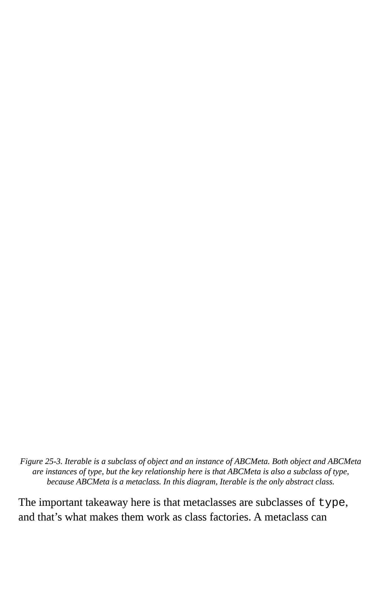

<span id="page-1296-0"></span>
# Chapter 25: Class Metaprogramming

## A NOTE FOR EARLY RELEASE READERS

With Early Release ebooks, you get books in their earliest form—the author's raw and unedited content as they write—so you can take advantage of these technologies long before the official release of these titles.

This will be the 25th chapter of the final book. Please note that the GitHub repo will be made active later on.

If you have comments about how we might improve the content and/or examples in this book, or if you notice missing material within this chapter, please reach out to the author at [fluentpython2e@ramalho.org.](mailto:fluentpython2e@ramalho.org)

*Everyone knows that debugging is twice as hard as writing a program in the first place. So if you're as clever as you can be when you write it, how will you ever debug it? [1](#page-1361-0)*

<span id="page-1296-1"></span>—Brian W. Kernighan and P. J. Plauger, The Elements of Programming Style

Class metaprogramming is the art of creating or customizing classes at runtime. Classes are first-class objects in Python, so a function can be used to create a new class at any time, without using the class keyword. Class decorators are also functions, but designed to inspect, change, and even replace the decorated class with another class. Finally, metaclasses are the most advanced tool for class metaprogramming: they let you create whole new categories of classes with special traits, such as the abstract base classes we've already seen.

Metaclasses are powerful, but hard to justify and even harder to get right. Class decorators solve many of the same problems and are easier to [understand. Furthermore, Python 3.6 implemented](https://www.python.org/dev/peps/pep-0487/) *PEP 487—Simpler customisation of class creation*, providing special methods supporting tasks that previously required metaclasses or class decorators. [2](#page-1361-1)

This chapter presents the class metaprogramming techniques in ascending order of complexity.

<span id="page-1297-0"></span>
## WARNING

This is an exciting topic, and it's easy to get carried away. So I must offer this advice:

For the sake of readability and maintainability, you should probably avoid the techniques described in this chapter in application code.

On the other hand, these are the tools of the trade if you want to write the next great Python framework.

<span id="page-1297-1"></span>
## What's new in this chapter

All the code in the *Class Metaprogramming* chapter of *Fluent Python, First Edition* still runs correctly. However, some of the previous examples no longer represent the simplest solutions, in light of new features added since Python 3.6.

I replaced those examples with different ones, highlighting Python's new metaprogramming features or adding further requirements to justify the use of the more advanced techniques. Some of the new examples leverage type hints to provide class builders similar to the @dataclass decorator and typing.NamedTuple.

["Metaclasses in the Real world"](#page-1348-0) is a new section with some high level considerations about the applicability of metaclasses.

## TIP

Some of the best refactorings are removing code made redundant by newer and simpler ways of solving the same problems. This applies to production code as well as books.

We'll get started by reviewing attributes and methods defined in the Python Data Model for all classes.

<span id="page-1298-0"></span>
## Classes as Objects

Like most program entities in Python, classes are also objects. Every class has a number of attributes defined in the Python Data Model, documented in ["4.13. Special Attributes"](http://bit.ly/1cPOodb) of the "Built-in Types" chapter in the *Library Reference*. Three of those attributes appeared several times in the book already: \_\_class\_\_, \_\_name\_\_, and \_\_mro\_\_. Other class standard attributes are:

*cls.\_\_bases\_\_*

The tuple of base classes of the class.

*cls.\_\_qualname\_\_*

The qualified name of a class or function, which is a dotted path from the global scope of the module to the class definition. This is relevant when the class is defined inside another class. For example, in a Django model class such as [Ox](https://docs.djangoproject.com/en/3.2/topics/db/models/#meta-options), there is an inner class called Meta. The \_\_qualname\_\_ of Meta is Ox.Meta, but its \_\_name\_\_ is just Meta[. The specification for this attribute is PEP-3155 — Qualified](http://www.python.org/dev/peps/pep-3155) name for classes and functions.

*cls.\_\_subclasses\_\_()*

This method returns a list of the immediate subclasses of the class. The implementation uses weak references to avoid circular references between the superclass and its subclasses—which hold a strong

reference to the superclasses in their \_\_bases\_\_ attribute. The method lists subclasses currently in memory.

```
cls.mro()
```

The interpreter calls this method when building a class to obtain the tuple of superclasses that is stored in the \_\_mro\_\_ attribute of the class. A metaclass can override this method to customize the method resolution order of the class under construction.

## TIP

None of the attributes mentioned in this section are listed by the dir(…) function.

Now, if a class is an object, what is the class of a class?

<span id="page-1299-0"></span>
## type: The Built-in Class Factory

We usually think of type as a function that returns the class of an object, because that's what type(my\_object) does: it returns my\_object.\_\_class\_\_.

However, type is a class that creates a new class when invoked with three arguments.

Consider this simple class:

```
class MyClass(MySuperClass, MyMixin):
 x = 42
 def x2(self):
 return self.x * 2
```

Using the type constructor, you can create MyClass at runtime with this code:

```
MyClass = type('MyClass', (MySuperClass, MyMixin),
 {'x': 42, 'x2': lambda self: self.x * 2})
```

That type call is functionally equivalent to the previous class MyClass… block statement.

When Python reads a class statement, it calls type to build the class object with these parameters:

## name

The identifier that appears after the class keyword; e.g.: MyClass.

## bases

The tuple of superclasses given in parenthesis after the class identifier, or (object,) if superclasses are not mentioned in the class statement.

## dict

A mapping of attribute names to values. Callables become methods; other values become class attributes.

## NOTE

The type constructor accepts optional keyword arguments. That's an advanced feature not covered in this book.

The type class is a *metaclass*: a class that builds classes. In other words, instances of the type class are classes. The standard library provides a few other metaclasses, but type is the default.

```
>>> type(7)
<class 'int'>
>>> type(int)
<class 'type'>
>>> type(OSError)
<class 'type'>
```

```
>>> class Whatever:
... pass
...
>>> type(Whatever)
<class 'type'>
```

We'll build custom metaclasses in ["Metaclasses 101".](#page-1325-0)

Next, we'll use the type built-in to make a function that builds classes.

<span id="page-1301-0"></span>
## A Class Factory Function

The standard library has a class factory function that appears several times in this book: collections.namedtuple. In [Chapter 5](010-chapter-5-data-class-builders.md#page-265-0) we also saw collections.NamedTuple and @dataclass. All of these class builders leverage techniques covered in this chapter.

We'll start with a super simple factory for classes of mutable objects—the simplest possible replacement for @dataclass.

Suppose I'm writing a pet shop application and I want to store data for dogs as simple records. But I don't want to write boilerplate like this:

```
class Dog:
 def __init__(self, name, weight, owner):
 self.name = name
 self.weight = weight
 self.owner = owner
```

Boring… each field name appears three times, and that boilerplate doesn't even buy us a nice repr:

```
>>> rex = Dog('Rex', 30, 'Bob')
>>> rex
<__main__.Dog object at 0x2865bac>
```

Taking a hint from collections.namedtuple, let's create a record\_factory that creates simple classes like Dog on the fly. [Example 25-1](#page-1302-0) shows how it should work.

<span id="page-1302-0"></span>
## Example 25-1. Testing record\_factory, a simple class factory

```
 >>> Dog = record_factory('Dog', 'name weight owner') 
 >>> rex = Dog('Rex', 30, 'Bob')
 >>> rex 
 Dog(name='Rex', weight=30, owner='Bob')
 >>> name, weight, _ = rex 
 >>> name, weight
 ('Rex', 30)
 >>> "{2}'s dog weighs {1}kg".format(*rex) 
 "Bob's dog weighs 30kg"
 >>> rex.weight = 32 
 >>> rex
 Dog(name='Rex', weight=32, owner='Bob')
 >>> Dog.__mro__ 
 (<class 'factories.Dog'>, <class 'object'>)
```

- Factory can be called like namedtuple: class name, followed by attribute names separated by spaces in a single strings.
- Nice repr.
- Instances are iterable, so they can be conveniently unpacked on assignment…
- …or when passing to functions like format.
- A record instance is mutable.
- The newly created class inherits from object—no relationship to our factory.

<span id="page-1302-2"></span>The code for record\_factory is in [Example 25-2](#page-1302-1). [3](#page-1361-2)

<span id="page-1302-1"></span>
## Example 25-2. record\_factory.py: a simple class factory

```
from typing import Union, Any
from collections.abc import Iterable, Iterator
FieldNames = Union[str, Iterable[str]] 
def record_factory(cls_name: str, field_names: FieldNames) ->
type[tuple]:
```

```
 slots = parse_identifiers(field_names) 
 def __init__(self, *args, **kwargs) -> None: 
 attrs = dict(zip(self.__slots__, args))
 attrs.update(kwargs)
 for name, value in attrs.items():
 setattr(self, name, value)
 def __iter__(self) -> Iterator[Any]: 
 for name in self.__slots__:
 yield getattr(self, name)
 def __repr__(self): 
 values = ', '.join(
 '{}={!r}'.format(*i) for i in zip(self.__slots__, self)
 )
 cls_name = self.__class__.__name__
 return f'{cls_name}({values})'
 cls_attrs = dict( 
 __slots__=slots,
 __init__=__init__,
 __iter__=__iter__,
 __repr__=__repr__,
 )
 return type(cls_name, (object,), cls_attrs) 
def parse_identifiers(names: FieldNames) -> tuple[str, ...]:
 if isinstance(names, str):
 names = names.replace(',', ' ').split() 
 if not all(s.isidentifier() for s in names):
 raise ValueError('names must all be valid identifiers')
 return tuple(names)
```

- User can provide field names as a single string or an iterable of strings.
- Accept arguments like the first two of collections.namedtuple; return a type—i.e. a class—that behaves like a tuple.
- Build a tuple of attribute names, this will be the \_\_slots\_\_ attribute of the new class.

| This function will become theinit method in the new class. It<br>accepts positional and/or keyword arguments. There's no point in<br>adding type hints toinit, because the actual types are Any.                                                                                                                                                                                                                                                                                                                                                                                                                                                                                                                                                                     |
|----------------------------------------------------------------------------------------------------------------------------------------------------------------------------------------------------------------------------------------------------------------------------------------------------------------------------------------------------------------------------------------------------------------------------------------------------------------------------------------------------------------------------------------------------------------------------------------------------------------------------------------------------------------------------------------------------------------------------------------------------------------------|
| Yield the field values in the order given byslots                                                                                                                                                                                                                                                                                                                                                                                                                                                                                                                                                                                                                                                                                                                    |
| Produce the nice repr, iterating overslots and self.                                                                                                                                                                                                                                                                                                                                                                                                                                                                                                                                                                                                                                                                                                                 |
| Assemble dictionary of class attributes.                                                                                                                                                                                                                                                                                                                                                                                                                                                                                                                                                                                                                                                                                                                             |
| Build and return the new class, calling the type constructor.                                                                                                                                                                                                                                                                                                                                                                                                                                                                                                                                                                                                                                                                                                        |
| Convert names separated by spaces or commas to list of str.                                                                                                                                                                                                                                                                                                                                                                                                                                                                                                                                                                                                                                                                                                          |
| In summary, the last line of record_factory in Example 25-2 builds a<br>class named by the value of cls_name, with object as its single<br>immediate base class and with a namespace loaded withslots,<br>init,iter, andrepr, of which the last three are<br>instance methods.<br>We could have named theslots class attribute anything else, but<br>then we'd have to implementsetattr to validate the names of<br>attributes being assigned, because for our record-like classes we want the<br>set of attributes to be always the same and in the same order. However,<br>recall that the main feature ofslots is saving memory when you are<br>dealing with millions of instances, and usingslots has some<br>drawbacks, discussed in "Saving Memory withslots". |

## WARNING

Instances of classes created by record\_factory are not serializable—that is, they can't be exported with the dump function from the pickle module. Solving this problem is beyond the scope of this example, which aims to show the type class in action in a simple use case. For the full solution, study the source code for [collections.namedtuple](https://github.com/python/cpython/blob/3.9/Lib/collections/__init__.py); search for the word "pickling."

Now let's see how to emulate more modern class builders like typing.NamedTuple, which takes a user-defined class written as a class statement, and automatically enhances it with more functionality.

<span id="page-1305-1"></span>
## Introducing \_\_init\_subclass\_\_

| Bothinit_subclass andset_name were proposed in                         |
|------------------------------------------------------------------------|
| PEP 487—Simpler customisation of class creation. We saw the            |
| set_name special method for descriptors for the first time in          |
| "LineItem Take #4: Automatic Storage Attribute Names". Now let's study |
| init_subclass                                                          |
| In Chapter 5, we saw that typing.NamedTuple and @dataclass let         |

programmers use the class statement to specify attributes for a new class, which is then enhanced by the class builder with the automatic addition of essential methods like \_\_init\_\_, \_\_repr\_\_, \_\_eq\_\_ etc.

Both of these class builders read type hints in the user's class statement to enhance the class. Those type hints also allow static type checkers to validate code that sets or gets those attributes. However, NamedTuple and @dataclass do not take advantage of the type hints for attribute validation at runtime. The Checked class in next example does.

## NOTE

It is not possible to support every conceivable static type hint for runtime type checking, which is probably why typing.NamedTuple and @dataclass don't even try it. However, some types that are also concrete classes can be used with Checked. This includes simple types often used for field contents, such as str, int, float and bool, as well as lists of those types.

[Example 25-3](#page-1305-0) shows how to use Checked to build a Movie class.

<span id="page-1305-0"></span>*Example 25-3. initsub/checkedlib.py: doctest for creating a Movie subclass of Checked.*

```
 >>> class Movie(Checked): 
 ... title: str 
 ... year: int
 ... box_office: float
 ...
 >>> movie = Movie(title='The Godfather', year=1972,
box_office=137) 
 >>> movie.title
 'The Godfather'
 >>> movie 
 Movie(title='The Godfather', year=1972, box_office=137.0)
```

- Movie inherits from Checked—the subject of this section.
- Each attribute is annotated with a constructor. Here I used built-in types.
- Movie instances must be created using keyword arguments.
- In return, you get a nice \_\_repr\_\_.

The constructors used as the attribute type hints may be any callable that takes zero or one argument and returns a value suitable for the intended field type, or rejects the argument by raising TypeError or ValueError.

Using built-in types for the annotations in [Example 25-3](#page-1305-0) means the values must be acceptable by the constructor of the type. For int, this means any x such that int(x) returns an int. For str, anything goes at runtime, because str(x) works with any x in Python. [4](#page-1362-0)

<span id="page-1306-1"></span><span id="page-1306-0"></span>When called with no arguments, the constructor should return a default value of its type. [5](#page-1362-1)

This is standard behavior for Python's built-in constructors:

```
>>> int(), float(), bool(), str(), list(), dict(), set()
(0, 0.0, False, '', [], {}, set())
```

In a Checked subclass like Movie, missing parameters create instances with default values returned by the field constructors. For example:

```
 >>> Movie(title='Life of Brian')
 Movie(title='Life of Brian', year=0, box_office=0.0)
```

The constructors are used for validation during instantiation and when an attribute is set directly on an instance:

```
 >>> blockbuster = Movie(title='Avatar', year=2009,
box_office='billions')
 Traceback (most recent call last):
 ...
 TypeError: 'billions' is not compatible with box_office:float
 >>> movie.year = 'MCMLXXII'
 Traceback (most recent call last):
 ...
 TypeError: 'MCMLXXII' is not compatible with year:int
```

## CHECKED SUBCLASSES AND STATIC TYPE CHECKING

In a *.py* source file with a movie instance of Movie as defined in [Example 25-3,](#page-1305-0) Mypy flags this assignment as a type error:

```
movie.year = 'MCMLXXII'
```

However, Mypy can't detect type errors in this constructor call:

```
blockbuster = Movie(title='Avatar', year='MMIX')
```

That's because Movie inherits Checked.\_\_init\_\_, and the signature of that method must accept any keyword arguments, to support arbitrary user-defined classes.

On the other hand, if you declare a Checked subclass field with the type hint list[float], Mypy can flag assignments of lists with incompatible contents, but Checked will ignore the type parameter and treat that the same as list.

Now let's look at the implementation of checkedlib.py. The first class is the Field descriptor:

<span id="page-1307-0"></span>*Example 25-4. initsub/checkedlib.py: the Field descriptor class.*

```
from collections.abc import Callable 
from typing import Any, NoReturn, get_type_hints
class Field:
 def __init__(self, name: str, constructor: Callable) -> None: 
 if not callable(constructor) or constructor is type(None): 
 raise TypeError(f'{name!r} type hint must be callable')
 self.name = name
 self.constructor = constructor
 def __set__(self, instance: Any, value: Any) -> None:
 if value is ...: 
 value = self.constructor()
 else:
 try:
 value = self.constructor(value) 
 except (TypeError, ValueError) as e: 
 type_name = self.constructor.__name__
 msg = f'{value!r} is not compatible with
{self.name}:{type_name}'
 raise TypeError(msg) from e
 instance.__dict__[self.name] = value
```

- Recall that since Python 3.9, the Callable type for annotations is the ABC in collections.abc, and not the deprecated typing.Callable.
- This is a minimal Callable type hint; the constructor parameter type and return type are Any, so we can omit them.
- <span id="page-1308-0"></span>For runtime checking, we use the callable built-in. The test against type(None) is necessary because Python reads None in a type as NoneType, the class of None (therefore callable) but a useless constructor that only returns None. [6](#page-1362-2)
- If Checked.\_\_init\_\_ sets the value as ... (the Ellipsis built-in object), we call the constructor with no arguments.

- Otherwise, call the constructor with the given value.
- If constructor raises either of these exceptions, we raise TypeError with a helpful message including the names of the field and constructor; e.g. 'MMIX' is not compatible with year:int.
- If no exceptions were raised, the value is stored in the instance.\_\_dict\_\_.

In \_\_set\_\_ we need to catch TypeError and ValueError because built-in constructors may raise either of them, depending on the argument. For example: float(None) raises TypeError, but float('A') raises ValueError. On the other hand, float('8') raises no error and returns 8.0. I hereby declare that this is feature and not a bug of this toy example.

## TIP

In ["LineItem Take #4: Automatic Storage Attribute Names"](031-chapter-24-attribute-descriptors.md#page-1269-0) we saw the handy \_\_set\_name\_\_ special method for descriptors. We don't need it in the Field class because the descriptors are not instantiated in client source code; the user declares types that are constructors, as we saw in the Movie class [\(Example 25-3](#page-1305-0)). Instead, the Field descriptor instances are created at runtime by the Checked.\_\_init\_subclass\_\_ method which we'll see in [Example 25-5.](#page-1309-0)

Now let's focus on the Checked class. I split it in two listing: Example 25- [5 shows the top of the class, which includes the most important methods in](#page-1309-0) this example. The remaining methods are in [Example 25-6.](#page-1312-0)

<span id="page-1309-0"></span>*Example 25-5. initsub/checkedlib.py: the most important methods of the Checked class.*

```
class Checked:
 @classmethod
 def _fields(cls) -> dict[str, type]:
```

```
 return get_type_hints(cls)
 def __init_subclass__(subclass) -> None: 
 super().__init_subclass__() 
 for name, constructor in subclass._fields().items(): 
 setattr(subclass, name, Field(name, constructor)) 
 def __init__(self, **kwargs: Any) -> None:
 for name in self._fields(): 
 value = kwargs.pop(name, ...) 
 setattr(self, name, value) 
 if kwargs: 
 self.__flag_unknown_attrs(*kwargs)
```

- I wrote this class method to hide the use of typing.get\_type\_hints from the rest of the class. As explained in ["Problems with Annotations at Runtime"](022-chapter-15-more-about-type-hints.md#page-760-0), that function doesn't always work—but it does handle the simple types the Checked and Field classes are designed to handle.
- \_\_init\_subclass\_\_ is called when a subclass of the current subclass is defined. It gets that new subclass as its first argument which is why I named the argument subclass instead of the usual cls. For more on this, see "[\\_\\_init\\_subclass\\_\\_](#page-1311-0) is not a typical class method".
- super().\_\_init\_subclass\_\_() should be invoked.
- Iterate over each field name and constructor…
- …creating an attribute on subclass with that name bound to a Field descriptor parameterized with name and constructor.
- For each name in the class fields…
- Get the corresponding value from kwargs and remove it from kwargs. Using ...—the Ellipsis object—as default allows us to

<span id="page-1311-1"></span>distinguish between arguments given the value None from arguments that were not given. [7](#page-1362-3)

- This setattr call triggers Checked.\_\_setattr\_\_, shown in [Example 25-6](#page-1312-0).
- If there are remaining items in kwargs, their names do not match any of the declared fields, and \_\_init\_\_ will fail.
- The error is reported by \_\_flag\_unknown\_attrs, listed in [Example 25-6](#page-1312-0). It takes a \*names argument with the unknown attribute names. I used a single asterisk in \*kwargs to pass its keys as a sequence of arguments.

<span id="page-1311-0"></span>
## \_\_INIT\_SUBCLASS\_\_ IS NOT A TYPICAL CLASS METHOD

The @classmethod decorator is never used with \_\_init\_subclass\_\_, but that doesn't mean much, because the \_\_new\_\_ special method behaves as a class method even without @classmethod. The first argument that Python passes to \_\_init\_subclass\_\_ is a class. However, it is never the class where \_\_init\_subclass\_\_ is implemented: it is a newly defined subclass of that class. That's unlike \_\_new\_\_ and every other class method that I know about. Therefore, I think \_\_init\_subclass\_\_ is not a class method in the usual sense, and it is misleading to name the first argument cls. The [\\_\\_init\\_suclass\\_\\_](https://docs.python.org/3/reference/datamodel.html#object.__init_subclass__) documentation names the argument cls but explains: "…called whenever the containing class is subclassed. cls is then the new subclass."

Now let's see the remaining methods of the Checked class, continuing from [Example 25-5](#page-1309-0). Note that I prepended \_ to the \_fields and \_asdict method names for the same reason the

collections.namedtuple API does: to reduce the chance of name clashes with user-defined field names.

<span id="page-1312-0"></span>*Example 25-6. initsub/checkedlib.py: remaining methods of the Checked class.*

```
 def __setattr__(self, name: str, value: Any) -> None: 
 if name in self._fields(): 
 cls = self.__class__
 descriptor = getattr(cls, name)
 descriptor.__set__(self, value) 
 else: 
 self.__flag_unknown_attrs(name)
 def __flag_unknown_attrs(self, *names: str) -> NoReturn: 
 plural = 's' if len(names) > 1 else ''
 extra = ', '.join(f'{name!r}' for name in names)
 cls_name = repr(self.__class__.__name__)
 raise AttributeError(f'{cls_name} object has no
attribute{plural} {extra}')
 def _asdict(self) -> dict[str, Any]: 
 return {
 name: getattr(self, name)
 for name, attr in self.__class__.__dict__.items()
 if isinstance(attr, Field)
 }
 def __repr__(self) -> str: 
 kwargs = ', '.join(
 f'{key}={value!r}' for key, value in
self._asdict().items()
 )
 return f'{self.__class__.__name__}({kwargs})'
```

- Intercept all attempts to set an instance attribute. This is needed to prevent setting an unknown attribute.
- If the attribute name is known, fetch the corresponding descriptor.
- Usually we don't need to call the descriptor \_\_set\_\_ explicitly; it was necessary in this case because \_\_setattr\_\_ intercepts all attempts to

<span id="page-1313-1"></span>

|    | set an attribute on the instance, including in the presence of an<br>8<br>overriding descriptor such as Field.                                                                                                                                                                                                                                                                                                                                                                                   |
|----|--------------------------------------------------------------------------------------------------------------------------------------------------------------------------------------------------------------------------------------------------------------------------------------------------------------------------------------------------------------------------------------------------------------------------------------------------------------------------------------------------|
|    | Otherwise, the attribute name is unknown, and an exception will be<br>raised byflag_unknown_attrs.                                                                                                                                                                                                                                                                                                                                                                                               |
|    | Build a helpful error message listing all unexpected arguments and raise<br>AttributeError. This is a rare example of the NoReturn special<br>type, covered in "NoReturn".                                                                                                                                                                                                                                                                                                                       |
|    | Create a dict from the attributes of a Movie object. I'd call this<br>method _as_dict, but I followed the convention started by the<br>_asdict method in collections.namedtuple.                                                                                                                                                                                                                                                                                                                 |
|    | Implementing a nicerepr is the main reason for having<br>_asdict in this example.                                                                                                                                                                                                                                                                                                                                                                                                                |
| 6. | The Checked example illustrates how to handle overriding descriptors<br>when implementingsetattr to block arbitrary attribute setting<br>after instantiation. It is debatable whether implementingsetattr is<br>worthwhile in this example. Without it, setting movie.director =<br>'Greta Gerwig' would succeed, but the director attribute would<br>not be checked in any away, and would not appear in therepr nor be<br>included in the dict returned by _asdict—both defined in Example 25- |
|    | In record_factory.py (Example 25-2) I solved this issue using the<br>slots class attribute. However, this simpler solution is not viable in<br>this case, as explained next.                                                                                                                                                                                                                                                                                                                     |
|    | Whyinit_subclass cannot configureslots                                                                                                                                                                                                                                                                                                                                                                                                                                                           |
|    | Theslots attribute is only effective if it is one of the entries in the                                                                                                                                                                                                                                                                                                                                                                                                                          |

<span id="page-1313-0"></span>class namespace passed to type.\_\_new\_\_. Adding \_\_slots\_\_ to an existing class has no effect. Python invokes \_\_init\_subclass\_\_ only after the class is built—by then it's too late to configure \_\_slots\_\_. A class decorator can't configure \_\_slots\_\_ either, because it is applied even later than \_\_init\_subclass\_\_. We'll explore these timing issues in ["What Happens When: Import Time Versus Runtime".](#page-1318-0)

To configure \_\_slots\_\_ at runtime, your own code must build the class namespace passed as the last argument of type.\_\_new\_\_. To do that, you can write a class factory function, like \_record\_factory.py\_, or you take the nuclear option and implement a metaclass. We will see how to dynamically configure \_\_slots\_\_ in ["Metaclasses 101"](#page-1325-0).

Before [PEP 487](https://www.python.org/dev/peps/pep-0487/) simplified the customisation of class creation with \_\_init\_subclass\_\_ in Python 3.7, similar functionality had to be implemented using a class decorator. That's the focus of the next section.

<span id="page-1314-2"></span>
## Enhancing Classes with a Class Decorator

A class decorator is a callable that behaves similarly to a function decorator: it gets the decorated class as an argument, and must return a class which will replace the decorated class. Class decorators often return the decorated class itself, after injecting more methods in it via attribute assignment.

<span id="page-1314-1"></span>Probably the most common reason to chose a class decorator over the simpler \_\_init\_subclass\_\_ is to avoid interfering with other class features such as inheritance and metaclasses. [9](#page-1362-5)

In this section, we'll study *checkeddeco.py*, which provides the same service as *checkedlib.py*, but using a class decorator. As usual, we'll start by looking at an usage example, extracted from the doctests in *checkeddeco.py*.

<span id="page-1314-0"></span>*Example 25-7. checkeddeco.py: creating a Movie class decorated with @checked.*

```
 >>> @checked
 ... class Movie:
 ... title: str
 ... year: int
```

```
 ... box_office: float
 ...
 >>> movie = Movie(title='The Godfather', year=1972,
box_office=137)
 >>> movie.title
 'The Godfather'
 >>> movie
 Movie(title='The Godfather', year=1972, box_office=137.0)
```

The only difference between [Example 25-7](#page-1314-0) and [Example 25-3](#page-1305-0) is the way the Movie class is declared: it is decorated with @checked instead of subclassing Checked. Otherwise, the external behavior is the same, including the type validation and default value assignments shown after [Example 25-3](#page-1305-0) in "Introducing [\\_\\_init\\_subclass\\_\\_](#page-1305-1)".

Now let's look at the implementation of *checkeddeco.py*. The imports and Field class are the same as in *checkedlib.py*, listed in [Example 25-4.](#page-1307-0) There is no other class, only functions in *checkeddeco.py*.

The logic previously implemented in \_\_init\_subclass\_\_ is now part of the checked function—the class decorator listed in [Example 25-8.](#page-1315-0)

<span id="page-1315-0"></span>*Example 25-8. checkeddeco.py: the class decorator.*

```
def checked(cls: type) -> type: 
 for name, constructor in _fields(cls).items(): 
 setattr(cls, name, Field(name, constructor)) 
 cls._fields = classmethod(_fields) # type: ignore 
 instance_methods = ( 
 __init__,
 __repr__,
 __setattr__,
 _asdict,
 __flag_unknown_attrs,
 )
 for method in instance_methods: 
 setattr(cls, method.__name__, method)
 return cls
```

Recall that classes are instances of type. These type hints strongly suggest this is a class decorator: it takes a class, and returns a class.

- \_fields is a module-level function defined later in the module (in [Example 25-9](#page-1317-0)).
- Replacing each attribute returned by \_fields with a Field descriptor instance is what \_\_init\_subclass\_\_ did in Example 25- [5. Here there is more work to do…](#page-1309-0)
- Build a class method from \_fields, and add it to the decorated class. The type: ignore comment is needed because Mypy complains that type has no \_fields attribute.
- Module-level functions that will become instance methods of the decorated class.
- Add each of the instance\_methods to cls.
- Return the decorated cls, fulfilling the essential contract of a class decorator.

Every top-level function in *checkeddeco.py* is prefixed with an underscore, except the checked decorator. This naming convention makes sense for a couple of reasons:

- 1. checked is part of the public interface of the *checkeddeco.py* module, but the other functions are not.
- 2. The functions in [Example 25-9](#page-1317-0) will be injected in the decorated class, and the leading \_ reduces the chance of naming conflicts with user-defined attributes and methods of the decorated class.

The rest of *checkeddeco.py* is listed in [Example 25-9.](#page-1317-0) Those module-level functions have the same code as the corresponding methods of the Checked class of *checkedlib.py*. They were explained in [Example 25-5](#page-1309-0) and [Example 25-6.](#page-1312-0)

Note that the \_fields function does double duty in *checkeddeco.py*. It is used as a regular function in the first line of the checked decorator, and it will also be injected as a class method of the decorated class.

<span id="page-1317-0"></span>*Example 25-9. checkeddeco.py: the methods to be injected in the decorated class.*

```
def _fields(cls: type) -> dict[str, type]:
 return get_type_hints(cls)
def __init__(self: Any, **kwargs: Any) -> None:
 for name in self._fields():
 value = kwargs.pop(name, ...)
 setattr(self, name, value)
 if kwargs:
 self.__flag_unknown_attrs(*kwargs)
def __setattr__(self: Any, name: str, value: Any) -> None:
 if name in self._fields():
 cls = self.__class__
 descriptor = getattr(cls, name)
 descriptor.__set__(self, value)
 else:
 self.__flag_unknown_attrs(name)
def __flag_unknown_attrs(self: Any, *names: str) -> NoReturn:
 plural = 's' if len(names) > 1 else ''
 extra = ', '.join(f'{name!r}' for name in names)
 cls_name = repr(self.__class__.__name__)
 raise AttributeError(f'{cls_name} has no attribute{plural}
{extra}')
def _asdict(self: Any) -> dict[str, Any]:
 return {
 name: getattr(self, name)
 for name, attr in self.__class__.__dict__.items()
 if isinstance(attr, Field)
 }
def __repr__(self: Any) -> str:
 kwargs = ', '.join(
 f'{key}={value!r}' for key, value in self._asdict().items()
 )
 return f'{self.__class__.__name__}({kwargs})'
```

The *checkeddeco.py* module implements a simple but usable class decorator. Python's @dataclass does a lot more. It supports many configuration options, adds more methods to the decorated class, handles or warns about conflicts with user-defined methods in the decorated class, and even traverses the \_\_mro\_\_ to collect user-defined attributes declared in the superclasses of the decorated class. The [source code](https://github.com/python/cpython/blob/3.9/Lib/dataclasses.py) of the dataclasses package in Python 3.9 is more than 1200 lines long.

For metaprogramming classes, we must be aware of when the Python interpreter evaluates each block of code during the construction of a class. This is covered next.

<span id="page-1318-0"></span>
## What Happens When: Import Time Versus Runtime

Python programmers talk about "import time" versus "runtime" but the terms are not strictly defined and there is a gray area between them.

At import time, the interpreter:

- 1. Parses the source code of a *.py* module in one pass from top to bottom. This is when SyntaxError may occur.
- 2. Compiles the bytecode to be executed.
- <span id="page-1318-1"></span>3. Executes the top-level code of the compiled module.

If there is an up-to-date *.pyc* file available in the local \_\_pycache\_\_, parsing and compiling are skipped because the bytecode is ready to run.

Although parsing and compiling are definitely "import time" activities, other things may happen at that time, because almost every statement in Python is executable in the sense that they potentially run user code and may change the state of the user program.

In particular, the import statement is not merely a declaration but it actually runs all the top-level code of a module when it is imported for the [10](#page-1362-6)

first time in the process—further imports of the same module will use a cache, and then the only effect will be binding the imported objects to names in the client module. That top-level code may do anything, including actions typical of "runtime", such as writing to a log or connecting to a database. That's why the border between "import time" and "runtime" is fuzzy: the import statement can trigger all sorts of "runtime" behavior. [11](#page-1362-7)

<span id="page-1319-2"></span>This is all rather abstract and subtle, so let's do some experiments to see what happens when.

<span id="page-1319-1"></span>
## Evaluation Time Experiments

Consider an *evaldemo.py* script which uses a class decorator, a descriptor, and a class builder based on \_\_init\_subclass\_\_, all defined in a *builderlib.py* module. The modules have several print calls to show what happens under the covers. Otherwise, they don't perform anything useful. The goal of these experiments is to observe the order in which these print calls happen.

## WARNING

Applying a class decorator and a class builder with \_\_init\_subclass\_\_ together in single class is likely a sign of overengineering or desperation. This unusual combination is useful in these experiments to show the timing of the changes that a class decorator and \_\_init\_subclass\_\_ can apply to a class.

Let's start by checking out *builderlib.py*, split in two parts: [Example 25-10](#page-1319-0) and [Example 25-11.](#page-1320-0)

<span id="page-1319-0"></span>*Example 25-10. builderlib.py: top of the module*

```
print('@ builderlib module start')
class Builder: 
 print('@ Builder body')
 def __init_subclass__(cls): 
 print(f'@ Builder.__init_subclass__({cls!r})')
```

```
 def inner_0(self): 
 print(f'@ SuperA.__init_subclass__:inner_0({self!r})')
 cls.method_a = inner_0
 def __init__(self):
 super().__init__()
 print(f'@ Builder.__init__({self!r})')
def deco(cls): 
 print(f'@ deco({cls!r})')
 def inner_1(self): 
 print(f'@ deco:inner_1({self!r})')
 cls.method_b = inner_1
 return cls
```

- This is a class builder to implement…
- \_\_init\_subclass\_\_.
- Define a function to be added to the subclass in the assignment below.
- A class decorator.
- Function to be added to the decorated class.
- Return the class received as argument.

Continuing with *builderlib.py*…

<span id="page-1320-0"></span>
## Example 25-11. builderlib.py: bottom of the module

```
class Descriptor: 
 print('@ Descriptor body')
 def __init__(self): 
 print(f'@ Descriptor.__init__({self!r})')
 def __set_name__(self, owner, name): 
 args = (self, owner, name)
```

```
 print(f'@ Descriptor.__set_name__{args!r}')
 def __set__(self, instance, value): 
 args = (self, instance, value)
 print(f'@ Descriptor.__set__{args!r}')
 def __repr__(self):
 return '<Descriptor instance>'
print('@ builderlib module end')
```

- A descriptor class to demonstrate when…
- …a descriptor instance is created, and when…
- …\_\_set\_name\_\_ will be invoked during the owner class construction.
- Like the other methods, this \_\_set\_\_ doesn't do anything except display its arguments.

If you import *builderlib.py* in the Python console, this is what you get:

```
>>> import builderlib
@ builderlib module start
@ Builder body
@ Descriptor body
@ builderlib module end
```

Note that the lines printed by *builderlib.py* are prefixed with @.

Now let's turn to *evaldemo.py*, which will trigger special methods in *builderlib*.

<span id="page-1321-0"></span>*Example 25-12. evaldemo.py: script to experiment with builderlib.py.* #!/usr/bin/env python3

```
from builderlib import Builder, deco, Descriptor
print('# evaldemo module start')
```

```
@deco 
class Klass(Builder): 
 print('# Klass body')
 attr = Descriptor() 
 def __init__(self):
 super().__init__()
 print(f'# Klass.__init__({self!r})')
 def __repr__(self):
 return '<Klass instance>'
def main(): 
 obj = Klass()
 obj.method_a()
 obj.method_b()
 obj.attr = 999
if __name__ == '__main__':
 main()
print('# evaldemo module end')
```

- Apply decorator.
- Subclass Builder to trigger its \_\_init\_subclass\_\_.
- Instantiate descriptor.
- This will only be called if the module is run as the main program.

The print calls in *evaldemo.py* show a # prefix. If you open the console again and import *evaldemo.py*, this is the output:

<span id="page-1322-0"></span>
## Example 25-13. Console experiment with evaldemo.py.

```
>>> import evaldemo
@ builderlib module start 
@ Builder body
@ Descriptor body
@ builderlib module end
# evaldemo module start
```

```
# Klass body 
@ Descriptor.__init__(<Descriptor instance>) 
@ Descriptor.__set_name__(<Descriptor instance>,
 <class 'evaldemo.Klass'>, 'attr') 
@ Builder.__init_subclass__(<class 'evaldemo.Klass'>) 
@ deco(<class 'evaldemo.Klass'>) 
# evaldemo module end
```

- The top 4 lines are the result of from builderlib import… . They will not appear if you didn't close the console after the previous experiment, because *builderlib.py* is already loaded.
- This signals that Python started reading the body of Klass. At this point, the class object does not exist yet.
- The descriptor instance is created and bound to attr in the namespace that Python will pass to the default class object constructor: type.\_\_new\_\_.
- At this point, Python's built-in type.\_\_new\_\_ has created the Klass object and calls \_\_set\_name\_\_ on each descriptor instance of descriptor classes that provide that method, passing Klass as the owner argument.
- type.\_\_new\_\_ then calls \_\_init\_subclass\_\_ on the superclass of Klass, passing Klass as the single argument.
- When type.\_\_new\_\_ returns the class object, Python applies the decorator. In this example, the class returned by deco is bound to Klass in the module namespace.

The implementation of type.\_\_new\_\_ is written in C. The behavior I just described is documented in the *[Creating the class object](https://docs.python.org/3/reference/datamodel.html#creating-the-class-object)* section of Python's *[Data Model](https://docs.python.org/3/reference/datamodel.html)* reference.

Note that the main() function of *evaldemo.py* [\(Example 25-12](#page-1321-0)) was not executed in the console session [\(Example 25-13](#page-1322-0)), therefore no instance of Klass was created. All the action we saw was triggered by "import time" operations: importing builderlib and defining Klass.

If you run *evaldemo.py* as a script, you will see the same output as [Example 25-13](#page-1322-0) with extra lines right before the last. The extra lines are the result of running main():

## Example 25-14. Running evaldemo.py as a program.

```
$ ./evaldemo.py
[... 9 lines omitted ...]
@ deco(<class '__main__.Klass'>) 
@ Builder.__init__(<Klass instance>) 
# Klass.__init__(<Klass instance>)
@ SuperA.__init_subclass__:inner_0(<Klass instance>) 
@ deco:inner_1(<Klass instance>) 
@ Descriptor.__set__(<Descriptor instance>, <Klass instance>, 999) 
# evaldemo module end
```

- The top 10 lines—including this one—are the same shown in [Example 25-13](#page-1322-0).
- Triggered by super().\_\_init\_\_() in Klass.\_\_init\_\_.
- Triggered by obj.method\_a() in main; method\_a was injected by SuperA.\_\_init\_subclass\_\_.
- Triggered by obj.method\_b() in main; method\_b was injected by deco.
- Triggered by obj.attr = 999 in main.

A base class with \_\_init\_subclass\_\_ and a class decorator are powerful tools, but they are limited to working with a class already built by type.\_\_new\_\_ under the covers. In the rare occasions when you need to adjust the arguments passed to type.\_\_new\_\_, you need a metaclass. That's the final destination of this chapter—and this book.

<span id="page-1325-0"></span>
## Metaclasses 101

*[Metaclasses] are deeper magic than 99% of users should ever worry about. If you wonder whether you need them, you don't (the people who actually need them know with certainty that they need them, and don't need an explanation about why). [12](#page-1362-8)*

> <span id="page-1325-1"></span>—Tim Peters, Inventor of the timsort algorithm and prolific Python contributor

A metaclass is a class factory. In contrast with record\_factory from [Example 25-2](#page-1302-1), a metaclass is written as a class. In other words, a metaclass is class whose instances are classes. [Figure 25-1](#page-1326-0) depicts a metaclass using the Mills & Gizmos Notation: a mill producing another mill.

<span id="page-1326-0"></span>*Figure 25-1. A metaclass is a class that builds classes*

Consider the Python object model: classes are objects, therefore each class must be an instance of some other class. By default, Python classes are instances of type. In other words, type is the metaclass for most built-in and user-defined classes:

```
>>> str.__class__
<class 'type'>
>>> from bulkfood_v5 import LineItem
>>> LineItem.__class__
<class 'type'>
>>> type.__class__
<class 'type'>
```

To avoid infinite regress, the class of type is type, as the last line shows.

<span id="page-1327-0"></span>Note that I am not saying that str or LineItem are subclasses of type. What I am saying is that str and LineItem are instances of type. They all are subclasses of object. [Figure 25-2](#page-1327-0) may help you confront this strange reality.

*Figure 25-2. Both diagrams are true. The left one emphasizes that str, type, and LineItem are subclasses of object. The right one makes it clear that str, object, and LineItem are instances type, because they are all classes.*

## NOTE

The classes object and type have a unique relationship: object is an instance of type, and type is a subclass of object. This relationship is "magic": it cannot be expressed in Python because either class would have to exist before the other could be defined. The fact that type is an instance of itself is also magical.

The next snippet shows that the class of collections.Iterable is abc.ABCMeta. Note that Iterable is an abstract class, but ABCMeta is a concrete class—after all, Iterable is an instance of ABCMeta:

```
>>> from collections.abc import Iterable
>>> Iterable.__class__
<class 'abc.ABCMeta'>
>>> import abc
>>> from abc import ABCMeta
>>> ABCMeta.__class__
<class 'type'>
```

Ultimately, the class of ABCMeta is also type. Every class is an instance of type, directly or indirectly, but only metaclasses are also subclasses of type. That's the most important relationship to understand metaclasses: a metaclass, such as ABCMeta, inherits from type the power to construct classes. [Figure 25-3](#page-1329-0) illustrates this crucial relationship.

<span id="page-1329-0"></span>

customize its instances by implementing special methods, as the next sections demonstrate.

<span id="page-1330-0"></span>
## How a Metaclass Customizes a Class

To use a metaclass, it's critical to understand how \_\_new\_\_ works on any class. This was discussed in ["Flexible Object Creation with \\_\\_new\\_\\_"](030-chapter-23-dynamic-attributes-and-properties.md#page-1213-0).

The same mechanics happen at a "meta" level when a metaclass is about to create a new instance, which is a class. Consider this declaration:

```
class Klass(SuperKlass, metaclass=MetaKlass):
 x = 42
 def __init__(self, y):
 self.y = y
```

To process that class statement Python calls MetaKlass.\_\_new\_\_ with these arguments:

```
meta_cls
```

the metaclass itself (MetaKlass), because \_\_new\_\_ works as class method;

```
cls_name
```

the string Klass;

## bases

the single-element tuple (SuperKlass,)—with more elements in the case of multiple inheritance.

```
cls_dict
```

```
a mapping like {x: 42, `__init__: <function init at
0x1009c4040>}
```

| When you implement MetaKlassnew, you can inspect and<br>change those arguments before passing them to super()new,<br>which will eventually call typenew to create the new class object.                                                                                                                                                                                                                                                                                             |
|-------------------------------------------------------------------------------------------------------------------------------------------------------------------------------------------------------------------------------------------------------------------------------------------------------------------------------------------------------------------------------------------------------------------------------------------------------------------------------------|
| After super()new returns, you can also apply further processing<br>to the newly created class before returning it to Python. Python then calls<br>SuperKlassinit_subclass, passing the class you created,<br>and then applies a class decorator to it, if one is present. Finally, Python<br>binds the class object to its name in the surrounding namespace—usually<br>the global namespace of a module, if the class statement was a top-level<br>statement.                      |
| The most common processing made in a metaclassnew is to add or<br>replace items in the cls_dict—the mapping that represents the<br>namespace of the class under construction. For instance, before calling<br>super()new, you can inject methods in the class under<br>construction by adding functions to cls_dict. However, note that adding<br>methods can also be done after the class is built, which is why we were able<br>to do it usinginit_subclass or a class decorator. |
| One attribute that you must add to the cls_dict before typenew<br>runs isslots, as discussed in "Whyinit_subclass<br>cannot configureslots". Thenew method of a metaclass is<br>the ideal place to configureslots The next section shows how to<br>do that.                                                                                                                                                                                                                         |

<span id="page-1331-1"></span>
## A Nice Metaclass Example

The MetaBunch metaclass presented here is a variation of the last example in chapter 4 of *[Python in a Nutshell, 3rd Edition](https://learning.oreilly.com/library/view/python-in-a/9781491913833)*, by Alex Martelli, Anna Ravenscroft, and Steve Holden, written to run on Python 2.7 and 3.5. Assuming Python 3.6 or later, I was able to further simplify the code. [13](#page-1362-9)

<span id="page-1331-0"></span>First, let's see what the Bunch base class provides:

```
 >>> class Point(Bunch):
 ... x = 0.0
```

```
 ... y = 0.0
 ... color = 'gray'
 ...
 >>> Point(x=1.2, y=3, color='green')
 Point(x=1.2, y=3, color='green')
 >>> p = Point()
 >>> p.x, p.y, p.color
 (0.0, 0.0, 'gray')
 >>> p
 Point()
```

Instead of the type hints we use to name the fields in Checked subclasses, Bunch subclasses assign values to class attributes, which then become the default values of the instance attributes. The generated \_\_repr\_\_ omits the arguments for attributes that are equal to the defaults.

MetaBunch—the metaclass of Bunch—generates \_\_slots\_\_ for the new class from the class attributes declared in the user's class. This blocks the instantiation and later assignment of undeclared attributes:

```
 >>> Point(x=1, y=2, z=3)
 Traceback (most recent call last):
 ...
 AttributeError: 'Point' object has no attribute 'z'
 >>> p = Point(x=21)
 >>> p.y = 42
 >>> p
 Point(x=21, y=42)
 >>> p.flavor = 'banana'
 Traceback (most recent call last):
 ...
 AttributeError: 'Point' object has no attribute 'flavor'
```

Now let's dive into the elegant code of Metabunch:

*Example 25-15. metabunch/from3.6/bunch.py: MetaBunch metaclass and Bunch class.*

```
class MetaBunch(type): 
 def __new__(meta_cls, cls_name, bases, cls_dict): 
 defaults = {} 
 def __init__(self, **kwargs):
```

```
 for name, default in defaults.items(): 
 setattr(self, name, kwargs.pop(name, default))
 if kwargs: 
 setattr(self, *kwargs.popitem())
 def __repr__(self): 
 rep = ', '.join(f'{name}={value!r}'
 for name, default in defaults.items()
 if (value := getattr(self, name)) !=
default)
 return f'{cls_name}({rep})'
 new_dict = dict(__slots__=[], __init__=__init__,
__repr__=__repr__) 
 for name, value in cls_dict.items(): 
 if name.startswith('__') and name.endswith('__'): 
 if name in new_dict:
 raise AttributeError(f"Can't set {name!r} in
{cls_name!r}")
 new_dict[name] = value
 else: 
 new_dict['__slots__'].append(name)
 defaults[name] = value
 return super().__new__(meta_cls, cls_name, bases, new_dict) 
class Bunch(metaclass=MetaBunch): 
 pass
```

- To create a new metaclass, inherit from type.
- \_\_new\_\_ works as a class method, but the class is a metaclass, so I like to name the first argument meta\_cls (mcs is a common alternative). The remaining three arguments are the same as the three-argument signature for calling type() directly to create a class.
- defaults will hold a mapping of attribute names and their default values.
- This will be injected into the new class.

| Read the defaults and set the corresponding instance attribute with a<br>value popped from kwargs or a default.                                                                                                                                                                                             |
|-------------------------------------------------------------------------------------------------------------------------------------------------------------------------------------------------------------------------------------------------------------------------------------------------------------|
| If there is still any item in kwargs, it is unexpected. We believe in<br>failing fast as best practice, so we don't want to silently ignore extra<br>items. A quick and effective solution is to pop one item from kwargs<br>and try to set it on the instance, triggering an AttributeError on<br>purpose. |
| repr returns a string that looks like a constructor call—e.g.<br>Point(x=3), omitting the keyword arguments with default values.                                                                                                                                                                            |
| Initialize namespace for the new class.                                                                                                                                                                                                                                                                     |
| Iterate over namespace of user's class…                                                                                                                                                                                                                                                                     |
| If a dunder name is found, copy the item to the new class namespace,<br>unless it's already there. This prevents users from overwriting<br>init,repr and other attributes set by Python, such as<br>qualname andmodule                                                                                      |
| If not a dunder name, append toslots and save its value in<br>defaults.                                                                                                                                                                                                                                     |
| Build and return the new class.                                                                                                                                                                                                                                                                             |
| Provide a base class, so users don't need to see MetaBunch.                                                                                                                                                                                                                                                 |
| MetaBunch works because it is able to configureslots before<br>calling super()new to build the final class. As usual when<br>metaprogramming, understanding the sequence of actions is key. Let's do<br>another evaluation time experiment, now with a metaclass.                                           |

<span id="page-1334-0"></span>
## Metaclass Evaluation Time Experiment

This is a variation of ["Evaluation Time Experiments",](#page-1319-1) adding a metaclass to the mix. The *builderlib.py* module is the same as before, but the main script is now *evaldemo\_meta.py*, listed in [Example 25-16](#page-1335-0).

<span id="page-1335-0"></span>
## Example 25-16. evaldemo\_meta.py: experimenting with a metaclass.

```
#!/usr/bin/env python3
from builderlib import Builder, deco, Descriptor
from metalib import MetaKlass 
print('# evaldemo_meta module start')
@deco
class Klass(Builder, metaclass=MetaKlass): 
 print('# Klass body')
 attr = Descriptor()
 def __init__(self):
 super().__init__()
 print(f'# Klass.__init__({self!r})')
 def __repr__(self):
 return '<Klass instance>'
def main():
 obj = Klass()
 obj.method_a()
 obj.method_b()
 obj.method_c() 
 obj.attr = 999
if __name__ == '__main__':
 main()
```

- Import MetaKlass.
- Declare Klass as subclass of Builder and instance of MetaKlass.
- Method injected by MetaKlass.

print('# evaldemo\_meta module end')

## WARNING

In the interest of science, [Example 25-16](#page-1335-0) defies all reason and applies three different metaprogramming techniques together on Klass: a decorator, a base class using \_\_init\_subclass\_\_, and a custom metaclass. If you do this in production code, please don't blame me. Again, the goal is to observe the order in which the three techniques interfere in the class construction process.

As in the previous evaluation time experiment, this example does nothing but print messages revealing the flow of execution. Next is the code for the top part of *metalib.py*—the rest is in [Example 25-18:](#page-1337-0)

*Example 25-17. metalib.py: the NosyDict class*

```
print('% metalib module start')
import collections
class NosyDict(collections.UserDict):
 def __setitem__(self, key, value):
 args = (self, key, value)
 print(f'% NosyDict.__setitem__{args!r}')
 super().__setitem__(key, value)
 def __repr__(self):
 return '<NosyDict instance>'
```

I wrote the NosyDict class to override \_\_setitem\_\_ to display each key and value as they are set. The metaclass will use a NosyDict instance to hold the namespace of the class under construction, revealing more of Python's inner workings.

The main attraction of *metalib.py* is the metaclass in [Example 25-18.](#page-1337-0) It implements the \_\_prepare\_\_ special method, a class method that Python only invokes on metaclasses. The \_\_prepare\_\_ method provides the earliest opportunity to influence the process of creating a new class.

## TIP

When coding a metaclass, I find it useful to adopt this naming convention for special method arguments:

- Use cls instead of self for instance methods, because the instance is a class.
- Use meta\_cls instead of cls for class methods, because the class is a metaclass. Recall that \_\_new\_\_ behaves as a class method even without @classmethod.

<span id="page-1337-0"></span>
## Example 25-18. metalib.py: the MetaKlass

```
class MetaKlass(type):
 print('% MetaKlass body')
 @classmethod 
 def __prepare__(meta_cls, cls_name, bases): 
 args = (meta_cls, cls_name, bases)
 print(f'% MetaKlass.__prepare__{args!r}')
 return NosyDict() 
 def __new__(meta_cls, cls_name, bases, cls_dict): 
 args = (meta_cls, cls_name, bases, cls_dict)
 print(f'% MetaKlass.__new__{args!r}')
 def inner_2(self):
 print(f'% MetaKlass.__new__:inner_2({self!r})')
 cls = super().__new__(meta_cls, cls_name, bases,
cls_dict.data) 
 cls.method_c = inner_2 
 return cls 
 def __repr__(cls): 
 cls_name = cls.__name__
 return f"<class {cls_name!r} built by MetaKlass>"
print('% metalib module end')
```

\_\_prepare\_\_ should be declared as a class method. It is not an instance method because the class under construction does not exist yet when Python calls \_\_prepare\_\_. Python calls \_\_prepare\_\_ on a metaclass to obtain a mapping to hold the namespace of the class under construction.

Return NosyDict instance to be used as the namespace.

cls\_dict is a NosyDict instance returned by \_\_prepare\_\_.

type.\_\_new\_\_ requires a real dict as the last argument, so I give it the data attribute of NosyDict, inherited from UserDict.

Inject a method in the newly created class.

As usual, \_\_new\_\_ must return the object just created—in this case, the new class.

Defining \_\_repr\_\_ on a metaclass allows customizing the repr() of class objects.

The main use case for \_\_prepare\_\_ before Python 3.6 was to provide an OrderedDict to hold the attributes of the class under construction, so that the metaclass \_\_new\_\_ could process those attributes in the order in which they appear in the source code of the user's class definition. Now that dict preserves the insertion order, \_\_prepare\_\_ is rarely needed. You will see a creative use for it in ["A Metaclass Hack with](#page-1351-0) \_\_prepare\_\_".

Importing *metalib.py* in the Python console is not very exciting. Note the use of % to prefix the lines output by this module:

```
>>> import metalib
% metalib module start
% MetaKlass body
% metalib module end
```

Lots of things happen if you import *evaldemo\_meta.py*:

<span id="page-1339-0"></span>
## Example 25-19. Console experiment with evaldemo\_meta.py.

```
>>> import evaldemo_meta
@ builderlib module start
@ Builder body
@ Descriptor body
@ builderlib module end
% metalib module start
% MetaKlass body
% metalib module end
# evaldemo_meta module start 
% MetaKlass.__prepare__(<class 'metalib.MetaKlass'>, 'Klass', 
 (<class 'builderlib.Builder'>,))
% NosyDict.__setitem__(<NosyDict instance>, '__module__',
'evaldemo_meta') 
% NosyDict.__setitem__(<NosyDict instance>, '__qualname__',
'Klass')
# Klass body
@ Descriptor.__init__(<Descriptor instance>) 
% NosyDict.__setitem__(<NosyDict instance>, 'attr', <Descriptor
instance>) 
% NosyDict.__setitem__(<NosyDict instance>, '__init__',
 <function Klass.__init__ at …>) 
% NosyDict.__setitem__(<NosyDict instance>, '__repr__',
 <function Klass.__repr__ at …>)
% NosyDict.__setitem__(<NosyDict instance>, '__classcell__', <cell
at …: empty>)
% MetaKlass.__new__(<class 'metalib.MetaKlass'>, 'Klass',
 (<class 'builderlib.Builder'>,), <NosyDict
instance>) 
@ Descriptor.__set_name__(<Descriptor instance>,
 <class 'Klass' built by MetaKlass>,
'attr') 
@ Builder.__init_subclass__(<class 'Klass' built by MetaKlass>)
@ deco(<class 'Klass' built by MetaKlass>)
# evaldemo_meta module end
   The lines before this are the result of importing builderlib.py and
```

- *metalib.py*.
- Python invokes \_\_prepare\_\_ to start processing a class statement.
- Before parsing the class body, Python adds the \_\_module\_\_ and \_\_qualname\_\_ entries to the namespace of the class under construction.

- The descriptor instance is created…
- …and bound to attr in the class namespace.
- \_\_init\_\_ and \_\_repr\_\_ methods are defined and added to the namespace.
- Once Python finished processing the class body, it calls MetaKlass.\_\_new\_\_.
- \_\_set\_name\_\_, \_\_init\_subclass\_\_, and the decorator are invoked in this order, after the \_\_new\_\_ method of the metaclass returns the newly constructed class.

If you run *evaldemo\_meta.py* as script, main() is called, and a few more things happen:

## Example 25-20. Running evaldemo\_meta.py as a program.

```
$ ./evaldemo_meta.py
[... 20 lines omitted ...]
@ deco(<class 'Klass' built by MetaKlass>) 
@ Builder.__init__(<Klass instance>)
# Klass.__init__(<Klass instance>)
@ SuperA.__init_subclass__:inner_0(<Klass instance>)
@ deco:inner_1(<Klass instance>)
% MetaKlass.__new__:inner_2(<Klass instance>) 
@ Descriptor.__set__(<Descriptor instance>, <Klass instance>, 999)
# evaldemo_meta module end
```

- The top 21 lines—including this one—are the same shown in [Example 25-19](#page-1339-0).
- Triggered by obj.method\_c() in main; method\_c was injected by MetaKlass.\_\_new\_\_.

Let's now go back to the idea of the Checked class with the Field descriptors implementing runtime type validation, and see how it can be done with a metaclass.

<span id="page-1341-0"></span>
## A Metaclass solution for Checked

I don't want to encourage premature optimization and overengineering, so here is a make-believe scenario to justify rewriting *checkedlib.py* with \_\_slots\_\_, which requires the application of a metaclass. Feel free to skip it.

## A BIT OF STORYTELLING

Our *checkedlib.py* using \_\_init\_subclass\_\_ is a company-wide success, and our production servers have millions of instances of Checked subclasses in memory at any one time.

Profiling a proof-of-concept, we discover that using \_\_slots\_\_ will reduce the cloud hosting bill for two reasons:

- lower memory usage, as Checked instances don't need their own \_\_dict\_\_;
- higher performance, by removing \_\_setattr\_\_ which was created just to block unexpected attributes, but is triggered at instantiation and for all attribute setting before Field.\_\_set\_\_ is called to do its job.

The *metaclass/checkedlib.py* module we'll study next is a drop-in replacement for *initsub/checkedlib.py*. The doctests embedded in them are identical, as well as the *checkedlib\_test.py* files for *pytest*.

The complexity in *checkedlib.py* is abstracted away from the user. Here is the source code of a script using the package:

```
from checkedlib import Checked
class Movie(Checked):
```

```
 title: str
 year: int
 box_office: float
if __name__ == '__main__':
 movie = Movie(title='The Godfather', year=1972,
box_office=137)
 print(movie)
 print(movie.title)
```

That concise Movie class definition leverages three instances of Field validating descriptors, a \_\_slots\_\_ configuration, five methods inherited from Checked, and a metaclass to put it all together. The only visible part of checkedlib is the Checked base class.

Consider Figure 25-4. The Mills & Gizmos Notation complements the UML class diagram by making the relationship between classes and instances more visible. For example, a Movie class using the new *checkedlib.py* is an instance of CheckedMeta, and a subclass of Checked. Also, the title, year and box\_office class attributes of Movie are three separate instances of Field. Each Movie instance has its own \_title,\_year, and \_box\_office attributes, to store the values of the corresponding fields.

*Figure 25-4. UML class diagram annotated with MGN: the CheckedMeta meta-mill builds the Movie mill. The Field mill builds the title, year, and box\_office descriptors which are class atttributes of Movie. The per-instance data for the fields is stored in the \_title, \_year and \_box\_office instance attributes of Movie. Note the package boundary of checkedlib. The developer of Movie doesn't need to grok all the machinery inside checkedlib.py.*

Now let's study the code, starting with the Field class, shown in [Example 25-21](#page-1344-0).

The Field descriptor class is now a bit different. In the previous examples, each Field descriptor instance stored its value in the managed instance using an attribute of the same name. For example, in the Movie class, the title descriptor stored the field value in a title attribute in the managed instance. This made it unnecessary for Field to provide a \_\_get\_\_ method.

However, when a class like Movie uses \_\_slots\_\_, it cannot have class attributes and instance attributes with the same name. Each descriptor instance is a class attribute, and now we need separate per-instance storage attributes. The code uses the descriptor name prefixed with a single \_. Therefore Field instances have separate name and storage\_name attributes, and we implement Field.\_\_get\_\_.

Here is the source code for Field, with callouts describing only the changes in this version:

<span id="page-1344-0"></span>*Example 25-21. metaclass/checkedlib.py: the Field descriptor with storage\_name and \_\_get\_\_.*

```
class Field:
 def __init__(self, name: str, constructor: Callable) -> None:
 if not callable(constructor) or constructor is type(None):
 raise TypeError(f'{name!r} type hint must be callable')
 self.name = name
 self.storage_name = '_' + name 
 self.constructor = constructor
 def __get__(self, instance, owner=None): 
 return getattr(instance, self.storage_name) 
 def __set__(self, instance: Any, value: Any) -> None:
```

```
 if value is ...:
 value = self.constructor()
 else:
 try:
 value = self.constructor(value)
 except (TypeError, ValueError) as e:
 type_name = self.constructor.__name__
 msg = f'{value!r} is not compatible with
{self.name}:{type_name}'
 raise TypeError(msg) from e
 setattr(instance, self.storage_name, value)
```

- Compute storage\_name from the name argument.
- Implement \_\_get\_\_…
- Using getattr and the storage\_name.
- \_\_set\_\_ now uses setattr to set or update the managed attribute.

Next is the code for the metaclass that drives this example.

*Example 25-22. metaclass/checkedlib.py: the CheckedMeta metaclass.*

```
class CheckedMeta(type):
```

```
 def __new__(meta_cls, cls_name, bases, cls_dict): 
 if '__slots__' not in cls_dict: 
 slots = []
 type_hints = cls_dict.get('__annotations__', {}) 
 for name, constructor in type_hints.items(): 
 field = Field(name, constructor) 
 cls_dict[name] = field 
 slots.append(field.storage_name) 
 cls_dict['__slots__'] = slots 
 return super().__new__(
 meta_cls, cls_name, bases, cls_dict)
```

\_\_new\_\_ is the only method implemented in CheckedMeta.

| Only enhance the class if its cls_dict doesn't includeslots<br>Ifslots is already present, assume it is the Checked base class<br>and not a user-defined subclass, and build the class as is.                                                                                                                                                                                                 |
|-----------------------------------------------------------------------------------------------------------------------------------------------------------------------------------------------------------------------------------------------------------------------------------------------------------------------------------------------------------------------------------------------|
| To get the type hints in prior examples we used<br>typing.get_type_hints, but that requires an existing class as the<br>first argument. At this point, the class we are configuring does not exist<br>yet, so we need to retrieve theannotations directly from the<br>cls_dict—the namespace of the class under construction, which<br>Python passes as the last argument to the metaclassnew |
| iterate over type_hints to…                                                                                                                                                                                                                                                                                                                                                                   |
| …build a Field for each annotated attribute…                                                                                                                                                                                                                                                                                                                                                  |
| …overwrite the corresponding entry in cls_dict with the Field<br>instance…                                                                                                                                                                                                                                                                                                                    |
| …and append the storage_name of the field in the list we'll use to…                                                                                                                                                                                                                                                                                                                           |
| …populate theslots entry in cls_dict—the namespace of<br>the class under construction.                                                                                                                                                                                                                                                                                                        |
| Finally, we call super()new                                                                                                                                                                                                                                                                                                                                                                   |
| The last part of metaclass/checkedlib.py is the Checked base class that<br>users of this library will subclass to enhance their classes, like Movie.                                                                                                                                                                                                                                          |
| The code for this version of Checked is the same as Checked in<br>initsub/checkedlib.py (listed in Example 25-5 and Example 25-6), with<br>three changes:                                                                                                                                                                                                                                     |
| 1. Added an emptyslots to signal to<br>CheckedMetanew that this class doesn't require special<br>processing.                                                                                                                                                                                                                                                                                  |
|                                                                                                                                                                                                                                                                                                                                                                                               |

- 2. Removed \_\_init\_subclass\_\_. Its job is now done by CheckedMeta.\_\_new\_\_.
- 3. Removed \_\_setattr\_\_. It became redundant because adding \_\_slots\_\_ to the user defined class prevents setting undeclared attributes.

[Example 25-23](#page-1347-0) is a complete listing of the final version of Checked.

<span id="page-1347-0"></span>*Example 25-23. metaclass/checkedlib.py: the Checked base class.*

```
class Checked(metaclass=CheckedMeta):
 __slots__ = () # skip CheckedMeta.__new__ processing
 @classmethod
 def _fields(cls) -> dict[str, type]:
 return get_type_hints(cls)
 def __init__(self, **kwargs: Any) -> None:
 for name in self._fields():
 value = kwargs.pop(name, ...)
 setattr(self, name, value)
 if kwargs:
 self.__flag_unknown_attrs(*kwargs)
 def __flag_unknown_attrs(self, *names: str) -> NoReturn:
 plural = 's' if len(names) > 1 else ''
 extra = ', '.join(f'{name!r}' for name in names)
 cls_name = repr(self.__class__.__name__)
 raise AttributeError(f'{cls_name} object has no
attribute{plural} {extra}')
 def _asdict(self) -> dict[str, Any]:
 return {
 name: getattr(self, name)
 for name, attr in self.__class__.__dict__.items()
 if isinstance(attr, Field)
 }
 def __repr__(self) -> str:
 kwargs = ', '.join(
 f'{key}={value!r}' for key, value in
self._asdict().items()
 )
 return f'{self.__class__.__name__}({kwargs})'
```

This concludes the third rendering of a class builder with validated descriptors.

The next section covers some general issues related to metaclasses.

<span id="page-1348-0"></span>
## Metaclasses in the Real world

Metaclasses are powerful but tricky. Before deciding to implement a metaclass, consider the following points.

<span id="page-1348-1"></span>
## Modern Features Simplify or Replace Metaclasses

Over time, several common use cases of metaclasses were made redundant by new language features:

## Class decorators

Simpler to understand than metaclasses, and less likely to cause conflicts with base classes and metaclasses.

| set_name                                                                                           |
|----------------------------------------------------------------------------------------------------|
| Avoids the need for custom metaclass logic to automatically set the<br>14<br>name of a descriptor. |
| init_subclass                                                                                      |

<span id="page-1348-2"></span>Provides a way to customize class creation that is transparent to the enduser and even simpler than a decorator—but may introduce conflicts in a complex class hierarchy.

## Built-in dict preserving key insertion order

Eliminated the #1 reason to use \_\_prepare\_\_: to provide an OrderedDict to store the namespace of the class under construction. Python only calls \_\_prepare\_\_ on metaclasses, so if you needed to process the class namespace in the order it appears in the source code, you had to use a metaclass before Python 3.6.

As of 2021, every actively maintained version of CPython supports all the features above.

I keep advocating these features because I see too much unnecessary complexity in our profession, and metaclasses are a gateway to complexity.

<span id="page-1349-0"></span>
## Metaclasses are Stable Language Features

Metaclasses were introduced in Python 2.2 in 2002, together with so-called "new-style classes", descriptors, and properties.

It is remarkable that the MetaBunch example, first posted by Alex Martelli in July 2002, still works in Python 3.9—the only change being the way to specify the metaclass to use, which in Python 3 is done with the syntax class Bunch(metaclass=MetaBunch):.

[None of the additions I mentioned in "Modern Features Simplify or Replace](#page-1348-1) Metaclasses" broke existing code using metaclasses. But legacy code using metaclasses can often be simplified by leveraging those features, especially if you can drop support to Python versions before 3.6—which are no longer maintained.

<span id="page-1349-1"></span>
## A Class Can Only Have One Metaclass

If your class declaration involves two or more metaclasses, you will see this puzzling error message:

```
TypeError: metaclass conflict: the metaclass of a derived class
must be a (non-strict) subclass of the metaclasses of all its
bases
```

This may happen even without multiple inheritance. For example, a declaration like this could trigger that TypeError:

```
class Record(abc.ABC, metaclass=PersistentMeta):
 pass
```

We saw that abc.ABC is an instance of the abc.ABCMeta metaclass. If that Persistent metaclass is not itself a subclass of abc.ABCMeta, you get a metaclass conflict.

There are two ways of dealing with that error:

- Find some other way of doing what you need to do, while avoiding at least one of the metaclasses involved.
- Write your own PersistentABCMeta metaclass as a subclass of both abc.ABCMeta and PersistentMeta, using multiple inheritance, and use that as the only metaclass for Record. [15](#page-1362-11)

<span id="page-1350-1"></span>
<span id="page-1350-0"></span>
## TIP

I can imagine the solution of the metaclass with two base metaclasses implemented to meet a deadline. In my experience, metaclass programming always takes longer than anticipated, which makes this approach risky before a hard deadline. If you do it and make the deadline, the code may contain subtle bugs. Even in the absence of known bugs, you should consider this approach as technical debt simply because it is hard to understand and maintain.

<span id="page-1350-2"></span>
## Metaclasses Should be Implementation Details

Besides type, there are only six metaclasses in the entire Python 3.9 standard library. The better known are probably abc.ABCMeta, typing.NamedTupleMeta, and enum.EnumMeta. None of them are intended to appear explicitly in user code. We may consider them implementation details.

Although you can do some really whacky metaprograming with metaclasses, it's best to heed the [Principle of least astonishment](https://en.wikipedia.org/wiki/Principle_of_least_astonishment) so that most users can indeed regard metaclasses as implementation details. [16](#page-1362-12)

In recent years, some metaclasses in the Python standard library were replaced by other mechanisms, without breaking the public API of their packages. The simplest way future-proof such APIs is to offer a regular

class that users subclass to access the functionality provided by the metaclass, as we've done in our examples.

To wrap up our coverage of class metaprogramming, I will share with you the coolest, small example of metaclass I found as I researched this chapter.

<span id="page-1351-0"></span>
## A Metaclass Hack with \_\_prepare\_\_

When I updated this chapter for the *Second Edition*, I needed to find simple but illuminating examples to replace the *bulkfood* LineItem code that no longer require metaclasses since Python 3.6.

The simplest and most interesting metaclass idea was given to me by João S. O. Bueno—better known as JS in the Brazilian Python community. One application of his idea is to create a class that auto-generates numeric constants.

```
 >>> class Flavor(AutoConst):
 ... banana
 ... coconut
 ... vanilla
 ...
 >>> Flavor.vanilla
 2
 >>> Flavor.banana, Flavor.coconut
 (0, 1)
```

Yes, that code works as shown! That's actually a doctest in *autoconst\_demo.py*.

Here is the user-friendly AutoConst base class and the metaclass behind it, implemented in *autoconst.py*:

```
class AutoConstMeta(type):
 def __prepare__(name, bases, **kwargs):
 return WilyDict()
class AutoConst(metaclass=AutoConstMeta):
 pass
```

That's it.

Clearly the trick is in WilyDict.

When Python processes the namespace of the user's class and reads banana, it looks that name up in the mapping provided by \_\_prepare\_\_: an instance of WilyDict. WilyDict implements \_\_missing\_\_—covered in "The [\\_\\_missing\\_\\_](008-chapter-3-dictionaries-and-sets.md#page-160-0) Method". The WilyDict instance initially has no 'banana' key, so the \_\_missing\_\_ method is triggered. It makes an item on the fly with the key 'banana' and the value 0, returning that value. Python is happy with that, then tries to retrieve 'coconut'. WilyDict promptly adds that entry with the value 1, returning it. The same happens with 'vanilla', which is then mapped to 2.

We've seen \_\_prepare\_\_ and \_\_missing\_\_ before. The real innovation is how JS put them together.

Here is the source code for WilyDict, also from *autoconst.py*:

```
class WilyDict(dict):
 def __init__(self, *args, **kwargs):
 super().__init__(*args, **kwargs)
 self.__next_value = 0
 def __missing__(self, key):
 if key.startswith('__') and key.endswith('__'):
 raise KeyError(key)
 self[key] = value = self.__next_value
 self.__next_value += 1
 return value
```

While experimenting, I found that Python looked up \_\_name\_\_ in the namespace of the class under construction, causing WilyDict to add a \_\_name\_\_ entry, and increment \_\_next\_value. So I added that if statement in \_\_missing\_\_ to raise KeyError for keys that look like dunder attributes.

The *autoconst.py* package both requires and illustrates mastery of Python's dynamic class building machinery.

I had a great time adding more functionality to AutoConstMeta and AutoConst, but instead of sharing my experiments I will let you have fun playing with JS's ingenious hack.

## Here are some ideas:

- Make it possible to retrieve the constant name if you have the value. For example, Flavor[2] could return 'vanilla'. You can to this by implementing \_\_getitem\_\_ in AutoConstMeta. Since Python 3.9, you can implement [\\_\\_class\\_getitem\\_\\_](https://docs.python.org/3/reference/datamodel.html#object.__class_getitem__) in AutoConst itself.
- Support iteration over the class, by implementing \_\_iter\_\_ on the metaclass. I would make the \_\_iter\_\_ yield the constants as (name, value) pairs.
- Implement a new Enum variant. This would be a major undertaking, because the enum package is full of tricks, including the EnumMeta metaclass with hundreds of lines of code and a non-trivial \_\_prepare\_\_ method.

## Enjoy!

## NOTE

The \_\_class\_getitem\_\_ special method was added in Python 3.9 to support generic types, as part of *[PEP 585—Type Hinting Generics In Standard Collections](https://www.python.org/dev/peps/pep-0585/)*. Thanks to \_\_class\_getitem\_\_, Python's core developers did not have to write a new metaclass for the built-in types to implement \_\_getitem\_\_ so that we could write generic type hints like list[int]. This is a narrow feature, but representative of a wider use case for metaclasses: implementing operators and other special methods to work at the class level, such as making the class itself iterable, just like Enum subclasses.

<span id="page-1353-0"></span>
## Wrapping up

Metaclasses, as well as class decorators and \_\_init\_subclass\_\_ are useful for:

- Subclass registration.
- Subclass structural validation.
- Applying decorators to many methods at once.
- Object serialization.
- Object-relational mapping.
- Object-based persistence.
- Implementing special methods at the class level.
- Implementing class features found in other languages, such as [traits](https://en.wikipedia.org/wiki/Trait_(computer_programming)) and [aspect-oriented programming.](https://en.wikipedia.org/wiki/Aspect-oriented_programming)

Class metaprogramming can also help with performance issues in some cases, by performing tasks at import time that otherwise would execute repeatedly at runtime.

To wrap up, let's recall Alex Martelli's final advice from his essay ["Waterfowl and ABCs"](020-chapter-13-interfaces-protocols-and-abcs.md#page-639-0):

*And, don't define custom ABCs (or metaclasses) in production code… if you feel the urge to do so, I'd bet it's likely to be a case of "all problems look like a nail"-syndrome for somebody who just got a shiny new hammer—you (and future maintainers of your code) will be much happier sticking with straightforward and simple code, eschewing such depths.*

I believe Martelli's advice applies not only to ABCs and metaclasses, but also to class hierarchies, operator overloading, function decorators, descriptors, class decorators, and class builders using \_\_init\_subclass\_\_.

Those powerful tools exist primarily to support library and framework development. Applications naturally should *use* those tools, as provided by the Python standard library or external packages. But *implementing* them in application code is often premature abstraction.

*Good frameworks are extracted, not invented. [17](#page-1362-13)*

<span id="page-1355-1"></span><span id="page-1355-0"></span>—David Heinemeier Hansson, creator of Ruby on Rails

## Chapter Summary

| This chapter started with an overview of attributes found in class objects,<br>such asqualname and thesubclasses() method. Next we<br>saw how the type built-in can be used to construct classes at runtime.                                                                                                                                                                                                                                                                                             |
|----------------------------------------------------------------------------------------------------------------------------------------------------------------------------------------------------------------------------------------------------------------------------------------------------------------------------------------------------------------------------------------------------------------------------------------------------------------------------------------------------------|
| Theinit_subclass special method was introduced, with the first<br>iteration of a Checked base class designed to replace attribute type hints in<br>user-defined subclasses with Field instances that apply constructors to<br>enforce the type of those attributes at runtime.                                                                                                                                                                                                                           |
| The same idea was implemented with a @checked class decorator which<br>adds features to user-defined classes, similar to what<br>init_subclass allows. We saw that neither<br>init_subclass nor a class decorator can dynamically configure<br>slots, because they operate only after a class is created.                                                                                                                                                                                                |
| The concepts of "import time" and "runtime" were clarified with<br>experiments showing the order in which Python code in executed when<br>modules, descriptors, class decorators, andinit_subclass is<br>involved.                                                                                                                                                                                                                                                                                       |
| Our coverage of metaclasses began with an overall explanation of type as<br>a metaclass, and how user defined metaclasses can implementnew to<br>customize the classes it builds. We then saw our first custom metaclass, the<br>classic MetaBunch example usingslots Next, another evaluation<br>time experiment demonstrated how theprepare andnew<br>methods of a metaclass are invoked earlier thaninit_subclass<br>and class decorators, providing opportunities for deeper class<br>customization. |
| The third iteration of a Checked class builder with Field descriptors and<br>customslots configuration was presented, followed by some<br>general considerations about metaclass usage in practice.                                                                                                                                                                                                                                                                                                      |
| Finally, we saw the AutoConst hack invented by João S. O. Bueno, based<br>on the cunning idea of a metaclass withprepare returning a                                                                                                                                                                                                                                                                                                                                                                     |

mapping that implements \_\_missing\_\_. In less than 20 lines of code, *autoconst.py* showcases the power of combining Python metaprograming techniques

I haven't yet found a language that manages to be easy for beginners, practical for professionals, and exciting for hackers in the way that Python is. Thanks, Guido van Rossum and everybody else who makes it so.

<span id="page-1357-0"></span>
## Further Reading

The essential references for this chapter in the Python documentation are ["3.3.3. Customizing class creation"](https://docs.python.org/3/reference/datamodel.html#customizing-class-creation) in the "Data Model" chapter of The Python Language Reference, which covers \_\_init\_subclass\_\_ and metaclasses. The type [class documentation](https://docs.python.org/3/library/functions.html#type) in the "Built-in Functions" page, and ["4.13. Special Attributes"](http://bit.ly/1cPOodb) of the "Built-in Types" chapter in the *Library Reference* is also essential reading.

In the *Library Reference*, the types [module documentation](http://bit.ly/1HGwF3b) covers two functions added in Python 3.3 that simplify class metaprogramming: types.new\_class and types.prepare\_class.

Class decorators were formalized in [PEP 3129—Class Decorators](http://bit.ly/1HGwIvW), written by Collin Winter, with the reference implementation authored by Jack Diederich. The PyCon 2009 talk "Class Decorators: Radically Simple" ([video\)](http://bit.ly/1HGwJ2Y), also by Jack Diederich, is a quick introduction to the feature. Besides @dataclass, an interesting—and much simpler—example of a class decorator in Python's standard library is [functools.total\\_ordering](https://docs.python.org/3/library/functools.html#functools.total_ordering) that generates special methods for object comparison.

[For metaclasses, the main reference in Python's documentation is PEP 3115](https://www.python.org/dev/peps/pep-3115/) —Metaclasses in Python 3000, in which the \_\_prepare\_\_ special method was introduced.

*[Python in a Nutshell, 3rd Edition](https://learning.oreilly.com/library/view/python-in-a/9781491913833)* by Alex Martelli, Anna Ravenscroft, and [Steve Holden is authoritative, but was written before](https://www.python.org/dev/peps/pep-0487/) *PEP 487—Simpler*

*customization of class creation* [came out. The main metaclass example in](https://www.python.org/dev/peps/pep-0487/) that book—MetaBunch—is still valid, because it can't be written with simpler mechanisms. Brett Slatkin's *[Effective Python, Second Edition](http://www.effectivepython.com/)* (Addison-Wesley, 2019) has several up-to-date examples of class bulding techniques, including metaclasses.

To learn about the origins of class metaprogramming in Python, I [recommend Guido van Rossum's paper from 2003, Unifying types and](http://bit.ly/1HGwN2D) classes in Python 2.2. The text applies to modern Python as well, as it covers what were then called the "new-style" class semantics—the default semantics in in Python 3—including descriptors and metaclasses. One of the references cited by Guido is *Putting Metaclasses to Work: a New Dimension in Object-Oriented Programming*, by Ira R. Forman and Scott H. Danforth (Addison-Wesley, 1998), a book to which he gave 5 stars on Amazon.com, adding the following review:

## This book contributed to the design for metaclasses in Python 2.2

<span id="page-1358-0"></span>*Too bad this is out of print; I keep referring to it as the best tutorial I know for the difficult subject of cooperative multiple inheritance, supported by Python via the super() function. [18](#page-1362-14)*

If you are keen on metaprogramming, you may wish Python had the ultimate metaprogramming feature: syntactic macros, as offered the Lisp family of languages and—more recently—by Elixir and Rust. Syntactic macros are more powerful and less error-prone than the primitive code substitution macros in the C language. They are special functions that rewrite source code using custom syntax into standard code before the compilation step, enabling developers to introduce new language constructs without changing the compiler. Like operator overloading, syntactic macros can be abused. But as long as the community understands and manages the downsides, they support powerful and user-friendly abstractions, like DSLs (Domain-Specific Languages). In September 2020, Python core developer Mark Shannon posted [PEP 638—Syntactic Macros](https://www.python.org/dev/peps/pep-0638/) advocating just that. Seven months after initially published, PEP 638 is still in draft and there are no ongoing discussions about it. Clearly it's not a top priority for the Python core developers. I would like to see PEP 638 further discussed and eventually approved. Syntactic macros would allow the Python community to experiment with controversial new features, such as the walrus operator ([PEP 572](https://www.python.org/dev/peps/pep-0572/)), pattern matching [\(PEP 634](https://www.python.org/dev/peps/pep-0634/)), and alternative rules for evaluating type hints (PEPs [563](https://www.python.org/dev/peps/pep-0563/) and [649](https://www.python.org/dev/peps/pep-0649/)) before making permanent changes to the core language. Meanwhile, you can get a taste of syntactic macros with the [MacroPy](https://github.com/lihaoyi/macropy) package.

## SOAPBOX

I will start the last soapbox in the book with a long quote from Brian Harvey and Matthew Wright, two computer science professors from the University of California (Berkeley and Santa Barbara). In their book, *Simply Scheme*, Harvey and Wright wrote:

*There are two schools of thought about teaching computer science. We might caricature the two views this way:*

- 1. *The conservative view: Computer programs have become too large and complex to encompass in a human mind. Therefore, the job of computer science education is to teach people how to discipline their work in such a way that 500 mediocre programmers can join together and produce a program that correctly meets its specification.*
- <span id="page-1360-0"></span>2. *The radical view: Computer programs have become too large and complex to encompass in a human mind. Therefore, the job of computer science education is to teach people how to expand their minds so that the programs can fit, by learning to think in a vocabulary of larger, more powerful, more flexible ideas than the obvious ones. Each unit of programming thought must have a big payoff in the capabilities of the program. [19](#page-1363-0)*
  - —Brian Harvey and Matthew Wright, Preface to Simply Scheme

Harvey and Wright's exaggerated descriptions are about teaching computer science, but they also apply to programming language design. By now, you should have guessed that I subscribe to the "radical" view, and I believe Python was designed in that spirit.

The property idea is a great step forward compared to the accessorsfrom-the-start approach practically demanded by Java and supported by Java IDEs generating getters/setters with a keyboard shortcut. The main advantage of properties is to let us start our programs simply exposing attributes as public—in the spirit of *KISS*—knowing a public attribute can become a property at any time without much pain. But the descriptor idea goes way beyond that, providing a framework for abstracting away repetitive accessor logic. That framework is so effective that essential Python constructs use it behind the scenes.

Another powerful idea is functions as first-class objects, paving the way to higher-order functions. Turns out the combination of descriptors and higher-order functions enable the unification of functions and methods. A function's \_\_get\_\_ produces a method object on the fly by binding the instance to the self argument. This is elegant. [20](#page-1363-1)

<span id="page-1361-3"></span>Finally, we have the idea of classes as first-class objects. It's an outstanding feat of design that a beginner-friendly language provides powerful abstractions such as class builders, class decorators and fullfledged, user-defined metaclasses. Best of all: the advanced features are integrated in a way that does not complicate Python's suitability for casual programming (they actually help it, under the covers). The convenience and success of frameworks such as Django and SQLAlchemy owes much to metaclasses. Over the years, class metaprogramming in Python is becoming simpler and simpler, at least for common use cases. The best language features are those that benefit everyone, even if some Python users are not aware of them. But they can always learn and create the next great library.

I look forward to learning about your contributions to the Python community and ecosystem!

<span id="page-1361-0"></span>[<sup>1</sup>](#page-1296-1) Quote from chapter 2, *Expression*, page 10, of *The Elements of Programming Style, Second Edition*.

<span id="page-1361-1"></span>[<sup>2</sup>](#page-1297-0) That doesn't mean PEP 487 broke code that used those features. It just means that some code that used class decorators or metaclasses prior to Python 3.6 can now be refactored to use plain classes, resulting in simpler and possibly more efficient code.

<span id="page-1361-2"></span>[<sup>3</sup>](#page-1302-2) Thanks to my friend J. S. O. Bueno for contributing to this example.

- <span id="page-1362-0"></span>[4](#page-1306-0) That's true for any object, except when its class overrides the \_\_str\_\_ or \_\_repr\_\_ methods inherited from object with broken implementations.
- <span id="page-1362-1"></span>[5](#page-1306-1) This solution avoids using None as a default. Avoiding null values is a [good idea](https://en.wikipedia.org/wiki/Tony_Hoare#Apologies_and_retractions). They are hard to avoid in general, but easy in some cases. In Python as well as SQL, I prefer to represent missing data in a text field with an empty string instead of None or NULL. Learning Go reinforced this idea: variables and struct fields of primitive types in Go are initialized by default with a "zero value". See [Zero values](https://tour.golang.org/basics/12) in the online *Tour of Go* if you are curious.
- <span id="page-1362-2"></span>[6](#page-1308-0) I believe that callable should be made suitable for type hinting. As of May 6, 2021, this is an [open issue.](https://bugs.python.org/issue42102)
- <span id="page-1362-3"></span>[7](#page-1311-1) As mentioned in ["What's a good poison pill?",](027-chapter-20-concurrency-models-in-python.md#page-1050-3) the Ellipsis object is a convenient and safe sentinel value. It has been around for a long time, but recently people are finding more uses for it, as we see in type hints and NumPy.
- <span id="page-1362-4"></span>[8](#page-1313-1) The subtle concept of an overriding descriptor was explained in ["Overriding Descriptors".](031-chapter-24-attribute-descriptors.md#page-1277-1)
- <span id="page-1362-5"></span>[9](#page-1314-1) This rationale appears in the abstract of [PEP 557–Data Classes](https://www.python.org/dev/peps/pep-0557/#abstract) to explain why it was implemented as a class decorator.
- <span id="page-1362-6"></span>[10](#page-1318-1) Contrast with the import statement in Java, which is just a declaration to let the compiler know that certain packages are required.
- <span id="page-1362-7"></span>[11](#page-1319-2) I'm not saying opening a database connection just because a module is imported is a good idea, only pointing out it can be done.
- <span id="page-1362-8"></span>[12](#page-1325-1) Message to comp.lang.python, subject: ["Acrimony in c.l.p.".](http://bit.ly/1e8iABS) This is another part of the same message from December 23, 2002, quoted in the [Preface](002-preface.md#page-5-1). The TimBot was inspired that day.
- <span id="page-1362-9"></span>[13](#page-1331-0) The authors kindly gave me permission to use their example. MetaBunch first appeared in a message posted by Martelli in the *comp.lang.python* group on July 7, 2002, with the subject line *[a nice metaclass example \(was Re: structs in python\)](https://mail.python.org/pipermail/python-list/2002-July/162558.html)*, following a discussion about recordlike data structures in Python. Martelli's original code for Python 2.2 still runs after a single change: to use a metaclass in Python 3, you must use the metaclass keyword argument in the class declaration, e.g. Bunch(metaclass=MetaBunch), instead of the older convention of adding a \_\_metaclass\_\_ class-level attribute.
- <span id="page-1362-10"></span>[14](#page-1348-2) In *Fluent Python, First Edition*, the more advanced versions of the LineItem class used a metaclass just to set the storage name of the attributes. See the code in the metaclasses of [bulkfood](https://github.com/fluentpython/example-code/tree/master/21-class-metaprog/bulkfood) in the *First Edition* code repository
- <span id="page-1362-11"></span>[15](#page-1350-0) If you just got dizzy considering the implications of multiple inheritance with metaclasses, good for you. I'd stay way from this solution as well.
- <span id="page-1362-12"></span>[16](#page-1350-1) I made a living writing Django code for a few years before I decided to study how Django's model fields were implemented. Only then I learned about descriptors and metaclasses.
- <span id="page-1362-13"></span>[17](#page-1355-0) The phrase is widely quoted. I found an early direct quote in [a post](https://dhh.dk/arc/000416.html) in DHH's blog from 2005.
- <span id="page-1362-14"></span>[18](#page-1358-0) I bought a used copy and found it a very challenging read.

- <span id="page-1363-0"></span>[19](#page-1360-0) Brian Harvey and Matthew Wright, *Simply Scheme* (MIT Press, 1999), p. xvii. Full text available at [Berkeley.edu](https://www.eecs.berkeley.edu/~bh/ss-toc2.html).
- <span id="page-1363-1"></span>[20](#page-1361-3) *Machine Beauty* by David Gelernter (Basic Books) opens with an intriguing discussion of elegance and aesthetics in works of engineering, from bridges to software. The later chapters are not great, but the opening is worth the price.
