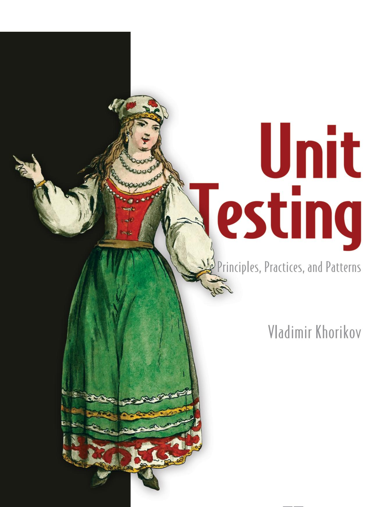
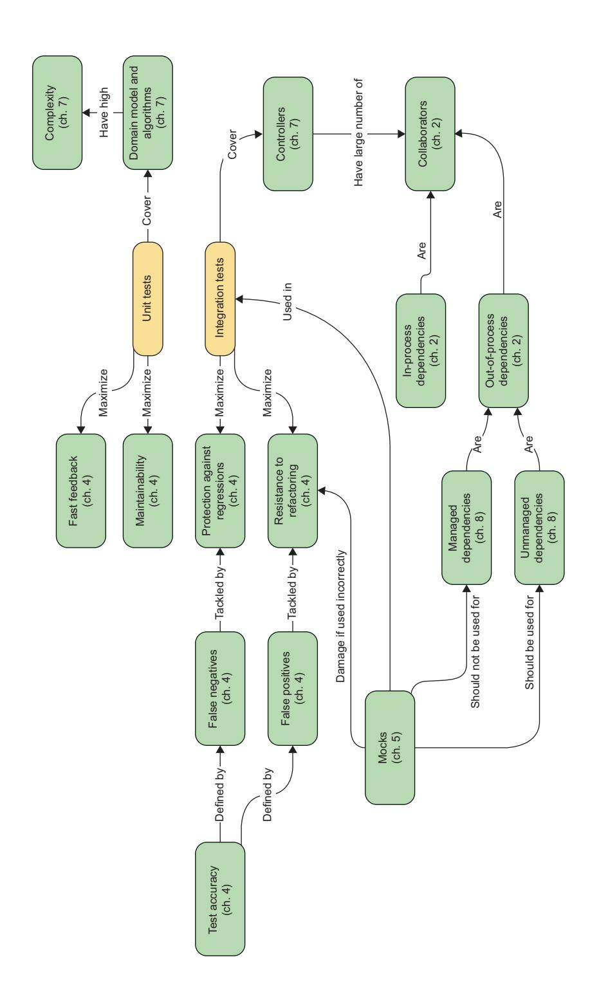

*Chapter Map*

# Unit Testing: Principles, Practices, and Patterns

VLADIMIR KHORIKOV

For online information and ordering of this and other Manning books, please visit <www.manning.com>. The publisher offers discounts on this book when ordered in quantity. For more information, please contact

Special Sales Department Manning Publications Co. 20 Baldwin Road PO Box 761 Shelter Island, NY 11964 Email: orders@manning.com

©2020 by Manning Publications Co. All rights reserved.

No part of this publication may be reproduced, stored in a retrieval system, or transmitted, in any form or by means electronic, mechanical, photocopying, or otherwise, without prior written permission of the publisher.

Many of the designations used by manufacturers and sellers to distinguish their products are claimed as trademarks. Where those designations appear in the book, and Manning Publications was aware of a trademark claim, the designations have been printed in initial caps or all caps.

Recognizing the importance of preserving what has been written, it is Manning's policy to have the books we publish printed on acid-free paper, and we exert our best efforts to that end. Recognizing also our responsibility to conserve the resources of our planet, Manning books are printed on paper that is at least 15 percent recycled and processed without the use of elemental chlorine.

Manning Publications Co. Acquisitions editor: Mike Stephens 20 Baldwin Road Development editor: Marina Michaels PO Box 761 Technical development editor: Sam Zaydel

Shelter Island, NY 11964 Review editor: Aleksandar Dragosavljevic´

Production editor: Anthony Calcara Copy editor: Tiffany Taylor ESL copyeditor: Frances Buran Proofreader: Keri Hales

Technical proofreader: Alessandro Campeis

Typesetter: Dennis Dalinnik Cover designer: Marija Tudor

ISBN: 9781617296277

Printed in the United States of America

## brief contents

| PART 1 | THE PICTURE1 BIGGER                               |
|--------|---------------------------------------------------------|
|        | 1 The goal of unit testing 3 ■                 |
|        | 2 What is a unit test? 20 ■                    |
|        | 3 The anatomy of a unit test 41 ■              |
| PART 2 | MAKING YOU65 YOUR TESTS WORK FOR         |
|        | 4 The four pillars of a good unit test 67 ■    |
|        | 5 Mocks and test fragility 92 ■                |
|        | 6 Styles of unit testing 119 ■                 |
|        | 7 Refactoring toward valuable unit tests 151 ■ |
| PART 3 | INTEGRATION TESTING183                               |
|        | 8 Why integration testing? 185 ■               |
|        | 9 Mocking best practices 216 ■                 |
|        | 10 Testing the database 229 ■                  |
| PART 4 | UNIT ANTI-PATTERNS257 TESTING                     |
|        | 11 Unit testing anti-patterns 259 ■            |

## contents

.....1

preface xiv
acknowledgments xv
about this book xvi
about the author xix
about the cover illustration xx

| PART 1 | THE BIGGER | PICTURE |   |
|--------|------------|---------|------|
|        |            |         |   |

## The goal of unit testing 3

- 1.1 The current state of unit testing 4
- 1.2 The goal of unit testing 5

  What makes a good or bad test? 7
- 1.3 Using coverage metrics to measure test suite quality 8

  Understanding the code coverage metric 9 Understanding the branch coverage metric 10 Problems with coverage metrics 12

  Aiming at a particular coverage number 15
- 1.4 What makes a successful test suite? 15

  It's integrated into the development cycle 16 It targets only the most important parts of your code base 16 It provides maximum value with minimum maintenance costs 17
- 1.5 What you will learn in this book 17

**viii** CONTENTS

|     | 20                                                                                                                                                                                                                                                                                                                                                                                                                                                                                     |
|-----|----------------------------------------------------------------------------------------------------------------------------------------------------------------------------------------------------------------------------------------------------------------------------------------------------------------------------------------------------------------------------------------------------------------------------------------------------------------------------------------|
| 2.1 | 2 What is a unit test? The definition of "unit test" 21 The isolation issue: The London take 21 ■ The isolation issue: The classical take 27                                                                                                                                                                                                                                                                                                                      |
| 2.2 | The classical and London schools of unit testing 30 How the classical and London schools handle dependencies 30                                                                                                                                                                                                                                                                                                                                                               |
| 2.3 | Contrasting the classical and London schools of unit testing 34 Unit testing one class at a time 34 ■ Unit testing a large graph of interconnected classes 35 ■ Revealing the precise bug location 36 Other differences between the classical and London schools 36                                                                                                                                                                                   |
| 2.4 | Integration tests in the two schools 37 End-to-end tests are a subset of integration tests 38                                                                                                                                                                                                                                                                                                                                                                                 |
|     | 41                                                                                                                                                                                                                                                                                                                                                                                                                                                                                     |
| 3.1 | 3 The anatomy of a unit test How to structure a unit test 42 Using the AAA pattern 42 ■ Avoid multiple arrange, act, and assert sections 43 ■ Avoid if statements in tests 44 How large should each section be? 45 ■ How many assertions should the assert section hold? 47 ■ What about the teardown phase? 47 ■ Differentiating the system under test 47 Dropping the arrange, act, and assert comments from tests 48 |
| 3.2 | Exploring the xUnit testing framework 49                                                                                                                                                                                                                                                                                                                                                                                                                                            |
| 3.3 | Reusing test fixtures between tests 50 High coupling between tests is an anti-pattern 52 ■ The use of constructors in tests diminishes test readability 52 ■ A better way to reuse test fixtures 52                                                                                                                                                                                                                                                         |
| 3.4 | Naming a unit test 54 Unit test naming guidelines 56 ■ Example: Renaming a test toward the guidelines 56                                                                                                                                                                                                                                                                                                                                                             |
| 3.5 | Refactoring to parameterized tests 58 Generating data for parameterized tests 60                                                                                                                                                                                                                                                                                                                                                                                              |
| 3.6 | Using an assertion library to further improve test readability 62                                                                                                                                                                                                                                                                                                                                                                                                                |

CONTENTS **ix**

|     | 67                                                                                                                                                                                                                                                                                                                                     |
|-----|----------------------------------------------------------------------------------------------------------------------------------------------------------------------------------------------------------------------------------------------------------------------------------------------------------------------------------------|
| 4.1 | 4 The four pillars of a good unit test Diving into the four pillars of a good unit test 68 The first pillar: Protection against regressions 68 ■ The second pillar: Resistance to refactoring 69 ■ What causes false positives? 71 ■ Aim at the end result instead of implementation details 74 |
| 4.2 | The intrinsic connection between the first two attributes 76                                                                                                                                                                                                                                                                     |
|     | Maximizing test accuracy 76 ■ The importance of false positives and false negatives: The dynamics 78                                                                                                                                                                                                                       |
| 4.3 | The third and fourth pillars: Fast feedback and maintainability 79                                                                                                                                                                                                                                                               |
| 4.4 | In search of an ideal test 80                                                                                                                                                                                                                                                                                                       |
|     | Is it possible to create an ideal test? 81 ■ Extreme case #1: End-to-end tests 81 ■ Extreme case #2: Trivial tests 82 Extreme case #3: Brittle tests 83 ■ In search of an ideal test: The results 84                                                                                                  |
| 4.5 | Exploring well-known test automation concepts 87                                                                                                                                                                                                                                                                                    |
|     | Breaking down the Test Pyramid 87 ■ Choosing between black-box and white-box testing 89                                                                                                                                                                                                                                    |
|     | 5 Mocks and test fragility 92                                                                                                                                                                                                                                                                                                       |
| 5.1 | Differentiating mocks from stubs 93                                                                                                                                                                                                                                                                                                 |
|     | The types of test doubles 93 ■ Mock (the tool) vs. mock (the test double) 94 ■ Don't assert interactions with stubs 96 Using mocks and stubs together 97 ■ How mocks and stubs relate to commands and queries 97                                                                                      |
| 5.2 | Observable behavior vs. implementation details 99                                                                                                                                                                                                                                                                                   |
|     | Observable behavior is not the same as a public API 99 ■ Leaking implementation details: An example with an operation 100 Well-designed API and encapsulation 103 ■ Leaking implementation details: An example with state 104                                                                               |
| 5.3 | The relationship between mocks and test fragility 106                                                                                                                                                                                                                                                                               |
|     | Defining hexagonal architecture 106 ■ Intra-system vs. inter system communications 110 ■ Intra-system vs. inter-system                                                                                                                                                                                                  |

*[communications: An example 111](011-chapter-5-mocks-and-test-fragility.md#page-132-0)*

**x** CONTENTS

| 5.4 | The classical vs. London schools of unit testing, revisited 114                                                                                                                                                                                                                                            |
|-----|------------------------------------------------------------------------------------------------------------------------------------------------------------------------------------------------------------------------------------------------------------------------------------------------------------------|
|     | Not all out-of-process dependencies should be mocked out 115 Using mocks to verify behavior 116                                                                                                                                                                                                         |
|     | 119                                                                                                                                                                                                                                                                                                              |
| 6.1 | 6 Styles of unit testing The three styles of unit testing 120                                                                                                                                                                                                                                              |
|     | Defining the output-based style 120 ■ Defining the state-based style 121 ■ Defining the communication-based style 122                                                                                                                                                                          |
| 6.2 | Comparing the three styles of unit testing 123                                                                                                                                                                                                                                                                |
|     | Comparing the styles using the metrics of protection against regressions and feedback speed 124 ■ Comparing the styles using the metric of resistance to refactoring 124 ■ Comparing the styles using the metric of maintainability 125 ■ Comparing the styles: The results 127 |
| 6.3 | Understanding functional architecture 128                                                                                                                                                                                                                                                                     |
|     | What is functional programming? 128 ■ What is functional architecture? 132 ■ Comparing functional and hexagonal architectures 133                                                                                                                                                           |
| 6.4 | Transitioning to functional architecture and output-based testing 135 Introducing an audit system 135 ■ Using mocks to decouple tests from the filesystem 137 ■ Refactoring toward functional architecture 140 ■ Looking forward to further developments 146                 |
| 6.5 | Understanding the drawbacks of functional architecture 146 Applicability of functional architecture 147 ■ Performance drawbacks 148 ■ Increase in the code base size 149                                                                                                                 |
|     | 151                                                                                                                                                                                                                                                                                                              |
| 7.1 | 7 Refactoring toward valuable unit tests Identifying the code to refactor 152                                                                                                                                                                                                                              |
|     | The four types of code 152 ■ Using the Humble Object pattern to split overcomplicated code 155                                                                                                                                                                                                       |
| 7.2 | Refactoring toward valuable unit tests 158                                                                                                                                                                                                                                                                    |
|     | Introducing a customer management system 158 ■ Take 1: Making implicit dependencies explicit 160 ■ Take 2: Introducing an application services layer 160 ■ Take 3: Removing complexity from the application service 163 ■ Take 4: Introducing a new                             |

CONTENTS **xi**

|        | 7.3 | Analysis of optimal unit test coverage 167                                                                                                                                                                                                                   |
|--------|-----|-----------------------------------------------------------------------------------------------------------------------------------------------------------------------------------------------------------------------------------------------------------------|
|        |     | Testing the domain layer and utility code 167 ■ Testing the code from the other three quadrants 168 ■ Should you test preconditions? 169                                                                                                   |
|        | 7.4 | Handling conditional logic in controllers 169 Using the CanExecute/Execute pattern 172 ■ Using domain events to track changes in the domain model 175                                                                                         |
|        | 7.5 | Conclusion 178                                                                                                                                                                                                                                               |
| PART 3 |     | INTEGRATION TESTING183                                                                                                                                                                                                                                       |
|        |     | 185                                                                                                                                                                                                                                                             |
|        | 8.1 | 8 Why integration testing? What is an integration test? 186                                                                                                                                                                                               |
|        |     | The role of integration tests 186 ■ The Test Pyramid revisited 187 ■ Integration testing vs. failing fast 188                                                                                                                                 |
|        | 8.2 | Which out-of-process dependencies to test directly 190 The two types of out-of-process dependencies 190 ■ Working with both managed and unmanaged dependencies 191 ■ What if you can't use a real database in integration tests? 192 |
|        | 8.3 | Integration testing: An example 193 What scenarios to test? 194 ■ Categorizing the database and the message bus 195 ■ What about end-to-end testing? 195 Integration testing: The first try 196                                   |
|        | 8.4 | Using interfaces to abstract dependencies 197 Interfaces and loose coupling 198 ■ Why use interfaces for out-of-process dependencies? 199 ■ Using interfaces for in-process dependencies 199                                         |
|        | 8.5 | Integration testing best practices 200 Making domain model boundaries explicit 200 ■ Reducing the number of layers 200 ■ Eliminating circular dependencies 202 Using multiple act sections in a test 204                          |
|        | 8.6 | How to test logging functionality 205 Should you test logging? 205 ■ How should you test logging? 207 ■ How much logging is enough? 212 How do you pass around logger instances? 212                                              |
|        | 8.7 | Conclusion 213                                                                                                                                                                                                                                               |
|        |     |                                                                                                                                                                                                                                                                 |

**xii** CONTENTS

|                | 216                                                                                                                                                                                                                                         |
|----------------|---------------------------------------------------------------------------------------------------------------------------------------------------------------------------------------------------------------------------------------------|
| 9.1            | 9 Mocking best practices Maximizing mocks' value 217                                                                                                                                                                                  |
|                | Verifying interactions at the system edges 219 ■ Replacing mocks with spies 222 ■ What about IDomainLogger? 224                                                                                                           |
| 9.2            | Mocking best practices 225                                                                                                                                                                                                               |
|                | Mocks are for integration tests only 225 ■ Not just one mock per test 225 ■ Verifying the number of calls 226 ■ Only mock types that you own 227                                                                 |
|                | 229                                                                                                                                                                                                                                         |
| 10.1           | 10 Testing the database Prerequisites for testing the database 230                                                                                                                                                                    |
|                | Keeping the database in the source control system 230 ■ Reference data is part of the database schema 231 ■ Separate instance for every developer 232 ■ State-based vs. migration-based database delivery 232 |
| 10.2           | Database transaction management 234                                                                                                                                                                                                      |
|                | Managing database transactions in production code 235 ■ Managing database transactions in integration tests 242                                                                                                                 |
| 10.3           | Test data life cycle 243                                                                                                                                                                                                                 |
|                | Parallel vs. sequential test execution 243 ■ Clearing data between test runs 244 ■ Avoid in-memory databases 246                                                                                                          |
| 10.4           | Reusing code in test sections 246                                                                                                                                                                                                        |
|                | Reusing code in arrange sections 246 ■ Reusing code in act sections 249 ■ Reusing code in assert sections 250 Does the test create too many database transactions? 251                                              |
| 10.5           | Common database testing questions 252                                                                                                                                                                                                    |
|                | Should you test reads? 252 ■ Should you test repositories? 253                                                                                                                                                                     |
| 10.6           | Conclusion 254                                                                                                                                                                                                                           |
| PART 3 UNIT | ANTI-PATTERNS257 TESTING                                                                                                                                                                                                                 |
|                | 259                                                                                                                                                                                                                                         |
| 11.1           | 11 Unit testing anti-patterns Unit testing private methods 260                                                                                                                                                                        |
|                | Private methods and test fragility 260 ■ Private methods and insufficient coverage 260 ■ When testing private methods is acceptable 261                                                                                |
| 11.2           | Exposing private state 263                                                                                                                                                                                                               |
| 11.3           | Leaking domain knowledge to tests 264                                                                                                                                                                                                    |
|                |                                                                                                                                                                                                                                             |

CONTENTS **xiii**

- [11.4 Code pollution 266](019-chapter-11-unit-testing-anti-patterns.md#page-287-0)
- [11.5 Mocking concrete classes 268](019-chapter-11-unit-testing-anti-patterns.md#page-289-0)
- [11.6 Working with time 271](019-chapter-11-unit-testing-anti-patterns.md#page-292-0) *[Time as an ambient context 271](019-chapter-11-unit-testing-anti-patterns.md#page-292-1)* ■ *[Time as an explicit](019-chapter-11-unit-testing-anti-patterns.md#page-293-0)  [dependency 272](019-chapter-11-unit-testing-anti-patterns.md#page-293-0)*

[11.7 Conclusion 273](019-chapter-11-unit-testing-anti-patterns.md#page-294-0)

*[index 275](020-index.md#page-296-0)*
